# RocketMQ 5.x Pop 消费源码深度分析

> 基于 Apache RocketMQ 5.5.0 develop 分支源码
> 覆盖: PopMessageProcessor / PopLongPollingService / PopBufferMergeService / PopReviveService / AckMessageProcessor / PopConsumerService(RocksDB KV 新路径)

---

## 目录

1. [为什么需要 Pop 消费](#一为什么需要-pop-消费)
2. [整体架构设计](#二整体架构设计)
3. [核心概念与数据结构](#三核心概念与数据结构)
4. [入口流程: PopMessageProcessor](#四入口流程-popmessageprocessor)
5. [长轮询: PopLongPollingService](#五长轮询-poplongpollingservice)
6. [Ack 路径: AckMessageProcessor 双模式](#六ack-路径-ackmessageprocessor-双模式)
7. [内存合并: PopBufferMergeService](#七内存合并-popbuffermergeservice)
8. [超时重投: PopReviveService(经典路径)](#八超时重投-popreviveservice经典路径)
9. [新路径: PopConsumerService(RocksDB KV)](#九新路径-popconsumerservicerocksdb-kv)
10. [顺序消息的 Pop 支持](#十顺序消息的-pop-支持)
11. [重试队列与优先级](#十一重试队列与优先级)
12. [消费位点管理](#十二消费位点管理)
13. [端到端流程时序图](#十三端到端流程时序图)
14. [消费语义与设计总结](#十四消费语义与设计总结)

---

## 一、为什么需要 Pop 消费

### 1.1 传统 Push/Pull 模式的痛点

4.x 的消费模型基于 **队列独占 + Rebalance**：

| 痛点 | 说明 |
|------|------|
| 消费位点由客户端管理 | 客户端要持久化 offset，升级/切换语言生态成本高 |
| Rebalance 抖动 | 消费者上下线触发队列重新分配，期间堆积/重复消费，间隔默认 20s（RebalanceService:25） |
| 队列粒度负载均衡 | 消费者数 > 队列数时必有消费者空闲；倾斜无法细粒度调节 |
| 队列被某客户端独占 | 客户端故障期间该队列消息全部停滞 |

### 1.2 Pop 的解法

Pop（取自 "POP3 取信" 的隐喻：**取走-处理-回执**）把消费状态全部上移到服务端：

- **消息可见性模型**：客户端 pop 一批消息后，服务端将这些消息标记为"不可见"（invisibleTime），消费成功 Ack 确认；超时未 Ack 则重新可见（重投）
- **无 Rebalance**：任意消费者可以 pop 任意队列（queueId 传 -1 让服务端轮转），天然支持消费者数量弹性伸缩
- **位点服务端管理**：客户端不持有 offset，崩溃重启后不丢不卡
- **消息级负载均衡**：粒度从"队列"细化到"消息"，消费者数不再受队列数限制

一句话：**Push 是"服务端推给绑定的队列主人"，Pop 是"任何消费者来服务端信箱取件，限时未归还就放回信箱"**。

---

## 二、整体架构设计

### 2.1 组件全景

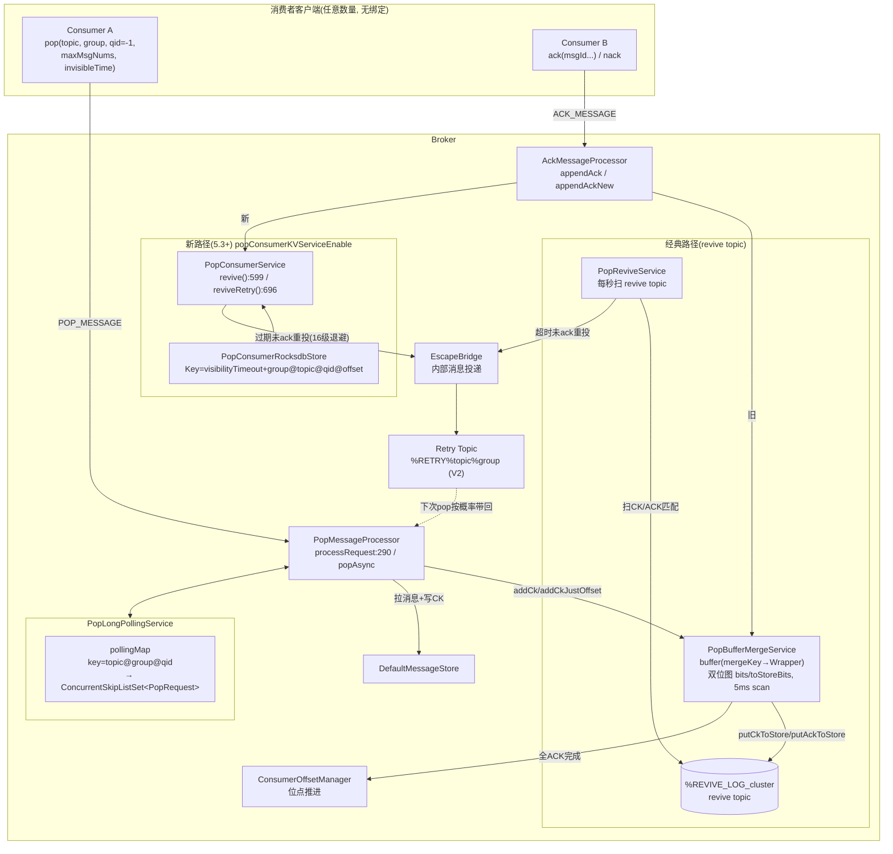

### 2.2 两条服务端状态管理路径

5.5.0 中 Pop 的"消息可见性"管理有**两套并行实现**，由开关 `popConsumerKVServiceEnable` 切换：

| | 经典路径 (revive topic) | 新路径 (RocksDB KV) |
|---|---|---|
| 状态载体 | checkpoint/ack 作为消息写入 `%REVIVE_LOG_cluster` topic | 消费记录直写 RocksDB |
| 核心类 | PopBufferMergeService + PopReviveService | PopConsumerService + PopConsumerRocksdbStore |
| 合并优化 | 内存 5ms 扫描合并 ack，减少 revive topic 写放大 | KV 原生 put/scan，无需合并层 |
| 依赖 | 复用消息存储（revive topic 占用 CommitLog） | 本地 RocksDB（`popConsumerKVServiceEnable`） |
| 引入版本 | 4.9.x / 5.0 | 5.3+ |

### 2.3 关键系统主题/常量

| 常量 | 值 | 用途 |
|------|----|------|
| revive topic | `%REVIVE_LOG_{clusterName}` | 存放 POP_CK / POP_ACK 消息（PopAckConstants.buildClusterReviveTopic:42） |
| revive group | `REVIVE_GROUP` | PopReviveService 消费 revive topic 的伪消费组 |
| POP_ORDER_REVIVE_QUEUE | 固定队列 | 顺序 Pop 的 revive 队列 |
| retry topic V1 | `%RETRY%{group}%{topic}` | 旧命名 |
| retry topic V2 | `%RETRY%{topic}%{group}` | 5.x 新命名（`enableRetryTopicV2`） |

---

## 三、核心概念与数据结构

### 3.1 PopCheckPoint（检查点）

一次 pop 返回 N 条消息，服务端同时生成**一个** checkpoint 记录这批消息的消费状态。类：`store/src/main/java/org/apache/rocketmq/store/pop/PopCheckPoint.java`。

```java
public class PopCheckPoint {
    @JSONField(name = "so") private long startOffset;      // 本批第一条消息的队列offset
    @JSONField(name = "pt") private long popTime;          // pop 时间戳
    @JSONField(name = "it") private long invisibleTime;    // 不可见时长
    @JSONField(name = "bm") private int bitMap;            // ack 位图, bit i = 第 i 条是否已ack
    @JSONField(name = "n")  private byte num;              // 本批消息条数
    @JSONField(name = "q")  private int queueId;
    @JSONField(name = "t")  private String topic;
    @JSONField(name = "c")  private String cid;            // consumerGroup
    @JSONField(name = "ro") private long reviveOffset;     // 该CK在revive topic中的offset
    @JSONField(name = "bn") private String brokerName;
    @JSONField(name = "rp") private List<Integer> queueOffsetDiff; // 各消息相对startOffset的差(新版)
    @JSONField(name = "sp") private String rePutTimes;     // 重投次数

    public long getReviveTime() { return popTime + invisibleTime; }  // 重新可见时刻
    public int indexOfAck(long ackOffset);   // 消息offset → 位图下标(兼容新旧格式)
    public long ackOffsetByIndex(byte index);// 位图下标 → 消息offset
}
```

要点：

- **一个 CK 管一批消息**：批量 ack 只需翻位图，状态极小（数十字节）
- **reviveTime = popTime + invisibleTime**：超过该时刻仍未全 ack → 重投
- **queueOffsetDiff**：新版本里消息 offset 不再连续（pop 结果经 tag 过滤），用差值列表定位

### 3.2 AckMsg

`store/.../pop/AckMsg.java`——客户端每 ack 一条消息，服务端生成一个 AckMsg 用于与 CK 对账：

```java
public class AckMsg {
    private long ackOffset;      // 被ack消息的队列offset
    private long startOffset;   // 所属CK的起始offset
    private long popTime;       // 原pop时间(对账主键的一部分)
    private String consumerGroup, topic, brokerName;
    private int queueId;
}
```

### 3.3 PopCheckPointWrapper

`broker/.../processor/PopBufferMergeService.java` 内部类——CK 的内存包装，是**双位图机制**的核心：

```java
public class PopCheckPointWrapper {
    private final int reviveQueueId;
    private volatile long reviveQueueOffset; // -1=未落revive topic, >=0=已落, MAX=正在落
    private final PopCheckPoint ck;
    private final AtomicInteger bits;        // 内存实时ack位图(含未落盘)
    private final AtomicInteger toStoreBits; // 已落盘到revive topic的ack位图
    private final long nextBeginOffset;      // 本批全部完成后可提交的位点
    private final String lockKey;            // topic@cid@queueId
    private final String mergeKey;           // topic+cid+queueId+startOffset+popTime+brokerName
    private final boolean justOffset;        // true=仅推进位点不真正写CK(顺序消费)
    private volatile boolean ckStored;       // CK是否已落revive topic
}
```

### 3.4 位图状态机

`bits` 与 `toStoreBits` 两个 int 位图刻画每条消息的状态：

| bits | toStoreBits | 状态 |
|------|-------------|------|
| 0 | 0 | 未 ack |
| 1 | 0 | 已 ack（内存），**待写 revive topic** |
| 1 | 1 | 已 ack 且已持久化 |

两个判断方法（PopBufferMergeService）：

```java
// 本批消息是否全部ack(内存视角) → 可以推进位点
boolean isCkDone(w)  { for i in [0,num): getBit(w.bits, i)==1 全部成立 }

// 是否"全部ack且全部落盘" → 可以安全移除wrapper
// XOR=0 表示 bits 与 toStoreBits 完全一致
boolean isCkDoneForFinish(w) {
    int bits = w.getBits().get() ^ w.getToStoreBits().get();
    for i in [0,num): getBit(bits,i)==0 全部成立
}
```

---

## 四、入口流程: PopMessageProcessor

类：`broker/src/main/java/org/apache/rocketmq/broker/processor/PopMessageProcessor.java`（1127 行）。

### 4.1 processRequest() 主流程（:290）

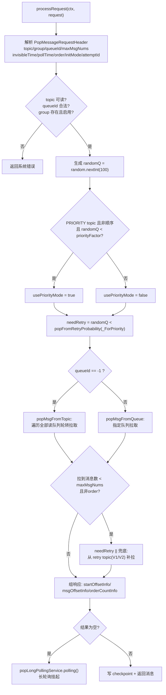

关键细节：

**① 每次请求按概率混入重试消息**（:511-519）：

```java
int randomQ = random.nextInt(100);
boolean usePriorityMode = TopicMessageType.PRIORITY.equals(topicConfig.getTopicMessageType())
    && !requestHeader.isOrder()
    && randomQ < subscriptionGroupConfig.getPriorityFactor();   // 默认100
boolean needRetry = randomQ < (usePriorityMode
    ? brokerConfig.getPopFromRetryProbabilityForPriority()       // 优先模式默认0
    : brokerConfig.getPopFromRetryProbability());                // 普通模式默认10
```

即普通模式下约有 **10%** 的 pop 请求先去 retry topic 捞重试消息，保证重试消息及时被消费。

**② queueId=-1 的轮转**（popMsgFromTopic）：

```java
for (int i = 0; i < topicConfig.getReadQueueNums(); i++) {
    int index = (brokerController.getBrokerConfig().isPriorityOrderAsc()
        ? topicConfig.getReadQueueNums() - 1 - i : i) + randomQ;   // 随机起点轮转
    int queueId = index % topicConfig.getReadQueueNums();
    getMessageFuture = getMessageFuture.thenCompose(restNum ->
        popMsgFromQueue(topic, attemptId, isRetry, ..., queueId, restNum, ...));
}
```

- `randomQ` 作为随机起点打散热点，实现**服务端轮询负载均衡**
- `priorityOrderAsc=true`（默认）时优先遍历高编号队列 = 优先级模式（qid 越大优先级越高）

**③ reviveQid 分配**（:493-498）：

```java
int reviveQid;
if (requestHeader.isOrder()) {
    reviveQid = KeyBuilder.POP_ORDER_REVIVE_QUEUE;   // 顺序消费固定队列
} else {
    reviveQid = (int) Math.abs(ckMessageNumber.getAndIncrement()
        % brokerConfig.getReviveQueueNum());         // 原子递增取模打散
}
```

### 4.2 popMsgFromQueue: 拉取并生成检查点

每次从某队列 pop 的栈上流程：

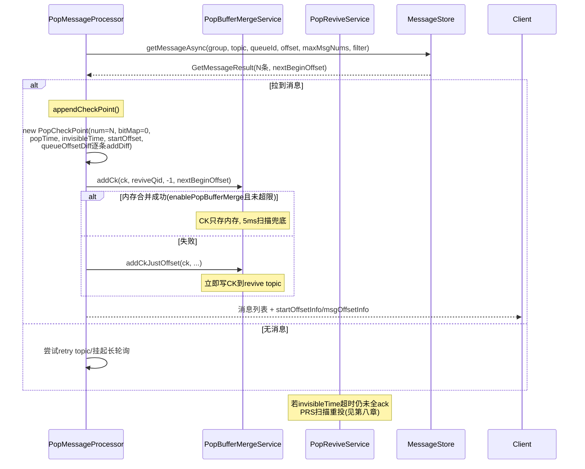

`appendCheckPoint()` 的核心（PopMessageProcessor）：

```java
PopCheckPoint ck = new PopCheckPoint();
ck.setBitMap(0);
ck.setNum((byte) result.getMessageMapedList().size());
ck.setPopTime(popTime);
ck.setInvisibleTime(requestHeader.getInvisibleTime());
ck.setStartOffset(offset);
for (Long msgQueueOffset : result.getMessageQueueOffset()) {
    ck.addDiff((int) (msgQueueOffset - offset));   // 记录偏移差, 支持过滤后不连续
}
boolean ok = popBufferMergeService.addCk(ck, reviveQid, -1, result.getNextBeginOffset());
if (!ok) {
    return popBufferMergeService.addCkJustOffset(ck, reviveQid, -1, result.getNextBeginOffset());
}
```

> 注意"不可见"的真正含义：**pop 时不修改消息存储，消息依然在队列里**，只是 pop 的起始读位点（consume offset）被推进到本批末尾。真正的隔离由"位点 + checkpoint 位图 + 超时重投"三者共同实现——这是一种**逻辑删除**式设计，避免物理移动消息。

### 4.3 响应协议

Pop 响应携带三个关键信息，客户端 Ack 时要原样带回：

| 字段 | 含义 |
|------|------|
| `startOffsetInfo` | 每个队列本次 pop 的起始 offset（Map<qid, offset>） |
| `msgOffsetInfo` | 每个队列实际返回的消息 offset 列表 |
| `orderCountInfo` | 顺序消费时每队列的计数 |

Ack 请求（AckMessageRequestHeader）则携带 `topic/queueId/offset/popTime/consumerGroup/brokerName`——popTime+startOffset 定位到 CK，offset 定位到位图下标。

---

## 五、长轮询: PopLongPollingService

类：`broker/.../longpolling/PopLongPollingService.java`。Pop 模式下消费者不需要 Rebalance，但也需要"有消息时尽快拿到"，于是复用长轮询。

### 5.1 挂起（polling, :309）

```java
// pollTime 由客户端传入(默认5s级别)
if (requestHeader.getPollTime() <= 0 || isStopped()) return NOT_POLLING;
PopRequest request = new PopRequest(remotingCommand, ctx, expired, subscriptionData, messageFilter);
String key = KeyBuilder.buildPollingKey(topic, consumerGroup, queueId);  // topic@group@qid
ConcurrentSkipListSet<PopRequest> queue =
    pollingMap.computeIfAbsent(key, k -> new ConcurrentSkipListSet<>(PopRequest.COMPARATOR));
if (queue.add(request)) {           // 按 bornTime 排序
    remotingCommand.setSuspended(true);
    return POLLING_SUC;             // 挂起成功, processRequest返回null
}
```

### 5.2 唤醒（notifyMessageArriving, :227）

新消息写入（`NotifyMessageArrivingListener`）或 Ack 释放位点后触发：

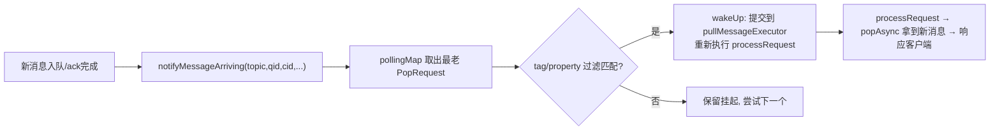

与 Pull 长轮询（PullRequestHoldService）的差异：Pop 的挂起 key 额外含 **consumerGroup**（同组多个消费者排队），且唤醒后走 `processRequest` 完整重算（含 retry 概率、检查点写入）。

---

## 六、Ack 路径: AckMessageProcessor 双模式

类：`broker/.../processor/AckMessageProcessor.java`（571 行）。

### 6.1 路由分发（:164-180）

```java
if (brokerController.getBrokerConfig().isPopConsumerKVServiceEnable()) {
    appendAckNew(requestHeader, ...);   // 新路径: PopConsumerService.ackAsync → RocksDB
} else {
    appendAck(requestHeader, ...);      // 经典路径: PopBufferMergeService
}
```

### 6.2 经典路径 appendAck 的三级回退

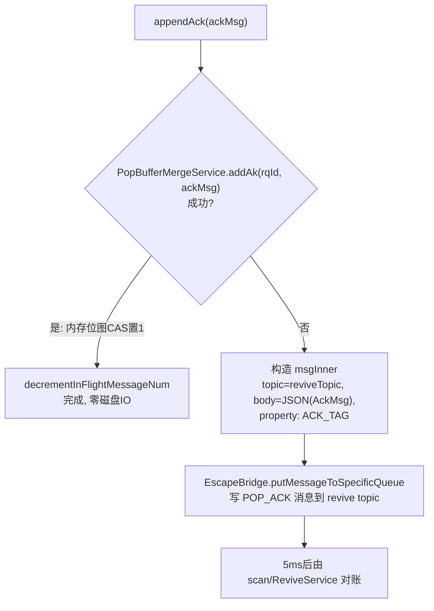

`addAk` 失败的常见原因：CK 已从内存 buffer 移除（超时被刷盘）、broker 非 master、buffer 超 `popCkMaxBufferSize`。此时直接把 AckMsg 作为消息落到 revive topic，保证 ack 不丢。

### 6.3 顺序消费的 Ack

`ackOrderly`：顺序消息的 ack 同时推进 ConsumerOffsetManager 的位点并更新 `ConsumerOrderInfoManager`（记录队列内消费次序、阻塞状态），随后唤醒挂起的 pop 长轮询。 nack（`RECALL`/`ackNegative`）时按 ConsumerOrderInfoManager 的位点回退并阻塞该队列后续消息。

---

## 七、内存合并: PopBufferMergeService

类：`broker/.../processor/PopBufferMergeService.java`。设计目标：**把高频的 CK/ACK 小消息在内存合并，尽量不打穿到 revive topic**。

### 7.1 核心数据结构

```java
// mergeKey = topic+cid+queueId+startOffset+popTime+brokerName
ConcurrentHashMap<String, PopCheckPointWrapper> buffer;
// lockKey = topic@cid@queueId → 待提交位点的wrapper队列(保序)
ConcurrentHashMap<String, QueueWithTime<PopCheckPointWrapper>> commitOffsets;
long interval = 5; // ms, scan循环周期
```

### 7.2 关键方法

**addCk（pop 时入队）**：校验 master、buffer 未超 `popCkMaxBufferSize`、reviveTime 距今 > `popCkStayBufferTimeOut`，满足才驻留内存；否则走 `addCkJustOffset`（只推进位点、CK 直接落盘）。

**addAk（ack 时标记）**：

```java
// 定位wrapper: mergeKey
PopCheckPointWrapper wrapper = buffer.get(mergeKey);
if (wrapper == null) return false;                    // CK已刷盘 → 走落盘路径
markBitCAS(wrapper.getBits(), index);                 // 内存位图 CAS 置1
if (isCkDone(wrapper)) {                              // 本批全部ack
    markBitCAS(wrapper.getToStoreBits(), ...);        // 对齐
    addToCommitOffset(wrapper);                       // 进入位点提交队列
}
return true;
```

`markBitCAS` 是无锁自旋 CAS：

```java
private void markBitCAS(AtomicInteger setBits, int index) {
    while (true) {
        int bits = setBits.get();
        if (DataConverter.getBit(bits, index)) break;          // 已标记
        if (setBits.compareAndSet(bits, DataConverter.setBit(bits, index, true))) break;
    }
}
```

### 7.3 scan()：5ms 扫描循环

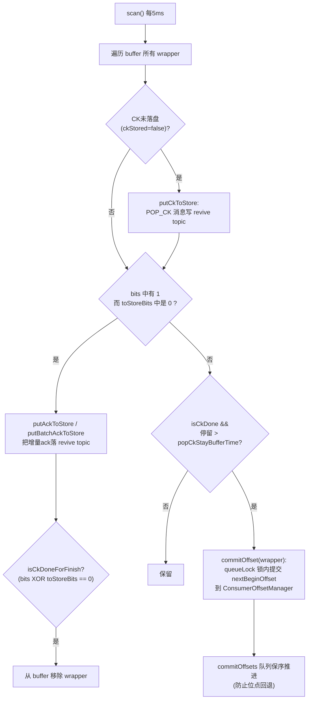

位点提交（:commitOffset）：

```java
if (queueLockManager.tryLock(lockKey)) {
    long offset = offsetManager.queryOffset(cid, topic, queueId);
    if (wrapper.getNextBeginOffset() > offset) {   // 只前进不回退
        offsetManager.commitOffset(getServiceName(), cid, topic, queueId,
            wrapper.getNextBeginOffset());
    }
    queueLockManager.unLock(lockKey);
}
```

### 7.4 效果

一笔"pop 32 条 → 全部 ack"的完整生命周期，**在内存合并命中时**只需：1 次 addCk + 32 次 CAS + 1 次位点提交——revive topic 上一条消息都不写（CK 在全量 ack 完成前来不及落盘就被移除）。只有慢消费（ack 距 pop 超过 `popCkStayBufferTime`）才退化到落盘对账。

---

## 八、超时重投: PopReviveService（经典路径）

类：`broker/.../processor/PopReviveService.java`。**兜底者角色**：任何消息只要超过 `reviveTime = popTime + invisibleTime` 仍未 ack，就会被它捞出来重投。

### 8.1 整体流程

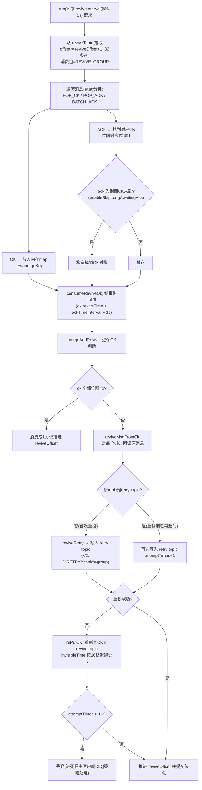

### 8.2 关键机制解读

**① CK/ACK 对账 = 事件溯源**。revive topic 是一个纯追加日志，PopReviveService 用它重建每个 CK 的 ack 位图。即使 broker 重启，从 `ConsumerOffsetManager.queryOffset(REVIVE_GROUP, reviveTopic, qid)` 恢复 reviveOffset 继续对账即可，天然具备可恢复性。

**② 重投目标**（reviveRetry, :107-155）：

```java
if (KeyBuilder.isPopRetryTopicV1(topic)) { ... }
else {
    msgInner.setTopic(KeyBuilder.buildPopRetryTopic(
        realTopic, consumerGroup, brokerConfig.isEnableRetryTopicV2()));
}
msgInner.setBody(oriMsg.getBody());
// 保留属性, PROPERTY_RETRY_TOPIC 指回原topic, attemptTimes 递增
brokerController.getEscapeBridge().putMessageToSpecificQueue(msgInner);
```

- 重投不是把消息放回原队列（原位点已前进，放回去会乱序且打乱位点），而是**发到 retry topic**，再由 pop 请求按概率（第四章 randomQ）捞回
- `attemptTimes` 通过消息属性 `PROPERTY_POP_ATTEMPTS`（近似）跨重投累计，驱动退避

**③ 16 级退避**（PopConsumerService / PopReviveService 共用思想）：

```java
// broker/pop/PopConsumerService.java:77-78
int[] REWRITE_INTERVALS_IN_SECONDS =
    {10, 30, 60, 120, 180, 240, 300, 360, 420, 480, 540, 600, 1200, 1800, 3600, 7200};
long backoff = 1000L * REWRITE_INTERVALS_IN_SECONDS[
    Math.min(length - 1, record.getAttemptTimes())];   // :627-628
```

第 1 次重投延迟 10s，逐级递增到第 16 次 2h——重投风暴与快速失败重试的折中。

**④ revive topic 的 offset 推进很保守**：只有当一段 revive 消息全部对账完成（包括重投成功）才提交位点，保证崩溃后最多重复对账、绝不漏对账。

---

## 九、新路径: PopConsumerService（RocksDB KV）

5.3+ 引入，开关 `popConsumerKVServiceEnable=true` 时取代 revive topic 链路。类：`broker/src/main/java/org/apache/rocketmq/broker/pop/`（独立 pop 包，14+ 类）。

### 9.1 核心组件

| 类 | 职责 |
|----|------|
| `PopConsumerService` | 服务主体：处理 pop 请求（popAsync:355）、ack（ackAsync）、超时扫描（revive:599）、重投（reviveRetry:696） |
| `PopConsumerRecord` | 消费记录（popTime/visibilityTimeout/attemptTimes/retryType...），提供 Key 编码（getKeyBytes:107-118） |
| `PopConsumerRocksdbStore` | RocksDB 封装，实现 `PopConsumerKVStore` 接口（put/get/scanExpired/iterate） |
| `PopConsumerKVStore` | KV 存储抽象，未来可替换其他引擎 |

### 9.2 Key 设计（PopConsumerRecord.getKeyBytes）

```
[visibilityTimeout:8B][groupId]['@'][topicId]['@'][queueId:4B]['@'][offset:8B]
```

**Key 以 visibilityTimeout（= popTime + invisibleTime）开头**是精妙设计：RocksDB 按 Key 字典序排列，过期时间升序即记录升序——扫描过期记录只需 `iterateLowerBound(now)` 顺序读前缀，无需全库扫描、无需 TTL 线程：

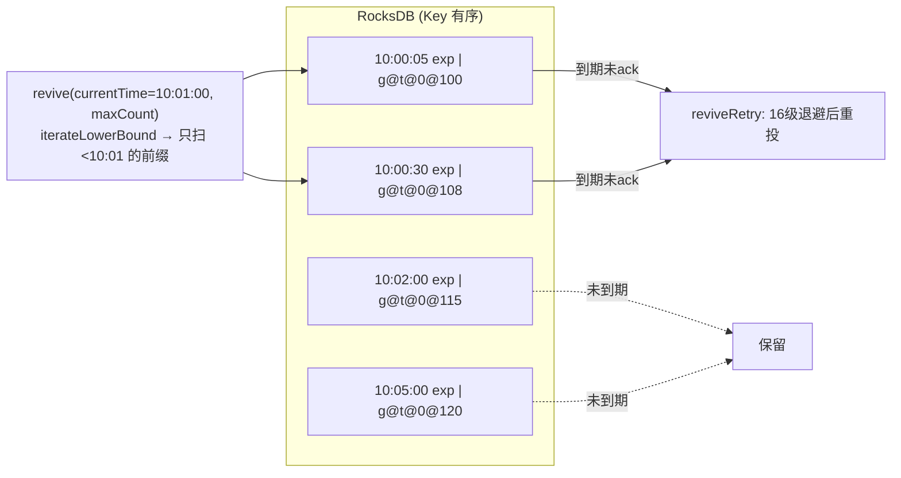

### 9.3 流程

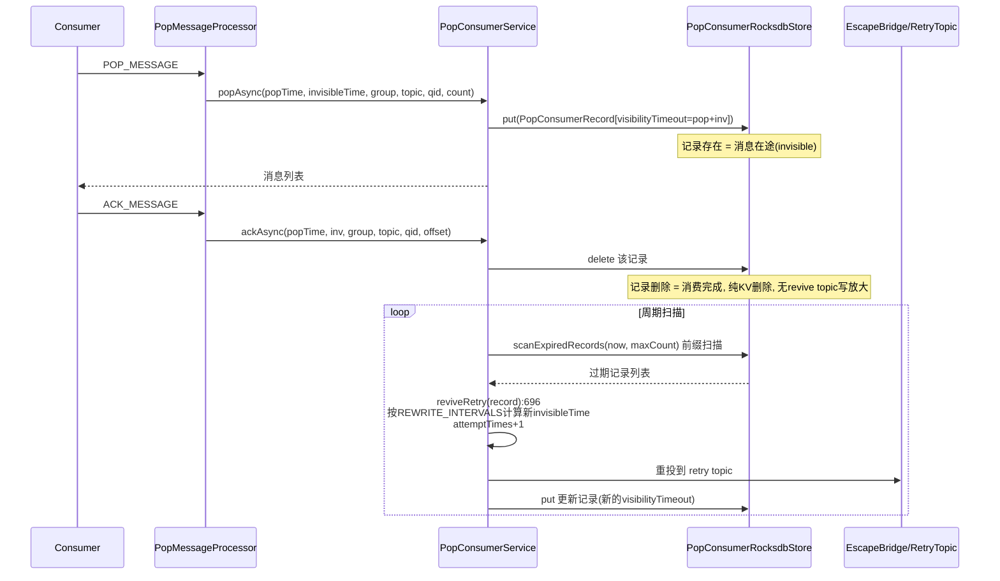

### 9.4 与经典路径的对比

| 维度 | 经典(revive topic) | 新(RocksDB KV) |
|------|--------------------|----------------|
| ack 成本 | 内存命中: 0 IO；慢路径: 写一条 revive 消息 | 一次 KV delete |
| 超时发现 | ReviveService 每秒拉 revive topic 对账 | KV 前缀顺序扫描 |
| 写放大 | CK+每条ACK都可能成消息进 CommitLog | 无消息化，纯 KV |
| 崩溃恢复 | 重放 revive topic | RocksDB 自身持久化 |
| 依赖 | 无 | 本地 RocksDB |

---

## 十、顺序消息的 Pop 支持

Pop 模式同样支持 FIFO（gRPC 客户端 `ConsumeOrderly`），关键差异：

1. **reviveQid 固定**：`KeyBuilder.POP_ORDER_REVIVE_QUEUE`（:493），所有顺序 CK 集中，且顺序消息**不靠超时重投**保序
2. **justOffset 模式**：顺序消费的 CK 以 `addCkJustOffset` 添加——**只推进位点、不真正依赖 revive 重投**（重投会破坏顺序）
3. **ConsumerOrderInfoManager**：记录每个队列内"哪个 consumer 正在消费到哪个 offset"，pop 时检查队列是否被阻塞（:734-739），被阻塞则跳过该队列
4. **queueLockManager**：`popMsgFromQueue` 前对 `topic@group@qid` 加锁（:696-708），保证同一队列同一时刻只被一个消费者 pop
5. **Ack 推进位点**：`ackOrderly` 直接 commitOffset 并解锁后续消息、唤醒长轮询；nack 则回退位点并阻塞队列

---

## 十一、重试队列与优先级

### 11.1 retry topic 演进

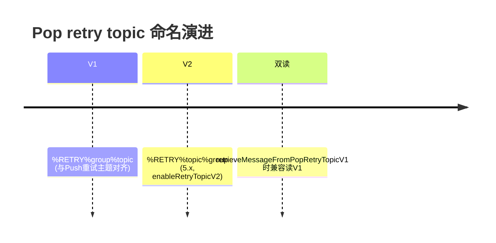

代码（PopMessageProcessor）：

```java
String retryTopic = KeyBuilder.buildPopRetryTopic(topic, group,
    brokerConfig.isEnableRetryTopicV2());
// 首次拉取不足时补拉重试
if (getMessageResult.size() < maxMsgNums && !order) {
    getMessageFuture = popMsgFromTopic(retryTopic, true, ...);
}
```

### 11.2 优先级与 Pop（5.4+）

优先队列复用 Pop 的轮询框架（详见《RocketMQ优先队列源码深度分析.md》）：

- topic 的 queueId 即优先级（`priorityOrderAsc=true` 默认 qid 大 = 优先级高）
- `popMsgFromTopic` 的遍历顺序由 `priorityOrderAsc` 控制（第四章 ②）
- `priorityFactor`（group 级配置，默认 100）：PRIORITY topic 的请求按比例进入优先模式
- `popFromRetryProbabilityForPriority`（默认 0）：优先模式下几乎不去重试队列，避免低优先级重试消息稀释高优先级流量
- `useSeparateRetryQueue` + `getRetryQueueId`（PopConsumerService:761）：重试消息保留原 queueId = 保留原优先级

### 11.3 重试等级 vs 退避

- **Push/4.x 重试**：18 级固定延迟级别（`messageDelayLevel`）
- **Pop 重试**：16 级自定义退避 `REWRITE_INTERVALS`（10s→2h），且首投延迟 = invisibleTime 本身

---

## 十二、消费位点管理

Pop 的位点（ConsumerOffsetManager，key = `topic@group` → `{queueId: offset}`）语义变为 **"下一个可 pop 的起始位点"**，与 Push 的"已消费位点"不同：

| 场景 | 推进方式 | 代码位置 |
|------|----------|----------|
| pop 时（乐观） | pop 即推进到本批末尾 nextBeginOffset（消息已逻辑投出） | PopBufferMergeService.addCk 时 addToCommitOffset |
| 全量 ack（确认） | scan 循环中 commitOffset（lockKey 锁内单调递增） | PopBufferMergeService.scanCommitOffset:136 |
| 顺序消费 | ackOrderly 直接 commitOffset | AckMessageProcessor |
| RocksDB 路径 | popAsync 时推进 | PopConsumerService |
| 超时重投 | 位点不回退（重投走 retry topic，原位点保持前进） | — |

**位点只前进不回退**是 Pop 位点的核心不变式；消费失败语义由 retry topic 承接，而非回退位点。

---

## 十三、端到端流程时序图

### 13.1 正常消费（内存合并命中）

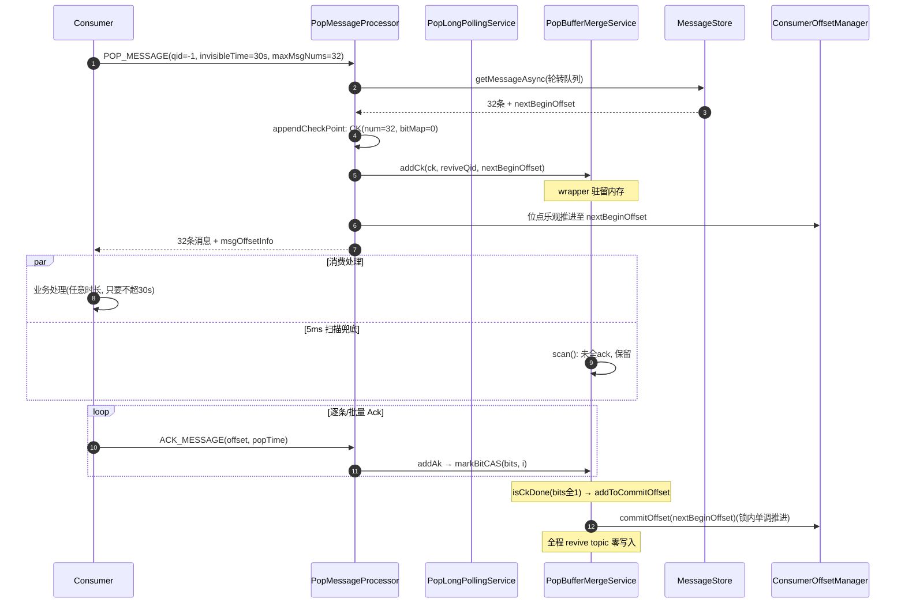

### 13.2 超时未 Ack 重投（经典路径）

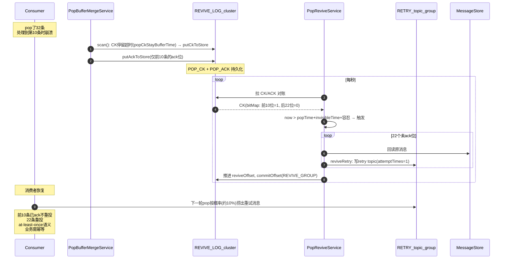

---

## 十四、消费语义与设计总结

### 14.1 消费语义：At-Least-Once

重投不可能完全避免"ack 在途而重投已发出"的竞态，Pop 是标准 **at-least-once**：

- 重复来源：ack 消息丢失/延迟、broker 主备切换、revive 对账窗口重叠
- 幂等责任在客户端（业务幂等键 / `msgId` 去重）
- 相比 Push 模式（Rebalance 导致的批量重复），Pop 的重复是**消息级、低频、可预期**的

### 14.2 设计模式总结

| 模式 | 应用 |
|------|------|
| **检查点+位图** | 一个 CK 管一批消息，ack 状态压缩为 int 位图，CAS 无锁更新 |
| **内存合并 + 落盘兜底** | PopBufferMergeService 5ms 扫描，快路径零 IO，慢路径退化为消息对账 |
| **事件溯源日志** | revive topic 纯追加，崩溃后重放即恢复，与 CommitLog 设计哲学同源 |
| **时间有序 KV** | 新路径以 visibilityTimeout 为 Key 前缀，过期扫描退化为前缀顺序读 |
| **逻辑删除** | pop 不物理移动消息，只推位点；失败语义外包给 retry topic |
| **概率混流** | randomQ 一次随机数同时驱动：重试捞取概率、优先模式选择、队列轮转起点 |

### 14.3 关键源码索引

| 功能 | 类 | 位置 |
|------|----|------|
| Pop 入口 | PopMessageProcessor | processRequest:290, popAsync, appendCheckPoint |
| 长轮询 | PopLongPollingService | polling:309, notifyMessageArriving:227 |
| Ack 入口 | AckMessageProcessor | appendAck/appendAckNew:164-180, ackOrderly |
| 内存合并 | PopBufferMergeService | addCk:490, addAk/markBitCAS, scan, isCkDone/isCkDoneForFinish |
| 超时重投 | PopReviveService | mergeAndRevive:509, reviveMsgFromCk:553, reviveRetry:107-155, rePutCK:605 |
| 检查点 | PopCheckPoint (store) | 字段序列化 so/pt/it/bm/n..., getReviveTime |
| Ack 结构 | AckMsg (store) | ackOffset/startOffset/popTime |
| KV 新路径 | PopConsumerService (broker/pop) | popAsync:355, revive:599, reviveRetry:696, REWRITE_INTERVALS:77 |
| KV 存储 | PopConsumerRocksdbStore / PopConsumerRecord | Key 编码 getKeyBytes:107-118 |
| 常量 | PopAckConstants | revive topic 命名:42, buildClusterReviveTopic |
| 优先级 | PopMessageProcessor + PopConsumerService | priorityFactor:511, getRetryQueueId:761 |

### 14.4 相关配置

| 配置 | 默认 | 说明 |
|------|------|------|
| `enablePopBufferMerge` | true | 内存合并开关 |
| `popCkMaxBufferSize` | 100000 | 内存 buffer 上限 |
| `popCkStayBufferTime` | 5min | CK 内存驻留时长（超过必落盘） |
| `popCkStayBufferTimeOut` | 3s | reviveTime 距今小于该值不进内存 |
| `popConsumerKVServiceEnable` | false | RocksDB KV 新路径 |
| `reviveInterval` | 1s | ReviveService 扫描周期 |
| `reviveQueueNum` | 8(级别) | revive topic 使用队列数 |
| `popFromRetryProbability` | 10 | 每次请求先捞 retry 的概率% |
| `popFromRetryProbabilityForPriority` | 0 | 优先模式下同上 |
| `enableRetryTopicV2` | - | V2 重试主题命名 |
| `defaultPopShareQueueNum` | - | Pop 共享队列数（Assignment 用） |

> 客户端侧：`invisibleTime` 是 Pop 最重要的调优参数——过短则正常慢消费被重投（重复放大），过长则消费者崩溃后消息恢复慢。经验值为最大消费处理时长的 3 倍以上。
