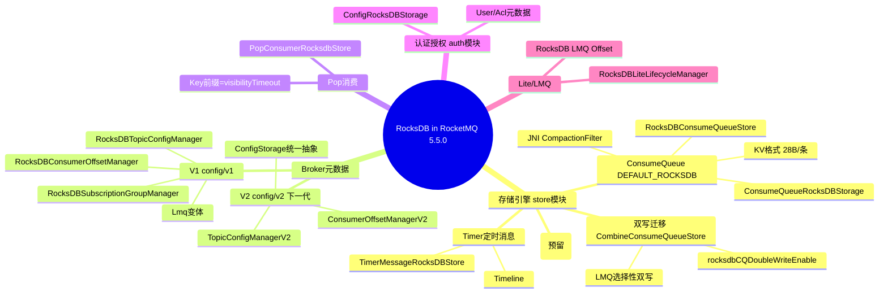
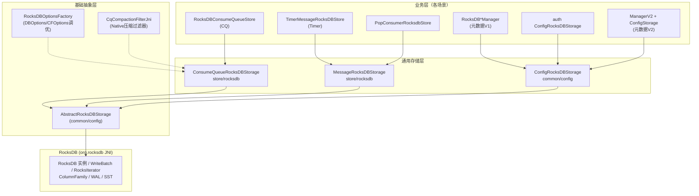
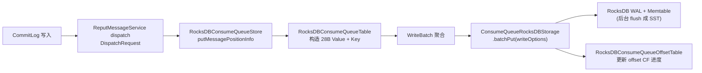
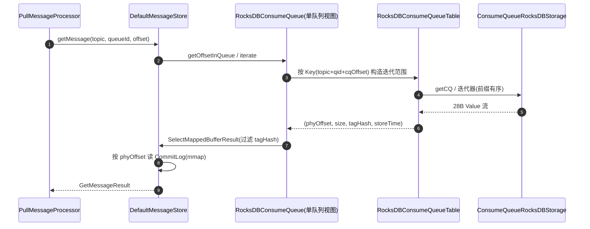
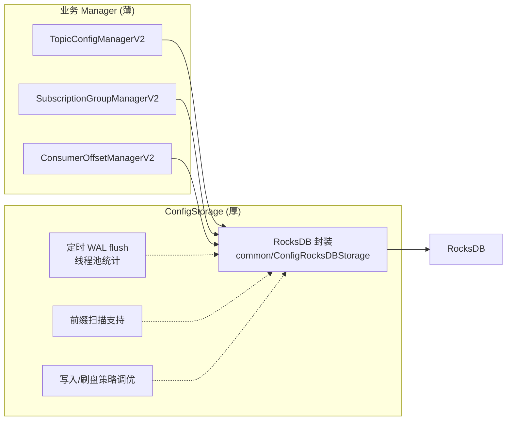
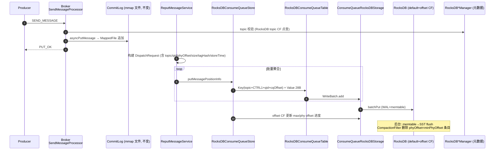
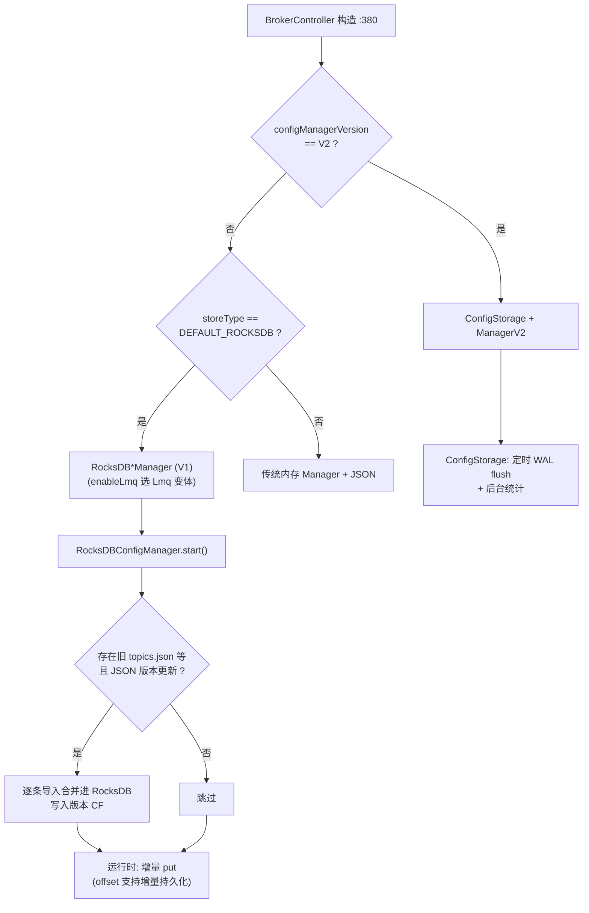
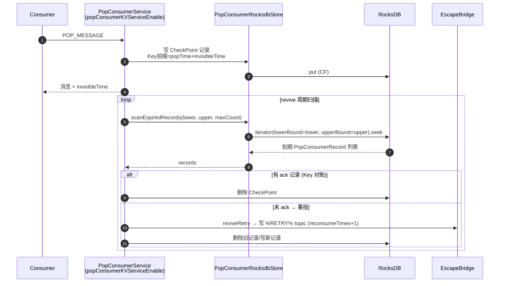
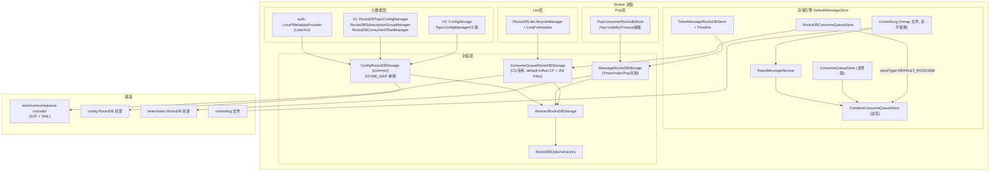

# RocketMQ 5.x RocksDB 整合源码深度分析

> 基于 Apache RocketMQ 5.5.0 (develop 分支) 源码，所有行号可直接跳转核对。
>
> RocksDB 在 RocketMQ 5.x 中已从"单点优化"演变为**贯穿存储引擎、Broker 元数据、Pop 消费、认证授权、Lite 特性的一条技术主线**，社区称之为"RocksDB 全家桶"。

---

## 目录

1. [为什么引入 RocksDB](#一为什么引入-rocksdb)
2. [RocksDB 使用全景图（用了什么、用在哪）](#二rocksdb-使用全景图)
3. [整合架构：三层封装体系](#三整合架构三层封装体系)
4. [场景一：RocksDB ConsumeQueue（存储引擎）](#四场景一rocksdb-consumequeue存储引擎)
5. [场景二：Timer 定时消息 RocksDB 化](#五场景二timer-定时消息-rocksdb-化)
6. [场景三：Broker 元数据（V1 RocksDB*Manager 与 V2 ConfigStorage）](#六场景三broker-元数据v1-rocksdbmanager-与-v2-configstorage)
7. [场景四：Pop 消费 KV 存储](#七场景四pop-消费-kv-存储)
8. [场景五：认证授权元数据](#八场景五认证授权元数据)
9. [场景六：Lite/LMQ 生命周期](#九场景六litelmq-生命周期)
10. [端到端流程与时序图](#十端到端流程与时序图)
11. [整体架构图](#十一整体架构图)
12. [配置项汇总与使用方法](#十二配置项汇总与使用方法)
13. [设计权衡与源码走读要点](#十三设计权衡与源码走读要点)

---

## 一、为什么引入 RocksDB

### 1.1 RocketMQ 的两类"文件痛点"

**痛点 1：海量队列的文件系统开销（存储引擎侧）**

文件版 ConsumeQueue 每队列一组 mmap 文件：

| 问题 | 触发条件 |
|------|---------|
| 文件句柄耗尽 | 队列数 × 8（每文件 30 万条/文件）+ IndexFile |
| mmap 虚拟地址碎片 | 32 位/大堆场景 |
| 小文件随机读 | 页缓存命中率随队列数下降 |
| 百万级 LMQ/ LiteTopic | 虚拟 CQ 目录数失控（这正是 LiteTopic 的前置依赖） |
| 队列扩容/删除代价 | 建文件、预热、删除目录 |

**痛点 2：元数据全量 JSON 持久化（Broker 侧）**

传统 ConfigManager（v0）模式：内存 Map + 定时全量序列化写 JSON 文件：

- `consumerOffset.json`：消费组 × 队列的 offset 表，十万级条目时**每次全量序列化 + 整文件重写**
- flush 期间加锁拷贝大 Map，stop-the-world 式抖动
- 无增量语义、无 WAL，崩溃丢最后 flush 间隔内的数据

### 1.2 RocksDB 的对症下药

RocksDB（LSM-Tree 嵌入式 KV）特性与痛点的对应：

| RocksDB 特性 | 化解的痛点 |
|-------------|-----------|
| 单实例支持海量 Key | 文件句柄/mmap 问题（百万队列不再是问题） |
| LSM 追加写 + WriteBatch | 元数据增量写、批量组提交 |
| WAL | 元数据崩溃一致性 |
| 前缀迭代（iterate lower/upper bound） | Pop 按可见性超时前缀扫描 |
| ColumnFamily | 多类数据一实例隔离 |
| Compaction Filter | CQ 过期数据随压缩物理删除 |
| JSON Value + 二进制 Value 皆可 | 简单场景零序列化改造 |

---

## 二、RocksDB 使用全景图



**两大触发开关（互不依赖）**：

1. `MessageStoreConfig.storeType = DEFAULT_ROCKSDB` → 存储引擎换 RocksDB CQ（同时联动激活 Broker 元数据的 RocksDB V1 版，见 BrokerController:385-388）
2. `BrokerConfig.configManagerVersion = V2` → 仅元数据走下一代 ConfigStorage（不换存储引擎）

---

## 三、整合架构：三层封装体系

RocketMQ 没有让业务代码直接操作 `org.rocksdb.*`，而是做了三层封装：



### 3.1 AbstractRocksDBStorage（基础抽象，common/config）

所有 RocksDB 封装的共同基类，职责：

- `postLoad()` 模板方法：建目录 → initOptions → 构造 ColumnFamilyDescriptor 列表 → `open(cfDescriptors)` 打开实例（子类重写）
- 统一持有 `writeOptions / totalOrderReadOptions / compactRangeOptions / cfHandles`
- 封装 `get / multiGet / batchPut / manualCompaction / flush` 原语
- **`STORE_MAP` 单例注册表**：同一 dbPath 只允许一个打开实例（`ConfigRocksDBStorage` 维护），防止 Broker 内多处重复 open 同一路径造成锁冲突

### 3.2 ConsumeQueueRocksDBStorage（用户重点关注的类，store/rocksdb）

为 ConsumeQueue 场景定制的存储封装（全文 180 行，逻辑集中清晰）：

```java
// store/src/main/java/org/apache/rocketmq/store/rocksdb/ConsumeQueueRocksDBStorage.java
public class ConsumeQueueRocksDBStorage extends AbstractRocksDBStorage {
    public static final byte[] OFFSET_COLUMN_FAMILY = "offset".getBytes(UTF_8);  // :42

    @Override
    protected boolean postLoad() {          // :66-98
        // 1. 建 options（RocksDBOptionsFactory.createDBOptions）
        // 2. 两个 ColumnFamily:
        //    default CF  → CQ 数据 (createCQCFOptions, 传入 messageStore)
        //    "offset" CF → 队列 offset 元信息 (createOffsetCFOptions)
        // 3. JNI 压缩过滤器挂载:
        //    if (CqCompactionFilterJni.isLoaded())
        //        CqCompactionFilterJni.createAndSetFilter(cqCfOptions);   // :82-84
        //        CqCompactionFilterJni.setMinPhyOffset(minPhyOffset);
        // 4. open(cfDescriptors); defaultCFHandle=cfHandles[0]; offsetCFHandle=cfHandles[1]
    }

    // 读路径
    public byte[] getCQ(byte[] key)      // default CF, totalOrderRead   :108
    public byte[] getOffset(byte[] key)  // offset  CF                   :112
    public List<byte[]> multiGet(...)    // 跨 CF 批量点查               :116

    // 写路径
    public void batchPut(WriteBatch batch)  // 统一批量写               :121

    // 运维
    public void manualCompaction(long minPhyOffset)  // 更新过滤阈值+全量压缩 :125
    public void triggerCompactionSync(long minPhyOffset)  // 同步压缩        :149
    public void flushAll()  // memtable→SST                                  :159
    public RocksIterator seekOffsetCF()  // offset CF 迭代器                 :136
}
```

**关键点：JNI Compaction Filter**（CqCompactionFilterJni / NativeCqCompactionFilter）：

- 用 C++ 原生 compaction filter 在 RocksDB 后台压缩时**物理删除 commitLog offset < minPhyOffset 的过期 CQ 条目**——这是 LSM 引擎的"优雅删除"：KV 引擎没有文件版 CQ 的"整文件删除"语义，靠 compaction filter 让过期数据随压缩自动消失，无需显式 delete
- 原生库未加载时降级（只 warn 不 fail，:86-88），此时需 `triggerCompactionSync` 手动清理

---

## 四、场景一：RocksDB ConsumeQueue（存储引擎）

### 4.1 开启方式与类族

```
MessageStoreConfig.storeType = DEFAULT_ROCKSDB   ("defaultRocksDB")
```

| 类 | 职责 |
|----|------|
| `RocksDBConsumeQueueStore` | 实现 `ConsumeQueueStoreInterface`，对外与文件版 `ConsumeQueueStore` 接口完全对齐 |
| `RocksDBConsumeQueueTable` | CQ 数据 KV 读写（default CF） |
| `RocksDBConsumeQueueOffsetTable` | 队列 offset/物理 offset 映射（offset CF） |
| `RocksDBConsumeQueue` | 单队列视图（实现 ConsumeQueueInterface，供 getMessage 按 queue 迭代） |
| `ConsumeQueueRocksDBStorage` | 底层 RocksDB 封装（见 3.2） |

`DefaultMessageStore.createConsumeQueueStore()` 按配置选择：`storeType=DEFAULT_ROCKSDB` → `RocksDBConsumeQueueStore`；双写 → `CombineConsumeQueueStore`。

### 4.2 KV 格式（核心设计）

**CQ 数据（default CF）**：

```text
Key:
┌──────────────────────┬────────┬───────────────────┬──────────┬─────────────────────┐
│ TopicBytesArraySize  │ CTRL_1 │ TopicBytesArray   │ QueueId  │ ConsumeQueueOffset  │
│      4 Bytes         │ 1 Byte │     n Bytes       │ 4 Bytes  │      8 Bytes        │
└──────────────────────┴────────┴───────────────────┴──────────┴─────────────────────┘
Value (28 Bytes):
┌────────────────────────┬────────────┬──────────────┬────────────────┐
│ CommitLog Phy Offset   │ Body Size  │ Tag HashCode │ Msg Store Time │
│       8 Bytes          │  4 Bytes   │   8 Bytes    │    8 Bytes     │
└────────────────────────┴────────────┴──────────────┴────────────────┘
```

与文件版的对比：

| | 文件版 CQ | RocksDB CQ |
|---|---|---|
| 条目大小 | 20B（offset+size+tagHash） | **28B**（多 8B msgStoreTime） |
| 定位方式 | `offset / 20 * 20 + 文件头` 直接寻址 | Key 查找（memtable→SST） |
| Store Time | 无（要读 CommitLog 或另查） | **内嵌**（事务回查/时间过滤免读 CommitLog） |
| 队列物理形态 | 每队列目录 + mmap 文件链 | 统一 KV 空间，Key 自带 topic+queueId |
| 删除 | 整文件删除 | Compaction Filter |

Key 以 **ConsumeQueueOffset 结尾** 是关键：同一队列的条目在 KV 空间天然**前缀有序**，` RocksIterator` 从 `(topic, queueId, cqOffset)` seek 即可顺序迭代——等价于文件版的顺序读。

**offset CF（队列元信息）**：Key 为 topic+queueId，Value 存 max offset / min offset / commitLog offset 进度等，`seekOffsetCF()` 迭代器用于恢复与 checkSelf。

### 4.3 写路径



dispatch 采用 **WriteBatch 批量组提交**（一批 DispatchRequest 一次 batchPut），摊薄 JNI 调用与 WAL 开销。

### 4.4 读路径（消费）



**与文件版的接口对齐**是设计核心：`RocksDBConsumeQueue` 实现 `ConsumeQueueInterface`，上层（DefaultMessageStore/长轮询/事务回查）完全无感知切换。**CommitLog 仍是 mmap 文件，零拷贝读不变**——RocksDB 只替换索引层。

### 4.5 恢复、截断与自检

| 机制 | 实现 |
|------|------|
| `recover(concurrently)` | 设置 `dispatchFromPhyOffset`，从 CommitLog 最大物理 offset 起重放 dispatch（与文件版一致，**CommitLog 是唯一事实源**，CQ 可全量重建） |
| `truncateDirty(offset)` | 只截断 offset CF 进度；KV 数据不动（新写覆盖），避免逐条 delete |
| `cleanExpired(minPhyOffset)` | `manualCompaction(minPhyOffset)`：先更新 JNI filter 阈值再全量 compactRange（:125-134） |
| `checkSelf()` | 对账 offset CF 与 CQ 数据一致性 |

### 4.6 双写迁移：CombineConsumeQueueStore

存量集群无法停机切换，提供了**渐进迁移通道**：

| 配置 | 语义 |
|------|------|
| `rocksdbCQDoubleWriteEnable` | 文件 CQ + RocksDB CQ 同时写 |
| `rocksdbCQSelectiveDoubleWriteEnable` | 仅对 LiteTopic/LMQ 类队列选择性双写（先行试点） |
| `combineCQLoadingCQTypes`（默认 `default,defaultRocksDB`） | 同时加载哪些 CQ 实现 |
| `combineAssignOffsetCQType`（默认 default） | 以谁为准分配 offset |
| `combineCQPreferCQType`（默认 default） | 优先读谁 |
| `combineCQUseRocksdbForLmq` | LMQ 索引直接走 RocksDB（海量虚拟 CQ 的文件句柄问题，LiteTopic 前置依赖） |

CombineConsumeQueueStore 是组合模式：内部持有一组 ConsumeQueueStore，写时按配置路由/扇出，读时按 prefer 选择，offset 分配以 assign 为准——迁移期间两套索引严格对齐，验证无误后切换 prefer/assign。

---

## 五、场景二：Timer 定时消息 RocksDB 化

### 5.1 动机

文件版 `TimerMessageStore`（时间轮 32B slot + TimerLog 52B/条 + prevPos 反向链表）复杂度高：时间轮内存 38.7MB 固定开销、TimerLog 链式遍历、MAGIC_ROLL 续约机制。RocksDB 版用 **KV 有序性天然替代时间轮排序**。

### 5.2 组件（store/timer/rocksdb）

| 类 | 职责 |
|----|------|
| `TimerMessageRocksDBStore` | 实现 TimerMessageStoreInterface，对接 MessageRocksDBStorage；负责 load/start/shutdown、系统主题扫描、过期消息转发、滚动(roll)消息处理 |
| `Timeline` | 时间线索引：按时间组织的定时消息集合；扫描到期消息转发回 CommitLog；管理过期删除 |
| `TimerRocksDBRecord` | 定时消息记录格式 |

开启：`MessageStoreConfig.timerRocksDBEnable = true`（默认 false）。

### 5.3 设计对比

| | 文件版 (TimerWheel+TimerLog) | RocksDB 版 (Timeline) |
|---|---|---|
| 到期定位 | 时间轮 slot O(1) 定位 + 链表 | Key 按时间有序，前缀/范围迭代 |
| 续约 | MAGIC_ROLL + prevPos 链 | 新 Key 覆盖 + 旧条目 compaction 清理 |
| 内存开销 | 时间轮 38.7MB 常驻 | Memtable 自适应 |
| 复杂度 | 高（双结构对齐） | 低（单 KV 空间） |

`indexRocksDBEnable` 同理为 IndexFile 的 RocksDB 化预留开关（默认 false），底层复用 `MessageRocksDBStorage`。

---

## 六、场景三：Broker 元数据（V1 RocksDB*Manager 与 V2 ConfigStorage）

### 6.1 BrokerController 三分支选择（BrokerController.java:380-393）

```java
if (ConfigManagerVersion.V2.getVersion().equals(brokerConfig.getConfigManagerVersion())) {
    // V2: 下一代统一抽象
    this.configStorage = new ConfigStorage(messageStoreConfig);
    this.topicConfigManager = new TopicConfigManagerV2(this, configStorage);
    this.subscriptionGroupManager = new SubscriptionGroupManagerV2(this, configStorage);
    this.consumerOffsetManager = new ConsumerOffsetManagerV2(this, configStorage);
} else if (this.messageStoreConfig.isEnableRocksDBStore()) {
    // V1: storeType=DEFAULT_ROCKSDB 联动激活
    this.topicConfigManager = enableLmq ? new RocksDBLmqTopicConfigManager(this) : new RocksDBTopicConfigManager(this);
    this.subscriptionGroupManager = ... RocksDBLmq/RocksDBSubscriptionGroupManager ...;
    this.consumerOffsetManager = new RocksDBConsumerOffsetManager(this);
} else {
    // V0: 传统内存 + JSON 文件
    this.topicConfigManager = enableLmq ? new LmqTopicConfigManager(this) : new TopicConfigManager(this);
    ...
}
```

> 注意：**V2 与存储引擎无关**（可搭配文件 CQ 使用），V1 则是 storeType 开关的"附带收益"——一个开关同时激活 RocksDB CQ + RocksDB 元数据。

### 6.2 V1：broker/config/v1 的 RocksDB*Manager

7 个类，全部"继承传统 Manager + 组合 RocksDBConfigManager"：

| Manager | 管理对象 | Key | Value | CF |
|---------|---------|-----|-------|-----|
| `RocksDBTopicConfigManager` | TopicConfig | topic 名 | JSON | `topic` |
| `RocksDBSubscriptionGroupManager` | SubscriptionGroupConfig / 禁止配置 | group 名 | JSON | `subscriptionGroup` / `forbidden` |
| `RocksDBConsumerOffsetManager` | 消费 offset | `topic@group` | `RocksDBOffsetSerializeWrapper{qid→offset}` JSON | `consumerOffset` |
| `RocksDBLmqTopicConfigManager` | LMQ Topic（继承上者） | — | — | — |
| `RocksDBLmqSubscriptionGroupManager` | LMQ 消费组 | — | — | — |
| `RocksDBConfigManager` | 通用底座 | — | — | 版本 CF（如 `topicVersion`） |

**共同机制**：

1. **JSON→RocksDB 迁移**：启动时检查旧 JSON 文件（如 `${storePathRootDir}/config/topics.json`），若 JSON 数据版本更新则**自动导入合并**进 RocksDB（平滑升级，无需停机脚本）；支持 `exportToJson()` 反向导出（降级通道）
2. **版本对账**：每类数据独立版本 CF（`topicVersion` 等），迁移时用版本号裁决新旧
3. **增量持久化**：offset 类数据支持 `persistConsumerOffsetIncrementally`——只写变更 Key，彻底摆脱全量 JSON 序列化
4. **实例模式**：`useSingleRocksDBForAllConfigs`（默认 false）选择"每类配置独立 RocksDB 实例 / 全部配置共用一个实例（按 CF 隔离）"
5. LMQ 变体在合并/持久化时**跳过 LMQ 条目**（LMQ 惰性创建、量级巨大，且由 LmqConsumerOffsetManager 独立管理）

### 6.3 V2：broker/config/v2 的 ConfigStorage + ManagerV2

V1 的问题：7 个 Manager 各自直接持有 RocksDB 逻辑，抽象不统一。V2 是**下一代抽象**：



- `ConfigStorage`（broker/config/v2）基于 common 的 `ConfigRocksDBStorage`，内置：定时 WAL 刷新（`rocksdbFlushWalFrequency`，默认每 1024 次写或周期性 flush）、后台线程池定期统计 RocksDB 状态、按前缀扫描接口
- Manager 只声明"我有哪些表、Key/Value 怎么编解码"，存储生命周期统一由 ConfigStorage 管理
- KV 编码从"纯 JSON 字符串"升级为**结构化编解码**（二进制友好），offset 场景天然增量

开启：`brokerConfig.configManagerVersion = V2`（默认 V1）。

---

## 七、场景四：Pop 消费 KV 存储

### 7.1 动机

Pop 消费（5.x 主推）的可见性管理原本靠 **revive topic + CheckPoint 消息** 链路（PopCheckPoint 写入 SCHEDULE_TOPIC_REVIVE，PopReviveService 扫描重投），链路长、恢复复杂。`popConsumerKVServiceEnable=true`（配合 `popConsumerKVServiceInit`）切换为 **RocksDB 直存**：

- CheckPoint/Ack 直接落 RocksDB（PopConsumerRocksdbStore）
- 到期扫描 = KV 前缀范围扫描，无需解析 revive 消息

### 7.2 KV 设计（与 PopReviveService 语义对齐）

```text
Key:  [visibilityTimeout(8B)] + "@" + groupId + "@" + topicId + "@" + queueId + "@" + offset
      └────── 前缀有序: 到期时间即扫描序 ──────┘
Value: PopConsumerRecord (JSON: popTime/invisibleTime/groupId/topic/queueId/offset/retryType...)
```

**Key 以 visibilityTimeout（= popTime + invisibleTime）开头**是点睛之笔：revive 线程要找"已到期未 ack"的记录，只需对 RocksDB 做 `[lower, upper)` 范围迭代——LSM 的有序性让"找过期"变成 O(logN) seek + 顺序读，这正是前文 PopConsumerService(:646 scanExpiredRecords) `ConcurrentHashMap`/timer 路径之外的新路径。

```java
// scanExpiredRecords 伪码 (broker/pop/PopConsumerRocksdbStore)
try (ReadOptions opt = new ReadOptions()
        .setIterateLowerBound(new Slice(longToBytes(lower)))
        .setIterateUpperBound(new Slice(longToBytes(upper)));
     RocksIterator it = db.newIterator(cf, opt)) {
    it.seek(longToBytes(lower));
    while (it.isValid() && list.size() < maxCount) {
        list.add(PopConsumerRecord.decode(it.value()));
        it.next();
    }
}
```

设置 `iterateLowerBound/UpperBound` 让 RocksDB 跳过无关 SST 层，避免全键空间迭代。`PopPriorityIT` 参数化测试中 `popConsumerKVServiceEnable` 两态全覆盖，验证新旧路径行为一致。

---

## 八、场景五：认证授权元数据

ACL 2.0（5.x 独立 auth 模块）的本地元数据 Provider 同样落 RocksDB：

- `LocalAuthenticationMetadataProvider`（auth/.../provider，:53 附近）：Key = 用户名（UTF-8），Value = `User` JSON（含 AK/SK、UserType），底层 `ConfigRocksDBStorage`
- `LocalAuthorizationMetadataProvider`：Acl/Policy 元数据同理

收益：用户/策略增删是**增量 KV 写**（对照旧版 plain_acl.yml 全文件重写 + 热加载解析），且 `AuthMigrator` 提供 yml → RocksDB 一次性迁移。读写路径有 Caffeine 缓存前置（认证热路径不直接打 RocksDB）。

---

## 九、场景六：Lite/LMQ 生命周期

见《RocketMQ_LMQ与LiteTopic源码深度分析.md》详述，此处只列 RocksDB 相关决策点（BrokerController:399-400）：

```java
this.liteLifecycleManager = this.messageStoreConfig.isEnableRocksDBStore()
    || this.messageStoreConfig.isRocksdbCQDoubleWriteEnable() ?
    new RocksDBLiteLifecycleManager(this, this.liteSharding) : new LiteLifecycleManager(this, this.liteSharding);
```

- **只要 storeType 是 RocksDB 或开了双写，Lite 生命周期管理即走 RocksDB**（百万 LMQ 的存在性/offset/前缀 trie 无法承受文件方案）
- LMQ 消费 offset：RocksDBConsumerOffsetManager 对 LMQ 消费组的特殊处理（`RocksDBLmqConsumerOffsetManagerTest` 可见），配 `combineCQUseRocksdbForLmq` 让 LMQ 索引走 RocksDB CQ

**这是特性间的连锁依赖**：LiteTopic（百万轻量 Topic）的可行性 = LMQ 存储（RocksDB CQ）+ 生命周期（RocksDBLiteLifecycleManager）+ 订阅配额三层 RocksDB 支撑。

---

## 十、端到端流程与时序图

### 10.1 消息写入全链路（storeType=DEFAULT_ROCKSDB 完整态）



### 10.2 Broker 启动时的元数据加载与迁移（V1）



### 10.3 Pop KV 路径的到期扫描



---

## 十一、整体架构图



**替换边界一目了然**：CommitLog（消息本体、零拷贝）与 HA 永远是 mmap 文件；RocksDB 替换的是**索引层（CQ/Timer/Index）**与**元数据层（配置/offset/凭证/CheckPoint）**——即所有"海量小记录、按 Key 访问"的数据。

---

## 十二、配置项汇总与使用方法

### 12.1 存储引擎（MessageStoreConfig）

| 配置 | 默认 | 说明 |
|------|------|------|
| `storeType` | `DEFAULT` | `DEFAULT_ROCKSDB` 启用 RocksDB CQ（联动 V1 元数据） |
| `rocksdbCQDoubleWriteEnable` | false | 文件+RocksDB CQ 双写（迁移通道） |
| `rocksdbCQSelectiveDoubleWriteEnable` | false | 仅 Lite/LMQ 队列选择性双写 |
| `combineCQLoadingCQTypes` | `default,defaultRocksDB` | 双写时加载的实现 |
| `combineAssignOffsetCQType` / `combineCQPreferCQType` | default | offset 分配基准 / 读优先 |
| `combineCQUseRocksdbForLmq` | false | LMQ 索引走 RocksDB |
| `timerRocksDBEnable` | false | Timer RocksDB 化 |
| `indexRocksDBEnable` | false | Index RocksDB 化（预留） |
| `rocksdbCompressionType` | LZ4 | SST 压缩算法 |
| `realTimePersistRocksDBConfig` | true | 配置实时持久化 |
| `rocksdbFlushWalFrequency` | 1024 | 每 N 次写 flush WAL |
| `rocksdbWalFileRollingThreshold` | 1GB | WAL 滚动阈值 |

### 12.2 Broker 元数据（BrokerConfig）

| 配置 | 默认 | 说明 |
|------|------|------|
| `configManagerVersion` | V1 | V2 启用 ConfigStorage 抽象 |
| `useSingleRocksDBForAllConfigs` | false | 全部配置共用一个 RocksDB 实例 |
| `persistConsumerOffsetIncrementally` | false | offset 增量持久化 |
| `popConsumerKVServiceEnable` | false | Pop CheckPoint 走 RocksDB |
| `popConsumerKVServiceInit` | true | 启动时初始化 KV 服务 |

### 12.3 典型启用姿势

```properties
# 姿势1: 全量 RocksDB 存储 (新集群)
storeType=DEFAULT_ROCKSDB

# 姿势2: 存量集群渐进迁移
rocksdbCQDoubleWriteEnable=true
# 观察期后:
#   combinePreferCQType=defaultRocksDB  (读切)
#   最后 storeType=DEFAULT_ROCKSDB (写切+撤文件CQ)

# 姿势3: 仅元数据升级 (不动存储引擎)
configManagerVersion=V2

# 姿势4: 海量 LMQ/LiteTopic 场景
storeType=DEFAULT_ROCKSDB    # 或 rocksdbCQDoubleWriteEnable + combineCQUseRocksdbForLmq
```

---

## 十三、设计权衡与源码走读要点

### 13.1 为什么 CommitLog 不上 RocksDB

- CommitLog 是**纯追加 + 顺序读大块**，mmap + page cache 已是理论最优（零拷贝 sendfile 直接走 page cache，RocksDB 反而多一层拷贝）
- HA（主从同步）依赖物理 offset 寻址，mmap 文件的 offset 语义（GroupTransferService 的 `hasDataFrom`）天然契合
- 换 CQ 不换 CommitLog = 改造风险最小化：CommitLog 是唯一事实源，CQ 全量可重建（recover 即重放）

### 13.2 28B Value 多出的 8B storeTime 是纯赚

文件版做"按时间过滤/事务回查半消息"需要读 CommitLog 才能拿 storeTime；RocksDB 版内嵌进 Value，IndexFile/Timer/回查场景省一次 4KB 页读。代价是每条索引 40% 空间膨胀——LSM 压缩（默认 LZ4）可部分抵消。

### 13.3 双写迁移是整个方案里最精巧的部分

CombineConsumeQueueStore 用"assign 基准 + prefer 读 + loading 组合"三个正交旋钮覆盖完整迁移状态机：**只写文件 → 双写文件+RDB → 双写+读RDB → 只写RDB**。且 LMQ 可先行（selective），因为 LMQ 队列海量但单队列数据量小，风险最低、收益最大。

### 13.4 元数据 V1 与 V2 并存的含义

V1（RocksDB*Manager 继承传统 Manager）是 storeType 的"搭售"——继承结构保证所有调用点（processor 里的 `getTopicConfigManager()` 强转等）兼容；V2（ConfigStorage + 薄 Manager）才是终态架构（二进制编码、统一生命周期、前缀扫描）。走读时注意 `ConfigManagerVersion` 枚举与 BrokerController:380 的三分支——这是判断一个 Broker 元数据落在哪的实现路径的唯一入口。

### 13.5 Pop KV 的 Key 设计范式

`visibilityTimeout@group@topic@qid@offset` 体现了 LSM 使用范式的核心：**把"查询模式"编码进 Key 前缀**。传统存储按主键查再过滤时间；RocksDB 直接让"到期顺序"成为物理有序——scan 变 seek。这个范式在 Lite 的 `LmqPrefixIndex`（trie 前缀）与 CQ Key（cqOffset 结尾保证队列内有序）中反复出现，是阅读所有 RocksDB Key 设计的钥匙。

### 13.6 风险与注意点

1. **JNI Compaction Filter 是可选加载**：原生库缺失时 `manualCompaction` 退化为普通压缩（不清过期数据），CQ 会持续膨胀——生产部署必须确认 `CqCompactionFilterJni.isLoaded()` 日志
2. RocksDB 自身有后台线程（flush/compaction），大集群需监控 write amplification 与 stall（ConfigStorage 内置的统计线程池即为观测准备）
3. V1→V2、JSON→RocksDB 的版本对账依赖**数据版本 CF**，异常断电场景的恢复正确性由 RocksDB WAL 保证（`rocksdbFlushWalFrequency` 是丢数据窗口上界的调参）
4. 双写期间写放大 ×2，需评估磁盘余量

### 13.7 测试索引

| 测试 | 覆盖 |
|------|------|
| `store/queue/RocksDBConsumeQueueStoreTest` 等 4 个 | CQ KV 读写/恢复/迭代 |
| `store/RocksDBMessageStoreTest` | storeType 集成 |
| `store/rocksdb/MessageRocksDBStorageTest` / `RocksDBOptionsFactoryTest` | 底层封装 |
| `broker/config/v1/RocksDB*ManagerTest` 3 个 | 元数据 + JSON 迁移 |
| `broker/config/v2/*ManagerV2Test` | V2 抽象 |
| `broker/pop/PopConsumerRocksdbStoreTest` | Pop KV |
| `auth/.../LocalAuthenticationMetadataProviderTest` | 认证元数据 |
| `test/.../PopPriorityIT` (kv=true 参数) | Pop 双路径行为对齐 |

---

## 附录：关键源码索引

| 文件 | 行号 | 内容 |
|------|------|------|
| `common/.../config/AbstractRocksDBStorage.java` | — | 基础抽象：postLoad/open/get/batchPut |
| `common/.../config/ConfigRocksDBStorage.java` | — | 通用配置存储 + STORE_MAP 单例 |
| `store/.../rocksdb/ConsumeQueueRocksDBStorage.java` | 42, 66-98, 108-154 | offset CF / postLoad(双CF+JNI) / 读写运维原语 |
| `store/.../rocksdb/RocksDBOptionsFactory.java` | — | DBOptions/CFOptions 调优 |
| `store/.../rocksdb/CqCompactionFilterJni.java` | — | Native 过期数据清理 |
| `store/.../queue/rocksdb/RocksDBConsumeQueueTable.java` | — | KV 格式（Key/28B Value） |
| `store/.../queue/rocksdb/RocksDBConsumeQueueStore.java` | — | ConsumeQueueStoreInterface 实现 |
| `store/.../queue/CombineConsumeQueueStore.java` | — | 双写组合模式 |
| `store/.../config/MessageStoreConfig.java` | — | storeType/双写/timer/index 配置 |
| `store/.../timer/rocksdb/TimerMessageRocksDBStore.java` + `Timeline.java` | — | Timer RocksDB 化 |
| `broker/.../BrokerController.java` | 380-400 | V2/V1/V0 三分支 + Lite 选择 |
| `broker/.../config/v1/RocksDB*Manager.java` ×7 | — | V1 元数据 + JSON 迁移 |
| `broker/.../config/v2/ConfigStorage.java` | — | V2 统一存储抽象 |
| `broker/.../pop/PopConsumerRocksdbStore.java` | — | Pop KV（visibilityTimeout 前缀 Key） |
| `auth/.../provider/Local*MetadataProvider.java` | — | 认证授权元数据 |
| `broker/.../lite/RocksDBLiteLifecycleManager.java` | — | Lite 生命周期 |
