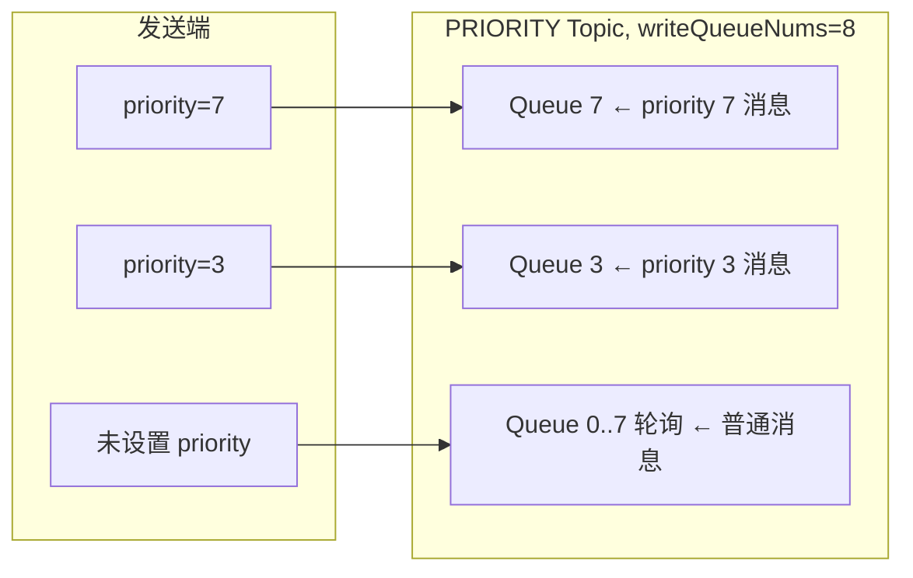
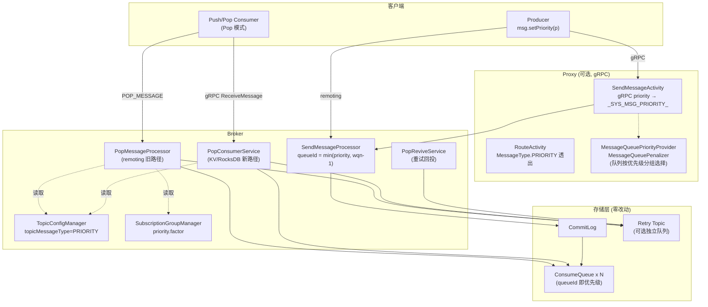
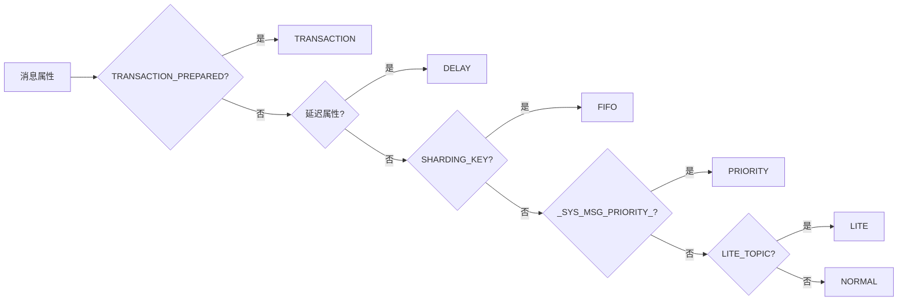
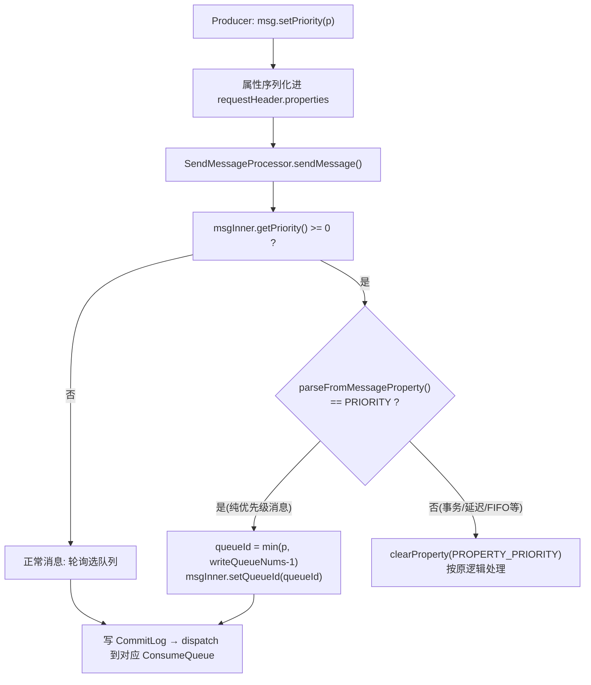
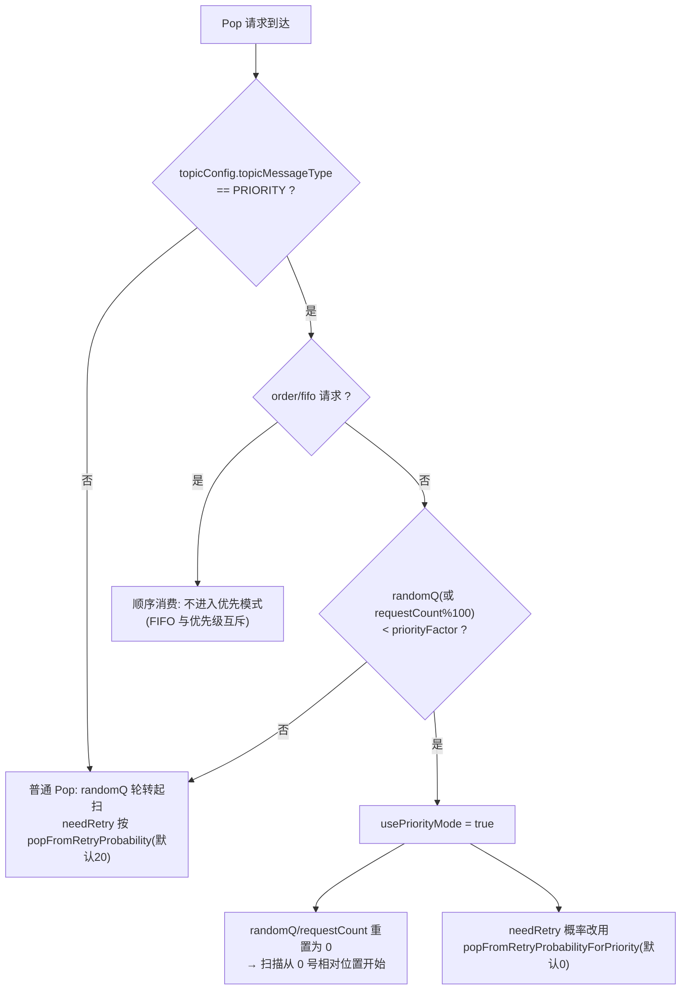
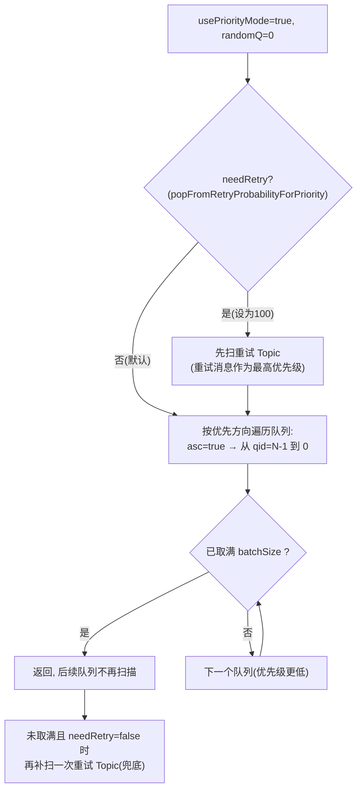
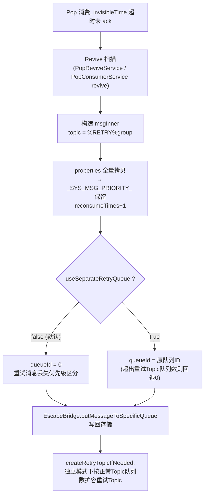
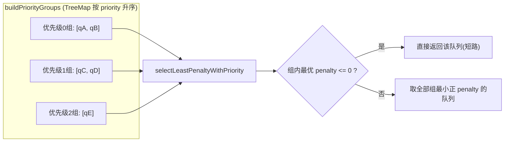
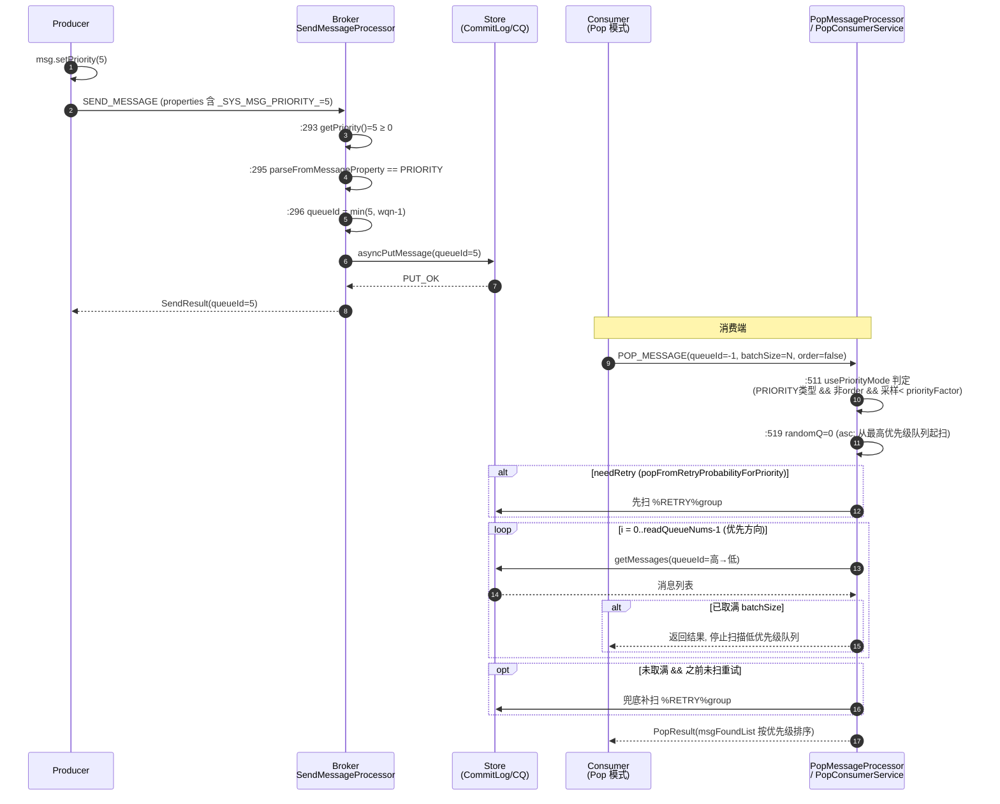
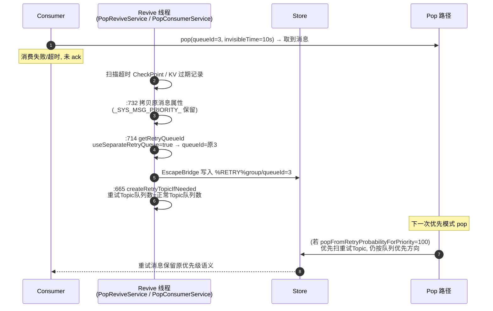

# RocketMQ 优先队列（Priority Message）源码深度分析

> 基于 Apache RocketMQ 5.5.0 (develop 分支) 源码。该特性在 5.4.0 引入，5.5.0 中已完整落地（含 Pop 消费双路径、RocksDB Pop KV 路径、Proxy gRPC 支持、独立重试队列）。
>
> 所有行号均来自本仓库源码，可直接跳转核对。

---

## 目录

1. [特性概述与设计哲学](#一特性概述与设计哲学)
2. [整体架构](#二整体架构)
3. [消息模型与公共层定义](#三消息模型与公共层定义)
4. [发送端流程：优先级即队列 ID](#四发送端流程优先级即队列-id)
5. [消费端流程：Pop 优先模式](#五消费端流程pop-优先模式)
6. [重试消息的优先级处理](#六重试消息的优先级处理)
7. [Proxy/gRPC 层的优先级支持](#七proxygrpc-层的优先级支持)
8. [配置项汇总](#八配置项汇总)
9. [完整时序图](#九完整时序图)
10. [关键设计权衡与源码走读要点](#十关键设计权衡与源码走读要点)
11. [使用示例与集成测试验证](#十一使用示例与集成测试验证)
12. [局限性分析与展望](#十二局限性分析与展望)

---

## 一、特性概述与设计哲学

### 1.1 解决什么问题

传统 RocketMQ 中同一队列严格 FIFO，无法让"重要的消息先被消费"。5.4.0 之前的常见 workaround：

- 业务侧拆 Topic / 拆消费组（运维成本高）
- 客户端本地堆排序（消费重平衡后失效、堆积时内存不可控）

优先队列特性让**同 Topic 内的消息按优先级有序消费**，核心诉求是：

- **高优先级消息在 backlog 场景下先出队**
- 对存量存储引擎**零改动**（不改 CommitLog/ConsumeQueue 格式）
- 只与 **Pop 消费模式**（5.x 主推）协同，天然兼容消息级负载均衡

### 1.2 核心设计思想："优先级 = 队列 ID"（Priority as Queue）

这是整个特性最关键的映射：

```text
消息优先级 p  ──发送时──▶  队列 ID = min(p, writeQueueNums - 1)
```



- 队列内仍然 FIFO（保证同优先级有序）
- **消费侧只需要决定"先读哪个队列"**，就实现了跨优先级的全局有序消费

这样设计的好处：

| 维度 | 收益 |
|------|------|
| 存储层 | 零改动，ConsumeQueue/CommitLog 完全复用 |
| 发送端 | 一行 API `setPriority()` |
| Broker | 只改写路由(发送) + 扫描顺序(消费) 两处 |
| 吞吐 | 优先级分散在多个队列，可并行写/读 |

### 1.3 两级开关（概率化调度）

优先消费不是硬切换，而是**按请求粒度概率采样**：

- 消费组级属性 `priority.factor`（0~100）：决定多少比例的 Pop 请求走"优先扫描顺序"，其余请求保持随机/轮转（公平性兜底，防止低优先级饿死）
- Broker 级 `popFromRetryProbabilityForPriority`：优先模式下从重试 Topic 取消息的概率（重试消息作为"最高/最低优先级"的策略开关）

---

## 二、整体架构



三处核心改动点（Broker 端）：

1. **发送路由**：`SendMessageProcessor.java:293-301` —— 优先级改写 queueId
2. **消费扫描顺序**：`PopMessageProcessor.java:511-519, 656-658` 和 `PopConsumerService.java:346-348, 382-388` —— 按优先级方向遍历队列 + 概率采样
3. **重试回投**：`PopReviveService` / `PopConsumerService.reviveRetry` —— `useSeparateRetryQueue` 保留原队列 ID，即保留原优先级

---

## 三、消息模型与公共层定义

### 3.1 消息属性 `MessageConst.PROPERTY_PRIORITY`

```java
// common/src/main/java/org/apache/rocketmq/common/message/MessageConst.java:47
public static final String PROPERTY_PRIORITY = "_SYS_MSG_PRIORITY_";
```

已加入 `STRING_HASH_SET`（:174），表示该属性可以参与传输与属性校验。

### 3.2 客户端 API

```java
// common/src/main/java/org/apache/rocketmq/common/message/Message.java:159-168
public void setPriority(int priority) {
    if (priority < 0) {
        throw new IllegalArgumentException("The priority must be greater than or equal to 0");
    }
    this.putProperty(MessageConst.PROPERTY_PRIORITY, String.valueOf(priority));
}

public int getPriority() {
    return NumberUtils.toInt(this.getProperty(MessageConst.PROPERTY_PRIORITY), -1);
}
```

注意 **未设置时 `getPriority()` 返回 -1**，这是所有下游逻辑判断"是否优先级消息"的哨兵值。

### 3.3 Topic 消息类型 `TopicMessageType.PRIORITY`

```java
// common/src/main/java/org/apache/rocketmq/common/attribute/TopicMessageType.java:31
PRIORITY("PRIORITY"),
```

类型判定顺序（`parseFromMessageProperty:50-67`）保证互斥：



即：**事务 > 延迟 > FIFO > 优先级 > Lite**。一条设置了 priority 的延迟消息会被当作 DELAY 处理（延迟优先）。

### 3.4 Topic 权限位 `PERM_PRIORITY`

```java
// common/src/main/java/org/apache/rocketmq/common/constant/PermName.java:20-29
public static final int INDEX_PERM_PRIORITY = 3;
public static final int PERM_PRIORITY = 0x1 << 3;  // 0x8
```

PermName 权限位扩展为 4 位：`PRIORITY | READ | WRITE | INHERIT`。`isValid()`（:64-66）校验 `perm >= 0 && perm < PERM_PRIORITY`，新增的 `isPriority()`（:68）判断是否声明了优先级能力（目前主要用于权限合法性测试，`ValidatorsTest.java:127-165` 可见）。

### 3.5 消费组属性 `priority.factor`

```java
// common/src/main/java/org/apache/rocketmq/common/SubscriptionGroupAttributes.java:34-40
public static final LongRangeAttribute PRIORITY_FACTOR_ATTRIBUTE = new LongRangeAttribute(
    "priority.factor",
    true,          // changeable, 可动态修改
    0,             // disable priority mode
    100,           // enable priority mode
    100            // 默认 100（全量启用）
);
```

运行时读取（不落 JSON 字段，实时从 attributes map 计算）：

```java
// remoting/src/main/java/org/apache/rocketmq/remoting/protocol/subscription/SubscriptionGroupConfig.java:190-194
@JSONField(serialize = false, deserialize = false)
public long getPriorityFactor() {
    String factorStr = null == attributes ? null : attributes.get(PRIORITY_FACTOR_ATTRIBUTE.getName());
    return NumberUtils.toLong(factorStr, PRIORITY_FACTOR_ATTRIBUTE.getDefaultValue());
}
```

---

## 四、发送端流程：优先级即队列 ID

### 4.1 核心代码

```java
// broker/src/main/java/org/apache/rocketmq/broker/processor/SendMessageProcessor.java:292-301
// check properties to ensure exclusive, don't check topic meta config to keep the behavior consistent
int msgPriority = msgInner.getPriority();
if (msgPriority >= 0) {
    if (TopicMessageType.PRIORITY.equals(
            TopicMessageType.parseFromMessageProperty(msgInner.getProperties()))) {
        queueIdInt = Math.min(msgPriority, topicConfig.getWriteQueueNums() - 1);
        msgInner.setQueueId(queueIdInt);
    } else {
        MessageAccessor.clearProperty(msgInner, MessageConst.PROPERTY_PRIORITY);
    }
}
```

要点：

1. **以消息属性判定类型，而非 Topic 配置**（注释明确说明是为了行为一致性——即使 Topic 忘记建为 PRIORITY 类型，只要消息携带的属性组合解析出 PRIORITY，也按优先级路由）
2. `Math.min(msgPriority, writeQueueNums - 1)`：优先级超出队列数时**钳制到最大队列**，不报错（弹性：扩队列前可以发送更大的优先级值）
3. 非优先级消息（类型解析不是 PRIORITY，例如延迟消息）携带了 priority 属性则**静默清除**，防止属性污染下游统计
4. 此时若 `queueIdInt` 客户端已指定，仍会被覆盖 —— 优先级路由优先于客户端选队

### 4.2 发送流程图



### 4.3 消息落盘后的形态

优先级消息与普通消息在存储层**完全同构**：

- CommitLog：无任何特殊标记（优先级只在属性字符串里）
- ConsumeQueue：消息进入 `queueId == priority` 的队列
- 唯一可观测痕迹：属性串中的 `_SYS_MSG_PRIORITY_=p`

---

## 五、消费端流程：Pop 优先模式

优先消费**只在 Pop 消费路径实现**（Push 消费走 Rebalance 分队列独占，无法跨队列排序）。Pop 有两条代码路径，逻辑对齐：

| 路径 | 类 | 场景 |
|------|-----|------|
| 旧路径 | `PopMessageProcessor` | remoting POP_MESSAGE 请求 / `popConsumerKVServiceEnable=false` |
| 新路径 | `PopConsumerService` | `popConsumerKVServiceEnable=true`（RocksDB Pop KV 存储） |

### 5.1 触发条件：`usePriorityMode`（三个条件与）

```java
// PopMessageProcessor.java:511-514
boolean usePriorityMode = TopicMessageType.PRIORITY.equals(topicConfig.getTopicMessageType())
    && !requestHeader.isOrder() && randomQ < subscriptionGroupConfig.getPriorityFactor();
boolean needRetry = randomQ < (usePriorityMode ?
    brokerConfig.getPopFromRetryProbabilityForPriority() : brokerConfig.getPopFromRetryProbability());
...
randomQ = usePriorityMode ? 0 : randomQ; // reset randomQ
```

```java
// PopConsumerService.java:380-388
long requestCount = ...requestCountTable.get(requestKey).getAndIncrement();
boolean usePriorityMode = TopicMessageType.PRIORITY.equals(topicConfig.getTopicMessageType())
    && !fifo && requestCount % 100L < subscriptionGroupConfig.getPriorityFactor();
int probability = usePriorityMode ?
    brokerConfig.getPopFromRetryProbabilityForPriority() : brokerConfig.getPopFromRetryProbability();
probability = Math.max(0, Math.min(100, probability)); // [51, 100] means always
boolean preferRetry = probability > 0 && requestCount % (100 / probability) == 0L;
requestCount = usePriorityMode ? 0 : requestCount; // use requestCount as randomQ
```

决策流程：



细节辨析：

- **旧路径**用 `random.nextInt(100)` 做单次请求的伯努利采样；**新路径**用 `requestCount % 100` 做确定性周期采样（每 100 个请求中前 `priorityFactor` 个走优先模式）。两者语义等价，新路径可复现、可测试
- `priorityFactor=0` 彻底关闭（测试 `test_priority_consume_disable` 验证此时队列分布接近均匀）
- `priorityFactor=100`（默认）时所有请求都走优先扫描

### 5.2 核心扫描顺序：`priorityOrderAsc`

```java
// PopMessageProcessor.java:650-666 (popMsgFromTopic)
for (int i = 0; i < topicConfig.getReadQueueNums(); i++) {
    int index = (brokerController.getBrokerConfig().isPriorityOrderAsc() ?
        topicConfig.getReadQueueNums() - 1 - i : i) + randomQ;
    int queueId = index % topicConfig.getReadQueueNums();
    getMessageFuture = getMessageFuture.thenCompose(restNum ->
        popMsgFromQueue(topicConfig.getTopicName(), requestHeader.getAttemptId(), isRetry,
            getMessageResult, requestHeader, queueId, restNum, reviveQid, channel, popTime, messageFilter, ...));
}
```

```java
// PopConsumerService.java:345-352 (getMessageFromTopicAsync) —— 完全同构
long index = (brokerController.getBrokerConfig().isPriorityOrderAsc() ?
    topicConfig.getReadQueueNums() - 1 - i : i) + requestCount;
int current = (int) index % topicConfig.getReadQueueNums();
```

`BrokerConfig.java:244-245`：

```java
// 0 as the lowest priority if true
private boolean priorityOrderAsc = true;
```

扫描方向语义：

| priorityOrderAsc | 扫描起始队列 | 语义 |
|---|---|---|
| `true`（默认） | `readQueueNums-1` → 递减 | **queueId 越大优先级越高**（0 最低） |
| `false` | `0` → 递增 | **queueId 越小优先级越高**（0 最高） |

### 5.3 优先消费的完整机制（准严格优先 + 公平性）

单次 Pop 请求（batchSize = N）的处理逻辑：



关键性质：

1. **严格优先（批内）**：一个请求内从最高优先级队列开始取，取满即止。测试 `test_priority_consume_always_high_priority` 验证：每个队列 20 条积压时，连续 pop 单条全部来自最高优先级队列
2. **优先级"从高到低"消费**：测试 `test_priority_consume_from_high_to_low` 验证 8 队列各 1 条消息时，8 次 pop 依次取到 qid=7,6,5...0（asc 模式）
3. **跨请求公平性由 priorityFactor 控制**：`priorityFactor=50` 时一半请求严格按优先级、一半请求从随机位置轮转起扫，避免低优先级在持续高优先级写入下饿死
4. **同一队列的消息仍 FIFO**：优先级粒度是队列，不是消息

### 5.4 与重试 Topic 的交织（PopMessageProcessor 特有注释）

`PopMessageProcessor.java:505-510` 的注释解释了字段约束：`startOffsetInfo / msgOffsetInfo / orderCountInfo` 的设计使得单次 POP 请求只能对**一种** Topic 类型（普通或重试）调用 `popMsgFromQueue`：

```java
// Therefore, needRetryV1 is designed as a subset of needRetry, and within a single request,
// only one type of retry topic is able to call popMsgFromQueue.
```

优先模式下的处理（:513-519, 522-555）：

- `usePriorityMode=true` 时重试概率换成 `popFromRetryProbabilityForPriority`
- `randomQ = 0` 还有一个副作用：`needRetryV1`（`randomQ % 2 == 0`）恒为 true，即优先模式下如果同时开了 V1/V2 重试兼容，会优先取 V1 重试 Topic
- 请求未取满时会**兜底补扫**重试 Topic（:545-555）

`PopConsumerService`（新路径）结构更清晰（:393-424）：`preferRetry` 时先扫 retryTopicV1/V2 再扫正常 Topic，否则正常 Topic 优先、未取满补扫重试——注意**新路径正常 Topic 与重试 Topic 是先后两轮 `getMessageFromTopicAsync`，各自内部按优先方向遍历队列**。

---

## 六、重试消息的优先级处理

Pop 消费超时未 ack → 经 revive 机制（PopReviveService / PopConsumerService revive 线程）回投到重试 Topic。重试消息**保留原消息属性**（含 `_SYS_MSG_PRIORITY_`，见 `PopConsumerService.java:732` `msgInner.getProperties().putAll(messageExt.getProperties())`），但 queueId 由 `getRetryQueueId` 决定：

```java
// PopConsumerService.java:761-771 (PopReviveService.java:196-204 同构)
private int getRetryQueueId(String retryTopic, MessageExt oriMsg) {
    if (!brokerController.getBrokerConfig().isUseSeparateRetryQueue()) {
        return 0;                       // 传统模式: 重试消息全进 queue 0
    }
    int oriQueueId = oriMsg.getQueueId();
    if (oriQueueId > ...selectTopicConfig(retryTopic).getWriteQueueNums() - 1) {
        log.warn("not expected, {}, {}, {}", retryTopic, oriQueueId, oriMsg.getMsgId());
        return 0;                       // 队列数对不上时兜底
    }
    return oriQueueId;                  // 独立重试队列: 保留原队列ID = 保留优先级
}
```

`useSeparateRetryQueue=true` 时还会同步扩容重试 Topic 队列数（`createRetryTopicIfNeeded:665-693`：retryQueueNum = 正常 Topic 的 writeQueueNums，并初始化各队列消费 offset 为 0）。

### 重试消息优先级的两种策略

由 `popFromRetryProbabilityForPriority`（默认 0）控制：

| 配置 | 行为 | 测试验证 |
|------|------|---------|
| `0`（默认） | 优先模式下**不主动**先取重试 → 重试消息实际作为**最低优先级**（补扫兜底才取到） | `test_priority_consume_retry_as_lowest`：重试消息在 100 条中最后被消费 |
| `100` | 优先模式下**每次都先扫重试 Topic** → 重试消息作为**最高优先级**（尽快重试） | `test_priority_consume_retry_as_highest`：重试消息在 100 条中最先被消费 |

### 重试回投流程图



> `useSeparateRetryQueue=true` + `popFromRetryProbabilityForPriority=100` 的组合 = "重试优先 + 重试保序（按原优先级）"，是优先队列语义最完整的配置。测试 `test_priority_consume_use_separate_retry_queue` 验证了该组合（并验证队列扩容后原 queueId 超界时的回退行为，见 `test_priority_consume_use_separate_retry_queue_with_queue_expansion`，因 CI 不稳定被 `@Ignore`）。

---

## 七、Proxy/gRPC 层的优先级支持

### 7.1 发送：gRPC priority → 消息属性

```java
// proxy/src/main/java/org/apache/rocketmq/proxy/grpc/v2/producer/SendMessageActivity.java:275-278
// set priority
if (message.getSystemProperties().hasPriority()) {
    int priority = message.getSystemProperties().getPriority();
    messageWithHeader.setPriority(priority);
}
```

gRPC 协议 `SystemProperties.priority`（protobuf int32）被转换为 `_SYS_MSG_PRIORITY_` 属性后透传给 Broker，5.x 客户端使用方式：

```java
// gRPC 客户端
MessageBuilder builder = provider.newMessageBuilder()
    .setTopic("priority_topic")
    .setSystemProperties(SystemProperties.newBuilder().setPriority(3));
```

### 7.2 路由：MessageType 透出

```java
// proxy/src/main/java/org/apache/rocketmq/proxy/grpc/v2/route/RouteActivity.java:314-315
case PRIORITY:
    return Collections.singletonList(MessageType.PRIORITY);
```

`AdminModelConverter.java:99` 同样映射，客户端 queryRoute 可感知 Topic 的优先级类型。

### 7.3 队列优先级分组选择框架（Proxy 侧通用能力）

Proxy 的 route 包引入了一套**面向队列**（而非消息）的优先级抽象，独立于 Broker 的消息优先级，用于代理层选队：

```java
// proxy/.../route/MessageQueuePriorityProvider.java:39-55
@FunctionalInterface
public interface MessageQueuePriorityProvider<Q extends MessageQueue> {
    /** 小值 = 高优先级 */
    int priorityOf(Q q);

    /** 按优先级分桶分组, TreeMap 保证组间按优先级升序(高→低) */
    static <Q extends MessageQueue> List<List<Q>> buildPriorityGroups(
            List<Q> queues, MessageQueuePriorityProvider<Q> provider) { ... }  // :72-83
}
```

```java
// proxy/.../route/DefaultMessageQueuePriorityProvider.java:20-23
public class DefaultMessageQueuePriorityProvider implements MessageQueuePriorityProvider<AddressableMessageQueue> {
    public int priorityOf(AddressableMessageQueue queue) {
        return 0;   // 默认所有队列同优先级
    }
}
```

`MessageQueuePenalizer.selectLeastPenaltyWithPriority`（MessageQueuePenalizer.java:111-133）在优先级分组上做"最小惩罚"选队：

- 逐组调用 `selectLeastPenalty`（组内按惩罚值如 broker 负载选队）
- **短路规则**：任一组出现 `penalty <= 0` 的队列立即返回（高优先级组可用时不考虑低优先级组）
- 否则取所有组中惩罚最小的队列



这套接口为 Proxy 后续基于 broker/queue 状态的差异化路由（例如高优先级流量定向到更优 broker）预留了扩展点。

---

## 八、配置项汇总

| 配置 | 位置 | 默认值 | 作用 |
|------|------|--------|------|
| `msg.setPriority(int)` | 客户端 API | -1(未设置) | 设置消息优先级, ≥0 有效 |
| Topic `message.type=PRIORITY` | TopicConfig | UNSPECIFIED | 创建 Topic 时声明；决定消费端是否允许进入优先模式 |
| `priority.factor` | 消费组属性 (SubscriptionGroupAttributes:34) | 100 | 0=关闭优先模式, 100=全部请求走优先扫描; 可动态变更 |
| `popFromRetryProbabilityForPriority` | BrokerConfig:243 | 0 | 优先模式下从重试 Topic 先取消息的概率(0=重试最低, 100=重试最高) |
| `popFromRetryProbability` | BrokerConfig:241 | 20 | 非优先模式的重试采样概率 |
| `priorityOrderAsc` | BrokerConfig:245 | true | true: queueId 大=高优先级; false: queueId 小=高优先级 |
| `useSeparateRetryQueue` | BrokerConfig:255 | false | true 时每个队列有对应重试队列, 重试保留原优先级 |
| `perm` 位 PERM_PRIORITY(0x8) | PermName:26 | — | Topic/broker 权限位扩展 |

运维命令示例：

```bash
# 创建优先级 Topic
sh mqadmin updateTopic -t priority_topic -c <cluster> -a "+message.type=PRIORITY" -n <ns>

# 动态调整消费组优先模式比例（0 关闭）
sh mqadmin updateSubGroup -g my_group -a "+priority.factor=50" -n <ns>
```

---

## 九、完整时序图

### 9.1 发送 + 优先消费端到端时序



### 9.2 重试保优先级时序（useSeparateRetryQueue=true）



---

## 十、关键设计权衡与源码走读要点

### 10.1 为什么不改存储层做"真优先级队列"

真正的优先级堆（每次出队取全局最高）需要：

- CommitLog 写入与 ConsumeQueue 索引分离，出队时跨队列归并（类 Kafka 的 layered queue / 时间轮堆），存储引擎大改
- RocketMQ 选择用 **N 个队列近似 N 级优先级**：O(1) 写、O(队列数) 扫描，复用全部存储与 HA 机制

代价：优先级粒度 = 队列数（8 队列只有 8 级）；且 `min(p, wqn-1)` 意味着超界优先级会被合并。

### 10.2 为什么是概率调度而不是严格优先级

`priority.factor < 100` 时，部分请求从随机位置起扫。这提供了**可调的公平性**：

- backlog 严重时设为 100，最大化高优先级吞吐
- 平稳期降到 50，保证低优先级延迟可预期（避免饿死）
- 两个采样实现（random vs requestCount%100）语义一致，后者确定性更强，便于测试断言

### 10.3 FIFO 与优先级互斥

`usePriorityMode` 显式排除 `order/fifo` 请求（PopMessageProcessor:512 / PopConsumerService:383）。原因：顺序消费依赖队列内 offset 推进 + Pop 顺序锁，跨队列优先级抢占会破坏分区内顺序语义。

### 10.4 发送端"属性优先于 Topic 配置"

SendMessageProcessor:292 注释 `check properties to ensure exclusive, don't check topic meta config`——即使 Topic 没声明 PRIORITY 类型，只要属性组合解析为 PRIORITY 仍路由。**但消费端 usePriorityMode 检查的是 `topicConfig.getTopicMessageType()`**——即：正确使用姿势必须建 PRIORITY 类型 Topic，否则消息进了固定队列却没人按优先顺序消费。

### 10.5 两套 Pop 路径的代码对齐

同一特性在两处重复实现（社区标注 `@SuppressWarnings("DuplicatedCode")`，见 PopConsumerService:695 引用 PopReviveService#reviveRetry）。走读时可对照：

| 逻辑 | 旧路径 | 新路径 |
|------|--------|--------|
| 优先模式判定 | PopMessageProcessor:511 | PopConsumerService:382 |
| 重试概率 | :513-514 | :384-387 |
| 随机数重置 | :519 | :388 |
| 优先方向遍历 | :656-658 (popMsgFromTopic) | :346-348 (getMessageFromTopicAsync) |
| 重试 queueId | PopReviveService:196 | PopConsumerService:761 |

### 10.6 性能特征

- 优先模式起扫固定从最高优先级队列开始（randomQ=0），**高优先级队列读放大**，低优先级队列在持续满载下接近只写不读（由 priorityFactor 之外的流量兜底）
- 单请求内逐队列串行 `thenCompose`，队列数多且高优先级空时，扫描有累积延迟（Pop 长轮询 + restNum 通知机制缓解）
- 消息属性仅多一个字符串键值，序列化开销可忽略

---

## 十一、使用示例与集成测试验证

集成测试 `test/src/test/java/org/apache/rocketmq/test/client/consumer/pop/PopPriorityIT.java` 是特性的行为规范（参数化 4 组合：KV 路径 × asc/desc）。setUp（:77-87）完整展示启用姿势：

```java
brokerController1.getBrokerConfig().setPopFromRetryProbabilityForPriority(0);
brokerController1.getBrokerConfig().setUseSeparateRetryQueue(false);
brokerController1.getBrokerConfig().setPopConsumerKVServiceEnable(popConsumerKVServiceEnable);
brokerController1.getBrokerConfig().setPriorityOrderAsc(priorityOrderAsc);
IntegrationTestBase.initTopic(topic, NAMESRV_ADDR, BROKER1_NAME,
    writeQueueNum /*8*/, CQType.SimpleCQ, TopicMessageType.PRIORITY);
```

测试矩阵总结：

| 测试 | 断言的行为 |
|------|-----------|
| `test_normal_send` | priority=-1 的普通消息在 PRIORITY Topic 中仍轮询散列（queueIdSet.size()>1） |
| `test_priority_send` | priority=0 的消息全部落 queueId=0 |
| `test_priority_consume_always_high_priority` | 8 队列各 20 条积压时, 逐条 pop 全部来自最高优先级队列 |
| `test_priority_consume_from_high_to_low` | 各队列 1 条时, 依次按优先级降序消费, 且 queueOffset=0 |
| `test_priority_consume_disable` | priority.factor=0 时 800 次采样队列分布均匀(±40%容差) |
| `test_priority_consume_retry_as_lowest` | 默认下重试消息最后被消费 |
| `test_priority_consume_retry_as_highest` | probability=100 时重试消息最先被消费 |
| `test_priority_consume_use_separate_retry_queue` | 独立重试队列下重试消息 queueOffset=0(独立队列)且保序 |

业务侧最小使用代码：

```java
// 生产端
Message msg = new Message("priority_topic", payload);
msg.setPriority(7);            // asc 模式下 7 = 最高优先级(需 writeQueueNums ≥ 8)
producer.send(msg);

// 消费端 (5.x gRPC / Pop)
// Topic 需以 message.type=PRIORITY 创建; 消费组默认 priority.factor=100 即启用优先消费
```

---

## 十二、局限性分析与展望

1. **优先级级数受限于队列数**：writeQueueNums=8 → 最多 8 级；扩队列可提升级数，但已发送的超界优先级消息已合并落在大队列中
2. **仅 Pop 消费**：Push/Pull 模式无优先语义（Rebalance 队列独占天然阻断跨队列排序）
3. **与 FIFO/事务/延迟互斥**：属性判定顺序决定同时设置时优先级被忽略（且会被 clearProperty 清除）
4. **backlog 跨 Broker 不保证全局优先**：优先扫描以单 Broker 的 Topic 队列为界；多 Broker 部署时各 Broker 独立按优先顺序返回，客户端收到的是"各 Broker 内有序"的归并结果
5. **Proxy 队列优先级框架（MessageQueuePriorityProvider）默认全 0**：是预留扩展点，尚未与 Broker 消息优先级联动
6. **演进方向**（源码可见的伏笔）：`useSeparateRetryQueue` + 重试概率组合完善重试优先级语义；Proxy 侧分组选队框架支持基于负载的差异化路由

---

## 附录：关键源码索引

| 文件 | 行号 | 内容 |
|------|------|------|
| `common/.../message/MessageConst.java` | 47 | `PROPERTY_PRIORITY = "_SYS_MSG_PRIORITY_"` |
| `common/.../message/Message.java` | 159-168 | setPriority/getPriority |
| `common/.../attribute/TopicMessageType.java` | 31, 50-67 | PRIORITY 枚举与属性解析顺序 |
| `common/.../constant/PermName.java` | 20-29, 68 | PERM_PRIORITY 权限位 |
| `common/.../SubscriptionGroupAttributes.java` | 34-40 | priority.factor 属性定义 |
| `common/.../BrokerConfig.java` | 241-245, 255 | 三个 Broker 配置 + useSeparateRetryQueue |
| `remoting/.../subscription/SubscriptionGroupConfig.java` | 190-194 | getPriorityFactor() |
| `broker/.../processor/SendMessageProcessor.java` | 292-301 | 发送路由: priority → queueId |
| `broker/.../processor/PopMessageProcessor.java` | 505-519, 650-666 | 优先模式判定 + 优先方向遍历 |
| `broker/.../pop/PopConsumerService.java` | 338-353, 380-388, 665-693, 697-771 | 新路径全部优先级逻辑 |
| `broker/.../processor/PopReviveService.java` | 137, 169-174, 196 | 旧路径重试回投 |
| `proxy/.../grpc/v2/producer/SendMessageActivity.java` | 275-278 | gRPC priority 转属性 |
| `proxy/.../grpc/v2/route/RouteActivity.java` | 314-315 | MessageType.PRIORITY 透出 |
| `proxy/.../service/route/MessageQueuePriorityProvider.java` | 39-83 | 队列优先级分组框架 |
| `proxy/.../service/route/MessageQueuePenalizer.java` | 111-133 | 分组最小惩罚选队 |
| `test/.../pop/PopPriorityIT.java` | 全文 | 行为规范测试 |
