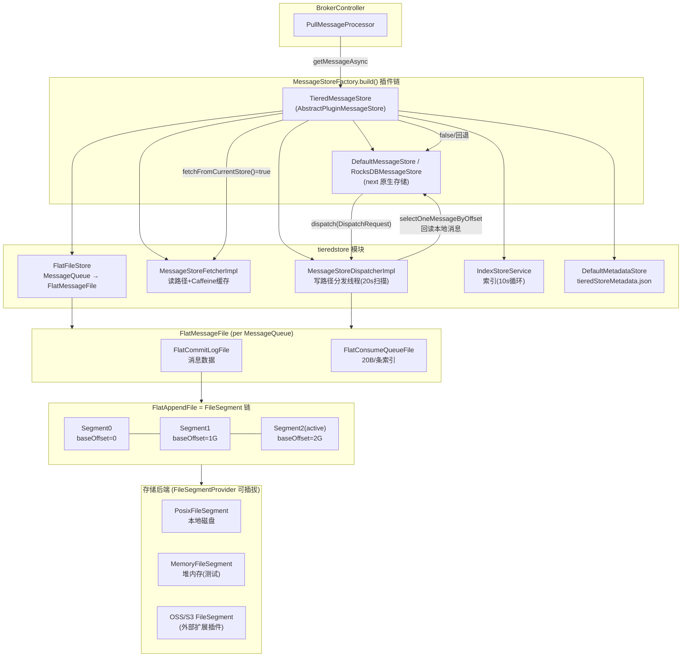
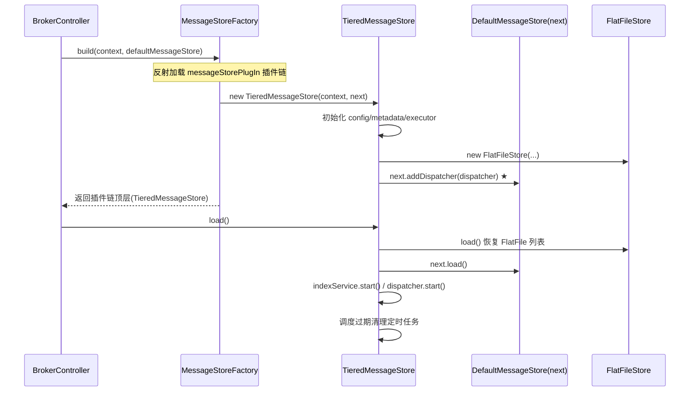
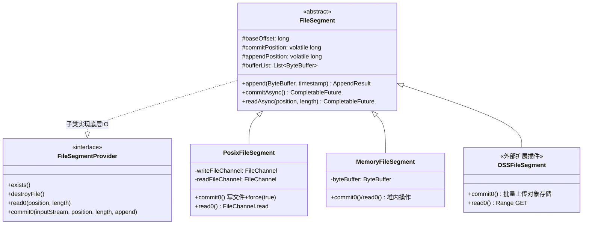
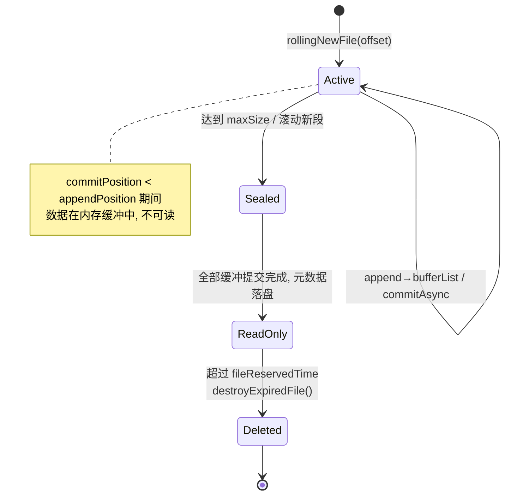
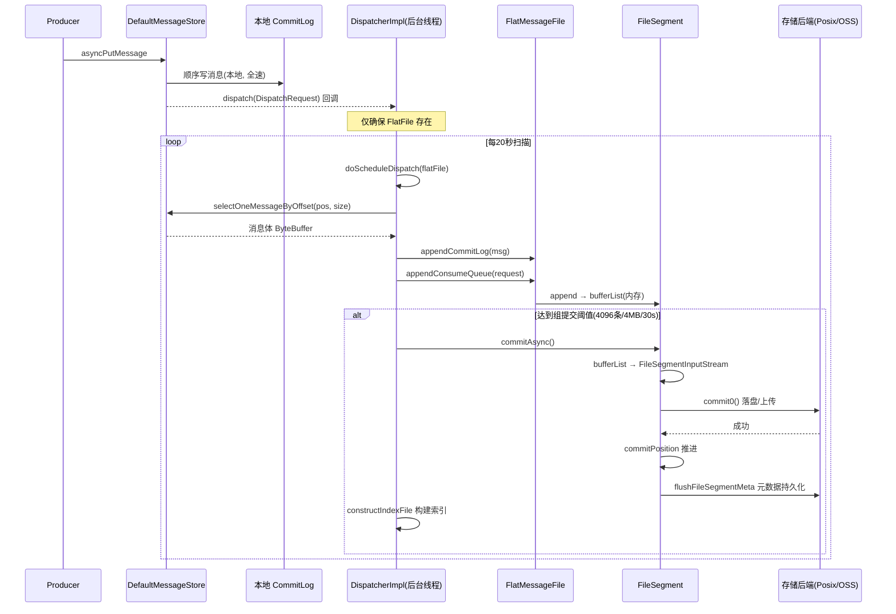
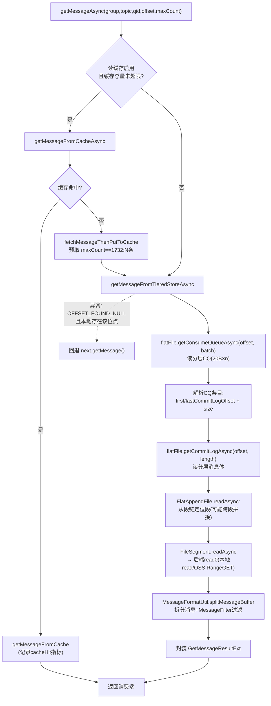
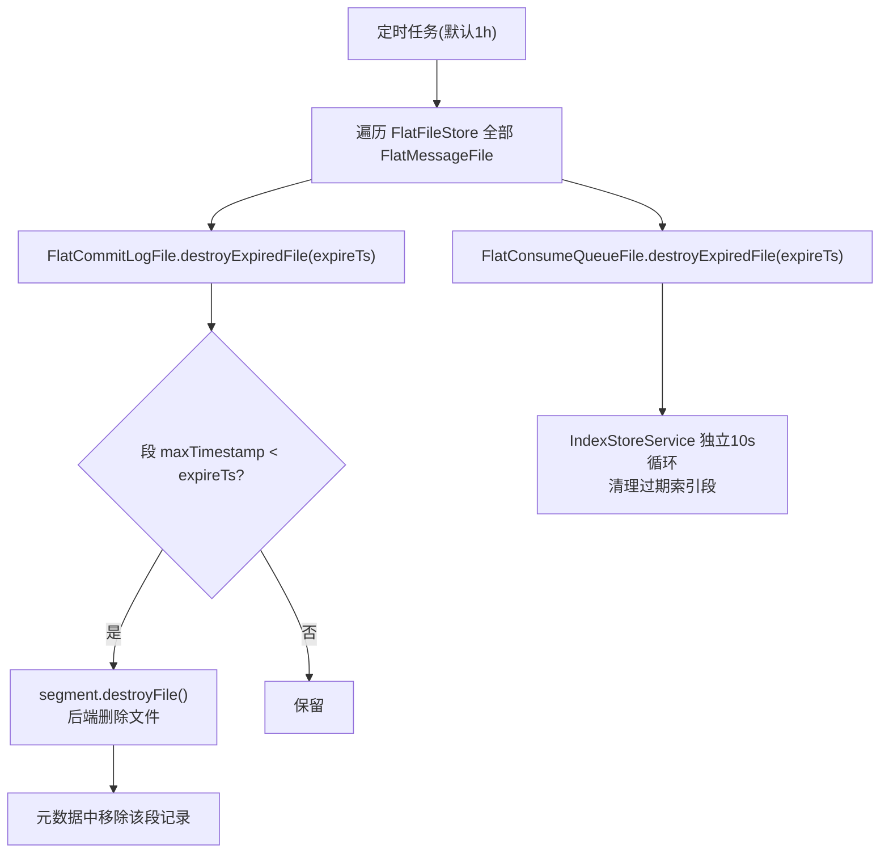
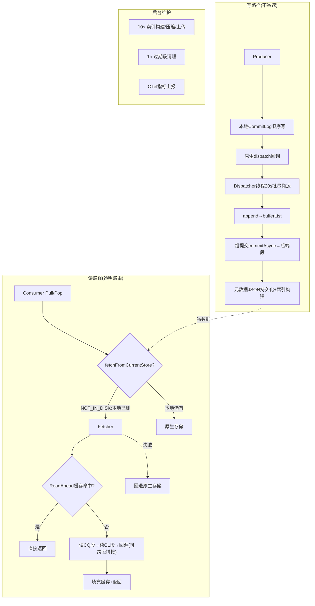

# RocketMQ 5.x 分层存储(Tiered Store)源码深度分析

> 基于 Apache RocketMQ 5.5.0 develop 分支源码, 模块路径 `tieredstore/`
> 所有类名/行号均来自源码实际验证

---

## 目录

1. [分层存储是什么 & 为什么需要](#一分层存储是什么--为什么需要)
2. [整体架构设计](#二整体架构设计)
3. [插件化集成机制](#三插件化集成机制)
4. [核心数据模型: FlatFile 体系](#四核心数据模型-flatfile-体系)
5. [FileSegment: 存储后端抽象](#五filesegment-存储后端抽象)
6. [写路径: 消息分发与上传流程](#六写路径消息分发与上传流程)
7. [读路径: 拉取与缓存流程](#七读路径拉取与缓存流程)
8. [索引服务与 Compaction](#八索引服务与-compaction)
9. [元数据管理](#九元数据管理)
10. [过期清理](#十过期清理)
11. [监控指标体系](#十一监控指标体系)
12. [配置详解](#十二配置详解)
13. [总结: 设计亮点与限制](#十三总结设计亮点与限制)

---

## 一、分层存储是什么 & 为什么需要

### 1.1 传统存储的痛点

原生 RocketMQ 4.x/5.x 的 `DefaultMessageStore` 将所有消息（冷+热）都存放在本地磁盘的 CommitLog 中：

- **单机磁盘容量成为上限**：消息堆积受限于本地盘大小
- **冷数据成本高**：堆积的冷数据占据昂贵的本地 SSD/NVMe
- **删除冷数据才能腾空间**：`fileReservedTime` 过期即删，无法长期保留
- **磁盘 I/O 混合**：冷数据的回溯读（如重置消费位点）与热数据的写入争抢 I/O

### 1.2 分层存储的思路

分层存储将消息按冷热分级：

```
热数据 → 本地存储(DefaultMessageStore, CommitLog)
冷数据 → 分层存储(TieredMessageStore, 文件段 FileSegment → 本地/远端后端)
```

关键特征：

| 特征 | 说明 |
|------|------|
| **异步搬运** | 消息先正常写本地 CommitLog，后台线程异步复制到分层存储 |
| **透明读路由** | 消费请求按 `tieredStorageLevel` 判断从本地还是分层存储读取，客户端无感知 |
| **本地数据可提前删除** | 消息上传到分层存储后，本地 CommitLog 可以更激进地删除，释放本地空间 |
| **后端可插拔** | `FileSegment` 抽象支持 Posix 本地文件、内存（测试）、以及外部 OSS/S3 扩展 |
| **长期保留** | 分层存储文件默认保留 72 小时（可配置到任意时长），支持远端无限容量 |

> **与 RocksDB 整合的关系**：分层存储管"消息数据放哪"（冷热分离），RocksDB 整合管"索引/元数据怎么存"（KV 化）。二者独立启用、可组合，详见《RocketMQ_RocksDB整合源码深度分析.md》。

---

## 二、整体架构设计

### 2.1 模块包结构

```
org.apache.rocketmq.tieredstore           (tieredstore 独立顶层模块, 非 store 子包)
├── TieredMessageStore.java               # 存储插件入口, 实现 MessageStore 接口
├── MessageStoreConfig.java               # 分层存储独立配置(TieredStorageLevel 枚举在此)
├── MessageStoreExecutor.java             # 线程池执行器(commit/fetch/common 三组)
├── common/                               # 通用结构: AppendResult, SelectBufferResult,
│                                         #   GroupCommitContext, GetMessageResultExt, FileSegmentType
├── core/                                 # 核心逻辑
│   ├── MessageStoreDispatcher(.Impl)     # 写路径: 消息分发(本地→分层)
│   ├── MessageStoreFetcher(.Impl)        # 读路径: 消息拉取(分层→消费)
│   └── MessageStoreTopicFilter           # 系统topic过滤
├── file/                                 # Flat 文件模型
│   ├── FlatFileStore                     # 全局 FlatMessageFile 管理器
│   ├── FlatFileFactory                   # 工厂: 创建 FlatCommitLogFile/FlatConsumeQueueFile
│   ├── FlatMessageFile                   # 一个 MessageQueue 对应一个(组合 CL+CQ)
│   ├── FlatAppendFile                    # 文件段链抽象(append/rolling/read)
│   ├── FlatCommitLogFile                 # CommitLog 文件段链
│   └── FlatConsumeQueueFile              # ConsumeQueue 文件段链
├── provider/                             # 存储后端
│   ├── FileSegment                       # 抽象基类(bufferList + commit/append/read)
│   ├── FileSegmentProvider               # 后端接口(exists/destroy/read0/commit0)
│   ├── FileSegmentFactory                # 按 FileSegmentType 创建段
│   ├── PosixFileSegment                  # 本地文件实现(RandomAccessFile+FileChannel)
│   └── MemoryFileSegment                 # 内存实现(测试用)
├── index/                                # 索引服务(IndexFile/IndexItem/IndexStoreService)
├── metadata/                             # 元数据(JSON 持久化, DefaultMetadataStore)
├── metrics/                              # OTel 监控指标
├── stream/                               # FileSegmentInputStream(段→流)
├── util/                                 # MessageFormatUtil / MessageStoreUtil
└── exception/
```

### 2.2 架构图



### 2.3 核心设计决策

| 决策 | 理由 |
|------|------|
| **独立顶层模块** `tieredstore/` | 与 `store/` 解耦，只依赖其 SPI 接口 |
| **插件模式而非替换** | 通过 `messageStorePlugIn` 配置以责任链包装原生存储，本地写路径零侵入 |
| **按 MessageQueue 组织 FlatFile** | 与 ConsumeQueue 一致的队列语义，天然支持按队列读取 |
| **写走原生存储，分层只做搬运** | 写性能不受损（本地 CommitLog 顺序写），分层存储只承担读多写少的冷数据 |
| **段式文件 + 基址偏移** | 每段以 `baseOffset` 命名，offset 全局连续，天然适合对象存储的不可变对象 |

---

## 三、插件化集成机制

### 3.1 MessageStoreFactory 装配

`BrokerController.initializeMessageStore()` (BrokerController.java:869) 中：

```java
// 1. 先构造原生存储
DefaultMessageStore defaultMessageStore = new DefaultMessageStore(...);
// 2. 再用插件链包装
this.messageStore = MessageStoreFactory.build(context, defaultMessageStore);
```

`MessageStoreFactory.build()` (MessageStoreFactory.java:24) 按 `messageStorePlugIn` 配置（逗号分隔的类名列表）**反向**逐层包装：

```java
String[] pluginClasses = plugin.split(",");
for (int i = pluginClasses.length - 1; i >= 0; --i) {
    Class<AbstractPluginMessageStore> clazz = ...;
    messageStore = construct.newInstance(context, messageStore); // 责任链
}
```

启用分层存储的 broker.conf：

```properties
messageStorePlugIn=org.apache.rocketmq.tieredstore.TieredMessageStore
tieredStorageLevel=NOT_IN_DISK
```

### 3.2 TieredMessageStore 构造器

`TieredMessageStore.java:87`：

```java
public TieredMessageStore(MessageStorePluginContext context, MessageStore next) {
    super(context, next);
    this.storeConfig = new MessageStoreConfig();       // 分层存储独立配置
    this.defaultStore = next;
    this.metadataStore = getMetadataStore(storeConfig);
    this.storeExecutor = new MessageStoreExecutor();   // 线程池组
    this.flatFileStore = new FlatFileStore(storeConfig, metadataStore, storeExecutor);
    this.indexService = new IndexStoreService(...);
    this.fetcher = createFetcher(storeConfig, flatFileStore, indexService);
    this.dispatcher = new MessageStoreDispatcherImpl(this);
    next.addDispatcher(dispatcher);   // ★ 注册为原生存储的 dispatch 监听者
}
```

`next.addDispatcher(dispatcher)` 是写路径的关键挂接点——原生存储每分发一条消息（构建 ConsumeQueue 索引时），Tiered 的 dispatcher 都会被同步回调。

### 3.3 启动流程 (load)

`TieredMessageStore.java:108`：

```java
public boolean load() {
    boolean loadFlatFile = flatFileStore.load();   // 从元数据恢复所有 FlatMessageFile
    boolean loadNextStore = next.load();
    if (loadFlatFile && loadNextStore) {
        indexService.start();                      // 索引服务线程(10s)
        dispatcher.start();                        // 分发线程(20s)
        storeExecutor.getCommonExecutor().scheduleWithFixedDelay(
            flatFileStore::scheduleDeleteExpireFile, ...); // 过期清理(默认1h)
    }
}
```



---

## 四、核心数据模型: FlatFile 体系

### 4.1 三层文件模型

```
FlatFileStore                      # 全局管理: MessageQueue → FlatMessageFile
    └── FlatMessageFile            # 一个队列一个, 组合 CL 与 CQ 两条文件链
            ├── FlatCommitLogFile  (extends FlatAppendFile)  消息体
            └── FlatConsumeQueueFile (extends FlatAppendFile) 索引
                    └── FileSegment 链 (真正落盘的段)
```

- **FlatMessageFile** (FlatMessageFile.java:44)：`computeIfAbsent(MessageQueue)` 创建，持有队列的 `consumeQueueMaxOffset`、`consumeQueueCommitOffset` 等进度
- **FlatAppendFile** (FlatAppendFile.java)：维护 `fileSegmentList`（有序段链），核心方法 `rollingNewFile(offset)`(:176)、`append()`(:210 满则滚动新段)、`readAsync()`(:235 从后往前定位段)
- **FlatCommitLogFile / FlatConsumeQueueFile**：按 `FileSegmentType` 定制段大小与滚动策略

### 4.2 数据格式

| 文件 | 格式 | 段大小 |
|------|------|--------|
| FlatCommitLogFile | 完整消息体（与原生 CommitLog 记录一致），按 baseOffset 分段 | 默认 1GB/段 |
| FlatConsumeQueueFile | 每条 **20 字节**（8B CommitLog offset + 4B size + 8B tagHash），与原生 CQ 一致 | 默认 100MB/段 |

队列偏移到字节偏移的换算：`byteOffset = queueOffset * 20`（CQ_STORE_UNIT_SIZE）。

### 4.3 offset 语义

FlatMessageFile 中两个关键 offset：

- `consumeQueueMaxOffset`：已追加到分层 CQ 的最大队列偏移（写进度）
- `consumeQueueCommitOffset`：已成功提交到后端存储的偏移（可读进度）

读路径只允许读 `< consumeQueueCommitOffset` 的消息，保证只读已落盘数据。

---

## 五、FileSegment: 存储后端抽象

### 5.1 基类设计 (FileSegment.java)

```java
public abstract class FileSegment implements Closeable {
    protected final long baseOffset;          // 段基址偏移
    protected volatile long commitPosition;   // 已提交位置
    protected volatile long appendPosition;   // 已写入位置
    protected volatile List<ByteBuffer> bufferList; // 待提交缓冲
    protected final Semaphore commitLock;     // 提交信号量(防并发提交)
    protected volatile long minTimestamp / maxTimestamp; // 段内时间范围(供按时间二分)

    public AppendResult append(ByteBuffer buffer, long timestamp); // 写缓冲
    public CompletableFuture<Boolean> commitAsync();              // 缓冲→后端
    public CompletableFuture<ByteBuffer> readAsync(long position, int length);
}
```

**写入三段式**：`append()` 只写内存 `bufferList` → `commitAsync()` 把缓冲封装成 `FileSegmentInputStream`（stream 包）→ 子类 `commit0()` 真正落盘。这层缓冲是**组提交批量上传**的基础。

### 5.2 类层次与实现



> 仓库内置只有 `PosixFileSegment`（本地文件，`RandomAccessFile` 读写分离双通道，写后 `force(true)`）与 `MemoryFileSegment`（堆内，测试用）。生产对接 OSS/S3 通过 `tieredBackendServiceProvider` 配置加载外部扩展实现（rocketmq tiered-store-provider 扩展包），仓库内不包含。

### 5.3 文件段生命周期



---

## 六、写路径: 消息分发与上传流程

### 6.1 两条触发路径

`MessageStoreDispatcherImpl` 既实现 `DispatchService` 接口（实时回调），又是 `ServiceThread`（兜底扫描）：

1. **实时触发**：原生 CommitLog dispatch 每条消息回调 `dispatch(DispatchRequest)`（MessageStoreDispatcherImpl.java:124），仅负责 `flatFileStore.computeIfAbsent(...)` 创建 FlatFile
2. **批量搬运**：后台线程 `run()`（:384）每 **20 秒**扫描全部 FlatFile，调用 `doScheduleDispatch()`（:133）成批搬数据

### 6.2 doScheduleDispatch 核心逻辑（简化自源码）

```java
public CompletableFuture<Boolean> doScheduleDispatch(FlatFileInterface flatFile, boolean force) {
    // 1. 内存压力检查，不足则跳过本轮
    if (!isMemoryEnough(flatFile)) return completedFuture(false);

    // 2. 计算 [currentOffset, targetOffset) 的搬运范围
    long currentOffset = flatFile.getConsumeQueueMaxOffset();
    // 3. 从本地存储回读: CQ 定位 → selectOneMessageByOffset 取消息体
    for (; offset < targetOffset; offset++) {
        CqUnit cqUnit = consumeQueue.get(offset);
        ByteBuffer message = defaultStore.selectOneMessageByOffset(cqUnit.getPos(), cqUnit.getSize());
        flatFile.appendCommitLog(message);       // 写分层 CL 缓冲
        flatFile.appendConsumeQueue(dispatchRequest); // 写分层 CQ 缓冲
    }
    // 4. 异步提交到后端存储(组提交)
    this.commitAsync(flatFile).whenComplete((ok, e) -> {
        if (ok) constructIndexFile(...);         // 成功后构建索引
    });
}
```

关键点：**分层存储不拦截写请求**，消息照常写本地 CommitLog；搬运线程通过本地 CQ 索引回读消息再写入分层文件链。

### 6.3 组提交 (Group Commit)

`GroupCommitContext` + 配置三项阈值，任一满足即触发一次 `commitAsync`：

- 消息条数达到 `tieredStoreGroupCommitCount`（默认 4096）
- 字节量达到 `tieredStoreGroupCommitSize`（默认 4MB）
- 等待达到 `tieredStoreGroupCommitTimeout`（默认 30s）

`MessageStoreExecutor` 中 `bufferCommitExecutor`（提交线程池）执行 `FileSegmentInputStream → commit0()`，成功后推进 `commitPosition` 并 `flushFileSegmentMeta()` 更新元数据。

### 6.4 写路径时序图



---

## 七、读路径: 拉取与缓存流程

### 7.1 路由判断: fetchFromCurrentStore

`TieredMessageStore.getMessageAsync()` (TieredMessageStore.java:228) 对每个消费请求先路由：

```java
if (topicFilter.filterTopic(topic))          // 系统topic → 原生存储
    return next.getMessageAsync(...);

if (fetchFromCurrentStore(topic, queueId, offset, maxMsgNums)) {
    return fetcher.getMessageAsync(...)       // 分层存储
        .exceptionally(e -> next.getMessage(...)); // 失败自动回退本地
} else {
    return next.getMessageAsync(...);         // 原生存储
}
```

`fetchFromCurrentStore()` (:178) 的核心判断：

```java
TieredStorageLevel level = storeConfig.getTieredStorageLevel();
if (!level.isEnable()) return false;
FlatMessageFile flatFile = flatFileStore.getFlatFile(mq);
if (flatFile == null || offset >= flatFile.getConsumeQueueCommitOffset())
    return false;                              // 分层存储还没提交到该位点

// NOT_IN_DISK(1): 本地磁盘已无该消息 → 读分层
if (level.check(NOT_IN_DISK) && !next.checkInStoreByConsumeOffset(...))
    return true;
// NOT_IN_MEM(2): 本地页缓存已无该消息 → 读分层
if (level.check(NOT_IN_MEM) && !next.checkInMemByConsumeOffset(...))
    return true;
// FORCE(3): 永远读分层
return true;
```

四级语义：

| 级别 | 值 | 行为 |
|------|---|------|
| DISABLE | 0 | 禁用 |
| NOT_IN_DISK | 1（默认） | 消息已被本地删除才读分层 |
| NOT_IN_MEM | 2 | 消息不在本地页缓存就读分层 |
| FORCE | 3 | 一律读分层（本地只写不读） |

### 7.2 Fetcher 读流程

`MessageStoreFetcherImpl.getMessageAsync()` (:420)：



### 7.3 ReadAhead 缓存 (Caffeine)

`MessageStoreFetcherImpl.initCache()` (:98)：

- **缓存键**：`topic@queueId@offset`（:57），值为预取的一批消息 buffer
- **容量上限**：JVM 最大内存的 30%（:86），超限时直接走远端读（保护内存）
- **双 TTL 策略**：创建后 3 分钟过期（`readAheadCacheCreateExpireDuration`）+ 访问后 10 秒过期（`readAheadCacheAfterReadExpireDuration`）——兼顾堆积回溯与顺序消费两种场景
- **预取放大**：缓存未命中时一次拉取 `readAheadMessageCountThreshold` 条；**单条请求（maxCount==1，如回溯/事务回查）用更小的预取量 32**，避免浪费
- **请求合并**：同一 offset 的并发回源由 Caffeine 天然去重（`AsyncCache` 语义），多消费者回放同一冷区间只触发一次远端读

### 7.4 按时间戳定位

`FlatMessageFile.getQueueOffsetByTimeAsync()` (:274) 两级二分：

1. 段级：用每个 FileSegment 的 `min/maxTimestamp` 二分定位目标段
2. 段内：按 storeTime 对消息二分，命中目标 queueOffset

支撑 `getOffsetInQueueByTime`（重置位点按时间回溯）。

---

## 八、索引服务与 Compaction

### 8.1 IndexStoreService

独立于消息文件，为分层存储提供按 Key/时间查询能力（对应原生的 IndexFile）：

- 后台线程每 **10 秒**（IndexStoreService.java:434）循环：构建索引 → 压缩合并 → 上传 → 过期清理
- 同样基于 `FlatAppendFile` 复用段链与后端抽象

### 8.2 小文件合并 (doCompactThenUploadFile, :307)

索引文件段小而多，直接上传会产生大量远端小对象。合并流程：


---

## 九、元数据管理

`DefaultMetadataStore` (metadata/DefaultMetadataStore.java:40)：

- **持久化格式**：FastJSON 序列化到 `${storePathRootDir}/config/tieredStoreMetadata.json`
- **三类实体**（metadata/entity/）：
  - `TopicMetadata`：topicId、topicName、保留时间
  - `QueueMetadata`：队列 min/max offset、更新时间
  - `FileSegmentMetadata`：段路径、baseOffset、fileType
- 内存为并发 Map，`FlatFileStore.load()` 启动时从 JSON 恢复全部 FlatMessageFile 与段链
- 段的 `flushFileSegmentMeta()` 在每次 commit 成功后更新——**元数据是分层存储一致性的锚点**（broker 重启后凭它重建文件视图）

> 元数据始终在 broker 本地 JSON，不依赖远端存储的元数据能力，后端只需提供纯字节读写。

---

## 十、过期清理

`FlatFileStore.scheduleDeleteExpireFile` (FlatFileStore.java:106)，由 `TieredMessageStore.load()` 注册（:116），默认 **1 小时**执行一次：

```java
long expireTimestamp = System.currentTimeMillis()
    - TimeUnit.HOURS.toMillis(flatFile.getFileReservedHours());
// 遍历所有 FlatMessageFile
flatFile.destroyExpiredFile(expireTimestamp); // 分别清理 CL 段与 CQ 段
```



CQ 与 CL 段大小不同（100MB vs 1GB），同样的保留时间下 CQ 段更小更早滚动，二者清理各自独立。

---

## 十一、监控指标体系

`TieredStoreMetricsManager` (metrics/TieredStoreMetricsManager.java:77)，基于 **OpenTelemetry** 上报：

| 类别 | 指标 | 说明 |
|------|------|------|
| 延迟 | `apiLatency` / `providerRpcLatency` | 分层读 API 延迟 / 后端存储 RPC 延迟 |
| 流量 | `uploadBytes` / `downloadBytes` | 上传/下载字节量 |
| 进度 | `dispatchBehind` / `dispatchLatency` | 分发滞后量/延迟（搬运健康度核心指标） |
| 计数 | `messagesDispatchTotal` / `messagesOutTotal` / `fallbackTotal` | 搬入/读出消息数、**回退本地次数** |
| 缓存 | `cacheCount` / `cacheBytes` / `cacheAccess` / `cacheHit` | ReadAhead 缓存统计 |
| 存储 | `storageSize` / `storageMessageReserveTime` | 后端占用与保留水位 |

运维关注点：`dispatchBehind` 持续增长说明搬运追不上写入；`fallbackTotal` 增长说明分层读大量失败回退本地（本地数据可能已被删，需警惕）。

---

## 十二、配置详解

`org.apache.rocketmq.tieredstore.MessageStoreConfig`（独立于 store 模块的同名类）：

### 12.1 开关与级别

| 配置 | 默认值 | 说明 |
|------|--------|------|
| `messageStorePlugIn` | -（broker.conf） | 设为 `org.apache.rocketmq.tieredstore.TieredMessageStore` 启用 |
| `tieredStorageLevel` | NOT_IN_DISK | DISABLE/NOT_IN_DISK/NOT_IN_MEM/FORCE |

### 12.2 后端与元数据

| 配置 | 默认值 | 说明 |
|------|--------|------|
| `tieredBackendServiceProvider` | MemoryFileSegment | 后端实现类全名（生产替换为 OSS 扩展类） |
| `tieredMetadataServiceProvider` | DefaultMetadataStore | 元数据实现 |
| `tieredStoreFilePath` | - | 本地段文件根路径 |

### 12.3 组提交与性能

| 配置 | 默认值 | 说明 |
|------|--------|------|
| `tieredStoreGroupCommit` | true | 启用组提交 |
| `tieredStoreGroupCommitCount` | 4096 | 批量条数阈值 |
| `tieredStoreGroupCommitSize` | 4MB | 批量字节阈值 |
| `tieredStoreGroupCommitTimeout` | 30s | 批量超时 |
| `tieredStoreMaxPendingLimit` | 10000 | 最大待提交请求数（流控） |
| `readAheadMessageCountThreshold` | - | 预取条数 |
| `readAheadCacheCreateExpireDuration` | 3min | 缓存创建后TTL |
| `readAheadCacheAfterReadExpireDuration` | 10s | 缓存访问后TTL |

### 12.4 生命周期

| 配置 | 默认值 | 说明 |
|------|--------|------|
| `tieredStoreFileReservedTime` | 72h | 分层文件保留时长 |
| `tieredStoreDeleteFileEnable` | true | 启用过期删除 |
| `tieredStoreDeleteFileInterval` | 1h | 清理扫描间隔 |

### 12.5 参考配置示例

```properties
# 启用插件与级别
messageStorePlugIn=org.apache.rocketmq.tieredstore.TieredMessageStore
tieredStorageLevel=NOT_IN_DISK

# 本地保留时间可大幅调小(消息已上传分层, 本地尽快释放)
fileReservedTime=1

# 分层侧长期保留
tieredStoreFileReservedTime=168

# 生产: 替换后端为 OSS 扩展 provider(外部依赖)
# tieredBackendServiceProvider=org.apache.rocketmq.tiered.storage.OSSFileSegment
# objectStoreEndpoint / objectStoreBucket / accessKey / secretKey ...
```

---

## 十三、总结: 设计亮点与限制

### 13.1 全景工作流



### 13.2 设计亮点

1. **插件责任链**：`AbstractPluginMessageStore` 包装 `next`，写路径零侵入、读路径可插拔，可与其他存储插件叠加
2. **写读分离的不对称设计**：写永远走本地（保证低延迟），分层存储只承担读——冷数据的读 QPS 通常远低于写
3. **段式不可变文件**：`baseOffset` 命名的段链天然匹配对象存储语义（一次写入、不可修改、Range 读）
4. **组提交 + 缓冲**：`bufferList` + 三阈值组提交，把远端上传的固定开销摊薄到批量
5. **双 TTL ReadAhead 缓存**：3min/10s 双过期兼顾回溯与顺序消费；单条请求自动缩小预取窗口
6. **降级兜底**：读分层失败自动回退本地（`fallbackTotal` 可观测），`FORCE` 级别下也保留逃生通道
7. **元数据本地锚定**：一致性只依赖本地 JSON 元数据，后端保持"哑存储"，接入新后端只需实现 `read0/commit0`

### 13.3 限制与注意事项

1. **默认后端是 MemoryFileSegment（测试用）**——不替换 `tieredBackendServiceProvider` 上生产会 OOM
2. 搬运依赖**回读本地消息**（`selectOneMessageByOffset`），本地 `fileReservedTime` 删除过快会导致搬运缺消息（需保证 `dispatchBehind` 清零前数据在本地）
3. `FORCE` 级别下所有读走分层，读延迟与吞吐完全取决于后端（OSS 首字节延迟 ~几十 ms）
4. 消息时间戳二分依赖段 `min/maxTimestamp`，跨段边界存在少量放大读
5. 元数据 JSON 全量持久化，队列数极大时启动恢复与写放大需要关注

### 13.4 关键源码索引

| 功能 | 类 | 位置 |
|------|----|------|
| 插件入口 | TieredMessageStore | TieredMessageStore.java:66/:87/:108/:178/:228 |
| 分发写路径 | MessageStoreDispatcherImpl | :124 dispatch / :133 doScheduleDispatch / :384 run |
| 读路径 | MessageStoreFetcherImpl | :57 缓存键 / :68/:98 缓存 / :284 预取 / :313 远端读 / :420 入口 |
| 段链 | FlatAppendFile | :176 rollingNewFile / :210 append / :235 readAsync |
| 队列文件 | FlatMessageFile | :144 appendCommitLog / :160 appendConsumeQueue / :257-267 getXXAsync / :274 按时间二分 |
| 后端抽象 | FileSegment | provider/FileSegment.java |
| 本地后端 | PosixFileSegment | provider/PosixFileSegment.java |
| 索引合并 | IndexStoreService | :307 doCompactThenUploadFile / :434 run |
| 元数据 | DefaultMetadataStore | metadata/DefaultMetadataStore.java:40 |
| 过期清理 | FlatFileStore | :106 scheduleDeleteExpireFile |
| 监控 | TieredStoreMetricsManager | :77 |
| 级别枚举 | MessageStoreConfig.TieredStorageLevel | MessageStoreConfig.java:35 |
