# RocketMQ 5.x 消息负载均衡源码深度分析

> 基于 Apache RocketMQ 5.5.0 develop 分支源码
> 覆盖: RebalanceService / RebalanceImpl / 分配策略体系 / QueryAssignmentProcessor(服务端负载均衡) / Pop 消息级负载均衡

---

## 目录

1. [负载均衡的两代实现](#一负载均衡的两代实现)
2. [整体架构](#二整体架构)
3. [客户端 Rebalance 的触发机制](#三客户端-rebalance-的触发机制)
4. [RebalanceImpl 核心流程](#四rebalanceimpl-核心流程)
5. [队列分配策略体系](#五队列分配策略体系)
6. [分配结果的落地: 队列增删](#六分配结果的落地-队列增删)
7. [5.x 服务端负载均衡: Assignment 模式](#七5x-服务端负载均衡-assignment-模式)
8. [Pop 消费如何"消灭"负载均衡](#八pop-消费如何消灭负载均衡)
9. [顺序消费与队列锁](#九顺序消费与队列锁)
10. [经典问题与源码解释](#十经典问题与源码解释)
11. [专题: 消息级负载均衡的完整实现](#十一专题-消息级负载均衡的完整实现)
12. [总结与源码索引](#十二总结与源码索引)

---

## 一、负载均衡的两代实现

### 1.1 问题定义

集群模式下，一个消费组内有 N 个消费者、topic 有 M 个队列，需要回答：**谁消费哪个队列？**

| | 4.x/5.x 客户端 Rebalance | 5.x 服务端 Assignment + Pop |
|---|---|---|
| 决策者 | 每个客户端**独立计算** | Broker 集中分配 |
| 粒度 | 队列级 | 队列级(共享) → **消息级** |
| 一致性依赖 | 所有客户端看到相同的 mqAll/cidAll 且**排序一致** | 服务端单点决策，天然一致 |
| 消费者数上限 | ≤ 队列数（否则有空闲） | 无上限（消息级抢占） |
| 抖动 | 消费者上下线全组重分配，秒级~20s 窗口 | Pop 无需重新分配 |
| 客户端职责 | 持位点、Rebalance、锁队列 | 只发 pop 请求 |

两代机制在 5.5.0 中**并存**，由消费组的 `MessageRequestMode`（PULL/PUSH 走客户端，POP 走服务端+消息级）决定。

---

## 二、整体架构

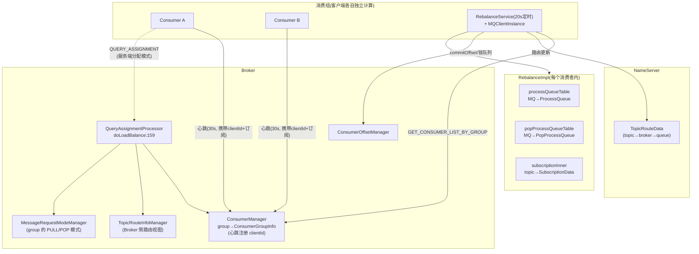

关键分工：

- **ConsumerManager** 是负载均衡的"成员名单"来源：客户端 30s 心跳注册 clientId，2 分钟（`CONSUMER_TIMEOUT_TIME_WHEN_NOT_RECEIVE_HEARTBEAT`=120s）无心跳被剔除
- **clientId** 是参与分配的最小单位，由 `ClientConfig.buildMQClientId()` 生成：`IP@instanceName[@unitName]`
- 每个消费者独立执行相同的分配算法，**只要输入（排序后的 mqAll/cidAll）一致，输出必然一致**——这是客户端负载均衡正确性的根基

---

## 三、客户端 Rebalance 的触发机制

类：`client/src/main/java/org/apache/rocketmq/client/impl/consumer/RebalanceService.java`。

### 3.1 定时循环

```java
// :25 附近
private static long waitInterval = Long.parseLong(
    System.getProperty("rocketmq.client.rebalance.waitInterval", "20000"));  // 默认20s
private static long minInterval = Long.parseLong(
    System.getProperty("rocketmq.client.rebalance.minInterval", "1000"));    // 最小1s

public void run() {
    long realWaitInterval = waitInterval;
    while (!this.isStopped()) {
        this.waitForRunning(realWaitInterval);
        long interval = System.currentTimeMillis() - lastRebalanceTimestamp;
        if (interval < minInterval) {
            realWaitInterval = minInterval - interval;   // 限频
        } else {
            boolean balanced = this.mQClientFactory.doRebalance();
            // ★ 未均衡→1s 后重试(快速收敛); 已均衡→回到 20s 慢轮询
            realWaitInterval = balanced ? waitInterval : minInterval;
            lastRebalanceTimestamp = System.currentTimeMillis();
        }
    }
}
```

**自适应频率**是关键设计：拓扑变化后以 1s 高频重试直到全组均衡，稳定后退回 20s 省资源。

### 3.2 触发事件全景

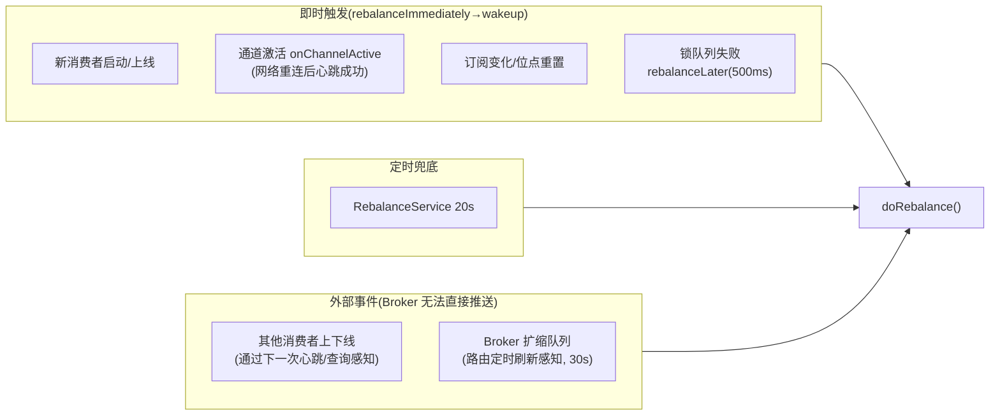

注意：**RocketMQ 4.x/5.x 客户端 Rebalance 没有 Broker→客户端的推送通知**（不同于 Kafka 的 GroupCoordinator rebalance 回调）。其他消费者的上下线只能靠 20s 定时（或 1s 快速收敛期）发现——这就是消费扩容感知延迟的根源。

---

## 四、RebalanceImpl 核心流程

类：`client/src/main/java/org/apache/rocketmq/client/impl/consumer/RebalanceImpl.java`。

### 4.1 doRebalance(:232)

```java
public boolean doRebalance(final boolean isOrder) {
    boolean balanced = true;
    for (final Map.Entry<String, SubscriptionData> entry : getSubscriptionInner().entrySet()) {
        final String topic = entry.getKey();
        if (!clientRebalance(topic)) {
            // 5.x: 服务端分配模式 → 问 Broker 要 assignment
            boolean result = this.getRebalanceResultFromBroker(topic, isOrder);
        } else {
            // 4.x: 客户端分配
            boolean result = this.rebalanceByTopic(topic, isOrder);
        }
        // 失败则 balanced=false → 外层降为 1s 重试
    }
    this.truncateMessageQueueNotMyTopic();
    return balanced;
}
```

`clientRebalance(topic)` 决策走哪条路：顺序消费、广播、Proxy 场景等多走客户端；`serverLoadBalancerEnable` 且配置服务端模式则走 Broker。

### 4.2 rebalanceByTopic(:268) 集群模式

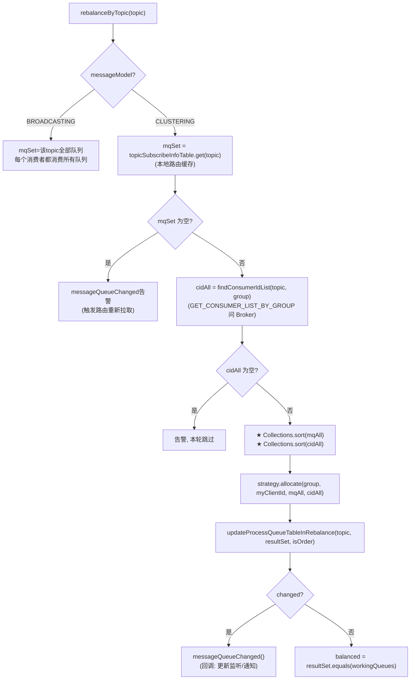

**排序（:J 步）是正确性的命门**：所有消费者必须对两个列表得到完全一致的排序，分配结果才不会冲突（重叠=重复消费，遗漏=消息停滞）。源码用 `Collections.sort`（MessageQueue 与 String 的自然序），两份代码（客户端 :283-284 与 Broker doLoadBalance:205-206）必须保持一致。

### 4.3 广播模式

广播模式下跳过分配——`mqSet` 原样全量进入 `updateProcessQueueTableInRebalance`，每个消费者消费所有队列（代码见 :268 BROADCASTING 分支，`updateProcessQueueTableInRebalance(topic, mqSet, false)`）。

### 4.4 完整时序图

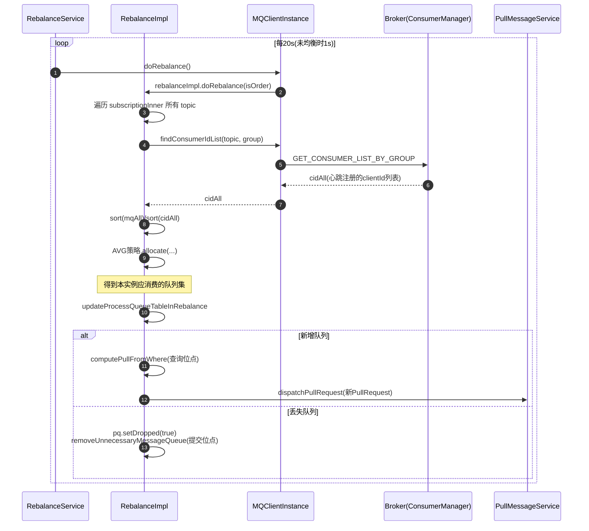

---

## 五、队列分配策略体系

接口：`client/src/main/java/org/apache/rocketmq/client/consumer/AllocateMessageQueueStrategy.java`；实现位于 `client/.../consumer/rebalance/`，共 6 种（+1 抽象基类做参数校验）。

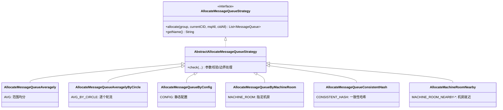

### 5.1 平均分配 AVG（默认）

`AllocateMessageQueueAveragely.java:26-53`：

```java
int index = cidAll.indexOf(currentCID);
int mod = mqAll.size() % cidAll.size();
int averageSize = mqAll.size() <= cidAll.size() ? 1
    : (mod > 0 && index < mod ? mqAll.size() / cidAll.size() + 1   // 前mod个多分1个
                               : mqAll.size() / cidAll.size());
int startIndex = (mod > 0 && index < mod) ? index * averageSize
                                          : index * averageSize + mod;
int range = Math.min(averageSize, mqAll.size() - startIndex);
for (int i = 0; i < range; i++) result.add(mqAll.get(startIndex + i));
```

**连续区间划分**：8 队列 3 消费者 → A=[0,1,2] B=[3,4,5] C=[6,7]。

### 5.2 轮流分配 AVG_BY_CIRCLE

`AllocateMessageQueueAveragelyByCircle.java:26-49`：

```java
int index = cidAll.indexOf(currentCID);
for (int i = index; i < mqAll.size(); i++) {
    if (i % cidAll.size() == index) result.add(mqAll.get(i));
}
```

**交错划分**：8 队列 3 消费者 → A=[0,3,6] B=[1,4,7] C=[2,5]。

| 对比 | AVG | AVG_BY_CIRCLE |
|------|-----|----------------|
| 消费者处理能力不均时 | 前面的消费者先"吃饱"（多 1 个队列） | 队列交错，Broker 访问更分散 |
| 队列倾斜传导 | 一个队列堆积只影响一个消费者 | 轻微分摊 |
| 典型选择 | 默认（DefaultMQPushConsumer 构造器:298-338） | 高并发均匀场景 |

### 5.3 配置指定 CONFIG

`AllocateMessageQueueByConfig.java:22`：直接返回预配置的 `messageQueueList`，不做计算。用于人工固定分配。

### 5.4 机房指定 MACHINE_ROOM

`AllocateMessageQueueByMachineRoom.java:27-75`：按 `brokerName` 中 `roomId@brokerName` 的前缀过滤出指定机房（`consumeridcs` 集合）的队列，再对过滤结果做均分。

### 5.5 一致性哈希 CONSISTENT_HASH

`AllocateMessageQueueConsistentHash.java:30-102`：

```java
// 消费者(含虚拟节点)构建哈希环
router = new ConsistentHashRouter<>(cidNodes, virtualNodeCnt, customHashFunction);
// 每个队列沿环顺时针找到最近的消费者
for (MessageQueue mq : mqAll) {
    ClientNode node = router.routeNode(mq.toString());
    if (node != null && currentCID.equals(node.getKey())) result.add(mq);
}
```

**价值**：消费者上下线时，只有哈希环上相邻区间的队列需要迁移，其余消费者分配不变（AVG 在扩缩容时几乎全量重排）。代价：分配不绝对均匀（虚拟节点数 `virtualNodeCnt` 默认 10，越大越均匀）。

### 5.6 机房就近 MACHINE_ROOM_NEARBY

`AllocateMachineRoomNearby.java:36-129`——**策略代理（装饰器）**：

```java
// 1. 队列按机房分组(mr2Mq), 消费者按机房分组(mr2c), 分组依据是用户实现的:
interface MachineRoomResolver {
    String brokerDeployIn(MessageQueue mq);
    String consumerDeployIn(String clientID);
}
// 2. 本机房队列 → 只和本机房消费者用底层策略分配
allocateResults.addAll(strategy.allocate(group, cid,
    mqInThisMachineRoom, consumerInThisMachineRoom));
// 3. 无消费者的机房 → 其队列由全部消费者瓜分
if (!mr2c.containsKey(room)) {
    allocateResults.addAll(strategy.allocate(group, cid, roomMqs, cidAll));
}
```

策略名为 `MACHINE_ROOM_NEARBY-{底层策略名}`，可组合（如 `MACHINE_ROOM_NEARBY-AVG`）。核心目标：**避免跨机房消费**。

---

## 六、分配结果的落地: 队列增删

`RebalanceImpl.updateProcessQueueTableInRebalance(:426)`——分配只产出"应该消费的队列集合"，本方法将其与现状做 diff：

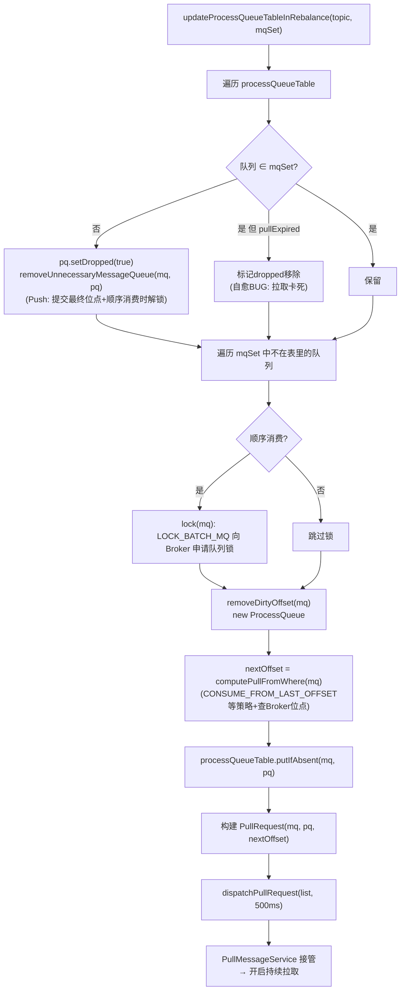

要点：

1. **dropped 标志**而非立即删除：正在消费中的消息处理完才真正移除（ProcessQueue 内部按 dropped 过滤），避免消费到一半的消息丢失状态
2. **removeUnnecessaryMessageQueue**（RebalancePushImpl 实现）：移除前把 ProcessQueue 内最小未消费 offset 提交到 Broker——**这就是 Rebalance 期间可能重复消费的原因之一**（已拉取未 ack 的消息位点被提交，新主人从提交位点重新拉取）
3. `dispatchPullRequest` 在 RebalancePushImpl 中提交给 `PullMessageService`；RebalancePullImpl 中是**空实现**（LitePull 由 assignedMessageQueue 驱动，用户主动 pull）
4. 顺序消费的 `lock(mq)` 失败会 `rebalanceLater(500)` 快速重试，且本轮 `allMQLocked=false` 阻止继续

---

## 七、5.x 服务端负载均衡: Assignment 模式

### 7.1 QueryAssignmentProcessor

类：`broker/src/main/java/org/apache/rocketmq/broker/processor/QueryAssignmentProcessor.java`。客户端通过 `QUERY_ASSIGNMENT` 请求码向 Broker 要分配结果（客户端入口 `RebalanceImpl.getRebalanceResultFromBroker:345` → `MQClientInstance.queryAssignment`）。

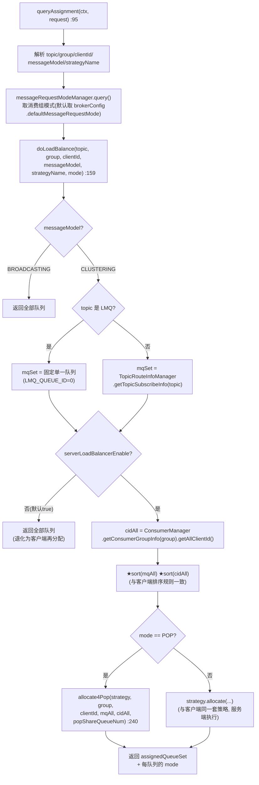

关键点：**服务端复用同一套分配策略接口**（`name2LoadStrategy` 注册表），但决策集中在 Broker，客户端只消费结果——彻底消除"多客户端排序不一致"的竞态。

### 7.2 allocate4Pop: 队列共享分配

`QueryAssignmentProcessor.java:240-274`，POP 模式的分配有三种形态：

```java
public List<MessageQueue> allocate4Pop(strategy, group, clientId, mqAll, cidAll, popShareQueueNum) {
    if (popShareQueueNum <= 0 || popShareQueueNum >= cidAll.size() - 1) {
        // ① 全共享: 每个客户端可以 pop 所有队列(queueId 用 -1 表示不限)
        for (MessageQueue mq : mqAll) {
            allocateResult.add(new MessageQueue(mq.getTopic(), mq.getBrokerName(), -1));
        }
    } else if (cidAll.size() <= mqAll.size()) {
        // ② 部分共享: 先正常分到自己那份, 再追加 cid 列表中
        //    后续 popShareQueueNum 个邻居的队列
        allocateResult = strategy.allocate(group, clientId, mqAll, cidAll);
        int index = cidAll.indexOf(clientId);
        for (int i = 1; i <= popShareQueueNum; i++) {
            index = (index + 1) % cidAll.size();
            allocateResult.addAll(strategy.allocate(group, cidAll.get(index), mqAll, cidAll));
        }
    } else {
        // ③ 消费者多于队列: 每人至少分一个(轮转 index % mqAll.size())
        allocateResult = allocate(group, clientId, mqAll, cidAll);
    }
}
```

| popShareQueueNum | 效果 |
|---|---|
| ≤0（默认） | **全共享**：所有消费者 pop 所有队列，消息级抢占，吞吐最大化 |
| 0 < N < 消费者数-1 | 混合：分到自己的 + 后 N 个邻居的队列，可预测性增强 |
| ≥ 消费者数-1 | 等价全共享 |

注意 `new MessageQueue(topic, brokerName, -1)` 的 **queueId=-1**：与 Pop 消费协议呼应（PopMessageProcessor 中 qid=-1 轮转全部队列），即 assignment 传达的是"这个 broker 的队列你都能 pop"。

### 7.3 客户端侧落地: updateMessageQueueAssignment

`RebalanceImpl.getRebalanceResultFromBroker(:345)` 拿到 `Set<MessageQueueAssignment>` 后（:508）：

```java
// 1. 按模式分流(源码 :519)
for (MessageQueueAssignment assignment : assignments) {
    if (MessageRequestMode.POP == assignment.getMode()) {
        mq2PopAssignment.put(mq, assignment);
    } else {
        mq2PushAssignment.put(mq, assignment);
    }
}
// 2. 分别对 popProcessQueueTable / processQueueTable 做增删(逻辑同第六章)
// 3. POP 新队列 → 构建 PopRequest 提交 popPullMessageService
//    PUSH 新队列 → 构建 PullRequest 提交 pullMessageService
```

**一个消费组可同时存在 Pop 与 Pull 队列**（迁移期 Pop↔Push 切换 :527-528 有专门处理），实现无停机模式迁移。

---

## 八、Pop 消费如何"消灭"负载均衡

Assignment + Pop 组合的终极形态（`popShareQueueNum<=0` 全共享）：

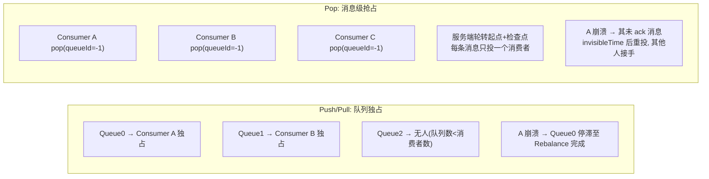

- **分配退化为"是否允许 pop 这个 broker"**，负载均衡下沉到消息粒度：谁先 pop 到谁消费（详见《RocketMQ_Pop消费源码深度分析.md》第四章的 randomQ 轮转与检查点机制）
- 消费者数不再受队列数约束，**扩缩容零重分配**
- 故障恢复时间 = invisibleTime（秒级可控），而非 Rebalance 周期（20s 级）+ 队列迁移

---

## 九、顺序消费与队列锁

顺序消费（MessageListenerOrderly）在负载均衡之上加了**队列锁**：

| 层级 | 机制 | 代码 |
|------|------|------|
| Broker 全局锁 | `LOCK_BATCH_MQ` 请求锁定队列，Broker 记录 group+mq 的持锁者 | RebalanceImpl.lock/unlock, Broker LockBatchMessageProcessor |
| 客户端本地锁 | ProcessQueue.locked 标志 + `MessageQueueLock`（每个 mq 一把对象锁），保证同一队列消费线程串行 | ConsumeMessageOrderlyService |
| 锁续期 | 定时 `lockMQPeriodically`（默认 20s）向 Broker 续锁；掉锁则暂停消费等待重新分配 | RebalancePushImpl |

作用：Rebalance 迁移队列时，新旧消费者对同一队列的**消费串行化**——新主人必须等旧主人 unlock 后才能锁上，保证分区内顺序不乱。

---

## 十、经典问题与源码解释

### 10.1 消费者上线下线为什么有最长 ~20s 感知延迟？

RebalanceService 默认 20s 一轮 + 无 Broker 推送（第三章）。已均衡状态没有 1s 快速收敛。可通过 `rocketmq.client.rebalance.waitInterval` 调小。

### 10.2 为什么多实例同 clientId 会消息"漏消费"？

`buildMQClientId()` = `IP@instanceName`。同机多进程默认 instanceName 都是 `DEFAULT` → Broker ConsumerManager 里**互相覆盖心跳**（同一 clientId 视为一个消费者）→ cidAll 缺员 → 部分队列被分给"幽灵消费者"无人拉取。解法：`changeInstanceNameToPID()` 或手动设置唯一 instanceName。

### 10.3 Rebalance 为什么导致重复消费？

第六章 removeUnnecessaryMessageQueue 移除队列时提交的是 ProcessQueue 的**最小未消费位点**，而已拉取未消费完成的消息位于该位点之后——新主人从提交位点重新拉取这些消息。Pop 模式用"位点只前进 + retry topic"回避了这一点（重复仍在但消息级可控）。

### 10.4 消费者数 > 队列数为什么会空闲？

AVG/轮转策略下 `mqAll.size() <= cidAll.size()` 时每个消费者最多 1 个队列，多余消费者 `allocateResult` 为空。解法：加队列数、切 Pop 模式、或 CONSISTENT_HASH（同样受限）。**根治是 Pop**。

### 10.5 分配结果为什么会"冲突"（同一队列两个消费者）？

任何导致 `mqAll`/`cidAll` 视图不一致或排序不一致的因素：路由刷新时间差（新队列只被部分消费者看到）、心跳过期剔除时间差、混合版本客户端排序实现差异。服务端 Assignment 模式从根上解决。

---

## 十一、专题: 消息级负载均衡的完整实现

> 本章是对第七、八章的端到端串联：从 Assignment 协议到 pop 执行，逐层拆解"队列独占如何退化为消息级抢占"。

### 11.1 三层结构: 协议层只是入口, 真正的负载均衡在执行层

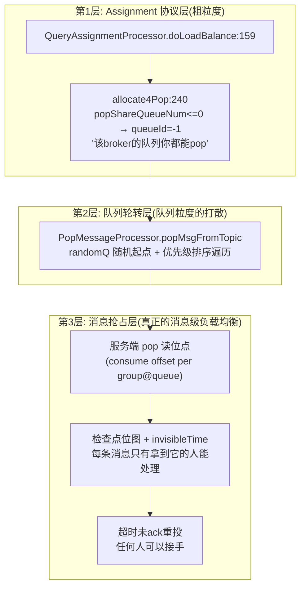

关键认知：**消息级负载均衡不是"把消息分给消费者"，而是"消费者来抢消息，服务端保证每条消息同一时刻只有一个主人"**。三个组件各司其职：

- Assignment 层：回答"你能去哪些 broker 抢"（全共享时就是全部）
- 轮转层：回答"这一次请求先去哪个队列抢"（打散热点）
- 抢占层：回答"这条消息归谁、归多久、违约怎么办"（核心）

### 11.2 客户端执行链路（已核实源码）

Assignment 到达后，客户端的分流与执行（区别于 Pull 的关键点全在客户端"变薄"）：

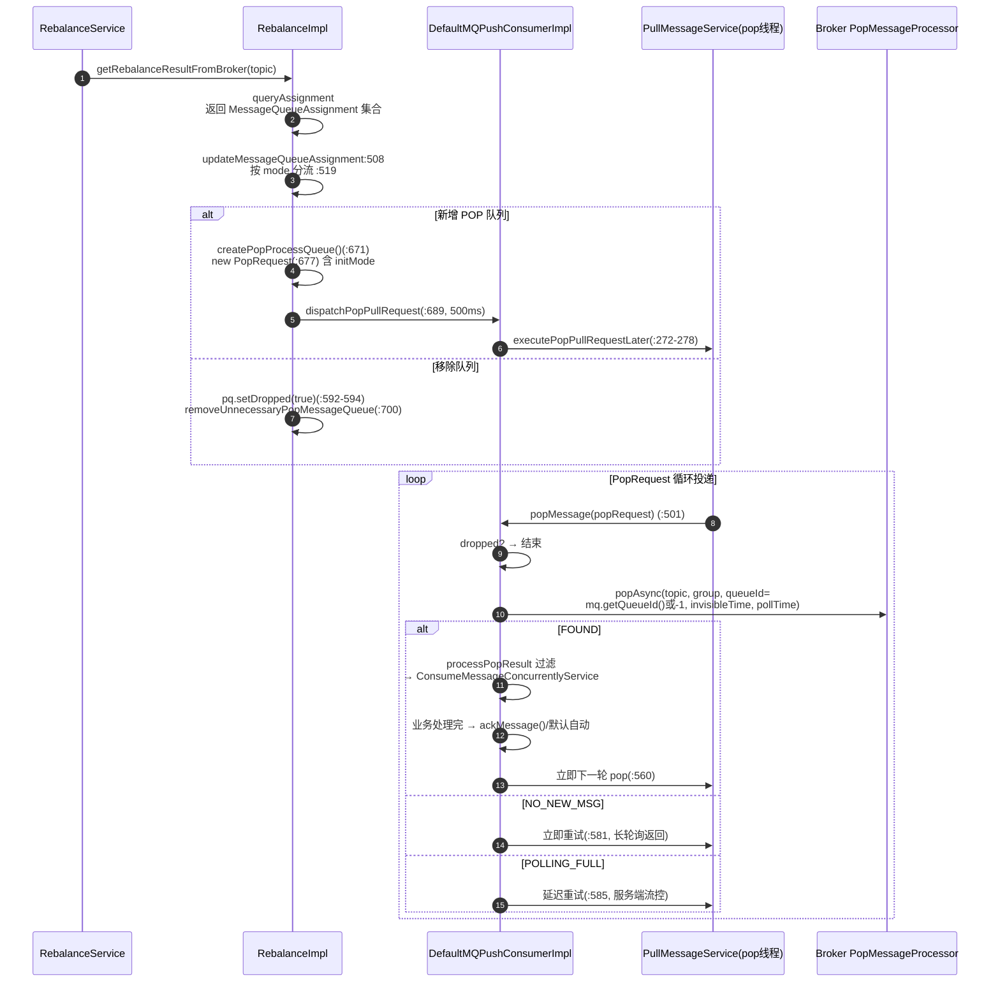

**PopProcessQueue 与 ProcessQueue 的本质差异**（PopProcessQueue.java:25-31）：

```java
public class PopProcessQueue {
    private long lastPopTimestamp;          // 只剩活性检测
    private AtomicInteger waitAckCounter;   // 在途未ack计数(流控用)
    private volatile boolean dropped;
}
```

对比 Pull 模式的 `ProcessQueue`（含 `msgTreeMap` 本地消息缓存、offset 区间、消费锁……）——**Pop 客户端不再缓存消息、不再管理位点、不再需要队列锁**，一切状态上移服务端。客户端唯一保留的是"每队列一个循环投递的 PopRequest"骨架，用来维持 pop 节奏和流控（`waitAckCounter` 超限即本地暂停投递）。

### 11.3 抢占层: 每条消息的"归属仲裁"

消息级的实现核心在服务端三个状态量（详见《RocketMQ_Pop消费源码深度分析.md》）：

**① pop 读位点（抢到的凭证）**

```
ConsumerOffsetManager: topic@group → {queueId: nextPopOffset}
```

pop 时位点乐观推进到本批末尾（`nextBeginOffset`），后来者只能从新位点之后 pop——**位点前进即抢占成功**，无需任何锁。

**② 检查点位图（在途消息的隔离带）**

```
PopCheckPoint: bitMap 每位代表一条消息, 0=在途, 1=已ack
reviveTime = popTime + invisibleTime
```

**③ 重投（违约者的回收）**：超时未全 ack → PopReviveService/PopConsumerService 把未 ack 消息写入 retry topic → 任何消费者可再次抢到。消息回到可抢占池。

### 11.4 消息级"均衡"的达成机制

真正决定"谁多消费谁少消费"的不是分配算法，而是**抢占的自然竞争 + 动态自平衡**：

| 机制 | 均衡作用 | 源码位置 |
|------|----------|----------|
| 消费者各自循环 pop | 处理快的消费者 pop 频率高 → 天然多劳多得 | popMessage(:501) FOUND→立即下一轮(:560) |
| 随机起点轮转 | 避免所有消费者同时打同一个队列 | popMsgFromTopic 的 randomQ |
| 长轮询队列排号 | 同组消费者按 FIFO 顺序被唤醒，机会均等 | PopLongPollingService PopRequest.COMPARATOR |
| invisibleTime 流控 | 慢消费者在途消息少，可继续抢；崩溃消费者的消息 30s(默认) 后回流 | CK.reviveTime |
| 服务端流控 | POLLING_FULL + maxMsgNums 上限防止单消费者一次吃太多 | popResult.getPopStatus() |

**与队列级分配的哲学差异**：

- 队列级（AVG）：**事前静态均分**，分完就定，倾斜只能等下次 Rebalance 纠正
- 消息级（Pop）：**事后动态收敛**，谁快谁多拿，无需任何"分配"动作；系统倾斜（某消费者慢）自动通过在途上限 + 超时回流自愈

### 11.5 混合模式: popShareQueueNum 的中间形态

部分共享模式（`0 < popShareQueueNum < cidAll.size()-1`，allocate4Pop:254-266）是两种哲学的折中：

```java
// 分到自己的 + cid 列表中后 N 个邻居的队列
allocateResult = strategy.allocate(group, clientId, mqAll, cidAll);
int index = cidAll.indexOf(clientId);
for (int i = 1; i <= popShareQueueNum; i++) {
    index = (index + 1) % cidAll.size();
    allocateResult.addAll(strategy.allocate(group, cidAll.get(index), mqAll, cidAll));
}
```

效果：每个队列最多被 `popShareQueueNum+1` 个消费者共享——**保留队列亲和性（缓存友好）同时获得消息级弹性**。N=0（全共享）时亲和性完全消失，每个消费者都在 pop 所有队列，页缓存/客户端路由缓存的局部性最差但吞吐弹性最大。

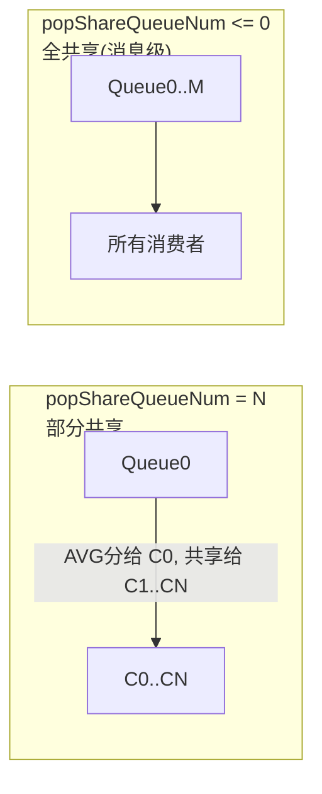

## 十二、总结与源码索引

### 12.1 设计总结（消息级专题小结）

1. 消息级负载均衡 = **Assignment 定准入（粗） + 轮转打散（中） + 位点抢占/检查点/重投（细）** 三层叠加
2. 客户端从"状态持有者"退化为"无状态 pop 循环"（PopProcessQueue 仅 3 个字段），扩缩容天然零迁移
3. "均衡"不再由算法保证，而由**竞争收敛**保证：快者多劳、超时回流、流控兜底——这是从"计划分配"到"市场竞争"的范式转变
4. 代价是 at-least-once（抢占交接窗口的重复）与服务端状态管理成本（CK/RocksDB/revive），换取的是无限的消费者水平扩展能力


### 12.2 负载均衡体系设计总结

1. **确定性重放代替协商**：客户端 Rebalance 没有"协商/选举"协议，靠"所有人用同样输入跑同样算法"得到一致结果——简单、无中心，但把一致性责任交给了排序和视图同步
2. **策略即插件**：`AllocateMessageQueueStrategy` 接口同时跑在客户端（4.x 路径）和 Broker（Assignment 路径），6 种算法可组合（MACHINE_ROOM_NEARBY 装饰 AVG）
3. **演进方向是去客户端化**：队列独占（Push）→ 队列共享（Pop + popShareQueueNum）→ 消息级抢占（pop qid=-1），Rebalance 逐步退化为"Assignment 查询"
4. **两级容错**：定时 20s 兜底 + 未均衡 1s 快速收敛；dropped 标志 + 位点提交保证迁移期不丢（只可能重）

### 12.3 源码索引

| 功能 | 类 | 位置 |
|------|----|------|
| 定时触发 | RebalanceService | :25 参数, run() 自适应频率 |
| Rebalance 总入口 | RebalanceImpl | doRebalance:232, rebalanceByTopic:268 |
| 服务端模式入口 | RebalanceImpl | getRebalanceResultFromBroker:345, updateMessageQueueAssignment:508, 分流:519 |
| 队列增删 | RebalanceImpl | updateProcessQueueTableInRebalance:426 |
| 客户端ID | ClientConfig | buildMQClientId() |
| 平均分配 | AllocateMessageQueueAveragely | :26-53 |
| 轮流分配 | AllocateMessageQueueAveragelyByCircle | :26-49 |
| 一致性哈希 | AllocateMessageQueueConsistentHash | :30-102 |
| 机房就近 | AllocateMachineRoomNearby | :36-129, MachineRoomResolver |
| 服务端分配 | QueryAssignmentProcessor | queryAssignment:95, doLoadBalance:159, allocate4Pop:240 |
| 消费组模式管理 | MessageRequestModeManager | broker/.../topic/ |
| 成员名单 | ConsumerManager / ConsumerGroupInfo | 心跳注册, getAllClientId |
| 默认策略装配 | DefaultMQPushConsumer | 构造器 :298-338 |
