# RocketMQ 5.5.0 源码深度分析

> 本文档基于 RocketMQ 5.5.0 源码，深入剖析其整体架构、核心工作流程、底层实现原理与设计思想。所有流程图、架构图、时序图均以 Mermaid 呈现。

---

## 目录

- [一、整体架构与模块职责](#一整体架构与模块职责)
- [二、服务端启动流程](#二服务端启动流程)
- [三、消息发送流程与生产者优秀设计](#三消息发送流程与生产者优秀设计)
- [四、消息存储模型](#四消息存储模型)
- [五、内存映射机制](#五内存映射机制)
- [六、刷盘机制](#六刷盘机制)
- [七、过期删除机制](#七过期删除机制)
- [八、网络通信机制](#八网络通信机制)
- [九、消息消费流程（Push 消费详解）](#九消息消费流程push-消费详解)
- [十、负载均衡机制](#十负载均衡机制)
- [十一、长轮询设计](#十一长轮询设计)
- [十二、消息重试机制](#十二消息重试机制)
- [十三、消息过滤原理](#十三消息过滤原理)
- [十四、消息查询原理](#十四消息查询原理)
- [十五、事务消息原理](#十五事务消息原理)
- [十六、延迟消息原理](#十六延迟消息原理)
- [十七、顺序消息设计与实现](#十七顺序消息设计与实现)
- [十八、主从复制原理](#十八主从复制原理)
- [十九、高可用各种模式实现原理](#十九高可用各种模式实现原理)
- [二十、Pop 消费机制（5.x 新特性）](#二十pop-消费机制5x-新特性)
- [二十一、RocketMQ 5.x 新特性](#二十一rocketmq-5x-新特性)
- [二十二、其他值得关注的底层设计与实现](#二十二其他值得关注的底层设计与实现)
- [二十三、AI 场景支持与 Lite Topic 设计原理](#二十三ai-场景支持与-lite-topic-设计原理)
- [二十四、分级存储（Tiered Storage）](#二十四分级存储tiered-storage)
- [二十五、RocksDB 存储引擎](#二十五rocksdb-存储引擎)
- [二十六、总结与设计精华](#二十六总结与设计精华)

---

## 一、整体架构与模块职责

### 1.1 模块总览

RocketMQ 5.5.0 采用多模块（Multi-Module）的 Maven 工程结构，同时支持 Bazel 构建。各核心模块职责如下：

| 模块 | 代码路径 | 主要职责 |
|------|-----------|----------|
| **broker** | `/broker` | 消息存储与转发核心服务端，负责消息接收、存储、查询、转发，与 NameServer/客户端通信 |
| **client** | `/client` | 客户端 SDK，包含 Producer/Consumer 实现，提供消息发送/消费 API |
| **common** | `/common` | 通用工具类、常量、数据模型，被几乎所有模块依赖 |
| **container** | `/container` | Broker 容器模块，一个 JVM 内运行多个 Broker 实例 |
| **controller** | `/controller` | 控制器模块，集群级元数据管理与自动故障转移（5.x 新特性） |
| **filter** | `/filter` | 消息过滤模块，支持 TAG 与 SQL92 过滤 |
| **namesrv** | `/namesrv` | NameServer 命名与路由注册中心 |
| **proxy** | `/proxy` | 代理服务，提供 gRPC 协议接入与反向代理（5.x 新特性） |
| **remoting** | `/remoting` | 基于 Netty 的高性能远程通信框架 |
| **store** | `/store` | 消息存储引擎，持久化、索引、刷盘 |
| **tieredstore** | `/tieredstore` | 分级存储，冷数据下沉到远端存储（5.x 新特性） |
| **tools** | `/tools` | 命令行运维工具集 |
| **auth** | `/auth` | 认证授权模块 |

### 1.2 模块依赖关系

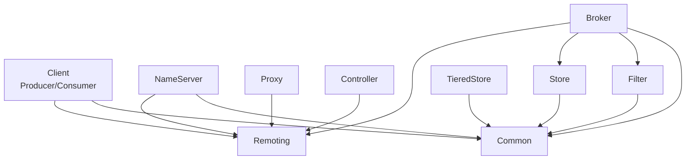
```mermaid
graph TD
    Client[Client<br/>Producer/Consumer]
    Broker[Broker]
    NameSrv[NameServer]
    Proxy[Proxy]
    Controller[Controller]
    Store[Store]
    TieredStore[TieredStore]
    Remoting[Remoting]
    Common[Common]
    Filter[Filter]

    Client --> Remoting
    Broker --> Remoting
    Broker --> Store
    Broker --> Filter
    Broker --> Common
    NameSrv --> Remoting
    NameSrv --> Common
    Proxy --> Remoting
    Controller --> Remoting
    Store --> Common
    TieredStore --> Common
    Client --> Common
    Filter --> Common
```

### 1.3 整体部署架构

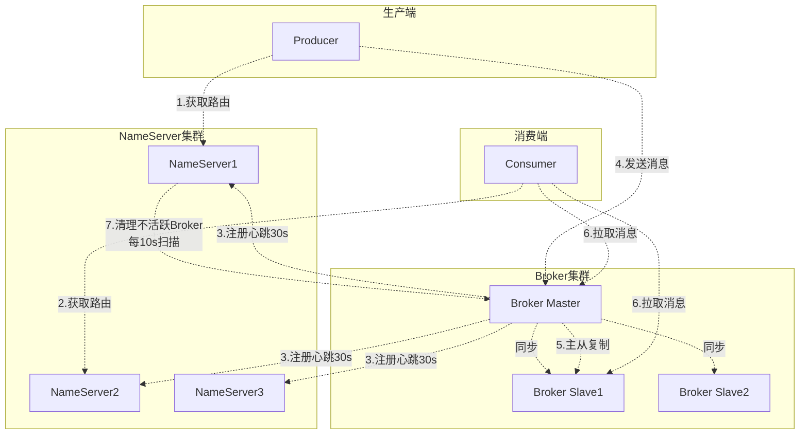
```mermaid
graph TB
    subgraph 生产端
        P[Producer]
    end
    subgraph 消费端
        C[Consumer]
    end
    subgraph NameServer集群
        N1[NameServer1]
        N2[NameServer2]
        N3[NameServer3]
    end
    subgraph Broker集群
        M[Broker Master]
        S1[Broker Slave1]
        S2[Broker Slave2]
        M -.同步.-> S1
        M -.同步.-> S2
    end

    P -.->|1.获取路由| N1
    C -.->|2.获取路由| N2
    M -.->|3.注册心跳30s| N1
    M -.->|3.注册心跳30s| N2
    M -.->|3.注册心跳30s| N3
    P -.->|4.发送消息| M
    M -.->|5.主从复制| S1
    C -.->|6.拉取消息| M
    C -.->|6.拉取消息| S1
    N1 -.->|7.清理不活跃Broker<br/>每10s扫描| M
```

### 1.4 核心组件协作流程

1. **Broker 启动**：加载配置 → 初始化 BrokerController → 启动存储引擎、Netty 服务、各类后台线程 → 向所有 NameServer 注册心跳（默认 30s 一次）
2. **Producer 启动**：创建 MQClientInstance → 启动定时任务（更新路由、发送心跳、持久化 offset）→ 从 NameServer 拉取 Topic 路由信息 → 发送消息到对应 Broker 队列
3. **Consumer 启动**：创建 MQClientInstance → 启动 RebalanceService（每 20s 一次）→ 触发 Rebalance 分配队列 → 创建 PullRequest → PullMessageService 循环拉取 → 回调消费
4. **NameServer 维护**：每 10s 扫描 `brokerLiveTable`，移除超过 120s 未心跳的 Broker

---

## 二、服务端启动流程

### 2.1 Broker 启动流程

启动入口：`broker/src/main/java/org/apache/rocketmq/broker/BrokerStartup.java`

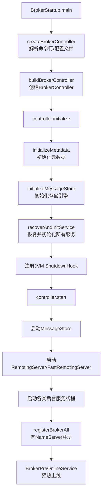
```mermaid
flowchart TD
    A[BrokerStartup.main] --> B[createBrokerController<br/>解析命令行/配置文件]
    B --> C[buildBrokerController<br/>创建BrokerController]
    C --> D[controller.initialize]
    D --> D1[initializeMetadata<br/>初始化元数据]
    D1 --> D2[initializeMessageStore<br/>初始化存储引擎]
    D2 --> D3[recoverAndInitService<br/>恢复并初始化所有服务]
    D3 --> E[注册JVM ShutdownHook]
    E --> F[controller.start]
    F --> F1[启动MessageStore]
    F1 --> F2[启动RemotingServer/FastRemotingServer]
    F2 --> F3[启动各类后台服务线程]
    F3 --> F4[registerBrokerAll<br/>向NameServer注册]
    F4 --> F5[BrokerPreOnlineService<br/>预热上线]
```

#### 2.1.1 加载的核心配置类

| 配置类 | 用途 | 关键默认值 |
|-------|------|-----------|
| `BrokerConfig` | Broker 核心配置 | brokerName=default-broker, listenPort=10911, brokerClusterName=DefaultCluster |
| `MessageStoreConfig` | 存储配置 | storePathRootDir=~/store, fileReservedTime=72h, mappedFileSizeCommitLog=1G |
| `NettyServerConfig` | Netty 服务端配置 | listenPort=10911 |
| `NettyClientConfig` | Netty 客户端配置 | - |
| `AuthConfig` | 认证授权配置 | 默认禁用 |

配置加载优先级：命令行参数 > 配置文件属性 > 默认值。

#### 2.1.2 BrokerController.initialize 流程

```java
public boolean initialize() throws CloneNotSupportedException {
    boolean result = this.initializeMetadata();      // 元数据管理
    if (!result) return false;
    result = this.initializeMessageStore();            // 存储引擎（根据配置选择 DefaultMessageStore 或 RocksDBMessageStore）
    if (!result) return false;
    return this.recoverAndInitService();              // 恢复 + 初始化全部服务
}
```

`recoverAndInitService()` 内部依次完成：
1. 加载消息存储并 recover（恢复 CommitLog、ConsumeQueue、IndexFile）
2. 加载定时消息存储（TimerMessageStore，若启用）
3. 加载调度消息服务 ScheduleMessageService
4. 初始化 Lite 服务
5. 加载附加插件
6. 初始化 BrokerMetricsManager
7. 初始化远程通信服务器（NettyRemotingServer、FastRemotingServer）
8. 初始化资源（线程池、AllocateMappedFileService、StoreCheckpoint 等）
9. 注册请求处理器 registerProcessor()
10. 初始化定时任务（持久化 offset、消费者过滤数据、消费进度、保护 Broker 等）
11. 初始化事务相关组件（TransactionalMessageService、TransactionalMessageCheckService）
12. 初始化 RPC 钩子与请求管道
13. 初始化 TLS 证书监听（若启用）

#### 2.1.3 启动的核心服务与定时任务

**核心服务线程：**
- `RemotingServer` / `FastRemotingServer`：监听 10911 端口（VIP 端口 10909）
- `MessageStore`（DefaultMessageStore）：含 ReputMessageService、FlushManager、CleanCommitLogService、CleanConsumeQueueService、AllocateMappedFileService 等内部线程
- `TimerMessageStore`：精确延迟消息（若启用）
- `ScheduleMessageService`：18 级延迟消息调度
- `BrokerMetricsManager`：指标监控
- `BrokerPreOnlineService`：上线预处理

**定时任务：**
- 持久化 ConsumerOffset（默认 5s）
- 持久化 ConsumerFilterData（默认 10s）
- 持久化消费进度、保护 Broker（默认 3s/60s）
- 向 NameServer 注册心跳（默认 30s）
- 事务消息回查（默认 60s）

#### 2.1.4 registerBrokerAll 流程

Broker 启动后立即注册一次，之后每 30s 注册一次。流程：
1. 构造 `RegisterBrokerRequestHeader`，包含 brokerName、clusterName、brokerAddr、haServerAddr、topicConfigWrapper、filterServerList 等
2. 遍历所有 NameServer 地址，通过 `MQClientAPIImpl.registerBroker` 发送 REGISTER_BROKER 请求
3. NameServer 接收后调用 `RouteInfoManager.registerBroker` 更新 `brokerAddrTable`、`clusterAddrTable`、`topicQueueTable`、`brokerLiveTable`

#### 2.1.5 ShutdownHook

通过 `Runtime.getRuntime().addShutdownHook` 注册 JVM 关闭钩子，收到 SIGTERM 时调用 `BrokerController.shutdown()`，依次关闭存储引擎、远程服务、线程池，并向 NameServer 发送注销请求。

### 2.2 NameServer 启动流程

启动入口：`namesrv/src/main/java/org/apache/rocketmq/namesrv/NamesrvStartup.java`

```java
public static void main(String[] args) {
    main0(args);              // 启动 NamesrvController
    controllerManagerMain(); // 若启用 Controller 模式，启动 ControllerManager
}
```

`NamesrvController.initialize()` 流程：
1. `loadConfig()`：加载 KV 配置
2. `initiateNetworkComponents()`：初始化 Netty 服务器/客户端
3. `initiateThreadExecutors()`：初始化线程池
4. `registerProcessor()`：注册默认处理器 `DefaultRequestProcessor`、`ClientRequestProcessor`
5. `startScheduleService()`：
   - 每 10s 扫描不活跃 Broker（`scanNotActiveBroker`），移除超过 120s 未心跳的 Broker
   - 每 10min 打印 KV 配置
   - 每 10s 打印水位日志
6. `initiateSslContext()`、`initiateRpcHooks()`

### 2.3 RouteInfoManager 路由信息

`RouteInfoManager` 是 NameServer 的核心路由管理组件，维护以下数据结构：

| 数据结构 | 类型 | 用途 |
|---------|------|------|
| `topicQueueTable` | `Map<String/topic, Map<brokerName, QueueData>>` | Topic → 队列分布 |
| `brokerAddrTable` | `Map<brokerName, BrokerData>` | BrokerName → Broker 地址（含 master/slave） |
| `clusterAddrTable` | `Map<clusterName, Set<brokerName>>` | 集群 → Broker 集合 |
| `brokerLiveTable` | `Map<BrokerAddrInfo, BrokerLiveInfo>` | Broker 地址 → 实时状态（最后心跳时间、数据版本、通道、心跳超时） |

### 2.4 Broker Processor 体系

Broker 通过 `registerProcessor()` 注册处理器，请求码（RequestCode）→ Processor 映射：

| Processor | 处理的 RequestCode | 职责 |
|-----------|-------------------|------|
| `SendMessageProcessor` | SEND_MESSAGE, SEND_MESSAGE_V2, SEND_BATCH_MESSAGE, CONSUMER_SEND_MSG_BACK, RECALL_MESSAGE | 消息发送 |
| `PullMessageProcessor` | PULL_MESSAGE, LITE_PULL_MESSAGE | 消息拉取（长轮询） |
| `PopMessageProcessor` | POP_MESSAGE, POP_LITE_MESSAGE | Pop 消费拉取 |
| `AckMessageProcessor` | ACK_MESSAGE, BATCH_ACK_MESSAGE | Pop 消费确认 |
| `ChangeInvisibleTimeProcessor` | CHANGE_MESSAGE_INVISIBLETIME | 修改 Pop 不可见时间 |
| `QueryMessageProcessor` | QUERY_MESSAGE, VIEW_MESSAGE_BY_ID | 消息查询 |
| `ClientManageProcessor` | HEART_BEAT, UNREGISTER_CLIENT | 客户端管理 |
| `ConsumerManageProcessor` | GET_CONSUMER_LIST_BY_GROUP, UPDATE_CONSUMER_OFFSET, QUERY_CONSUMER_OFFSET | 消费者管理 |
| `EndTransactionProcessor` | END_TRANSACTION | 事务消息提交/回滚 |
| `AdminBrokerProcessor` | 默认处理器 | 管理类请求 |

---

## 三、消息发送流程与生产者优秀设计

### 3.1 Producer 启动流程

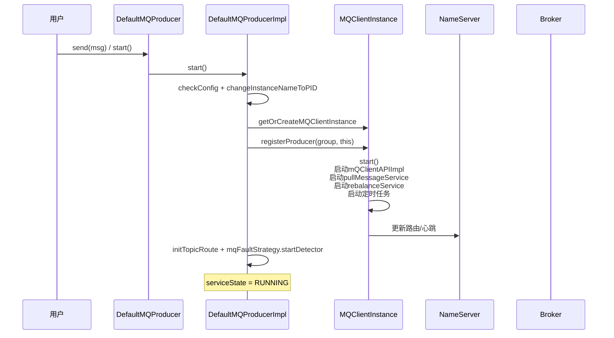
```mermaid
sequenceDiagram
    participant U as 用户
    participant P as DefaultMQProducer
    participant PI as DefaultMQProducerImpl
    participant MCI as MQClientInstance
    participant NS as NameServer
    participant B as Broker

    U->>P: send(msg) / start()
    P->>PI: start()
    PI->>PI: checkConfig + changeInstanceNameToPID
    PI->>MCI: getOrCreateMQClientInstance
    PI->>MCI: registerProducer(group, this)
    MCI->>MCI: start()<br/>启动mQClientAPIImpl<br/>启动pullMessageService<br/>启动rebalanceService<br/>启动定时任务
    MCI->>NS: 更新路由/心跳
    PI->>PI: initTopicRoute + mqFaultStrategy.startDetector
    Note over PI: serviceState = RUNNING
```

`DefaultMQProducerImpl.start()`（`client/.../producer/DefaultMQProducerImpl.java:239`）关键步骤：
1. `checkConfig()` 校验 producerGroup 等配置
2. `changeInstanceNameToPID()`（非内部 producer 组）
3. `MQClientManager.getInstance().getOrCreateMQClientInstance()` 获取/创建客户端实例
4. `initProduceAccumulator()` 初始化批量聚合器
5. `registerProducer()` 注册到 MQClientInstance
6. `mQClientFactory.start()` 启动客户端实例
7. `initTopicRoute()` 初始化主题路由
8. `mqFaultStrategy.startDetector()` 启动故障检测

### 3.2 消息发送核心流程

调用链：`DefaultMQProducer.send` → `DefaultMQProducerImpl.send` → `sendDefaultImpl`

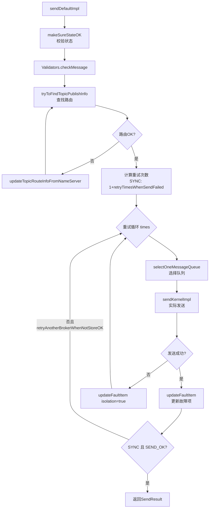
```mermaid
flowchart TD
    A[sendDefaultImpl] --> B[makeSureStateOK<br/>校验状态]
    B --> C[Validators.checkMessage]
    C --> D[tryToFindTopicPublishInfo<br/>查找路由]
    D --> E{路由OK?}
    E -- 否 --> F[updateTopicRouteInfoFromNameServer]
    F --> D
    E -- 是 --> G[计算重试次数<br/>SYNC: 1+retryTimesWhenSendFailed]
    G --> H{重试循环 times<timesTotal}
    H --> I[selectOneMessageQueue<br/>选择队列]
    I --> J[sendKernelImpl<br/>实际发送]
    J --> K{发送成功?}
    K -- 是 --> L[updateFaultItem<br/>更新故障项]
    K -- 否 --> M[updateFaultItem isolation=true]
    M --> H
    L --> N{SYNC 且 SEND_OK?}
    N -- 否且retryAnotherBrokerWhenNotStoreOK --> H
    N -- 是 --> O[返回SendResult]
```

#### 3.2.1 sendKernelImpl 详细步骤

`sendKernelImpl`（`DefaultMQProducerImpl.java:911`）是实际发送的核心：

1. **查找 Broker 地址**：`findBrokerAddressInPublish(brokerName)`，找不到则重新拉路由
2. **VIP 通道处理**：`MixAll.brokerVIPChannel(true, brokerAddr)`，端口 -2（10911 → 10909），隔离生产/消费流量
3. **设置唯一 ID**：`MessageClientIDSetter.setUniqID(msg)`（非批量）
4. **消息压缩**：`tryToCompressMessage(msg)`，当 body 长度 ≥ `compressMsgBodyOverHowmuch`（默认 4096）时压缩，设置 `COMPRESSED_FLAG`
5. **事务标志处理**：若 `PROPERTY_TRANSACTION_PREPARED=true`，设置 `TRANSACTION_PREPARED_TYPE`
6. **执行 CheckForbidden Hook**：禁止发送钩子
7. **执行 SendMessage Hook（before）**：消息轨迹等
8. **构建 SendMessageRequestHeader**：producerGroup、topic、defaultTopic、queueId、sysFlag、bornTimestamp、flag、properties、brokerName 等
9. **根据通信模式调用** `mQClientFactory.getMQClientAPIImpl().sendMessage(...)`：SYNC/ONEWAY/ASYNC
10. **执行 SendMessage Hook（after）**：设置 sendResult

#### 3.2.2 三种发送方式对比

| 特性 | 同步 SYNC | 异步 ASYNC | 单向 ONEWAY |
|------|----------|-----------|------------|
| 是否等待响应 | 是 | 否，回调 | 否 |
| 异常反馈 | 抛异常 | 回调 onFailure | 无 |
| 可靠性 | 最高 | 高 | 最低 |
| 性能 | 最低 | 中 | 最高 |
| 适用场景 | 重要业务 | 高吞吐业务 | 日志 |

### 3.3 生产者优秀设计

#### 3.3.1 重试与容错

- **`retryTimesWhenSendFailed`**：同步发送失败重试次数，默认 2（总发送 3 次）
- **`retryAnotherBrokerWhenNotStoreOK`**：存储非 OK 时切换 Broker 重试
- **`MQFaultStrategy` + `sendLatencyFaultEnable`**：基于延迟的故障隔离

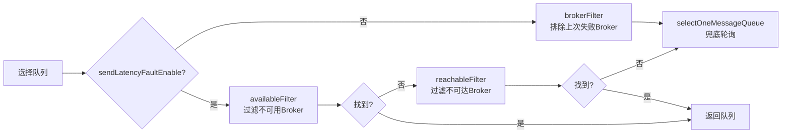
```mermaid
flowchart LR
    A[选择队列] --> B{sendLatencyFaultEnable?}
    B -- 是 --> C[availableFilter<br/>过滤不可用Broker]
    C --> D{找到?}
    D -- 否 --> E[reachableFilter<br/>过滤不可达Broker]
    E --> F{找到?}
    F -- 否 --> G[selectOneMessageQueue<br/>兜底轮询]
    D -- 是 --> H[返回队列]
    F -- 是 --> H
    B -- 否 --> I[brokerFilter<br/>排除上次失败Broker]
    I --> G
```

`updateFaultItem` 根据发送延迟 `currentLatency` 查表得到不可用时长 `duration`，存入 `latencyFaultTolerance`，使故障 Broker 在该时长内被隔离，避免向慢/挂的 Broker 继续发送。

#### 3.3.2 队列选择策略

`MessageQueueSelector` 接口实现：

| 实现 | 算法 | 场景 |
|------|------|------|
| `SelectMessageQueueByHash` | `arg.hashCode() % mqs.size()` | 顺序消息、按 key 路由 |
| `SelectMessageQueueByRandom` | `random.nextInt(size)` | 随机分散 |
| `SelectMessageQueueByMachineRoom` | 机房感知 | 跨机房部署 |

#### 3.3.3 批量发送

`MessageBatch` 实现 `Iterable<Message>`，通过 `MessageDecoder.encodeMessages` 编码为批量消息。`ProduceAccumulator`（`client/.../producer/ProduceAccumulator.java:253`）在客户端聚合同 topic/queue 的消息为一批发送，提升吞吐。

#### 3.3.4 消息压缩

支持多种压缩算法（ZLIB、LZ4、ZSTD），通过 `MessageSysFlag.getCompressionType(sysFlag)` 标识压缩类型。`compressMsgBodyOverHowmuch` 默认 4096 字节，`compressLevel` 默认 5。

#### 3.3.5 VIP 通道

`MixAll.brokerVIPChannel`：端口 -2，将生产者流量与消费者流量隔离到不同端口，避免消费者长轮询阻塞生产者。

#### 3.3.6 消息轨迹

`enableMsgTrace` 开启后创建 `AsyncTraceDispatcher`，注册 `SendMessageTraceHookImpl`，在发送前后异步采集轨迹。

#### 3.3.7 Hook 机制

`SendMessageHook` 接口提供 `sendMessageBefore` / `sendMessageAfter`，允许在发送前后插入自定义逻辑（监控、轨迹、审计）。

---

## 四、消息存储模型

### 4.1 存储架构总览

RocketMQ 采用 **三级存储架构**：物理存储层（CommitLog）+ 逻辑索引层（ConsumeQueue）+ 关键词索引层（IndexFile）。

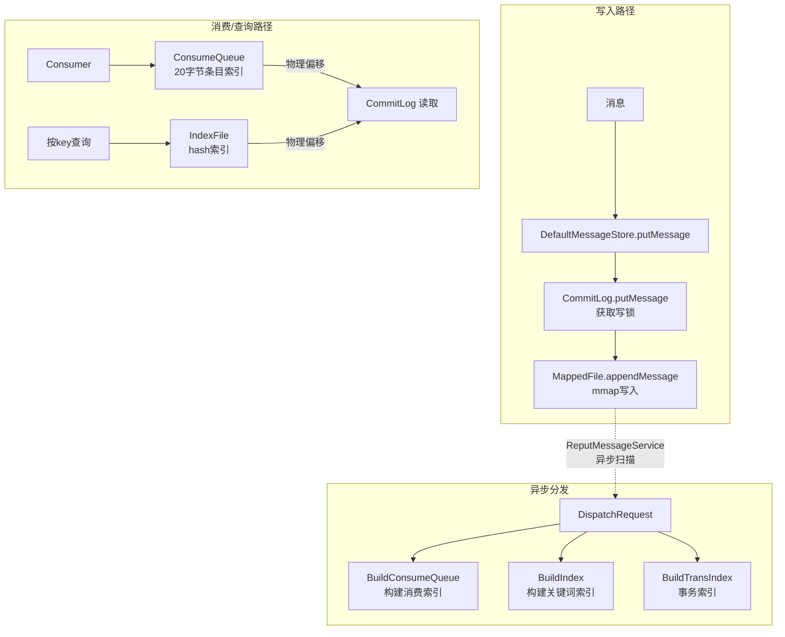
```mermaid
graph TB
    subgraph 写入路径
        M[消息] --> DMS[DefaultMessageStore.putMessage]
        DMS --> CL[CommitLog.putMessage<br/>获取写锁]
        CL --> MF[MappedFile.appendMessage<br/>mmap写入]
    end
    subgraph 异步分发
        MF -.ReputMessageService<br/>异步扫描.-> DR[DispatchRequest]
        DR --> D1[BuildConsumeQueue<br/>构建消费索引]
        DR --> D2[BuildIndex<br/>构建关键词索引]
        DR --> D3[BuildTransIndex<br/>事务索引]
    end
    subgraph 消费/查询路径
        C[Consumer] --> CQ[ConsumeQueue<br/>20字节条目索引]
        CQ -->|物理偏移| MF2[CommitLog 读取]
        Q[按key查询] --> IF[IndexFile<br/>hash索引]
        IF -->|物理偏移| MF2
    end
```

核心组件：

| 组件 | 文件路径 | 作用 |
|------|---------|------|
| `DefaultMessageStore` | `store/.../DefaultMessageStore.java` | 存储总控 |
| `CommitLog` | `store/.../CommitLog.java` | 物理存储 |
| `ConsumeQueue` | `store/.../ConsumeQueue.java` | 逻辑索引 |
| `IndexFile` | `store/.../index/IndexFile.java` | 关键词索引 |
| `IndexService` | `store/.../index/IndexService.java` | 索引服务 |
| `StoreCheckpoint` | `store/.../StoreCheckpoint.java` | 刷盘/复制位点 |
| `MappedFileQueue` | `store/.../MappedFileQueue.java` | 映射文件队列 |
| `MappedFile` | `store/.../logfile/DefaultMappedFile.java` | 单个映射文件 |
| `RocksDBMessageStore` | `store/.../RocksDBMessageStore.java` | 5.x RocksDB 引擎 |

### 4.2 CommitLog 详解

#### 4.2.1 文件布局

- **单文件大小**：默认 1GB（`mappedFileSizeCommitLog=1073741824`）
- **文件名**：起始物理偏移量，20 位数字，如 `00000000000000000000`
- **存储特点**：所有 Topic 的消息顺序追加到 CommitLog，避免随机写

#### 4.2.2 消息存储格式

`MessageExtEncoder.encode()` 将消息编码为二进制（关键字段顺序）：

| 偏移 | 字段 | 长度 | 说明 |
|------|------|------|------|
| 0 | TOTALSIZE | 4 | 消息总长度 |
| 4 | MAGICCODE | 4 | 魔数 |
| 8 | BODYCRC | 4 | Body CRC |
| 12 | QUEUEID | 4 | 队列 ID |
| 16 | FLAG | 4 | 标志位 |
| 20 | QUEUEOFFSET | 8 | 队列偏移 |
| 28 | PHYSICALOFFSET | 8 | 物理偏移 |
| 36 | SYSFLAG | 4 | 系统标志（压缩/事务等） |
| 40 | BORNTIMESTAMP | 8 | 产生时间 |
| 48 | BORNHOST | 8 | 产生主机 |
| 56 | STORETIMESTAMP | 8 | 存储时间 |
| 64 | STOREHOST | 8 | 存储主机 |
| 72 | RECONSUMETIMES | 4 | 重试次数 |
| 76 | PreparedTransactionOffset | 8 | 事务偏移 |
| 84 | BODYLENGTH | 4 | Body 长度 |
| 88 | Body | N | 消息体 |
| 88+N | TOPICLENGTH | 1/2 | Topic 长度 |
| ... | Topic | N | Topic |
| ... | PROPERTIESLENGTH | 2 | 属性长度 |
| ... | Properties | N | 属性 |

#### 4.2.3 putMessage 流程

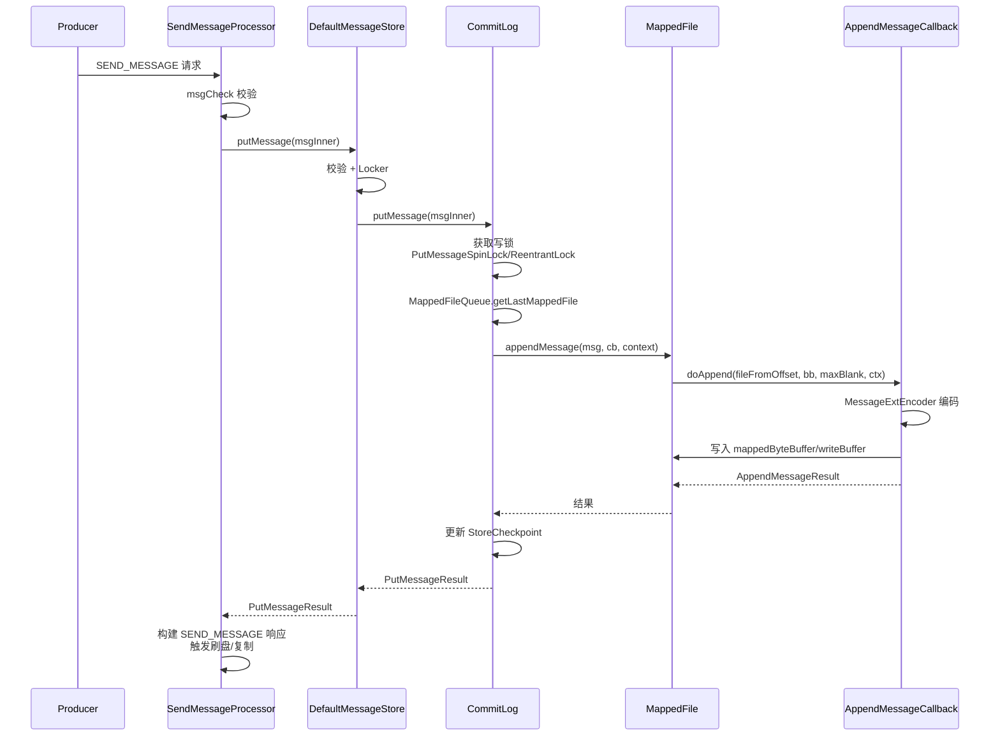
```mermaid
sequenceDiagram
    participant P as Producer
    participant SMP as SendMessageProcessor
    participant DMS as DefaultMessageStore
    participant CL as CommitLog
    participant MF as MappedFile
    participant CB as AppendMessageCallback

    P->>SMP: SEND_MESSAGE 请求
    SMP->>SMP: msgCheck 校验
    SMP->>DMS: putMessage(msgInner)
    DMS->>DMS: 校验 + Locker
    DMS->>CL: putMessage(msgInner)
    CL->>CL: 获取写锁<br/>PutMessageSpinLock/ReentrantLock
    CL->>CL: MappedFileQueue.getLastMappedFile
    CL->>MF: appendMessage(msg, cb, context)
    MF->>CB: doAppend(fileFromOffset, bb, maxBlank, ctx)
    CB->>CB: MessageExtEncoder 编码
    CB->>MF: 写入 mappedByteBuffer/writeBuffer
    CB-->>MF: AppendMessageResult
    MF-->>CL: 结果
    CL->>CL: 更新 StoreCheckpoint
    CL-->>DMS: PutMessageResult
    DMS-->>SMP: PutMessageResult
    SMP->>SMP: 构建 SEND_MESSAGE 响应<br/>触发刷盘/复制
```

#### 4.2.4 写锁机制

`PutMessageLock` 两种实现，按 `useReentrantLockWhenPutMessage` 配置选择：

- **`PutMessageSpinLock`**：基于 `AtomicBoolean` CAS 自旋。低竞争下性能高、无上下文切换；高竞争下 CPU 空转。
- **`PutMessageReentrantLock`**：基于 `ReentrantLock`。高竞争下稳定；有上下文切换开销。

### 4.3 ConsumeQueue 详解

#### 4.3.1 文件布局

- **单文件条目数**：默认 30 万条
- **每条目 20 字节**：
  - 物理偏移量（8B）：消息在 CommitLog 的起始偏移
  - 消息大小（4B）
  - 标签哈希码（8B）：用于 TAG 过滤
- **单文件大小**：约 5.72MB（300000×20）
- **文件名**：队列起始偏移量

#### 4.3.2 异步构建（ReputMessageService）

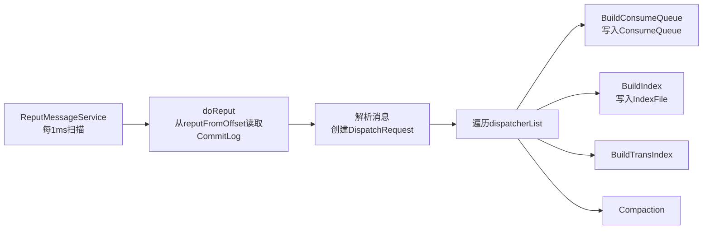
```mermaid
flowchart LR
    A[ReputMessageService<br/>每1ms扫描] --> B[doReput<br/>从reputFromOffset读取CommitLog]
    B --> C[解析消息<br/>创建DispatchRequest]
    C --> D[遍历dispatcherList]
    D --> E1[BuildConsumeQueue<br/>写入ConsumeQueue]
    D --> E2[BuildIndex<br/>写入IndexFile]
    D --> E3[BuildTransIndex]
    D --> E4[Compaction]
```

`CommitLogDispatcher` 分发器体系：`BuildConsumeQueue`、`BuildIndex`、`BuildTransIndex`、`Compaction`。消息写入 CommitLog 后，由 `ReputMessageService`（`DefaultMessageStore` 内部线程）异步分发构建各类索引，**不阻塞主写入路径**。

### 4.4 IndexFile 详解

#### 4.4.1 文件布局

```
总大小 = IndexHeader(40B) + hashSlotNum×4 + indexNum×20
默认: hashSlotNum=500w, indexNum=2000w
```

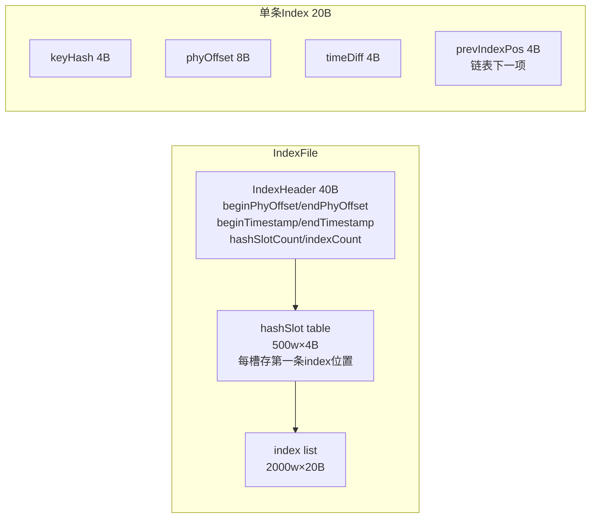
```mermaid
graph LR
    subgraph IndexFile
        H[IndexHeader 40B<br/>beginPhyOffset/endPhyOffset<br/>beginTimestamp/endTimestamp<br/>hashSlotCount/indexCount]
        S[hashSlot table<br/>500w×4B<br/>每槽存第一条index位置]
        I[index list<br/>2000w×20B]
    end
    subgraph 单条Index 20B
        I1[keyHash 4B]
        I2[phyOffset 8B]
        I3[timeDiff 4B]
        I4[prevIndexPos 4B<br/>链表下一项]
    end
    H --> S --> I
```

#### 4.4.2 哈希索引设计

- **哈希函数**：`keyHash % hashSlotNum`
- **冲突解决**：链式哈希，通过 `prevIndexPos` 形成链表
- **写入**：`putKey()` 计算槽位，写入 index 条目，更新槽指向新条目
- **查询**：`selectPhyOffset()` 计算槽位 → 读取槽中第一条 index 位置 → 遍历链表匹配 keyHash + 时间范围

#### 4.4.3 IndexService 与 IndexHeader

`IndexService` 管理多个 IndexFile 实例，提供 `queryOffset`、`buildIndex`、`deleteExpiredFile`。`IndexHeader` 维护 begin/end 物理偏移、时间戳、indexCount、hashSlotCount。

### 4.5 StoreCheckpoint

| 字段 | 作用 |
|------|------|
| `physicMsgTimestamp` | 最后一条物理消息存储时间戳 |
| `logicsMsgTimestamp` | 最后一条逻辑消息（ConsumeQueue）时间戳 |
| `indexMsgTimestamp` | 最后一条索引消息时间戳 |
| `masterFlushedOffset` | 主节点最后刷盘物理偏移 |
| `confirmPhyOffset` | 确认的物理偏移（一致性保证） |

使用 `RandomAccessFile` + `MappedByteBuffer` 持久化，故障重启时据此 recover。

### 4.6 RocksDBMessageStore（5.x 新引擎）

继承 `DefaultMessageStore`，使用 `RocksDBConsumeQueueStore` 替代文件形式 ConsumeQueue，提供更高并发、更优随机读写与压缩比，适合超大规模消息场景。

---

## 五、内存映射机制

### 5.1 MappedFile 的 mmap 实现

`DefaultMappedFile.init()`（`store/.../logfile/DefaultMappedFile.java:209`）使用 `FileChannel.map(MapMode.READ_WRITE, 0, fileSize)` 完成文件到虚拟内存映射。

```java
this.fileChannel = new RandomAccessFile(this.file, "rw").getChannel();
if (writeWithoutMmap) {
    this.mappedByteBuffer = this.fileChannel.map(MapMode.READ_ONLY, 0, fileSize);
} else {
    this.mappedByteBuffer = this.fileChannel.map(MapMode.READ_WRITE, 0, fileSize);
}
```

**优势**：减少用户态/内核态拷贝（零拷贝）、利用 OS 页缓存、按需加载。

### 5.2 AllocateMappedFileService 预分配

`AllocateMappedFileService.mmapOperation()`（`store/.../AllocateMappedFileService.java:173`）：
- 使用 `PriorityBlockingQueue<AllocateRequest>` 管理预分配请求
- 后台线程取出请求，提前创建 MappedFile
- 可选 `warmMappedFile` 预热（每 1GB 预写空白 + mlock）
- 通过 `CountDownLatch` 通知等待线程

**优势**：避免消息写入时同步创建文件的延迟，提升写入稳定性。

### 5.3 TransientStorePool 堆外内存池

`TransientStorePool.init()`（`store/.../TransientStorePool.java:48`）：

```java
for (int i = 0; i < poolSize; i++) {
    ByteBuffer byteBuffer = ByteBuffer.allocateDirect(fileSize);
    long address = PlatformDependent.directBufferAddress(byteBuffer);
    Pointer pointer = new Pointer(address);
    LibC.INSTANCE.mlock(pointer, new NativeLong(fileSize));  // 锁定物理内存，防 swap
    availableBuffers.offer(byteBuffer);
}
```

- 池大小 `transientStorePoolSize` 默认 5，每个缓冲区 = CommitLog 文件大小
- `isTransientStorePoolEnable=true` 时启用：消息先写堆外 `writeBuffer`，再由 `CommitRealTimeService` 提交到页缓存，最后 `flush` 到磁盘
- 减少堆外内存 GC，避免数据进入页缓存被换出

### 5.4 三个位置变量

| 位置 | 说明 |
|------|------|
| `wrotePosition` | 当前写入位置（最新写入） |
| `committedPosition` | 已提交到页缓存位置（TransientStorePool 模式下有） |
| `flushedPosition` | 已刷盘位置 |

关系：`wrotePosition ≥ committedPosition ≥ flushedPosition`。

### 5.5 ReferenceResource 引用计数

`AbstractMappedFile` 实现引用计数：`hold()` 引用+1，`release()` 引用-1，为 0 时 `cleanup()` 释放。`shutdown(intervalForcibly)` 标记不可用并等待引用归零。确保文件删除时无并发读取。

引用计数解决的核心问题：MappedFile 可能正被 ConsumeQueue 构建、消息查询、主从复制等多个任务读取，直接物理删除会导致读取失败或脏数据。引用计数保证"只有无人读时才删除"。

**全局内存统计**：`AbstractMappedFile` 维护两个静态变量，用于监控：
- `TOTAL_MAPPED_VIRTUAL_MEMORY`：所有 MappedFile 占用的虚拟内存总量
- `TOTAL_MAPPED_FILES`：当前打开的 MappedFile 数量

### 5.6 MappedFileQueue 文件队列管理

`MappedFileQueue`（`store/.../MappedFileQueue.java`）管理一组有序的 MappedFile，是 CommitLog/ConsumeQueue/IndexFile 文件队列的基类。

**核心字段**：
- `mappedFiles`：`CopyOnWriteArrayList<MappedFile>`，按时间顺序排列
- `flushedWhere`：已刷盘位置
- `committedWhere`：已提交位置
- `storePath` / `mappedFileSize`：存储路径与单文件大小

**关键方法**：

| 方法 | 作用 |
|------|------|
| `getLastMappedFile()` | 取最后一个文件（当前写入文件），无则创建 |
| `getMappedFileByTime(timestamp)` | 按时间戳定位文件 |
| `findMappedFileByOffset(offset)` | 按物理偏移定位文件（二分） |
| `truncateDirtyFiles(offset)` | 截断超过 offset 的脏数据 |
| `deleteExpiredFileByTime(expireTime)` | 按时间删除过期文件 |
| `deleteExpiredFileByOffset(consumeQueue, minOffset)` | 按偏移删除 |
| `flush(flushLeastPages)` | 刷盘到 flushedWhere |

**文件查找优化**：`findMappedFileByOffset` 先按 `offset / mappedFileSize` 计算下标，再校验下标范围，O(1) 定位。但因删除导致下标偏移时，会遍历 `mappedFiles` 校验 `firstOffset/lastOffset`，退化为 O(N)。

### 5.7 内存映射零拷贝原理

传统 IO 与 mmap 的对比：

```
传统 write():  用户缓冲 -> 内核缓冲(PageCache) -> 磁盘     (4次拷贝)
mmap:          映射区写 -> PageCache -> 磁盘                (3次拷贝,少1次用户->内核)
sendFile:      内核缓冲 -> Socket缓冲                       (3次拷贝)
mmap+sendFile: 映射区 -> Socket                             (最少拷贝)
```

RocketMQ 写消息走 `mappedByteBuffer.put()`，数据直接进 PageCache，由 OS 异步刷盘；消费端走 `MappedByteBuffer` 或 `FileChannel.transferTo`，实现零拷贝。

### 5.8 内存映射性能优势总结

| 优势 | 原理 |
|------|------|
| 零拷贝 | 省去用户态/内核态数据拷贝 |
| 利用 PageCache | OS 自动管理页缓存，按需加载、预读 |
| 顺序写 | CommitLog 追加写，机械磁盘可达百 MB/s |
| 异步刷盘 | 写 PageCache 即返回，OS 异步落盘 |
| 堆外内存 | TransientStorePool 绕过 PageCache，避免被换出 |
| 内存锁定 | mlock 锁定物理内存，防 swap |
| 预分配 | AllocateMappedFileService 提前建文件，无运行时延迟 |
| 引用计数 | 安全管理 MappedFile 生命周期，支持并发读取 |

**设计精髓**：RocketMQ 把"文件 = 内存"这一 OS 抽象用到极致，整个存储引擎几乎不直接操作磁盘，全部通过 mmap 把文件映射为内存，写入即写内存，刷盘交 OS，性能逼近内存速度。

---

## 六、刷盘机制

### 6.1 FlushManager 体系

`DefaultFlushManager`（`CommitLog.java:2184` 内部类）根据 `flushDiskType` 选择刷盘服务：

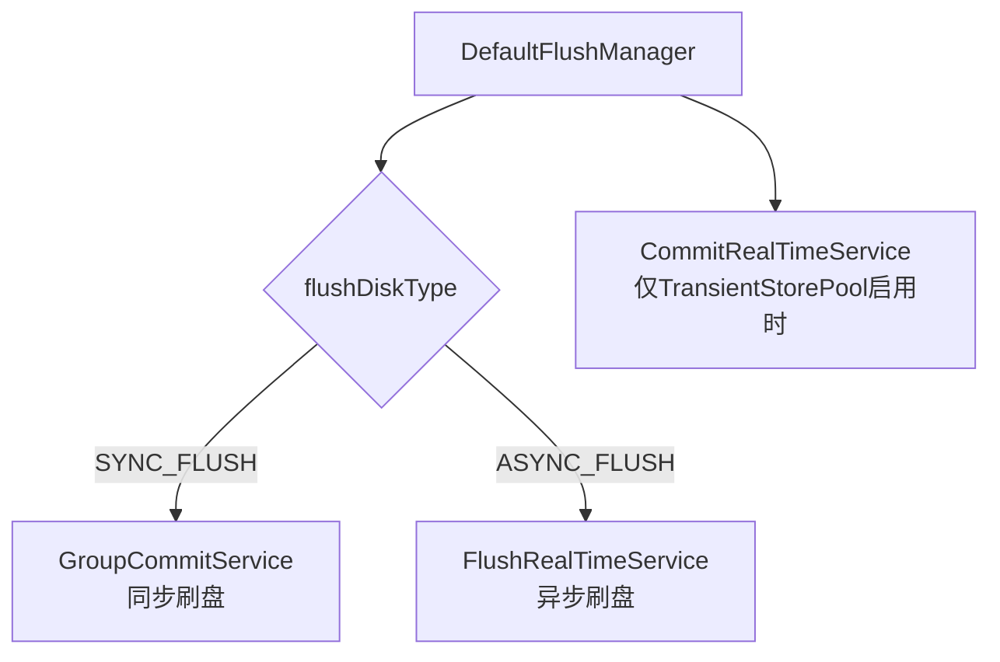
```mermaid
graph TD
    FM[DefaultFlushManager] --> S{flushDiskType}
    S -- SYNC_FLUSH --> GCS[GroupCommitService<br/>同步刷盘]
    S -- ASYNC_FLUSH --> FRT[FlushRealTimeService<br/>异步刷盘]
    FM --> CRS[CommitRealTimeService<br/>仅TransientStorePool启用时]
```

### 6.2 同步刷盘 GroupCommitService

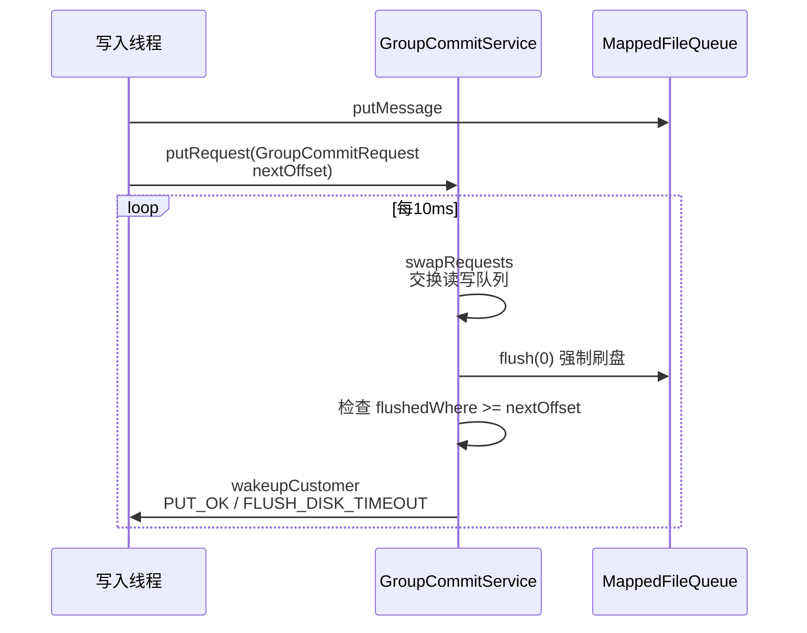
```mermaid
sequenceDiagram
    participant T as 写入线程
    participant GCS as GroupCommitService
    participant MQ as MappedFileQueue

    T->>MQ: putMessage
    T->>GCS: putRequest(GroupCommitRequest<br/>nextOffset)
    loop 每10ms
        GCS->>GCS: swapRequests<br/>交换读写队列
        GCS->>MQ: flush(0) 强制刷盘
        GCS->>GCS: 检查 flushedWhere >= nextOffset
        GCS->>T: wakeupCustomer<br/>PUT_OK / FLUSH_DISK_TIMEOUT
    end
```

- 使用**双队列交换**（`requestsWrite`/`requestsRead`）实现异步处理
- 每个请求最多重试 1000 次（约 1s），超时返回 `FLUSH_DISK_TIMEOUT`
- `FlushDiskWatcher` 单独线程监控同步刷盘超时

### 6.3 异步刷盘 FlushRealTimeService

- 默认每 500ms 刷盘一次（`flushIntervalCommitLog`）
- 默认仅当脏页 ≥ `flushCommitLogLeastPages`（默认 4 页）才刷，减少 IO
- 超过 `flushCommitLogThoroughInterval`（默认 10s）强制刷全量
- 刷盘后更新 `StoreCheckpoint.physicMsgTimestamp`

### 6.4 isAbleToFlush 判断

```java
public boolean isAbleToFlush(int flushLeastPages) {
    int flush = flushedPosition;
    int write = wrotePosition;
    if (isFull()) return true;                    // 文件满直接刷
    if (flushLeastPages > 0)
        return ((write / OS_PAGE_SIZE) - (flush / OS_PAGE_SIZE)) >= flushLeastPages;
    return write > flush;
}
```

### 6.5 同步 vs 异步对比

| 维度 | 同步刷盘 | 异步刷盘 |
|------|---------|---------|
| 可靠性 | 高，宕机不丢 | 较高，可能丢少量 |
| 性能 | 低 | 高 |
| 实现 | GroupCommitService | FlushRealTimeService |
| 默认 | 否 | 是 |

### 6.6 GroupCommitRequest 与 putMessage 集成

同步刷盘的请求触发点在 `CommitLog.putMessage`：

```
CommitLog.putMessage(msg)
  └─> DefaultFlushManager.handleDiskAppend(result, msg)
       └─> if SYNC_FLUSH:
            GroupCommitRequest req = new GroupCommitRequest(nextOffset, timeout)
            flushManager.putRequest(req)       // 放入 requestsWrite
            req.waitForFlush()                 // 阻塞等待刷盘完成
            └─> 返回 PUT_OK / FLUSH_DISK_TIMEOUT
```

`GroupCommitRequest` 持有 `nextOffset`（本次写入后的偏移）与 `CountDownLatch`，`GroupCommitService` 刷盘后比较 `flushedWhere >= nextOffset` 则 `countDown` 唤醒写入线程。

### 6.7 双队列交换设计精髓

GroupCommitService 的双队列交换（`requestsWrite` / `requestsRead`）是高性能同步刷盘的关键：

```
写入线程 --putRequest--> requestsWrite
                          |
每10ms swapRequests: 交换两个队列引用（O(1)）
                          |
doCommit: 遍历 requestsRead 一次性处理批量请求
```

**为何用双队列**：若单队列，写入线程 put 与刷盘线程消费需同一把锁，竞争激烈。双队列让写入线程只锁 `requestsWrite`，刷盘线程只操作 `requestsRead`，两者并发，仅交换瞬间同步。这是"生产者-消费者"模式的高性能实现，类似 Disruptor 的分离设计。

### 6.8 ConsumeQueue 刷盘与 StoreCheckpoint

**ConsumeQueue 刷盘**：`flushConsumeQueueService`（`DefaultMessageStore` 内部类）定期刷 ConsumeQueue，间隔 `flushIntervalConsumeQueue`（默认 1s），页数阈值 `flushConsumeQueueLeastPages`。ConsumeQueue 是索引文件，丢失可重建，刷盘频率低于 CommitLog。

**StoreCheckpoint**（`store/.../StoreCheckpoint.java`）记录三个关键位点：
- `physicMsgTimestamp`：CommitLog 最后刷盘时间戳
- `logicsMsgTimestamp`：ConsumeQueue 最后刷盘时间戳
- `indexMsgTimestamp`：IndexFile 最后刷盘时间戳

Broker 重启时按 StoreCheckpoint 恢复，确保数据一致。

### 6.9 FlushDiskWatcher 超时监控

`FlushDiskWatcher`（`CommitLog.java` 内部类）独立线程监控同步刷盘请求超时：
- 每个 `GroupCommitRequest` 注册到 watcher
- watcher 定期检查请求是否超时（`timeoutMillis`）
- 超时则唤醒请求，返回 `FLUSH_DISK_TIMEOUT`，避免写入线程无限阻塞

### 6.10 刷盘配置项汇总

| 配置项 | 默认值 | 说明 |
|--------|--------|------|
| `flushDiskType` | ASYNC_FLUSH | SYNC_FLUSH / ASYNC_FLUSH |
| `syncFlushInterval` | 10000 | 同步刷盘检查间隔（ms） |
| `flushIntervalCommitLog` | 500 | 异步刷盘间隔（ms） |
| `flushCommitLogLeastPages` | 4 | 异步刷盘最少脏页 |
| `flushCommitLogThoroughInterval` | 10000 | 强制全量刷盘间隔（ms） |
| `flushIntervalConsumeQueue` | 1000 | ConsumeQueue 刷盘间隔 |
| `flushConsumeQueueLeastPages` | 2 | ConsumeQueue 最少脏页 |
| `commitIntervalCommitLog` | 200 | 堆外内存提交间隔（ms） |
| `transientStorePoolSize` | 5 | 堆外内存池大小 |

### 6.11 刷盘设计总结

1. **双队列交换**：GroupCommitService 用双队列实现同步刷盘的异步化处理，高性能。
2. **页数阈值**：异步刷盘积累足够脏页才刷，减少 IO 次数。
3. **分级刷盘**：CommitLog 高频刷，ConsumeQueue 低频刷，IndexFile 定期刷，按重要性分级。
4. **堆外内存**：TransientStorePool 模式下，写堆外 -> 提交页缓存 -> 刷盘三段式，绕过 PageCache 控制。
5. **超时兜底**：FlushDiskWatcher 防止写入线程无限阻塞。
6. **检查点恢复**：StoreCheckpoint 保障重启数据一致。

---

## 七、过期删除机制

### 7.1 CleanCommitLogService

`DefaultMessageStore` 内部类，`deleteExpiredFiles()`（`DefaultMessageStore.java:2369`）触发条件：

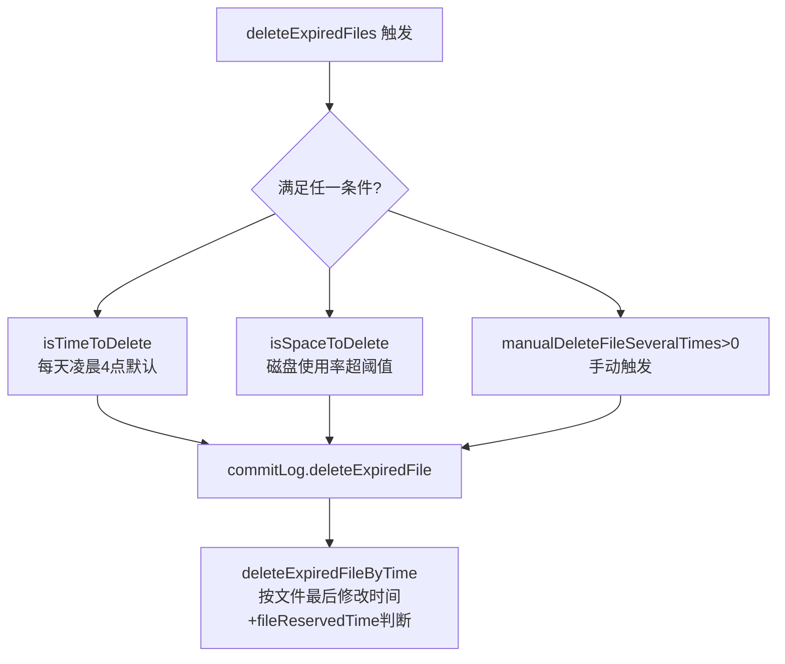
```mermaid
flowchart TD
    A[deleteExpiredFiles 触发] --> B{满足任一条件?}
    B --> C1[isTimeToDelete<br/>每天凌晨4点默认]
    B --> C2[isSpaceToDelete<br/>磁盘使用率超阈值]
    B --> C3[manualDeleteFileSeveralTimes>0<br/>手动触发]
    C1 --> D[commitLog.deleteExpiredFile]
    C2 --> D
    C3 --> D
    D --> E[deleteExpiredFileByTime<br/>按文件最后修改时间+fileReservedTime判断]
```

- **`fileReservedTime`**：默认 72 小时
- **`deleteCommitLogFilesInterval`**：删除间隔，默认 100ms
- **`destroyMapedFileIntervalForcibly`**：强制销毁等待间隔
- **`deleteFileBatchMax`**：单次最大删除数

### 7.2 磁盘水位检测

`isSpaceToDelete()`（`DefaultMessageStore.java:2430`）：
- `diskSpaceWarningLevelRatio` 默认 0.75：超过则 `runningFlags.getAndMakeDiskFull()`，拒绝写入
- `diskSpaceCleanForciblyRatio` 默认 0.85：超过则 `cleanImmediately=true`，强制删除（即使未到期）
- 多路径存储时取使用率最小的路径

### 7.3 CleanConsumeQueueService

`ConsumeQueueStore.deleteExpiredFiles()`（`ConsumeQueueStore.java:853`）：
- 根据 CommitLog 的 `minOffset` 删除早于该偏移的 ConsumeQueue 文件
- 同时调用 `IndexService.deleteExpiredFile(minOffset)` 删除过期 IndexFile
- 若启用 `indexRocksDBEnable`，清理 RocksDB 索引

### 7.4 DestroyLockedFile

删除前确保文件未被引用：`hold()` → `shutdown(intervalForcibly)` → 从 `MappedFileQueue` 移除 → `release()` → 物理删除文件。

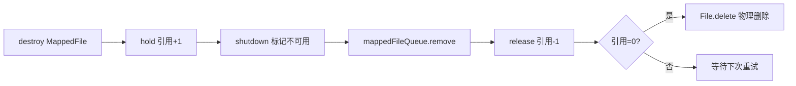
```mermaid
flowchart LR
    A[destroy MappedFile] --> B[hold 引用+1]
    B --> C[shutdown 标记不可用]
    C --> D[mappedFileQueue.remove]
    D --> E[release 引用-1]
    E --> F{引用=0?}
    F -- 是 --> G[File.delete 物理删除]
    F -- 否 --> H[等待下次重试]
```

### 7.5 删除触发时机与配置

**CleanCommitLogService 执行逻辑**（`DefaultMessageStore` 内部类，`run()` 定期执行）：

三个触发条件，满足任一即删除：
1. **isTimeToDelete**：到达 `deleteWhen` 配置的时间点（默认凌晨 4 点），`isTimeToDelete()` 比较当前时间与配置。
2. **isSpaceToDelete**：磁盘使用率超阈值，`isSpaceToDelete()` 返回 true。
3. **isManualDelete**：`manualDeleteFileSeveralTimes > 0`，手动触发（通过 admin 命令）。

**删除策略**：

| 策略 | 方法 | 说明 |
|------|------|------|
| 按时间删 | `deleteExpiredFileByTime(expireTime)` | 文件最后修改时间 + fileReservedTime < now 则删 |
| 按偏移删 | `deleteExpiredFileByOffset(consumeQueue, minOffset)` | ConsumeQueue 最大偏移 < CommitLog minOffset 则删 |
| 强制删 | `cleanImmediately=true` | 磁盘超 diskSpaceCleanForciblyRatio，忽略时间限制 |

**配置项**：

| 配置项 | 默认值 | 说明 |
|--------|--------|------|
| `fileReservedTime` | 72 | 文件保留时间（小时） |
| `deleteWhen` | `04` | 定时删除时间点 |
| `deleteCommitLogFilesInterval` | 100 | CommitLog 删除间隔（ms） |
| `deleteConsumeQueueFilesInterval` | 100 | ConsumeQueue 删除间隔 |
| `destroyMapedFileIntervalForcibly` | 120000 | 强制销毁等待间隔 |
| `deleteFileBatchMax` | 10 | 单次最大删除数 |
| `diskMaxUsedSpaceRatio` | 75 | 磁盘最大使用率 |
| `diskSpaceWarningLevelRatio` | 0.90 | 警告水位 |
| `diskSpaceCleanForciblyRatio` | 0.85 | 强制清理水位 |

### 7.6 删除与 ConsumeQueue / Offset 的联动

CommitLog 文件删除后，索引必须同步清理，否则 ConsumeQueue 会指向不存在的物理偏移：

```
CleanCommitLogService 删 CommitLog 文件
    └─> CommitLog.minOffset 前移
         └─> CleanConsumeQueueService 检测 minOffset 变化
              └─> 遍历所有 ConsumeQueue
                   └─> 删除 maxOffset < CommitLog.minOffset 的 ConsumeQueue 文件
                        └─> IndexService.deleteExpiredFile(minOffset) 删过期 IndexFile
```

**主从同步联动**：CommitLog 文件删除后，通过 HA 通知 Slave 截断对应偏移，保证主从一致。

**消费位点联动**：消费者拉取时，若请求 offset < minOffset，Broker 返回 `OFFSET_OVERFLOW_BADLY`，提示消费者重置到 minOffset。

### 7.7 过期删除设计总结

1. **三触发机制**：定时（deleteWhen）、空间（磁盘水位）、手动（admin 命令），覆盖所有场景。
2. **两级删除**：CommitLog 按时间删，ConsumeQueue/IndexFile 按偏移删，先删数据后删索引。
3. **引用计数保护**：DestroyLockedFile 确保文件无人读取才物理删除，防并发问题。
4. **强制清理兜底**：磁盘超水位时 cleanImmediately，忽略时间限制，防磁盘写满。
5. **多路径支持**：多 storePath 时取使用率最小的路径评估，避免单路径写满。
6. **主从联动**：删除后通知 Slave 截断，保证一致。

过期删除是存储引擎的"垃圾回收"，保证了磁盘可持续使用，是 RocketMQ 长期稳定运行的基础。

---

## 八、网络通信机制

### 8.1 Remoting 模块架构

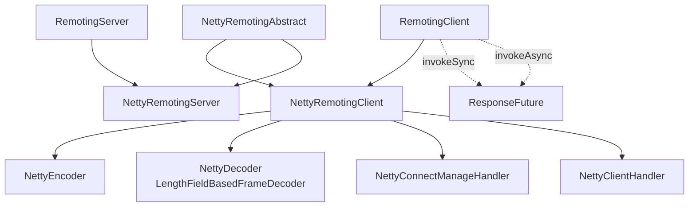
```mermaid
graph TB
    RC[RemotingClient] --> NRC[NettyRemotingClient]
    RS[RemotingServer] --> NRS[NettyRemotingServer]
    RA[NettyRemotingAbstract] --> NRC
    RA --> NRS
    NRC --> NE[NettyEncoder]
    NRC --> ND[NettyDecoder<br/>LengthFieldBasedFrameDecoder]
    NRC --> NCMH[NettyConnectManageHandler]
    NRC --> NH[NettyClientHandler]
    RC -.invokeSync.-> RF[ResponseFuture]
    RC -.invokeAsync.-> RF
```

### 8.2 RemotingCommand 协议格式

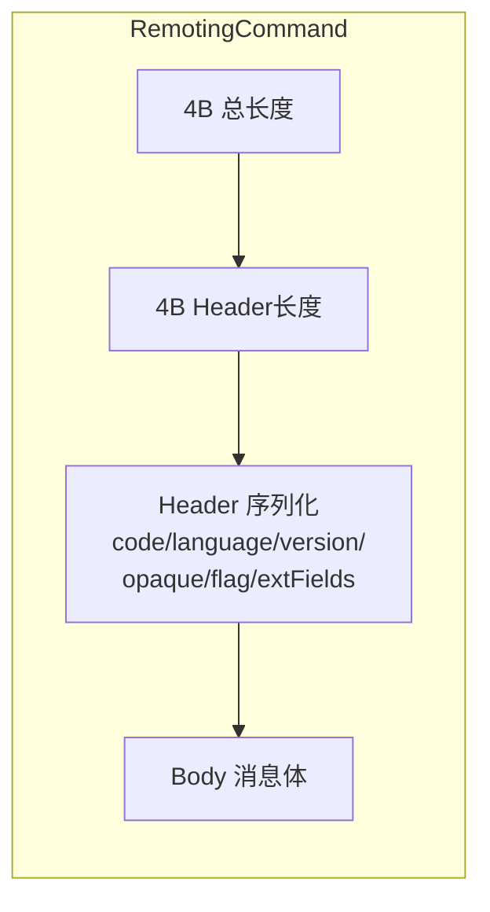
```mermaid
graph LR
    subgraph RemotingCommand
        F1[4B 总长度] --> F2[4B Header长度] --> F3[Header 序列化<br/>code/language/version/<br/>opaque/flag/extFields]
        F3 --> F4[Body 消息体]
    end
```

| 字段 | 说明 |
|------|------|
| `code` | 请求/响应码（RequestCode） |
| `language` | 语言（JAVA/CPP/GO 等） |
| `version` | 协议版本 |
| `opaque` | 请求 ID，用于匹配响应 |
| `flag` | 标志（0=请求，1=响应，2=单向） |
| `extFields` | 扩展字段（键值对） |
| `customHeader` | 自定义头 |
| `body` | 消息体字节数组 |

`NettyEncoder` 调用 `fastEncodeHeader`；`NettyDecoder` 继承 `LengthFieldBasedFrameDecoder` 解决粘包拆包。

### 8.3 三种调用方式

| 方式 | 方法 | 特点 |
|------|------|------|
| 同步 | `invokeSync` | `CountDownLatch.await` 等待响应 |
| 异步 | `invokeAsync` | 注册 `InvokeCallback`，响应到达后回调 |
| 单向 | `invokeOneway` | 不等响应，无回调 |

`ResponseFuture`（`remoting/.../ResponseFuture.java`）持有 `channel`、`opaque`、`invokeCallback`、`CountDownLatch`，`putResponse` 时 countDown。

### 8.4 请求分发 processRequestCommand

```java
public void processRequestCommand(ChannelHandlerContext ctx, RemotingCommand cmd) {
    Pair<NettyRequestProcessor, ExecutorService> matched = processorTable.get(cmd.getCode());
    Pair<NettyRequestProcessor, ExecutorService> pair = matched == null ? defaultRequestProcessorPair : matched;
    // 提交到 pair.object2 线程池执行
    pair.getObject2().submit(requestTask);
}
```

`processorTable` 是 `Map<Integer, Pair<NettyRequestProcessor, ExecutorService>>`，按 RequestCode 路由到对应 Processor + 专属线程池，**实现请求隔离**（拉取用拉取线程池、发送用发送线程池，互不阻塞）。

### 8.5 信号量限流

```java
protected final Semaphore semaphoreOneway;  // 单向并发限流
protected final Semaphore semaphoreAsync;    // 异步并发限流
```

防止异步/单向请求过多导致 OOM。

### 8.6 RPCHook 机制

`RPCHook.doBeforeRequest` / `doAfterResponse`，用于 ACL 校验、轨迹等。

---

## 九、消息消费流程（Push 消费详解）

### 9.1 Push 消费全链路

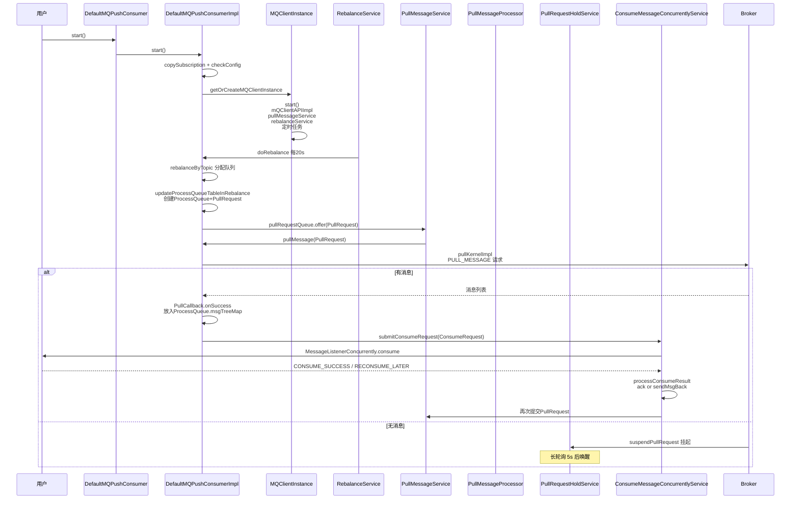
```mermaid
sequenceDiagram
    participant U as 用户
    participant C as DefaultMQPushConsumer
    participant CI as DefaultMQPushConsumerImpl
    participant MCI as MQClientInstance
    participant RS as RebalanceService
    participant PMS as PullMessageService
    participant PMP as PullMessageProcessor
    participant PH as PullRequestHoldService
    participant CMS as ConsumeMessageConcurrentlyService
    participant B as Broker

    U->>C: start()
    C->>CI: start()
    CI->>CI: copySubscription + checkConfig
    CI->>MCI: getOrCreateMQClientInstance
    MCI->>MCI: start()<br/>mQClientAPIImpl<br/>pullMessageService<br/>rebalanceService<br/>定时任务
    RS->>CI: doRebalance 每20s
    CI->>CI: rebalanceByTopic 分配队列
    CI->>CI: updateProcessQueueTableInRebalance<br/>创建ProcessQueue+PullRequest
    CI->>PMS: pullRequestQueue.offer(PullRequest)
    PMS->>CI: pullMessage(PullRequest)
    CI->>B: pullKernelImpl<br/>PULL_MESSAGE 请求
    alt 有消息
        B-->>CI: 消息列表
        CI->>CI: PullCallback.onSuccess<br/>放入ProcessQueue.msgTreeMap
        CI->>CMS: submitConsumeRequest(ConsumeRequest)
        CMS->>U: MessageListenerConcurrently.consume
        U-->>CMS: CONSUME_SUCCESS / RECONSUME_LATER
        CMS->>CMS: processConsumeResult<br/>ack or sendMsgBack
        CMS->>PMS: 再次提交PullRequest
    else 无消息
        B->>PH: suspendPullRequest 挂起
        Note over PH: 长轮询 5s 后唤醒
    end
```

### 9.2 DefaultMQPushConsumerImpl.start 关键步骤

1. `checkConfig()` 校验 group、messageModel 等
2. `copySubscription()` 拷贝订阅信息
3. `getOrCreateMQClientInstance()`
4. `rebalanceImpl` 设置 group、messageModel、consumeFromWhere、subscription
5. `pullAPIWrapper` 初始化
6. `consumerStatsManager` 注册
7. `mQClientFactory.registerConsumer(group, this)`
8. `mQClientFactory.start()`
9. `updateConsumeOffsetToBroker()` 等

### 9.3 PullMessageService 拉取循环

```java
public void run() {
    while (!stopped) {
        PullRequest pullRequest = pullRequestQueue.take();  // 阻塞获取
        DefaultMQPushConsumerImpl.this.pullMessage(pullRequest);
    }
}
```

`DefaultMQPushConsumerImpl.pullMessage`（`client/.../consumer/DefaultMQPushConsumerImpl.java`）：
1. 校验 ProcessQueue 是否 dropped、流控（msgCount > 1000、msgSize > 100MB 暂停拉取）
2. 计算 nextOffset：`pullRequest.getNextOffset()`
3. 构造 `PullMessageRequestHeader`（consumerGroup、topic、queueId、queueOffset、maxMsgNums、sysFlag、subVersion、expressionType）
4. `pullAPIWrapper.pullKernelImpl` → `mQClientAPIImpl.pullMessage`（异步，注册 PullCallback）
5. Broker 端 `PullMessageProcessor.processRequest` 处理

### 9.4 PullCallback.onSuccess

1. `pullCallback` 解码消息列表
2. `pullAPIWrapper.processPullResult`：解码、设置 msg、过滤（TAG 过滤）
3. `dispatchPullResultToListeners` 或 `firstMsg` 处理
4. 将消息放入 `ProcessQueue.msgTreeMap`（TreeMap，按 queueOffset 排序）
5. 提交 `ConsumeRequest` 到 `ConsumeMessageConcurrentlyService`
6. 根据拉取结果调整下次拉取间隔，再次提交 PullRequest

### 9.5 ConsumeMessageConcurrentlyService

`submitConsumeRequest` 将消息分批（每 `consumeMessageBatchMaxSize` 一批）封装为 `ConsumeRequest` 提交线程池。`ConsumeRequest.run()`：
1. 设置 `ConsumeMessageContext`
2. 执行 `MessageListenerConcurrently.consume(msgs, context)` 返回 `ConsumeConcurrentlyStatus`
3. `processConsumeResult` 处理结果：
   - `CONSUME_SUCCESS`：从 ProcessQueue 移除消息，ack（更新 offset）
   - `RECONSUME_LATER`：不移除，调用 `sendMessageBack` 发回 Broker 进入重试队列

### 9.6 ConsumeFromWhere 配置

| 值 | 含义 |
|----|------|
| `CONSUME_FROM_LAST_OFFSET` | 从队列最新位置消费（默认） |
| `CONSUME_FROM_FIRST_OFFSET` | 从队列最早位置消费 |
| `CONSUME_FROM_TIMESTAMP` | 从指定时间戳消费 |
| `CONSUME_FROM_MAX_OFFSET` | 从最大 offset 消费 |

### 9.7 ProcessQueue 详解

| 字段 | 说明 |
|------|------|
| `msgTreeMap` | `TreeMap<Long, MessageExt>`，按 queueOffset 排序的待消费消息 |
| `msgCount` | 待消费消息数（AtomicInteger，流控） |
| `msgSize` | 待消费消息总大小 |
| `queueOffsetMax` | 队列最大 offset |
| `droped` | 是否丢弃（rebalance 时被移除） |
| `lastPullTimestamp` | 上次拉取时间 |
| `lastConsumeTimestamp` | 上次消费时间 |

消息拉取后 `putMessage` 写入 msgTreeMap；消费完 `removeMessage` 移除并更新消费 offset；`dropProcessQueue` 在 rebalance 时丢弃。

---

## 十、负载均衡机制

### 10.1 RebalanceService

`RebalanceService`（`client/.../impl/RebalanceService.java`）每 20s 执行一次 `doRebalance()`，遍历所有 consumer 调用 `RebalanceImpl.doRebalance`。

### 10.2 rebalanceByTopic 流程

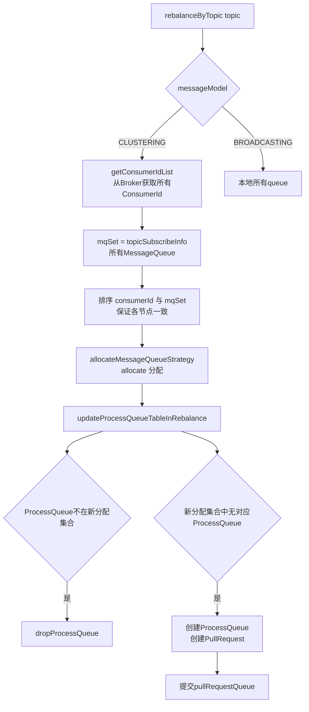
```mermaid
flowchart TD
    A[rebalanceByTopic topic] --> B{messageModel}
    B -- CLUSTERING --> C[getConsumerIdList<br/>从Broker获取所有ConsumerId]
    B -- BROADCASTING --> D[本地所有queue]
    C --> E[mqSet = topicSubscribeInfo<br/>所有MessageQueue]
    E --> F[排序 consumerId 与 mqSet<br/>保证各节点一致]
    F --> G[allocateMessageQueueStrategy<br/>allocate 分配]
    G --> H[updateProcessQueueTableInRebalance]
    H --> I{ProcessQueue不在新分配集合}
    I -- 是 --> J[dropProcessQueue]
    H --> K{新分配集合中无对应ProcessQueue}
    K -- 是 --> L[创建ProcessQueue<br/>创建PullRequest]
    L --> M[提交pullRequestQueue]
```

### 10.3 队列分配策略

#### AllocateMessageQueueAveragely（平均分配）

```
假设 8 个队列，3 个消费者：
cid0: [0,1,2]  (8/3=2余2，前2个消费者各3个)
cid1: [3,4,5]
cid2: [6,7]
```

#### AllocateMessageQueueAveragelyByCircle（轮询分配）

```
cid0: [0,3,6]
cid1: [1,4,7]
cid2: [2,5]
```

#### AllocateMessageQueueConsistentHash（一致性哈希）

基于 `TreeMap<Long, String>` 虚拟节点实现，消费者增减时最小化队列迁移。

### 10.4 集群 vs 广播模式

| 模式 | 队列分配 | 消费 offset | 适用场景 |
|------|---------|------------|---------|
| CLUSTERING | 同一队列只被一个消费者消费 | 存 Broker | 大多数业务 |
| BROADCASTING | 每个消费者消费所有队列 | 存本地 | 广播通知 |

### 10.5 分配算法源码精髓

**平均分配 AllocateMessageQueueAveragely** 核心逻辑：

```java
int mod = mqAll.size() % cidAll.size();   // 余数
int averageSize = mqAll.size() <= cidAll.size() ? 1 :
    (mod > 0 && index < mod ? mqAll.size() / cidAll.size() + 1
                            : mqAll.size() / cidAll.size());
int startIndex = (mod > 0 && index < mod)
    ? index * (mqAll.size() / cidAll.size() + 1)
    : index * (mqAll.size() / cidAll.size()) + mod;
// 从 startIndex 取 averageSize 个
```

前 `mod` 个消费者各多分 1 个队列，保证分配尽量均匀。

**轮询分配 AllocateMessageQueueAveragelyByCircle**：

```java
for (int i = index; i < mqAll.size(); i++) {
    if (i % cidAll.size() == index) {
        result.add(mqAll.get(i));
    }
}
```

按消费者索引取模，队列交替分配，消费者增减时影响分散到所有消费者。

**一致性哈希 AllocateMessageQueueConsistentHash**：基于 `TreeMap<Long, String>` 虚拟节点，消费者增减只影响相邻节点上的队列，最小化迁移。

**机房感知 AllocateMessageQueueByMachineRoom**：按 brokerName 中的机房信息过滤，只分配当前机房的队列。

### 10.6 messageQueueChanged 与 ProcessQueue 联动

`updateProcessQueueTableInRebalance` 处理分配变化：

```
对比新分配集合 result 与本地 processQueueTable:
  ├─ 本地有但新集合无 -> ProcessQueue.dropped=true（停止拉取）
  │                    -> 持久化 offset -> 移除 ProcessQueue
  └─ 新集合有但本地无 -> 创建 ProcessQueue
                       -> 计算 nextOffset（从 Broker 或本地 offset）
                       -> 创建 PullRequest 放入 pullRequestQueue
                       -> PullMessageService 开始拉取
```

`messageQueueChanged` 回调通知：更新订阅版本号、调整拉取阈值、发送心跳到 Broker 更新消费者列表、触发其他消费者感知变化。

### 10.7 RebalancePushImpl vs RebalancePullImpl

| 维度 | RebalancePushImpl | RebalancePullImpl |
|------|-------------------|-------------------|
| 用于 | DefaultMQPushConsumer | DefaultMQPullConsumer |
| 拉取 | 自动拉取，提交 PullRequest | 业务手动调用 pull |
| 调度 | 含完整拉取调度逻辑 | 不含自动拉取 |
| ProcessQueue | 自动管理 | 业务管理 |
| 顺序消费 | 支持 Orderly | 不支持 |

### 10.8 5.x Pop 模式下的负载均衡变化

Pop 消费（第二十章）改变了负载均衡模型：

- **队列级并发控制**：`QueueLockManager` 实现 Broker 端队列锁
- **所有 Consumer 共享所有队列**：无需客户端分配，消除 rebalance 暂停
- **Broker 端分配**：负载均衡从客户端转移到 Broker 端
- **批量合并**：`PopBufferMergeService` 合并多个消费请求
- 消费者上下线不再触发全量 rebalance，只影响 Pop 锁

### 10.9 负载均衡设计总结

1. **客户端自治**：传统模式由客户端 RebalanceService 主导，Broker 只提供队列与消费者列表。
2. **一致性保证**：所有消费者对 mqSet 与 cidAll 排序后再分配，保证各节点结果一致。
3. **四种策略**：平均/轮询/一致性哈希/机房感知，适配不同场景。
4. **最小迁移**：一致性哈希保证消费者增减时队列迁移最小。
5. **Pop 演进**：5.x Pop 模式把负载均衡上移 Broker，消除 rebalance 暂停，更适合大规模弹性消费。

---

## 十一、长轮询设计

### 11.1 设计动机

Pull 消费中若消息未到，消费者短轮询会频繁发起请求浪费资源。长轮询在 Broker 端挂起请求，**当消息到达或超时（默认 5s）再响应**，兼顾实时性与资源效率。

### 11.2 长轮询实现

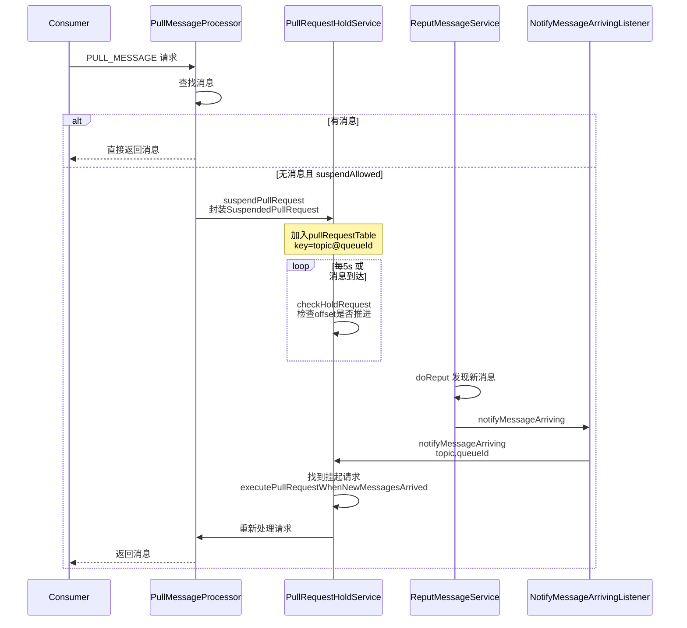
```mermaid
sequenceDiagram
    participant C as Consumer
    participant PMP as PullMessageProcessor
    participant PH as PullRequestHoldService
    participant RMS as ReputMessageService
    participant NMA as NotifyMessageArrivingListener

    C->>PMP: PULL_MESSAGE 请求
    PMP->>PMP: 查找消息
    alt 有消息
        PMP-->>C: 直接返回消息
    else 无消息且 suspendAllowed
        PMP->>PH: suspendPullRequest<br/>封装SuspendedPullRequest
        Note over PH: 加入pullRequestTable<br/>key=topic@queueId
        loop 每5s 或 消息到达
            PH->>PH: checkHoldRequest<br/>检查offset是否推进
        end
        RMS->>RMS: doReput 发现新消息
        RMS->>NMA: notifyMessageArriving
        NMA->>PH: notifyMessageArriving<br/>topic,queueId
        PH->>PH: 找到挂起请求<br/>executePullRequestWhenNewMessagesArrived
        PH->>PMP: 重新处理请求
        PMP-->>C: 返回消息
    end
```

### 11.3 PullRequestHoldService

- `pullRequestTable`：`Map<String/*topic@queueId*/, ManyPullRequest>` 管理挂起请求
- `run()` 每 5s 检查一次所有挂起请求是否可响应
- `notifyMessageArriving(topic, queueId, offset)`：当 `offset > 已知 offset` 时唤醒请求，重新调用 `PullMessageProcessor.executePullRequestWhenNewMessagesArrived`

### 11.4 消息到达触发

`ReputMessageService.doReput` 在分发消息时调用 `NotifyMessageArrivingListener.notifyMessageArriving`，实时唤醒挂起请求，无需等待 5s 轮询。

### 11.5 长轮询 vs 短轮询

| 维度 | 短轮询 | 长轮询 |
|------|-------|-------|
| 实时性 | 依赖轮询间隔 | 接近实时 |
| 资源消耗 | 高（频繁请求） | 低（挂起等待） |
| 实现 | 客户端循环 | Broker 挂起 + 唤醒 |

### 11.6 挂起与唤醒源码细节

**PullRequestHoldService**（`broker/.../longpolling/PullRequestHoldService.java`）核心数据结构：

```java
// Key 为 topic@queueId，Value 为该队列所有挂起请求
ConcurrentMap<String/*topic@queueId*/, ManyPullRequest> pullRequestTable;
```

**挂起请求**（`DefaultPullMessageResultHandler`）：
```java
if (brokerAllowSuspend && hasSuspendFlag) {
    long pollingTimeMills = suspendTimeoutMillisLong;
    if (!brokerConfig.isLongPollingEnable()) {
        pollingTimeMills = brokerConfig.getShortPollingTimeMills();  // 短轮询兜底
    }
    PullRequest pullRequest = new PullRequest(request, channel, pollingTimeMills,
        messageStore.now(), offset, subscriptionData, messageFilter);
    pullRequestHoldService.suspendPullRequest(topic, queueId, pullRequest);
    return null;  // 不立即响应
}
```

**唤醒请求**（`notifyMessageArriving`）：
```java
ManyPullRequest mpr = pullRequestTable.get(key);
List<PullRequest> requestList = mpr.cloneListAndClear();  // 取出并清空
for (PullRequest request : requestList) {
    if (newestOffset > request.getPullFromThisOffset()) {
        // 有新消息，检查过滤匹配
        boolean match = messageFilter.isMatchedByConsumeQueue(tagsCode, ...);
        if (match && properties != null) {
            match = messageFilter.isMatchedByCommitLog(null, properties);
        }
        if (match) {
            // 匹配，重新执行 Pull 请求
            pullMessageProcessor.executeRequestWhenWakeup(channel, request.getRequestCommand());
            continue;
        }
    }
    // 超时检查
    if (now >= request.getSuspendTimestamp() + request.getTimeoutMillis()) {
        pullMessageProcessor.executeRequestWhenWakeup(channel, request.getRequestCommand());
        continue;
    }
    replayList.add(request);  // 未到期未匹配，重新放回
}
if (!replayList.isEmpty()) mpr.addPullRequest(replayList);
```

**executeRequestWhenWakeup**：异步重新调用 `PullMessageProcessor.processRequest`，模拟一次新的 Pull 请求，此时有消息则返回，无消息则再次挂起。

### 11.7 双触发机制

长轮询有两个唤醒触发源，确保实时性：

1. **消息到达触发**（实时）：`ReputMessageService.doReput` 分发消息时调用 `NotifyMessageArrivingListener.notifyMessageArriving`，立即唤醒挂起请求。这是主要触发源，保证接近实时。
2. **定时检查触发**（兜底）：`PullRequestHoldService.run()` 每 5s 检查所有挂起请求，处理可能遗漏的唤醒，并处理超时。

### 11.8 长轮询配置与设计总结

| 配置 | 默认值 | 说明 |
|------|--------|------|
| `longPollingEnable` | true | 是否启用长轮询 |
| `brokerSuspendMaxTimeMillis` | 20000 | Broker 挂起最大时间 |
| `consumerTimeoutMillisWhenSuspend` | 30000 | 消费者等待超时 |
| `shortPollingTimeMills` | 1000 | 短轮询间隔（长轮询关闭时） |

**设计总结**：
1. **挂起而非拒绝**：无消息时挂起请求而非返回 NOT_FOUND，减少客户端重试。
2. **双触发**：消息到达即时唤醒 + 定时兜底，兼顾实时与可靠。
3. **过滤感知**：唤醒时重新执行过滤，只返回匹配的消息。
4. **超时控制**：最长挂起 20s，超时返回，避免连接长期占用。
5. **短轮询兼容**：关闭长轮询时退化为 1s 短轮询，适配特殊场景。

---

## 十二、消息重试机制

### 12.1 消费失败处理

`processConsumeResult` 中 `RECONSUME_LATER`：
1. `sendMessageBack(msg, context)` 发送 `CONSUMER_SEND_MSG_BACK` 请求
2. Broker `SendMessageProcessor.consumerSendMsgBack` 处理

### 12.2 重试主题与延迟等级

- **重试主题**：`%RETRY% + groupName`
- **死信主题**：`%DLQ% + groupName`
- **延迟等级**（默认 18 级）：
  ```
  1s 5s 10s 30s 1m 2m 3m 4m 5m 6m 7m 8m 9m 10m 20m 30m 1h 2h
  ```
- **`maxReconsumeTimes`**：默认 16（并发消费）/ Integer.MAX_VALUE（顺序消费）
- 每次重试 delayLevel 递增（`delayLevel = reconsumeTimes + 3`，从 10s 开始）

### 12.3 重试流程

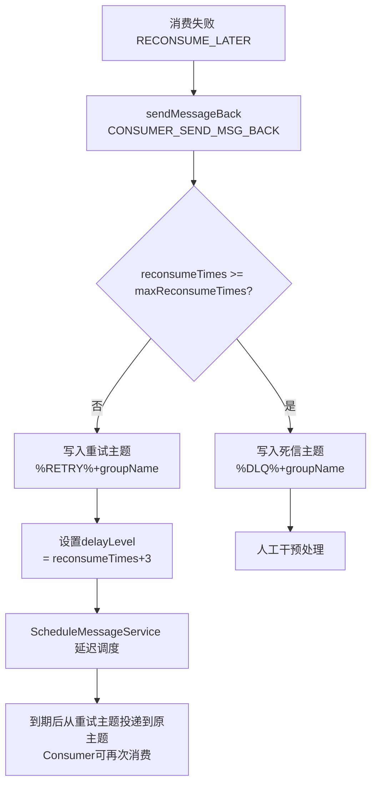
```mermaid
flowchart TD
    A[消费失败 RECONSUME_LATER] --> B[sendMessageBack<br/>CONSUMER_SEND_MSG_BACK]
    B --> C{reconsumeTimes >= maxReconsumeTimes?}
    C -- 是 --> D[写入死信主题<br/>%DLQ%+groupName]
    C -- 否 --> E[写入重试主题<br/>%RETRY%+groupName]
    E --> F[设置delayLevel<br/>= reconsumeTimes+3]
    F --> G[ScheduleMessageService 延迟调度]
    G --> H[到期后从重试主题投递到原主题<br/>Consumer可再次消费]
    D --> I[人工干预处理]
```

### 12.4 ScheduleMessageService

延迟等级模式下，每个 delayLevel 对应一个 `DeliverDelayedMessageTimerTask`，到期后将消息从 `SCHEDULE_TOPIC_XXXX` 重新写入原 Topic，消费者可再次拉取消费。

### 12.5 processConsumeResult 源码细节

`ConsumeMessageConcurrentlyService.processConsumeResult`（`client/.../impl/consumer/ConsumeMessageConcurrentlyService.java`）核心逻辑：

```java
public void processConsumeResult(ConsumeConcurrentlyStatus status,
    ConsumeConcurrentlyContext context, ConsumeRequest consumeRequest) {
    int ackIndex = context.getAckIndex();
    switch (status) {
        case CONSUME_SUCCESS: break;
        case RECONSUME_LATER:
            ackIndex = -1;  // 全部消息需重试
            statsManager.incConsumeFailedTPS(...);
            break;
    }
    switch (messageModel) {
        case BROADCASTING:
            // 广播模式：直接丢弃，不重试（无 Broker 协作）
            break;
        case CLUSTERING:
            for (int i = ackIndex + 1; i < msgs.size(); i++) {
                MessageExt msg = msgs.get(i);
                if (!processQueue.containsMessage(msg)) continue;  // 已被清理跳过
                boolean result = sendMessageBack(msg, context);
                if (!result) {
                    msg.setReconsumeTimes(msg.getReconsumeTimes() + 1);
                    msgBackFailed.add(msg);  // 回退失败，稍后本地重试
                }
            }
            if (!msgBackFailed.isEmpty()) {
                submitConsumeRequestLater(msgBackFailed, ...);  // 延迟本地重试
            }
            break;
    }
    long offset = processQueue.removeMessage(msgs);  // 从 ProcessQueue 移除
    if (offset >= 0) offsetStore.updateOffset(queue, offset, true);
}
```

关键点：`ackIndex` 标记成功消费到第几条，`ackIndex+1` 之后的消息需重试。回退失败的会在本地延迟重试，避免消息丢失。

### 12.6 顺序消费重试

`ConsumeMessageOrderlyService.processConsumeResult` 处理顺序消费失败：

- 顺序消费失败返回 `SUSPEND_CURRENT_QUEUE_A_MOMENT`
- **不发送 sendMessageBack**，而是把消息放回 ProcessQueue 头部，本地无限重试
- 加锁保证同一队列串行消费（`messageQueueLock`）
- 顺序消费 `maxReconsumeTimes = Integer.MAX_VALUE`，理论无限重试
- 这是为了保证顺序：若发回 Broker 重试，会打乱顺序

### 12.7 与死信队列的衔接

重试与死信形成两级兜底（详见第二十二章 22.8）：

```
消费失败 -> sendMessageBack -> Broker
  ├─ reconsumeTimes < maxReconsumeTimes:
  │    切换 topic=%RETRY%group, 设 delayLevel=reconsumeTimes+3
  │    -> ScheduleMessageService 延迟 -> 到期投递原 topic -> 重新消费
  └─ reconsumeTimes >= maxReconsumeTimes:
       切换 topic=%DLQ%group, 延迟级别=0
       -> 写入死信队列 -> 等待人工干预
```

`delayLevel = reconsumeTimes + 3` 的设计：第 1 次重试对应等级 4（30s），递增到等级 18（2h），重试间隔越来越长，适配"瞬时故障恢复"场景。

### 12.8 重试配置与设计总结

| 配置 | 默认值 | 说明 |
|------|--------|------|
| `maxReconsumeTimes`（并发） | 16 | 并发消费最大重试 |
| `maxReconsumeTimes`（顺序） | MAX_VALUE | 顺序消费无限重试 |
| `messageDelayLevel` | `1s 5s ... 2h` | 延迟等级 |
| `delayLevelWhenNextConsume` | -1 | 自定义下次延迟等级 |

**设计总结**：
1. **两级兜底**：重试主题处理可恢复失败，死信队列处理不可恢复失败。
2. **延迟递增**：重试间隔随次数递增，适配不同故障恢复周期。
3. **广播不重试**：广播模式无 Broker 协作，失败即丢。
4. **顺序本地重试**：顺序消费为保证顺序，本地无限重试不回 Broker。
5. **回退容错**：sendMessageBack 失败时本地延迟重试，防消息丢失。

---

## 十三、消息过滤原理

### 13.1 MessageFilter 接口

```java
public interface MessageFilter {
    boolean isMatchedByConsumeQueue(Long tagsCode, ConsumeQueueExt.CqExtUnit cqExtUnit);
    boolean isMatchedByCommitLog(ByteBuffer msgBuffer, Map<String, String> properties);
}
```

两层过滤：ConsumeQueue 层（快速，仅 tagsCode）+ CommitLog 层（精确，需读消息属性）。

### 13.2 TAG 过滤

`DefaultMessageFilter`（`store/.../DefaultMessageFilter.java`）：
1. 生产时：TAG 的 hashCode 存入 ConsumeQueue 条目的 `tagsCode`（8B）
2. 消费者订阅：订阅的 TAG 集合转为 hashCode 集合 `codeSet`
3. 拉取时 Broker 端 `isMatchedByConsumeQueue`：
   ```java
   return subString.equals(SUB_ALL) || codeSet.contains(tagsCode.intValue());
   ```
4. 只返回匹配消息，减少网络传输

### 13.3 SQL92 过滤

`SqlFilter`（`filter/.../SqlFilter.java`）实现 `FilterSpi`：
1. 消费者用 SQL92 表达式订阅（如 `a > 5 AND b = 'x'`）
2. `SelectorParser.parse(expr)` 编译为 `Expression`
3. 拉取时对每条消息属性求值，返回满足表达式的消息
4. 需要 `ConsumerFilterManager` 管理 `ConsumerFilterData`，支持属性索引

### 13.4 过滤位置对比

| 位置 | 优点 | 缺点 |
|------|------|------|
| Broker 端（ConsumeQueue） | 极快，仅比对 hashCode | 仅 TAG |
| Broker 端（CommitLog） | 支持 SQL92 | 需读消息，慢 |
| Consumer 端 | 减轻 Broker | 网络浪费 |

### 13.5 ExpressionMessageFilter 实现

`ExpressionMessageFilter`（`broker/.../filter/ExpressionMessageFilter.java`）是 Broker 端主流过滤器，同时支持 TAG 与 SQL92：

**TAG 过滤**（ConsumeQueue 层）：
```java
if (ExpressionType.isTagType(subscriptionData.getExpressionType())) {
    if (tagsCode == null) return true;
    if (subscriptionData.getSubString().equals(SUB_ALL)) return true;
    return subscriptionData.getCodeSet().contains(tagsCode.intValue());
}
```

**SQL92 过滤**（CommitLog 层）：
```java
public boolean isMatchedByCommitLog(ByteBuffer msgBuffer, Map<String,String> properties) {
    MessageEvaluationContext context = new MessageEvaluationContext(properties);
    Object ret = realFilterData.getCompiledExpression().evaluate(context);
    return (Boolean) ret;
}
```

SQL92 表达式经 `SelectorParser.parse(expr)` 编译为 `Expression`，编译一次复用多次，避免重复解析。

### 13.6 tagsCode 的双重用途

ConsumeQueue 条目的 `tagsCode` 字段（8 字节）承担双重角色：

| 取值 | 含义 | 用途 |
|------|------|------|
| `> ConsumeQueueExt.MAX_ADDR` | TAG 的 hashCode | TAG 过滤比对 |
| `<= ConsumeQueueExt.MAX_ADDR` | ConsumeQueueExt 扩展地址 | SQL92 过滤的 bitMap 等 |

这种设计让 ConsumeQueue 既支持快速 TAG 过滤，又通过 `ConsumeQueueExt` 扩展支持 SQL92 的 bitMap 预过滤，兼容两种模式。

**ExpressionForRetryMessageFilter**（`broker/.../filter/ExpressionForRetryMessageFilter.java`）专用于重试主题：解析消息属性中的原始 topic，用原始 topic 的过滤规则过滤，解决重试队列下的过滤问题。

### 13.7 filterServer 模块与类过滤

`filter` 模块支持独立过滤服务器（FilterServer），可部署为单独进程：

- `FilterClassUtils`：动态加载用户自定义过滤类
- `FilterManager`：管理过滤类注册与编译
- 过滤逻辑在 FilterServer 执行，降低 Broker 计算压力
- 适用于复杂过滤（如需访问消息体的过滤）

**SubscriptionData**（`remoting/.../heartbeat/SubscriptionData.java`）存储订阅信息：主题名、订阅表达式（TAG/SQL92）、TAG hash 集合 `codeSet`、过滤模式。

### 13.8 过滤设计总结

1. **两级过滤**：ConsumeQueue 层快速过滤（TAG hash），CommitLog 层精确过滤（SQL92），兼顾速度与灵活性。
2. **TAG hash 优化**：用 hashCode 比对替代字符串比对，O(1) 快速过滤。
3. **SQL92 编译复用**：表达式编译一次，多次求值，避免重复解析开销。
4. **bitMap 预过滤**：ConsumeQueueExt 扩展 bitMap，SQL92 也能在索引层快速过滤。
5. **重试感知**：ExpressionForRetryMessageFilter 处理重试主题的过滤一致性。
6. **独立 FilterServer**：复杂过滤可卸载到独立进程，保护 Broker。

---

## 十四、消息查询原理

### 14.1 QueryMessageProcessor

处理两类请求：
- `QUERY_MESSAGE`：按 key 查询（走 IndexFile）
- `VIEW_MESSAGE_BY_ID`：按物理 offset 查询（直接读 CommitLog）

### 14.2 按 key 查询流程

```mermaid
flowchart TD
    A[queryMessage topic,key,maxNum,begin,end] --> B[messageStore.queryMessage]
    B --> C[indexService.queryOffset]
    C --> D[遍历IndexFile列表<br/>从新到旧]
    D --> E{文件时间匹配?}
    E -- 是 --> F[buildKey topic#key]
    F --> G[indexFile.selectPhyOffset<br/>hash槽→链表遍历]
    G --> H[收集匹配的phyOffset]
    H --> I{数量>=maxNum?}
    I -- 否 --> D
    I -- 是 --> J[根据phyOffset从CommitLog读消息]
    J --> K[返回QueryMessageResult]
```

### 14.3 按 offset 查询

`viewMessageById` → `messageStore.selectOneMessageByOffset(offset)` → 直接定位 CommitLog MappedFile + offset 读取。

### 14.4 按时间戳查询

`DefaultMessageStore.getOffsetInQueueByTime(topic, queueId, timestamp, boundaryType)`：在 ConsumeQueue 中二分查找最接近 timestamp 的条目。

### 14.5 IndexFile 哈希索引原理

按 key 查询依赖 IndexFile 的哈希索引（详见第四章 4.4）。索引构建与查询：

**构建索引**（消息写入后由 ReputMessageService 触发）：
```
IndexService.buildIndex(topic, msg)
  └─> indexFile.putKey(key, phyOffset, storeTimestamp)
       ├─> hashSlot = hash(key) % hashSlotNum
       ├─> 检查 slot 中存的 lastIndex
       ├─> 新索引项的 prevIndex = slot.lastIndex（链表法）
       ├─> 写索引项（phyOffset, timeDiff, prevIndex）
       └─> 更新 slot.lastIndex = 当前索引项位置
```

**查询索引**（`IndexFile.selectPhyOffset`）：
```
hashSlot = hash(key) % hashSlotNum
slotValue = 读 slot 的 lastIndex
遍历链表:
  indexItem = slotValue
  while indexItem 有效:
    if indexItem.key == key && timeInRange: phyOffsets.add(item.phyOffset)
    indexItem = item.prevIndex
```

链表法解决哈希冲突，时间范围过滤避免返回过期数据。

### 14.6 查询优化与命令行

**查询流程完整链路**：
```
客户端 queryMessage(topic, key, maxNum, begin, end)
  └─> Broker QueryMessageProcessor.queryMessage
       └─> DefaultMessageStore.queryMessage
            └─> IndexService.queryOffset(topic, key, begin, end)
                 └─> 遍历 IndexFile（从新到旧）
                      └─> IndexFile.selectPhyOffset (哈希+链表)
            └─> 收集 phyOffset 列表（最多 maxNum）
            └─> CommitLog.selectOneMessageByOffset(phyOffset) 读消息
       └─> 返回 QueryMessageResult
```

**优化点**：
- IndexFile 从新到旧遍历，优先返回新消息
- 时间范围过滤，避免无效结果
- maxNum 限制单次查询量，防 OOM
- 按 offset 查询走 `MappedFileQueue.findMappedFileByOffset`，O(1) 定位

**命令行**：`mqadmin queryMsgByKey -t topic -k key`、`queryMsgByOffset`、`queryMsgByUniqueKey` 均通过 AdminBrokerProcessor 调用上述流程。

### 14.7 查询设计总结

1. **三级索引协同**：按 key 走 IndexFile 哈希索引，按 offset 走 CommitLog 直接定位，按时间戳走 ConsumeQueue 二分查找。
2. **链表法哈希**：IndexFile 用链表解决冲突，支持任意 key 查询。
3. **时间范围过滤**：避免返回过期数据，支持窗口查询。
4. **从新到旧**：优先返回新消息，符合运维直觉。
5. **maxNum 限制**：防止单次查询返回过多导致 OOM。

---

## 十五、事务消息原理

### 15.1 两阶段提交架构

```mermaid
sequenceDiagram
    participant P as Producer
    participant TL as TransactionListener
    participant B as Broker
    participant TMS as TransactionalMessageService
    participant TMCS as TransactionalMessageCheckService

    P->>P: sendMessageInTransaction
    P->>B: 1.发送半消息<br/>PROPERTY_TRANSACTION_PREPARED=true
    B->>TMS: prepareMessage
    TMS->>TMS: 改写Topic=RMQ_SYS_TRANS_HALF_TOPIC<br/>备份原topic/queueId到属性
    TMS-->>P: 半消息发送成功
    P->>TL: 2.执行本地事务 executeLocalTransaction
    alt 本地事务成功
        P->>B: 3a.COMMIT_MESSAGE
        B->>B: EndTransactionProcessor<br/>恢复原Topic/queueId<br/>写入原Topic
        B->>B: 写OpQueue 标记已处理
    else 本地事务失败
        P->>B: 3b.ROLLBACK_MESSAGE
        B->>B: EndTransactionProcessor<br/>不投递，写OpQueue
    else 未知/超时
        Note over B: 4.事务回查
        TMCS->>TMS: check 扫描半消息
        TMS->>P: CHECK_TRANSACTION_STATE
        P->>TL: checkLocalTransaction
        TL-->>TMS: COMMIT/ROLLBACK/UNKNOWN
    end
```

### 15.2 关键类

| 类 | 路径 | 职责 |
|----|------|------|
| `TransactionMQProducer` | `client/.../producer/TransactionMQProducer.java` | 事务生产者 |
| `TransactionListener` | `client/.../TransactionListener.java` | 本地事务执行 + 回查 |
| `SendMessageProcessor` | `broker/.../processor/SendMessageProcessor.java:323` | 半消息识别 |
| `TransactionalMessageBridge` | `broker/.../transaction/queue/TransactionalMessageBridge.java` | 半消息存储桥接 |
| `TransactionalMessageServiceImpl` | `broker/.../transaction/queue/TransactionalMessageServiceImpl.java` | 事务服务实现 |
| `EndTransactionProcessor` | `broker/.../processor/EndTransactionProcessor.java` | 处理 COMMIT/ROLLBACK |
| `TransactionalMessageCheckService` | - | 定期回查（默认 60s） |

### 15.3 核心主题

- `RMQ_SYS_TRANS_HALF_TOPIC`：存储半消息
- `RMQ_SYS_TRANS_OP_HALF_TOPIC`（OpQueue）：记录已处理的事务操作，避免重复回查

### 15.4 事务状态

- `COMMIT_MESSAGE`：提交，消息投递到原 Topic
- `ROLLBACK_MESSAGE`：回滚，消息丢弃
- `UNKNOWN_MESSAGE`：未知，触发回查

### 15.5 回查机制

`TransactionalMessageServiceImpl.check()`（`TransactionalMessageServiceImpl.java:162`）：
1. 扫描 `RMQ_SYS_TRANS_HALF_TOPIC` 半消息
2. 对比 OpQueue，过滤已处理消息
3. 对未处理且超过回查间隔的消息，发送 `CHECK_TRANSACTION_STATE` 给 Producer
4. Producer `TransactionListener.checkLocalTransaction` 返回状态
5. 根据状态执行 COMMIT/ROLLBACK，写 OpQueue

### 15.6 半消息存储改写源码

`TransactionalMessageBridge.parseHalfMessageInner()`（`TransactionalMessageBridge.java:219`）是半消息机制的核心改写逻辑：

```java
// 1. 备份原 topic/queueId 到属性
MessageAccessor.putProperty(msgInner, MessageConst.PROPERTY_REAL_TOPIC, msgInner.getTopic());
MessageAccessor.putProperty(msgInner, MessageConst.PROPERTY_REAL_QUEUE_ID, String.valueOf(msgInner.getQueueId()));
// 2. 改写 Topic 为 RMQ_SYS_TRANS_HALF_TOPIC，queueId 固定为 0
msgInner.setTopic(TransactionalMessageUtil.buildHalfTopic());
msgInner.setQueueId(0);
// 3. 标记事务类型为 PREPARED
msgInner.setSysFlag(MessageSysFlag.resetTransactionValue(msgInner.getSysFlag(), MessageSysFlag.TRANSACTION_PREPARED_TYPE));
```

**设计要点**：
- 半消息对 Consumer 不可见（Topic 被改写，消费者订阅的是原 Topic）
- 原 Topic/queueId 保存在消息属性中，COMMIT 时用于恢复
- `queueId=0` 保证所有半消息在一个队列里，便于顺序扫描回查
- 5.x 支持 RocksDB 存储半消息（`buildHalfTopicForRocksDB`），提高回查性能

### 15.7 EndTransactionProcessor 源码流程

`EndTransactionProcessor.processRequest()`（`EndTransactionProcessor.java:59`）处理 Producer 提交的 COMMIT/ROLLBACK 请求：

```mermaid
flowchart TD
    A[收到 EndTransaction 请求] --> B{BrokerRole?}
    B -->|SLAVE| C[返回 SLAVE_NOT_AVAILABLE]
    B -->|MASTER| D{fromTransactionCheck?}
    D -->|是 回查响应| E{commitOrRollback}
    D -->|否 Producer主动提交| F{commitOrRollback}
    E -->|NOT_TYPE| G[返回null 挂起]
    E -->|COMMIT/ROLLBACK| H[继续处理]
    F -->|NOT_TYPE| G
    F -->|COMMIT/ROLLBACK| H
    H --> I{commitOrRollback 类型}
    I -->|COMMIT| J[commitMessage 查找半消息]
    I -->|ROLLBACK| K[rollbackMessage 查找半消息]
    J --> L{rejectCommitOrRollback 超期校验}
    K --> L
    L -->|超期 返回ILLEGAL_OPERATION| M[拒绝 604]
    L -->|未超期| N[checkPrepareMessage 校验]
    N -->|校验失败| O[返回SYSTEM_ERROR]
    N -->|校验成功| P{类型}
    P -->|COMMIT| Q[endMessageTransaction 恢复原Topic<br/>sendFinalMessage 投递到原Topic<br/>deletePrepareMessage 写OpQueue]
    P -->|ROLLBACK| R[deletePrepareMessage 写OpQueue<br/>不投递原消息]
```

**关键校验** `checkPrepareMessage()`（`EndTransactionProcessor.java:241`）：
1. `producerGroup` 必须匹配半消息发送方
2. `queueOffset`（TranStateTableOffset）必须匹配
3. `commitLogOffset` 必须匹配

三重校验防止 Producer 误提交其他事务消息或重复提交。

### 15.8 事务回查机制深入

`TransactionalMessageServiceImpl.check()`（`TransactionalMessageServiceImpl.java:162`）完整流程：

```mermaid
sequenceDiagram
    participant TMCS as TransactionalMessageCheckService<br/>每60s触发
    participant TMS as TransactionalMessageServiceImpl
    participant Half as HalfTopic<br/>RMQ_SYS_TRANS_HALF_TOPIC
    participant Op as OpQueue<br/>RMQ_SYS_TRANS_OP_HALF_TOPIC
    participant P as Producer

    TMCS->>TMS: check(transactionTimeout, transactionCheckMax, listener)
    TMS->>Half: fetchHalfMessage 拉取半消息
    TMS->>Op: fetchOpMessage 拉取Op消息
    Note over TMS: 双队列对比<br/>doneConsumeQueue 已处理<br/>removeMap 待移除
    loop 每条半消息
        TMS->>TMS: needDiscard 检查回查次数<br/>>transactionCheckMax 丢弃
        TMS->>TMS: needSkip 检查是否超过文件保留时间
        alt 已在 OpQueue
            TMS->>TMS: 跳过 已处理
        else 未处理 且 超过 checkImmunityTime
            TMS->>TMS: putBackHalfMsgQueue 重新写入Half Topic<br/>更新commitLogOffset
            TMS->>P: 发送 CHECK_TRANSACTION_STATE
            P->>P: TransactionListener.checkLocalTransaction
            P-->>TMS: COMMIT/ROLLBACK/UNKNOWN
            alt COMMIT/ROLLBACK
                TMS->>TMS: resolveHalfMsg 触发监听
                Note over TMS: EndTransactionProcessor 写OpQueue
            else UNKNOWN
                Note over TMS: 下轮继续回查<br/>回查次数+1
            end
        end
    end
```

**关键设计点**：

| 机制 | 源码位置 | 作用 |
|------|----------|------|
| `needDiscard` | `:108` | 超过 `transactionCheckMax`（默认 15 次）丢弃，防止无限回查 |
| `needSkip` | `:123` | 超过文件保留时间（默认 72h）跳过，防止磁盘占用 |
| `putBackHalfMsgQueue` | `:135` | 回查前重新写入 Half Topic，防止消息已过期被清理导致回查失败 |
| `checkImmunityTime` | `:276` | 首次回查免疫期（默认 60s），避免刚发送的消息立即回查 |
| `PROPERTY_TRANSACTION_CHECK_TIMES` | `:119` | 记录回查次数，每次回查 +1 |

### 15.9 事务消息设计精髓总结

```mermaid
graph LR
    subgraph S1[存储层 设计]
        T1[Half Topic 隔离<br/>Consumer 不可见]
        T2[OpQueue 标记已处理<br/>避免重复回查]
        T3[属性备份原Topic/queueId<br/>COMMIT 时恢复]
    end
    subgraph S2[一致性 设计]
        U1[两阶段提交<br/>半消息+本地事务+提交]
        U2[超时回查<br/>TMCS 60s 扫描]
        U3[回查次数限制<br/>15 次后丢弃]
        U4[三重校验<br/>group+offset+commitLogOffset]
    end
    subgraph S3[可用性 设计]
        V1[Producer 主动提交 + 回查双路径]
        V2[putBackHalfMsg 保证消息可回查]
        V3[RocksDB 5.x 增强半消息存储]
    end
```

**设计精髓**：
1. **半消息隔离**：通过改写 Topic 让消息对消费者不可见，是事务原子性的核心
2. **OpQueue 标记**：与 Half Topic 形成"消息-操作"双队列模式，避免重复回查
3. **回查机制补全**：Producer 崩溃/网络异常未提交时，Broker 主动回查补全事务
4. **幂等与限制**：`PROPERTY_TRANSACTION_CHECK_TIMES` 防止无限回查，`rejectCommitOrRollback` 超期拒绝防止恶意提交
5. **5.x 进化**：RocksDB 存储半消息提高回查性能、TransactionMetrics 统计事务状态、OTel 指标暴露 commit/rollback 延迟

---

## 十六、延迟消息原理

延迟消息是 RocketMQ 的重要业务特性：Producer 发送时指定延迟时间，消息到期后才对 Consumer 可见。RocketMQ 经历了两代实现：**传统固定 18 级延迟等级**（4.x 及之前）与 **5.x 基于时间轮的精确延迟**（任意时间）。两代机制并存，可在 Broker 配置中切换。

### 16.1 两种实现模式对比

```mermaid
graph LR
    A[延迟消息] --> B{5.x}
    B -->|旧: ScheduleMessageService| C[固定18级延迟等级<br/>1s 5s ... 2h]
    B -->|新: TimerMessageStore| D[任意延迟时间<br/>基于时间轮]
    C --> C1[SCHEDULE_TOPIC_XXXX<br/>按等级分queueId]
    D --> D1[TimerWheel时间轮<br/>+ TimerLog持久化]
```

| 维度 | 传统模式 ScheduleMessageService | 5.x TimerMessageStore |
|------|-------------------------------|----------------------|
| 延迟时间 | 固定 18 级（1s/5s/.../2h） | 任意毫秒级延迟 |
| 存储 | 复用 SCHEDULE_TOPIC + ConsumeQueue | 独立 TimerWheel + TimerLog |
| 调度 | 每等级一个定时任务扫描 | 时间轮 slot 到期出队 |
| 精度 | 秒级 | 可配（默认 1s，支持亚秒） |
| 扩展性 | 等级数有限 | 环形时间轮，支持海量 |
| 适用 | 简单延迟场景 | 复杂高精度延迟 |

### 16.2 传统延迟等级模式深度分析

传统模式基于"延迟等级 + 固定延迟 Topic + 定时扫描"实现，是 4.x 的核心延迟方案，5.x 仍保留兼容。

#### 16.2.1 ScheduleMessageService 整体结构

**文件**：`broker/src/main/java/org/apache/rocketmq/broker/schedule/ScheduleMessageService.java`

继承自 `ConfigManager`，负责延迟消息的调度、投递、偏移管理。核心字段：

| 字段 | 类型 | 说明 |
|------|------|------|
| `delayLevelTable` | `ConcurrentSkipListMap<Integer, Long>` | 延迟等级 -> 延迟毫秒数 |
| `offsetTable` | `ConcurrentMap<Integer, Long>` | 每等级的消费队列偏移 |
| `maxDelayLevel` | `int` | 最大延迟等级 |
| `deliverExecutorService` | `ScheduledExecutorService` | 投递线程池 |
| `scheduledPersistService` | `ScheduledExecutorService` | 偏移持久化线程池 |
| `started` | `AtomicBoolean` | 启动状态 |

关键方法：
- `load()`（行 222-227）：加载持久化的延迟偏移，解析等级配置
- `start()`（行 135-166）：初始化线程池，为每等级启动定时任务
- `parseDelayLevel()`（行 300-332）：解析等级配置字符串
- `shutdown()`（行 168-171）：停止服务

#### 16.2.2 18 级延迟等级定义

默认等级配置在 `MessageStoreConfig.java`：

```java
private String messageDelayLevel = "1s 5s 10s 30s 1m 2m 3m 4m 5m 6m 7m 8m 9m 10m 20m 30m 1h 2h";
```

`parseDelayLevel()` 解析该字符串，填入 `delayLevelTable`。完整映射表：

| 等级 | 时间 | 毫秒 | 等级 | 时间 | 毫秒 |
|------|------|------|------|------|------|
| 1 | 1s | 1000 | 10 | 6m | 360000 |
| 2 | 5s | 5000 | 11 | 7m | 420000 |
| 3 | 10s | 10000 | 12 | 8m | 480000 |
| 4 | 30s | 30000 | 13 | 9m | 540000 |
| 5 | 1m | 60000 | 14 | 10m | 600000 |
| 6 | 2m | 120000 | 15 | 20m | 1200000 |
| 7 | 3m | 180000 | 16 | 30m | 1800000 |
| 8 | 4m | 240000 | 17 | 1h | 3600000 |
| 9 | 5m | 300000 | 18 | 2h | 7200000 |

等级可通过 `messageDelayLevel` 配置自定义，但修改后需重启 Broker 重新解析。

#### 16.2.3 SCHEDULE_TOPIC 与 queueId 映射

**常量**：`TopicValidator.RMQ_SYS_SCHEDULE_TOPIC = "SCHEDULE_TOPIC_XXXX"`（`TopicValidator.java:27`）

**等级与 queueId 互转**：

```java
public static int delayLevel2QueueId(final int delayLevel) {
    return delayLevel - 1;
}
public static int queueId2DelayLevel(final int queueId) {
    return queueId + 1;
}
```

即 18 个等级对应 queueId 0-17，每个等级一个独立的 ConsumeQueue。这样按等级隔离，各等级独立扫描、独立维护偏移。

#### 16.2.4 延迟消息写入流程

Producer 发送延迟消息时设置 `DELAY` 属性（`MessageConst.PROPERTY_DELAY_TIME_LEVEL`），Broker 端 `SendMessageProcessor` 处理：

```
1. 识别延迟消息：检查 PROPERTY_DELAY_TIME_LEVEL 属性
2. 保存原始信息：
   - PROPERTY_REAL_TOPIC = 原 topic
   - PROPERTY_REAL_QUEUE_ID = 原 queueId
3. 切换主题：msgInner.setTopic(SCHEDULE_TOPIC_XXXX)
4. 切换队列：msgInner.setQueueId(delayLevel - 1)
5. 存储到 CommitLog（与普通消息相同路径）
6. ReputMessageService 异步构建 SCHEDULE_TOPIC 的 ConsumeQueue
```

关键点：延迟消息的**消息体与原消息完全一致**，只是 topic/queueId 被改写，原始信息存入属性。这样到期后能完整恢复。

#### 16.2.5 DeliverDelayedMessageTimerTask 定时任务

**内部类**：`ScheduleMessageService.java:366`，每等级一个实例，`start()` 时通过 `deliverExecutorService.scheduleAtFixedRate` 启动。

**executeOnTimeUp() 流程**：

```
1. 获取该 delayLevel 对应的 ConsumeQueue（SCHEDULE_TOPIC 的 queueId=delayLevel-1）
2. 从 offsetTable[delayLevel] 位置读取 ConsumeQueue 条目
3. 从 ConsumeQueue 条目取 tagsCode（即 deliverTimestamp）
4. 判断到期：deliverTimestamp <= now ?
   - 未到期：安排下一次扫描，退出
   - 到期：继续
5. 根据 ConsumeQueue 的 physOffset/physSize 从 CommitLog 读取完整消息
6. 恢复原始 topic/queueId：
   - msg.setTopic(msg.getProperty(PROPERTY_REAL_TOPIC))
   - msg.setQueueId(Integer.parseInt(msg.getProperty(PROPERTY_REAL_QUEUE_ID)))
7. 清除延迟属性
8. 重新写入 CommitLog（此时已是原 topic，对 Consumer 可见）
9. 更新 offsetTable[delayLevel]，继续扫描下一条
```

#### 16.2.6 延迟消息存储格式

**消息体**：与原消息体完全一致（未修改）。

**消息属性**：

| 属性 | 含义 |
|------|------|
| `PROPERTY_REAL_TOPIC` | 原始 topic |
| `PROPERTY_REAL_QUEUE_ID` | 原始 queueId |
| `PROPERTY_DELAY_TIME_LEVEL` | 延迟等级 |

**ConsumeQueue 的 tagsCode**：传统模式巧用 ConsumeQueue 的 `tagsCode` 字段（原用于 TAG 哈希）存储投递时间戳：

```
deliverTimestamp = storeTimestamp + delayTimeMillis
```

这样定时任务扫描时，直接比较 `tagsCode <= now` 即可判断是否到期，无需读 CommitLog，效率高。

#### 16.2.7 持久化与恢复

**持久化路径**：`{storePathRootDir}/config/delayOffset.json`

`offsetTable`（每等级的消费偏移）序列化为 JSON 持久化。`ConfigManager` 提供 `persist()` / `decode()` 方法。

**恢复流程**：
1. Broker 启动调用 `ScheduleMessageService.load()`
2. 读取 `delayOffset.json`，恢复 `offsetTable`
3. 调用 `parseDelayLevel()` 解析等级配置
4. 校正每等级的 ConsumeQueue 偏移（若 offset 超过当前 ConsumeQueue maxOffset 则截断）
5. `start()` 为每等级启动定时任务

#### 16.2.8 延迟消息全链路时序

```mermaid
sequenceDiagram
    participant P as Producer
    participant SP as SendMessageProcessor
    participant CL as CommitLog
    participant CQ as ConsumeQueue<br/>(SCHEDULE_TOPIC)
    participant SMS as ScheduleMessageService
    participant Consumer as Consumer
    P->>SP: 发送消息(带 DELAY 等级)
    SP->>SP: 存 REAL_TOPIC/REAL_QUEUE_ID 属性
    SP->>SP: 切换 topic=SCHEDULE_TOPIC<br/>queueId=delayLevel-1
    SP->>CL: putMessage
    CL->>CQ: ReputMessageService 异步建索引<br/>tagsCode=deliverTimestamp
    Note over SMS: 每等级定时任务扫描
    SMS->>CQ: 从 offset 读取条目
    CQ-->>SMS: 返回 tagsCode=deliverTimestamp
    SMS->>SMS: 比较 deliverTimestamp <= now?
    alt 未到期
        SMS->>SMS: 安排下次扫描
    else 到期
        SMS->>CL: 按 physOffset 读消息
        CL-->>SMS: 返回消息
        SMS->>SMS: 恢复原 topic/queueId<br/>清除延迟属性
        SMS->>CL: 重新写入(原 topic)
        SMS->>SMS: 更新 offsetTable
    end
    Consumer->>CL: 消费原 topic
    CL-->>Consumer: 投递消息
```

#### 16.2.9 配置与性能局限

**配置项**：

| 配置项 | 默认值 | 说明 |
|--------|--------|------|
| `messageDelayLevel` | `1s 5s ... 2h` | 延迟等级配置字符串 |
| `scheduleMessageService` | - | 由 BrokerController 启动 |

**局限**：
1. **固定等级**：只能用预定义的 18 级，不支持任意延迟时间（如 7s、25min）。
2. **精度有限**：定时任务秒级扫描，最差延迟 1 秒。
3. **等级扩展性差**：等级过多时每等级一个 ConsumeQueue + 定时任务，资源开销线性增长。
4. **无超长延迟**：最大 2 小时，不支持天级延迟。

这些局限直接催生了 5.x 的 TimerMessageStore。

### 16.3 5.x TimerMessageStore 精确延迟深度分析

TimerMessageStore 基于**时间轮 + 独立日志**实现任意延迟，是 5.x 推荐方案。它解决了传统模式的固定等级、精度、扩展性三大局限。

#### 16.3.1 整体结构与核心字段

**文件**：`store/src/main/java/org/apache/rocketmq/store/timer/TimerMessageStore.java`

```java
public class TimerMessageStore {
    private final MessageStore messageStore;
    private final TimerWheel timerWheel;          // 时间轮（内存索引 + 磁盘）
    private final TimerLog timerLog;              // 延迟消息日志
    private final TimerCheckpoint timerCheckpoint; // 检查点

    // 服务线程
    private TimerEnqueueGetService enqueueGetService;      // 入队：扫描 CommitLog
    private TimerEnqueuePutService enqueuePutService;     // 入队：写时间轮
    private TimerDequeueGetService dequeueGetService;     // 出队：扫描到期 slot
    private TimerDequeuePutMessageService[] dequeuePutMessageServices; // 出队：投递

    // 配置
    private final int precisionMs;          // 时间轮精度（默认 1000ms）
    private final int slotsTotal;           // 总 slot 数（7天*86400=604800）

    // 位点
    private volatile long currReadTimeMs;   // 当前读取时间
    private volatile long currWriteTimeMs;  // 当前写入时间
    private volatile long currQueueOffset;  // 当前队列偏移
}
```

**构造**（行 167-204）初始化 TimerWheel、TimerLog、各服务线程；**start()**（行 242-260）启动所有服务；**shutdown()**（行 565-595）停止并 flush 检查点。

#### 16.3.2 时间轮 TimerWheel 与 Slot 结构

**文件**：`store/.../timer/TimerWheel.java` + `Slot.java`

**Slot 结构**（`Slot.java`，固定 32 字节）：

| 字段 | 大小 | 含义 |
|------|------|------|
| `timeMs` | 8B | 该 slot 对应的时间戳（毫秒） |
| `firstPos` | 8B | TimerLog 中首条记录偏移 |
| `lastPos` | 8B | TimerLog 中末条记录偏移 |
| `num` | 4B | 该 slot 消息数量 |
| `magic` | 4B | 魔法标记 |

**组织方式**：
- slot 数量：`slotsTotal * 2`（默认 604800 * 2 = 1209600，支持 7 天 * 2）
- slot 索引：`getSlotIndex(timeMs) = (int)(timeMs / precisionMs % (slotsTotal * 2))`
- 环形结构：时间戳取模映射到固定大小数组，形成"时间轮"
- slot 粒度：由 `precisionMs` 决定（默认 1 秒一个 slot）

**磁盘持久化**：`${storePathRootDir}/timerwheel`，每 slot 32 字节，总大小 `slotsTotal * 2 * 32` 字节。支持快照备份。

**核心方法**：
- `getSlot(long timeMs)`：取对应时间的 slot
- `putSlot(long timeMs, long firstPos, long lastPos)`：写入 slot
- `getAllNum(long timeStartMs)`：统计某时间起的消息总数
- `reviseSlot(...)`：更新 slot（入队/出队时）

#### 16.3.3 TimerLog 持久化日志

**文件**：`store/.../timer/TimerLog.java`

TimerLog 是延迟消息的索引日志，每条记录固定 `UNIT_SIZE = 72` 字节：

```
┌──────┬─────────┬────────────┬──────────────┬──────────────┬──────────┬────────┬──────────┐
│ size │ prevPos │ magicValue│ currWriteTime│ delayedTime  │ offsetPy │ sizePy │ hashCode │
│ 4B   │ 8B      │ 4B        │ 8B           │ 4B           │ 8B       │ 4B     │ 4B       │
└──────┴─────────┴────────────┴──────────────┴──────────────┴──────────┴────────┴──────────┘
```

| 字段 | 含义 |
|------|------|
| `offsetPy` | 原始消息在 CommitLog 中的偏移（核心，出队时据此回查 CommitLog） |
| `sizePy` | 原始消息大小 |
| `delayedTime` | 延迟投递时间戳 |
| `prevPos` | 前一条记录偏移（形成链表，同一 slot 的消息串联） |
| `currWriteTime` | 写入时间 |
| `hashCode` | 消息哈希 |

**文件组织**：类似 CommitLog，采用 `MappedFileQueue` 管理多个映射文件，顺序写入。`append(byte[])` 返回写入偏移。

**与 TimerWheel 的关系**：slot 的 `firstPos` / `lastPos` 指向 TimerLog 中的记录范围，TimerLog 内部通过 `prevPos` 形成链表。出队时：slot -> TimerLog（遍历链表）-> CommitLog（读消息）。

#### 16.3.4 入队服务（扫描 + 写时间轮）

入队分两个服务协同：

**TimerEnqueueGetService**（`TimerMessageStore.java:1407-1431`，继承 `ServiceThread`）：

```java
public void run() {
    while (!isStopped()) {
        try {
            if (!TimerMessageStore.this.enqueue(0)) {
                waitForRunning(100L * precisionMs / 1000);  // 100ms 级等待
            }
        } catch (Throwable e) { ... }
    }
}
```

`enqueue()` 流程：
1. 从 CommitLog 的 `enqueueOffset` 位置开始扫描
2. 识别定时消息，检查属性：
   - `PROPERTY_TIMER_DELIVER_MS`（绝对投递时间戳）
   - `PROPERTY_TIMER_DELAY_SEC`（相对延迟秒数）
   - `PROPERTY_DELAY_TIME_LEVEL`（兼容旧等级，转换为 deliverMs）
3. 转换为统一 `deliverMs`：
   - `DELAY_TIME_LEVEL` -> 查 `MessageDelayLevel.getDelayTimeByLevel()` -> `deliverMs = now + delayTime`
   - `TIMER_DELAY_SEC` -> `deliverMs = now + delaySec * 1000`
   - `TIMER_DELIVER_MS` -> 直接用
4. 构造 `TimerRequest`（含 offsetPy、sizePy、deliverMs）放入队列

**TimerEnqueuePutService**：
1. 批量从队列取 `TimerRequest`（最多 10 条）
2. 构造 TimerLog 记录（72 字节），`append()` 写入 TimerLog
3. 更新 TimerWheel 对应 slot 的 `firstPos`/`lastPos`/`num`
4. 推进 `enqueueOffset` 位点

关键：TimerLog 只存索引（offsetPy/sizePy），不重复存消息体，消息体仍在 CommitLog。

#### 16.3.5 出队服务（扫描到期 + 投递）

出队分两个服务：

**TimerDequeueGetService**：
1. 按 `currReadTimeMs` 推进，扫描到期 slot
2. 判断 `currReadTimeMs <= now`（slot 时间已到）
3. 从 slot 的 `firstPos`/`lastPos` 遍历 TimerLog 链表
4. 构造 `TimerRequest` 放入出队队列

**TimerDequeuePutMessageService**（`handleTimerRequest`，行 1643-1680）：

```java
protected boolean handleTimerRequest(TimerRequest tr) {
    // 1. 从 TimerLog 读记录
    SelectMappedBufferResult sbr = timerLog.getTimerMessage(tr.getOffsetPy());
    // 2. 从 CommitLog 恢复原始消息
    MessageExtBrokerInner msg = convert(msgExt, tr.getEnqueueTime(), needRoll(tr.getMagic()));
    // 3. 恢复原 topic/queueId（从消息属性）
    // 4. 重新写入 CommitLog（原 topic，对 Consumer 可见）
    PutMessageResult result = messageStore.putMessage(msg);
    // 5. 更新 TimerWheel slot（消息数 -1，可能删除 slot）
    timerWheel.reviseSlot(tr.getDelayTime(), IGNORE, IGNORE, true);
    return true;
}
```

出队后消息**重新写入原 topic 的 CommitLog**，与普通消息一样被消费。TimerLog/TimerWheel 中的索引被清理。

#### 16.3.6 关键属性与兼容设计

**消息属性**（定义于 `MessageConst.java`）：

| 属性 | 含义 | 优先级 |
|------|------|--------|
| `PROPERTY_TIMER_DELIVER_MS` | 绝对投递时间戳（毫秒） | 最高 |
| `PROPERTY_TIMER_DELAY_SEC` | 相对延迟秒数 | 中 |
| `PROPERTY_DELAY_TIME_LEVEL` | 旧版延迟等级（1-18） | 兼容 |

**兼容旧模式**：通过 `timerInterceptDelayLevel` 配置开关控制。开启时，`PROPERTY_DELAY_TIME_LEVEL` 被转换为 `deliverMs`（行 820-850）：

```java
if (msg.getProperty(PROPERTY_DELAY_TIME_LEVEL) != null) {
    int delayLevel = Integer.parseInt(msg.getProperty(PROPERTY_DELAY_TIME_LEVEL));
    long delayTime = MessageDelayLevel.getDelayTimeByLevel(delayLevel);
    deliverMs = System.currentTimeMillis() + delayTime;
}
```

这样旧客户端无需改造即可用新时间轮。

#### 16.3.7 精确延迟实现原理

**为什么能支持任意延迟**：
1. 时间轮 slot 粒度可配（`precisionMs`，默认 1s，可设亚秒），不再受 18 级限制。
2. 任意 `deliverMs` 通过 `getSlotIndex(timeMs)` 映射到 slot，精度由 `precisionMs` 决定。
3. 环形结构 + 滚动窗口，支持超长延迟（见 16.3.10）。

**精度**：默认 1 秒，可配置更低（如 100ms）换取更高精度，代价是 slot 数量增加、内存占用增大。

#### 16.3.8 与 CommitLog 的集成

**入队**：消息先经正常流程写入 CommitLog（含定时属性），TimerEnqueueGetService 异步扫描识别后，仅在 TimerLog 记索引、TimerWheel 建 slot。消息体不重复存储。

**出队**：从 TimerLog 取 `offsetPy`，按偏移从 CommitLog 读出原始消息，恢复原 topic/queueId 后重新 `putMessage` 到 CommitLog。

**消息属性存储**：原 topic/queueId 存消息属性（与旧模式类似），恢复时从属性读取。额外定时器属性：`TIMER_OUT_MS`、`TIMER_ENQUEUE_MS` 等。

#### 16.3.9 持久化与恢复

**持久化组件**：

| 组件 | 路径 | 内容 |
|------|------|------|
| TimerWheel | `${storePathRootDir}/timerwheel` | slot 数组（32B/slot） |
| TimerLog | `${storePathRootDir}/timerlog` | 延迟消息索引（72B/条） |
| TimerCheckpoint | 检查点文件 | 最后读取时间、TimerLog flush 位置、队列偏移 |

**恢复流程**（`recover()`，行 299-360）：
1. 从 TimerCheckpoint 恢复 `lastTimerLogFlushPos`、`lastTimerQueueOffset`、`lastReadTimeMs`
2. 设置 TimerLog 的 `MappedFileQueue.flushedWhere`
3. 恢复 `currReadTimeMs`，若小于预期则推进到 `now - slotsTotal * precisionMs + TIMER_BLANK_SLOTS * precisionMs`
4. 重启后从检查点继续入队/出队，避免重复处理

**检查点刷新**：默认每 1 秒（`timerFlushIntervalMs`）flush 一次，主从复制时同步检查点。

#### 16.3.10 滚动时间轮（超长延迟处理）

slot 数量有限（默认 7 天 × 86400 = 604800），超过一轮的延迟如何处理？

**滚动窗口机制**（`timerRollWindowSlots`，默认 2 天）：
- 每个 slot 维护消息链表（通过 TimerLog 的 `prevPos` 串联）
- 超过 7 天的延迟消息会被标记为"滚动消息"
- 时间轮滚动时，未到期且将超出窗口的消息重新计算 slot
- `slotsTotal * 2` 的双倍 slot 设计，保证滚动时不丢数据

这样理论上支持任意长延迟（受磁盘容量限制），突破了旧模式 2 小时上限。

#### 16.3.11 时间轮结构图

```mermaid
graph TD
    TW[TimerWheel 时间轮] --> S0[Slot 0<br/>timeMs=1690000000000]
    TW --> S1[Slot 1<br/>timeMs=1690000001000]
    TW --> SN[Slot N<br/>...]
    S0 --> S0F[firstPos]
    S0 --> S0L[lastPos]
    S0 --> S0N[num=10]
    S0F --> TL1[TimerLog 记录1<br/>offsetPy=xxx]
    TL1 -.prevPos.-> TL2[TimerLog 记录2]
    TL2 -.prevPos.-> TL3[TimerLog 记录N]
    TL1 --> CL[CommitLog<br/>原始消息]
```

#### 16.3.12 入队与出队时序

```mermaid
sequenceDiagram
    participant P as Producer
    participant CL as CommitLog
    participant EG as EnqueueGetService
    participant EP as EnqueuePutService
    participant TL as TimerLog
    participant TW as TimerWheel
    participant DG as DequeueGetService
    participant DP as DequeuePutService
    P->>CL: 发送定时消息(带 TIMER_DELIVER_MS)
    EG->>CL: 扫描识别定时消息
    EG->>EG: 转换为 deliverMs
    EG->>EP: TimerRequest 队列
    EP->>TL: append 记录(offsetPy/sizePy)
    EP->>TW: putSlot 更新 firstPos/lastPos/num
    Note over DG: 时间推进,slot 到期
    DG->>TW: getSlot(currReadTimeMs)
    TW-->>DG: 返回 firstPos/lastPos
    DG->>TL: 遍历链表(prevPos)
    TL-->>DG: 返回 offsetPy
    DG->>DP: TimerRequest(到期)
    DP->>CL: 按 offsetPy 读消息
    CL-->>DP: 返回原始消息
    DP->>DP: 恢复原 topic/queueId
    DP->>CL: putMessage(原 topic)
    DP->>TW: reviseSlot 清理
```

#### 16.3.13 性能优化

| 优化点 | 说明 |
|--------|------|
| 批量处理 | 入队/出队都支持批量（每次最多 10 条） |
| 顺序写磁盘 | TimerLog 顺序 append，磁盘 IO 高效 |
| 内存索引 | TimerWheel 基于内存映射，slot 定位 O(1) |
| 多线程并发 | `timerGetMessageThreadNum` / `timerPutMessageThreadNum` 多线程出队入队 |
| 索引存储 | TimerLog 只存索引，消息体仍在 CommitLog，不重复 |
| 链表组织 | 同 slot 消息用 `prevPos` 串联，无需额外数据结构 |

#### 16.3.14 配置项

| 配置项 | 默认值 | 说明 |
|--------|--------|------|
| `timerEnable` | true | 是否启用时间轮延迟 |
| `timerPrecisionMs` | 1000 | 时间轮 slot 精度（毫秒） |
| `timerWheelSize` | 604800 | 总 slot 数（7天×86400） |
| `timerRollWindowSlot` | 172800（2天） | 滚动窗口 slot 数 |
| `timerFlushIntervalMs` | 1000 | 检查点刷新间隔 |
| `timerGetMessageThreadNum` | 3 | 出队获取线程数 |
| `timerPutMessageThreadNum` | 3 | 入队放置线程数 |
| `timerInterceptDelayLevel` | - | 是否拦截旧 delayLevel 转新时间轮 |
| `messageDelayLevel` | `1s 5s ... 2h` | 旧模式等级配置 |

### 16.4 两种模式对比与选型

| 维度 | ScheduleMessageService | TimerMessageStore |
|------|------------------------|-------------------|
| 延迟时间 | 固定 18 级 | 任意毫秒级 |
| 精度 | 秒级 | 可配（默认 1s，支持亚秒） |
| 存储 | 复用 SCHEDULE_TOPIC + ConsumeQueue | 独立 TimerWheel + TimerLog |
| 调度 | 每等级定时任务扫描 | 时间轮 slot 到期出队 |
| 扩展性 | 受限于等级数 | 环形时间轮，海量 |
| 磁盘 IO | 随机读较多 | 顺序写 + 索引读 |
| 并发 | 单等级单线程 | 多线程入队出队 |
| 超长延迟 | 最大 2 小时 | 支持 7 天+（滚动窗口） |
| 兼容性 | 仅旧 DELAY 属性 | 兼容旧 DELAY 属性 |
| 适用 | 简单延迟、4.x 兼容 | 复杂高精度、5.x 推荐 |

**选型建议**：
- 新部署的 5.x 集群，**默认用 TimerMessageStore**（`timerEnable=true`）
- 旧客户端仍发 `PROPERTY_DELAY_TIME_LEVEL`，开启 `timerInterceptDelayLevel` 即可走新时间轮
- 仅在确需固定等级、且不愿升级的场景下保留传统模式

**设计总结**：从 18 级固定延迟到时间轮精确延迟，RocketMQ 的演进体现了"从受限等级到任意时间、从定时扫描到时间轮驱动、从单一存储到索引分离"的设计升级。时间轮 + TimerLog 索引分离的设计，让延迟消息既享受 CommitLog 顺序写的高性能，又获得时间轮 O(1) 调度的高效。

---

## 十七、顺序消息设计与实现

### 17.1 顺序消息分类

| 类型 | 实现 | 性能 | 场景 |
|------|------|------|------|
| 全局顺序 | Topic 仅 1 队列 | 低 | 极少用 |
| 分区顺序 | 按 Key hash 路由到同队列 | 中 | 主流 |

### 17.2 生产者端

`SelectMessageQueueByHash`：`arg.hashCode() % mqs.size()`，保证相同 Key 进入同一队列。Broker 端不重排，队列内消息严格按发送顺序。

### 17.3 消费者端 ConsumeMessageOrderlyService

```mermaid
sequenceDiagram
    participant PMS as PullMessageService
    participant PQ as ProcessQueue
    participant CMOS as ConsumeMessageOrderlyService
    participant MQL as MessageQueueLock
    participant L as MessageListenerOrderly

    PMS->>PQ: 拉取消息放入lockTreeMap
    CMOS->>MQL: fetchLockObject(mq)<br/>获取队列锁
    CMOS->>CMOS: lockMQPeriodically<br/>定期向Broker续约锁
    CMOS->>PQ: takeMessages<br/>按offset顺序取消息
    CMOS->>L: consume(msgs, context)
    alt 成功
        L-->>CMOS: SUCCESS
        CMOS->>PQ: removeMessage
    else 失败
        L-->>CMOS: SUSPEND_CURRENT_QUEUE_A_MOMENT
        CMOS->>CMOS: 暂停当前队列<br/>稍后重试（不消费后续）
    end
```

### 17.4 关键机制

- **`MessageQueueLock`**（`client/.../consumer/MessageQueueLock.java`）：队列级锁，`fetchLockObject(mq)` 返回锁对象，保证同队列单线程消费
- **`ProcessQueue.lockTreeMap`**：锁定状态跟踪
- **`lockMQPeriodically`**：消费者定期向 Broker 续约分布式锁，过期自动释放防死锁
- **消费失败**：返回 `SUSPEND_CURRENT_QUEUE_A_MOMENT`，暂停当前队列，稍后重试，**不消费后续消息**保证顺序

### 17.5 生产者路由源码

`SelectMessageQueueByHash.select()`（`client/.../producer/selector/SelectMessageQueueByHash.java:27`）：

```java
public MessageQueue select(List<MessageQueue> mqs, Message msg, Object arg) {
    int value = arg.hashCode() % mqs.size();
    if (value < 0) {
        value = Math.abs(value);  // 处理 hashCode 负数
    }
    return mqs.get(value);
}
```

**设计要点**：
- `arg` 为业务顺序 Key（如 orderId、userId）
- 相同 Key 的 hashCode 一致 → 落入同一队列
- 队列内消息按发送顺序写入 CommitLog，ConsumeQueue 按 offset 顺序记录
- Broker 端不做重排，单队列天然 FIFO

**MessageQueueSelector 接口的三种实现**：

| 实现 | 路由策略 | 适用场景 |
|------|----------|----------|
| `SelectMessageQueueByHash` | `arg.hashCode() % mqs.size()` | 分区顺序消息（主流） |
| `SelectMessageQueueByMachineRoom` | 机房aware路由 | 多机房顺序 |
| 自定义实现 | 业务自定义 | 特殊路由需求 |

### 17.6 MessageQueueLock 双层锁源码

`MessageQueueLock.fetchLockObject()`（`MessageQueueLock.java:34`）支持 5.x 的 shardingKey 级别细粒度锁：

```java
// 数据结构：MessageQueue -> (shardingKeyIndex -> lockObject)
private ConcurrentMap<MessageQueue, ConcurrentMap<Integer, Object>> mqLockTable;

public Object fetchLockObject(final MessageQueue mq, final int shardingKeyIndex) {
    ConcurrentMap<Integer, Object> objMap = this.mqLockTable.get(mq);
    // ... 双层 ConcurrentHashMap 初始化
    Object lock = objMap.get(shardingKeyIndex);
    // ... putIfAbsent 保证锁对象唯一
    return lock;
}
```

**双层锁的进化**：

| 版本 | 锁粒度 | 数据结构 | 并发度 |
|------|--------|----------|--------|
| 4.x | 队列级 | `MessageQueue -> lockObject` | 同队列单线程 |
| 5.x | shardingKey 级 | `MessageQueue -> (shardingKeyIndex -> lockObject)` | 同队列不同 Key 并行 |

5.x 的进化让单队列内不同业务 Key 的消息可以并行消费，大幅提升顺序消息吞吐量。

### 17.7 Broker 分布式锁续约源码

`ConsumeMessageOrderlyService.lockMQPeriodically()`（`ConsumeMessageOrderlyService.java:220`）：

```mermaid
sequenceDiagram
    participant Sched as scheduledExecutorService<br/>每30s触发
    participant CMOS as ConsumeMessageOrderlyService
    participant Reb as RebalanceImpl
    participant B as Broker
    participant LockTable as LockTable<br/>broker端

    Sched->>CMOS: lockMQPeriodically
    CMOS->>Reb: lockAll
    Reb->>B: LOCK_BATCH_MQ<br/>批量加锁所有消费队列
    B->>LockTable: 记录 consumerGroup+mq+clientId<br/>设置过期时间(默认60s)
    B-->>Reb: 返回 lockOK MQ 列表
    Reb->>Reb: 更新 ProcessQueue.locked=true<br/>lockedConsumeQueueOffset
    Note over LockTable: 30s 续约一次<br/>过期未续约自动释放<br/>防止 consumer 宕机死锁
```

`RebalanceImpl.lockAll()`/`lock(mq)` 源码核心：
1. 找到 mq 对应的 broker
2. 构造 `LockBatchRequestBody`，包含 `consumerGroup`、`clientId`、`mqList`
3. 调用 `mQClientAPIImpl.lockBatchMQ()` 发送 `LOCK_BATCH_MQ` 请求
4. Broker 端 `LockBatchMQCommand` 在 `RebalanceLockManager` 中记录锁

**Broker 锁过期机制**（`RebalanceLockManager`）：
- 锁默认有效期 60s（`RebalanceLockMaxLiveTime`）
- 消费者每 30s 续约一次
- 消费者宕机后 60s 自动释放，其他消费者可接管

### 17.8 顺序消费失败处理源码

`ConsumeMessageOrderlyService.processConsumeResult()`（`ConsumeMessageOrderlyService.java:274`）：

| 消费状态 | 处理逻辑 | 是否继续消费后续 |
|----------|----------|------------------|
| `SUCCESS` | `processQueue.commit()` 提交 offset | 是 |
| `COMMIT`/`ROLLBACK` | 警告（视为 SUCCESS） | 是 |
| `SUSPEND_CURRENT_QUEUE_A_MOMENT` | `makeMessageToConsumeAgain` 放回队列 | 否，稍后重试 |

**关键设计差异（vs 并发消费）**：
- 顺序消费失败**不会**发送 `sendMessageBack` 到重试队列，而是 `makeMessageToConsumeAgain` 放回当前 ProcessQueue
- 重试间隔由 `suspendCurrentQueueTimeMillis` 控制（默认 1s，最大 30s）
- `checkReconsumeTimes` 超过最大重试次数（默认 Integer.MAX_VALUE）才提交 offset 跳过

**为什么不发送到重试队列？**
顺序消息的核心约束是**队列内顺序**，如果失败消息发到 `%RETRY%group`，会被其他消费者消费，破坏顺序。所以必须本地重试，直到成功或超过最大次数。

### 17.9 顺序消息设计精髓总结

```mermaid
graph LR
    subgraph S1[生产端 设计]
        T1[MessageQueueSelector<br/>hash 路由]
        T2[相同 Key 入同队列<br/>Broker 不重排]
    end
    subgraph S2[消费端 设计]
        U1[MessageQueueLock 双层锁<br/>队列/shardingKey 级]
        U2[ProcessQueue.lockTreeMap<br/>offset 顺序消费]
        U3[Broker 分布式锁<br/>30s续约 60s过期]
    end
    subgraph S3[顺序保证 设计]
        V1[失败本地重试<br/>不发重试队列]
        V2[SUSPEND_CURRENT_QUEUE<br/>暂停后续消费]
        V3[makeMessageToConsumeAgain<br/>放回 ProcessQueue]
    end
    subgraph S4[5.x 进化]
        W1[shardingKey 级锁<br/>同队列并发提升]
        W2[Pop 顺序消费<br/>ConsumeMessagePopOrderlyService]
    end
```

**设计精髓**：
1. **发送端路由**：通过 `hash(key) % queueCount` 保证相同业务 Key 落入同一队列，是顺序的起点
2. **存储端 FIFO**：单队列天然 FIFO，Broker 不需要任何额外处理
3. **消费端三重锁**：本地 `MessageQueueLock` + `ProcessQueue.lockTreeMap` + Broker `RebalanceLockManager`，三层保证
4. **失败处理**：本地重试而非重试队列，避免跨消费者破坏顺序
5. **5.x 进化**：shardingKey 级细粒度锁大幅提升并发，Pop 模式顺序消费支持云原生场景

---

## 十八、主从复制原理

### 18.1 HAService 体系

```mermaid
graph TD
    HA[HAService 接口] --> DHS[DefaultHAService<br/>传统主从]
    HA --> AHS[AutoSwitchHAService<br/>Controller模式自动切换]
    HA --> RHS[RocksDBHAService]
    DHS --> ASS[AcceptSocketService<br/>监听HA端口]
    DHS --> GTS[GroupTransferService<br/>同步复制等待]
    DHS --> CONN[HAConnection]
    CONN --> RSS[ReadSocketService<br/>读Slave ACK]
    CONN --> WSS[WriteSocketService<br/>向Slave传数据]
    DHS --> HAC[HAClient<br/>Slave端同步客户端]
```

### 18.2 主从同步流程

```mermaid
sequenceDiagram
    participant S as Slave
    participant HAC as HAClient
    participant M as Master
    participant WSS as WriteSocketService
    participant RSS as ReadSocketService
    participant CL as CommitLog

    S->>HAC: connectMaster<br/>连接Master HA端口(10912)
    loop 同步循环
        HAC->>HAC: reportSlaveMaxOffset<br/>上报当前maxOffset
        M->>RSS: 读取Slave ACK offset
        M->>WSS: 从CommitLog读取[slaveAck, masterFlushed]数据
        WSS->>S: 传输CommitLog数据
        S->>CL: appendToCommitLog 写入本地
        S->>HAC: 更新本地maxOffset
    end
```

### 18.3 同步复制 vs 异步复制

| 模式 | BrokerRole | 行为 |
|------|-----------|------|
| 异步复制 | ASYNC_MASTER | Master 写盘即返回，Slave 异步同步 |
| 同步复制 | SYNC_MASTER | Master 写盘后等待 `GroupTransferService` 确认 Slave ACK 到达再返回 |
| 从节点 | SLAVE | 不处理写入，仅同步 |

`GroupTransferService`（`store/.../ha/GroupTransferService.java`）：`putRequest` 提交同步请求，`doWaitTransfer` 循环检查 `slaveAckOffset >= nextOffset`，满足则唤醒等待的 putMessage。

### 18.4 关键位点

- `masterFlushedOffset`：Master 已刷盘最大偏移
- `slaveAckOffset`：Slave 确认的最大偏移（由 Slave 上报）
- 同步复制下 `putMessage` 等 `slaveAckOffset >= putOffset` 才返回成功

### 18.5 HAClient 同步循环源码

`DefaultHAClient`（`store/.../ha/DefaultHAClient.java:36`）是 Slave 端的同步客户端，核心方法：

**`reportSlaveMaxOffset()`（`:110`）**：每 5s（`haSendHeartbeatInterval`）上报当前 Slave 最大 offset

```java
// 上报报文：8 字节 long，包含 slaveMaxOffset
this.reportOffset.position(0);
this.reportOffset.putLong(maxOffset);
this.socketChannel.write(this.reportOffset);
```

**`processReadEvent()`（`:153`）**：读取 Master 传输的 CommitLog 数据并写入本地

```mermaid
flowchart TD
    A[connectMaster<br/>TCP连接HA端口10912] --> B[主循环]
    B --> C{isTimeToReportOffset<br/>5s间隔?}
    C -->|是| D[reportSlaveMaxOffset<br/>上报当前maxOffset]
    C -->|否| E[select读就绪]
    D --> E
    E --> F{有数据?}
    F -->|是| G[processReadEvent<br/>读取Master推送的CommitLog]
    G --> H[dispatchReadRequest<br/>写入本地CommitLog<br/>更新slaveMaxOffset]
    F -->|否| I[超时检测<br/>30s无数据重连]
    H --> B
    I --> A
```

**`dispatchReadRequest()`** 核心逻辑：
1. 读取 Master 推送的 CommitLog 字节流
2. `appendToCommitLog(...)` 写入本地 CommitLog
3. 更新 `slaveMaxOffset`，下次 report 时上报给 Master

### 18.6 Master 端双线程源码

`DefaultHAConnection`（`store/.../ha/DefaultHAConnection.java:33`）内含两个 ServiceThread：

| 线程 | 类 | 行号 | 职责 |
|------|----|------|------|
| `ReadSocketService` | `:137` | 读 Slave 上报的 ACK offset | 更新 `slaveAckOffset` |
| `WriteSocketService` | `:256` | 向 Slave 推送 CommitLog 数据 | 从 `[slaveAckOffset, masterFlushed]` 区间读取 |

**WriteSocketService 核心循环**：

```mermaid
sequenceDiagram
    participant WSS as WriteSocketService
    participant CL as CommitLog
    participant SC as SocketChannel
    participant RSS as ReadSocketService
    participant Slave

    WSS->>RSS: 获取 slaveAckOffset<br/>Slave最新确认位置
    WSS->>CL: 计算nextTransferFrom<br/>= slaveAckOffset
    WSS->>CL: 读取 [slaveAckOffset, masterFlushed] 数据
    alt 有数据传输
        WSS->>SC: 传输 CommitLog 字节流<br/>包含8B size header
        SC->>Slave: 接收并写入本地CommitLog
        Slave->>Slave: 更新 slaveMaxOffset
    else 无新数据
        WSS->>SC: 发送心跳(8B header)
    end
    WSS->>WSS: 等待下一次传输<br/>或被 notifyTransferSome 唤醒
```

**关键点**：
- Master 主动推送，Slave 被动接收（不同于 MySQL 的 binlog 拉取）
- 推送粒度：每次最多 `READ_MAX_BUFFER_SIZE`（默认 8MB）
- 心跳维持：无数据时也发送 header 保持连接活跃

### 18.7 GroupTransferService 同步等待源码

`GroupTransferService`（`store/.../ha/GroupTransferService.java:38`）是同步复制的等待核心：

```mermaid
sequenceDiagram
    participant P as putMessage
    participant GTS as GroupTransferService
    participant WQ as requestsWrite 队列
    participant RQ as requestsRead 队列
    participant HA as HAService
    participant SC as SlaveConnection

    P->>GTS: putRequest(GroupCommitRequest)
    GTS->>WQ: 加入写队列
    Note over GTS: ServiceThread 主循环
    GTS->>GTS: swapRequests 交换读写队列<br/>双队列避免锁竞争
    GTS->>RQ: 遍历 requestsRead
    loop 每个等待请求
        GTS->>HA: getPush2SlaveMaxOffset
        HA->>SC: 遍历所有 Slave 连接<br/>获取 slaveAckOffset
        GTS->>GTS: 判断 slaveAckOffset >= nextOffset?
        alt 已满足
            GTS->>P: wakeup 唤醒等待线程<br/>返回 PUT_OK
        else 超时(deadLine)
            GTS->>P: wakeup 唤醒<br/>返回 FLUSH_SLAVE_TIMEOUT
        else 未超时
            GTS->>GTS: waitForRunning(1)<br/>等待Slave ACK通知
        end
    end
```

**双队列设计**（`GroupTransferService.java:46-47`）：
```java
private volatile List<CommitLog.GroupCommitRequest> requestsWrite = new LinkedList<>();
private volatile List<CommitLog.GroupCommitRequest> requestsRead = new LinkedList<>();
```

`swapRequests()` 通过交换引用实现无锁切换：写线程持续 putRequest 到 requestsWrite，处理线程遍历 requestsRead，避免并发冲突。

**ACK 数量判断逻辑**（`:92-127`）：

| 模式 | 判断条件 | 说明 |
|------|----------|------|
| 默认（ackNums=1） | `push2SlaveMaxOffset >= nextOffset` | 至少 1 个 Slave 收到即可 |
| 多副本（ackNums>1） | 遍历所有 connection 统计 ack 数 | 至少 N 个 Slave 收到 |
| `ALL_ACK_IN_SYNC_STATE_SET` | SyncStateSet 中所有副本都 ACK | Controller 模式强一致 |
| 超时 | `deadLine - System.nanoTime() <= 0` | 默认 5s，返回 FLUSH_SLAVE_TIMEOUT |

### 18.8 HA 通信协议

**Master -> Slave 数据包**：
```
[8B size][N B CommitLog data]
```

**Slave -> Master ACK 包**：
```
[8B slaveMaxOffset]
```

**协议特点**：
- 简单二进制协议，无字段名等开销
- TCP 长连接，无消息边界问题（基于 size 头解析）
- Master 主动推送，Slave 周期 ACK

### 18.9 主从复制设计精髓总结

```mermaid
graph LR
    subgraph S1[架构 设计]
        T1[Master 主动推送<br/>而非 Slave 拉取]
        T2[双线程分工<br/>Read/WriteSocketService]
        T3[简单二进制协议<br/>8B header + data]
    end
    subgraph S2[同步 设计]
        U1[GroupTransferService<br/>双队列无锁交换]
        U2[ackNums 灵活配置<br/>1/N/ALL_ACK]
        U3[超时机制<br/>FLUSH_SLAVE_TIMEOUT]
    end
    subgraph S3[位点 设计]
        V1[masterFlushedOffset<br/>Master 刷盘进度]
        V2[slaveAckOffset<br/>Slave 确认进度]
        V3[push2SlaveMaxOffset<br/>Master 推送进度]
    end
    subgraph S4[进化 设计]
        W1[AutoSwitchHAService<br/>支持自动切换]
        W2[SyncStateSet<br/>副本集合动态调整]
        W3[Epoch 机制<br/>防止脑裂]
    end
```

**设计精髓**：
1. **推模式**：Master 主动推送 CommitLog，相比 MySQL binlog 拉取，延迟更低但耦合更强
2. **双线程分工**：读 ACK 与写数据分离，避免相互阻塞
3. **双队列无锁**：GroupTransferService 通过 requestsWrite/requestsRead 双队列交换，避免 putRequest 与处理循环的锁竞争
4. **灵活 ACK 策略**：从单副本 ACK 到 ALL_ACK_IN_SYNC_STATE_SET，覆盖不同一致性需求
5. **5.x 进化**：AutoSwitchHAService 支持 Controller 模式自动切换，SyncStateSet + Epoch 防脑裂

---

## 十九、高可用各种模式实现原理

### 19.1 Master-Slave 模式（传统）

Master-Slave 是 RocketMQ 最基础的高可用形态：一个 Master 负责读写，一个或多个 Slave 从 Master 同步数据副本，Slave 可承担读流量。**它的核心局限是 Master 故障需人工切换**，这也是后来 Dledger / Controller 模式出现的直接动机。

#### 19.1.1 角色与配置

`BrokerRole` 枚举定义在 `store/.../config/BrokerRole.java`：

| 角色 | 行为 |
|------|------|
| `ASYNC_MASTER` | 异步复制 Master，消息写入本地 CommitLog 即返回，Slave 同步在后台进行 |
| `SYNC_MASTER` | 同步复制 Master，消息写入后需等待指定数量 Slave 同步完成才返回 |
| `SLAVE` | 从节点，仅接收 Master 同步数据，不对外提供写服务 |

角色通过 `MessageStoreConfig.setBrokerRole()` 配置，影响 `DefaultHAService.init()` 的行为分支：

- Master 角色（ASYNC/SYNC）-> 启动 `AcceptSocketService` 监听 Slave 连接
- Slave 角色 -> 启动 `HAClient` 主动连接 Master

#### 19.1.2 HAService 体系

所有主从同步代码位于 `store/src/main/java/org/apache/rocketmq/store/ha/` 目录：

```mermaid
graph TD
    A[HAService 接口] --> B[DefaultHAService]
    B --> C[HAClient<br/>Slave端 主动连接Master]
    B --> D[AcceptSocketService<br/>Master端 监听Slave连接]
    D --> E[HAConnection<br/>Master端 单个Slave连接]
    E --> F[ReadSocketService<br/>读Slave ACK偏移量]
    E --> G[WriteSocketService<br/>向Slave写CommitLog数据]
    B --> H[GroupTransferService<br/>同步复制等待服务]
```

| 类 | 文件 | 职责 |
|----|------|------|
| `HAService` | `HAService.java` | HA 服务接口，定义生命周期与核心方法 |
| `DefaultHAService` | `DefaultHAService.java:43-386` | 核心实现，管理连接列表、HAClient、GroupTransferService |
| `HAClient` / `DefaultHAClient` | `DefaultHAClient.java:36-411` | Slave 端，主动连 Master、拉取数据 |
| `HAConnection` / `DefaultHAConnection` | `DefaultHAConnection.java:33-476` | Master 端单个 Slave 连接，含读写双线程 |
| `HAConnectionState` | `HAConnectionState.java` | 连接状态枚举 |

**HAConnectionState 状态机**：

| 状态 | 含义 |
|------|------|
| `READY` | 准备就绪，等待连接 |
| `HANDSHAKE` | 握手阶段，一致性检查 |
| `TRANSFER` | 数据传输中 |
| `SUSPEND` | 临时暂停 |
| `SHUTDOWN` | 连接已关闭 |

**DefaultHAService 关键方法**：
- `init()`（行 67-76）：按角色创建 HAClient 或 AcceptSocketService
- `start()`（行 124-133）：启动所有子服务
- `putRequest()`（行 92-95）：提交 GroupCommitRequest 到 GroupTransferService
- `isSlaveOK()`（行 97-105）：判断 Slave 是否已同步

#### 19.1.3 同步复制流程（SYNC_MASTER）

同步复制保证 Master 故障时不丢消息，代价是发送延迟。完整流程：

```mermaid
sequenceDiagram
    participant P as Producer
    participant M as Master Broker
    participant GT as GroupTransferService
    participant S as Slave Broker
    P->>M: 发送消息
    M->>M: 写入本地 CommitLog
    M->>GT: 创建 GroupCommitRequest<br/>放入 requestsWrite
    M->>S: WriteSocketService 传输 CommitLog 数据
    S->>S: appendToCommitLog 写本地 CommitLog
    S->>M: reportSlaveMaxOffset 上报 ACK 偏移量
    M->>GT: ReadSocketService 收到 ACK<br/>notifyTransferSome 唤醒
    GT->>GT: doWaitTransfer 检查<br/>slaveAckOffset >= nextOffset?
    GT-->>M: transferOK
    M-->>P: 返回 PUT_OK
```

**GroupTransferService.doWaitTransfer**（`GroupTransferService.java:79-146`）核心逻辑：

```java
for (GroupCommitRequest req : this.requestsRead) {
    boolean transferOK = false;
    long deadLine = req.getDeadLine();
    for (int i = 0; !transferOK && deadLine - System.nanoTime() > 0; i++) {
        if (i > 0) notifyTransferObject.waitForRunning(1);
        int ackNums = 1; // Master 自身算 1
        for (HAConnection conn : haService.getConnectionList()) {
            if (conn.getSlaveAckOffset() >= req.getNextOffset()) {
                ackNums++;
            }
            if (ackNums >= req.getAckNums()) {
                transferOK = true; break;
            }
        }
    }
    req.wakeupCustomer(transferOK ? PUT_OK : FLUSH_SLAVE_TIMEOUT);
}
```

**唤醒机制**：
- Slave ACK 到达时，`ReadSocketService` 调用 `notifyTransferSome()`（`DefaultHAConnection.java:236`）唤醒 GroupTransferService。
- `waitNotifyObject.wakeupAll()`（`CommitLog.java:1368`）唤醒所有等待线程。

**Slave 同步判断**：Master 用 `inSyncReplicasNums()` 统计已同步副本数，判断条件是偏移差距小于 `haMaxGapNotInSync`：

```java
protected boolean isInSyncSlave(long masterPutWhere, HAConnection conn) {
    return masterPutWhere - conn.getSlaveAckOffset()
        < config.getHaMaxGapNotInSync();
}
```

#### 19.1.4 异步复制流程（ASYNC_MASTER）

异步复制与同步复制的唯一差异：**消息写入本地 CommitLog 后立即返回 Producer，不等 Slave ACK**。

- `GroupTransferService` 仍存在但直接跳过等待逻辑（`GroupTransferService.java:92-95`）。
- Master 通过 `WriteSocketService` 后台持续向 Slave 传输数据，不阻塞发送线程。
- 优点：吞吐高、延迟低；缺点：Master 故障可能丢失未同步消息。

#### 19.1.5 Slave 连接 Master 流程

Slave 启动时主动连接 Master 的流程：

1. `BrokerStartup` -> `BrokerController.initialize` -> `DefaultHAService.init()` 创建 `DefaultHAClient`（行 72-74）。
2. `updateMasterAddress()`（行 80-94）设置 Master 的 HA 地址。
3. `DefaultHAService.start()` 调用 `haClient.start()`（行 130-132）。
4. `DefaultHAClient.run()` 主循环（行 302-345）：

```java
while (!isStopped()) {
    switch (currentState) {
        case READY:
            if (!connectMaster()) waitForRunning(1000 * 5); // 5秒重试
            break;
        case TRANSFER:
            if (!transferFromMaster()) closeMasterAndWait(); // 断开后等5秒重试
            break;
    }
}
```

5. 连接成功进入 TRANSFER 状态，开始拉取 CommitLog 数据。

#### 19.1.6 数据传输协议

HA 通信是自定义二进制协议（非 Netty Remoting，走独立 TCP 端口 `haListenPort`）：

**Slave -> Master（ACK）**：仅 8 字节偏移量
```
┌──────────────────────────┐
│   slaveMaxOffset (8B)    │
└──────────────────────────┘
```
`DefaultHAClient.reportSlaveMaxOffset()`（行 110-128）发送。

**Master -> Slave（数据）**：12 字节头 + CommitLog 数据
```
┌────────────────────┬──────────┬────────────────────────┐
│ physicOffset (8B)  │ bodySize │    CommitLog 数据       │
│                    │  (4B)    │                        │
└────────────────────┴──────────┴────────────────────────┘
```
`WriteSocketService` 按 `haTransferBatchSize`（默认 4MB）批量传输。

Slave 收到后 `dispatchReadRequest()` 调用 `appendToCommitLog()` 写入本地 CommitLog。

#### 19.1.7 slaveReadEnable 从读机制

`slaveReadEnable`（`BrokerConfig`，默认 false）控制 Slave 是否对外提供读服务：

- `false`：Slave 拒绝所有拉取请求（`PullMessageProcessor.java:297-301` 直接返回）。
- `true`：消费速度慢时，Broker 会建议消费者从 Slave 拉取（行 688-699），减轻 Master 读压力。
- Slave 向 NameServer 注册自己的 `AdvertiseAddr`，消费者通过 NameServer 发现 Slave 节点。

开启从读后，Slave 完整复制 Master 的 CommitLog + ConsumeQueue，消费者可直接从 Slave 读取消息。

#### 19.1.8 Master 故障切换（人工）

传统模式最大痛点——Master 故障需人工干预：

1. **停止故障 Master**：确保原 Master 不重新加入集群（防双 Master 脑裂）。
2. **修改 Slave 配置**：角色改 `ASYNC_MASTER`/`SYNC_MASTER`，`brokerId=0`。
3. **启动新 Master**：启动修改后的 Slave 作为新 Master。
4. **更新其他 Slave**：`masterAddr` 指向新 Master。
5. **更新客户端**：Producer/Consumer 指向新 Master 地址（实际上 NameServer 路由会更新，客户端自动感知）。

**Broker 隔离**：`BrokerController.setIsolated(boolean)` 用于故障转移时隔离节点，隔离后拒绝新连接与请求。

#### 19.1.9 心跳与连接断开重连

**心跳**：
- Master `WriteSocketService` 每 `haSendHeartbeatInterval`（默认 1000ms）发心跳（`DefaultHAConnection.java:313-326`）。
- Slave `reportSlaveMaxOffset()` 同样每 1000ms 上报偏移量（`DefaultHAClient.java:105-108`）。

**断开重连**：
- Slave 读 Master 失败 -> `closeMaster()` -> 回到 READY 状态 -> 5 秒后重试（`DefaultHAClient.java:367-370`）。
- 超 `haHousekeepingInterval`（默认 10s）无数据 -> 自动断开（`DefaultHAClient.java:330-336`）。
- Master 侧 `ReadSocketService` 读失败或超时 -> 关闭连接，从 `connectionList` 移除（行 165-169、211-253）。

#### 19.1.10 关键位点同步

| 位点 | 含义 | 来源 |
|------|------|------|
| Master `maxOffset` | Master 最大物理偏移 | `CommitLog.getMaxOffset()` |
| Master `flushedOffset` | Master 刷盘偏移 | `getMasterFlushedOffset()` |
| Slave `maxOffset` | Slave 最大物理偏移 | `DefaultMessageStore.getMaxPhyOffset()` |
| `slaveAckOffset` | Slave 上报的 ACK 偏移 | `HAConnection.getSlaveAckOffset()` |

**对齐流程**：Slave 启动时从本地最大偏移量继续同步 -> 持续上报 ACK -> Master 据此判断同步进度 -> `slaveAckOffset == maxOffset` 即同步完成。

#### 19.1.11 核心配置项

| 配置项 | 默认值 | 说明 |
|--------|--------|------|
| `haListenPort` | 10912 | HA 通信监听端口 |
| `haSendHeartbeatIntervalMillis` | 1000 | 心跳发送间隔（ms） |
| `haHousekeepingIntervalMillis` | 10000 | 连接空闲检测间隔（ms） |
| `haTransferBatchSize` | 4194304（4MB） | 单次数据传输批量大小 |
| `haMaxGapNotInSync` | 10485760（10MB） | Slave 与 Master 最大允许偏移差距，超过则认为不同步 |
| `slaveReadEnable` | false | 是否允许 Slave 对外提供读服务 |
| `inSyncReplicas` | -1 | 同步复制所需 Slave 数，-1 表示全部 |
| `minInSyncReplicas` | 1 | 同步复制最小 Slave 数 |
| `brokerRole` | ASYNC_MASTER | ASYNC_MASTER / SYNC_MASTER / SLAVE |

#### 19.1.12 同步 vs 异步复制对比

| 特性 | SYNC_MASTER | ASYNC_MASTER |
|------|-------------|--------------|
| 数据一致性 | 高，Master 故障不丢消息 | 较低，可能丢未同步消息 |
| 性能 | 较低，等待 Slave ACK | 高，不阻塞发送线程 |
| 适用 | 金融、支付等强一致场景 | 日志、大数据等高吞吐场景 |
| 故障影响 | Master 宕机 Slave 可无损接管 | Master 宕机可能丢消息 |

#### 19.1.13 局限与演进动机

Master-Slave 模式的三大局限，直接催生了后续模式：

1. **无自动故障转移**：Master 故障需人工切换，运维成本高、中断时间长。
2. **强一致性能损耗**：同步复制牺牲吞吐，难以兼顾一致性与性能。
3. **Slave 资源浪费**：Slave 长期被动同步，写能力闲置（无法负载均衡写）。

这些局限催生了 Dledger（自动选主）和 Controller（集中式管控）两种演进方向。

### 19.2 Dledger 模式（Raft 自动选主）

Dledger 模式把 Raft 共识协议引入 CommitLog 层，让一组 Broker 副本**自动选主、自动故障转移**，无需人工干预。核心思路：用一个独立的 Raft 库（`io.openmessaging.storage.dledger`）替代传统 HAService，CommitLog 写入即 Raft 日志 append，多数副本确认后才算提交成功。

```mermaid
graph TB
    subgraph DLedger集群 Raft
        L[Leader Broker<br/>处理写入]
        F1[Follower1<br/>同步]
        F2[Follower2<br/>同步]
        L -.Raft日志复制.-> F1
        L -.Raft日志复制.-> F2
    end
    P[Producer] --> L
    L -->|多数确认后提交| L
    Note1[Leader宕机<br/>Follower自动选主] -.-> L
```

#### 19.2.1 模块结构与定位

Dledger 涉及两个目录：

| 路径 | 职责 |
|------|------|
| `store/.../dledger/DLedgerCommitLog.java` | 基于 Raft 的 CommitLog 实现 |
| `broker/.../dledger/DLedgerRoleChangeHandler.java` | Raft 角色变更回调，切换 Broker 角色 |

底层依赖 `io.openmessaging.storage.dledger` 库（`DLedgerServer`、`DLedgerEntry`、`DLedgerMmapFileStore`、`DLedgerLeaderElector`），这是 RocketMQ 团队自研的轻量级 Raft 实现。

#### 19.2.2 DLedgerCommitLog 实现

`DLedgerCommitLog`（`store/.../dledger/DLedgerCommitLog.java:62`）**继承自 `CommitLog`**，复用消息编码逻辑，但重写 `putMessage` 流程：

```java
public class DLedgerCommitLog extends CommitLog {
    private final DLedgerServer dLedgerServer;          // 行 68
    private final DLedgerConfig dLedgerConfig;          // 行 69
    private final DLedgerMmapFileStore dLedgerFileStore; // 行 70

    public DLedgerCommitLog(DefaultMessageStore defaultMessageStore) {  // 行 86
        dLedgerConfig = new DLedgerConfig();
        dLedgerConfig.setStoreType(DLedgerConfig.FILE);
        dLedgerConfig.setDataStorePath(...getStorePathDLedgerCommitLog());
        dLedgerServer = new DLedgerServer(dLedgerConfig);  // 行 105
        dLedgerFileStore = (DLedgerMmapFileStore) dLedgerServer.getdLedgerStore();
    }
}
```

**putMessage 流程**（行 571-637）与普通 CommitLog 的差异：

```java
putMessageLock.lock();                              // 行 571
// 编码消息为 byte buffer
AppendFuture<AppendEntryResponse> dledgerFuture =
    dLedgerServer.append(encoder.encode(msg));      // 写入 Raft 日志
AppendEntryResponse appendEntryResponse = dledgerFuture.get();  // 等待多数确认
long wroteOffset = dledgerFuture.getPos() + DLedgerEntry.BODY_OFFSET;  // 行 586
putMessageLock.unlock();
// 响应码转换（行 613-631）
switch (DLedgerResponseCode.valueOf(appendEntryResponse.getCode())) {
    case SUCCESS: putMessageStatus = PUT_OK; break;
    case NOT_LEADER: putMessageStatus = SERVICE_NOT_AVAILABLE; break;
    case INCONSISTENT_LEADER:
    case IN_SYNC_REPLICAS_NOT_ENOUGH:
        putMessageStatus = IN_SYNC_REPLICAS_NOT_ENOUGH; break;
}
```

关键点：`dLedgerServer.append()` 是同步阻塞调用，内部完成"Leader 写日志 -> 复制到 Follower -> 多数确认 -> 提交"全流程后才返回。因此 Dledger 模式天然是强一致的（相当于所有消息都是同步复制）。

#### 19.2.3 Raft 选主流程

选主由 `DLedgerLeaderElector` 负责（dledger 库内），核心机制：

| 机制 | 说明 |
|------|------|
| 任期（term） | 单调递增，每次选主 term+1，过期的 term 投票会被拒绝 |
| 角色 | Leader / Follower / Candidate |
| 心跳 | Leader 定期发心跳维持权威，Follower 超时未收心跳则发起选举 |
| 投票 | Candidate 向所有节点拉票，获多数票则成为 Leader |
| 日志新旧 | 投票时比较日志 index 与 term，日志旧的 Candidate 拿不到票 |

**触发时机**：Leader 宕机、网络分区导致 Follower 超时、集群启动初始化。

**选主成功后**：通过 `RoleChangeHandler` 回调通知 Broker 层切换角色。

#### 19.2.4 日志复制流程

```mermaid
sequenceDiagram
    participant P as Producer
    participant L as Leader Broker
    participant F1 as Follower1
    participant F2 as Follower2
    P->>L: sendMessage
    L->>L: append 日志条目 DLedgerEntry
    par 并行复制
        L->>F1: appendEntries (term, entry)
        L->>F2: appendEntries (term, entry)
    end
    F1-->>L: ACK (matchIndex)
    F2-->>L: ACK (matchIndex)
    L->>L: 多数确认 commit<br/>推进 commitIndex
    L-->>P: PUT_OK
    Note over L: commitIndex 后异步应用到 CommitLog
```

- **DLedgerEntry**：Raft 日志条目，含 term、index、body（消息编码后的字节）。
- **复制**：Leader 向所有 Follower 发 `appendEntries`，Follower 写入本地日志后 ACK。
- **多数确认（quorum）**：Leader 收到多数（N/2+1）ACK 后推进 `commitIndex`。
- **应用**：commitIndex 之后的条目才应用到 CommitLog（对业务可见）。

#### 19.2.5 DLedgerRoleChangeHandler 角色变更

`DLedgerRoleChangeHandler`（`broker/.../dledger/DLedgerRoleChangeHandler.java:36`）实现 `DLedgerLeaderElector.RoleChangeHandler` 接口，是 Raft 与 Broker 桥梁：

```java
public class DLedgerRoleChangeHandler implements DLedgerLeaderElector.RoleChangeHandler {
    public void handle(long term, MemberState.Role role) {  // 行 57
        // 根据 Raft 选举出的角色，切换 Broker
        if (role == LEADER) {
            changeToMaster(BrokerRole.SYNC_MASTER);   // 行 91
        } else {
            changeToSlave(dLedgerCommitLog.getId());  // 行 68/72
        }
    }

    public void changeToSlave(int brokerId) {  // 行 136
        // 更新 brokerConfig 角色、brokerId
        handleSlaveSynchronize(BrokerRole.SLAVE);  // 行 146
    }

    public void changeToMaster(BrokerRole role) {  // 行 156
        // 切换为 Master
        handleSlaveSynchronize(role);  // 行 163
    }
}
```

`handleSlaveSynchronize`（行 106）负责角色切换后的元数据同步：Master 清空 masterAddr，Slave 定期 `syncAll()` 从 Master 同步元数据（Topic 配置、订阅组、offset、延迟等级等）。

#### 19.2.6 与 HAService 的关系

**关键区别**：Dledger 模式下**不再使用传统 `DefaultHAService`**：

- 传统模式：消息先写 CommitLog，再通过 HAService 异步/同步复制到 Slave。
- Dledger 模式：CommitLog 写入即 Raft 日志 append，复制由 Raft 内部完成，HAService 被绕过。

`BrokerController` 启动时检测 `enableDLegerCommitLog`，若为 true 则：
- 创建 `DLedgerCommitLog` 替代普通 `CommitLog`
- 注册 `DLedgerRoleChangeHandler` 到 `DLedgerLeaderElector`
- 不启动 `DefaultHAService` 的复制逻辑

#### 19.2.7 集群配置

Dledger 集群通过三个配置项定义：

```properties
# broker.conf
enableDLegerCommitLog=true
dLegerGroup=group1                          # Raft 组名
dLegerPeers=n0-127.0.0.1:40911;n1-127.0.0.1:40912;n2-127.0.0.1:40913
dLegerSelfId=n0                             # 当前节点 ID
```

- `enableDLegerCommitLog`（`MessageStoreConfig.java:281`，默认 false）：总开关
- `dLegerGroup`：Raft 组名，同组副本参与选主
- `dLegerPeers`：节点列表，格式 `nodeId-host:port`，分号分隔
- `dLegerSelfId`：当前节点在 peers 中的 ID

部署一个 3 节点 Dledger 集群，需 3 份配置分别设 `dLegerSelfId=n0/n1/n2`。

#### 19.2.8 故障转移流程

Leader 宕机时的自动故障转移：

```mermaid
flowchart TD
    A[Leader宕机] --> B[Follower心跳超时]
    B --> C[Candidate发起选举<br/>term+1]
    C --> D[向其他节点拉票]
    D --> E{获得多数票?}
    E -->|是| F[成为新Leader<br/>term=N+1]
    E -->|否| G[退回Follower<br/>等待新选举]
    F --> H[RoleChangeHandler回调]
    H --> I[changeToMaster<br/>切换Broker角色]
    I --> J[继续对外服务]
    F --> K[其他Follower连接新Leader]
```

整个故障转移通常在秒级完成（取决于心跳超时配置），无需人工干预，这是 Dledger 相比 Master-Slave 的最大优势。

#### 19.2.9 脑裂防护

Raft 协议天然防脑裂，三个机制协同：

1. **term 机制**：每次选举 term 单调递增，旧 Leader 的请求带旧 term，会被新 Leader 的多数节点拒绝。
2. **多数派（quorum）**：写必须获多数节点确认，脑裂时少数派分区无法达成多数，写不成功。
3. **日志新旧比较**：投票时 Candidate 的日志必须"至少和投票者一样新"，否则拿不到票，保证选出的 Leader 日志最完整。

3 节点集群中，任意分区最多只有 1 个分区含 2+ 节点（多数），因此最多 1 个 Leader 能对外服务。

#### 19.2.10 局限分析

Dledger 模式的局限，是 Controller 模式出现的直接原因：

| 局限 | 说明 |
|------|------|
| 强一致性能损耗 | 每条消息都需多数确认，吞吐不如异步复制 |
| 副本数受限 | Raft 协议下副本数不宜过多（通常 3-5），否则选举与复制开销大 |
| Broker 内嵌 Raft | 每个 Broker 组独立维护 Raft，大规模集群运维复杂 |
| 写不能负载均衡 | Leader 唯一，写流量集中，Slave 写能力闲置 |
| 跨组管理难 | 多个 Broker 组各自 Raft，无集中式管控 |

这些局限促使 5.x 引入 Controller 模式：把"选主决策"从 Broker 内嵌 Raft 上移到独立 Controller 集群，Broker 只保留 HA 数据复制。

#### 19.2.11 与 BrokerController 集成

`BrokerStartup` 启动时：

1. `MessageStoreConfig.enableDLegerCommitLog=true` 触发 Dledger 路径。
2. `BrokerController` 创建 `DLedgerCommitLog` 并启动 `DLedgerServer`。
3. 注册 `DLedgerRoleChangeHandler` 到 `DLedgerLeaderElector`。
4. `DLedgerServer` 启动 Raft 选举，选出 Leader 后回调切换 Broker 角色。
5. Leader Broker 对外提供写服务，Follower 等待同步。

Dledger 模式是 RocketMQ 4.x 后期到 5.x 早期的自动故障转移方案，5.x 后官方推荐 Controller 模式，但 Dledger 仍保留支持。

### 19.3 Controller 模式（5.x 新）

Controller 模式是 5.x 推荐的高可用方案，核心思想是**把"选主决策"从 Broker 内嵌 Raft 上移到独立 Controller 集群**，Broker 只保留 HA 数据复制。这样 Broker 不再背负 Raft 协议复杂度，Controller 集中管控多个 Broker 组的故障转移，更适合大规模部署。

```mermaid
graph TB
    subgraph Controller集群
        C1[Controller1<br/>Leader]
        C2[Controller2]
        C3[Controller3]
        C1 -.Raft+RocksDB<br/>选主.-> C2
        C1 -.Raft+RocksDB<br/>选主.-> C3
    end
    subgraph Broker组
        M[Master<br/>epoch=N]
        S1[Slave1<br/>epoch=N]
        S2[Slave2<br/>epoch=N]
        M -.AutoSwitchHAService<br/>同步.-> S1
        M -.AutoSwitchHAService<br/>同步.-> S2
    end
    M -.注册/心跳.-> C1
    S1 -.心跳上报.-> C1
    S2 -.心跳上报.-> C1
    C1 -.->|1.Master故障检测| M
    C1 -.->|2.从SyncStateSet选新Master| S1
    S1 -.->|3.epoch=N+1| C1
    C1 -.->|4.通知角色变更| S2
```

#### 19.3.1 设计动机与定位

Dledger 模式的局限催生了 Controller：

| Dledger 痛点 | Controller 解法 |
|-------------|----------------|
| 每个 Broker 组内嵌 Raft，运维复杂 | Broker 不含 Raft，Raft 上移到独立 Controller 集群 |
| 副本数受限（3-5） | 单 Controller 集群可管成百上千 Broker 组 |
| 无集中式管控 | Controller 集中维护所有 Broker 组元数据 |
| 写不能负载均衡 | 仍 Leader 写，但故障转移决策更智能 |

定位：Controller 是"决策层"，Broker 是"执行层"。

#### 19.3.2 模块结构

Controller 代码在 `controller/src/main/java/org/apache/rocketmq/controller/`：

| 类 | 职责 |
|----|------|
| `ControllerManager` | Controller 全局管理器，初始化/启动/注册处理器 |
| `Controller` 接口 | 集群操作标准 API |
| `impl/DLedgerController` | 基于 DLedger Raft 的 Controller 实现 |
| `impl/JRaftController` | 基于 JRaft 的 Controller 实现（工业级） |
| `impl/heartbeat/DefaultBrokerHeartbeatManager` | 非 Raft 模式心跳管理 |
| `impl/heartbeat/RaftBrokerHeartBeatManager` | Raft 模式心跳管理 |
| `impl/manager/ReplicasInfoManager` | Broker 副本信息管理 |
| `impl/manager/SyncStateInfo` | 同步状态集合管理 |

Broker 端：`broker/.../controller/ReplicasManager.java` 负责与 Controller 交互。

#### 19.3.3 ControllerManager 与 ControllerConfig

**ControllerConfig 核心配置**（`common/.../ControllerConfig.java`）：

| 配置项 | 默认值 | 说明 |
|--------|--------|------|
| `controllerType` | DLEDGER_CONTROLLER | 控制器类型：DLedger / JRaft |
| `scanNotActiveBrokerInterval` | 5000 | 扫描非活动 Broker 间隔（ms） |
| `controllerThreadPoolNums` | 16 | 请求处理线程池大小 |
| `controllerDLegerPeers` | - | Controller 集群节点列表 |
| `controllerDLegerSelfId` | - | 当前 Controller 节点 ID |
| `enableElectUncleanMaster` | false | 是否允许选举非同步副本为 Master |

**ControllerManager.initialize()** 流程：

1. 创建请求处理线程池与通知线程池
2. 按 `controllerType` 选择 DLedger 或 JRaft 实现
3. 初始化心跳管理器
4. 注册 RPC 处理器
5. 启动 Controller 服务、心跳服务、远程客户端

#### 19.3.4 Controller 集群自身高可用

Controller 集群自身用 Raft 保证高可用，元数据持久化到 **RocksDB**：

- **DLedgerController**：基于 DLedger Raft + 状态机（`DLedgerControllerStateMachine`）
- **JRaftController**：基于蚂蚁 JRaft，工业级实现
- 只有 Leader Controller 处理请求，Follower 仅同步日志
- 所有元数据（brokerLiveInfo、SyncStateSet、epoch）经 Raft 复制后持久化到 RocksDB

这样即使 Controller Leader 故障，新 Leader 从 RocksDB 恢复元数据继续服务。

#### 19.3.5 Broker 端 ReplicasManager

`ReplicasManager`（`broker/.../controller/ReplicasManager.java`）是 Broker 与 Controller 的桥梁：

**启动流程**（`start()`）：
```java
updateControllerAddr();                              // 获取 Controller 地址
scanAvailableControllerAddresses();                 // 扫描可用 Controller
scheduledService.scheduleAtFixedRate(
    this::updateControllerAddr, 120000, 120000);    // 2 分钟刷新
scheduledService.scheduleAtFixedRate(
    this::scanAvailableControllerAddresses, 3000, 3000); // 3 秒扫描
startBasicService();
```

**核心职责**：
1. **心跳上报**：`sendHeartbeatToController()` 定期上报 brokerName、brokerId、lastEpoch、maxPhyOffset、confirmOffset
2. **元数据同步**：从 Controller 同步集群元数据
3. **角色切换**：接收 Controller 的角色切换指令，调用 `changeToMaster` / `changeToSlave`
4. **SyncStateSet 上报**：`checkSyncStateSetAndDoReport()` 检查并上报同步状态变化

```java
private void checkSyncStateSetAndDoReport() {
    Set<Long> newSyncStateSet = this.haService.maybeShrinkSyncStateSet();
    newSyncStateSet.add(this.brokerControllerId);
    synchronized (this) {
        if (this.syncStateSet != null
            && this.syncStateSet.size() == newSyncStateSet.size()
            && this.syncStateSet.containsAll(newSyncStateSet)) {
            return; // 无变化，不上报
        }
    }
    doReportSyncStateSetChanged(newSyncStateSet);
}
```

#### 19.3.6 AutoSwitchHAService

`AutoSwitchHAService`（`store/.../ha/autoswitch/AutoSwitchHAService.java`）继承 `DefaultHAService`，增加 epoch 切换能力：

```java
public class AutoSwitchHAService extends DefaultHAService {
    private final ConcurrentHashMap<Long, Long> connectionCaughtUpTimeTable;
    private final List<Consumer<Set<Long>>> syncStateSetChangedListeners;
    private final Set<Long> syncStateSet;
    private EpochFileCache epochCache;          // Epoch 持久化
    private AutoSwitchHAClient haClient;
}
```

**与 DefaultHAService 的差异**：
- 支持 epoch 切换（Master 变更时按新 epoch 重新建立 HA）
- 维护 SyncStateSet（哪些 Slave 已同步）
- 提供 `maybeShrinkSyncStateSet()` 收缩同步集合（落后 Slave 移出）
- `changeToMaster(int masterEpoch)` / `changeToSlave(int slaveEpoch, String masterAddr)` 支持角色切换

**changeToMaster 关键逻辑**：
```java
public boolean changeToMaster(int masterEpoch) {
    if (masterEpoch < epochCache.lastEpoch()) return false;  // epoch 回退拒绝
    destroyConnections();                                     // 断开旧连接
    long truncateOffset = truncateInvalidMsg();               // 截断无效消息
    if (truncateOffset >= 0) epochCache.truncateSuffixByOffset(truncateOffset);
    EpochEntry newEpochEntry = new EpochEntry(masterEpoch, getMaxPhyOffset());
    epochCache.appendEntry(newEpochEntry);                    // 追加新 epoch
    // 初始化新 Master 的 HA 服务
}
```

#### 19.3.7 Epoch 机制

Epoch 是 Controller 模式防脑裂的核心：

| 概念 | 说明 |
|------|------|
| `EpochFileCache` | Epoch 缓存，持久化到本地文件 |
| `EpochEntry` | 单条记录：`epoch` + `startOffset` |
| `lastEpoch()` | 当前最大 epoch 号 |
| `appendEntry()` | 追加新 epoch 条目 |
| `truncateSuffixByOffset()` | 按 offset 截断后续 epoch |
| `truncateSuffixByEpoch()` | 按 epoch 截断 |

**Epoch 递增时机**：每次 Master 切换 epoch+1。

**防脑裂机制**：
1. 每个 epoch 对应唯一起始偏移量，记录"这个 epoch 的 Master 从哪个 offset 开始写"。
2. 新 Master 必须截断比自身 epoch 起始偏移量大的消息（来自旧 Master 的脏数据）。
3. 只有拥有最新 epoch 的节点才能成为 Master，旧 epoch 的"僵尸 Master"发的请求会被 Slave 拒绝。
4. epoch 持久化到本地文件，Broker 重启后从文件恢复，不会回退 epoch。

这保证了：即使旧 Master 网络恢复，因其 epoch 较小，无法再写入，避免双写脑裂。

#### 19.3.8 SyncStateSet 同步状态集合

SyncStateSet 是"当前与 Master 同步的副本集合"，是故障转移选主的候选池：

```java
public class SyncStateInfo implements Serializable {
    private final String clusterName;
    private final String brokerName;
    private final AtomicInteger masterEpoch;
    private final AtomicInteger syncStateSetEpoch;     // 同步集合版本
    private Set<Long> syncStateSet;                     // 已同步副本 ID 集合
    private Long masterBrokerId;
}
```

**维护逻辑**：
- Broker 端 `ReplicasManager.checkSyncStateSetAndDoReport()` 定期检查
- `AutoSwitchHAService.maybeShrinkSyncStateSet()` 把落后 Slave 移出集合
- 变化后 `doReportSyncStateSetChanged()` 上报 Controller
- Controller 通过 `alterSyncStateSet` 调整

**与 maxOffset 的关系**：
- 只有副本的 `maxOffset >= Master.confirmOffset` 才算已同步，加入 SyncStateSet
- Master 的 `confirmOffset`（确认偏移）= SyncStateSet 中最小 slave ack offset
- 这样保证 SyncStateSet 内副本都同步了已确认的消息

#### 19.3.9 故障转移完整流程

```mermaid
sequenceDiagram
    participant C as Controller Leader
    participant M as Old Master
    participant S1 as Slave1<br/>maxOffset=1000
    participant S2 as Slave2<br/>maxOffset=990
    participant NS as NameServer
    Note over M: Master 心跳超时
    C->>C: scanNotActiveBroker 检测到 M 失活
    C->>C: onBrokerInactive(M)
    C->>C: 查询 SyncStateSet={S1,S2}
    C->>C: 选 maxOffset 最大的 S1 为新 Master
    C->>C: epoch = N+1
    C->>S1: 发送 changeMaster 指令<br/>新 epoch=N+1
    S1->>S1: changeToMaster(N+1)<br/>截断脏数据<br/>appendEpoch(N+1)
    S1-->>C: 切换成功
    C->>S2: 通知 changeSlave<br/>连接新 Master S1
    S2->>S1: 建立新 HA 连接<br/>epoch=N+1 同步
    C->>NS: 更新路由信息<br/>master=S1
    Note over S1,S2: 新 Master 对外服务
```

**关键代码**（`ControllerManager.onBrokerInactive`）：

```java
private void onBrokerInactive(String clusterName, String brokerName, Long brokerId) {
    if (controller.isLeaderState()) {
        if (brokerId == null) { triggerElectMaster(brokerName); return; }
        // 查询副本信息，确认失活的是 Master
        controller.getReplicaInfo(...).whenComplete((resp, err) -> {
            if (!brokerId.equals(resp.getMasterBrokerId())) {
                // 失活的不是 Master，仅记录
                return;
            }
            triggerElectMaster(brokerName);  // 触发选主
        });
    }
}
```

#### 19.3.10 与 Dledger 的关系

Controller 与 Dledger 都用 Raft，但职责不同：

| 维度 | Controller 模式 | Dledger 模式 |
|------|----------------|-------------|
| 职责 | 独立高可用服务，管理多个 Broker 组故障转移 | 嵌入式库，管理单个 Broker 组主备复制 |
| 部署 | 独立 Controller 集群 | 与 Broker 同进程 |
| 管理范围 | 整个集群所有 Broker 组 | 单个 Broker 组 |
| Raft 用途 | Controller 自身高可用 + 元数据一致性 | CommitLog 复制一致性 |
| Broker 复制 | 仍走 HAService（AutoSwitchHAService） | 走 Raft 日志复制 |
| 适用 | 大规模集群，集中式管控 | 小规模集群，简单主备 |

Controller 模式下，Broker 数据复制仍走 HAService（增强为 AutoSwitchHAService），Raft 只在 Controller 集群内部使用。

#### 19.3.11 副本数配置

| 配置项 | 说明 |
|--------|------|
| `totalReplicas` | 总副本数 |
| `inSyncReplicas` | 期望同步副本数 |
| `minInSyncReplicas` | 最小同步副本数，可用副本少于此时拒绝写 |

启动时校验（`BrokerContainerStartup`）：

```java
if (totalReplicas < inSyncReplicas
    || totalReplicas < minInSyncReplicas
    || inSyncReplicas < minInSyncReplicas) {
    System.exit(-3);  // 配置非法
}
```

`enableElectUncleanMaster=false`（默认）时，只能从 SyncStateSet 选新 Master，保证不丢数据；设为 true 允许选非同步副本（可能丢数据），换取更高可用性。

#### 19.3.12 Broker 启用 Controller 模式

```properties
# broker.conf
enableControllerMode=true
controllerAddr=127.0.0.1:9878;127.0.0.1:9879;127.0.0.1:9880
```

Broker 启动 `ReplicasManager`，与 Controller 建立心跳，注册自身到 Controller 管控范围。

#### 19.3.13 Controller 模式优势

1. **集中式管理**：一个 Controller 集群管所有 Broker 组，运维集中
2. **智能选主**：基于全局 SyncStateSet 与 maxOffset 选最合适新 Master
3. **扩展性强**：Broker 组可线性扩展，不受 Raft 副本数限制
4. **统一元数据**：所有 Broker 组元数据集中存 Controller RocksDB
5. **Broker 简化**：Broker 不含 Raft，复杂度降低，专注存储与转发
6. **灵活故障转移**：支持跨数据中心、可配置是否选非同步副本
7. **Epoch 防脑裂**：epoch 持久化 + 截断机制，保证数据一致

### 19.4 Container 多实例模式

Container 模式允许**一个 JVM 进程运行多个 Broker 实例**，共享 Netty、线程池等资源，降低多租户/测试环境的部署成本。

#### 19.4.1 BrokerContainer 核心实现

`BrokerContainer`（`container/.../BrokerContainer.java`）管理多个 Broker 实例：

```java
public class BrokerContainer implements IBrokerContainer {
    // 按角色分组的 Broker 控制器
    protected final ConcurrentMap<BrokerIdentity, InnerSalveBrokerController> slaveBrokerControllers;
    protected final ConcurrentMap<BrokerIdentity, InnerBrokerController> masterBrokerControllers;
    protected final ConcurrentMap<BrokerIdentity, InnerBrokerController> dLedgerBrokerControllers;
    protected final BrokerContainerProcessor brokerContainerProcessor;
    protected final BrokerContainerConfig brokerContainerConfig;
}
```

`InnerBrokerController` 继承 `BrokerController`，增加 `brokerContainer` 与 `brokerIdentity` 引用，复用容器共享资源。

#### 19.4.2 资源共享机制

| 资源 | 共享方式 |
|------|----------|
| `NettyRemotingServer` | 所有 Broker 共用同一个 Netty 服务端 |
| `BrokerOuterAPI` | 共用同一个远程客户端实例 |
| 线程池 | 容器统一线程池处理请求 |
| 配置 | 每个 Broker 独立配置文件 |
| 存储路径 | 每个 Broker 独立 `storePathRootDir` |
| 端口 | 每个 Broker 独立监听端口 |

#### 19.4.3 启动流程

`BrokerContainerStartup.main()`：

```java
public static void main(String[] args) {
    BrokerContainerConfig containerConfig = new BrokerContainerConfig();
    NettyServerConfig nettyServerConfig = new NettyServerConfig();
    NettyClientConfig nettyClientConfig = new NettyClientConfig();
    parseCmdLineToConfig(args, containerConfig, nettyServerConfig, nettyClientConfig);
    BrokerContainer brokerContainer = startBrokerContainer(
        createBrokerContainer(containerConfig, nettyServerConfig, nettyClientConfig));
    createAndStartBrokers(brokerContainer);  // 加载并启动多个 Broker
}
```

**多实例隔离**：通过 `BrokerIdentity(brokerName, brokerId)` 唯一标识每个 Broker 实例，独立配置文件、独立存储目录、独立端口实现隔离。

#### 19.4.4 适用场景与启动方式

| 场景 | 价值 |
|------|------|
| 多租户环境 | 一台机器运行多个独立 Broker，资源利用率高 |
| 测试环境 | 快速起多 Broker 组集群 |
| 资源节约 | 资源有限时最大化利用 |
| 边缘部署 | 边缘节点部署多 Broker 满足本地需求 |

**启动命令**：
```bash
# 单 Broker 模式
mqbroker -n 127.0.0.1:9876 -c broker.properties

# Container 多实例模式
mqbroker -c container.properties -b broker1.properties:broker2.properties:broker3.properties
```

`container.properties` 是容器全局配置，`broker*.properties` 是各 Broker 独立配置。

### 19.5 模式对比与选型

| 维度 | Master-Slave | Dledger | Controller | Container |
|------|-------------|---------|-----------|----------|
| 自动故障转移 | 否（人工） | 是（Raft） | 是（Controller） | - |
| 一致性 | 最终/强（可选） | 强一致 | epoch 一致 | - |
| Broker 复杂度 | 低 | 中（内嵌 Raft） | 低（Raft 上移） | - |
| 集中管控 | 无 | 无（每组独立 Raft） | 有 | - |
| 大规模适用 | 差 | 中 | 优 | - |
| 多实例共享 | - | - | - | 是 |
| 适用场景 | 传统、简单 | 中小集群 | 大规模 5.x 推荐 | 多租户/测试 |
| 推荐度 | 不推荐新用 | 过渡方案 | 5.x 首选 | 特殊场景 |

**选型建议**：
- 新部署的 5.x 集群，**首选 Controller 模式**
- 历史 4.x Dledger 集群可平滑迁移到 Controller
- 资源受限的多租户/测试场景用 Container 模式
- Master-Slave 仅用于对高可用无要求的简单场景

```mermaid
flowchart LR
    A[高可用选型] --> B{集群规模?}
    B -->|小规模 简单| C[Master-Slave]
    B -->|中小集群| D[Dledger<br/>过渡方案]
    B -->|大规模 5.x| E[Controller<br/>首选推荐]
    A --> F{多租户/测试?}
    F -->|是| G[Container 多实例]
    F -->|否| H[单实例部署]
    C --> I[人工切换]
    D --> J[Raft 自动选主]
    E --> K[Controller 集中管控]
```

---

## 二十、Pop 消费机制（5.x 新特性）

### 20.1 Pop 消费动机

传统 Pull 消费痛点：消费者 rebalance 导致消费暂停、队列分配不均、堆积时消费慢。Pop 消费借鉴 Pulsar/Kafka 的 share 模式，**所有消费者共享所有队列**，无需 rebalance。

### 20.2 Pop 流程

```mermaid
sequenceDiagram
    participant C as Consumer
    participant PMP as PopMessageProcessor
    participant PB as PopBuffer<br/>内存缓冲
    participant CL as CommitLog
    participant AMP as AckMessageProcessor
    participant RS as ReviveService

    C->>PMP: POP_MESSAGE 请求
    PMP->>CL: 从队列pop消息<br/>设置invisibleTime
    PMP->>PB: 写入PopBuffer<br/>记录pop时间+invisibleTime
    PMP-->>C: 返回消息
    C->>C: 消费消息
    alt 消费成功
        C->>AMP: ACK_MESSAGE
        AMP->>PB: 标记ack
        Note over PB: ack后从buffer移除
    else 超时未ack
        RS->>PB: 扫描超时未ack消息
        RS->>CL: revive到重试队列<br/>消费者可再次pop
    end
```

### 20.3 关键组件

| 组件 | 职责 |
|------|------|
| `PopMessageProcessor` | Pop 拉取处理，设置 invisibleTime |
| `AckMessageProcessor` | 处理 ACK 请求 |
| `PopBufferMergeService` | PopBuffer 内存缓冲，ack 后合并提交 |
| `ReviveService` | 扫描超时未 ack 消息，revive 到重试队列 |
| `ChangeInvisibleTimeProcessor` | 修改不可见时间 |

### 20.4 Pop vs Pull 对比

| 维度 | Pull | Pop |
|------|------|-----|
| Rebalance | 需要 | 不需要 |
| 队列绑定 | 一个队列一个消费者 | 所有消费者共享 |
| 堆积消费 | 受队列数限制 | 横向扩展 |
| Ack 复杂度 | offset 简单 | 需要 ack + buffer |
| 顺序性 | 支持 | 较弱 |

### 20.5 PopMessageProcessor 源码流程

`PopMessageProcessor.processRequest()`（`broker/.../processor/PopMessageProcessor.java:226`）核心校验与处理：

```mermaid
flowchart TD
    A[收到 POP_MESSAGE 请求] --> B[校验 bornTime]
    B --> C{isTimeoutTooMuch?}
    C -->|是| D[返回 POLLING_TIMEOUT]
    C -->|否| E[校验 Broker 权限 readable]
    E --> F[校验 maxMsgNums <= 32]
    F --> G{timerWheelEnable?}
    G -->|否| H[返回 SYSTEM_ERROR]
    G -->|是| I[校验 TopicConfig/QueueId]
    I --> J[构建 ExpressionMessageFilter<br/>支持 TAG/SQL92]
    J --> K[计算 invisibleTime<br/>默认 60s]
    K --> L{queueId >= 0?}
    L -->|指定队列| M[popMsgFromQueue 单队列]
    L -->|未指定| N[popMsgFromTopic 多队列并发]
    M --> O[写入 PopCheckPoint 到 PopBuffer]
    N --> O
    O --> P[设置 nextBeginOffset<br/>返回消息 + invisibleTime]
```

**关键校验项**：
1. `isTimeoutTooMuch`：客户端超时过多时拒绝
2. `maxMsgNums <= 32`：单次 Pop 最多 32 条
3. `timerWheelEnable`：Pop 依赖时间轮实现 invisibleTime，必须启用
4. `TopicConfig` 存在 + 队列数合法
5. `SubscriptionGroupConfig.isConsumeEnable`：消费组权限

**Pop 与 Pull 的协议差异**：
- 请求码 `POP_MESSAGE`（5011）vs `PULL_MESSAGE`（11）
- 响应头多 `invisibleTime`、`nextBeginOffset`、`popTime`
- 客户端不维护 offset，由 Broker 推送 `nextBeginOffset`

### 20.6 PopCheckPoint 数据结构

`PopCheckPoint`（`store/.../pop/PopCheckPoint.java:24`）是 Pop 消费的核心元数据：

```java
public class PopCheckPoint implements Comparable<PopCheckPoint> {
    private long startOffset;       // 起始 queue offset
    private long popTime;           // Pop 时间戳
    private long invisibleTime;    // 不可见时间（默认 60s）
    private int bitMap;             // 每条消息的 ACK 位图
    private byte num;               // 本次 Pop 的消息数
    private int queueId;            // 队列 ID
    private String topic;           // 主题
    private String cid;             // consumerGroup
    private long reviveOffset;      // ReviveQueue 中的 offset
    private List<Integer> queueOffsetDiff;  // 消息 offset 差值
    private String brokerName;
    private String rePutTimes;      // 重投次数
    private boolean suspend;        // nack 标记
}
```

**字段设计要点**：

| 字段 | 作用 |
|------|------|
| `bitMap` | int 32 位，对应 maxMsgNums=32 的 ACK 状态，0=未ack 1=已ack |
| `num` | 本次 Pop 消息数，与 bitMap 配对判断是否全部 ACK |
| `popTime + invisibleTime` | 计算 `reviveTime = popTime + invisibleTime`，到期后未 ACK 则 revive |
| `queueOffsetDiff` | 处理 Pop 后队列重排导致 offset 不连续 |
| `reviveOffset` | 在 `RMQ_SYS_POP_REVIVE_TOPIC_{queueId}` 中的位置，用于扫描 |

### 20.7 PopBufferMergeService 内存缓冲源码

`PopBufferMergeService`（`broker/.../processor/PopBufferMergeService.java:47`）是 Pop 消费性能的关键组件：

```mermaid
flowchart TD
    A[PopMessageProcessor<br/>pop 消息后] --> B[addCk 写入 PopBuffer]
    B --> C[内存 ConcurrentHashMap<br/>key=reviveKey<br/>value=PopCheckPoint]
    D[Consumer ACK] --> E[ack 标记 bitMap 对应位]
    E --> F{bitMap 全 1?<br/>num 条消息全部 ack}
    F -->|是| G[从 PopBuffer 移除<br/>无需 revive]
    F -->|否| H[保留等待 revive 检查]
    I[PopBufferMergeService.run] --> J[扫描过期 PopCheckPoint<br/>超过 reviveTime]
    J --> K[未全部 ack 的<br/>写入 ReviveTopic<br/>触发重投]
    K --> L[从内存移除]
    G --> M[性能优势<br/>避免磁盘 IO]
```

**核心方法**：
- `addCk()`（`:490`）：写入 PopCheckPoint 到内存
- `addCkJustOffset()`（`:446`）：直接持久化到 CK 文件（兜底）
- `commitAck()`：标记 ACK 位
- `run()`（`:91`）：扫描过期未 ACK 的 checkpoint，写入 ReviveTopic

**PopBuffer 的两阶段设计**：

| 阶段 | 存储 | 作用 |
|------|------|------|
| 内存阶段 | `ConcurrentHashMap` | 高速 ACK 合并，全部 ACK 直接移除 |
| 持久化阶段 | ReviveTopic + CK 文件 | Broker 重启不丢，超时 revive |

### 20.8 PopReviveService 重投源码

`PopReviveService`（`broker/.../processor/PopReviveService.java:67`）负责扫描超时未 ACK 的消息并 revive：

```mermaid
sequenceDiagram
    participant PRS as PopReviveService<br/>ServiceThread
    participant RT as ReviveTopic<br/>RMQ_SYS_POP_REVIVE_TOPIC
    participant CK as CK 文件<br/>持久化 PopCheckPoint
    participant CL as CommitLog<br/>原始 Topic
    participant Retry as 重试 Topic<br/>%RETRY%group

    PRS->>RT: 扫描 ReviveTopic
    RT-->>PRS: 读取 PopCheckPoint
    PRS->>PRS: 检查是否到期<br/>now > popTime + invisibleTime
    alt 已到期 且 未全部 ACK
        PRS->>PRS: 遍历 bitMap 找未 ACK 的消息
        PRS->>CL: 根据原始 offset 拉取消息
        PRS->>Retry: 写入重试 Topic<br/>消费者可再次 Pop
        PRS->>CK: 标记已处理<br/>避免重复 revive
    else 未到期
        PRS->>RT: 跳过，等下次扫描
    end
    PRS->>PRS: 间隔 1s 继续扫描
```

**ReviveTopic 命名规则**：
- Topic：`RMQ_SYS_POP_REVIVE_TOPIC_{queueId}`（默认 16 个队列）
- PopCheckPoint 序列化后写入 ReviveTopic

**重投次数限制**：
- `rePutTimes` 字段记录重投次数
- 超过 `maxReconsumeTimes`（默认 16）后转入 DLQ

### 20.9 Pop 消费 InvisibleTime 机制

`invisibleTime` 是 Pop 消费的核心概念，类似 RabbitMQ 的 ack timeout：

```mermaid
sequenceDiagram
    participant C as Consumer
    participant PMP as PopMessageProcessor
    participant TW as TimerWheel<br/>时间轮
    participant PB as PopBuffer
    participant AMP as AckMessageProcessor

    C->>PMP: POP_MESSAGE
    PMP->>TW: 注册 popTime+invisibleTime 定时
    PMP->>PB: 写入 PopCheckPoint<br/>记录 popTime + invisibleTime=60s
    PMP-->>C: 返回消息 + invisibleTime
    C->>C: 消费消息（60s 内）
    alt 60s 内 ACK
        C->>AMP: ACK_MESSAGE
        AMP->>PB: 标记 bitMap
        Note over PB: 全部 ACK 后移除<br/>TimerWheel 取消定时
    else 60s 超时未 ACK
        TW->>TW: 时间轮到期
        Note over TW: 触发 revive 检查
        TW->>PB: 扫描超时 PopCheckPoint
        PB->>PB: 写入 ReviveTopic
        Note over C: 消息重新可见<br/>其他 Consumer 可再次 Pop
    end
```

**invisibleTime 设计要点**：
- 默认 60s，可通过 `ChangeInvisibleTime` 请求动态调整
- 利用 5.x 的 `TimerMessageStore` 时间轮实现
- 比 Pull 模式的 `ackTimeout` 更精确，避免消息丢失
- 5.x 的 Pop 消费依赖 `timerWheelEnable=true`，与传统 18 级延迟独立

### 20.10 Pop 消费设计精髓总结

```mermaid
graph LR
    subgraph S1[动机 设计]
        T1[无需 rebalance<br/>消费者横向扩展]
        T2[共享队列<br/>堆积场景性能优]
        T3[ack + invisibleTime<br/>类似 RabbitMQ]
    end
    subgraph S2[存储 设计]
        U1[PopCheckPoint<br/>记录 pop 元数据]
        U2[bitMap 32位<br/>高效 ACK 状态]
        U3[ReviveTopic<br/>超时重投机制]
    end
    subgraph S3[性能 设计]
        V1[PopBufferMergeService<br/>内存合并 ACK]
        V2[全部 ACK 直接移除<br/>避免磁盘 IO]
        V3[持久化兜底<br/>Broker 重启不丢]
    end
    subgraph S4[5.x 进化]
        W1[TimerWheel 集成<br/>精确 invisibleTime]
        W2[ChangeInvisibleTime<br/>动态调整]
        W3[Pop 顺序消费<br/>ConsumeMessagePopOrderlyService]
        W4[Pop retry v2<br/>独立重试 Topic]
    end
```

**设计精髓**：
1. **共享队列模式**：所有消费者共享所有队列，rebalance 失效，扩展性大幅提升
2. **ack + invisibleTime**：消息 Pop 后进入"不可见"状态，超时未 ACK 自动 revive，平衡可靠性与延迟
3. **PopBuffer 两阶段**：内存 ACK 合并 + 磁盘持久化兜底，性能与可靠性兼得
4. **bitMap 高效状态**：32 位 int 表示 32 条消息的 ACK 状态，单次 Pop 上限受此约束
5. **5.x 时间轮集成**：利用 TimerMessageStore 实现精确 invisibleTime，优于传统 18 级延迟
6. **Retry Topic V2**：5.x 为 Pop 单独优化重试 Topic 命名，避免与 Pull 模式冲突

---

## 二十一、RocketMQ 5.x 新特性

### 21.1 Proxy 模块

```mermaid
graph LR
    subgraph 客户端
        G[gRPC Client]
        R[Remoting Client]
    end
    subgraph Proxy
        GP[GrpcProtocolServer<br/>gRPC接入]
        RP[RemotingProxyService]
        PP[ProxyMode LOCAL/CLUSTER]
    end
    subgraph Broker
        B1[Broker1]
        B2[Broker2]
    end
    G --> GP
    R --> RP
    GP --> PP
    RP --> PP
    PP -.转发.-> B1
    PP -.转发.-> B2
```

- **作用**：Broker 反向代理，提供 gRPC 协议接入（云原生）
- **`ProxyMode`**：LOCAL（Proxy 与 Broker 同进程）/ CLUSTER（独立部署）
- **协议支持**：gRPC（`grpc/src/main/java` 下 proto 定义）+ Remoting
- **优势**：协议解耦、统一接入、便于云原生部署

### 21.2 分级存储 TieredStore

- **`tieredstore` 模块**：冷热数据分离
- `TieredMessageStore`、`TieredFlatFile`
- 将冷数据（已消费）下沉到远端存储（S3/OSS/HDFS）
- `TieredStorageLevel` 配置分级策略
- 降低本地存储成本，适合海量历史消息

### 21.3 RocksDB 存储引擎

- `RocksDBMessageStore` 替代文件形式 ConsumeQueue 为 `RocksDBConsumeQueue`
- 更高并发、更优压缩、更小元数据开销
- 适合超大规模消息场景

### 21.4 TimerMessageStore 精确延迟

见 [第十六章](#十六延迟消息原理)，支持任意延迟时间。

### 21.5 Controller 自动故障转移

见 [第十九章 19.3](#193-controller-模式5x-新)。

### 21.6 Pop 消费

见 [第二十章](#二十pop-消费机制5x-新特性)。

### 21.7 gRPC 协议

5.x 原生支持 gRPC，语言无关、流式支持，适配云原生生态。

---

## 二十二、其他值得关注的底层设计与实现

### 22.1 消息轨迹 MessageTrace 深度分析

消息轨迹（Message Trace）用于追踪一条消息从"生产 -> 存储 -> 消费"的完整链路，是 RocketMQ 提供的"分布式消息全链路追踪"能力。与指标监控（聚合统计）、日志（事件流）共同构成可观测性三大支柱。RocketMQ 的轨迹方案特点是：**完全基于 Broker 自身实现，轨迹本身也是一条普通消息**，写入专门的 `RMQ_SYS_TRACE_TOPIC`。

#### 22.1.1 模块结构与核心类

所有轨迹代码位于 `client/src/main/java/org/apache/rocketmq/client/trace/` 目录：

| 类 | 职责 |
|----|------|
| `TraceDispatcher` / `AsyncTraceDispatcher` | 轨迹调度器接口与异步实现 |
| `TraceType` | 轨迹类型枚举 |
| `TraceContext` | 轨迹上下文（一次操作的元信息） |
| `TraceBean` | 轨迹数据（一条消息的元信息） |
| `TraceTransferBean` | 编码后的轨迹传输对象 |
| `TraceDataEncoder` | 轨迹序列化编码器 |
| `TraceConstants` | 轨迹常量（分隔符、前缀等） |
| `TraceDispatcherType` | 调度器类型（ASYNC / FILE） |
| `TraceView` | 轨迹视图（查询用） |
| `hook/SendMessageTraceHookImpl` | 生产端采集钩子 |
| `hook/ConsumeMessageTraceHookImpl` | 消费端采集钩子 |
| `hook/EndTransactionTraceHookImpl` | 事务结束采集钩子 |

整体架构：

```mermaid
graph LR
    P[Producer] -->|Hook| H1[SendMessageTraceHookImpl]
    C[Consumer] -->|Hook| H2[ConsumeMessageTraceHookImpl]
    H1 --> CTX[TraceContext + TraceBean]
    H2 --> CTX
    CTX --> D[AsyncTraceDispatcher<br/>阻塞队列 2048]
    D --> E[TraceDataEncoder<br/>序列化]
    E --> IP[内部 Producer]
    IP -->|发送| T[RMQ_SYS_TRACE_TOPIC]
    T --> CL[CommitLog 存储]
```

#### 22.1.2 轨迹数据模型

**TraceType 枚举**（定义一次消息操作的性质）：

| 取值 | 含义 | 采集点 |
|------|------|--------|
| `Pub` | 消息发送 | `SendMessageTraceHookImpl.sendMessageAfter` |
| `Recall` | 消息召回 | 撤回消息时 |
| `SubBefore` | 消费前 | `ConsumeMessageTraceHookImpl.consumeBefore` |
| `SubAfter` | 消费后 | `ConsumeMessageTraceHookImpl.consumeAfter` |
| `EndTransaction` | 事务结束 | `EndTransactionTraceHookImpl` |

**TraceContext 字段**（一次操作的上下文）：

| 字段 | 类型 | 含义 |
|------|------|------|
| `traceType` | TraceType | 轨迹类型 |
| `timeStamp` | long | 时间戳 |
| `regionId` | String | 区域 ID |
| `regionName` | String | 区域名称 |
| `groupName` | String | 生产 / 消费组名 |
| `costTime` | int | 耗时（毫秒） |
| `isSuccess` | boolean | 是否成功 |
| `requestId` | String | 请求 ID |
| `contextCode` | int | 上下文代码（消费失败原因等） |
| `accessChannel` | AccessChannel | 访问渠道（LOCAL / CLOUD） |
| `traceBeans` | List<TraceBean> | 轨迹数据列表 |

**TraceBean 字段**（一条消息的元信息）：

| 字段 | 类型 | 含义 |
|------|------|------|
| `topic` | String | 消息主题 |
| `msgId` | String | 消息 ID（客户端生成） |
| `offsetMsgId` | String | Broker 存储偏移消息 ID |
| `tags` | String | 消息标签 |
| `keys` | String | 消息业务 key |
| `storeHost` | String | 存储 Broker 地址 |
| `clientHost` | String | 客户端地址 |
| `storeTime` | long | 存储时间戳 |
| `retryTimes` | int | 重试次数 |
| `bodyLength` | int | 消息体长度 |
| `msgType` | MessageType | 消息类型（Normal/Trans/Delay/FIFO） |
| `transactionState` | LocalTransactionState | 事务状态 |
| `transactionId` | String | 事务 ID |
| `fromTransactionCheck` | boolean | 是否来自事务回查 |

#### 22.1.3 Hook 采集机制

轨迹采集完全基于 Producer / Consumer 的 Hook 扩展点，零侵入业务代码。

**SendMessageTraceHookImpl（生产端）**：

- `sendMessageBefore()`：在发送前创建 TraceContext + TraceBean，记录 topic、tags、keys、storeHost、bodyLength、msgType。
- `sendMessageAfter()`：在发送后补充 msgId、offsetMsgId、regionId，计算 costTime，设置 isSuccess，最后调用 `localDispatcher.append(traceContext)` 把轨迹丢入异步队列。

钩子注册点：`DefaultMQProducerImpl.registerSendMessageHook()`，在 `start()` 时由 `DefaultMQProducer` 自动注册（当 `traceEnabled=true` 且 `traceDispatcher` 不为 null）。

**ConsumeMessageTraceHookImpl（消费端）**：

- `consumeBefore()`：创建 SubBefore 类型 TraceContext，记录 msgId、topic、tags、keys、storeTime、retryTimes。
- `consumeAfter()`：创建 SubAfter 类型 TraceContext，计算 costTime，设置 isSuccess 与 contextCode（失败原因），append 到调度器。

注册点：`DefaultMQPushConsumerImpl.registerConsumeMessageHook()`，启动时自动注册。

**EndTransactionTraceHookImpl（事务端）**：在 `endTransaction` 提交事务状态时采集 EndTransaction 类型轨迹，记录事务 ID、状态、是否来自回查。

#### 22.1.4 配置与开关

| 配置 / 开关 | 位置 | 说明 |
|------------|------|------|
| `traceEnabled` | Producer / Consumer 构造参数 | 总开关，默认 false |
| `PROPERTY_TRACE_SWITCH` | 消息属性 | 单条消息级开关 |
| `accessChannel` | `TraceContext.setAccessChannel()` | LOCAL / CLOUD，云上用 CLOUD |
| `traceTopic` | `AsyncTraceDispatcher.setTraceTopicName()` | 自定义轨迹主题，默认 `RMQ_SYS_TRACE_TOPIC` |
| `batchNum` | `AsyncTraceDispatcher` 构造参数 | 批量发送条数，默认 100 |

#### 22.1.5 轨迹 Topic

- **常量位置**：`TopicValidator.RMQ_SYS_TRACE_TOPIC = "RMQ_SYS_TRACE_TOPIC"`（`common/.../topic/TopicValidator.java`）
- **系统主题**：与 `TBW102`、`RMQ_SYS_TRANS_HALF_TOPIC` 等同属系统主题，受 `TopicValidator` 保护
- **自定义**：可通过 `AsyncTraceDispatcher.setTraceTopicName()` 替换，云上（CLOUD accessChannel）模式会自动拼接 `TraceConstants.TRACE_TOPIC_PREFIX + regionId`

#### 22.1.6 轨迹消息格式

轨迹数据通过 `TraceDataEncoder.encoderFromContextBean()` 序列化为字符串，用 `TraceConstants.FIELD_SPLITOR`（`\u0001`）分隔字段、`TraceConstants.CONTENT_SPLITOR`（`\u0002`）分隔记录。各类型格式：

**Pub 类型**：
```
Pub\u0001时间戳\u0001区域ID\u0001组名\u0001主题\u0001消息ID\u0001标签\u0001键\u0001存储主机\u0001体长度\u0001耗时\u0001消息类型\u0001偏移消息ID\u0001成功状态\u0002
```

**SubBefore 类型**：
```
SubBefore\u0001时间戳\u0001区域ID\u0001组名\u0001请求ID\u0001消息ID\u0001重试次数\u0001键\u0002
```

**SubAfter 类型**：
```
SubAfter\u0001请求ID\u0001消息ID\u0001耗时\u0001成功状态\u0001键\u0001上下文代码\u0001时间戳\u0001组名\u0002
```

**EndTransaction 类型**：
```
EndTransaction\u0001时间戳\u0001区域ID\u0001组名\u0001主题\u0001消息ID\u0001标签\u0001键\u0001存储主机\u0001消息类型\u0001事务ID\u0001事务状态\u0001是否来自事务检查\u0002
```

这种紧凑文本格式的好处：单条轨迹消息可承载多条轨迹记录（CONTENT_SPLITOR 分隔），节省存储；缺点是不可读，需专门解析。

#### 22.1.7 异步批量发送与容错

`AsyncTraceDispatcher` 的核心设计：

| 维度 | 实现 |
|------|------|
| 缓冲队列 | `ArrayBlockingQueue<TraceContext>`，容量 2048，背压保护 |
| 工作线程 | `AsyncRunnable` 循环调用 `flushTraceContext()` |
| 批量发送 | 最多 `batchNum`（默认 100）条轨迹合并发送 |
| 触发条件 | 队列满 batchNum / 距上次刷新超 5s / 强制 flush |
| 分组策略 | 按 topic 与 traceTopic 分组，合并发送减少 RPC |
| 发送线程池 | `ThreadPoolExecutor`，核心 2、最大 4 |
| 容错 | 发送失败记错误日志，**不重试**（避免轨迹影响主链路） |

关键点：轨迹采集是"尽力而为"语义，绝不阻塞或拖累业务消息收发。队列满即丢弃，失败不重试，这与指标监控的"精确统计"语义不同。

#### 22.1.8 全链路采集流程

```mermaid
sequenceDiagram
    participant P as Producer
    participant SH as SendMessageTraceHook
    participant D as AsyncTraceDispatcher
    participant B as Broker
    participant TT as RMQ_SYS_TRACE_TOPIC
    participant C as Consumer
    participant CH as ConsumeMessageTraceHook
    P->>SH: sendMessageBefore()
    SH->>D: append(Pub TraceContext)
    P->>B: 发送业务消息
    B-->>P: 返回 msgId/offsetMsgId
    P->>SH: sendMessageAfter()
    SH->>D: append 补全 msgId/costTime
    D->>D: 批量合并 batchNum 条
    D->>B: 内部 Producer 发送到 RMQ_SYS_TRACE_TOPIC
    B->>TT: 写入 CommitLog
    Note over C,CH: 同一消息被消费时
    C->>CH: consumeBefore()
    CH->>D: append(SubBefore TraceContext)
    C->>C: 业务消费
    C->>CH: consumeAfter()
    CH->>D: append(SubAfter TraceContext, costTime/status)
    D->>B: 批量发送到 trace topic
```

#### 22.1.9 轨迹消费端

轨迹消息的消费由用户自定义消费者订阅 `RMQ_SYS_TRACE_TOPIC` 实现，RocketMQ 不强制提供专门的轨迹消费服务。常见做法：

1. **轨迹存储**：订阅 trace topic，把轨迹写入 ES / Loki / 时序数据库，做长期归档与查询。
2. **链路还原**：按 msgId 聚合 Pub / SubBefore / SubAfter 记录，还原"一条消息的一生"。
3. **耗时分析**：从 Pub.costTime（发送耗时）+ SubAfter.costTime（消费耗时）+ storeTime - sendTime（存储延迟）拆解端到端延迟。

#### 22.1.10 与特殊消息的兼容

| 消息类型 | 轨迹兼容性 | 说明 |
|---------|-----------|------|
| 事务消息 | 完整支持 | `EndTransaction` 类型记录事务状态、事务 ID、是否回查 |
| 延迟消息 | 完整支持 | `msgType` 标记为 Delay_Msg，记录延迟等级 |
| 顺序消息 | 完整支持 | 与普通消息一致采集，无特殊处理 |
| 批量消息 | 支持 | 一条轨迹对应多条 TraceBean（traceBeans 列表） |
| Pop 消费 | 支持 | 复用消费端 Hook |

#### 22.1.11 5.x Proxy / gRPC 模式

Proxy 模块通过 `grpc` 适配器透传轨迹属性（`PROPERTY_TRACE_SWITCH`），轨迹采集逻辑仍由客户端 `AsyncTraceDispatcher` 完成。云上（`accessChannel=CLOUD`）模式下，轨迹主题自动拼接 `TraceConstants.TRACE_TOPIC_PREFIX + regionId`，适配多 region 部署。5.x 并未重写轨迹机制，保持 4.x 兼容，体现出"轨迹方案足够成熟"。

#### 22.1.12 设计总结

RocketMQ 消息轨迹的设计精髓：

1. **自包含**：轨迹本身是普通消息，写入专门 Topic，复用 Broker 全部存储 / 索引 / 查询能力，零额外基础设施。
2. **零侵入**：基于 Producer / Consumer 的 Hook 扩展点，业务代码无需感知。
3. **异步批量**：阻塞队列 + 批量合并 + 独立线程池，轨迹采集不拖累主链路。
4. **尽力而为**：队列满丢弃、失败不重试，明确"轨迹不是强一致"语义，与业务消息可靠性解耦。
5. **多类型覆盖**：Pub / SubBefore / SubAfter / EndTransaction / Recall 五类轨迹，覆盖消息全生命周期。
6. **可追溯**：通过 msgId 聚合多类轨迹，可还原一条消息从发送到消费的完整链路，是排障利器。

### 22.2 ACL 权限控制

- `auth` 模块
- `PlainAccessValidator`、`AccessValidator`
- 基于 `RPCHook.doBeforeRequest` 校验 AccessKey/SecretKey/签名
- 支持主题级 Pub/Sub 权限

### 22.3 指标监控 Metrics 深度分析

RocketMQ 5.x 把可观测性（Observability）作为一等公民，**全面拥抱 OpenTelemetry 标准**，替代了 4.x 时代自研的 `BrokerStatsManager` 统计体系。指标体系覆盖 Broker / Proxy / Store / Remoting / Controller / TieredStore 等所有层级，支持 Prometheus / OTLP / Logging 三种导出方式。

#### 22.3.1 指标模块整体架构

指标代码分布在多个模块，按"采集点所在层"切分：

| 模块路径 | 职责 |
|---------|------|
| `broker/.../metrics/` | Broker 核心指标管理（BrokerMetricsManager） |
| `common/.../metrics/` | 通用指标工具与枚举（指标名常量、标签 key） |
| `remoting/.../metrics/` | 网络通信层指标（RemotingMetricsManager） |
| `store/.../metrics/` | 存储层指标（DefaultStoreMetricsManager） |
| `proxy/.../metrics/` | Proxy 层指标（ProxyMetricsManager） |
| `controller/.../metrics/` | Controller 层指标 |
| `tieredstore/.../metrics/` | 分级存储指标 |

核心依赖关系：

```mermaid
graph TD
    A[BrokerController] --> B[BrokerMetricsManager]
    B --> C[OpenTelemetry SDK<br/>Meter=broker-meter]
    C --> D1[Prometheus Exporter<br/>HTTP 5557]
    C --> D2[OTLP gRPC Exporter<br/>周期推送]
    C --> D3[Logging Exporter<br/>JSON 日志]
    B --> E[RemotingMetricsManager<br/>网络指标]
    B --> F[DefaultStoreMetricsManager<br/>存储指标]
    B --> G[PopMetricsManager<br/>POP消费指标]
    B --> H[ConsumerLagCalculator<br/>消费延迟计算]
    B --> I[LiteConsumerLagCalculator<br/>轻量延迟计算]
```

#### 22.3.2 BrokerMetricsManager 初始化流程

**文件**：`broker/src/main/java/org/apache/rocketmq/broker/metrics/BrokerMetricsManager.java`

初始化步骤（在 BrokerController 启动时触发）：

1. **配置校验**：检查 `metricsExporterType`，验证导出器配置合法性（端口、目标地址）。
2. **标签初始化**：加载集群名、节点 ID、节点类型、自定义标签（`metricsLabel` 配置）。
3. **SDK 构建**：创建 `OpenTelemetrySdk`，配置 `Meter` 提供者，Meter 名 `broker-meter`（`OPEN_TELEMETRY_METER_NAME`）。
4. **导出器配置**：按 `metricsExporterType` 初始化 Prometheus / OTLP gRPC / Logging 导出器。
5. **视图注册**：为消息大小、事务延迟等指标注册自定义直方图桶（View），适配业务分布。
6. **指标注册**：声明所有内置 Counter / Gauge / Histogram。
7. **子模块指标初始化**：调用各子模块 metrics manager 的 init。

#### 22.3.3 OpenTelemetry 集成细节

| 项 | 值 / 说明 |
|----|----------|
| Meter 名 | `broker-meter` |
| 资源（Resource） | 默认空，通过自定义标签扩展 |
| 聚合策略 | `DELTA`（增量） / `CUMULATIVE`（累积），由 `metricsInDelta` 控制，默认 `false`（累积） |
| 视图定制 | 为消息大小、事务延迟配自定义直方图桶，避免默认桶不贴合业务 |
| 基数限制 | `metricsOtelCardinalityLimit = 50000`，防止标签爆炸 |

OTel 的好处：标准化指标语义（Counter/Gauge/Histogram）、统一导出协议、天然兼容云原生监控生态（Prometheus / Grafana / OTLP Collector）。

#### 22.3.4 三种导出方式

| 方式 | 协议 | 默认端口 / 间隔 | 适用场景 |
|------|------|----------------|----------|
| Prometheus HTTP | HTTP pull | 端口 `5557`，路径 `/metrics` | 自建 Prometheus 拉取，最常用 |
| OTLP gRPC | gRPC push | 间隔 `60000ms`（60s） | 推送到 OTLP Collector / Grafana / Jaeger |
| Logging | 文件输出 | 间隔 `10000ms`（10s） | 调试、本地排查 |

Prometheus 端点访问：`http://{broker_ip}:5557/metrics`，输出 OTel 标准 Prometheus 格式文本。

#### 22.3.5 核心指标体系（完整表）

所有指标统一以 `rocketmq_*` 前缀命名，区分流入 / 流出 / 延迟 / 连接 / 事务 / 死信等维度：

| 指标名 | 类型 | 标签 | 采集点（类#行） | 含义 |
|--------|------|------|-----------------|------|
| `rocketmq_messages_in_total` | Counter | topic / message_type / is_system | `SendMessageProcessor#494` | 流入 Broker 消息总数 |
| `rocketmq_throughput_in_total` | Counter | topic / message_type | `SendMessageProcessor#495` | 流入流量字节数 |
| `rocketmq_message_size` | Histogram | topic / message_type | `SendMessageProcessor#496` | 消息大小分布 |
| `rocketmq_messages_out_total` | Counter | topic / consumer_group / is_retry | `DefaultPullMessageResultHandler#130` / `PopMessageProcessor#809` | 流出 Broker 消息总数 |
| `rocketmq_throughput_out_total` | Counter | topic / consumer_group | `PullMessageProcessor` | 流出流量字节数 |
| `rocketmq_consumer_lag_messages` | Gauge | topic / consumer_group / is_retry | `ConsumerLagCalculator#682` | 消费堆积消息数 |
| `rocketmq_consumer_lag_latency` | Gauge | topic / consumer_group / is_retry | `ConsumerLagCalculator#696` | 消费延迟时间（ms） |
| `rocketmq_consumer_inflight_messages` | Gauge | topic / consumer_group / is_retry | `ConsumerLagCalculator#707` | 消费中（未 ACK）消息数 |
| `rocketmq_processor_watermark` | Gauge | processor | `BrokerMetricsManager#544` | Processor 线程池队列水位 |
| `rocketmq_producer_connections` | Gauge | language / version / protocol_type | `BrokerMetricsManager#622` | 生产者连接数 |
| `rocketmq_consumer_connections` | Gauge | consumer_group / language / version / consume_mode | `BrokerMetricsManager#647` | 消费者连接数 |
| `rocketmq_commit_messages_total` | Counter | topic | `EndTransactionProcessor#153` | 事务提交消息总数 |
| `rocketmq_finish_message_latency` | Histogram | topic | `EndTransactionProcessor#158` | 事务完成延迟 |
| `rocketmq_send_to_dlq_messages_total` | Counter | topic / consumer_group | `ConsumeMessageHook` | 发送到死信队列的消息总数 |
| `rocketmq_topic_number` | Gauge | - | `BrokerMetricsManager#566` | 活跃主题数 |
| `rocketmq_consumer_group_number` | Gauge | - | `BrokerMetricsManager#571` | 活跃消费组数量 |
| `rocketmq_proxy_up` | Gauge | - | `ProxyMetricsManager` | Proxy 运行状态（Proxy 专属） |

#### 22.3.6 标签体系

通用标签（所有指标都带）：

| 标签 | 含义 |
|------|------|
| `cluster` | 集群名称 |
| `node_type` | 节点类型（broker / proxy / controller） |
| `node_id` | 节点 ID |
| `aggregation` | 聚合类型（delta / cumulative） |

业务标签（按指标语义附加）：

| 标签 | 含义 |
|------|------|
| `topic` | 主题名 |
| `consumer_group` | 消费组 |
| `is_retry` | 是否重试主题 |
| `is_system` | 是否系统主题 |
| `message_type` | 消息类型（NORMAL / TRANSACTION / DELAY / FIFO） |
| `language` / `version` / `protocol_type` | 客户端语言 / 版本 / 协议 |
| `consume_mode` | 消费模式（PULL / PUSH / POP） |
| `processor` | Processor 名称 |

多维度标签使得在 Grafana 中可以按 topic / group / 类型任意切片聚合，这是 4.x `BrokerStatsManager` 做不到的。

#### 22.3.7 关键埋点位置

| 业务点 | 埋点类#方法 | 指标 |
|--------|------------|------|
| 消息发送成功 | `SendMessageProcessor#sendMessage` 行 494-496 | messagesInTotal / throughputInTotal / messageSize |
| 消息拉取返回 | `DefaultPullMessageResultHandler#handlePullResult` 行 130 | messagesOutTotal |
| POP 消费返回 | `PopMessageProcessor#popMessage` 行 809 | messagesOutTotal |
| 事务提交 | `EndTransactionProcessor#processRequest` 行 153-158 | commitMessagesTotal / transactionFinishLatency |
| 死信写入 | `ConsumeMessageHook` 钩子 | sendToDlqMessagesTotal |
| 消费延迟计算 | `ConsumerLagCalculator#calculateLag` | consumerLagMessages / consumerLagLatency |

#### 22.3.8 消费延迟计算（ConsumerLagCalculator）

**文件**：`broker/.../metrics/ConsumerLagCalculator.java`

这是消费可观测性的核心，三个关键指标的计算逻辑：

```
堆积消息数 lag = maxOffset(ConsumeQueue) - consumerOffset(消费组已提交)
消费延迟 latency = now - 最早未消费消息的 storeTimestamp
消费中 inflight = 拉取未 ACK 的消息数
```

- `calculateLag`（行 682）：遍历所有 queue，累加 `maxOffset - consumerOffset`。
- `calculateLag` latency（行 696）：取最早未消费消息的 `storeTimestamp`，算与当前时间差。
- `calculateInflight`（行 707）：对 Push 消费取 ProcessQueue 大小，对 Pop 取未 ACK 消息数。

`LiteConsumerLagCalculator` 针对轻量消费场景做了采样优化，避免全量扫描开销。

#### 22.3.9 与 BrokerStatsManager 旧体系的区别与协作

RocketMQ 5.x 仍保留 4.x 的 `BrokerStatsManager`，两套体系并存：

| 维度 | BrokerStatsManager（旧） | OpenTelemetry 指标体系（新） |
|------|--------------------------|------------------------------|
| 设计目标 | 内部统计、命令行查询 | 标准化监控、第三方集成 |
| 数据模型 | 内存统计表 `brokerStatsTable` | OTel 信号模型（Counter/Gauge/Histogram） |
| 查询方式 | `getStats` 命令手工查询 | Prometheus / OTLP 自动拉取推送 |
| 标签粒度 | 维度少 | 多维度（topic/group/type/...） |
| 实时性 | 秒级统计 | 毫秒级实时采集 |
| 适用 | 兼容旧运维、MQAdmin 简单查询 | 云原生监控、Grafana 看板 |

两者独立部署、互不依赖，旧指标可经自定义脚本从 `/metrics` 获取。新体系是推荐方向。

#### 22.3.10 客户端与各模块指标

- **客户端（client 模块）**：未内置原生 OTel 指标，主要靠本地日志与自定义 Hook 扩展，与 Broker 交互时由 Broker 端采集。客户端指标需用户自行接入 OTel SDK。
- **Proxy（proxy 模块）**：`ProxyMetricsManager` 与 Broker 指标体系完全对齐，复用标签与导出逻辑，新增 `rocketmq_proxy_up` 专属指标，支持独立 Prometheus 端口。
- **存储层（store 模块）**：`DefaultStoreMetricsManager` 采集刷盘延迟、MappedFile 使用率、磁盘水位等。
- **网络层（remoting 模块）**：`RemotingMetricsManager` 采集连接数、请求队列、RT。

#### 22.3.11 消费 TPS 与延迟如何计算

- **消费 TPS**：通过 `rocketmq_messages_out_total` 增量计算。Grafana 用 PromQL：`rate(rocketmq_messages_out_total[1m])`，按 topic / group 维度切片。
- **消费延迟**：直接读 `rocketmq_consumer_lag_latency` Gauge（毫秒），或用堆积数 `rocketmq_consumer_lag_messages` 评估规模。
- **生产 TPS**：`rate(rocketmq_messages_in_total[1m])`。

#### 22.3.12 指标相关配置项

| 配置项 | 默认值 | 说明 |
|--------|--------|------|
| `metricsExporterType` | `DISABLE` | 导出类型：DISABLE / OTLP_GRPC / PROM / LOG |
| `metricsPromExporterHost` | 空 | Prometheus 监听地址 |
| `metricsPromExporterPort` | `5557` | Prometheus HTTP 端口 |
| `metricsGrpcExporterTarget` | 空 | OTLP gRPC 目标地址 |
| `metricsGrpcExporterHeader` | 空 | OTLP gRPC 自定义 header |
| `metricGrpcExporterIntervalInMills` | `60000` | OTLP 推送间隔 |
| `metricLoggingExporterIntervalInMills` | `10000` | Logging 输出间隔 |
| `metricsInDelta` | `false` | 增量 vs 累积聚合 |
| `metricsOtelCardinalityLimit` | `50000` | 标签基数限制 |
| `metricsLabel` | 空 | 自定义全局标签 |

#### 22.3.13 设计总结

RocketMQ 5.x 指标体系的设计精髓：

1. **标准化**：拥抱 OpenTelemetry，指标语义、导出协议全部标准化，零适配接入云原生监控栈。
2. **多维标签**：topic / group / message_type / client_version 等多维度标签，支持任意切片聚合，远超旧统计体系。
3. **分层采集**：每个模块自带 metrics manager，关注点分离，但通过统一 BrokerMetricsManager 编排。
4. **多导出器**：Prometheus / OTLP / Logging 三选一或多选，适配自建、云、调试不同场景。
5. **消费延迟专项**：`ConsumerLagCalculator` 把"堆积 + 延迟 + inflight"三个核心可观测维度算清楚，是运维报警的基石。
6. **新旧并存**：保留 `BrokerStatsManager` 兼容旧运维，平滑迁移。

### 22.4 优雅停机

优雅停机（Graceful Shutdown）是消息中间件的高可用基石。RocketMQ 通过 JVM ShutdownHook + 组件层级化关闭 + 引用计数 + 超时兜底 四层机制，确保停机过程中**已接收消息不丢失、已消费 offset 不错位、主从不撕裂**。

#### 22.4.1 整体关闭流程全景

```mermaid
flowchart TD
    A["kill PID / SIGTERM"] --> B["JVM ShutdownHook 触发"]
    B --> C["BrokerStartup.buildShutdownHook"]
    C --> D["brokerController.shutdown()"]
    D --> E["shutdownBasicService ~50组件顺序关闭"]
    E --> F["DefaultMessageStore.shutdown"]
    E --> G["NettyRemotingServer.shutdown"]
    E --> H["scheduledExecutorService.shutdown"]
    E --> I["ConsumerOffsetManager.persist"]
    E --> J["BrokerOuterAPI shutdown/unregister"]
    F --> F1["flushCommitLog 最后一次刷盘"]
    F --> F2["ReputMessageService 5s 等待退出"]
    F --> F3["StoreCheckpoint 持久化"]
    F --> F4["AbortFile 正常标记 cleared"]
    G --> G1["enableShutdownGracefully 优雅关闭"]
    G --> G2["等待 in-flight request 完成"]
    J --> J1["unregisterBroker from NameSrv"]
```

#### 22.4.2 ShutdownHook 注册与触发

**`broker/.../BrokerStartup.java:281`** 在 main 方法的 finally 中注册：

```java
// BrokerStartup.java:251
private static ShutdownHook buildShutdownHook(final BrokerController controller) {
    return new Thread(() -> {
        // 1. 标记 shutdown 标志（CAS）
        controller.shutdown();
        // 2. 触发日志 flush
        LoggerManager.getLogger().flush();
    }, "ShutdownHook");
}
```

注册位置 `BrokerStartup.java:281`：
```java
Runtime.getRuntime().addShutdownHook(new Thread(buildShutdownHook(brokerController), "ShutdownHook"));
```

**关键点**：
- JVM 在收到 `SIGTERM`（kill PID）、`SIGINT`（Ctrl+C）或 `System.exit()` 时触发
- `SIGKILL`（kill -9）**不会**触发 ShutdownHook，会导致 AbortFile 残留，启动时走异常恢复
- ShutdownHook 是一个**独立线程**，JVM 会等待其执行完毕（或超时强制退出）

#### 22.4.3 BrokerController.shutdownBasicService 组件关闭顺序

**`broker/.../BrokerController.java:1519`** 是关闭的核心，按**依赖逆序**关闭约 50 个组件：

```java
// BrokerController.java:1519（精简示意，实际约50个组件）
public void shutdownBasicService() {
    // 1. 先停止对外接入（不再接收新请求）
    this.registerBrokerAllScheduler.shutdown();      // 停止注册
    this.brokerOuterAPI.shutdown();                    // 停止外联
    this.remotingServer.shutdown();                    // 停止接入
    this.fastRemotingServer.shutdown();                // 停止 fast 接入

    // 2. 停止 broker 端处理器调度
    this.brokerStatsManager.shutdown();
    this.consumerManageProcessor.shutdown();
    this.pullRequestHoldService.shutdown();           // 释放长轮询
    this.transactionalMessageService.shutdown();       // 事务回查停止
    this.scheduleMessageService.shutdown();            // 延迟调度停止

    // 3. 停止存储引擎（核心）
    this.defaultMessageStore.shutdown();               // 详见 22.4.4

    // 4. 持久化 offset
    this.consumerOffsetManager.persist();
    this.consumerOrderInfoManager.persist();

    // 5. 停止定时任务
    this.scheduledExecutorService.shutdown();
    this.brokerStatsManager.shutdown();

    // 6. 资源释放
    this.topicConfigManager.persist();
    this.subscriptionGroupManager.persist();
    this.consumerFilterManager.persist();

    // 7. 注销 NameServer
    this.brokerOuterAPI.unregisterBrokerAll();

    // 8. 停止监控
    this.brokerMetricsManager.shutdown();
}
```

**顺序设计原则**（`BrokerController.java:1788` `shutdown()` 调用）：
1. **先断流量入口**：remotingServer 先停，避免停机过程中新请求进入造成状态错乱
2. **再停处理器**：pullRequestHoldService、transactionalMessageService 等
3. **再停存储**：defaultMessageStore.shutdown 内部确保 CommitLog 完整刷盘
4. **最后持久化元数据 + 注销**：offset、配置、NameServer 注册信息

#### 22.4.4 DefaultMessageStore.shutdown 存储引擎关闭

**`store/.../DefaultMessageStore.java:521`** 是存储层关闭的精细编排：

```java
// DefaultMessageStore.java:521
public void shutdown() {
    if (!this.shutdown) {
        this.shutdown = true;

        // 1. 先停分发：ReputMessageService 停止 dispatch
        //    避免停机过程中新 dispatch 与 shutdown 竞争
        this.reputMessageService.shutdown();          // 详见 22.4.5
        this.flushConsumeQueueService.shutdown();
        this.commitLog.shutdown();                     // CommitLog 刷盘

        // 2. 等 dispatch 落地
        if (this.brokerStatsManager != null) {
            this.brokerStatsManager.shutdown();
        }
        if (this.storeStatsService != null) {
            this.storeStatsService.shutdown();
        }

        // 3. 持久化 checkpoint（含 commitLog/consumeQueue 物理 offset）
        this.storeCheckpoint.flush();
        this.storeCheckpoint.shutdown();

        // 4. 释放 MappedFile 资源
        this.allocateMappedFileService.shutdown();
        this.indexService.shutdown();
        this.haService.shutdown();                    // 主从复制停止

        // 5. 清理 AbortFile（正常退出标记）
        this.allocatedAppendFile.close();
        if (this.commitLog.getMappedFileQueue() != null) {
            this.commitLog.getMappedFileQueue().destroy();
        }
    }
}
```

**关键顺序**：
1. **ReputMessageService 先停**：停止 commitLog -> consumeQueue 的 dispatch，避免停机过程中 consumeQueue 写入与 commitLog shutdown 竞争
2. **commitLog.shutdown 中最后刷盘**：见 22.4.8
3. **storeCheckpoint.flush**：将 `commitLog` / `consumeQueue` / `indexFile` 三个物理 offset 落盘，启动时据此判断恢复起点
4. **AbortFile 清理**：见 22.4.10

#### 22.4.5 ReputMessageService 等待 dispatch 完成

**`store/.../DefaultMessageStore.java:2675`**（内部类 ReputMessageService）：

```java
// DefaultMessageStore.java:2675 ReputMessageService extends ServiceThread
@Override
public void run() {
    while (!this.isStopped()) {
        // 每次拉取 commitLog 新数据，dispatch 到 consumeQueue/indexFile
        doReput();
    }
    // 停止前最后一次 dispatch，确保最后的消息都已分发
    doReput();
    log.info("ReputMessageService service end");
}
```

**停机等待逻辑**（`DefaultMessageStore.java` 调用 `reputMessageService.shutdown()`）：
- `ServiceThread.shutdown()` 内部 `makeStop()` 标志 + `wakeup()` + `join(90s)`（见 22.4.6）
- ReputMessageService 检测到 `isStopped()` 后退出循环，但**退出前会再执行一次 doReput**，确保最后的 commitLog 数据都已 dispatch 到 consumeQueue
- 如果 dispatch 耗时超过 90s（极罕见，正常 <1s），join 超时返回，但服务线程继续在后台跑完当前 doReput

#### 22.4.6 ServiceThread.shutdown 线程关闭语义

**`common/.../ServiceThread.java:64`** 是所有后台线程（如 ReputMessageService、FlushRealTimeService、GroupTransferService 等）的统一关闭入口：

```java
// ServiceThread.java:64
public void shutdown() {
    this.shutdown(this.DEFAULT_JOIN_TIME);   // 默认 90s
}

public void shutdown(final long joinTime) {
    this.makeStop();                          // 1. CAS 标记 stopped = true
    // 2. 唤醒可能在 wait 的线程
    if (this.hasNotified.compareAndSet(false, true)) {
        // 已被唤醒
    }
    this.wakeup();                            // notifyAll
    // 3. join 等待线程退出
    try {
        this.join(joinTime);                 // 默认 90s
    } catch (InterruptedException e) {
        Thread.currentThread().interrupt();
    }
}

// ServiceThread.java:95
public void makeStop() {
    this.stoped.compareAndSet(false, true);  // CAS 标记
    log.info("makestop thread {}", this.getServiceName());
}
```

**三步关闭语义**：
1. **makeStop**：CAS 将 `stoped` 标志置为 true，业务循环通过 `isStopped()` 检测后退出
2. **wakeup**：唤醒可能阻塞在 `waitPoint.await()` 的线程，避免死等
3. **join**：等待线程 run 方法返回，超时则放弃（默认 90s 兜底）

```mermaid
sequenceDiagram
    participant Caller as 调用方
    participant ST as ServiceThread
    participant Biz as 业务循环
    Caller->>ST: shutdown()
    ST->>ST: makeStop() CAS stopped=true
    ST->>ST: wakeup() notifyAll
    Biz-->>ST: 检测 isStopped() 退出循环
    ST->>Caller: join(90s) 等待
    Note over ST,Biz: 正常<1s退出<br/>超时90s放弃
```

#### 22.4.7 NettyRemotingServer 优雅关闭网络层

**`remoting/.../netty/NettyRemotingServer.java:310`** 支持"优雅关闭"模式：

```java
// NettyRemotingServer.java:310
public void shutdown() {
    if (this.enableShutdownGracefully) {
        this.shutdownGracefully();    // 优雅关闭
    } else {
        this.shutdownForcefully();    // 强制关闭
    }
}

private void shutdownGracefully() {
    // 1. 先停止接收新连接
    this.nettyServerBossGroup.shutdownGracefully();
    // 2. 等待已接收请求处理完成（最多等待一段时间）
    this.nettyServerWorkerGroup.shutdownGracefully(0, 30, TimeUnit.SECONDS);
    // 3. 清理 responseTable
    this.responseTable.clear();
}
```

**关键点**：
- `enableShutdownGracefully` 由 `NettyServerConfig` 控制
- 优雅关闭时，**先停 bossGroup**（不再 accept 新连接），**workerGroup 给 30s** 让在飞请求处理完
- 避免停机瞬间，客户端收到 ConnectionReset 导致的消息丢失（生产者会重试到其他 broker）

#### 22.4.8 CommitLog.shutdown 最后一次刷盘

**`store/.../CommitLog.java:196`**：

```java
// CommitLog.java:196
public void shutdown() {
    // 1. 刷盘服务停止（等待最后一次刷盘完成）
    this.flushManager.shutdown();              // DefaultFlushManager
    // 2. 刷盘监控关闭
    this.flushDiskWatcher.shutdown();
    // 3. 等待所有 in-flight put 完成
    //    （putMessageSpinLock 保证 shutdown 时无并发写）
}

// CommitLog.java:2184 DefaultFlushManager.shutdown
public void shutdown() {
    if (this.flushCommitLogService != null) {
        this.flushCommitLogService.shutdown();    // GroupCommitService 或 FlushRealTimeService
    }
    // 等 commitLog 最后一次 flush
    ...
}
```

**GroupCommitService 关闭**（`CommitLog.java` 内部类）：
- `ServiceThread.shutdown()` 触发 makeStop + wakeup
- `GroupCommitService.run()` 循环退出前**最后一次 `waitForRunning` 唤醒后执行 `doCommit`**，确保 GroupCommitRequest 都被唤醒
- 被 `wakeupCustomer(FLUSH_SLAVE_TIMEOUT)` 标记超时的请求会通过 PUT_OK 兜底（实际未超时的）

#### 22.4.9 Consumer / Producer 客户端关闭

**Push Consumer 关闭**（`client/.../impl/consumer/DefaultMQPushConsumerImpl.java:899`）：

```java
// DefaultMQPushConsumerImpl.java:899
public void shutdown() {
    // 1. 停止消费线程池（等待 in-flight 消息处理完）
    this.consumeMessageService.shutdown();
    // 2. 持久化 offset（最后机会）
    this.offsetStore.persistAll();
    // 3. 注销 consumer（向 NameServer 报告下线）
    this.mQClientFactory.unregisterConsumer(this.defaultMQPushConsumer.getConsumerGroup());
    // 4. 停止 MQClientInstance（若无其他引用）
    if (this.mQClientFactory != null) {
        this.mQClientFactory.shutdown();    // 触发 rebalance、pull 线程退出
    }
    // 5. 销毁 pullAPI
    this.pullAPIWrapper.shutdown();
}
```

**Producer 关闭**（`client/.../impl/producer/DefaultMQProducerImpl.java:304`）：

```java
// DefaultMQProducerImpl.java:304
public void shutdown() {
    // 1. 注销 producer
    this.mQClientFactory.unregisterProducer(this.defaultMQProducer.getProducerGroup());
    // 2. 等 defaultMQProducerImpl 引用归零
    if (this.mQClientFactory != null) {
        this.mQClientFactory.shutdown();
    }
    // 3. 关闭异步发送 executor
    this.defaultAsyncSenderExecutor.shutdown();
    // 4. 关闭 MQClientAPI（remoting client）
    // 5. 清理 faultStrategy（隔离列表）
}
```

**客户端关键点**：
- Consumer **先停止消费 -> 再持久化 offset**，避免 offset 持久化后还有消息在飞导致重启后重复消费
- Producer **unregister 后释放 remoting**，让 producer 在 broker 看来下线，触发 rebalance

#### 22.4.10 AbortFile 与 StoreCheckpoint 异常恢复

**`store/.../AbortFile.java`** 是 RocketMQ 的"异常退出标记"：

```mermaid
flowchart LR
    A[Broker启动] --> B{AbortFile 存在?}
    B -- 存在 --> C[上次异常退出<br/>走 crash recovery]
    B -- 不存在 --> D[创建 AbortFile]
    D --> E[正常启动]
    C --> F[扫描最后几个 mappedFile<br/>校验 CRC, 截断损坏部分]
    F --> E
    E --> G[正常服务]
    G --> H[shutdown]
    H --> I[删除 AbortFile<br/>正常退出标记]
    H --> J[storeCheckpoint.flush<br/>持久化 checkpoint]
```

**`DefaultMessageStore.java`** 启动时：
```java
// 启动时
if (this.abortFile.exists()) {
    // 上次异常退出，触发 crash recovery
    this.recover = true;
    result = this.commitLog.recoverAbnormally();   // 扫描校验，截断坏数据
} else {
    result = this.commitLog.recoverNormally();     // 只读最后一个 mappedFile 的最后有效 offset
}
this.abortFile.create();   // 创建 abort 标记
```

**停机时**：
```java
// shutdown 时
this.abortFile.destroy();   // 正常退出，删除标记
this.storeCheckpoint.flush();  // 持久化三个物理 offset
```

**设计哲学**：
- AbortFile 是**幂等的双状态标记**：存在=异常退出，不存在=正常
- 比"最后修改时间"判断更可靠（文件系统时间可能不准）
- 启动时据此选择 `recoverAbnormally`（全量扫描+CRC校验+截断）或 `recoverNormally`（仅尾部确认）
- `StoreCheckpoint` 记录 `commitLog` / `consumeQueue` / `indexFile` 的物理 offset，恢复时三者取最小，避免 consumeQueue 超过 commitLog 的"幽灵消息"

#### 22.4.11 设计精髓总结

| 设计点 | 实现机制 | 解决的问题 |
|--------|---------|-----------|
| **JVM ShutdownHook** | `Runtime.addShutdownHook` | SIGTERM/SIGINT 触发优雅关闭，无需特殊信号处理 |
| **组件关闭顺序** | shutdownBasicService ~50组件按依赖逆序 | 先断流量->再停处理->再停存储->最后持久化元数据，避免状态错乱 |
| **ServiceThread 三步关闭** | makeStop + wakeup + join | CAS 标志 + 唤醒等待 + 超时兜底，保证线程可退出又不死等 |
| **ReputMessageService 退前 dispatch** | 退出循环前再 doReput 一次 | 确保 commitLog 最后数据已 dispatch 到 consumeQueue，重启后消息可见 |
| **Netty 优雅关闭** | enableShutdownGracefully | boss 先停 accept，worker 给 30s 处理在飞请求，避免 ConnectionReset |
| **CommitLog 最后刷盘** | flushManager.shutdown 等 GroupCommitService | 保证已接收消息全部落盘，无丢失 |
| **AbortFile 双状态标记** | 存在=异常 / 不存在=正常 | 比 mtime 可靠，启动时据此走 normal/crash recovery |
| **StoreCheckpoint 三 offset** | commitLog+consumeQueue+indexFile 取最小 | 避免重启后 consumeQueue 超前 commitLog 的"幽灵消息" |
| **Consumer 先停消费再持久化** | consumeMessageService.shutdown -> persistAll | 避免 offset 持久化后还有 in-flight 消息导致重启重复消费 |
| **Producer 先 unregister** | unregisterProducer -> mQClientFactory.shutdown | 让 broker 看到下线触发 rebalance，避免继续发到本机 |

**优雅停机的本质目标**：
1. **数据不丢**：已接收的消息（未刷盘的）必须全部刷盘，已消费的 offset 必须全部持久化
2. **状态不乱**：commitLog / consumeQueue / indexFile 三者一致，主从一致
3. **流量不抖**：客户端先注销让 broker 集群触发 rebalance，避免停机 broker 继续接收请求
4. **异常可恢复**：通过 AbortFile + StoreCheckpoint 双保险，异常退出（kill -9、OOM、宕机）下次启动也能自动恢复到一致状态

### 22.5 配置管理

- `ConfigurationManager`、`ConfigContext`
- 支持配置文件 + 命令行 + 默认值
- 部分配置支持热更新（通过文件监听）

### 22.6 冷数据流量控制

- `coldctr` 模块：`ColdDataCgCtrService`
- 区分冷热数据流量计费/限流

### 22.7 流量控制与故障限流

- `broker/latency` 模块：基于延迟的故障隔离（MQFaultStrategy 服务端版）
- `BrokerFastFailure`：快速失败机制，避免堆积
- `FlowController`：流量控制

### 22.8 死信队列（DLQ）设计与原理深度分析

死信队列（Dead Letter Queue, DLQ）是 RocketMQ 消费可靠性的"最终兜底"。当一条消息被反复消费失败、重试次数耗尽，它不会被丢弃，而是被转入一个专门的死信主题 `%DLQ%{consumerGroup}`，等待人工干预（排查、重投、归档）。理解 DLQ 必须与重试机制（第十二章）连在一起看。

#### 22.8.1 设计动机

- **避免毒药消息拖垮系统**：一条始终消费失败的消息若无限重试，会持续占用网络、CPU、存储，拖慢正常消息。DLQ 把"治不好的消息"隔离到独立主题。
- **两级兜底语义**：`%RETRY%{group}`（可恢复重试，延迟等级递增投递）→ `%DLQ%{group}`（不可恢复兜底，停止自动投递）。
- **可追溯**：死信消息保留原始 topic / msgId 等属性，便于定位和重投。
- **与普通消息共用存储**：DLQ 也是普通 Topic，写入同一份 CommitLog，复用存储/索引/查询体系，零额外存储引擎。

#### 22.8.2 DLQ 主题命名与常量

| 项 | 值 / 位置 |
|----|----------|
| 前缀常量 | `MixAll.DLQ_GROUP_TOPIC_PREFIX = "%DLQ%"`（`common/.../MixAll.java:104`） |
| 构造方法 | `MixAll.getDLQTopic(consumerGroup)` 返回 `"%DLQ%" + consumerGroup`（`MixAll.java:199-201`） |
| DLQ 队列数 | `DLQ_NUMS_PER_GROUP = 1`（`AbstractSendMessageProcessor.java:79`），每个 DLQ 主题默认只配 1 个队列 |
| 读写权限 | 与普通 Topic 相同，可被消费、可被查询 |

每个消费组对应一个独立的 DLQ 主题，组内所有队列的死信都汇聚到这 1 个队列，便于集中处理。

#### 22.8.3 死信触发条件

重试次数阈值来自两端，取较小值生效：

| 来源 | 位置 | 默认值 |
|------|------|--------|
| 客户端 | `DefaultMQPushConsumerImpl.getMaxReconsumeTimes()`（行 890-897），`maxReconsumeTimes == -1` 时返回 16 | 16 |
| 服务端订阅组 | `SubscriptionGroupConfig.retryMaxTimes`（`remoting/.../subscription/SubscriptionGroupConfig.java:52`） | 16 |
| 顺序消费 | `MaxReconsumeTimes = Integer.MAX_VALUE`（理论无限，但实际由业务层控制） | — |

判断逻辑核心在 `AbstractSendMessageProcessor.consumerSendMsgBack()`（行 181-183）：

```
if (msgExt.getReconsumeTimes() >= maxReconsumeTimes || delayLevel < 0) {
    // 进入死信路径：切换主题到 %DLQ%{group}
} else {
    // 进入重试路径：切换主题到 %RETRY%{group}，设置递增延迟等级
}
```

#### 22.8.4 sendMessageBack 调用链

消费失败后，消息回退到 Broker 的完整调用链：

```
ConsumeMessageConcurrentlyService.processConsumeResult()
   └─> DefaultMQPushConsumerImpl.sendMessageBack()           // 客户端构造回退请求
        └─> MQClientAPIImpl.consumerSendMessageBack()         // 发 CONSUMER_SEND_MSG_BACK 请求
             └─> Broker: AbstractSendMessageProcessor.consumerSendMsgBack()  // 服务端处理
                  └─> 判定 重试 or 死信，切主题、设属性
                       └─> masterBroker.getMessageStore().putMessage(msgInner)  // 写入 CommitLog
```

顺序消费场景由 `ConsumeMessageOrderlyService` 处理，回退逻辑类似但保证顺序语义。

#### 22.8.5 死信消息构造与特殊属性

进入死信路径时，`consumerSendMsgBack()` 对消息做如下改写：

- **切换主题**：`msgInner.setTopic(MixAll.getDLQTopic(consumerGroup))`
- **延迟级别置 0**：不再走延迟投递，立即可被消费
- **保留原消息体**：内容不变，便于排查
- **写入死信专属属性**（这是死信可追溯的关键）：

| 属性键 | 含义 | 来源 |
|--------|------|------|
| `PROPERTY_RETRY_TOPIC` | 原始消息主题 | 4.x 起 |
| `PROPERTY_RECONSUME_TIME` | 已重试次数 +1 | 4.x 起 |
| `PROPERTY_MAX_RECONSUME_TIMES` | 配置的最大重试次数 | 4.x 起 |
| `PROPERTY_ORIGIN_MESSAGE_ID` | 原始消息 ID | 4.x 起 |
| `DLQ_ORIGIN_TOPIC` | 死信原始主题 | 5.x 新增 |
| `DLQ_ORIGIN_MESSAGE_ID` | 死信原始消息 ID | 5.x 新增 |

5.x 新增的两个属性让死信链路更清晰，便于在 Proxy/gRPC 链路中跨节点追溯。

#### 22.8.6 死信存储路径

死信消息**与普通消息走完全相同的存储路径**：

```
consumerSendMsgBack()
  └─> putMessage(msgInner)
       └─> CommitLog.putMessage()  // 写入 CommitLog 文件
            └─> ReputMessageService 异步构建 ConsumeQueue + IndexFile
```

因为 DLQ 本质就是一个普通 Topic（`%DLQ%{group}`），所以享有 CommitLog 顺序写、ConsumeQueue 逻辑索引、IndexFile 哈希索引的全部存储优化。查询死信也用 `queryMsgByTopic` / `queryMsgByKey` 即可，无需特殊工具。

#### 22.8.7 死信队列消费与人工干预

DLQ 主题可被正常订阅消费，常见的人工处理方式：

1. **直接订阅消费**：启动一个消费者订阅 `%DLQ%{group}`，对死信做二次处理（修复后重投原 topic）。
2. **管理工具查询**：`mqadmin queryMsgByTopic -t %DLQ%{group}`；`ExportMetadataCommand -s` 可导出包含 DLQ 主题的元数据配置。
3. **重投**：从死信属性取出 `PROPERTY_ORIGIN_MESSAGE_ID`，定位原消息后重新发送到原 topic。
4. **归档**：把死信转发到冷存储（如 TieredStore 分级存储）做长期保留。

#### 22.8.8 与重试机制的完整流转

```mermaid
flowchart TD
    A[原始业务消息] --> B[消费者拉取并消费]
    B --> C{消费结果}
    C -->|成功| D[ACK 更新 offset]
    C -->|失败| E[sendMessageBack 回退]
    E --> F{reconsumeTimes >= maxReconsumeTimes?}
    F -->|否 可恢复| G[切到 %RETRY%group<br/>设递增延迟等级 3/5/10s...]
    F -->|是 不可恢复| H[切到 %DLQ%group<br/>延迟级别=0<br/>设 DLQ_ORIGIN_* 属性]
    G --> I[延迟到期重新投递]
    I --> B
    H --> J[写入 CommitLog<br/>构建 DLQ 的 ConsumeQueue]
    J --> K[停止自动重试<br/>等待人工干预]
    K --> L[订阅 DLQ 消费<br/>或 mqadmin 查询<br/>或重投原 topic]
```

#### 22.8.9 5.x 新特性增强

| 特性 | 说明 |
|------|------|
| gRPC 直转 DLQ | 新增 `ForwardMessageToDLQActivity` 类，支持通过 gRPC API 直接把消息转发到 DLQ，适配 Proxy 链路 |
| Proxy 层转发 | Proxy 模块实现死信转发逻辑，在云原生 / Serverless 场景下统一 DLQ 语义 |
| Pop 消费兼容 | Pop 消费模式（第二十章）同样支持死信机制，复用 `consumerSendMsgBack` 底层逻辑 |
| 追溯属性增强 | 新增 `DLQ_ORIGIN_TOPIC` / `DLQ_ORIGIN_MESSAGE_ID`，跨节点链路更清晰 |
| 死信指标 | 指标体系新增 `rocketmq_send_to_dlq_messages_total`（见 22.3），可监控死信速率 |

#### 22.8.10 死信相关配置项

| 配置项 | 默认值 | 说明 |
|--------|--------|------|
| `maxReconsumeTimes`（客户端） | 16 | 消费最大重试次数，-1 时取 16 |
| `SubscriptionGroupConfig.retryMaxTimes`（服务端） | 16 | 订阅组级最大重试次数 |
| `retryQueueNums` | 1 | 重试队列数量 |
| `DLQ_NUMS_PER_GROUP` | 1 | 每个 DLQ 主题的队列数 |
| `consumerSendMsgBackThreadPoolSize` | — | 消费回退请求处理线程池大小 |

#### 22.8.11 死信消息完整时序

```mermaid
sequenceDiagram
    participant C as 消费者应用
    participant SDK as 客户端 SDK
    participant Br as Broker
    participant CL as CommitLog
    C->>SDK: consume() 返回 RECONSUME_LATER
    SDK->>SDK: reconsumeTimes += 1
    alt 未达阈值（重试路径）
        SDK->>Br: CONSUMER_SEND_MSG_BACK (target=RETRY)
        Br->>Br: consumerSendMsgBack 判定走重试
        Br->>CL: putMessage(%RETRY%group, 延迟等级=level)
    else 达到阈值（死信路径）
        SDK->>Br: CONSUMER_SEND_MSG_BACK (target=DLQ)
        Br->>Br: consumerSendMsgBack 判定走死信<br/>切主题到 %DLQ%group<br/>设 DLQ_ORIGIN_* 属性<br/>延迟级别=0
        Br->>CL: putMessage(%DLQ%group)
    end
    Note over Br,CL: 死信消息走标准存储路径<br/>ReputMessageService 异步建索引
    par 人工处理
        C->>Br: 订阅 %DLQ%group 消费
        Br->>CL: 读 ConsumeQueue
        CL-->>C: 返回死信消息（含原始 topic/msgId）
    end
```

#### 22.8.12 设计总结

RocketMQ 的 DLQ 设计体现了"**分级兜底 + 可追溯 + 零额外存储引擎**"三个核心理念：

1. **分级兜底**：重试队列处理"暂时性失败"（如下游抖动），死信队列处理"永久性失败"（如脏数据），避免毒药消息无限消耗资源。
2. **可追溯**：通过 `DLQ_ORIGIN_TOPIC` / `DLQ_ORIGIN_MESSAGE_ID` 等属性，死信可完整还原来源，支持重投。
3. **零额外存储引擎**：DLQ 即普通 Topic，复用 CommitLog/ConsumeQueue/IndexFile，存储、索引、查询、刷盘、过期删除全部复用，架构极简。
4. **配置灵活**：客户端、服务端订阅组均可独立配置重试上限，适配不同业务 SLA。
5. **5.x 云原生化**：通过 gRPC `ForwardMessageToDLQActivity` 和 Proxy 层转发，DLQ 语义在云原生场景下保持一致。

### 22.9 Offset 管理

| 组件 | 位置 | 职责 |
|------|------|------|
| `ConsumerOffsetManager` | Broker | 持久化 offset（serialize定时） |
| `RemoteBrokerOffsetStore` | Client | 集群模式，定期上报 Broker |
| `LocalFileOffsetStore` | Client | 广播模式，本地文件 |
| `OFFSET_TABLE` | - | offsetTable: `Map<topic@group, Map<queueId, offset>>` |

### 22.10 客户端心跳与重连

- `MQClientInstance.sendHeartbeatToAllBrokerWithLock`：定时（30s）发送 HEART_BEAT
- 包含 ConsumerData/ProducerData、订阅信息
- Broker `ClientManageProcessor` 处理，更新 `consumerTable`、`producerTable`
- 连接断开自动重连

### 22.11 主题自动创建

- `autoCreateTopicEnable=true`（默认）
- 自动创建主题 `TBW102` 作为模板
- 生产者发送不存在的 topic 时，Broker 根据 TBW102 配置创建

### 22.12 消息回溯

消息回溯（Message Rewind）是指**将消费者的消费位点回退到历史某个位置**，使消费者能够重新消费已经消费过的消息。这是 RocketMQ 提供的核心运维能力，常用于：业务故障修复后重新消费、消费逻辑变更后重新处理、消息丢失补消费、时序错乱后重置等场景。

#### 22.12.1 消息回溯的两类实现

RocketMQ 5.5.0 提供两种维度的回溯：

| 类型 | 触发方式 | 作用对象 | 场景 |
|------|---------|---------|------|
| **按时间戳回溯** | Admin 命令指定 timestamp | 整个 consumer group 的所有队列 | 业务回滚、批量重消费 |
| **按 offset 回溯** | Admin 命令指定 queueId+offset | 单个队列精确回退 | 单队列消息修复 |
| **5.x 消息撤回** | Producer recallMessage | 单条消息（按 messageId） | 错误消息撤回 |

#### 22.12.2 时间戳到 offset 转换：ConsumeQueue 二分查找源码

时间戳回溯的核心是 `ConsumeQueue.binarySearchInQueueByTime()`（`store/.../ConsumeQueue.java:229`），将时间戳转换为 ConsumeQueue 中的 offset：

```mermaid
flowchart TD
    A[输入 timestamp] --> B[getConsumeQueueMappedFileByTime<br/>定位 MappedFile]
    B --> C[读取 ceiling 与 floor<br/>边界 storeTime]
    C --> D{storeTime of high < timestamp?}
    D -->|是| E[返回 high+1<br/>LOWER 边界]
    D -->|否| F{storeTime of low > timestamp?}
    F -->|是| G[返回 low<br/>LOWER 边界]
    F -->|否| H[二分查找循环]
    H --> I[midOffset = low+high / 2*CQ_UNIT*CQ_UNIT]
    I --> J[读取 phyOffset + size]
    J --> K[pickupStoreTimestamp<br/>从 CommitLog 读取真实 storeTime]
    K --> L{storeTime vs timestamp}
    L -->|相等| M[返回 midOffset]
    L -->|storeTime > timestamp| N[high = mid - CQ_UNIT<br/>rightOffset = mid]
    L -->|storeTime < timestamp| O[low = mid + CQ_UNIT<br/>leftOffset = mid]
    N --> H
    O --> H
    H -->|high < low 未找到| P[返回 leftOffset 或 rightOffset<br/>按 BoundaryType 决定]
```

**关键源码细节**：

```java
// ConsumeQueue.java:229
private long binarySearchInQueueByTime(MappedFile mappedFile, long timestamp, BoundaryType boundaryType) {
    int low = minLogicOffset > mappedFile.getFileFromOffset() ? ... : 0;
    int high = byteBuffer.limit() - CQ_STORE_UNIT_SIZE;  // ceiling
    // 边界优化：先检查 high 和 low 的 storeTime，避免全量扫描
    // 1. high 的 storeTime < timestamp：返回 ceiling+1（LOWER）/ceiling（UPPER）
    // 2. low 的 storeTime > timestamp：返回 floor（LOWER）/0（UPPER）
    // 3. 否则进入二分查找
    while (high >= low) {
        midOffset = (low + high) / (2 * CQ_STORE_UNIT_SIZE) * CQ_STORE_UNIT_SIZE;
        phyOffset = byteBuffer.getLong();   // 读取物理 offset
        size = byteBuffer.getInt();          // 读取消息大小
        storeTime = messageStore.getCommitLog().pickupStoreTimestamp(phyOffset, size);
        // 根据 storeTime 与 timestamp 比较调整 low/high
    }
}
```

**BoundaryType 设计**（5.x 新增）：

| BoundaryType | 含义 | 场景 |
|-------------|------|------|
| `LOWER` | 返回 >= timestamp 的第一条消息 offset | 默认，从指定时间点开始消费 |
| `UPPER` | 返回 <= timestamp 的最后一条消息 offset | 跳过指定时间点的消息 |

**关键依赖**：
- ConsumeQueue 中每条记录 20B（phyOffset 8B + size 4B + tagsCode 8B），按 `CQ_STORE_UNIT_SIZE` 对齐
- `pickupStoreTimestamp(phyOffset, size)` 从 CommitLog 读取真实存储时间戳
- 时间复杂度 O(log N)，百万级消息秒级完成

#### 22.12.3 重置 offset 完整流程

`AdminBrokerProcessor.resetOffset()`（`broker/.../processor/AdminBrokerProcessor.java:2064`）支持两种模式：

```mermaid
sequenceDiagram
    participant Admin as AdminTool<br/>resetOffsetByTime
    participant B as Broker<br/>AdminBrokerProcessor
    participant B2C as Broker2Client
    participant CO as ConsumerOffsetManager
    participant C as Consumer<br/>ClientRemotingProcessor

    Admin->>B: RESET_CONSUMER_CLIENT_OFFSET<br/>(topic, group, timestamp, isForce)
    B->>B: 校验 TopicConfig & SubscriptionGroup
    alt useServerSideResetOffset=true（5.x 推荐）
        B->>B: resetOffsetInner<br/>计算 queueId+timestamp -> offset
        B->>CO: commitOffset 写入 offsetTable<br/>+ resetOffsetTable 记录
        Note over CO: 客户端下次拉取时<br/>queryThenEraseResetOffset 读取
    else 传统模式（push 到客户端）
        B->>B2C: resetOffset(topic, group, timestamp, isForce)
        B2C->>B2C: 遍历 writeQueueNums<br/>getOffsetInQueueByTime 计算
        B2C->>C: RESET_CONSUMER_CLIENT_OFFSET oneway<br/>body=ResetOffsetBody(offsetTable)
        C->>C: ClientRemotingProcessor.resetOffset
        C->>C: MQClientInstance.resetOffset<br/>suspend 消费 + 清空 ProcessQueue<br/>+ 更新 offset + resume
    end
```

**两种模式对比**：

| 模式 | 配置 | 工作方式 | 优势 | 劣势 |
|------|------|---------|------|------|
| 客户端推送 | `useServerSideResetOffset=false` | Broker 主动推送 offsetTable 给在线 Consumer | 即时生效 | 客户端不在线则失败（CONSUMER_NOT_ONLINE） |
| 服务端重置 | `useServerSideResetOffset=true`（5.x） | 写入 Broker offsetTable + resetOffsetTable，等客户端拉取时读取 | 客户端离线也能生效，下次上线自动应用 | 时效性取决于客户端下次拉取时间 |

#### 22.12.4 客户端 resetOffset 源码

`MQClientInstance.resetOffset()`（`client/.../impl/factory/MQClientInstance.java:1355`）核心流程：

```java
public synchronized void resetOffset(String topic, String group, Map<MessageQueue, Long> offsetTable) {
    DefaultMQPushConsumerImpl consumer = (DefaultMQPushConsumerImpl) this.consumerTable.get(group);
    consumer.suspend();  // 1. 暂停消费
    // 2. 标记并清空所有相关 ProcessQueue
    for (MessageQueue mq : processQueueTable.keySet()) {
        if (topic.equals(mq.getTopic())) {
            ProcessQueue pq = processQueueTable.get(mq);
            pq.setDropped(true);
            pq.clear();  // 释放消息缓存
        }
    }
    // 3. 等待 in-flight 消息处理完（非顺序消费）
    if (!consumer.isConsumeOrderly()) {
        TimeUnit.SECONDS.sleep(RESET_OFFSET_MAX_WAIT);  // 默认 5s
    }
    // 4. 更新 offset 并移除 ProcessQueue
    for (MessageQueue mq : offsetTable.keySet()) {
        waitResetOffsetReady(consumer, pq);  // 等待消费锁
        consumer.updateConsumeOffset(mq, offset);  // 更新本地 offset
        consumer.getRebalanceImpl().removeUnnecessaryMessageQueue(mq, pq);  // 释放 Broker 端锁
    }
    consumer.resume();  // 5. 恢复消费
}
```

**关键设计**：
1. **暂停-清空-等待-更新-恢复** 五步流程，保证重置期间不会有新消息消费
2. **顺序消费特殊处理**：`waitResetOffsetReady` 等待 ProcessQueue 的 consumeLock 写锁，避免并发消费
3. **非顺序消费等待 5s**：让 in-flight 消息处理完成，避免数据不一致
4. **顺序消费不等待**：顺序消费本身串行，无需等待

#### 22.12.5 服务端 resetOffsetInner 源码

`AdminBrokerProcessor.resetOffsetInner()`（`:2112`）是 5.x 推荐模式：

```java
private RemotingCommand resetOffsetInner(String topic, String group, int queueId, long timestamp, Long offset) {
    // 1. SLAVE 拒绝
    if (BrokerRole.SLAVE == ...) return error;
    // 2. 校验 TopicConfig & SubscriptionGroup
    // 3. 计算目标 offset
    if (queueId >= 0) {
        if (offset != null && offset != -1) {
            // 指定 offset 模式，校验 [min, max+1] 范围
            validateOffsetRange(min, max, offset);
        } else {
            // 按时间戳计算
            offset = searchOffsetByTimestamp(topic, queueId, timestamp);
        }
        queueOffsetMap.put(queueId, offset);
    } else {
        // queueId < 0：重置所有 readQueue
        for (int i = 0; i < topicConfig.getReadQueueNums(); i++) {
            offset = searchOffsetByTimestamp(topic, i, timestamp);
            queueOffsetMap.put(i, offset);
        }
    }
    // 4. 写入 ConsumerOffsetManager.commitOffset（双重写入 offsetTable + resetOffsetTable）
    for (Map.Entry<Integer, Long> entry : queueOffsetMap.entrySet()) {
        consumerOffsetManager.commitOffset("ResetOffset", group, topic, entry.getKey(), entry.getValue());
    }
    return response with queueOffsetMap;
}
```

#### 22.12.6 resetOffsetTable 与 queryThenEraseResetOffset

`ConsumerOffsetManager`（`broker/.../offset/ConsumerOffsetManager.java`）维护两个表：

```java
// 常规 offset 表
public ConcurrentMap<String, ConcurrentMap<Integer, Long>> offsetTable;
// 待重置 offset 表（5.x 新增）
public ConcurrentMap<String, ConcurrentMap<Integer, Long>> resetOffsetTable;

public void commitOffset(String clientHost, String group, String topic, int queueId, long offset) {
    // 关键：同时写入两个表
    resetOffsetTable.computeIfAbsent(key, k -> Maps.newConcurrentMap()).put(queueId, offset);
    offsetTable.computeIfAbsent(key, k -> Maps.newConcurrentMap()).put(queueId, offset);
}

public Long queryThenEraseResetOffset(String topic, String group, Integer queueId) {
    // 客户端拉取时调用：读取并清除（atomic）
    return resetOffsetTable.get(key).remove(queueId);
}

public boolean hasOffsetReset(String topic, String group, int queueId) {
    // 检查是否待重置
    return resetOffsetTable.get(key).containsKey(queueId);
}
```

**双表设计精髓**：
- `offsetTable`：常规消费 offset，客户端每次 ACK 都更新
- `resetOffsetTable`：标记"待应用的重置"，**读取即清除**（queryThenErase）
- 防止客户端并发覆盖：reset 写入后，客户端下次拉取时通过 `queryThenEraseResetOffset` 读取并立即清除，避免被覆盖
- **注释明确**（`:448-451`）：客户端离线时仍写入 offsetTable 有意义，因为客户端下次上线时会被覆盖

#### 22.12.7 5.x 消息撤回（Recall）机制

RocketMQ 5.x 新增了**消息撤回**特性，与传统的 offset 回溯不同，Recall 是**单条消息级别的撤回**。

**核心流程**：

```mermaid
sequenceDiagram
    participant P as Producer
    participant B as Broker
    participant RMP as RecallMessageProcessor
    participant TMS as TimerMessageStore
    participant C as Consumer

    P->>B: sendMessage 返回 recallHandle<br/>含 topic+brokerName+messageId+timestamp
    Note over P: 业务发现消息错误<br/>需在到期前撤回
    P->>B: RECALL_MESSAGE(recallHandle)
    B->>RMP: processRequest
    RMP->>RMP: decodeHandle 解析 recallHandle
    RMP->>RMP: 校验 topic/brokerName 匹配
    RMP->>RMP: 校验 timestamp 未过期
    RMP->>RMP: buildMessage<br/>设置 PROPERTY_TIMER_DEL_UNIQKEY<br/>设置 PROPERTY_TIMER_DELIVER_MS
    RMP->>TMS: 写入 timer 消息<br/>topic=原 topic, tag=_RECALL_TAG_
    TMS->>TMS: 到期触发<br/>从 TimerWheel 取出
    TMS->>TMS: 根据 PROPERTY_TIMER_DEL_UNIQKEY<br/>从 CommitLog 删除原消息
    Note over C: 原消息变为不可消费<br/>Consumer 拉取时被跳过
```

**RecallMessageHandle 数据结构**（`common/.../producer/RecallMessageHandle.java`）：
- `HandleV1`：包含 topic、brokerName、messageId、timestamp（到期时间）
- 编码为字符串返回给 Producer，Producer 调用 `recallMessage` 时回传

**关键限制**：
- `isRecallMessageEnable`：必须开启
- SLAVE 拒绝（仅 Master 处理）
- `startAcceptSendRequestTimeStamp`：Broker 启动后一段时间内拒绝（避免重启时数据不一致）
- `timestamp` 必须在未来且不超过 `timerMaxDelaySec`（默认 1 天）
- 基于 TimerMessageStore 实现，撤回本质是"延迟删除原消息"

**与传统 offset 回溯的区别**：

| 维度 | offset 回溯 | Recall |
|------|------------|--------|
| 粒度 | 队列级 | 单条消息级 |
| 触发者 | Admin/运维 | Producer 业务 |
| 时机 | 消费后任意时间 | 消息到期前 |
| 效果 | 重置消费位点 | 删除原消息 |
| 场景 | 批量重消费 | 错误消息撤回 |

#### 22.12.8 Pop 模式下的 offset 重置

Pop 消费模式下，offset 重置通过 `queryThenEraseResetOffset` 在拉取时读取：

`PopMessageProcessor.getPopOffset()`（`:994`）核心逻辑：
```java
public long getPopOffset(...) {
    Long resetOffset = consumerOffsetManager.queryThenEraseResetOffset(topic, group, queueId);
    if (resetOffset != null) {
        // 应用重置 offset，清除顺序阻塞状态
        consumerOrderInfoManager.clearBlock(topic, group, queueId);
        consumerOffsetManager.commitOffset("ResetOffset", group, topic, queueId, resetOffset);
        return resetOffset;
    }
    return normalOffset;
}
```

Pop Lite 模式下（`PopLiteMessageProcessor.java:325`）同样调用 `queryThenEraseResetOffset`，保证 Lite Topic 也支持 offset 重置。

**关键差异**：
- Pull 模式：Consumer 主动拉取，offset 由 Consumer 维护，需要推送 offsetTable 重置
- Pop 模式：Broker 维护 pop offset，重置只需写入 Broker 端 resetOffsetTable，下次 Pop 自动读取

#### 22.12.9 SkipAccumulation 跳过积压

`SkipAccumulationSubCommand`（`tools/.../offset/SkipAccumulationSubCommand.java:84`）提供"跳过积压"能力，本质是 resetOffset 到 maxOffset：

```java
// 84: 获取 maxOffset
// 87: resetOffset 到 maxOffset，跳过所有积压消息
```

这是消息回溯的反向操作：**前跳到最新**而非**回退到历史**。

#### 22.12.10 消息回溯设计精髓总结

```mermaid
graph LR
    subgraph S1[转换 设计]
        T1[时间戳 -> offset<br/>ConsumeQueue 二分查找]
        T2[BoundaryType LOWER/UPPER<br/>边界选择]
        T3[边界优化<br/>先检查 ceiling/floor]
    end
    subgraph S2[模式 设计]
        U1[客户端推送模式<br/>即时但需在线]
        U2[服务端重置模式<br/>5.x 推荐 离线生效]
        U3[Pop 模式 queryThenErase<br/>原子读取清除]
    end
    subgraph S3[并发 设计]
        V1[双表 offsetTable<br/>+ resetOffsetTable]
        V2[queryThenErase 原子操作<br/>防止并发覆盖]
        V3[hasOffsetReset 检查<br/>避免重复应用]
    end
    subgraph S4[5.x 进化]
        W1[RecallMessage 单条撤回<br/>基于 TimerMessageStore]
        W2[recallHandle 编码<br/>含 messageId+timestamp]
        W3[BoundaryType 灵活边界]
    end
```

**设计精髓**：
1. **ConsumeQueue 二分查找**：基于物理 offset 反查 storeTime，O(log N) 高效转换
2. **边界优化**：先检查 ceiling/floor，避免全量扫描，处理时间戳越界场景
3. **双表并发控制**：`offsetTable` + `resetOffsetTable` 双写，`queryThenEraseResetOffset` 原子读取清除，防止并发覆盖
4. **两种触发模式**：客户端推送（即时但需在线）+ 服务端重置（5.x 推荐，离线生效）
5. **5.x Recall 机制**：单条消息撤回，基于 TimerMessageStore 延迟删除，与 offset 回溯互补
6. **Pop 模式适配**：Pop 拉取时调用 `queryThenEraseResetOffset`，无需推送 offsetTable

### 22.13 构建体系

- **Maven**：`pom.xml` 多模块
- **Bazel**：`BUILD.bazel`、`MODULE.bazel`、`WORKSPACE`，支持大规模增量构建

---

## 二十三、AI 场景支持与 Lite Topic 设计原理

RocketMQ 5.x 时代，AI/大模型训练、推理、特征流转、日志采集等场景对消息中间件提出了新挑战：**海量小消息、极高吞吐、毫秒级延迟、海量 Topic/订阅关系**。RocketMQ 5.5.0 通过一组协同的新特性来满足这些场景，核心是 **Lite Topic（轻量级 Topic）+ LMQ（Light Message Queue）+ Pop 消费 + 事件驱动分发 + 智能批量**的组合方案。

### 23.1 AI 场景对消息中间件的核心诉求

| 诉求 | 传统 Topic 的痛点 | 5.x 解决方案 |
|------|------------------|-------------|
| 海量小消息（特征/事件/日志） | Topic 元数据开销大、ConsumeQueue 文件多 | Lite Topic 基于 LMQ 共享存储，元数据极轻 |
| 海量订阅关系（每用户/每会话一个队列） | Topic 数量爆炸、Broker 注册表压力 | Lite Topic 命名空间隔离，单 parentTopic 下挂海量 liteTopic |
| 极低延迟推送 | Pull 轮询延迟高 | 事件驱动 dispatch + 长轮询通知 |
| 横向扩展消费 | Rebalance 暂停消费、队列绑定 | Pop 模式共享消费，无需 rebalance |
| 顺序消费 | 传统顺序消息 rebalance 慢 | Pop Lite + FIFO 支持，attemptId 级顺序 |
| 高吞吐发送 | 同步发送 RT 高、批量不智能 | ProduceAccumulator 智能批量 |

### 23.2 Lite Topic 核心概念

Lite Topic 是 RocketMQ 5.5.0 引入的新型 Topic，其本质是 **基于 LMQ（Light Message Queue）实现的、无重试 Topic 的轻量级消息队列**。

**关键定义**（`common/.../lite/LiteUtil.java:24`）：

```java
public class LiteUtil {
    public static final char SEPARATOR = '$';
    public static final String LITE_TOPIC_PREFIX = MixAll.LMQ_PREFIX + SEPARATOR;
    // Lite Topic 命名格式：%LMQ%$parentTopic$liteTopic
    public static String toLmqName(String parentTopic, String liteTopic) {
        return LITE_TOPIC_PREFIX + parentTopic + SEPARATOR + liteTopic;
    }
}
```

**命名格式解析**：

```
%LMQ%$parentTopic$liteTopic
  │     │   │
  │     │   └── liteTopic（子 Topic，业务自定义）
  │     └── parentTopic（父 Topic，作为命名空间）
  └── LMQ 前缀（MixAll.LMQ_PREFIX = "%LMQ%"）
```

**关键设计点**（注释 `LiteUtil.java:29-38`）：
- Lite Topic 是 LMQ 的一种特化：所有 Lite Topic 都是 LMQ，但 LMQ 不一定是 Lite Topic
- 通过 `$` 分隔符区分，假定 Topic 名中不允许出现 `$`
- parentTopic 充当命名空间，避免 liteTopic 全局冲突
- 一个 parentTopic 下可挂载海量 liteTopic（百万级）

### 23.3 TopicMessageType 枚举体系

`common/.../attribute/TopicMessageType.java:25` 定义了 8 种 Topic 类型：

```java
public enum TopicMessageType {
    UNSPECIFIED("UNSPECIFIED"),
    NORMAL("NORMAL"),         // 普通消息
    FIFO("FIFO"),             // 顺序消息
    DELAY("DELAY"),           // 延迟消息
    TRANSACTION("TRANSACTION"), // 事务消息
    PRIORITY("PRIORITY"),     // 优先级消息
    LITE("LITE"),             // Lite Topic（5.5.0 新增）
    MIXED("MIXED");           // 混合类型
}
```

**类型识别逻辑**（`TopicMessageType.java:50 parseFromMessageProperty`）：

```mermaid
flowchart TD
    A[消息属性] --> B{PROPERTY_TRANSACTION_PREPARED?}
    B -->|是| C[TRANSACTION]
    B -->|否| D{有 DELAY_TIME_LEVEL<br/>或 TIMER_DELIVER_MS?}
    D -->|是| E[DELAY]
    D -->|否| F{有 SHARDING_KEY?}
    F -->|是| G[FIFO]
    F -->|否| H{有 PRIORITY?}
    H -->|是| I[PRIORITY]
    H -->|否| J{有 LITE_TOPIC?}
    J -->|是| K[LITE]
    J -->|否| L[NORMAL]
```

**识别优先级**（互斥判断）：TRANSACTION > DELAY > FIFO > PRIORITY > LITE > NORMAL。一条消息只能属于一种类型，避免歧义。

### 23.4 Lite Topic 系统架构

```mermaid
graph TD
    subgraph Producer[生产端]
        P[gRPC Producer<br/>设置 liteTopic 属性]
    end
    subgraph Proxy[Proxy 模块]
        SMA[SendMessageActivity<br/>buildMessageProperty:282<br/>设置 PROPERTY_LITE_TOPIC]
        SQS[SendMessageQueueSelector<br/>consistentHash 路由:404]
    end
    subgraph Broker[Broker 端]
        subgraph LiteModule[Lite 模块]
            LED[LiteEventDispatcher<br/>事件分发]
            LSR[LiteSubscriptionRegistry<br/>订阅管理]
            LLM[AbstractLiteLifecycleManager<br/>TTL 管理]
            LSI[LiteShardingImpl<br/>一致性哈希分片]
            LLM2[LiteLifecycleManager<br/>File CQ]
            RLM[RocksDBLiteLifecycleManager<br/>RocksDB CQ]
        end
        subgraph Processor[处理器]
            PLM[PopLiteMessageProcessor<br/>FIFO Pop 消费]
            LSP[LiteSubscriptionCtlProcessor<br/>订阅控制]
            LMP[LiteManagerProcessor<br/>Topic/Client/Group 查询]
        end
        subgraph Storage[存储层]
            CL[CommitLog<br/>共享存储]
            LMQ[LMQ ConsumeQueue<br/>轻量队列]
            LD[LmqDispatch<br/>多路分发]
        end
    end
    subgraph Consumer[消费端]
        C[LITE_PUSH_CONSUMER<br/>gRPC 长轮询]
    end

    P --> SMA
    SMA --> SQS
    SQS --> CL
    CL --> LD
    LD --> LMQ
    LMQ --> PLM
    PLM --> C
    C -.订阅.-> LSR
    LSR --> LED
    LED --> PLM
    PLM -.TTL.-> LLM
    LLM --> LLM2
    LLM --> RLM
    LSI --> LLM
```

### 23.5 Lite Topic 存储原理：LMQ 多路分发

Lite Topic 底层基于 **LMQ（Light Message Queue）** 实现。LMQ 的核心思想是：**一条物理消息通过 `INNER_MULTI_DISPATCH` 属性分派到多个轻量级队列，避免消息复制**。

**LmqDispatch**（`store/.../LmqDispatch.java:26`）核心源码：

```java
public static void wrapLmqDispatch(MessageStore messageStore, MessageExtBrokerInner msg) {
    // 1. 从消息属性 INNER_MULTI_DISPATCH 获取分发目标 LMQ 列表
    String lmqNames = msg.getProperty(MessageConst.PROPERTY_INNER_MULTI_DISPATCH);
    String[] queueNames = lmqNames.split(MixAll.LMQ_DISPATCH_SEPARATOR);  // 逗号分隔
    Long[] queueOffsets = new Long[queueNames.length];
    // 2. 为每个 LMQ 分配独立 offset
    for (int i = 0; i < queueNames.length; i++) {
        if (MixAll.isLmq(queueNames[i])) {
            queueOffsets[i] = messageStore.getQueueStore()
                .getLmqQueueOffset(queueNames[i], MixAll.LMQ_QUEUE_ID);  // queueId=0
        }
    }
    // 3. 将 offset 列表写回消息属性，ConsumeQueue 构建时使用
    MessageAccessor.putProperty(msg, MessageConst.PROPERTY_INNER_MULTI_QUEUE_OFFSET,
        StringUtils.join(queueOffsets, MixAll.LMQ_DISPATCH_SEPARATOR));
}
```

**关键设计**：

| 设计点 | 说明 |
|--------|------|
| **共享 CommitLog** | Lite Topic 消息与普通消息共享同一份 CommitLog，无存储开销 |
| **多路分发** | 一条消息可分派到多个 LMQ（fan-out），通过 `INNER_MULTI_DISPATCH` 属性配置 |
| **独立 offset** | 每个 LMQ 维护独立 offset（`queueId=0`），逻辑隔离 |
| **轻量 ConsumeQueue** | LMQ 的 ConsumeQueue 独立存储，元数据开销极小 |
| **不复制消息体** | ConsumeQueue 只记录 offset/size/tagsCode，消息体共享 |

### 23.6 Lite Topic 与普通 Topic 对比

| 维度 | 普通 Topic | Lite Topic |
|------|-----------|-----------|
| **存储模型** | 1 Topic = N 队列 = N ConsumeQueue | 多 liteTopic 共享 parentTopic 的 CommitLog，独立 LMQ |
| **重试机制** | %RETRY%group 重试队列 | **无重试队列**，失败即丢或业务自处理 |
| **元数据开销** | 每个 Topic 注册到 NameServer，全 Broker 同步 | 仅本地 LMQ 表，不注册 NameServer |
| **Topic 数量上限** | 万级 | 百万级（受 `maxLiteSubscriptionCount` 限制，默认 10 万） |
| **消费模式** | Pull / Pop | Pop + FIFO（PopLiteMessageProcessor） |
| **分发模式** | 拉模式为主 | 事件驱动 dispatch + 长轮询 |
| **生命周期** | 持久化，需显式删除 | TTL 自动过期（`minLiteTTl` 默认 15min） |
| **顺序性** | 队列级顺序 | attemptId 级顺序（更细粒度） |
| **典型场景** | 业务消息、事务、延迟 | AI 数据流、日志采集、IM 群消息、IoT 海量设备 |

### 23.7 LiteEventDispatcher 事件驱动分发源码

`LiteEventDispatcher`（`broker/.../lite/LiteEventDispatcher.java:52`）是 Lite Topic 性能的核心：

```mermaid
sequenceDiagram
    participant Msg as 消息到达
    participant LLED as LiteEventDispatcher
    participant CES as ClientEventSet<br/>每客户端事件队列
    participant PLM as PopLiteMessageProcessor
    participant PLLP as PopLiteLongPollingService
    participant C as Consumer

    Msg->>LLED: dispatch(group, lmqName, queueId=0, offset, msgStoreTime)
    LLED->>LLED: 校验 enableLiteEventMode<br/>校验 queueId==0<br/>校验 isLiteTopicQueue
    LLED->>LLED: doDispatch 查找订阅者
    LLED->>LLED: selectAndDispatch 随机选一个客户端
    LLED->>CES: tryDispatchToClient<br/>offer lmqName 到事件队列
    Note over CES: maxClientEventCount=100<br/>超过则触发 fullDispatch
    LLED->>PLLP: notifyMessageArriving<br/>唤醒长轮询
    PLLP->>C: 推送 POP_LITE_MESSAGE 通知
    C->>PLM: 主动 pop 拉取
    PLM->>LLED: getEventIterator(clientId)<br/>迭代事件队列
    PLM->>PLM: popLiteTopic 逐个消费
```

**核心方法**：
- `dispatch()`（`:97`）：消息到达时触发，校验后调用 `doDispatch`
- `selectAndDispatch()`（`:135`）：从订阅客户端列表中随机选一个，避免单点过载
- `tryDispatchToClient()`（`:189`）：将 lmqName 加入客户端事件队列
- `getEventIterator()`（`:208`）：返回客户端专属事件迭代器
- `doFullDispatchForClient()`（`:225`）：事件队列满时全量扫描兜底

**关键设计：双触发机制**：
1. **精确事件触发**：消息到达时主动 dispatch 到一个客户端事件队列
2. **全量扫描兜底**：事件队列满或客户端空闲时全量扫描订阅的 liteTopic

### 23.8 PopLiteMessageProcessor 源码流程

`PopLiteMessageProcessor`（`broker/.../processor/PopLiteMessageProcessor.java:78`）支持 **FIFO 顺序消费**：

```mermaid
flowchart TD
    A[收到 POP_LITE_MESSAGE 请求] --> B[preCheck 校验]
    B --> C{消息可用?}
    C -->|是| D[popByClientId]
    C -->|否| E[popLiteLongPollingService.polling<br/>挂起长轮询]
    E --> F{POLLING_SUC?}
    F -->|是| G[挂起等待通知]
    F -->|FULL| H[返回 POLLING_FULL]
    F -->|TIMEOUT| I[返回 POLLING_TIMEOUT]
    D --> J[getEventIterator<br/>遍历客户端事件队列]
    J --> K{有未处理 lmqName?}
    K -->|是| L[popLiteTopic]
    K -->|否| M[返回 NO_MESSAGE_IN_QUEUE]
    L --> N[tryLock 加锁<br/>lockKey=group:lmqName]
    N --> O{isFifoBlocked?<br/>attemptId 维度阻塞}
    O -->|是| P[跳过当前 lmq]
    O -->|否| Q[getPopOffset<br/>查询消费进度]
    Q --> R[getMessage 拉取消息]
    R --> S[handleGetMessageResult<br/>consumerOrderInfoManager.update<br/>更新顺序状态]
    S --> T[unlock 解锁]
    T --> K
```

**FIFO 顺序保证核心**：
- `attemptId`：客户端每次 pop 请求的唯一标识
- `isFifoBlocked()`（`:311`）：调用 `consumerOrderInfoManager.checkBlock` 判断该 attemptId 是否被阻塞
- `consumerOrderInfoManager.update()`（`:343`）：pop 成功后更新顺序状态，未 ACK 的消息会阻塞同 attemptId 的后续 pop
- `MemoryConsumerOrderInfoManager`：内存级顺序状态管理，比传统顺序消息更轻量

### 23.9 LiteShardingImpl 一致性哈希分片源码

`LiteShardingImpl`（`broker/.../lite/LiteShardingImpl.java:31`）解决"哪个 Broker 负责哪个 liteTopic"问题：

```java
public String shardingByLmqName(String parentTopic, String lmqName) {
    TopicPublishInfo topicPublishInfo = topicRouteInfoManager.tryToFindTopicPublishInfo(parentTopic);
    List<MessageQueue> writeQueues = topicPublishInfo.getMessageQueueList();
    String liteTopic = LiteUtil.getLiteTopic(lmqName);
    // 关键：基于 liteTopic 名称的一致性哈希
    int bucket = Hashing.consistentHash(liteTopic.hashCode(), writeQueues.size());
    return writeQueues.get(bucket).getBrokerName();
}
```

**设计要点**：
- 基于 parentTopic 的 writeQueues 做一致性哈希
- 哈希 key 是 liteTopic 名称，保证同一 liteTopic 总是路由到同一 Broker
- Broker 扩缩容时仅影响哈希环上相邻的 liteTopic，最小化迁移
- `isSubscriptionActive()`（`AbstractLiteLifecycleManager.java:101`）：当前 Broker 是该 LMQ 的负责节点 或 LMQ 本地存在消息，则订阅有效

### 23.10 LiteSubscriptionRegistry 订阅管理源码

`LiteSubscriptionRegistryImpl`（`broker/.../lite/LiteSubscriptionRegistryImpl.java:50`）管理客户端订阅关系：

**核心数据结构**：
- `LiteSubscription`（`common/.../lite/LiteSubscription.java:24`）：`group + topic + liteTopicSet + updateTime`
- `liteTopic2Group`：lmqName → Set<ClientGroup> 反向索引，用于事件分发时快速查找订阅者
- 支持 **wildcard group**（通配符订阅）：一个 group 订阅 parentTopic 下所有 liteTopic

**订阅模式**：

| 模式 | 说明 | 场景 |
|------|------|------|
| 单订阅 | 客户端订阅指定 liteTopic | 点对点通信 |
| 多订阅 | 客户端订阅多个 liteTopic | 业务多路合并 |
| 通配符订阅 | 订阅 parentTopic 下所有 liteTopic | 广播/日志聚合 |

**订阅自动清理**：
- `liteSubscriptionCheckInterval`（默认 2min）：检查订阅是否过期
- `liteSubscriptionCheckTimeoutMills`（默认 3min）：超过该时间未续约则清理
- `notifyUnsubscribeLite()`（`:313`）：订阅被清理时主动通知客户端

### 23.11 Lite Topic 生命周期管理

`AbstractLiteLifecycleManager`（`broker/.../lite/AbstractLiteLifecycleManager.java:45`）管理 LMQ 的 TTL：

```mermaid
sequenceDiagram
    participant Sched as scheduledExecutor<br/>每 liteTtlCheckInterval=2min
    participant LLM as LiteLifecycleManager
    participant LSI as LiteShardingImpl
    participant MS as MessageStore
    participant CQ as ConsumeQueue/LMQ

    Sched->>LLM: cleanExpiredLiteTopic
    LLM->>LLM: updateMetadata 加载 ttl 配置
    LLM->>LLM: collectExpiredLiteTopic<br/>遍历所有 LMQ
    loop 每个 LMQ
        LLM->>LLM: 计算年龄 = now - lastStoreTime
        alt 年龄 > TTL（默认 minLiteTTl=15min）
            LLM->>LSI: shardingByLmqName<br/>判断当前 Broker 是否负责
            alt 当前 Broker 负责 或 LMQ 本地存在
                LLM->>CQ: destroy 消费队列<br/>提交物理删除
            end
        end
    end
    LLM->>LLM: 清理无效订阅<br/>invalidScanCountMap
```

**两种实现**：
- `LiteLifecycleManager`：基于文件 ConsumeQueue（默认）
- `RocksDBLiteLifecycleManager`：基于 RocksDB ConsumeQueue（5.x 高性能模式）

### 23.12 Lite Topic 完整请求码体系

`remoting/.../protocol/RequestCode.java` 定义了完整的 Lite Topic 协议：

| 请求码 | 名称 | 用途 |
|--------|------|------|
| `POP_LITE_MESSAGE` (200070) | Pop Lite 消息 | 消费者拉取消息 |
| `LITE_SUBSCRIPTION_CTL` (200071) | 订阅控制 | 添加/删除/查询订阅 |
| `ACK_LITE_MESSAGE` (200072) | Ack Lite 消息 | 消费确认 |
| `NOTIFY_UNSUBSCRIBE_LITE` (200073) | 通知退订 | Broker 通知客户端订阅被清理 |
| `GET_BROKER_LITE_INFO` (200074) | 查询 Broker Lite 信息 | 路由查询 |
| `GET_LITE_TOPIC_INFO` (200076) | 查询 Lite Topic 信息 | 管理 |
| `GET_LITE_CLIENT_INFO` (200077) | 查询 Lite 客户端信息 | 管理 |
| `GET_LITE_GROUP_INFO` (200078) | 查询 Lite Group 信息 | 管理 |
| `TRIGGER_LITE_DISPATCH` (200079) | 触发分发 | 手动触发全量 dispatch |
| `LITE_PULL_MESSAGE` (361) | Lite Pull 消息 | 兼容 Pull 模式 |

### 23.13 Lite Topic 关键配置项

`common/.../BrokerConfig.java` 中的 Lite 相关配置：

| 配置项 | 默认值 | 说明 |
|--------|--------|------|
| `enableLiteEventMode` | true | 启用事件驱动分发模式 |
| `liteEventCheckInterval` | 10000ms | 事件队列检查间隔 |
| `liteTtlCheckInterval` | 120000ms | LMQ TTL 检查间隔 |
| `minLiteTTl` | 900000ms (15min) | LMQ 最小存活时间 |
| `maxClientEventCount` | 100 | 单客户端事件队列容量 |
| `liteEventFullDispatchDelayTime` | 10000ms | 客户端全量分发延迟 |
| `liteEventFullDispatchDelayTimeForWildcardGroup` | 10000ms | 通配符组全量分发延迟 |
| `liteSubscriptionCheckInterval` | 2min | 订阅检查间隔 |
| `liteSubscriptionCheckTimeoutMills` | 3min | 订阅超时时间 |
| `maxLiteSubscriptionCount` | 100000 | 最大订阅数 |
| `litePullMessageEnable` | true | 启用 Lite Pull 处理 |
| `enableLitePopLog` | false | 启用 Pop 日志（调试用） |
| `liteLagLatencyCollectEnable` | false | 启用延迟指标收集 |
| `liteLagLatencyMetricsEnable` | false | 启用延迟 Metrics 暴露 |
| `liteLagCountMetricsEnable` | false | 启用积压数 Metrics 暴露 |
| `liteLagLatencyTopK` | 50 | 延迟 TopK 统计 |

### 23.14 AI 场景适配：ProduceAccumulator 智能批量

AI 场景下，特征、事件、日志通常是大量小消息。`ProduceAccumulator`（`client/.../producer/ProduceAccumulator.java:45`）提供客户端智能批量：

```java
public class ProduceAccumulator {
    private long totalHoldSize = 32 * 1024 * 1024;  // 总缓存上限 32MB
    private long holdSize = 32 * 1024;              // 单批量大小阈值 32KB
    private int holdMs = 10;                         // 单批量时间阈值 10ms
    private final Map<AggregateKey, MessageAccumulation> syncSendBatchs;
    private final Map<AggregateKey, MessageAccumulation> asyncSendBatchs;
}
```

**核心机制**：
- 同 topic + 同 shardingKey 的消息聚合到同一批量
- 达到 `holdSize`（32KB）或 `holdMs`（10ms）任一阈值即发送
- 同步/异步发送分别管理，互不阻塞
- 由 `GuardForSyncSendService` / `GuardForAsyncSendService` 后台线程触发超时发送

**对 AI 场景的意义**：
- AI 训练样本通常是 KB 级小消息，单条发送 RT 高
- 智能批量将 1000 条 1KB 消息合并为 1MB 批量，吞吐提升 10x+
- 业务无感知，无需修改代码即可获得批量收益

### 23.15 AI 场景适配：其他协同特性

除 Lite Topic 与 ProduceAccumulator，5.5.0 还提供以下 AI 友好特性：

| 特性 | 章节 | AI 场景价值 |
|------|------|-------------|
| **Pop 消费** | 第二十章 | 海量消费者横向扩展，无 rebalance 暂停 |
| **TimerMessageStore** | 第十六章 | 定时触发 AI 任务、模型推理调度 |
| **Mixed Topic** | 23.3 | 同一 Topic 承载多种消息类型，简化架构 |
| **Priority Topic** | 23.3 | AI 任务优先级调度 |
| **gRPC Proxy** | 21.1 | 多语言 SDK 接入，AI 生态友好 |
| **RocksDB ConsumeQueue** | 21.3 | 海量 Topic 下更优压缩与查询 |
| **TieredStore** | 21.2 | 冷数据下沉，AI 训练历史数据低成本存储 |
| **OTel Metrics** | 22.3 | AI 任务全链路可观测 |

### 23.16 Lite Topic 典型 AI 应用场景

```mermaid
graph LR
    subgraph AI平台[AI 训练/推理平台]
        T1[特征工程]
        T2[样本收集]
        T3[模型推理结果]
        T4[日志/埋点]
    end
    subgraph RocketMQ[RocketMQ 5.5.0]
        PT[parentTopic=ai_features]
        LT1[liteTopic=user_features]
        LT2[liteTopic=item_features]
        LT3[liteTopic=click_events]
        LT4[liteTopic=model_output]
        PT --> LT1
        PT --> LT2
        PT --> LT3
        PT --> LT4
    end
    subgraph 消费端
        C1[特征消费者<br/>每个 liteTopic 独立消费]
        C2[训练任务<br/>Pop 共享消费]
        C3[监控分析<br/>通配符订阅]
    end

    T1 -->|生产| LT1
    T1 -->|生产| LT2
    T2 -->|生产| LT3
    T3 -->|生产| LT4
    T4 -->|生产| LT3
    LT1 --> C1
    LT2 --> C1
    LT3 --> C2
    LT4 --> C3
```

**场景一：海量用户特征流转**
- 每个 user_id 一个 liteTopic，特征写入对应 LMQ
- 消费者按 user_id 分组消费，支持百万级用户特征实时更新
- 比"一个 Topic 一个用户"方案节省 99% 元数据开销

**场景二：AI 推理结果分发**
- 模型推理结果按对象 ID 分发到对应 liteTopic
- 多个下游服务（推荐、风控、广告）通过通配符订阅共享消费
- 事件驱动分发保证毫秒级延迟

**场景三：多模态训练数据流**
- 文本/图像/音频分别对应不同 liteTopic
- 同一 parentTopic 下统一管理
- 训练任务通过 Pop 模式横向扩展消费

### 23.17 Lite Topic 设计精髓总结

```mermaid
graph LR
    subgraph S1[存储 设计]
        T1[LMQ 共享 CommitLog<br/>无消息复制]
        T2[INNER_MULTI_DISPATCH<br/>一条消息多路分发]
        T3[轻量 ConsumeQueue<br/>元数据开销极小]
    end
    subgraph S2[分发 设计]
        U1[事件驱动 dispatch<br/>消息到达即推送]
        U2[ClientEventSet<br/>每客户端独立队列]
        U3[双触发机制<br/>精确事件+全量兜底]
    end
    subgraph S3[扩展 设计]
        V1[一致性哈希分片<br/>Broker 扩缩容最小迁移]
        V2[百万级 Topic<br/>命名空间隔离]
        V3[通配符订阅<br/>广播模式高效]
    end
    subgraph S4[消费 设计]
        W1[Pop + FIFO<br/>无需 rebalance]
        W2[attemptId 顺序<br/>细粒度顺序保证]
        W3[无重试队列<br/>业务自处理失败]
    end
    subgraph S5[生命周期 设计]
        X1[TTL 自动过期<br/>minLiteTTl=15min]
        X2[订阅超时清理<br/>3min 未续约]
        X3[ RocksDB/文件 双实现]
    end
```

**设计精髓**：
1. **LMQ 共享存储**：通过 `INNER_MULTI_DISPATCH` 实现一条消息分派到多个轻量队列，避免消息体复制，是 Lite Topic 高吞吐的根基
2. **事件驱动分发**：消息到达时主动 dispatch 到客户端事件队列，变 Pull 为 Push 语义，毫秒级延迟
3. **双触发兜底**：精确事件 + 全量扫描兜底，保证消息不丢，事件队列满时自动降级
4. **一致性哈希分片**：liteTopic 名称哈希路由，Broker 扩缩容最小化迁移范围
5. **无重试队列**：Lite Topic 明确放弃重试机制，失败由业务自处理，简化系统并降低开销
6. **TTL 自动过期**：LMQ 与订阅都有 TTL，自动清理不活跃数据，适合海量临时 Topic 场景
7. **attemptId 顺序**：比传统顺序消息的"队列级"更细粒度，支持 attemptId 级顺序，Pop 模式下也能保证顺序

### 23.18 AI 支持的设计哲学

RocketMQ 5.5.0 对 AI 的支持体现了一种 **"不内置 AI、但为 AI 优化"** 的设计哲学：

| 维度 | 传统 MQ 思路 | RocketMQ 5.5.0 思路 |
|------|-------------|---------------------|
| AI 专属接口 | 提供 ChatMessage、InferenceMessage 等 | 不内置，通过 gRPC 通用协议支持 |
| AI 调度 | 内置任务调度器 | 通过 TimerMessageStore + 事件驱动实现 |
| AI 数据流 | 内置特征管线 | 通过 Lite Topic + LMQ 提供海量 Topic 能力 |
| AI 扩展 | 专属 AI Consumer | 通过 Pop 共享消费横向扩展 |
| AI 监控 | AI 专属指标 | 通过 OTel 通用指标体系暴露 |

**设计哲学精髓**：
- **不绑定 AI 框架**：避免技术债，AI 框架变化快，MQ 应保持中立
- **提供原子能力**：Lite Topic、Pop、Timer、gRPC 等是原子能力，AI 业务可自由组合
- **海量化支持**：通过 LMQ 实现百万级 Topic，是 AI 场景的基础设施需求
- **延迟敏感**：事件驱动 + 长轮询将延迟压到毫秒级，满足实时 AI 推理

---

## 二十四、分级存储（Tiered Storage）

分级存储是 RocketMQ 5.x 的核心新特性之一，通过将冷数据从本地 CommitLog 沉降到远端存储（对象存储/远端文件），实现**低成本长周期消息保留**与**本地热数据高效读取**的双重目标。

### 24.1 概念与价值

**传统存储痛点**：
- CommitLog 按时间过期删除（默认 72h），无法长期保留消息
- 磁盘容量有限，扩容成本高（SSD 单 TB 价格远高于对象存储）
- 冷数据占用 page cache，影响热数据读取性能

**分级存储价值**：
- 冷数据自动沉降到远端（S3/OSS/COS 或本地大容量 HDD）
- 本地 SSD 只保留近期热数据，page cache 命中率高
- 消息可保留数月甚至数年，成本仅为 SSD 的 1/10
- 对上层透明，Consumer 无感知从哪层读取

### 24.2 整体架构

```mermaid
graph TD
    subgraph "Broker 进程"
        A[DefaultMessageStore<br/>CommitLog + ConsumeQueue] -->|dispatch| B[TieredMessageStore<br/>插件层]
        B --> C[MessageStoreDispatcher<br/>分发器]
        B --> D[MessageStoreFetcher<br/>读取器]
        B --> E[FlatFileStore<br/>文件管理]
        C --> F[FlatMessageFile<br/>每 Topic-Queue 一组]
        D --> F
        F --> G[FlatCommitLogFile<br/>分段 CommitLog]
        F --> H[FlatConsumeQueueFile<br/>分段 ConsumeQueue]
        F --> I[IndexStoreService<br/>索引]
        G --> J[FileSegment<br/>文件分段]
        H --> J
        J --> K[MemoryFileSegment<br/>内存]
        J --> L[PosixFileSegment<br/>本地文件]
        J --> M[对象存储 segment<br/>S3/OSS/COS]
        E --> N[MetadataStore<br/>元数据]
    end
```

### 24.3 TieredMessageStore 插件机制

**`tieredstore/.../TieredMessageStore.java:65`** 继承 `AbstractPluginMessageStore`，通过插件机制挂载到 DefaultMessageStore：

```java
// TieredMessageStore.java:65
public class TieredMessageStore extends AbstractPluginMessageStore {
    protected final MessageStore defaultStore;     // DefaultMessageStore 实例
    protected final FlatFileStore flatFileStore;    // 文件管理
    protected final MessageStoreFetcher fetcher;    // 读取器
    protected final MessageStoreDispatcher dispatcher; // 分发器
    protected final MetadataStore metadataStore;   // 元数据
    protected final IndexService indexService;     // 索引

    // TieredMessageStore.java:86
    public TieredMessageStore(MessageStorePluginContext context, MessageStore next) {
        super(context, next);
        this.defaultStore = next;
        this.flatFileStore = new FlatFileStore(...);
        this.fetcher = new MessageStoreFetcherImpl(this);
        this.dispatcher = new MessageStoreDispatcherImpl(this);
        next.addDispatcher(dispatcher);   // 注册分发器到 DefaultMessageStore
    }
}
```

**插件加载流程**（`BrokerController.java:888-891`）：

```java
// BrokerController.java:872-891
DefaultMessageStore defaultMessageStore;
if (this.messageStoreConfig.isEnableRocksDBStore()) {
    defaultMessageStore = new RocksDBMessageStore(...);
} else {
    defaultMessageStore = new DefaultMessageStore(...);
}
// 加载插件：BrokerConfig.messageStorePlugIn 配置 TieredMessageStore 类名
MessageStorePluginContext context = new MessageStorePluginContext(...);
this.messageStore = MessageStoreFactory.build(context, defaultMessageStore);
```

**`store/.../plugin/MessageStoreFactory.java:25`** 通过反射加载插件：

```java
// MessageStoreFactory.java:25
public static MessageStore build(MessageStorePluginContext context, MessageStore messageStore) {
    String plugin = context.getBrokerConfig().getMessageStorePlugIn();
    if (plugin != null && plugin.trim().length() != 0) {
        String[] pluginClasses = plugin.split(",");
        // 逆序包裹：后配置的插件在最外层
        for (int i = pluginClasses.length - 1; i >= 0; --i) {
            Class<AbstractPluginMessageStore> clazz = Class.forName(pluginClass);
            messageStore = clazz.getConstructor(...).newInstance(context, messageStore);
        }
    }
    return messageStore;
}
```

**配置方式**：`broker.conf` 中设置 `messageStorePlugIn=org.apache.rocketmq.tieredstore.TieredMessageStore`

### 24.4 TieredStorageLevel 四级存储策略

**`tieredstore/.../MessageStoreConfig.java:35`** 定义四个级别：

```java
// MessageStoreConfig.java:35
public enum TieredStorageLevel {
    DISABLE(0),       // 禁用分级存储
    NOT_IN_DISK(1),   // 消息不在本地磁盘时，从分级存储读取
    NOT_IN_MEM(2),    // 消息不在内存(page cache)时，从分级存储读取
    FORCE(3);         // 强制从分级存储读取
}
```

**`TieredMessageStore.java:170`** `fetchFromCurrentStore` 决策逻辑：

```java
// TieredMessageStore.java:170
public boolean fetchFromCurrentStore(String topic, int queueId, long offset, int batchSize) {
    TieredStorageLevel storageLevel = storeConfig.getTieredStorageLevel();

    // FORCE: 无条件从分级存储读
    if (storageLevel.check(TieredStorageLevel.FORCE)) return true;
    // DISABLE: 无条件从本地读
    if (!storageLevel.isEnable()) return false;

    FlatMessageFile flatFile = flatFileStore.getFlatFile(...);
    if (flatFile == null) return false;
    // offset 超过分级存储已提交范围，从本地读
    if (offset >= flatFile.getConsumeQueueCommitOffset()) return false;

    // NOT_IN_DISK: 本地磁盘没有这条消息 -> 从分级存储读
    if (storageLevel.check(TieredStorageLevel.NOT_IN_DISK)) {
        if (next.getCommitLog().getMinOffset() < 0L) return true; // CommitLog 空
        if (!next.checkInStoreByConsumeOffset(topic, queueId, offset)) return true;
    }
    // NOT_IN_MEM: 本地磁盘有但不在 page cache -> 从分级存储读
    if (storageLevel.check(TieredStorageLevel.NOT_IN_MEM)
        && !next.checkInMemByConsumeOffset(topic, queueId, offset, batchSize)) {
        return true;
    }
    return false;
}
```

```mermaid
flowchart TD
    A["Consumer getMessage(offset)"] --> B{storageLevel?}
    B -->|DISABLE| C["return false -> 本地读"]
    B -->|FORCE| D["return true -> 分级存储读"]
    B -->|NOT_IN_DISK| E{offset 在本地磁盘?}
    E -->|否| D
    E -->|是| F{storageLevel >= NOT_IN_MEM?}
    B -->|NOT_IN_MEM| F
    F -->|是| G{offset 在 page cache?}
    G -->|否| D
    G -->|是| C
    F -->|否| C
    D --> H["Fetcher.getMessageAsync<br/>从 FileSegment 读取"]
    C --> I["DefaultMessageStore.getMessage<br/>从 CommitLog 读取"]
```

### 24.5 MessageStoreDispatcher 分发机制

**`tieredstore/.../core/MessageStoreDispatcherImpl.java:61`** 是核心分发器：

```java
// MessageStoreDispatcherImpl.java:61
public class MessageStoreDispatcherImpl extends ServiceThread implements MessageStoreDispatcher {
    protected final Semaphore semaphore;  // 并发控制
    protected final Map<FlatFileInterface, GroupCommitContext> failedGroupCommitMap;

    // :116 接收 DefaultMessageStore 的 DispatchRequest
    @Override
    public void dispatch(DispatchRequest request) {
        if (topicFilter.filterTopic(request.getTopic())) return;
        flatFileStore.computeIfAbsent(
            new MessageQueue(request.getTopic(), brokerName, request.getQueueId()));
    }

    // :125 实际执行分发
    public CompletableFuture<Boolean> doScheduleDispatch(FlatFileInterface flatFile, boolean force) {
        // 1. 检查 offset 是否需要初始化
        if (!flatFile.isFlatFileInit()) {
            // 首次分发，初始化为 2 分钟前的 offset（避免追平导致追赶压力）
            long currentOffset = defaultStore.getOffsetInQueueByTime(
                topic, queueId, System.currentTimeMillis() - TimeUnit.MINUTES.toMillis(2));
            flatFile.initOffset(currentOffset);
            return;
        }
        // 2. 检查上次 commit 是否失败，重试
        if (commitOffset < currentOffset) {
            return this.commitAsync(flatFile);
        }
        // 3. 滚动文件（按时间间隔，默认 24h）
        flatFile.rollingFile(interval);
        // 4. 批量读取 ConsumeQueue 条目，从 CommitLog 取消息
        for (offset = currentOffset; offset < targetOffset; offset++) {
            message = defaultStore.selectOneMessageByOffset(cqUnit.getPos(), cqUnit.getSize());
            flatFile.appendCommitLog(message);           // 追加到分级 CommitLog
            flatFile.appendConsumeQueue(dispatchRequest); // 追加到分级 ConsumeQueue
        }
        // 5. 异步提交到远端存储
        return this.commitAsync(flatFile);
    }
}
```

**批量提交触发条件**（`:230-238`）：
- `timeout`：首条消息的 storeTime + `tieredStoreGroupCommitTimeout`(30s) < 当前时间
- `bufferFull`：积压消息数 > `tieredStoreGroupCommitCount`(4096)
- `force`：强制立即提交

**后台调度线程**（`MessageStoreDispatcherImpl` extends `ServiceThread`）：
- 每 10ms 遍历所有 `FlatMessageFile`，调用 `dispatchWithSemaphore`
- 信号量 `semaphore` 限制并发（`tieredStoreMaxPendingLimit / 4`），避免同时上传过多文件段

### 24.6 FlatMessageFile 文件管理

**`tieredstore/.../file/FlatMessageFile.java:46`** 每个 Topic-Queue 对应一个实例：

```java
// FlatMessageFile.java:46
public class FlatMessageFile implements FlatFileInterface {
    protected final FlatCommitLogFile commitLog;       // 分段 CommitLog
    protected final FlatConsumeQueueFile consumeQueue;  // 分段 ConsumeQueue
    protected final ReentrantLock fileLock;             // 分发锁
    protected final Semaphore commitLock = new Semaphore(1); // 提交锁（串行化）

    // :64 构造时从元数据恢复
    public FlatMessageFile(FlatFileFactory fileFactory, String topic, int queueId) {
        this.topicMetadata = recoverTopicMetadata(topic);     // Topic 元数据
        this.queueMetadata = recoverQueueMetadata(topic, queueId); // Queue 元数据
    }

    // :113 元数据持久化
    public void flushMetadata() {
        queueMetadata.setMinOffset(this.getConsumeQueueMinOffset());
        queueMetadata.setMaxOffset(this.getConsumeQueueCommitOffset());
        metadataStore.updateQueue(queueMetadata);
    }
}
```

**FlatFileStore** 维护全局映射：
- `ConcurrentMap<MessageQueue, FlatMessageFile>` 管理 Topic-Queue 到文件的映射
- `computeIfAbsent` 懒加载：首次 dispatch 时创建 FlatMessageFile

### 24.7 FileSegment 分段存储

**`tieredstore/.../provider/FileSegment.java:37`** 是文件段的抽象基类：

```java
// FileSegment.java:37
public abstract class FileSegment implements Comparable<FileSegment>, FileSegmentProvider {
    protected final long baseOffset;           // 段起始 offset
    protected final String filePath;           // 文件路径
    protected final FileSegmentType fileType;   // COMMIT_LOG / CONSUME_QUEUE / INDEX
    protected final long maxSize;              // 段最大大小

    protected volatile long commitPosition = 0L;  // 已提交位置
    protected volatile long appendPosition = 0L;   // 已追加位置
    protected volatile List<ByteBuffer> bufferList; // 内存缓冲

    // commitPosition < appendPosition 表示有未提交数据
}
```

**三种 FileSegment 实现**：

| 实现类 | 路径 | 存储介质 | 适用场景 |
|--------|------|---------|---------|
| `MemoryFileSegment` | `provider/MemoryFileSegment.java` | JVM 堆外 ByteBuffer | 测试/缓存/默认 |
| `PosixFileSegment` | `provider/PosixFileSegment.java:50` | 本地 POSIX 文件（RandomAccessFile + FileChannel） | 本地大容量 HDD |
| 对象存储 segment | 用户自定义 | S3/OSS/COS | 冷数据长期保存 |

**FlatAppendFile**（`file/FlatAppendFile.java:37`）管理同一类型的所有 FileSegment：
- `CopyOnWriteArrayList<FileSegment> fileSegmentTable` 有序段表
- `recover()` 从 MetadataStore 恢复段表
- 段满后自动滚动新段（`rollingFile`），按 `baseOffset` 排序

### 24.8 读取流程与冷热切换

**`tieredstore/.../core/MessageStoreFetcherImpl.java:51`** 读取实现：

```java
// MessageStoreFetcherImpl.java:51
public class MessageStoreFetcherImpl implements MessageStoreFetcher {
    // Caffeine 读缓存
    private final Cache<String /* topic@queueId@offset */, SelectBufferResult> fetcherCache;

    // :89 初始化缓存
    private Cache<String, SelectBufferResult> initCache(MessageStoreConfig storeConfig) {
        return Caffeine.newBuilder()
            .scheduler(Scheduler.systemScheduler())
            .expireAfterAccess(storeConfig.getReadAheadCacheExpireDuration(), TimeUnit.MILLISECONDS)
            .maximumWeight(memoryMaxSize)  // 基于 JVM 最大内存的比例
            .weigher((key, buffer) -> buffer.getSize())  // 按 buffer 大小计重
            .recordStats()
            .build();
    }
}
```

**读取流程**：

```mermaid
sequenceDiagram
    participant Consumer
    participant TMS as TieredMessageStore
    participant Fth as FetcherImpl
    participant Cache as Caffeine Cache
    participant FF as FlatMessageFile
    participant FS as FileSegment
    participant Remote as 远端存储

    Consumer->>TMS: getMessage(offset)
    TMS->>TMS: fetchFromCurrentStore?
    alt 本地读
        TMS->>TMS: next.getMessage (DefaultMessageStore)
    else 分级存储读
        TMS->>Fth: getMessageAsync(offset)
        Fth->>Cache: get(topic@queueId@offset)
        alt 缓存命中
            Cache-->>Fth: SelectBufferResult
        else 缓存未命中
            Fth->>FF: getCommitLogAsync(offset)
            FF->>FS: read0(position, length)
            alt 内存/本地段
                FS-->>FF: ByteBuffer
            else 远端段
                FS->>Remote: HTTP GET range
                Remote-->>FS: 数据流
                FS-->>FF: ByteBuffer
            end
            FF-->>Fth: SelectBufferResult
            Fth->>Cache: put(预读多条)
        end
        Fth-->>TMS: GetMessageResult
    end
    TMS-->>Consumer: 消息
```

### 24.9 预读缓存 Caffeine

**预读策略**（`MessageStoreFetcherImpl.java:130`）：
- 从 `offset` 开始，连续读取 `readAheadMessageCountThreshold`(4096) 条消息
- 或读到 `readAheadMessageSizeThreshold`(16MB) 为止
- 预读结果全部放入 Caffeine 缓存
- 后续相同 offset 的请求直接命中缓存

**缓存淘汰**：
- `expireAfterAccess`：读/写后刷新过期时间，避免热点 offset 被淘汰
- `maximumWeight`：基于 buffer 大小计重，总大小不超过 `readAheadCacheSizeThresholdRate * maxMemory`
- `Scheduler.systemScheduler()`：后台异步清理过期项

### 24.10 元数据管理

**`tieredstore/.../metadata/MetadataStore.java`** 接口，默认实现 `DefaultMetadataStore`：

| 元数据实体 | 字段 | 说明 |
|-----------|------|------|
| `TopicMetadata` | topicId, topic, retentionTime | Topic 级元数据 |
| `QueueMetadata` | queue(MessageQueue), minOffset, maxOffset, updateTime | Queue 级元数据 |
| `FileSegmentMetadata` | filePath, fileType, baseOffset, size, beginTimestamp, endTimestamp | 文件段元数据 |

**恢复流程**（`FlatAppendFile.java:61`）：
```java
// FlatAppendFile.java:61
public void recover() {
    this.metadataStore.iterateFileSegment(this.filePath, this.fileType, metadata -> {
        FileSegment segment = fileSegmentFactory.createSegment(
            this.fileType, metadata.getPath(), metadata.getBaseOffset());
        segment.initPosition(metadata.getSize());
        segment.setMinTimestamp(metadata.getBeginTimestamp());
        segment.setMaxTimestamp(metadata.getEndTimestamp());
        fileSegmentList.add(segment);
    });
    this.fileSegmentTable.addAll(sorted(fileSegmentList));
}
```

### 24.11 过期删除

**`TieredMessageStore.java:115-117`** 注册定时删除任务：

```java
// TieredMessageStore.java:115
storeExecutor.commonExecutor.scheduleWithFixedDelay(
    flatFileStore::scheduleDeleteExpireFile,
    storeConfig.getTieredStoreDeleteFileInterval(),  // 默认 1h
    storeConfig.getTieredStoreDeleteFileInterval(),
    TimeUnit.MILLISECONDS);
```

**删除逻辑**：
- 每个 FlatMessageFile 检查最旧的 FileSegment
- 若 `maxTimestamp < System.currentTimeMillis() - tieredStoreFileReservedTime(72h)`
- 调用 `destroyExpiredFile` 删除段 + 更新元数据

### 24.12 配置项总览

| 配置项 | 默认值 | 说明 |
|--------|--------|------|
| `tieredStorageLevel` | NOT_IN_DISK(1) | 分级存储级别 |
| `tieredStoreCommitLogMaxSize` | 1G | CommitLog 段最大大小 |
| `tieredStoreConsumeQueueMaxSize` | 100M | ConsumeQueue 段最大大小 |
| `tieredStoreFileReservedTime` | 72 (h) | 文件保留时间 |
| `tieredStoreDeleteFileInterval` | 1h | 过期删除检查间隔 |
| `commitLogRollingInterval` | 24 (h) | CommitLog 段滚动间隔 |
| `tieredStoreGroupCommit` | true | 启用批量提交 |
| `tieredStoreGroupCommitTimeout` | 30s | 批量提交超时 |
| `tieredStoreGroupCommitCount` | 4096 | 批量提交最大消息数 |
| `tieredStoreGroupCommitSize` | 4M | 批量提交最大字节数 |
| `readAheadCacheEnable` | true | 预读缓存开关 |
| `readAheadMessageCountThreshold` | 4096 | 预读消息条数 |
| `readAheadMessageSizeThreshold` | 16M | 预读字节大小 |
| `tieredBackendServiceProvider` | MemoryFileSegment | 后端存储提供者 |
| `tieredMetadataServiceProvider` | DefaultMetadataStore | 元数据提供者 |

### 24.13 设计精髓总结

| 设计点 | 实现机制 | 价值 |
|--------|---------|------|
| **插件化** | `AbstractPluginMessageStore` + `MessageStoreFactory` 反射 | 不侵入 DefaultMessageStore 代码，可独立加载/卸载 |
| **四级存储策略** | TieredStorageLevel 枚举 + `fetchFromCurrentStore` | 灵活控制冷热边界，从 NOT_IN_DISK 到 FORCE 全覆盖 |
| **懒加载 FlatMessageFile** | `flatFileStore.computeIfAbsent` | 首次 dispatch 才创建，避免空 Topic 浪费资源 |
| **批量 GroupCommit** | timeout/count/size 三触发 + Semaphore 并发控制 | 平衡延迟与吞吐，避免小消息逐条上传 |
| **FileSegment 分段** | CopyOnWriteArrayList 有序段表 + 自动滚动 | 支持并发读、段级独立上传/删除 |
| **Caffeine 预读缓存** | 预读 4096 条 + expireAfterAccess + 按大小计重 | 顺序消费命中率极高，随机读避免重复回源 |
| **元数据分离** | MetadataStore 独立于 FileSegment | 段表可从元数据恢复，段文件可独立管理 |
| **首次分发跳 2 分钟** | `getOffsetInQueueByTime(now - 2min)` | 避免新 Topic 追平导致分发压力 |

---

## 二十五、RocksDB 存储引擎

RocksDB 存储引擎是 RocketMQ 5.x 提供的可选存储后端，将 ConsumeQueue 和元数据从传统文件存储替换为 RocksDB（LSM-Tree），在百万级 Topic 场景下显著降低文件句柄数和内存占用。

### 25.1 概念与价值

**传统文件存储痛点**：
- 每个 Topic-Queue 对应一个 ConsumeQueue 文件，百万 Topic 时文件句柄爆炸
- 每个 ConsumeQueue 至少占用一个 MappedFile（30 万条 × 20B = 5.7MB），百万 Topic 占用 5.7TB 内存
- 文件系统 inode 限制、mmap 映射数限制

**RocksDB 价值**：
- 所有 ConsumeQueue 数据存入 RocksDB，单一 DB 文件句柄
- LSM-Tree 压缩存储，内存占用仅为 MemTable 大小（可控）
- 批量写入（WriteBatch）+ Bloom Filter 加速查询
- 内置 Compaction，自动清理过期数据

### 25.2 整体架构

```mermaid
graph TD
    subgraph "Broker 启动选择"
        A["BrokerController.initializeMessageStore"] --> B{storeType?}
        B -->|default| C[DefaultMessageStore<br/>MappedFile CommitLog + 文件 ConsumeQueue]
        B -->|defaultRocksDB| D[RocksDBMessageStore<br/>MappedFile CommitLog + RocksDB ConsumeQueue]
    end

    subgraph "RocksDBMessageStore"
        D --> E[继承 DefaultMessageStore<br/>仅重写 createConsumeQueueStore]
        E --> F[RocksDBConsumeQueueStore]
        F --> G[RocksDBConsumeQueueTable<br/>CQ 数据表]
        F --> H[RocksDBConsumeQueueOffsetTable<br/>offset 元数据表]
        F --> I[RocksGroupCommitService<br/>批量提交]
        G --> J[ConsumeQueueRocksDBStorage]
        H --> J
        J --> K[RocksDB 实例<br/>default CF + offset CF]
    end

    subgraph "元数据 RocksDB（独立）"
        L[RocksDBConfigManager] --> M[ConfigRocksDBStorage]
        M --> N[RocksDBConsumerOffsetManager]
        M --> O[RocksDBTopicConfigManager]
        M --> P[RocksDBSubscriptionGroupManager]
    end
```

### 25.3 RocksDBMessageStore 轻量继承

**`store/.../RocksDBMessageStore.java:28`**：

```java
// RocksDBMessageStore.java:28
public class RocksDBMessageStore extends DefaultMessageStore {

    // :30 构造方法完全复用父类
    public RocksDBMessageStore(MessageStoreConfig messageStoreConfig, ...) {
        super(messageStoreConfig, ...);  // 调用 DefaultMessageStore 构造
    }

    // :37 唯一重写的方法：创建 RocksDB 版 ConsumeQueueStore
    @Override
    public ConsumeQueueStoreInterface createConsumeQueueStore() {
        return new RocksDBConsumeQueueStore(this);
    }
}
```

**设计精髓**：RocksDBMessageStore 仅重写一个方法，**CommitLog 仍使用 MappedFile**，只替换 ConsumeQueue 的存储后端。这保证了：
- 消息写入路径（putMessage -> CommitLog）零改动
- 主从复制（HA）路径零改动
- 只影响 ConsumeQueue 的构建和查询

**启动选择**（`BrokerController.java:873-877`）：

```java
// BrokerController.java:873
if (this.messageStoreConfig.isEnableRocksDBStore()) {
    defaultMessageStore = new RocksDBMessageStore(...);
} else {
    defaultMessageStore = new DefaultMessageStore(...);
}
```

**开关**：`MessageStoreConfig.java:662`
```java
// MessageStoreConfig.java:662
public boolean isEnableRocksDBStore() {
    return StoreType.DEFAULT_ROCKSDB.getStoreType().equalsIgnoreCase(this.storeType);
    // storeType = "defaultRocksDB" 时启用
}
```

### 25.4 RocksDBConsumeQueueStore 核心

**`store/.../queue/RocksDBConsumeQueueStore.java:105`** 构造方法：

```java
// RocksDBConsumeQueueStore.java:105
public RocksDBConsumeQueueStore(DefaultMessageStore messageStore) {
    super(messageStore);
    messageStore.setNotifyMessageArriveInBatch(true);  // 批量通知长轮询

    // 1. 确定存储路径（支持独立路径或复用 ConsumeQueue 路径）
    if (messageStoreConfig.isUseSeparateStorePathForRocksdbCQ()) {
        this.storePath = StorePathConfigHelper.getStorePathRocksDBConsumeQueue(root);
    } else {
        this.storePath = StorePathConfigHelper.getStorePathConsumeQueue(root);
    }

    // 2. 初始化 RocksDB 存储封装
    this.rocksDBStorage = new ConsumeQueueRocksDBStorage(messageStore, storePath);
    // 3. CQ 数据表（Key/Value 编解码）
    this.rocksDBConsumeQueueTable = new RocksDBConsumeQueueTable(rocksDBStorage, messageStore);
    // 4. offset 元数据表
    this.rocksDBConsumeQueueOffsetTable = new RocksDBConsumeQueueOffsetTable(...);
    // 5. 批量提交服务
    this.groupCommitService = new RocksGroupCommitService(this);
    // 6. ByteBuffer 缓存池（避免频繁分配）
    this.cqBBPairList = new ArrayList<>(16);
    this.offsetBBPairList = new ArrayList<>(DEFAULT_BYTE_BUFFER_CAPACITY);
}
```

**关键方法**：

```java
// :233 分发入口（ReputMessageService 调用）
public void putMessagePositionInfoWrapper(DispatchRequest request) {
    groupCommitService.putRequest(request);  // 放入批量提交队列
}

// :245 批量写入（RocksGroupCommitService 调用）
public void putMessagePosition(List<DispatchRequest> requests) {
    for (int i = 0; i < maxRetries; i++) {  // 最多重试 30 次
        if (putMessagePosition0(requests)) {  // 实际写入 RocksDB
            messageStore.getRunningFlags().clearLogicsQueueError();
            return;
        }
        Thread.sleep(100);  // 重试间隔
    }
    messageStore.getRunningFlags().makeLogicsQueueError();  // 标记错误
    throw new RocksDBException("put CQ Failed");
}
```

### 25.5 ConsumeQueueRocksDBStorage ColumnFamily 设计

**`store/.../rocksdb/ConsumeQueueRocksDBStorage.java:34`**：

```java
// ConsumeQueueRocksDBStorage.java:34
public class ConsumeQueueRocksDBStorage extends AbstractRocksDBStorage {
    public static final byte[] OFFSET_COLUMN_FAMILY = "offset".getBytes();

    // :74 两个 ColumnFamily
    protected boolean postLoad() {
        // 默认 CF：存储 ConsumeQueue 实际数据
        cfDescriptors.add(new ColumnFamilyDescriptor(
            RocksDB.DEFAULT_COLUMN_FAMILY,
            RocksDBOptionsFactory.createCQCFOptions(...)));  // Universal + LZ4/ZSTD

        // offset CF：存储队列 max/min offset 元数据
        cfDescriptors.add(new ColumnFamilyDescriptor(
            OFFSET_COLUMN_FAMILY,
            RocksDBOptionsFactory.createOffsetCFOptions()));  // Level + 无压缩

        open(cfDescriptors);
        this.defaultCFHandle = cfHandles.get(0);  // CQ 数据
        this.offsetCFHandle = cfHandles.get(1);   // offset 元数据
    }
}
```

**两个 CF 的差异化配置**：

| CF | 用途 | Compaction | 压缩 | BlockSize | BloomFilter |
|----|------|-----------|------|-----------|-------------|
| **default** (CQ) | ConsumeQueue 条目 | Universal | LZ4 + 底层 ZSTD | 32KB | BinaryAndHash |
| **offset** | max/min offset | Level | 无压缩 | 32KB | Bloom(16) |

**设计原因**：
- CQ 数据写入密集、顺序追加，Universal Compaction 适合写密集
- offset 数据量小、随机更新，Level Compaction 适合读密集
- CQ 数据量大需要压缩节省空间，offset 数据量小不压缩换取速度

### 25.6 RocksDBConsumeQueueTable Key/Value 格式

**`store/.../queue/RocksDBConsumeQueueTable.java:48`** 定义 CQ 数据的存储格式：

**Key 格式**（`CTRL_1 = 1` 作为分隔符）：
```
┌──────────────┬───────┬─────────────────┬───────┬──────────┬───────┬───────────────────────┐
│ Topic长度    │CTRL_1 │ Topic字节数组   │CTRL_1 │ QueueId  │CTRL_1 │ ConsumeQueue Offset  │
│  (4 Bytes)   │(1B)   │   (n Bytes)     │(1B)   │ (4 Bytes)│(1B)   │     (8 Bytes)         │
└──────────────┴───────┴─────────────────┴───────┴──────────┴───────┴───────────────────────┘
```

**Value 格式**（28 Bytes）：
```
┌─────────────────────┬──────────────┬──────────────────┬──────────────────┐
│ CommitLog物理偏移量  │  消息体大小   │   Tag HashCode   │  消息存储时间     │
│    (8 Bytes)        │  (4 Bytes)   │   (8 Bytes)      │   (8 Bytes)     │
└─────────────────────┴──────────────┴──────────────────┴──────────────────┘
```

**与传统 ConsumeQueue 对比**：
- 传统 ConsumeQueue：每个 CQ 条目 20B（phyOffset 8B + size 4B + tagsCode 8B），顺序追加到 MappedFile
- RocksDB CQ：每个条目 28B（多了 storeTime 8B），存入 LSM-Tree，支持按 Key 范围查询

**范围查询**（`RocksDBConsumeQueueTable.java:125 rangeQuery`）：
- 构造 `[topic, queueId, startOffset]` 到 `[topic, queueId, endOffset]` 的 Key 范围
- 使用 `RocksIterator` 顺序扫描，比传统 MappedFile 索引更灵活

### 25.7 RocksDBConsumeQueueOffsetTable

**`store/.../queue/RocksDBConsumeQueueOffsetTable.java:59`** 管理 max/min offset：

**Key 格式**：
```
┌──────────────┬───────┬─────────────────┬───────┬──────────┬───────┬──────────┐
│ Topic长度    │CTRL_1 │ Topic字节数组   │CTRL_1 │Max/Min   │CTRL_1 │ QueueId  │
│  (4 Bytes)   │(1B)   │   (n Bytes)     │(1B)   │ (3 Bytes)│(1B)   │ (4 Bytes)│
└──────────────┴───────┴─────────────────┴───────┴──────────┴───────┴──────────┘
```

**Value 格式**（16 Bytes）：
```
┌─────────────────────────────┬────────────────────────┐
│  CommitLog Physical Offset  │   ConsumeQueue Offset  │
│        (8 Bytes)            │      (8 Bytes)         │
└─────────────────────────────┴────────────────────────┘
```

**内存缓存**（`:126`）：
```java
// 虽然 max/min offset 已存入 RocksDB，但仍维护堆内缓存避免频繁访问 RocksDB
// maxPhysicOffset  -> topicQueueMaxCqOffset
// minLogicOffset    -> topicQueueMinOffset
```

### 25.8 RocksGroupCommitService 批量提交

**`store/.../queue/RocksGroupCommitService.java:28`**：

```java
// RocksGroupCommitService.java:28
public class RocksGroupCommitService extends ServiceThread {
    private static final int MAX_BUFFER_SIZE = 100_000;
    private static final int PREFERRED_DISPATCH_REQUEST_COUNT = 256;
    private final LinkedBlockingQueue<DispatchRequest> buffer;
    private final List<DispatchRequest> requests = new ArrayList<>(256);

    // :51 主循环
    public void run() {
        while (!this.isStopped()) {
            this.waitForRunning(10);  // 10ms 间隔
            this.doCommit();
        }
    }

    // :71 批量提交
    private void doCommit() {
        while (!buffer.isEmpty()) {
            while (true) {
                DispatchRequest req = buffer.poll();
                if (req != null) requests.add(req);
                if (requests.isEmpty()) break;
                // 攒满 256 条或 buffer 空时批量写入
                if (req == null || requests.size() >= 256) {
                    groupCommit();  // -> store.putMessagePosition(requests)
                }
            }
        }
    }

    // :91 写入失败重试
    private void groupCommit() {
        while (!store.isStopped()) {
            try {
                store.putMessagePosition(requests);  // WriteBatch 批量写入 RocksDB
                break;
            } catch (RocksDBException e) {
                log.error("Failed to build consume queue in RocksDB", e);
                // 无限重试直到成功
            }
        }
    }
}
```

**批量提交优势**：
- 256 条 DispatchRequest 打包为一个 WriteBatch，一次 RocksDB 写入
- 减少 WAL fsync 次数（WriteBatch 原子提交）
- 吞吐量比逐条写入提升 10-50 倍

### 25.9 MessageRocksDBStorage（timer/trans/index）

**`store/.../rocksdb/MessageRocksDBStorage.java:60`** 是独立于 ConsumeQueue 的 RocksDB 存储，用于延迟消息、事务消息和索引：

```java
// MessageRocksDBStorage.java:60
public class MessageRocksDBStorage extends AbstractRocksDBStorage {
    public static final byte[] TIMER_COLUMN_FAMILY = "timer".getBytes();
    public static final byte[] TRANS_COLUMN_FAMILY = "trans".getBytes();

    // :98 postLoad 创建 3 个 CF
    protected boolean postLoad() {
        ColumnFamilyOptions indexCFOptions = RocksDBOptionsFactory.createIndexCFOptions();
        ColumnFamilyOptions timerCFOptions = RocksDBOptionsFactory.createTimerCFOptions();
        ColumnFamilyOptions transCFOptions = RocksDBOptionsFactory.createTransCFOptions();

        cfDescriptors.add(new ColumnFamilyDescriptor(RocksDB.DEFAULT_COLUMN_FAMILY, indexCFOptions));
        cfDescriptors.add(new ColumnFamilyDescriptor(TIMER_COLUMN_FAMILY, timerCFOptions));
        cfDescriptors.add(new ColumnFamilyDescriptor(TRANS_COLUMN_FAMILY, transCFOptions));

        // :117 定时 flush timer CF 的 WAL（每 5 分钟）
        scheduler.scheduleAtFixedRate(() -> {
            db.flush(flushOptions, timerCFHandle);
        }, 5, 5, TimeUnit.MINUTES);
    }
}
```

**三个 CF 的差异化配置**：

| CF | 用途 | Compaction | 压缩 | BlockSize | 特点 |
|----|------|-----------|------|-----------|------|
| **default** (index) | 消息索引 | Universal | 无压缩 | 128KB | 写密集，按 hour 分桶查询 |
| **timer** | 延迟消息 | Level | ZSTD | 128KB | 读密集，定期 flush WAL |
| **trans** | 事务消息 | Universal | 无压缩 | 128KB | 写密集，半消息回查 |

**Index Key 格式**（`IndexRocksDBRecord`）：
```
[hour_timestamp] # [topic] # [indexType] # [key] # [offsetPy]
```
按 hour 分桶，查询时先定位 hour 范围，再范围扫描。

### 25.10 RocksDBOptions 配置策略

**`store/.../rocksdb/RocksDBOptionsFactory.java`** 为每个 CF 定制配置：

**CQ CF（createCQCFOptions :44）**：
- `MaxWriteBufferNumber`: 多个 MemTable 并行写
- `CompactionStyle.UNIVERSAL`: 写密集场景最优
- `CompressionType`: LZ4（上层）+ ZSTD（底层），平衡速度和压缩比
- `DataBlockIndexType.kDataBlockBinaryAndHash`: 数据块内二分+哈希双索引
- `MaxCompactionBytes`: 100GB，允许大文件 compaction

**Offset CF（createOffsetCFOptions :101）**：
- `CompactionStyle.LEVEL`: 读密集场景最优
- `CompressionType.NO_COMPRESSION`: 数据量小，不压缩换速度
- `BloomFilter(16)`: 16 位 Bloom 加速点查

**Timer CF（createTimerCFOptions :221）**：
- `CompactionStyle.LEVEL`: 延迟消息按时间精度查询
- `CompressionType.ZSTD`: 数据量大，高压缩比
- `BlockSize(128KB)`: 大块读取，适合范围扫描

### 25.11 元数据管理（RocksDBConfigManager）

**`broker/.../config/v1/RocksDBConfigManager.java:37`** 是元数据的 RocksDB 存储，与 ConsumeQueue 的 RocksDB 独立：

```java
// RocksDBConfigManager.java:37
public class RocksDBConfigManager {
    public ConfigRocksDBStorage configRocksDBStorage;
    public static final byte[] KV_DATA_VERSION_COLUMN_FAMILY_NAME = "kvDataVersion".getBytes();

    // :57 两个 CF：default（数据）+ kvDataVersion（版本号）
    public RocksDBConfigManager(String filePath, long memTableFlushInterval,
                                 CompressionType compressionType, String defaultCF, String versionCF) {
        ...
    }
}
```

**BrokerController 选择元数据管理器**（`BrokerController.java:380-393`）：

```java
// BrokerController.java:380
if (ConfigManagerVersion.V2.getVersion().equals(brokerConfig.getConfigManagerVersion())) {
    // V2: 统一 ConfigStorage（新版）
    this.topicConfigManager = new TopicConfigManagerV2(this, configStorage);
    this.subscriptionGroupManager = new SubscriptionGroupManagerV2(this, configStorage);
    this.consumerOffsetManager = new ConsumerOffsetManagerV2(this, configStorage);
} else if (this.messageStoreConfig.isEnableRocksDBStore()) {
    // V1 RocksDB: 各自独立 RocksDB
    this.topicConfigManager = new RocksDBTopicConfigManager(this);
    this.subscriptionGroupManager = new RocksDBSubscriptionGroupManager(this);
    this.consumerOffsetManager = new RocksDBConsumerOffsetManager(this);
} else {
    // V1 File: 传统 JSON 文件
    this.topicConfigManager = new TopicConfigManager(this);
    this.subscriptionGroupManager = new SubscriptionGroupManager(this);
    this.consumerOffsetManager = new ConsumerOffsetManager(this);
}
```

**三套元数据管理器**：

| 类 | 存储内容 | Key 格式 | Value 格式 |
|----|---------|---------|-----------|
| `RocksDBTopicConfigManager` | Topic 配置 | `topic_config#topicName` | JSON(TopicConfig) |
| `RocksDBSubscriptionGroupManager` | 订阅组配置 | `subscription_group#groupName` | JSON(SubscriptionGroupConfig) |
| `RocksDBConsumerOffsetManager` | 消费 offset | `offset#group#topic#queueId` | long(offset) |

### 25.12 Compaction 与清理

**手动 Compaction**（`ConsumeQueueRocksDBStorage.java:118`）：
```java
// 清理过期文件时触发
public void manualCompaction() {
    // 压缩整个 LSM-Tree，清理已删除的 Key
    db.compactRange();
}
```

**定时清理脏数据**（`RocksDBConsumeQueueStore.java:166`）：
```java
// 每 60 分钟清理一次已删除 Topic 的 CQ 数据
scheduledExecutorService.scheduleWithFixedDelay(() -> {
    cleanDirty(messageStore.getTopicConfigs().keySet());
}, 10, messageStoreConfig.getCleanRocksDBDirtyCQIntervalMin(), TimeUnit.MINUTES);
```

**定时统计**（`:162`）：
```java
// 每 10 秒输出 RocksDB 统计信息
scheduledExecutorService.scheduleAtFixedRate(() -> {
    rocksDBStorage.statRocksdb(ROCKSDB_LOG);
}, 10, messageStoreConfig.getStatRocksDBCQIntervalSec(), TimeUnit.SECONDS);
```

### 25.13 配置项总览

| 配置项 | 默认值 | 说明 |
|--------|--------|------|
| `storeType` | "default" | 存储类型（"defaultRocksDB" 启用 RocksDB） |
| `rocksdbCompressionType` | LZ4 | CQ CF 压缩类型 |
| `bottomMostCompressionTypeForConsumeQueueStore` | ZSTD | CQ CF 底层压缩 |
| `useSeparateStorePathForRocksdbCQ` | false | CQ 是否使用独立路径 |
| `statRocksDBCQIntervalSec` | 10s | 统计信息输出间隔 |
| `cleanRocksDBDirtyCQIntervalMin` | 60min | 脏数据清理间隔 |
| `iteratorWhenUseRocksdbConsumeQueue` | true | 是否用迭代器访问 CQ |
| `indexRocksDBEnable` | false | 是否启用 RocksDB 索引 |
| `memTableFlushIntervalMs` | 1h | MemTable flush 间隔 |
| `combineCQUseRocksdbForLmq` | false | LMQ 是否用 RocksDB CQ |

### 25.14 设计精髓总结

| 设计点 | 实现机制 | 价值 |
|--------|---------|------|
| **轻量继承** | RocksDBMessageStore 仅重写 createConsumeQueueStore | CommitLog/HA 零改动，最小化替换风险 |
| **双 CF 分离** | default(CQ数据) + offset(元数据) | 数据/元数据独立 Compaction 策略 |
| **WriteBatch 批量提交** | RocksGroupCommitService 攒 256 条 | 吞吐量提升 10-50 倍，减少 WAL fsync |
| **CF 差异化配置** | Universal(写密集) vs Level(读密集) | 按数据访问模式优化 Compaction |
| **Key 设计带分隔符** | CTRL_1 分隔 topic/queueId/offset | 支持范围查询，前缀扫描 |
| **内存缓存 offset** | max/min offset 堆内缓存 + RocksDB 持久化 | 避免频繁查 RocksDB，又保证恢复 |
| **元数据独立 DB** | RocksDBConfigManager 与 CQ RocksDB 分离 | 元数据操作不干扰 CQ Compaction |
| **索引按 hour 分桶** | Key 前缀 `[hour]#topic#indexType#key` | 时间范围查询直接定位 hour，避免全扫描 |
| **三版本元数据管理** | V2(ConfigStorage) / V1-RocksDB / V1-File | 平滑迁移，向后兼容 |
| **MappedFile CommitLog 不变** | 消息仍顺序写 mmap 文件 | 保留 RocketMQ 最核心的写入性能优势 |

**RocksDB vs 传统文件存储对比**：

| 维度 | 传统文件 ConsumeQueue | RocksDB ConsumeQueue |
|------|---------------------|----------------------|
| 文件句柄 | 百万级（每 Queue 一个文件） | 1 个 DB |
| 内存占用 | 每 Queue 5.7MB MappedFile | MemTable 可控（256MB） |
| 百万 Topic 支持 | 困难（inode/mmap 限制） | 原生支持 |
| 范围查询 | MappedFile position 计算 | RocksIterator |
| 写入吞吐 | 直接 mmap，极高 | WriteBatch 批量，略低 |
| Compaction | 无（文件过期删除） | 自动 LSM-Tree 压缩 |
| 运维复杂度 | 低（文件管理） | 中（RocksDB 调参） |

---

## 二十六、总结与设计精华

### 26.1 核心设计思想

```mermaid
mindmap
  root((RocketMQ 设计精华))
    存储设计
      CommitLog 顺序写
      ConsumeQueue 逻辑索引
      IndexFile 哈希索引
      mmap 零拷贝
      TransientStorePool 堆外内存
    高可用
      Master-Slave 复制
      Dledger Raft
      Controller epoch
      长轮询
    高性能
      异步分发 ReputMessageService
      批量发送 ProduceAccumulator
      VIP 通道隔离
      信号量限流
      预分配 MappedFile
    可靠性
      同步/异步刷盘
      StoreCheckpoint 恢复
      GroupTransferService 同步复制
      消息重试 18 级
      事务两阶段提交
    扩展性
      5.x Proxy gRPC
      Pop 消费免 rebalance
      TieredStore 分级存储
      RocksDB 引擎
      Controller 自动转移
    工程化
      Processor 线程池隔离
      Hook 机制
      RPCHook ACL
      指标监控
      优雅停机
```

### 26.2 关键设计模式

1. **顺序写 + 内存映射**：CommitLog 顺序追加 + mmap，最大化磁盘 IO 性能
2. **异步分发**：ReputMessageService 异步构建索引，不阻塞主写入
3. **三级索引**：CommitLog（物理）+ ConsumeQueue（逻辑）+ IndexFile（关键词），各司其职
4. **预分配**：AllocateMappedFileService 提前创建文件，避免运行时延迟
5. **双队列交换**：GroupCommitService 用双队列实现同步刷盘的异步处理
6. **长轮询**：PullRequestHoldService 挂起请求，消息到达唤醒，兼顾实时性与资源
7. **故障隔离**：MQFaultStrategy 基于延迟的 Broker 故障隔离
8. **线程池隔离**：每个 Processor 配独立线程池，请求互不阻塞
9. **引用计数**：ReferenceResource 安全管理 MappedFile 生命周期
10. **两阶段提交**：事务消息半消息 + 回查，保证分布式事务最终一致
11. **时间轮**：TimerMessageStore 精确延迟消息
12. **Epoch 一致性**：Controller 模式通过 epoch 防脑裂

### 26.3 与同类产品对比（学习价值）

| 特性 | RocketMQ | Kafka | Pulsar |
|------|---------|-------|--------|
| 存储模型 | CommitLog+CQ+Index | Log+Index | BookKeeper Ledger |
| 高可用 | Master-Slave/Controller/Dledger | ISR | Quorum |
| 事务 | 两阶段+回查 | 无（KIP-98 仅幂等） | 两阶段 |
| 延迟 | 18级+时间轮 | 无原生 | 原生分级 |
| 协议 | Remoting+gRPC | 自定义 | HTTP+二进制 |
| Proxy | 5.x 原生 | - | Broker/Proxy 分离 |

### 26.4 学习 RocketMQ 的核心收获

1. **高性能存储**：顺序写 + mmap + 异步分发是消息中间件性能基石
2. **可靠性平衡**：同步刷盘/复制保证可靠，异步提升性能，按场景配置
3. **可扩展架构**：Proxy/Controller/TieredStore 体现云原生演进方向
4. **工程严谨**：引用计数、双队列交换、优雅停机等细节体现工程功底
5. **业务友好**：事务/延迟/顺序/重试等高级特性覆盖典型业务场景

### 26.5 三大可观测性 / 兜底特性的设计哲学

第二十二章的指标监控、消息轨迹、死信队列，表面是三个独立特性，实则共同回答了"消息中间件如何被运维"这一命题，三者定位互补：

| 特性 | 信号类型 | 关注粒度 | 时效性 | 典型用途 |
|------|---------|---------|--------|---------|
| 指标监控 Metrics | 聚合统计 | 群体（topic/group 维度） | 毫秒级实时 | 容量规划、阈值告警 |
| 消息轨迹 Trace | 事件流 | 单条消息 | 异步批量 | 链路排障、端到端延迟拆解 |
| 死信队列 DLQ | 状态隔离 | 异常消息 | 持久化 | 失败兜底、人工干预 |

三者协同的运维闭环：

```mermaid
flowchart LR
    M[Metrics<br/>聚合统计] -->|阈值告警| A[发现异常]
    T[Trace<br/>单条轨迹] -->|链路还原| A
    A -->|定位失败消息| D[DLQ<br/>死信兜底]
    D -->|人工重投/归档| R[恢复业务]
    R -->|指标回落验证| M
```

设计哲学的共通点：

1. **复用而非新建**：Metrics 复用 OTel 标准，Trace 复用 Broker 存储（轨迹即消息），DLQ 复用 CommitLog（死信即普通 Topic）。零额外基础设施，架构极简。
2. **尽力而为 vs 强一致分离**：Trace 队列满即丢、失败不重试（弱一致），业务消息同步刷盘 / 同步复制（强一致），两者解耦避免互相拖累。
3. **分级兜底**：重试队列处理暂时性失败、死信队列处理永久性失败、指标监控发现系统性失败，三级各司其职。
4. **可追溯贯穿始终**：死信的 `DLQ_ORIGIN_*`、轨迹的 `msgId` 聚合、指标的 `topic/group` 标签，都让"问题能被定位到具体消息"。

### 26.6 性能优化全景

RocketMQ 的高性能不是单一优化，而是存储、网络、内存、并发四个层面的系统工程：

| 层面 | 优化点 | 原理 | 代码位置 |
|------|--------|------|----------|
| 存储 | CommitLog 顺序写 | 追加写盘，机械磁盘可达百 MB/s | `CommitLog#putMessage` |
| 存储 | mmap 内存映射 | 零拷贝，文件直映射用户态内存 | `DefaultMappedFile#init:209` |
| 存储 | 异步分发 | ReputMessageService 不阻塞主写入 | `DefaultMessageStore` |
| 存储 | 预分配 MappedFile | 运行时无创建文件延迟 | `AllocateMappedFileService` |
| 内存 | TransientStorePool 堆外内存 | 写堆外内存避开页缓存，异步刷盘 | `TransientStorePool` |
| 内存 | 三位置变量 | wrote/committed/flushed 分离，并发友好 | `DefaultMappedFile` |
| 网络 | Netty 异步 | Reactor 模型，IO 多路复用 | `NettyRemotingAbstract` |
| 网络 | VIP 通道隔离 | 收发端口分离，避免互相阻塞 | `RemotingHelper` |
| 网络 | 信号量限流 | Semaphore 控制并发，防过载 | `NettyRemotingAbstract` |
| 网络 | 批量发送 | ProduceAccumulator 合并小消息 | client 模块 |
| 并发 | Processor 线程池隔离 | 每类请求独立线程池，互不阻塞 | `BrokerController` |
| 并发 | 读写锁 | CommitLog 写锁 + ConsumeQueue 读锁 | `CommitLog` / `ConsumeQueue` |
| 并发 | 引用计数 | ReferenceResource 安全管理 MappedFile 生命周期 | `ReferenceResource` |
| 并发 | 双队列交换 | GroupCommitService 同步刷盘异步化 | `CommitLog#DefaultFlushManager` |

### 26.7 可靠性保证体系

可靠性同样分层覆盖，从"单机不丢"到"集群不丢"到"业务不丢"：

| 层级 | 机制 | 保障 |
|------|------|------|
| 单机刷盘 | 同步刷盘 GroupCommitService | 写盘成功才返回，宕机不丢 |
| 单机恢复 | StoreCheckpoint + AbortFile | 重启时识别异常退出，按 checkpoint 恢复 |
| 主从复制 | 同步复制 GroupTransferService | Master 等 Slave 落盘成功才返回 |
| 高可用 | Dledger Raft / Controller epoch | Master 宕机自动选主，数据一致 |
| 消费可靠 | 消费失败重试 16 次 + 死信兜底 | 消费不丢，毒药消息进 DLQ |
| 事务可靠 | 两阶段提交 + 回查 | 分布式事务最终一致 |
| 顺序可靠 | 队列锁 + 顺序消费服务 | 单队列串行，保序 |
| 延迟可靠 | 时间轮 + 持久化 | 延迟消息宕机不丢 |
| Offset 可靠 | Broker 持久化 + 客户端双重 | 消费位点不丢 |

### 26.8 架构演进与 5.x 云原生化

RocketMQ 4.x -> 5.x 的演进方向清晰，体现"从自研中间件到云原生基础设施"的转型：

```mermaid
timeline
    title RocketMQ 架构演进
    4.x 时代 : Master-Slave 复制
            : Remoting 私有协议
            : 延迟等级 18 级
            : 自研统计 BrokerStatsManager
    5.x 时代 : Controller 自动故障转移
            : Proxy + gRPC 协议
            : TimerMessageStore 精确延迟
            : OpenTelemetry 标准指标
            : TieredStore 分级存储
            : RocksDB 存储引擎
            : Pop 消费免 rebalance
```

5.x 的核心思想：**协议标准化（gRPC）、可观测性标准化（OTel）、存储分层化（TieredStore/RocksDB）、消费无状态化（Pop）**，让 RocketMQ 从"自研中间件"演进为"云原生消息基础设施"。

### 26.9 终极总结

RocketMQ 5.5.0 是一个设计成熟、特性丰富的分布式消息中间件，其源码值得深入学习的点包括：

1. **存储引擎的精巧设计**：CommitLog + ConsumeQueue + IndexFile 三级索引，顺序写 + mmap + 异步分发，性能基石。
2. **网络通信的高性能实现**：Netty Reactor + 线程池隔离 + 信号量限流 + 长轮询，兼顾吞吐与实时性。
3. **高可用方案的演进**：Master-Slave -> Dledger Raft -> Controller epoch，从手动到自动、从弱一致到强一致。
4. **5.x 云原生化**：Proxy/gRPC/Controller/TieredStore/RocksDB/Pop/OTel，全面拥抱云原生。
5. **可观测性三支柱**：Metrics（OTel 标准聚合）、Trace（全链路单条追溯）、DLQ（异常兜底），运维闭环完整。
6. **业务特性全覆盖**：事务/延迟/顺序/重试/批量/压缩，覆盖典型业务场景。
7. **工程严谨性**：引用计数、双队列交换、优雅停机、读写锁，细节见功底。

核心一句话概括 RocketMQ 的设计哲学：**用最简的存储模型（顺序写 + 内存映射）榨取极致性能，用最全的兜底机制（重试 + 死信 + 同步刷盘 + 主从复制）保证极致可靠，用最标准的方式（gRPC + OTel）融入云原生生态**。

RocketMQ 5.5.0 是一个设计成熟、特性丰富的分布式消息中间件，其源码值得深入学习的点包括：存储引擎的精巧设计、网络通信的高性能实现、高可用方案的演进、以及 5.x 云原生化（Proxy/gRPC/Controller/TieredStore）的架构升级。

---

> 文档基于 RocketMQ 5.5.0 源码分析整理，涵盖整体架构、启动流程、消息收发、存储模型、内存映射、刷盘、过期删除、网络通信、消费、负载均衡、长轮询、重试、过滤、查询、事务/延迟/顺序消息、主从复制、高可用、Pop 消费、5.x 新特性等核心主题。
