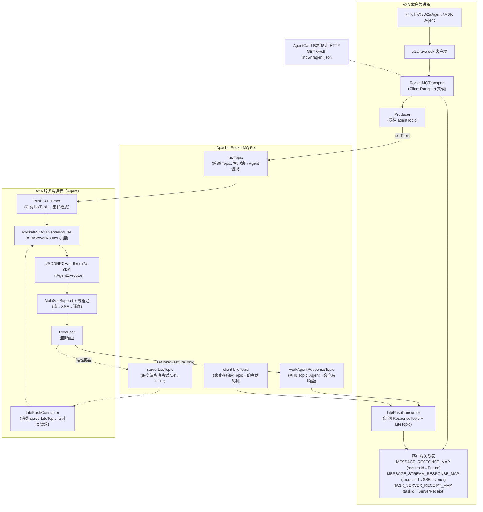
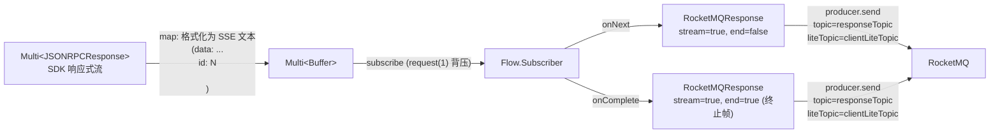
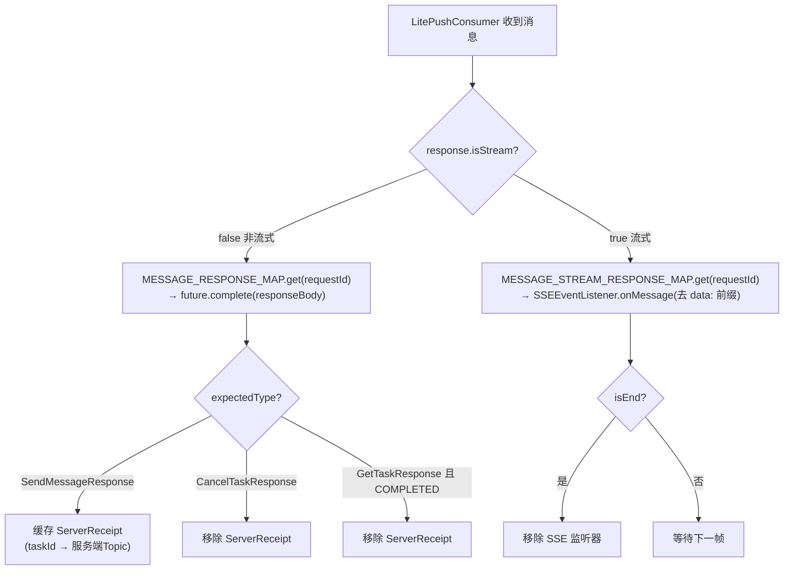
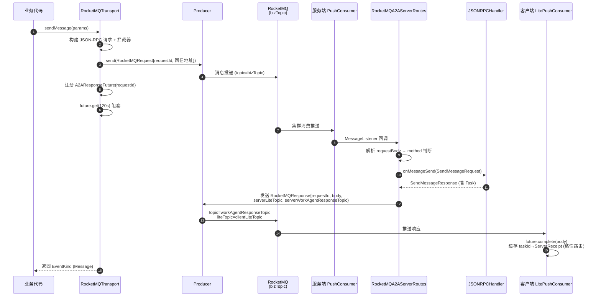
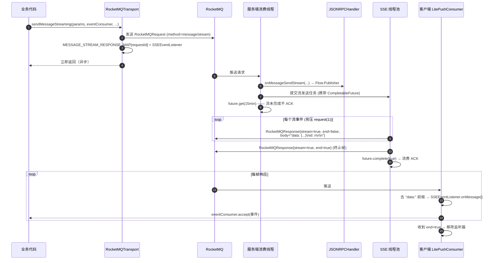
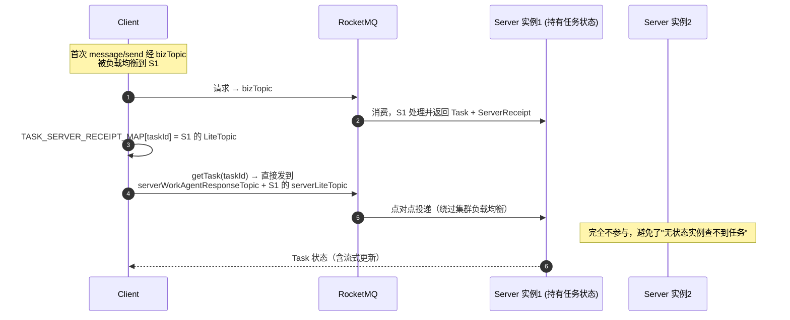
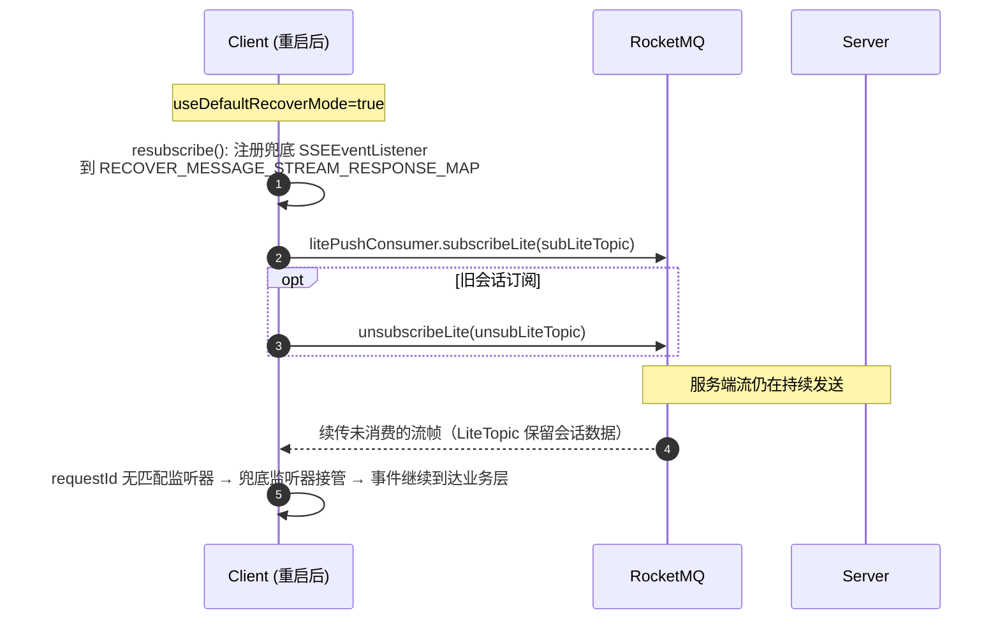
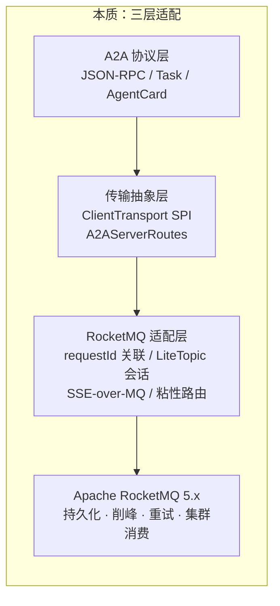

# RocketMQ-A2A 深度解析

> 基于 Apache RocketMQ 的 A2A（Agent-to-Agent）协议传输层实现 —— 源码级架构分析文档
>
> 分析对象：`rocketmq-a2a` v1.0.10-SNAPSHOT（JDK 17，a2a-java-sdk 0.3.3.Final，rocketmq-client-java 5.2.0）

---

## 目录

1. [它是什么 / 用来做什么](#1-它是什么--用来做什么)
2. [功能特性](#2-功能特性)
3. [整体架构](#3-整体架构)
4. [核心概念与数据模型](#4-核心概念与数据模型)
5. [实现原理深度分析](#5-实现原理深度分析)
6. [关键流程：时序图](#6-关键流程时序图)
7. [使用示例](#7-使用示例)
8. [设计权衡与总结](#8-设计权衡与总结)

---

## 1. 它是什么 / 用来做什么

**RocketMQ-A2A** 是 [A2A 协议](https://github.com/a2aproject/a2a-java)（Agent-to-Agent Protocol）的一个**消息队列传输层（Transport）实现**。A2A 协议标准定义了 Agent 之间互操作的 JSON-RPC 语义（发消息、查任务、取消任务、推送通知配置等），官方参考实现基于 **HTTP + SSE**。而本项目把这条通信链路整体搬到了 **Apache RocketMQ** 之上：

- **客户端**：实现 a2a-java-sdk 的 `ClientTransport` SPI（`RocketMQTransport`），使任何基于 a2a-java-sdk 的客户端可以"无感"地通过 RocketMQ 而非 HTTP 调用远程 Agent；
- **服务端**：扩展 a2a-java-sdk 的 `A2AServerRoutes`（`RocketMQA2AServerRoutes`），让 Agent 通过订阅 RocketMQ Topic 接收请求、通过 RocketMQ 回传响应（含流式）。

一句话概括：**它把 Agent 间通信从同步 RPC 变成异步消息，利用 RocketMQ 的持久化、削峰、重试能力构建高可用、可弹性扩展的分布式 Agent 网络。**

### 解决什么问题

| HTTP/SSE 传输的痛点 | RocketMQ 传输的收益 |
|---|---|
| 同步阻塞，发送方等待响应 | 异步解耦，提高吞吐与响应性 |
| 网络抖动即失败，需自己实现重试 | 消息持久化 + 可配置重试，保证最终送达 |
| 高并发下下游 Agent 易被打垮 | 消息队列天然削峰填谷，支持弹性扩缩容 |
| 连接断裂则 SSE 流丢失 | LiteTopic 会话机制 + 恢复模式支持流重建 |

### 仓库结构

```
rocketmq-a2a/
├── rocketmq-a2a/                  # 核心 Java 模块（本文重点）
│   ├── src/main/java/org/apache/rocketmq/a2a/
│   │   ├── transport/impl/RocketMQTransport.java          # 客户端传输实现
│   │   ├── transport/config/RocketMQTransportConfig.java  # 客户端配置
│   │   ├── transport/provider/RocketMQTransportProvider.java  # SPI 提供者
│   │   ├── server/RocketMQA2AServerRoutes.java            # 服务端路由器
│   │   └── common/
│   │       ├── model/    # RocketMQRequest / RocketMQResponse / RocketMQResource / ServerReceipt
│   │       ├── util/     # RocketMQUtil（核心工具类）、RequestIdGenerator
│   │       ├── future/   # A2AResponseFuture
│   │       └── constant/ # RocketMQA2AConstant
│   └── example/          # ADK / AgentScope / LangGraph 多 Agent 示例
└── mcp-tasks-rocketmq/   # Python MCP Tasks 扩展（LiteTopic 后端）
```

---

## 2. 功能特性

1. **完整覆盖 A2A 协议方法**：`message/send`、`message/stream`、`tasks/get`、`tasks/cancel`、`tasks/pushNotificationConfig` 增删查列、`agent/authenticatedExtendedCard`、`tasks/resubscribe`。
2. **非流式请求-响应**：通过 `requestId` 关联 + `CompletableFuture` 阻塞等待（默认 120 秒超时）。
3. **流式（SSE over RocketMQ）**：服务端把响应式流 `Multi<JSONRPCResponse>` 逐条编码成 SSE 文本格式（`data: ...\nid: N\n\n`）作为 RocketMQ 消息发送，客户端用 `SSEEventListener` 还原成事件流。
4. **会话粘性（Sticky Routing）**：首次交互后客户端缓存服务端回执（`ServerReceipt`：服务端的 LiteTopic + ResponseTopic），后续对同一 `taskId` 的请求（查询/取消）**点对点直达原服务实例**，保证有状态任务的状态一致性。
5. **流恢复模式（Recover Mode）**：客户端重启后可通过 `resubscribe` 重新订阅 LiteTopic、注册兜底 SSE 监听器，继续接收未完成的流。
6. **拦截器链**：复用 SDK 的 `ClientCallInterceptor` SPI，可在发送前改写 payload/headers（如注入鉴权）。
7. **多租户隔离**：所有关联表按 `namespace` 维度隔离。
8. **资源复用**：Producer 按 `(namespace, topic)` 缓存，LitePushConsumer 按 `(namespace, group)` 缓存。

---

## 3. 整体架构

### 3.1 架构图



### 3.2 角色与职责

| 组件 | 所在端 | 职责 |
|---|---|---|
| `RocketMQTransportProvider` | 客户端 | SPI 提供者，协议名 `RocketMQ`，创建 Transport 实例 |
| `RocketMQTransport` | 客户端 | 实现 `ClientTransport` 全部 9 个方法；构建 `RocketMQRequest`、发送、等待/接收响应 |
| `RocketMQA2AServerRoutes` | 服务端 | `@Startup @Singleton`，Quarkus CDI 托管；构建双消费者 + 生产者；解析 JSON-RPC 并分发给 `JSONRPCHandler` |
| `RocketMQUtil` | 双端共用 | 生产者/消费者构建与缓存、请求发送、响应解析、关联表维护 |
| `MultiSseSupport` | 服务端 | 内部类，把 `Multi<Object>` 转成 SSE 格式再逐条发 RocketMQ |

### 3.3 关键设计：Topic 拓扑

```
请求链路:  Client ──(msg: topic=bizTopic, 无LiteTopic)──▶ RocketMQ ──▶ 服务端 PushConsumer (集群负载均衡)

响应链路:  Server ──(msg: topic=workAgentResponseTopic, liteTopic=clientLiteTopic)──▶ RocketMQ ──▶ 客户端 LitePushConsumer

粘性链路:  Client ──(msg: topic=serverWorkAgentResponseTopic, liteTopic=serverLiteTopic)──▶ 服务端 LitePushConsumer (点对点)
```

- **普通 Topic**：`bizTopic` 承载发往 Agent 的请求，PushConsumer 集群消费实现负载均衡；`workAgentResponseTopic` 承载响应。
- **LiteTopic**：RocketMQ 5.x 轻量主题，类似 SessionId，动态创建、绑定在普通 Topic 上用于数据隔离路由。客户端默认生成一个 UUID LiteTopic；服务端也生成私有 `serverLiteTopic` 专收点对点请求。

---

## 4. 核心概念与数据模型

### 4.1 消息信封（源码 `common/model`）

**`RocketMQRequest`**（客户端→服务端消息体，fastjson 序列化）：

| 字段 | 说明 |
|---|---|
| `requestId` | 请求唯一 ID（`RequestIdGenerator` 生成），**全链路关联的钥匙** |
| `requestBody` | 序列化后的 JSON-RPC 请求（字符串） |
| `requestHeader` | 透传的 HTTP 头（鉴权等） |
| `destAgentTopic` | 目标 Agent Topic |
| `workAgentResponseTopic` | 客户端监听的响应 Topic（告诉服务端往哪回） |
| `liteTopic` | 客户端会话 LiteTopic（告诉服务端路由到哪个会话队列） |

**`RocketMQResponse`**（服务端→客户端消息体）：

| 字段 | 说明 |
|---|---|
| `requestId` | 回传原请求 ID |
| `responseBody` | 响应内容（非流式=完整 JSON-RPC 响应；流式=SSE 格式的一帧） |
| `isStream` | 是否流式分片 |
| `isEnd` | 流是否结束（结束帧只带 `requestId` + `end=true`） |
| `serverWorkAgentResponseTopic` / `serverLiteTopic` | **服务端回执**，客户端据此实现粘性路由 |

**`ServerReceipt`**：`taskId → (serverWorkAgentResponseTopic, serverLiteTopic)` 的缓存条目。

**`RocketMQResource`**：嵌入 AgentCard 的 RocketMQ 资源描述（`namespace / endpoint / topic`），客户端通过 `parseAgentCardAddition()` 从 AgentCard 解析，据此得知目标 Agent 的接入点。

### 4.2 客户端关联表（`RocketMQUtil` 静态表，全部按 namespace 隔离）

```
MESSAGE_RESPONSE_MAP          : namespace → { requestId → A2AResponseFuture(CompletableFuture + TypeReference) }   // 非流式
MESSAGE_STREAM_RESPONSE_MAP   : namespace → { requestId → SSEEventListener }                                      // 流式
RECOVER_MESSAGE_STREAM_RESPONSE_MAP : namespace → { "default" → SSEEventListener }                                // 恢复模式兜底
TASK_SERVER_RECEIPT_MAP       : taskId → ServerReceipt                                                            // 粘性路由
LITE_TOPIC_USE_DEFAULT_RECOVER_MAP  : namespace → { liteTopic → boolean }                                         // 恢复模式开关
```

---

## 5. 实现原理深度分析

### 5.1 客户端：一次 `sendMessage` 的实现（RocketMQTransport.java:203）

```java
// 1. 构建标准 JSON-RPC 请求（与 HTTP 传输完全同构）
SendMessageRequest req = new SendMessageRequest.Builder()
    .jsonrpc("2.0").method("message/send").params(request).build();
// 2. 应用拦截器链（可注入 headers）
PayloadAndHeaders ph = applyInterceptors(...);
// 3. 发送到 agentTopic，并拿到 requestId
String requestId = sendRocketMQRequest(ph, agentTopic,
        resolveAndSubscribeLiteTopic(contextId),   // 有 contextId 则按会话订阅 LiteTopic
        workAgentResponseTopic, producer, null);
// 4. 注册 Future 并阻塞等待（120s 超时）
SendMessageResponse resp = unmarshalResponse(
        getResult(requestId, namespace, SEND_MESSAGE_RESPONSE_REFERENCE), ...);
```

`getResult`（RocketMQUtil）是"异步消息"转"同步调用"的桥梁：

```java
CompletableFuture<String> future = new CompletableFuture<>();
msgIdAndAsyncTypedMap.put(responseMessageId, new A2AResponseFuture(future, typeReference));
String result = future.get(120, TimeUnit.SECONDS);   // 由消费者回调线程 complete()
```

### 5.2 粘性路由：任务级会话保持（RocketMQUtil.sendRocketMQRequest）

服务端每次响应都携带自己的 `serverLiteTopic`。客户端收到 `message/send` 响应后，将 `(taskId → ServerReceipt)` 写入 `TASK_SERVER_RECEIPT_MAP`。之后针对该 task 的 `getTask / cancelTask / pushNotificationConfig` 等请求不再广播到 `bizTopic`（否则会被负载均衡到**另一台**无状态的服务实例），而是直接发到**原服务实例的私有 LiteTopic**：

```java
if (StringUtils.isNotEmpty(taskId) && TASK_SERVER_RECEIPT_MAP.containsKey(taskId)) {
    ServerReceipt receipt = TASK_SERVER_RECEIPT_MAP.get(taskId);
    message = PROVIDER.newMessageBuilder()
        .setTopic(receipt.getServerWorkAgentResponseTopic())   // 点对点直达原实例
        .setLiteTopic(receipt.getServerLiteTopic())
        .setBody(body).build();
} else {
    message = PROVIDER.newMessageBuilder().setTopic(agentTopic).setBody(body).build(); // 普通广播
}
```

回执的生命周期管理：`cancelTask` 响应 → 移除缓存；`getTask` 发现 `COMPLETED` → 移除缓存。

### 5.3 服务端：消息监听与分发（RocketMQA2AServerRoutes.java:212）

服务端注册两条消费通道，共用同一个 `MessageListener`：

```java
messageView -> {
    RocketMQRequest request = JSON.parseObject(body, RocketMQRequest.class);
    JsonNode node = OBJECT_MAPPER.readTree(request.getRequestBody());
    String method = node.get("method").asText();
    boolean streaming = "message/stream".equals(method) || "tasks/resubscribe".equals(method);

    if (streaming) {
        streamingResponse = processStreamingRequest(
            OBJECT_MAPPER.treeToValue(node, StreamingJSONRPCRequest.class), null);
        completableFuture = new CompletableFuture<>();   // 挂起消费确认，直到流发完
    } else {
        nonStreamingResponse = processNonStreamingRequest(
            OBJECT_MAPPER.treeToValue(node, NonStreamingJSONRPCRequest.class), null);
    }
    processResponse(request, error, streaming, ..., completableFuture);
    return processCompletableFuture(completableFuture);  // 流式: 阻塞至多15分钟
};
```

三个精妙之处：

1. **类型判断先于反序列化**：先用 `readTree` 读出 `method` 字段决定走流式（`StreamingJSONRPCRequest`）还是非流式（`NonStreamingJSONRPCRequest`），避免一次错误的强类型反序列化。
2. **消费确认与流生命周期绑定**：流式请求的 `CompletableFuture` 会阻塞 listener 线程 `completableFuture.get(15, MINUTES)` —— SSE 流全部发完（`onComplete` → `complete(true)`）才返回 `ConsumeResult.SUCCESS`，**消息未处理完就不 ACK**，RocketMQ 会重投，实现 at-least-once。
3. **错误映射**：`JsonProcessingException` 被细粒度映射为 JSON-RPC 标准错误（`JSONParseError` / `MethodNotFoundError` / `InvalidParamsError` / `InvalidRequestError`）。

### 5.4 流式响应：SSE over RocketMQ（MultiSseSupport）

服务端把 SDK 返回的响应式流（`Multi<JSONRPCResponse>`，底层是 `Flow.Publisher`）手动实现 `Flow.Subscriber`，**逐帧背压拉取**（`request(1)` 模式）：



客户端侧 `processStreamResult` 收到每帧后：按 `requestId` 找到 `SSEEventListener` → 剥掉 `data:` 前缀 → `sseEventListener.onMessage(item, ...)` 还原事件流；收到 `isEnd=true` 时移除监听器。若找不到监听器且该 LiteTopic 开启了恢复模式，则交给 `RECOVER_MESSAGE_STREAM_RESPONSE_MAP` 中的兜底监听器 —— 这就是**断线重连后继续收流**的机制。

### 5.5 消费者回调侧的响应分发（RocketMQUtil.buildA2AClientMessageListener)



### 5.6 AgentCard：发现机制

AgentCard 仍通过 **HTTP** 获取（`GET {agentUrl}/.well-known/agent.json`，用 SDK 的 `A2ACardResolver`）。Card 中通过 `RocketMQResource` 扩展字段携带 `namespace/endpoint/topic`，`RocketMQTransport` 构造函数解析并校验（namespace 不匹配直接抛异常）。这种"**控制面走 HTTP、数据面走 RocketMQ**"的混合设计避免了在消息队列上再造服务发现。

### 5.7 线程与并发模型

| 端 | 机制 |
|---|---|
| 客户端调用线程 | 非流式：`CompletableFuture.get(120s)` 阻塞；流式：注册监听器后立即返回（全异步） |
| 客户端消费线程 | RocketMQ LitePushConsumer 回调线程完成 future / 推送 SSE 事件 |
| 服务端消费线程 | PushConsumer 回调线程做 JSON-RPC 分发（非流式同步处理） |
| 服务端流线程 | 专用线程池 `rocketmq-a2a-sse-pool-*`（core=max=6，队列 100_000，CallerRunsPolicy）发送 SSE 帧 |
| 并发安全 | 所有关联表为 `ConcurrentHashMap`，Producer/Consumer 按 key `computeIfAbsent` 缓存复用 |

---

## 6. 关键流程：时序图

### 6.1 非流式请求（message/send + 粘性路由建立）



### 6.2 流式请求（message/stream，SSE over RocketMQ）



### 6.3 粘性路由（getTask 直达原服务实例）



### 6.4 流恢复（resubscribe）



---

## 7. 使用示例

### 7.1 服务端（Agent）配置

服务端零代码接入，只需注入 `RocketMQA2AServerRoutes`（Quarkus CDI 自动装配 `JSONRPCHandler` → 你的 `AgentExecutor`），通过系统属性配置：

```bash
java -DrocketMQEndpoint="localhost:8081" \
     -DrocketMQNamespace="" \
     -DbizTopic="my-agent-topic" \
     -DbizConsumerGroup="my-agent-group" \
     -DworkAgentResponseTopic="agent-response-topic" \
     -DworkAgentResponseGroupID="agent-response-group" \
     -DrocketMQAK="ak" -DrocketMQSK="sk" \
     -jar agent-server.jar
```

AgentCard 中需声明 RocketMQ 扩展信息（`RocketMQResource`: namespace/endpoint/topic），客户端据此建连。

### 7.2 客户端（AgentScope 示例，example/java/rocketmq-multiagent-base-agentscope）

```java
// 1. 配置 RocketMQ 传输
RocketMQTransportConfig config = new RocketMQTransportConfig();
config.setAccessKey(ACCESS_KEY);
config.setSecretKey(SECRET_KEY);
config.setWorkAgentResponseTopic(WORK_AGENT_RESPONSE_TOPIC);      // 接收响应的 Topic
config.setWorkAgentResponseGroupID(WORK_AGENT_RESPONSE_GROUP_ID);
config.setNamespace(ROCKETMQ_NAMESPACE);
config.setHttpClient(new JdkA2AHttpClient());                      // 用于解析 AgentCard

// 2. 以 RocketMQ 传输构建 A2A Agent
A2aAgentConfig agentConfig = new A2aAgentConfigBuilder()
        .withTransport(RocketMQTransport.class, config)            // 关键：替换默认 HTTP 传输
        .build();

A2aAgent agent = A2aAgent.builder()
        .a2aAgentConfig(agentConfig)
        .name("my-client-agent")
        .agentCardResolver(WellKnownAgentCardResolver.builder()    // AgentCard 仍走 HTTP 发现
                .baseUrl("http://localhost:10001").build())
        .build();

// 3. 流式对话
Flux<String> stream = agent.stream(
        Msg.builder().role(MsgRole.USER)
            .content(TextBlock.builder().text("你好").build()).build());
stream.doOnNext(System.out::print).then().block();
```

也可使用 Builder 风格：

```java
RocketMQTransportConfig config = RocketMQTransportConfig.builder()
        .accessKey("ak").secretKey("sk")
        .endpoint("localhost:8081")
        .workAgentResponseTopic("resp-topic")
        .workAgentResponseGroupID("resp-group")
        .liteTopic("my-session")          // 可选，缺省自动生成 UUID
        .useDefaultRecoverMode(true)      // 可选，启用流恢复
        .build();
```

### 7.3 仓库自带的完整示例

| 示例 | 说明 |
|---|---|
| `example/java/rocketmq-multiagent-base-adk` | 基于 Google ADK 的 Supervisor 多 Agent 架构（supervisor-agent + worker agents + Web 前端），含会话一致性演示 |
| `example/java/rocketmq-multiagent-base-agentscope` | AgentScope Java 框架客户端 + 服务端，命令行流式聊天 |
| `example/java/rocketmq-multiagent-session-consistency` | 演示粘性路由保证任务状态一致性 |
| `example/python/rocketmq-multiagent-base-langgraph` | Python LangGraph Agent 通过 RocketMQ 接入 A2A 网络 |
| `mcp-tasks-rocketmq/`（Python） | SEP-2663 规范的 MCP Tasks 扩展，以 RocketMQ LiteTopic 为后端实现任务管理（client/server/worker/dispatcher） |

构建：`mvn -B package --file rocketmq-a2a/pom.xml`

---

## 8. 设计权衡与总结

### 8.1 设计亮点

1. **SPI 无缝嵌入**：完全遵循 `ClientTransport` / `A2AServerRoutes` 抽象，上层 SDK（AgentScope、ADK）一行配置切换传输，协议语义（JSON-RPC、SSE 帧）原样保留在消息体中。
2. **requestId 关联表**替代 RPC 连接：用"发送注册 Future / 消费回调 complete Future"的经典模式把 MQ 异步语义适配成 SDK 期望的同步/流式调用。
3. **LiteTopic 做会话**：把"连接"的概念映射为"轻量主题"——客户端 LiteTopic 路由响应到会话，服务端 LiteTopic 实现点对点粘性，避免了在无状态集群中维护任务状态的分布式难题。
4. **流完整性 = 消费不 ACK**：服务端把流发送的完成信号绑定到 RocketMQ 消费确认（15 分钟上限），借助 MQ 重投机制获得 at-least-once 的流传输保障。
5. **控制面/数据面分离**：AgentCard 发现走 HTTP（保留 A2A 标准兼容性），业务消息走 RocketMQ（获得异步可靠性）。

### 8.2 需要注意的局限

- 非流式请求默认 **120 秒**阻塞超时、服务端流式最长 **15 分钟**占用消费线程，长任务需评估线程资源；
- 关联表为**进程内静态 Map**，客户端多实例部署时响应可能被无 pending Future 的实例消费掉（依赖 LiteTopic 点对点路由缓解）；
- fastjson 序列化信封 + Jackson 处理 JSON-RPC，存在两套 JSON 栈；
- SSE 帧格式（`data:` 前缀）在消息体层面重新实现了一遍 SSE 协议，属于对 SDK 内部 `SSEEventListener` 的适配。

### 8.3 一图总结



> 注：本仓库已迁移至 [apache/rocketmq-ai](https://github.com/apache/rocketmq-ai) 统一维护，本文基于迁移前的 rocketmq-a2a 模块源码分析。
