# Seata 2.6.0 源码深度解析

> 本文基于 Seata 2.6.0 源码（Apache 顶级项目，包名 `org.apache.seata`）深入分析其底层实现原理、整体架构、工作流程，以及 AT、TCC、XA、SAGA 四种事务模式，Server 启动流程、通信架构、NamingServer、配置管理、事务分组、高可用设计、框架整合、可观测性等。所有架构图、时序图、流程图均以 Mermaid 呈现。

---

## 目录

- [一、Seata 概述](#一seata-概述)
- [二、整体架构](#二整体架构)
- [三、核心角色与模块划分](#三核心角色与模块划分)
- [四、全局事务工作流程](#四全局事务工作流程)
- [五、AT 模式实现原理](#五at-模式实现原理)
- [六、TCC 模式实现原理](#六tcc-模式实现原理)
- [七、XA 模式实现原理](#七xa-模式实现原理)
- [八、SAGA 模式实现原理](#八saga-模式实现原理)
- [九、Server 启动流程](#九server-启动流程)
- [十、通信架构](#十通信架构)
- [十一、NamingServer 命名服务](#十一namingserver-命名服务)
- [十二、配置管理](#十二配置管理)
- [十三、事务分组实现原理](#十三事务分组实现原理)
- [十四、高可用设计](#十四高可用设计)
- [十五、框架整合](#十五框架整合)
- [十六、可观测性设计](#十六可观测性设计)
- [十七、其他底层实现设计](#十七其他底层实现设计)
- [十八、总结与对比](#十八总结与对比)

---

## 一、Seata 概述

Seata（Simple Extensible Autonomous Transaction Architecture）是阿里巴巴开源、后捐赠给 Apache 软件基金会的分布式事务解决方案，致力于提供高性能且简单易用的分布式事务服务。它通过中间件的方式，让业务方以**本地事务**的编程模型即可获得分布式事务能力。

### 1.1 核心能力

| 能力 | 说明 |
|------|------|
| 多种事务模式 | AT（自动补偿）、TCC（Try-Confirm-Cancel）、XA、SAGA（状态机） |
| 高性能 | 一阶段即提交本地事务并释放资源，二阶段异步提交/补偿 |
| 无侵入 | AT 模式通过数据源代理，业务零侵入 |
| 高可用 | TC 支持集群部署，存储支持 file/db/redis/raft，配合 NamingServer 实现服务发现 |
| 多框架整合 | SpringBoot、SpringCloud、Dubbo、Sofa-RPC、Motan、gRPC 等 |
| 可观测性 | 内置 metrics（Prometheus）、MDC 日志链路、控制台 Console |

### 1.2 版本与包名

Seata 自 2.x 起包名由 `io.seata` 迁移至 `org.apache.seata`（Apache 项目规范）。源码同时保留 `compatible` 模块，提供 `io.seata.*` 的兼容类，保证老版本平滑升级。

---

## 二、整体架构

Seata 的架构遵循 **DTP（Distributed Transaction Processing）模型**，核心是三角色协调：TM、RM、TC。

### 2.1 架构总览

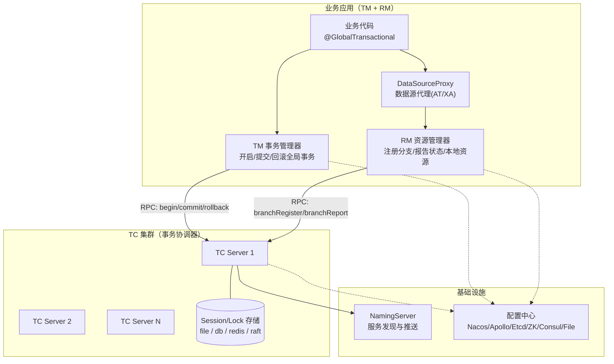
```mermaid
graph TB
    subgraph 业务应用["业务应用（TM + RM）"]
        TM["TM 事务管理器<br/>开启/提交/回滚全局事务"]
        RM["RM 资源管理器<br/>注册分支/报告状态/本地资源"]
        Business["业务代码<br/>@GlobalTransactional"]
        DSProxy["DataSourceProxy<br/>数据源代理(AT/XA)"]
    end

    subgraph TC集群["TC 集群（事务协调器）"]
        TC1["TC Server 1"]
        TC2["TC Server 2"]
        TC3["TC Server N"]
        Store[("Session/Lock 存储<br/>file / db / redis / raft")]
    end

    subgraph 基础设施
        NS["NamingServer<br/>服务发现与推送"]
        Config["配置中心<br/>Nacos/Apollo/Etcd/ZK/Consul/File"]
    end

    Business --> TM
    Business --> DSProxy
    DSProxy --> RM
    TM -->|"RPC: begin/commit/rollback"| TC1
    RM -->|"RPC: branchRegister/branchReport"| TC1
    TC1 --- Store
    TC1 --> NS
    TM -.-> Config
    RM -.-> Config
    TC1 -.-> Config
```

### 2.2 三大角色

| 角色 | 全称 | 职责 | 源码模块 | 核心类 |
|------|------|------|----------|--------|
| **TC** | Transaction Coordinator | 维护全局/分支事务状态，驱动二阶段提交/回滚，管理全局锁 | `server` | `DefaultCoordinator`、`DefaultCore` |
| **TM** | Transaction Manager | 定义全局事务边界，开启/提交/回滚全局事务 | `tm` | `DefaultGlobalTransaction`、`DefaultTransactionManager` |
| **RM** | Resource Manager | 管理本地资源，注册分支事务，执行分支提交/回滚 | `rm`、`rm-datasource`、`tcc` | `DefaultResourceManager`、`DataSourceProxy` |

### 2.3 核心概念

- **全局事务（Global Transaction）**：跨多个微服务/数据库的分布式事务，由 XID 唯一标识。
- **分支事务（Branch Transaction）**：全局事务中的一个本地事务分支，由 branchId 标识。
- **XID**：全局事务 ID，格式为 `ip:port:transactionId`，由 TC 生成（`XID.generateXID(tranId)`，位于 `common/src/main/java/org/apache/seata/common/XID.java`）。
- **全局锁（Global Lock）**：TC 维护的行级锁，保证 AT 模式下写隔离。

---

## 三、核心角色与模块划分

### 3.1 模块划分

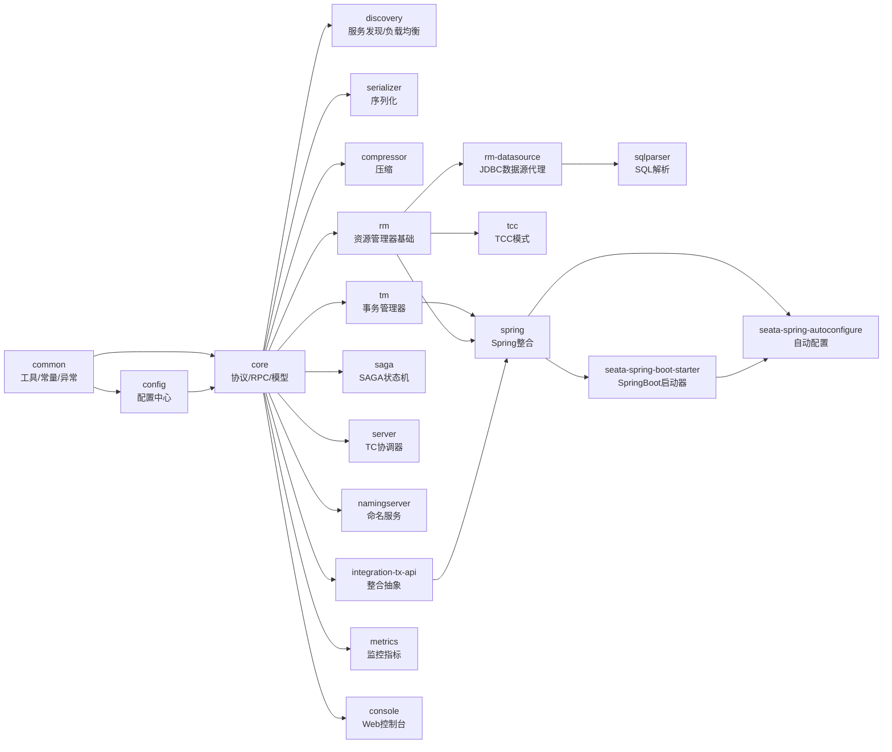
```mermaid
graph LR
    common[common<br/>工具/常量/异常]
    config[config<br/>配置中心]
    core[core<br/>协议/RPC/模型]
    discovery[discovery<br/>服务发现/负载均衡]
    serializer[serializer<br/>序列化]
    compressor[compressor<br/>压缩]
    sqlparser[sqlparser<br/>SQL解析]
    tm[tm<br/>事务管理器]
    rm[rm<br/>资源管理器基础]
    rmDs[rm-datasource<br/>JDBC数据源代理]
    tcc[tcc<br/>TCC模式]
    saga[saga<br/>SAGA状态机]
    server[server<br/>TC协调器]
    namingserver[namingserver<br/>命名服务]
    spring[spring<br/>Spring整合]
    starter[seata-spring-boot-starter<br/>SpringBoot启动器]
    autoconf[seata-spring-autoconfigure<br/>自动配置]
    integration[integration-tx-api<br/>整合抽象]
    metrics[metrics<br/>监控指标]
    console[console<br/>Web控制台]

    common --> config
    common --> core
    config --> core
    core --> tm
    core --> rm
    rm --> rmDs
    rm --> tcc
    core --> saga
    core --> server
    core --> namingserver
    tm --> spring
    rm --> spring
    spring --> starter
    spring --> autoconf
    starter --> autoconf
    core --> integration
    integration --> spring
    core --> metrics
    core --> console
    core --> serializer
    core --> compressor
    rmDs --> sqlparser
    core --> discovery
```

### 3.2 模块职责表

| 模块 | 职责 | 关键类 |
|------|------|--------|
| `common` | 通用工具、常量、异常、SPI 加载器 | `EnhancedServiceLoader`、`XID`、`ConfigurationKeys` |
| `core` | 协议、RPC、序列化/压缩接口、事务模型 | `RootContext`、`AbstractNettyRemoting`、`ProtocolDecoderV1` |
| `config` | 配置中心抽象与多实现 | `Configuration`、`ConfigurationFactory`、`ConfigurationCache` |
| `discovery` | 注册中心与负载均衡 | `RegistryService`、`RegistryFactory`、`LoadBalance` |
| `serializer` | 多种序列化实现 | `Serializer`（SEATA/PROTOBUF/KRYO/HESSIAN/FASTJSON2/FORY） |
| `compressor` | 多种压缩实现 | `Compressor`（gzip/bzip2/zip/lz4/zstd/deflater） |
| `sqlparser` | SQL 解析（ANTLR） | `AntlrMySQLUpdateRecognizer`、`SQLRecognizerFactory` |
| `tm` | TM 客户端 | `DefaultGlobalTransaction`、`DefaultTransactionManager`、`TMClient` |
| `rm` | RM 基础 | `DefaultResourceManager`、`RMClient`、`AbstractRMHandler` |
| `rm-datasource` | JDBC 代理（AT/XA） | `DataSourceProxy`、`ConnectionProxy`、`UndoLogManager` |
| `tcc` | TCC 模式 | `TCCResource`、`TCCResourceManager`、`TccActionInterceptorHandler` |
| `saga` | SAGA 状态机 | `ProcessCtrlStateMachineEngine`、`ServiceTaskStateHandler` |
| `server` | TC 协调器 | `DefaultCoordinator`、`DefaultCore`、`GlobalSession` |
| `namingserver` | 命名服务 | `NamingController`、`NamingManager`、`ClusterWatcherManager` |
| `spring` | Spring 整合 | `GlobalTransactionScanner`、`SeataAutoDataSourceProxyCreator` |
| `seata-spring-boot-starter` | SpringBoot 启动器 | `SeataAutoConfiguration` |
| `seata-spring-autoconfigure` | 自动配置 | `SeataCoreAutoConfiguration`、各 Properties |
| `integration-tx-api` | 整合抽象层 | `ActionInterceptorHandler`、`FenceHandler`、`ProxyInvocationHandler` |
| `metrics` | 监控指标 | `Registry`、`Counter`、`PrometheusExporter` |
| `console` | Web 控制台 | `OverviewController`、`JwtTokenUtils` |

---

## 四、全局事务工作流程

### 4.1 全局事务生命周期

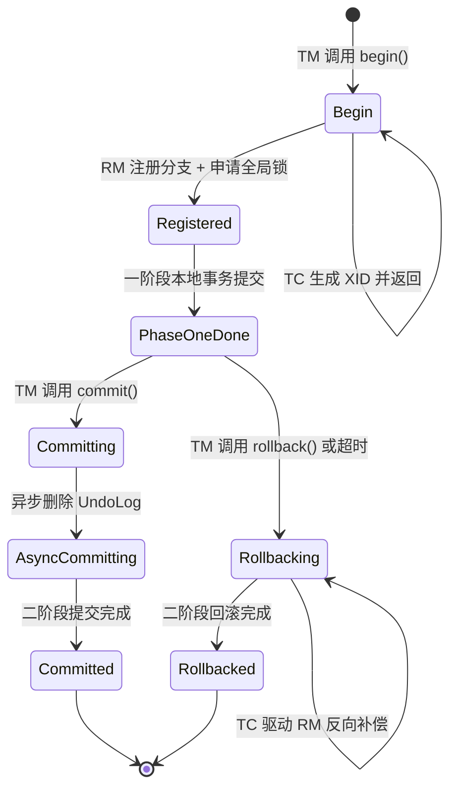
```mermaid
stateDiagram-v2
    [*] --> Begin: TM 调用 begin()
    Begin --> Begin: TC 生成 XID 并返回
    Begin --> Registered: RM 注册分支 + 申请全局锁
    Registered --> PhaseOneDone: 一阶段本地事务提交
    PhaseOneDone --> Committing: TM 调用 commit()
    PhaseOneDone --> Rollbacking: TM 调用 rollback() 或超时
    Committing --> AsyncCommitting: 异步删除 UndoLog
    AsyncCommitting --> Committed: 二阶段提交完成
    Rollbacking --> Rollbacking: TC 驱动 RM 反向补偿
    Rollbacking --> Rollbacked: 二阶段回滚完成
    Committed --> [*]
    Rollbacked --> [*]
```

### 4.2 完整时序图

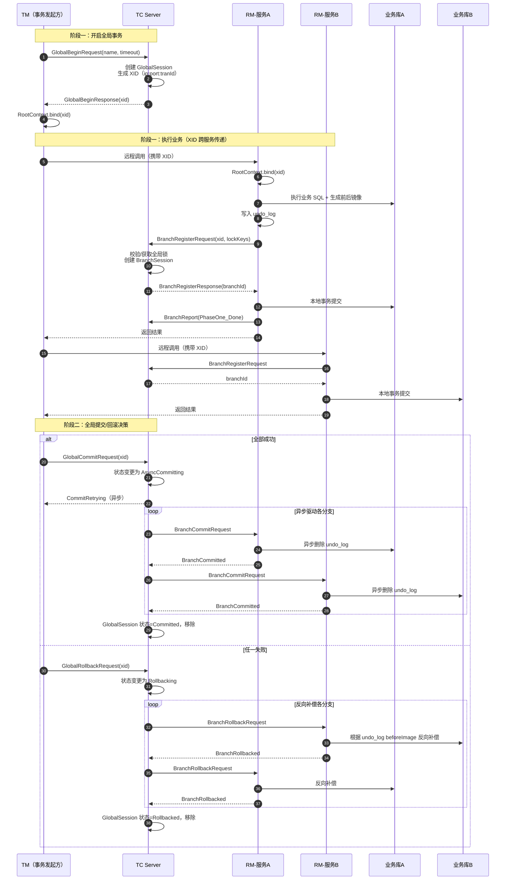
```mermaid
sequenceDiagram
    autonumber
    participant TM as TM（事务发起方）
    participant TC as TC Server
    participant RM1 as RM-服务A
    participant RM2 as RM-服务B
    participant DB1 as 业务库A
    participant DB2 as 业务库B

    Note over TM,TC: 阶段一：开启全局事务
    TM->>TC: GlobalBeginRequest(name, timeout)
    TC->>TC: 创建 GlobalSession<br/>生成 XID（ip:port:tranId）
    TC-->>TM: GlobalBeginResponse(xid)
    TM->>TM: RootContext.bind(xid)

    Note over TM,RM2: 阶段一：执行业务（XID 跨服务传递）
    TM->>RM1: 远程调用（携带 XID）
    RM1->>RM1: RootContext.bind(xid)
    RM1->>DB1: 执行业务 SQL + 生成前后镜像
    RM1->>RM1: 写入 undo_log
    RM1->>TC: BranchRegisterRequest(xid, lockKeys)
    TC->>TC: 校验/获取全局锁<br/>创建 BranchSession
    TC-->>RM1: BranchRegisterResponse(branchId)
    RM1->>DB1: 本地事务提交
    RM1->>TC: BranchReport(PhaseOne_Done)
    RM1-->>TM: 返回结果

    TM->>RM2: 远程调用（携带 XID）
    RM2->>TC: BranchRegisterRequest
    TC-->>RM2: branchId
    RM2->>DB2: 本地事务提交
    RM2-->>TM: 返回结果

    Note over TM,TC: 阶段二：全局提交/回滚决策
    alt 全部成功
        TM->>TC: GlobalCommitRequest(xid)
        TC->>TC: 状态变更为 AsyncCommitting
        TC-->>TM: CommitRetrying（异步）
        loop 异步驱动各分支
            TC->>RM1: BranchCommitRequest
            RM1->>DB1: 异步删除 undo_log
            RM1-->>TC: BranchCommitted
            TC->>RM2: BranchCommitRequest
            RM2->>DB2: 异步删除 undo_log
            RM2-->>TC: BranchCommitted
        end
        TC->>TC: GlobalSession 状态=Committed，移除
    else 任一失败
        TM->>TC: GlobalRollbackRequest(xid)
        TC->>TC: 状态变更为 Rollbacking
        loop 反向补偿各分支
            TC->>RM2: BranchRollbackRequest
            RM2->>DB2: 根据 undo_log beforeImage 反向补偿
            RM2-->>TC: BranchRollbacked
            TC->>RM1: BranchRollbackRequest
            RM1->>DB1: 反向补偿
            RM1-->>TC: BranchRollbacked
        end
        TC->>TC: GlobalSession 状态=Rollbacked，移除
    end
```

### 4.3 TM 核心实现

`DefaultGlobalTransaction`（`tm/src/main/java/org/apache/seata/tm/api/DefaultGlobalTransaction.java`）是 `GlobalTransaction` 接口的默认实现，负责全局事务生命周期：

```java
// 开启全局事务（行 235）
@Override
public void begin(int timeout, String name) throws TransactionException {
    this.createTime = System.currentTimeMillis();
    // 参与者不发起事务，只加入已有事务
    if (role != GlobalTransactionRole.Launcher) {
        assertXIDNotNull();
        return;
    }
    assertXIDNull();
    // 向 TC 申请 XID
    xid = transactionManager.begin(null, null, name, timeout);
    status = GlobalStatus.Begin;
    // 绑定到当前线程上下文
    RootContext.bind(xid);
}

// 提交（行 300），含重试机制
@Override
public void commit() throws TransactionException {
    if (role == GlobalTransactionRole.Participant) { return; }
    int retry = COMMIT_RETRY_COUNT <= 0 ? DEFAULT_TM_COMMIT_RETRY_COUNT : COMMIT_RETRY_COUNT;
    try {
        while (retry > 0) {
            try {
                retry--;
                status = transactionManager.commit(xid);
                break;
            } catch (Throwable ex) {
                if (retry == 0) throw new TransactionException("Failed to report global commit", ex);
            }
        }
    } finally {
        if (xid.equals(RootContext.getXID())) { suspend(true); }  // 清理上下文
    }
}
```

### 4.4 TM 与 TC 通信

`DefaultTransactionManager`（`tm/src/main/java/org/apache/seata/tm/DefaultTransactionManager.java`）通过 Netty RPC 与 TC 通信：

```java
@Override
public String begin(String applicationId, String transactionServiceGroup, String name, int timeout)
        throws TransactionException {
    GlobalBeginRequest request = new GlobalBeginRequest();
    request.setTransactionName(name);
    request.setTimeout(timeout);
    GlobalBeginResponse response = (GlobalBeginResponse) syncCall(request);
    if (response.getResultCode() == ResultCode.Failed) {
        throw new TmTransactionException(TransactionExceptionCode.BeginFailed, response.getMsg());
    }
    return response.getXid();
}

private AbstractTransactionResponse syncCall(AbstractTransactionRequest request) throws TransactionException {
    return (AbstractTransactionResponse) TmNettyRemotingClient.getInstance().sendSyncRequest(request);
}
```

### 4.5 TC 协调器核心

`DefaultCoordinator`（`server/src/main/java/org/apache/seata/server/coordinator/DefaultCoordinator.java`）继承 `AbstractTCInboundHandler`，处理所有入站事务请求，并将核心逻辑委托给 `DefaultCore`：

```java
// 处理全局事务开启（行 321）
@Override
protected void doGlobalBegin(GlobalBeginRequest request, GlobalBeginResponse response, RpcContext rpcContext)
        throws TransactionException {
    response.setXid(core.begin(
            rpcContext.getApplicationId(),
            rpcContext.getTransactionServiceGroup(),
            request.getTransactionName(),
            request.getTimeout()));
}

// 处理分支注册（行 369）
@Override
protected void doBranchRegister(BranchRegisterRequest request, BranchRegisterResponse response, RpcContext rpcContext)
        throws TransactionException {
    response.setBranchId(core.branchRegister(
            request.getBranchType(), request.getResourceId(), rpcContext.getClientId(),
            request.getXid(), request.getApplicationData(), request.getLockKey()));
}
```

### 4.6 RM 资源管理器

`DefaultResourceManager`（`rm/src/main/java/org/apache/seata/rm/DefaultResourceManager.java`）持有一个 `Map<BranchType, ResourceManager>`，根据分支类型路由到不同的资源管理器（AT→`DataSourceManager`、TCC→`TCCResourceManager`、XA→`ResourceManagerXA`、SAGA→`SagaResourceManager`）。

---

## 五、AT 模式实现原理

AT（Automatic Transaction）是 Seata 最具特色的模式，**业务无侵入**，通过数据源代理 + undo_log 自动实现两阶段提交。

### 5.1 核心思想

- **一阶段**：拦截业务 SQL，解析得到表名/列/where 条件，在业务 SQL 执行前后查询并记录**前后镜像（beforeImage/afterImage）**，写入 `undo_log` 表；同时向 TC 注册分支并申请**全局锁**；最后**本地事务提交**（业务 SQL + undo_log 在同一本地事务），立即释放本地锁。
- **二阶段提交**：TC 异步通知 RM 提交，RM **异步删除 undo_log**（一阶段已提交，无需再做什么）。
- **二阶段回滚**：TC 通知 RM 回滚，RM 根据 undo_log 的 beforeImage **反向生成补偿 SQL** 回滚数据，然后删除 undo_log。

### 5.2 整体流程图

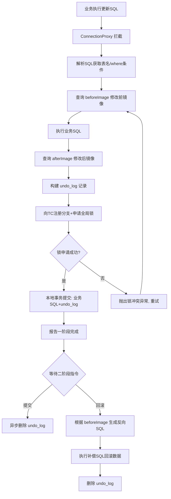
```mermaid
flowchart TD
    A[业务执行更新SQL] --> B[ConnectionProxy 拦截]
    B --> C[解析SQL获取表名/where条件]
    C --> D[查询 beforeImage 修改前镜像]
    D --> E[执行业务SQL]
    E --> F[查询 afterImage 修改后镜像]
    F --> G[构建 undo_log 记录]
    G --> H[向TC注册分支+申请全局锁]
    H --> I{锁申请成功?}
    I -->|是| J[本地事务提交: 业务SQL+undo_log]
    I -->|否| K[抛出锁冲突异常, 重试]
    K --> D
    J --> L[报告一阶段完成]
    L --> M{等待二阶段指令}

    M -->|提交| N[异步删除 undo_log]
    M -->|回滚| O[根据 beforeImage 生成反向SQL]
    O --> P[执行补偿SQL回滚数据]
    P --> Q[删除 undo_log]
```

### 5.3 数据源代理体系

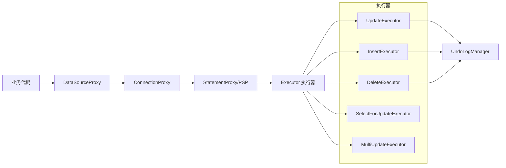
```mermaid
graph LR
    App[业务代码] --> DSP[DataSourceProxy]
    DSP --> CP[ConnectionProxy]
    CP --> SP[StatementProxy/PSP]
    SP --> Exec[Executor 执行器]

    subgraph 执行器
        UE[UpdateExecutor]
        IE[InsertExecutor]
        DE[DeleteExecutor]
        SE[SelectForUpdateExecutor]
        MTE[MultiUpdateExecutor]
    end

    Exec --> UE
    Exec --> IE
    Exec --> DE
    Exec --> SE
    Exec --> MTE
    UE --> Undo[UndoLogManager]
    IE --> Undo
    DE --> Undo
```

核心类（`rm-datasource` 模块）：

| 类 | 路径 | 职责 |
|----|------|------|
| `DataSourceProxy` | `rm/datasource/DataSourceProxy.java` | 数据源代理，初始化时注册资源、检测 undo_log 表 |
| `ConnectionProxy` | `rm/datasource/ConnectionProxy.java` | 连接代理，持有 `ConnectionContext`，提交时触发分支注册+undo_log 刷盘 |
| `StatementProxy`/`PreparedStatementProxy` | `rm/datasource/` | Statement 代理，委托 Executor 执行 |
| `UpdateExecutor`/`InsertExecutor`/`DeleteExecutor` | `rm/datasource/exec/` | 各 DML 执行器，负责前后镜像生成 |
| `SelectForUpdateExecutor` | `rm/datasource/exec/` | 处理 `SELECT ... FOR UPDATE`，申请全局锁 |
| `AbstractUndoLogManager` | `rm/datasource/undo/AbstractUndoLogManager.java` | undo_log 刷盘与回滚 |
| `UndoLogParser` | `rm/datasource/undo/` | undo_log 序列化（jackson/fastjson/kryo 等） |

#### ConnectionProxy 提交逻辑

```java
private void doCommit() throws SQLException {
    if (context.inGlobalTransaction()) {
        processGlobalTransactionCommit();   // 全局事务分支提交
    } else if (context.isGlobalLockRequire()) {
        processLocalCommitWithGlobalLocks(); // 仅全局锁校验
    } else {
        targetConnection.commit();          // 普通本地事务
    }
}

private void processGlobalTransactionCommit() throws SQLException {
    register();  // 向 TC 注册分支，获取 branchId
    // 刷 undo_log（业务 SQL 已执行，前后镜像已收集）
    UndoLogManagerFactory.getUndoLogManager(getDbType()).flushUndoLogs(this);
    targetConnection.commit();  // 本地事务提交（业务数据 + undo_log）
    report(true);  // 向 TC 报告一阶段成功
}
```

### 5.4 SQL 解析

AT 模式依赖 SQL 解析获取表名、where 条件、主键，从而生成查询镜像的 SQL 和反向补偿 SQL。Seata 2.6.0 使用 **ANTLR** 实现多方言解析器：

- 接口：`SQLRecognizerFactory`（`sqlparser/seata-sqlparser-core`）
- MySQL 实现：`AntlrMySQLRecognizerFactory`、`AntlrMySQLUpdateRecognizer`、`AntlrMySQLDeleteRecognizer`、`AntlrMySQLInsertRecognizer`、`AntlrMySQLSelectRecognizer`（`sqlparser/seata-sqlparser-antlr`）

以 `AntlrMySQLDeleteRecognizer` 为例，构造时通过 Lexer + Parser + Listener 解析 SQL，提取 `tableName`、`whereCondition` 等信息。

### 5.5 UndoLog 数据结构

#### undo_log 表结构（MySQL）

```sql
CREATE TABLE `undo_log` (
  `id` bigint NOT NULL AUTO_INCREMENT,
  `branch_id` bigint NOT NULL,
  `xid` varchar(100) NOT NULL,
  `context` varchar(128) NOT NULL,
  `rollback_info` longblob NOT NULL,
  `log_status` int NOT NULL,
  `log_created` datetime NOT NULL,
  `log_modified` datetime NOT NULL,
  PRIMARY KEY (`id`),
  UNIQUE KEY `ux_undo_log` (`xid`,`branch_id`)
);
```

#### Java 模型

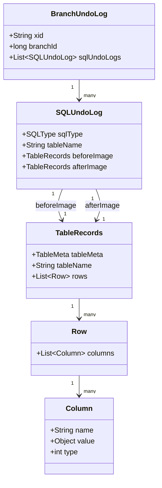
```mermaid
classDiagram
    class BranchUndoLog {
        +String xid
        +long branchId
        +List~SQLUndoLog~ sqlUndoLogs
    }
    class SQLUndoLog {
        +SQLType sqlType
        +String tableName
        +TableRecords beforeImage
        +TableRecords afterImage
    }
    class TableRecords {
        +TableMeta tableMeta
        +String tableName
        +List~Row~ rows
    }
    class Row {
        +List~Column~ columns
    }
    class Column {
        +String name
        +Object value
        +int type
    }
    BranchUndoLog "1" --> "many" SQLUndoLog
    SQLUndoLog "1" --> "1" TableRecords : beforeImage
    SQLUndoLog "1" --> "1" TableRecords : afterImage
    TableRecords "1" --> "many" Row
    Row "1" --> "many" Column
```

#### UndoLogManager 刷盘

```java
// AbstractUndoLogManager.flushUndoLogs
public void flushUndoLogs(ConnectionProxy cp) throws SQLException {
    ConnectionContext ctx = cp.getContext();
    if (!ctx.hasUndoLog()) return;
    String xid = ctx.getXid();
    long branchId = ctx.getBranchId();
    BranchUndoLog branchUndoLog = new BranchUndoLog();
    branchUndoLog.setXid(xid);
    branchUndoLog.setBranchId(branchId);
    branchUndoLog.setSqlUndoLogs(ctx.getUndoItems());
    byte[] content = UndoLogParserFactory.getInstance().encode(branchUndoLog);
    insertUndoLogWithNormal(xid, branchId, rollbackCtx, content, cp.getTargetConnection());
}
```

### 5.6 全局锁机制

全局锁由 TC 统一管理（`server/src/main/java/org/apache/seata/server/lock/LockManager.java`）：

```java
public interface LockManager {
    boolean acquireLock(BranchSession branchSession) throws TransactionException;
    boolean releaseLock(BranchSession branchSession) throws TransactionException;
    boolean releaseGlobalSessionLock(GlobalSession globalSession) throws TransactionException;
    boolean isLockable(String xid, String resourceId, String lockKey) throws TransactionException;
    void cleanAllLocks() throws TransactionException;
    List<RowLock> collectRowLocks(BranchSession branchSession);
    void updateLockStatus(String xid, LockStatus lockStatus) throws TransactionException;
}
```

锁存储支持多种实现：
- `FileLockManager`（file 模式）
- `DataBaseLockManager` + `LockStoreDataBaseDAO`（db 模式）
- `RedisLockManager` + `RedisLocker` / `RedisLuaLocker`（redis 模式）
- `RaftLockManager`（raft 模式，通过 Raft 复制锁状态）

锁的 key 格式：`resourceId$tableName$primaryKey1,primaryKey2`。

#### 写隔离与读隔离

- **写隔离**：一阶段本地事务提交前必须先拿到全局锁，拿不到则重试或失败，避免脏写。
- **读隔离**：默认读已提交；`SELECT ... FOR UPDATE` 通过 `SelectForUpdateExecutor` 申请全局锁，实现读隔离。

### 5.7 二阶段处理

- **提交**：`RMHandlerAT` 收到 `UndoLogDeleteRequest`，**异步删除 undo_log**（一阶段已提交，二阶段提交仅需清理）。
- **回滚**：RM 加载 undo_log，校验 afterImage 与当前数据是否一致（防脏写），根据 beforeImage 生成反向 UPDATE/DELETE/INSERT SQL 执行补偿，最后删除 undo_log。

### 5.8 AT 模式时序图

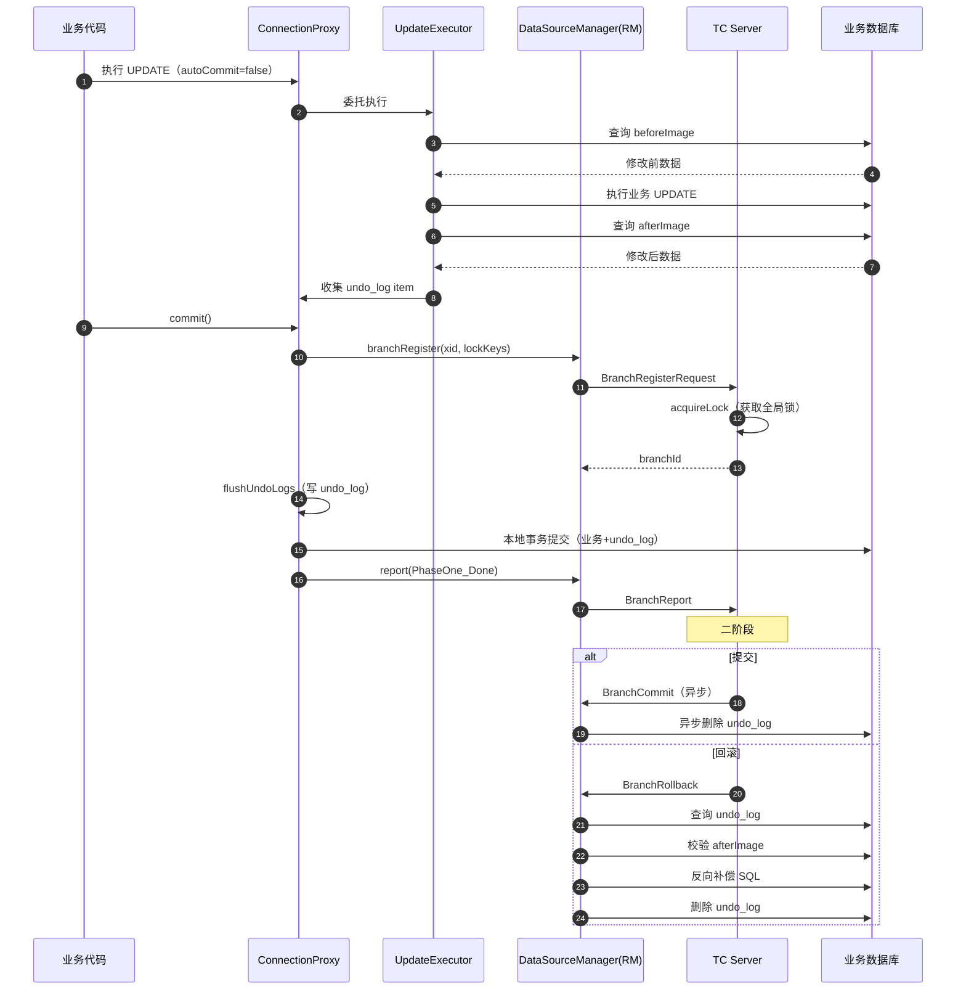
```mermaid
sequenceDiagram
    autonumber
    participant App as 业务代码
    participant CP as ConnectionProxy
    participant Exec as UpdateExecutor
    participant RM as DataSourceManager(RM)
    participant TC as TC Server
    participant DB as 业务数据库

    App->>CP: 执行 UPDATE（autoCommit=false）
    CP->>Exec: 委托执行
    Exec->>DB: 查询 beforeImage
    DB-->>Exec: 修改前数据
    Exec->>DB: 执行业务 UPDATE
    Exec->>DB: 查询 afterImage
    DB-->>Exec: 修改后数据
    Exec->>CP: 收集 undo_log item
    App->>CP: commit()
    CP->>RM: branchRegister(xid, lockKeys)
    RM->>TC: BranchRegisterRequest
    TC->>TC: acquireLock（获取全局锁）
    TC-->>RM: branchId
    CP->>CP: flushUndoLogs（写 undo_log）
    CP->>DB: 本地事务提交（业务+undo_log）
    CP->>RM: report(PhaseOne_Done)
    RM->>TC: BranchReport

    Note over TC: 二阶段
    alt 提交
        TC->>RM: BranchCommit（异步）
        RM->>DB: 异步删除 undo_log
    else 回滚
        TC->>RM: BranchRollback
        RM->>DB: 查询 undo_log
        RM->>DB: 校验 afterImage
        RM->>DB: 反向补偿 SQL
        RM->>DB: 删除 undo_log
    end
```

---

## 六、TCC 模式实现原理

TCC（Try-Confirm-Cancel）是业务层的两阶段提交，需要业务自定义 Try（资源预留）、Confirm（确认）、Cancel（取消）三个方法。

### 6.1 核心注解

`@TwoPhaseBusinessAction`（`tcc/src/main/java/org/apache/seata/rm/tcc/api/TwoPhaseBusinessAction.java`）标注在 Try 方法上：

```java
@Retention(RetentionPolicy.RUNTIME)
@Target({ElementType.METHOD})
@Inherited
public @interface TwoPhaseBusinessAction {
    String name();                              // TCC bean 名，唯一
    String commitMethod() default "commit";     // Confirm 方法名
    String rollbackMethod() default "rollback"; // Cancel 方法名
    boolean isDelayReport() default false;      // 延迟分支报告（性能优化）
    boolean useTCCFence() default false;        // 是否启用 TCC Fence
    Class<?>[] commitArgsClasses() default {BusinessActionContext.class};
    Class<?>[] rollbackArgsClasses() default {BusinessActionContext.class};
}
```

`@LocalTCC` 标注在接口上，表示这是一个本地 TCC 接口。`@BusinessActionContextParameter` 标注参数，自动注入到 `BusinessActionContext`。

### 6.2 拦截器

`TccActionInterceptorHandler`（`tcc/src/main/java/org/apache/seata/rm/tcc/interceptor/TccActionInterceptorHandler.java`）继承 `AbstractProxyInvocationHandler`：

```java
@Override
protected Object doInvoke(InvocationWrapper invocation) throws Throwable {
    if (!RootContext.inGlobalTransaction() || RootContext.inSagaBranch()) {
        return invocation.proceed();  // 非全局事务直接放行
    }
    Method method = invocation.getMethod();
    Annotation businessAction = parseAnnotation(method);
    if (businessAction != null) {
        String xid = RootContext.getXID();
        // 绑定 TCC 分支类型
        RootContext.bindBranchType(getBranchType());
        TwoPhaseBusinessActionParam param = createTwoPhaseBusinessActionParam(businessAction);
        // 委托 ActionInterceptorHandler 处理：注册分支 + 执行 Try
        return actionInterceptorHandler.proceed(
                method, invocation.getArguments(), xid, param, invocation::proceed);
    }
    return invocation.proceed();
}
```

### 6.3 TCC 资源与资源管理器

| 类 | 路径 | 职责 |
|----|------|------|
| `TCCResource` | `tcc/src/main/java/org/apache/seata/rm/tcc/TCCResource.java` | TCC 资源，持有 Try/Confirm/Cancel 的 Method |
| `TCCResourceManager` | `tcc/src/main/java/org/apache/seata/rm/tcc/TCCResourceManager.java` | TCC 资源管理器，二阶段通过反射调用 Confirm/Cancel |
| `RMHandlerTCC` | `tcc/src/main/java/org/apache/seata/rm/tcc/RMHandlerTCC.java` | RM 端处理 TC 的分支提交/回滚指令 |
| `TccActionInterceptorParser` | `tcc/.../interceptor/parser/` | 解析 `@TwoPhaseBusinessAction`，注册 TCCResource |

### 6.4 TCC Fence 机制（解决三大异常）

TCC 模式存在三大异常问题：
1. **空回滚**：Try 未执行但 Cancel 被调用（如 Try 超时）。
2. **幂等**：Confirm/Cancel 被重复调用。
3. **悬挂**：Cancel 先于 Try 执行（如 Try 超时后 Cancel，但 Try 延迟到达）。

Seata 通过 `tcc_fence_log` 表 + Fence 机制解决，核心位于 `integration-tx-api` 模块：

| 类 | 路径 | 职责 |
|----|------|------|
| `FenceHandler` | `integration-tx-api/.../fence/FenceHandler.java` | Fence 接口 |
| `DefaultCommonFenceHandler` | `integration-tx-api/.../fence/DefaultCommonFenceHandler.java` | 默认实现 |
| `CommonFenceDO` | `integration-tx-api/.../fence/store/CommonFenceDO.java` | Fence 数据对象 |
| `CommonFenceStore` | `integration-tx-api/.../fence/store/CommonFenceStore.java` | Fence 存储接口 |
| `CommonFenceStoreDataBaseDAO` | `integration-tx-api/.../fence/store/db/` | DB 存储 DAO |
| `SpringFenceHandler`/`SpringFenceConfig` | `spring/.../rm/fence/` | Spring 集成 |

#### tcc_fence_log 表与状态

`CommonFenceDO` 字段：

```java
public class CommonFenceDO {
    private String xid;          // 全局事务ID
    private Long branchId;       // 分支事务ID
    private String actionName;   // 动作名
    private Integer status;      // tried:1; committed:2; rollbacked:3; suspended:4
    private Date gmtCreate;
    private Date gmtModified;
}
```

#### Fence 工作原理

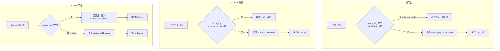
```mermaid
flowchart TD
    subgraph Try阶段
        T1[Try 执行前] --> T2{fence_log 存在 xid+branchId?}
        T2 -->|是且为 suspended| T3[跳过 Try，防悬挂]
        T2 -->|否| T4[插入 fence_log status=tried]
        T4 --> T5[执行 Try 业务]
    end

    subgraph Confirm阶段
        C1[Confirm 执行前] --> C2{fence_log status=committed?}
        C2 -->|是| C3[幂等返回，跳过]
        C2 -->|否| C4[更新 status=committed]
        C4 --> C5[执行 Confirm]
    end

    subgraph Cancel阶段
        CN1[Cancel 执行前] --> CN2{fence_log 存在?}
        CN2 -->|否| CN3[空回滚: 插入 status=suspended]
        CN2 -->|是且 tried| CN4[更新 status=rollbacked]
        CN3 --> CN5[跳过 Cancel]
        CN4 --> CN6[执行 Cancel]
    end
```

### 6.5 TCC 模式时序图

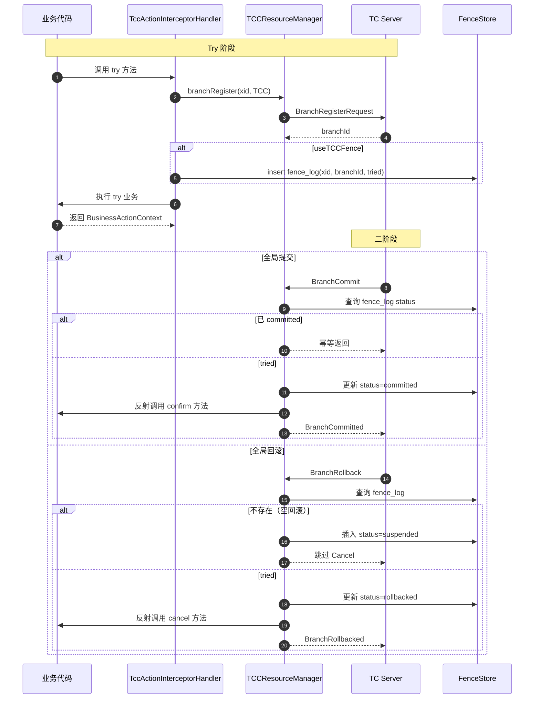
```mermaid
sequenceDiagram
    autonumber
    participant App as 业务代码
    participant TIH as TccActionInterceptorHandler
    participant RM as TCCResourceManager
    participant TC as TC Server
    participant Fence as FenceStore

    Note over App,TC: Try 阶段
    App->>TIH: 调用 try 方法
    TIH->>RM: branchRegister(xid, TCC)
    RM->>TC: BranchRegisterRequest
    TC-->>RM: branchId
    alt useTCCFence
        TIH->>Fence: insert fence_log(xid, branchId, tried)
    end
    TIH->>App: 执行 try 业务
    App-->>TIH: 返回 BusinessActionContext

    Note over TC: 二阶段
    alt 全局提交
        TC->>RM: BranchCommit
        RM->>Fence: 查询 fence_log status
        alt 已 committed
            RM-->>TC: 幂等返回
        else tried
            RM->>Fence: 更新 status=committed
            RM->>App: 反射调用 confirm 方法
            RM-->>TC: BranchCommitted
        end
    else 全局回滚
        TC->>RM: BranchRollback
        RM->>Fence: 查询 fence_log
        alt 不存在（空回滚）
            RM->>Fence: 插入 status=suspended
            RM-->>TC: 跳过 Cancel
        else tried
            RM->>Fence: 更新 status=rollbacked
            RM->>App: 反射调用 cancel 方法
            RM-->>TC: BranchRollbacked
        end
    end
```

---

## 七、XA 模式实现原理

XA 模式利用数据库原生 XA 协议（`javax.transaction.xa.XAResource`）实现强一致性的两阶段提交，数据可见性和一致性最强，但会持有数据库资源锁更久。

### 7.1 核心类

| 类 | 路径 | 职责 |
|----|------|------|
| `DataSourceProxyXA` | `rm-datasource/.../xa/DataSourceProxyXA.java` | XA 数据源代理 |
| `DataSourceProxyXANative` | `rm-datasource/.../xa/DataSourceProxyXANative.java` | 原生 XA 数据源代理 |
| `ConnectionProxyXA` | `rm-datasource/.../xa/ConnectionProxyXA.java` | XA 连接代理，封装 XAResource |
| `AbstractConnectionProxyXA` | `rm-datasource/.../xa/AbstractConnectionProxyXA.java` | 抽象基类 |
| `PreparedStatementProxyXA` | `rm-datasource/.../xa/PreparedStatementProxyXA.java` | XA PreparedStatement |
| `ExecuteTemplateXA` | `rm-datasource/.../xa/ExecuteTemplateXA.java` | XA 执行模板 |
| `ResourceManagerXA` | `rm-datasource/.../xa/ResourceManagerXA.java` | XA 资源管理器，二阶段调用 XAResource |
| `SeataXAResource` | `rm-datasource/.../util/SeataXAResource.java` | XAResource 包装 |

### 7.2 ConnectionProxyXA 关键字段

```java
public class ConnectionProxyXA extends AbstractConnectionProxyXA implements Holdable {
    private static final int BRANCH_EXECUTION_TIMEOUT = ...; // 分支执行超时
    private volatile boolean currentAutoCommitStatus = true;
    private volatile XAXid xaBranchXid;       // XA 分支事务 XID
    private volatile boolean xaActive = false; // XA 是否激活
    private volatile boolean kept = false;     // 连接是否被持有
    private volatile boolean rollBacked = false;
    private volatile Long branchRegisterTime = null;
    private volatile Long prepareTime = null;
    private volatile boolean combine = false;  // 是否合并
    private final ResourceLock resourceLock = new ResourceLock();

    public void init() {
        this.xaResource = xaConnection.getXAResource();   // 获取 XAResource
        this.currentAutoCommitStatus = originalConnection.getAutoCommit();
        if (!currentAutoCommitStatus) {
            throw new IllegalStateException("Connection[autocommit=false] as default is NOT supported");
        }
    }
}
```

### 7.3 XA 事务流程

XA 模式遵循标准 XA 协议：

| 阶段 | 操作 | 说明 |
|------|------|------|
| 一阶段 | `XAResource.start(xid, TMNOFLAGS)` | 开启 XA 事务 |
| 一阶段 | 执行业务 SQL | 在 XA 事务上下文中执行 |
| 一阶段 | `XAResource.end(xid, TMSUCCESS)` | 结束 XA 事务 |
| 一阶段 | 向 TC 注册分支 + `XAResource.prepare(xid)` | 预提交，资源锁定 |
| 二阶段提交 | `XAResource.commit(xid, false)` | 真正提交 |
| 二阶段回滚 | `XAResource.rollback(xid)` | 回滚 |

### 7.4 XA 模式时序图

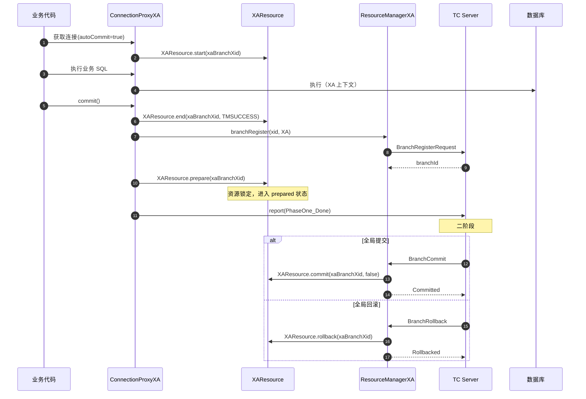
```mermaid
sequenceDiagram
    autonumber
    participant App as 业务代码
    participant CP as ConnectionProxyXA
    participant XA as XAResource
    participant RM as ResourceManagerXA
    participant TC as TC Server
    participant DB as 数据库

    App->>CP: 获取连接(autoCommit=true)
    CP->>XA: XAResource.start(xaBranchXid)
    App->>CP: 执行业务 SQL
    CP->>DB: 执行（XA 上下文）
    App->>CP: commit()
    CP->>XA: XAResource.end(xaBranchXid, TMSUCCESS)
    CP->>RM: branchRegister(xid, XA)
    RM->>TC: BranchRegisterRequest
    TC-->>RM: branchId
    CP->>XA: XAResource.prepare(xaBranchXid)
    Note over XA: 资源锁定，进入 prepared 状态
    CP->>TC: report(PhaseOne_Done)

    Note over TC: 二阶段
    alt 全局提交
        TC->>RM: BranchCommit
        RM->>XA: XAResource.commit(xaBranchXid, false)
        RM-->>TC: Committed
    else 全局回滚
        TC->>RM: BranchRollback
        RM->>XA: XAResource.rollback(xaBranchXid)
        RM-->>TC: Rollbacked
    end
```

### 7.5 XA 与 AT 对比

| 维度 | AT 模式 | XA 模式 |
|------|---------|---------|
| 一阶段 | 本地事务提交，释放本地锁 | prepare 后持有 XA 锁 |
| 隔离性 | 默认读已提交，需 `SELECT FOR UPDATE` 提升隔离 | 强一致性，数据库原生隔离 |
| 性能 | 高（锁持有时间短） | 较低（锁持有到二阶段） |
| 侵入性 | 无侵入 | 无侵入 |
| 数据库要求 | 支持 undo_log + 行锁 | 支持 XA 协议 |
| 一致性 | 最终一致 | 强一致 |

---

## 八、SAGA 模式实现原理

SAGA 是基于**状态机**的长事务解决方案，将复杂事务编排为状态图，正向执行失败时按反向顺序补偿。

### 8.1 整体架构

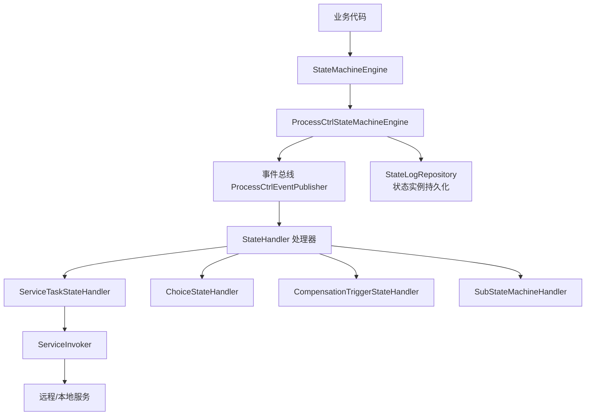
```mermaid
graph TB
    App[业务代码] --> Engine[StateMachineEngine]
    Engine --> PCE[ProcessCtrlStateMachineEngine]
    PCE --> EventBus[事件总线 ProcessCtrlEventPublisher]
    EventBus --> Handlers[StateHandler 处理器]
    Handlers --> SH1[ServiceTaskStateHandler]
    Handlers --> SH2[ChoiceStateHandler]
    Handlers --> SH3[CompensationTriggerStateHandler]
    Handlers --> SH4[SubStateMachineHandler]
    SH1 --> Invoker[ServiceInvoker]
    Invoker --> RemoteService[远程/本地服务]
    PCE --> Repo[StateLogRepository<br/>状态实例持久化]
```

### 8.2 状态机模型

核心接口位于 `saga/seata-saga-statelang`：

| 接口/类 | 路径 | 说明 |
|---------|------|------|
| `StateMachine` | `saga/seata-saga-statelang/.../domain/StateMachine.java` | 状态机定义 |
| `State` | `.../domain/State.java` | 状态基接口 |
| `ServiceTaskState` | `.../domain/ServiceTaskState.java` | 服务任务状态 |
| `ChoiceState` | `.../domain/ChoiceState.java` | 分支选择状态 |
| `CompensationTriggerState` | `.../domain/CompensationTriggerState.java` | 补偿触发状态 |
| `SucceedEndStateImpl`/`FailEndStateImpl` | `.../domain/impl/` | 成功/失败结束 |
| `StateMachineInstance` | `.../domain/StateMachineInstance.java` | 状态机实例 |
| `StateInstance` | `.../domain/StateInstance.java` | 状态实例 |

#### 状态类型

| 类型 | 说明 |
|------|------|
| `ServiceTask` | 执行远程服务或本地 Bean 方法的任务 |
| `Choice` | 基于表达式选择分支 |
| `ScriptTask` | 执行 Groovy 脚本 |
| `SubStateMachine` | 嵌入子状态机 |
| `CompensationTrigger` | 触发补偿流程 |
| `Succeed`/`Fail` | 事务结束 |

### 8.3 状态机引擎

`ProcessCtrlStateMachineEngine`（`saga/seata-saga-engine/.../impl/ProcessCtrlStateMachineEngine.java`）：

```java
@Override
public StateMachineInstance start(String stateMachineName, String tenantId, Map<String, Object> startParams)
        throws EngineExecutionException {
    return startInternal(stateMachineName, tenantId, null, startParams, false, null);
}

private StateMachineInstance startInternal(...) {
    // 1. 创建状态机实例
    StateMachineInstance instance = createMachineInstance(stateMachineName, tenantId, businessKey, startParams);
    // 2. 构建处理上下文
    ProcessContext processContext = ProcessContextBuilder.create()
            .withProcessType(ProcessType.STATE_LANG)
            .withInstruction(new StateInstruction(stateMachineName, tenantId))
            .withStateMachineInstance(instance)
            .withStateMachineConfig(getStateMachineConfig())
            .build();
    // 3. 发布到事件总线（同步或异步）
    if (async) {
        stateMachineConfig.getAsyncProcessCtrlEventPublisher().publish(processContext);
    } else {
        stateMachineConfig.getProcessCtrlEventPublisher().publish(processContext);
    }
    return instance;
}
```

### 8.4 ServiceTaskStateHandler

```java
public void process(ProcessContext context) {
    ServiceTaskStateImpl state = (ServiceTaskStateImpl) instruction.getState(context);
    // 获取输入参数
    List<Object> input = (List<Object>) context.getVariable(VAR_NAME_INPUT_PARAMS);
    // 调用服务
    ServiceInvoker invoker = config.getServiceInvokerManager().getServiceInvoker(state.getServiceType());
    Object result = invoker.invoke(state, input.toArray());
    // 输出参数
    stateInstance.setOutputParams(result);
    context.setVariableLocally(VAR_NAME_OUTPUT_PARAMS, result);
}
```

### 8.5 补偿机制

`CompensationHolder`（`saga/seata-saga-engine/.../pcext/utils/CompensationHolder.java`）负责收集需要补偿的状态实例：

```java
public static List<StateInstance> findStateInstListToBeCompensated(
        ProcessContext context, List<StateInstance> stateInstanceList) {
    List<StateInstance> result = new ArrayList<>();
    for (StateInstance si : stateInstanceList) {
        if (stateNeedToCompensate(si)) {
            State state = stateMachine.getState(EngineUtils.getOriginStateName(si));
            if (state != null && StringUtils.isNotBlank(((AbstractTaskState)state).getCompensateState())) {
                result.add(si);
            }
        }
    }
    Collections.reverse(result);  // 反向顺序补偿
    return result;
}
```

### 8.6 状态机定义示例（JSON DSL）

```json
{
  "Name": "orderPurchaseSM",
  "Comment": "订单购买 SAGA 状态机",
  "StartState": "checkInventory",
  "Version": "1.0.0",
  "States": {
    "checkInventory": {
      "Type": "ServiceTask",
      "ServiceName": "inventoryService",
      "ServiceMethod": "deduct",
      "CompensateState": "restoreInventory",
      "Next": "createOrder"
    },
    "restoreInventory": {
      "Type": "ServiceTask",
      "ServiceName": "inventoryService",
      "ServiceMethod": "restore",
      "IsForCompensation": true
    },
    "createOrder": {
      "Type": "ServiceTask",
      "ServiceName": "orderService",
      "ServiceMethod": "create",
      "CompensateState": "cancelOrder",
      "Next": "payment"
    },
    "cancelOrder": { "Type": "ServiceTask", "ServiceName": "orderService", "ServiceMethod": "cancel", "IsForCompensation": true },
    "payment": { "Type": "ServiceTask", "ServiceName": "paymentService", "ServiceMethod": "pay", "CompensateState": "refundPayment", "Next": "success" },
    "refundPayment": { "Type": "ServiceTask", "ServiceName": "paymentService", "ServiceMethod": "refund", "IsForCompensation": true },
    "success": { "Type": "Succeed" }
  }
}
```

### 8.7 SAGA 流程图

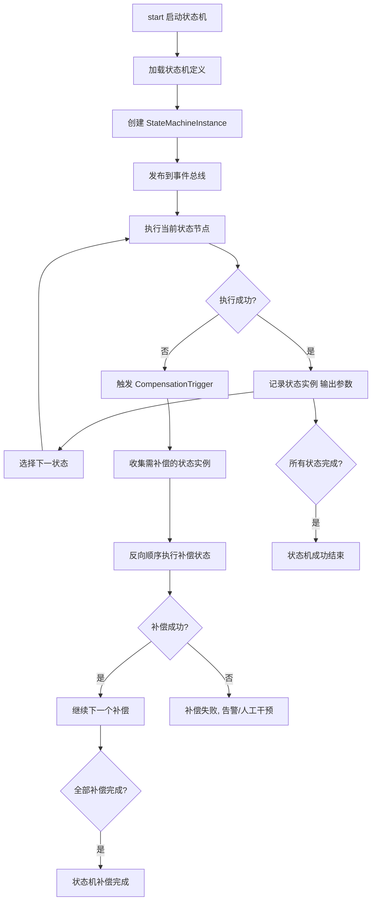
```mermaid
flowchart TD
    A[start 启动状态机] --> B[加载状态机定义]
    B --> C[创建 StateMachineInstance]
    C --> D[发布到事件总线]
    D --> E[执行当前状态节点]
    E --> F{执行成功?}
    F -->|是| G[记录状态实例 输出参数]
    G --> H[选择下一状态]
    H --> E
    F -->|否| I[触发 CompensationTrigger]
    I --> J[收集需补偿的状态实例]
    J --> K[反向顺序执行补偿状态]
    K --> L{补偿成功?}
    L -->|是| M[继续下一个补偿]
    L -->|否| N[补偿失败, 告警/人工干预]
    M --> O{全部补偿完成?}
    O -->|是| P[状态机补偿完成]
    G --> Q{所有状态完成?}
    Q -->|是| R[状态机成功结束]
```

### 8.8 SAGA 注解集成

`saga/seata-saga-annotation` 提供：
- `@SagaTransactional`：通用事务参与者注解
- `@CompensationBusinessAction`：Saga 场景的业务动作注解（指定 compensationMethod）
- `SagaAnnotationActionInterceptorParser`：注解解析器

---

## 九、Server 启动流程

### 9.1 启动入口

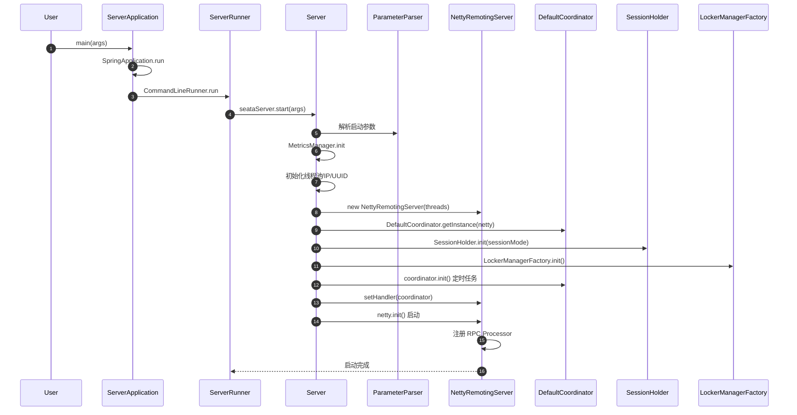
```mermaid
sequenceDiagram
    autonumber
    participant User
    participant App as ServerApplication
    participant Runner as ServerRunner
    participant Server as Server
    participant PP as ParameterParser
    participant Netty as NettyRemotingServer
    participant Coord as DefaultCoordinator
    participant SH as SessionHolder
    participant LMF as LockerManagerFactory

    User->>App: main(args)
    App->>App: SpringApplication.run
    App->>Runner: CommandLineRunner.run
    Runner->>Server: seataServer.start(args)
    Server->>PP: 解析启动参数
    Server->>Server: MetricsManager.init
    Server->>Server: 初始化线程池/IP/UUID
    Server->>Netty: new NettyRemotingServer(threads)
    Server->>Coord: DefaultCoordinator.getInstance(netty)
    Server->>SH: SessionHolder.init(sessionMode)
    Server->>LMF: LockerManagerFactory.init()
    Server->>Coord: coordinator.init() 定时任务
    Server->>Netty: setHandler(coordinator)
    Server->>Netty: netty.init() 启动
    Netty->>Netty: 注册 RPC Processor
    Netty-->>Runner: 启动完成
```

### 9.2 启动入口类

- `ServerApplication`（`server/src/main/java/org/apache/seata/server/ServerApplication.java`）：SpringBoot 启动类
  ```java
  @SpringBootApplication(scanBasePackages = {"org.apache.seata"})
  public class ServerApplication {
      public static void main(String[] args) throws IOException {
          SpringApplication.run(ServerApplication.class, args);
      }
  }
  ```
- `ServerRunner`：实现 `CommandLineRunner`，在 Spring 上下文就绪后调用 `seataServer.start(args)`
- `Server`：核心启动逻辑
- `ParameterParser`：解析命令行参数

### 9.3 启动参数

| 参数 | 说明 |
|------|------|
| `--host/-h` | 绑定 IP |
| `--port/-p` | 监听端口 |
| `--storeMode/-m` | 存储模式（file/db/redis） |
| `--serverNode/-n` | 服务节点 ID（用于 UUID 生成） |
| `--seataEnv/-e` | 多环境隔离 |
| `--sessionStoreMode/-ssm` | Session 存储模式 |
| `--lockStoreMode/-lsm` | 锁存储模式 |

### 9.4 Server.start 核心步骤

```java
// 1. 参数解析
ParameterParser parameterParser = new ParameterParser(args);
// 2. metrics 初始化
MetricsManager.get().init();
// 3. 线程池
ThreadPoolExecutor workingThreads = new ThreadPoolExecutor(...);
// 4. 设置本地 IP（用于 XID 生成）
XID.setIpAddress(parameterParser.getHost());
// 5. Netty 服务器
NettyRemotingServer nettyRemotingServer = new NettyRemotingServer(workingThreads);
XID.setPort(nettyRemotingServer.getListenPort());
// 6. UUID 生成器（全局事务ID）
UUIDGenerator.init(parameterParser.getServerNode());
// 7. 协调器
DefaultCoordinator coordinator = DefaultCoordinator.getInstance(nettyRemotingServer);
// 8. 存储
SessionHolder.init();          // SessionManager
LockerManagerFactory.init();   // LockManager
// 9. 协调器定时任务
coordinator.init();
// 10. 处理器 + 启动
nettyRemotingServer.setHandler(coordinator);
nettyRemotingServer.init();
```

### 9.5 存储模式与 SessionHolder

`SessionHolder`（`server/src/main/java/org/apache/seata/server/session/SessionHolder.java`）持有：
- `ROOT_SESSION_MANAGER`：根 Session 管理器
- `SESSION_MANAGER_MAP`：多 Session 管理器映射
- `ROOT_VGROUP_MAPPING_MANAGER`：vgroup 映射存储
- `DISTRIBUTED_LOCKER`：分布式锁

根据 `SessionMode` 通过 `EnhancedServiceLoader` 加载对应实现：

| SessionMode | SessionManager | TransactionStoreManager |
|-------------|----------------|--------------------------|
| file | `FileSessionManager` | `FileTransactionStoreManager` |
| db | `DataBaseSessionManager` | `DataBaseTransactionStoreManager` |
| redis | `RedisSessionManager` | `RedisTransactionStoreManager` |
| raft | `RaftSessionManager` | （Raft 复制） |

### 9.6 协调器定时任务

`DefaultCoordinator.init()` 启动多个定时任务保障事务最终一致：

| 任务 | 方法 | 周期配置 | 默认值 |
|------|------|----------|--------|
| 超时检查 | `timeoutCheck()` | `timeoutRetryPeriod` | 1s |
| 重试回滚 | `handleRetryRollbacking()` | `rollbackingRetryPeriod` | 1s |
| 重试提交 | `handleRetryCommitting()` | `commitingRetryPeriod` | 1s |
| 异步提交 | `handleAsyncCommitting()` | `asyncCommittingRetryPeriod` | 1s |
| undo_log 清理 | `undoLogDelete()` | `undoLogDeletePeriod` | 86400000ms（1天） |

所有任务通过 `SessionHolder.distributedLockAndExecute(name, task)` 获取分布式锁后执行，避免集群内重复处理。

> **定时任务异常处理**：每个任务都包裹在 `distributedLockAndExecute` 中，获取分布式锁失败时会跳过本次执行（而非阻塞），保证集群内同一时刻只有一个节点处理。所有周期参数在类加载时通过 `CONFIG.getLong()` 一次性读取并定义为 `static final`，运行期修改配置不会生效（需重启）。

### 9.7 配置加载机制（ConfigurationFactory）

Server 启动时，几乎所有组件（存储模式、线程池大小、Netty 端口、注册中心地址等）都依赖配置中心。配置加载是整个启动流程的"第 0 步"。

#### 9.7.1 双配置文件体系

Seata 采用 **registry.conf + file.conf**（或远程配置中心）双文件设计：

| 文件 | 作用 | 默认名 | 加载时机 |
|------|------|--------|----------|
| `registry.conf` | 引导配置，决定 config.type / registry.type | `registry.conf` | ConfigurationFactory 类加载时 |
| `file.conf` | 核心业务配置（store.* / service.* / transport.*） | `file.conf` | 当 `config.type=file` 时加载 |

多环境隔离：通过 `-e`（`seataEnv`）参数或 `SEATA_ENV` 环境变量，文件名变为 `registry-{env}.conf`。

#### 9.7.2 ConfigurationFactory 静态初始化

`config/seata-config-core/src/main/java/org/apache/seata/config/ConfigurationFactory.java` 在类加载时执行三步：

```java
static {
    initOriginConfiguration();   // 1. 创建 registry.conf 的 FileConfiguration
    load();                      // 2. SPI 加载 ExtConfigurationProvider（Spring 扩展点）
    maybeNeedOriginFileInstance();// 3. 若 config.type=file，再创建 file.conf 的 FileConfiguration
}
```

1. **`initOriginConfiguration()`**（行 90-105）：
   - 依次从 `-Dseata.config.name` 系统属性、`SEATA_CONFIG_NAME` 环境变量读取配置文件名，默认 `registry`
   - 从 `seataEnv` / `SEATA_ENV` 读取环境标识，拼接为 `registry-{env}`
   - 创建 `ORIGIN_FILE_INSTANCE_REGISTRY = new FileConfiguration(seataConfigName, false)`

2. **`load()`**（行 67-88）：
   - 通过 `EnhancedServiceLoader.load(ExtConfigurationProvider.class)` 加载扩展配置提供者
   - SpringBoot 环境下 `seata-spring-boot-starter` 会注册 `ExtConfigurationProvider`，将 Spring `Environment` 中的配置桥接进来，**优先级高于 file.conf**
   - 最终 `CURRENT_FILE_INSTANCE` = extConfiguration（若存在）否则 ORIGIN_FILE_INSTANCE_REGISTRY

3. **`maybeNeedOriginFileInstance()`**（行 132-140）：
   - 读取 `config.type`，若为 `File` 则读取 `config.file.name`（默认 `file.conf`）
   - 创建 `ORIGIN_FILE_INSTANCE = new FileConfiguration(name)` 供后续 `getInstance()` 使用

#### 9.7.3 配置中心 SPI 加载（buildConfiguration）

`getInstance()`（行 121）→ `buildConfiguration()`（行 161-185）流程：

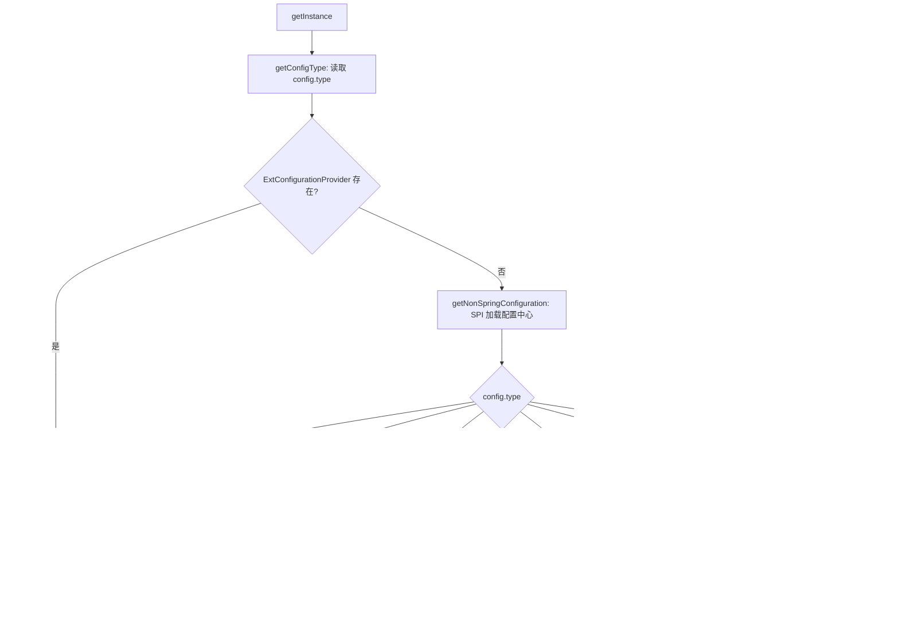
```mermaid
flowchart TD
    A[getInstance] --> B[getConfigType: 读取 config.type]
    B --> C{ExtConfigurationProvider 存在?}
    C -->|是| D[使用 Spring 桥接配置]
    C -->|否| E[getNonSpringConfiguration: SPI 加载配置中心]
    E --> F{config.type}
    F -->|nacos| G[NacosConfiguration]
    F -->|apollo| H[ApolloConfiguration]
    F -->|zk| I[ZooKeeperConfiguration]
    F -->|consul| J[ConsulConfiguration]
    F -->|etcd3| K[Etcd3Configuration]
    F -->|file| L[FileConfiguration<br/>ORIGIN_FILE_INSTANCE]
    D --> M[ConfigurationCache.proxy 包装]
    G --> M
    H --> M
    I --> M
    J --> M
    K --> M
    L --> M
    M --> N[最终 Configuration 实例]
```

关键点：
- **`ConfigType` 枚举**：`File / ZK / Nacos / Apollo / Consul / Etcd3 / SpringCloudConfig / Custom`
- **`ConfigurationProvider` SPI**：每个配置中心实现 `ConfigurationProvider` 接口，通过 `@LoadLevel` 注解注册，`EnhancedServiceLoader.load(ConfigurationProvider.class, configTypeName)` 按名加载
- **ConfigurationCache 代理**（`config/seata-config-core/.../ConfigurationCache.java`）：用 JDK 动态代理包装原始 Configuration，对所有 `get*` 方法结果用 `ConcurrentHashMap` 缓存，避免重复远程查询；同时注册为 `ConfigurationChangeListener`，配置变更时自动刷新缓存

#### 9.7.4 Nacos 配置中心实现示例

`config/seata-config-nacos/src/main/java/org/apache/seata/config/nacos/NacosConfiguration.java`：

- **初始化**：从 `registry.conf` 的 `config.nacos.*` 读取 `serverAddr` / `namespace` / `group` / `dataId`，通过 `NacosFactory.createConfigService()` 创建 `ConfigService`
- **getConfig**：调用 `configService.getConfig(dataId, group, timeoutMs)`，超时默认 5000ms
- **配置监听**：注册 `AbstractSharedListener`，Nacos 配置变更时触发 `ConfigurationChangeEvent`，通知所有监听器（包括 ConfigurationCache）

```java
// 简化的 NacosConfiguration 核心逻辑
@Override
public String getConfig(String dataId, String defaultValue, long timeoutMills) {
    String config = configService.getConfig(dataId, group, timeoutMills);
    return StringUtils.isBlank(config) ? defaultValue : config;
}

@Override
public boolean putConfig(String dataId, String content, long timeoutMills) {
    return configService.publishConfig(dataId, group, content);
}
```

#### 9.7.5 配置优先级体系

从高到低：

| 优先级 | 来源 | 示例 |
|--------|------|------|
| 1 | JVM 系统属性 `-D` | `-Dseata.config.name=file` |
| 2 | 命令行启动参数 | `--storeMode db`（经 `ParameterParser` → `StoreConfig.setStartupParameter`） |
| 3 | 容器环境变量 | `SEATA_ENV` / `STORE_MODE`（`ContainerHelper` 读取） |
| 4 | SpringBoot `application.yml` | 通过 `ExtConfigurationProvider` 桥接 |
| 5 | 远程配置中心 | Nacos / Apollo 中的 `store.mode` 等 |
| 6 | 本地 `file.conf` | `ORIGIN_FILE_INSTANCE` |
| 7 | 代码默认值 | `DefaultValues.SERVER_DEFAULT_STORE_MODE = "file"` |

> **命令行参数覆盖原理**：`ParameterParser.init()` 调用 `StoreConfig.setStartupParameter(storeMode, sessionMode, lockMode)`，将命令行值赋给 `StoreConfig` 的静态字段。`getStoreMode()` 优先返回该静态字段（行 96-109），从而覆盖配置中心值。

#### 9.7.6 配置变更监听

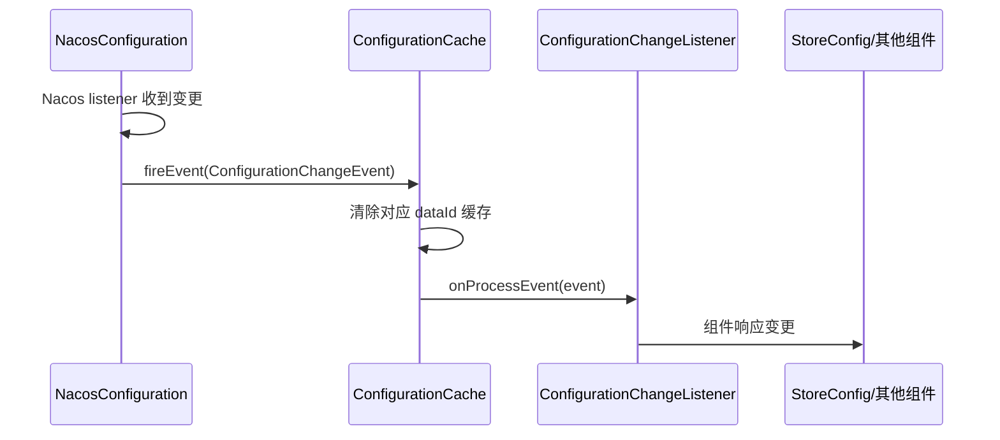
```mermaid
sequenceDiagram
    participant NC as NacosConfiguration
    participant Cache as ConfigurationCache
    participant Listener as ConfigurationChangeListener
    participant SC as StoreConfig/其他组件

    NC->>NC: Nacos listener 收到变更
    NC->>Cache: fireEvent(ConfigurationChangeEvent)
    Cache->>Cache: 清除对应 dataId 缓存
    Cache->>Listener: onProcessEvent(event)
    Listener->>SC: 组件响应变更
```

> 注意：`DefaultCoordinator` 中的定时任务周期是 `static final`，在类加载时读取一次，**运行期修改配置中心的重试周期不会生效**。但 `store.mode` 等部分配置通过 `ConfigurationCache` 动态读取，可实时生效（需组件主动支持）。

### 9.8 数据源与存储加载详解

#### 9.8.1 StoreConfig 配置读取

`server/src/main/java/org/apache/seata/server/store/StoreConfig.java`：

```java
private static StoreMode getStoreMode() {
    if (null != storeMode) return storeMode;              // 1. 命令行参数最高优先级
    String storeModeEnv = ContainerHelper.getStoreMode(); // 2. 容器环境变量
    if (StringUtils.isNotBlank(storeModeEnv)) return StoreMode.get(storeModeEnv);
    String storeModeConfig = CONFIGURATION.getConfig(     // 3. 配置中心/file.conf
            ConfigurationKeys.STORE_MODE, SERVER_DEFAULT_STORE_MODE); // 默认 file
    return StoreMode.get(storeModeConfig);
}
```

`getSessionMode()` / `getLockMode()` 同理，且若未单独配置 `store.session.mode` / `store.lock.mode`，则回退到 `store.mode`（兼容旧配置）。

#### 9.8.2 SessionHolder.init 四种模式加载

`server/src/main/java/org/apache/seata/server/session/SessionHolder.java` 行 100-159：

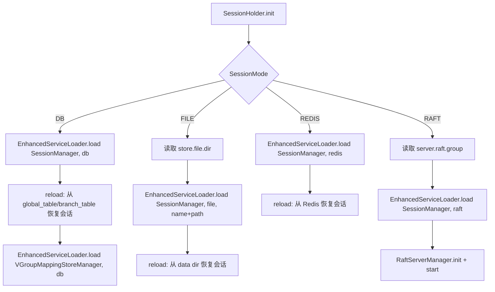
```mermaid
flowchart TD
    S[SessionHolder.init] --> T{SessionMode}
    T -->|DB| DB[EnhancedServiceLoader.load SessionManager, db]
    DB --> DB2[reload: 从 global_table/branch_table 恢复会话]
    DB2 --> DB3[EnhancedServiceLoader.load VGroupMappingStoreManager, db]
    T -->|FILE| FV[读取 store.file.dir]
    FV --> F[EnhancedServiceLoader.load SessionManager, file, name+path]
    F --> F2[reload: 从 data dir 恢复会话]
    T -->|REDIS| R[EnhancedServiceLoader.load SessionManager, redis]
    R --> R2[reload: 从 Redis 恢复会话]
    T -->|RAFT| RV[读取 server.raft.group]
    RV --> RA[EnhancedServiceLoader.load SessionManager, raft]
    RA --> RS[RaftServerManager.init + start]
```

核心字段：
- `ROOT_SESSION_MANAGER`：根会话管理器（SPI 加载）
- `SESSION_MANAGER_MAP`：多 group SessionManager 映射（Raft 模式用）
- `ROOT_VGROUP_MAPPING_MANAGER`：vgroup 映射存储管理器
- `DISTRIBUTED_LOCKER`：分布式锁（`DistributedLockerFactory` 按 mode 加载）

#### 9.8.3 DB 模式数据源初始化

DB 模式下，`SessionHolder.init` 加载 `DataBaseSessionManager`（`server/.../storage/db/session/DataBaseSessionManager.java`），其底层 `DataBaseTransactionStoreManager` 构造时初始化数据源：

```java
// DataBaseTransactionStoreManager 构造（简化）
private DataBaseTransactionStoreManager() {
    String datasourceType = CONFIG.getConfig(
            ConfigurationKeys.STORE_DB_DATASOURCE_TYPE);  // store.db.datasource = druid/hikari
    // SPI 加载 DataSourceProvider
    DataSource logStoreDataSource = EnhancedServiceLoader
            .load(DataSourceProvider.class, datasourceType).provide();
    logStore = new LogStoreDataBaseDAO(logStoreDataSource);
}
```

**DataSourceProvider SPI 实现**（`server/.../storage/db/store/DataSourceProvider.java`）：
- `DruidDataSourceProvider`：创建 `DruidDataSource`，读取 `store.db.url/user/password/driverClassName/minConn/maxConn` 等配置
- `HikariDataSourceProvider`：创建 `HikariDataSource`

**关键配置项**（`store.db.*`）：

| 配置项 | 说明 | 默认值 |
|--------|------|--------|
| `store.db.datasource` | 连接池类型 | druid |
| `store.db.driverClassName` | JDBC 驱动 | com.mysql.cj.jdbc.Driver |
| `store.db.url` | 数据库连接 URL | - |
| `store.db.user` / `store.db.password` | 账号密码 | - |
| `store.db.minConn` / `store.db.maxConn` | 连接数 | 5 / 30 |
| `store.db.globalTable` / `store.db.branchTable` / `store.db.lockTable` / `store.db.distributedLockTable` | 表名 | global_table 等 |
| `store.db.queryLimit` | 查询上限 | 1000 |

> **表结构需手动初始化**：Seata 不会自动建表。SQL 脚本位于 `script/server/db/mysql.sql` / `postgresql.sql` / `oracle.sql`，包含 `global_table` / `branch_table` / `lock_table` / `distributed_lock` 四张表。`vgroup_table` 在 2.x 新增，用于 vgroup 动态映射。

#### 9.8.4 Redis 模式数据源初始化

`RedisSessionManager` 底层使用 `RedisTransactionStoreManager`，通过 `JedisPooledFactory`（`server/.../storage/redis/JedisPooledFactory.java`）创建 Jedis 连接池：

```java
// JedisPooledFactory 简化
public static JedisPooled getJedisPooledInstance() {
    // 读取 store.redis.host/port/password/db/minIdle/maxActive
    JedisPoolConfig poolConfig = new JedisPoolConfig();
    jedisPool = new JedisPooled(poolConfig, host, port, timeout, password, database);
    return jedisPool;
}
```

支持两种存储类型：`store.redis.type=pipeline`（默认，普通管道）或 `lua`（Lua 脚本原子操作，`RedisLuaTransactionStoreManager`）。

#### 9.8.5 File 模式初始化

File 模式读取 `store.file.dir`（默认 `sessionStore`），按端口分目录（`{dir}/{port}`），通过 `FileTransactionStoreManager` 基于 NIO 写入磁盘文件。`reload()` 从文件反序列化恢复所有 `GlobalSession` 到内存。

#### 9.8.6 Raft 模式初始化

Raft 模式下，`SessionHolder.init` 额外调用 `RaftServerManager.init()` + `RaftServerManager.start()`，基于 SOFAJRaft 启动 Raft 节点，所有会话变更通过 Raft 协议同步。`RaftSessionManager` 继承 `FileSessionManager`，本地仍保留文件副本。

#### 9.8.7 LockerManagerFactory 锁管理器加载

`server/src/main/java/org/apache/seata/server/lock/LockerManagerFactory.java`：

```java
public static void init(LockMode lockMode) {
    if (LOCK_MANAGER == null) {
        synchronized (LockerManagerFactory.class) {
            if (LOCK_MANAGER == null) {
                if (null == lockMode) lockMode = StoreConfig.getLockMode();
                LOCK_MANAGER = EnhancedServiceLoader.load(
                        LockManager.class, lockMode.getName());
            }
        }
    }
}
```

| LockMode | LockManager 实现 | 说明 |
|----------|-----------------|------|
| file | `FileLockManager` | 内存 + 文件 |
| db | `DataBaseLockManager` | 操作 `lock_table` 表 |
| redis | `RedisLockManager` | Redis SETNX |
| raft | `RaftLockManager` | Raft 复制 |

### 9.9 注册中心注册流程

#### 9.9.1 注册入口

Server 端注册到注册中心的入口在 **`NettyServerBootstrap.start()`**（`core/src/main/java/org/apache/seata/core/rpc/netty/NettyServerBootstrap.java` 行 164-211），而非 `Server.start()`：

```java
public void start() {
    // ... Netty bootstrap 配置 ...
    this.serverBootstrap.bind(port).sync();
    LOGGER.info("Server started, service listen port: {}", getListenPort());
    Instance instance = Instance.getInstance();
    if (instance.getTransaction() == null) {
        Instance.getInstance().setTransaction(
                new Node.Endpoint(XID.getIpAddress(), XID.getPort(), "netty"));
    }
    // ★ 关键：注册到所有配置的注册中心
    for (RegistryService<?> registryService : MultiRegistryFactory.getInstances()) {
        registryService.register(Instance.getInstance());
    }
    initialized.set(true);
}
```

> **2.x 新增 `Instance` 元数据**：相比 1.x 仅注册 `InetSocketAddress`，2.x 的 `Instance`（`common/.../metadata/Instance.java`）携带更丰富信息：`namespace` / `clusterName` / `unit` / `version` / `transaction Endpoint` / `control Endpoint` / `metadata(vGroup 映射)`。

#### 9.9.2 MultiRegistryFactory 多注册中心

`discovery/seata-discovery-core/.../registry/MultiRegistryFactory.java`：

```java
private static List<RegistryService> buildRegistryServices() {
    String registryTypeNamesStr = ConfigurationFactory.CURRENT_FILE_INSTANCE.getConfig(
            ConfigurationKeys.FILE_ROOT_REGISTRY + "." + ConfigurationKeys.FILE_ROOT_TYPE);
    // 支持逗号分隔的多注册中心类型
    Set<String> registryTypeNames = new TreeSet<>(String.CASE_INSENSITIVE_ORDER);
    registryTypeNames.addAll(Arrays.asList(registryTypeNamesStr.split(Constants.REGISTRY_TYPE_SPLIT_CHAR)));
    List<RegistryService> registryServices = new ArrayList<>();
    for (String name : registryTypeNames) {
        RegistryService service = EnhancedServiceLoader.load(RegistryProvider.class, name).provide();
        registryServices.add(service);
    }
    return registryServices;
}
```

> 配置 `registry.type=nacos,etcd3` 即可同时注册到 Nacos 和 etcd3，适用于注册中心迁移场景。

#### 9.9.3 各注册中心 register 实现

| 注册中心 | 注册方式 | 心跳/存活机制 | 注销方式 |
|----------|----------|---------------|----------|
| **File** | 不注册，仅从 `service.{cluster}.grouplist` 读取地址 | 无 | 无 |
| **Nacos** | `namingService.registerInstance(serviceName, group, ip, port, cluster)` | Nacos 客户端自动心跳（默认 5s） | `deregisterInstance` |
| **Eureka** | `applicationInfoManager.setInstanceStatus(UP)` | 客户端每 30s 心跳 | `setInstanceStatus(DOWN)` |
| **Consul** | `agentClient.agentServiceRegister(NewService)` | TCP/HTTP 健康检查（10s） | `agentServiceDeregister` |
| **Etcd3** | `kvClient.put(key, value, PutOption.withLeaseId(leaseId))` | `EtcdLifeKeeper` 定期续约 lease（TTL 10s） | lease 过期自动删除 |
| **ZooKeeper** | `createEphemeral(path, true)` 创建临时节点 | session 心跳，session 失效节点自动删除 | 删除临时节点 |
| **Redis** | `setex(key, TTL=5s, value)` + `publish` 通知 | 定时线程每 2s 刷新 TTL | key 自动过期 |

#### 9.9.4 NamingServer 模式（SeataInstanceStrategy）

2.6.0 新增 **NamingServer** 注册模式，通过 `SeataInstanceStrategy` 策略类实现，在 `Server.start()` 中调用：

```java
// Server.java 行 109
Optional.ofNullable(seataInstanceStrategy).ifPresent(SeataInstanceStrategy::init);
```

`AbstractSeataInstanceStrategy.init()`（`server/.../instance/AbstractSeataInstanceStrategy.java` 行 67-93）：

```java
public void init() {
    String types = registryProperties.getType();
    if (types == null || !Arrays.asList(types.split(",")).contains(NAMING_SERVER)) {
        return;  // 未启用 namingserver 则跳过
    }
    Instance instance = serverInstanceInit();  // 加载元数据
    instance.setVersion(Version.getCurrent());
    if (init.compareAndSet(false, true)) {
        instance.addMetadata("vGroup", vGroupMappingStoreManager.loadVGroups());
        // 定时心跳通知 vgroup 映射（默认周期 registry.namingserver.heartbeatPeriod）
        EXECUTOR_SERVICE.scheduleAtFixedRate(() -> {
            if (instance.getTerm() > 0) {
                SessionHolder.getRootVGroupMappingManager().notifyMapping();
            }
        }, heartbeatPeriod, heartbeatPeriod, TimeUnit.MILLISECONDS);
    }
}
```

`GeneralInstanceStrategy.serverInstanceInit()` 加载 `Instance` 元数据：`namespace` / `clusterName` / `cluster-type` / `unit`(随机UUID) / `term`(时间戳) / `control Endpoint`(http 端口) / `metadata`（`meta.*` 前缀配置 + vGroup 映射）。

> **与普通注册中心的区别**：NamingServer 模式下，TC 不仅注册自身地址，还周期性推送 vgroup→cluster 映射关系，客户端通过长轮询感知变化（详见第十一章）。

#### 9.9.5 客户端从注册中心拉取 TC 地址

客户端（TM/RM）通过 `RegistryFactory.getInstance().lookup(transactionServiceGroup)` 获取 TC 地址列表：

```java
// NettyClientChannelManager 简化
private List<String> getAvailServerList(String transactionServiceGroup) throws Exception {
    List<InetSocketAddress> list = RegistryFactory.getInstance()
            .lookup(transactionServiceGroup);
    return list.stream().map(NetUtil::toStringAddress).collect(Collectors.toList());
}
```

`lookup()` 内部先 `getServiceGroup(key)` 读取 `service.vgroupMapping.{vgroup}` 得到 clusterName，再按 cluster 查询实例列表。各注册中心通过 subscribe/watch 机制感知 TC 上下线，动态刷新本地缓存。

### 9.10 Netty 服务器初始化

#### 9.10.1 NettyRemotingServer.init

`core/src/main/java/org/apache/seata/core/rpc/netty/NettyRemotingServer.java` 行 58-65：

```java
@Override
public void init() {
    registerProcessor();                    // 1. 注册各消息类型 Processor
    if (initialized.compareAndSet(false, true)) {
        super.init();                        // 2. 调用 AbstractNettyRemotingServer.init → bootstrap.start
    }
}
```

#### 9.10.2 Processor 注册表

`registerProcessor()`（行 102-130）注册 5 类 Processor：

| Processor | 处理的消息类型 | 线程池 |
|-----------|----------------|--------|
| `ServerOnRequestProcessor` | TYPE_BRANCH_REGISTER / BRANCH_STATUS_REPORT / GLOBAL_BEGIN / GLOBAL_COMMIT / GLOBAL_LOCK_QUERY / GLOBAL_REPORT / GLOBAL_ROLLBACK / GLOBAL_STATUS / **SEATA_MERGE** | messageExecutor（核心业务线程池） |
| `ServerOnResponseProcessor` | TYPE_BRANCH_COMMIT_RESULT / BRANCH_ROLLBACK_RESULT | branchResultMessageExecutor（分支结果线程池） |
| `RegRmProcessor` | TYPE_REG_RM（RM 注册） | messageExecutor |
| `RegTmProcessor` | TYPE_REG_CLT（TM 注册） | 无（直接执行） |
| `ServerHeartbeatProcessor` | TYPE_HEARTBEAT_MSG（心跳） | 无 |

#### 9.10.3 NettyServerBootstrap.start

`core/.../rpc/netty/NettyServerBootstrap.java` 行 164-211：

```java
public void start() {
    this.serverBootstrap
        .group(eventLoopGroupBoss, eventLoopGroupWorker)   // boss/worker 两个 EventLoopGroup
        .channel(NettyServerConfig.SERVER_CHANNEL_CLAZZ)   // NioServerSocketChannel
        .option(ChannelOption.SO_BACKLOG, soBackLogSize)
        .childOption(ChannelOption.SO_KEEPALIVE, true)
        .childOption(ChannelOption.TCP_NODELAY, true)
        .childHandler(new ChannelInitializer<SocketChannel>() {
            @Override
            public void initChannel(SocketChannel ch) {
                ch.pipeline()
                    .addLast(new IdleStateHandler(channelMaxReadIdleSeconds, 0, 0))
                    .addLast(new ProtocolDetectHandler(new ProtocolDetector[] {
                        new Http2Detector(getChannelHandlers()),
                        new SeataDetector(getChannelHandlers()),
                        new HttpDetector()
                    }));
            }
        });
    this.serverBootstrap.bind(port).sync();
    // 绑定成功后注册到注册中心（见 9.9.1）
}
```

> **协议探测机制**：Seata Server 同时支持 Seata 协议、HTTP/2（gRPC）和 HTTP。`ProtocolDetectHandler` 根据魔数（Seata 协议魔数 `0xDABB`）自动识别协议类型，分发到对应 Handler 链。详见第十章。

### 9.11 关闭流程

Server 关闭通过 Spring `DisposableBean` 机制触发，**不使用 ShutdownHook**（避免与 Spring 顺序冲突，见 [issue #4028](https://github.com/seata/seata/issues/4028)）。

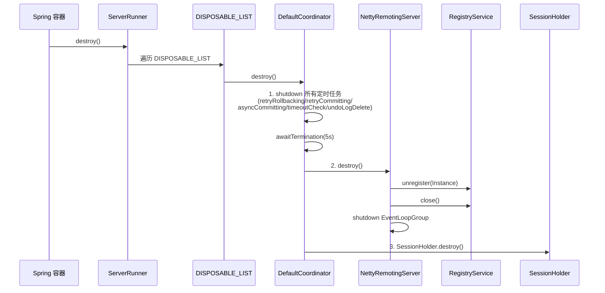
```mermaid
sequenceDiagram
    participant Spring as Spring 容器
    participant Runner as ServerRunner
    participant List as DISPOSABLE_LIST
    participant Coord as DefaultCoordinator
    participant Netty as NettyRemotingServer
    participant Reg as RegistryService
    participant SH as SessionHolder

    Spring->>Runner: destroy()
    Runner->>List: 遍历 DISPOSABLE_LIST
    List->>Coord: destroy()
    Coord->>Coord: 1. shutdown 所有定时任务<br/>(retryRollbacking/retryCommitting/<br/>asyncCommitting/timeoutCheck/undoLogDelete)
    Coord->>Coord: awaitTermination(5s)
    Coord->>Netty: 2. destroy()
    Netty->>Reg: unregister(Instance)
    Netty->>Reg: close()
    Netty->>Netty: shutdown EventLoopGroup
    Coord->>SH: 3. SessionHolder.destroy()
```

- **`ServerRunner.destroy()`**（行 80-93）：遍历 `DISPOSABLE_LIST` 依次调用 `disposable.destroy()`
- **`DefaultCoordinator.destroy()`**（行 816-845）：严格三步顺序
  1. 关闭所有定时任务线程池并 `awaitTermination`（最多 5s）
  2. 关闭 Netty（`NettyRemotingServer.destroy()` → `NettyServerBootstrap.shutdown()` 注销注册中心 + 关闭 EventLoopGroup）
  3. 销毁 `SessionHolder`（关闭数据源/连接池）
- **注册中心注销**：`NettyServerBootstrap.shutdown()`（行 214-229）遍历 `MultiRegistryFactory.getInstances()`，调用 `unregister` + `close`，然后 `sleep(serverShutdownWaitTime)` 等待在途请求处理完

> **注册顺序**：`Server.start()` 中通过 `ServerRunner.addDisposable(coordinator)` 将 coordinator 加入销毁列表（行 111），关闭时先关 coordinator（含 Netty），再关其他 Disposable。

---

## 十、通信架构

### 10.1 通信框架

基于 **Netty** 实现 TCP 长连接 RPC，核心位于 `core/src/main/java/org/apache/seata/core/rpc/netty/`。

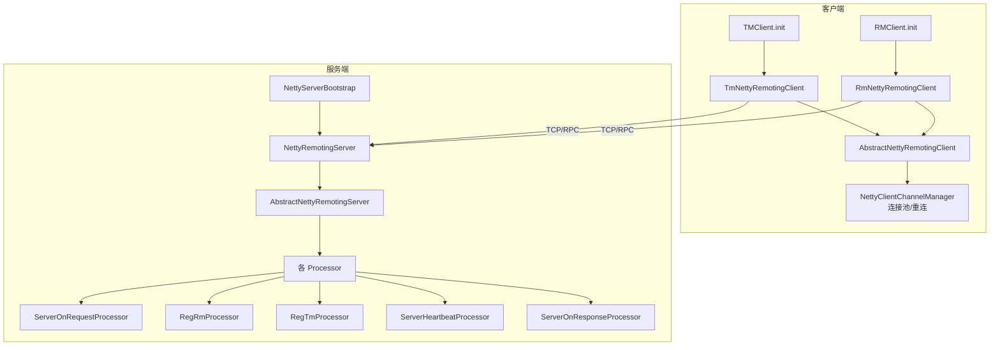
```mermaid
graph TB
    subgraph 客户端
        TMClient[TMClient.init] --> TNRC[TmNettyRemotingClient]
        RMClient[RMClient.init] --> RNRC[RmNettyRemotingClient]
        TNRC --> AbstractClient[AbstractNettyRemotingClient]
        RNRC --> AbstractClient
        AbstractClient --> ChannelMgr[NettyClientChannelManager<br/>连接池/重连]
    end

    subgraph 服务端
        Bootstrap[NettyServerBootstrap] --> NRServer[NettyRemotingServer]
        NRServer --> AbstractServer[AbstractNettyRemotingServer]
        AbstractServer --> Processors[各 Processor]
        Processors --> P1[ServerOnRequestProcessor]
        Processors --> P2[RegRmProcessor]
        Processors --> P3[RegTmProcessor]
        Processors --> P4[ServerHeartbeatProcessor]
        Processors --> P5[ServerOnResponseProcessor]
    end

    TNRC -->|"TCP/RPC"| NRServer
    RNRC -->|"TCP/RPC"| NRServer
```

### 10.2 协议设计

Seata 自定义二进制协议（V1），魔数 `0xDABB`：

```
0        4        8    9    10       14       16       18       20             24
+--------+--------+----+----+--------+--------+--------+--------+-------------+
| magic  | proto  | full length  | head   | msg    | seria   | compr  | request id  |
| code   | ver    | (head+body)  | length | type   | lizer  | essor  |             |
| 0xDABB |        |              |        |        |        |        |             |
+--------+--------+--------------+--------+--------+--------+--------+-------------+
|                              Head Map [可选]                                  |
+--------+--------+--------------+--------+--------+--------+--------+-------------+
|                                   body                                        |
+--------+--------+--------------+--------+--------+--------+--------+-------------+
```

| 字段 | 说明 |
|------|------|
| magic code | 0xDABB，协议标识 |
| protocol version | 协议版本（当前 1） |
| full length | 总长度（头+体） |
| head length | 头部长度 |
| message type | 消息类型（请求/响应/心跳） |
| serializer | 序列化算法编号 |
| compressor | 压缩算法编号 |
| request id | 请求唯一标识 |
| head map | 可选扩展头 |
| body | 消息体 |

编解码：`ProtocolDecoderV1`、`ProtocolEncoderV1`（`core/.../rpc/netty/v1/`）。基于 `LengthFieldBasedFrameDecoder` 处理粘包/拆包。

### 10.3 消息类型

| 请求消息 | 响应消息 | 说明 |
|----------|----------|------|
| `RegisterTMRequest` | `RegisterTMResponse` | TM 注册 |
| `RegisterRMRequest` | `RegisterRMResponse` | RM 注册 |
| `GlobalBeginRequest` | `GlobalBeginResponse` | 开启全局事务 |
| `GlobalCommitRequest` | `GlobalCommitResponse` | 提交全局事务 |
| `GlobalRollbackRequest` | `GlobalRollbackResponse` | 回滚全局事务 |
| `GlobalStatusRequest` | `GlobalStatusResponse` | 查询状态 |
| `GlobalReportRequest` | `GlobalReportResponse` | 状态上报 |
| `BranchRegisterRequest` | `BranchRegisterResponse` | 注册分支 |
| `BranchReportRequest` | `BranchReportResponse` | 分支状态上报 |
| `BranchCommitRequest` | `BranchCommitResponse` | 分支提交（TC->RM） |
| `BranchRollbackRequest` | `BranchRollbackResponse` | 分支回滚（TC->RM） |
| `GlobalLockQueryRequest` | `GlobalLockQueryResponse` | 全局锁查询 |
| `HeartbeatMessage` | `HeartbeatMessage` | 心跳（PING/PONG） |
| `MergedWarpMessage` | `MergeResultMessage` | 批量合并消息 |

### 10.4 服务端 Processor 注册

```java
// 业务请求统一处理器
ServerOnRequestProcessor onRequestProcessor = new ServerOnRequestProcessor(this, getHandler());
registerProcessor(TYPE_BRANCH_REGISTER, onRequestProcessor, messageExecutor);
registerProcessor(TYPE_GLOBAL_BEGIN, onRequestProcessor, messageExecutor);
registerProcessor(TYPE_GLOBAL_COMMIT, onRequestProcessor, messageExecutor);
registerProcessor(TYPE_GLOBAL_ROLLBACK, onRequestProcessor, messageExecutor);
// ... 其他业务请求

// 分支结果（TC 驱动 RM 后，RM 回报结果）
ServerOnResponseProcessor onResponseProcessor = new ServerOnResponseProcessor(...);
registerProcessor(TYPE_BRANCH_COMMIT_RESULT, onResponseProcessor, branchResultMessageExecutor);
registerProcessor(TYPE_BRANCH_ROLLBACK_RESULT, onResponseProcessor, branchResultMessageExecutor);

// 注册处理器
registerProcessor(TYPE_REG_RM, new RegRmProcessor(this), messageExecutor);
registerProcessor(TYPE_REG_CLT, new RegTmProcessor(this), null);
// 心跳
registerProcessor(TYPE_HEARTBEAT_MSG, new ServerHeartbeatProcessor(this), null);
```

### 10.5 客户端初始化

```java
// TMClient.init
TmNettyRemotingClient client = TmNettyRemotingClient.getInstance(applicationId, transactionServiceGroup);
client.init();

// RMClient.init
RmNettyRemotingClient client = RmNettyRemotingClient.getInstance(applicationId, transactionServiceGroup);
client.setResourceManager(DefaultResourceManager.get());
client.setTransactionMessageHandler(DefaultRMHandler.get());
client.init();
```

### 10.6 心跳与重连

- **心跳**：通过 Netty `IdleStateHandler` 检测空闲，超时发送 PING，再超时关闭连接。
- **重连**：`NettyClientChannelManager` 定时任务定期获取可用地址列表，对断连的 channel 重连。
- **批量合并**：客户端 `MergedWarpMessage` 将多个请求合并发送，降低 RPC 次数（`MergeResultMessage` 返回批量结果）。

---

## 十一、NamingServer 命名服务

NamingServer 是 Seata 2.x 引入的**独立命名服务**（`namingserver` 模块），用于 TC 集群的服务发现、地址推送、vgroup 到集群的映射管理，替代早期版本依赖 Nacos/Eureka 等外部注册中心的方式。

### 11.1 核心职责

1. **TC 注册**：TC Server 启动时向 NamingServer 注册自身节点信息（namespace/cluster/unit/host:port）。
2. **服务发现**：客户端根据 vgroup 从 NamingServer 拉取对应的 TC 地址列表。
3. **变更推送**：基于**长轮询（Long Polling）**实时推送集群变更，客户端感知 TC 上下线。
4. **vgroup 映射管理**：维护 vgroup -> cluster 的映射，支持动态变更。

### 11.2 核心 API

`NamingController`（`namingserver/src/main/java/org/apache/seata/namingserver/controller/NamingController.java`）提供 RESTful API：

| 接口 | 方法 | 说明 |
|------|------|------|
| `/naming/v1/register` | POST | TC 节点注册（namespace, clusterName, unit, NamingServerNode） |
| `/naming/v1/batchRegister` | POST | 批量注册 |
| `/naming/v1/unregister` | POST | 注销节点 |
| `/naming/v1/discovery` | GET | 服务发现（vGroup + namespace -> MetaResponse） |
| `/naming/v1/addGroup` | POST | 添加 vgroup 到集群映射 |
| `/naming/v1/changeGroup` | POST | 修改 vgroup 映射 |
| `/naming/v1/clusters` | GET | 监控集群列表 |
| `/naming/v1/clusterData` | GET | 获取集群数据 |
| `/naming/v1/namespace` | GET | 获取命名空间 |
| `/naming/v1/watch` | POST | **长轮询订阅** vgroup 变更 |
| `/naming/v1/watchList` | GET | 监听列表 |

### 11.3 NamingManager 核心数据结构

`NamingManager`（`namingserver/src/main/java/org/apache/seata/namingserver/manager/NamingManager.java`）：

```java
@Component
public class NamingManager {
    // 实例存活表（地址 -> 最后心跳时间）
    private final ConcurrentMap<InetSocketAddress, Long> instanceLiveTable;
    // vGroup -> namespace -> NamespaceBO（使用 Caffeine 缓存）
    private volatile LoadingCache<String, ConcurrentMap<String, NamespaceBO>> vGroupMap;
    // namespace -> clusterName -> ClusterData
    private final ConcurrentMap<String, ConcurrentMap<String, ClusterData>> namespaceClusterDataMap;

    @Value("${heartbeat.threshold:90000}")
    private int heartbeatTimeThreshold;       // 心跳阈值 90s
    @Value("${heartbeat.period:60000}")
    private int heartbeatCheckTimePeriod;      // 检查周期 60s
}
```

### 11.4 长轮询推送机制

`ClusterWatcherManager`（`namingserver/.../manager/ClusterWatcherManager.java`）实现基于 AsyncContext 的长轮询：

```java
@Component
public class ClusterWatcherManager implements ClusterChangeListener {
    // 每个 vgroup 的 watcher 队列
    private static final Map<String, Queue<Watcher<?>>> WATCHERS = new ConcurrentHashMap<>();
    // 每个 vgroup 的更新版本号（term）
    private static final Map<String, Long> GROUP_UPDATE_TERM = new ConcurrentHashMap<>();

    @PostConstruct
    public void init() {
        // 每秒检查超时的 watcher
        scheduledThreadPoolExecutor.scheduleAtFixedRate(() -> {
            for (String group : WATCHERS.keySet()) {
                Optional.ofNullable(WATCHERS.remove(group))
                    .ifPresent(watchers -> watchers.parallelStream().forEach(watcher -> {
                        if (System.currentTimeMillis() >= watcher.getTimeout()) {
                            notify(watcher, HttpStatus.NOT_MODIFIED.value());  // 超时返回 304
                        }
                        if (!watcher.isDone()) { registryWatcher(watcher); }   // 重新挂起
                    }));
            }
        }, 1, 1, TimeUnit.SECONDS);
    }

    @EventListener @Async
    public void onChangeEvent(ClusterChangeEvent event) {
        if (event.getTerm() > 0 || event.getTerm() == -1) {
            GROUP_UPDATE_TERM.put(event.getGroup(), event.getTerm());
            // 集群变更，通知所有 watcher
            Optional.ofNullable(WATCHERS.remove(event.getGroup()))
                .ifPresent(watchers -> watchers.parallelStream().forEach(this::notify));
        }
    }
}
```

### 11.5 NamingServer 工作流程

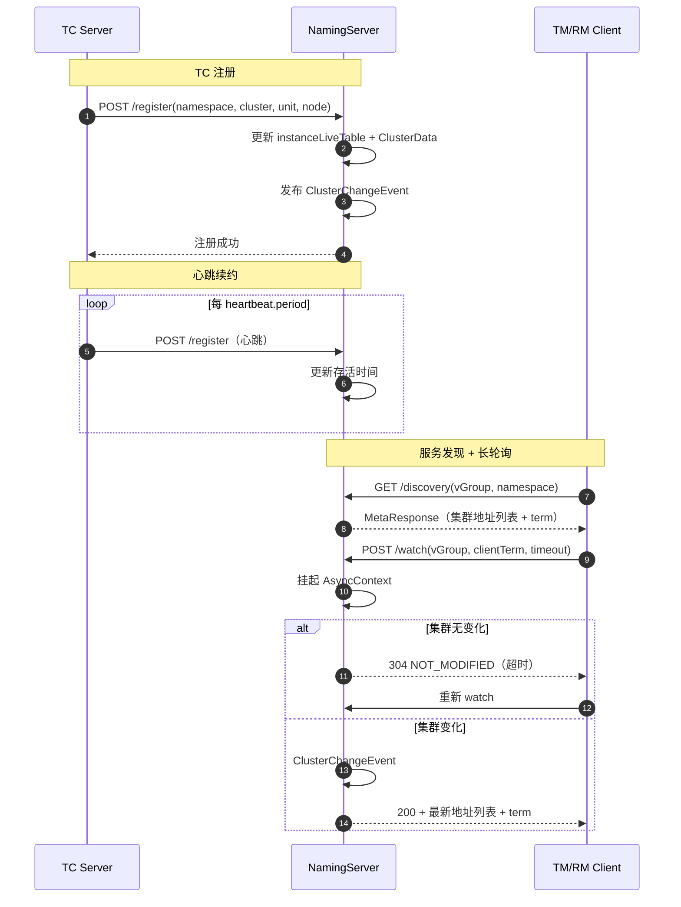
```mermaid
sequenceDiagram
    autonumber
    participant TC as TC Server
    participant NS as NamingServer
    participant Client as TM/RM Client

    Note over TC,NS: TC 注册
    TC->>NS: POST /register(namespace, cluster, unit, node)
    NS->>NS: 更新 instanceLiveTable + ClusterData
    NS->>NS: 发布 ClusterChangeEvent
    NS-->>TC: 注册成功

    Note over TC,NS: 心跳续约
    loop 每 heartbeat.period
        TC->>NS: POST /register（心跳）
        NS->>NS: 更新存活时间
    end

    Note over Client,NS: 服务发现 + 长轮询
    Client->>NS: GET /discovery(vGroup, namespace)
    NS-->>Client: MetaResponse（集群地址列表 + term）
    Client->>NS: POST /watch(vGroup, clientTerm, timeout)
    NS->>NS: 挂起 AsyncContext
    alt 集群无变化
        NS-->>Client: 304 NOT_MODIFIED（超时）
        Client->>NS: 重新 watch
    else 集群变化
        NS->>NS: ClusterChangeEvent
        NS-->>Client: 200 + 最新地址列表 + term
    end
```

### 11.6 推送与版本号

- **term（版本号）**：每次集群变更 term 递增。客户端持有 clientTerm，与服务端 term 比较，相同则无需更新。
- **增量推送**：仅当 term 变化时推送完整地址列表，避免重复推送。
- **心跳检查**：NamingServer 定时清理超过 `heartbeat.threshold`（默认 90s）未续约的 TC 节点。

---

## 十二、配置管理

### 12.1 配置中心抽象

`Configuration` 接口（`config/src/main/java/org/apache/seata/config/Configuration.java`）是配置中心的顶层抽象，支持多配置源：

| 实现 | 模块 | 说明 |
|------|------|------|
| `FileConfiguration` | `config/seata-config-core` | 本地文件（registry.conf/application.yml） |
| `NacosConfiguration` | `config/seata-config-nacos` | Nacos 配置中心 |
| `ApolloConfiguration` | `config/seata-config-apollo` | Apollo |
| `EtcdConfiguration` | `config/seata-config-etcd3` | Etcd3 |
| `ConsulConfiguration` | `config/seata-config-consul` | Consul |
| `ZooKeeperConfiguration` | `config/seata-config-zk` | ZooKeeper |
| `SpringCloudConfigConfiguration` | `config/seata-config-spring-cloud` | Spring Cloud Config |

### 12.2 配置工厂与缓存

- `ConfigurationFactory`：单例工厂，根据 `registry.conf` 中 `config.type` 加载对应实现，并通过 `ExtConfigurationProvider` 支持扩展。
- `ConfigurationCache`：包装 `Configuration`，缓存配置项，减少对外部配置中心的访问。
- `ConfigurationChangeListener`/`ConfigurationChangeEvent`：配置变更监听，实现动态刷新。

### 12.3 配置加载优先级

```
启动参数 > 环境变量 > application.yml > 配置中心 > registry.conf > 默认值
```

### 12.4 配置分类

| 前缀 | 说明 |
|------|------|
| `transport.*` | 传输层（线程、超时、序列化） |
| `service.*` | 服务（vgroupMapping、grouplist） |
| `client.*` | 客户端（rm、tm、lock、undo） |
| `server.*` | 服务端（recovery、maxCommitRetryTimeout） |
| `store.*` | 存储（mode、db、redis、file） |
| `metrics.*` | 监控 |
| `seata.*` | SpringBoot 自动配置前缀 |

### 12.5 SpringBoot 自动配置

`seata-spring-autoconfigure` 模块提供 Properties 绑定，分为三个子模块：
- `seata-spring-autoconfigure-core`：`ConfigProperties`（各配置中心）、`RegistryProperties`（各注册中心）、`LogProperties`
- `seata-spring-autoconfigure-client`：`SeataProperties`、`TmProperties`、`RmProperties`、`ServiceProperties`、`LockProperties`、`UndoProperties`、`LoadBalanceProperties`、`SeataSpringFenceAutoConfiguration`、`SpringCloudAlibabaConfiguration`
- `seata-spring-autoconfigure-server`：服务端配置

---

## 十三、事务分组实现原理

### 13.1 核心概念

| 概念 | 说明 |
|------|------|
| **transaction-service-group**（vgroup） | 事务服务组，客户端与 TC 集群的**逻辑分组**，是客户端路由的依据 |
| **cluster** | 物理集群名称，对应实际部署的 TC 集群 |
| **vgroupMapping** | 配置前缀，将 vgroup 映射到 cluster |
| **grouplist** | cluster 下的 TC 服务器地址列表 |

### 13.2 配置示例

```properties
# 事务服务组 -> 物理集群
service.vgroupMapping.my_test_tx_group=default
service.vgroupMapping.order_tx_group=order-cluster
# 物理集群 -> TC 地址列表
service.default.grouplist=127.0.0.1:8091,127.0.0.1:8092
service.order-cluster.grouplist=10.0.0.1:8091
```

### 13.3 地址解析流程

```mermaid
sequenceDiagram
    autonumber
    participant Client as TM/RM Client
    participant Conf as Configuration
    participant Reg as RegistryService
    participant LB as LoadBalance
    participant TC as TC Server

    Client->>Conf: getConfig(service.vgroupMapping.{vgroup})
    Conf-->>Client: clusterName
    Client->>Reg: lookup(clusterName)
    alt 使用 NamingServer
        Reg->>Reg: 向 NamingServer 拉取地址
    else 使用注册中心（Nacos/ZK等）
        Reg->>Reg: 从注册中心订阅
    else 使用 grouplist 配置
        Reg->>Reg: 解析 service.{cluster}.grouplist
    end
    Reg-->>Client: List<InetSocketAddress>
    Client->>LB: select(addressList, xid)
    LB-->>Client: 选中的 TC 地址
    Client->>TC: 建立 Netty 长连接
```

### 13.4 核心类

| 类 | 路径 | 职责 |
|----|------|------|
| `TMClient` | `tm/src/main/java/org/apache/seata/tm/TMClient.java` | TM 入口 |
| `RMClient` | `rm/src/main/java/org/apache/seata/rm/RMClient.java` | RM 入口 |
| `TmNettyRemotingClient` | `core/.../rpc/netty/TmNettyRemotingClient.java` | TM Netty 客户端 |
| `RmNettyRemotingClient` | `core/.../rpc/netty/RmNettyRemotingClient.java` | RM Netty 客户端 |
| `NettyClientChannelManager` | `core/.../rpc/netty/NettyClientChannelManager.java` | 通道管理、连接池、重连 |
| `RegistryFactory` | `discovery/seata-discovery-core/.../RegistryFactory.java` | 注册中心工厂 |
| `RegistryService` | `discovery/seata-discovery-core/.../RegistryService.java` | 注册中心接口 |
| `LoadBalanceFactory` | `discovery/seata-discovery-core/.../loadbalance/LoadBalanceFactory.java` | 负载均衡工厂 |

### 13.5 RegistryService 接口

```java
public interface RegistryService<T> {
    String PREFIX_SERVICE_MAPPING = "vgroupMapping.";
    void register(InetSocketAddress address) throws Exception;
    void unregister(InetSocketAddress address) throws Exception;
    void subscribe(String cluster, T listener) throws Exception;
    void unsubscribe(String cluster, T listener) throws Exception;
    List<InetSocketAddress> lookup(String key) throws Exception;

    // vgroup -> cluster 名解析
    default String getServiceGroup(String key) {
        key = PREFIX_SERVICE_ROOT + CONFIG_SPLIT_CHAR + PREFIX_SERVICE_MAPPING + key;
        return ConfigurationFactory.getInstance().getConfig(key);
    }
    // 活跃地址缓存（按 vgroup + cluster）
    default List<InetSocketAddress> aliveLookup(String transactionServiceGroup) {...}
    default List<InetSocketAddress> refreshAliveLookup(...) {...}
}
```

### 13.6 负载均衡策略

| 实现 | 策略 |
|------|------|
| `RandomLoadBalance` | 随机（默认） |
| `RoundRobinLoadBalance` | 轮询 |
| `ConsistentHashLoadBalance` | 一致性哈希 |
| `LeastActiveLoadBalance` | 最少活跃连接 |
| `XIDLoadBalance` | 基于 XID 哈希（同一全局事务路由到同一 TC，利于本地缓存） |

### 13.7 多机房多集群设计

```properties
# 杭州机房
service.vgroupMapping.tx_group_hz=hz-cluster
service.hz-cluster.grouplist=10.1.0.1:8091,10.1.0.2:8091

# 上海机房
service.vgroupMapping.tx_group_sh=sh-cluster
service.sh-cluster.grouplist=10.2.0.1:8091,10.2.0.2:8091
```

应用根据部署机房选择对应 vgroup，实现机房内闭环调用，降低跨机房延迟。

---

## 十四、高可用设计

### 14.1 TC 集群高可用

```mermaid
graph TB
    subgraph TC集群["TC 集群（无状态）"]
        TC1[TC Server 1]
        TC2[TC Server 2]
        TC3[TC Server N]
    end

    subgraph 存储层["共享存储（保证状态一致）"]
        DB[(DB 模式<br/>global_table/branch_table/lock_table)]
        Redis[(Redis 模式)]
        File[(File 模式<br/>本地存储，仅单机)]
        Raft[(Raft 模式<br/>多副本一致性)]
    end

    NS[NamingServer] --> TC1
    NS --> TC2
    NS --> TC3
    Client[TM/RM Client] --> NS
    TC1 --> DB
    TC2 --> DB
    TC3 --> DB
```

| 存储模式 | 一致性 | 适用场景 |
|----------|--------|----------|
| file | 单机，重启靠日志恢复 | 测试/单机 |
| db | 强一致（数据库） | 生产，依赖外部 DB |
| redis | 最终一致（高性能） | 生产，追求性能 |
| raft | 强一致（Raft 共识） | 生产，无外部依赖 |

### 14.2 客户端故障处理

- **连接断开**：`NettyClientChannelManager` 定时任务检测断连，重新从注册中心获取地址列表并重连。
- **自动切换**：当前 TC 故障时，负载均衡选择下一个可用 TC。
- **重试**：TM 的 commit/rollback 内置重试（`CLIENT_TM_COMMIT_RETRY_COUNT`）。

### 14.3 全局事务恢复机制

TC 启动后通过定时任务恢复异常事务（核心在 `DefaultCoordinator`）：

| 任务 | 处理的状态 | 说明 |
|------|-----------|------|
| `timeoutCheck` | `Begin` | 超时事务变更为 `TimeoutRollbacking`，触发回滚 |
| `handleRetryRollbacking` | `RollbackRetrying`/`TimeoutRollbacking`/`TimeoutRollbackRetrying` | 重试回滚，超过 `maxRollbackRetryTimeout` 标记失败 |
| `handleRetryCommitting` | `CommitRetrying`/`AsyncCommitting` | 重试提交，超过 `maxCommitRetryTimeout` 标记失败 |
| `handleAsyncCommitting` | `AsyncCommitting` | 异步驱动 RM 删除 undo_log |
| `undoLogDelete` | - | 定期清理过期 undo_log |

关键代码（`DefaultCoordinator`）：

```java
// 超时检查（行 406）
protected void timeoutCheck() {
    SessionCondition cond = new SessionCondition(GlobalStatus.Begin);
    cond.setLazyLoadBranch(true);
    Collection<GlobalSession> sessions = SessionHolder.getRootSessionManager().findGlobalSessions(cond);
    SessionHelper.forEach(sessions, gs -> SessionHolder.lockAndExecute(gs, () -> {
        if (gs.getStatus() != GlobalStatus.Begin || !gs.isTimeout()) return false;
        gs.close();
        gs.changeGlobalStatus(GlobalStatus.TimeoutRollbacking);
        MetricsPublisher.postSessionDoingEvent(gs, GlobalStatus.TimeoutRollbacking.name(), false, false);
        return true;
    }));
}

// 重试回滚（行 451）
protected void handleRetryRollbacking() {
    Collection<GlobalSession> sessions = SessionHolder.getRootSessionManager()
        .findGlobalSessions(new SessionCondition(retryRollbackingStatuses));
    SessionHelper.forEach(sessions, rs -> {
        if (isRetryTimeout(now, MAX_ROLLBACK_RETRY_TIMEOUT, rs.getBeginTime())) {
            rs.clean();
            SessionHelper.endRollbackFailed(rs, true, true);
            return;
        }
        core.doGlobalRollback(rs, true);
    });
}
```

所有任务通过 `SessionHolder.distributedLockAndExecute(name, task)` 获取分布式锁，保证集群内只有一个 TC 节点执行，避免重复处理。

### 14.4 分布式锁

`DistributedLocker`（`server/.../lock/distributed/`）保证集群内任务互斥：

| 实现 | 说明 |
|------|------|
| `DataBaseDistributedLocker` | DB 表 `distributed_lock` |
| `RedisDistributedLocker` | Redis SETNX |
| `RaftDistributedLocker` | Raft Leader 串行化 |

### 14.5 Raft 模式高可用

Seata 使用 **SOFAJRaft**（`com.alipay.sofa.jraft`）实现 Raft 共识，确保多副本强一致：

| 类 | 路径 | 职责 |
|----|------|------|
| `RaftServer` | `server/.../cluster/raft/RaftServer.java` | Raft 服务器 |
| `RaftServerManager` | `server/.../cluster/raft/RaftServerManager.java` | 管理多个 Raft 组 |
| `RaftStateMachine` | `server/.../cluster/raft/RaftStateMachine.java` | 状态机，处理日志应用、快照 |

`RaftStateMachine` 继承 `StateMachineAdapter`，通过 `RaftMsgExecute` 体系应用日志：

```mermaid
graph LR
    Client[Client 请求] --> Leader[Leader TC]
    Leader -->|复制日志| Follower1[Follower TC]
    Leader -->|复制日志| Follower2[Follower TC]
    Follower1 -->|apply| SM1[RaftStateMachine]
    Follower2 -->|apply| SM2[RaftStateMachine]
    SM1 --> Exec1[AddGlobalSessionExecute<br/>RemoveBranchSessionExecute<br/>GlobalReleaseLockExecute<br/>VGroupAddExecute ...]
```

Raft 模式特点：
1. **Leader 串行化**：所有写请求经 Leader，天然串行，无需分布式锁。
2. **日志复制**：session/branch/lock/vgroup 变更通过 Raft 日志复制到所有副本。
3. **快照**：`SessionSnapshotFile`、`StoreSnapshotFile`、`LeaderMetadataSnapshotFile` 实现快照加速恢复。
4. **Leader 切换**：Leader 故障自动选举新 Leader，客户端通过 NamingServer 感知。

### 14.6 Session 持久化与恢复

`TransactionStoreManager` 接口（`server/.../store/TransactionStoreManager.java`）定义 session 的读写：

```java
public interface TransactionStoreManager {
    boolean writeSession(LogOperation logOperation, SessionStorable session);
    GlobalSession readSession(String xid);
    List<GlobalSession> readSession(GlobalStatus[] statuses, boolean withBranchSessions);
    List<GlobalSession> readSession(SessionCondition sessionCondition);
    List<GlobalSession> readSortByTimeoutBeginSessions(boolean withBranchSessions);
    void shutdown();

    enum LogOperation {
        GLOBAL_ADD, GLOBAL_UPDATE, GLOBAL_REMOVE,
        BRANCH_ADD, BRANCH_UPDATE, BRANCH_REMOVE
    }
}
```

TC 启动时通过 `readSession` 从存储加载所有未完成事务到内存，恢复协调状态。

---

## 十五、框架整合

### 15.1 SpringBoot 整合

```mermaid
flowchart TD
    A[添加 seata-spring-boot-starter 依赖] --> B[SpringBoot 启动]
    B --> C[加载 spring.factories]
    C --> D[SeataAutoConfiguration]
    C --> E[SeataDataSourceAutoConfiguration]
    C --> F[SeataHttpAutoConfiguration]
    C --> G[SeataSagaAutoConfiguration]
    D --> H[创建 GlobalTransactionScanner]
    E --> I[创建 SeataAutoDataSourceProxyCreator]
    H --> J[初始化 TMClient/RMClient]
    H --> K[扫描 @GlobalTransactional 注解<br/>创建 AOP 代理]
    I --> L[代理 DataSource -> DataSourceProxy]
```

#### SeataAutoConfiguration

`seata-spring-boot-starter` 的 `META-INF/spring.factories`：

```properties
org.springframework.boot.autoconfigure.EnableAutoConfiguration=\
  org.apache.seata.spring.boot.autoconfigure.SeataAutoConfiguration,\
  org.apache.seata.spring.boot.autoconfigure.SeataDataSourceAutoConfiguration,\
  org.apache.seata.spring.boot.autoconfigure.SeataHttpAutoConfiguration,\
  org.apache.seata.spring.boot.autoconfigure.SeataSagaAutoConfiguration
```

`SeataAutoConfiguration` 创建 `GlobalTransactionScanner` Bean，并注入失败处理器。

### 15.2 GlobalTransactionScanner

`spring/src/main/java/org/apache/seata/spring/annotation/GlobalTransactionScanner.java` 继承 Spring `AbstractAutoProxyCreator`：

```java
public class GlobalTransactionScanner extends AbstractAutoProxyCreator
        implements CachedConfigurationChangeListener, InitializingBean, ApplicationContextAware, DisposableBean {

    @Override
    protected Object wrapIfNecessary(Object bean, String beanName, Object cacheKey) {
        if (!doCheckers(bean, beanName)) return bean;
        // 解析需要代理的接口
        ProxyInvocationHandler handler = DefaultInterfaceParser.get().parserInterfaceToProxy(bean, beanName);
        if (handler == null) return bean;
        // 创建 Seata 拦截器适配 Spring AOP
        interceptor = new AdapterSpringSeataInterceptor(handler);
        return super.wrapIfNecessary(bean, beanName, cacheKey);
    }

    @Override
    public void afterPropertiesSet() {
        // 初始化 TMClient 和 RMClient
        if (isEnabled()) {
            TMClient.init(applicationId, txServiceGroup);
            RMClient.init(applicationId, txServiceGroup);
        }
    }
}
```

它扫描带 `@GlobalTransactional`、`@GlobalLock`、`@TwoPhaseBusinessAction` 的 Bean，创建代理并织入对应拦截器。

### 15.3 注解拦截

| 注解 | 拦截器 | 处理 |
|------|--------|------|
| `@GlobalTransactional` | `GlobalTransactionalInterceptorHandler` | 开启/提交/回滚全局事务 |
| `@GlobalLock` | 同上 | 仅申请全局锁，不开全局事务 |
| `@TwoPhaseBusinessAction` | `TccActionInterceptorHandler` | TCC Try 注册分支 |
| `@GlobalTransactional` + `@CompensationBusinessAction` | Saga 拦截器 | Saga 分支 |

`GlobalTransactionalInterceptorHandler`（`integration-tx-api/.../interceptor/handler/`）：

```java
@Override
protected Object doInvoke(InvocationWrapper invocation) throws Throwable {
    AspectTransactional ann = getAspectTransactional(method, targetClass);
    GlobalLockConfig lockAnn = getGlobalLockConfig(method, targetClass);
    if (ann != null) {
        return handleGlobalTransaction(invocation, ann);  // 使用 TransactionalTemplate
    } else if (lockAnn != null) {
        return handleGlobalLock(invocation, lockAnn);     // 使用 GlobalLockTemplate
    }
    return invocation.proceed();
}
```

`handleGlobalTransaction` 内部使用 `TransactionalTemplate`（模板方法）：

```java
// TransactionalTemplate.execute
try {
    tx = GlobalTransactionContext.getCurrentOrCreate();
    tx.begin(timeout, name);          // 开启
    Object result = business.execute(); // 业务
    tx.commit();                        // 提交
    return result;
} catch (Throwable ex) {
    tx.rollback();                      // 回滚
    throw ex;
}
```

### 15.4 数据源自动代理

`SeataAutoDataSourceProxyCreator`（`spring/.../annotation/datasource/`）继承 `AbstractAutoProxyCreator`：

```java
@Override
protected Object wrapIfNecessary(Object bean, String beanName, Object cacheKey) {
    if (!(bean instanceof DataSource) || isAbstractRoutingDataSource(bean)) return bean;
    if (!(bean instanceof SeataDataSourceProxy)) {
        Object enhancer = super.wrapIfNecessary(bean, beanName, cacheKey);
        SeataDataSourceProxy proxy = buildProxy((DataSource) bean, dataSourceProxyMode);
        DataSourceProxyHolder.put((DataSource) bean, proxy);  // 保存映射
        return enhancer;
    }
    return bean;
}
```

`DataSourceProxyHolder` 维护原始 DataSource 与代理的映射，支持 AT（`DataSourceProxy`）和 XA（`DataSourceProxyXA`）两种模式，通过 `seata.data-source-proxy-mode` 配置切换。

### 15.5 XID 跨服务传递

```mermaid
sequenceDiagram
    autonumber
    participant A as 服务A（事务发起）
    participant RC as RootContext
    participant RPC as RPC 框架
    participant B as 服务B（事务参与）

    A->>RC: getXID()
    RC-->>A: xid
    A->>RPC: 调用，附件携带 xid
    RPC->>RPC: 网络传输
    RPC->>B: 接收，附件中取出 xid
    B->>RC: bind(xid)
    B->>B: 执行业务（同 xid）
    B->>RC: unbind()（请求结束清理）
```

#### 事务上下文 RootContext

`core/src/main/java/org/apache/seata/core/context/RootContext.java`：

```java
public class RootContext {
    public static final String KEY_XID = "TX_XID";
    public static final String KEY_BRANCH_TYPE = "TX_BRANCH_TYPE";
    public static final String KEY_GLOBAL_LOCK_FLAG = "TX_LOCK";
    public static final String MDC_KEY_XID = "X-TX-XID";        // logback MDC
    public static final String MDC_KEY_BRANCH_ID = "X-TX-BRANCH-ID";
    public static final String HIDDEN_KEY_XID = "_TX_XID";       // sofa-rpc 隐藏 key

    private static ContextCore CONTEXT_HOLDER = ContextCoreLoader.load();  // ThreadLocal

    public static void bind(String xid) {
        MDC.put(MDC_KEY_XID, xid);
        CONTEXT_HOLDER.put(KEY_XID, xid);
    }
}
```

#### 各 RPC 框架传递机制

| 框架 | 模块 | 传递载体 | 消费端 Filter | 服务端 Filter |
|------|------|----------|---------------|---------------|
| Alibaba Dubbo | `extensions/rpc/seata-dubbo-alibaba` | `RpcContext.attachment` | `AlibabaDubboTransactionConsumerFilter` | `AlibabaDubboTransactionProviderFilter` |
| Apache Dubbo | `extensions/rpc/seata-dubbo-apache` | `RpcContext.attachment` | `ApacheDubboTransactionConsumerFilter` | `ApacheDubboTransactionProviderFilter` |
| SpringCloud | `extensions/rpc/seata-rpc-springcloud` | HTTP Header（`TX_XID`） | `SeataRestTemplateInterceptor` | `SeataHandlerInterceptor` |
| Sofa-RPC | `extensions/rpc/seata-rpc-sofa` | 隐式参数（`_TX_XID`） | `SofaRpcTransactionConsumerFilter` | `SofaRpcTransactionProviderFilter` |
| Motan | `extensions/rpc/seata-rpc-motan` | Motan Context | Consumer Filter | Provider Filter |
| gRPC | `extensions/rpc/seata-grpc` | Metadata | Client Interceptor | Server Interceptor |

Dubbo 消费端示例：

```java
private void propagateTransactionContext(String xid, BranchType branchType) {
    if (xid != null) {
        RpcContext.getContext().setAttachment(RootContext.KEY_XID, xid);
        RpcContext.getContext().setAttachment(RootContext.KEY_BRANCH_TYPE, branchType.name());
    }
}
```

服务端示例：

```java
private String getRpcXid() {
    String rpcXid = RpcContext.getContext().getAttachment(RootContext.KEY_XID);
    if (rpcXid == null) {
        rpcXid = RpcContext.getContext().getAttachment(RootContext.KEY_XID.toLowerCase());
    }
    return rpcXid;
}
```

---

## 十六、可观测性设计

### 16.1 metrics 架构

```mermaid
graph LR
    subgraph API层[metrics-api]
        Meter[Meter]
        Counter[Counter]
        Gauge[Gauge]
        Timer[Timer]
        Summary[Summary]
        Id[Id]
        Measurement[Measurement]
        Registry[Registry]
        Exporter[Exporter]
    end

    subgraph 实现层
        Compact[CompactRegistry<br/>CompactCounter/Gauge/Timer/Summary]
        Prom[PrometheusExporter]
    end

    subgraph 业务埋点
        ServerM[Server metrics<br/>事务数/分支数/锁]
        ClientM[Client metrics<br/>本地事务/RPC]
    end

    ServerM --> Compact
    ClientM --> Compact
    Compact --> Prom
    Prom --> PromServer[Prometheus HTTPServer]
```

### 16.2 核心 API

| 接口 | 路径 | 说明 |
|------|------|------|
| `Meter` | `metrics/seata-metrics-api/.../Meter.java` | 度量顶层接口 |
| `Counter` | `.../Counter.java` | 计数器（递增/递减） |
| `Gauge` | `.../Gauge.java` | 仪表盘（实时值） |
| `Timer` | `.../Timer.java` | 计时器（执行时长） |
| `Summary` | `.../Summary.java` | 摘要（总量/次数/TPS） |
| `Id` | `.../Id.java` | 度量标识（name + tags） |
| `Measurement` | `.../Measurement.java` | 单次度量值 |
| `Registry` | `.../registry/Registry.java` | 注册中心，管理各 Meter |
| `Exporter` | `.../exporter/Exporter.java` | 导出器接口 |

```java
public interface Registry {
    <T extends Number> Gauge<T> getGauge(Id id, Supplier<T> supplier);
    Counter getCounter(Id id);
    Summary getSummary(Id id);
    Timer getTimer(Id id);
    Iterable<Measurement> measure();
    void clearUp();
}
```

### 16.3 Prometheus 导出

`PrometheusExporter`（`metrics/seata-metrics-exporter-prometheus/`）继承 io.prometheus `Collector`：

```java
@LoadLevel(name = "prometheus", order = 1)
public class PrometheusExporter extends Collector implements Collector.Describable, Exporter {
    private final HTTPServer server;
    private Registry registry;

    public PrometheusExporter() throws IOException {
        int port = ConfigurationFactory.getInstance()
            .getInt(METRICS_PREFIX + METRICS_EXPORTER_PROMETHEUS_PORT, DEFAULT_PROMETHEUS_PORT);
        CollectorRegistry collectorRegistry = new CollectorRegistry(true);
        this.register(collectorRegistry);
        this.server = new HTTPServer(new InetSocketAddress(port), collectorRegistry, true);
    }

    @Override
    public List<MetricFamilySamples> collect() {
        List<MetricFamilySamples> result = new ArrayList<>();
        if (registry != null) {
            Iterable<Measurement> measurements = registry.measure();
            List<Sample> samples = new ArrayList<>();
            measurements.forEach(m -> samples.add(convertMeasurementToSample(m)));
            if (!samples.isEmpty()) {
                result.add(new MetricFamilySamples("seata", getUnknownType(), "seata", samples));
            }
        }
        return result;
    }
}
```

通过 `@LoadLevel` SPI 注解自动发现，启动 HTTPServer 暴露 `/metrics` 端点，Prometheus 定时拉取。

### 16.4 指标项

**Server 端**（`MetricsPublisher` 发布事件触发）：
- `seata.transaction`：全局事务总数、成功数、失败数、按状态分布
- `seata.branch`：分支事务统计
- `seata.lock`：全局锁获取次数、等待时间
- `seata.rpc`：RPC 调用统计

**Client 端**：
- 本地事务执行统计
- 数据源代理统计
- RPC 调用统计

### 16.5 日志与链路追踪

- **SLF4J**：统一日志门面。
- **MDC 链路**：`RootContext.bind(xid)` 时 `MDC.put("X-TX-XID", xid)`，logback pattern 中加入 `%X{X-TX-XID}` 即可打印事务 ID，实现全链路日志关联。
- **XID 作为 traceId**：XID 贯穿整个分布式事务，可作为链路追踪的唯一标识，便于与 OpenTelemetry、SkyWalking 等集成。
- `DefaultCoordinator` 处理请求时 `MDC.put(RootContext.MDC_KEY_XID, request.getXid())`。

### 16.6 Console 控制台

`console` 模块提供 Web 管理界面：
- 基于 **Spring Security + JWT** 认证（`JwtTokenUtils`、`JwtAuthenticationTokenFilter`、`CustomAuthenticationProvider`）
- `OverviewController`：总览全局事务、分支事务、锁
- `AuthController`：登录认证
- `ConsoleRemotingFilter`：远程调用过滤
- 内置 **MCP**（Model Context Protocol）相关功能（`console/src/main/java/org/apache/seata/mcp/`）

---

## 十七、其他底层实现设计

### 17.1 SPI 机制（EnhancedServiceLoader）

Seata 自实现了一套增强 SPI（`common/src/main/java/org/apache/seata/common/loader/EnhancedServiceLoader.java`），优于 Java 标准 SPI：

| 特性 | Java SPI | Seata EnhancedServiceLoader |
|------|----------|------------------------------|
| 按名加载 | 不支持 | 支持（`load(service, activateName)`） |
| 按优先级 | 不支持 | 支持（`@LoadLevel(order)`） |
| 注入参数 | 不支持 | 支持（构造器注入） |
| 缓存 | 不支持 | 支持（`InnerEnhancedServiceLoader` 缓存） |
| 兼容性 | - | 支持 `io.seata` 兼容包 |

通过 `META-INF/services/` + `@LoadLevel` 注解实现。Serializer、Compressor、RegistryService、LoadBalance、Exporter 等均通过它加载。

### 17.2 序列化器

`Serializer` 接口（`core/src/main/java/org/apache/seata/core/serializer/Serializer.java`）：

```java
public interface Serializer {
    <T> byte[] serialize(T t);
    <T> T deserialize(byte[] bytes);
}
```

`SerializerServiceLoader`（`core/.../serializer/SerializerServiceLoader.java`）管理多实现，默认优先级：

```
SEATA > PROTOBUF > KRYO > HESSIAN > FASTJSON2 > FURY > FORY
```

| 实现 | 模块 | 特点 |
|------|------|------|
| SEATA | `serializer/seata-serializer-seata` | 自研二进制，最高性能，默认 |
| PROTOBUF | `serializer/seata-serializer-protobuf` | 跨语言，需额外依赖 |
| KRYO | `serializer/seata-serializer-kryo` | 高性能 |
| HESSIAN | `serializer/seata-serializer-hessian` | 跨语言 |
| FASTJSON2 | `serializer/seata-serializer-fastjson2` | JSON |
| FORY | `serializer/seata-serializer-fory` | 新一代跨语言序列化 |

注：`fury` 为 `fory` 的别名（`SerializerServiceLoader` 中 `SERIALIZER_ALIAS_MAP.put("fury", "fory")`），因为 fury 已更名为 fory。

### 17.3 压缩器

`Compressor` 接口（`core/src/main/java/org/apache/seata/core/compressor/Compressor.java`）：

```java
public interface Compressor {
    byte[] compress(byte[] bytes);
    byte[] decompress(byte[] bytes);
}
```

支持：`gzip`、`bzip2`、`zip`、`lz4`、`zstd`、`deflater`（均位于 `compressor` 模块）。协议头中 `compressor` 字段标识使用的算法，适用于大消息体（如 undo_log）。

### 17.4 SQL 解析器

`sqlparser` 模块采用 **ANTLR** 实现，分两个子模块：
- `seata-sqlparser-core`：接口抽象（`SQLRecognizerFactory`、`SQLUpdateRecognizer`、`SQLDeleteRecognizer`、`SQLInsertRecognizer`、`EscapeHandler`）
- `seata-sqlparser-antlr`：ANTLR 实现，支持 MySQL、PostgreSQL、Oracle、SQLServer 等方言

解析流程：Lexer → Parser → Listener/Visitor → 提取表名/列名/where 条件/主键 → 供 AT 模式 Executor 生成镜像 SQL 和反向补偿 SQL。

### 17.5 锁管理器体系

```mermaid
graph TD
    LockManager[LockManager 接口]
    AbstractLockManager[AbstractLockManager]
    FileLM[FileLockManager<br/>file 模式]
    DBLM[DataBaseLockManager<br/>db 模式]
    RedisLM[RedisLockManager<br/>redis 模式]
    RaftLM[RaftLockManager<br/>raft 模式]

    LockManager --> AbstractLockManager
    AbstractLockManager --> FileLM
    AbstractLockManager --> DBLM
    AbstractLockManager --> RedisLM
    AbstractLockManager --> RaftLM

    DBLM --> DAO1[LockStoreDataBaseDAO]
    RedisLM --> DAO2[RedisLocker/RedisLuaLocker]
    LockerManagerFactory[LockerManagerFactory] --> LockManager
```

锁存储表 `lock_table`：`xid`、`transaction_id`、`resource_id`、`table_name`、`pk`、`status`、`branch_id`、`gmt_create`。

### 17.6 Session 存储模型

```mermaid
classDiagram
    class SessionStorable {
        <<interface>>
        +byte[] encode()
        +void decode(byte[])
    }
    class GlobalSession {
        +String xid
        +long transactionId
        +GlobalStatus status
        +String applicationId
        +String transactionServiceGroup
        +String transactionName
        +long timeout
        +long beginTime
        +List~BranchSession~ branchSessions
        +void add(BranchSession)
        +void changeGlobalStatus(GlobalStatus)
    }
    class BranchSession {
        +String xid
        +long branchId
        +BranchType branchType
        +String resourceId
        +String lockKey
        +BranchStatus status
        +String clientId
        +String applicationData
    }
    class SessionLifecycle
    class SessionManager

    SessionStorable <|.. GlobalSession
    SessionStorable <|.. BranchSession
    GlobalSession "1" --> "many" BranchSession
    SessionManager o-- GlobalSession
```

`GlobalSession`（`server/.../session/GlobalSession.java`）实现 `SessionLifecycle`、`SessionStorable`，包含：
- `RETRY_DEAD_THRESHOLD`：重试死亡阈值，超时后放弃重试
- `END_STATE_RETRY_DEAD_THRESHOLD`：终态重试死亡阈值
- `MAX_GLOBAL_SESSION_SIZE`：序列化 buffer 大小（默认 512b）

### 17.7 注册中心多实现

| 实现 | 模块 |
|------|------|
| File | `seata-discovery-core/FileRegistryServiceImpl` |
| Nacos | `seata-discovery-nacos` |
| Etcd3 | `seata-discovery-etcd3` |
| Consul | `seata-discovery-consul` |
| Eureka | `seata-discovery-eureka` |
| ZooKeeper | `seata-discovery-zk` |
| Sofa | `seata-discovery-sofa` |
| Custom | `seata-discovery-custom` |

`MultiRegistryFactory` 支持同时配置多个注册中心（逗号分隔）。

### 17.8 批量消息合并

为降低 RPC 次数，客户端（RM）支持将多个请求合并为一个 `MergedWarpMessage` 发送，服务端拆解后逐个处理，再通过 `MergeResultMessage` 批量返回。对应 `MergedWarpMessageConvertor`、`MergeResultMessageConvertor`（protobuf 模块）。

### 17.9 compatible 兼容模块

`compatible` 模块提供 `io.seata.*` 包名的兼容类（如 `io.seata.spring.annotation.GlobalTransactionScanner`），内部委托给 `org.apache.seata.*` 的真实实现，保证旧版本依赖 `io.seata` 的应用平滑升级到 2.x。

### 17.10 integration-tx-api 整合抽象层

`integration-tx-api` 模块是 Seata 与各框架整合的**抽象层**，定义与具体框架无关的接口：
- `ActionInterceptorHandler`：TCC/Saga 分支拦截处理
- `ProxyInvocationHandler`/`AbstractProxyInvocationHandler`：代理调用处理器
- `TransactionalTemplate`：全局事务模板
- `FenceHandler`/`CommonFenceStore`：TCC Fence 抽象
- `DefaultInterfaceParser`/`DefaultRemotingParser`：接口解析
- `SeataInterceptor`/`SeataInterceptorPosition`：拦截器位置定义

这样 Spring、Dubbo、Sofa 等不同框架只需提供各自的适配器，核心逻辑复用。

### 17.11 Server 限流

`server/src/main/java/org/apache/seata/server/limit/` 提供限流：
- `LimitRequestDecorator`：装饰 `AbstractTCInboundHandler`，对入站请求限流
- 基于令牌桶/信号量，防止 TC 过载

### 17.12 存储 DataSource 多池支持

`server/src/main/java/org/apache/seata/server/store/` 提供 DataSource Provider：
- `DruidDataSourceProvider`
- `HikariDataSourceProvider`
- `DbcpDataSourceProvider`

通过 `store.db.datasource` 配置切换。

---

## 十八、总结与对比

### 18.1 四种模式对比

| 维度 | AT | TCC | XA | SAGA |
|------|----|-----|----|------|
| **侵入性** | 无（代理） | 有（自定义三方法） | 无（代理） | 有（状态机定义） |
| **一致性** | 最终一致 | 最终一致 | 强一致 | 最终一致 |
| **性能** | 高 | 高 | 中（锁持有久） | 中 |
| **隔离性** | 默认 RC，需 `SELECT FOR UPDATE` | 业务层控制 | 数据库原生隔离 | 业务层控制 |
| **适用场景** | 一般业务 | 资源需自定义预留 | 强一致要求高 | 长流程事务 |
| **补偿** | 自动（undo_log） | 业务实现 | 数据库回滚 | 业务实现（状态机） |
| **异常控制** | 全局锁 | Fence 机制 | XA 协议 | 状态机补偿 |
| **复杂度** | 低 | 中 | 低 | 高 |

### 18.2 整体设计亮点

1. **三角色解耦**：TM/RM/TC 职责清晰，TC 作为无状态协调器可水平扩展。
2. **SPI 全栈可扩展**：序列化、压缩、注册中心、负载均衡、配置中心、metrics 全部 SPI 化。
3. **多存储模式**：file/db/redis/raft 满足不同一致性要求。
4. **NamingServer 长轮询**：自研命名服务，长轮询 + term 版本号实现实时推送与低开销。
5. **AT 无侵入**：数据源代理 + undo_log + 全局锁，业务零改造。
6. **TCC Fence**：解决空回滚/幂等/悬挂三大异常。
7. **Raft 强一致**：SOFAJRaft 赋能多副本强一致，无外部依赖。
8. **整合抽象层**：`integration-tx-api` 让多框架整合复用核心逻辑。
9. **可观测性**：metrics（Prometheus）+ MDC 日志链路 + Console 控制台。
10. **定时恢复**：超时检查/重试提交/重试回滚/异步提交/undo 清理，保障最终一致。

### 18.3 学习路径建议

```
core（协议/RPC/RootContext）
  → tm/rm（TM/RM 客户端）
    → server（DefaultCoordinator/Session/Lock）
      → AT（rm-datasource 代理/undo/锁）
        → TCC/XA（差异化实现）
          → SAGA（状态机）
            → NamingServer/配置/事务分组
              → Spring 整合/可观测性
```

---

> **说明**：本文所有类路径均基于 Seata 2.6.0 源码（包名 `org.apache.seata`）。部分源码片段为便于阅读做了精简，完整实现请参考对应文件。涉及 `io.seata.*` 的类为 `compatible` 模块提供的兼容类，实际委托 `org.apache.seata.*` 实现。

本文档由对 Seata 2.6.0 源码的深度分析整理而成，涵盖整体架构、四种事务模式、Server 启动、通信、NamingServer、配置、事务分组、高可用、框架整合、可观测性及 SPI/序列化/压缩/SQL 解析/锁/Session/Raft/限流等底层设计。
