# ShardingJDBC（Apache ShardingSphere 5.4.0）底层实现原理与源码深度解析

> 本文基于本地源码 `shardingsphere-5.4.0`（JDBC 模块 + Kernel/Infra/Features 各模块）逐层分析，
> 所有类名、方法名、包路径均来自真实源码，文末附 mermaid 架构图 / 流程图 / 时序图 / 类图。

---

## 目录

1. [ShardingJDBC 是什么](#一shardingjdbc-是什么)
2. [整体架构](#二整体架构)
3. [JDBC 接口层源码分析（DataSource/Connection/Statement/ResultSet）](#三jdbc-接口层源码分析)
4. [元数据与规则体系（数据库描述的基石）](#四元数据与规则体系)
5. [一条 SQL 的完整生命周期（总体工作流程）](#五一条-sql-的完整生命周期)
6. [解析引擎（Parsing Engine）](#六解析引擎)
7. [路由引擎（Routing Engine）—— 数据分片的核心](#七路由引擎数据分片的核心)
8. [改写引擎（Rewriting Engine）](#八改写引擎)
9. [执行引擎（Executing Engine）](#九执行引擎)
10. [归并引擎（Merging Engine）](#十归并引擎)
11. [数据分片实现原理总结](#十一数据分片实现原理总结)
12. [全量 mermaid 图汇总](#十二全量-mermaid-图汇总)

---

## 一、ShardingJDBC 是什么

ShardingJDBC（5.x 后官方名称为 **ShardingSphere-JDBC**）是一个轻量级 Java 框架，它在 **应用进程内** 以增强版 JDBC 驱动的形式工作：

- **对外**：完全实现 `javax.sql.DataSource / Connection / Statement / PreparedStatement / ResultSet` 接口，应用无感知，像使用普通数据库一样使用分片数据库。
- **对内**：拦截 SQL，依次经过 **解析 → 路由 → 改写 → 执行 → 归并** 五大引擎，把逻辑 SQL 转换为在多个真实物理库表上并发执行的 SQL，并把多个结果集归并为一个逻辑结果集。

与 ShardingSphere-Proxy（独立部署的网络层代理）不同，ShardingJDBC **没有网络中转**，性能损耗极小，被官方称为"增强版的 JDBC 驱动"。

### 1.1 五大引擎一句话概括

| 引擎 | 职责 | 核心入口类（源码） |
|---|---|---|
| 解析引擎 | 词法/语法解析，把 SQL 字符串变成结构化对象 `SQLStatement` | `org.apache.shardingsphere.infra.parser.SQLParserEngine` |
| 路由引擎 | 根据分片键计算 SQL 应该落在哪些真实库/表（DataNode） | `org.apache.shardingsphere.infra.route.engine.SQLRouteEngine` |
| 改写引擎 | 把逻辑 SQL 改写为真实 SQL（表名替换、补列、分页修正、加密） | `org.apache.shardingsphere.infra.rewrite.SQLRewriteEntry` |
| 执行引擎 | 在多数据源上并发执行真实 SQL（连接模式控制、线程池） | `org.apache.shardingsphere.infra.executor.kernel.ExecutorEngine` |
| 归并引擎 | 把多个结果集归并为一个（排序、分组聚合、分页、解密） | `org.apache.shardingsphere.infra.merge.MergeEngine` |

---

## 二、整体架构

### 2.1 模块划分（源码顶层目录）

```
shardingsphere-5.4.0/
├── jdbc/                 # ShardingSphere-JDBC：JDBC 驱动实现（DataSource/Connection/Statement...）
├── infra/                # 基础设施：解析/路由/改写/执行/归并五大引擎的通用实现都在这里
│   ├── parser/           #   解析引擎门面（调用 parser 模块）
│   ├── route/            #   路由引擎骨架（SQLRouteEngine、RouteContext）
│   ├── rewrite/          #   改写引擎（SQLRewriteEntry、Token 体系）
│   ├── executor/         #   执行引擎（ExecutorEngine、连接模式、执行分组）
│   ├── merge/            #   归并引擎（MergeEngine）
│   ├── metadata/         #   元数据（ShardingSphereDatabase/Schema/RuleMetaData）
│   ├── context/          #   KernelProcessor（五大引擎的总编排器）
│   └── ...
├── parser/               # SQL 解析器：ANTLR4 语法 + 各方言 Visitor + SQLStatement 模型
├── features/             # 功能特性（每种特性一个 rule + router + rewriter + merger）
│   ├── sharding/         #   ★ 分片（本报告主角）
│   ├── readwrite-splitting/  # 读写分离
│   ├── encrypt/          #   加密
│   ├── shadow/           #   影子库
│   ├── broadcast/        #   广播表
│   └── mask/             #   脱敏
├── kernel/               # 内核（SQL 审计、联邦查询等）
├── mode/                 # 元数据持久化模式（Standalone 文件 / Cluster ZK-Etcd）
├── proxy/                # ShardingSphere-Proxy（另一种部署形态）
├── agent/  db-protocol/  dialect-exception/ ...
```

**关键设计思想：可插拔规则链（Rule Chain / SPI）**。分片、读写分离、加密等能力全部抽象为 `ShardingSphereRule` 接口的实现，通过 Java SPI（`OrderedSPILoader` 按 `getOrder()` 排序）挂到同一条处理链上，每种规则可以贡献自己的 `SQLRouter`（路由）、`SQLRewriteContextDecorator`（改写）、`ResultMerger`（归并）。

### 2.2 分层架构图（mermaid）

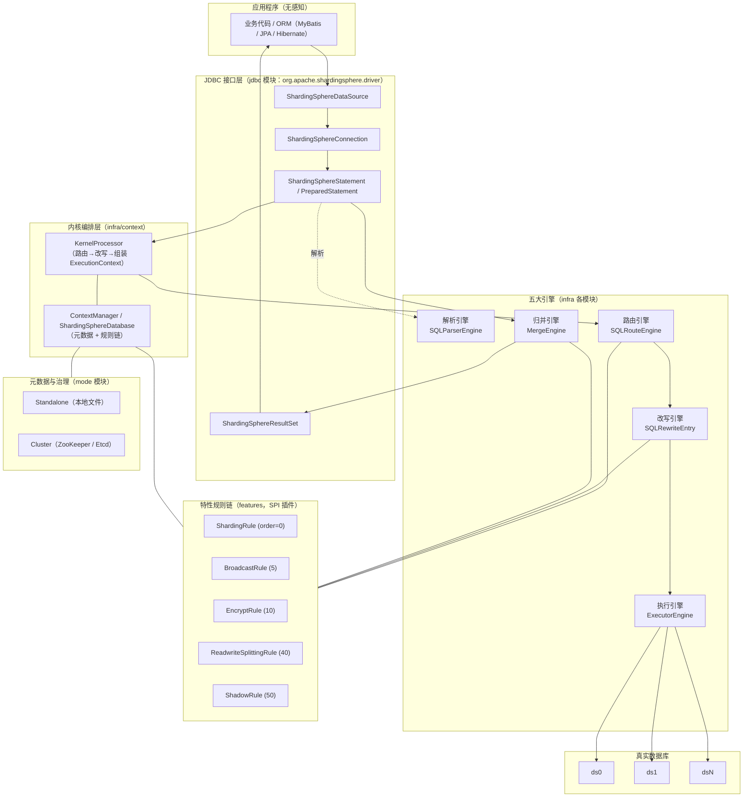

---

## 三、JDBC 接口层源码分析

包前缀：`org.apache.shardingsphere.driver.jdbc.*`

### 3.1 ShardingSphereDataSource（入口）

`driver.jdbc.core.datasource.ShardingSphereDataSource`，实现标准 `DataSource`：

```java
private final String databaseName;
private final ContextManager contextManager;   // 元数据 + 规则 + 持久化仓库的总管理器
private final JDBCContext jdbcContext;

public Connection getConnection() { return getConnection(DriverStateContext.getConnection(...)); }
```

职责：
- 构造时通过 `ContextManagerBuilder` 构建 `ContextManager`（内含 `MetaDataContexts`），完成 **真实数据源注册、元数据加载、规则装配、模式（Standalone/Cluster）初始化**；
- `getConnection()` 每次返回一个新的 `ShardingSphereConnection`（逻辑连接，内部按需懒创建物理连接）；
- `close()` 关闭全部数据源与上下文。

### 3.2 ShardingSphereConnection（逻辑连接）

`driver.jdbc.core.connection.ShardingSphereConnection`，实现 `Connection` 接口：

```java
private final DriverDatabaseConnectionManager databaseConnectionManager;
private final ConnectionContext connectionContext;   // 连接级上下文（事务、Hint、批处理）
private final SQLFederationEngine sqlFederationEngine;
private boolean autoCommit = true;
```

`DriverDatabaseConnectionManager` 是 **物理连接管理器**：
- 字段 `Multimap<String, Connection> cachedConnections = LinkedHashMultimap.create()` —— 以数据源名为 key 缓存本逻辑连接持有的物理连接，同一事务内对同一库复用连接；
- `getConnections(dataSourceName, connectionOffset, connectionCount, connectionMode)`：优先从缓存取，不够则 `createConnections()` 从真实 DataSource 新建并放入缓存 —— 这就是"**一个逻辑连接按需持有多个物理连接**"的实现；
- `commit()/rollback()/close()` 对所有缓存连接统一操作（分布式事务则委托给事务引擎）。

### 3.3 ShardingSphereStatement / PreparedStatement（执行主体）

`driver.jdbc.core.statement.ShardingSphereStatement` 关键字段：

```java
private final KernelProcessor kernelProcessor;    // 五大引擎编排器
private final StatementExecutor statementExecutor;
private ExecutionContext executionContext;        // 路由+改写产物
private final List<Statement> statements;          // 底层真实 Statement 缓存
```

`executeQuery(sql)` 的骨架（真实调用链，方法名来自源码）：

```
executeQuery(sql)
 ├─ createQueryContext(sql, params, useFetchSize)        // ① 调 SQLParserEngine 解析
 ├─ trafficInstanceId = getInstanceIdAndSet(...)         // ② 流量匹配（可跳过）
 ├─ useFederation = sqlFederationEngine.decide(...)      // ③ 联邦查询决策（跨库绑定表复杂查询）
 ├─ executionContext = createExecutionContext(...)       // ④ SQLAuditEngine.audit + KernelProcessor
 │                                                        //    └─ route() → rewrite() → ExecutionContext
 ├─ executeQuery0()                                       // ⑤ 执行
 │    ├─ createExecutionGroupContext()                    //    DriverExecutionPrepareEngine 准备执行组
 │    ├─ cacheStatements()                                //    缓存真实 Statement
 │    └─ statementExecutor.executeQuery(...)              //    ExecutorEngine 并发执行
 ├─ mergeQuery(...)                                       // ⑥ MergeEngine 归并
 └─ return new ShardingSphereResultSet(...)               // ⑦ 包装为 JDBC 结果集
```

`ShardingSpherePreparedStatement` 额外支持：
- 参数占位符绑定（`parameters` 列表，参与解析与改写）；
- `addBatch/executeBatch`：走 `BatchPreparedStatementExecutor`，按路由结果把批量参数分组下发；
- 语句级缓存（相同 SQL 重复执行时复用底层 PreparedStatement）。

### 3.4 ShardingSphereResultSet（归并结果的出口）

`driver.jdbc.core.resultset.ShardingSphereResultSet` 持有 `MergedResult`：

```java
public boolean next() { return mergeResultSet.next(); }
public String getString(int columnIndex) {
    return (String) ResultSetUtils.convertValue(mergeResultSet.getValue(columnIndex, String.class), String.class);
}
```

即：**应用遍历 ResultSet 的每一步，实际是在消费归并引擎产出的 MergedResult**（可能是流式的优先队列，也可能是内存聚合结果）。

---

## 四、元数据与规则体系

### 4.1 ShardingSphereDatabase（逻辑数据库的完整描述）

`infra.metadata.database.ShardingSphereDatabase`：

```java
private final ShardingSphereResourceMetaData resourceMetaData;  // 真实数据源映射 dataSourceName -> DataSource
private final ShardingSphereRuleMetaData ruleMetaData;          // 规则链容器
private final Map<String, ShardingSphereSchema> schemas;        // 逻辑表 -> 列/索引元数据
```

- 元数据通过 `SchemaMetaDataLoader` 系列从物理库 `DatabaseMetaData` 抽取（表名、列类型、主键），供路由/改写/归并校验与补列使用；
- `ShardingSphereRuleMetaData` 提供 `findRules(Class)` / `getSingleRule(Class)`，是规则链的运行时容器。

### 4.2 规则链顺序（源码实测常量）

各特性 `*Order.ORDER` 值（决定 SQLRouter 等 SPI 的执行顺序，值小先执行）：

| 规则 | 常量类 | Order |
|---|---|---|
| 分片 | `sharding.constant.ShardingOrder` | **0** |
| 广播表 | `broadcast.constant.BroadcastOrder` | 5 |
| 加密 | `encrypt.constant.EncryptOrder` | 10 |
| 脱敏 | `mask.constant.MaskOrder` | 20 |
| 读写分离 | `readwritesplitting.constant.ReadwriteSplittingOrder` | 40 |
| 影子库 | `shadow.constant.ShadowOrder` | 50 |

> 顺序含义：**先分片算出目标库表 → 广播补齐 → 加密改写列 → 读写分离选主从 → 影子库最终决定真实数据源**。这与真实 SQL 的处理语义一致。

### 4.3 模式（Mode）

`mode` 模块决定元数据与配置的存放：
- **Standalone**：本地文件（`StandalonePersistRepository`），适合单实例；
- **Cluster**：ZooKeeper / Etcd，多实例共享元数据、配置变更实时推送（`ContextManager` 中的 `MetaDataContexts` 会随注册中心事件刷新，JDBC 端动态感知规则变化）。

---

## 五、一条 SQL 的完整生命周期（总体工作流程）

以 `SELECT * FROM t_order WHERE user_id = 10 ORDER BY order_id LIMIT 10`（`t_order` 按 `user_id` 分库、`order_id` 分表）为例：

```
逻辑SQL: SELECT * FROM t_order WHERE user_id=10 ORDER BY order_id LIMIT 10

① 解析  → SelectStatement{table=t_order, where=user_id=10, orderBy=order_id, limit=10,10}
② 路由  → RouteContext{ RouteUnit(ds_1, t_order→t_order_3), RouteUnit(ds_1, t_order→t_order_7) }   // 假设计算结果
③ 改写  → "SELECT * FROM t_order_3 ORDER BY order_id_3 LIMIT 0,20"  （表名替换 + 分页改写）
           "SELECT * FROM t_order_7 ORDER BY order_id_7 LIMIT 0,20"
④ 执行  → 两个真实库表并发执行，得到 2 个 QueryResult
⑤ 归并  → OrderByStreamMergedResult（优先队列归并排序）+ LimitDecoratorMergedResult（去掉补出的前10条）
→ 应用拿到正确的 10 条数据
```

总流程图见 [第十二章 图 12.2](#十二全量-mermaid-图汇总)，完整时序图见图 12.3。

---

## 六、解析引擎

> 源码位置：`infra/parser`（门面）+ `parser/`（真正实现）

### 6.1 技术选型：ANTLR4（5.4.0 仍然如此）

5.4.0 的解析器**底层仍基于 ANTLR4**：
- 每个方言（MySQL / PostgreSQL / Oracle / SQLServer / OpenGauss / SQL92）在 `parser/sql/dialect/*/src/main/antlr4/org/apache/shardingsphere/sql/parser/autogen/` 下维护 `.g4` 文法文件，编译期生成 Lexer/Parser；
- 运行时通过 **SPI**（`DatabaseType` → 方言实现）加载对应解析器；
- `SQLParserExecutor` 采用 ANTLR 官方推荐的 **两阶段解析**：先 `SLL` 预测模式（快），失败再降级 `LL` 完整模式（准）。

> 注：自研"SQL 方言独立解析 + 逐步去 ANTLR 化"是 5.5.x 之后的方向，5.4.0 尚未完成。

### 6.2 解析流水线：Lexer → Parser → Visitor → SQLStatement

核心类：

| 类 | 包 | 职责 |
|---|---|---|
| `SQLParserEngine` | `infra.parser` | **门面**，带缓存；JDBC/Proxy 统一入口 |
| `SQLParserEngine` | `parser.sql.engine...api` | 方言级引擎（parse / parseWithCache） |
| `SQLParserExecutor` | `parser.sql.parser.core.database.parser` | 真正执行 ANTLR 两阶段解析 |
| `SQLParserFactory` | `parser.sql.parser.core` | 按方言创建 ANTLR Lexer/Parser |
| `SQLStatementVisitorEngine` | `parser.sql.engine.api` | 驱动 Visitor 把 ANTLR AST 转为 SQLStatement |
| `ParseASTNode` | `parser.sql.parser.core` | AST 包装（ParseTree + 隐藏通道 Token，保留注释/空白） |

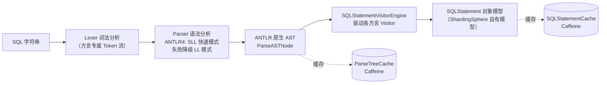

### 6.3 两级缓存（性能关键）

1. **ParseTreeCache**（`parser.sql.engine.core.database.cache`）：缓存 `sql → ParseASTNode`，避免重复词法/语法分析；
2. **SQLStatementCache**（`infra.parser.cache`）：缓存 `sql → SQLStatement`，连 Visitor 转换也省掉。

容量由 `sqlParseCacheSize` 等配置（`CacheOption`）控制；同一条 SQL（含参数占位符完全一致）只在首次解析，之后全部走缓存 —— 这是 `PreparedStatement` 场景高性能的基础。

### 6.4 SQLStatement 对象模型

类层次（`parser.sql.statement`）：

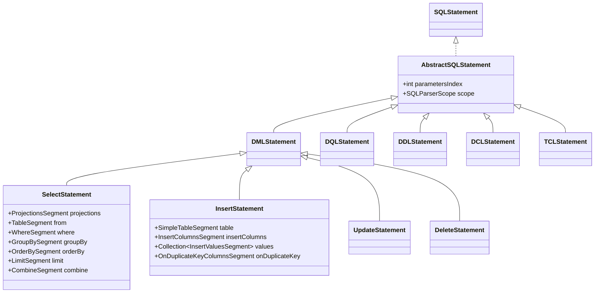

解析产物随后被包装为 **`SQLStatementContext`**（`infra.binder`），如 `SelectStatementContext` / `InsertStatementContext`，它把 SQLStatement 与 **逻辑表元数据绑定**（计算列位置、分组/排序上下文 `GroupByContext`、`OrderByContext`、`PaginationContext`、投影 `ProjectionsContext`），供后续路由/改写/归并使用。这一步称为"**SQL 与元数据绑定（binder）**"。

### 6.5 分片条件提取（解析服务于路由的桥梁）

`features/sharding/core/.../route/engine/condition/` 下：

- `ShardingConditionEngine`（接口）
  - `WhereClauseShardingConditionEngine`：从 WHERE 中提取；用 `ExpressionExtractUtils` 拆 AND 谓词、`ColumnExtractor` 抽列、结合 `shardingRule.findShardingColumn()` 判断是否分片键，再由 `ConditionValueGeneratorFactory` 把表达式转成条件值；
  - `InsertShardingConditionEngine`：从 INSERT VALUES 中按列位置提取分片键值；
  - `ShardingBetweenAndOperatorConditionEngine` 等：处理 BETWEEN AND。
- 产物：`ShardingConditions`（一组 `ShardingCondition`），每个条件值为：
  - `ListRouteValue`（`= ?`、`IN (...)`）—— 精确值；
  - `RangeRouteValue`（`BETWEEN`、`>`、`<`）—— 范围值。

```java
// WhereClauseShardingConditionEngine 核心片段（节选自源码，有删减）
for (ColumnSegment columnSegment : ColumnExtractor.extract(each)) {
    Optional<String> shardingColumn = tableName.flatMap(t -> shardingRule.findShardingColumn(columnSegment.getIdentifier().getValue(), t));
    Optional<RouteValue> routeValue = ConditionValueGeneratorFactory.generate(each, column, params, ...);
}
```

---

## 七、路由引擎（数据分片的核心）

> 源码：`infra/route`（骨架）+ `features/sharding/core/.../route`（分片实现）

### 7.1 入口与路由器链

`infra.route.engine.SQLRouteEngine`：

```java
public RouteContext route(QueryContext queryContext, ShardingSphereDatabase database,
                          ShardingSphereRuleMetaData ruleMetaData, ConfigurationProperties props, ConnectionContext connectionContext) {
    // SQL 审计（如拦截全路由 SQL）
    // 按 SQLStatement 类型选择 PartialSQLRouteExecutor（绝大多数 SQL）或 AllSQLRouteExecutor（如 SHOW/DAL）
}
```

`PartialSQLRouteExecutor` 通过 `OrderedSPILoader` 加载所有 `SQLRouter` SPI，**按 Order 升序**依次执行：

```
ShardingSQLRouter(0) → BroadcastSQLRouter(5) → EncryptSQLRouter(10)
→ MaskSQLRouter(20) → ReadwriteSplittingSQLRouter(40) → ShadowSQLRouter(50)
```

第一个 Router 调 `createRouteContext()` 生成 `RouteContext`，后续 Router 调 `decorateRouteContext()` 在其基础上**装饰**（例如读写分离把 `ds_0` 映射为 `ds_0_read_1`，影子库把 `ds_0` 换成 `shadow_ds_0`）。

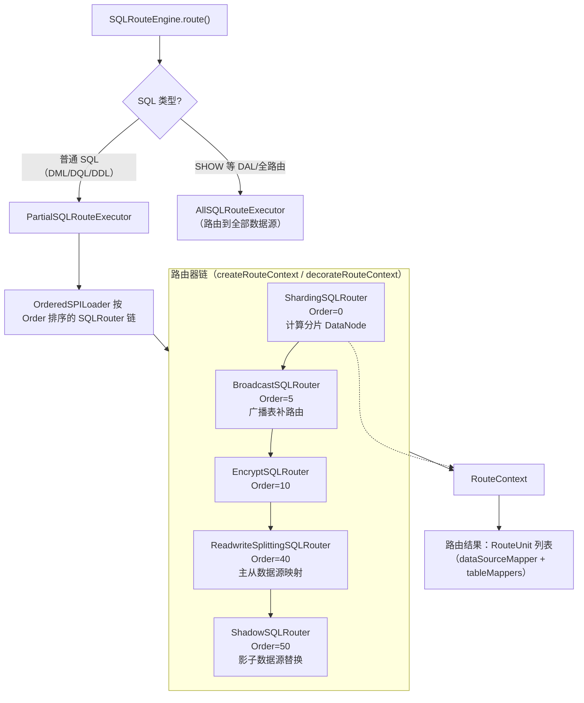

### 7.2 RouteContext 数据结构（路由产物）

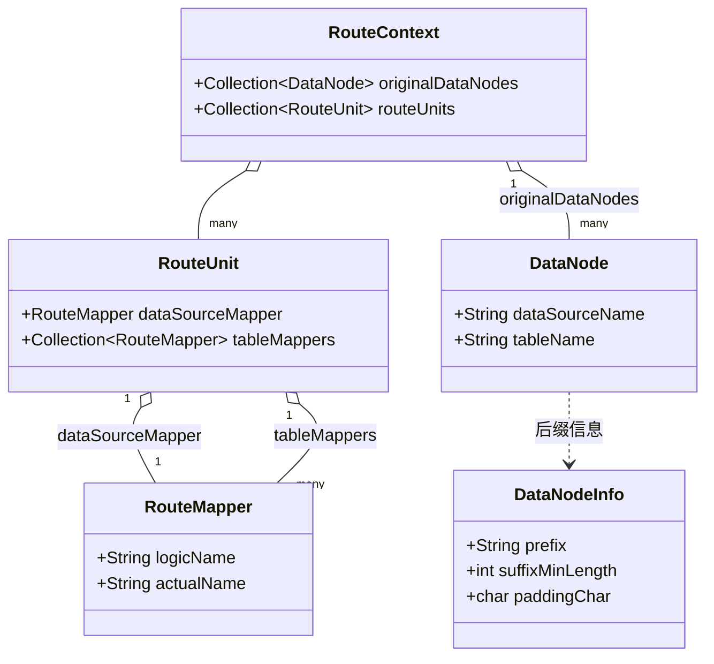

例如 `t_order` 在 `ds_1` 上路由到 `t_order_3`：
`RouteUnit{ dataSourceMapper: ds_1→ds_1, tableMappers: [t_order→t_order_3] }`

### 7.3 分片路由的引擎分类（ShardingRouteEngineFactory）

`ShardingSQLRouter.createRouteContext()` 内部由 **`ShardingRouteEngineFactory.newInstance()`** 按场景选择路由引擎（`features/sharding/.../route/engine/type/`）：

| 路由引擎 | 场景 | 说明 |
|---|---|---|
| `ShardingStandardRoutingEngine` | **标准路由**：单分片表（或绑定表 JOIN）带分片键 | 最常用、最高效；逐条计算库路由 + 表路由 |
| `ShardingComplexRoutingEngine` | 复合路由：多分片键（`ComplexShardingStrategy`）或 OR 条件 | 各条件分别路由后取并集 |
| `ShardingCartesianRoutingEngine` | 非绑定表 JOIN | 库×表做**笛卡尔积**，代价最高，应避免 |
| `ShardingUnicastRoutingEngine` | 单播路由：无分片键 SELECT（仅取一个节点） | 每个库挑一张真实表执行一次（保证逻辑表元数据类查询正确） |
| `ShardingDatabaseBroadcastRoutingEngine` | 库广播：无分片键 DML/DDL、SET 语句 | 路由到所有库 |
| `ShardingTableBroadcastRoutingEngine` | 表广播：DDL（CREATE/DROP/ALTER 表） | 所有库的所有真实表都要执行 DDL |
| `ShardingDataSourceGroupBroadcastRoutingEngine` | 主从组内广播（如 FLUSH） | 每个主从组选代表执行 |
| `ShardingIgnoreRoutingEngine` | 忽略路由：USE dbname 等 | 仅切换逻辑 schema，不下发 SQL |

标准路由核心流程（`ShardingStandardRoutingEngine.route0` 逻辑概括）：

```
1. 对 SQL 中的每张逻辑表：
   a. 库路由：databaseShardingStrategy.doSharding(availableDatasources, conditions, dataNodeInfo, props)
      → 得到目标数据源集合
   b. 表路由：tableShardingStrategy.doSharding(该数据源下的真实表名集合, conditions, ...)
      → 得到目标真实表集合
2. 组装 DataNode(ds, actualTable)，合并为 RouteContext
3. 绑定表（bindingTables）保证同组表使用同一分片规则，JOIN 时路由到同库，避免笛卡尔积
```

### 7.4 分片策略与分片算法（SPI 双层体系）

```mermaid
classDiagram
    class ShardingStrategy {
        <<interface>>
        +doSharding(availableTargetNames, shardingConditionValues, dataNodeInfo, props)
        +getShardingColumns()
        +getShardingAlgorithm()
    }
    class StandardShardingStrategy {
        -String shardingColumn
        -ShardingAlgorithm algorithm
    }
    class ComplexShardingStrategy {
        -Collection~String~ shardingColumns
    }
    class HintShardingStrategy
    class NoneShardingStrategy
    class ShardingAlgorithm {
        <<interface>>
        +String getType()
        +Properties getProps()
    }
    class StandardShardingAlgorithm {
        <<interface>>
        +doSharding(available, PreciseShardingValue)
        +doSharding(available, RangeShardingValue)
    }
    class ComplexKeysShardingAlgorithm {
        <<interface>>
        +doSharding(available, ComplexKeysShardingValue)
    }
    class HintShardingAlgorithm {
        <<interface>>
        +doSharding(available, HintShardingValue)
    }
    class AutoShardingAlgorithm {
        <<interface>>
        +int getAutoTablesAmount()
    }
    ShardingStrategy <|.. StandardShardingStrategy
    ShardingStrategy <|.. ComplexShardingStrategy
    ShardingStrategy <|.. HintShardingStrategy
    ShardingStrategy <|.. NoneShardingStrategy
    ShardingAlgorithm <|-- StandardShardingAlgorithm
    ShardingAlgorithm <|-- ComplexKeysShardingAlgorithm
    ShardingAlgorithm <|-- HintShardingAlgorithm
    ShardingAlgorithm <|-- AutoShardingAlgorithm
```

- **StandardShardingStrategy**：单分片键；精确值走 `doSharding(available, PreciseShardingValue)`（如 `InlineShardingAlgorithm`、`HashModShardingAlgorithm`、`ModShardingAlgorithm`），范围值走 `doSharding(available, RangeShardingValue)`（如 `AutoIntervalShardingAlgorithm`、时间范围类算法）；
- **InlineShardingStrategy** 本质是 `Standard` 的特例：算法为 `InlineExpression`（`InlineShardingAlgorithm`），用 **Groovy 引擎** 计算 `t_order_$->{order_id % 4}` 这类表达式；Groovy 表达式实例会被编译缓存（`InlineExpression`），避免每次解释；
- **ComplexShardingStrategy**：多分片键，SQL 中必须包含全部键，交给 `ComplexKeysShardingAlgorithm` 一次性决策；
- **HintShardingStrategy**：不看 SQL，直接从 `HintManager`（ThreadLocal）取值路由；
- **AutoShardingAlgorithm** 系列（`MOD`、`HASH_MOD`、`VOLUME_RANGE`、`BOUNDARY_RANGE`、`AUTO_INTERVAL`、`ABSOLUTE_HASH`...）：面向"自动分片表"（配置 actualDataNodes 数量即可），算法自己按索引计算，无需用户写表达式。

**doSharding 的通用语义**：入参是"可用目标名集合"（如 `ds_0..ds_3` 或 `t_order_0..t_order_15`），算法根据条件值返回"命中的目标名集合"。例如 `ModShardingAlgorithm`：`order_id=10, mod=4 → "10"（后缀）`；`IN (10,11)` → `{10, 11}`。范围条件可能返回超集（如 `BETWEEN 8 AND 12` 返回 `{8,9,10,11,12}`），由后续执行+归并保证正确性。

`DataNodeInfo`（prefix / suffixMinLength / paddingChar）用于把算法返回的后缀（如 `3`）格式化为真实表名（如 `t_order_0003` 补零）。

### 7.5 分片键计算全流程图

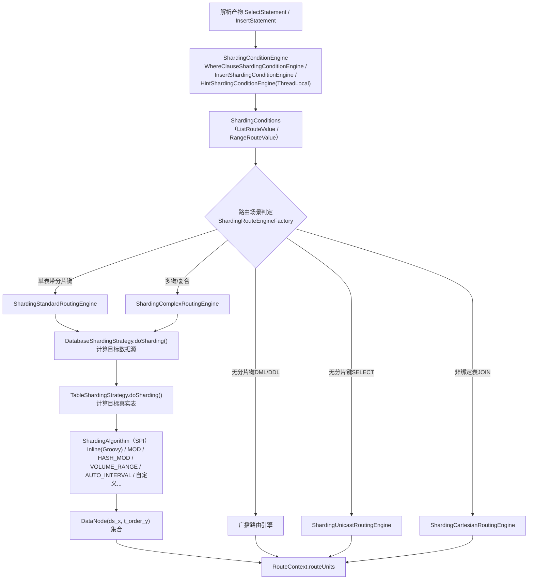

### 7.6 读写分离与 Hint 强制路由

- **ReadwriteSplittingSQLRouter**：`ReadwriteSplittingDataSourceRouter` 依据 SQL 类型（读/写）、`HintManager.isWriteRouteOnly()`、事务上下文决定主库或从库；从库选择由 `ReadQueryLoadBalanceAlgorithm` SPI 完成（`RANDOM` / `ROUND_ROBIN` / `WEIGHT`）。它通过修改 `RouteUnit.dataSourceMapper.actualName` 实现（`ds_0` → `read_ds_1`）。
- **HintManager**（`infra.hint.HintManager`）：`ThreadLocal<HintValueContext>`，可 `addDatabaseShardingValue("t_order", 10)`、`addTableShardingValue(...)`、`setWriteRouteOnly()`、`setDatabaseShardingSphereName(...)`（直接指定库）。Hint 值在解析阶段被并入 `QueryContext.hintValueContext`，路由时优先于 SQL 条件。

### 7.7 SQL 审计

路由前还有 `SQLAuditEngine`（`kernel/audit`）：一组 `SQLAuditCheck` SPI（如 `ShardingAuditStatement`），可拦截不合规 SQL（例如禁止全路由查询），抛出异常。

---

## 八、改写引擎

> 源码：`infra/rewrite`（骨架 + Token 体系）+ `features/sharding|encrypt/.../rewrite`（装饰器）

### 8.1 为什么必须改写

逻辑 SQL 面向逻辑表，无法直接在真实库执行，至少要处理：
1. **表名替换**：`t_order` → `t_order_3`；
2. **补列**：`SELECT *` + 归并需要分片键时补列；INSERT 缺分片列/自增列时补值；
3. **分页修正**：`LIMIT 100000, 10` 改写为 `LIMIT 0, 100010`（每个分片都要取前 100010 条才能归并出正确分页）；
4. **AVG 改写**：`AVG(x)` → `SUM(x), COUNT(x)`（AVG 不能直接归并）；
5. **加密列改写**：逻辑列 → 密文列/辅助查询列，参数加密；
6. **自增主键生成**：分布式主键（SNOWFLAKE 等）回填到 INSERT。

### 8.2 核心类协作

| 类 | 包 | 职责 |
|---|---|---|
| `SQLRewriteEntry` | `infra.rewrite` | 总入口：创建上下文 → 应用装饰器 → 选引擎改写 |
| `SQLRewriteContext` | `infra.rewrite.context` | 持有 SQL/参数/SQLToken 集合/ParameterBuilder/TokenGenerators |
| `SQLRewriteContextDecorator` | `infra.rewrite.context` | **扩展点**：各特性对上下文的增强 |
| `ShardingSQLRewriteContextDecorator` | `sharding.rewrite.context` | 分片参数改写 + 分片 Token 生成器 |
| `EncryptSQLRewriteContextDecorator` | `encrypt.rewrite.context` | 加密条件/参数/Token |
| `SQLTokenGenerators` | `infra.rewrite.sql.token.generator` | 驱动全部 Token 生成器 |
| `RouteSQLRewriteEngine` / `GenericSQLRewriteEngine` | `infra.rewrite.engine` | 按 RouteUnit 生成改写 SQL / 无路由时改写 |
| `AbstractSQLBuilder` / `DefaultSQLBuilder` | `infra.rewrite.sql.impl` | 按 Token 位置拼接最终 SQL |

`SQLRewriteEntry.rewrite()` 核心逻辑（节选）：

```java
SQLRewriteContext sqlRewriteContext = createSQLRewriteContext(sql, params, sqlStatementContext, routeContext, ...);
return routeContext.getRouteUnits().isEmpty()
        ? new GenericSQLRewriteEngine(...).rewrite(sqlRewriteContext)
        : new RouteSQLRewriteEngine(...).rewrite(sqlRewriteContext, routeContext);   // 每个 RouteUnit 一条 SQL
```

### 8.3 Token 机制（改写的实现精髓）

改写不是用正则替换字符串，而是：**解析时记录的每个 SQL 片段位置 + 生成 Token（占位与替换内容），最后按 startIndex 排序拼接**。

`SQLToken` 基类持有 `startIndex` 并按其排序；常见子类：

| Token | 作用 |
|---|---|
| `TableToken`（`ShardingTableToken`） | 逻辑表名 → 真实表名 |
| `SchemaToken` | schema 改写 |
| `IndexToken` | 索引名改写（DDL 中索引也要按真实表命名） |
| `InsertValuesToken` / `InsertOnUpdateToken` | INSERT 补值 / ON DUPLICATE KEY |
| `ItemsToken` / `DistinctProjectionToken` | SELECT 投影补列 |
| `RowCountToken` / `OffsetToken` | 分页改写 |
| `ComposableSQLToken` | 组合 Token（左括号-内容-右括号） |
| `SubstitutableColumnNameToken` | 按路由单元动态变化的列名（如分片列补列） |

Token 生成器分三类接口：`OptionalSQLTokenGenerator`（生成 0..1 个）、`CollectionSQLTokenGenerator`（生成 N 个）、`IgnoreSQLTokenGenerator`（标记跳过）。`ShardingTokenGenerateBuilder` / `EncryptTokenGenerateBuilder` / `DefaultTokenGeneratorBuilder` 分别注册各自生成器。

最终拼 SQL（`AbstractSQLBuilder.toSQL()`，节选）：

```java
Collections.sort(context.getSqlTokens());                    // 按位置排序
result.append(sql, 0, tokens.get(0).getStartIndex());        // 首个 Token 前的原样保留
for (SQLToken each : tokens) {
    result.append(getSQLTokenText(each));                    // Token 处替换为改写文本
    result.append(getConjunctionText(each));                 // Token 之间的原文
}
```

### 8.4 参数改写（ParameterBuilder / ParameterRewriter）

SQL 中的 `?` 参数同样需要改写（分页参数、补列参数、加密参数、批量参数）：

- `ParameterBuilder`
  - `StandardParameterBuilder`：普通语句；
  - `GroupedParameterBuilder`：INSERT 多行 VALUES，按行分组管理参数（含 ON DUPLICATE KEY 追加参数）；
- `ParameterRewriter`（`sharding.rewrite.parameter.impl`）示例：
  - `ShardingPaginationParameterRewriter`：把分页 offset/rowCount 参数改为改写后的值；
  - `ShardingGeneratedKeyInsertValueParameterRewriter`：把生成的主键值插入参数序列；
  - `EncryptPredicateParameterRewriter` / `EncryptInsertValueParameterRewriter` / `EncryptAssignmentParameterRewriter`：把明文参数加密为密文参数。

### 8.5 改写引擎流程图

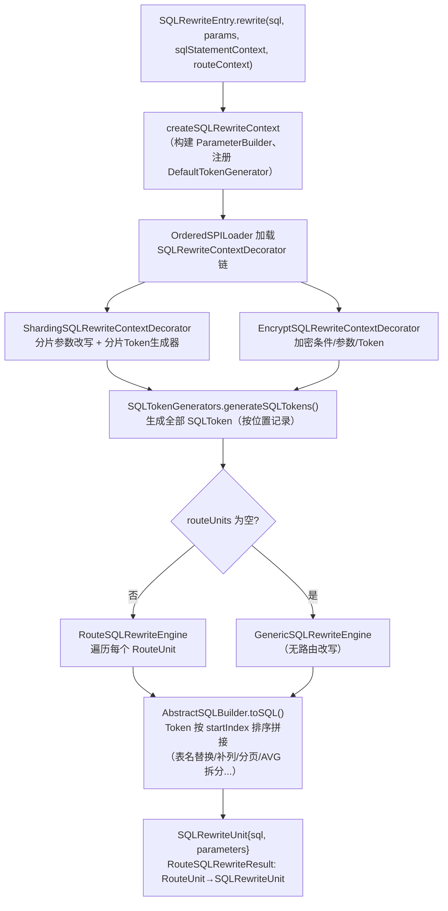

**示例**（分页 + 补列）：

```
原SQL : SELECT username FROM t_order WHERE user_id=10 ORDER BY id LIMIT 100000, 2
改写后: SELECT username, id, user_id          -- ItemsToken 补列（归并排序需要）
        FROM t_order_3 WHERE user_id=10        -- TableToken 表名替换
        ORDER BY id LIMIT 0, 100002            -- OffsetToken/RowCountToken 分页改写
        （且对每个命中的真实表各生成一条）
```

---

## 九、执行引擎

> 源码：`infra/executor`（`executor/kernel` 线程池 + `executor/sql` 执行流程）

### 9.1 两大问题：连接模式与并发控制

一条逻辑 SQL 路由改写后产生 N 条真实 SQL（ExecutionUnit）。执行引擎要决定：
- 用**多少个物理连接**执行？
- 用**多少线程**并发？

### 9.2 连接模式（ConnectionMode）

`AbstractExecutionPrepareEngine.prepare()` 中（源码原文）：

```java
ConnectionMode connectionMode = maxConnectionsSizePerQuery < sqlUnits.size()
        ? ConnectionMode.CONNECTION_STRICTLY : ConnectionMode.MEMORY_STRICTLY;
```

- **MEMORY_STRICTLY（内存限制模式）**：`max-connections-size-per-query`（默认 1）≥ SQL 数 → 每条 SQL 一个连接，**串行复用同一连接组**，每条 SQL 的结果必须读完（流式读取，内存占用低但同库串行）；
- **MEMORY_STRICTLY 反之 → CONNECTION_STRICTLY（连接限制模式）**：SQL 数 > 每查询最大连接数 → 为每条 SQL 尽量分配独立连接以并行（同库 SQL 分组：`Lists.partition(sqlUnits, 每连接承担的 SQL 数)`），用更多连接换并发，但结果集可能需要一次性载入内存。

分组算法（`group()`，源码）：

```java
int desiredPartitionSize = max(0 == size % maxConnections ? size / maxConnections : size / maxConnections + 1, 1);
return Lists.partition(sqlUnits, desiredPartitionSize);   // 每个分区 = 一条连接要执行的 SQL 集合
```

### 9.3 ExecutorEngine（并发执行内核）

`infra.executor.kernel.ExecutorEngine`：
- 构造时创建线程池：内部 `ExecutorServiceManager`，默认并行度 = `CPU 核数`（内存限制模式相关参数），使用 **TTL（TransmittableThreadLocal）** 包装（`TtlExecutors`）透传用户线程上下文（如 Sharding hint、事务标记）；
- 核心 API：`execute(Collection<ExecutionGroup> groups, ExecutorCallback callback, ExecutionGroupReportContext context)`：
  - 若只有 1 组或处于事务串行场景 → **同步在当前线程执行**；
  - 多组时：`syncExecute` 第一组在主线程执行 + 其余组 `asyncExecute` 提交线程池，`Future.get()` 汇合 —— 避免小任务也付出线程切换代价。

### 9.4 执行单元与回调

| 概念 | 类 |
|---|---|
| 执行单元（数据源+SQL+参数） | `ExecutionUnit` / `SQLUnit` |
| 执行分组 | `ExecutionGroup<T>`（同库同连接的一批单元） |
| 驱动级准备引擎 | `DriverExecutionPrepareEngine<C,S>`（infra.executor.sql.prepare.driver）—— 负责拿连接、分组、创建真实 Statement |
| 回调 | `ExecutorCallback` / `JDBCExecutorCallback<T>`（模板方法：`executeSQL` + 异常处理 + SQLExecutionHook） |
| JDBC 门面 | `JDBCExecutor`（组合 ExecutorEngine + 事务上下文） |
| JDBC 层执行器 | `StatementExecutor` / `PreparedStatementExecutor` / `BatchPreparedStatementExecutor`（driver 模块） |

`JDBCExecutorCallback` 关键逻辑（概括）：
1. 执行前触发 `SQLExecutionHook`（SPI，dubbo/rpc trace 埋点，含 `DistributedSQLExecutionHook`）；
2. `executeSQL(sql, statement, connectionMode, storageType)` 真正执行；`ConnectionMode.MEMORY_STRICTLY` 且 fetchSize 场景保持流式 ResultSet，`CONNECTION_STRICTLY` 则包装为内存结果；
3. SQLException 时 `getSaneResult(sqlStatement, ex)` 判断"合理异常"（如 UPDATE 不存在的表在部分库报错可容忍），否则标记异常并回滚整批。

### 9.5 查询结果模型

- `QueryResult` 接口：`next()/getValue(columnIndex, type)/getMetaData()/wasNull()`；
- 实现两类：
  - **流式**：直接游标读 `ResultSet`（Statement 保持打开，内存 O(1)，供流式归并）；
  - **内存**：`MemoryQueryResult` 一次性装载（连接受限/批量场景）；
- 写操作返回 `UpdateResult`（updateCount / lastInsertId）。

### 9.6 执行引擎流程图

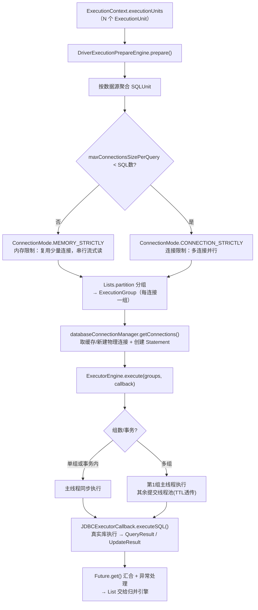

---

## 十、归并引擎

> 源码：`infra/merge`（入口）+ `features/sharding/core/.../merge`（分片归并）+ `features/encrypt`（解密装饰）

### 10.1 入口与分发

`infra.merge.MergeEngine`（概括）：

```java
public MergedResult merge(List<QueryResult> queryResults, SQLStatementContext ctx) {
    Optional<MergedResult> mergedResult = executeMerge(queryResults, ctx);        // 各规则 ResultMergerEngine
    Optional<MergedResult> result = mergedResult.isPresent()
            ? Optional.of(decorate(mergedResult.get(), ctx))                      // 装饰（加密解密/脱敏）
            : decorate(queryResults.get(0), ctx);
    return result.orElseGet(() -> new TransparentMergedResult(queryResults.get(0)));
}
```

`ShardingResultMergerEngine`（features/sharding）按 SQL 类型分发：

```java
if (sqlStatementContext instanceof SelectStatementContext) return new ShardingDQLResultMerger(protocolType);
if (sqlStatement.getSqlStatement() instanceof DDLStatement)  return new ShardingDDLResultMerger();   // 取最大 updateCount
if (sqlStatement instanceof DALStatement)                    return new ShardingDALResultMerger(databaseName, shardingRule);
return new TransparentResultMerger();                                                             // 透传
```

### 10.2 归并策略分类（ShardingDQLResultMerger.build）

| 类型 | 条件 | 实现类 | 内存开销 |
|---|---|---|---|
| 遍历归并 | 单结果集 / 无分组无排序 | `IteratorStreamMergedResult` | O(1) 流式 |
| 排序归并 | 有 ORDER BY 无 GROUP BY | `OrderByStreamMergedResult` | O(N) 个队列元素，流式 |
| 流式分组归并 | GROUP BY 与 ORDER BY 项一致 | `GroupByStreamMergedResult` | 流式（每组聚合完即释放） |
| 内存分组归并 | GROUP BY 与 ORDER BY 不一致 | `GroupByMemoryMergedResult` | O(数据量) 全量进内存 |
| 分页装饰 | 有 LIMIT 且多结果集 | `LimitDecoratorMergedResult`（MySQL/PG/openGauss）、`RowNumberDecoratorMergedResult`（Oracle）、`TopAndRowNumberDecoratorMergedResult`（SQLServer） | 装饰者，套在上述结果外 |

选择逻辑（源码概括）：

```java
if (isNeedProcessGroupBy(ctx))        return getGroupByMergedResult(...);   // 组内再分流式/内存
if (isNeedProcessDistinctRow(ctx))    { setGroupByForDistinctRow(ctx); return getGroupByMergedResult(...); }
if (isNeedProcessOrderBy(ctx))        return new OrderByStreamMergedResult(...);
return new IteratorStreamMergedResult(queryResults);
```

### 10.3 排序归并：优先队列多路归并（核心算法）

`OrderByStreamMergedResult`：
1. 为每个 `QueryResult` 包装 `OrderByValue`（当前行的排序键列表）；
2. 每个结果集 `next()` 取首行，非空者入 `PriorityQueue<OrderByValue>`（小顶堆，比较器由 SQL 的 `OrderByItem` 构造）；
3. `next()`：弹出堆顶（即全局最小/最大行）返回给应用；若该结果集还有下一行，重新取排序键入堆。
4. —— **每次只比较各分片"当前行"，内存中仅保存 N 个排序键，等价于多路归并排序**，这就是"流式归并"。

比较规则（`OrderByValue.compareTo` + `CompareUtils`）：
- 逐个 OrderByItem 比较；支持 ASC/DESC、`NULLS FIRST/LAST`（按方言 `NullsOrderType`）、大小写敏感（`orderValuesCaseSensitive`）；不同类型数值统一为 Comparable 比较。

### 10.4 分组归并与聚合单元（AggregationUnit）

`GroupByStreamMergedResult`（继承 OrderByStreamMergedResult）：
- 依分组值连续性聚合：当堆顶行换到"新分组值"（`GroupByValue.getGroupValues()`）时，上一组聚合完成；
- 每个聚合投影对应一个 `AggregationUnit`（`AggregationUnitFactory` 创建）：

| 聚合 | AggregationUnit | 归并规则 |
|---|---|---|
| SUM / COUNT | `AccumulationAggregationUnit` | 各分片结果**累加** |
| MAX / MIN | `ComparableAggregationUnit` | **比较**取极值 |
| AVG | `AverageAggregationUnit` | SUM 累加、COUNT 累加，最后 `sum/count` 重新计算（所以改写阶段把 AVG 拆成 SUM+COUNT） |
| SUM(DISTINCT)/COUNT(DISTINCT) | `DistinctSumAggregationUnit` / `DistinctCountAggregationUnit` | 用 Set 去重后聚合 |

`GroupByMemoryMergedResult`：分组与排序项不一致时无法利用结果集有序性，把所有行读入内存 `Map<分组值, 行+聚合单元>` 后再排序输出。

### 10.5 分页归并（装饰者）

`LimitDecoratorMergedResult.next()`：跳过 `offset` 行、最多返回 `rowCount` 行 —— 对应改写阶段"每个分片都取了 `offset+rowCount` 条"的补偿。Oracle/SQLServer 版本处理 ROWNUM()/TOP 语法的差异。

### 10.6 加密/脱敏归并（装饰）

`EncryptMergedResult` 装饰归并结果：`getValue()` 时按 `EncryptRule` 判断该列是否加密列，是则用对应 `EncryptAlgorithm.decrypt()` 把密文列还原为明文（同理 `MaskMergedResult` 做结果脱敏）。这就是"**存储密文、返回明文**"的落地点。

### 10.7 归并引擎流程图

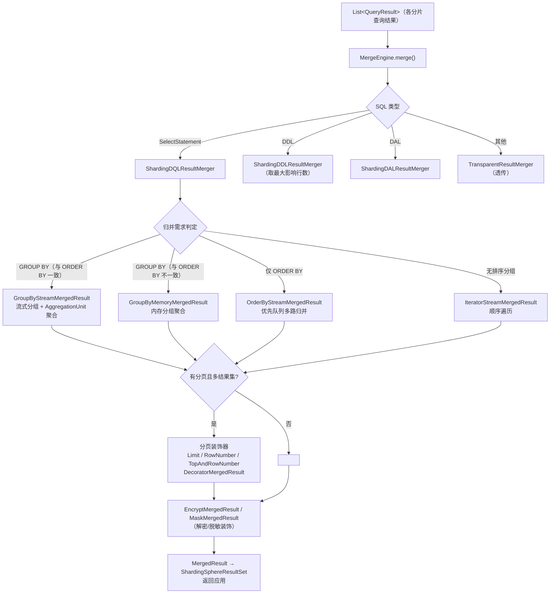

---

## 十一、数据分片实现原理总结

把五大引擎串起来，**分片的本质**是：

1. **逻辑层与物理层解耦**：应用只操作逻辑库/逻辑表；`ShardingSphereDatabase.resourceMetaData` 维护真实数据源，`ShardingRule` 的 `actualDataNodes`（inline 表达式或枚举）维护"逻辑表 → (库, 真实表)"的**全量映射空间**。
2. **分片键是定位坐标**：解析引擎从 WHERE/INSERT VALUES/Hint 中提取分片键值 → `ShardingConditions`。
3. **算法缩小搜索空间**：路由引擎以"可用目标集合 + 分片条件"调用分片算法，从全量映射空间收敛到少量 `DataNode` —— 这就是"分片"二字的落点。
4. **改写保证真实 SQL 语义等价**：表名替换、补列、分页/AVG 改写、生成主键、加密，确保每个分片上执行的 SQL 与逻辑语义等价且**信息足够归并**。
5. **并发执行 + 流式归并保证正确与高效**：多路归并排序/分组聚合/分页装饰在数学上还原全表语义，`AVG=SUM/COUNT`、`LIMIT` 的改写-补偿配合是关键设计。

### 11.1 关键设计模式一览

| 模式 | 应用 |
|---|---|
| 门面（Facade） | `SQLParserEngine` / `SQLRewriteEntry` / `MergeEngine` |
| 责任链 + SPI（Order） | SQLRouter 链、RewriteDecorator 链、ResultMerger 链、SQLAudit 链 |
| 策略（Strategy） | ShardingStrategy + ShardingAlgorithm 双层策略 |
| 装饰者 | 分页装饰 MergedResult、加密/脱敏 MergedResult |
| 访问者（Visitor） | ANTLR AST → SQLStatement |
| 模板方法 | `JDBCExecutorCallback`、`AbstractSQLBuilder` |
| 组合 | `SQLStatementContext`（语句+元数据绑定） |
| 工厂 | `ShardingRouteEngineFactory`、`AggregationUnitFactory`、`SQLParserFactory` |

### 11.2 性能设计要点

- 解析双缓存（ParseTree + SQLStatement）；
- 物理连接按需懒创建 + 逻辑连接内复用（`LinkedHashMultimap` 缓存）；
- 连接模式自适应（内存 vs 连接的权衡，`max-connections-size-per-query`）；
- 主线程 + 线程池混合执行（首组同步，避免无谓线程切换）+ TTL 上下文透传；
- 流式归并（优先队列）避免全量载入内存。

---

## 十二、全量 mermaid 图汇总

### 12.1 五大引擎总体架构图

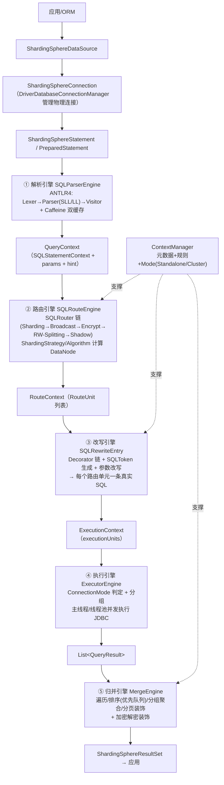

### 12.2 SQL 执行总流程图

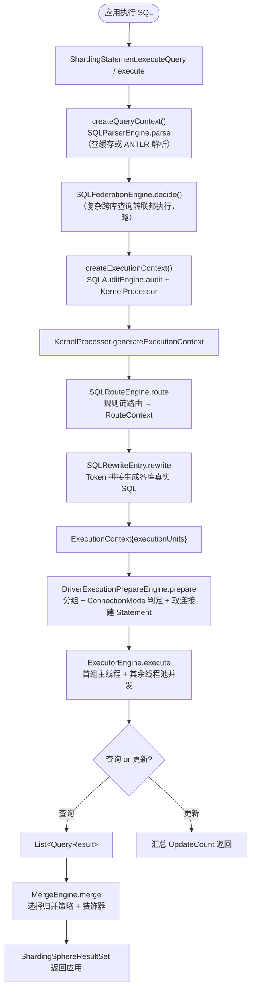

### 12.3 完整执行时序图

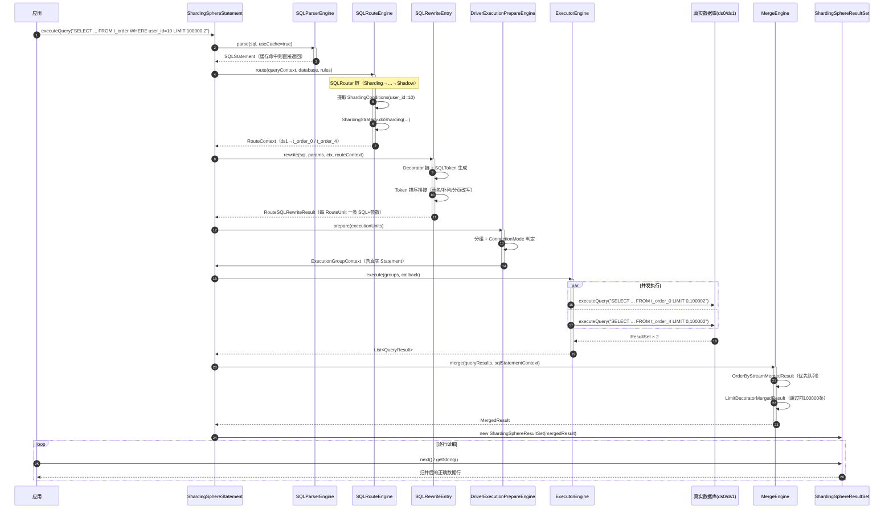

### 12.4 路由引擎类图（核心）

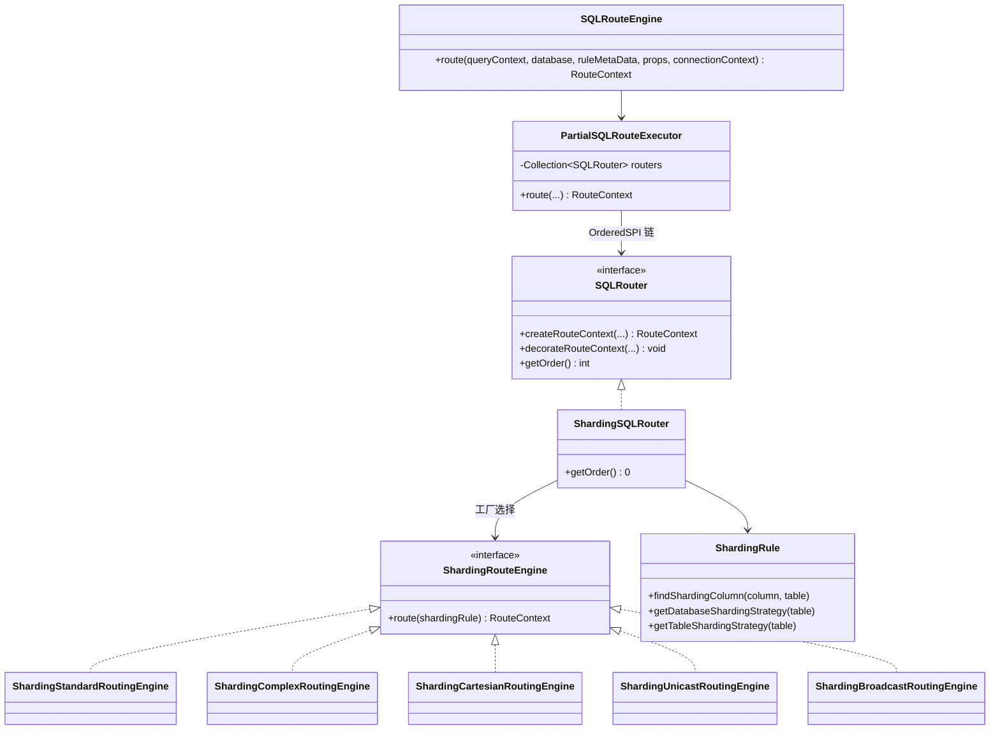

### 12.5 改写 Token 拼接示意

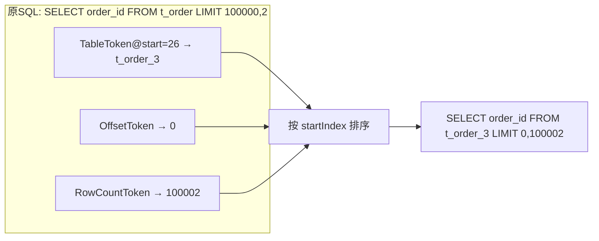

### 12.6 排序归并优先队列图解

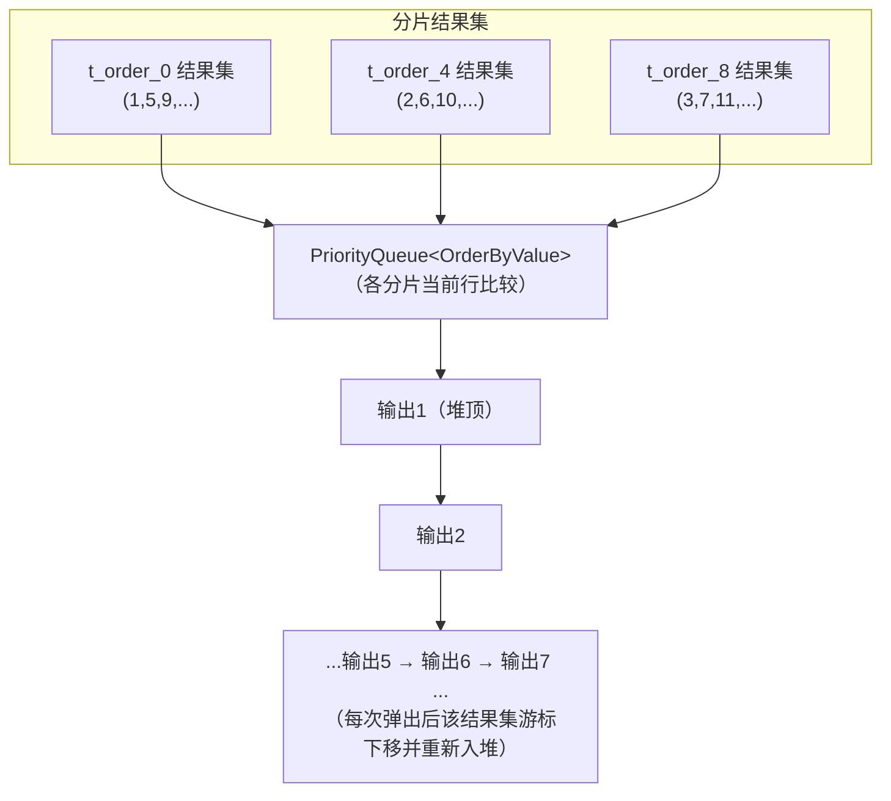

---

## 附录：关键源码文件速查表

| 领域 | 文件 |
|---|---|
| 内核编排 | `infra/context/src/main/java/org/apache/shardingsphere/infra/connection/kernel/KernelProcessor.java` |
| 解析门面 | `infra/parser/src/main/java/org/apache/shardingsphere/infra/parser/SQLParserEngine.java` |
| 解析执行 | `parser/sql/engine/.../api/SQLParserEngine.java`、`.../core/database/parser/SQLParserExecutor.java` |
| 路由入口 | `infra/route/src/main/java/org/apache/shardingsphere/infra/route/engine/SQLRouteEngine.java` |
| 分片路由器 | `features/sharding/core/.../route/engine/ShardingSQLRouter.java` |
| 标准路由 | `features/sharding/core/.../route/engine/type/standard/ShardingStandardRoutingEngine.java` |
| 分片策略 | `features/sharding/core/.../route/strategy/type/{standard,complex,hint,none}/` |
| 改写入口 | `infra/rewrite/src/main/java/org/apache/shardingsphere/infra/rewrite/SQLRewriteEntry.java` |
| 分片改写装饰器 | `features/sharding/core/.../rewrite/context/ShardingSQLRewriteContextDecorator.java` |
| 执行准备 | `infra/executor/.../sql/prepare/driver/DriverExecutionPrepareEngine.java`、`.../prepare/AbstractExecutionPrepareEngine.java`（连接模式判定） |
| 并发内核 | `infra/executor/src/main/java/org/apache/shardingsphere/infra/executor/kernel/ExecutorEngine.java` |
| 归并入口 | `infra/merge/src/main/java/org/apache/shardingsphere/infra/merge/MergeEngine.java` |
| DQL 归并 | `features/sharding/core/.../merge/dql/ShardingDQLResultMerger.java` |
| JDBC 各组件 | `jdbc/core/src/main/java/org/apache/shardingsphere/driver/jdbc/core/{datasource,connection,statement,resultset}/` |

> 说明：文中源码片段为便于阅读做了删减与注释补充，完整实现以本地仓库对应文件为准。
