# ShardingSphere-Proxy（Apache ShardingSphere 5.4.0）实现原理与源码深度解析

> 本文基于本地源码 `shardingsphere-5.4.0`（proxy / db-protocol / mode / infra 模块）逐层分析，
> 所有类名、方法名、包路径均来自真实源码；与前作《ShardingJDBC底层实现原理与源码深度解析.md》互补，
> 解析/路由/改写/执行/归并五大引擎的内部细节请参见该文，本文聚焦 Proxy 特有的网络协议层、会话层、后端连接层与启动治理体系。

---

## 目录

1. [Proxy 是什么：与 ShardingJDBC 的本质差异](#一proxy-是什么与-shardingjdbc-的本质差异)
2. [整体架构与模块划分](#二整体架构与模块划分)
3. [启动流程源码分析](#三启动流程源码分析)
4. [网络协议层（db-protocol + Netty Pipeline）](#四网络协议层)
5. [连接生命周期与认证（握手 -> 命令分发）](#五连接生命周期与认证)
6. [会话层：ConnectionSession 与系统变量/预处理语句](#六会话层)
7. [SQL 命令执行全链路（核心工作流程）](#七sql-命令执行全链路)
8. [后端连接体系（BackendConnection / BackendDataSource）](#八后端连接体系)
9. [事务处理（LOCAL / XA / BASE）](#九事务处理)
10. [配置体系与集群治理（Mode / RegistryCenter / DistSQL）](#十配置体系与集群治理)
11. [Proxy 与 JDBC 全面对比](#十一proxy-与-jdbc-全面对比)
12. [全量 mermaid 图汇总](#十二全量-mermaid-图汇总)

---

## 一、Proxy 是什么：与 ShardingJDBC 的本质差异

ShardingSphere-Proxy 是一个 **独立部署的数据库代理服务器进程**。它把自己"伪装"成一个真实的数据库：

- **前端**：实现 MySQL / PostgreSQL / openGauss 的 **原生网络协议**，任何语言、任何 MySQL/PG 客户端、任何 ORM 都能直连它，应用完全无感知；
- **后端**：通过标准 JDBC（或数据库原生驱动）连接真实的分片数据库；
- **中间**：复用与 ShardingJDBC 完全相同的内核（解析 -> 路由 -> 改写 -> 执行 -> 归并，`KernelProcessor`）。

与 ShardingJDBC 的本质差异：

| 维度 | ShardingSphere-Proxy | ShardingSphere-JDBC |
|---|---|---|
| 形态 | 独立进程（服务器） | 嵌入应用的 jar（增强 JDBC 驱动） |
| 入口 | 网络协议字节流（Netty） | Java 方法调用（DataSource.getConnection） |
| 对客户端的要求 | 无（任何支持 MySQL/PG 协议的客户端） | 必须 Java + JDBC |
| SQL 到达方式 | 需自行完成 **协议解码 -> 还原 SQL 文本** | 直接拿到 SQL 字符串 |
| 结果返回方式 | 需自行把归并结果 **编码为协议包** 写回网络 | 直接返回 ResultSet 对象 |
| 性能 | 多一跳网络转发 | 进程内调用，零额外网络开销 |
| 部署/治理 | 天然中心化，支持集群、多语言、运维友好 | 去中心化，与应用同生共死 |

> 一句话：**Proxy = 网络协议层 + 会话层 + 后端连接层 + 与 JDBC 完全共享的 Kernel 内核。**

---

## 二、整体架构与模块划分

### 2.1 相关源码模块

```
shardingsphere-5.4.0/
├── proxy/                          # Proxy 主体
│   ├── frontend/                   #   ★ 前端：Netty 服务器 + 各数据库协议的命令处理
│   │   ├── netty/                  #     ServerHandlerInitializer、FrontendChannelInboundHandler、
│   │   │                           #     PacketCodec、ProxyFlowControlHandler、CommandExecutorTask...
│   │   ├── mysql/                  #     MySQL 命令执行器（COM_QUERY / COM_STMT_* / AUTH...）
│   │   ├── postgresql/  opengauss/ #     PG/openGauss 扩展查询协议（parse/bind/execute/describe）
│   │   └── command/                #     CommandExecuteEngine 接口
│   ├── backend/                    #   ★ 后端：SQL 执行、连接管理、会话、DistSQL
│   │   ├── connector/              #     ProxySQLExecutor、ProxyDatabaseConnectionManager、
│   │   │   │                       #     JDBCBackendDataSource、ProxyJDBCExecutor、BackendTransactionManager
│   │   ├── session/                #     ConnectionSession、TransactionStatus、ServerPreparedStatementRegistry
│   │   ├── handler/                #     ProxyBackendHandlerFactory、admin/转发性执行器、distsql/
│   │   ├── response/               #     ResponseHeader 体系（query/update）
│   │   └── config/                 #     ProxyConfigurationLoader（YAML 加载）
│   └── initializer/                #   BootstrapInitializer
├── db-protocol/                    # ★ 数据库网络协议实现（纯协议，不含业务）
│   ├── core/                       #   DatabasePacketCodecEngine、PacketPayload 抽象
│   ├── mysql/                      #   MySQL 包模型 + 编解码（handshake/generic/command/binlog）
│   ├── postgresql/                 #   PostgreSQL 包模型（标识符协议）
│   └── opengauss/                  #   openGauss 协议
├── mode/                           # ★ Standalone/Cluster 模式、RegistryCenter、元数据持久化
├── infra/  kernel/  features/  parser/   # 与 JDBC 完全共享的内核（五大引擎、规则、元数据）
```

### 2.2 分层架构

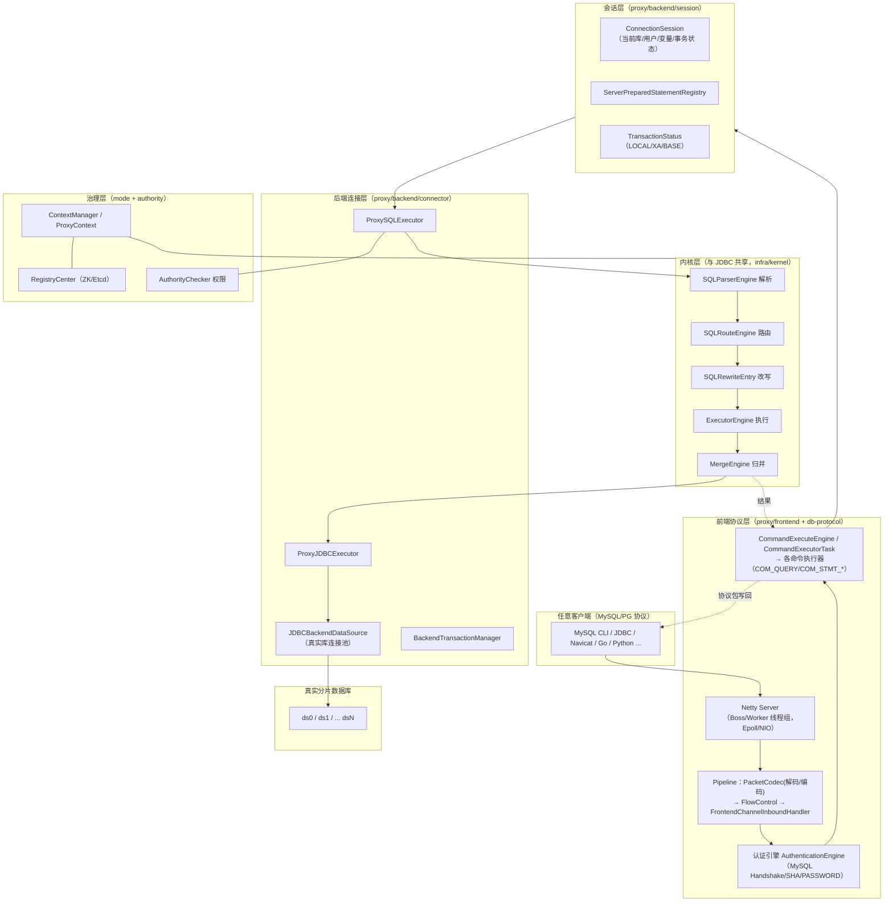

---

## 三、启动流程源码分析

### 3.1 主入口：`org.apache.shardingsphere.proxy.Bootstrap`

```java
public static void main(final String[] args) throws IOException, SQLException {
    BootstrapArguments bootstrapArgs = new BootstrapArguments(args);          // ① 解析 -p 端口、-c 配置目录等参数
    YamlProxyConfiguration yamlConfig =
        ProxyConfigurationLoader.load(bootstrapArgs.getConfigurationPath());  // ② 加载 server.yaml + config-*.yaml
    int port = bootstrapArgs.getPort().orElseGet(() ->                        // ③ 端口：命令行 > proxy-default-port(默认3307)
        new ConfigurationProperties(yamlConfig.getServerConfiguration().getProps())
            .getValue(ConfigurationPropertyKey.PROXY_DEFAULT_PORT));
    new BootstrapInitializer().init(yamlConfig, port, bootstrapArgs.isForce()); // ④ 初始化元数据/规则/数据源上下文
    // ⑤ CDC 服务器（可选端口）
    // ⑥ ProxySSLContext.init()  SSL
    ShardingSphereProxy proxy = new ShardingSphereProxy();                     // ⑦ 启动 Netty 服务器
    proxy.start(port, addresses);
}
```

### 3.2 初始化：`BootstrapInitializer`

```java
public void init(final YamlProxyConfiguration yamlConfig, final int port, final boolean force) {
    ModeConfiguration modeConfig = new YamlModeConfigurationSwapper()
            .swapToObject(yamlConfig.getServerConfiguration().getMode());       // Standalone / Cluster
    ProxyConfiguration proxyConfig = new YamlProxyConfigurationSwapper().swap(yamlConfig); // YAML -> 领域对象
    ContextManager contextManager = createContextManager(proxyConfig, modeConfig, port, force);
    ProxyContext.init(contextManager);        // ★ 全局单例，后续一切组件从这里取元数据/规则
    ShardingSphereProxyVersion.setVersion(contextManager);
}
```

`createContextManager()` 通过 **SPI（`TypedSPILoader.getService(ContextManagerBuilder.class, modeType)`）** 选择构建器：

- `ClusterContextManagerBuilder`：连接 ZooKeeper / Etcd 注册中心，**优先从注册中心恢复配置**（本地 YAML 只在首次入库时使用），随后注册实例、订阅元数据变更事件；
- `StandaloneContextManagerBuilder`：配置持久化到本地文件（`.shardingsphere` 目录）。

构建器内部为每个 `config-*.yaml` 创建逻辑库：
1. `DataSourcePoolCreator` 创建真实数据源连接池（HikariCP 等，SPI 可换）；
2. 加载表/列元数据；
3. 装配规则链（ShardingRule 等）形成 `ShardingSphereDatabase`；
4. 汇总为 `MetaDataContexts`，挂到 `ContextManager`。

### 3.3 Netty 服务器：`proxy.frontend.ShardingSphereProxy`

启动逻辑要点（源码概括）：
- 自动选择 `EpollEventLoopGroup`（Linux）或 `NioEventLoopGroup`；
- `ServerBootstrap` 配置：`PooledByteBufAllocator`（池化直接内存）、`SO_REUSEADDR`、`TCP_NODELAY`、`SO_BACKLOG`；
- `ServerHandlerInitializer` 作为 childHandler；
- 绑定端口（支持多地址），注册 JVM shutdown hook 优雅关闭。

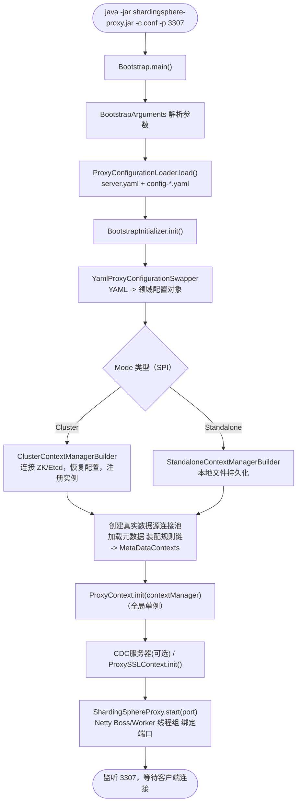

---

## 四、网络协议层

### 4.1 db-protocol 模块：三种协议一套抽象

| 协议 | 模块 | 传输模型 |
|---|---|---|
| MySQL | `db-protocol/mysql` | **包（packet）模型**：每包 = 3 字节长度 + 1 字节序列号 + payload；≤16MB-1，超长自动分包重组 |
| PostgreSQL | `db-protocol/postgresql` | **消息模型**：1 字节消息类型 + 4 字节长度（含自身）；启动/认证/简单查询/扩展查询四大阶段 |
| openGauss | `db-protocol/opengauss` | 基于 PG 协议的华为扩展 |

统一抽象（`db-protocol/core`）：

```java
public interface DatabasePacketCodecEngine<T extends DatabasePacket> {
    boolean isValidHeader(int readableBytes);                 // 头部是否完整（拆包判断）
    void decode(ChannelHandlerContext ctx, ByteBuf in, List<Object> out);  // 字节 -> 协议包
    void encode(ChannelHandlerContext ctx, DatabasePacket message, ByteBuf out); // 协议包 -> 字节
    PacketPayload createPacketPayload(ByteBuf message, Charset charset);
}
```

- **PacketPayload**（如 `MySQLPacketPayload` / `PostgreSQLPacketPayload`）：对 ByteBuf 的方言化封装，提供 `readIntN/readStringLenenc/readStringNul/write...` 等原语 -- MySQL 的长度编码整数/字符串、PG 的字符串数组都封装在这层；
- **MySQLPacket / PostgreSQLPacket**：所有协议包的抽象基类，各自实现 `write(payload)` / `read(payload)`。

### 4.2 典型 MySQL 协议包（`db-protocol.mysql.packet`）

| 包 | 路径子包 | 用途 |
|---|---|---|
| `MySQLHandshakePacket` / `MySQLHandshakeResponse41Packet` | `handshake` | 服务端握手盐值 / 客户端认证应答 |
| `MySQLOKPacket` / `MySQLErrPacket` / `MySQLEofPacket` | `generic` | OK / 错误(错误码+SQLSTATE) / EOF 帧界 |
| `MySQLColumnDefinition41Packet` | `command.query` | 结果集列定义 |
| `MySQLTextResultSetRowPacket` | `command.query.text` | 文本协议结果行（COM_QUERY 用） |
| `MySQLBinaryResultSetRowPacket` | `command.query.binary.execute` | 二进制协议结果行（NULL 位图 + 定长/变长编码，COM_STMT_EXECUTE 用） |
| `MySQLComQueryPacket` / `MySQLComStmtExecutePacket` 等 | `command` | 客户端命令包 |

认证插件（`MySQLAuthenticationPlugin` 枚举）支持 `mysql_native_password`、`sha256_password`、`caching_sha2_password`、`mysql_clear_password`。

PostgreSQL 侧对应：`PostgreSQLComStartupPacket`、`PostgreSQLAuthenticationOKPacket`、`PostgreSQLRowDescriptionPacket`（列描述）、`PostgreSQLDataRowPacket`（数据行）、`PostgreSQLCommandCompletePacket`、`PostgreSQLErrorResponsePacket`，消息类型由 `PostgreSQLMessagePacketType`（单字节标识 'Q','P','B','E','D','S'...）区分。

### 4.3 Netty Pipeline 组装：`ServerHandlerInitializer`

```java
protected void initChannel(final Channel socketChannel) {
    DatabaseProtocolFrontendEngine engine = TypedSPILoader.getService(
            DatabaseProtocolFrontendEngine.class, databaseType.getType());   // ★ SPI 选择 MySQL/PG 前端引擎
    ChannelPipeline pipeline = socketChannel.pipeline();
    pipeline.addLast(new ChannelAttrInitializer());                           // 通道属性初始化
    pipeline.addLast(new PacketCodec(engine.getCodecEngine()));               // 协议编解码（帧拆包+包编解码）
    pipeline.addLast(new FrontendChannelLimitationInboundHandler(engine));    // 连接数限制
    pipeline.addLast(ProxyFlowControlHandler.class.getSimpleName(), new ProxyFlowControlHandler()); // 流控
    pipeline.addLast(FrontendChannelInboundHandler.class.getSimpleName(),
            new FrontendChannelInboundHandler(engine, socketChannel));        // ★ 核心业务处理器
    engine.initChannel(socketChannel);                                        // 方言扩展（见下）
}
```

方言扩展示例（MySQLFrontendEngine）：为 channel 挂 `MySQLConstants.MYSQL_SEQUENCE_ID` 属性（AtomicInteger 维护序列号），并注入 `MySQLSequenceIdInboundHandler` 校验请求包序列号连续性。

> **设计要点**：协议无关部分（流控、限制、业务处理）与协议相关部分（编解码引擎、命令分发）通过 `DatabaseProtocolFrontendEngine` SPI 解耦 -- 新增一种数据库协议只需实现该 SPI + 一套 db-protocol 包模型，Pipeline 骨架复用。

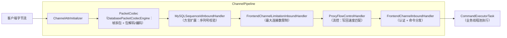

---

## 五、连接生命周期与认证

### 5.1 FrontendChannelInboundHandler（连接状态机）

```java
public void channelActive(ChannelHandlerContext context) {
    // 生成 connectionId，调用 engine.getAuthenticationEngine().handshake() 发送握手包（MySQL）
}
public void channelRead(ChannelHandlerContext context, Object message) {
    if (!authenticated) {
        authenticated = authenticate(context, (ByteBuf) message);   // 阶段1：认证
        return;
    }
    ProxyStateContext.execute(context, message, databaseProtocolFrontendEngine, connectionSession); // 阶段2：命令
}
public void channelInactive(ChannelHandlerContext context) {
    // 关闭 ConnectionSession、注销预处理语句、归还后端连接
}
```

### 5.2 认证流程（以 MySQL 为例）

`MySQLAuthenticationEngine`：
1. `handshake()`：发送 `MySQLHandshakePacket`（协议版本、salt、能力位、认证插件名）；
2. `authenticate()`：读取 `MySQLHandshakeResponse41Packet`，用 salt 对密码做 challenge-response 校验（按认证插件算法）；用户与权限来自 **authority 规则**（`ShardingSphereUser`，配置在 server.yaml 的 `rules`-`!AUTHORITY`），通过后回 `MySQLOKPacket`；
3. PostgresSQL 则走 Startup -> `AuthenticationMD5Password`/cleartext -> `AuthenticationOK`。

### 5.3 MySQL 握手 + 查询协议交互序列

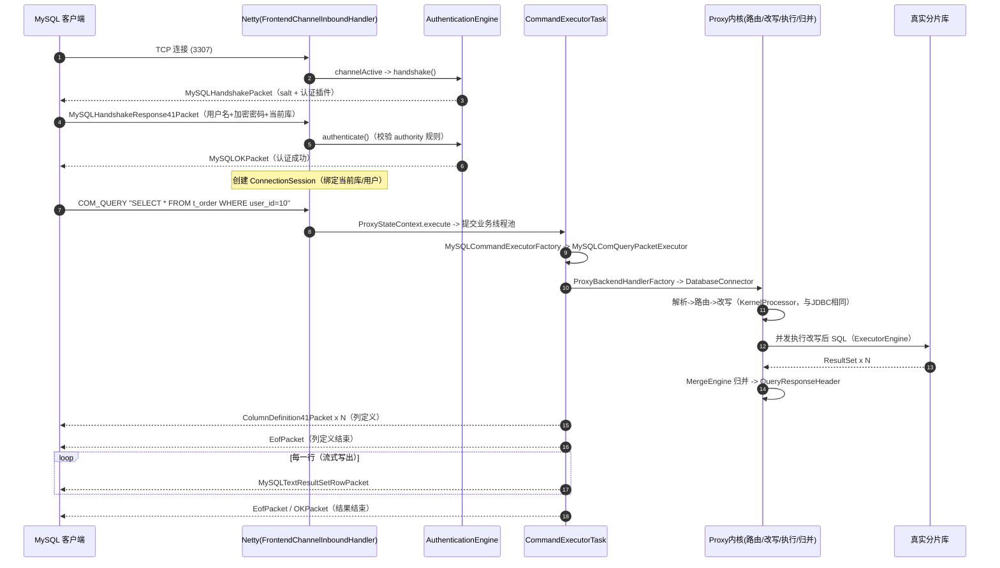

### 5.4 命令分发

`CommandExecutorTask.run()`（提交到业务线程池，避免阻塞 Netty IO 线程）模板流程：

```
1. commandExecuteEngine.getCommandPacketType(payload)      // MySQL: 读 1 字节命令类型；PG: 消息类型字节
2. commandExecuteEngine.getCommandPacket(payload, type, connectionSession)   // 字节 -> 命令包对象
3. commandExecuteEngine.getCommandExecutor(type, commandPacket, connectionSession)  // ★工厂产出执行器
4. commandExecutor.execute()                               // 执行（内部可能多次写回协议包）
5. 写回响应（flush），异常则写 ErrPacket
```

MySQL 命令执行器工厂 `MySQLCommandExecutorFactory` 按 `MySQLCommandPacketType` 分发：

| 命令 | 执行器 | 处理 |
|---|---|---|
| `COM_QUERY` | `MySQLComQueryPacketExecutor` | 文本 SQL：转交 `ProxyBackendHandlerFactory`；内含 use db / set / quit / heartbeat 等管理子命令分支 |
| `COM_STMT_PREPARE` | `MySQLComStmtPrepareExecutor` | 解析 SQL，返回参数/列元数据，注册到 `ServerPreparedStatementRegistry` |
| `COM_STMT_EXECUTE` | `MySQLComStmtExecuteExecutor` | 取出预处理语句，解码二进制参数（类型 + 值），绑定后走内核执行，结果以 `MySQLBinaryResultSetRowPacket` 写回 |
| `COM_STMT_CLOSE/RESET` | `MySQLComStmtCloseExecutor` 等 | 注销/重置 |
| `COM_QUIT` | ... | 关闭会话 |

PostgreSQL 走扩展查询协议：`Parse`（命名预处理语句）/`Bind`（参数绑定）/`Describe`/`Execute`/`Sync` 各自的 packet executor，状态保存在 ConnectionSession 中。

---

## 六、会话层

### 6.1 ConnectionSession（`proxy.backend.session.ConnectionSession`）

每个前端连接一个会话，字段概括：

- `databaseType`（前端协议类型）、`connectionId`、当前逻辑库名（`USE` 可切换）；
- `Grantee`（已认证用户，供权限校验）；
- 系统变量区（`SystemVariable`，`SET autocommit/SQL_MODE/charset` 等的会话级值，未识别的变量透传后端）；
- `TransactionStatus`（事务类型与开关状态）；
- `ProxyDatabaseConnectionManager`（后端物理连接管理）；
- `ServerPreparedStatementRegistry`（statementId -> 预处理语句）。

系统变量处理（如 `MySQLSetVariableAdminExecutor` / `SessionVariableHandler`）：**Proxy 已知的变量记录在会话中本地生效**；未识别的 `SET` 语句作为 admin 语句**透传到所有后端连接**，保证行为与真实库一致。

### 6.2 预处理语句注册表

`ServerPreparedStatementRegistry`：`ConnectionId + StatementId -> MySQLServerPreparedStatement`（缓 SQL 解析结果 + 参数元数据）。注意：**Proxy 侧的"预处理"不等于真实库的预处理** -- 默认模式下 `COM_STMT_EXECUTE` 仍以文本 SQL + 参数下发后端 JDBC（可通过开关使用后端 PreparedStatement）。这是 Proxy 模式吞吐设计上的一个权衡点。

---

## 七、SQL 命令执行全链路（核心工作流程）

### 7.1 后端处理器工厂：`ProxyBackendHandlerFactory`

拿到 SQL 文本后，第一步是**识别 SQL 类别**并选出后端处理器：

```
SQL -> SQLParserEngine.parse（拿到 SQLStatement）
 ├─ DistSQLStatement（RDL/RQL/RAL）      -> DistSQLBackendHandler   // 第十节
 ├─ 系统管理语句（SHOW/SET/USE/DESC...）  -> admin 系执行器（部分本地生成、部分透传真实库）
 ├─ 未支持语句                            -> MySQLTransferExecutor（原样透传）
 └─ 普通业务 SQL                          -> DatabaseBackendHandler -> DatabaseConnector   // ★ 主链路
```

`ProxyBackendHandlerFactory.newInstance()` 同时完成 **权限校验**：

```java
new AuthorityChecker(authorityRule, connectionSession.getGrantee()).checkPrivileges(databaseName, sqlStatement);
```

### 7.2 DatabaseConnector（内核编排）

`DatabaseConnector`（proxy/backend/connector）持有 `QueryContext`，按连接状态懒生成执行上下文：

```java
// DatabaseConnector 概括
ExecutionContext executionContext = new KernelProcessor().generateExecutionContext(
        queryContext, database, globalRuleMetaData, props, connectionContext);
// ★ 与 ShardingJDBC 完全同一份内核代码：SQLAuditEngine.audit -> route -> rewrite -> ExecutionContext
```

差异在于**执行阶段**：JDBC 用 `DriverExecutor`（面向 JDBC Statement），Proxy 用 `ProxySQLExecutor`。

### 7.3 ProxySQLExecutor（执行阶段）

```java
public ExecuteResult execute(final ExecutionContext executionContext) {
    checkExecutePrerequisites(executionContext);        // 前置检查（如 XA 中禁止部分 DDL）
    return hasRawExecutionRule(rules)
            ? rawExecute(...)                           // 原生执行（如 GUI 数据库探活/ES 等无 SQL 引擎规则）
            : useDriverToExecute(...);                  // JDBC 驱动执行（主流程）
}
```

`useDriverToExecute()`：
1. 构造 `DriverExecutionPrepareEngine<JDBCExecutionUnit, Connection>`（与 JDBC 相同的分组 + ConnectionMode 判定逻辑）；
2. `proxyDatabaseConnectionManager.getConnections(...)` 取后端连接（见第八节）；
3. `ProxyJDBCExecutor`（组合 infra 的 `JDBCExecutor`）在 **ExecutorEngine 线程池**上并发执行所有分片 SQL；
4. 查询结果 `List<QueryResult>` 交给 `MergeEngine` 归并 -> `QueryResponseHeader`；更新 -> `UpdateResponseHeader`。

### 7.4 结果写回（协议编码）

- **响应头模型**（`proxy.backend.response.header`）：
  - `QueryResponseHeader`：`QueryHeader` 列表（列名/类型/长度，由 `QueryHeaderBuilderEngine` 从归并元数据构建）+ 归并后的 `MergedResult`；
  - `UpdateResponseHeader`：updateCount / lastInsertId。
- **协议构建**（以 MySQL 为例，`ResponsePacketBuilder` + `MySQLCommandExecuteEngine.writeQueryData()`）：
  1. `MySQLColumnDefinition41Packet` × N（列定义）→ `MySQLEofPacket`；
  2. **逐行流式**：`MergedResult.next()` 每读一行即构造 `MySQLTextResultSetRowPacket` / `MySQLBinaryResultSetRowPacket` 写入 channel；
  3. 累积到 `proxy-frontend-flush-threshold`（默认 128 个包）才 flush -- **批量刷新**摊薄系统调用，同时配合 `ProxyFlowControlHandler` 在客户端读慢时反压，避免大结果集撑爆内存；
  4. 结束 `MySQLEofPacket` / `MySQLOKPacket`。

> **流式设计是 Proxy 的关键**：归并引擎本身是流式的（优先队列多路归并，见前作第十节），Proxy 写回也逐行流式 -- 两级流水线让超大结果集的内存占用保持 O(分片数) 而非 O(行数)。

### 7.5 完整执行流程图

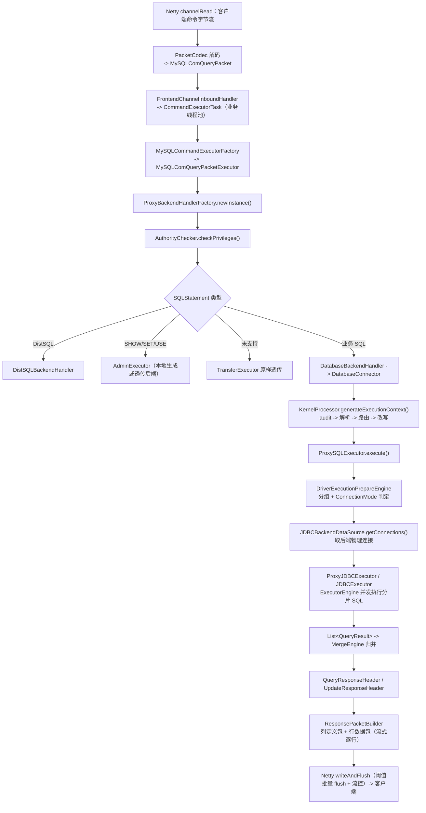

---

## 八、后端连接体系

### 8.1 连接管理链

```
ConnectionSession（会话）
  └─ ProxyDatabaseConnectionManager（会话级：本会话持有的后端连接缓存、事务状态联动）
       └─ BackendDataSource（接口）
            └─ JDBCBackendDataSource（实现：从元数据取真实 DataSource 建物理连接）
```

`JDBCBackendDataSource.getConnections()` 核心逻辑（源码节选）：

```java
DataSource dataSource = ProxyContext.getInstance().getContextManager().getMetaDataContexts()
        .getMetaData().getDatabase(databaseName).getResourceMetaData().getDataSources().get(dataSourceName);
if (1 == connectionSize) {
    return Collections.singletonList(createConnection(...));
}
if (ConnectionMode.CONNECTION_STRICTLY == connectionMode) {
    return createConnections(...);                 // 连接限制模式：逐个新建
}
synchronized (dataSource) {
    return createConnections(...);                 // 内存限制模式：串行化创建，配合连接池公平获取
}
```

要点：
- 真实数据源是 **连接池**（HikariCP 等），Proxy 的"后端连接数" = 池的 maxPoolSize；一个前端会话按需从池借出多条连接（同 JDBC 版的 `DriverDatabaseConnectionManager` 思想一致）；
- 事务开启后，会话持有的连接 **绑定到事务上下文** 直到 commit/rollback（保证同一事务路由到同一物理连接）；
- `proxy-frontend-database-protocol-type` 与存储端协议可以不同（例如前端 MySQL、后端 PG），协议由前端决定、方言由后端 DatabaseType 决定，改写引擎按 storageTypes 输出方言 SQL。

### 8.2 连接模式复用

分片 SQL 数 vs `max-connections-size-per-query` 的判定逻辑（`AbstractExecutionPrepareEngine`）与 JDBC 完全相同 -- **内核与连接模型是共享的，只是"连接的来源"不同**：JDBC 从应用进程内 DataSource 取，Proxy 从代理进程的集中连接池取。

---

## 九、事务处理

### 9.1 事务状态：`TransactionStatus`

会话级状态：事务类型 `TransactionType`（`LOCAL` / `XA` / `BASE`）+ 开关状态。来源：
- 连接级默认事务类型（server.yaml `props` 或 DistSQL 设置）；
- `BEGIN`/`START TRANSACTION`/`SET autocommit=0`/`COMMIT`/`ROLLBACK` 等命令由事务命令执行器捕获并驱动状态机。

### 9.2 `BackendTransactionManager`（proxy/backend/connector/jdbc/transaction）

- **LOCAL**：透传 `commit/rollback` 到会话持有的所有后端连接（弱保证：部分成功部分失败时无法回滚已提交部分，官方明确提示本地事务跨分片不保证原子性）；
- **XA**：`ShardingSphereDistributedTransactionManager` 集成 XA 事务管理器（Atomikos/Narayana/Seata，SPI），后端连接用 `XAConnection` 包装，commit 走 **两阶段提交（2PC）**；
- **BASE**：Seata AT 模式柔性事务。

事务对连接获取的影响：`getConnections()` 时若处于事务中，相同 dataSource 必须返回**已绑定的同一连接**；`TransactionHook` SPI 提供事务前后回调扩展点。

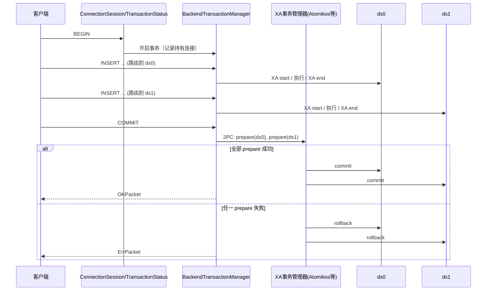

---

## 十、配置体系与集群治理

### 10.1 配置文件

```
conf/
├── server.yaml          # 全局：mode(Standalone/Cluster)、authority(用户/密码/权限)、props(代理参数)
└── config-logic_db.yaml # 每逻辑库一个：数据源 + 规则(分片/加密/读写分离...)
```

加载类：`ProxyConfigurationLoader`（扫描目录、加载、`YamlProxyConfigurationSwapper` 转换）。集群模式下 YAML 仅作 **首次初始化**，之后以注册中心为唯一事实源。

### 10.2 集群治理（mode/cluster）

核心：`RegistryCenter`（`mode.manager.cluster.coordinator`）+ `MetaDataRepository`（持久化仓库 SPI：ZooKeeper / Etcd）。

- **配置中心**：`/metadata/{database}/...`（数据源、规则、schema）、`/props`、`/nodes`（存活实例）；写入即持久化，读取用于实例启动恢复；
- **事件驱动同步**：配置变更 -> 注册中心节点数据变化 -> 各实例的监听器（如 `MetaDataSubscriber` 体系）-> `ContextManager` 重载对应 `ShardingSphereDatabase` -> **全部 Proxy 实例元数据秒级一致**（JDBC 嵌入式实例在同一套机制下也能动态感知）；
- **实例注册/心跳**：`/instances/{instanceId}` 临时节点，用于 SHOW INSTANCE LIST 等治理查询。

### 10.3 DistSQL（Proxy 的运维接口）

DistSQL 是"通过 SQL 管理资源与规则"的接口，三类：

| 类别 | 示例 | 作用 |
|---|---|---|
| RDL 资源定义 | `REGISTER STORAGE UNIT`、`CREATE SHARDING TABLE RULE` | 增删数据源/规则 |
| RQL 资源查询 | `SHOW SHARDING TABLE RULES`、`SHOW STORAGE UNITS` | 查询元数据 |
| RAL 控制管理 | `SET DIST VARIABLE`、`PREVIEW`、`REFRESH TABLE METADATA`、`LABEL` | 运行时控制/预览路由 |

处理链：解析出 `DistSQLStatement` -> `DistSQLBackendHandlerFactory` -> 对应 `DistSQLExecutor`（查询元数据或调用 `ContextManager` 变更配置）-> 变更经 `RegistryCenter` 持久化并广播 -> 各实例自动刷新。`PREVIEW` 语句可在不执行的情况下展示"解析 -> 路由 -> 改写"结果，是排查分片问题的利器。

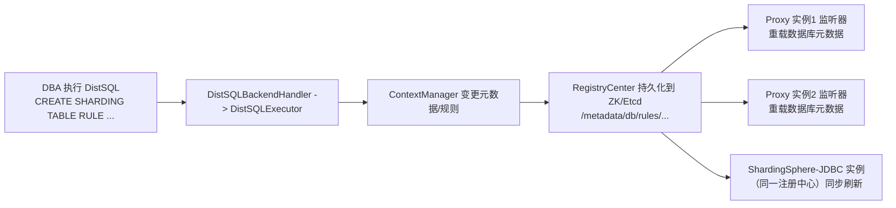

---

## 十一、Proxy 与 JDBC 全面对比

| 维度 | ShardingSphere-Proxy | ShardingSphere-JDBC |
|---|---|---|
| 入口抽象 | `Bootstrap` -> Netty -> `FrontendChannelInboundHandler` | `ShardingSphereDataSource` -> `ShardingSphereConnection/Statement` |
| SQL 获取 | 协议解码还原（COM_QUERY 文本 / 二进制参数绑定） | 直接 String 参数 |
| 内核（解析/路由/改写/执行/归并） | **完全共享**（`KernelProcessor` 同一份代码） | 完全共享 |
| 执行器 | `ProxySQLExecutor` + `ProxyJDBCExecutor` | `DriverExecutor`/`StatementExecutor`/`PreparedStatementExecutor` |
| 连接管理 | `ProxyDatabaseConnectionManager` + `JDBCBackendDataSource`（集中连接池） | `DriverDatabaseConnectionManager`（应用内，每实例各自连接） |
| 结果返回 | 协议包编码 + 流式写回（flush 阈值 + 流控） | `ShardingSphereResultSet` 内存对象 |
| 认证/权限 | 协议级认证 + `AuthorityChecker` | 无（信任应用） |
| 事务 | 会话级 `TransactionStatus`，XA/BASE 由代理集中协调 | 应用侧事务上下文，XA 需嵌入事务管理器 |
| 动态治理 | 原生 DistSQL + 注册中心，多实例一致 | 同样可接注册中心，但管理入口少 |
| 适用场景 | 多语言、中心化运维、DBA 直连、透明分库分表 | Java 应用、极致性能、轻量部署 |

> 官方推荐生产组合：**ShardingSphere-JDBC（性能路径）+ ShardingSphere-Proxy（运维/异构路径）混合部署**，两者通过同一注册中心共享元数据与规则。

---

## 十二、全量 mermaid 图汇总

### 12.1 Proxy 总体架构图

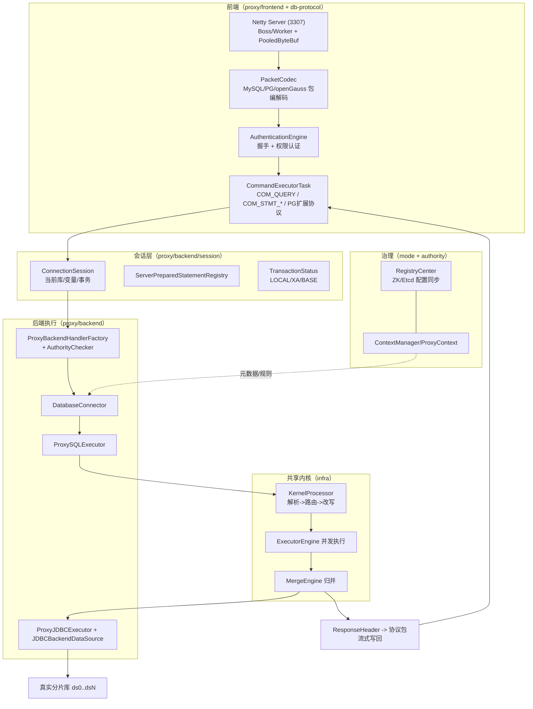

### 12.2 启动流程时序图

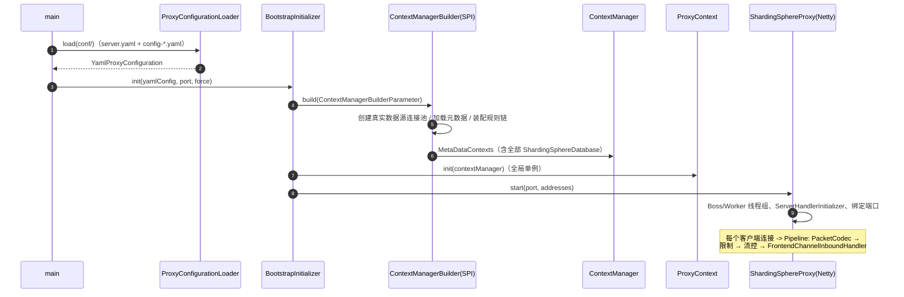

### 12.3 一条 SQL 的端到端时序图（MySQL 协议）

见 [第 5.3 节时序图](#五连接生命周期与认证)，涵盖：握手认证 -> COM_QUERY -> 命令工厂 -> 权限校验 -> KernelProcessor 五大引擎 -> ExecutorEngine 并发 -> MergeEngine 归并 -> 列定义/行数据流式写回。

### 12.4 后端处理器选择流程图

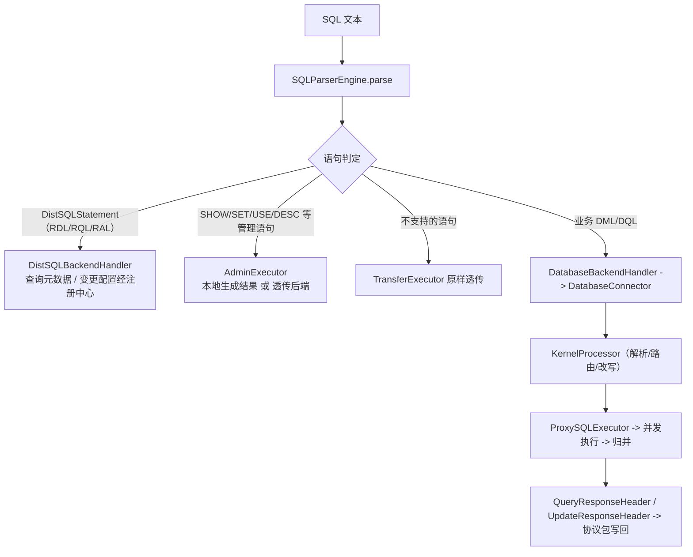

### 12.5 Proxy 与 JDBC 架构对照图

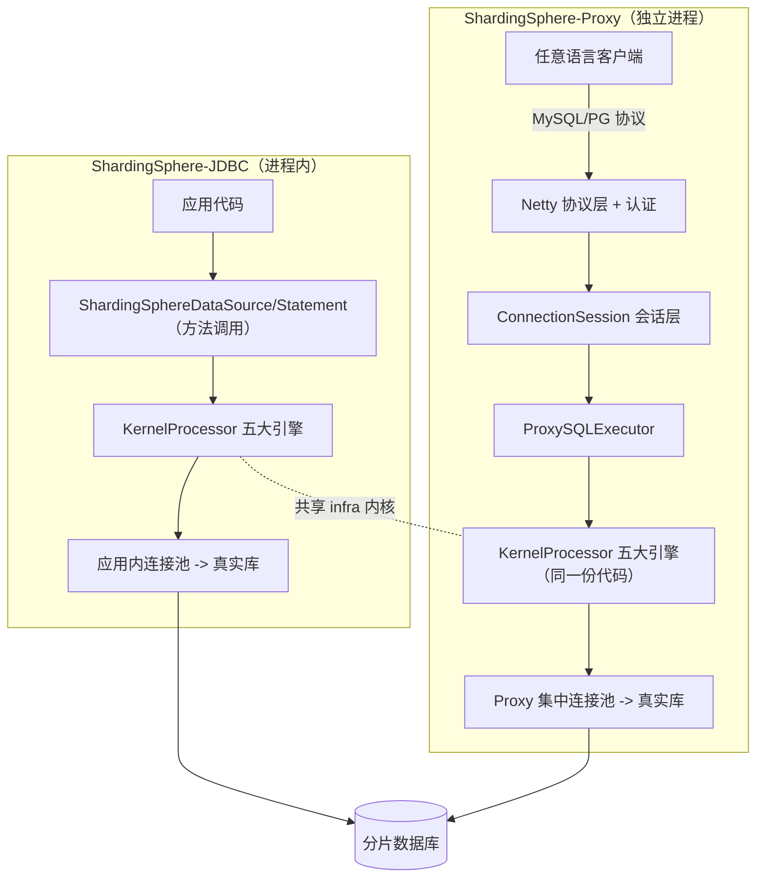

---

## 附录：关键源码文件速查表

| 领域 | 文件 |
|---|---|
| 启动入口 | `proxy/bootstrap/src/main/java/org/apache/shardingsphere/proxy/Bootstrap.java` |
| 初始化 | `proxy/.../initializer/BootstrapInitializer.java` |
| Netty 服务器 | `proxy/frontend/.../ShardingSphereProxy.java` |
| Pipeline 组装 | `proxy/frontend/.../netty/ServerHandlerInitializer.java` |
| 连接状态机 | `proxy/frontend/.../netty/FrontendChannelInboundHandler.java` |
| 命令任务 | `proxy/frontend/.../command/CommandExecutorTask.java` |
| 命令工厂（MySQL） | `proxy/frontend/.../mysql/command/MySQLCommandExecutorFactory.java` |
| 协议编解码引擎 | `db-protocol/mysql/.../codec/MySQLPacketCodecEngine.java`、`db-protocol/core/.../DatabasePacketCodecEngine.java` |
| 协议包 | `db-protocol/mysql/.../packet/{handshake,generic,command}/`、`db-protocol/postgresql/.../packet/` |
| 会话 | `proxy/backend/.../session/ConnectionSession.java`、`ServerPreparedStatementRegistry.java` |
| 后端处理器工厂 | `proxy/backend/.../handler/ProxyBackendHandlerFactory.java` |
| 内核连接器 | `proxy/backend/.../connector/DatabaseConnector.java` |
| 执行器 | `proxy/backend/.../connector/ProxySQLExecutor.java`、`.../jdbc/executor/ProxyJDBCExecutor.java` |
| 后端数据源 | `proxy/backend/.../connector/jdbc/datasource/JDBCBackendDataSource.java` |
| 事务管理 | `proxy/backend/.../connector/jdbc/transaction/BackendTransactionManager.java`、`transaction/core/ShardingSphereDistributedTransactionManager.java` |
| 配置加载 | `proxy/backend/.../config/ProxyConfigurationLoader.java` |
| 集群治理 | `mode/cluster/.../coordinator/RegistryCenter.java`、`mode/manager/ContextManager.java` |
| 全局上下文 | `proxy/backend/.../ProxyContext.java` |

> 说明：文中源码片段为便于阅读做了删减与注释补充，完整实现以本地仓库对应文件为准。
