# Spring Framework 5.3.38 源码深度解析

> 本文档基于本仓库（spring-framework-5.3.38）真实源码逐行分析而成，所有代码摘录均标注 `文件路径:行号`，可直接点击跳转对照阅读。
>
> 覆盖主题：容器启动流程、refresh() 刷新流程、Bean 生命周期、常用扩展点（BeanPostProcessor / BeanFactoryPostProcessor / Lifecycle）、Spring SPI 机制、ShutdownHook、核心注解实现原理（@Value / @ComponentScan / @Bean / @Component / @Import / @PropertySource / @Lazy / @ImportResource / @Autowired / @Resource 等）、声明式事务、AOP、循环依赖（三级缓存）、Spring Web（父子容器、DispatcherServlet、参数解析、响应处理）、Spring 异步任务（@Async）、定时任务（@Scheduled）、缓存抽象（Spring Cache）、动态数据源（AbstractRoutingDataSource）、异步请求（DeferredResult）、路由映射（@RequestMapping）、拦截器（HandlerInterceptor）与跨域（@CrossOrigin）。

---

## 目录

- [第一章 总览：Spring 的整体架构](#第一章-总览spring-的整体架构)
- [第二章 IoC 容器启动流程与 refresh() 刷新流程](#第二章-ioc-容器启动流程与-refresh-刷新流程)
- [第三章 Bean 的生命周期与常用扩展点、SPI、ShutdownHook](#第三章-bean-的生命周期与常用扩展点spi-机制shutdownhook)
- [第四章 Spring 核心注解实现原理](#第四章-spring-核心注解实现原理)
- [第五章 Spring AOP 实现原理](#第五章-spring-aop-实现原理)
- [第六章 Spring 声明式事务实现原理](#第六章-spring-声明式事务实现原理)
- [第七章 循环依赖（三级缓存）底层原理](#第七章-循环依赖三级缓存底层原理)
- [第八章 Spring Web 实现原理（父子容器 / DispatcherServlet / 参数与响应）](#第八章-spring-web-实现原理)
- [第九章 Spring 异步任务：@Async 实现原理](#第九章-spring-异步任务async-实现原理)
- [第十章 Spring 定时任务：@Scheduled 实现原理](#第十章-spring-定时任务scheduled-实现原理)
- [第十一章 Spring Cache：缓存抽象的整体架构与实现原理](#第十一章-spring-cache缓存抽象的整体架构与实现原理)
- [第十二章 动态数据源：AbstractRoutingDataSource 与多数据源路由原理](#第十二章-动态数据源abstractroutingdatasource-与多数据源路由原理)
- [第十三章 SpringMVC 异步请求：DeferredResult 实现原理](#第十三章-springmvc-异步请求deferredresult-实现原理)
- [第十四章 SpringMVC @RequestMapping 注解实现原理](#第十四章-springmvc-requestmapping-注解实现原理)
- [第十五章 SpringMVC 拦截器与 @CrossOrigin 跨域实现原理](#第十五章-springmvc-拦截器与-crossorigin-跨域实现原理)

---

# 第一章 总览：Spring 的整体架构

## 1.1 模块划分

Spring 5.3.38 源码工程由约 25 个模块组成，与本文相关的核心模块如下：

| 模块 | 职责 | 本文相关主题 |
|---|---|---|
| `spring-core` | 资源抽象、类型转换、SpEL、ASM 字节码元数据读取、工具类 | 注解元数据、@Value 的 SpEL |
| `spring-beans` | Bean 定义、Bean 工厂、属性编辑器、三级缓存、BeanPostProcessor 契约 | 容器体系、Bean 生命周期、循环依赖 |
| `spring-context` | ApplicationContext、注解驱动配置、事件、Lifecycle、spring.factories SPI | refresh、注解解析、扩展点 |
| `spring-aop` | AOP 联盟接口、代理工厂（JDK/CGLIB）、Pointcut/Advice 模型 | AOP |
| `spring-aspects` | 与 AspectJ 织入器的集成（`spring-aspects` 内的 ajc 编译切面） | @Aspect 支持 |
| `spring-tx` | 事务抽象、PlatformTransactionManager、声明式事务拦截器 | 声明式事务 |
| `spring-jdbc` | DataSourceTransactionManager、JdbcTemplate | 事务的 JDBC 实现 |
| `spring-web` | Web 抽象、ServletContainerInitializer、RestTemplate | Web 基础 |
| `spring-webmvc` | DispatcherServlet、注解式 MVC、参数解析、返回值处理 | Spring MVC |
| `spring-expression` | SpEL 表达式引擎 | @Value 的 `#{}` |

## 1.2 整体架构图

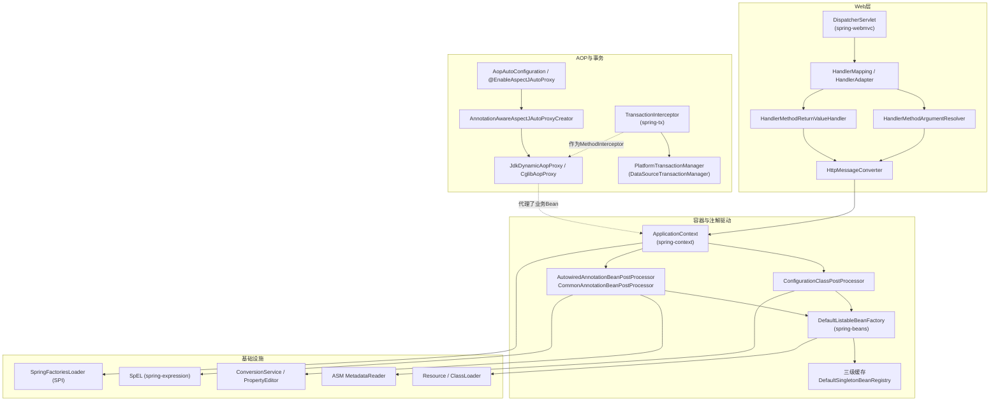
```mermaid
flowchart TB
    subgraph Web层
        W1["DispatcherServlet<br/>(spring-webmvc)"]
        W2["HandlerMapping / HandlerAdapter"]
        W3["HandlerMethodArgumentResolver"]
        W4["HandlerMethodReturnValueHandler"]
        W5["HttpMessageConverter"]
    end

    subgraph AOP与事务
        A1["AopAutoConfiguration / @EnableAspectJAutoProxy"]
        A2["AnnotationAwareAspectJAutoProxyCreator"]
        A3["JdkDynamicAopProxy / CglibAopProxy"]
        A4["TransactionInterceptor<br/>(spring-tx)"]
        A5["PlatformTransactionManager<br/>(DataSourceTransactionManager)"]
    end

    subgraph 容器与注解驱动
        C1["ApplicationContext<br/>(spring-context)"]
        C2["ConfigurationClassPostProcessor"]
        C3["AutowiredAnnotationBeanPostProcessor<br/>CommonAnnotationBeanPostProcessor"]
        C4["DefaultListableBeanFactory<br/>(spring-beans)"]
        C5["三级缓存<br/>DefaultSingletonBeanRegistry"]
    end

    subgraph 基础设施
        B1["Resource / ClassLoader"]
        B2["ConversionService / PropertyEditor"]
        B3["SpEL (spring-expression)"]
        B4["ASM MetadataReader"]
        B5["SpringFactoriesLoader (SPI)"]
    end

    W1 --> W2 --> W3 & W4
    W3 & W4 --> W5
    W5 --> C1

    A1 --> A2 --> A3
    A4 --> A5
    A3 -.代理了业务Bean.-> C1
    A4 -.作为MethodInterceptor.-> A3

    C1 --> C2 --> C4
    C1 --> C3 --> C4
    C4 --> C5
    C2 --> B4
    C3 --> B2 & B3
    C1 --> B5
    C4 --> B1
```

## 1.3 一句话原理串讲

1. **启动**：`AnnotationConfigApplicationContext` 在构造时向容器注册一批"基础设施 Bean"（如 `ConfigurationClassPostProcessor`、`AutowiredAnnotationBeanPostProcessor`），随后 `refresh()` 把这些基础设施逐个激活。
2. **refresh**：核心是 `invokeBeanFactoryPostProcessors()`——`ConfigurationClassPostProcessor` 在这一步解析 `@Configuration/@ComponentScan/@Import/@Bean/@PropertySource`，把整个应用的 BeanDefinition 注册进 `BeanFactory`；`registerBeanPostProcessors()` 再注册所有 Bean 后置处理器。
3. **Bean 生命周期**：`finishBeanFactoryInitialization()` 触发所有非懒加载单例的 `getBean()`，每个 Bean 走"实例化 → 三级缓存占位 → 属性填充（@Autowired/@Resource/@Value 在此注入）→ Aware 回调 → BeanPostProcessor 前置 → init → BeanPostProcessor 后置（AOP 代理在这里生成）"的固定流程。
4. **扩展点**：Spring 通过 `BeanFactoryPostProcessor`（改 BeanDefinition）、`BeanPostProcessor`（改 Bean 实例）、`Lifecycle`（管启停）、事件机制、`SpringFactoriesLoader`（SPI）等钩子支撑了几乎所有上层能力——包括 Spring Boot 自动装配。
5. **AOP/事务**：本质都是 `BeanPostProcessor`（`AbstractAutoProxyCreator`）在初始化后用 JDK/CGLIB 生成代理，事务只是 AOP 上叠加了一个 `TransactionInterceptor`，通过 `TransactionSynchronizationManager` 的 ThreadLocal 把 JDBC Connection 与当前线程绑定。
6. **循环依赖**：靠 `DefaultSingletonBeanRegistry` 的三级缓存 + 提前暴露 `ObjectFactory` 解决。
7. **Web**：`ContextLoaderListener` 创建父容器（Service 层），`DispatcherServlet` 创建子容器（Controller 层）；请求进来后 `doDispatch()` 经 HandlerMapping → HandlerAdapter → 参数解析器 → Controller → 返回值处理器 → HttpMessageConverter → 响应。

---

以下是各专题的深入分析。


# 第二章 IoC 容器启动流程与 refresh() 刷新流程


---

## 目录

1. [容器体系结构：从 BeanFactory 到 ApplicationContext](#1-容器体系结构)
2. [AnnotationConfigApplicationContext 的启动流程](#2-annotationconfigapplicationcontext-的启动流程)
3. [AbstractApplicationContext.refresh() 十二步源码级解析](#3-refresh-十二步源码级解析)
4. [容器启动完整时序图](#4-容器启动完整时序图)
5. [refresh() 十二步流程图](#5-refresh-十二步流程图)
6. [容器销毁流程：doClose 与 registerShutdownHook](#6-容器销毁流程)

---

## 1. 容器体系结构

### 1.1 两大分支：BeanFactory 家族 与 ApplicationContext 家族

Spring IoC 容器的接口体系由两条继承链构成，最终在 **ConfigurableListableBeanFactory** 与 **ConfigurableApplicationContext** 两处汇合，而把二者粘合在一起的正是 `AbstractApplicationContext`——它**内部持有一个 BeanFactory 实例**（组合/委托，而非继承）。

**BeanFactory 一支（spring-beans 模块）**：

```
BeanFactory                                （容器根接口：getBean 五重载、getBeanProvider 等）
 ├── HierarchicalBeanFactory              （引入父子容器：getParentBeanFactory / containsLocalBean）
 │    └── ConfigurableBeanFactory         （可配置：setParentBeanFactory、addBeanPostProcessor、destroySingletons…）
 │         └── ConfigurableListableBeanFactory   （分析/预实例化：preInstantiateSingletons、freezeConfiguration）
 ├── ListableBeanFactory                  （按类型/注解枚举 bean：getBeanNamesForType、getBeansOfType）
 │    └── AutowireCapableBeanFactory      （供框架外部使用：createBean、autowireBean、resolveDependency）
 └──（ConfigurableListableBeanFactory 同时继承 HierarchicalBeanFactory 一支与 AutowireCapableBeanFactory 一支）
```

- `BeanFactory`：位于 `spring-beans/src/main/java/org/springframework/beans/factory/BeanFactory.java`，是整个 IoC 容器的根接口，只定义了最基本的 bean 访问能力。
- `HierarchicalBeanFactory`：在 BeanFactory 之上增加 `getParentBeanFactory()` 与 `containsLocalBean(String)`，构成"父子容器"层级（典型的如 Spring MVC 中 `DispatcherServlet` 的子容器与 Root WebApplicationContext 父容器）。
- `ListableBeanFactory`：可枚举的容器视图，`getBeanDefinitionNames()`、`getBeansOfType()`、`getBeansWithAnnotation()` 都来自这里——`refresh()` 流程中大量"按类型找后置处理器"的逻辑依赖此接口。
- `AutowireCapableBeanFactory`：暴露 `createBean`、`populateBean` 等底层装配能力，主要供框架自身（如 `@Transactional` 代理的创建）与第三方框架（Struts、MyBatis-Spring 等）集成时使用。
- `ConfigurableBeanFactory`：将 HierarchicalBeanFactory 变为"可配置、可销毁"，定义了 `addBeanPostProcessor`、`ignoreDependencyInterface`、`registerResolvableDependency`、`destroySingletons`、`freezeConfiguration` 等。这些方法名在 `refresh()` 流程里会反复出现。

**ApplicationContext 一支（spring-context 模块）**：

`ApplicationContext` 是一个"超级接口"，它同时继承了 6 个接口：

```java
// spring-context/src/main/java/org/springframework/context/ApplicationContext.java
public interface ApplicationContext extends EnvironmentCapable, ListableBeanFactory, HierarchicalBeanFactory,
		MessageSource, ApplicationEventPublisher, ResourcePatternResolver {
```

也就是说，ApplicationContext = BeanFactory（容器能力）+ EnvironmentCapable（环境抽象）+ MessageSource（国际化）+ ApplicationEventPublisher（事件发布）+ ResourcePatternResolver（Ant 风格资源加载）。**它本身仍然是"一种" BeanFactory**，只是从"低配的 bean 工厂"升级为"企业级应用上下文"。

其可配置子接口 `ConfigurableApplicationContext` 增加 `refresh()`、`close()`、`registerShutdownHook()`、`addBeanFactoryPostProcessor()`、`setEnvironment()` 等：

```java
// spring-context/src/main/java/org/springframework/context/ConfigurableApplicationContext.java
public interface ConfigurableApplicationContext extends ApplicationContext, Lifecycle, Closeable {
	String ENVIRONMENT_BEAN_NAME = "environment";
	String SYSTEM_PROPERTIES_BEAN_NAME = "systemProperties";
	String SYSTEM_ENVIRONMENT_BEAN_NAME = "systemEnvironment";
	String APPLICATION_STARTUP_BEAN_NAME = "applicationStartup";
	String SHUTDOWN_HOOK_THREAD_NAME = "SpringContextShutdownHook";
	void refresh() throws BeansException, IllegalStateException;
	void registerShutdownHook();
	void close();
	...
}
```

### 1.2 AbstractApplicationContext：模板方法的核心实现

`AbstractApplicationContext` 的类声明（`spring-context/src/main/java/org/springframework/context/support/AbstractApplicationContext.java:136-137`）：

```java
public abstract class AbstractApplicationContext extends DefaultResourceLoader
		implements ConfigurableApplicationContext {
```

注意三点：

1. 它继承 `DefaultResourceLoader` 而不是任何 BeanFactory 实现——**ApplicationContext 与 BeanFactory 是"组合（has-a）"关系**：`AbstractApplicationContext` 抽象出 `getBeanFactory()`（`AbstractApplicationContext.java:1501`），由子类决定持有哪个 BeanFactory，再把所有 `getBean`、`getBeanNamesForType` 等调用**委托**给内部工厂（例如 `getBean(String)` 在 `AbstractApplicationContext.java:1169-1172`）：

```java
@Override
public Object getBean(String name) throws BeansException {
	assertBeanFactoryActive();
	return getBeanFactory().getBean(name);
}
```

2. 它采用**模板方法模式**（javadoc 原文：*Uses the Template Method design pattern, requiring concrete subclasses to implement abstract methods*，`AbstractApplicationContext.java:94-95`），声明了三个抽象方法（`AbstractApplicationContext.java:1478`、`1485`、`1501`）：

```java
protected abstract void refreshBeanFactory() throws BeansException, IllegalStateException;
protected abstract void closeBeanFactory();
public abstract ConfigurableListableBeanFactory getBeanFactory() throws IllegalStateException;
```

3. 它在字段层面维护了容器生命周期所需的全部状态（`AbstractApplicationContext.java:204-249`）：`startupShutdownMonitor` 同步锁、`active`/`closed` 原子标志、`shutdownHook`、`beanFactoryPostProcessors`（编程式注册的 BFPP，区别于以 bean 形式定义的）、`applicationEventMulticaster`、`messageSource`、`lifecycleProcessor`、`earlyApplicationEvents`（早期事件缓存，见 3.10 节）等。

### 1.3 两条子类实现路线

**路线 A：可反复 refresh —— AbstractRefreshableApplicationContext 系**
`AbstractRefreshableApplicationContext`（XML 时代的 `ClassPathXmlApplicationContext` 走这条路）在每次 `refresh()` 时**重新创建**一个内部的 `DefaultListableBeanFactory` 并重新加载 BeanDefinition。`refreshBeanFactory()` 里先销毁旧工厂、`createBeanFactory()` 新建、再交给 `loadBeanDefinitions()` 填充。

**路线 B：工厂一次性创建 —— GenericApplicationContext 系（本文主角）**
`GenericApplicationContext`（`spring-context/src/main/java/org/springframework/context/support/GenericApplicationContext.java:97`）：

```java
public class GenericApplicationContext extends AbstractApplicationContext implements BeanDefinitionRegistry {
	private final DefaultListableBeanFactory beanFactory;   // :99
	...
	public GenericApplicationContext() {
		this.beanFactory = new DefaultListableBeanFactory();  // :114-116
	}
```

关键差异写在其 javadoc 中（`GenericApplicationContext.java:59-62`）：

> In contrast to other ApplicationContext implementations that create a new internal BeanFactory instance for each refresh, the internal BeanFactory of this context is available right from the start, to be able to register bean definitions on it. **`refresh()` may only be called once.**

也就是说：**对 AnnotationConfigApplicationContext 而言，DefaultListableBeanFactory 在"构造阶段"就已创建**，`refresh()` 阶段的 `refreshBeanFactory()` 只是做一个 CAS 幂等校验（详见 3.2 节）。`GenericApplicationContext` 还直接实现了 `BeanDefinitionRegistry`（这样 XmlBeanDefinitionReader、AnnotatedBeanDefinitionReader 才能直接往 context 里注册 bean 定义，其 `registerBeanDefinition()` 委托给 `this.beanFactory.registerBeanDefinition()`，`GenericApplicationContext.java:339-343`）。

### 1.4 DefaultListableBeanFactory 的地位

`DefaultListableBeanFactory` 是整个 Spring IoC 体系中**唯一同时实现 `ConfigurableListableBeanFactory` 与 `BeanDefinitionRegistry` 的完整实现类**，堪称"事实上的容器内核"：

```java
// spring-beans/src/main/java/org/springframework/beans/factory/support/DefaultListableBeanFactory.java
public class DefaultListableBeanFactory extends AbstractAutowireCapableBeanFactory
		implements ConfigurableListableBeanFactory, BeanDefinitionRegistry, Serializable {
```

- 它继承自 `AbstractAutowireCapableBeanFactory`（真正的 `createBean`/`doCreateBean`/`populateBean` 所在地，即依赖注入的执行引擎）；
- 其继承链 `AbstractAutowireCapableBeanFactory → AbstractBeanFactory → FactoryBeanSupportRegistry(DefaultSingletonBeanRegistry) → SimpleAliasRegistry` 提供了三级缓存（`singletonObjects`/`earlySingletonObjects`/`singletonFactories`）、别名管理、FactoryBean 支持等基础设施；
- 它持有 **`beanDefinitionMap`（Map<String, BeanDefinition>）** 与 **`beanDefinitionNames`（List<String>，保持注册顺序）**——所有注册进来的 BeanDefinition 都住在这里；
- `freezeConfiguration()`（:901）与 `preInstantiateSingletons()`（:922）这两个 `refresh()` 后期步骤的真正执行者；
- Spring Boot 中无论 `AnnotationConfigApplicationContext` 还是 `AnnotationConfigServletWebServerApplicationContext`，内核都是它。

### 1.5 类图

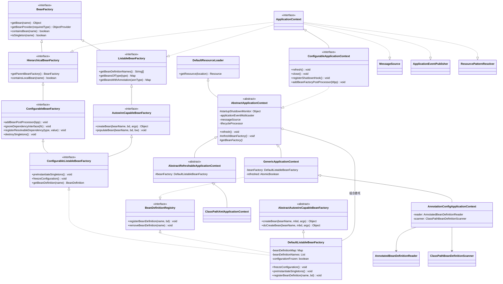
```mermaid
classDiagram
    class BeanFactory {
        <<interface>>
        +getBean(name) Object
        +getBeanProvider(requiredType) ObjectProvider
        +containsBean(name) boolean
        +isSingleton(name) boolean
    }
    class HierarchicalBeanFactory {
        <<interface>>
        +getParentBeanFactory() BeanFactory
        +containsLocalBean(name) boolean
    }
    class ListableBeanFactory {
        <<interface>>
        +getBeanDefinitionNames() String[]
        +getBeansOfType(type) Map
        +getBeansWithAnnotation(annType) Map
    }
    class AutowireCapableBeanFactory {
        <<interface>>
        +createBean(beanName, bd, args) Object
        +populateBean(beanName, bd, bw) void
    }
    class ConfigurableBeanFactory {
        <<interface>>
        +addBeanPostProcessor(bpp) void
        +ignoreDependencyInterface(ifc) void
        +registerResolvableDependency(type, value) void
        +destroySingletons() void
    }
    class ConfigurableListableBeanFactory {
        <<interface>>
        +preInstantiateSingletons() void
        +freezeConfiguration() void
        +getBeanDefinition(name) BeanDefinition
    }
    class BeanDefinitionRegistry {
        <<interface>>
        +registerBeanDefinition(name, bd) void
        +removeBeanDefinition(name) void
    }
    class ApplicationContext {
        <<interface>>
    }
    class ConfigurableApplicationContext {
        <<interface>>
        +refresh() void
        +close() void
        +registerShutdownHook() void
        +addBeanFactoryPostProcessor(bfpp) void
    }
    class DefaultResourceLoader {
        +getResource(location) Resource
    }
    class AbstractApplicationContext {
        <<abstract>>
        #startupShutdownMonitor: Object
        -applicationEventMulticaster
        -messageSource
        -lifecycleProcessor
        +refresh() void
        #refreshBeanFactory()* void
        #getBeanFactory()*
    }
    class GenericApplicationContext {
        -beanFactory: DefaultListableBeanFactory
        -refreshed: AtomicBoolean
    }
    class AbstractRefreshableApplicationContext {
        <<abstract>>
        #beanFactory: DefaultListableBeanFactory
    }
    class AnnotationConfigApplicationContext {
        -reader: AnnotatedBeanDefinitionReader
        -scanner: ClassPathBeanDefinitionScanner
    }
    class ClassPathXmlApplicationContext
    class DefaultListableBeanFactory {
        -beanDefinitionMap: Map
        -beanDefinitionNames: List
        -configurationFrozen: boolean
        +freezeConfiguration() void
        +preInstantiateSingletons() void
        +registerBeanDefinition(name, bd) void
    }
    class AbstractAutowireCapableBeanFactory {
        <<abstract>>
        +createBean(beanName, mbd, args) Object
        +doCreateBean(beanName, mbd, args) Object
    }

    BeanFactory <|-- HierarchicalBeanFactory
    BeanFactory <|-- ListableBeanFactory
    ListableBeanFactory <|-- AutowireCapableBeanFactory
    HierarchicalBeanFactory <|-- ConfigurableBeanFactory
    ConfigurableBeanFactory <|-- ConfigurableListableBeanFactory
    AutowireCapableBeanFactory <|-- ConfigurableListableBeanFactory

    ApplicationContext ..|> ListableBeanFactory
    ApplicationContext ..|> HierarchicalBeanFactory
    ApplicationContext ..|> MessageSource
    ApplicationContext ..|> ApplicationEventPublisher
    ApplicationContext ..|> ResourcePatternResolver
    ApplicationContext <|-- ConfigurableApplicationContext

    DefaultResourceLoader <|-- AbstractApplicationContext
    ConfigurableApplicationContext ..|> AbstractApplicationContext
    AbstractApplicationContext <|-- GenericApplicationContext
    AbstractApplicationContext <|-- AbstractRefreshableApplicationContext
    GenericApplicationContext <|-- AnnotationConfigApplicationContext
    AbstractRefreshableApplicationContext <|-- ClassPathXmlApplicationContext
    GenericApplicationContext ..|> BeanDefinitionRegistry

    ConfigurableListableBeanFactory <|.. DefaultListableBeanFactory
    BeanDefinitionRegistry <|.. DefaultListableBeanFactory
    AbstractAutowireCapableBeanFactory <|-- DefaultListableBeanFactory

    AbstractApplicationContext o-- DefaultListableBeanFactory : 组合委托
    AnnotationConfigApplicationContext --> AnnotatedBeanDefinitionReader
    AnnotationConfigApplicationContext --> ClassPathBeanDefinitionScanner
```

> 图中 `<<interface>>`/`<<abstract>>` 为标注；实线三角为继承/实现，`o--` 为组合，`-->` 为关联。

---

## 2. AnnotationConfigApplicationContext 的启动流程

### 2.1 总览：一个构造器串起三步

最常见的用法：

```java
ApplicationContext ctx = new AnnotationConfigApplicationContext(AppConfig.class);
```

对应三参构造器（`spring-context/src/main/java/org/springframework/context/annotation/AnnotationConfigApplicationContext.java:90-94`）：

```java
public AnnotationConfigApplicationContext(Class<?>... componentClasses) {
	this();                  // 1. 无参构造：创建 reader + scanner，注册基础设施后置处理器
	register(componentClasses);  // 2. 把配置类注册为 BeanDefinition（此刻尚未解析 @Bean/@ComponentScan）
	refresh();               // 3. 启动容器：refresh() 十二步
}
```

而**无参构造**（`AnnotationConfigApplicationContext.java:67-72`）：

```java
public AnnotationConfigApplicationContext() {
	StartupStep createAnnotatedBeanDefReader = getApplicationStartup().start("spring.context.annotated-bean-reader.create");
	this.reader = new AnnotatedBeanDefinitionReader(this);
	createAnnotatedBeanDefReader.end();
	this.scanner = new ClassPathBeanDefinitionScanner(this);
}
```

执行 `this()` 时，Java 会先执行隐式 `super()`——即 `GenericApplicationContext()`（`GenericApplicationContext.java:114-116`），**在这一步内部 BeanFactory 已经创建**；随后再创建 `AnnotatedBeanDefinitionReader` 与 `ClassPathBeanDefinitionScanner`，二者都以 `this`（context 自身，它实现了 `BeanDefinitionRegistry`）为注册目标。

### 2.2 AnnotatedBeanDefinitionReader：基础设施后置处理器的注册入口

构造链（`spring-context/src/main/java/org/springframework/context/annotation/AnnotatedBeanDefinitionReader.java:83-89`）：

```java
public AnnotatedBeanDefinitionReader(BeanDefinitionRegistry registry, Environment environment) {
	Assert.notNull(registry, "BeanDefinitionRegistry must not be null");
	Assert.notNull(environment, "Environment must not be null");
	this.registry = registry;
	this.conditionEvaluator = new ConditionEvaluator(registry, environment, null);
	AnnotationConfigUtils.registerAnnotationConfigProcessors(this.registry);   // 关键一步
}
```

`AnnotationConfigUtils.registerAnnotationConfigProcessors`（`spring-context/src/main/java/org/springframework/context/annotation/AnnotationConfigUtils.java:148-210`）做了两类事。

**第一类：给 BeanFactory 换上注解驱动的比较器与解析器**（`AnnotationConfigUtils.java:151-159`）：

```java
DefaultListableBeanFactory beanFactory = unwrapDefaultListableBeanFactory(registry);
if (beanFactory != null) {
	if (!(beanFactory.getDependencyComparator() instanceof AnnotationAwareOrderComparator)) {
		beanFactory.setDependencyComparator(AnnotationAwareOrderComparator.INSTANCE);
	}
	if (!(beanFactory.getAutowireCandidateResolver() instanceof ContextAnnotationAutowireCandidateResolver)) {
		beanFactory.setAutowireCandidateResolver(new ContextAnnotationAutowireCandidateResolver());
	}
}
```

- `AnnotationAwareOrderComparator`：让 `@Order`/`Ordered` 参与排序（依赖注入集合时按序注入，也是后置处理器三段排序的基础）；
- `ContextAnnotationAutowireCandidateResolver`：支持 `@Lazy` 注入（生成代理）、`@Qualifier` 泛型限定。

**第二类：注册 6 个（条件性 8 个）基础设施 BeanDefinition**，全部通过 `registerPostProcessor` 打上 `ROLE_INFRASTRUCTURE` 标记（`AnnotationConfigUtils.java:212-218`，`definition.setRole(BeanDefinition.ROLE_INFRASTRUCTURE)`，这也是后面 `BeanPostProcessorChecker.isInfrastructureBean` 判断依据）：

| BeanDefinition | bean name（常量值） | 注册源码 | 作用 |
|---|---|---|---|
| `ConfigurationClassPostProcessor` | `org.springframework.context.annotation.internalConfigurationAnnotationProcessor` | `AnnotationConfigUtils.java:163-167` | 唯一的 `BeanDefinitionRegistryPostProcessor`，refresh 第 5 步解析 `@Configuration`/`@ComponentScan`/`@Import`/`@Bean` 的总指挥 |
| `AutowiredAnnotationBeanPostProcessor` | `org.springframework.context.annotation.internalAutowiredAnnotationProcessor` | `AnnotationConfigUtils.java:169-173` | `@Autowired`/`@Value`/`@Inject` 注入（MergedBeanDefinitionPostProcessor） |
| `CommonAnnotationBeanPostProcessor`（条件：classpath 存在 `javax.annotation.Resource`） | `org.springframework.context.annotation.internalCommonAnnotationProcessor` | `AnnotationConfigUtils.java:176-180` | JSR-250：`@Resource`、`@PostConstruct`、`@PreDestroy` |
| `PersistenceAnnotationBeanPostProcessor`（条件：JPA 存在） | `org.springframework.context.annotation.internalPersistenceAnnotationProcessor` | `AnnotationConfigUtils.java:183-195` | JPA 的 `@PersistenceContext`/`@PersistenceUnit` |
| `EventListenerMethodProcessor` | `org.springframework.context.event.internalEventListenerProcessor` | `AnnotationConfigUtils.java:197-201` | 扫描 `@EventListener` 方法，是 `SmartInitializingSingleton`，在所有单例就绪后把监听器方法注册给 multicaster |
| `DefaultEventListenerFactory` | `org.springframework.context.event.internalEventListenerFactory` | `AnnotationConfigUtils.java:203-207` | 为 `@EventListener` 方法生成 `ApplicationListener` 适配器（与上者配合） |

条件判断来自静态块（`AnnotationConfigUtils.java:124-129`）：

```java
static {
	ClassLoader classLoader = AnnotationConfigUtils.class.getClassLoader();
	jsr250Present = ClassUtils.isPresent("javax.annotation.Resource", classLoader);
	jpaPresent = ClassUtils.isPresent("javax.persistence.EntityManagerFactory", classLoader) &&
			ClassUtils.isPresent(PERSISTENCE_ANNOTATION_PROCESSOR_CLASS_NAME, classLoader);
}
```

> **重要**：这 6 个 BeanDefinition 此时只是"定义"，真正实例化要等到 refresh 第 5/6 步。但 `ConfigurationClassPostProcessor` 的 bean 定义必须在 refresh 之前就存在于 registry 中——否则第 5 步 `getBeanNamesForType(BeanDefinitionRegistryPostProcessor.class)` 根本找不到它，`@Configuration` 类就成了普通 bean，注解驱动的整个世界都不会发生。

### 2.3 ClassPathBeanDefinitionScanner 与默认过滤器

`new ClassPathBeanDefinitionScanner(this)`（`AnnotationConfigApplicationContext.java:71`）最终走到（`spring-context/src/main/java/org/springframework/context/annotation/ClassPathBeanDefinitionScanner.java:159-170`）：

```java
public ClassPathBeanDefinitionScanner(BeanDefinitionRegistry registry, boolean useDefaultFilters,
		Environment environment, @Nullable ResourceLoader resourceLoader) {

	Assert.notNull(registry, "BeanDefinitionRegistry must not be null");
	this.registry = registry;

	if (useDefaultFilters) {
		registerDefaultFilters();
	}
	setEnvironment(environment);
	setResourceLoader(resourceLoader);
}
```

`registerDefaultFilters()` 在父类 `ClassPathScanningCandidateComponentProvider` 中（`spring-context/src/main/java/org/springframework/context/annotation/ClassPathScanningCandidateComponentProvider.java:208-227`）：

```java
protected void registerDefaultFilters() {
	this.includeFilters.add(new AnnotationTypeFilter(Component.class));
	ClassLoader cl = ClassPathScanningCandidateComponentProvider.class.getClassLoader();
	try {
		this.includeFilters.add(new AnnotationTypeFilter(
				((Class<? extends Annotation>) ClassUtils.forName("javax.annotation.ManagedBean", cl)), false));
		logger.trace("JSR-250 'javax.annotation.ManagedBean' found and supported for component scanning");
	}
	catch (ClassNotFoundException ex) {
		// JSR-250 1.1 API (as included in Java EE 6) not available - simply skip.
	}
	try {
		this.includeFilters.add(new AnnotationTypeFilter(
				((Class<? extends Annotation>) ClassUtils.forName("javax.inject.Named", cl)), false));
		logger.trace("JSR-330 'javax.inject.Named' annotation found and supported for component scanning");
	}
	catch (ClassNotFoundException ex) {
		// JSR-330 API not available - simply skip.
	}
}
```

即默认包含 3 个过滤器：

1. `@Component`（`@Service`/`@Repository`/`@Controller`/`@Configuration` 都是它的派生注解，`AnnotationTypeFilter` 会检查元注解继承，因此全部命中）；
2. JSR-250 `javax.annotation.ManagedBean`（存在才注册）；
3. JSR-330 `javax.inject.Named`（存在才注册）。

另外扫描器还持有默认的 `AnnotationBeanNameGenerator`（:210-213）、`AnnotationScopeMetadataResolver`（:221-224），以及 `includeAnnotationConfig=true` 标志（:241-243）——`ClassPathBeanDefinitionScanner.scan()` 扫描结束后同样会调用 `AnnotationConfigUtils.registerAnnotationConfigProcessors`，保证无论走 `register()` 还是 `scan()` 入口，基础设施后置处理器都在。

### 2.4 register()：把配置类变成 BeanDefinition

`AnnotationConfigApplicationContext.register()`（`AnnotationConfigApplicationContext.java:163-170`）委托给 `AnnotatedBeanDefinitionReader.register → doRegisterBean`（`AnnotatedBeanDefinitionReader.java:249-286`）：

```java
private <T> void doRegisterBean(Class<T> beanClass, ...) {
	AnnotatedGenericBeanDefinition abd = new AnnotatedGenericBeanDefinition(beanClass);
	if (this.conditionEvaluator.shouldSkip(abd.getMetadata())) {   // @Conditional 求值
		return;
	}
	abd.setInstanceSupplier(supplier);
	ScopeMetadata scopeMetadata = this.scopeMetadataResolver.resolveScopeMetadata(abd);  // @Scope
	abd.setScope(scopeMetadata.getScopeName());
	String beanName = (name != null ? name : this.beanNameGenerator.generateBeanName(abd, this.registry));
	AnnotationConfigUtils.processCommonDefinitionAnnotations(abd);   // @Lazy/@Primary/@DependsOn/@Role/@Description
	...
	BeanDefinitionHolder definitionHolder = new BeanDefinitionHolder(abd, beanName);
	definitionHolder = AnnotationConfigUtils.applyScopedProxyMode(scopeMetadata, definitionHolder, this.registry);
	BeanDefinitionReaderUtils.registerBeanDefinition(definitionHolder, this.registry);   // 进入 beanDefinitionMap
}
```

注意此刻注册进容器的**只有配置类自身这一个 BeanDefinition**（名字默认为首字母小写的 `appConfig`）；配置类里的 `@Bean` 方法、`@ComponentScan` 扫出来的组件，都要等 refresh 第 5 步由 `ConfigurationClassPostProcessor` 解析后再注册。`register()` 本身不触发任何 bean 实例化。

---

## 3. refresh() 十二步源码级解析

### 3.0 总入口

`AbstractApplicationContext.refresh()`（`spring-context/src/main/java/org/springframework/context/support/AbstractApplicationContext.java:554-620`）：

```java
@Override
public void refresh() throws BeansException, IllegalStateException {
	synchronized (this.startupShutdownMonitor) {                  // :555 ① 全局锁：refresh 与 close 互斥
		StartupStep contextRefresh = this.applicationStartup.start("spring.context.refresh");

		// Prepare this context for refreshing.
		prepareRefresh();                                         // :559 步骤1

		// Tell the subclass to refresh the internal bean factory.
		ConfigurableListableBeanFactory beanFactory = obtainFreshBeanFactory();  // :562 步骤2

		// Prepare the bean factory for use in this context.
		prepareBeanFactory(beanFactory);                          // :565 步骤3

		try {
			// Allows post-processing of the bean factory in context subclasses.
			postProcessBeanFactory(beanFactory);                  // :569 步骤4

			StartupStep beanPostProcess = this.applicationStartup.start("spring.context.beans.post-process");
			// Invoke factory processors registered as beans in the context.
			invokeBeanFactoryPostProcessors(beanFactory);         // :573 步骤5
			// Register bean processors that intercept bean creation.
			registerBeanPostProcessors(beanFactory);              // :575 步骤6
			beanPostProcess.end();

			// Initialize message source for this context.
			initMessageSource();                                  // :579 步骤7

			// Initialize event multicaster for this context.
			initApplicationEventMulticaster();                    // :582 步骤8

			// Initialize other special beans in specific context subclasses.
			onRefresh();                                          // :585 步骤9

			// Check for listener beans and register them.
			registerListeners();                                  // :588 步骤10

			// Instantiate all remaining (non-lazy-init) singletons.
			finishBeanFactoryInitialization(beanFactory);         // :591 步骤11

			// Last step: publish corresponding event.
			finishRefresh();                                      // :594 步骤12
		}

		catch (BeansException ex) {
			if (logger.isWarnEnabled()) {
				logger.warn("Exception encountered during context initialization - " +
						"cancelling refresh attempt: " + ex);
			}
			// Destroy already created singletons to avoid dangling resources.
			destroyBeans();                                       // :604 失败回滚：销毁已创建的单例
			// Reset 'active' flag.
			cancelRefresh(ex);                                    // :607 active 置回 false
			// Propagate exception to caller.
			throw ex;
		}

		finally {
			// Reset common introspection caches in Spring's core, since we
			// might not ever need metadata for singleton beans anymore...
			resetCommonCaches();                                  // :616 清空反射/注解/内省缓存
			contextRefresh.end();
		}
	}
}
```

设计要点：

- **`startupShutdownMonitor` 锁**：refresh 与 close（含 JVM shutdown hook，见 `AbstractApplicationContext.java:1004`、`1034`）共用一把锁，保证"刷新中不可关闭、关闭中不可刷新"的线程安全。
- **异常兜底**：任何一步抛出 `BeansException`，都会执行 `destroyBeans()`（销毁已经实例化的单例，防止资源悬挂）+ `cancelRefresh(ex)`（`AbstractApplicationContext.java:965-967`，仅将 `active` 置 false；`GenericApplicationContext` 覆写版本还会清掉 serializationId，见 `GenericApplicationContext.java:291-295`），然后把异常抛给调用方。
- **`resetCommonCaches()`**（`AbstractApplicationContext.java:979-984`）：清 `ReflectionUtils`、`AnnotationUtils`、`ResolvableType`、`CachedIntrospectionResults` 四大缓存，避免 ClassLoader 泄漏。

下面逐步展开。

### 3.1 步骤 1：prepareRefresh() —— 设置启动时间与活跃标志

`AbstractApplicationContext.java:626-661`：

```java
protected void prepareRefresh() {
	// Switch to active.
	this.startupDate = System.currentTimeMillis();   // :628 启动时间戳
	this.closed.set(false);
	this.active.set(true);                            // :630 容器进入 active 状态（getBean 前置校验依赖此标志）
	...
	// Initialize any placeholder property sources in the context environment.
	initPropertySources();                            // :642 钩子：替换占位 PropertySource（Web 容器在此挂 servletContext 等）

	// Validate that all properties marked as required are resolvable:
	// see ConfigurablePropertyResolver#setRequiredProperties
	getEnvironment().validateRequiredProperties();    // :646 校验 setRequiredProperties 设置的必需属性，缺失则抛异常，快速失败

	// Store pre-refresh ApplicationListeners...
	if (this.earlyApplicationListeners == null) {
		this.earlyApplicationListeners = new LinkedHashSet<>(this.applicationListeners);   // :649-651
	}
	else {
		// Reset local application listeners to pre-refresh state.
		this.applicationListeners.clear();
		this.applicationListeners.addAll(this.earlyApplicationListeners);
	}

	// Allow for the collection of early ApplicationEvents,
	// to be published once the multicaster is available...
	this.earlyApplicationEvents = new LinkedHashSet<>();   // :660 开启"早期事件"收集
}
```

`initPropertySources()` 默认空实现（`AbstractApplicationContext.java:668-670`），子类如 `AbstractRefreshableWebApplicationContext` 会在此把 `StubPropertySource` 换成真实的 servlet 资源。`earlyApplicationEvents` 的意义：**第 8 步 multicaster 就绪之前**若有代码调用 `publishEvent`，事件不会丢失，而是先攒在这个集合里（`publishEvent` 的分支在 `AbstractApplicationContext.java:426-431`），直到第 10 步 `registerListeners()` 再补发。

### 3.2 步骤 2：obtainFreshBeanFactory() —— 拿到（或重建）内部 BeanFactory

`AbstractApplicationContext.java:678-681`：

```java
protected ConfigurableListableBeanFactory obtainFreshBeanFactory() {
	refreshBeanFactory();      // 模板方法，交给子类
	return getBeanFactory();   // 返回内部工厂给后续步骤使用
}
```

对 `AnnotationConfigApplicationContext`（GenericApplicationContext 系）而言，`refreshBeanFactory()`（`GenericApplicationContext.java:282-289`）：

```java
@Override
protected final void refreshBeanFactory() throws IllegalStateException {
	if (!this.refreshed.compareAndSet(false, true)) {
		throw new IllegalStateException(
				"GenericApplicationContext does not support multiple refresh attempts: just call 'refresh' once");
	}
	this.beanFactory.setSerializationId(getId());
}
```

两个要点：

1. **`DefaultListableBeanFactory` 的创建时机不在 refresh，而在构造器**（`GenericApplicationContext.java:114-116`）。refresh 第 2 步只做 `AtomicBoolean` CAS——保证 refresh 只能被调用一次（第二次调用抛 `IllegalStateException`），并设置序列化 id。
2. 对比的 `AbstractRefreshableApplicationContext`（XML 系）在 `refreshBeanFactory()` 中则是"若已有工厂先销毁 → `createBeanFactory()` 新建 → `customizeBeanFactory()` → `loadBeanDefinitions()` 从 XML 装载全部 BeanDefinition"。所以**对 XML 容器，"读配置文件"发生在第 2 步；对注解容器，"读配置类注解"发生在第 5 步**——这是两类容器最容易被误解的差异。

`closeBeanFactory()` 对应的空操作也印证了 Generic 系工厂"与容器同生共死"（`GenericApplicationContext.java:301-304`）：

```java
@Override
protected final void closeBeanFactory() {
	this.beanFactory.setSerializationId(null);
}
```

### 3.3 步骤 3：prepareBeanFactory() —— 配置 BeanFactory 的标准上下文特征

`AbstractApplicationContext.java:688-736`，按源码顺序做了 6 组事情：

```java
protected void prepareBeanFactory(ConfigurableListableBeanFactory beanFactory) {
	// (1) 类加载器、SpEL 解析器、属性编辑器注册器
	beanFactory.setBeanClassLoader(getClassLoader());
	if (!shouldIgnoreSpel) {
		beanFactory.setBeanExpressionResolver(new StandardBeanExpressionResolver(beanFactory.getBeanClassLoader()));  // :692 支持 #{...}
	}
	beanFactory.addPropertyEditorRegistrar(new ResourceEditorRegistrar(this, getEnvironment()));   // :694 注入 EnvironmentAwarePropertyEditor 等

	// (2) 第 1 个 BeanPostProcessor + 7 个 ignoreDependencyInterface
	beanFactory.addBeanPostProcessor(new ApplicationContextAwareProcessor(this));   // :697
	beanFactory.ignoreDependencyInterface(EnvironmentAware.class);                  // :698
	beanFactory.ignoreDependencyInterface(EmbeddedValueResolverAware.class);       // :699
	beanFactory.ignoreDependencyInterface(ResourceLoaderAware.class);              // :700
	beanFactory.ignoreDependencyInterface(ApplicationEventPublisherAware.class);    // :701
	beanFactory.ignoreDependencyInterface(MessageSourceAware.class);               // :702
	beanFactory.ignoreDependencyInterface(ApplicationContextAware.class);           // :703
	beanFactory.ignoreDependencyInterface(ApplicationStartupAware.class);          // :704

	// (3) 4 个 registerResolvableDependency：容器对象本身可被直接注入
	beanFactory.registerResolvableDependency(BeanFactory.class, beanFactory);      // :708
	beanFactory.registerResolvableDependency(ResourceLoader.class, this);          // :709
	beanFactory.registerResolvableDependency(ApplicationEventPublisher.class, this); // :710
	beanFactory.registerResolvableDependency(ApplicationContext.class, this);      // :711

	// (4) 第 2 个 BeanPostProcessor：监听器探测器
	beanFactory.addBeanPostProcessor(new ApplicationListenerDetector(this));        // :714

	// (5) LoadTimeWeaver 支持
	if (!NativeDetector.inNativeImage() && beanFactory.containsBean(LOAD_TIME_WEAVER_BEAN_NAME)) {   // :717
		beanFactory.addBeanPostProcessor(new LoadTimeWeaverAwareProcessor(beanFactory));
		beanFactory.setTempClassLoader(new ContextTypeMatchClassLoader(beanFactory.getBeanClassLoader()));
	}

	// (6) 注册 4 个"环境类"单例（不是 BeanDefinition，是现成对象）
	if (!beanFactory.containsLocalBean(ENVIRONMENT_BEAN_NAME)) {
		beanFactory.registerSingleton(ENVIRONMENT_BEAN_NAME, getEnvironment());              // :725 environment
	}
	if (!beanFactory.containsLocalBean(SYSTEM_PROPERTIES_BEAN_NAME)) {
		beanFactory.registerSingleton(SYSTEM_PROPERTIES_BEAN_NAME, getEnvironment().getSystemProperties());  // :728 systemProperties
	}
	if (!beanFactory.containsLocalBean(SYSTEM_ENVIRONMENT_BEAN_NAME)) {
		beanFactory.registerSingleton(SYSTEM_ENVIRONMENT_BEAN_NAME, getEnvironment().getSystemEnvironment()); // :731 systemEnvironment
	}
	if (!beanFactory.containsLocalBean(APPLICATION_STARTUP_BEAN_NAME)) {
		beanFactory.registerSingleton(APPLICATION_STARTUP_BEAN_NAME, getApplicationStartup()); // :734 applicationStartup
	}
}
```

逐组解释：

- **ApplicationContextAwareProcessor**：一个 `BeanPostProcessor`，在 bean 初始化前回调各类 `*Aware` 接口（`EnvironmentAware`、`ResourceLoaderAware`、`ApplicationEventPublisherAware`、`MessageSourceAware`、`ApplicationContextAware` 等），把容器自身"喂"给业务 bean。
- **`ignoreDependencyInterface` 的语义**：这些 Aware 接口对应的依赖**不由自动装配（byType）按常规候选者匹配注入**——它们由 ApplicationContextAwareProcessor 专门处理，忽略是为了防止自动装配把不相干的 bean 塞进 Aware 类型的字段。
- **`registerResolvableDependency` 的语义**：当某 bean 的字段/构造参数类型是 `ApplicationContext`/`BeanFactory`/`ResourceLoader`/`ApplicationEventPublisher` 时，按类型注入直接命中"容器自身"这个固定候选，无需（也无法）通过 beanDefinitionMap 查找。
- **ApplicationListenerDetector**：探测实现了 `ApplicationListener` 的 bean，创建后自动注册进 multicaster；bean 被销毁时自动摘除。
- **环境单例**：`environment`、`systemProperties`、`systemEnvironment`、`applicationStartup` 是以 `registerSingleton`（手动单例，无 BeanDefinition）方式注册的——这就是为什么它们可以被 `@Autowired` 注入却从不出现在 `getBeanDefinitionNames()` 里。

### 3.4 步骤 4：postProcessBeanFactory() —— 留给子类的空钩子

`AbstractApplicationContext.java:747-748`：

```java
protected void postProcessBeanFactory(ConfigurableListableBeanFactory beanFactory) {
}
```

此时：BeanDefinition 已加载（XML 系）或即将被解析（注解系）、**任何 BeanFactoryPostProcessor 都还没执行、任何业务 bean 都没实例化**——是往工厂里塞自定义 BeanPostProcessor / 修改工厂设置的黄金时机。

典型子类覆写：

- `AbstractRefreshableWebApplicationContext#postProcessBeanFactory`：额外注册 `ServletContextAwareProcessor` 并 ignore `ServletContextAware` 接口；
- Spring Boot 的 `ServletWebServerApplicationContext` 在此覆写，注册 `WebApplicationContextServletContextAwareProcessor` 等针对 Web 环境的后置处理器（Spring Boot 仓库，非本仓库源码）。

### 3.5 步骤 5：invokeBeanFactoryPostProcessors() —— BeanFactory 后置处理器的执行

入口（`AbstractApplicationContext.java:755-765`）：

```java
protected void invokeBeanFactoryPostProcessors(ConfigurableListableBeanFactory beanFactory) {
	PostProcessorRegistrationDelegate.invokeBeanFactoryPostProcessors(beanFactory, getBeanFactoryPostProcessors());

	// Detect a LoadTimeWeaver and prepare for weaving, if found in the meantime
	// (e.g. through an @Bean method registered by ConfigurationClassPostProcessor)
	if (!NativeDetector.inNativeImage() && beanFactory.getTempClassLoader() == null &&
			beanFactory.containsBean(LOAD_TIME_WEAVER_BEAN_NAME)) {
		beanFactory.addBeanPostProcessor(new LoadTimeWeaverAwareProcessor(beanFactory));
		beanFactory.setTempClassLoader(new ContextTypeMatchClassLoader(beanFactory.getBeanClassLoader()));
	}
}
```

注意第二个参数 `getBeanFactoryPostProcessors()` 返回的是**编程式注册**（`context.addBeanFactoryPostProcessor(xxx)`）的处理器列表——它们与容器中以 bean 形式定义的 BFPP 分属两个来源，delegate 要一并处理。

真正的核心在 `PostProcessorRegistrationDelegate.invokeBeanFactoryPostProcessors`（`spring-context/src/main/java/org/springframework/context/support/PostProcessorRegistrationDelegate.java:59-203`）。源码里有一段著名的 WARNING 注释（:62-73），明确说明"多列表、多轮循环"是刻意为之，防止处理器以错误顺序实例化。完整逻辑如下：

**第一段（:76-149）：BeanDefinitionRegistryPostProcessor 优先。** 仅当 `beanFactory instanceof BeanDefinitionRegistry` 成立（DefaultListableBeanFactory 实现了 BeanDefinitionRegistry，必然成立）：

1. **先处理编程式传入的 BFPP**（:83-93）：遍历 `beanFactoryPostProcessors` 参数，凡实现了 `BeanDefinitionRegistryPostProcessor` 的立即执行 `postProcessBeanDefinitionRegistry(registry)`；其余普通 BFPP 暂存到 `regularPostProcessors`。

   > 这里体现了一个重要契约：编程式注册的 BDRPP **不参与任何排序**，按传入顺序、且在所有 bean 形式的 BDRPP 之前执行。

2. **再处理 bean 形式的 BDRPP，按 PriorityOrdered → Ordered → 无序 三段**：

   - PriorityOrdered 段（:101-113）：

   ```java
   // First, invoke the BeanDefinitionRegistryPostProcessors that implement PriorityOrdered.
   String[] postProcessorNames =
   		beanFactory.getBeanNamesForType(BeanDefinitionRegistryPostProcessor.class, true, false);   // :102-103 allowEagerInit=false，不触发 FactoryBean 初始化
   for (String ppName : postProcessorNames) {
   	if (beanFactory.isTypeMatch(ppName, PriorityOrdered.class)) {
   		currentRegistryProcessors.add(beanFactory.getBean(ppName, BeanDefinitionRegistryPostProcessor.class));   // getBean 实例化该处理器
   		processedBeans.add(ppName);
   	}
   }
   sortPostProcessors(currentRegistryProcessors, beanFactory);   // :110 AnnotationAwareOrderComparator 排序
   registryProcessors.addAll(currentRegistryProcessors);
   invokeBeanDefinitionRegistryPostProcessors(currentRegistryProcessors, registry, beanFactory.getApplicationStartup());  // :112 逐个调 postProcessBeanDefinitionRegistry
   currentRegistryProcessors.clear();
   ```

   **`ConfigurationClassPostProcessor` 正是在这一段被 `getBean` 实例化并执行的**——它实现了 `PriorityOrdered`（`ConfigurationClassPostProcessor.java:91-92`：`implements BeanDefinitionRegistryPostProcessor, PriorityOrdered, ...`），Order 为 `Ordered.HIGHEST_PRECEDENCE`。执行 `postProcessBeanDefinitionRegistry`（`ConfigurationClassPostProcessor.java:235-247`）进入 `processConfigBeanDefinitions(registry)`（:276 起），完成：解析配置类上的 `@ComponentScan`/`@Import`/`@Bean`/`@ImportResource`/`@PropertySource`，递归处理配置类，最终把成百上千的新 BeanDefinition 注册进 registry。

   - Ordered 段（:115-126）：**重新**执行 `getBeanNamesForType(BeanDefinitionRegistryPostProcessor.class, ...)`——因为 PriorityOrdered 段执行过程中（比如某个 BDRPP 注册了新的 BDRPP）可能新增了处理器；过滤 `!processedBeans.contains(ppName) && isTypeMatch(ppName, Ordered.class)`，getBean、排序、执行。
   - 无序段（:128-144）：`while (reiterate)` 循环。**为什么要循环？** 因为无序的 BDRPP 在执行 `postProcessBeanDefinitionRegistry` 时可能又注册新的 BDRPP bean 定义，必须反复查询直到不再出现未处理的 BDRPP 为止（`reiterate = true`，:137）。

3. **补调 postProcessBeanFactory 回调**（:146-148）：BDRPP 本身也是 BFPP（`BeanDefinitionRegistryPostProcessor` 的父接口就是 `BeanFactoryPostProcessor`），所以已执行过 registry 阶段的处理器现在依次调用其 `postProcessBeanFactory(beanFactory)`（:147，先 registryProcessors 后 regularPostProcessors）。对 `ConfigurationClassPostProcessor` 而言，这一步是 `enhanceConfigurationClasses(beanFactory)`（`ConfigurationClassPostProcessor.java:255-268`）——用 CGLIB 增强 `@Configuration(full)` 类，保证 `@Bean` 方法互调时走容器单例，并顺带注册 `BeanMethod` 相关处理器。

**第二段（:158-198）：普通 BeanFactoryPostProcessor 三段执行。** 重新 `getBeanNamesForType(BeanFactoryPostProcessor.class, true, false)`（:158-159），把跳过已在第一阶段处理过的（`processedBeans.contains(ppName)`，:167-169）之后分为三桶：

```java
else if (beanFactory.isTypeMatch(ppName, PriorityOrdered.class)) {
	priorityOrderedPostProcessors.add(beanFactory.getBean(ppName, BeanFactoryPostProcessor.class));   // :171
}
else if (beanFactory.isTypeMatch(ppName, Ordered.class)) {
	orderedPostProcessorNames.add(ppName);   // :174 只记名字，稍后统一实例化
}
else {
	nonOrderedPostProcessorNames.add(ppName);   // :177
}
```

然后依次：PriorityOrdered 桶排序后执行（:181-183）→ Ordered 桶实例化、排序、执行（:185-191）→ 无序桶实例化、执行（:193-198，**不排序**）。典型的无序 BFPP 如 `PropertySourcesPlaceholderConfigurer`（实际实现了 PriorityOrdered）与用户自定义的 BFPP。

**收尾（:200-202）**：

```java
// Clear cached merged bean definitions since the post-processors might have
// modified the original metadata, e.g. replacing placeholders in values...
beanFactory.clearMetadataCache();
```

BFPP 可能改写了 BeanDefinition（占位符替换等），因此清空合并定义缓存，保证后续 `getMergedLocalBeanDefinition` 重新计算。

**排序规则小结**：`sortPostProcessors`（`PostProcessorRegistrationDelegate.java:287-300`）优先取 `DefaultListableBeanFactory.getDependencyComparator()`（前面被设置为 `AnnotationAwareOrderComparator.INSTANCE`）排序。整体顺序为：

```
编程式 BDRPP → bean 定义 BDRPP(PriorityOrdered, 按 Order 升序)
             → bean 定义 BDRPP(Ordered) → bean 定义 BDRPP(无序, 循环至收敛)
             → 上述 BDRPP 的 postProcessBeanFactory 回调
             → 编程式普通 BFPP → bean 定义 BFPP(PriorityOrdered) → (Ordered) → (无序)
```

### 3.6 步骤 6：registerBeanPostProcessors() —— BeanPostProcessor 的实例化与注册

入口（`AbstractApplicationContext.java:772-774`）委托 `PostProcessorRegistrationDelegate.registerBeanPostProcessors`（`PostProcessorRegistrationDelegate.java:205-285`）。

1. **先注册 BeanPostProcessorChecker**（:221-227）：

```java
String[] postProcessorNames = beanFactory.getBeanNamesForType(BeanPostProcessor.class, true, false);

// Register BeanPostProcessorChecker that logs an info message when
// a bean is created during BeanPostProcessor instantiation, i.e. when
// a bean is not eligible for getting processed by all BeanPostProcessors.
int beanProcessorTargetCount = beanFactory.getBeanPostProcessorCount() + 1 + postProcessorNames.length;
beanFactory.addBeanPostProcessor(new BeanPostProcessorChecker(beanFactory, beanProcessorTargetCount));
```

`BeanPostProcessorChecker`（:353-391）在 `postProcessAfterInitialization` 里检查：若被创建的 bean 不是 BeanPostProcessor、不是基础设施 bean，且当时已注册的 BPP 数量还小于目标值，就打 info 日志：

> Bean 'xxx' of type [...] is not eligible for getting processed by all BeanPostProcessors (for example: not eligible for auto-proxying)

这是排查"`@Autowired` 注入到 AOP 代理失败"这类问题的第一线索：该 bean 在所有 BPP 就绪前就被提前创建（通常是被某个 BFPP/BPP 依赖拉起），因此**错过了某些后置处理**（比如自动代理）。

2. **三段式实例化与注册**（:229-280），同样 PriorityOrdered → Ordered → 无序：

```java
for (String ppName : postProcessorNames) {
	if (beanFactory.isTypeMatch(ppName, PriorityOrdered.class)) {
		BeanPostProcessor pp = beanFactory.getBean(ppName, BeanPostProcessor.class);
		priorityOrderedPostProcessors.add(pp);
		if (pp instanceof MergedBeanDefinitionPostProcessor) {
			internalPostProcessors.add(pp);        // :239-241 CommonAnnotationBPP/AutowiredAnnotationBPP 属此类
		}
	}
	else if (beanFactory.isTypeMatch(ppName, Ordered.class)) { ... }
	else { ... }
}
// First, register the BeanPostProcessors that implement PriorityOrdered.
sortPostProcessors(priorityOrderedPostProcessors, beanFactory);     // :252
registerBeanPostProcessors(beanFactory, priorityOrderedPostProcessors);   // :253 批量 addBeanPostProcessors
// Next, Ordered ... :256-265
// Now, register all regular BeanPostProcessors.  :268-276（无序桶不排序）
// Finally, re-register all internal BeanPostProcessors.
sortPostProcessors(internalPostProcessors, beanFactory);            // :279
registerBeanPostProcessors(beanFactory, internalPostProcessors);    // :280
```

一个容易被忽略的细节：**实现了 `MergedBeanDefinitionPostProcessor` 的处理器（AutowiredAnnotationBeanPostProcessor、CommonAnnotationBeanPostProcessor、ApplicationListenerDetector 等）在各自桶注册之后，会在 `internalPostProcessors` 里被"重新注册"一次**（:278-280）——`AbstractBeanFactory.addBeanPostProcessor` 的语义是"存在则移到链尾"，因此这次重注册把它们挪到处理链**末尾**。

3. **最后重注册 ApplicationListenerDetector**（:282-284）：

```java
// Re-register post-processor for detecting inner beans as ApplicationListeners,
// moving it to the end of the processor chain (for picking up proxies etc).
beanFactory.addBeanPostProcessor(new ApplicationListenerDetector(applicationContext));
```

注释说明原因：把探测器挪到链尾，确保它看到的是**经过所有其他后置处理器（尤其是 AOP 代理）处理之后的最终 bean 对象**，从而把代理对象（而非裸目标类）注册为事件监听器。

> 注意：本步骤只"实例化 + 注册"BPP，**不执行**它们的回调。BPP 的 `postProcessBeforeInitialization`/`postProcessAfterInitialization` 要等真正创建 bean 时才被调用（主要发生在第 11 步）。

### 3.7 步骤 7：initMessageSource() —— 国际化消息源

`AbstractApplicationContext.java:781-808`：

```java
protected void initMessageSource() {
	ConfigurableListableBeanFactory beanFactory = getBeanFactory();
	if (beanFactory.containsLocalBean(MESSAGE_SOURCE_BEAN_NAME)) {          // 容器内定义了名为 messageSource 的 bean
		this.messageSource = beanFactory.getBean(MESSAGE_SOURCE_BEAN_NAME, MessageSource.class);
		// Make MessageSource aware of parent MessageSource.
		if (this.parent != null && this.messageSource instanceof HierarchicalMessageSource) {
			HierarchicalMessageSource hms = (HierarchicalMessageSource) this.messageSource;
			if (hms.getParentMessageSource() == null) {
				// Only set parent context as parent MessageSource if no parent MessageSource registered already.
				hms.setParentMessageSource(getInternalParentMessageSource());   // :791 找不到 key 时向父容器兜底
			}
		}
		...
	}
	else {
		// Use empty MessageSource to be able to accept getMessage calls.
		DelegatingMessageSource dms = new DelegatingMessageSource();        // :800 未定义则给一个空的
		dms.setParentMessageSource(getInternalParentMessageSource());
		this.messageSource = dms;
		beanFactory.registerSingleton(MESSAGE_SOURCE_BEAN_NAME, this.messageSource);   // :803 也注册成单例
		...
	}
}
```

约定式配置：bean 名必须是 `messageSource`（`MESSAGE_SOURCE_BEAN_NAME = "messageSource"`，`AbstractApplicationContext.java:147`）；没有就造一个 `DelegatingMessageSource` 空实现占位，保证 `context.getMessage(...)` 永远可用。

### 3.8 步骤 8：initApplicationEventMulticaster() —— 事件广播器

`AbstractApplicationContext.java:816-833`，与 MessageSource 如出一辙的"约定 or 默认"模式：

```java
protected void initApplicationEventMulticaster() {
	ConfigurableListableBeanFactory beanFactory = getBeanFactory();
	if (beanFactory.containsLocalBean(APPLICATION_EVENT_MULTICASTER_BEAN_NAME)) {   // 用户可自定义名为 applicationEventMulticaster 的 bean
		this.applicationEventMulticaster =
				beanFactory.getBean(APPLICATION_EVENT_MULTICASTER_BEAN_NAME, ApplicationEventMulticaster.class);
		...
	}
	else {
		this.applicationEventMulticaster = new SimpleApplicationEventMulticaster(beanFactory);   // :826 默认实现
		beanFactory.registerSingleton(APPLICATION_EVENT_MULTICASTER_BEAN_NAME, this.applicationEventMulticaster);
		...
	}
}
```

`SimpleApplicationEventMulticaster` 默认**同步**（在发布线程里直接调用监听器）；若其 `taskExecutor` 被设置则改为异步。事件机制的核心 `publishEvent` 见 `AbstractApplicationContext.java:410-442`：非 ApplicationEvent 对象会被包装成 `PayloadApplicationEvent`；multicaster 未就绪时事件进 `earlyApplicationEvents`（:426-428）；发布后还会向父容器**冒泡传播**（:433-441）。

### 3.9 步骤 9：onRefresh() —— 子类专属的刷新钩子

`AbstractApplicationContext.java:869-871`：

```java
protected void onRefresh() throws BeansException {
	// For subclasses: do nothing by default.
}
```

注释强调其调用时机：*Called on initialization of special beans, before instantiation of singletons*（:864）——即**在所有普通单例实例化之前**，适合初始化"特殊的、容器级的"基础设施 bean。

最重要的现实用例就是 **Spring Boot 的 `ServletWebServerApplicationContext#onRefresh()`**（位于 spring-boot 项目）：它在这里调用 `createWebServer()`，**启动内嵌 Tomcat/Jetty/Undertow**。这就是"Web 服务器在 refresh 过程中被拉起"这一现象的源码出处。此外 `StaticWebApplicationContext` 等也覆写此方法初始化 mock Servlet 环境。

### 3.10 步骤 10：registerListeners() —— 注册事件监听器并补发早期事件

`AbstractApplicationContext.java:877-898`：

```java
protected void registerListeners() {
	// Register statically specified listeners first.
	for (ApplicationListener<?> listener : getApplicationListeners()) {      // :879-881 ① 编程式 addApplicationListener 的监听器
		getApplicationEventMulticaster().addApplicationListener(listener);
	}

	// Do not initialize FactoryBeans here: We need to leave all regular beans
	// uninitialized to let post-processors apply to them!
	String[] listenerBeanNames = getBeanNamesForType(ApplicationListener.class, true, false);   // :885 ② bean 形式的监听器
	for (String listenerBeanName : listenerBeanNames) {
		getApplicationEventMulticaster().addApplicationListenerBean(listenerBeanName);
	}

	// Publish early application events now that we finally have a multicaster...
	Set<ApplicationEvent> earlyEventsToProcess = this.earlyApplicationEvents;   // :891-897 ③ 补发早期事件
	this.earlyApplicationEvents = null;
	if (!CollectionUtils.isEmpty(earlyEventsToProcess)) {
		for (ApplicationEvent earlyEvent : earlyEventsToProcess) {
			getApplicationEventMulticaster().multicastEvent(earlyEvent);
		}
	}
}
```

两个细节：

- ② 用 `addApplicationListenerBean(beanName)` 注册的是**名字**而非实例——监听器 bean 在事件真正广播前才实例化（`SimpleApplicationEventMulticaster.getApplicationListeners` 会按需 `getBean`），注释明确"不要在这里初始化 FactoryBean、不要提前实例化普通 bean，要让后置处理器有机会处理它们"；
- ③ `earlyApplicationEvents` 置 null 是一个**开关**：此后 `publishEvent` 不再走缓存分支，而是直接 `multicastEvent`（对照 `AbstractApplicationContext.java:426-431`）。

### 3.11 步骤 11：finishBeanFactoryInitialization() —— 单例预实例化（最重的一步）

`AbstractApplicationContext.java:904-933`：

```java
protected void finishBeanFactoryInitialization(ConfigurableListableBeanFactory beanFactory) {
	// Initialize conversion service for this context.
	if (beanFactory.containsBean(CONVERSION_SERVICE_BEAN_NAME) &&
			beanFactory.isTypeMatch(CONVERSION_SERVICE_BEAN_NAME, ConversionService.class)) {
		beanFactory.setConversionService(
				beanFactory.getBean(CONVERSION_SERVICE_BEAN_NAME, ConversionService.class));   // :906-910 名为 conversionService 的类型转换服务
	}

	// Register a default embedded value resolver if no BeanFactoryPostProcessor
	// (such as a PropertySourcesPlaceholderConfigurer bean) registered any before:
	// at this point, primarily for resolution in annotation attribute values.
	if (!beanFactory.hasEmbeddedValueResolver()) {                                            // :915-917 兜底的占位符解析器
		beanFactory.addEmbeddedValueResolver(strVal -> getEnvironment().resolvePlaceholders(strVal));
	}

	// Initialize LoadTimeWeaverAware beans early to allow for registering their transformers early.
	String[] weaverAwareNames = beanFactory.getBeanNamesForType(LoadTimeWeaverAware.class, false, false);   // :920 提前初始化 LoadTimeWeaverAware bean
	for (String weaverAwareName : weaverAwareNames) {
		getBean(weaverAwareName);
	}

	// Stop using the temporary ClassLoader for type matching.
	beanFactory.setTempClassLoader(null);                                                     // :926 停用临时类加载器

	// Allow for caching all bean definition metadata, not expecting further changes.
	beanFactory.freezeConfiguration();                                                        // :929 冻结配置

	// Instantiate all remaining (non-lazy-init) singletons.
	beanFactory.preInstantiateSingletons();                                                   // :932 预实例化所有非懒加载单例
}
```

**冻结配置** `DefaultListableBeanFactory.freezeConfiguration()`（`spring-beans/src/main/java/org/springframework/beans/factory/support/DefaultListableBeanFactory.java:900-904`）：

```java
@Override
public void freezeConfiguration() {
	this.configurationFrozen = true;
	this.frozenBeanDefinitionNames = StringUtils.toStringArray(this.beanDefinitionNames);
}
```

冻结后：BeanDefinition 视为只读、bean 名数组固化（`getBeanDefinitionNames()` 直接返回快照）、且**所有 bean 的合并定义都有资格进入元数据缓存**（`isBeanEligibleForMetadataCaching`，:916-919，`configurationFrozen == true` 即返回 true）——这显著加速后续 `getMergedLocalBeanDefinition`。

**preInstantiateSingletons**（`DefaultListableBeanFactory.java:921-979`）是容器启动最耗时的环节：

```java
@Override
public void preInstantiateSingletons() throws BeansException {
	if (logger.isTraceEnabled()) {
		logger.trace("Pre-instantiating singletons in " + this);
	}

	// Iterate over a copy to allow for init methods which in turn register new bean definitions.
	// While this may not be part of the regular factory bootstrap, it does otherwise work fine.
	List<String> beanNames = new ArrayList<>(this.beanDefinitionNames);      // :929 复制一份，允许初始化过程中再注册新定义

	// Trigger initialization of all non-lazy singleton beans...
	for (String beanName : beanNames) {
		RootBeanDefinition bd = getMergedLocalBeanDefinition(beanName);
		if (!bd.isAbstract() && bd.isSingleton() && !bd.isLazyInit()) {       // :934 非抽象 + 单例 + 非懒加载
			if (isFactoryBean(beanName)) {
				Object bean = getBean(FACTORY_BEAN_PREFIX + beanName);        // :936 FactoryBean：先初始化工厂本身（名字加 & 前缀）
				if (bean instanceof FactoryBean) {
					FactoryBean<?> factory = (FactoryBean<?>) bean;
					boolean isEagerInit;
					...
					isEagerInit = (factory instanceof SmartFactoryBean &&
							((SmartFactoryBean<?>) factory).isEagerInit());   // :946-948 只有 SmartFactoryBean.isEagerInit()==true 才立即生产对象
					if (isEagerInit) {
						getBean(beanName);
					}
				}
			}
			else {
				getBean(beanName);                                            // :955 普通 bean：触发完整生命周期
			}
		}
	}

	// Trigger post-initialization callback for all applicable beans...
	for (String beanName : beanNames) {                                       // :961 第二轮循环
		Object singletonInstance = getSingleton(beanName);
		if (singletonInstance instanceof SmartInitializingSingleton) {       // :963
			StartupStep smartInitialize = getApplicationStartup().start("spring.beans.smart-initialize")
					.tag("beanName", beanName);
			SmartInitializingSingleton smartSingleton = (SmartInitializingSingleton) singletonInstance;
			...
			smartSingleton.afterSingletonsInstantiated();                     // :974 回调
			smartInitialize.end();
		}
	}
}
```

三个关键点：

1. **`getBean(beanName)`** 由此进入 `AbstractBeanFactory.doGetBean` → `DefaultSingletonBeanRegistry.getSingleton(beanName, ObjectFactory)` 三级缓存 → `AbstractAutowireCapableBeanFactory.createBean/doCreateBean` → 实例化 → 属性填充（AutowiredAnnotationBeanPostProcessor 在此发力）→ 初始化（`invokeAwareMethods`、BPP 前置、`init-method`、BPP 后置）。这就是普通单例 bean 完整生命周期的入口（细节属于"bean 生命周期"章节，此处不展开）。
2. **两轮循环**：第一轮把所有单例创建完；第二轮才对 `SmartInitializingSingleton` 逐个回调 `afterSingletonsInstantiated()`——保证回调发生时**所有单例已全部就绪**（如 `@EventListener` 的注册、Spring Boot 的 `WebServerStartStopLifecycle` 类逻辑都依赖"全部就绪"这个语义）。
3. 对 FactoryBean 的差别待遇：默认只实例化工厂本身，产物对象保持懒创建；只有 `SmartFactoryBean#isEagerInit()` 返回 true 才立即 `getBean(beanName)` 触发生产。

### 3.12 步骤 12：finishRefresh() —— 收尾：Lifecycle、事件、MBean

`AbstractApplicationContext.java:940-958`：

```java
protected void finishRefresh() {
	// Clear context-level resource caches (such as ASM metadata from scanning).
	clearResourceCaches();                                   // :943 清理扫描产生的 ASM 元数据等资源缓存

	// Initialize lifecycle processor for this context.
	initLifecycleProcessor();                                // :946

	// Propagate refresh to lifecycle processor first.
	getLifecycleProcessor().onRefresh();                     // :949 启动所有 SmartLifecycle（isAutoStartup=true）bean

	// Publish the final event.
	publishEvent(new ContextRefreshedEvent(this));           // :952 发布容器刷新完成事件

	// Participate in LiveBeansView MBean, if active.
	if (!NativeDetector.inNativeImage()) {
		LiveBeansView.registerApplicationContext(this);      // :955-957 注册到 JMX MBean（由 spring.liveBeansView.mbeanDomain 系统属性开启）
	}
}
```

- **`initLifecycleProcessor()`**（`AbstractApplicationContext.java:842-860`）依旧是"约定 or 默认"：有名为 `lifecycleProcessor` 的 bean 就用之，否则 `new DefaultLifecycleProcessor()` 并注册为单例。
- **`DefaultLifecycleProcessor.onRefresh()`** 会按 phase 分组启动实现了 `SmartLifecycle` 且 `isAutoStartup()==true` 的 bean（带 `dependsOn` 感知的优雅顺序），Web 场景里内嵌服务器的正式对外服务也由这类组件接管。
- **`ContextRefreshedEvent`** 是 Spring 最重要的事件之一：所有 `ApplicationListener<ContextRefreshedEvent>` 与 `@EventListener` 方法在此刻被同步调用——常见的"容器就绪后执行缓存预热"就挂在这里。注意发布顺序：**Lifecycle 先于事件**，且父容器的事件会由子容器发布时冒泡触发（`publishEvent`，:433-441），因此父子容器场景下 `ContextRefreshedEvent` 可能被多次消费，监听器需自行幂等。
- **`LiveBeansView.registerApplicationContext`**：设置 `-Dspring.liveBeansView.mbeanDomain=...` 后可通过 JMX 观察容器内单例（对 native image 关闭）。

### 3.13 失败回滚与收尾

- `destroyBeans()`（`AbstractApplicationContext.java:1122-1124`）：`getBeanFactory().destroySingletons()`——refresh 中途失败时，把已经创建出来的单例销毁，避免连接池、线程等资源悬挂。
- `cancelRefresh(ex)`（:965-967）：`active` 置 false。
- `finally` 中 `resetCommonCaches()`（:979-984）：清四大缓存。

---

## 4. 容器启动完整时序图

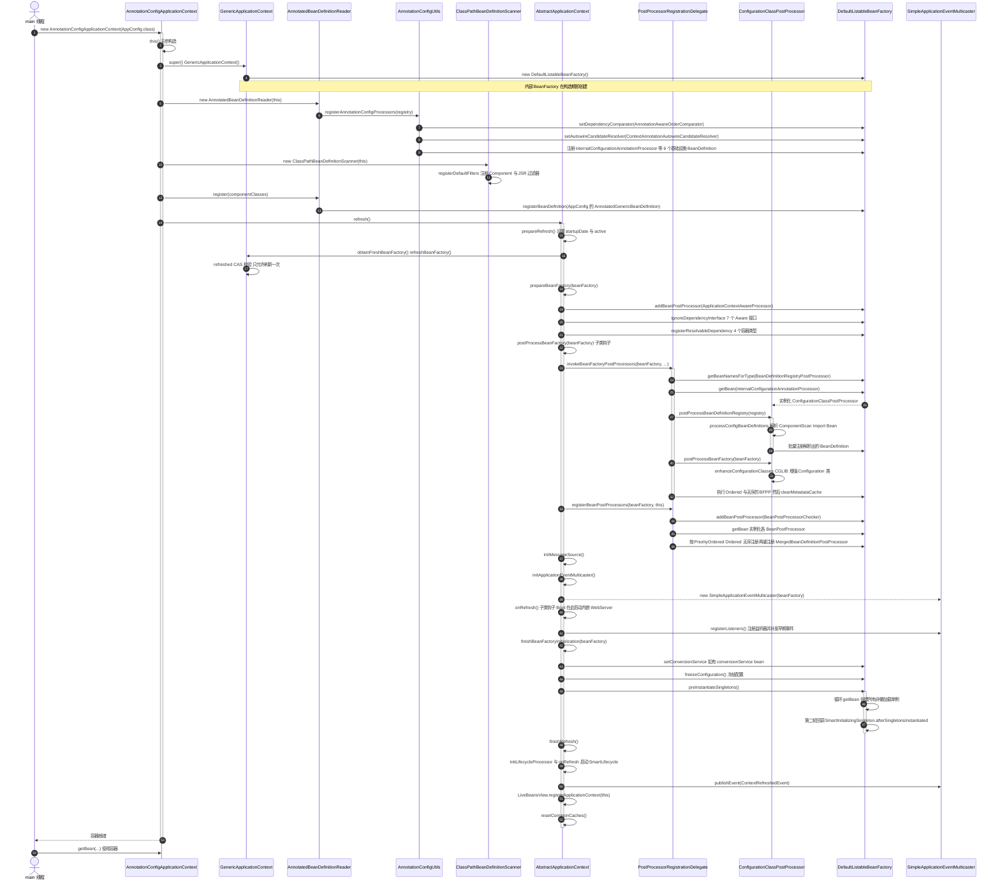
```mermaid
sequenceDiagram
    autonumber
    actor Main as main 线程
    participant ACAC as AnnotationConfigApplicationContext
    participant GAC as GenericApplicationContext
    participant Reader as AnnotatedBeanDefinitionReader
    participant ACU as AnnotationConfigUtils
    participant Scanner as ClassPathBeanDefinitionScanner
    participant AAC as AbstractApplicationContext
    participant PPRD as PostProcessorRegistrationDelegate
    participant CCPP as ConfigurationClassPostProcessor
    participant DLBF as DefaultListableBeanFactory
    participant Multicaster as SimpleApplicationEventMulticaster

    Main->>ACAC: new AnnotationConfigApplicationContext(AppConfig.class)
    activate ACAC
    ACAC->>ACAC: this() 无参构造
    ACAC->>GAC: super() GenericApplicationContext()
    GAC->>DLBF: new DefaultListableBeanFactory()
    Note over GAC,DLBF: 内部 BeanFactory 在构造期即创建
    ACAC->>Reader: new AnnotatedBeanDefinitionReader(this)
    Reader->>ACU: registerAnnotationConfigProcessors(registry)
    ACU->>DLBF: setDependencyComparator(AnnotationAwareOrderComparator)
    ACU->>DLBF: setAutowireCandidateResolver(ContextAnnotationAutowireCandidateResolver)
    ACU->>DLBF: 注册 internalConfigurationAnnotationProcessor 等 6 个基础设施 BeanDefinition
    ACAC->>Scanner: new ClassPathBeanDefinitionScanner(this)
    Scanner->>Scanner: registerDefaultFilters 注册 Component 与 JSR 过滤器
    ACAC->>Reader: register(componentClasses)
    Reader->>DLBF: registerBeanDefinition(AppConfig 的 AnnotatedGenericBeanDefinition)
    ACAC->>AAC: refresh()
    activate AAC
    AAC->>AAC: prepareRefresh() 设置 startupDate 与 active
    AAC->>GAC: obtainFreshBeanFactory() refreshBeanFactory()
    GAC->>GAC: refreshed CAS 校验 只允许刷新一次
    AAC->>AAC: prepareBeanFactory(beanFactory)
    AAC->>DLBF: addBeanPostProcessor(ApplicationContextAwareProcessor)
    AAC->>DLBF: ignoreDependencyInterface 7 个 Aware 接口
    AAC->>DLBF: registerResolvableDependency 4 个容器类型
    AAC->>AAC: postProcessBeanFactory(beanFactory) 子类钩子
    AAC->>PPRD: invokeBeanFactoryPostProcessors(beanFactory, ...)
    activate PPRD
    PPRD->>DLBF: getBeanNamesForType(BeanDefinitionRegistryPostProcessor)
    PPRD->>DLBF: getBean(internalConfigurationAnnotationProcessor)
    DLBF-->>CCPP: 实例化 ConfigurationClassPostProcessor
    PPRD->>CCPP: postProcessBeanDefinitionRegistry(registry)
    activate CCPP
    CCPP->>CCPP: processConfigBeanDefinitions 解析 ComponentScan Import Bean
    CCPP->>DLBF: 批量注册解析出的 BeanDefinition
    deactivate CCPP
    PPRD->>CCPP: postProcessBeanFactory(beanFactory)
    CCPP->>CCPP: enhanceConfigurationClasses CGLIB 增强 Configuration 类
    PPRD->>DLBF: 执行 Ordered 与无序的 BFPP 然后 clearMetadataCache
    deactivate PPRD
    AAC->>PPRD: registerBeanPostProcessors(beanFactory, this)
    PPRD->>DLBF: addBeanPostProcessor(BeanPostProcessorChecker)
    PPRD->>DLBF: getBean 实例化各 BeanPostProcessor
    PPRD->>DLBF: 按 PriorityOrdered Ordered 无序注册 再重注册 MergedBeanDefinitionPostProcessor
    AAC->>AAC: initMessageSource()
    AAC->>AAC: initApplicationEventMulticaster()
    AAC-->>Multicaster: new SimpleApplicationEventMulticaster(beanFactory)
    AAC->>AAC: onRefresh() 子类钩子 Boot 在此启动内嵌 WebServer
    AAC->>Multicaster: registerListeners() 注册监听器并补发早期事件
    AAC->>AAC: finishBeanFactoryInitialization(beanFactory)
    AAC->>DLBF: setConversionService 如有 conversionService bean
    AAC->>DLBF: freezeConfiguration() 冻结配置
    AAC->>DLBF: preInstantiateSingletons()
    activate DLBF
    DLBF->>DLBF: 循环 getBean 创建所有非懒加载单例
    DLBF->>DLBF: 第二轮回调 SmartInitializingSingleton.afterSingletonsInstantiated
    deactivate DLBF
    AAC->>AAC: finishRefresh()
    AAC->>AAC: initLifecycleProcessor 与 onRefresh 启动 SmartLifecycle
    AAC->>Multicaster: publishEvent(ContextRefreshedEvent)
    AAC->>AAC: LiveBeansView.registerApplicationContext(this)
    AAC->>AAC: resetCommonCaches()
    deactivate AAC
    ACAC-->>Main: 容器就绪
    deactivate ACAC
    Main->>ACAC: getBean(...) 使用容器
```

---

## 5. refresh() 十二步流程图

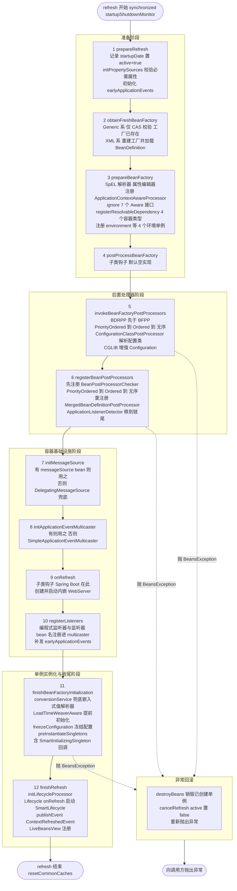
```mermaid
flowchart TD
    Start(["refresh 开始 synchronized startupShutdownMonitor"]) --> S1

    subgraph Phase1["准备阶段"]
        S1["1 prepareRefresh<br/>记录 startupDate 置 active=true<br/>initPropertySources 校验必需属性<br/>初始化 earlyApplicationEvents"]
        S2["2 obtainFreshBeanFactory<br/>Generic 系 仅 CAS 校验 工厂已存在<br/>XML 系 重建工厂并加载 BeanDefinition"]
        S3["3 prepareBeanFactory<br/>SpEL 解析器 属性编辑器<br/>注册 ApplicationContextAwareProcessor<br/>ignore 7 个 Aware 接口<br/>registerResolvableDependency 4 个容器类型<br/>注册 environment 等 4 个环境单例"]
        S4["4 postProcessBeanFactory<br/>子类钩子 默认空实现"]
    end

    subgraph Phase2["后置处理器阶段"]
        S5["5 invokeBeanFactoryPostProcessors<br/>BDRPP 先于 BFPP<br/>PriorityOrdered 到 Ordered 到 无序<br/>ConfigurationClassPostProcessor 解析配置类<br/>CGLIB 增强 Configuration"]
        S6["6 registerBeanPostProcessors<br/>先注册 BeanPostProcessorChecker<br/>PriorityOrdered 到 Ordered 到 无序<br/>重注册 MergedBeanDefinitionPostProcessor<br/>ApplicationListenerDetector 移到链尾"]
    end

    subgraph Phase3["容器基础设施阶段"]
        S7["7 initMessageSource<br/>有 messageSource bean 则用之<br/>否则 DelegatingMessageSource 兜底"]
        S8["8 initApplicationEventMulticaster<br/>有则用之 否则<br/>SimpleApplicationEventMulticaster"]
        S9["9 onRefresh<br/>子类钩子 Spring Boot 在此<br/>创建并启动内嵌 WebServer"]
        S10["10 registerListeners<br/>编程式监听器与监听器 bean 名注册进 multicaster<br/>补发 earlyApplicationEvents"]
    end

    subgraph Phase4["单例实例化与收尾阶段"]
        S11["11 finishBeanFactoryInitialization<br/>conversionService 兜底嵌入式值解析器<br/>LoadTimeWeaverAware 提前初始化<br/>freezeConfiguration 冻结配置<br/>preInstantiateSingletons<br/>含 SmartInitializingSingleton 回调"]
        S12["12 finishRefresh<br/>initLifecycleProcessor<br/>Lifecycle onRefresh 启动 SmartLifecycle<br/>publishEvent ContextRefreshedEvent<br/>LiveBeansView 注册"]
    end

    S1 --> S2 --> S3 --> S4 --> S5 --> S6 --> S7 --> S8 --> S9 --> S10 --> S11 --> S12
    S12 --> Done(["refresh 结束 resetCommonCaches"])

    S5 -. "抛 BeansException" .-> Rollback
    S6 -. "抛 BeansException" .-> Rollback
    S11 -. "抛 BeansException" .-> Rollback
    subgraph Rollback["异常回滚"]
        RB["destroyBeans 销毁已创建单例<br/>cancelRefresh active 置 false<br/>重新抛出异常"]
    end
    Rollback --> Err(["向调用方抛出异常"])
```

---

## 6. 容器销毁流程

### 6.1 registerShutdownHook()：JVM 退出时的保险

`AbstractApplicationContext.java:997-1011`：

```java
@Override
public void registerShutdownHook() {
	if (this.shutdownHook == null) {
		// No shutdown hook registered yet.
		this.shutdownHook = new Thread(SHUTDOWN_HOOK_THREAD_NAME) {        // 线程名 "SpringContextShutdownHook"
			@Override
			public void run() {
				synchronized (startupShutdownMonitor) {                    // 与 refresh/close 同一把锁
					doClose();
				}
			}
		};
		Runtime.getRuntime().addShutdownHook(this.shutdownHook);
	}
}
```

要点：钩子线程内部**也要抢 `startupShutdownMonitor` 锁**再 `doClose()`，避免与正在进行的 refresh/close 竞争；幂等（已注册则跳过）；Spring Boot 启动容器时会自动调用它，纯 Spring 场景需要开发者手工调用。

### 6.2 close() 与 doClose()

`close()`（`AbstractApplicationContext.java:1032-1047`）只是加锁委托 + 摘除钩子：

```java
@Override
public void close() {
	synchronized (this.startupShutdownMonitor) {
		doClose();
		// If we registered a JVM shutdown hook, we don't need it anymore now:
		// We've already explicitly closed the context.
		if (this.shutdownHook != null) {
			try {
				Runtime.getRuntime().removeShutdownHook(this.shutdownHook);
			}
			catch (IllegalStateException ex) {
				// ignore - VM is already shutting down
			}
		}
	}
}
```

真正的关闭逻辑在 `doClose()`（`AbstractApplicationContext.java:1058-1109`），全程受 `active && closed.compareAndSet(false, true)` 保护，保证只执行一次：

```java
protected void doClose() {
	// Check whether an actual close attempt is necessary...
	if (this.active.get() && this.closed.compareAndSet(false, true)) {     // :1061 幂等
		if (logger.isDebugEnabled()) {
			logger.debug("Closing " + this);
		}

		if (!NativeDetector.inNativeImage()) {
			LiveBeansView.unregisterApplicationContext(this);              // :1067 摘除 MBean
		}

		try {
			// Publish shutdown event.
			publishEvent(new ContextClosedEvent(this));                     // :1072 发布关闭事件
		}
		catch (Throwable ex) {
			logger.warn("Exception thrown from ApplicationListener handling ContextClosedEvent", ex);
		}

		// Stop all Lifecycle beans, to avoid delays during individual destruction.
		if (this.lifecycleProcessor != null) {                              // :1079 先停生命周期 bean
			try {
				this.lifecycleProcessor.onClose();
			}
			catch (Throwable ex) {
				logger.warn("Exception thrown from LifecycleProcessor on context close", ex);
			}
		}

		// Destroy all cached singletons in the context's BeanFactory.
		destroyBeans();                                                     // :1089 销毁所有缓存单例

		// Close the state of this context itself.
		closeBeanFactory();                                                 // :1092 关闭工厂状态

		// Let subclasses do some final clean-up if they wish...
		onClose();                                                          // :1095 子类收尾钩子（Boot 在此停 WebServer）

		// Reset common introspection caches to avoid class reference leaks.
		resetCommonCaches();                                                // :1098

		// Reset local application listeners to pre-refresh state.
		if (this.earlyApplicationListeners != null) {                       // :1101
			this.applicationListeners.clear();
			this.applicationListeners.addAll(this.earlyApplicationListeners);
		}

		// Switch to inactive.
		this.active.set(false);                                             // :1107 容器彻底失活
	}
}
```

**关闭顺序的设计逻辑**（与 refresh 相反的"逆序拆除"）：

1. **先发 `ContextClosedEvent`**——此时容器仍完全可用，监听器还能做"关门前最后一件事"（如拒绝新请求、刷写缓冲）；
2. **再停 Lifecycle**（`lifecycleProcessor.onClose()`）——先停 SmartLifecycle（如消息消费者、Web 服务器），避免后续销毁 bean 时还在接收流量，javadoc 原话：*Stop all Lifecycle beans, to avoid delays during individual destruction*；
3. **然后 `destroyBeans()`**（`AbstractApplicationContext.java:1122-1124`）：

```java
protected void destroyBeans() {
	getBeanFactory().destroySingletons();
}
```

`DefaultListableBeanFactory.destroySingletons()`（`DefaultListableBeanFactory.java:1154-1159`）先调父类再清 byType 缓存与手动单例名集合；父类 `DefaultSingletonBeanRegistry.destroySingletons()`（`spring-beans/src/main/java/org/springframework/beans/factory/support/DefaultSingletonBeanRegistry.java:507-527`）负责真正的销毁：

```java
public void destroySingletons() {
	if (logger.isTraceEnabled()) {
		logger.trace("Destroying singletons in " + this);
	}
	synchronized (this.singletonObjects) {
		this.singletonsCurrentlyInDestruction = true;          // :512 进入销毁态（此后 getBean 会拒绝）
	}

	String[] disposableBeanNames;
	synchronized (this.disposableBeans) {
		disposableBeanNames = StringUtils.toStringArray(this.disposableBeans.keySet());
	}
	for (int i = disposableBeanNames.length - 1; i >= 0; i--) {  // :519-521 倒序销毁！
		destroySingleton(disposableBeanNames[i]);
	}

	this.containedBeanMap.clear();
	this.dependentBeanMap.clear();
	this.dependenciesForBeanMap.clear();

	clearSingletonCache();                                      // :527 清空三级缓存
}
```

**倒序销毁（i--）**：后创建的先销毁——与依赖方向大体相反，先销毁依赖者、再销毁被依赖者，避免"上游已死、下游还在用它"的窗口。每个 bean 的销毁链（`DisposableBeanAdapter`）依次执行 `@PreDestroy` → `DisposableBean.destroy()` → 自定义 `destroy-method`（`CommonAnnotationBeanPostProcessor` 负责识别 `@PreDestroy`）；同时逐个从 `dependentBeanMap` 中摘除反向依赖，追踪"哪个 bean 因谁而生"的映射在销毁时被反向消费（这也是运行期检测 `BeanCurrentlyInCreationException` 类循环的数据来源）。

4. **`closeBeanFactory()`**：Generic 系仅清 serializationId（`GenericApplicationContext.java:301-304`），工厂对象随 context 一起等 GC；XML 系（`AbstractRefreshableApplicationContext`）会把内部工厂引用置 null，工厂彻底关闭；
5. **`onClose()`**：子类收尾钩子——Spring Boot 的 `ServletWebServerApplicationContext#onClose` 在此释放 WebServer 相关资源；
6. 最后重置内省缓存、把监听器列表还原为 refresh 前快照（配合 `prepareRefresh` 的设计，使"refresh 前编程注册的监听器"在反复 refresh 场景下不丢失）、`active=false`。

### 6.3 完整销毁时序

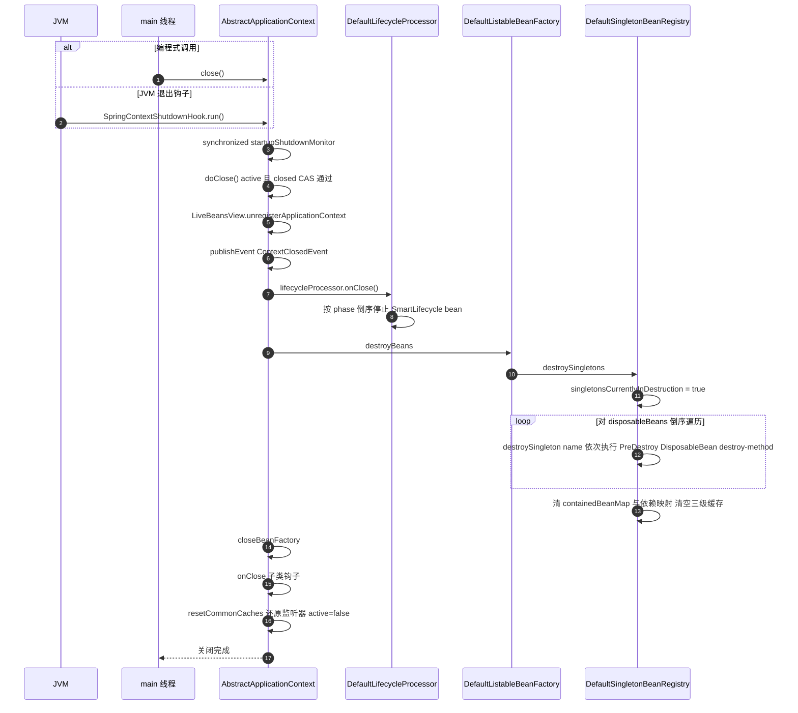
```mermaid
sequenceDiagram
    autonumber
    participant Jvm as JVM
    participant Main as main 线程
    participant AAC as AbstractApplicationContext
    participant LP as DefaultLifecycleProcessor
    participant DLBF as DefaultListableBeanFactory
    participant DSR as DefaultSingletonBeanRegistry

    alt 编程式调用
        Main->>AAC: close()
    else JVM 退出钩子
        Jvm->>AAC: SpringContextShutdownHook.run()
    end
    AAC->>AAC: synchronized startupShutdownMonitor
    AAC->>AAC: doClose() active 且 closed CAS 通过
    AAC->>AAC: LiveBeansView.unregisterApplicationContext
    AAC->>AAC: publishEvent ContextClosedEvent
    AAC->>LP: lifecycleProcessor.onClose()
    LP->>LP: 按 phase 倒序停止 SmartLifecycle bean
    AAC->>DLBF: destroyBeans
    DLBF->>DSR: destroySingletons
    DSR->>DSR: singletonsCurrentlyInDestruction = true
    loop 对 disposableBeans 倒序遍历
        DSR->>DSR: destroySingleton name 依次执行 PreDestroy DisposableBean destroy-method
    end
    DSR->>DSR: 清 containedBeanMap 与依赖映射 清空三级缓存
    AAC->>AAC: closeBeanFactory
    AAC->>AAC: onClose 子类钩子
    AAC->>AAC: resetCommonCaches 还原监听器 active=false
    AAC-->>Main: 关闭完成
```

---

## 7. 本章小结

把全文压缩成几条"源码级记忆点"：

1. **组合而非继承**：`AbstractApplicationContext` 不继承任何 BeanFactory 实现，它通过抽象 `getBeanFactory()` 持有并委托给内部 `DefaultListableBeanFactory`——后者是唯一同时实现 `ConfigurableListableBeanFactory` 与 `BeanDefinitionRegistry` 的内核实现。
2. **注解容器的工厂创建在构造期**：`new AnnotationConfigApplicationContext()` 的 `this()` 里，`GenericApplicationContext()` 先 `new DefaultListableBeanFactory()`；`AnnotatedBeanDefinitionReader` 再注册 `ConfigurationClassPostProcessor` 等 6 个基础设施 BeanDefinition；scanner 默认过滤 `@Component` + JSR-250/330。refresh 第 2 步对 Generic 系只是一次 CAS 幂等校验。
3. **refresh 是模板方法 + 十二步流水线**：准备(1-2) → 工厂配置(3-4) → 后置处理器(5-6) → 容器基础设施(7-10) → 单例实例化(11) → 收尾(12)；每一步内部又有"约定 bean or 默认实现"（messageSource / applicationEventMulticaster / lifecycleProcessor）和"三段排序"（PriorityOrdered → Ordered → 无序）两大固定套路。
4. **第 5 步是注解世界的引爆点**：`PostProcessorRegistrationDelegate.invokeBeanFactoryPostProcessors` 中，BDRPP 严格先于 BFPP 执行，`ConfigurationClassPostProcessor`（PriorityOrdered、最高优先级）在此解析配置类并批量注册 BeanDefinition，随后回调 `postProcessBeanFactory` 做 CGLIB 增强。
5. **第 11 步是耗时大头**：`freezeConfiguration` 冻结元数据加速缓存，`preInstantiateSingletons` 两轮循环——第一轮 `getBean` 创建全部非懒加载单例，第二轮统一回调 `SmartInitializingSingleton.afterSingletonsInstantiated`。
6. **销毁与启动严格镜像**：`doClose()` 的顺序是发 `ContextClosedEvent` → 停 Lifecycle → `destroySingletons`（**倒序**执行 `@PreDestroy`/`DisposableBean`/`destroy-method`）→ `closeBeanFactory` → `onClose`；`registerShutdownHook` 把这套流程挂到 JVM 退出钩子上，且与 refresh/close 共用同一把 `startupShutdownMonitor` 锁。


# 第三章 Bean 的生命周期与常用扩展点、SPI 机制、ShutdownHook


> 源码基线：Spring Framework **5.3.38**
> 仓库根目录：`/Users/wenbin/Desktop/workspace/java_projects/source_code/spring-framework-5.3.38`
> 本文所有源码引用格式为 `文件路径:行号`（路径相对仓库根目录，行号均经逐一核对）。

Bean 的生命周期是 Spring 一切魔法的"主干道"：IoC 容器的实例化、依赖注入、AOP 代理、事件发布、优雅停机，全部挂载在这条主干道的各个"钩子"（扩展点）上。本章以 `AbstractAutowireCapableBeanFactory.doCreateBean()` 为主线逐行拆解完整生命周期，再横向展开 BeanPostProcessor 家族、Aware 家族、Lifecycle 家族、事件机制、`SpringFactoriesLoader` SPI 以及 ShutdownHook 的源码实现。

---

## A. Bean 生命周期（核心主线）

### A.1 全景：从 getBean() 到 createBean()

容器对单例 Bean 的创建入口是 `AbstractBeanFactory.getBean(String)` → `doGetBean()` → `getSingleton(beanName, ObjectFactory)`（三级缓存查询，见 A.5）→ 缓存未命中时执行传入的 ObjectFactory：

```java
// spring-beans/src/main/java/org/springframework/beans/factory/support/DefaultSingletonBeanRegistry.java:227-249
sharedInstance = getSingleton(beanName, () -> {
    try {
        return createBean(beanName, mbd, args);
    }
    catch (BeansException ex) {
        destroySingleton(beanName);
        throw ex;
    }
});
```

`createBean()` 定义在 `AbstractAutowireCapableBeanFactory` 中（`spring-beans/src/main/java/org/springframework/beans/factory/support/AbstractAutowireCapableBeanFactory.java:502-557`），它只做三件事：

```java
// AbstractAutowireCapableBeanFactory.java:502-557（节选）
@Override
protected Object createBean(String beanName, RootBeanDefinition mbd, @Nullable Object[] args)
        throws BeanCreationException {

    RootBeanDefinition mbdToUse = mbd;

    // 1. 解析 beanClass，必要时克隆一份合并后的 BeanDefinition
    //    （动态解析出的 Class 不能存进共享的 merged bean definition）
    Class<?> resolvedClass = resolveBeanClass(mbd, beanName);
    if (resolvedClass != null && !mbd.hasBeanClass() && mbd.getBeanClassName() != null) {
        mbdToUse = new RootBeanDefinition(mbd);
        mbdToUse.setBeanClass(resolvedClass);
    }

    // 2. 校验并预解析 lookup-method / replaced-method 覆盖
    mbdToUse.prepareMethodOverrides();

    try {
        // 3. 实例化前的"短路"入口：给 BeanPostProcessor 一个返回代理的机会
        Object bean = resolveBeforeInstantiation(beanName, mbdToUse);
        if (bean != null) {
            return bean;   // <-- 短路：直接返回代理，doCreateBean 不再执行
        }
    }
    catch (Throwable ex) { ... }

    try {
        Object beanInstance = doCreateBean(beanName, mbdToUse, args);  // 4. 真正的生命周期主线
        return beanInstance;
    }
    ...
}
```

### A.2 BeanDefinition 的加载与合并（GenericBeanDefinition → RootBeanDefinition）

**为什么需要"合并"？** XML/注解解析阶段注册进 `BeanDefinitionRegistry` 的通常是 `GenericBeanDefinition`（或注解场景的 `ScannedGenericBeanDefinition`、`AnnotatedGenericBeanDefinition`），它们可以带有 `parentName`（子定义）。而 Bean 创建引擎（`AbstractAutowireCapableBeanFactory`）统一只认 `RootBeanDefinition`——即把父子定义合并、所有可选属性都填上默认值的"完备形态"。

合并发生在每次 `doGetBean()` 中（`AbstractBeanFactory.java:594` 等），核心方法：

```java
// spring-beans/src/main/java/org/springframework/beans/factory/support/AbstractBeanFactory.java:1353-1360
protected RootBeanDefinition getMergedLocalBeanDefinition(String beanName) throws BeansException {
    // 先无锁查缓存，性能优先
    RootBeanDefinition mbd = this.mergedBeanDefinitions.get(beanName);
    if (mbd != null && !mbd.stale) {
        return mbd;
    }
    return getMergedBeanDefinition(beanName, getBeanDefinition(beanName));
}
```

合并逻辑（`AbstractBeanFactory.java:1386-1454`）：

```java
protected RootBeanDefinition getMergedBeanDefinition(
        String beanName, BeanDefinition bd, @Nullable BeanDefinition containingBd) {

    synchronized (this.mergedBeanDefinitions) {
        RootBeanDefinition mbd = null;
        ...
        if (mbd == null || mbd.stale) {
            if (bd.getParentName() == null) {
                // 无父定义：直接拷贝为 RootBeanDefinition
                if (bd instanceof RootBeanDefinition) {
                    mbd = ((RootBeanDefinition) bd).cloneBeanDefinition();
                }
                else {
                    mbd = new RootBeanDefinition(bd);   // GenericBeanDefinition -> RootBeanDefinition
                }
            }
            else {
                // 子定义：先递归取得父定义的合并形态，再深拷贝并用子定义覆盖
                ...
                mbd = new RootBeanDefinition(pbd);
                mbd.overrideFrom(bd);                   // 子定义属性覆盖父定义
            }

            // 默认 scope 为 singleton
            if (!StringUtils.hasLength(mbd.getScope())) {
                mbd.setScope(SCOPE_SINGLETON);
            }
            ...
            // 缓存（可能稍后因元数据变化而被标记 stale 重新合并）
            if (containingBd == null && isCacheBeanMetadata()) {
                this.mergedBeanDefinitions.put(beanName, mbd);
            }
        }
        return mbd;
    }
}
```

要点：

| 机制 | 说明 |
|---|---|
| `mergedBeanDefinitions` 缓存 | `Map<String, RootBeanDefinition>`，避免每次 getBean 重复合并 |
| `stale` 标志 | BeanDefinition 被修改（如 BFPP 替换占位符）后置为 stale，下次重新合并（`resetBeanDefinition` 中置位） |
| 内部 Bean（`<bean>` 内嵌 `<bean>`） | `containingBd != null` 时不进缓存；外层非单例时内层强制同 scope |
| `prepareMethodOverrides()` | 统计 lookup-method/replaced-method 同名重载个数，只有一个时不做运行时参数匹配，提高效率 |

`RootBeanDefinition` 还携带大量"创建期缓存"字段（`resolvedConstructorOrFactoryMethod`、`constructorArgumentLock`、`postProcessed`、`beforeInstantiationResolved`、`resolvedDestroyMethodName` 等），它们不属于配置元数据，而是**单个 BeanDefinition 的创建状态机**——这也是必须为每个 bean 维护一份独立 RootBeanDefinition 的原因。

### A.3 实例化前：resolveBeforeInstantiation —— AOP 的短路入口

```java
// AbstractAutowireCapableBeanFactory.java:1128-1144
@Nullable
protected Object resolveBeforeInstantiation(String beanName, RootBeanDefinition mbd) {
    Object bean = null;
    if (!Boolean.FALSE.equals(mbd.beforeInstantiationResolved)) {
        // synthetic = true 的 Bean（容器自己合成的基础设施 Bean）不走此逻辑
        if (!mbd.isSynthetic() && hasInstantiationAwareBeanPostProcessors()) {
            Class<?> targetType = determineTargetType(beanName, mbd);
            if (targetType != null) {
                // 3.1 实例化前钩子（返回非 null 即短路）
                bean = applyBeanPostProcessorsBeforeInstantiation(targetType, beanName);
                if (bean != null) {
                    // 3.2 短路对象也要走一遍"初始化后"钩子
                    bean = applyBeanPostProcessorsAfterInitialization(bean, beanName);
                }
            }
        }
        mbd.beforeInstantiationResolved = (bean != null);
    }
    return bean;
}

// AbstractAutowireCapableBeanFactory.java:1158-1166
@Nullable
protected Object applyBeanPostProcessorsBeforeInstantiation(Class<?> beanClass, String beanName) {
    for (InstantiationAwareBeanPostProcessor bp : getBeanPostProcessorCache().instantiationAware) {
        Object result = bp.postProcessBeforeInstantiation(beanClass, beanName);
        if (result != null) {
            return result;    // 任一处理器返回对象即立刻返回（短路）
        }
    }
    return null;
}
```

**AOP 如何利用这个短路入口？** `AbstractAutoProxyCreator`（`spring-aop/src/main/java/org/springframework/aop/framework/autoproxy/AbstractAutoProxyCreator.java:248-276`）：

```java
@Override
public Object postProcessBeforeInstantiation(Class<?> beanClass, String beanName) {
    Object cacheKey = getCacheKey(beanClass, beanName);

    if (!StringUtils.hasLength(beanName) || !this.targetSourcedBeans.contains(beanName)) {
        if (this.advisedBeans.containsKey(cacheKey)) {
            return null;                             // 已判定过：不需要代理
        }
        if (isInfrastructureClass(beanClass) || shouldSkip(beanClass, beanName)) {
            this.advisedBeans.put(cacheKey, Boolean.FALSE);  // Advice/Pointcut/Advisor/AOP 基础类不代理
            return null;
        }
    }

    // 只有自定义 TargetSource 时才在这里提前创建代理（短路掉默认实例化）
    TargetSource targetSource = getCustomTargetSource(beanClass, beanName);
    if (targetSource != null) {
        ...
        Object[] specificInterceptors = getAdvicesAndAdvisorsForBean(beanClass, beanName, targetSource);
        Object proxy = createProxy(beanClass, beanName, specificInterceptors, targetSource);
        this.proxyTypes.put(cacheKey, proxy.getClass());
        return proxy;
    }
    return null;
}
```

注意区分两个易混点：

1. **常规 AOP 代理不是在这里生成的**。普通 `@AspectJ` Bean 的代理在 `postProcessAfterInitialization`（A.7 节）生成；这里只有在配置了**自定义 TargetSource**（如 `targetSource` 指向热替换/池化目标）时才短路。
2. 一旦短路，`doCreateBean` 整个流程（属性填充、init 方法等）都不再执行——因为目标 Bean 根本没被创建。

### A.4 实例化：createBeanInstance —— 四条实例化路径

```java
// AbstractAutowireCapableBeanFactory.java:1180-1233
protected BeanWrapper createBeanInstance(String beanName, RootBeanDefinition mbd, @Nullable Object[] args) {
    Class<?> beanClass = resolveBeanClass(mbd, beanName);
    ...
    // 路径 1：InstanceSupplier（5.0 引入，lambda/函数式注册）
    Supplier<?> instanceSupplier = mbd.getInstanceSupplier();
    if (instanceSupplier != null) {
        return obtainFromSupplier(instanceSupplier, beanName);
    }

    // 路径 2：factory-method（@Bean 方法 / XML factory-bean+factory-method）
    if (mbd.getFactoryMethodName() != null) {
        return instantiateUsingFactoryMethod(beanName, mbd, args);
    }

    // 快捷路径：同一个 Bean 重复创建时（如 prototype）复用已解析的构造器
    boolean resolved = false;
    boolean autowireNecessary = false;
    if (args == null) {
        synchronized (mbd.constructorArgumentLock) {
            if (mbd.resolvedConstructorOrFactoryMethod != null) {
                resolved = true;
                autowireNecessary = mbd.constructorArgumentsResolved;
            }
        }
    }
    if (resolved) {
        if (autowireNecessary) {
            return autowireConstructor(beanName, mbd, null, null);
        }
        else {
            return instantiateBean(beanName, mbd);
        }
    }

    // 路径 3：SmartInstantiationAwareBeanPostProcessor 推断候选构造器
    //         （@Autowired 构造器由 AutowiredAnnotationBeanPostProcessor 在这里返回）
    Constructor<?>[] ctors = determineConstructorsFromBeanPostProcessors(beanClass, beanName);
    if (ctors != null || mbd.getResolvedAutowireMode() == AUTOWIRE_CONSTRUCTOR ||
            mbd.hasConstructorArgumentValues() || !ObjectUtils.isEmpty(args)) {
        return autowireConstructor(beanName, mbd, ctors, args);
    }

    // 路径 3b：首选构造器（Kotlin primary constructor 场景）
    ctors = mbd.getPreferredConstructors();
    if (ctors != null) {
        return autowireConstructor(beanName, mbd, ctors, null);
    }

    // 路径 4：默认无参构造
    return instantiateBean(beanName, mbd);
}
```

#### A.4.1 Supplier 回调（路径 1）

```java
// AbstractAutowireCapableBeanFactory.java:1243-1266
protected BeanWrapper obtainFromSupplier(Supplier<?> instanceSupplier, String beanName) {
    Object instance;
    String outerBean = this.currentlyCreatedBean.get();
    this.currentlyCreatedBean.set(beanName);
    try {
        instance = instanceSupplier.get();   // 直接回调用户 lambda
    }
    finally { ... }
    if (instance == null) {
        instance = new NullBean();           // 返回 null 的 Supplier 会包装为 NullBean
    }
    BeanWrapper bw = new BeanWrapperImpl(instance);
    initBeanWrapper(bw);
    return bw;
}
```

对应 `GenericApplicationContext.registerBean(Class, Supplier, BeanDefinitionCustomizer...)` 函数式注册方式。Supplier 里若再调用 `getBean()`，`getObjectForBeanInstance` 的重写（`AbstractAutowireCapableBeanFactory.java:1275-1285`）会把回调期间取到的 Bean 自动登记为依赖。

#### A.4.2 FactoryMethod（路径 2）与构造器推断（路径 3）

两者都委托给 `ConstructorResolver`：

- `instantiateUsingFactoryMethod`（`ConstructorResolver.java:385` 起）：解析 factoryBeanName（实例方法）或 beanClass（静态方法），**按修饰符 public 优先、参数多的优先**排序候选工厂方法，再逐个做参数匹配（`resolveConstructorArguments` + `createArgumentArray`，其中每个参数用 `resolveDependency` 按类型注入），`@Bean` 方法就是走这条路。
- `autowireConstructor`（`ConstructorResolver.java:118` 起）：核心是**构造器推断**：

```java
// spring-beans/src/main/java/org/springframework/beans/factory/support/ConstructorResolver.java:148-247（节选）
if (constructorToUse == null || argsToUse == null) {
    Constructor<?>[] candidates = chosenCtors;
    if (candidates == null) {
        candidates = (mbd.isNonPublicAccessAllowed() ?
                beanClass.getDeclaredConstructors() : beanClass.getConstructors());
    }
    // 只有一个无参构造 -> 直接用，缓存并返回
    if (candidates.length == 1 && explicitArgs == null && !mbd.hasConstructorArgumentValues()) {
        Constructor<?> uniqueCandidate = candidates[0];
        if (uniqueCandidate.getParameterCount() == 0) {
            ...
            bw.setBeanInstance(instantiate(beanName, mbd, uniqueCandidate, EMPTY_ARGS));
            return bw;
        }
    }

    boolean autowiring = (chosenCtors != null ||
            mbd.getResolvedAutowireMode() == AutowireCapableBeanFactory.AUTOWIRE_CONSTRUCTOR);
    ...
    AutowireUtils.sortConstructors(candidates);       // public 优先、参数多者优先
    int minTypeDiffWeight = Integer.MAX_VALUE;
    Set<Constructor<?>> ambiguousConstructors = null; // 记录权重并列的"歧义构造器"

    for (Constructor<?> candidate : candidates) {
        ...
        // 逐构造器：按 <constructor-arg> 或按类型解析出参数（createArgumentArray）
        int typeDiffWeight = (mbd.isLenientConstructorResolution() ?
                argsHolder.getTypeDifferenceWeight(paramTypes) : argsHolder.getAssignabilityWeight(paramTypes));
        // 权重越小越贴近；并列则记录为 ambiguous，最终抛 AmbiguousConstructorException（严格模式）
        if (typeDiffWeight < minTypeDiffWeight) {
            constructorToUse = candidate;
            ...
        }
        ...
    }
    ...
}
```

候选构造器来自 `determineConstructorsFromBeanPostProcessors`（`AbstractAutowireCapableBeanFactory.java:1297-1309`），唯一的生产者实现是 `AutowiredAnnotationBeanPostProcessor.determineCandidateConstructors`（`AutowiredAnnotationBeanPostProcessor.java:267-402`），其规则：

- 有 `@Autowired(required=true)` 构造器 → 只返回它（多个 required=true 抛异常）；
- 没有 `@Autowired` 但**只有一个构造器且带参数** → 返回该构造器（隐式构造器注入）；
- Kotlin primary constructor → `BeanUtils.findPrimaryConstructor` 返回；
- 顺带在这里解析 `@Lookup` 方法（往 merged BeanDefinition 里塞 `LookupOverride`，触发 CGLIB）。

#### A.4.3 SimpleInstantiationStrategy：JDK 反射 / CGLIB

默认实例化策略是 **CglibSubclassingInstantiationStrategy**（`AbstractAutowireCapableBeanFactory.java:184` 处初始化），它继承自 `SimpleInstantiationStrategy`：

```java
// spring-beans/src/main/java/org/springframework/beans/factory/support/SimpleInstantiationStrategy.java:61-93
@Override
public Object instantiate(RootBeanDefinition bd, @Nullable String beanName, BeanFactory owner) {
    // 没有方法覆盖时不必生成 CGLIB 子类
    if (!bd.hasMethodOverrides()) {
        Constructor<?> constructorToUse;
        synchronized (bd.constructorArgumentLock) {
            constructorToUse = (Constructor<?>) bd.resolvedConstructorOrFactoryMethod;
            if (constructorToUse == null) {
                ...
                constructorToUse = clazz.getDeclaredConstructor();  // 无参构造
                bd.resolvedConstructorOrFactoryMethod = constructorToUse;
            }
        }
        return BeanUtils.instantiateClass(constructorToUse);   // JDK 反射（Kotlin 支持见 instantiateClass）
    }
    else {
        // Must generate CGLIB subclass.
        return instantiateWithMethodInjection(bd, beanName, owner);
    }
}
```

工厂方法版本（`SimpleInstantiationStrategy.java:137-187`）就是 `factoryMethod.invoke(factoryBean, args)`，并通过 ThreadLocal `currentlyInvokedFactoryMethod` 记录"当前正在调用的工厂方法"，供 `FactoryBean`/`BeanFactory`Utils 识别"是否容器自己在调用"。

**CGLIB 路径**（lookup-method / replaced-method 才会走到）：`CglibSubclassingInstantiationStrategy`（`spring-beans/src/main/java/org/springframework/beans/factory/support/CglibSubclassingInstantiationStrategy.java:54-157`）：

```java
// CglibSubclassingInstantiationStrategy.java:116-139
public Object instantiate(@Nullable Constructor<?> ctor, Object... args) {
    Class<?> subclass = createEnhancedSubclass(this.beanDefinition);  // Enhancer 生成子类
    Object instance;
    if (ctor == null) {
        instance = BeanUtils.instantiateClass(subclass);   // 无参：反射
    }
    else {
        Constructor<?> enhancedSubclassConstructor = subclass.getConstructor(ctor.getParameterTypes());
        instance = enhancedSubclassConstructor.newInstance(args);
    }
    // SPR-10785: 回调直接 setCallbacks 到实例上而非 Enhancer，避免类级别的回调泄漏
    Factory factory = (Factory) instance;
    factory.setCallbacks(new Callback[] {NoOp.INSTANCE,
            new LookupOverrideMethodInterceptor(this.beanDefinition, this.owner),
            new ReplaceOverrideMethodInterceptor(this.beanDefinition, this.owner)});
    return instance;
}
```

> 说明：本仓库中方法注入子类的无参创建走 `BeanUtils.instantiateClass(subclass)`（JDK 反射）。Objenesis（绕过构造器实例化）在 5.3 中主要用于 **AOP 代理**的创建（`ObjenesisCglibAopProxy`，spring-aop 模块）以及 `objenesis` 在 `spring-core` 的 `SerializationUtils`/代理场景，而不是普通 Bean 的实例化——普通 Bean 永远要通过构造器（这也正是构造器注入语义所在）。

### A.5 三级缓存放置与 early singleton exposure（简述，与循环依赖章节呼应）

`doCreateBean` 在实例化之后、属性填充之前，做了一件为循环依赖埋点的事：

```java
// AbstractAutowireCapableBeanFactory.java:604-614
// Eagerly cache singletons to be able to resolve circular references
// even when triggered by lifecycle interfaces like BeanFactoryAware.
boolean earlySingletonExposure = (mbd.isSingleton() && this.allowCircularReferences &&
        isSingletonCurrentlyInCreation(beanName));
if (earlySingletonExposure) {
    addSingletonFactory(beanName, () -> getEarlyBeanReference(beanName, mbd, bean));
}
```

三级缓存（`DefaultSingletonBeanRegistry.java:78-84`）：

| 级别 | 字段 | 内容 |
|---|---|---|
| 一级 | `singletonObjects` | 完全初始化好的成品单例 |
| 二级 | `earlySingletonObjects` | 提前暴露的早期引用（可能是代理） |
| 三级 | `singletonFactories` | `ObjectFactory`（lambda：`getEarlyBeanReference`） |

获取逻辑（`DefaultSingletonBeanRegistry.java:180-204`）：一级 → 二级 → 加锁后再查一二级 → 三级 `singletonFactories.get(beanName).getObject()`，**结果放入二级、删除三级**。

`getEarlyBeanReference`（`AbstractAutowireCapableBeanFactory.java:981-989`）会调用所有 `SmartInstantiationAwareBeanPostProcessor.getEarlyBeanReference`——`AbstractAutoProxyCreator` 在此返回代理（`AbstractAutoProxyCreator.java:241-245`），从而保证循环依赖中注入的是代理而非原始对象。初始化完成后（`doCreateBean:632-657`）用 `getSingleton(beanName, false)` 取早期引用：若存在且最终对象没再被换包，则用早期引用替换 `exposedObject`；若 Bean 曾以原始形态注入他人又最终被包装，且 `allowRawInjectionDespiteWrapping=false`，则抛出 `BeanCurrentlyInCreationException`（"in its raw version as part of a circular reference..."）。

细节留待循环依赖专章展开。

### A.6 属性填充 populateBean：@Autowired / @Resource / @Value 的真正落点

```java
// AbstractAutowireCapableBeanFactory.java:1383-1454
protected void populateBean(String beanName, RootBeanDefinition mbd, @Nullable BeanWrapper bw) {
    if (bw == null) { ... return; }

    // 6.1 实例化后钩子：返回 false 可让容器放弃属性填充（短路整个注入阶段）
    if (!mbd.isSynthetic() && hasInstantiationAwareBeanPostProcessors()) {
        for (InstantiationAwareBeanPostProcessor bp : getBeanPostProcessorCache().instantiationAware) {
            if (!bp.postProcessAfterInstantiation(bw.getWrappedInstance(), beanName)) {
                return;
            }
        }
    }

    PropertyValues pvs = (mbd.hasPropertyValues() ? mbd.getPropertyValues() : null);

    // 6.2 XML autowire="byName"/"byType"（注解时代基本不用）
    int resolvedAutowireMode = mbd.getResolvedAutowireMode();
    if (resolvedAutowireMode == AUTOWIRE_BY_NAME || resolvedAutowireMode == AUTOWIRE_BY_TYPE) {
        MutablePropertyValues newPvs = new MutablePropertyValues(pvs);
        if (resolvedAutowireMode == AUTOWIRE_BY_NAME) {
            autowireByName(beanName, mbd, bw, newPvs);
        }
        if (resolvedAutowireMode == AUTOWIRE_BY_TYPE) {
            autowireByType(beanName, mbd, bw, newPvs);
        }
        pvs = newPvs;
    }

    boolean hasInstAwareBpps = hasInstantiationAwareBeanPostProcessors();
    ...
    // 6.3 注解注入的核心：InstantiationAwareBeanPostProcessor.postProcessProperties
    if (hasInstAwareBpps) {
        if (pvs == null) {
            pvs = mbd.getPropertyValues();
        }
        for (InstantiationAwareBeanPostProcessor bp : getBeanPostProcessorCache().instantiationAware) {
            PropertyValues pvsToUse = bp.postProcessProperties(pvs, bw.getWrappedInstance(), beanName);
            if (pvsToUse == null) {
                // 兼容 5.1 前的旧钩子
                ...
                pvsToUse = bp.postProcessPropertyValues(pvs, filteredPds, bw.getWrappedInstance(), beanName);
                if (pvsToUse == null) {
                    return;
                }
            }
            pvs = pvsToUse;
        }
    }
    ...
    // 6.4 一次性把 PropertyValues 批量反射写入
    if (pvs != null) {
        applyPropertyValues(beanName, mbd, bw, pvs);
    }
}
```

四个关键点：

1. **`@Autowired`/`@Value` 的注入点**：`AutowiredAnnotationBeanPostProcessor.postProcessProperties`（`spring-beans/src/main/java/org/springframework/beans/factory/annotation/AutowiredAnnotationBeanPostProcessor.java:405-417`）：

```java
@Override
public PropertyValues postProcessProperties(PropertyValues pvs, Object bean, String beanName) {
    InjectionMetadata metadata = findAutowiringMetadata(beanName, bean.getClass(), pvs);
    try {
        metadata.inject(bean, beanName, pvs);   // 逐元素 AutowiredFieldElement/AutowiredMethodElement
    }
    catch (BeanCreationException ex) { throw ex; }
    catch (Throwable ex) {
        throw new BeanCreationException(beanName, "Injection of autowired dependencies failed", ex);
    }
    return pvs;
}
```

   注入元数据（哪些字段/方法带 `@Autowired`/`@Value`/`@Inject`）由 `buildAutowiringMetadata`（`AutowiredAnnotationBeanPostProcessor.java:470-525`）扫描并缓存（`injectionMetadataCache`），并且**早在 `postProcessMergedBeanDefinition`（A.1 中 doCreateBean 第 594 行调用）阶段就预解析并把注入点注册为 externally managed config members**，避免 BeanDefinition 层面的属性检查干扰。真正的值解析在 `AutowiredFieldElement.inject → beanFactory.resolveDependency`（`DefaultListableBeanFactory`，按类型/名称/限定符匹配，@Value 走 converter + embedded value resolver）。

2. **`@Resource`（以及 `@WebServiceRef`/`@EJB`）的注入点**：`CommonAnnotationBeanPostProcessor`（`spring-context/src/main/java/org/springframework/context/annotation/CommonAnnotationBeanPostProcessor.java:146`，继承 `InitDestroyAnnotationBeanPostProcessor` 并实现 `InstantiationAwareBeanPostProcessor`），其 `postProcessProperties`（`CommonAnnotationBeanPostProcessor.java:326`）用 `buildResourceMetadata`（`CommonAnnotationBeanPostProcessor.java:366` 起）扫描 `@Resource` 注解的字段/方法，**默认按字段名/Setter 属性名匹配 beanName，找不到再按类型匹配**（`fallbackToDefaultTypeMatch=true`）。

3. **执行顺序**：BPP 注册顺序决定注入顺序；在标准注解配置容器中 `CommonAnnotationBeanPostProcessor`（`Ordered.LOWEST_PRECEDENCE`，即 order = Integer.MAX_VALUE）通常在 `AutowiredAnnotationBeanPostProcessor`（`Ordered.LOWEST_PRECEDENCE`）之后。同一 Bean 内部，注入顺序为：**父类字段 → 父类方法 → 子类字段 → 子类方法**（`buildAutowiringMetadata` 的 `elements.addAll(0, ...)` 逆序拼接保证）；`@Resource` 同理由 `buildResourceMetadata` 保证。注解注入先于 XML 属性注入执行（XML 会覆盖注解值，见 `CommonAnnotationBeanPostProcessor` javadoc："Annotation injection will be performed before XML injection"）。

4. **`autowireByName`/`autowireByType`**（`AbstractAutowireCapableBeanFactory.java:1465-1537`）：仅遍历"未满足的非简单属性"（`unsatisfiedNonSimpleProperties`，排除原生类型/String 等），byName 直接 `getBean(propertyName)`；byType 构造 `DependencyDescriptor` 调 `resolveDependency`。

### A.7 初始化 initializeBean：Aware → 前置处理 → init → 后置处理

```java
// AbstractAutowireCapableBeanFactory.java:1783-1812
protected Object initializeBean(String beanName, Object bean, @Nullable RootBeanDefinition mbd) {
    ...
    // 7.1 三大内置 Aware（容器直调，不经 BPP）
    invokeAwareMethods(beanName, bean);

    Object wrappedBean = bean;
    if (mbd == null || !mbd.isSynthetic()) {
        // 7.2 BeanPostProcessor.postProcessBeforeInitialization（@PostConstruct、容器 Aware 在这）
        wrappedBean = applyBeanPostProcessorsBeforeInitialization(wrappedBean, beanName);
    }

    try {
        // 7.3 InitializingBean.afterPropertiesSet + 自定义 init-method
        invokeInitMethods(beanName, wrappedBean, mbd);
    }
    catch (Throwable ex) { ... }

    if (mbd == null || !mbd.isSynthetic()) {
        // 7.4 BeanPostProcessor.postProcessAfterInitialization（AOP 代理生成入口）
        wrappedBean = applyBeanPostProcessorsAfterInitialization(wrappedBean, beanName);
    }
    return wrappedBean;
}
```

#### 7.1 invokeAwareMethods（`AbstractAutowireCapableBeanFactory.java:1814-1829`）

```java
private void invokeAwareMethods(String beanName, Object bean) {
    if (bean instanceof Aware) {
        if (bean instanceof BeanNameAware) {
            ((BeanNameAware) bean).setBeanName(beanName);
        }
        if (bean instanceof BeanClassLoaderAware) {
            ClassLoader bcl = getBeanClassLoader();
            if (bcl != null) {
                ((BeanClassLoaderAware) bean).setBeanClassLoader(bcl);
            }
        }
        if (bean instanceof BeanFactoryAware) {
            ((BeanFactoryAware) bean).setBeanFactory(AbstractAutowireCapableBeanFactory.this);
        }
    }
}
```

只处理 `BeanNameAware` / `BeanClassLoaderAware` / `BeanFactoryAware` 三个 BeanFactory 级 Aware——它们属于 spring-beans 模块，不依赖 context。**其余 Aware（Environment/ApplicationContext/...）由 BPP 回传**（见 B.5）。

#### 7.2 前置处理：@PostConstruct 与 ApplicationContextAwareProcessor

`applyBeanPostProcessorsBeforeInitialization` 依次调用所有 BPP 的 `postProcessBeforeInitialization`。两个最重要的实现：

- **`ApplicationContextAwareProcessor`**（`spring-context/src/main/java/org/springframework/context/support/ApplicationContextAwareProcessor.java:63`）在 `postProcessBeforeInitialization`（:81-106）里 `invokeAwareInterfaces`（:108-130），依次回传 `EnvironmentAware → EmbeddedValueResolverAware → ResourceLoaderAware → ApplicationEventPublisherAware → MessageSourceAware → ApplicationStartupAware → ApplicationContextAware`。
- **`@PostConstruct`**：由 `CommonAnnotationBeanPostProcessor` 的父类 `InitDestroyAnnotationBeanPostProcessor` 处理（`spring-beans/src/main/java/org/springframework/beans/factory/annotation/InitDestroyAnnotationBeanPostProcessor.java:154-166`）：

```java
@Override
public Object postProcessBeforeInitialization(Object bean, String beanName) throws BeansException {
    LifecycleMetadata metadata = findLifecycleMetadata(bean.getClass());
    try {
        metadata.invokeInitMethods(bean, beanName);   // 反射调用所有 @PostConstruct 方法
    }
    ...
    return bean;
}
```

   `@PreDestroy` 的对称逻辑在 `postProcessBeforeDestruction`（同文件 :174-191）。

#### 7.3 invokeInitMethods（`AbstractAutowireCapableBeanFactory.java:1843-1875`）

```java
protected void invokeInitMethods(String beanName, Object bean, @Nullable RootBeanDefinition mbd)
        throws Throwable {

    boolean isInitializingBean = (bean instanceof InitializingBean);
    if (isInitializingBean && (mbd == null || !mbd.hasAnyExternallyManagedInitMethod("afterPropertiesSet"))) {
        ((InitializingBean) bean).afterPropertiesSet();       // 先接口
    }

    if (mbd != null && bean.getClass() != NullBean.class) {
        String initMethodName = mbd.getInitMethodName();
        if (StringUtils.hasLength(initMethodName) &&
                !(isInitializingBean && "afterPropertiesSet".equals(initMethodName)) &&  // 去重
                !mbd.hasAnyExternallyManagedInitMethod(initMethodName)) {
            invokeCustomInitMethod(beanName, bean, mbd);      // 后自定义方法（反射，支持非 public）
        }
    }
}
```

`hasAnyExternallyManagedInitMethod` 用于防止"既实现接口又被 `@Bean(initMethod=...)` 声明"导致重复调用。`@PostConstruct` 先于 `afterPropertiesSet()`，`afterPropertiesSet()` 先于 `init-method`。

#### 7.4 后置处理：AOP 代理的正式生成入口

`AbstractAutoProxyCreator.postProcessAfterInitialization`（`AbstractAutoProxyCreator.java:289-297`）：

```java
@Override
public Object postProcessAfterInitialization(@Nullable Object bean, String beanName) {
    if (bean != null) {
        Object cacheKey = getCacheKey(bean.getClass(), beanName);
        // earlyProxyReferences 中存在且就是同一个 bean，说明循环依赖时已经提前生成过代理
        if (this.earlyProxyReferences.remove(cacheKey) != bean) {
            return wrapIfNecessary(bean, beanName, cacheKey);   // 真正的常规代理生成
        }
    }
    return bean;
}
```

`wrapIfNecessary`（:328 起）流程：跳过 targetSourcedBeans/advisedBeans=FALSE → `isInfrastructureClass || shouldSkip` → `getAdvicesAndAdvisorsForBean`（子类 `AnnotationAwareAspectJAutoProxyCreator` 找出适用的 Advisor）→ `createProxy`（JDK 动态代理或 CGLIB，含 Objenesis）→ 缓存 `advisedBeans.put(cacheKey, TRUE)`。**这就是为什么循环依赖三级缓存 + earlyProxyReferences 双保险后不会生成两次代理**。

### A.8 销毁注册：registerDisposableBeanIfNecessary

Bean 创建的最后一步（`doCreateBean:659-666`）：

```java
// AbstractBeanFactory.java:1942-1962
protected void registerDisposableBeanIfNecessary(String beanName, Object bean, RootBeanDefinition mbd) {
    AccessControlContext acc = ...;
    if (!mbd.isPrototype() && requiresDestruction(bean, mbd)) {
        if (mbd.isSingleton()) {
            // 单例：登记到 disposableBeans，容器销毁时统一回调
            registerDisposableBean(beanName, new DisposableBeanAdapter(
                    bean, beanName, mbd, getBeanPostProcessorCache().destructionAware, acc));
        }
        else {
            // 自定义 scope：把销毁回调交给 Scope SPI
            Scope scope = this.scopes.get(mbd.getScope());
            ...
            scope.registerDestructionCallback(beanName, new DisposableBeanAdapter(...));
        }
    }
}

// AbstractBeanFactory.java:1924-1928
protected boolean requiresDestruction(Object bean, RootBeanDefinition mbd) {
    return (bean.getClass() != NullBean.class && (DisposableBeanAdapter.hasDestroyMethod(bean, mbd) ||
            (hasDestructionAwareBeanPostProcessors() && DisposableBeanAdapter.hasApplicableProcessors(
                    bean, getBeanPostProcessorCache().destructionAware))));
}
```

prototype Bean 不由容器跟踪销毁（回调交给调用方 `destroyBean(name, instance)`）；`DisposableBeanAdapter` 见 D 节。

### A.9 完整生命周期流程图


```mermaid
flowchart TD
    A[getBean / preInstantiateSingletons] --> B{一级缓存 singletonObjects<br/>有成品?}
    B -- 有 --> Z1[直接返回]
    B -- 无 --> C[getMergedLocalBeanDefinition<br/>GenericBD 合并为 RootBD<br/>父子定义 merge + 缓存]
    C --> D[createBean<br/>resolveBeanClass + prepareMethodOverrides]
    D --> E["resolveBeforeInstantiation<br/>InstantiationAwareBPP.postProcessBeforeInstantiation"]
    E --> F{返回非 null?}
    F -- "是(自定义TargetSource短路)" --> G["applyBeanPostProcessorsAfterInitialization<br/>后直接返回代理"]
    F -- 否 --> H["doCreateBean"]
    H --> I["createBeanInstance 实例化<br/>1 Supplier 回调<br/>2 factory-method(@Bean)<br/>3 autowireConstructor(构造器推断/@Autowired构造器)<br/>4 无参构造 instantiateBean<br/>(SimpleInstantiationStrategy: 反射 / lookup-method 走 CGLIB)"]
    I --> J["applyMergedBeanDefinitionPostProcessors<br/>MergedBeanDefinitionPostProcessor<br/>(注入元数据预解析, @Lookup)"]
    J --> K{"earlySingletonExposure?<br/>(singleton && allowCircularReferences<br/>&& 正在创建中)"}
    K -- 是 --> L["addSingletonFactory(三级缓存)<br/>lambda -> getEarlyBeanReference<br/>(AbstractAutoProxyCreator 提前返回代理)"]
    K -- 否 --> M
    L --> M["populateBean 属性填充"]
    M --> N["InstantiationAwareBPP<br/>.postProcessAfterInstantiation<br/>(返回 false 短路注入)"]
    N --> O["autowireByName / autowireByType<br/>(XML autowire 模式)"]
    O --> P["InstantiationAwareBPP.postProcessProperties<br/>@Autowired/@Value -> AutowiredAnnotationBPP<br/>@Resource -> CommonAnnotationBPP"]
    P --> Q["applyPropertyValues<br/>(XML property 批量反射写入)"]
    Q --> R["initializeBean 初始化"]
    R --> S["invokeAwareMethods<br/>BeanNameAware / BeanClassLoaderAware / BeanFactoryAware"]
    S --> T["applyBeanPostProcessorsBeforeInitialization<br/>ApplicationContextAwareProcessor(容器级 Aware)<br/>InitDestroyAnnotationBPP(@PostConstruct)"]
    T --> U["invokeInitMethods<br/>InitializingBean.afterPropertiesSet<br/>-> 自定义 init-method"]
    U --> V["applyBeanPostProcessorsAfterInitialization<br/>AbstractAutoProxyCreator 生成 AOP 代理"]
    V --> W{"earlySingletonExposure<br/>且有早期引用?"}
    W -- 是 --> X["exposedObject = 早期引用<br/>(raw 注入检查, 可能抛<br/>BeanCurrentlyInCreationException)"]
    W -- 否 --> Y
    X --> Y["registerDisposableBeanIfNecessary<br/>DisposableBeanAdapter 入 disposableBeans"]
    Y --> Z[addSingleton 放入一级缓存<br/>返回 exposedObject]

    style H fill:#e8f4ff
    style M fill:#fff4e8
    style R fill:#f0fff0
```

销毁阶段（由 `close()` / ShutdownHook 触发，详见 D 节）：

```mermaid
flowchart TD
    A[ContextClosedEvent 发布] --> B[LifecycleProcessor.onClose<br/>SmartLifecycle 按 phase 从高到低 stop]
    B --> C[destroySingletons<br/>倒序遍历 disposableBeans]
    C --> D[destroySingleton beanName]
    D --> E[先递归销毁 dependentBeanMap 中<br/>所有依赖本 Bean 的 Bean]
    E --> F[DisposableBeanAdapter.destroy]
    F --> G[DestructionAwareBPP<br/>.postProcessBeforeDestruction<br/>@PreDestroy / ApplicationListenerDetector 移除监听器]
    G --> H[DisposableBean.destroy]
    H --> I["AutoCloseable.close 或自定义 destroy-method (推断 close/shutdown)"]
```

### A.10 各阶段涉及的接口一览表

| 生命周期阶段 | 触发方法（源码位置） | 涉及接口/注解 | 典型实现 |
|---|---|---|---|
| BeanDefinition 合并 | `getMergedLocalBeanDefinition` (AbstractBeanFactory.java:1353) | `BeanDefinition`、`RootBeanDefinition` | — |
| 实例化前 | `resolveBeforeInstantiation` (AACBF.java:1128) | `InstantiationAwareBeanPostProcessor.postProcessBeforeInstantiation` | `AbstractAutoProxyCreator`（自定义 TargetSource 短路） |
| 类型预测 | `predictBeanType` (AACBF.java:673) | `SmartInstantiationAwareBeanPostProcessor.predictBeanType` | `AbstractAutoProxyCreator`（返回已缓存代理类型） |
| 构造器推断 | `determineConstructorsFromBeanPostProcessors` (AACBF.java:1297) | `SmartInstantiationAwareBeanPostProcessor.determineCandidateConstructors` | `AutowiredAnnotationBeanPostProcessor` |
| 实例化 | `createBeanInstance` (AACBF.java:1180) | `Supplier`、factory-method、构造器 | `SimpleInstantiationStrategy` / `CglibSubclassingInstantiationStrategy` / `ConstructorResolver` |
| 合并定义后处理 | `applyMergedBeanDefinitionPostProcessors` (AACBF.java:1114) | `MergedBeanDefinitionPostProcessor.postProcessMergedBeanDefinition` | `AutowiredAnnotationBPP`、`CommonAnnotationBPP`、`InitDestroyAnnotationBPP` |
| 早期暴露 | `addSingletonFactory` (AACBF.java:613) | `SmartInstantiationAwareBeanPostProcessor.getEarlyBeanReference` | `AbstractAutoProxyCreator` |
| 实例化后 | `populateBean` 前段 (AACBF.java:1398-1404) | `InstantiationAwareBeanPostProcessor.postProcessAfterInstantiation` | （返回 false 可短路注入） |
| 属性注入 | `populateBean` 中段 (AACBF.java:1430-1442) | `InstantiationAwareBeanPostProcessor.postProcessProperties` | `AutowiredAnnotationBPP`(@Autowired/@Value)、`CommonAnnotationBPP`(@Resource) |
| BeanFactory 级 Aware | `invokeAwareMethods` (AACBF.java:1814) | `BeanNameAware`、`BeanClassLoaderAware`、`BeanFactoryAware` | 容器直调 |
| 初始化前 | `applyBeanPostProcessorsBeforeInitialization` (AACBF.java:1796) | `BeanPostProcessor.postProcessBeforeInitialization` | `ApplicationContextAwareProcessor`、`InitDestroyAnnotationBPP`(@PostConstruct) |
| 初始化 | `invokeInitMethods` (AACBF.java:1843) | `InitializingBean`、`init-method` | — |
| 初始化后 | `applyBeanPostProcessorsAfterInitialization` (AACBF.java:1808) | `BeanPostProcessor.postProcessAfterInitialization` | `AbstractAutoProxyCreator`（代理）、`ApplicationListenerDetector` |
| 所有单例就绪 | `preInstantiateSingletons` (DefaultListableBeanFactory.java:922) | `SmartInitializingSingleton.afterSingletonsInstantiated` | `EventListenerMethodProcessor`(@EventListener 注册) |
| 销毁 | `DisposableBeanAdapter.destroy` (DisposableBeanAdapter.java:194) | `DestructionAwareBeanPostProcessor.postProcessBeforeDestruction`、`@PreDestroy`、`DisposableBean`、`destroy-method`、`AutoCloseable` | `InitDestroyAnnotationBPP`、`ApplicationListenerDetector` |

---

## B. Spring 常用扩展点详解

### B.1 BeanPostProcessor

接口定义（`spring-beans/src/main/java/org/springframework/beans/factory/config/BeanPostProcessor.java:58`）：

```java
public interface BeanPostProcessor {

    // 初始化前（afterPropertiesSet/init-method 之前）
    default Object postProcessBeforeInitialization(Object bean, String beanName) throws BeansException {
        return bean;
    }

    // 初始化后（init 之后，AOP 代理生成点）
    default Object postProcessAfterInitialization(Object bean, String beanName) throws BeansException {
        return bean;
    }
}
```

它是"每个 Bean 实例"级别的拦截器（区别于 BFPP 的"容器配置"级别），保存在 `AbstractBeanFactory.beanPostProcessors`（一个 `BeanPostProcessorCacheAwareList`，任何增删都会触发 `resetBeanPostProcessorCache()`，见 `AbstractBeanFactory.java:2027-2060`）。为性能起见，5.3 把 BPP 按**运行时真正需要的子接口**分类缓存（`AbstractBeanFactory.java:2123-2132`）：

```java
static class BeanPostProcessorCache {
    final List<InstantiationAwareBeanPostProcessor> instantiationAware = new ArrayList<>();
    final List<SmartInstantiationAwareBeanPostProcessor> smartInstantiationAware = new ArrayList<>();
    final List<DestructionAwareBeanPostProcessor> destructionAware = new ArrayList<>();
    final List<MergedBeanDefinitionPostProcessor> mergedDefinition = new ArrayList<>();
}
```

五大典型实现：

| 实现类 | 模块 | 职责 | 关键回调 |
|---|---|---|---|
| `AutowiredAnnotationBeanPostProcessor` | spring-beans | `@Autowired/@Value/@Inject` 注入；`@Autowired` 构造器推断；`@Lookup` 解析 | `determineCandidateConstructors`(:267)、`postProcessMergedBeanDefinition`(:254)、`postProcessProperties`(:405) |
| `CommonAnnotationBeanPostProcessor` | spring-context | `@Resource/@WebServiceRef/@EJB` 注入；继承父类处理 `@PostConstruct/@PreDestroy` | `postProcessProperties`(:326)、`postProcessBeforeInitialization`(InitDestroyAnnotationBPP:154)、`postProcessBeforeDestruction`(:174) |
| `ApplicationContextAwareProcessor` | spring-context | 回传容器级 Aware（Environment/ResourceLoader/MessageSource/ApplicationContext 等 7 种） | `postProcessBeforeInitialization`(:81) |
| `AbstractAutoProxyCreator` | spring-aop | AOP 自动代理（短路入口 + 常规代理 + 循环依赖提前代理） | `postProcessBeforeInstantiation`(:248)、`getEarlyBeanReference`(:241)、`postProcessAfterInitialization`(:289) |
| `ApplicationListenerDetector` | spring-context | 把实现 `ApplicationListener` 的 Bean 注册进事件广播器；销毁时移除 | `postProcessAfterInitialization`(:73)、`postProcessBeforeDestruction`(:96) |

`ApplicationListenerDetector` 为什么重要：`registerListeners()` 阶段（`AbstractApplicationContext.java:877`）只把**监听器 Bean 的名字**（`addApplicationListenerBean`）登记给广播器，而 FactoryBean 产出、或注解容器里即时创建的监听器需要靠 Detector 在每个 Bean 初始化后"顺手"发现。它在 `prepareBeanFactory`（:714）被最早注册，又在 `registerBeanPostProcessors` 结尾被**重新注册并移到链尾**（`PostProcessorRegistrationDelegate.java:282-285`，"moving it to the end of the processor chain (for picking up proxies etc)"——必须看到 AOP 代理之后的最终对象）。

### B.2 BeanFactoryPostProcessor 与 BeanDefinitionRegistryPostProcessor

```java
// spring-beans/src/main/java/org/springframework/beans/factory/config/BeanFactoryPostProcessor.java:63
public interface BeanFactoryPostProcessor {
    void postProcessBeanFactory(ConfigurableListableBeanFactory beanFactory) throws BeansException;
}

// spring-beans/src/main/java/org/springframework/beans/factory/support/BeanDefinitionRegistryPostProcessor.java:33
public interface BeanDefinitionRegistryPostProcessor extends BeanFactoryPostProcessor {
    void postProcessBeanDefinitionRegistry(BeanDefinitionRegistry registry) throws BeansException;
}
```

二者作用于**容器级**（Bean 实例化之前、BeanDefinition 就绪之后），由 `refresh()` 第 5 步 `invokeBeanFactoryPostProcessors`（`AbstractApplicationContext.java:755`）委托给 `PostProcessorRegistrationDelegate.invokeBeanFactoryPostProcessors`（`spring-context/src/main/java/org/springframework/context/support/PostProcessorRegistrationDelegate.java:85-203`）。执行顺序铁律：

1. 先执行 `BeanDefinitionRegistryPostProcessor.postProcessBeanDefinitionRegistry`，分三批：`PriorityOrdered` → `Ordered` → 无序（且**循环重新查找**直到不再出现新的 BDRPP，因为 BDRPP 本身可能注册新的 BDRPP）；
2. 再执行所有（含 BDRPP 自身，因其继承 BFPP）的 `postProcessBeanFactory`，同样按 `PriorityOrdered` → `Ordered` → 无序；
3. 最后 `beanFactory.clearMetadataCache()`（BFPP 可能改了原始 BeanDefinition，如占位符替换，merged 缓存需要失效）。

#### ConfigurationClassPostProcessor 如何解析配置类

`ConfigurationClassPostProcessor`（`spring-context/src/main/java/org/springframework/context/annotation/ConfigurationClassPostProcessor.java:91`）是 Spring 唯一的"官方" BDRPP（实现 `BeanDefinitionRegistryPostProcessor, PriorityOrdered, ...`），也是注解容器的发动机。`postProcessBeanDefinitionRegistry` → `processConfigBeanDefinitions`（:276-379）：

```java
// ConfigurationClassPostProcessor.java:276-379（节选）
public void processConfigBeanDefinitions(BeanDefinitionRegistry registry) {
    List<BeanDefinitionHolder> configCandidates = new ArrayList<>();
    // 1. 找出候选配置类（@Configuration(full) 或 @Component/@ComponentScan/@Import/@ImportResource/@Bean 方法(lite)）
    for (String beanName : candidateNames) { ... checkConfigurationClassCandidate ... }

    // 2. 按 @Order 排序候选
    configCandidates.sort(...);

    // 3. 解析配置类（do-while 循环：解析过程会注册新的配置类，需要反复解析）
    do {
        parser.parse(candidates);                  // ConfigurationClassParser:
                                                  //   @ComponentScan -> ClassPathBeanDefinitionScanner.scan
                                                  //   @Import(普通类/ImportSelector/DeferredImportSelector)
                                                  //   @ImportResource、@Bean 方法、接口默认方法、父类...
        parser.validate();
        Set<ConfigurationClass> configClasses = new LinkedHashSet<>(parser.getConfigurationClasses());
        configClasses.removeAll(alreadyParsed);
        // 4. 把解析出的模型转成 BeanDefinition 注册（@Bean -> ConfigurationClassBeanDefinitionReader）
        this.reader.loadBeanDefinitions(configClasses);
        ...
    }
    while (!candidates.isEmpty());

    // 5. 注册 ImportRegistry（支持 ImportAware）
    ...
}
```

第二步 `postProcessBeanFactory` → `enhanceConfigurationClasses`（:387）：给 full 模式（`@Configuration(proxyBeanMethods=true)`）的配置类生成 **CGLIB 增强**（`ConfigurationClassEnhancer`），保证 `@Bean` 方法互调时走容器（返回同一单例）而不是 new——这就是"配置类代理"。

### B.3 四大子接口的区别与时机

`InstantiationAwareBeanPostProcessor`（`InstantiationAwareBeanPostProcessor.java:45`）、`SmartInstantiationAwareBeanPostProcessor`（`SmartInstantiationAwareBeanPostProcessor.java:38`，继承前者）、`MergedBeanDefinitionPostProcessor`（`MergedBeanDefinitionPostProcessor.java:38`）、`DestructionAwareBeanPostProcessor`（`DestructionAwareBeanPostProcessor.java:30`）都继承自 `BeanPostProcessor`：

| 接口 | 方法（行号） | 调用时机（相对 Bean 生命周期） | 语义 |
|---|---|---|---|
| `InstantiationAwareBeanPostProcessor` | `postProcessBeforeInstantiation` (:72) | 实例化**前** | 可返回代理短路整个创建 |
| | `postProcessAfterInstantiation` (:91) | 实例化后、属性填充前 | 返回 false 短路属性注入 |
| | `postProcessProperties` (:114) | 属性填充中 | 注解注入主战场 |
| | `postProcessPropertyValues` (:142, 已废弃) | `postProcessProperties` 返回 null 时兜底 | 5.1 前旧 API |
| `SmartInstantiationAwareBeanPostProcessor` | `predictBeanType` (:50) | 类型预测（`predictBeanType`/`getType` 时） | 提前告知代理后类型 |
| | `determineCandidateConstructors` (:63) | 实例化时 | 候选构造器推断 |
| | `getEarlyBeanReference` (:90) | 循环依赖三级缓存被命中时 | 暴露早期引用（提前代理） |
| `MergedBeanDefinitionPostProcessor` | `postProcessMergedBeanDefinition` (:47) | 实例化后、缓存元数据（如注入点） | 修改/标注合并后 BD |
| | `resetBeanDefinition` (:57) | BD 被重置时 | 清理缓存 |
| `DestructionAwareBeanPostProcessor` | `postProcessBeforeDestruction` (:44) | Bean 销毁最前 | `@PreDestroy` 等 |
| | `requiresDestruction` (:57) | 注册 DisposableBeanAdapter 时 | 该 Bean 是否需要销毁回调 |

**记忆锚点**：Instantiation 系列围绕"实例化与注入"，Smart 系列是循环依赖与构造器推断的"预知能力"，MergedDefinition 是"注入元数据预处理"，Destruction 是"销毁前置"。

### B.4 Lifecycle / SmartLifecycle

```java
// spring-context/src/main/java/org/springframework/context/Lifecycle.java:50
public interface Lifecycle {
    void start();
    void stop();
    boolean isRunning();
}

// spring-context/src/main/java/org/springframework/context/SmartLifecycle.java:67
public interface SmartLifecycle extends Lifecycle, Phased {
    default boolean isAutoStartup() { return true; }            // :95
    default void stop(Runnable callback) {                      // :116 异步停止
        stop();
        callback.run();
    }
    default int getPhase() { return DEFAULT_PHASE; }            // :132 -> 0
}
```

驱动者是 `LifecycleProcessor`，默认实现 `DefaultLifecycleProcessor`（`spring-context/src/main/java/org/springframework/context/support/DefaultLifecycleProcessor.java`）：

- **谁触发 start？** `refresh()` 的最后一步 `finishRefresh()`（`AbstractApplicationContext.java:941-958`）：

```java
protected void finishRefresh() {
    clearResourceCaches();
    initLifecycleProcessor();                    // :842 容器内有名为 lifecycleProcessor 的 Bean 用之，
                                                // 否则 new DefaultLifecycleProcessor 并 registerSingleton
    getLifecycleProcessor().onRefresh();         // -> DefaultLifecycleProcessor.onRefresh() :127
    publishEvent(new ContextRefreshedEvent(this));
    ...
}
```

- `DefaultLifecycleProcessor.onRefresh()`（:127-130）→ `startBeans(true)`（**autoStartupOnly=true**，只启动 `SmartLifecycle.isAutoStartup()==true` 的 Bean；`start()` 手动调用时为 false，启动所有 Lifecycle）：

```java
// DefaultLifecycleProcessor.java:146-162
private void startBeans(boolean autoStartupOnly) {
    Map<String, Lifecycle> lifecycleBeans = getLifecycleBeans();
    Map<Integer, LifecycleGroup> phases = new TreeMap<>();       // 按 phase 升序（TreeMap）
    lifecycleBeans.forEach((beanName, bean) -> {
        if (!autoStartupOnly || (bean instanceof SmartLifecycle && ((SmartLifecycle) bean).isAutoStartup())) {
            int startupPhase = getPhase(bean);
            phases.computeIfAbsent(startupPhase, ...).add(beanName, bean);
        }
    });
    if (!phases.isEmpty()) {
        phases.values().forEach(LifecycleGroup::start);          // phase 从小到大依次 start
    }
}
```

- 组内 `doStart`（:170-193）**递归先启动依赖**：

```java
// DefaultLifecycleProcessor.java:170-193（节选）
private void doStart(Map<String, ? extends Lifecycle> lifecycleBeans, String beanName, boolean autoStartupOnly) {
    Lifecycle bean = lifecycleBeans.remove(beanName);
    if (bean != null && bean != this) {
        String[] dependenciesForBean = getBeanFactory().getDependenciesForBean(beanName);
        for (String dependency : dependenciesForBean) {
            doStart(lifecycleBeans, dependency, autoStartupOnly);  // 依赖先行
        }
        if (!bean.isRunning() && ...) {
            bean.start();
        }
    }
}
```

- **stop(Runnable) 与 phase 倒序**：`stopBeans()`（:195-216）把 phase **从大到小**排序逐组 `stop`；组内 `doStop`（:224-271）先递归停"依赖我的 Bean"（`getDependentBeans`），对 `SmartLifecycle` 调用 `stop(Runnable callback)`——**异步停止**：Bean 在后台完成后调用 `callback.countDown()`，`LifecycleGroup.stop` 用 `CountDownLatch latch + timeoutPerShutdownPhase` 等待整组完成才进入下一组。
- 触发 stop 的时机：`doClose()` → `this.lifecycleProcessor.onClose()`（`AbstractApplicationContext.java:1079-1086`）→ `DefaultLifecycleProcessor.onClose()`（:133-136）→ `stopBeans()`。这发生在 `destroyBeans()` **之前**（"Stop all Lifecycle beans, to avoid delays during individual destruction"，让长时间运行的组件先优雅收尾）。

典型应用：内嵌 WebServer（boot 的 `WebServerStartStopLifecycle`）、消息监听容器（`KafkaListenerEndpointRegistry`、`DefaultMessageListenerContainer`）、`SpringApplicationAdmin` 等。

### B.5 Aware 接口回传机制

两套机制，泾渭分明：

| 机制 | Aware 类型 | 回传者 | 时机 |
|---|---|---|---|
| 容器直调（spring-beans 层） | `BeanNameAware`、`BeanClassLoaderAware`、`BeanFactoryAware` | `invokeAwareMethods`（AACBF.java:1814） | 初始化最开始，任何 BPP 之前 |
| BPP 回传（spring-context 层） | `EnvironmentAware`、`EmbeddedValueResolverAware`、`ResourceLoaderAware`、`ApplicationEventPublisherAware`、`MessageSourceAware`、`ApplicationStartupAware`、`ApplicationContextAware` | `ApplicationContextAwareProcessor.postProcessBeforeInitialization`（:81-130） | 初始化前 BPP 阶段 |

`ApplicationContextAwareProcessor` 在 `prepareBeanFactory()`（`AbstractApplicationContext.java:697`）以 `beanFactory.addBeanPostProcessor(...)` **硬编码注册**（不经过 BPP 注册流程），同时配套：

```java
// AbstractApplicationContext.java:698-704
beanFactory.ignoreDependencyInterface(EnvironmentAware.class);
beanFactory.ignoreDependencyInterface(EmbeddedValueResolverAware.class);
beanFactory.ignoreDependencyInterface(ResourceLoaderAware.class);
beanFactory.ignoreDependencyInterface(ApplicationEventPublisherAware.class);
beanFactory.ignoreDependencyInterface(MessageSourceAware.class);
beanFactory.ignoreDependencyInterface(ApplicationContextAware.class);
beanFactory.ignoreDependencyInterface(ApplicationStartupAware.class);
```

`ignoreDependencyInterface` 的作用：这些 Aware 的 setter 不被 autowire-byType 误认为业务属性；另外 `prepareBeanFactory` 还 `registerResolvableDependency(BeanFactory.class, beanFactory)` 等（:708-711），使 `@Autowired ApplicationContext` 也能直接命中容器本身（按类型找到上下文对象）。

### B.6 三大后置处理器执行时序图

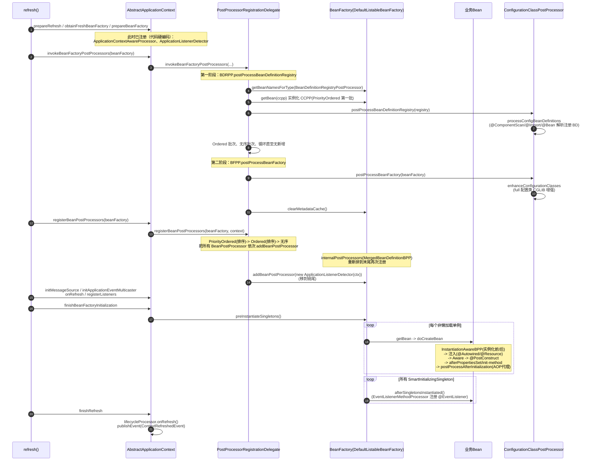
```mermaid
sequenceDiagram
    autonumber
    participant R as refresh()
    participant A as AbstractApplicationContext
    participant P as PostProcessorRegistrationDelegate
    participant BF as BeanFactory(DefaultListableBeanFactory)
    participant B as 业务Bean
    participant CC as ConfigurationClassPostProcessor

    R->>A: prepareRefresh / obtainFreshBeanFactory / prepareBeanFactory
    Note over A: 此时已注册（代码硬编码）：<br/>ApplicationContextAwareProcessor、ApplicationListenerDetector

    R->>A: invokeBeanFactoryPostProcessors(beanFactory)
    A->>P: invokeBeanFactoryPostProcessors(...)
    Note over P: 第一阶段：BDRPP.postProcessBeanDefinitionRegistry
    P->>BF: getBeanNamesForType(BeanDefinitionRegistryPostProcessor)
    P->>BF: getBean(ccpp) 实例化 CCPP(PriorityOrdered 第一批)
    P->>CC: postProcessBeanDefinitionRegistry(registry)
    CC->>CC: processConfigBeanDefinitions<br/>(@ComponentScan/@Import/@Bean 解析注册 BD)
    P->>P: Ordered 批次、无序批次、循环直至无新增
    Note over P: 第二阶段：BFPP.postProcessBeanFactory
    P->>CC: postProcessBeanFactory(beanFactory)
    CC->>CC: enhanceConfigurationClasses<br/>(full 配置类 CGLIB 增强)
    P->>BF: clearMetadataCache()

    R->>A: registerBeanPostProcessors(beanFactory)
    A->>P: registerBeanPostProcessors(beanFactory, context)
    Note over P: PriorityOrdered(排序)-> Ordered(排序)-> 无序<br/>把所有 BeanPostProcessor 依次 addBeanPostProcessor
    Note over BF: internalPostProcessors(MergedBeanDefinitionBPP)<br/>重新排到末尾再次注册
    P->>BF: addBeanPostProcessor(new ApplicationListenerDetector(ctx))<br/>(移到链尾)

    R->>A: initMessageSource / initApplicationEventMulticaster<br/>onRefresh / registerListeners
    R->>A: finishBeanFactoryInitialization
    A->>BF: preInstantiateSingletons()
    loop 每个非懒加载单例
        BF->>B: getBean -> doCreateBean
        Note over B: InstantiationAwareBPP(实例化前/后)<br/>-> 注入(@Autowired/@Resource)<br/>-> Aware -> @PostConstruct<br/>-> afterPropertiesSet/init-method<br/>-> postProcessAfterInitialization(AOP代理)
    end
    loop 所有 SmartInitializingSingleton
        BF->>B: afterSingletonsInstantiated()<br/>(EventListenerMethodProcessor 注册 @EventListener)
    end
    R->>A: finishRefresh
    A->>A: lifecycleProcessor.onRefresh()<br/>publishEvent(ContextRefreshedEvent)
```

### B.7 ApplicationListener 与事件机制

组件分工：

- **`ApplicationEventPublisher`**：`AbstractApplicationContext.publishEvent(...)` 是入口——先 `getApplicationEventMulticaster().multicastEvent(event, eventType)` 广播，同时向上传播给 parent context；若广播器还没初始化（refresh 早期），事件暂存 `earlyApplicationEvents`，待 `registerListeners()`（`AbstractApplicationContext.java:877`）初始化广播器后补发。
- **`ApplicationEventMulticaster`**：`initApplicationEventMulticaster()`（:816-842）——容器内有名为 `applicationEventMulticaster` 的 Bean 就用它，否则 `new SimpleApplicationEventMulticaster(beanFactory)` 并 registerSingleton。
- **`SimpleApplicationEventMulticaster`**（`spring-context/src/main/java/org/springframework/context/event/SimpleApplicationEventMulticaster.java:137-148`）：

```java
@Override
public void multicastEvent(final ApplicationEvent event, @Nullable ResolvableType eventType) {
    ResolvableType type = (eventType != null ? eventType : resolveDefaultEventType(event));
    Executor executor = getTaskExecutor();
    for (ApplicationListener<?> listener : getApplicationListeners(event, type)) {  // 带缓存的类型过滤
        if (executor != null) {
            executor.execute(() -> invokeListener(listener, event));   // 配了 executor 就是异步广播
        }
        else {
            invokeListener(listener, event);                            // 默认同步
        }
    }
}
```

  监听器匹配（`AbstractApplicationEventMulticaster.getApplicationListeners`，含 `retrieverCache` 按 event type 缓存）用泛型声明做事件类型过滤（`GenericApplicationListenerAdapter`/`supportsEventType`）。
- **监听器的注册路径（三路汇合）**：
  1. `registerListeners()`：静态 `addApplicationListener` 的 + `getBeanNamesForType(ApplicationListener)` 的 Bean **名字**（延迟到事件发生时才 getBean）；
  2. `ApplicationListenerDetector.postProcessAfterInitialization`（B.1）：初始化完的实例若实现 `ApplicationListener` 且是单例 → `addApplicationListener`；
  3. `@EventListener`：由 **`EventListenerMethodProcessor`**（`spring-context/src/main/java/org/springframework/context/event/EventListenerMethodProcessor.java:65`，实现 `SmartInitializingSingleton + ApplicationContextAware + BeanFactoryPostProcessor`）处理——它在 `postProcessBeanFactory` 收集 `EventListenerFactory`（:110-117），在**所有单例就绪后**的 `afterSingletonsInstantiated`（:121-163）扫描每个 Bean 的 `@EventListener` 方法，对每个方法经 `DefaultEventListenerFactory.createApplicationListener` 生成 **`ApplicationListenerMethodAdapter`**（把方法包装成监听器，反射调用、支持 SpEL condition/泛型事件匹配），最后 `context.addApplicationListener(applicationListener)`（:189-208）：

```java
// EventListenerMethodProcessor.java:195-205（节选）
for (Method method : annotatedMethods.keySet()) {
    for (EventListenerFactory factory : factories) {
        if (factory.supportsMethod(method)) {
            Method methodToUse = AopUtils.selectInvocableMethod(method, context.getType(beanName));
            ApplicationListener<?> applicationListener =
                    factory.createApplicationListener(beanName, targetType, methodToUse);
            if (applicationListener instanceof ApplicationListenerMethodAdapter) {
                ((ApplicationListenerMethodAdapter) applicationListener).init(context, this.evaluator);
            }
            context.addApplicationListener(applicationListener);
            break;
        }
    }
}
```

### B.8 第三方框架最常用的四大扩展点

| 扩展点 | 接口/机制 | 触发时机 | 典型使用方 |
|---|---|---|---|
| `@Import(ImportBeanDefinitionRegistrar)` | `ImportBeanDefinitionRegistrar.registerBeanDefinitions`（`spring-context/src/main/java/org/springframework/context/annotation/ImportBeanDefinitionRegistrar.java:61, 83-99`） | `ConfigurationClassParser` 解析 `@Import` 时（BDRPP 阶段内），可拿到 `AnnotationMetadata` 手工注册 BD | MyBatis `MapperScannerRegistrar`、Feign `FeignClientsRegistrar`、早期 `EnableWebMvc` |
| `BeanDefinitionRegistryPostProcessor` | `postProcessBeanDefinitionRegistry` | refresh 第 5 步最优先（B.2） | `ConfigurationClassPostProcessor`、MyBatis 3.4.2+ 的 `MapperScannerConfigurer` |
| `@Import(ImportSelector)` | （含 `DeferredImportSelector`，在所有配置类解析完后执行） | 配置类解析期 | `EnableAutoConfiguration`（boot）、`EnableAsync/Caching` 的模式选择器 |
| `FactoryBean<?>` | `getObject()/getObjectType()/isSingleton()` | `getBean(name)` 时若 name 对应 FactoryBean 则通过其 `getObject()` 产出对象（`FACTORY_BEAN_PREFIX "&"` 取工厂本身） | `SqlSessionFactoryBean`、`FeignClientFactoryBean`、`MapperFactoryBean` |

补充：`@Bean` 方法本身就是 `factory-method` 路径（A.4.2）；`BeanDefinitionRegistryPostProcessor` 相比 Registrar 的优势是"不需要被 @Import"，可以由 XML/`context:property-placeholder` 等任意方式注册并享受排序。

### B.9 BeanPostProcessor 的 Order 与排序细节

`PostProcessorRegistrationDelegate.registerBeanPostProcessors`（`PostProcessorRegistrationDelegate.java:205-285`）的注册顺序：

1. **PriorityOrdered**（`org.springframework.core.PriorityOrdered`，`getOrder()` 也参与，但 PriorityOrdered 整体排在所有普通 Ordered 之前）——先实例化、`sortPostProcessors` 排序、注册；
2. **Ordered**（`org.springframework.core.Ordered` 或 `@Order` 注解）——同上；
3. **无序**——按 `getBeanNamesForType` 的返回顺序（基本是注册顺序）；
4. **internalPostProcessors（所有 `MergedBeanDefinitionPostProcessor`）再次排序重注册到链尾**；
5. **`ApplicationListenerDetector` 再次注册**（移到最尾，确保看到 AOP 代理后的最终形态）。

排序比较器（`PostProcessorRegistrationDelegate.java:287-300`）：优先用 `DefaultListableBeanFactory.getDependencyComparator()`（注解容器默认是 `AnnotationAwareOrderComparator`），否则 `OrderComparator.INSTANCE`。`AnnotationAwareOrderComparator` 的比较规则：

1. 都实现 `PriorityOrdered`/`Ordered`：比较 `getOrder()`；
2. 否则查类/方法上的 `@Order` 注解（`OrderUtils.getOrder`）；
3. 都没有 → `Ordered.LOWEST_PRECEDENCE`（`Integer.MAX_VALUE`），视为相等（保持原顺序，稳定排序）。

`@Order` 值越小优先级越高。注意几个"既有事实"：

- `CommonAnnotationBeanPostProcessor`/`AutowiredAnnotationBeanPostProcessor` 均为 `Ordered.LOWEST_PRECEDENCE`（最后注入，可被更早的处理器覆盖默认值）；
- `AbstractAutoProxyCreator` 默认 `Ordered.LOWEST_PRECEDENCE - 1`（在绝大多数业务 BPP 之后生成代理）；
- `ConfigurationClassPostProcessor` 实现了 `PriorityOrdered`（最先跑，保证后续 BDRPP 能被它解析出来）；
- `BeanPostProcessorChecker`（`PostProcessorRegistrationDelegate.java:227`）会在"BPP 注册期间就创建了普通 Bean"时打 info 日志警告——那些 Bean 不会被全部处理器处理。

---

## C. Spring SPI 机制：SpringFactoriesLoader

### C.1 完整源码解析

`SpringFactoriesLoader`（`spring-core/src/main/java/org/springframework/core/io/support/SpringFactoriesLoader.java`）是 Spring 自带的"轻量级 SPI"：

```java
// SpringFactoriesLoader.java:68
public static final String FACTORIES_RESOURCE_LOCATION = "META-INF/spring.factories";

// :73 以 ClassLoader 为键的全局缓存（软引用 Map）
static final Map<ClassLoader, Map<String, List<String>>> cache = new ConcurrentReferenceHashMap<>();
```

**loadFactories（加载 + 实例化 + 排序）**（:95-111）：

```java
public static <T> List<T> loadFactories(Class<T> factoryType, @Nullable ClassLoader classLoader) {
    Assert.notNull(factoryType, "'factoryType' must not be null");
    ClassLoader classLoaderToUse = classLoader;
    if (classLoaderToUse == null) {
        classLoaderToUse = SpringFactoriesLoader.class.getClassLoader();
    }
    List<String> factoryImplementationNames = loadFactoryNames(factoryType, classLoaderToUse);
    ...
    List<T> result = new ArrayList<>(factoryImplementationNames.size());
    for (String factoryImplementationName : factoryImplementationNames) {
        result.add(instantiateFactory(factoryImplementationName, factoryType, classLoaderToUse));  // 反射 newInstance
    }
    AnnotationAwareOrderComparator.sort(result);     // 实例排序（@Order/Ordered）
    return result;
}
```

**loadFactoryNames（只取名）**（:126-133）：

```java
public static List<String> loadFactoryNames(Class<?> factoryType, @Nullable ClassLoader classLoader) {
    ...
    String factoryTypeName = factoryType.getName();
    return loadSpringFactories(classLoaderToUse).getOrDefault(factoryTypeName, Collections.emptyList());
}
```

**loadSpringFactories（解析 + 缓存）**（:135-169）：

```java
private static Map<String, List<String>> loadSpringFactories(ClassLoader classLoader) {
    Map<String, List<String>> result = cache.get(classLoader);       // 1. 缓存命中直接返回
    if (result != null) {
        return result;
    }

    result = new HashMap<>();
    try {
        Enumeration<URL> urls = classLoader.getResources(FACTORIES_RESOURCE_LOCATION);  // 2. 所有 jar 的 META-INF/spring.factories
        while (urls.hasMoreElements()) {
            URL url = urls.nextElement();
            UrlResource resource = new UrlResource(url);
            Properties properties = PropertiesLoaderUtils.loadProperties(resource);     // 3. Properties 格式解析
            for (Map.Entry<?, ?> entry : properties.entrySet()) {
                String factoryTypeName = ((String) entry.getKey()).trim();
                String[] factoryImplementationNames =
                        StringUtils.commaDelimitedListToStringArray((String) entry.getValue());  // 4. 逗号分隔多实现
                for (String factoryImplementationName : factoryImplementationNames) {
                    result.computeIfAbsent(factoryTypeName, key -> new ArrayList<>())
                            .add(factoryImplementationName.trim());
                }
            }
        }

        // 5. 去重（5.3 起：跨 jar 重复的实现只保留一次）+ 不可变化
        result.replaceAll((factoryType, implementations) -> implementations.stream().distinct()
                .collect(Collectors.collectingAndThen(Collectors.toList(), Collections::unmodifiableList)));
        cache.put(classLoader, result);                              // 6. 回填缓存
    }
    catch (IOException ex) {
        throw new IllegalArgumentException("Unable to load factories from location [" +
                FACTORIES_RESOURCE_LOCATION + "]", ex);
    }
    return result;
}
```

**instantiateFactory**（:172-186）：`ClassUtils.forName` 加载 → `factoryType.isAssignableFrom` 类型校验（防配错）→ `ReflectionUtils.accessibleConstructor(...).newInstance()`（无参构造实例化）。

关键设计：

- **键是"接口全限定名"，值是"逗号分隔的实现类名"**，与 `Properties` 天然兼容；
- 一个 ClassLoader 一份缓存，**跨 jar 聚合**（`classLoader.getResources` 枚举全部）；
- 只在 `loadFactories` 里排序（`AnnotationAwareOrderComparator`），`loadFactoryNames` 不排序（5.3 中文件内顺序 + 去重保序）；
- 5.3 起 `@AliasFor` 体系下还引入了 `META-INF/spring/` 目录下按全限定名命名的文件（`SpringFactoriesLoader` 未用，主要用于 AOT/`@Deprecated` 新加载器过渡），本节以 5.3.38 的 `loadFactories` 为准。

### C.2 与 JDK ServiceLoader 的对比

| 维度 | `SpringFactoriesLoader` | `java.util.ServiceLoader` |
|---|---|---|
| 配置文件 | `META-INF/spring.factories`（Properties，**一个文件多个键**） | `META-INF/services/接口全限定名`（**一个接口一个文件**，每行一个实现） |
| 查找方式 | 按**任意键**（接口/抽象类全名）取实现列表 | 按**单一接口类型**迭代 |
| 实例化 | 无参构造反射；**可类型校验、可跨 jar 去重** | 无参构造反射（`Provider`） |
| 排序 | `AnnotationAwareOrderComparator`（`@Order`/`Ordered`） | 无内置排序（需自行包装 Comparator） |
| 缓存 | `ConcurrentReferenceHashMap` 按 ClassLoader 缓存 | 无（每次 `reload()` 重建迭代器） |
| 上下文 | 可传 ClassLoader；与 Spring `@Order` 生态打通 | 遵循 JDK 类加载委派 |
| 典型用户 | Spring 内部（`BeanInfoFactory`、`EnableAutoConfiguration`…） | JDBC Driver、JDK 内部 SPI |

本质差异：ServiceLoader 是"接口 → 实现"的标准 SPI；SpringFactoriesLoader 是"**字符串键 → 实现列表**"的通用工厂索引，因此同一个文件能同时服务几十种扩展点（boot 的 spring.factories 一个文件里 100+ 个键）。

### C.3 典型应用与仓库内 spring.factories 盘点

**（1）`@EnableAutoConfiguration`（Spring Boot 侧，简述）**：`@EnableAutoConfiguration` 通过 `@Import(AutoConfigurationImportSelector.class)` 引入 `DeferredImportSelector`；该 selector 调 `SpringFactoriesLoader.loadFactoryNames(EnableAutoConfiguration.class, ...)` 读取 **spring-boot-autoconfigure jar 内的 `META-INF/spring.factories`** 中 `org.springframework.boot.autoconfigure.EnableAutoConfiguration=...` 的 130+ 个自动配置类，经排除/过滤/去重后逐个注册为 BeanDefinition。这就是"约定优于配置"的底层一环。

**（2）关于 AopAutoConfiguration**：`AopAutoConfiguration` 这个类**不在本仓库**（spring-framework）中——它位于 `spring-boot-autoconfigure` 的 `org.springframework.boot.autoconfigure.aop` 包，注册于 spring-boot-autoconfigure jar 的 `META-INF/spring.factories`（键 `org.springframework.boot.autoconfigure.EnableAutoConfiguration`）。本仓库 grep `AopAutoConfiguration` 无任何命中（已验证）。它的作用是按 `spring.aop.auto`/`proxy-target-class` 配置向容器注册 `EnableAspectJAutoProxy` 等价行为（引入 `AbstractAutoProxyCreator` 体系）。

**（3）本仓库（spring-framework 5.3.38）中所有 `spring.factories` 文件盘点**（`find ... -name "spring.factories"`，共 5 个，其中 3 个在 main 源码树）：

| 文件 | 内容 |
|---|---|
| `spring-beans/src/main/resources/META-INF/spring.factories` | `org.springframework.beans.BeanInfoFactory=org.springframework.beans.ExtendedBeanInfoFactory` |
| `spring-r2dbc/src/main/resources/META-INF/spring.factories` | `org.springframework.r2dbc.core.binding.BindMarkersFactoryResolver$BindMarkerFactoryProvider=org.springframework.r2dbc.core.binding.BindMarkersFactoryResolver.BuiltInBindMarkersFactoryProvider` |
| `spring-test/src/main/resources/META-INF/spring.factories` | `org.springframework.test.context.TestExecutionListener = ServletTestExecutionListener, DirtiesContextBeforeModesTestExecutionListener, ApplicationEventsTestExecutionListener, DependencyInjectionTestExecutionListener, DirtiesContextTestExecutionListener, TransactionalTestExecutionListener, SqlScriptsTestExecutionListener, ApplicationEventsTestExecutionListener, EventPublishingTestExecutionListener`（8 个）＋ `org.springframework.test.context.ContextCustomizerFactory = MockServerContainerContextCustomizerFactory, DynamicPropertiesContextCustomizerFactory` |
| `spring-core/src/test/resources/META-INF/spring.factories` | 测试资源（FactoryBeanClassLoader 之类测试用） |
| `spring-test/src/test/resources/META-INF/spring.factories` | 测试资源 |

框架内部消费示例：`CachedIntrospectionResults`/`BeanUtils` 通过 `SpringFactoriesLoader.loadFactories(BeanInfoFactory.class, ...)` 取 `ExtendedBeanInfoFactory`，为非标准 JavaBean（如返回 this 的 builder setter）提供 `BeanInfo`；`BindMarkersFactoryResolver` 同理。

> Spring 5.3 起还支持 `META-INF/spring/<接口全限定名>.imports` 风格（为 6.0 的 `SpringFactoriesLoader.forResourceLocation` 铺路，5.3 中仅 `@Deprecated` 文档提及），本仓库主线仍是 `spring.factories`。

---

## D. ShutdownHook：优雅停机

### D.1 registerShutdownHook 与 doClose 源码

```java
// spring-context/src/main/java/org/springframework/context/support/AbstractApplicationContext.java:998-1011
@Override
public void registerShutdownHook() {
    if (this.shutdownHook == null) {
        // No shutdown hook registered yet.
        this.shutdownHook = new Thread(SHUTDOWN_HOOK_THREAD_NAME) {     // 线程名 "SpringContextShutdownHook"
            @Override
            public void run() {
                synchronized (startupShutdownMonitor) {   // 与 refresh()/close() 互斥，防并发关闭
                    doClose();
                }
            }
        };
        Runtime.getRuntime().addShutdownHook(this.shutdownHook);       // 注册 JVM shutdown hook
    }
}
```

`close()`（:1033-1047）是主动关闭入口：`synchronized (startupShutdownMonitor)` 内 `doClose()`，随后**注销已注册的 shutdown hook**（`Runtime.removeShutdownHook`，避免重复关闭；若 JVM 已在关闭中则忽略 `IllegalStateException`）。

`doClose()`（:1059-1109）的完整逻辑，**顺序严格**：

```java
protected void doClose() {
    // CAS 保证只关闭一次（active && closed 从 false 翻转为 true）
    if (this.active.get() && this.closed.compareAndSet(false, true)) {
        ...
        if (!NativeDetector.inNativeImage()) {
            LiveBeansView.unregisterApplicationContext(this);
        }

        try {
            // 1. 发布 ContextClosedEvent（监听器仍可在此做清理，如接收最后一批消息）
            publishEvent(new ContextClosedEvent(this));
        }
        catch (Throwable ex) { ... }

        // 2. 先停所有 Lifecycle/SmartLifecycle（phase 从高到低），避免逐 Bean 销毁时的阻塞
        if (this.lifecycleProcessor != null) {
            try {
                this.lifecycleProcessor.onClose();     // -> DefaultLifecycleProcessor.stopBeans()
            }
            catch (Throwable ex) { ... }
        }

        // 3. 销毁容器中所有缓存的单例
        destroyBeans();                                // -> getBeanFactory().destroySingletons()

        // 4. 关闭 BeanFactory 本身（GenericApplicationContext: 刷新标志复位、beanFactory.setSerializationId(null) 等）
        closeBeanFactory();

        // 5. 子类最终清理钩子（默认空）
        onClose();

        // 6. 重置反射/内省缓存，防 ClassLoader 泄漏
        resetCommonCaches();

        // 7. 恢复 earlyApplicationListeners
        ...
        // 8. active = false
        this.active.set(false);
    }
}
```

每一步的异常都被捕获降级为 warn——**优雅停机要求"尽力而为"**，任何一步失败不阻断后续清理。

### D.2 销毁顺序：依赖反向 + reverseDependency

`destroyBeans()`（:1122-1124）→ `DefaultSingletonBeanRegistry.destroySingletons()`（`spring-beans/src/main/java/org/springframework/beans/factory/support/DefaultSingletonBeanRegistry.java:507-528`）：

```java
public void destroySingletons() {
    ...
    synchronized (this.singletonObjects) {
        this.singletonsCurrentlyInDestruction = true;      // 之后 getSingleton 对"正在销毁"的 Bean 会拒绝
    }

    String[] disposableBeanNames;
    synchronized (this.disposableBeans) {
        // disposableBeans 是 LinkedHashMap：按【注册顺序】=【创建顺序】记录
        disposableBeanNames = StringUtils.toStringArray(this.disposableBeans.keySet());
    }
    // 关键：倒序遍历 —— 后创建的先销毁（依赖反向）
    for (int i = disposableBeanNames.length - 1; i >= 0; i--) {
        destroySingleton(disposableBeanNames[i]);
    }

    this.containedBeanMap.clear();
    this.dependentBeanMap.clear();
    this.dependenciesForBeanMap.clear();
    clearSingletonCache();
}
```

单 Bean 销毁 `destroyBean(String, DisposableBean)`（:568-622）的顺序：

1. **先递归销毁所有依赖本 Bean 的 Bean**（`dependentBeanMap.remove(beanName)` → 逐个 `destroySingleton(dependentBeanName)`）——`dependentBeanMap` 在每次注入/`depends-on` 时通过 `registerDependentBean` 维护（"谁依赖我"），销毁时保证"被依赖者最后死"；
2. 再执行本 Bean 的 `DisposableBeanAdapter.destroy()`；
3. 然后销毁 `containedBeanMap` 中登记的内部 Bean；
4. 清理自己在其他 Bean 依赖集合中的残留、`dependenciesForBeanMap`。

> 为什么既"倒序遍历"又"递归依赖反向"？倒序是全局近似（后创建者通常是依赖者）；`dependentBeanMap` 递归是**精确保证**（处理乱序创建、运行期 getBean 等场景）。

`DisposableBeanAdapter.destroy()`（`spring-beans/src/main/java/org/springframework/beans/factory/support/DisposableBeanAdapter.java:194-267`）——单个 Bean 的销毁流水线：

```java
@Override
public void destroy() {
    // 1. DestructionAwareBeanPostProcessor.postProcessBeforeDestruction
    //    （@PreDestroy 在这里由 InitDestroyAnnotationBeanPostProcessor 调用；
    //      ApplicationListenerDetector 在这里把自己从事件广播器移除）
    if (!CollectionUtils.isEmpty(this.beanPostProcessors)) {
        for (DestructionAwareBeanPostProcessor processor : this.beanPostProcessors) {
            processor.postProcessBeforeDestruction(this.bean, this.beanName);
        }
    }

    // 2. DisposableBean.destroy()
    if (this.invokeDisposableBean) {
        ...
        ((DisposableBean) this.bean).destroy();
        ...
    }

    // 3. AutoCloseable.close()（destroy-method 推断为 close 时）
    if (this.invokeAutoCloseable) {
        ...
        ((AutoCloseable) this.bean).close();
    }
    // 4. 自定义 destroy-method（无参，或单 boolean 参数 -> 传 true 表示 force）
    else if (this.destroyMethod != null) {
        invokeCustomDestroyMethod(this.destroyMethod);
    }
    ...
}
```

销毁方法推断（构造器里 `inferDestroyMethodIfNecessary`，:394-426）：`destroyMethod = AbstractBeanDefinition.INFER_METHOD`（`@Bean` 默认值 `"(inferred)"`）或未指定且 Bean 实现 `AutoCloseable` 时，自动探测 public 无参的 **`close()` / `shutdown()`** 方法——这就是 `@Bean` 不写 destroyMethod 也能关闭 `ExecutorService` 的原因。Adapter 构造时还通过 `filterPostProcessors`（:450-463）只保留 `requiresDestruction(bean)==true` 的处理器。

### D.3 JVM ShutdownHook 与 Spring 的协作

- **注册**：`registerShutdownHook()` 把内部 Thread 交给 `Runtime.addShutdownHook`。JVM 在收到 `SIGTERM`（kill 默认信号）、`System.exit`、最后一个非守护线程结束等"正常关闭"时，会启动**所有**已注册的 hook 线程**并发执行**，并等待它们全部结束（无超时上限，`Runtime.halt` / `SIGKILL` 除外）。Spring Boot 的 `SpringApplication.run()` 会在 refresh 完成后自动 `registerShutdownHook()`（boot 侧行为）。
- **互斥**：hook 的 `run()` 与 `close()`/`refresh()` 共用 `startupShutdownMonitor` 互斥锁——即使"显式 close 与 JVM 退出并发"也只会有一个执行 `doClose()`；`closed` 的 CAS 是第二重保险。
- **幂等**：显式 `close()` 会 `removeShutdownHook`；反之 hook 触发时 CAS 也保证不重复。`destroy()`（:1021，已废弃）等价于 `close()`。
- **注意事项**（源码可推导）：hook 线程并发执行多个 context 的关闭时彼此无全局顺序；JVM 关闭时新非守护线程可能不被调度（Spring 的 hook 单线程顺序执行 `doClose`）；kill -9 / OOM / 断电不会触发 hook——生产上仍需配合 `SmartLifecycle.stop(Runnable)` 的 `timeoutPerShutdownPhase`（`DefaultLifecycleProcessor` 的 `timeoutPerShutdownPhase` 默认 30s/phase）与外部编排（如 k8s preStop + terminationGracePeriodSeconds）。
- **完整链路**：`SIGTERM → JVM shutdown 线程 → SpringContextShutdownHook.run → startupShutdownMonitor 锁 → doClose → ContextClosedEvent → lifecycleProcessor.onClose（SmartLifecycle 高 phase 先 stop，异步 latch 等待）→ destroySingletons（倒序 + 依赖反向递归 → DisposableBeanAdapter：@PreDestroy → DisposableBean.destroy → close/destroy-method）→ closeBeanFactory → onClose → resetCommonCaches`。

---

## 附：本章核心源码文件索引（相对仓库根）

| 主题 | 文件 |
|---|---|
| 生命周期主线 | `spring-beans/src/main/java/org/springframework/beans/factory/support/AbstractAutowireCapableBeanFactory.java`（createBean :502 / doCreateBean :573 / createBeanInstance :1180 / populateBean :1383 / initializeBean :1783 / invokeInitMethods :1843 / getEarlyBeanReference :981） |
| 合并与销毁注册 | `spring-beans/src/main/java/org/springframework/beans/factory/support/AbstractBeanFactory.java`（getMergedLocalBeanDefinition :1353 / registerDisposableBeanIfNecessary :1942 / BeanPostProcessorCache :2123） |
| 三级缓存/销毁 | `spring-beans/src/main/java/org/springframework/beans/factory/support/DefaultSingletonBeanRegistry.java`（getSingleton :180 / destroySingletons :507 / destroyBean :568） |
| 实例化策略 | `spring-beans/.../support/SimpleInstantiationStrategy.java`、`CglibSubclassingInstantiationStrategy.java`、`ConstructorResolver.java` |
| 销毁适配器 | `spring-beans/.../support/DisposableBeanAdapter.java` |
| 注解注入 | `spring-beans/.../annotation/AutowiredAnnotationBeanPostProcessor.java`、`InitDestroyAnnotationBeanPostProcessor.java`；`spring-context/.../annotation/CommonAnnotationBeanPostProcessor.java` |
| 容器编排 | `spring-context/.../support/AbstractApplicationContext.java`（refresh :554 / prepareBeanFactory :688 / finishRefresh :941 / registerShutdownHook :998 / doClose :1059）、`PostProcessorRegistrationDelegate.java` |
| AOP 代理 | `spring-aop/.../autoproxy/AbstractAutoProxyCreator.java` |
| 事件 | `spring-context/.../event/SimpleApplicationEventMulticaster.java`、`EventListenerMethodProcessor.java`；`support/ApplicationListenerDetector.java`、`ApplicationContextAwareProcessor.java` |
| Lifecycle | `spring-context/.../support/DefaultLifecycleProcessor.java`；`context/SmartLifecycle.java`、`Lifecycle.java` |
| SPI | `spring-core/src/main/java/org/springframework/core/io/support/SpringFactoriesLoader.java` |
| 配置类 | `spring-context/.../annotation/ConfigurationClassPostProcessor.java`、`ConfigurationClassParser.java` |

（完）


# 第四章 Spring 核心注解实现原理


> 基于 Spring Framework 5.3.38 源码（仓库根目录：`/Users/wenbin/Desktop/workspace/java_projects/source_code/spring-framework-5.3.38`，下文所有路径均相对该根目录），所有行号均经与源码逐一核对。
>
> 阅读本章前的一个总纲：**Spring 的注解驱动本质上是"两条流水线"**——
> 1. **定义期流水线**（BeanFactory 启动阶段）：`ConfigurationClassPostProcessor`（一个 `BeanDefinitionRegistryPostProcessor`）解析 `@Configuration/@ComponentScan/@Import/@Bean/@PropertySource/@ImportResource/@Conditional`，把注解信息**翻译成 BeanDefinition**；
> 2. **实例期流水线**（每个 Bean 创建阶段）：`AutowiredAnnotationBeanPostProcessor`、`CommonAnnotationBeanPostProcessor` 等 `BeanPostProcessor` 解析 `@Autowired/@Value/@Resource/@PostConstruct`，在 Bean 实例上**完成注入与生命周期回调**。
>
> 本章按注解逐个展开，最后给出整体架构图与时序图。

---

## 4.1 @Component 与 @ComponentScan：类路径扫描的完整链路

### 4.1.1 两个触发入口

`@ComponentScan` 有两条触发路径：

1. **编程式**：`AnnotationConfigApplicationContext.scan(String...)`：
   - `spring-context/src/main/java/org/springframework/context/annotation/AnnotationConfigApplicationContext.java:181`，内部委托给 `ClassPathBeanDefinitionScanner.scan()`；
2. **注解式**（更常用）：配置类上标注 `@ComponentScan`，由 `ConfigurationClassParser` → `ComponentScanAnnotationParser.parse()` 触发（见 4.5 节）。

### 4.1.2 doScan：从候选集到注册

`ClassPathBeanDefinitionScanner.doScan()` 是扫描的主流程（`spring-context/src/main/java/org/springframework/context/annotation/ClassPathBeanDefinitionScanner.java:272-297`）：

```java
protected Set<BeanDefinitionHolder> doScan(String... basePackages) {
    Assert.notEmpty(basePackages, "At least one base package must be specified");
    Set<BeanDefinitionHolder> beanDefinitions = new LinkedHashSet<>();
    for (String basePackage : basePackages) {
        Set<BeanDefinition> candidates = findCandidateComponents(basePackage);
        for (BeanDefinition candidate : candidates) {
            ScopeMetadata scopeMetadata = this.scopeMetadataResolver.resolveScopeMetadata(candidate);
            candidate.setScope(scopeMetadata.getScopeName());                       // ① 解析 @Scope
            String beanName = this.beanNameGenerator.generateBeanName(candidate, this.registry); // ② 生成 beanName
            if (candidate instanceof AbstractBeanDefinition) {
                postProcessBeanDefinition((AbstractBeanDefinition) candidate, beanName);
            }
            if (candidate instanceof AnnotatedBeanDefinition) {
                AnnotationConfigUtils.processCommonDefinitionAnnotations((AnnotatedBeanDefinition) candidate); // ③ @Lazy/@Primary/@DependsOn/@Role/@Description
            }
            if (checkCandidate(beanName, candidate)) {                             // ④ 同名冲突检查
                BeanDefinitionHolder definitionHolder = new BeanDefinitionHolder(candidate, beanName);
                definitionHolder =
                        AnnotationConfigUtils.applyScopedProxyMode(scopeMetadata, definitionHolder, this.registry); // ⑤ scoped-proxy
                beanDefinitions.add(definitionHolder);
                registerBeanDefinition(definitionHolder, this.registry);           // ⑥ 注册进 registry
            }
        }
    }
    return beanDefinitions;
}
```

其中第 ③ 步 `AnnotationConfigUtils.processCommonDefinitionAnnotations()`（`spring-context/src/main/java/org/springframework/context/annotation/AnnotationConfigUtils.java:237-265`）把类上的**通用注解**落到 BeanDefinition 属性上，这是 `@Lazy`（→`setLazyInit`）、`@Primary`（→`setPrimary`）、`@DependsOn`（→`setDependsOn`）、`@Role`、`@Description` 生效的准确位置。

第 ④ 步 `checkCandidate()`（同文件 `:335-350`）：若同名 BeanDefinition 已存在，且与扫描结果**不兼容**（`isCompatible()`，`:363-367`：显式注册的非扫描定义、或完全相同的定义视为兼容），抛出 `ConflictingBeanDefinitionException`——这就是"两个同名的 `@Service` 类启动报错"的来源；而兼容（重复扫描同一文件）则静默跳过。

### 4.1.3 scanCandidateComponents：basePath → 资源 → MetadataReader → BeanDefinition

`findCandidateComponents()`（`spring-context/src/main/java/org/springframework/context/annotation/ClassPathScanningCandidateComponentProvider.java:313-320`）优先尝试使用 `spring-context-indexer` 生成的候选索引（编译期索引，加速启动），否则走真正的类路径扫描：

```java
public Set<BeanDefinition> findCandidateComponents(String basePackage) {
    if (this.componentsIndex != null && indexSupportsIncludeFilters()) {
        return addCandidateComponentsFromIndex(this.componentsIndex, basePackage);
    }
    else {
        return scanCandidateComponents(basePackage);
    }
}
```

核心方法 `scanCandidateComponents()`（同文件 `:418-467`）：

```java
private Set<BeanDefinition> scanCandidateComponents(String basePackage) {
    Set<BeanDefinition> candidates = new LinkedHashSet<>();
    try {
        String packageSearchPath = ResourcePatternResolver.CLASSPATH_ALL_URL_PREFIX +
                resolveBasePackage(basePackage) + '/' + this.resourcePattern;   // ① classpath*:com/foo/**/*.class
        Resource[] resources = getResourcePatternResolver().getResources(packageSearchPath); // ② Ant 风格通配解析
        ...
        for (Resource resource : resources) {
            try {
                MetadataReader metadataReader = getMetadataReaderFactory().getMetadataReader(resource); // ③ ASM 读类元数据
                if (isCandidateComponent(metadataReader)) {                    // ④ 过滤器 + 条件评估
                    ScannedGenericBeanDefinition sbd = new ScannedGenericBeanDefinition(metadataReader); // ⑤
                    sbd.setSource(resource);
                    if (isCandidateComponent(sbd)) {                           // ⑥ 独立、具体类检查
                        ...
                        candidates.add(sbd);
                    }
                }
            }
            ...
        }
    }
    ...
    return candidates;
}
```

逐点解读：

- **① 路径拼装**：`resolveBasePackage()`（`:478-480`）先对 basePackage 做占位符解析（支持 `@ComponentScan(basePackages = "${scan.pkg}")`），再通过 `ClassUtils.convertClassNameToResourcePath()` 把 `com.foo.bar` 转成 `com/foo/bar`；`resourcePattern` 默认为 `DEFAULT_RESOURCE_PATTERN = "**/*.class"`（`:92`）。最终形如 `classpath*:com/foo/bar/**/*.class`。
- **② 资源定位**：由 `PathMatchingResourcePatternResolver` 完成（构造器中 `setResourceLoader()` 时创建，`:266-270`），`classpath*:` 前缀保证扫描**所有 jar** 中匹配的类。
- **③ ASM 元数据读取**：`MetadataReaderFactory` 默认是 `CachingMetadataReaderFactory`（`:268`）。**Spring 扫描阶段不加载类**，而是用 ASM（`spring-core` 的 `org.springframework.asm.ClassReader`）直接解析 `.class` 字节码，得到 `AnnotationMetadata`。`CachingMetadataReaderFactory`（`spring-core/src/main/java/org/springframework/core/type/classreading/CachingMetadataReaderFactory.java:38`）内部维护并发缓存，避免同一 class 文件重复解析——这是扫描性能的关键设计：**元数据读取与类加载解耦**，所以在条件评估、过滤阶段即使类不满足条件也从未触发类初始化。
- **④/⑥ 两级 isCandidateComponent**：
  - 第一级（`:488-500`）：**excludeFilters 优先**（任一命中即淘汰），然后任一 **includeFilters 命中**，再通过 `isConditionMatch()`（`:508-514`，内部用 `ConditionEvaluator.shouldSkip()` 评估 `@Conditional`）才算候选：

    ```java
    protected boolean isCandidateComponent(MetadataReader metadataReader) throws IOException {
        for (TypeFilter tf : this.excludeFilters) {
            if (tf.match(metadataReader, getMetadataReaderFactory())) {
                return false;
            }
        }
        for (TypeFilter tf : this.includeFilters) {
            if (tf.match(metadataReader, getMetadataReaderFactory())) {
                return isConditionMatch(metadataReader);
            }
        }
        return false;
    }
    ```
  - 第二级（`:524-528`）：类必须是**独立的（非内部类）且具体的（非接口/非抽象）**；唯一例外是"抽象类但带 `@Lookup` 方法"（方法注入场景）：

    ```java
    protected boolean isCandidateComponent(AnnotatedBeanDefinition beanDefinition) {
        AnnotationMetadata metadata = beanDefinition.getMetadata();
        return (metadata.isIndependent() && (metadata.isConcrete() ||
                (metadata.isAbstract() && metadata.hasAnnotatedMethods(Lookup.class.getName()))));
    }
    ```
- **⑤ ScannedGenericBeanDefinition**：携带 `AnnotationMetadata` 的 BeanDefinition，后续所有注解处理都从它身上取元数据。

### 4.1.4 默认过滤规则：@Component、@ManagedBean、@Named

`registerDefaultFilters()`（同文件 `:207-227`）：

```java
protected void registerDefaultFilters() {
    this.includeFilters.add(new AnnotationTypeFilter(Component.class));   // ①
    ClassLoader cl = ClassPathScanningCandidateComponentProvider.class.getClassLoader();
    try {
        this.includeFilters.add(new AnnotationTypeFilter(
                ((Class<? extends Annotation>) ClassUtils.forName("javax.annotation.ManagedBean", cl)), false)); // ②
        ...
    }
    catch (ClassNotFoundException ex) { ... }
    try {
        this.includeFilters.add(new AnnotationTypeFilter(
                ((Class<? extends Annotation>) ClassUtils.forName("javax.inject.Named", cl)), false));          // ③
        ...
    }
    catch (ClassNotFoundException ex) { ... }
}
```

即默认 include 过滤器有三个：

| 过滤器 | 说明 |
| --- | --- |
| `AnnotationTypeFilter(Component.class)` | considerMetaAnnotations = **true**（默认），因此所有以 `@Component` 为元注解的注解都能命中 |
| `AnnotationTypeFilter(ManagedBean.class, false)` | JSR-250 `javax.annotation.ManagedBean`，不追元注解 |
| `AnnotationTypeFilter(Named.class, false)` | JSR-330 `javax.inject.Named`，不追元注解 |

### 4.1.5 派生注解（@Service/@Repository/@Controller）如何被识别

以 `@Service` 为例，它本身被 `@Component` 元注解标注（`spring-context/src/main/java/org/springframework/stereotype/Service.java:47-48`，`@Repository` 在 `Repository.java:61-62`，`@Controller` 在 `Controller.java:45-46`）：

```java
@Component
public @interface Service {
    @AliasFor(annotation = Component.class)
    String value() default "";
}
```

匹配发生在 `AnnotationTypeFilter.matchSelf()`（`spring-core/src/main/java/org/springframework/core/type/filter/AnnotationTypeFilter.java:98-101`）：

```java
@Override
protected boolean matchSelf(MetadataReader metadataReader) {
    AnnotationMetadata metadata = metadataReader.getAnnotationMetadata();
    return metadata.hasAnnotation(this.annotationType.getName()) ||
            (this.considerMetaAnnotations && metadata.hasMetaAnnotation(this.annotationType.getName()));
}
```

`metadata.hasAnnotation()` 只看**直接标注**；`metadata.hasMetaAnnotation()` 检查注解的注解（ASM 解析出的 `metaAnnotationTypes`）。因此：

- `@Service` 类上直接注解是 `@Service`，`hasAnnotation(Component)` 为 false，但 `hasMetaAnnotation(Component)` 为 true（`@Service` → `@Component`）→ **命中**；
- 这也解释了为什么自定义注解只需元标注 `@Component` 即可被扫描到（自定义派生注解机制的根基），以及为什么 `@ManagedBean/@Named` 两个过滤器构造时传了 `false`——它们不是 `@Component` 的派生，无需元注解匹配。

### 4.1.6 AnnotationBeanNameGenerator：beanName 的确定

`doScan()` 第 ② 步默认使用 `AnnotationBeanNameGenerator.INSTANCE`（`ClassPathBeanDefinitionScanner.java:72`）。生成逻辑（`spring-context/src/main/java/org/springframework/context/annotation/AnnotationBeanNameGenerator.java:80-90`）：

```java
@Override
public String generateBeanName(BeanDefinition definition, BeanDefinitionRegistry registry) {
    if (definition instanceof AnnotatedBeanDefinition) {
        String beanName = determineBeanNameFromAnnotation((AnnotatedBeanDefinition) definition);
        if (StringUtils.hasText(beanName)) {
            return beanName;   // 显式 beanName：@Component("xxx") / @Service("xxx")
        }
    }
    return buildDefaultBeanName(definition, registry);  // 兜底：类名首字母小写
}
```

- **显式命名**：`determineBeanNameFromAnnotation()`（`:98-125`）遍历类上所有注解，凡满足 `isStereotypeWithNameValue()`（`:135-144`）——即注解本身是 `@Component`、或其元注解集合包含 `@Component`、或为 `javax.annotation.ManagedBean`/`javax.inject.Named`——就取其 `value()` 属性作为 beanName；若多个 stereotype 注解给出的名字冲突，抛 `IllegalStateException`。
- **默认命名**：`buildDefaultBeanName()`（`:167-172`）取短类名并用 `Introspector.decapitalize()` 处理（注意 JDK 规则：前两个字母都大写时不转小写，如 `URLService` 的 beanName 仍是 `URLService`）。

> 补充：@Import 导入的配置类不走此生成器，而用 `ConfigurationClassPostProcessor.IMPORT_BEAN_NAME_GENERATOR`（全限定类名，`ConfigurationClassPostProcessor.java:103-104`），避免不同包同名类冲突。

---

## 4.2 @Configuration：full/lite 两种模式与 CGLIB 增强

### 4.2.1 full 与 lite 的判定：checkConfigurationClassCandidate

`ConfigurationClassUtils.checkConfigurationClassCandidate()`（`spring-context/src/main/java/org/springframework/context/annotation/ConfigurationClassUtils.java:85-143`）是分水岭，它在 `ConfigurationClassPostProcessor.processConfigBeanDefinitions()` 里对**容器中每一个 BeanDefinition** 逐一调用：

```java
Map<String, Object> config = metadata.getAnnotationAttributes(Configuration.class.getName());
if (config != null && !Boolean.FALSE.equals(config.get("proxyBeanMethods"))) {
    beanDef.setAttribute(CONFIGURATION_CLASS_ATTRIBUTE, CONFIGURATION_CLASS_FULL);   // full
}
else if (config != null || isConfigurationCandidate(metadata)) {
    beanDef.setAttribute(CONFIGURATION_CLASS_ATTRIBUTE, CONFIGURATION_CLASS_LITE);  // lite
}
else {
    return false;
}
```

规则总结：

| 场景 | 模式 | 是否 CGLIB 增强 |
| --- | --- | --- |
| `@Configuration` 或 `@Configuration(proxyBeanMethods = true)`（默认，`Configuration.java:461`） | **full** | 是 |
| `@Configuration(proxyBeanMethods = false)` | **lite** | 否 |
| 类上无 `@Configuration`，但有 `@Component/@ComponentScan/@Import/@ImportResource`（`candidateIndicators`，`ConfigurationClassUtils.java:67-74`）或存在 `@Bean` 方法（`isConfigurationCandidate()`，`:152-167`） | **lite** | 否 |

full/lite 的差异**只体现在 CGLIB 增强与否**：lite 模式的类照常参与 `ConfigurationClassParser` 解析（`@Bean/@Import/@ComponentScan` 都生效），但它的 `@Bean` 方法彼此直接调用就是普通 Java 方法调用，**不会**从容器取单例。

判定结果写入 BeanDefinition 属性 `configurationClass`（`CONFIGURATION_CLASS_ATTRIBUTE`，`:58-59`），后续两个地方消费它：
1. `processConfigBeanDefinitions()` 用返回值筛选"配置类候选"进入解析（`ConfigurationClassPostProcessor.java:287`）；
2. `enhanceConfigurationClasses()` 用它筛选需要增强的 full 类（`ConfigurationClassPostProcessor.java:420`）。

另外注意 `:88-90`：`beanDef.getFactoryMethodName() != null` 直接返回 false——**@Bean 方法产生的 BeanDefinition 本身不会被当作配置类**；`:103-108` 则把 `BeanFactoryPostProcessor/BeanPostProcessor/AopInfrastructureBean/EventListenerFactory` 类型的已加载类排除在配置类之外。

### 4.2.2 ConfigurationClassEnhancer：CGLIB 子类如何拦截 @Bean 方法

增强入口：`ConfigurationClassPostProcessor.postProcessBeanFactory()`（`ConfigurationClassPostProcessor.java:255-270`）→ `enhanceConfigurationClasses()`（`:387-457`）。它扫描所有 `configurationClass=full` 的 BeanDefinition，用 `ConfigurationClassEnhancer.enhance()` 生成 CGLIB 子类并**替换 BeanDefinition 的 beanClass**：

```java
// ConfigurationClassPostProcessor.java:440-454（摘录）
ConfigurationClassEnhancer enhancer = new ConfigurationClassEnhancer();
for (Map.Entry<String, AbstractBeanDefinition> entry : configBeanDefs.entrySet()) {
    AbstractBeanDefinition beanDef = entry.getValue();
    beanDef.setAttribute(AutoProxyUtils.PRESERVE_TARGET_CLASS_ATTRIBUTE, Boolean.TRUE);
    Class<?> configClass = beanDef.getBeanClass();
    Class<?> enhancedClass = enhancer.enhance(configClass, this.beanClassLoader);
    if (configClass != enhancedClass) {
        ...
        beanDef.setBeanClass(enhancedClass);   // 容器之后实例化的是增强子类
    }
}
```

`ConfigurationClassEnhancer`（`spring-context/src/main/java/org/springframework/context/annotation/ConfigurationClassEnhancer.java`）的结构：

- **三个 Callback**（`:76-80`）：

  ```java
  private static final Callback[] CALLBACKS = new Callback[] {
          new BeanMethodInterceptor(),            // 拦截 @Bean 方法
          new BeanFactoryAwareMethodInterceptor(),// 拦截 setBeanFactory()
          NoOp.INSTANCE                           // 其余方法放行
  };
  ```
- **newEnhancer()**（`:120-130`）：以用户配置类为父类，额外实现 `EnhancedConfiguration` 接口（`:156-157`，继承 `BeanFactoryAware`）；`BeanFactoryAwareGeneratorStrategy`（`:210-229`）在生成子类时**注入一个公共字段 `$$beanFactory`**（`BEAN_FACTORY_FIELD`，`:84`）——增强类就是靠这个字段在运行期拿到容器引用。
- Callback 选择由 `ConditionalCallbackFilter`（`:174-202`）按方法是否匹配各拦截器的 `isMatch()` 决定。

#### BeanFactoryAwareMethodInterceptor（`:237-265`）

容器初始化增强配置类实例后回调 `setBeanFactory()` 时，把工厂写进 `$$beanFactory` 字段（`:242-244`），若用户类本身也实现了 `BeanFactoryAware` 则继续 `proxy.invokeSuper()`。另一个写入时机是 `ImportAwareBeanPostProcessor.postProcessProperties()`（`ConfigurationClassPostProcessor.java:469-476`）。

#### BeanMethodInterceptor：保证 @Bean 方法返回同一单例（`:274-408`）

`isMatch()`（`:403-408`）匹配所有"非 Object 声明、非 setBeanFactory、且被 `@Bean` 标注"的方法。拦截逻辑 `intercept()`（`:283-335`）：

```java
public Object intercept(Object enhancedConfigInstance, Method beanMethod, Object[] beanMethodArgs,
            MethodProxy cglibMethodProxy) throws Throwable {

    ConfigurableBeanFactory beanFactory = getBeanFactory(enhancedConfigInstance); // ① 从 $$beanFactory 取容器
    String beanName = BeanAnnotationHelper.determineBeanNameFor(beanMethod);

    if (BeanAnnotationHelper.isScopedProxy(beanMethod)) { ... }                   // ② scoped-proxy 特判

    // ③ FactoryBean 特判（SPR-6602）：从 @Bean 方法里调用另一个 FactoryBean 时包装 getObject()
    if (factoryContainsBean(beanFactory, BeanFactory.FACTORY_BEAN_PREFIX + beanName) &&
            factoryContainsBean(beanFactory, beanName)) {
        ...
    }

    if (isCurrentlyInvokedFactoryMethod(beanMethod)) {                            // ④ 容器正在调用 → 真正执行方法体
        ...
        return cglibMethodProxy.invokeSuper(enhancedConfigInstance, beanMethodArgs);
    }

    return resolveBeanReference(beanMethod, beanMethodArgs, beanFactory, beanName); // ⑤ 用户调用 → getBean
}
```

关键的"**容器调用还是用户调用**"判定在 `isCurrentlyInvokedFactoryMethod()`（`:443-447`）：对比当前方法与 `SimpleInstantiationStrategy.getCurrentlyInvokedFactoryMethod()`（容器通过工厂方法实例化 Bean 时会先登记"当前正在调用的工厂方法"）：

- **路径④（容器调用）**：容器正在通过该 @Bean 工厂方法创建 Bean，此时必须执行真实方法体（`invokeSuper`），否则无限递归；
- **路径⑤（用户调用）**：即配置类 A 的 `@Bean` 方法 a() 里写 `return b();`（b 是同类另一个 @Bean 方法）。此时走 `resolveBeanReference()`（`:337-401`），核心一行：

  ```java
  Object beanInstance = (useArgs ? beanFactory.getBean(beanName, beanMethodArgs) :
          beanFactory.getBean(beanName));          // :361-362
  ```

  **直接从容器取单例**，于是无论 `b()` 被调用多少次，拿到的都是同一个对象；并且 `:389-393` 会把外层工厂方法对应的 Bean 登记为依赖（`registerDependentBean`），保证销毁顺序正确。`:344-348` 对"Bean 正在创建中"的循环依赖场景做了 `setCurrentlyInCreation(false)` 的暂时放行。

这就是 `proxyBeanMethods=true` 语义的底层实现，也是"full 模式类中 @Bean 方法互调保持单例"的答案。相应代价：CGLIB 生成子类 + 每次调用都过拦截器，且配置类不能是 final；Spring 5.2 引入 `proxyBeanMethods=false` 就是为了去掉这层代理（lite），用"方法间不互调"换取启动性能。

---

## 4.3 @Bean：从方法到 ConfigurationClassBeanDefinition

### 4.3.1 解析期：ConfigurationClassParser 收集 @Bean 方法

`doProcessConfigurationClass()`（`ConfigurationClassParser.java:324-328`）：

```java
// Process individual @Bean methods
Set<MethodMetadata> beanMethods = retrieveBeanMethodMetadata(sourceClass);
for (MethodMetadata methodMetadata : beanMethods) {
    configClass.addBeanMethod(new BeanMethod(methodMetadata, configClass));
}
```

`retrieveBeanMethodMetadata()`（`:400-436`）先用反射元数据取 `@Bean` 方法；当方法数 >1 时，还会**再用 ASM 读一遍 class 文件**，按字节码中的声明顺序重排（JVM 反射返回方法顺序不稳定，Spring 需要确定的注册顺序）。此外 `processInterfaces()`（`:384-395`）会收集**接口 default 方法**上的 `@Bean` 声明；父类的 @Bean 方法则通过 `do...while` 沿父类链循环处理（`:248-251`）。

### 4.3.2 注册期：ConfigurationClassBeanDefinitionReader

解析完成后，`ConfigurationClassPostProcessor.processConfigBeanDefinitions()` 调用 `ConfigurationClassBeanDefinitionReader.loadBeanDefinitions()`（`spring-context/src/main/java/org/springframework/context/annotation/ConfigurationClassBeanDefinitionReader.java:126-131`）把模型落成 BeanDefinition。对每个配置类（`:137-158`）：

1. `@Conditional` 二次评估（REGISTER_BEAN 阶段，`TrackedConditionEvaluator`，`:469-496`），不通过则**移除已注册的定义**（`:140-147`）；
2. 若该配置类是被 @Import 进来的，注册配置类本身（`registerBeanDefinitionForImportedConfigurationClass()`，`:163-180`）；
3. 逐个处理 `@Bean` 方法（`loadBeanDefinitionsForBeanMethod()`）；
4. 处理 `@ImportResource` 资源（`:156`）；
5. 处理 `ImportBeanDefinitionRegistrar`（`:157`）。

`loadBeanDefinitionsForBeanMethod()`（`:187-296`）是 @Bean 的核心，要点摘录：

```java
ConfigurationClassBeanDefinition beanDef = new ConfigurationClassBeanDefinition(configClass, metadata, beanName); // :223

if (metadata.isStatic()) {                       // static @Bean 方法
    ...
    beanDef.setBeanClass(配置类);
    beanDef.setUniqueFactoryMethodName(methodName);
}
else {                                           // 实例 @Bean 方法
    beanDef.setFactoryBeanName(configClass.getBeanName());   // 工厂 Bean = 配置类本身
    beanDef.setUniqueFactoryMethodName(methodName);          // 工厂方法 = @Bean 方法
}
...
beanDef.setAutowireMode(AbstractBeanDefinition.AUTOWIRE_CONSTRUCTOR);  // :246 方法参数按构造器自动装配解析

AnnotationConfigUtils.processCommonDefinitionAnnotations(beanDef, metadata); // @Lazy/@Primary/@DependsOn... 同样生效于方法

String initMethodName = bean.getString("initMethod");
if (StringUtils.hasText(initMethodName)) {
    beanDef.setInitMethodName(initMethodName);
}
String destroyMethodName = bean.getString("destroyMethod");
beanDef.setDestroyMethodName(destroyMethodName);              // :267-268 注意：原样存入，可能是 "(inferred)"
```

几个关键细节：

- **factoryMethod 元数据**：`ConfigurationClassBeanDefinition`（`:407-462`）是 `RootBeanDefinition` 的子类，额外持有 `annotationMetadata`（配置类）与 `factoryMethodMetadata`（@Bean 方法），并重写 `isFactoryMethod()`（`:453-456`）——实例化时容器据此反射定位到标注了 `@Bean` 的那个 `java.lang.reflect.Method` 去执行。`setUniqueFactoryMethodName` 保证方法名到 Method 的解析唯一（支持重载区分）。
- **方法参数注入**：`AUTOWIRE_CONSTRUCTOR` 模式使 `@Bean` 方法参数走 `ConstructorResolver` 的依赖解析（byType + 限定符筛选），无需任何注解。
- **beanName**：`@Bean("name")` 的 name 数组第一个为 beanName，其余注册为**别名**（`:205-211`）；默认为方法名。
- **覆盖裁决**：`isOverriddenByExistingDefinition()`（`:298-347`）定义了优先级——同配置类的重载方法保留已有定义；扫描出来的 `ScannedGenericBeanDefinition` 可被 @Bean 静默覆盖；XML 顶级定义按 `allowBeanDefinitionOverriding` 决定是否抛异常。

### 4.3.3 initMethod/destroyMethod 与 (close|shutdown) 推断

`@Bean#destroyMethod` 的默认值是 `AbstractBeanDefinition.INFER_METHOD`（即字符串 `"(inferred)"`，`spring-context/src/main/java/org/springframework/context/annotation/Bean.java:302`；`AbstractBeanDefinition.java:136` 附近的 javadoc 说明了该语义）。推断发生在**销毁适配器创建时**，`DisposableBeanAdapter.inferDestroyMethodIfNecessary()`（`spring-beans/src/main/java/org/springframework/beans/factory/support/DisposableBeanAdapter.java:394-424`）：

```java
private static String inferDestroyMethodIfNecessary(Object bean, RootBeanDefinition beanDefinition) {
    String destroyMethodName = beanDefinition.resolvedDestroyMethodName;
    if (destroyMethodName == null) {
        destroyMethodName = beanDefinition.getDestroyMethodName();
        boolean autoCloseable = (bean instanceof AutoCloseable);
        if (AbstractBeanDefinition.INFER_METHOD.equals(destroyMethodName) ||
                (destroyMethodName == null && autoCloseable)) {
            destroyMethodName = null;
            if (!(bean instanceof DisposableBean)) {
                if (autoCloseable) {
                    destroyMethodName = CLOSE_METHOD_NAME;                       // "close"
                }
                else {
                    try {
                        destroyMethodName = bean.getClass().getMethod(CLOSE_METHOD_NAME).getName();    // 先找 close
                    }
                    catch (NoSuchMethodException ex) {
                        try {
                            destroyMethodName = bean.getClass().getMethod(SHUTDOWN_METHOD_NAME).getName(); // 再找 shutdown
                        }
                        catch (NoSuchMethodException ex2) { /* 无候选销毁方法 */ }
                    }
                }
            }
        }
        beanDefinition.resolvedDestroyMethodName = (destroyMethodName != null ? destroyMethodName : "");
    }
    return destroyMethodName;
}
```

即：**默认（inferred）情况下，public 无参的 `close()` 或 `shutdown()`（先 close 后 shutdown）会被自动作为销毁方法**；`AutoCloseable` 实现直接选 `close`；实现了 `DisposableBean` 的不推断（避免重复调用）；想关闭推断写 `@Bean(destroyMethod = "")`。`initMethod` 没有推断，仅显式生效。

---

## 4.4 @Import：三种导入形式与 DeferredImportSelector

### 4.4.1 collectImports：元注解上的 @Import 也会被收集

`doProcessConfigurationClass()` 调 `processImports(configClass, sourceClass, getImports(sourceClass), filter, true)`（`ConfigurationClassParser.java:310`）。`getImports()` → `collectImports()`（`:541-553`）**递归遍历注解树**（包括 `@EnableXxx` 这类元注解上声明的 @Import）：

```java
private void collectImports(SourceClass sourceClass, Set<SourceClass> imports, Set<SourceClass> visited)
        throws IOException {
    if (visited.add(sourceClass)) {
        for (SourceClass annotation : sourceClass.getAnnotations()) {
            String annName = annotation.getMetadata().getClassName();
            if (!annName.equals(Import.class.getName())) {
                collectImports(annotation, imports, visited);   // 深入元注解
            }
        }
        imports.addAll(sourceClass.getAnnotationAttributes(Import.class.getName(), "value"));
    }
}
```

这正是 `@EnableAsync/@EnableTransactionManagement/@EnableScheduling` 等 `@Enable` 体系的机制：它们都通过元注解上的 `@Import(xxxConfiguration.class 或 Registrar)` 引入基础设施。

### 4.4.2 processImports 完整解析（`:555-618`）

```java
private void processImports(ConfigurationClass configClass, SourceClass currentSourceClass,
        Collection<SourceClass> importCandidates, Predicate<String> exclusionFilter,
        boolean checkForCircularImports) {

    if (importCandidates.isEmpty()) {
        return;
    }
    if (checkForCircularImports && isChainedImportOnStack(configClass)) {        // ① 循环 @Import 检测
        this.problemReporter.error(new CircularImportProblem(configClass, this.importStack));
    }
    else {
        this.importStack.push(configClass);
        try {
            for (SourceClass candidate : importCandidates) {
                if (candidate.isAssignable(ImportSelector.class)) {              // ② 形式一：ImportSelector
                    Class<?> candidateClass = candidate.loadClass();
                    ImportSelector selector = ParserStrategyUtils.instantiateClass(candidateClass, ImportSelector.class,
                            this.environment, this.resourceLoader, this.registry);   // 无参构造实例化（支持Aware注入）
                    Predicate<String> selectorFilter = selector.getExclusionFilter();
                    if (selectorFilter != null) {
                        exclusionFilter = exclusionFilter.or(selectorFilter);
                    }
                    if (selector instanceof DeferredImportSelector) {
                        this.deferredImportSelectorHandler.handle(configClass, (DeferredImportSelector) selector); // ②' 延迟
                    }
                    else {
                        String[] importClassNames = selector.selectImports(currentSourceClass.getMetadata());  // 立即执行
                        Collection<SourceClass> importSourceClasses = asSourceClasses(importClassNames, exclusionFilter);
                        processImports(configClass, currentSourceClass, importSourceClasses, exclusionFilter, false); // 递归
                    }
                }
                else if (candidate.isAssignable(ImportBeanDefinitionRegistrar.class)) { // ③ 形式二：Registrar
                    Class<?> candidateClass = candidate.loadClass();
                    ImportBeanDefinitionRegistrar registrar =
                            ParserStrategyUtils.instantiateClass(candidateClass, ImportBeanDefinitionRegistrar.class,
                                    this.environment, this.resourceLoader, this.registry);
                    configClass.addImportBeanDefinitionRegistrar(registrar, currentSourceClass.getMetadata()); // 暂存，稍后执行
                }
                else {                                                           // ④ 形式三：普通配置类
                    this.importStack.registerImport(
                            currentSourceClass.getMetadata(), candidate.getMetadata().getClassName());
                    processConfigurationClass(candidate.asConfigClass(configClass), exclusionFilter); // 当作配置类递归解析
                }
            }
        }
        ...
        finally {
            this.importStack.pop();
        }
    }
}
```

三种形式的行为差异：

| @Import 的目标 | 处理时机 | 行为 |
| --- | --- | --- |
| 普通类（通常标 @Configuration） | 解析期立即 | 作为 `ConfigurationClass`（`importedBy` 指向导入者）递归走完整解析；注册期由 `registerBeanDefinitionForImportedConfigurationClass()` 注册为普通 BeanDefinition |
| `ImportSelector` | 解析期立即调用 `selectImports(metadata)` | 返回的类名再递归 `processImports`（可再返回 Selector，层层展开） |
| `ImportBeanDefinitionRegistrar` | **不立即执行**，存入 `configClass.addImportBeanDefinitionRegistrar()` | 注册期由 `ConfigurationClassBeanDefinitionReader.loadBeanDefinitionsFromRegistrars()`（`:394-397`）回调 `registrar.registerBeanDefinitions(metadata, registry, importBeanNameGenerator)`，**手工编程注册 BeanDefinition** |
| `DeferredImportSelector` | **延迟到最后** | 见下 |

注意 ③ 与 ④ 的一个重要副作用：普通类与 Selector 都在**解析期**完成；Registrar 在**注册期**执行（此时所有解析出的 BeanDefinition 都已注册，因此 Registrar 里能看到 `@ComponentScan`、`@Bean` 注册的结果——`MyBatis @MapperScan`、早期 Spring Boot 的很多 `@Enable` 都依赖这一点）。同时 `ImportRegistry`（`ImportStack`，`:704-747`）记录了"谁导入了谁"，供 `ImportAware` 回调（`ConfigurationClassPostProcessor.ImportAwareBeanPostProcessor`，`ConfigurationClassPostProcessor.java:479-488`）。

### 4.4.3 DeferredImportSelector：最后执行的导入（Spring Boot 自动装配基石）

`parse()` 的收尾（`ConfigurationClassParser.java:192`）：

```java
this.deferredImportSelectorHandler.process();
```

即：**所有配置类、所有普通 @Import、所有 @ComponentScan 都解析完之后**，才统一处理延迟导入。收集阶段（`DeferredImportSelectorHandler.handle()`，`:763-773`）只是把 `DeferredImportSelectorHolder` 攒进列表。处理阶段（`:775-790`）：

```java
public void process() {
    List<DeferredImportSelectorHolder> deferredImports = this.deferredImportSelectors;
    this.deferredImportSelectors = null;
    try {
        if (deferredImports != null) {
            DeferredImportSelectorGroupingHandler handler = new DeferredImportSelectorGroupingHandler();
            deferredImports.sort(DEFERRED_IMPORT_COMPARATOR);     // 按 @Order 排序
            deferredImports.forEach(handler::register);
            handler.processGroupImports();
        }
    }
    finally {
        this.deferredImportSelectors = new ArrayList<>();
    }
}
```

分组机制（`DeferredImportSelectorGroupingHandler`，`:793-838`）：每个 selector 通过 `getImportGroup()` 声明所属 `DeferredImportSelector.Group`；同组的 selector 先依次 `group.process(metadata, selector)`（通常把各自的候选结果交给 Group 汇总），再统一 `group.selectImports()` 输出最终导入列表，最后对每个导入类再走 `processImports(..., false)`（`:812-817`）。默认组 `DefaultDeferredImportSelectorGroup`（`:901-916`）就是简单拼接。

**为什么必须延迟？** 以 Spring Boot 的 `AutoConfigurationImportSelector`（实现 `DeferredImportSelector`，Group 为 `AutoConfigurationGroup`）为例：自动装配的 `@ConditionalOnBean/@ConditionalOnClass` 判断依赖"用户配置里已经注册了什么"。若在解析期立即执行，用户自己的 `@Bean/@ComponentScan` 可能还没被处理完；延迟到所有常规配置解析完后执行，条件评估才有完整的 BeanDefinition 视图。**这是 Spring Boot 条件化自动装配能够"用户配置优先于自动配置"的框架级前提。**

---

## 4.5 @ComponentScan 在 ConfigurationClassParser 中的触发

回到 `doProcessConfigurationClass()`（`ConfigurationClassParser.java:287-307`）：

```java
// Process any @ComponentScan annotations
Set<AnnotationAttributes> componentScans = AnnotationConfigUtils.attributesForRepeatable(
        sourceClass.getMetadata(), ComponentScans.class, ComponentScan.class);
if (!componentScans.isEmpty() &&
        !this.conditionEvaluator.shouldSkip(sourceClass.getMetadata(), ConfigurationPhase.REGISTER_BEAN)) {
    for (AnnotationAttributes componentScan : componentScans) {
        // The config class is annotated with @ComponentScan -> perform the scan immediately
        Set<BeanDefinitionHolder> scannedBeanDefinitions =
                this.componentScanParser.parse(componentScan, sourceClass.getMetadata().getClassName());
        // Check the set of scanned definitions for any further config classes and parse recursively if needed
        for (BeanDefinitionHolder holder : scannedBeanDefinitions) {
            BeanDefinition bdCand = holder.getBeanDefinition().getOriginatingBeanDefinition();
            if (bdCand == null) {
                bdCand = holder.getBeanDefinition();
            }
            if (ConfigurationClassUtils.checkConfigurationClassCandidate(bdCand, this.metadataReaderFactory)) {
                parse(bdCand.getBeanClassName(), holder.getBeanName());   // 递归解析扫出来的新配置类
            }
        }
    }
}
```

两件重要的事：

1. **扫描是"立即"执行的**（对照类 javadoc `:96-97` "with the exception of @ComponentScan annotations which need to be registered immediately"）——不同于 @Bean 等到注册期，@ComponentScan 扫出的 BeanDefinition 当场注册进 registry。这也是 `ConfigurationClassPostProcessor` 的 do-while 循环（`ConfigurationClassPostProcessor.java:329-367`）存在的原因：扫描可能带来新的配置类，需要迭代"解析 → 注册 → 检查新出现的配置类 → 再解析"直到收敛。
2. **扫描结果递归 parse**：扫出来的类若也判定为配置类（full/lite），继续进入 `processConfigurationClass()`——于是"配置类 A @ComponentScan 包 P，P 里又有 @Configuration 类且其上有 @Import"这类链式场景天然成立。

`ComponentScanAnnotationParser.parse()`（`spring-context/src/main/java/org/springframework/context/annotation/ComponentScanAnnotationParser.java:68-129`）把注解属性逐项映射到**新建的** `ClassPathBeanDefinitionScanner` 上：

```java
ClassPathBeanDefinitionScanner scanner = new ClassPathBeanDefinitionScanner(this.registry,
        componentScan.getBoolean("useDefaultFilters"), this.environment, this.resourceLoader); // useDefaultFilters

Class<? extends BeanNameGenerator> generatorClass = componentScan.getClass("nameGenerator");
boolean useInheritedGenerator = (BeanNameGenerator.class == generatorClass);
scanner.setBeanNameGenerator(useInheritedGenerator ? this.beanNameGenerator :
        BeanUtils.instantiateClass(generatorClass));                       // 自定义 nameGenerator

ScopedProxyMode scopedProxyMode = componentScan.getEnum("scopedProxy");
if (scopedProxyMode != ScopedProxyMode.DEFAULT) {
    scanner.setScopedProxyMode(scopedProxyMode);
}
else {
    Class<? extends ScopeMetadataResolver> resolverClass = componentScan.getClass("scopeResolver");
    scanner.setScopeMetadataResolver(BeanUtils.instantiateClass(resolverClass));
}

scanner.setResourcePattern(componentScan.getString("resourcePattern"));
// includeFilters / excludeFilters：TypeFilterUtils.createTypeFiltersFor(...)
...
boolean lazyInit = componentScan.getBoolean("lazyInit");
if (lazyInit) {
    scanner.getBeanDefinitionDefaults().setLazyInit(true);                 // lazyInit=true 批量延迟
}
...
if (basePackages.isEmpty()) {
    basePackages.add(ClassUtils.getPackageName(declaringClass));           // 无 basePackages → 扫配置类所在包
}

scanner.addExcludeFilter(new AbstractTypeHierarchyTraversingFilter(false, false) {  // 排除配置类自身
    @Override
    protected boolean matchClassName(String className) {
        return declaringClass.equals(className);
    }
});
return scanner.doScan(StringUtils.toStringArray(basePackages));
```

要点：`basePackages` 支持逗号/分号分隔与占位符（`:109-114`）；`basePackageClasses` 取其所在包（`:115-117`）；两者都空则默认扫**声明类所在包**（`:118-120`）；最后**把声明 @ComponentScan 的配置类自身加入 excludeFilter**（`:122-127`），避免它被扫出来导致重复注册/重复解析。

---

## 4.6 @PropertySource：属性源注入 Environment

处理位置：`doProcessConfigurationClass()` 的第二站（`ConfigurationClassParser.java:274-285`），支持 `@PropertySources` 容器可重复标注。`processPropertySource()`（`:444-479`）：

```java
private void processPropertySource(AnnotationAttributes propertySource) throws IOException {
    String name = propertySource.getString("name");
    if (!StringUtils.hasLength(name)) { name = null; }
    String encoding = propertySource.getString("encoding");
    if (!StringUtils.hasLength(encoding)) { encoding = null; }
    String[] locations = propertySource.getStringArray("value");
    Assert.isTrue(locations.length > 0, "At least one @PropertySource(value) location is required");
    boolean ignoreResourceNotFound = propertySource.getBoolean("ignoreResourceNotFound");

    Class<? extends PropertySourceFactory> factoryClass = propertySource.getClass("factory");
    PropertySourceFactory factory = (factoryClass == PropertySourceFactory.class ?
            DEFAULT_PROPERTY_SOURCE_FACTORY : BeanUtils.instantiateClass(factoryClass));   // ① 可插拔工厂

    for (String location : locations) {
        try {
            String resolvedLocation = this.environment.resolveRequiredPlaceholders(location); // ② 占位符
            Resource resource = this.resourceLoader.getResource(resolvedLocation);             // ③ 定位资源
            addPropertySource(factory.createPropertySource(name, new EncodedResource(resource, encoding))); // ④
        }
        catch (IllegalArgumentException | FileNotFoundException | UnknownHostException | SocketException ex) {
            if (ignoreResourceNotFound) { ... }  // ignoreResourceNotFound=true 时容忍
            else { throw ex; }
        }
    }
}
```

- **① PropertySourceFactory**：默认 `DefaultPropertySourceFactory`，产出 `ResourcePropertySource`；自定义 factory（如 YAML 支持）从这里切入。
- **④ addPropertySource()**（`:481-515`）处理插入顺序语义：第一个 @PropertySource 被 `addLast`（排在 Environment 现有源之后，**优先级最低**）；后续的都插在"上一个已处理 @PropertySource 之前"（`addBefore`）——从而保证**多个 @PropertySource 按声明顺序前者覆盖后者**；同名 source 会合并为 `CompositePropertySource`。
- 注意 `:278` 的前提：Environment 必须是 `ConfigurableEnvironment`，否则忽略并打 info 日志。

任务描述中提到的 `addPropertyValueToEnvironment` 并不存在于 5.3.38 源码，实际方法名是 `addPropertySource(PropertySource)`（见上）；占位符解析则由 `environment.resolveRequiredPlaceholders()` 完成。

---

## 4.7 @ImportResource：注解配置中混入 XML

> 先纠正一处常见笔误：注解名是 **`@ImportResource`**（"Import**Resource**"），不是 `@ImportSource`。定义见 `spring-context/src/main/java/org/springframework/context/annotation/ImportResource.java:55`。

**解析期**只是登记（`ConfigurationClassParser.java:312-322`）：

```java
// Process any @ImportResource annotations
AnnotationAttributes importResource =
        AnnotationConfigUtils.attributesFor(sourceClass.getMetadata(), ImportResource.class);
if (importResource != null) {
    String[] resources = importResource.getStringArray("locations");
    Class<? extends BeanDefinitionReader> readerClass = importResource.getClass("reader");
    for (String resource : resources) {
        String resolvedResource = this.environment.resolveRequiredPlaceholders(resource);
        configClass.addImportedResource(resolvedResource, readerClass);   // 暂存：location -> readerClass
    }
}
```

**注册期**由 `ConfigurationClassBeanDefinitionReader.loadBeanDefinitionsFromImportedResources()`（`:349-392`）执行：

```java
importedResources.forEach((resource, readerClass) -> {
    // Default reader selection necessary?
    if (BeanDefinitionReader.class == readerClass) {
        if (StringUtils.endsWithIgnoreCase(resource, ".groovy")) {
            readerClass = GroovyBeanDefinitionReader.class;      // .groovy → Groovy reader
        }
        else if (shouldIgnoreXml) {
            throw new UnsupportedOperationException("XML support disabled");
        }
        else {
            readerClass = XmlBeanDefinitionReader.class;          // 其余（主要是 .xml）→ XML reader
        }
    }

    BeanDefinitionReader reader = readerInstanceCache.get(readerClass);
    if (reader == null) {
        ...
        reader = readerClass.getConstructor(BeanDefinitionRegistry.class).newInstance(this.registry); // 反射创建
        if (reader instanceof AbstractBeanDefinitionReader) {
            abdr.setResourceLoader(this.resourceLoader);          // 传播 ResourceLoader/Environment
            abdr.setEnvironment(this.environment);
        }
        readerInstanceCache.put(readerClass, reader);
    }
    reader.loadBeanDefinitions(resource);                          // 真正加载 XML bean 定义
});
```

即：`@ImportResource(locations = "classpath:beans.xml", reader = ...)` 中 `reader` 默认 `BeanDefinitionReader.class`，按扩展名选择 `XmlBeanDefinitionReader` 或 `GroovyBeanDefinitionReader`（也可指定自定义 Reader）。XML 中定义的 BeanDefinition 与注解定义**共存于同一 registry**，且因其注册时机在注册期、晚于普通扫描结果，`loadBeanDefinitionsForBeanMethod` 的覆盖裁决（3.3.2）会按"XML 顶级定义优先"处理冲突。

---

## 4.8 @Conditional：条件评估器

### 4.8.1 ConditionEvaluator.shouldSkip

`spring-context/src/main/java/org/springframework/context/annotation/ConditionEvaluator.java:80-114`：

```java
public boolean shouldSkip(@Nullable AnnotatedTypeMetadata metadata, @Nullable ConfigurationPhase phase) {
    if (metadata == null || !metadata.isAnnotated(Conditional.class.getName())) {
        return false;
    }
    if (phase == null) {   // 自动推断阶段
        if (metadata instanceof AnnotationMetadata &&
                ConfigurationClassUtils.isConfigurationCandidate((AnnotationMetadata) metadata)) {
            return shouldSkip(metadata, ConfigurationPhase.PARSE_CONFIGURATION);
        }
        return shouldSkip(metadata, ConfigurationPhase.REGISTER_BEAN);
    }

    List<Condition> conditions = new ArrayList<>();
    for (String[] conditionClasses : getConditionClasses(metadata)) {
        for (String conditionClass : conditionClasses) {
            Condition condition = getCondition(conditionClass, this.context.getClassLoader()); // 反射实例化
            conditions.add(condition);
        }
    }
    AnnotationAwareOrderComparator.sort(conditions);            // @Order 排序

    for (Condition condition : conditions) {
        ConfigurationPhase requiredPhase = null;
        if (condition instanceof ConfigurationCondition) {
            requiredPhase = ((ConfigurationCondition) condition).getConfigurationPhase();
        }
        if ((requiredPhase == null || requiredPhase == phase) && !condition.matches(this.context, metadata)) {
            return true;                                        // 任一不匹配 → 跳过
        }
    }
    return false;
}
```

关键设计：

- **两阶段评估**（`ConfigurationCondition.ConfigurationPhase`）：`PARSE_CONFIGURATION`（解析配置类时）与 `REGISTER_BEAN`（注册 Bean 时）。Condition 若实现 `ConfigurationCondition` 可声明自己只在某阶段生效；普通 `Condition` 两阶段都评。**调用点遍布全流程**：
  - 扫描时：`ClassPathScanningCandidateComponentProvider.isConditionMatch()`（`:508-514`）；
  - 解析配置类时：`processConfigurationClass()` 第一行（`ConfigurationClassParser.java:225`，PARSE_CONFIGURATION 阶段）；
  - 处理 @ComponentScan 前判断声明类（`:290-291`，REGISTER_BEAN 阶段）；
  - 注册配置类、@Bean 方法时：`ConfigurationClassBeanDefinitionReader` 的 `TrackedConditionEvaluator.shouldSkip()`（`:473-495`，含"导入者全部被跳过则级联跳过"逻辑）。
- **ConditionContext**（`ConditionContextImpl`，`:132-225`）：向 Condition 暴露 `registry`、`beanFactory`、`environment`、`resourceLoader`、`classLoader`——条件判断所需的一切上下文。

### 4.8.2 关于 OnBeanCondition/OnClassCondition/OnMissingBeanCondition 的一处澄清

需要澄清：**`OnBeanCondition`、`OnClassCondition`、`OnMissingBeanCondition` 不在 Spring Framework 源码仓库中**——它们位于 **spring-boot-autoconfigure**（`org.springframework.boot.autoconfigure.condition` 包），是 Spring Boot 在框架提供的 `Condition` 契约之上实现的。本仓库（spring-framework-5.3.38）中：

- 契约接口：`spring-context/src/main/java/org/springframework/context/annotation/Condition.java`（单一方法 `matches(ConditionContext, AnnotatedTypeMetadata)`）与 `ConfigurationCondition.java`；
- 框架内建实现：`ProfileCondition`（`spring-context/src/main/java/org/springframework/context/annotation/ProfileCondition.java`，支持 `@Profile`），以及 `OnBeanCondition` 等在 Boot 中同样是 `ConfigurationCondition` 的实现，只是把 `matches()` 的判定分别建在 `beanFactory.getBeanNamesForType`（OnBean/OnMissingBean）与 `ClassLoader` 探测（OnClass）之上。

---

## 4.9 @Autowired：AutowiredAnnotationBeanPostProcessor 全解析

`spring-beans/src/main/java/org/springframework/beans/factory/annotation/AutowiredAnnotationBeanPostProcessor.java`。它同时实现了 `SmartInstantiationAwareBeanPostProcessor`（含 `determineCandidateConstructors`）、`MergedBeanDefinitionPostProcessor`，`PriorityOrdered`（order 默认 `LOWEST_PRECEDENCE - 2`，`:147`）。

### 4.9.1 注解类型的确定（构造器）

`:169-180`：默认识别 `@Autowired`、`@Value`，以及（若在 classpath 上）JSR-330 的 `javax.inject.Inject`：

```java
public AutowiredAnnotationBeanPostProcessor() {
    this.autowiredAnnotationTypes.add(Autowired.class);
    this.autowiredAnnotationTypes.add(Value.class);
    try {
        this.autowiredAnnotationTypes.add((Class<? extends Annotation>)
                ClassUtils.forName("javax.inject.Inject", AutowiredAnnotationBeanPostProcessor.class.getClassLoader()));
        ...
    }
    catch (ClassNotFoundException ex) { ... }
}
```

### 4.9.2 收集注入元数据：postProcessMergedBeanDefinition → buildAutowiringMetadata

Bean 创建流程中 `AbstractAutowireCapableBeanFactory.doCreateBean()` 在实例化后、填充属性前调用 `postProcessMergedBeanDefinition()`（`:253-257`）：

```java
@Override
public void postProcessMergedBeanDefinition(RootBeanDefinition beanDefinition, Class<?> beanType, String beanName) {
    InjectionMetadata metadata = findAutowiringMetadata(beanName, beanType, null);
    metadata.checkConfigMembers(beanDefinition);
}
```

`findAutowiringMetadata()`（`:450-468`）以 beanName 为 key 做双检锁缓存（`injectionMetadataCache`）。`buildAutowiringMetadata()`（`:470-527`）沿**类继承链自下而上**扫描：

```java
do {
    final List<InjectionMetadata.InjectedElement> fieldElements = new ArrayList<>();
    ReflectionUtils.doWithLocalFields(targetClass, field -> {
        MergedAnnotation<?> ann = findAutowiredAnnotation(field);
        if (ann != null) {
            if (Modifier.isStatic(field.getModifiers())) { ... return; }   // static 字段不支持
            boolean required = determineRequiredStatus(ann);
            fieldElements.add(new AutowiredFieldElement(field, required));
        }
    });

    final List<InjectionMetadata.InjectedElement> methodElements = new ArrayList<>();
    ReflectionUtils.doWithLocalMethods(targetClass, method -> {
        Method bridgedMethod = BridgeMethodResolver.findBridgedMethod(method);   // 泛型桥接方法处理
        ...
        MergedAnnotation<?> ann = findAutowiredAnnotation(bridgedMethod);
        if (ann != null && method.equals(ClassUtils.getMostSpecificMethod(method, clazz))) {
            if (Modifier.isStatic(method.getModifiers())) { ... return; }  // static 方法不支持
            ...
            boolean required = determineRequiredStatus(ann);
            PropertyDescriptor pd = BeanUtils.findPropertyForMethod(bridgedMethod, clazz);
            methodElements.add(new AutowiredMethodElement(method, required, pd));
        }
    });

    elements.addAll(0, sortMethodElements(methodElements, targetClass));  // 方法按 ASM 声明顺序排序
    elements.addAll(0, fieldElements);                                    // 父类元素插到前面 → 父类先注入
    targetClass = targetClass.getSuperclass();
}
while (targetClass != null && targetClass != Object.class);
```

要点：
- `findAutowiredAnnotation()`（`:529-539`）用 Spring 5 的 `MergedAnnotations` API 查找，天然支持**注解属性别名与元注解合并**；
- 注入顺序：**父类字段 → 父类方法 → 子类字段 → 子类方法**（`addAll(0, ...)` 的结果），同级内字段先于方法；方法顺序经 `sortMethodElements()`（`:589-625`，ASM 读字节码保证确定性声明顺序）稳定化；
- `checkConfigMembers()`（`InjectionMetadata.java:101-111`）把成员登记为 BeanDefinition 的 `externallyManagedConfigMember`，防止 XML `<property>` 等再次注入同一成员。

`determineRequiredStatus()`（`:550-568`）判定 required：注解中**没有** `required` 属性（如 `@Value`）或 `required=true` 时视为必需——这就是 `@Autowired(required=false)` 的读取点。

### 4.9.3 注入执行：postProcessProperties → inject → resolveDependency

属性填充阶段容器回调 `postProcessProperties()`（`:404-417`）：

```java
@Override
public PropertyValues postProcessProperties(PropertyValues pvs, Object bean, String beanName) {
    InjectionMetadata metadata = findAutowiringMetadata(beanName, bean.getClass(), pvs);
    try {
        metadata.inject(bean, beanName, pvs);
    }
    ...
    return pvs;
}
```

`InjectionMetadata.inject()`（`InjectionMetadata.java:113-122`）逐个调用元素（若 `checkConfigMembers` 已执行则只遍历 checked 元素）。**字段注入** `AutowiredFieldElement.inject()`（`:677-699`）：

```java
protected void inject(Object bean, @Nullable String beanName, @Nullable PropertyValues pvs) throws Throwable {
    Field field = (Field) this.member;
    Object value;
    if (this.cached) {
        value = resolveCachedArgument(beanName, this.cachedFieldValue);   // 快捷缓存命中
    }
    else {
        value = resolveFieldValue(field, bean, beanName);
    }
    if (value != null) {
        ReflectionUtils.makeAccessible(field);
        field.set(bean, value);                                          // 最终：反射赋值
    }
}
```

`resolveFieldValue()`（`:701-737`）构造 `DependencyDescriptor(field, required)` 并委托容器：

```java
DependencyDescriptor desc = new DependencyDescriptor(field, this.required);
desc.setContainingClass(bean.getClass());
Set<String> autowiredBeanNames = new LinkedHashSet<>(2);
TypeConverter typeConverter = beanFactory.getTypeConverter();
value = beanFactory.resolveDependency(desc, beanName, autowiredBeanNames, typeConverter);  // :710
```

**方法注入** `AutowiredMethodElement.resolveMethodArguments()`（`:802-854`）对每个参数构造 `DependencyDescriptor(new MethodParameter(method, i), required)` 逐个 `resolveDependency`，再 `method.invoke(bean, arguments)`（`:781-783`）。

**缓存优化**：解析成功后若候选唯一，会把 descriptor 替换为 `ShortcutDependencyDescriptor`（`:862-875`）——它重写 `resolveShortcut()` 直接 `beanFactory.getBean(shortcut)`，下次注入同名 Bean 不再走完整的 byType 匹配。

### 4.9.4 findAutowireCandidates：byType → 泛型/qualifier 筛选 → primary/priority → 名称匹配

`beanFactory.resolveDependency()` 的实现在 `DefaultListableBeanFactory`（`spring-beans/src/main/java/org/springframework/beans/factory/support/DefaultListableBeanFactory.java`）：

`resolveDependency()`（`:1291-1315`）先分流特殊类型：`Optional<T>`、`ObjectFactory/ObjectProvider<T>`、JSR-330 `Provider<T>`；普通类型先问 `getLazyResolutionProxyIfNecessary()`（@Lazy 注入点在此截获，见 4.13），否则进入 **`doResolveDependency()`**（`:1317-1408`）：

```java
public Object doResolveDependency(DependencyDescriptor descriptor, @Nullable String beanName, ...) {
    InjectionPoint previousInjectionPoint = ConstructorResolver.setCurrentInjectionPoint(descriptor);
    try {
        Object shortcut = descriptor.resolveShortcut(this);
        if (shortcut != null) { return shortcut; }                      // ① ShortcutDependencyDescriptor 快捷路径

        Class<?> type = descriptor.getDependencyType();
        Object value = getAutowireCandidateResolver().getSuggestedValue(descriptor);   // ② @Value 在此进入！
        if (value != null) { ... return converter.convertIfNecessary(value, type, ...); }

        Object multipleBeans = resolveMultipleBeans(descriptor, beanName, autowiredBeanNames, typeConverter); // ③ 数组/集合/Map/Stream
        if (multipleBeans != null) { return multipleBeans; }

        Map<String, Object> matchingBeans = findAutowireCandidates(beanName, type, descriptor);  // ④ byType 找候选
        if (matchingBeans.isEmpty()) {
            if (isRequired(descriptor)) { raiseNoMatchingBeanFound(type, ...); }   // ⑤ required 且无候选 → NoSuchBeanDefinitionException
            return null;                                                //     required=false → 注入 null
        }

        String autowiredBeanName;
        Object instanceCandidate;
        if (matchingBeans.size() > 1) {                                 // ⑥ 多候选 → 决出唯一
            autowiredBeanName = determineAutowireCandidate(matchingBeans, descriptor);
            if (autowiredBeanName == null) {
                if (isRequired(descriptor) || !indicatesMultipleBeans(type)) {
                    return descriptor.resolveNotUnique(descriptor.getResolvableType(), matchingBeans); // NoUniqueBeanDefinitionException
                }
                else { return null; }   // 可选集合注入：容忍不唯一（视为空集合场景）
            }
            instanceCandidate = matchingBeans.get(autowiredBeanName);
        }
        else { ... }                                                    // 唯一候选直接采用
        ...
        if (instanceCandidate instanceof Class) {
            instanceCandidate = descriptor.resolveCandidate(autowiredBeanName, type, this); // 触发 getBean 实例化
        }
        ...
        return result;
    }
    finally { ConstructorResolver.setCurrentInjectionPoint(previousInjectionPoint); }
}
```

**④ findAutowireCandidates()**（`:1554-1599`）是"按类型找候选 + 资格筛选"：

```java
protected Map<String, Object> findAutowireCandidates(
        @Nullable String beanName, Class<?> requiredType, DependencyDescriptor descriptor) {

    String[] candidateNames = BeanFactoryUtils.beanNamesForTypeIncludingAncestors(
            this, requiredType, true, descriptor.isEager());           // ① byType（含父工厂）
    Map<String, Object> result = CollectionUtils.newLinkedHashMap(candidateNames.length);
    for (Map.Entry<Class<?>, Object> classObjectEntry : this.resolvableDependencies.entrySet()) { ... } // ② 内建依赖（BeanFactory/ApplicationContext 等）

    for (String candidate : candidateNames) {
        if (!isSelfReference(beanName, candidate) && isAutowireCandidate(candidate, descriptor)) { // ③ 资格筛选
            addCandidateEntry(result, candidate, descriptor, requiredType);
        }
    }
    if (result.isEmpty()) {
        // ④ 回退：fallback 匹配（泛型擦除后的二次匹配）；@Qualifier 存在时不允许 fallback 命中 multiple-bean 类型
        ...
        if (result.isEmpty() && !multiple) {
            // ⑤ 最终回退：自引用也允许（注入自己）
            ...
        }
    }
    return result;
}
```

第 ③ 步的 `isAutowireCandidate(candidate, descriptor)`（`:803-870`）链路：`beanDefinition.isAutowireCandidate()`（XML/`@Bean(autowireCandidate=false)` 可关）→ **`AutowireCandidateResolver.isAutowireCandidate()`**，其实现链为：

```
ContextAnnotationAutowireCandidateResolver            (spring-context, @Lazy 代理)
  └─ extends QualifierAnnotationAutowireCandidateResolver  (@Qualifier 匹配 + @Value 提议)
        └─ extends GenericTypeAwareAutowireCandidateResolver (泛型匹配)
              └─ extends AbstractBeanFactoryAutowireCandidateResolver
                    └─ implements AutowireCandidateResolver
```

安装点在 `AnnotationConfigUtils.registerAnnotationConfigProcessors()`（`AnnotationConfigUtils.java:156-158`）：只要使用注解配置，工厂的 resolver 就被换成 `ContextAnnotationAutowireCandidateResolver`。因此"泛型筛选 + qualifier 筛选"都发生在这一步（`GenericTypeAwareAutowireCandidateResolver.checkGenericTypeMatch` 与 `QualifierAnnotationAutowireCandidateResolver.checkQualifiers`，详见 4.10）。

**⑥ determineAutowireCandidate()**（`:1632-1653`）——多候选时的裁决顺序：

```java
protected String determineAutowireCandidate(Map<String, Object> candidates, DependencyDescriptor descriptor) {
    Class<?> requiredType = descriptor.getDependencyType();
    String primaryCandidate = determinePrimaryCandidate(candidates, requiredType);        // 1. @Primary
    if (primaryCandidate != null) { return primaryCandidate; }
    String priorityCandidate = determineHighestPriorityCandidate(candidates, requiredType); // 2. @Priority (javax.annotation)
    if (priorityCandidate != null) { return priorityCandidate; }
    // Fallback
    for (Map.Entry<String, Object> entry : candidates.entrySet()) {
        String candidateName = entry.getKey();
        Object beanInstance = entry.getValue();
        if ((beanInstance != null && this.resolvableDependencies.containsValue(beanInstance)) ||
                matchesBeanName(candidateName, descriptor.getDependencyName())) {         // 3. 字段/参数名 == beanName
            return candidateName;
        }
    }
    return null;   // 都没有 → NoUniqueBeanDefinitionException
}
```

即完整优先级：**@Qualifier 过滤（前置） → @Primary → @Priority → 名称匹配 → 失败**。名称匹配（第 3 步）就是"`@Autowired private UserDao userDao;` 按字段名兜底命中 beanName=userDao"的原理。`determinePrimaryCandidate()`（`:1663-1687`）同时保证同一类型出现**两个 @Primary** 时抛 `NoUniqueBeanDefinitionException`。

### 4.9.5 required 与 @Autowired(required=false)

`@Autowired(required=false)` 的两个作用点：
1. 收集期：`determineRequiredStatus()` 把 element 标为非必需（3.9.2）；
2. 解析期：`doResolveDependency()` 的 `isRequired(descriptor)`（`:1507-1509`，实际委托 `AutowireCandidateResolver.isRequired()`，`QualifierAnnotationAutowireCandidateResolver.java:320-327` 会读 `@Autowired#required` 属性）——无候选时返回 null 而非抛异常；字段注入里 `value != null` 才赋值（`:695-698`），方法注入里任一参数为 null 时**整个方法跳过**（`:817-820`）。

---

## 4.10 @Qualifier 与 @Primary 在候选者筛选中的源码

### 4.10.1 @Qualifier：QualifierAnnotationAutowireCandidateResolver

构造器注册两类限定符注解（`spring-beans/src/main/java/org/springframework/beans/factory/annotation/QualifierAnnotationAutowireCandidateResolver.java:72-82`）：Spring 的 `@Qualifier` + JSR-330 的 `javax.inject.Qualifier`。

筛选入口 `isAutowireCandidate()`（`:145-161`）：

```java
@Override
public boolean isAutowireCandidate(BeanDefinitionHolder bdHolder, DependencyDescriptor descriptor) {
    boolean match = super.isAutowireCandidate(bdHolder, descriptor);       // 先过泛型匹配（父类）
    if (match) {
        match = checkQualifiers(bdHolder, descriptor.getAnnotations());    // 注入点上的注解
        if (match) {
            MethodParameter methodParam = descriptor.getMethodParameter();
            if (methodParam != null) {
                Method method = methodParam.getMethod();
                if (method == null || void.class == method.getReturnType()) {
                    match = checkQualifiers(bdHolder, methodParam.getMethodAnnotations()); // 方法上的限定符
                }
            }
        }
    }
    return match;
}
```

`checkQualifier()`（`:220-300`）按以下顺序为**每个候选 Bean** 匹配限定符：
1. BeanDefinition 上显式注册的 qualifier（XML `<qualifier>` 或 `abd.addQualifier(...)`，`AnnotatedBeanDefinitionReader.doRegisterBean` 中 `qualifiers` 参数即走 `:273` 的 `addQualifier`）；
2. 候选的**注入元素**（字段/方法）上的同类型注解（`:230-232`，@Bean 方法场景）；
3. 候选**工厂方法**上的注解（`:233-235`）；
4. 候选**目标类**上的注解（`:243-259`）；
5. 以上都没有 → 若限定符**无属性**（`attributes.isEmpty() && qualifier == null`）返回 false；有属性则回退**用属性值匹配 beanName/别名**（`:283-287`，`@Qualifier("jdbcUserDao")` 能按名字命中的原因）。

`isQualifier()`（`:208-215`）还支持**自定义限定符注解**：任何自身被 `@Qualifier` 元标注的注解（如 `@DataSource("master")`）都会被识别——`checkQualifiers()`（`:166-203`）对元注解做了二次遍历（`:183-199`）。

### 4.10.2 @Primary

`@Primary` 不是 resolver 的职责，而是 `DefaultListableBeanFactory` 的 BeanDefinition 属性：
- 落库：`AnnotationConfigUtils.processCommonDefinitionAnnotations()` 中 `metadata.isAnnotated(Primary.class.getName()) → abd.setPrimary(true)`（`AnnotationConfigUtils.java:249-251`），@Bean 方法同样经此路径（`ConfigurationClassBeanDefinitionReader.java:250`）；
- 消费：`determineAutowireCandidate()` → `determinePrimaryCandidate()`（`DefaultListableBeanFactory.java:1663-1687`）：

```java
protected String determinePrimaryCandidate(Map<String, Object> candidates, Class<?> requiredType) {
    String primaryBeanName = null;
    for (Map.Entry<String, Object> entry : candidates.entrySet()) {
        String candidateBeanName = entry.getKey();
        Object beanInstance = entry.getValue();
        if (isPrimary(candidateBeanName, beanInstance)) {           // bd.isPrimary()
            if (primaryBeanName != null) {
                ... // 两个本地 primary → NoUniqueBeanDefinitionException
            }
            else { primaryBeanName = candidateBeanName; }
        }
    }
    return primaryBeanName;
}
```

注意裁决整体发生在 **@Qualifier 过滤之后**：`findAutowireCandidates` 先用限定符把候选集缩小，缩小后仍多候选才看 @Primary/@Priority/名称。这也是 `@Qualifier` 精确度高于 `@Primary` 的源码依据。

---

## 4.11 @Value：占位符与 SpEL 的两条求值路径

### 4.11.1 入口：getSuggestedValue

`@Value` 的识别在 `AutowiredAnnotationBeanPostProcessor` 构造器（3.9.1）；求值入口在 `doResolveDependency()` 第 ② 步（`DefaultListableBeanFactory.java:1329`）：

```java
Object value = getAutowireCandidateResolver().getSuggestedValue(descriptor);
```

`QualifierAnnotationAutowireCandidateResolver.getSuggestedValue()`（`:349-359`）→ `findValue()`（`:365-374`）从注入点注解里取 `@Value` 的 `value` 属性（**原样字符串**，如 `"${jdbc.url}"` 或 `"#{...}"`）。

### 4.11.2 ${} 占位符路径：resolveEmbeddedValue → StringValueResolver

```java
// DefaultListableBeanFactory.java:1330-1347（摘录）
if (value != null) {
    if (value instanceof String) {
        String strVal = resolveEmbeddedValue((String) value);          // ① ${} 占位符
        BeanDefinition bd = (beanName != null && containsBean(beanName) ?
                getMergedBeanDefinition(beanName) : null);
        value = evaluateBeanDefinitionString(strVal, bd);              // ② #{} SpEL
    }
    TypeConverter converter = (typeConverter != null ? typeConverter : getTypeConverter());
    return converter.convertIfNecessary(value, type, descriptor.getTypeDescriptor()); // ③ 类型转换
}
```

**① `AbstractBeanFactory.resolveEmbeddedValue()`**（`spring-beans/src/main/java/org/springframework/beans/factory/support/AbstractBeanFactory.java:931-943`）：

```java
public String resolveEmbeddedValue(@Nullable String value) {
    if (value == null) { return null; }
    String result = value;
    for (StringValueResolver resolver : this.embeddedValueResolvers) {  // 责任链：依次处理
        result = resolver.resolveStringValue(result);
        if (result == null) { return null; }
    }
    return result;
}
```

`embeddedValueResolvers` 里的 resolver 从哪来？**`PropertySourcesPlaceholderConfigurer`**（一个 `BeanFactoryPostProcessor`，`spring-context/src/main/java/org/springframework/context/support/PropertySourcesPlaceholderConfigurer.java`）：

- `postProcessBeanFactory()`（`:131-175`）组装 `MutablePropertySources`：环境源（`environmentProperties`，`:148-156`）+ 本地属性（`localProperties`，`:159-166`，`localOverride` 决定先后即优先级）；
- `processProperties()`（`:181-199`）构造 lambda `StringValueResolver`（内部 `resolveRequiredPlaceholders`/`resolvePlaceholders`），交给父类：

  ```java
  doProcessProperties(beanFactoryToProcess, valueResolver);
  ```
- 父类 `PlaceholderConfigurerSupport.doProcessProperties()`（`spring-beans/src/main/java/org/springframework/beans/factory/config/PlaceholderConfigurerSupport.java:215-243`）做两件事：
  1. 用 `BeanDefinitionVisitor` **遍历改写所有已注册 BeanDefinition** 中的占位符（XML 配置里的 `${}` 在这一步就被替换掉了）；
  2. **`beanFactoryToProcess.addEmbeddedValueResolver(valueResolver)`**（`:240`）——把 resolver 注册进工厂，供 `resolveEmbeddedValue()`（即 `@Value("${...}")` 求值、`@Resource` 名称解析等所有运行期内嵌值解析）使用。

**② SpEL 路径**：`evaluateBeanDefinitionString()`（`AbstractBeanFactory.java:1634-1647`）委托 `beanExpressionResolver`（默认 `StandardBeanExpressionResolver`，解析 `#{...}`，`BeanExpressionContext` 以 beanFactory 为根对象）：

```java
protected Object evaluateBeanDefinitionString(@Nullable String value, @Nullable BeanDefinition beanDefinition) {
    if (this.beanExpressionResolver == null) { return value; }
    ...
    return this.beanExpressionResolver.evaluate(value, new BeanExpressionContext(this, scope));
}
```

因此 `@Value("#{systemProperties['user.home']}")` 求值发生在 ① 之后、③ 之前——**混合形式 `"#{@beanName(${x})}"` 也能工作**：先替换 `${x}` 再整体作为 SpEL 求值。

**③ 类型转换**：最终 `converter.convertIfNecessary(value, type, descriptor.getTypeDescriptor())`——`TypeConverter` 默认是 `BeanWrapperImpl`，其 conversionService 默认为 `DefaultConversionService`（容器可通过 `beanFactory.setConversionService(...)` 定制，`@EnableWebMvc` 等大量使用该机制注入 `FormattingConversionService`）。`@Value("3.14") double d`、`@Value("${list}") List<Integer>` 等转换都在这里完成。

---

## 4.12 @Resource / @PostConstruct / @PreDestroy：CommonAnnotationBeanPostProcessor

`spring-context/src/main/java/org/springframework/context/annotation/CommonAnnotationBeanPostProcessor.java` 继承 `InitDestroyAnnotationBeanPostProcessor`（`spring-beans/src/main/java/org/springframework/beans/factory/annotation/InitDestroyAnnotationBeanPostProcessor.java`），构造器（`:203-213`）把生命周期注解钉死为 JSR-250：

```java
public CommonAnnotationBeanPostProcessor() {
    setOrder(Ordered.LOWEST_PRECEDENCE - 3);        // 比 AutowiredAnnotationBeanPostProcessor(LOWEST-2) 先执行
    setInitAnnotationType(PostConstruct.class);
    setDestroyAnnotationType(PreDestroy.class);
    ignoreResourceType("javax.xml.ws.WebServiceContext");
    ...
}
```

### 4.12.1 @PostConstruct / @PreDestroy：InitDestroyAnnotationBeanPostProcessor

- 收集：`postProcessMergedBeanDefinition()`（`InitDestroyAnnotationBeanPostProcessor.java:148-151`）→ `buildLifecycleMetadata()`（`:219-256`）沿父类链扫描带 init/destroy 注解的方法，封装为 `LifecycleMetadata` 并缓存；
- 执行：`postProcessBeforeInitialization()`（`:154-166`）在 Bean 初始化回调（afterPropertiesSet/initMethod）**之前**调用 `@PostConstruct` 方法；`postProcessBeforeDestruction()`（`:174-191`）在销毁时调用 `@PreDestroy`；
- 去重：`checkConfigMembers()`（`:297-322`）将方法登记为 externally managed，避免与 XML init-method 重复执行。

### 4.12.2 @Resource：先按名称、再按类型

注入元数据收集与 @Autowired 完全同构（`CommonAnnotationBeanPostProcessor.postProcessMergedBeanDefinition()` `:303-308`、`postProcessProperties()` `:325-335`、`buildResourceMetadata()` `:366-452`，识别 `@Resource`、可选的 `@WebServiceRef`、`@EJB`）。

名字的确定在 `ResourceElement` 构造器（`:644-672`）：

```java
Resource resource = ae.getAnnotation(Resource.class);
String resourceName = resource.name();
...
this.isDefaultName = !StringUtils.hasLength(resourceName);
if (this.isDefaultName) {
    resourceName = this.member.getName();                    // 未指定 name → 字段名 / setter 属性名
    if (this.member instanceof Method && resourceName.startsWith("set") && resourceName.length() > 3) {
        resourceName = Introspector.decapitalize(resourceName.substring(3));
    }
}
...
this.name = (resourceName != null ? resourceName : "");
this.lookupType = resourceType;
```

注入时的查找顺序 `autowireResource()`（`:536-573`）：

```java
if (factory instanceof AutowireCapableBeanFactory) {
    AutowireCapableBeanFactory beanFactory = (AutowireCapableBeanFactory) factory;
    DependencyDescriptor descriptor = element.getDependencyDescriptor();
    if (this.fallbackToDefaultTypeMatch && element.isDefaultName && !factory.containsBean(name)) {
        // 默认名 + 容器中无该名字的 bean → 回退按类型 resolveDependency（与 @Autowired 同一条链路！）
        autowiredBeanNames = new LinkedHashSet<>();
        resource = beanFactory.resolveDependency(descriptor, requestingBeanName, autowiredBeanNames, null);
        ...
    }
    else {
        // 显式指定 name（或默认名恰好存在同名字 bean）→ 严格按名称 getBean
        resource = beanFactory.resolveBeanByName(name, descriptor);
        autowiredBeanNames = Collections.singleton(name);
    }
}
```

**精确语义**：
1. `@Resource(name = "xxx")` → 严格 byName，找不到抛 `NoSuchBeanDefinitionException`；
2. `@Resource` 未指定 name：
   - 容器中存在**与字段/属性同名的 bean** → 按名称注入；
   - 不存在同名 bean → **回退 byType**（走 `resolveDependency` 全流程，含 @Primary/@Qualifier 裁决）；
   - 显式 name 但想禁用回退：`setFallbackToDefaultTypeMatch(false)`。

这就是"`@Resource 默认按名称、找不到再按类型；@Autowired 默认按类型"的准确表述"的源码出处。另外 `mappedName`/`alwaysUseJndiLookup` 走 JNDI 分支（`getResource()` `:500-525`）；`@Resource` + `@Lazy` 组合由 `ResourceElement.lazyLookup`（`:670-671`）与 `buildLazyResourceProxy()`（`:464-491`）支持。

---

## 4.13 @Lazy：三种位置的生效机制

`@Lazy` 定义于 `spring-context/src/main/java/org/springframework/context/annotation/Lazy.java`。三个放置位置走完全不同的代码路径：

### （1）类上/@Bean 方法上：只是 lazyInit 标志 + scoped 代理模式

- 扫描路径：`AnnotationConfigUtils.processCommonDefinitionAnnotations()`（`AnnotationConfigUtils.java:238-247`）→ `abd.setLazyInit(true)`；
- @Bean 方法路径：同一方法处理 `ConfigurationClassBeanDefinition`（`ConfigurationClassBeanDefinitionReader.java:250`）；
- `@ComponentScan(lazyInit = true)` 批量设置默认 lazy（`ComponentScanAnnotationParser.java:103-106`）。

**跳过逻辑**：`DefaultListableBeanFactory.preInstantiateSingletons()`（`DefaultListableBeanFactory.java:921-979`）：

```java
// Trigger initialization of all non-lazy singleton beans...
for (String beanName : beanNames) {
    RootBeanDefinition bd = getMergedLocalBeanDefinition(beanName);
    if (!bd.isAbstract() && bd.isSingleton() && !bd.isLazyInit()) {    // ← lazy 直接跳过预实例化
        if (isFactoryBean(beanName)) { ... }
        else { getBean(beanName); }
    }
}
```

即 lazy BeanDefinition **不会在容器刷新的 finishBeanFactoryInitialization 阶段创建实例**，直到第一次被 `getBean()`/依赖注入触发。此外 `@Scope(proxyMode = ...)`（默认 `ScopedProxyMode.TARGET_CLASS` 用于 `@Scope` 上的 proxyMode 属性，`Scope.java`；注意 `@Lazy` 本身元标注了 `@Scope` 的 proxy 语义不适用）与 `ScopedProxyCreator`（`AnnotationConfigUtils.applyScopedProxyMode()`，`:267-276`）配合可为非单例 Bean 生成代理。

### （2）注入点上：ContextAnnotationAutowireCandidateResolver.buildLazyResolutionProxy

注入点（字段/参数）上的 `@Lazy` 生成的不是"延迟初始化的 bean"，而是**一个只在首次调用方法时才解析目标 bean 的代理**。入口在 `resolveDependency()`（`DefaultListableBeanFactory.java:1308-1313`）：

```java
Object result = getAutowireCandidateResolver().getLazyResolutionProxyIfNecessary(descriptor, requestingBeanName);
if (result == null) {
    result = doResolveDependency(descriptor, requestingBeanName, autowiredBeanNames, typeConverter);
}
```

实现（`spring-context/src/main/java/org/springframework/context/annotation/ContextAnnotationAutowireCandidateResolver.java:51-131`）：

```java
@Override
@Nullable
public Object getLazyResolutionProxyIfNecessary(DependencyDescriptor descriptor, @Nullable String beanName) {
    return (isLazy(descriptor) ? buildLazyResolutionProxy(descriptor, beanName) : null);
}
```

`isLazy()`（`:57-75`）检查注入点注解（含元注解）上的 `@Lazy`；`buildLazyResolutionProxy()`（`:77-131`）构造一个 `TargetSource`，其 `getTarget()` **每次调用时**执行 `dlbf.doResolveDependency(...)`（`:95`）并注册依赖关系，再通过 `ProxyFactory` 生成 JDK/CGLIB 代理（`:124-130`）。

效果：`@Autowired @Lazy private UserService userService;` 注入的是代理，目标 Bean 直到第一次方法调用才创建——常用于**打断循环依赖**（A 持有 B 的 lazy 代理，B 正常注入 A）。它与 3.9.4 的关系是：lazy 代理分支位于 `doResolveDependency` **之前**，所以注入点 @Lazy 时根本不进入候选匹配流程。

### （3）@Bean 方法上

`@Lazy` 在 @Bean 方法上会设置 BeanDefinition 的 lazyInit（同（1））；并且若**配置类本身是 full 模式**，BeanMethodInterceptor 会对被 `@Lazy` 标注的工厂方法做特殊处理——注意区分：@Bean 上的 @Lazy 使**该 Bean 延迟创建**，而配置类上的 `@Lazy` 元注解出现在注入点（例如 @Bean 方法参数上）时才走（2）的代理逻辑。

### 小结表

| 位置 | 生效机制 | 结果 |
| --- | --- | --- |
| 组件类上 | `processCommonDefinitionAnnotations` → `setLazyInit(true)` | `preInstantiateSingletons` 跳过，首次 getBean 才创建 |
| @Bean 方法上 | 同上（经 `loadBeanDefinitionsForBeanMethod`） | 同上 |
| @ComponentScan(lazyInit=true) | `scanner.getBeanDefinitionDefaults().setLazyInit(true)` | 本次扫描的所有 bean 默认延迟 |
| 注入点（字段/参数/方法） | `ContextAnnotationAutowireCandidateResolver.buildLazyResolutionProxy` | 注入代理，首次调用方法时才 `doResolveDependency` |
| @Resource 注入点 | `CommonAnnotationBeanPostProcessor.buildLazyResourceProxy` | 同上的 JSR-250 版本 |

---

## 4.14 @DependsOn、@Order、@Scope 简析

### @DependsOn

- 落库：`AnnotationConfigUtils.processCommonDefinitionAnnotations()`（`AnnotationConfigUtils.java:252-255`）→ `abd.setDependsOn(...)`；@Bean 方法同理。
- 消费：`AbstractBeanFactory.doGetBean()`（`spring-beans/src/main/java/org/springframework/beans/factory/support/AbstractBeanFactory.java:313-330`）创建当前 Bean **前**先循环创建 dependsOn 指定的 Bean，并双向登记依赖关系（用于销毁顺序反转）；循环 depends-on 直接抛 `BeanCreationException`：

```java
String[] dependsOn = mbd.getDependsOn();
if (dependsOn != null) {
    for (String dep : dependsOn) {
        if (isDependent(beanName, dep)) {
            throw new BeanCreationException(..., "Circular depends-on relationship between '" + beanName + "' and '" + dep + "'");
        }
        registerDependentBean(dep, beanName);
        getBean(dep);              // 先创建被依赖 Bean
    }
}
```

### @Order

- 配置类排序：解析前 `configCandidates.sort(...)` 按 `ConfigurationClassUtils.getOrder()` 排序（`ConfigurationClassPostProcessor.java:298-302`，order 属性来自 `checkConfigurationClassCandidate()` `:137-140`）；`DeferredImportSelector` 也按 order 排序（`ConfigurationClassParser.java:781`）。
- 注入集合排序：`doResolveDependency → resolveMultipleBeans` 中通过 `adaptDependencyComparator()`（`DefaultListableBeanFactory.java:1517-1526`）取工厂的 `dependencyComparator`（注解环境下默认 `AnnotationAwareOrderComparator`，`AnnotationConfigUtils.java:153-155`）对注入的 `List/数组/Stream` 排序（`:1450-1453`、`:1473-1478`）。
- BeanPostProcessor 排序：`registerBeanPostProcessors` 阶段按 `PriorityOrdered/Ordered/无序` 三批注册（不在本章展开）。
- 注意：**@Order 不影响单值注入的选择**，也不决定非集合 Bean 的初始化顺序（那由依赖图决定）。

### @Scope 与 doGetBean 的 scope 分支

- 解析：`AnnotationScopeMetadataResolver.resolveScopeMetadata()` 读取 `@Scope` 的 `value` 与 `proxyMode`；`doScan` 第 ① 步落到 `candidate.setScope(...)`（`ClassPathBeanDefinitionScanner.java:278-279`），随后 `applyScopedProxyMode()` 决定是否包一层 `ScopedProxyFactoryBean`（代理模式时注册两个定义：`scopedTarget.xxx` 原始定义 + `xxx` 代理定义）。
- 消费：`AbstractBeanFactory.doGetBean()` 的三分支（`:333-386`）：

```java
if (mbd.isSingleton()) {
    sharedInstance = getSingleton(beanName, () -> createBean(beanName, mbd, args));   // 单例：三级缓存
    ...
}
else if (mbd.isPrototype()) {
    beforePrototypeCreation(beanName);
    try { prototypeInstance = createBean(beanName, mbd, args); }                     // 原型：每次新建
    finally { afterPrototypeCreation(beanName); }
    ...
}
else {                                                                              // 自定义 scope
    String scopeName = mbd.getScope();
    ...
    Scope scope = this.scopes.get(scopeName);                                       // web 环境注册了 request/session 等
    ...
    Object scopedInstance = scope.get(beanName, () -> {
        beforePrototypeCreation(beanName);
        try { return createBean(beanName, mbd, args); }
        finally { afterPrototypeCreation(beanName); }
    });                                                                             // get/remove 回调由 Scope 实现缓存
    ...
}
```

自定义作用域通过 `AbstractBeanFactory.registerScope()`（`AbstractApplicationContext.postProcessBeanFactory` 由各类 `WebApplicationContext` 注册 request/session/application/socket scope）接入。

---

## 4.15 @EventListener 与 @Transactional 的处理入口（概览）

这两个注解不属于"定义期"流水线，此处只指明入口，细节留给后续章节。

### @EventListener：EventListenerMethodProcessor

- 注册：`AnnotationConfigUtils.registerAnnotationConfigProcessors()`（`AnnotationConfigUtils.java:197-207`）以 `internalEventListenerProcessor` / `internalEventListenerFactory` 两个 infrastructural bean 注册 `EventListenerMethodProcessor` 与 `DefaultEventListenerFactory`。
- 工作方式（`spring-context/src/main/java/org/springframework/context/event/EventListenerMethodProcessor.java`）：
  - 实现 `BeanFactoryPostProcessor`：`postProcessBeanFactory()`（`:110-117`）提前收集排序 `EventListenerFactory` 列表；
  - 实现 `SmartInitializingSingleton`：`afterSingletonsInstantiated()`（`:121-163`）在**所有单例预实例化完成后**逐个 Bean 扫描方法上的 `@EventListener`（`processBean()`，`:165` 起，`MethodIntrospector.selectMethods` + `AnnotatedElementUtils.findMergedAnnotation`），对每个方法找支持的 `EventListenerFactory` 生成 `ApplicationListenerMethodAdapter` 并 `context.addApplicationListener(...)`（`:196-207`）。

### @Transactional：AbstractAutoProxyCreator + TransactionAttributeSource

- 开启方式 `@EnableTransactionManagement`（spring-tx）通过 `@Import` 分别导入 `AutoProxyRegistrar`（注册 `InfrastructureAdvisorAutoProxyCreator`，`spring-aop/src/main/java/org/springframework/aop/framework/autoproxy/InfrastructureAdvisorAutoProxyCreator.java`）与 `ProxyTransactionManagementConfiguration`（`spring-tx/src/main/java/org/springframework/transaction/annotation/ProxyTransactionManagementConfiguration.java`，装配 `TransactionInterceptor` 与 `AnnotationTransactionAttributeSource`）。
- 运行期由 **`AbstractAutoProxyCreator`**（`spring-aop/src/main/java/org/springframework/aop/framework/autoproxy/AbstractAutoProxyCreator.java`，BeanPostProcessor，在 `postProcessAfterInitialization` 创建代理）配合 **`AnnotationTransactionAttributeSource`**（`spring-tx/src/main/java/org/springframework/transaction/annotation/AnnotationTransactionAttributeSource.java`，解析方法/类上的 `@Transactional` 属性构建 `TransactionAttribute`）完成：属性解析 → Advisor 匹配 → 生成 AOP 代理 → 拦截器开启/提交/回滚事务。即 **@Transactional 是"AOP 元数据注解"，与本章的注入/定义类注解完全不同链路**。

---

## 4.16 注解驱动的整体架构图

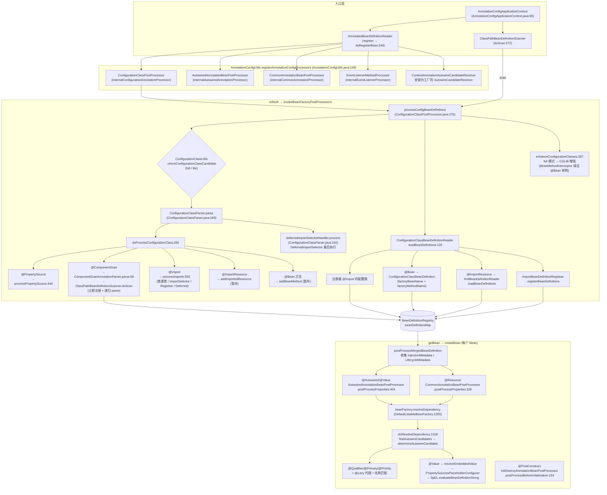
```mermaid
flowchart TB
    subgraph 入口层
        ACAC["AnnotationConfigApplicationContext<br/>(AnnotationConfigApplicationContext.java:90)"]
        ABR["AnnotatedBeanDefinitionReader<br/>(register → doRegisterBean:249)"]
        CPBS["ClassPathBeanDefinitionScanner<br/>(doScan:272)"]
    end

    subgraph 基础设施注册["AnnotationConfigUtils.registerAnnotationConfigProcessors (AnnotationConfigUtils.java:148)"]
        CCPP["ConfigurationClassPostProcessor<br/>(internalConfigurationAnnotationProcessor)"]
        AABP["AutowiredAnnotationBeanPostProcessor<br/>(internalAutowiredAnnotationProcessor)"]
        CABP["CommonAnnotationBeanPostProcessor<br/>(internalCommonAnnotationProcessor)"]
        ELMP["EventListenerMethodProcessor<br/>(internalEventListenerProcessor)"]
        RESOLVER["ContextAnnotationAutowireCandidateResolver<br/>安装为工厂的 AutowireCandidateResolver"]
    end

    subgraph 定义期流水线["refresh → invokeBeanFactoryPostProcessors"]
        CCPP --> PCBD["processConfigBeanDefinitions<br/>(ConfigurationClassPostProcessor.java:276)"]
        PCBD --> CHECK{"ConfigurationClassUtils<br/>.checkConfigurationClassCandidate<br/>(full / lite)"}
        CHECK --> CCP["ConfigurationClassParser.parse<br/>(ConfigurationClassParser.java:169)"]
        CCP --> DOCC["doProcessConfigurationClass:265"]
        DOCC --> PS["@PropertySource<br/>→ processPropertySource:444"]
        DOCC --> CS["@ComponentScan<br/>→ ComponentScanAnnotationParser.parse:68<br/>→ ClassPathBeanDefinitionScanner.doScan<br/>(立即注册 + 递归 parse)"]
        DOCC --> IMP["@Import<br/>→ processImports:555<br/>(普通类 / ImportSelector / Registrar / Deferred)"]
        DOCC --> IR["@ImportResource<br/>→ addImportedResource (暂存)"]
        DOCC --> BM["@Bean 方法<br/>→ addBeanMethod (暂存)"]
        CCP --> DEFER["deferredImportSelectorHandler.process<br/>(ConfigurationClassParser.java:192)<br/>DeferredImportSelector 最后执行"]
        PCBD --> CCBDR["ConfigurationClassBeanDefinitionReader<br/>.loadBeanDefinitions:126"]
        CCBDR --> REG1["注册被 @Import 的配置类"]
        CCBDR --> REG2["@Bean → ConfigurationClassBeanDefinition<br/>(factoryBeanName + factoryMethodName)"]
        CCBDR --> REG3["@ImportResource → XmlBeanDefinitionReader<br/>.loadBeanDefinitions"]
        CCBDR --> REG4["ImportBeanDefinitionRegistrar<br/>.registerBeanDefinitions"]
        PCBD --> ENH["enhanceConfigurationClasses:387<br/>full 模式 → CGLIB 增强<br/>(BeanMethodInterceptor 保证 @Bean 单例)"]
    end

    subgraph 实例期流水线["getBean → createBean (每个 Bean)"]
        MERGED["postProcessMergedBeanDefinition<br/>收集 InjectionMetadata / LifecycleMetadata"]
        MERGED --> AUTO["@Autowired/@Value<br/>AutowiredAnnotationBeanPostProcessor<br/>.postProcessProperties:404"]
        MERGED --> RES["@Resource<br/>CommonAnnotationBeanPostProcessor<br/>.postProcessProperties:326"]
        AUTO --> RD["beanFactory.resolveDependency<br/>(DefaultListableBeanFactory:1293)"]
        RES --> RD
        RD --> DORD["doResolveDependency:1318<br/>findAutowireCandidates → determineAutowireCandidate"]
        DORD --> QUAL["@Qualifier/@Primary/@Priority<br/>+ @Lazy 代理 + 名称匹配"]
        DORD --> EMB["@Value → resolveEmbeddedValue<br/>→ PropertySourcesPlaceholderConfigurer<br/>→ SpEL evaluateBeanDefinitionString"]
        INIT["@PostConstruct<br/>InitDestroyAnnotationBeanPostProcessor<br/>.postProcessBeforeInitialization:154"]
    end

    ACAC --> ABR
    ACAC --> CPBS
    ABR --> CCPP
    ABR --> AABP
    ABR --> CABP
    ABR --> ELMP
    ABR --> RESOLVER
    CPBS -->|scan| PCBD
    REG2 --> BDMAP[("BeanDefinitionRegistry<br/>beanDefinitionMap")]
    REG1 --> BDMAP
    REG3 --> BDMAP
    REG4 --> BDMAP
    CS --> BDMAP
    BDMAP --> MERGED
```

一张补充的类职责图（关键协作类）：

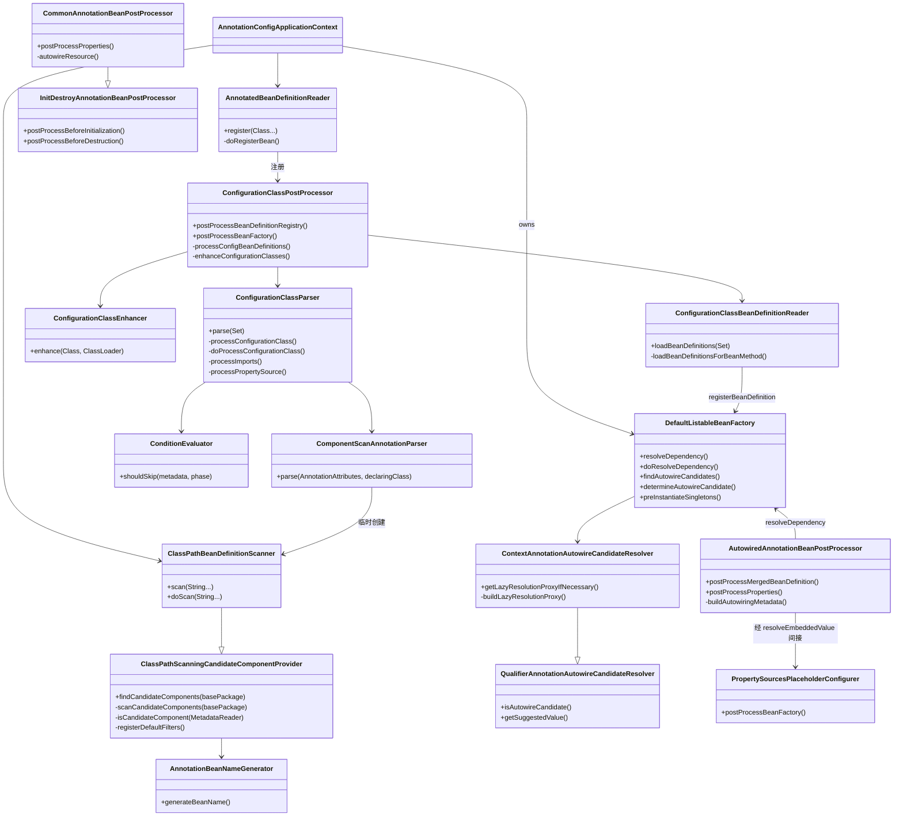
```mermaid
classDiagram
    class AnnotationConfigApplicationContext
    class AnnotatedBeanDefinitionReader {
        +register(Class...)
        -doRegisterBean()
    }
    class ClassPathBeanDefinitionScanner {
        +scan(String...)
        +doScan(String...)
    }
    class ClassPathScanningCandidateComponentProvider {
        +findCandidateComponents(basePackage)
        -scanCandidateComponents(basePackage)
        -isCandidateComponent(MetadataReader)
        -registerDefaultFilters()
    }
    class AnnotationBeanNameGenerator {
        +generateBeanName()
    }
    class ConfigurationClassPostProcessor {
        +postProcessBeanDefinitionRegistry()
        +postProcessBeanFactory()
        -processConfigBeanDefinitions()
        -enhanceConfigurationClasses()
    }
    class ConfigurationClassParser {
        +parse(Set)
        -processConfigurationClass()
        -doProcessConfigurationClass()
        -processImports()
        -processPropertySource()
    }
    class ComponentScanAnnotationParser {
        +parse(AnnotationAttributes, declaringClass)
    }
    class ConfigurationClassEnhancer {
        +enhance(Class, ClassLoader)
    }
    class ConfigurationClassBeanDefinitionReader {
        +loadBeanDefinitions(Set)
        -loadBeanDefinitionsForBeanMethod()
    }
    class ConditionEvaluator {
        +shouldSkip(metadata, phase)
    }
    class AutowiredAnnotationBeanPostProcessor {
        +postProcessMergedBeanDefinition()
        +postProcessProperties()
        -buildAutowiringMetadata()
    }
    class CommonAnnotationBeanPostProcessor {
        +postProcessProperties()
        -autowireResource()
    }
    class InitDestroyAnnotationBeanPostProcessor {
        +postProcessBeforeInitialization()
        +postProcessBeforeDestruction()
    }
    class DefaultListableBeanFactory {
        +resolveDependency()
        +doResolveDependency()
        +findAutowireCandidates()
        +determineAutowireCandidate()
        +preInstantiateSingletons()
    }
    class ContextAnnotationAutowireCandidateResolver {
        +getLazyResolutionProxyIfNecessary()
        -buildLazyResolutionProxy()
    }
    class QualifierAnnotationAutowireCandidateResolver {
        +isAutowireCandidate()
        +getSuggestedValue()
    }
    class PropertySourcesPlaceholderConfigurer {
        +postProcessBeanFactory()
    }

    AnnotationConfigApplicationContext --> AnnotatedBeanDefinitionReader
    AnnotationConfigApplicationContext --> ClassPathBeanDefinitionScanner
    ClassPathBeanDefinitionScanner --|> ClassPathScanningCandidateComponentProvider
    ClassPathScanningCandidateComponentProvider --> AnnotationBeanNameGenerator
    AnnotationConfigApplicationContext --> DefaultListableBeanFactory : owns
    AnnotatedBeanDefinitionReader --> ConfigurationClassPostProcessor : 注册
    ConfigurationClassPostProcessor --> ConfigurationClassParser
    ConfigurationClassPostProcessor --> ConfigurationClassBeanDefinitionReader
    ConfigurationClassPostProcessor --> ConfigurationClassEnhancer
    ConfigurationClassParser --> ComponentScanAnnotationParser
    ConfigurationClassParser --> ConditionEvaluator
    ComponentScanAnnotationParser --> ClassPathBeanDefinitionScanner : 临时创建
    ConfigurationClassBeanDefinitionReader --> DefaultListableBeanFactory : registerBeanDefinition
    DefaultListableBeanFactory --> ContextAnnotationAutowireCandidateResolver
    ContextAnnotationAutowireCandidateResolver --|> QualifierAnnotationAutowireCandidateResolver
    DefaultListableBeanFactory <-- AutowiredAnnotationBeanPostProcessor : resolveDependency
    AutowiredAnnotationBeanPostProcessor --> PropertySourcesPlaceholderConfigurer : 经 resolveEmbeddedValue 间接
    CommonAnnotationBeanPostProcessor --|> InitDestroyAnnotationBeanPostProcessor
```

---

## 4.17 时序图：register(AppConfig.class) 到所有 BeanDefinition 就绪

以 `new AnnotationConfigApplicationContext(AppConfig.class)` 为例（构造器 `AnnotationConfigApplicationContext.java:90`：`this(); register(componentClasses); refresh();`）：

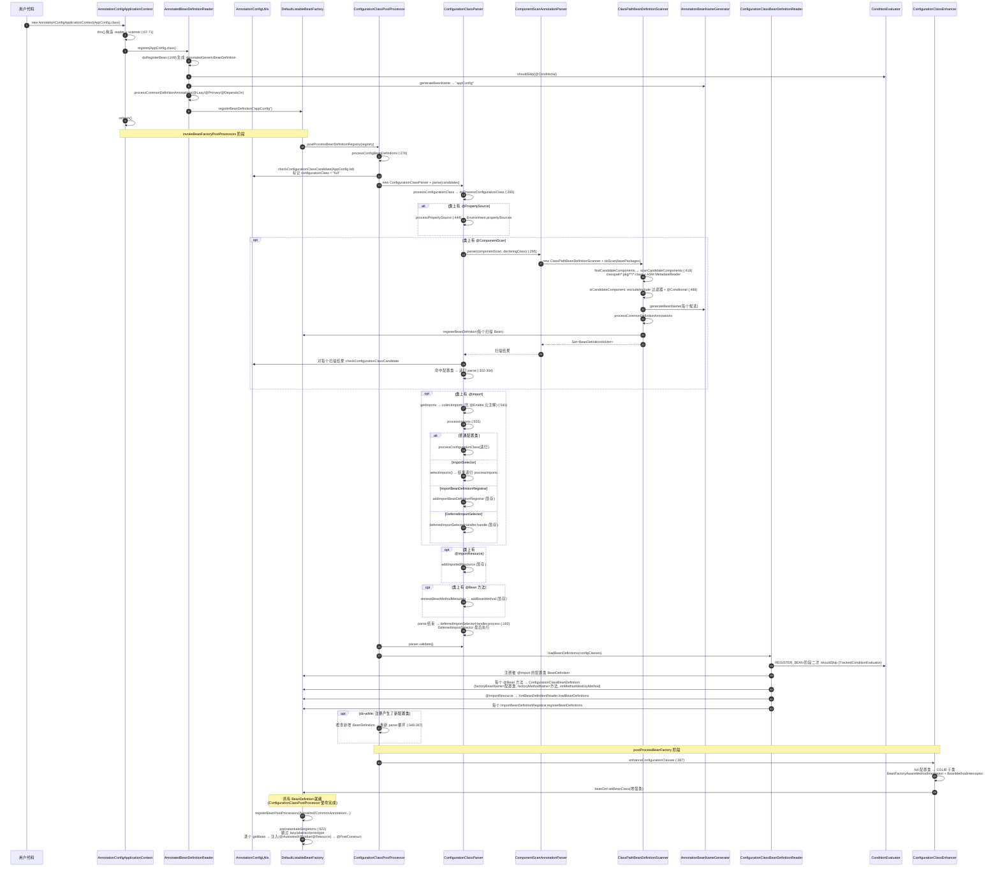
```mermaid
sequenceDiagram
    autonumber
    participant User as 用户代码
    participant ACAC as AnnotationConfigApplicationContext
    participant ABR as AnnotatedBeanDefinitionReader
    participant ACU as AnnotationConfigUtils
    participant BF as DefaultListableBeanFactory
    participant CCPP as ConfigurationClassPostProcessor
    participant CCP as ConfigurationClassParser
    participant CSAP as ComponentScanAnnotationParser
    participant SC as ClassPathBeanDefinitionScanner
    participant BNG as AnnotationBeanNameGenerator
    participant CCBDR as ConfigurationClassBeanDefinitionReader
    participant CEV as ConditionEvaluator
    participant ENH as ConfigurationClassEnhancer

    User->>ACAC: new AnnotationConfigApplicationContext(AppConfig.class)
    ACAC->>ACAC: this() 构造 reader + scanner (:67-71)
    ACAC->>ABR: register(AppConfig.class)
    ABR->>ABR: doRegisterBean (:249) 生成 AnnotatedGenericBeanDefinition
    ABR->>CEV: shouldSkip(@Conditional)
    ABR->>BNG: generateBeanName → "appConfig"
    ABR->>ABR: processCommonDefinitionAnnotations(@Lazy/@Primary/@DependsOn)
    ABR->>BF: registerBeanDefinition("appConfig")
    ACAC->>ACAC: refresh()
    Note over ACAC,BF: invokeBeanFactoryPostProcessors 阶段
    BF->>CCPP: postProcessBeanDefinitionRegistry(registry)
    CCPP->>CCPP: processConfigBeanDefinitions (:276)
    CCPP->>ACU: checkConfigurationClassCandidate(AppConfig bd)<br/>标记 configurationClass = "full"
    CCPP->>CCP: new ConfigurationClassParser + parse(candidates)
    CCP->>CCP: processConfigurationClass → doProcessConfigurationClass (:265)
    alt 类上有 @PropertySource
        CCP->>CCP: processPropertySource (:444) → Environment.propertySources
    end
    opt 类上有 @ComponentScan
        CCP->>CSAP: parse(componentScan, declaringClass) (:295)
        CSAP->>SC: new ClassPathBeanDefinitionScanner + doScan(basePackages)
        SC->>SC: findCandidateComponents → scanCandidateComponents (:418)<br/>classpath*:pkg/**/*.class + ASM MetadataReader
        SC->>SC: isCandidateComponent: exclude/include 过滤器 + @Conditional (:488)
        SC->>BNG: generateBeanName(每个候选)
        SC->>SC: processCommonDefinitionAnnotations
        SC->>BF: registerBeanDefinition(每个扫描 Bean)
        SC-->>CSAP: Set<BeanDefinitionHolder>
        CSAP-->>CCP: 扫描结果
        CCP->>ACU: 对每个扫描结果 checkConfigurationClassCandidate
        CCP->>CCP: 命中配置类 → 递归 parse (:302-304)
    end
    opt 类上有 @Import
        CCP->>CCP: getImports → collectImports (含 @Enable 元注解) (:541)
        CCP->>CCP: processImports (:555)
        alt 普通配置类
            CCP->>CCP: processConfigurationClass(递归)
        else ImportSelector
            CCP->>CCP: selectImports() → 结果递归 processImports
        else ImportBeanDefinitionRegistrar
            CCP->>CCP: addImportBeanDefinitionRegistrar (暂存)
        else DeferredImportSelector
            CCP->>CCP: deferredImportSelectorHandler.handle (暂存)
        end
    end
    opt 类上有 @ImportResource
        CCP->>CCP: addImportedResource (暂存)
    end
    opt 类上有 @Bean 方法
        CCP->>CCP: retrieveBeanMethodMetadata → addBeanMethod (暂存)
    end
    CCP->>CCP: parse 结束 → deferredImportSelectorHandler.process (:192)<br/>DeferredImportSelector 最后执行
    CCPP->>CCP: parser.validate()
    CCPP->>CCBDR: loadBeanDefinitions(configClasses)
    CCBDR->>CEV: REGISTER_BEAN 阶段二次 shouldSkip (TrackedConditionEvaluator)
    CCBDR->>BF: 注册被 @Import 的配置类 BeanDefinition
    CCBDR->>BF: 每个 @Bean 方法 → ConfigurationClassBeanDefinition<br/>(factoryBeanName=配置类, factoryMethodName=方法, initMethod/destroyMethod)
    CCBDR->>BF: @ImportResource → XmlBeanDefinitionReader.loadBeanDefinitions
    CCBDR->>BF: 每个 ImportBeanDefinitionRegistrar.registerBeanDefinitions
    opt do-while: 注册产生了新配置类
        CCPP->>CCPP: 检查新增 BeanDefinition → 重新 parse 循环 (:348-367)
    end
    Note over CCPP,ENH: postProcessBeanFactory 阶段
    CCPP->>ENH: enhanceConfigurationClasses (:387)
    ENH->>ENH: full 配置类 → CGLIB 子类<br/>BeanFactoryAwareMethodInterceptor + BeanMethodInterceptor
    ENH->>BF: beanDef.setBeanClass(增强类)
    Note over BF: 所有 BeanDefinition 就绪<br/>(ConfigurationClassPostProcessor 使命完成)
    BF->>BF: registerBeanPostProcessors(Autowired/CommonAnnotation/...)
    BF->>BF: preInstantiateSingletons (:922)<br/>跳过 lazy/abstract/prototype<br/>逐个 getBean → 注入(@Autowired/@Value/@Resource) → @PostConstruct
```

---

## 4.18 本章小结

1. **一切注解最终都落到 BeanDefinition 或 BeanPostProcessor 行为上**。定义期注解（@Component/@ComponentScan/@Configuration/@Bean/@Import/@PropertySource/@ImportResource/@Conditional/@DependsOn/@Scope/@Lazy-类级）改变的是 *BeanDefinition 注册表的内容*；实例期注解（@Autowired/@Value/@Resource/@PostConstruct/@PreDestroy/@Lazy-注入点级）改变的是 *单个 Bean 的创建过程*。
2. **元数据统一基于 ASM + AnnotationMetadata**：扫描、配置类解析、条件评估全程不加载目标类（`CachingMetadataReaderFactory`），这是 Spring 启动性能与"未命中条件不触发类加载"的基础。
3. **@Component 体系是一棵以 @Component 为根的注解树**：`AnnotationTypeFilter` 的元注解匹配（`hasMetaAnnotation`）+ `AnnotationBeanNameGenerator` 的 stereotype 判定，共同支撑了派生注解与自定义组合注解。
4. **full/lite 与 proxyBeanMethods 的本质是"要不要为配置类生成 CGLIB 子类"**：`BeanMethodInterceptor` 用 `isCurrentlyInvokedFactoryMethod()` 区分容器调用与用户调用，后者一律 `beanFactory.getBean(beanName)`，从而保证 @Bean 方法互调返回同一单例。
5. **@Import 的四种形态（普通类/Selector/Registrar/Deferred）覆盖了从声明式到编程式的全部扩展面**，其中 DeferredImportSelector 的"最后执行"语义是 Spring Boot 自动装配可条件化、可让位用户配置的基石。
6. **依赖注入是一套策略链**：`AutowireCandidateResolver` 的实现链（Context→Qualifier→GenericType→默认）把 @Lazy 代理、@Qualifier 匹配、@Value 建议值、泛型匹配逐层叠加在 byType 检索之上；多候选裁决顺序固定为 @Primary → @Priority → 名称匹配。
7. **@Value 的两段求值**（`resolveEmbeddedValue` 的 `${}` 责任链 → `evaluateBeanDefinitionString` 的 `#{}` SpEL）与最终 `convertIfNecessary` 类型转换，分别对应 PropertySourcesPlaceholderConfigurer 注册的 StringValueResolver、StandardBeanExpressionResolver 与 ConversionService 三套可替换组件。

> 涉及的关键源码文件索引：
> - 扫描：`spring-context/src/main/java/org/springframework/context/annotation/ClassPathBeanDefinitionScanner.java`、`ClassPathScanningCandidateComponentProvider.java`、`AnnotationBeanNameGenerator.java`
> - 配置类：`ConfigurationClassPostProcessor.java`、`ConfigurationClassParser.java`、`ConfigurationClassBeanDefinitionReader.java`、`ConfigurationClassEnhancer.java`、`ConfigurationClassUtils.java`、`ComponentScanAnnotationParser.java`、`ConditionEvaluator.java`
> - 注入：`spring-beans/src/main/java/org/springframework/beans/factory/annotation/AutowiredAnnotationBeanPostProcessor.java`、`InjectionMetadata.java`、`QualifierAnnotationAutowireCandidateResolver.java`、`InitDestroyAnnotationBeanPostProcessor.java`、`spring-context/.../CommonAnnotationBeanPostProcessor.java`、`ContextAnnotationAutowireCandidateResolver.java`
> - 容器核心：`spring-beans/src/main/java/org/springframework/beans/factory/support/DefaultListableBeanFactory.java`、`AbstractBeanFactory.java`、`DisposableBeanAdapter.java`
> - 属性：`spring-context/src/main/java/org/springframework/context/support/PropertySourcesPlaceholderConfigurer.java`、`spring-beans/.../config/PlaceholderConfigurerSupport.java`


# 第五章 Spring AOP 实现原理


> 源码基线：Spring Framework 5.3.38
> 仓库路径：`/Users/wenbin/Desktop/workspace/java_projects/source_code/spring-framework-5.3.38`
> 本文所有行号均以该版本源码为准，引用格式为 `模块/src/main/java/.../Xxx.java:行号`。

---

## 5.1 AOP 体系结构：核心模型

Spring AOP 的整个体系建立在几个非常少的抽象之上：**Advice（增强）、Pointcut（切点）、Advisor（切面 = 切点 + 增强）、Joinpoint（连接点）**，以及贯穿始终的 **Advised（代理配置）模型**。Spring AOP 是**纯 Java 实现、基于动态代理（JDK Proxy / CGLIB）的运行时织入**框架，它借用了 AspectJ 的注解与切点表达式解析能力（`aspectjweaver`），但织入机制完全独立。

### 5.1.1 核心接口一览

```java
// spring-aop/src/main/java/org/springframework/aop/Pointcut.java:33-45
public interface Pointcut {
	ClassFilter getClassFilter();
	MethodMatcher getMethodMatcher();
	ClassFilter TRUE = TrueClassFilter.INSTANCE;
	MethodMatcher TRUE = TrueMethodMatcher.INSTANCE;
	Pointcut TRUE = TruePointcut.INSTANCE;
}
```

Pointcut 由两个正交的过滤器组成：

- **ClassFilter**（`spring-aop/.../aop/ClassFilter.java`）：`boolean matches(Class<?> clazz)` —— 类级别粗筛；
- **MethodMatcher**（`spring-aop/.../aop/MethodMatcher.java`）：
  - `boolean matches(Method method, Class<?> targetClass)` —— **静态**方法匹配（代理创建期/首次调用期执行）；
  - `boolean isRuntime()` —— 是否需要运行期参数匹配；
  - `boolean matches(Method method, Class<?> targetClass, Object... args)` —— **动态**匹配（每次 `proceed()` 时执行）。

这套"两阶段匹配"是 Spring AOP 性能设计的关键：静态匹配的结果会被缓存进拦截器链，动态匹配只在 `isRuntime()==true` 时对每次调用做参数级校验。

**Advice 体系**（根接口来自 AOP Alliance，`org.aopalliance.aop.Advice`，一个纯标记接口）：

```java
// spring-aop/src/main/java/org/springframework/aop/MethodBeforeAdvice.java（节选）
public interface MethodBeforeAdvice extends BeforeAdvice {
	void before(Method method, Object[] args, @Nullable Object target) throws Throwable;
}

// spring-aop/src/main/java/org/springframework/aop/AfterReturningAdvice.java（节选）
public interface AfterReturningAdvice extends AfterAdvice {
	void afterReturning(@Nullable Object returnValue, Method method, Object[] args, @Nullable Object target) throws Throwable;
}

// spring-aop/src/main/java/org/springframework/aop/ThrowsAdvice.java（节选）
// 纯标记接口：无方法。回调方法通过反射约定发现，如 afterThrowing(Method, Object[], Object, Throwable)
public interface ThrowsAdvice extends AfterAdvice {
}
```

而真正被代理执行引擎消费的统一形态只有一种：

```java
// org.aopalliance.intercept.MethodInterceptor（aopalliance 标准）
public interface MethodInterceptor extends Interceptor {
	Object invoke(MethodInvocation invocation) throws Throwable;
}
```

**Advisor 体系**：

```java
// spring-aop/src/main/java/org/springframework/aop/Advisor.java（节选）
public interface Advisor {
	Advice getAdvice();
	boolean isPerInstance();
}

// spring-aop/src/main/java/org/springframework/aop/PointcutAdvisor.java（节选）
public interface PointcutAdvisor extends Advisor {
	Pointcut getPointcut();
}
```

Spring AOP 内部**只认 Advisor**。任何裸的 Advice 都会被 `DefaultPointcutAdvisor`（匹配一切）包装成 Advisor；PointcutAdvisor 则携带自己的 Pointcut。

### 5.1.2 代理配置体系：ProxyConfig → AdvisedSupport → ProxyFactory

```java
// spring-aop/src/main/java/org/springframework/aop/framework/ProxyConfig.java:31-45
public class ProxyConfig implements Serializable {
	private boolean proxyTargetClass = false;  // 强制 CGLIB（基于类代理）
	private boolean optimize = false;          // 激进优化（当前效果≈强制 CGLIB）
	boolean opaque = false;                    // 代理不可被转型为 Advised
	boolean exposeProxy = false;               // 将代理暴露到 ThreadLocal（AopContext）
	private boolean frozen = false;            // 冻结配置，禁止再修改 advisor 链
	...
}
```

继承链：`ProxyConfig` → `AdvisedSupport`（持有 TargetSource、interfaces、advisors、AdvisorChainFactory 及方法级拦截器链缓存）→ `ProxyCreatorSupport`（持有 AopProxyFactory，默认 `DefaultAopProxyFactory`）→ `ProxyFactory`（面向编程式使用的门面）。

```java
// spring-aop/src/main/java/org/springframework/aop/framework/AdvisedSupport.java:63-98
public class AdvisedSupport extends ProxyConfig implements Advised {
	public static final TargetSource EMPTY_TARGET_SOURCE = EmptyTargetSource.INSTANCE;
	TargetSource targetSource = EMPTY_TARGET_SOURCE;
	private boolean preFiltered = false;                       // advisor 是否已按 targetClass 预过滤
	AdvisorChainFactory advisorChainFactory = new DefaultAdvisorChainFactory();
	private transient Map<MethodCacheKey, List<Object>> methodCache;  // 方法→拦截器链缓存
	private List<Class<?>> interfaces = new ArrayList<>();
	private List<Advisor> advisors = new ArrayList<>();
	...
}
```

```java
// spring-aop/src/main/java/org/springframework/aop/framework/ProxyCreatorSupport.java:101-106
protected final synchronized AopProxy createAopProxy() {
	if (!this.active) {
		activate();
	}
	return getAopProxyFactory().createAopProxy(this);
}
```

```java
// spring-aop/src/main/java/org/springframework/aop/framework/ProxyFactory.java:96-98
public Object getProxy() {
	return createAopProxy().getProxy();
}
```

**Advised** 接口（`spring-aop/.../aop/framework/Advised.java`）是"运行期可操纵代理配置"的窗口：任何 Spring AOP 代理对象都可以转型为 `Advised`，动态增删 advisor、更换 TargetSource。`AdvisedSupport implements Advised` 使配置对象本身具备这套能力。

### 5.1.3 核心类图

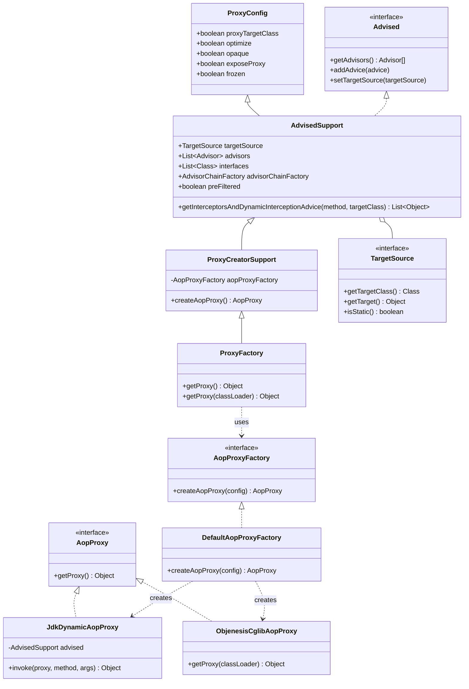
```mermaid
classDiagram
    direction TB

    class ProxyConfig {
        +boolean proxyTargetClass
        +boolean optimize
        +boolean opaque
        +boolean exposeProxy
        +boolean frozen
    }
    class AdvisedSupport {
        +TargetSource targetSource
        +List~Advisor~ advisors
        +List~Class~ interfaces
        +AdvisorChainFactory advisorChainFactory
        +boolean preFiltered
        +getInterceptorsAndDynamicInterceptionAdvice(method, targetClass) List~Object~
    }
    class Advised {
        <<interface>>
        +getAdvisors() Advisor[]
        +addAdvice(advice)
        +setTargetSource(targetSource)
    }
    class ProxyCreatorSupport {
        -AopProxyFactory aopProxyFactory
        +createAopProxy() AopProxy
    }
    class ProxyFactory {
        +getProxy() Object
        +getProxy(classLoader) Object
    }
    class AopProxyFactory {
        <<interface>>
        +createAopProxy(config) AopProxy
    }
    class DefaultAopProxyFactory {
        +createAopProxy(config) AopProxy
    }
    class AopProxy {
        <<interface>>
        +getProxy() Object
    }
    class JdkDynamicAopProxy {
        -AdvisedSupport advised
        +invoke(proxy, method, args) Object
    }
    class ObjenesisCglibAopProxy {
        +getProxy(classLoader) Object
    }
    class TargetSource {
        <<interface>>
        +getTargetClass() Class
        +getTarget() Object
        +isStatic() boolean
    }

    ProxyConfig <|-- AdvisedSupport
    Advised <|.. AdvisedSupport
    AdvisedSupport <|-- ProxyCreatorSupport
    ProxyCreatorSupport <|-- ProxyFactory
    AopProxyFactory <|.. DefaultAopProxyFactory
    AopProxy <|.. JdkDynamicAopProxy
    AopProxy <|.. ObjenesisCglibAopProxy
    DefaultAopProxyFactory ..> JdkDynamicAopProxy : creates
    DefaultAopProxyFactory ..> ObjenesisCglibAopProxy : creates
    AdvisedSupport o-- TargetSource
    ProxyFactory ..> AopProxyFactory : uses
```

Pointcut / Advisor / Advice 模型：

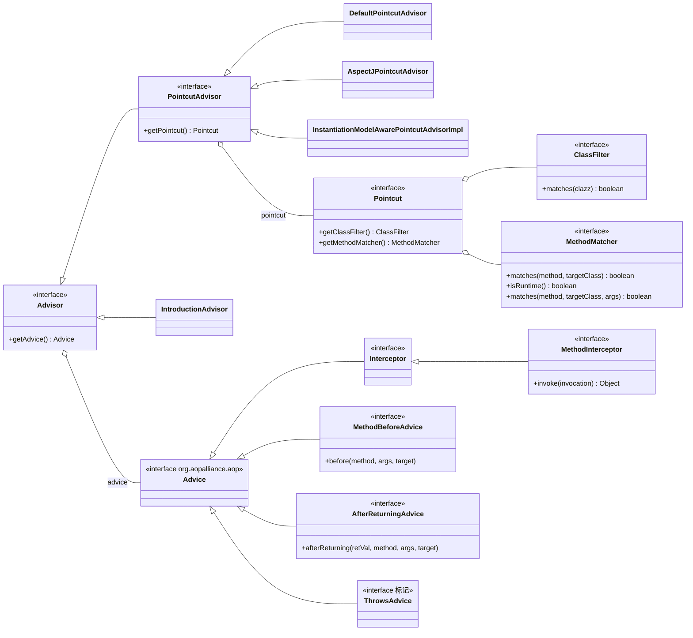
```mermaid
classDiagram
    direction LR

    class Advice {
        <<interface org.aopalliance.aop>>
    }
    class Interceptor {
        <<interface>>
    }
    class MethodInterceptor {
        <<interface>>
        +invoke(invocation) Object
    }
    class MethodBeforeAdvice {
        <<interface>>
        +before(method, args, target)
    }
    class AfterReturningAdvice {
        <<interface>>
        +afterReturning(retVal, method, args, target)
    }
    class ThrowsAdvice {
        <<interface 标记>>
    }
    class Advisor {
        <<interface>>
        +getAdvice() Advice
    }
    class PointcutAdvisor {
        <<interface>>
        +getPointcut() Pointcut
    }
    class IntroductionAdvisor
    class Pointcut {
        <<interface>>
        +getClassFilter() ClassFilter
        +getMethodMatcher() MethodMatcher
    }
    class ClassFilter {
        <<interface>>
        +matches(clazz) boolean
    }
    class MethodMatcher {
        <<interface>>
        +matches(method, targetClass) boolean
        +isRuntime() boolean
        +matches(method, targetClass, args) boolean
    }
    class DefaultPointcutAdvisor
    class AspectJPointcutAdvisor
    class InstantiationModelAwarePointcutAdvisorImpl

    Advice <|-- Interceptor
    Interceptor <|-- MethodInterceptor
    Advice <|-- MethodBeforeAdvice
    Advice <|-- AfterReturningAdvice
    Advice <|-- ThrowsAdvice
    Advisor <|-- PointcutAdvisor
    Advisor <|-- IntroductionAdvisor
    PointcutAdvisor <|-- DefaultPointcutAdvisor
    PointcutAdvisor <|-- AspectJPointcutAdvisor
    PointcutAdvisor <|-- InstantiationModelAwarePointcutAdvisorImpl
    PointcutAdvisor o-- Pointcut : pointcut
    Pointcut o-- ClassFilter
    Pointcut o-- MethodMatcher
    Advisor o-- Advice : advice
```

### 5.1.4 Advice → MethodInterceptor 的适配：AdvisorAdapter 体系

Spring 的拦截器链执行引擎（`ReflectiveMethodInvocation`）**只执行 `MethodInterceptor`**。`MethodBeforeAdvice`、`AfterReturningAdvice`、`ThrowsAdvice` 这类"声明式风格"的 Advice 必须被适配为 MethodInterceptor，这就是 **AdvisorAdapter** 的职责：

```java
// spring-aop/src/main/java/org/springframework/aop/framework/adapter/AdvisorAdapter.java（节选）
public interface AdvisorAdapter {
	boolean supportsAdvice(Advice advice);
	MethodInterceptor getInterceptor(Advisor advisor);
}
```

注册中心 `DefaultAdvisorAdapterRegistry` 在构造时注册了三个内建适配器：

```java
// spring-aop/src/main/java/org/springframework/aop/framework/adapter/DefaultAdvisorAdapterRegistry.java:49-53
public DefaultAdvisorAdapterRegistry() {
	registerAdvisorAdapter(new MethodBeforeAdviceAdapter());
	registerAdvisorAdapter(new AfterReturningAdviceAdapter());
	registerAdvisorAdapter(new ThrowsAdviceAdapter());
}
```

两个关键方法——**wrap（Advice→Advisor 包装）** 与 **getInterceptors（Advice→MethodInterceptor 适配）**：

```java
// spring-aop/src/main/java/org/springframework/aop/framework/adapter/DefaultAdvisorAdapterRegistry.java:57-94
@Override
public Advisor wrap(Object adviceObject) throws UnknownAdviceTypeException {
	if (adviceObject instanceof Advisor) {
		return (Advisor) adviceObject;
	}
	if (!(adviceObject instanceof Advice)) {
		throw new UnknownAdviceTypeException(adviceObject);
	}
	Advice advice = (Advice) adviceObject;
	if (advice instanceof MethodInterceptor) {
		// So well-known it doesn't even need an adapter.
		return new DefaultPointcutAdvisor(advice);     // 直接包成"匹配一切"的 Advisor
	}
	for (AdvisorAdapter adapter : this.adapters) {
		if (adapter.supportsAdvice(advice)) {
			return new DefaultPointcutAdvisor(advice); // 声明式 Advice 同样包成 Advisor
		}
	}
	throw new UnknownAdviceTypeException(advice);
}

@Override
public MethodInterceptor[] getInterceptors(Advisor advisor) throws UnknownAdviceTypeException {
	List<MethodInterceptor> interceptors = new ArrayList<>(3);
	Advice advice = advisor.getAdvice();
	if (advice instanceof MethodInterceptor) {
		interceptors.add((MethodInterceptor) advice);  // 已经是 MethodInterceptor，直接用
	}
	for (AdvisorAdapter adapter : this.adapters) {
		if (adapter.supportsAdvice(advice)) {
			interceptors.add(adapter.getInterceptor(advisor)); // 适配包装
		}
	}
	if (interceptors.isEmpty()) {
		throw new UnknownAdviceTypeException(advisor.getAdvice());
	}
	return interceptors.toArray(new MethodInterceptor[0]);
}
```

以 `MethodBeforeAdviceAdapter` → `MethodBeforeAdviceInterceptor` 为例：

```java
// spring-aop/src/main/java/org/springframework/aop/framework/adapter/MethodBeforeAdviceAdapter.java:37-46
@Override
public boolean supportsAdvice(Advice advice) {
	return (advice instanceof MethodBeforeAdvice);
}
@Override
public MethodInterceptor getInterceptor(Advisor advisor) {
	MethodBeforeAdvice advice = (MethodBeforeAdvice) advisor.getAdvice();
	return new MethodBeforeAdviceInterceptor(advice);
}
```

```java
// spring-aop/src/main/java/org/springframework/aop/framework/adapter/MethodBeforeAdviceInterceptor.java:54-59
@Override
@Nullable
public Object invoke(MethodInvocation mi) throws Throwable {
	this.advice.before(mi.getMethod(), mi.getArguments(), mi.getThis());
	return mi.proceed();   // "前置"语义的实现：先 before，再推进责任链
}
```

同理：`AfterReturningAdviceAdapter` → `AfterReturningAdviceInterceptor`（`proceed()` 返回后再调 `afterReturning`，异常时跳过）；`ThrowsAdviceAdapter` → `ThrowsAdviceInterceptor`（捕获 `proceed()` 抛出的异常，反射查找签名匹配的 `afterThrowing(...)` 方法回调后重新抛出）。这个"适配器 + 注册中心"是可扩展的：通过 `AdvisorAdapterRegistrationManager` 可注册自定义适配器。

> **注解式 @Aspect 不走这套适配**。AspectJ 风格的 advice 类（`AspectJMethodBeforeAdvice`、`AspectJAfterReturningAdvice` 等）虽然有的实现了 `MethodBeforeAdvice`/`AfterReturningAdvice`（见 5.3.4），但它们同样会在链工厂阶段经由 `DefaultAdvisorAdapterRegistry.getInterceptors` 被适配/直接使用。

### 5.1.5 Joinpoint 与 MethodInvocation

Spring AOP 的 Joinpoint 模型即 `org.aopalliance.intercept.Joinpoint`，其方法级子接口 `MethodInvocation`（`getMethod()/getArguments()/getThis()/proceed()`）在每次被拦截的调用中由 `ReflectiveMethodInvocation` 具体承载。`ProxyMethodInvocation`（`spring-aop/.../aop/ProxyMethodInvocation.java`）额外携带 `getProxy()` 并支持 `invocableClone()`（事务异步等场景复制调用）。JoinPoint 的获取：AspectJ 风格 advice 方法中的 `JoinPoint` 参数由 `AbstractAspectJAdvice.getJoinPoint()` 提供，其内部调用 `ExposeInvocationInterceptor.currentInvocation()`（详见 5.4.5）。

---

## 5.2 注解如何开启 AOP：从 AopAutoConfiguration 到 AnnotationAwareAspectJAutoProxyCreator

### 5.2.1 澄清：AopAutoConfiguration 属于 Spring Boot

需要先澄清一个常见误解：**`AopAutoConfiguration` 不在 Spring Framework 源码树中**。本仓库（spring-framework-5.3.38）的 `spring-context` 模块**没有** `src/main/resources/META-INF/spring.factories` 文件（全仓库仅有 `spring-beans`、`spring-r2dbc`、`spring-test` 等少数模块含有 spring.factories，且内容与 AOP 无关）。`AopAutoConfiguration` 位于 **Spring Boot** 的 `spring-boot-autoconfigure` 模块，其 `META-INF/spring.factories` 中注册：

```properties
# spring-boot-autoconfigure 的 META-INF/spring.factories（Spring Boot 2.x，非本仓库）
org.springframework.boot.autoconfigure.EnableAutoConfiguration=\
org.springframework.boot.autoconfigure.aop.AopAutoConfiguration,...
```

Spring Boot 2.x 起 `AopAutoConfiguration` 默认 `spring.aop.proxy-target-class=true`，即**默认 CGLIB**；它最终仍然是通过 `@EnableAspectJAutoProxy(proxyTargetClass = true)` 把能力**委托回 spring-context**。也就是说，无论入口是 Spring Boot 还是传统 Spring，汇聚点都是下面这条 Framework 原生链路。

### 5.2.2 @EnableAspectJAutoProxy → AspectJAutoProxyRegistrar

```java
// spring-context/src/main/java/org/springframework/context/annotation/EnableAspectJAutoProxy.java:119-139
@Target(ElementType.TYPE)
@Retention(RetentionPolicy.RUNTIME)
@Documented
@Import(AspectJAutoProxyRegistrar.class)   // 关键：Import 一个 ImportBeanDefinitionRegistrar
public @interface EnableAspectJAutoProxy {
	boolean proxyTargetClass() default false;
	boolean exposeProxy() default false;
}
```

```java
// spring-context/src/main/java/org/springframework/context/annotation/AspectJAutoProxyRegistrar.java:39-58
@Override
public void registerBeanDefinitions(AnnotationMetadata importingClassMetadata, BeanDefinitionRegistry registry) {
	AopConfigUtils.registerAspectJAnnotationAutoProxyCreatorIfNecessary(registry);   // ① 注册 APC

	AnnotationAttributes enableAspectJAutoProxy =
			AnnotationConfigUtils.attributesFor(importingClassMetadata, EnableAspectJAutoProxy.class);
	if (enableAspectJAutoProxy != null) {
		if (enableAspectJAutoProxy.getBoolean("proxyTargetClass")) {
			AopConfigUtils.forceAutoProxyCreatorToUseClassProxying(registry);        // ② proxyTargetClass=true
		}
		if (enableAspectJAutoProxy.getBoolean("exposeProxy")) {
			AopConfigUtils.forceAutoProxyCreatorToExposeProxy(registry);            // ③ exposeProxy=true
		}
	}
}
```

`AopConfigUtils` 中完成实际注册，固定 bean 名为 `org.springframework.aop.config.internalAutoProxyCreator`：

```java
// spring-aop/src/main/java/org/springframework/aop/config/AopConfigUtils.java:57-63
private static final List<Class<?>> APC_PRIORITY_LIST = new ArrayList<>(3);
static {
	APC_PRIORITY_LIST.add(InfrastructureAdvisorAutoProxyCreator.class);   // 优先级 0（最低）
	APC_PRIORITY_LIST.add(AspectJAwareAdvisorAutoProxyCreator.class);     // 优先级 1
	APC_PRIORITY_LIST.add(AnnotationAwareAspectJAutoProxyCreator.class);  // 优先级 2（最高）
}
```

```java
// spring-aop/src/main/java/org/springframework/aop/config/AopConfigUtils.java:110-141
public static void forceAutoProxyCreatorToExposeProxy(BeanDefinitionRegistry registry) {
	if (registry.containsBeanDefinition(AUTO_PROXY_CREATOR_BEAN_NAME)) {
		BeanDefinition definition = registry.getBeanDefinition(AUTO_PROXY_CREATOR_BEAN_NAME);
		definition.getPropertyValues().add("exposeProxy", Boolean.TRUE);  // 仅改属性值，等待属性填充
	}
}

@Nullable
private static BeanDefinition registerOrEscalateApcAsRequired(
		Class<?> cls, BeanDefinitionRegistry registry, @Nullable Object source) {
	Assert.notNull(registry, "BeanDefinitionRegistry must not be null");
	if (registry.containsBeanDefinition(AUTO_PROXY_CREATOR_BEAN_NAME)) {
		BeanDefinition apcDefinition = registry.getBeanDefinition(AUTO_PROXY_CREATOR_BEAN_NAME);
		if (!cls.getName().equals(apcDefinition.getBeanClassName())) {
			int currentPriority = findPriorityForClass(apcDefinition.getBeanClassName());
			int requiredPriority = findPriorityForClass(cls);
			if (currentPriority < requiredPriority) {
				apcDefinition.setBeanClassName(cls.getName());   // 就地"升级"为功能更强的 APC
			}
		}
		return null;
	}
	RootBeanDefinition beanDefinition = new RootBeanDefinition(cls);
	beanDefinition.setSource(source);
	beanDefinition.getPropertyValues().add("order", Ordered.HIGHEST_PRECEDENCE); // 最高优先级 BPP
	beanDefinition.setRole(BeanDefinition.ROLE_INFRASTRUCTURE);                  // 基础设施 bean
	registry.registerBeanDefinition(AUTO_PROXY_CREATOR_BEAN_NAME, beanDefinition);
	return beanDefinition;
}
```

三个要点：

1. **幂等 + 升级**：如果 `<tx:annotation-driven>` 先注册了 `InfrastructureAdvisorAutoProxyCreator`，随后 `@EnableAspectJAutoProxy` 会把同一个 bean definition 的 class **升级**为 `AnnotationAwareAspectJAutoProxyCreator`（优先级表保证只能向上换）；
2. `order = HIGHEST_PRECEDENCE`：保证该 BeanPostProcessor 尽量早介入；
3. `ROLE_INFRASTRUCTURE`：不作为应用 bean 暴露。

XML 等价物 `<aop:aspectj-autoproxy>` 由 `spring-aop` 的 `AopNamespaceHandler` 解析，最终同样调用 `AopConfigUtils.registerAspectJAnnotationAutoProxyCreatorIfNecessary(...)`。

注册进容器的这颗"种子"就是：

```
AnnotationAwareAspectJAutoProxyCreator
  └── extends AspectJAwareAdvisorAutoProxyCreator        （AspectJ 排序、shouldSkip、ExposeInvocationInterceptor）
        └── extends AbstractAdvisorAutoProxyCreator       （findEligibleAdvisors 四步曲）
              └── extends AbstractAutoProxyCreator        （BeanPostProcessor 主流程、createProxy）
                    └── extends ProxyProcessorSupport     （ProxyConfig 的 Order/ClassLoader 支持）
                          └── extends ProxyConfig
```

---

## 5.3 代理创建全流程：AbstractAutoProxyCreator 作为 BeanPostProcessor

`AbstractAutoProxyCreator` 同时实现了 `SmartInstantiationAwareBeanPostProcessor` 与 `BeanFactoryAware`（`spring-aop/.../framework/autoproxy/AbstractAutoProxyCreator.java:97-98`），因此它在 **bean 实例化前、实例化中（循环依赖早期引用）、初始化后** 三个时机都有钩子。

### 5.3.1 postProcessBeforeInstantiation：切面短路创建代理

```java
// spring-aop/src/main/java/org/springframework/aop/framework/autoproxy/AbstractAutoProxyCreator.java:248-276
@Override
@Nullable
public Object postProcessBeforeInstantiation(Class<?> beanClass, String beanName) {
	Object cacheKey = getCacheKey(beanClass, beanName);

	if (!StringUtils.hasLength(beanName) || !this.targetSourcedBeans.contains(beanName)) {
		if (this.advisedBeans.containsKey(cacheKey)) {
			return null;                                   // 已判定过：命中缓存直接放行
		}
		if (isInfrastructureClass(beanClass) || shouldSkip(beanClass, beanName)) {
			this.advisedBeans.put(cacheKey, Boolean.FALSE); // 基础设施/切面自身 → 标记"永不代理"
			return null;
		}
	}

	// Create proxy here if we have a custom TargetSource.
	// Suppresses unnecessary default instantiation of the target bean:
	// The TargetSource will handle target instances in a custom fashion.
	TargetSource targetSource = getCustomTargetSource(beanClass, beanName);
	if (targetSource != null) {
		if (StringUtils.hasLength(beanName)) {
			this.targetSourcedBeans.add(beanName);
		}
		Object[] specificInterceptors = getAdvicesAndAdvisorsForBean(beanClass, beanName, targetSource);
		Object proxy = createProxy(beanClass, beanName, specificInterceptors, targetSource);
		this.proxyTypes.put(cacheKey, proxy.getClass());
		return proxy;                                       // 返回非 null → 容器跳过正常实例化，直接用代理
	}
	return null;
}
```

两个分支值得注意：

- **`isInfrastructureClass`**（同文件 366-375 行）：`Advice / Pointcut / Advisor / AopInfrastructureBean` 类型的 bean 一律不代理。`AnnotationAwareAspectJAutoProxyCreator` 覆写了它，把 **`@Aspect` bean 本身**也排除：

```java
// spring-aop/src/main/java/org/springframework/aop/aspectj/annotation/AnnotationAwareAspectJAutoProxyCreator.java:100-112
@Override
protected boolean isInfrastructureClass(Class<?> beanClass) {
	return (super.isInfrastructureClass(beanClass) ||
			(this.aspectJAdvisorFactory != null && this.aspectJAdvisorFactory.isAspect(beanClass)));
}
```

- **`shouldSkip`**：`AspectJAwareAdvisorAutoProxyCreator` 的覆写是切面解析的**最早触发点**：

```java
// spring-aop/src/main/java/org/springframework/aop/aspectj/autoproxy/AspectJAwareAdvisorAutoProxyCreator.java:98-109
@Override
protected boolean shouldSkip(Class<?> beanClass, String beanName) {
	// TODO: Consider optimization by caching the list of the aspect names
	List<Advisor> candidateAdvisors = findCandidateAdvisors();   // 首次调用 → 触发 buildAspectJAdvisors 全量扫描
	for (Advisor advisor : candidateAdvisors) {
		if (advisor instanceof AspectJPointcutAdvisor &&
				((AspectJPointcutAdvisor) advisor).getAspectName().equals(beanName)) {
			return true;                                          // 切面 bean 自身不代理
		}
	}
	return super.shouldSkip(beanClass, beanName);
}
```

这里调用 `findCandidateAdvisors()` 会**首次执行 `buildAspectJAdvisors()`**：用 `beanFactory.getType(beanName, false)` 只取类型**不实例化**（懒加载，注释明确说明"避免提前实例化导致未经处理的 bean 被缓存"），真正创建切面实例推迟到 `BeanFactoryAspectInstanceFactory.getBean()`（即第一次 advice 执行时）。此外，`getCustomTargetSource(...)` 命中自定义 TargetSource（如 `AbstractBeanFactoryAwareTargetSourceCreator`、lazy/targetsourced prototypes）时会在**实例化之前**直接造出代理，短路目标 bean 的常规创建。

### 5.3.2 循环依赖与 postProcessAfterInitialization → wrapIfNecessary

```java
// spring-aop/src/main/java/org/springframework/aop/framework/autoproxy/AbstractAutoProxyCreator.java:241-245
@Override
public Object getEarlyBeanReference(Object bean, String beanName) {
	Object cacheKey = getCacheKey(bean.getClass(), beanName);
	this.earlyProxyReferences.put(cacheKey, bean);   // 记录"该 bean 已经提前包装过原始对象"
	return wrapIfNecessary(bean, beanName, cacheKey);
}
```

```java
// spring-aop/src/main/java/org/springframework/aop/framework/autoproxy/AbstractAutoProxyCreator.java:288-297
@Override
public Object postProcessAfterInitialization(@Nullable Object bean, String beanName) {
	if (bean != null) {
		Object cacheKey = getCacheKey(bean.getClass(), beanName);
		if (this.earlyProxyReferences.remove(cacheKey) != bean) { // 三级缓存已提前创建过代理则不再重复
			return wrapIfNecessary(bean, beanName, cacheKey);
		}
	}
	return bean;
}
```

`wrapIfNecessary` 是常规路径的代理入口：

```java
// spring-aop/src/main/java/org/springframework/aop/framework/autoproxy/AbstractAutoProxyCreator.java:328-352
protected Object wrapIfNecessary(Object bean, String beanName, Object cacheKey) {
	if (StringUtils.hasLength(beanName) && this.targetSourcedBeans.contains(beanName)) {
		return bean;
	}
	if (Boolean.FALSE.equals(this.advisedBeans.get(cacheKey))) {
		return bean;                                        // 缓存：已判定不需要代理
	}
	if (isInfrastructureClass(bean.getClass()) || shouldSkip(bean.getClass(), beanName)) {
		this.advisedBeans.put(cacheKey, Boolean.FALSE);
		return bean;
	}

	// Create proxy if we have advice.
	Object[] specificInterceptors = getAdvicesAndAdvisorsForBean(bean.getClass(), beanName, null);
	if (specificInterceptors != DO_NOT_PROXY) {
		this.advisedBeans.put(cacheKey, Boolean.TRUE);
		Object proxy = createProxy(
				bean.getClass(), beanName, specificInterceptors, new SingletonTargetSource(bean));
		this.proxyTypes.put(cacheKey, proxy.getClass());
		return proxy;
	}

	this.advisedBeans.put(cacheKey, Boolean.FALSE);
	return bean;
}
```

### 5.3.3 getAdvicesAndAdvisorsForBean → findEligibleAdvisors 四步曲

`AbstractAdvisorAutoProxyCreator.getAdvicesAndAdvisorsForBean`（`spring-aop/.../autoproxy/AbstractAdvisorAutoProxyCreator.java:73-83`）委托给：

```java
// spring-aop/src/main/java/org/springframework/aop/framework/autoproxy/AbstractAdvisorAutoProxyCreator.java:95-103
protected List<Advisor> findEligibleAdvisors(Class<?> beanClass, String beanName) {
	List<Advisor> candidateAdvisors = findCandidateAdvisors();                       // ① 找出所有候选
	List<Advisor> eligibleAdvisors = findAdvisorsThatCanApply(candidateAdvisors, beanClass, beanName); // ② 筛选可应用
	extendAdvisors(eligibleAdvisors);                                                // ③ 扩展（ExposeInvocationInterceptor）
	if (!eligibleAdvisors.isEmpty()) {
		eligibleAdvisors = sortAdvisors(eligibleAdvisors);                           // ④ 排序
	}
	return eligibleAdvisors;
}
```

**① findCandidateAdvisors**：`AbstractAdvisorAutoProxyCreator` 基础实现通过 `BeanFactoryAdvisorRetrievalHelper.findAdvisorBeans()` 从容器中取出所有 `Advisor` 类型的 bean；`AnnotationAwareAspectJAutoProxyCreator` 覆写为"两者之和"：

```java
// spring-aop/src/main/java/org/springframework/aop/aspectj/annotation/AnnotationAwareAspectJAutoProxyCreator.java:89-98
@Override
protected List<Advisor> findCandidateAdvisors() {
	// Add all the Spring advisors found according to superclass rules.
	List<Advisor> advisors = super.findCandidateAdvisors();
	// Build Advisors for all AspectJ aspects in the bean factory.
	if (this.aspectJAdvisorsBuilder != null) {
		advisors.addAll(this.aspectJAdvisorsBuilder.buildAspectJAdvisors());
	}
	return advisors;
}
```

**② findAdvisorsThatCanApply（pointcut 匹配）**：

```java
// spring-aop/src/main/java/org/springframework/aop/framework/autoproxy/AbstractAdvisorAutoProxyCreator.java:123-133
protected List<Advisor> findAdvisorsThatCanApply(
		List<Advisor> candidateAdvisors, Class<?> beanClass, String beanName) {
	ProxyCreationContext.setCurrentProxiedBeanName(beanName);   // 供 @bean(...) 切点语法读取当前 bean 名
	try {
		return AopUtils.findAdvisorsThatCanApply(candidateAdvisors, beanClass);
	}
	finally {
		ProxyCreationContext.setCurrentProxiedBeanName(null);
	}
}
```

```java
// spring-aop/src/main/java/org/springframework/aop/support/AopUtils.java:305-326
public static List<Advisor> findAdvisorsThatCanApply(List<Advisor> candidateAdvisors, Class<?> clazz) {
	if (candidateAdvisors.isEmpty()) {
		return candidateAdvisors;
	}
	List<Advisor> eligibleAdvisors = new ArrayList<>();
	for (Advisor candidate : candidateAdvisors) {
		if (candidate instanceof IntroductionAdvisor && canApply(candidate, clazz)) {  // 引介优先
			eligibleAdvisors.add(candidate);
		}
	}
	boolean hasIntroductions = !eligibleAdvisors.isEmpty();
	for (Advisor candidate : candidateAdvisors) {
		if (candidate instanceof IntroductionAdvisor) {
			continue;
		}
		if (canApply(candidate, clazz, hasIntroductions)) {
			eligibleAdvisors.add(candidate);
		}
	}
	return eligibleAdvisors;
}
```

匹配核心 `canApply`——注意这只是**类/方法静态级别的粗筛**，判断"这个 advisor 是否值得为该类建代理"：

```java
// spring-aop/src/main/java/org/springframework/aop/support/AopUtils.java:224-259
public static boolean canApply(Pointcut pc, Class<?> targetClass, boolean hasIntroductions) {
	Assert.notNull(pc, "Pointcut must not be null");
	if (!pc.getClassFilter().matches(targetClass)) {          // 类过滤器不过 → 直接淘汰
		return false;
	}
	MethodMatcher methodMatcher = pc.getMethodMatcher();
	if (methodMatcher == MethodMatcher.TRUE) {
		return true;                                          // 匹配一切方法 → 通过
	}
	IntroductionAwareMethodMatcher introductionAwareMethodMatcher = null;
	if (methodMatcher instanceof IntroductionAwareMethodMatcher) {
		introductionAwareMethodMatcher = (IntroductionAwareMethodMatcher) methodMatcher;
	}
	Set<Class<?>> classes = new LinkedHashSet<>();
	if (!Proxy.isProxyClass(targetClass)) {
		classes.add(ClassUtils.getUserClass(targetClass));    // 用户类（剥掉 CGLIB 前缀）
	}
	classes.addAll(ClassUtils.getAllInterfacesForClassAsSet(targetClass));  // 接口方法也参与匹配
	for (Class<?> clazz : classes) {
		Method[] methods = ReflectionUtils.getAllDeclaredMethods(clazz);
		for (Method method : methods) {
			if (introductionAwareMethodMatcher != null ?
					introductionAwareMethodMatcher.matches(method, targetClass, hasIntroductions) :
					methodMatcher.matches(method, targetClass)) {  // 任一方法命中即通过
				return true;
			}
		}
	}
	return false;
}
```

AspectJ 表达式的实际匹配由 `AspectJExpressionPointcut`（`spring-aop/.../aop/aspectj/AspectJExpressionPointcut.java:87`）完成：它委托 `aspectjweaver` 的 `PointcutParser/PointcutExpression` 把表达式编译成 `ShadowMatch`（`getTargetShadowMatch(...)`，同文件 454-476 行），对方法签名做织入点阴影匹配——这就是 Spring AOP 与 AspectJ 的边界：**只借用其表达式引擎，不用其织入器**。

**③ extendAdvisors**：`AspectJAwareAdvisorAutoProxyCreator` 覆写（93-96 行），当链中存在 AspectJ advice 时把 `ExposeInvocationInterceptor.ADVISOR` 插到链首：

```java
// spring-aop/src/main/java/org/springframework/aop/aspectj/AspectJProxyUtils.java:47-60（节选）
public static boolean makeAdvisorChainAspectJCapableIfNecessary(List<Advisor> advisors) {
	...
	if (foundAspectJAdvice && !advisors.contains(ExposeInvocationInterceptor.ADVISOR)) {
		advisors.add(0, ExposeInvocationInterceptor.ADVISOR);   // 永远第一位
		return true;
	}
	...
}
```

**④ sortAdvisors**：`AspectJAwareAdvisorAutoProxyCreator.sortAdvisors`（69-86 行）使用 AspectJ 的 `PartialOrder.sort`（**偏序**排序，因为不同切面的优先级可能不可比），比较器为 `AspectJPrecedenceComparator`（综合 `@Order`/`Ordered`、切面名、声明顺序）；若偏序失败回退 `super.sortAdvisors`。而基类 `AbstractAdvisorAutoProxyCreator.sortAdvisors` 是全序排序：

```java
// spring-aop/src/main/java/org/springframework/aop/framework/autoproxy/AbstractAdvisorAutoProxyCreator.java:154-157
protected List<Advisor> sortAdvisors(List<Advisor> advisors) {
	AnnotationAwareOrderComparator.sort(advisors);   // @Order / Ordered / 声明顺序
	return advisors;
}
```

> 顺序语义（`AspectJAwareAdvisorAutoProxyCreator` 类注释 60-67 行）：**优先级最高的 advice"进来时最先执行、出去时最后执行"**。

### 5.3.4 @Aspect 的解析：buildAspectJAdvisors（懒加载 + 缓存）与 advice 类型映射

`BeanFactoryAspectJAdvisorsBuilder.buildAspectJAdvisors()` 是 `@Aspect` bean 扫描的完整实现，双检锁 + 双缓存（`advisorsCache` / `aspectFactoryCache`），首次执行后把 `aspectBeanNames` 固化，后续调用直接走缓存：

```java
// spring-aop/src/main/java/org/springframework/aop/aspectj/annotation/BeanFactoryAspectJAdvisorsBuilder.java:88-165（节选）
public List<Advisor> buildAspectJAdvisors() {
	List<String> aspectNames = this.aspectBeanNames;
	if (aspectNames == null) {
		synchronized (this) {
			aspectNames = this.aspectBeanNames;
			if (aspectNames == null) {
				List<Advisor> advisors = new ArrayList<>();
				aspectNames = new ArrayList<>();
				String[] beanNames = BeanFactoryUtils.beanNamesForTypeIncludingAncestors(
						this.beanFactory, Object.class, true, false);          // 全量 bean 名（含祖先容器）
				for (String beanName : beanNames) {
					if (!isEligibleBean(beanName)) {                           // <aop:include> 模式过滤
						continue;
					}
					// We must be careful not to instantiate beans eagerly as in this case they
					// would be cached by the Spring container but would not have been weaved.
					Class<?> beanType = this.beanFactory.getType(beanName, false); // 不触发实例化！
					if (beanType == null) {
						continue;
					}
					if (this.advisorFactory.isAspect(beanType)) {              // 有 @Aspect 注解
						try {
							AspectMetadata amd = new AspectMetadata(beanType, beanName);
							if (amd.getAjType().getPerClause().getKind() == PerClauseKind.SINGLETON) {
								MetadataAwareAspectInstanceFactory factory =
										new BeanFactoryAspectInstanceFactory(this.beanFactory, beanName);
								List<Advisor> classAdvisors = this.advisorFactory.getAdvisors(factory);
								if (this.beanFactory.isSingleton(beanName)) {
									this.advisorsCache.put(beanName, classAdvisors);       // 单例：缓存 advisor 列表
								}
								else {
									this.aspectFactoryCache.put(beanName, factory);        // 原型：缓存工厂
								}
								advisors.addAll(classAdvisors);
							}
							else {  // perthis/pertarget 切面
								...
								advisors.addAll(this.advisorFactory.getAdvisors(factory));
							}
							aspectNames.add(beanName);
						}
						catch (IllegalArgumentException | IllegalStateException | AopConfigException ex) { ... }
					}
				}
				this.aspectBeanNames = aspectNames;
				return advisors;
			}
		}
	}
	if (aspectNames.isEmpty()) { return Collections.emptyList(); }
	List<Advisor> advisors = new ArrayList<>();
	for (String aspectName : aspectNames) {
		List<Advisor> cachedAdvisors = this.advisorsCache.get(aspectName);
		if (cachedAdvisors != null) {
			advisors.addAll(cachedAdvisors);
		}
		else {
			MetadataAwareAspectInstanceFactory factory = this.aspectFactoryCache.get(aspectName);
			advisors.addAll(this.advisorFactory.getAdvisors(factory));   // 原型切面每次重新构建
		}
	}
	return advisors;
}
```

`ReflectiveAspectJAdvisorFactory.getAdvisors(...)` 把切面类变成 Advisor 列表。注意 advice 方法的排序比较器（静态块，81-96 行）——类型顺序为 **Around → Before → After → AfterReturning → AfterThrowing**，再按方法名排序；注释还特别说明了 `@After` 的实际执行时机：

```java
// spring-aop/src/main/java/org/springframework/aop/aspectj/annotation/ReflectiveAspectJAdvisorFactory.java:81-96
static {
	// Note: although @After is ordered before @AfterReturning and @AfterThrowing,
	// an @After advice method will actually be invoked after @AfterReturning and
	// @AfterThrowing methods due to the fact that AspectJAfterAdvice.invoke(MethodInvocation)
	// invokes proceed() in a `try` block and only invokes the @After advice method
	// in a corresponding `finally` block.
	Comparator<Method> adviceKindComparator = new ConvertingComparator<>(
			new InstanceComparator<>(
					Around.class, Before.class, After.class, AfterReturning.class, AfterThrowing.class),
			(Converter<Method, Annotation>) method -> { ... });
	...
	adviceMethodComparator = adviceKindComparator.thenComparing(methodNameComparator);
}
```

```java
// spring-aop/src/main/java/org/springframework/aop/aspectj/annotation/ReflectiveAspectJAdvisorFactory.java:124-168（节选）
@Override
public List<Advisor> getAdvisors(MetadataAwareAspectInstanceFactory aspectInstanceFactory) {
	Class<?> aspectClass = aspectInstanceFactory.getAspectMetadata().getAspectClass();
	String aspectName = aspectInstanceFactory.getAspectMetadata().getAspectName();
	validate(aspectClass);   // 校验：@Before 方法不能有返回值等

	MetadataAwareAspectInstanceFactory lazySingletonAspectInstanceFactory =
			new LazySingletonAspectInstanceFactoryDecorator(aspectInstanceFactory);  // 懒实例化装饰器

	List<Advisor> advisors = new ArrayList<>();
	for (Method method : getAdvisorMethods(aspectClass)) {   // 过滤掉 @Pointcut 方法并排序
		if (method.equals(ClassUtils.getMostSpecificMethod(method, aspectClass))) {
			Advisor advisor = getAdvisor(method, lazySingletonAspectInstanceFactory, 0, aspectName);
			if (advisor != null) {
				advisors.add(advisor);
			}
		}
	}
	// per-target 切面 → 头部插入合成实例化 advisor
	...
	// @DeclareParents 引介字段
	for (Field field : aspectClass.getDeclaredFields()) {
		Advisor advisor = getDeclareParentsAdvisor(field);
		if (advisor != null) { advisors.add(advisor); }
	}
	return advisors;
}
```

每个 advice 方法 → 一个 `InstantiationModelAwarePointcutAdvisorImpl`（切点 + 懒创建的 advice）：

```java
// spring-aop/src/main/java/org/springframework/aop/aspectj/annotation/ReflectiveAspectJAdvisorFactory.java:203-226
@Override
@Nullable
public Advisor getAdvisor(Method candidateAdviceMethod, MetadataAwareAspectInstanceFactory aspectInstanceFactory,
		int declarationOrderInAspect, String aspectName) {
	validate(aspectInstanceFactory.getAspectMetadata().getAspectClass());
	AspectJExpressionPointcut expressionPointcut = getPointcut(
			candidateAdviceMethod, aspectInstanceFactory.getAspectMetadata().getAspectClass());
	if (expressionPointcut == null) {
		return null;
	}
	try {
		return new InstantiationModelAwarePointcutAdvisorImpl(expressionPointcut, candidateAdviceMethod,
				this, aspectInstanceFactory, declarationOrderInAspect, aspectName);
	}
	catch (IllegalArgumentException | IllegalStateException ex) { ... return null; }
}
```

`InstantiationModelAwarePointcutAdvisorImpl` 构造器中，**单例切面立即实例化 advice，非单例切面懒实例化**：

```java
// spring-aop/src/main/java/org/springframework/aop/aspectj/annotation/InstantiationModelAwarePointcutAdvisorImpl.java:84-116（节选）
public InstantiationModelAwarePointcutAdvisorImpl(AspectJExpressionPointcut declaredPointcut,
		Method aspectJAdviceMethod, AspectJAdvisorFactory aspectJAdvisorFactory,
		MetadataAwareAspectInstanceFactory aspectInstanceFactory, int declarationOrder, String aspectName) {
	...
	if (aspectInstanceFactory.getAspectMetadata().isLazilyInstantiated()) {
		// per-target：动态 pointcut（pre-instantiation → post-instantiation 状态迁移）
		this.pointcut = new PerTargetInstantiationModelPointcut(...);
		this.lazy = true;
	}
	else {
		// A singleton aspect.
		this.pointcut = this.declaredPointcut;
		this.lazy = false;
		this.instantiatedAdvice = instantiateAdvice(this.declaredPointcut);
	}
}
```

**注解 → Advice 类型的映射表**（`getAdvice` 的 switch，246-323 行）：

```java
// spring-aop/src/main/java/org/springframework/aop/aspectj/annotation/ReflectiveAspectJAdvisorFactory.java:274-311（节选）
switch (aspectJAnnotation.getAnnotationType()) {
	case AtPointcut:
		return null;
	case AtAround:
		springAdvice = new AspectJAroundAdvice(
				candidateAdviceMethod, expressionPointcut, aspectInstanceFactory);
		break;
	case AtBefore:
		springAdvice = new AspectJMethodBeforeAdvice(
				candidateAdviceMethod, expressionPointcut, aspectInstanceFactory);
		break;
	case AtAfter:
		springAdvice = new AspectJAfterAdvice(
				candidateAdviceMethod, expressionPointcut, aspectInstanceFactory);
		break;
	case AtAfterReturning:
		springAdvice = new AspectJAfterReturningAdvice(
				candidateAdviceMethod, expressionPointcut, aspectInstanceFactory);
		AfterReturning afterReturningAnnotation = (AfterReturning) aspectJAnnotation.getAnnotation();
		if (StringUtils.hasText(afterReturningAnnotation.returning())) {
			springAdvice.setReturningName(afterReturningAnnotation.returning());  // returning 绑定
		}
		break;
	case AtAfterThrowing:
		springAdvice = new AspectJAfterThrowingAdvice(
				candidateAdviceMethod, expressionPointcut, aspectInstanceFactory);
		AfterThrowing afterThrowingAnnotation = (AfterThrowing) aspectJAnnotation.getAnnotation();
		if (StringUtils.hasText(afterThrowingAnnotation.throwing())) {
			springAdvice.setThrowingName(afterThrowingAnnotation.throwing());      // throwing 绑定
		}
		break;
	default:
		throw new UnsupportedOperationException(...);
}
```

各 Advice 类实现的接口（决定其在链中是否需要适配）：

| 注解 | Advice 类 | 实现的接口 | 进入拦截器链的方式 |
|---|---|---|---|
| `@Around` | `AspectJAroundAdvice` | `MethodInterceptor` | 直接执行 |
| `@Before` | `AspectJMethodBeforeAdvice` | `MethodBeforeAdvice` | `MethodBeforeAdviceAdapter` 适配 |
| `@After` | `AspectJAfterAdvice` | `MethodInterceptor`（内部 `try/finally` 模拟 finally 语义） | 直接执行 |
| `@AfterReturning` | `AspectJAfterReturningAdvice` | `AfterReturningAdvice` | `AfterReturningAdviceAdapter` 适配 |
| `@AfterThrowing` | `AspectJAfterThrowingAdvice` | `MethodInterceptor` | 直接执行 |

随后 `springAdvice.calculateArgumentBindings()` 解析 advice 方法参数与切点变量（`JoinPoint`、`returning`/`throwing` 绑定名、`args()` 形参）的绑定关系。

### 5.3.5 createProxy：组装 ProxyFactory

```java
// spring-aop/src/main/java/org/springframework/aop/framework/autoproxy/AbstractAutoProxyCreator.java:436-481
protected Object createProxy(Class<?> beanClass, @Nullable String beanName,
		@Nullable Object[] specificInterceptors, TargetSource targetSource) {

	if (this.beanFactory instanceof ConfigurableListableBeanFactory) {
		AutoProxyUtils.exposeTargetClass((ConfigurableListableBeanFactory) this.beanFactory, beanName, beanClass);
		                                                   // 写入 "preserveTargetClass" BD 属性供 @Configuration 类型预测
	}

	ProxyFactory proxyFactory = new ProxyFactory();
	proxyFactory.copyFrom(this);                           // 复制 ProxyConfig（proxyTargetClass/exposeProxy/frozen...）

	if (proxyFactory.isProxyTargetClass()) {
		// Explicit handling of JDK proxy targets and lambdas (for introduction advice scenarios)
		if (Proxy.isProxyClass(beanClass) || ClassUtils.isLambdaClass(beanClass)) {
			for (Class<?> ifc : beanClass.getInterfaces()) {
				proxyFactory.addInterface(ifc);
			}
		}
	}
	else {
		// No proxyTargetClass flag enforced, let's apply our default checks...
		if (shouldProxyTargetClass(beanClass, beanName)) {
			proxyFactory.setProxyTargetClass(true);        // BD 上有 preserveTargetClass 属性 → CGLIB
		}
		else {
			evaluateProxyInterfaces(beanClass, proxyFactory); // 接口探测：合理则 JDK 代理，否则 CGLIB
		}
	}

	Advisor[] advisors = buildAdvisors(beanName, specificInterceptors);
	proxyFactory.addAdvisors(advisors);
	proxyFactory.setTargetSource(targetSource);
	customizeProxyFactory(proxyFactory);

	proxyFactory.setFrozen(this.freezeProxy);
	if (advisorsPreFiltered()) {
		proxyFactory.setPreFiltered(true);                 // AbstractAdvisorAutoProxyCreator 返回 true
	}

	// Use original ClassLoader if bean class not locally loaded in overriding class loader
	ClassLoader classLoader = getProxyClassLoader();
	if (classLoader instanceof SmartClassLoader && classLoader != beanClass.getClassLoader()) {
		classLoader = ((SmartClassLoader) classLoader).getOriginalClassLoader();
	}
	return proxyFactory.getProxy(classLoader);
}
```

`buildAdvisors`（同文件 519-550 行）把"特定拦截器 + 通用拦截器（interceptorNames）"合流，并经 `advisorAdapterRegistry.wrap(...)` 统一转成 Advisor：

```java
// spring-aop/src/main/java/org/springframework/aop/framework/autoproxy/AbstractAutoProxyCreator.java:545-549
Advisor[] advisors = new Advisor[allInterceptors.size()];
for (int i = 0; i < allInterceptors.size(); i++) {
	advisors[i] = this.advisorAdapterRegistry.wrap(allInterceptors.get(i));
}
return advisors;
```

### 5.3.6 JDK 代理 vs CGLIB 的选择：DefaultAopProxyFactory

```java
// spring-aop/src/main/java/org/springframework/aop/framework/DefaultAopProxyFactory.java:55-82
@Override
public AopProxy createAopProxy(AdvisedSupport config) throws AopConfigException {
	if (!NativeDetector.inNativeImage() &&
			(config.isOptimize() || config.isProxyTargetClass() || hasNoUserSuppliedProxyInterfaces(config))) {
		Class<?> targetClass = config.getTargetClass();
		if (targetClass == null) {
			throw new AopConfigException("TargetSource cannot determine target class: " +
					"Either an interface or a target is required for proxy creation.");
		}
		if (targetClass.isInterface() || Proxy.isProxyClass(targetClass) || ClassUtils.isLambdaClass(targetClass)) {
			return new JdkDynamicAopProxy(config);      // 目标本身是接口/JDK代理/lambda → 仍然走 JDK 代理
		}
		return new ObjenesisCglibAopProxy(config);      // 其余一律 CGLIB（Objenesis 绕过构造器）
	}
	else {
		return new JdkDynamicAopProxy(config);          // 有用户接口且未强制 CGLIB → JDK 动态代理
	}
}

private boolean hasNoUserSuppliedProxyInterfaces(AdvisedSupport config) {
	Class<?>[] ifcs = config.getProxiedInterfaces();
	return (ifcs.length == 0 || (ifcs.length == 1 && SpringProxy.class.isAssignableFrom(ifcs[0])));
}
```

**选择条件总结**（按优先级）：

1. 处于 GraalVM native image → 强制 JDK 代理；
2. `optimize == true` **或** `proxyTargetClass == true` **或** 没有任何用户提供的代理接口（接口列表为空，或只有 `SpringProxy` 标记接口）→ 走 CGLIB 分支：
   - 但若 targetClass 本身是接口 / 已是 JDK 代理类 / lambda → 退回 JDK 代理；
   - 否则 `ObjenesisCglibAopProxy`（CGLIB + Objenesis，不调用目标构造器创建代理实例）；
3. 否则（有真实业务接口）→ `JdkDynamicAopProxy`。

> Spring Boot 2.x+ 默认 `proxyTargetClass=true`，所以 Boot 应用里几乎全是 CGLIB；原生 Spring（XML/`@EnableAspectJAutoProxy` 默认值）则是有接口走 JDK、无接口走 CGLIB。

### 5.3.7 CGLIB 代理的回调矩阵

`CglibAopProxy.getProxy(...)`（`spring-aop/.../framework/CglibAopProxy.java:160-217`）配置 `Enhancer`（父类 = targetClass、接口 = `AopProxyUtils.completeProxiedInterfaces(...)` 补充 `SpringProxy/Advised/DecoratingProxy`），回调数组由 `getCallbacks(rootClass)` 决定：

```java
// spring-aop/src/main/java/org/springframework/aop/framework/CglibAopProxy.java:312-319
Callback[] mainCallbacks = new Callback[] {
		aopInterceptor,        // DynamicAdvisedInterceptor —— 真正的 AOP 拦截入口（索引 0）
		targetInterceptor,     // 无 advice 时直达 target（可选 exposeProxy 变体）
		new SerializableNoOp(),
		targetDispatcher,      // 静态 target 分发
		this.advisedDispatcher, // Advised 接口方法分发
		new EqualsInterceptor(this.advised),
		new HashCodeInterceptor(this.advised)
};
```

`ProxyCallbackFilter` 根据方法签名把这 7 个（`isStatic && isFrozen` 时还会追加每个方法一条"固定链"`FixedChainStaticTargetInterceptor`，见 326-346 行）callback 分配给生成类的方法。这与 JDK 代理在 `invoke()` 里做 equals/hashCode/Advised 分发不同——**CGLIB 把这些分发在字节码生成期就静态路由掉了**。

---

## 5.4 代理执行：invoke / intercept 与责任链

### 5.4.1 JdkDynamicAopProxy.invoke

```java
// spring-aop/src/main/java/org/springframework/aop/framework/JdkDynamicAopProxy.java:183-270
@Override
@Nullable
public Object invoke(Object proxy, Method method, Object[] args) throws Throwable {
	Object oldProxy = null;
	boolean setProxyContext = false;

	TargetSource targetSource = this.advised.targetSource;
	Object target = null;

	try {
		if (!this.equalsDefined && AopUtils.isEqualsMethod(method)) {
			return equals(args[0]);                        // equals 不走拦截器链
		}
		else if (!this.hashCodeDefined && AopUtils.isHashCodeMethod(method)) {
			return hashCode();                             // hashCode 不走拦截器链
		}
		else if (method.getDeclaringClass() == DecoratingProxy.class) {
			return AopProxyUtils.ultimateTargetClass(this.advised); // getDecoratedClass()
		}
		else if (!this.advised.opaque && method.getDeclaringClass().isInterface() &&
				method.getDeclaringClass().isAssignableFrom(Advised.class)) {
			return AopUtils.invokeJoinpointUsingReflection(this.advised, method, args); // Advised 管理方法
		}

		Object retVal;

		if (this.advised.exposeProxy) {
			// Make invocation available if necessary.
			oldProxy = AopContext.setCurrentProxy(proxy);  // ThreadLocal 暴露代理（解决自调用）
			setProxyContext = true;
		}

		// Get as late as possible to minimize the time we "own" the target,
		// in case it comes from a pool.
		target = targetSource.getTarget();
		Class<?> targetClass = (target != null ? target.getClass() : null);

		// Get the interception chain for this method.
		List<Object> chain = this.advised.getInterceptorsAndDynamicInterceptionAdvice(method, targetClass);

		// Check whether we have any advice. If we don't, we can fall back on direct
		// reflective invocation of the target, and avoid creating a MethodInvocation.
		if (chain.isEmpty()) {
			Object[] argsToUse = AopProxyUtils.adaptArgumentsIfNecessary(method, args);
			retVal = AopUtils.invokeJoinpointUsingReflection(target, method, argsToUse); // 无 advice：直接反射
		}
		else {
			// We need to create a method invocation...
			MethodInvocation invocation =
					new ReflectiveMethodInvocation(proxy, target, method, args, targetClass, chain);
			// Proceed to the joinpoint through the interceptor chain.
			retVal = invocation.proceed();
		}

		// Massage return value if necessary.
		Class<?> returnType = method.getReturnType();
		if (retVal != null && retVal == target &&
				returnType != Object.class && returnType.isInstance(proxy) &&
				!RawTargetAccess.class.isAssignableFrom(method.getDeclaringClass())) {
			retVal = proxy;                                // 目标返回 this → 换成代理，保持链式调用仍被代理
		}
		else if (retVal == null && returnType != Void.TYPE && returnType.isPrimitive()) {
			throw new AopInvocationException(...);
		}
		return retVal;
	}
	finally {
		if (target != null && !targetSource.isStatic()) {
			targetSource.releaseTarget(target);            // 池化 TargetSource 归还
		}
		if (setProxyContext) {
			AopContext.setCurrentProxy(oldProxy);          // 恢复旧代理（嵌套调用正确性）
		}
	}
}
```

代理对象在 `getProxy` 中以自身为 InvocationHandler 一次性创建（`JdkDynamicAopProxy.java:122-127`）：

```java
return Proxy.newProxyInstance(determineClassLoader(classLoader), this.proxiedInterfaces, this);
```

### 5.4.2 CglibAopProxy.DynamicAdvisedInterceptor.intercept（对比）

```java
// spring-aop/src/main/java/org/springframework/aop/framework/CglibAopProxy.java:679-721
@Override
@Nullable
public Object intercept(Object proxy, Method method, Object[] args, MethodProxy methodProxy) throws Throwable {
	Object oldProxy = null;
	boolean setProxyContext = false;
	Object target = null;
	TargetSource targetSource = this.advised.getTargetSource();
	try {
		if (this.advised.exposeProxy) {
			oldProxy = AopContext.setCurrentProxy(proxy);
			setProxyContext = true;
		}
		target = targetSource.getTarget();
		Class<?> targetClass = (target != null ? target.getClass() : null);
		List<Object> chain = this.advised.getInterceptorsAndDynamicInterceptionAdvice(method, targetClass);
		Object retVal;
		if (chain.isEmpty() && CglibMethodInvocation.isMethodProxyCompatible(method)) {
			// We can skip creating a MethodInvocation: just invoke the target directly.
			Object[] argsToUse = AopProxyUtils.adaptArgumentsIfNecessary(method, args);
			retVal = invokeMethod(target, method, argsToUse, methodProxy);   // FastClass 直调
		}
		else {
			// We need to create a method invocation...
			retVal = new CglibMethodInvocation(proxy, target, method, args, targetClass, chain, methodProxy).proceed();
		}
		retVal = processReturnType(proxy, target, method, retVal);           // this → proxy 的返回值修正
		return retVal;
	}
	finally {
		if (target != null && !targetSource.isStatic()) {
			targetSource.releaseTarget(target);
		}
		if (setProxyContext) {
			AopContext.setCurrentProxy(oldProxy);
		}
	}
}
```

**两者的结构性差异**：

| 维度 | JdkDynamicAopProxy.invoke | Cglib DynamicAdvisedInterceptor.intercept |
|---|---|---|
| 入口机制 | `InvocationHandler.invoke`（反射派发） | CGLIB 生成的子类覆写方法 → `MethodInterceptor.intercept` |
| equals/hashCode/Advised | 在 `invoke()` 内运行时分发 | 生成期由 `ProxyCallbackFilter` 静态路由到专用 callback |
| 目标方法调用 | `AopUtils.invokeJoinpointUsingReflection`（纯反射） | `MethodProxy.invoke`（FastClass 机制，生成索引直调，避免反射） |
| MethodInvocation | `ReflectiveMethodInvocation` | `CglibMethodInvocation`（子类，携带 MethodProxy） |
| 构造代理 | `Proxy.newProxyInstance` | `Enhancer.create` + Objenesis |

`CglibMethodInvocation` 的两个关键覆写（743-812 行）：

```java
// spring-aop/src/main/java/org/springframework/aop/framework/CglibAopProxy.java:754-756
// Only use method proxy for public methods not derived from java.lang.Object
this.methodProxy = (isMethodProxyCompatible(method) ? methodProxy : null);

@Override
@Nullable
public Object proceed() throws Throwable {     // 760-782 行
	try {
		return super.proceed();
	}
	catch (RuntimeException ex) {
		throw ex;
	}
	catch (Exception ex) {
		if (ReflectionUtils.declaresException(getMethod(), ex.getClass()) ||
				KotlinDetector.isKotlinType(getMethod().getDeclaringClass())) {
			throw ex;   // 目标方法声明了该受检异常 → 原样抛出
		}
		else {
			// 对齐 JDK 动态代理的行为：未声明的受检异常包装为 UndeclaredThrowableException
			throw new UndeclaredThrowableException(ex);
		}
	}
}

@Override
protected Object invokeJoinpoint() throws Throwable {   // 789-799 行
	if (this.methodProxy != null) {
		try {
			return this.methodProxy.invoke(this.target, this.arguments);  // FastClass 直调
		}
		catch (CodeGenerationException ex) {
			logFastClassGenerationFailure(this.method);
		}
	}
	return super.invokeJoinpoint();   // 回退反射
}
```

> **勘误说明**：任务清单中提到的 `CglibMethodInvocation.fixupInvocation(...)` 在 5.3.38 源码中**并不存在**（该方法未出现于本版本 `CglibAopProxy.java`）。5.3.x 中等价的职责——即"把 CGLIB 的 intercept 调用适配为 AOP Alliance 的 MethodInvocation"——由 `CglibMethodInvocation` 构造器（继承 `ReflectiveMethodInvocation`，完成 `BridgeMethodResolver.findBridgedMethod`、参数适配）与上述 `invokeJoinpoint()` 覆写共同承担。

### 5.4.3 拦截器链的构建：DefaultAdvisorChainFactory（Pointcut 匹配时机）

链的获取入口在 `AdvisedSupport`，带**方法级缓存**：

```java
// spring-aop/src/main/java/org/springframework/aop/framework/AdvisedSupport.java:467-476
public List<Object> getInterceptorsAndDynamicInterceptionAdvice(Method method, @Nullable Class<?> targetClass) {
	MethodCacheKey cacheKey = new MethodCacheKey(method);
	List<Object> cached = this.methodCache.get(cacheKey);
	if (cached == null) {
		cached = this.advisorChainFactory.getInterceptorsAndDynamicInterceptionAdvice(
				this, method, targetClass);
		this.methodCache.put(cacheKey, cached);
	}
	return cached;
}
```

```java
// spring-aop/src/main/java/org/springframework/aop/framework/DefaultAdvisorChainFactory.java:51-107
@Override
public List<Object> getInterceptorsAndDynamicInterceptionAdvice(
		Advised config, Method method, @Nullable Class<?> targetClass) {

	AdvisorAdapterRegistry registry = GlobalAdvisorAdapterRegistry.getInstance();
	Advisor[] advisors = config.getAdvisors();
	List<Object> interceptorList = new ArrayList<>(advisors.length);
	Class<?> actualClass = (targetClass != null ? targetClass : method.getDeclaringClass());
	Boolean hasIntroductions = null;

	for (Advisor advisor : advisors) {
		if (advisor instanceof PointcutAdvisor) {
			// Add it conditionally.
			PointcutAdvisor pointcutAdvisor = (PointcutAdvisor) advisor;
			if (config.isPreFiltered() || pointcutAdvisor.getPointcut().getClassFilter().matches(actualClass)) {
				MethodMatcher mm = pointcutAdvisor.getPointcut().getMethodMatcher();
				boolean match;
				if (mm instanceof IntroductionAwareMethodMatcher) {
					if (hasIntroductions == null) {
						hasIntroductions = hasMatchingIntroductions(advisors, actualClass);
					}
					match = ((IntroductionAwareMethodMatcher) mm).matches(method, actualClass, hasIntroductions);
				}
				else {
					match = mm.matches(method, actualClass);           // ② 静态方法匹配
				}
				if (match) {
					MethodInterceptor[] interceptors = registry.getInterceptors(advisor); // ③ 适配
					if (mm.isRuntime()) {
						// Creating a new object instance in the getInterceptors() method
						// isn't a problem as we normally cache created chains.
						for (MethodInterceptor interceptor : interceptors) {
							interceptorList.add(new InterceptorAndDynamicMethodMatcher(interceptor, mm));
						}
					}
					else {
						interceptorList.addAll(Arrays.asList(interceptors));
					}
				}
			}
		}
		else if (advisor instanceof IntroductionAdvisor) { ... }
		else {
			interceptorList.addAll(Arrays.asList(registry.getInterceptors(advisor)));
		}
	}
	return interceptorList;
}
```

**Pointcut 匹配一共发生在三个时机**：

1. **代理创建期**（粗筛）：`AopUtils.canApply(...)` 决定 bean 是否值得被代理——类过滤 + 任一方法命中即通过；
2. **方法首次调用期**（细筛，结果被 `methodCache` 缓存）：`DefaultAdvisorChainFactory` 对**当前 method** 逐一做 ClassFilter/MethodMatcher 静态匹配，产出该方法的拦截器链；`preFiltered == true`（`AbstractAdvisorAutoProxyCreator` 总是如此）时可跳过 ClassFilter；
3. **每次调用期**（动态匹配）：`isRuntime() == true` 的 MethodMatcher（如 `args()` 参数匹配、per-target 切面）被包装成 `InterceptorAndDynamicMethodMatcher`，在 `proceed()` 时用**实参**再匹配一次。

### 5.4.4 ReflectiveMethodInvocation.proceed()：责任链推进

```java
// spring-aop/src/main/java/org/springframework/aop/framework/ReflectiveMethodInvocation.java:158-188
@Override
@Nullable
public Object proceed() throws Throwable {
	// We start with an index of -1 and increment early.
	if (this.currentInterceptorIndex == this.interceptorsAndDynamicMethodMatchers.size() - 1) {
		return invokeJoinpoint();                 // 链走完 → 反射调用目标方法
	}

	Object interceptorOrInterceptionAdvice =
			this.interceptorsAndDynamicMethodMatchers.get(++this.currentInterceptorIndex);
	if (interceptorOrInterceptionAdvice instanceof InterceptorAndDynamicMethodMatcher) {
		// Evaluate dynamic method matcher here: static part will already have
		// been evaluated and found to match.
		InterceptorAndDynamicMethodMatcher dm =
				(InterceptorAndDynamicMethodMatcher) interceptorOrInterceptionAdvice;
		Class<?> targetClass = (this.targetClass != null ? this.targetClass : this.method.getDeclaringClass());
		if (dm.methodMatcher.matches(this.method, targetClass, this.arguments)) {
			return dm.interceptor.invoke(this);   // 动态匹配通过 → 执行
		}
		else {
			// Dynamic matching failed.
			// Skip this interceptor and invoke the next in the chain.
			return proceed();                     // 动态匹配失败 → 递归跳过本拦截器
		}
	}
	else {
		// It's an interceptor, so we just invoke it: The pointcut will have
		// been evaluated statically before this object was constructed.
		return ((MethodInterceptor) interceptorOrInterceptionAdvice).invoke(this);
	}
}

@Override
@Nullable
protected Object invokeJoinpoint() throws Throwable {
	return AopUtils.invokeJoinpointUsingReflection(this.target, this.method, this.arguments);
}
```

这是一条**以递归调用为骨架的责任链**：`currentInterceptorIndex` 从 -1 起步；每个拦截器在 `invoke(mi)` 中自行决定何时（是否）调用 `mi.proceed()` 来放行——`ExposeInvocationInterceptor` 与 `@Around` 是最典型的"包围式"拦截器。整个调用栈天然形成洋葱结构：

```
proxy.method()
 └─ ExposeInvocationInterceptor.invoke            (链首，暴露 MethodInvocation)
     └─ ExposeInvocationInterceptor: mi.proceed()
         └─ AspectJAroundAdvice.invoke            (@Around)
             └─ @Around: pjp.proceed()
                 └─ MethodBeforeAdviceInterceptor.invoke   (@Before)
                     └─ before(...) → mi.proceed()
                         └─ ReflectiveMethodInvocation.invokeJoinpoint()  → target.method()
                     ← @AfterReturning / @AfterThrowing（在各自 interceptor 内）
                 ← @After（finally）
             ← @Around 后半段
```

### 5.4.5 exposeProxy、JoinPointMatch 与 ExposeInvocationInterceptor

`AopContext` 用 `NamedThreadLocal` 保存"当前代理"（解决自调用，见 5.5）：

```java
// spring-aop/src/main/java/org/springframework/aop/framework/AopContext.java:50,66-74,84-93
private static final ThreadLocal<Object> currentProxy = new NamedThreadLocal<>("Current AOP proxy");

public static Object currentProxy() throws IllegalStateException {
	Object proxy = currentProxy.get();
	if (proxy == null) {
		throw new IllegalStateException(
				"Cannot find current proxy: Set 'exposeProxy' property on Advised to 'true' to make it available, and " +
				"ensure that AopContext.currentProxy() is invoked in the same thread as the AOP invocation context.");
	}
	return proxy;
}

static Object setCurrentProxy(@Nullable Object proxy) {
	Object old = currentProxy.get();
	if (proxy != null) { currentProxy.set(proxy); }
	else { currentProxy.remove(); }
	return old;
}
```

`ExposeInvocationInterceptor`（`spring-aop/.../aop/interceptor/ExposeInvocationInterceptor.java:45-107`）则是把**当前 `MethodInvocation`** 放进 ThreadLocal，供 AspectJ 风格 advice 获取 `JoinPoint`（`AbstractAspectJAdvice.getJoinPoint()` → `currentInvocation()`）、以及运行期 pointcut 做上下文匹配：

```java
public static final Advisor ADVISOR = new DefaultPointcutAdvisor(INSTANCE);  // 单例 Advisor，链首
private static final ThreadLocal<MethodInvocation> invocation = new NamedThreadLocal<>("Current AOP method invocation");

@Override
@Nullable
public Object invoke(MethodInvocation mi) throws Throwable {
	MethodInvocation oldInvocation = invocation.get();
	invocation.set(mi);
	try {
		return mi.proceed();
	}
	finally {
		invocation.set(oldInvocation);          // 嵌套调用正确恢复
	}
}

@Override
public int getOrder() {
	return PriorityOrdered.HIGHEST_PRECEDENCE + 1;   // 比最高优先级 advice 略低，但占据链首
}
```

### 5.4.6 拦截器执行顺序汇总

- 链首永远是 `ExposeInvocationInterceptor`（若有 AspectJ advice）；
- 同一切面内：`@Around` → `@Before` → 目标方法 → `@AfterReturning` / `@AfterThrowing` → `@After`（`@After` 由 `AspectJAfterAdvice` 的 `try/finally` 实现保证最后执行）；
- 跨切面：`@Order`（或 `Ordered`）小者优先级高，"进来先执行、出去后执行"；
- 排序实现：注解式切面走 `AspectJAwareAdvisorAutoProxyCreator.sortAdvisors`（`PartialOrder.sort` + `AspectJPrecedenceComparator`），普通 Advisor（含事务 Advisor）走 `AnnotationAwareOrderComparator.sort`（`AbstractAdvisorAutoProxyCreator.java:154-157`）。

### 5.4.7 AOP 调用时序图

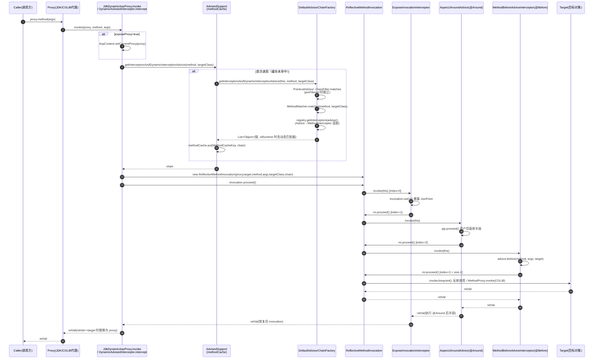
```mermaid
sequenceDiagram
    autonumber
    participant C as Caller(调用方)
    participant P as Proxy(JDK/CGLIB代理)
    participant EH as JdkDynamicAopProxy.invoke<br/>/ DynamicAdvisedInterceptor.intercept
    participant AS as AdvisedSupport<br/>(methodCache)
    participant CF as DefaultAdvisorChainFactory
    participant MI as ReflectiveMethodInvocation
    participant I1 as ExposeInvocationInterceptor
    participant I2 as AspectJAroundAdvice(@Around)
    participant I3 as MethodBeforeAdviceInterceptor(@Before)
    participant T as Target(目标对象)

    C->>P: proxy.method(args)
    P->>EH: invoke(proxy, method, args)
    alt exposeProxy=true
        EH->>EH: AopContext.setCurrentProxy(proxy)
    end
    EH->>AS: getInterceptorsAndDynamicInterceptionAdvice(method, targetClass)
    alt 首次调用（缓存未命中）
        AS->>CF: getInterceptorsAndDynamicInterceptionAdvice(this, method, targetClass)
        CF->>CF: PointcutAdvisor: ClassFilter.matches<br/>(preFiltered 时跳过)
        CF->>CF: MethodMatcher.matches(method, targetClass)
        CF->>CF: registry.getInterceptors(advisor)<br/>(Advice→MethodInterceptor 适配)
        CF-->>AS: List<Object>(链, isRuntime 时含动态匹配器)
        AS->>AS: methodCache.put(MethodCacheKey, chain)
    end
    AS-->>EH: chain
    EH->>MI: new ReflectiveMethodInvocation(proxy,target,method,args,targetClass,chain)
    EH->>MI: invocation.proceed()
    MI->>I1: invoke(this)  [index=0]
    I1->>I1: invocation.set(mi) 暴露 JoinPoint
    I1->>MI: mi.proceed()  [index=1]
    MI->>I2: invoke(this)
    I2->>I2: pjp.proceed() 用户切面前半段
    I2->>MI: mi.proceed()  [index=2]
    MI->>I3: invoke(this)
    I3->>I3: advice.before(method, args, target)
    I3->>MI: mi.proceed()  [index=3 = size-1]
    MI->>T: invokeJoinpoint(): 反射调用 / MethodProxy.invoke(CGLIB)
    T-->>MI: retVal
    MI-->>I3: retVal
    I3-->>I2: retVal
    I2-->>I1: retVal(执行 @Around 后半段)
    I1-->>EH: retVal(恢复旧 invocation)
    EH-->>P: retVal(retVal==target 时替换为 proxy)
    P-->>C: retVal
```

---

## 5.5 Spring AOP 自调用失效的源码解释（AopContext.currentProxy）

**现象**：

```java
@Service
public class OrderService {
    @Transactional
    public void a() { ... }
    public void b() { this.a(); }   // a() 的事务不生效！
}
```

**根因**：代理拦截的是 `proxy.a()`；`b()` 内部的 `this.a()` 是**原始对象上的普通 Java 方法调用**，根本不经过代理（JDK 代理是接口转发层，CGLIB 代理是子类，`this` 都指向被包裹的原始实例）。源码层面的证据链：

1. 目标方法是通过 `AopUtils.invokeJoinpointUsingReflection(this.target, ...)`（`ReflectiveMethodInvocation.java:197-199`）或 `this.methodProxy.invoke(this.target, ...)`（`CglibAopProxy.java:792`）**直接作用在 target 上**——此后目标内部的任何 `this.xxx()` 调用都与代理无关；
2. 拦截器链只在**进入代理方法**时构建（`JdkDynamicAopProxy.java:225` / `CglibAopProxy.java:693`），目标对象内部的调用不会触发这段逻辑。

**官方解法：exposeProxy + AopContext.currentProxy()**

开启 `@EnableAspectJAutoProxy(exposeProxy = true)`（XML 为 `<aop:aspectj-autoproxy expose-proxy="true"/>`）后，代理每次拦截都会把自身放进 ThreadLocal（`JdkDynamicAopProxy.java:213-217`），目标代码改为：

```java
public void b() {
    ((OrderService) AopContext.currentProxy()).a();   // 经代理调用 → 事务/切面生效
}
```

注意三个限制（均由源码可见）：

- `AopContext.currentProxy()` 要求**同线程**调用（`AopContext.java:66-74` 的异常信息明确指出），异步/线程池场景失效；
- `exposeProxy` 默认关闭，存在轻微开销（每次拦截两次 ThreadLocal 操作 + finally 恢复）；
- 更工程化的替代方案：自注入（`@Autowired private OrderService self;`）、拆分类、`AopContext`、或改用 AspectJ 编织模式（`@EnableTransactionManagement(mode = AdviceMode.ASPECTJ)` 的 Javadoc 145-149 行明确指出 proxy 模式"local calls cannot get intercepted"）。

---


# 第六章 Spring 声明式事务实现原理


Spring 声明式事务本质上是 **"一个特殊的 Advisor + 一个特殊的 Pointcut + 一个特殊的 MethodInterceptor" 跑在第一部分所述的同一套 AOP 代理引擎上**。理解了 AOP，事务就只剩下三件事：切点如何识别 `@Transactional`、拦截器如何驱动事务管理器、以及 Connection 如何与线程绑定。

## 6.1 开启方式

### 6.1.1 @EnableTransactionManagement → TransactionManagementConfigurationSelector

```java
// spring-tx/src/main/java/org/springframework/transaction/annotation/EnableTransactionManagement.java:159-196
@Target(ElementType.TYPE)
@Retention(RetentionPolicy.RUNTIME)
@Documented
@Import(TransactionManagementConfigurationSelector.class)
public @interface EnableTransactionManagement {
	boolean proxyTargetClass() default false;                 // CGLIB
	AdviceMode mode() default AdviceMode.PROXY;               // PROXY / ASPECTJ
	int order() default Ordered.LOWEST_PRECEDENCE;            // 事务 Advisor 的顺序（默认最低优先级=最内层）
}
```

```java
// spring-tx/src/main/java/org/springframework/transaction/annotation/TransactionManagementConfigurationSelector.java:46-57
@Override
protected String[] selectImports(AdviceMode adviceMode) {
	switch (adviceMode) {
		case PROXY:
			return new String[] {AutoProxyRegistrar.class.getName(),          // ① 注册自动代理创建器
					ProxyTransactionManagementConfiguration.class.getName()}; // ② 注册三个基础设施 bean
		case ASPECTJ:
			return new String[] {determineTransactionAspectClass()};          // AspectJ 织入模式
		default:
			return null;
	}
}
```

**① AutoProxyRegistrar**（`spring-context/.../annotation/AutoProxyRegistrar.java:73`）调用 `AopConfigUtils.registerAutoProxyCreatorIfNecessary(registry)`，注册的是优先级最低的 **`InfrastructureAdvisorAutoProxyCreator`**（bean 名同为 `internalAutoProxyCreator`；若容器随后又开启 `@EnableAspectJAutoProxy`，会被升级为 `AnnotationAwareAspectJAutoProxyCreator`——见 5.2.2 的优先级升级机制，功能向后兼容）。

**② ProxyTransactionManagementConfiguration** 注册三个 `ROLE_INFRASTRUCTURE` bean：

```java
// spring-tx/src/main/java/org/springframework/transaction/annotation/ProxyTransactionManagementConfiguration.java:42-71
@Configuration(proxyBeanMethods = false)
@Role(BeanDefinition.ROLE_INFRASTRUCTURE)
public class ProxyTransactionManagementConfiguration extends AbstractTransactionManagementConfiguration {

	@Bean(name = TransactionManagementConfigUtils.TRANSACTION_ADVISOR_BEAN_NAME)   // "org.springframework.transaction.config.internalTransactionAdvisor"
	@Role(BeanDefinition.ROLE_INFRASTRUCTURE)
	public BeanFactoryTransactionAttributeSourceAdvisor transactionAdvisor(
			TransactionAttributeSource transactionAttributeSource, TransactionInterceptor transactionInterceptor) {
		BeanFactoryTransactionAttributeSourceAdvisor advisor = new BeanFactoryTransactionAttributeSourceAdvisor();
		advisor.setTransactionAttributeSource(transactionAttributeSource);   // 切点：@Transactional 匹配
		advisor.setAdvice(transactionInterceptor);                           // 增强：事务拦截器
		if (this.enableTx != null) {
			advisor.setOrder(this.enableTx.<Integer>getNumber("order"));     // order 属性 → Advisor 顺序
		}
		return advisor;
	}

	@Bean
	@Role(BeanDefinition.ROLE_INFRASTRUCTURE)
	public TransactionAttributeSource transactionAttributeSource() {
		return new AnnotationTransactionAttributeSource();
	}

	@Bean
	@Role(BeanDefinition.ROLE_INFRASTRUCTURE)
	public TransactionInterceptor transactionInterceptor(TransactionAttributeSource transactionAttributeSource) {
		TransactionInterceptor interceptor = new TransactionInterceptor();
		interceptor.setTransactionAttributeSource(transactionAttributeSource);
		if (this.txManager != null) {   // TransactionManagementConfigurer 指定的 tm
			interceptor.setTransactionManager(this.txManager);
		}
		return interceptor;
	}
}
```

### 6.1.2 tx 命名空间与 spring.factories 的真相

**`spring-tx` 模块没有 `spring.factories`**——其 `META-INF` 目录下只有 `spring.handlers`、`spring.schemas`、`spring.tooling`：

```properties
# spring-tx/src/main/resources/META-INF/spring.handlers
http\://www.springframework.org/schema/tx=org.springframework.transaction.config.TxNamespaceHandler
```

即 XML 方式走的是 **namespace handler** 机制而非 SPI：

```java
// spring-tx/src/main/java/org/springframework/transaction/config/TxNamespaceHandler.java:54-58
@Override
public void init() {
	registerBeanDefinitionParser("advice", new TxAdviceBeanDefinitionParser());
	registerBeanDefinitionParser("annotation-driven", new AnnotationDrivenBeanDefinitionParser());
	registerBeanDefinitionParser("jta-transaction-manager", new JtaTransactionManagerBeanDefinitionParser());
}
```

`<tx:annotation-driven/>` → `AnnotationDrivenBeanDefinitionParser` → `AopAutoProxyConfigurer.configureAutoProxyCreator(...)`，注册**完全等价**的三件套（且全部 `setRole(ROLE_INFRASTRUCTURE)`）：

```java
// spring-tx/src/main/java/org/springframework/transaction/config/AnnotationDrivenBeanDefinitionParser.java:121-152（节选）
public static void configureAutoProxyCreator(Element element, ParserContext parserContext) {
	AopNamespaceUtils.registerAutoProxyCreatorIfNecessary(parserContext, element);   // InfrastructureAdvisorAutoProxyCreator

	String txAdvisorBeanName = TransactionManagementConfigUtils.TRANSACTION_ADVISOR_BEAN_NAME;
	if (!parserContext.getRegistry().containsBeanDefinition(txAdvisorBeanName)) {
		// Create the TransactionAttributeSource definition.
		RootBeanDefinition sourceDef = new RootBeanDefinition(
				"org.springframework.transaction.annotation.AnnotationTransactionAttributeSource");
		sourceDef.setRole(BeanDefinition.ROLE_INFRASTRUCTURE);
		// Create the TransactionInterceptor definition.
		RootBeanDefinition interceptorDef = new RootBeanDefinition(TransactionInterceptor.class);
		interceptorDef.setRole(BeanDefinition.ROLE_INFRASTRUCTURE);
		interceptorDef.getPropertyValues().add("transactionAttributeSource", new RuntimeBeanReference(sourceName));
		// Create the TransactionAttributeSourceAdvisor definition.
		RootBeanDefinition advisorDef = new RootBeanDefinition(BeanFactoryTransactionAttributeSourceAdvisor.class);
		advisorDef.setRole(BeanDefinition.ROLE_INFRASTRUCTURE);
		advisorDef.getPropertyValues().add("transactionAttributeSource", new RuntimeBeanReference(sourceName));
		advisorDef.getPropertyValues().add("adviceBeanName", interceptorName);
		...
		parserContext.getRegistry().registerBeanDefinition(txAdvisorBeanName, advisorDef);
	}
}
```

> Spring Boot 场景下则是 `spring-boot-autoconfigure` 的 `TransactionAutoConfiguration`（经由其 spring.factories 装配）等价完成上述注册。**结论：三种入口（注解/XML/Boot）殊途同归——一个 infra APC + 一个事务 Advisor。**

## 6.2 InfrastructureAdvisorAutoProxyCreator 与事务属性解析体系

### 6.2.1 为什么是 InfrastructureAdvisorAutoProxyCreator

```java
// spring-aop/src/main/java/org/springframework/aop/framework/autoproxy/InfrastructureAdvisorAutoProxyCreator.java:43-47
@Override
protected boolean isEligibleAdvisorBean(String beanName) {
	return (this.beanFactory != null && this.beanFactory.containsBeanDefinition(beanName) &&
			this.beanFactory.getBeanDefinition(beanName).getRole() == BeanDefinition.ROLE_INFRASTRUCTURE);
}
```

它继承 `AbstractAdvisorAutoProxyCreator`，唯一差别是 `findCandidateAdvisors` 时**只采纳 `ROLE_INFRASTRUCTURE` 的 Advisor bean**——即用户自定义的普通 Advisor 不会被事务开关误伤（隔离性）。容器中同时存在 `@EnableAspectJAutoProxy` 时会被升级为 `AnnotationAwareAspectJAutoProxyCreator`（它对 Advisor 的筛选是全量的），行为依然正确。

### 6.2.2 事务 Advisor 的切点：TransactionAttributeSourcePointcut

```java
// spring-tx/src/main/java/org/springframework/transaction/interceptor/BeanFactoryTransactionAttributeSourceAdvisor.java:35-70（节选）
public class BeanFactoryTransactionAttributeSourceAdvisor extends AbstractBeanFactoryPointcutAdvisor {
	@Nullable
	private TransactionAttributeSource transactionAttributeSource;

	private final TransactionAttributeSourcePointcut pointcut = new TransactionAttributeSourcePointcut() {
		@Override
		@Nullable
		protected TransactionAttributeSource getTransactionAttributeSource() {
			return transactionAttributeSource;
		}
	};
	...
	@Override
	public Pointcut getPointcut() {
		return this.pointcut;
	}
}
```

继承 `AbstractBeanFactoryPointcutAdvisor` 意味着 advice（`TransactionInterceptor`）通过 **bean 名懒查找**，避免 APC 创建期就初始化拦截器造成循环依赖。切点本体：

```java
// spring-tx/src/main/java/org/springframework/transaction/interceptor/TransactionAttributeSourcePointcut.java:44-48
@Override
public boolean matches(Method method, Class<?> targetClass) {
	TransactionAttributeSource tas = getTransactionAttributeSource();
	return (tas == null || tas.getTransactionAttribute(method, targetClass) != null);
}
```

```java
// spring-tx/src/main/java/org/springframework/transaction/interceptor/TransactionAttributeSourcePointcut.java:85-97
private class TransactionAttributeSourceClassFilter implements ClassFilter {
	@Override
	public boolean matches(Class<?> clazz) {
		if (TransactionalProxy.class.isAssignableFrom(clazz) ||
				TransactionManager.class.isAssignableFrom(clazz) ||
				PersistenceExceptionTranslator.class.isAssignableFrom(clazz)) {
			return false;               // 事务代理/事务管理器/异常翻译器自身免检
		}
		TransactionAttributeSource tas = getTransactionAttributeSource();
		return (tas == null || tas.isCandidateClass(clazz));
	}
}
```

**要点：事务的 Pointcut 匹配 = "该方法能否解析出 TransactionAttribute"**，`@Transactional` 注解本身既是切点又是元数据来源。

### 6.2.3 AnnotationTransactionAttributeSource：注解解析的入口

```java
// spring-tx/src/main/java/org/springframework/transaction/annotation/AnnotationTransactionAttributeSource.java:63-107（节选）
static {
	ClassLoader classLoader = AnnotationTransactionAttributeSource.class.getClassLoader();
	jta12Present = ClassUtils.isPresent("javax.transaction.Transactional", classLoader);  // JTA 1.2 注解
	ejb3Present = ClassUtils.isPresent("javax.ejb.TransactionAttribute", classLoader);    // EJB3 注解
}

public AnnotationTransactionAttributeSource(boolean publicMethodsOnly) {
	this.publicMethodsOnly = publicMethodsOnly;
	if (jta12Present || ejb3Present) {
		this.annotationParsers = new LinkedHashSet<>(4);
		this.annotationParsers.add(new SpringTransactionAnnotationParser());
		if (jta12Present) {
			this.annotationParsers.add(new JtaTransactionAnnotationParser());   // javax.transaction.Transactional
		}
		if (ejb3Present) {
			this.annotationParsers.add(new Ejb3TransactionAnnotationParser()); // javax.ejb.TransactionAttribute
		}
	}
	else {
		this.annotationParsers = Collections.singleton(new SpringTransactionAnnotationParser());
	}
}
```

默认构造 `this(true)`——**只支持 public 方法**（`AnnotationTransactionAttributeSource.java:79-81`），这是 `@Transactional` 非 public 失效的直接开关（见 6.3.6）。类级预筛与解析委托：

```java
// spring-tx/src/main/java/org/springframework/transaction/annotation/AnnotationTransactionAttributeSource.java:140-181（节选）
@Override
public boolean isCandidateClass(Class<?> targetClass) {
	for (TransactionAnnotationParser parser : this.annotationParsers) {
		if (parser.isCandidateClass(targetClass)) {   // AnnotationUtils.isCandidateClass 快速排除
			return true;
		}
	}
	return false;
}

@Nullable
protected TransactionAttribute determineTransactionAttribute(AnnotatedElement element) {
	for (TransactionAnnotationParser parser : this.annotationParsers) {
		TransactionAttribute attr = parser.parseTransactionAnnotation(element);
		if (attr != null) {
			return attr;    // 第一个解析成功的注解生效（Spring 优先于 JTA/EJB）
		}
	}
	return null;
}
```

### 6.2.4 SpringTransactionAnnotationParser：@Transactional 属性解析源码

```java
// spring-tx/src/main/java/org/springframework/transaction/annotation/SpringTransactionAnnotationParser.java:68-102
protected TransactionAttribute parseTransactionAnnotation(AnnotationAttributes attributes) {
	RuleBasedTransactionAttribute rbta = new RuleBasedTransactionAttribute();

	Propagation propagation = attributes.getEnum("propagation");       // 传播行为 → int 常量
	rbta.setPropagationBehavior(propagation.value());
	Isolation isolation = attributes.getEnum("isolation");             // 隔离级别 → int 常量
	rbta.setIsolationLevel(isolation.value());

	rbta.setTimeout(attributes.getNumber("timeout").intValue());
	String timeoutString = attributes.getString("timeoutString");
	Assert.isTrue(!StringUtils.hasText(timeoutString) || rbta.getTimeout() < 0,
			"Specify 'timeout' or 'timeoutString', not both");
	rbta.setTimeoutString(timeoutString);                              // 支持占位符的超时表达式

	rbta.setReadOnly(attributes.getBoolean("readOnly"));
	rbta.setQualifier(attributes.getString("value"));                  // qualifier → 定位事务管理器
	rbta.setLabels(Arrays.asList(attributes.getStringArray("label")));

	List<RollbackRuleAttribute> rollbackRules = new ArrayList<>();
	for (Class<?> rbRule : attributes.getClassArray("rollbackFor")) {
		rollbackRules.add(new RollbackRuleAttribute(rbRule));          // 回滚规则
	}
	for (String rbRule : attributes.getStringArray("rollbackForClassName")) {
		rollbackRules.add(new RollbackRuleAttribute(rbRule));
	}
	for (Class<?> rbRule : attributes.getClassArray("noRollbackFor")) {
		rollbackRules.add(new NoRollbackRuleAttribute(rbRule));        // 不回滚规则
	}
	for (String rbRule : attributes.getStringArray("noRollbackForClassName")) {
		rollbackRules.add(new NoRollbackRuleAttribute(rbRule));
	}
	rbta.setRollbackRules(rollbackRules);

	return rbta;
}
```

注解解析使用了 `AnnotatedElementUtils.findMergedAnnotationAttributes(...)`（53-62 行），因此**支持注解继承与元注解组合**（自定义组合注解标注 `@Transactional` 也能被识别）。EJB 支持方面：`Ejb3TransactionAnnotationParser` 把 `javax.ejb.TransactionAttribute` 的 `REQUIRED/REQUIRES_NEW/MANDATORY/NEVER/NOT_SUPPORTED/SUPPORTS` 映射为 Spring 的传播常量，并遵循 EJB 语义——**系统异常（如 `RemoteException`）回滚、应用异常提交**；`JtaTransactionAnnotationParser` 同理解析 `javax.transaction.Transactional`（其 `rollbackOn`/`dontRollbackOn` 属性直接转成回滚规则）。

### 6.2.5 AbstractFallbackTransactionAttributeSource：回退查找与缓存

```java
// spring-tx/src/main/java/org/springframework/transaction/interceptor/AbstractFallbackTransactionAttributeSource.java:102-143（节选）
@Override
@Nullable
public TransactionAttribute getTransactionAttribute(Method method, @Nullable Class<?> targetClass) {
	if (method.getDeclaringClass() == Object.class) {
		return null;
	}
	// First, see if we have a cached value.
	Object cacheKey = getCacheKey(method, targetClass);
	TransactionAttribute cached = this.attributeCache.get(cacheKey);
	if (cached != null) {
		if (cached == NULL_TRANSACTION_ATTRIBUTE) {   // 哨兵值：缓存"无事务属性"
			return null;
		}
		else {
			return cached;
		}
	}
	else {
		TransactionAttribute txAttr = computeTransactionAttribute(method, targetClass);
		if (txAttr == null) {
			this.attributeCache.put(cacheKey, NULL_TRANSACTION_ATTRIBUTE);
		}
		else {
			...
			this.attributeCache.put(cacheKey, txAttr);
		}
		return txAttr;
	}
}
```

```java
// spring-tx/src/main/java/org/springframework/transaction/interceptor/AbstractFallbackTransactionAttributeSource.java:165-201
@Nullable
protected TransactionAttribute computeTransactionAttribute(Method method, @Nullable Class<?> targetClass) {
	// Don't allow non-public methods, as configured.
	if (allowPublicMethodsOnly() && !Modifier.isPublic(method.getModifiers())) {
		return null;                                   // ★ 非 public 方法直接判"无事务"
	}

	// The method may be on an interface, but we need attributes from the target class.
	Method specificMethod = AopUtils.getMostSpecificMethod(method, targetClass);

	// First try is the method in the target class.          ① 目标类方法上的注解
	TransactionAttribute txAttr = findTransactionAttribute(specificMethod);
	if (txAttr != null) {
		return txAttr;
	}

	// Second try is the transaction attribute on the target class. ② 目标类上的注解
	txAttr = findTransactionAttribute(specificMethod.getDeclaringClass());
	if (txAttr != null && ClassUtils.isUserLevelMethod(method)) {
		return txAttr;
	}

	if (specificMethod != method) {                     // 接口方法 → 回退到接口上的注解
		txAttr = findTransactionAttribute(method);      // ③ 接口方法上的注解
		if (txAttr != null) {
			return txAttr;
		}
		txAttr = findTransactionAttribute(method.getDeclaringClass());  // ④ 接口上的注解
		if (txAttr != null && ClassUtils.isUserLevelMethod(method)) {
			return txAttr;
		}
	}
	return null;
}
```

查找优先级：**实现类方法 → 实现类 → 接口方法 → 接口**（与 AOP 切点匹配的方向相反，注意注解事务的"就近原则"）。

## 6.3 TransactionInterceptor → invokeWithinTransaction 完整源码解析

### 6.3.1 入口：TransactionInterceptor.invoke

```java
// spring-tx/src/main/java/org/springframework/transaction/interceptor/TransactionInterceptor.java:110-134
@Override
@Nullable
public Object invoke(MethodInvocation invocation) throws Throwable {
	// Work out the target class: may be {@code null}.
	// The TransactionAttributeSource should be passed the target class
	// as well as the method, which may be from an interface.
	Class<?> targetClass = (invocation.getThis() != null ? AopUtils.getTargetClass(invocation.getThis()) : null);

	// Adapt to TransactionAspectSupport's invokeWithinTransaction...
	return invokeWithinTransaction(invocation.getMethod(), targetClass, new CoroutinesInvocationCallback() {
		@Override
		@Nullable
		public Object proceedWithInvocation() throws Throwable {
			return invocation.proceed();     // 桥接 AOP 责任链（通常就是 invokeJoinpoint）
		}
		...
	});
}
```

### 6.3.2 invokeWithinTransaction 主流程

```java
// spring-tx/src/main/java/org/springframework/transaction/interceptor/TransactionAspectSupport.java:335-409（节选，省略响应式分支）
@Nullable
protected Object invokeWithinTransaction(Method method, @Nullable Class<?> targetClass,
		final InvocationCallback invocation) throws Throwable {

	// If the transaction attribute is null, the method is non-transactional.
	TransactionAttributeSource tas = getTransactionAttributeSource();
	final TransactionAttribute txAttr = (tas != null ? tas.getTransactionAttribute(method, targetClass) : null);
	final TransactionManager tm = determineTransactionManager(txAttr);      // qualifier / 默认 tm

	PlatformTransactionManager ptm = asPlatformTransactionManager(tm);
	final String joinpointIdentification = methodIdentification(method, targetClass, txAttr);

	if (txAttr == null || !(ptm instanceof CallbackPreferringPlatformTransactionManager)) {
		// Standard transaction demarcation with getTransaction and commit/rollback calls.
		TransactionInfo txInfo = createTransactionIfNecessary(ptm, txAttr, joinpointIdentification);  // ① 开启事务

		Object retVal;
		try {
			// This is an around advice: Invoke the next interceptor in the chain.
			// This will normally result in a target object being invoked.
			retVal = invocation.proceedWithInvocation();                  // ② 执行业务（AOP 链继续推进）
		}
		catch (Throwable ex) {
			// target invocation exception
			completeTransactionAfterThrowing(txInfo, ex);                 // ③ 异常 → 回滚或提交
			throw ex;
		}
		finally {
			cleanupTransactionInfo(txInfo);                               // ④ 恢复 ThreadLocal 栈
		}
		...
		commitTransactionAfterReturning(txInfo);                          // ⑤ 正常返回 → 提交
		return retVal;
	}
	else {
		// CallbackPreferringPlatformTransactionManager（如某些 JTA 实现）：把回调交给 tm.execute(...)
		...
	}
}
```

`determineTransactionManager`（同文件 484-510 行）：`txAttr.getQualifier()` 非空则按 qualifier 精确查找事务管理器；否则用 `transactionManagerBeanName`；再否则按类型取容器中唯一的 `TransactionManager` bean（带 `transactionManagerCache` 缓存）。

### 6.3.3 createTransactionIfNecessary 与 TransactionInfo 的 ThreadLocal 栈

```java
// spring-tx/src/main/java/org/springframework/transaction/interceptor/TransactionAspectSupport.java:579-605
protected TransactionInfo createTransactionIfNecessary(@Nullable PlatformTransactionManager tm,
		@Nullable TransactionAttribute txAttr, final String joinpointIdentification) {

	// If no name specified, apply method identification as transaction name.
	if (txAttr != null && txAttr.getName() == null) {
		txAttr = new DelegatingTransactionAttribute(txAttr) {              // 装饰：事务名 = 方法全限定名
			@Override
			public String getName() {
				return joinpointIdentification;
			}
		};
	}

	TransactionStatus status = null;
	if (txAttr != null) {
		if (tm != null) {
			status = tm.getTransaction(txAttr);                            // ★ 进入事务管理器
		}
		else { ... }
	}
	return prepareTransactionInfo(tm, txAttr, joinpointIdentification, status);
}

protected TransactionInfo prepareTransactionInfo(..., @Nullable TransactionStatus status) {
	TransactionInfo txInfo = new TransactionInfo(tm, txAttr, joinpointIdentification);
	if (txAttr != null) {
		txInfo.newTransactionStatus(status);
	}
	// We always bind the TransactionInfo to the thread, even if we didn't create
	// a new transaction here. This guarantees that the TransactionInfo stack
	// will be managed correctly even if no transaction was created by this aspect.
	txInfo.bindToThread();     // transactionInfoHolder.set(this)，oldTransactionInfo 入栈
	return txInfo;
}
```

```java
// spring-tx/src/main/java/org/springframework/transaction/interceptor/TransactionAspectSupport.java:778-789
private void bindToThread() {
	this.oldTransactionInfo = transactionInfoHolder.get();
	transactionInfoHolder.set(this);
}
private void restoreThreadLocalStatus() {
	transactionInfoHolder.set(this.oldTransactionInfo);
}
```

嵌套 `@Transactional` 方法（同线程）通过这个 **TransactionInfo 栈**正确还原外层上下文；`TransactionAspectSupport.currentTransactionStatus()`（156-162 行）暴露当前 `TransactionStatus` 供业务代码设置 rollback-only。

### 6.3.4 PlatformTransactionManager 体系与 getTransaction 的传播行为全分支

体系结构：

```
TransactionManager (标记)
 └── PlatformTransactionManager
      ├── getTransaction(TransactionDefinition) : TransactionStatus
      ├── commit(TransactionStatus)
      └── rollback(TransactionStatus)
          ▲
AbstractPlatformTransactionManager（模板：传播行为、同步、挂起恢复、回滚规则）
          ▲
 ├── DataSourceTransactionManager   (spring-jdbc，JDBC Connection)
 ├── JtaTransactionManager          (spring-tx，JTA/UserTransaction)
 ├── HibernateTransactionManager    (spring-orm)
 ├── JpaTransactionManager          (spring-orm)
 └── ...
ReactiveTransactionManager（响应式平行体系，R2dbcTransactionManager 等）
```

`AbstractPlatformTransactionManager.getTransaction(...)` 完整分支：

```java
// spring-tx/src/main/java/org/springframework/transaction/support/AbstractPlatformTransactionManager.java:340-389
@Override
public final TransactionStatus getTransaction(@Nullable TransactionDefinition definition)
		throws TransactionException {

	// Use defaults if no transaction definition given.
	TransactionDefinition def = (definition != null ? definition : TransactionDefinition.withDefaults());

	Object transaction = doGetTransaction();                       // 模板方法：取事务对象（含 ConnectionHolder）
	boolean debugEnabled = logger.isDebugEnabled();

	if (isExistingTransaction(transaction)) {                       // 已存在事务？
		// Existing transaction found -> check propagation behavior to find out how to behave.
		return handleExistingTransaction(def, transaction, debugEnabled);
	}

	// Check definition settings for new transaction.
	if (def.getTimeout() < TransactionDefinition.TIMEOUT_DEFAULT) {
		throw new InvalidTimeoutException("Invalid transaction timeout", def.getTimeout());
	}

	// No existing transaction found -> check propagation behavior to find out how to proceed.
	if (def.getPropagationBehavior() == TransactionDefinition.PROPAGATION_MANDATORY) {
		throw new IllegalTransactionStateException(
				"No existing transaction found for transaction marked with propagation 'mandatory'");
	}
	else if (def.getPropagationBehavior() == TransactionDefinition.PROPAGATION_REQUIRED ||
			def.getPropagationBehavior() == TransactionDefinition.PROPAGATION_REQUIRES_NEW ||
			def.getPropagationBehavior() == TransactionDefinition.PROPAGATION_NESTED) {
		SuspendedResourcesHolder suspendedResources = suspend(null);   // 先挂起（可能存在的）同步器
		if (debugEnabled) {
			logger.debug("Creating new transaction with name [" + def.getName() + "]: " + def);
		}
		try {
			return startTransaction(def, transaction, debugEnabled, suspendedResources); // 新事务
		}
		catch (RuntimeException | Error ex) {
			resume(null, suspendedResources);                          // 开启失败 → 恢复
			throw ex;
		}
	}
	else {
		// Create "empty" transaction: no actual transaction, but potentially synchronization.
		if (def.getIsolationLevel() != TransactionDefinition.ISOLATION_DEFAULT && logger.isWarnEnabled()) {
			logger.warn("Custom isolation level specified but no actual transaction initiated; " +
					"isolation level will effectively be ignored: " + def);
		}
		boolean newSynchronization = (getTransactionSynchronization() == SYNCHRONIZATION_ALWAYS);
		return prepareTransactionStatus(def, null, true, newSynchronization, debugEnabled, null); // SUPPORTS/NOT_SUPPORTED/NEVER
	}
}
```

**已存在事务时的分支**（`handleExistingTransaction`，408-494 行）：

```java
// spring-tx/src/main/java/org/springframework/transaction/support/AbstractPlatformTransactionManager.java:412-493（节选）
if (definition.getPropagationBehavior() == TransactionDefinition.PROPAGATION_NEVER) {
	throw new IllegalTransactionStateException(
			"Existing transaction found for transaction marked with propagation 'never'");   // NEVER：报错
}

if (definition.getPropagationBehavior() == TransactionDefinition.PROPAGATION_NOT_SUPPORTED) {
	Object suspendedResources = suspend(transaction);                    // NOT_SUPPORTED：挂起，非事务执行
	boolean newSynchronization = (getTransactionSynchronization() == SYNCHRONIZATION_ALWAYS);
	return prepareTransactionStatus(
			definition, null, false, newSynchronization, debugEnabled, suspendedResources);
}

if (definition.getPropagationBehavior() == TransactionDefinition.PROPAGATION_REQUIRES_NEW) {
	SuspendedResourcesHolder suspendedResources = suspend(transaction);  // REQUIRES_NEW：挂起旧事务
	try {
		return startTransaction(definition, transaction, debugEnabled, suspendedResources); // 开启全新事务
	}
	catch (RuntimeException | Error beginEx) {
		resumeAfterBeginException(transaction, suspendedResources, beginEx);
		throw beginEx;
	}
}

if (definition.getPropagationBehavior() == TransactionDefinition.PROPAGATION_NESTED) {
	if (!isNestedTransactionAllowed()) {
		// 基类默认 false，但 DataSourceTransactionManager 构造器（第 136 行 setNestedTransactionAllowed(true)）已开启
		throw new NestedTransactionNotSupportedException(...);
	}
	if (useSavepointForNestedTransaction()) {                            // DataSourceTM: true → savepoint 方案
		// Create savepoint within existing Spring-managed transaction,
		// through the SavepointManager API implemented by TransactionStatus.
		// Usually uses JDBC savepoints. Never activates Spring synchronization.
		DefaultTransactionStatus status =
				prepareTransactionStatus(definition, transaction, false, false, debugEnabled, null);
		status.createAndHoldSavepoint();                                 // ★ JDBC savepoint
		return status;
	}
	else {                                                                // JTA：嵌套 begin
		return startTransaction(definition, transaction, debugEnabled, null);
	}
}

// PROPAGATION_REQUIRED, PROPAGATION_SUPPORTS, PROPAGATION_MANDATORY:
// regular participation in existing transaction.
if (isValidateExistingTransaction()) { ...校验隔离级别/只读一致性，可抛 IllegalTransactionStateException... }
boolean newSynchronization = (getTransactionSynchronization() != SYNCHRONIZATION_NEVER);
return prepareTransactionStatus(definition, transaction, false, newSynchronization, debugEnabled, null);
```

**分支总表**：

| 传播行为 | 无现存事务 | 有现存事务 |
|---|---|---|
| REQUIRED | 新建事务 | **加入**（participate，共用 Connection/状态） |
| SUPPORTS | 空事务（`newTransaction=true` 但 transaction=null；仅 `SYNCHRONIZATION_ALWAYS` 时开同步） | 加入 |
| MANDATORY | `IllegalTransactionStateException` | 加入 |
| REQUIRES_NEW | 新建事务 | **挂起**旧事务（unbind Connection + 暂存同步器），新事务独立提交/回滚，完成后 resume |
| NOT_SUPPORTED | 空事务 | 挂起，以非事务方式执行 |
| NEVER | 空事务 | `IllegalTransactionStateException` |
| NESTED | 新建事务（与 REQUIRED 相同） | 在当前事务内 **savepoint**（`useSavepointForNestedTransaction()==true` 时）；回滚只回到 savepoint，外层可继续提交 |

新事务的启动三步（`startTransaction`，394-403 行）：

```java
private TransactionStatus startTransaction(TransactionDefinition definition, Object transaction,
		boolean debugEnabled, @Nullable SuspendedResourcesHolder suspendedResources) {
	boolean newSynchronization = (getTransactionSynchronization() != SYNCHRONIZATION_NEVER);
	DefaultTransactionStatus status = newTransactionStatus(
			definition, transaction, true, newSynchronization, debugEnabled, suspendedResources);
	doBegin(transaction, definition);            // 模板方法：真正开启（DataSource 版见 6.3.5）
	prepareSynchronization(status, definition);  // 初始化 TransactionSynchronizationManager 各 ThreadLocal
	return status;
}
```

挂起与恢复（569-632 行）——**事务挂起的本质是"把 ThreadLocal 上的资源与上下文整体卸下来存进 holder"**：

```java
// spring-tx/src/main/java/org/springframework/transaction/support/AbstractPlatformTransactionManager.java:569-603（节选）
protected final SuspendedResourcesHolder suspend(@Nullable Object transaction) throws TransactionException {
	if (TransactionSynchronizationManager.isSynchronizationActive()) {
		List<TransactionSynchronization> suspendedSynchronizations = doSuspendSynchronization(); // 逐个 suspend() + 清空
		try {
			Object suspendedResources = null;
			if (transaction != null) {
				suspendedResources = doSuspend(transaction);     // DataSource：unbindResource(dataSource)
			}
			String name = TransactionSynchronizationManager.getCurrentTransactionName();
			TransactionSynchronizationManager.setCurrentTransactionName(null);
			... // readOnly / isolationLevel / wasActive 逐一摘下保存
			return new SuspendedResourcesHolder(
					suspendedResources, suspendedSynchronizations, name, readOnly, isolationLevel, wasActive);
		}
		catch (RuntimeException | Error ex) {
			doResumeSynchronization(suspendedSynchronizations);   // 失败回滚挂起动作
			throw ex;
		}
	}
	else if (transaction != null) {
		Object suspendedResources = doSuspend(transaction);
		return new SuspendedResourcesHolder(suspendedResources);
	}
	else {
		return null;   // 既无事务也无同步
	}
}
```

### 6.3.5 DataSourceTransactionManager.doBegin：Connection 与线程的绑定

```java
// spring-jdbc/src/main/java/org/springframework/jdbc/datasource/DataSourceTransactionManager.java:246-259
@Override
protected Object doGetTransaction() {
	DataSourceTransactionObject txObject = new DataSourceTransactionObject();
	txObject.setSavepointAllowed(isNestedTransactionAllowed());
	ConnectionHolder conHolder =
			(ConnectionHolder) TransactionSynchronizationManager.getResource(obtainDataSource());  // 从 ThreadLocal 取
	txObject.setConnectionHolder(conHolder, false);
	return txObject;
}

@Override
protected boolean isExistingTransaction(Object transaction) {
	DataSourceTransactionObject txObject = (DataSourceTransactionObject) transaction;
	return (txObject.hasConnectionHolder() && txObject.getConnectionHolder().isTransactionActive());
}
```

**`isExistingTransaction` 的判断依据正是"ThreadLocal 上是否已绑定了活跃的 ConnectionHolder"**——这就是传播行为感知"外层事务"的机制。

```java
// spring-jdbc/src/main/java/org/springframework/jdbc/datasource/DataSourceTransactionManager.java:262-315
@Override
protected void doBegin(Object transaction, TransactionDefinition definition) {
	DataSourceTransactionObject txObject = (DataSourceTransactionObject) transaction;
	Connection con = null;

	try {
		if (!txObject.hasConnectionHolder() ||
				txObject.getConnectionHolder().isSynchronizedWithTransaction()) {
			Connection newCon = obtainDataSource().getConnection();      // ① 从池里拿新连接
			txObject.setConnectionHolder(new ConnectionHolder(newCon), true);
		}

		txObject.getConnectionHolder().setSynchronizedWithTransaction(true);
		con = txObject.getConnectionHolder().getConnection();

		Integer previousIsolationLevel = DataSourceUtils.prepareConnectionForTransaction(con, definition); // ② 隔离级别/只读
		txObject.setPreviousIsolationLevel(previousIsolationLevel);
		txObject.setReadOnly(definition.isReadOnly());

		// Switch to manual commit if necessary. This is very expensive in some JDBC drivers,
		// so we don't want to do it unnecessarily (for example if we've explicitly
		// configured the connection pool to set it already).
		if (con.getAutoCommit()) {
			txObject.setMustRestoreAutoCommit(true);
			con.setAutoCommit(false);                                    // ③ 关闭自动提交 = 事务真正开始
		}

		prepareTransactionalConnection(con, definition);                 // ④ 可选：SET TRANSACTION READ ONLY
		txObject.getConnectionHolder().setTransactionActive(true);       // ⑤ 标记活跃（供 isExistingTransaction 判断）

		int timeout = determineTimeout(definition);
		if (timeout != TransactionDefinition.TIMEOUT_DEFAULT) {
			txObject.getConnectionHolder().setTimeoutInSeconds(timeout); // ⑥ Deadline
		}

		// Bind the connection holder to the thread.
		if (txObject.isNewConnectionHolder()) {
			TransactionSynchronizationManager.bindResource(obtainDataSource(), txObject.getConnectionHolder()); // ⑦ 绑定线程
		}
	}
	catch (Throwable ex) { ...释放连接，抛 CannotCreateTransactionException... }
}
```

`DataSourceUtils.prepareConnectionForTransaction`（`spring-jdbc/.../datasource/DataSourceUtils.java:178` 起）落实隔离级别与只读：

```java
// 只读：con.setReadOnly(true)（仅是 hint；失败仅 debug 日志，超时类异常除外）
// 隔离级别：con.getTransactionIsolation() 记录旧值 → con.setTransactionIsolation(definition.getIsolationLevel())
// 返回 previousIsolationLevel 供 doCleanupAfterCompletion 恢复
```

`prepareTransactionalConnection`（`DataSourceTransactionManager.java:416-424`）在 `enforceReadOnly=true` 时执行真正的 `SET TRANSACTION READ ONLY`（Oracle/MySQL/Postgres 语义）。

**事务与线程绑定的原理——TransactionSynchronizationManager 的 ThreadLocal 矩阵**：

```java
// spring-tx/src/main/java/org/springframework/transaction/support/TransactionSynchronizationManager.java:76-92
private static final ThreadLocal<Map<Object, Object>> resources =
		new NamedThreadLocal<>("Transactional resources");        // key=DataSource, value=ConnectionHolder

private static final ThreadLocal<Set<TransactionSynchronization>> synchronizations =
		new NamedThreadLocal<>("Transaction synchronizations");

private static final ThreadLocal<String> currentTransactionName = ...;
private static final ThreadLocal<Boolean> currentTransactionReadOnly = ...;
private static final ThreadLocal<Integer> currentTransactionIsolationLevel = ...;
private static final ThreadLocal<Boolean> actualTransactionActive = ...;
```

```java
// spring-tx/src/main/java/org/springframework/transaction/support/TransactionSynchronizationManager.java:167-185
public static void bindResource(Object key, Object value) throws IllegalStateException {
	Object actualKey = TransactionSynchronizationUtils.unwrapResourceIfNecessary(key);
	Assert.notNull(value, "Value must not be null");
	Map<Object, Object> map = resources.get();
	// set ThreadLocal Map if none found
	if (map == null) {
		map = new HashMap<>();
		resources.set(map);
	}
	Object oldValue = map.put(actualKey, value);   // key 通常就是 DataSource 实例
	...
	if (oldValue != null) {
		throw new IllegalStateException("Already value [" + oldValue + "] for key [" + actualKey + "] bound to thread");
	}
}
```

**因此同一事务内的一切数据访问都能拿到同一个 Connection**：`DataSourceUtils.getConnection(dataSource)`（MyBatis `SpringManagedTransaction`、`JdbcTemplate` 均经此）先查 `TransactionSynchronizationManager.getResource(dataSource)`，命中则复用绑定连接。这也解释了两条铁律：

- **跨线程事务失效**：ThreadLocal 不随线程传递；
- **事务方法内换 DataSource/换 `SqlSessionFactory`** 会导致不同的 key，各自独立。

提交与回滚（`DataSourceTransactionManager.java:330-357`）：

```java
@Override
protected void doCommit(DefaultTransactionStatus status) {
	DataSourceTransactionObject txObject = (DataSourceTransactionObject) status.getTransaction();
	Connection con = txObject.getConnectionHolder().getConnection();
	...
	con.commit();          // JDBC commit
}

@Override
protected void doRollback(DefaultTransactionStatus status) {
	...
	con.rollback();        // JDBC rollback
}
```

`AbstractPlatformTransactionManager.commit/rollback`（689-713 / 803-811 行）的模板逻辑：

- `commit`：`isLocalRollbackOnly()`（本栈帧 rollback-only）→ 回滚；`isGlobalRollbackOnly()` 且 `!shouldCommitOnGlobalRollbackOnly()` → **回滚并抛 `UnexpectedRollbackException`**；否则 `processCommit`（beforeCommit → doCommit → afterCommit → afterCompletion → cleanup）；
- `rollback`：savepoint → `rollbackToHeldSavepoint()`；新事务 → `doRollback`；**参与事务 → `doSetRollbackOnly()` 只打标记**（DataSource 版：`txObject.setRollbackOnly()` → `connectionHolder.setRollbackOnly()`），由最外层统一回滚——这是经典的 **"Transaction silently rolled back because it has been marked as rollback-only"** 的来源（内层 REQUIRED 方法抛异常回滚标记 + 外层 catch 后仍尝试提交）。

### 6.3.6 异常回滚：completeTransactionAfterThrowing 与 rollbackOn 规则

```java
// spring-tx/src/main/java/org/springframework/transaction/interceptor/TransactionAspectSupport.java:664-701（节选）
protected void completeTransactionAfterThrowing(@Nullable TransactionInfo txInfo, Throwable ex) {
	if (txInfo != null && txInfo.getTransactionStatus() != null) {
		if (logger.isTraceEnabled()) { ... }
		if (txInfo.transactionAttribute != null && txInfo.transactionAttribute.rollbackOn(ex)) {
			try {
				txInfo.getTransactionManager().rollback(txInfo.getTransactionStatus());   // 命中回滚规则
			}
			catch (TransactionSystemException ex2) { ... }
			catch (RuntimeException | Error ex2) { ... }
		}
		else {
			// We don't roll back on this exception.
			// Will still roll back if TransactionStatus.isRollbackOnly() is true.
			try {
				txInfo.getTransactionManager().commit(txInfo.getTransactionStatus());     // 不命中 → 仍然提交！
			}
			catch (TransactionSystemException ex2) { ... }
			catch (RuntimeException | Error ex2) { ... }
		}
	}
}
```

规则匹配（**深度最浅的规则获胜**，`NoRollbackRuleAttribute` 抵消回滚）：

```java
// spring-tx/src/main/java/org/springframework/transaction/interceptor/RuleBasedTransactionAttribute.java:124-145
@Override
public boolean rollbackOn(Throwable ex) {
	RollbackRuleAttribute winner = null;
	int deepest = Integer.MAX_VALUE;

	if (this.rollbackRules != null) {
		for (RollbackRuleAttribute rule : this.rollbackRules) {
			int depth = rule.getDepth(ex);
			if (depth >= 0 && depth < deepest) {   // 0=精确匹配，越小优先级越高
				deepest = depth;
				winner = rule;
			}
		}
	}

	// User superclass behavior (rollback on unchecked) if no rule matches.
	if (winner == null) {
		return super.rollbackOn(ex);              // 默认规则
	}

	return !(winner instanceof NoRollbackRuleAttribute);
}
```

```java
// spring-tx/src/main/java/org/springframework/transaction/interceptor/DefaultTransactionAttribute.java:186
public boolean rollbackOn(Throwable ex) {
	return (ex instanceof RuntimeException || ex instanceof Error);   // ★ 默认只回滚 RuntimeException/Error
}
```

```java
// spring-tx/src/main/java/org/springframework/transaction/interceptor/RollbackRuleAttribute.java:136-151
public int getDepth(Throwable exception) {
	return getDepth(exception.getClass(), 0);
}
private int getDepth(Class<?> exceptionType, int depth) {
	if (exceptionType.getName().contains(this.exceptionPattern)) {   // 注意：是 contains 模式匹配！
		return depth;
	}
	if (exceptionType == Throwable.class) {
		return -1;
	}
	return getDepth(exceptionType.getSuperclass(), depth + 1);       // 沿父类链向上找
}
```

> `contains` 匹配意味着 `rollbackForClassName = " SQLException "` 会意外匹配 `MySQLExceptionWrapper` 之类的类名——Javadoc 也对此发出过警告。`@Transactional(rollbackFor = Exception.class)` 让受检异常也回滚，原理就是给 `rollbackRules` 加一条深度为 Throwable 链上某层的规则。

### 6.3.7 cleanupAfterCompletion：资源解绑与恢复

```java
// spring-tx/src/main/java/org/springframework/transaction/support/AbstractPlatformTransactionManager.java:987-999（节选）
private void cleanupAfterCompletion(DefaultTransactionStatus status) {
	status.setCompleted();
	if (status.isNewSynchronization()) {
		TransactionSynchronizationManager.clear();      // 清空全部事务 ThreadLocal（含同步器）
	}
	if (status.isNewTransaction()) {
		doCleanupAfterCompletion(status.getTransaction());  // 新事务：清理资源
	}
	if (status.getSuspendedResources() != null) {
		...
		resume(transaction, status.getSuspendedResources());  // 恢复被挂起的外层事务（REQUIRES_NEW 场景）
	}
}
```

```java
// spring-jdbc/src/main/java/org/springframework/jdbc/datasource/DataSourceTransactionManager.java:370-399
@Override
protected void doCleanupAfterCompletion(Object transaction) {
	DataSourceTransactionObject txObject = (DataSourceTransactionObject) transaction;

	// Remove the connection holder from the thread, if exposed.
	if (txObject.isNewConnectionHolder()) {
		TransactionSynchronizationManager.unbindResource(obtainDataSource());   // ① 解绑 ThreadLocal
	}

	// Reset connection.
	Connection con = txObject.getConnectionHolder().getConnection();
	try {
		if (txObject.isMustRestoreAutoCommit()) {
			con.setAutoCommit(true);                    // ② 恢复 autocommit
		}
		DataSourceUtils.resetConnectionAfterTransaction(
				con, txObject.getPreviousIsolationLevel(), txObject.isReadOnly()); // ③ 恢复隔离级别/只读
	}
	catch (Throwable ex) { ... }

	if (txObject.isNewConnectionHolder()) {
		...
		DataSourceUtils.releaseConnection(con, this.dataSource);  // ④ 归还连接池
	}
	txObject.getConnectionHolder().clear();
}
```

### 6.3.8 @Transactional 失效场景的源码解释

| 失效场景 | 源码依据 |
|---|---|
| **自调用**（`this.b()` 调 `@Transactional a()`） | 与 AOP 自调用同根：`invokeJoinpoint()` 直接反射调用 target（`ReflectiveMethodInvocation.java:197-199`），内部调用不经过代理，拦截器链根本不构建 |
| **非 public 方法** | `AbstractFallbackTransactionAttributeSource.computeTransactionAttribute` 第一步即拦截：`allowPublicMethodsOnly() && !Modifier.isPublic(...)` → `null`（167-169 行）；而 `AnnotationTransactionAttributeSource` 默认 `publicMethodsOnly=true`（79-81 行 + 187-189 行）。原理：JDK 代理只能代理接口方法；CGLIB 虽能代理 protected，但 Spring 选择与 JDK 代理语义对齐（AspectJ 织入模式才放开） |
| **final / static 方法（CGLIB）** | CGLIB 靠子类覆写，final 无法覆写、static 不参与多态，`Enhancer` 生成的方法直接调用 super，拦截器不触发 |
| **异常被 catch 吞掉** | `completeTransactionAfterThrowing` 只在异常**传播出** `invocation.proceedWithInvocation()` 时触发（`TransactionAspectSupport.java:390-394`）；被内部 catch 后正常走 `commitTransactionAfterReturning` |
| **异常类型不匹配** | `DefaultTransactionAttribute.rollbackOn` 默认只回滚 `RuntimeException/Error`（186 行）；受检异常需 `rollbackFor` 声明 |
| **跨线程** | `TransactionSynchronizationManager` 全部状态在 ThreadLocal（76-92 行），子线程/线程池取不到 ConnectionHolder，各自新开连接 |
| **rollback-only 静默回滚** | 参与事务的内层方法回滚时仅 `doSetRollbackOnly()` 打标（`processRollback` 841-846 行），外层提交时 `commit` 检测到 globalRollbackOnly → 回滚并抛 `UnexpectedRollbackException`（704-710 行） |
| **传播行为误用** | `NOT_SUPPORTED/NEVER` 会得到"空事务"，业务 SQL 实际以 autocommit 方式各自提交 |
| **多数据源/动态数据源 key 不一致** | 绑定 key 是 `DataSource` 实例（`doBegin` 304 行）；运行期切换数据源后查不到 holder |

## 6.4 编程式事务：TransactionTemplate、TransactionStatus、SavepointManager

```java
// spring-tx/src/main/java/org/springframework/transaction/support/TransactionTemplate.java:130-155
@Override
@Nullable
public <T> T execute(TransactionCallback<T> action) throws TransactionException {
	Assert.state(this.transactionManager != null, "No PlatformTransactionManager set");

	if (this.transactionManager instanceof CallbackPreferringPlatformTransactionManager) {
		return ((CallbackPreferringPlatformTransactionManager) this.transactionManager).execute(this, action);
	}
	else {
		TransactionStatus status = this.transactionManager.getTransaction(this);   // 同一 getTransaction
		T result;
		try {
			result = action.doInTransaction(status);     // 业务回调（可读 status、设 rollbackOnly）
		}
		catch (RuntimeException | Error ex) {
			rollbackOnException(status, ex);             // 回滚并重抛
			throw ex;
		}
		catch (Throwable ex) {
			rollbackOnException(status, ex);
			throw new UndeclaredThrowableException(ex, "TransactionCallback threw undeclared checked exception");
		}
		this.transactionManager.commit(status);
		return result;
	}
}
```

`TransactionTemplate extends DefaultTransactionDefinition`，因此传播/隔离/超时/只读都可以在模板上配置；它与 `@Transactional` 走**完全相同**的 `getTransaction/commit/rollback` 模板方法，区别只是"属性来自 JavaBean 配置而非注解解析"。`TransactionStatus`（`DefaultTransactionStatus` 实现）携带：是否新事务、savepoint、rollback-only、挂起资源；它同时实现 `SavepointManager`：

```java
// spring-tx/src/main/java/org/springframework/transaction/support/AbstractTransactionStatus.java:139-184（节选）
public void createAndHoldSavepoint() throws TransactionException {
	setSavepoint(getSavepointManager().createSavepoint());   // → ConnectionHolder → Connection.setSavepoint
}
public void rollbackToHeldSavepoint() throws TransactionException {
	Object savepoint = getSavepoint();
	setSavepoint(null);
	getSavepointManager().rollbackToSavepoint(savepoint);    // → Connection.rollback(savepoint)
	getSavepointManager().releaseSavepoint(savepoint);
}
```

这就是 `PROPAGATION_NESTED` 的落地面（见 6.3.4 的 `status.createAndHoldSavepoint()`），也提供了手动 savepoint 的编程能力。`TransactionTemplate` 同样建议通过代理注入（或直接 `new` 后注入 tm），受同样的自调用约束。

## 6.5 事务完整时序图

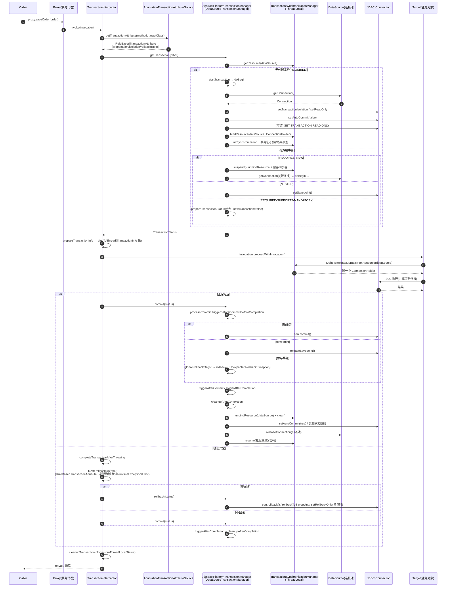
```mermaid
sequenceDiagram
    autonumber
    participant C as Caller
    participant P as Proxy(事务代理)
    participant TI as TransactionInterceptor
    participant TAS as AnnotationTransactionAttributeSource
    participant PTM as AbstractPlatformTransactionManager<br/>(DataSourceTransactionManager)
    participant TSM as TransactionSynchronizationManager<br/>(ThreadLocal)
    participant DS as DataSource(连接池)
    participant J as JDBC Connection
    participant T as Target(业务对象)

    C->>P: proxy.saveOrder(order)
    P->>TI: invoke(invocation)
    TI->>TAS: getTransactionAttribute(method, targetClass)
    TAS-->>TI: RuleBasedTransactionAttribute<br/>(propagation/isolation/rollbackRules)
    TI->>PTM: getTransaction(txAttr)
    PTM->>TSM: getResource(dataSource)
    alt 无外层事务(REQUIRED)
        PTM->>PTM: startTransaction → doBegin
        PTM->>DS: getConnection()
        DS-->>PTM: Connection
        PTM->>J: setTransactionIsolation / setReadOnly
        PTM->>J: setAutoCommit(false)
        PTM->>J: (可选) SET TRANSACTION READ ONLY
        PTM->>TSM: bindResource(dataSource, ConnectionHolder)
        PTM->>TSM: initSynchronization + 事务名/只读/隔离级别
    else 有外层事务
        alt REQUIRES_NEW
            PTM->>TSM: suspend(): unbindResource + 暂存同步器
            PTM->>DS: getConnection()(新连接) → doBegin ...
        else NESTED
            PTM->>J: setSavepoint()
        else REQUIRED/SUPPORTS/MANDATORY
            PTM->>PTM: prepareTransactionStatus(参与, newTransaction=false)
        end
    end
    PTM-->>TI: TransactionStatus
    TI->>TI: prepareTransactionInfo → bindToThread(TransactionInfo 栈)
    TI->>T: invocation.proceedWithInvocation()
    T->>TSM: (JdbcTemplate/MyBatis) getResource(dataSource)
    TSM-->>T: 同一个 ConnectionHolder
    T->>J: SQL 执行(共享事务连接)
    J-->>T: 结果
    alt 正常返回
        TI->>PTM: commit(status)
        PTM->>PTM: processCommit: triggerBeforeCommit/BeforeCompletion
        alt 新事务
            PTM->>J: con.commit()
        else savepoint
            PTM->>J: releaseSavepoint()
        else 参与事务
            PTM->>PTM: (globalRollbackOnly? → rollback + UnexpectedRollbackException)
        end
        PTM->>PTM: triggerAfterCommit / triggerAfterCompletion
        PTM->>PTM: cleanupAfterCompletion
        PTM->>TSM: unbindResource(dataSource) + clear()
        PTM->>J: setAutoCommit(true) / 恢复隔离级别
        PTM->>DS: releaseConnection(归还池)
        PTM->>TSM: resume(挂起资源)(若有)
    else 抛出异常
        TI->>TI: completeTransactionAfterThrowing
        TI->>TI: txAttr.rollbackOn(ex)?<br/>(RuleBasedTransactionAttribute: 规则深度+默认RuntimeException/Error)
        alt 需回滚
            TI->>PTM: rollback(status)
            PTM->>J: con.rollback() / rollbackToSavepoint / setRollbackOnly(参与时)
        else 不回滚
            TI->>PTM: commit(status)
        end
        PTM->>PTM: triggerAfterCompletion + cleanupAfterCompletion
    end
    TI->>TI: cleanupTransactionInfo(restoreThreadLocalStatus)
    TI-->>C: retVal / 异常
```

## 6.6 事务 / AOP 整体架构图

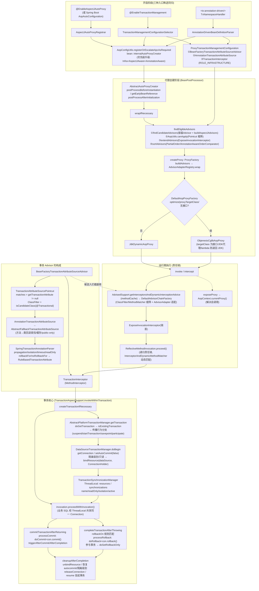
```mermaid
flowchart TD
    subgraph Enable["开启阶段(三种入口殊途同归)"]
        E1["@EnableAspectJAutoProxy<br/>(或 Spring Boot AopAutoConfiguration)"]
        E2["@EnableTransactionManagement"]
        E3["&lt;tx:annotation-driven/&gt;<br/>TxNamespaceHandler"]
        E1 --> R1["AspectJAutoProxyRegistrar"]
        E2 --> R2["TransactionManagementConfigurationSelector"]
        E3 --> R3["AnnotationDrivenBeanDefinitionParser"]
        R1 --> APC["AopConfigUtils.registerOrEscalateApcAsRequired<br/>bean: internalAutoProxyCreator<br/>(优先级升级: Infra&lt;AspectJAware&lt;AnnotationAware)"]
        R2 --> APC
        R3 --> APC
        R2 --> CFG["ProxyTransactionManagementConfiguration<br/>①BeanFactoryTransactionAttributeSourceAdvisor<br/>②AnnotationTransactionAttributeSource<br/>③TransactionInterceptor (ROLE_INFRASTRUCTURE)"]
        R3 --> CFG
    end

    subgraph Create["代理创建阶段 (BeanPostProcessor)"]
        BPP["AbstractAutoProxyCreator<br/>postProcessBeforeInstantiation / getEarlyBeanReference<br/>postProcessAfterInitialization"]
        BPP --> WRAP["wrapIfNecessary"]
        WRAP --> ELG["findEligibleAdvisors<br/>①findCandidateAdvisors(容器Advisor + buildAspectJAdvisors)<br/>②AopUtils.canApply(Pointcut 粗筛)<br/>③extendAdvisors(ExposeInvocationInterceptor)<br/>④sortAdvisors(PartialOrder/AnnotationAwareOrderComparator)"]
        ELG --> CPX["createProxy: ProxyFactory<br/>buildAdvisors → AdvisorAdapterRegistry.wrap"]
        CPX --> DAPF{"DefaultAopProxyFactory<br/>optimize/proxyTargetClass/无接口?"}
        DAPF -- 是 --> CGL["ObjenesisCglibAopProxy<br/>(targetClass 为接口/JDK代理/lambda 则退回 JDK)"]
        DAPF -- 否 --> JDK["JdkDynamicAopProxy"]
    end

    subgraph TxAdvisor["事务 Advisor 的构成"]
        AD["BeanFactoryTransactionAttributeSourceAdvisor"]
        PC["TransactionAttributeSourcePointcut<br/>matches = getTransactionAttribute != null<br/>ClassFilter = isCandidateClass(@Transactional)"]
        TAS["AnnotationTransactionAttributeSource<br/>→ AbstractFallbackTransactionAttributeSource<br/>(方法→类回退查找/缓存/public-only)"]
        PAR["SpringTransactionAnnotationParser<br/>propagation/isolation/timeout/readOnly<br/>rollbackFor/noRollbackFor → RuleBasedTransactionAttribute"]
        TI["TransactionInterceptor<br/>(MethodInterceptor)"]
        AD --> PC
        PC --> TAS
        TAS --> PAR
        AD --> TI
    end

    subgraph Exec["运行期执行 (责任链)"]
        INV["invoke / intercept"]
        CHAIN["AdvisedSupport.getInterceptorsAndDynamicInterceptionAdvice<br/>(methodCache) → DefaultAdvisorChainFactory<br/>(ClassFilter/MethodMatcher 细筛 + AdvisorAdapter 适配)"]
        RMI["ReflectiveMethodInvocation.proceed()<br/>(递归责任链, InterceptorAndDynamicMethodMatcher 动态匹配)"]
        EII["ExposeInvocationInterceptor(链首)"]
        EXV["exposeProxy → AopContext.currentProxy()<br/>(解决自调用)"]
        INV --> CHAIN
        CHAIN --> EII
        EII --> RMI
        RMI --> TI
        INV -.-> EXV
    end

    subgraph TxCore["事务核心 (TransactionAspectSupport.invokeWithinTransaction)"]
        CTX["createTransactionIfNecessary"]
        GT["AbstractPlatformTransactionManager.getTransaction<br/>doGetTransaction → isExistingTransaction<br/>→ 传播行为分支(suspend/startTransaction/savepoint/participate)"]
        DB["DataSourceTransactionManager.doBegin<br/>getConnection / setAutoCommit(false)<br/>隔离级别/只读 → bindResource(dataSource, ConnectionHolder)"]
        TSM["TransactionSynchronizationManager<br/>ThreadLocal: resources / synchronizations<br/>name/readOnly/isolation/active"]
        BODY["invocation.proceedWithInvocation()<br/>(业务 SQL 经 ThreadLocal 共享同一 Connection)"]
        CMT["commitTransactionAfterReturning<br/>processCommit: doCommit=con.commit()<br/>triggerAfterCommit/AfterCompletion"]
        RLB["completeTransactionAfterThrowing<br/>rollbackOn 规则匹配<br/>processRollback: doRollback=con.rollback()<br/>参与事务 → doSetRollbackOnly"]
        CLN["cleanupAfterCompletion<br/>unbindResource / 恢复 autocommit/隔离级别<br/>releaseConnection / resume 挂起事务"]
        CTX --> GT
        GT --> DB
        DB --> TSM
        CTX --> BODY
        BODY --> CMT
        BODY --> RLB
        CMT --> CLN
        RLB --> CLN
    end

    APC --> BPP
    CFG --> ELG
    AD -. 被选入拦截器链 .-> CHAIN
    JDK --> INV
    CGL --> INV
    TI --> CTX
    TSM --> BODY
```

## 6.7 事务同步回调 TransactionSynchronization 与 @TransactionalEventListener

`TransactionSynchronization`（`spring-tx/.../transaction/support/TransactionSynchronization.java`）定义了事务生命周期的钩子：`beforeCommit`、`beforeCompletion`、`afterCommit`、`afterCompletion(int status)`、`flush`、`suspend`/`resume`。触发点全部内嵌在 `AbstractPlatformTransactionManager` 的提交/回滚模板里（见 6.3.5/6.3.7 引用的行号）：

- `processCommit`（721-793 行）：`prepareForCommit` → `triggerBeforeCommit`（915-919 行，仅 `isNewSynchronization`）→ `triggerBeforeCompletion` → `doCommit` → `triggerAfterCommit`（935-939 行）→ `triggerAfterCompletion(STATUS_COMMITTED)`（946-962 行，会先 `clearSynchronization()`）；
- `processRollback`（819-878 行）：`triggerBeforeCompletion` → doRollback/rollbackToSavepoint/setRollbackOnly → `triggerAfterCompletion(STATUS_ROLLED_BACK)`；
- 挂起/恢复时逐个调用 `suspend()`/`resume()`（655-676 行）。

`@TransactionalEventListener` 建立在同步器之上（`spring-tx/.../transaction/event/` 包）：`TransactionalEventListenerFactory` 在事件监听器注册时把普通 `@EventListener` 方法包装为 `TransactionalApplicationListener`；适配器在事务活跃时注册一个 `TransactionSynchronization`：

```java
// spring-tx/src/main/java/org/springframework/transaction/event/TransactionalApplicationListenerMethodAdapter.java:90-92
if (TransactionSynchronizationManager.isSynchronizationActive() &&
		TransactionSynchronizationManager.isActualTransactionActive()) {
	TransactionSynchronizationManager.registerSynchronization(
			new TransactionalApplicationListenerSynchronization(...));
	...
}
```

- 默认 phase = `AFTER_COMMIT`：事件在事务**成功提交后**才投递（常见坑：AFTER_COMMIT 回调里再写库，默认连接已归还，会拿到新连接且不在原事务中）；
- 其他 phase：`BEFORE_COMMIT`、`AFTER_ROLLBACK`、`AFTER_COMPLETION`；
- 无事务时（`fallbackExecution=true` 才执行，默认丢弃）事件不投递。

---

## 本章小结

1. **一套引擎，两种切面**：`@Aspect` 与声明式事务都汇聚到 `AbstractAutoProxyCreator` 这颗 BeanPostProcessor 种子上，差别只在"候选 Advisor 从哪来"——注解切面来自 `buildAspectJAdvisors()` 对 `@Aspect` bean 的反射解析，事务切面是注册好的 `internalTransactionAdvisor` 基础设施 bean；
2. **Pointcut 匹配是三段式的**：代理创建期粗筛（`canApply`）→ 方法首次调用细筛（`DefaultAdvisorChainFactory`，结果按方法缓存）→ 运行期动态实参匹配（`InterceptorAndDynamicMethodMatcher` + `proceed()`）；
3. **执行是递归责任链**：`ReflectiveMethodInvocation.proceed()` 以 `currentInterceptorIndex` 推进，`@Around/@Before/@After*` 的语义全部由各拦截器"何时调用 proceed"决定；CGLIB 与 JDK 代理的差异集中在入口分发与目标方法调用方式（FastClass vs 反射）；
4. **事务 = 状态机 + ThreadLocal**：`getTransaction` 的传播行为分支本质是对"ThreadLocal 上是否已有活跃 ConnectionHolder"的条件处理；`doBegin` 绑定、`doCleanupAfterCompletion` 解绑；挂起/恢复就是 ThreadLocal 状态的摘取与还原；
5. **所有经典失效场景都能在源码中找到确切的那一行**：自调用（invokeJoinpoint 直调 target）、非 public（computeTransactionAttribute 第一道闸）、默认回滚规则（`RuntimeException/Error`）、rollback-only 静默回滚（参与事务的 doSetRollbackOnly + commit 检查）。


# 第七章 循环依赖（三级缓存）底层原理


> 源码基线：Spring Framework 5.3.38
> 仓库根目录：`/Users/wenbin/Desktop/workspace/java_projects/source_code/spring-framework-5.3.38`
>
> 涉及的核心类：
> - `spring-beans/src/main/java/org/springframework/beans/factory/support/DefaultSingletonBeanRegistry.java`
> - `spring-beans/src/main/java/org/springframework/beans/factory/support/AbstractBeanFactory.java`
> - `spring-beans/src/main/java/org/springframework/beans/factory/support/AbstractAutowireCapableBeanFactory.java`
> - `spring-beans/src/main/java/org/springframework/beans/factory/support/DefaultListableBeanFactory.java`
> - `spring-aop/src/main/java/org/springframework/aop/framework/autoproxy/AbstractAutoProxyCreator.java`
> - `spring-context/src/main/java/org/springframework/context/annotation/ContextAnnotationAutowireCandidateResolver.java`

---

## 1. 问题定义：为什么循环依赖需要"缓存"来解决

所谓循环依赖，即 A 的创建过程需要 B（属性注入、构造器注入等），而 B 的创建过程又需要 A：

```java
@Component
public class A {
    @Autowired private B b;   // A 依赖 B
}

@Component
public class B {
    @Autowired private A a;   // B 依赖 A
}
```

单例 Bean 在容器中的完整创建可以概括为三大步（见 `AbstractAutowireCapableBeanFactory.doCreateBean`）：

1. **实例化（Instantiate）**：调用构造器，在堆上开辟内存，得到"原始对象"（raw bean）；
2. **属性填充（Populate）**：`populateBean(...)`，完成 `@Autowired` 等依赖注入；
3. **初始化（Initialize）**：`initializeBean(...)`，依次执行 Aware 回调、`BeanPostProcessor` 前置处理、`InitializingBean`/`init-method`、后置处理（**AOP 代理通常在这一步之后生成**）。

循环依赖的死锁点发生在第 2 步：A 执行到属性填充时需要 B，于是去创建 B；B 执行到属性填充时又需要 A——而此时 A 还停留在第 2 步，尚未完成。如果没有额外机制，这里就是无限递归。

Spring 的解法是：**把"已经实例化但尚未完成属性填充/初始化"的原始对象（或其工厂）提前放进缓存暴露出去**，让 B 拿到一个"半成品 A"先完成自己的创建，回头 A 再继续走完自己的流程。三级缓存就是围绕这个"半成品暴露"的时机与形态设计出来的。

---

## 2. 三级缓存数据结构源码（DefaultSingletonBeanRegistry）

全部缓存定义在 `DefaultSingletonBeanRegistry` 中。

**文件：`spring-beans/src/main/java/org/springframework/beans/factory/support/DefaultSingletonBeanRegistry.java`**

```java
// DefaultSingletonBeanRegistry.java:73-99
/** Maximum number of suppressed exceptions to preserve. */
private static final int SUPPRESSED_EXCEPTIONS_LIMIT = 100;

/** Cache of singleton objects: bean name to bean instance. */
private final Map<String, Object> singletonObjects = new ConcurrentHashMap<>(256);          // :78 一级缓存

/** Cache of singleton factories: bean name to ObjectFactory. */
private final Map<String, ObjectFactory<?>> singletonFactories = new HashMap<>(16);        // :81 三级缓存

/** Cache of early singleton objects: bean name to bean instance. */
private final Map<String, Object> earlySingletonObjects = new ConcurrentHashMap<>(16);     // :84 二级缓存

/** Set of registered singletons, containing the bean names in registration order. */
private final Set<String> registeredSingletons = new LinkedHashSet<>(256);                 // :87

/** Names of beans that are currently in creation. */
private final Set<String> singletonsCurrentlyInCreation =
        Collections.newSetFromMap(new ConcurrentHashMap<>(16));                             // :90-91

/** Names of beans currently excluded from in creation checks. */
private final Set<String> inCreationCheckExclusions =
        Collections.newSetFromMap(new ConcurrentHashMap<>(16));                             // :94-95

/** Collection of suppressed Exceptions, available for associating related causes. */
@Nullable
private Set<Exception> suppressedExceptions;                                               // :99
```

### 2.1 逐个字段解析

| 缓存 | 级别 | 类型 | 存的是什么 | 生命周期 |
|---|---|---|---|---|
| `singletonObjects` | 一级 | `ConcurrentHashMap<String, Object>` | **完全体**单例：已完成实例化 + 属性填充 + 初始化（若是代理则是最终代理对象） | Bean 创建完成后永久存在 |
| `earlySingletonObjects` | 二级 | `ConcurrentHashMap<String, Object>` | **早期引用**（early reference）：可能是原始对象，也可能是提前生成的代理（见第 4、8 节） | 只在发生循环依赖时短暂存在，Bean 完成后被清除 |
| `singletonFactories` | 三级 | `HashMap<String, ObjectFactory<?>>` | **ObjectFactory 工厂**：一段"按需生成早期引用"的 lambda，即 `() -> getEarlyBeanReference(beanName, mbd, bean)` | 实例化后放入；被调用一次后即删除（升级为二级） |

几个容易被忽略但重要的细节：

1. **`singletonFactories` 是普通 `HashMap` 而非 `ConcurrentHashMap`**。因为所有对三级缓存的读写都发生在 `synchronized (this.singletonObjects)` 块内（见 2.2 节各方法），用 `singletonObjects` 这一把全局互斥锁保护，无需再付出并发容器的开销。同理 `registeredSingletons`（`LinkedHashSet`，记录注册顺序）也在锁内访问。

2. **`earlySingletonObjects` 在 5.3 中是 `ConcurrentHashMap`**（历史版本曾是 `HashMap`）。这与 `getSingleton(String, boolean)` 的"无锁快速路径"优化有关（见 3.1 节）：5.3 允许在不加全局锁的情况下先读一级和二级缓存。

3. **`singletonsCurrentlyInCreation`**：正在创建中的 Bean 名单，是 `getSingleton(beanName, ObjectFactory)` 里 `beforeSingletonCreation/afterSingletonCreation` 维护的"创建中"标记，也是 `getSingleton(String, boolean)` 决定"要不要去找半成品"的开关。它同时是**构造器循环依赖、prototype 循环依赖报错的判据**。

4. **`registeredSingletons`**：只记录"已经在一/二/三级任一缓存中出现过的 Bean 名"，用于 `getSingletonNames()`/`getSingletonCount()` 输出注册顺序（`DefaultSingletonBeanRegistry.java:305-316`），与循环依赖判定本身无关。

5. **`suppressedExceptions`**：收集创建过程中被吞掉的异常（最多 100 个，`SUPPRESSED_EXCEPTIONS_LIMIT`，`:74`）。典型场景：循环依赖解析期间某些后置处理失败后被 `onSuppressedException`（`:276-282`）记录，最终作为 related causes 附加到顶层 `BeanCreationException`（`getSingleton(String, ObjectFactory)` 的 catch 块，`:245-252`），方便定位"循环依赖中哪一环先坏了"。

```java
// DefaultSingletonBeanRegistry.java:276-282
protected void onSuppressedException(Exception ex) {
    synchronized (this.singletonObjects) {
        if (this.suppressedExceptions != null && this.suppressedExceptions.size() < SUPPRESSED_EXCEPTIONS_LIMIT) {
            this.suppressedExceptions.add(ex);
        }
    }
}
```

### 2.2 缓存的写入/升级/清除方法

**addSingleton：Bean 完全创建成功后，进入一级缓存，同时清掉二、三级**（"三级缓存移动"的终点）：

```java
// DefaultSingletonBeanRegistry.java:137-144
protected void addSingleton(String beanName, Object singletonObject) {
    synchronized (this.singletonObjects) {
        this.singletonObjects.put(beanName, singletonObject);   // 进一级
        this.singletonFactories.remove(beanName);               // 清三级
        this.earlySingletonObjects.remove(beanName);            // 清二级
        this.registeredSingletons.add(beanName);
    }
}
```

**addSingletonFactory：实例化完成、属性填充之前，把"早期引用工厂"放进三级缓存**：

```java
// DefaultSingletonBeanRegistry.java:154-163
protected void addSingletonFactory(String beanName, ObjectFactory<?> singletonFactory) {
    Assert.notNull(singletonFactory, "Singleton factory must not be null");
    synchronized (this.singletonObjects) {
        if (!this.singletonObjects.containsKey(beanName)) {
            this.singletonFactories.put(beanName, singletonFactory);  // 进三级
            this.earlySingletonObjects.remove(beanName);              // 保险：清二级
            this.registeredSingletons.add(beanName);
        }
    }
}
```

注意 `if (!this.singletonObjects.containsKey(beanName))` 的防御：如果一级缓存已有该 Bean（例如此前创建失败被外部注册），就不再暴露工厂，避免覆盖完全体。

**removeSingleton：创建失败时做全量清理**（`doGetBean` 的 lambda 里 `destroySingleton(beanName)` 会走到这里）：

```java
// DefaultSingletonBeanRegistry.java:290-297
protected void removeSingleton(String beanName) {
    synchronized (this.singletonObjects) {
        this.singletonObjects.remove(beanName);
        this.singletonFactories.remove(beanName);
        this.earlySingletonObjects.remove(beanName);
        this.registeredSingletons.remove(beanName);
    }
}
```

---

## 3. doGetBean 与两个 getSingleton 重载

### 3.1 读取侧：getSingleton(String) → getSingleton(String, boolean)

`AbstractBeanFactory.doGetBean` 一进来就先查缓存（**文件：`spring-beans/src/main/java/org/springframework/beans/factory/support/AbstractBeanFactory.java`**）：

```java
// AbstractBeanFactory.java:249-269
protected <T> T doGetBean(
        String name, @Nullable Class<T> requiredType, @Nullable Object[] args, boolean typeCheckOnly)
        throws BeansException {

    String beanName = transformedBeanName(name);
    Object beanInstance;

    // Eagerly check singleton cache for manually registered singletons.
    Object sharedInstance = getSingleton(beanName);        // :257 ① 先查缓存
    if (sharedInstance != null && args == null) {
        if (logger.isTraceEnabled()) {
            if (isSingletonCurrentlyInCreation(beanName)) {
                logger.trace("Returning eagerly cached instance of singleton bean '" + beanName +
                        "' that is not fully initialized yet - a consequence of a circular reference");
            }
            ...
        }
        beanInstance = getObjectForBeanInstance(sharedInstance, name, beanName, null);
    }
    ...
```

`getSingleton(String)` 委托给 `getSingleton(String, boolean)`，`allowEarlyReference = true`：

```java
// DefaultSingletonBeanRegistry.java:165-169
@Override
@Nullable
public Object getSingleton(String beanName) {
    return getSingleton(beanName, true);
}
```

这就是**三级缓存读取的核心逻辑**：

```java
// DefaultSingletonBeanRegistry.java:179-204
@Nullable
protected Object getSingleton(String beanName, boolean allowEarlyReference) {
    // Quick check for existing instance without full singleton lock
    Object singletonObject = this.singletonObjects.get(beanName);                      // ① 一级
    if (singletonObject == null && isSingletonCurrentlyInCreation(beanName)) {         // ② 在创建中？
        singletonObject = this.earlySingletonObjects.get(beanName);                    // ③ 二级
        if (singletonObject == null && allowEarlyReference) {
            synchronized (this.singletonObjects) {
                // Consistent creation of early reference within full singleton lock
                singletonObject = this.singletonObjects.get(beanName);                 // ④ 双检：一级
                if (singletonObject == null) {
                    singletonObject = this.earlySingletonObjects.get(beanName);        // ⑤ 双检：二级
                    if (singletonObject == null) {
                        ObjectFactory<?> singletonFactory = this.singletonFactories.get(beanName);  // ⑥ 三级
                        if (singletonFactory != null) {
                            singletonObject = singletonFactory.getObject();            // ⑦ 调工厂！
                            this.earlySingletonObjects.put(beanName, singletonObject); // ⑧ 升级进二级
                            this.singletonFactories.remove(beanName);                  // ⑨ 删除三级
                        }
                    }
                }
            }
        }
    }
    return singletonObject;
}
```

逐行解读这段**二/三级缓存晋升（promotion）逻辑**：

- **①** 先无锁读一级缓存 `singletonObjects`。绝大多数 `getBean` 调用在 这里就命中返回，性能路径。
- **②** 一级没有，且 `isSingletonCurrentlyInCreation(beanName)` 为 `true`（`:343-345`，查 `singletonsCurrentlyInCreation` 集合）——**只有"正在创建中"的 Bean 才可能存在半成品**。如果一个 Bean 不在创建中且一级缓存没有，那它就是真的不存在，直接返回 `null` 走后面的创建分支。这是防止拿错东西的关键闸门。
- **③** 无锁读二级缓存 `earlySingletonObjects`：如果此前已经有人触发过工厂（循环依赖已发生过一次），早期引用已被晋升到二级，直接拿。
- **④⑤⑥⑦⑧⑨** 在全局锁 `synchronized (this.singletonObjects)` 内做**双重检查**（double-check）：
  - 拿三级缓存中的 `ObjectFactory`，调用 `singletonFactory.getObject()`——这一步才会真正执行 `getEarlyBeanReference(...)`，可能触发**AOP 代理的提前生成**（见第 4 节）；
  - 把得到的早期引用放入二级缓存 `earlySingletonObjects`；
  - 从三级缓存 `singletonFactories` 中删除该工厂。

  **工厂只执行一次**：从此该 Bean 的早期引用固定为二级缓存中的那个对象，后续再有人来拿，③ 直接命中。这保证了"所有循环依赖方拿到的都是同一个早期引用"（AOP 场景下尤其关键，见第 8 节）。

- 5.3 版本相比老版本的改进：外层 ①③ 的"快速路径"不加全局锁（`earlySingletonObjects` 因此改为 `ConcurrentHashMap`），只有真正要执行工厂时才进入重量级锁块，降低高并发 `getBean` 下锁的竞争。
- `allowEarlyReference=false` 的调用方只有一个：`doCreateBean` 末尾的 `getSingleton(beanName, false)`（`AbstractAutowireCapableBeanFactory.java:633`），用于**探测**"我有没有被别人提前拿过"，而不是为了获取引用。

### 3.2 创建侧：getSingleton(String, ObjectFactory)

缓存没有命中时，`doGetBean` 走到创建分支。单例部分：

```java
// AbstractBeanFactory.java:333-347
// Create bean instance.
if (mbd.isSingleton()) {
    sharedInstance = getSingleton(beanName, () -> {
        try {
            return createBean(beanName, mbd, args);
        }
        catch (BeansException ex) {
            // Explicitly remove instance from singleton cache: It might have been put there
            // eagerly by the creation process, to allow for circular reference resolution.
            // Also remove any beans that received a temporary reference to the bean.
            destroySingleton(beanName);       // 创建失败：清理所有缓存，防止半成品残留
            throw ex;
        }
    });
    beanInstance = getObjectForBeanInstance(sharedInstance, name, beanName, mbd);
}
```

`getSingleton(String, ObjectFactory)` 是"创建单例的模板方法"，`AbstractBeanFactory` 把 `createBean` 作为 `ObjectFactory` 传进来，由 Registry 负责缓存编排：

```java
// DefaultSingletonBeanRegistry.java:214-265
public Object getSingleton(String beanName, ObjectFactory<?> singletonFactory) {
    Assert.notNull(beanName, "Bean name must not be null");
    synchronized (this.singletonObjects) {
        Object singletonObject = this.singletonObjects.get(beanName);     // ① 一级命中直接返回
        if (singletonObject == null) {
            if (this.singletonsCurrentlyInDestruction) {
                throw new BeanCreationNotAllowedException(beanName, ...); // 容器销毁中禁止创建
            }
            if (logger.isDebugEnabled()) {
                logger.debug("Creating shared instance of singleton bean '" + beanName + "'");
            }
            beforeSingletonCreation(beanName);                            // ② 标记"创建中"
            boolean newSingleton = false;
            boolean recordSuppressedExceptions = (this.suppressedExceptions == null);
            if (recordSuppressedExceptions) {
                this.suppressedExceptions = new LinkedHashSet<>();
            }
            try {
                singletonObject = singletonFactory.getObject();           // ③ 真正执行 createBean
                newSingleton = true;
            }
            catch (IllegalStateException ex) {
                // Has the singleton object implicitly appeared in the meantime ->
                // if yes, proceed with it since the exception indicates that state.
                singletonObject = this.singletonObjects.get(beanName);
                if (singletonObject == null) {
                    throw ex;
                }
            }
            catch (BeanCreationException ex) {
                if (recordSuppressedExceptions) {
                    for (Exception suppressedException : this.suppressedExceptions) {
                        ex.addRelatedCause(suppressedException);          // 收集循环依赖期间的被吞异常
                    }
                }
                throw ex;
            }
            finally {
                if (recordSuppressedExceptions) {
                    this.suppressedExceptions = null;
                }
                afterSingletonCreation(beanName);                         // ④ 解除"创建中"标记
            }
            if (newSingleton) {
                addSingleton(beanName, singletonObject);                  // ⑤ 进一级、清二三级
            }
        }
        return singletonObject;
    }
}
```

配合两个标记方法：

```java
// DefaultSingletonBeanRegistry.java:343-345
public boolean isSingletonCurrentlyInCreation(@Nullable String beanName) {
    return this.singletonsCurrentlyInCreation.contains(beanName);
}

// DefaultSingletonBeanRegistry.java:353-357
protected void beforeSingletonCreation(String beanName) {
    if (!this.inCreationCheckExclusions.contains(beanName) &&
            !this.singletonsCurrentlyInCreation.add(beanName)) {
        throw new BeanCurrentlyInCreationException(beanName);   // 已在集合中 → 说明重入！
    }
}

// DefaultSingletonBeanRegistry.java:365-369
protected void afterSingletonCreation(String beanName) {
    if (!this.inCreationCheckExclusions.contains(beanName) &&
            !this.singletonsCurrentlyInCreation.remove(beanName)) {
        throw new IllegalStateException("Singleton '" + beanName + "' isn't currently in creation");
    }
}
```

三个要点：

1. **`beforeSingletonCreation` 是防重入闸门**：`singletonsCurrentlyInCreation` 是个 Set，`add()` 返回 `false` 意味着该 Bean 已经在创建中——同一个 Bean 再次走到"从零创建"的入口，说明既没走缓存、也没走早期引用，**这正是构造器注入循环依赖爆掉的地方**（见第 6 节）。`BeanCurrentlyInCreationException` 的默认消息是：`"Requested bean is currently in creation: Is there an unresolvable circular reference?"`（`spring-beans/src/main/java/org/springframework/beans/factory/BeanCurrentlyInCreationException.java:34-37`）。

2. **`newSingleton` 与 `addSingleton`**：只有 `singletonFactory.getObject()` 正常返回才置 `newSingleton = true`，随后 `addSingleton` 把成品放进一级缓存并清除二、三级缓存——这就是"**三级缓存的最终收敛**"。`catch (IllegalStateException)` 分支处理一种极端情况：工厂执行期间对象已被隐式注册进一级缓存（此时吞掉异常使用已存在对象，`newSingleton` 保持 `false`，不再 `addSingleton` 覆盖）。

3. **异常链关联**：循环依赖解析中各环节可能抛出又被捕获的异常通过 `onSuppressedException` 收集在 `suppressedExceptions`（上限 100，`:74`），最终以 `relatedCauses` 形式挂到顶层 `BeanCreationException` 上，避免"根因被吞"。

---

## 4. doCreateBean：addSingletonFactory 与 getEarlyBeanReference

**文件：`spring-beans/src/main/java/org/springframework/beans/factory/support/AbstractAutowireCapableBeanFactory.java`**

`getSingleton(beanName, ObjectFactory)` 中的 `singletonFactory.getObject()` 最终执行 `AbstractAutowireCapableBeanFactory.createBean` → `doCreateBean`。循环依赖的核心就藏在 `doCreateBean` 的中段：

```java
// AbstractAutowireCapableBeanFactory.java:573-669
protected Object doCreateBean(String beanName, RootBeanDefinition mbd, @Nullable Object[] args)
        throws BeanCreationException {

    // Instantiate the bean.
    BeanWrapper instanceWrapper = null;
    if (mbd.isSingleton()) {
        instanceWrapper = this.factoryBeanInstanceCache.remove(beanName);
    }
    if (instanceWrapper == null) {
        instanceWrapper = createBeanInstance(beanName, mbd, args);   // ① 实例化（构造器）
    }
    Object bean = instanceWrapper.getWrappedInstance();              //    ← 原始对象诞生
    ...

    // Allow post-processors to modify the merged bean definition.
    ... applyMergedBeanDefinitionPostProcessors(...)                 // ② @Autowired 元信息收集

    // Eagerly cache singletons to be able to resolve circular references
    // even when triggered by lifecycle interfaces like BeanFactoryAware.
    boolean earlySingletonExposure = (mbd.isSingleton() && this.allowCircularReferences &&
            isSingletonCurrentlyInCreation(beanName));               // ③ 是否暴露早期引用
    if (earlySingletonExposure) {
        if (logger.isTraceEnabled()) {
            logger.trace("Eagerly caching bean '" + beanName +
                    "' to allow for resolving potential circular references");
        }
        addSingletonFactory(beanName, () -> getEarlyBeanReference(beanName, mbd, bean));  // ④ 放三级缓存
    }

    // Initialize the bean instance.
    Object exposedObject = bean;
    try {
        populateBean(beanName, mbd, instanceWrapper);                // ⑤ 属性填充（依赖注入发生地）
        exposedObject = initializeBean(beanName, exposedObject, mbd);// ⑥ 初始化（AOP 代理常规生成地）
    }
    catch (Throwable ex) { ... }

    if (earlySingletonExposure) {
        Object earlySingletonReference = getSingleton(beanName, false);   // ⑦ 我被别人提前拿过吗？
        if (earlySingletonReference != null) {
            if (exposedObject == bean) {
                exposedObject = earlySingletonReference;             // ⑧a 用早期引用替换成品
            }
            else if (!this.allowRawInjectionDespiteWrapping && hasDependentBean(beanName)) {
                ...                                                   // ⑧b 半成品已被注入且最终对象不同 → 报错
                throw new BeanCurrentlyInCreationException(beanName,
                        "Bean with name '" + beanName + "' has been injected into other beans [" + ... +
                        "] in its raw version as part of a circular reference, but has eventually been " +
                        "wrapped. ...");
            }
        }
    }

    // Register bean as disposable.
    registerDisposableBeanIfNecessary(beanName, bean, mbd);
    return exposedObject;
}
```

### 4.1 earlySingletonExposure 的三个条件（`:606-607`）

```java
boolean earlySingletonExposure = (mbd.isSingleton() && this.allowCircularReferences &&
        isSingletonCurrentlyInCreation(beanName));
```

- `mbd.isSingleton()`：只对单例生效，prototype 没有缓存也就没有循环依赖解法；
- `this.allowCircularReferences`：全局开关（默认 `true`，Spring Boot 2.6+ 默认改为 `false`，见第 7 节）；
- `isSingletonCurrentlyInCreation(beanName)`：说明当前调用栈来自 `getSingleton(String, ObjectFactory)`（`beforeSingletonCreation` 已把名字加入集合）。`getBean` 的 `typeCheckOnly` 等路径直接调 `createBean` 时该值为 `false`，不会污染缓存。

### 4.2 为什么是 ObjectFactory（lambda）而不是直接把原始对象放二级缓存？

```java
// AbstractAutowireCapableBeanFactory.java:613
addSingletonFactory(beanName, () -> getEarlyBeanReference(beanName, mbd, bean));
```

关键在 `getEarlyBeanReference`：

```java
// AbstractAutowireCapableBeanFactory.java:981-989
protected Object getEarlyBeanReference(String beanName, RootBeanDefinition mbd, Object bean) {
    Object exposedObject = bean;
    if (!mbd.isSynthetic() && hasInstantiationAwareBeanPostProcessors()) {
        for (SmartInstantiationAwareBeanPostProcessor bp : getBeanPostProcessorCache().smartInstantiationAware) {
            exposedObject = bp.getEarlyBeanReference(exposedObject, beanName);
        }
    }
    return exposedObject;
}
```

`ObjectFactory` 惰性求值的设计意图有三层：

1. **把"决定早期引用形态"的权利交给后置处理器**。如果直接缓存原始对象，那么发生循环依赖时对方注入的就是"裸 Bean"；而通过工厂，Spring 在真正被需要的瞬间调用所有 `SmartInstantiationAwareBeanPostProcessor.getEarlyBeanReference(...)`（接口定义：`spring-beans/src/main/java/org/springframework/beans/factory/config/SmartInstantiationAwareBeanPostProcessor.java:90`），后置处理器可以返回一个**包装对象（典型即 AOP 代理）**。也就是说，三级缓存里存的不是"对象"，而是"**生产对象的策略**"。

2. **没有循环依赖时零成本**。绝大多数 Bean 不会发生循环依赖。工厂从未被调用 → `getEarlyBeanReference` 从未执行 → AOP 代理不会提前生成，一切按正常节奏在 `initializeBean` 之后的 `postProcessAfterInitialization` 里做。若在 ④ 处就急切地 `getEarlyBeanReference()` 并放入二级缓存，等于**对容器里每一个单例 Bean 都提前跑了一遍代理判断**，违背了"代理最后生成"的设计原则。

3. **保证同一个早期引用只生成一次**。工厂执行一次后即被从三级缓存删除、结果晋升二级（3.1 节 ⑦⑧⑨），后续所有循环依赖方拿到的都是同一个对象，避免了多次调用工厂产生多个不同代理的可能。

### 4.3 AOP 代理提前生成的时机：AbstractAutoProxyCreator.getEarlyBeanReference

AOP 自动代理的统一基类 `AbstractAutoProxyCreator` 同时实现了 `SmartInstantiationAwareBeanPostProcessor`：

**文件：`spring-aop/src/main/java/org/springframework/aop/framework/autoproxy/AbstractAutoProxyCreator.java`**

```java
// AbstractAutoProxyCreator.java:140
private final Map<Object, Object> earlyProxyReferences = new ConcurrentHashMap<>(16);

// AbstractAutoProxyCreator.java:240-245
@Override
public Object getEarlyBeanReference(Object bean, String beanName) {
    Object cacheKey = getCacheKey(bean.getClass(), beanName);
    this.earlyProxyReferences.put(cacheKey, bean);        // 记录"该 bean 提前代理过"，存的是原始 bean
    return wrapIfNecessary(bean, beanName, cacheKey);     // 立即生成代理（正常流程本应在最后才做）
}
```

与常规生成路径的对照：

```java
// AbstractAutoProxyCreator.java:288-297
@Override
public Object postProcessAfterInitialization(@Nullable Object bean, String beanName) {
    if (bean != null) {
        Object cacheKey = getCacheKey(bean.getClass(), beanName);
        if (this.earlyProxyReferences.remove(cacheKey) != bean) {   // 没提前代理过 → 现在生成
            return wrapIfNecessary(bean, beanName, cacheKey);
        }
        // 提前代理过 → 直接返回原 bean（不再重复代理）
    }
    return bean;
}
```

`earlyProxyReferences` 的语义是一个**"已提前处理"标记**（key=cacheKey，value=当时的原始 bean）：

- 发生循环依赖：`getEarlyBeanReference` 中 `wrapIfNecessary` 提前产出代理放入二级缓存，同时记录原始 bean；等 `initializeBean` 完成后 `postProcessAfterInitialization` 发现 `earlyProxyReferences.remove(cacheKey) == bean`（确实是我提前代理的那个 bean），**跳过**再次代理，原样返回。
- 未发生循环依赖：`earlyProxyReferences` 中没有该 key，`remove` 返回 `null != bean`，走正常的 `wrapIfNecessary` 在初始化之后生成代理。

这就解释了 `doCreateBean` 的 ⑦⑧a 步骤为什么必须存在：一旦发生过提前代理，二级缓存里的早期引用（代理对象）与 `initializeBean` 返回的 `exposedObject`（此时还是原始对象）不是同一个，**必须以早期引用为准**：

```java
// AbstractAutowireCapableBeanFactory.java:632-637
if (earlySingletonExposure) {
    Object earlySingletonReference = getSingleton(beanName, false);  // false：只查二级，不触发工厂
    if (earlySingletonReference != null) {
        if (exposedObject == bean) {
            exposedObject = earlySingletonReference;  // B 已经持有代理了，A 最终也必须是这个代理
        }
        ...
    }
}
```

`getSingleton(beanName, false)` 传入 `allowEarlyReference=false` 的精妙之处：这里只是**探测**"是否有人在创建期间把我拿走过"（二级缓存非空 ⟺ 三级工厂被调用过）。如果传 `true`，就会在"本无循环依赖"的场景下白白触发一次工厂调用、提前生成代理——与设计初衷相悖。

⑧b 的兜底分支处理更刁钻的情况：`exposedObject != bean`（初始化阶段后置处理器自己替换了对象），而二级缓存中又有早期引用，且已经有依赖方注入了早期版本——此时容器中会同时存在两个不同的"版本"，Spring 默认（`allowRawInjectionDespiteWrapping=false`）直接抛 `BeanCurrentlyInCreationException`（`:647-654`），提示"raw version 注入 vs 最终 wrapped 版本不一致"。

---

## 5. 完整流程走读：A 依赖 B、B 依赖 A（setter/字段注入）

设定：单例 A、B 通过 `@Autowired` 字段互相注入，均无 AOP 时序干扰（先看无代理版本，再补 AOP 版本差异）。调用起点为 `context.getBean("a")` 或容器预实例化触发 `getBean(a)`。

**逐步源码跟踪：**

1. **`getBean(a)` → `doGetBean`**（`AbstractBeanFactory.java:249`）。`getSingleton("a")`（`:257`）三级全空返回 `null` → 走创建分支。

2. **进入 `getSingleton("a", ObjectFactory)`**（`AbstractBeanFactory.java:334` 的 lambda）。一级无 → `beforeSingletonCreation("a")`：`singletonsCurrentlyInCreation = {a}`（`DefaultSingletonBeanRegistry.java:353`）→ 执行 lambda。

3. **`createBean(a)` → `doCreateBean(a)`**（`AbstractAutowireCapableBeanFactory.java:573`）：
   - `createBeanInstance(a)`（`:582`）：反射调用构造器，得到原始对象 `a_raw`；
   - `earlySingletonExposure = true`（单例 && 允许循环依赖 && a 在创建中，`:606`）；
   - `addSingletonFactory("a", () -> getEarlyBeanReference("a", mbd, a_raw))`（`:613`）：
     - **三级缓存 `singletonFactories = {a: factory}`**；
   - `populateBean(a, ...)`（`:619`）：`AutowiredAnnotationBeanPostProcessor` 解析到 `@Autowired B b`，走 `DefaultListableBeanFactory.resolveDependency → doResolveDependency`，找到候选 `b` 后由 `DependencyDescriptor.resolveCandidate` 完成注入。

   ```java
   // spring-beans/src/main/java/org/springframework/beans/factory/config/DependencyDescriptor.java:273-277
   public Object resolveCandidate(String beanName, Class<?> requiredType, BeanFactory beanFactory) {
       return beanFactory.getBean(beanName);      // 注入 = 递归 getBean
   }
   ```

   （XML/byName 场景等价路径：`autowireByName` 里直接 `getBean(propertyName)`，`AbstractAutowireCapableBeanFactory.java:1471`。）

4. **递归 `getBean(b)` → `doGetBean(b)`**。`getSingleton("b")` 为 `null` → `getSingleton("b", ObjectFactory)`：`beforeSingletonCreation("b")`，集合变为 `{a, b}` → `doCreateBean(b)`：
   - `createBeanInstance(b)` 得到 `b_raw`；
   - `addSingletonFactory("b", factory_b)`：三级缓存 `{a: factory_a, b: factory_b}`；
   - `populateBean(b)`：解析到 `@Autowired A a` → `resolveDependency` → `getBean(a)`（又一次递归）。

5. **递归 `getBean(a)`（第二次）→ `getSingleton("a")` 命中三级缓存**（`DefaultSingletonBeanRegistry.java:180-204`）：
   - 一级 `singletonObjects.get("a")` → null；
   - `isSingletonCurrentlyInCreation("a")` → **true**（步骤 2 已标记）；
   - 二级 `earlySingletonObjects.get("a")` → null；
   - 进入全局锁，双检后取三级 `singletonFactories.get("a")` → 非 null；
   - **`singletonFactory.getObject()` 执行 `getEarlyBeanReference("a", mbd, a_raw)`**（`AbstractAutowireCapableBeanFactory.java:981`）：无 AOP 时所有后置处理器原样返回，结果 = `a_raw`；有 AOP 时 `AbstractAutoProxyCreator.getEarlyBeanReference` 返回 `a_proxy`（提前代理）；
   - **二级缓存 `earlySingletonObjects = {a: a_raw}`（或 `a_proxy`）；三级缓存删除 a**；
   - 返回 `a_raw`。

6. **B 完成收尾**：`populateBean(b)` 把 `a_raw` 注入 `b` 的字段 → `initializeBean(b)`（Aware/后置处理器/init）→ 回到 `doCreateBean(b)` 的 ⑦：`getSingleton("b", false)`——注意**此时 b 的二级缓存是空的**（没有任何人在 b 创建期间向 b 要过引用），`earlySingletonReference == null`，什么都不做 → 返回 `b` → 回到 `getSingleton("b", ObjectFactory)`：`afterSingletonCreation("b")`（集合变回 `{a}`）→ `newSingleton=true` → **`addSingleton("b", b)`：一级缓存 `{b: b}`，二三级中 b 相关条目清除**。

7. **A 完成收尾**：注入完成（B 的成品 b 已就位）→ `initializeBean(a)` → `doCreateBean(a)` 的 ⑦：`getSingleton("a", false)`——二级缓存中 **a 存在**（步骤 5 晋升过）：
   - 无 AOP：`earlySingletonReference == a_raw == exposedObject`（`exposedObject == bean` 成立）→ `exposedObject = earlySingletonReference`（等值赋值，无实际变化）；
   - 有 AOP：`earlySingletonReference = a_proxy`，而 `initializeBean` 返回的 `exposedObject` 还是 `a_raw`（`postProcessAfterInitialization` 因 `earlyProxyReferences` 命中而跳过代理）→ **`exposedObject` 被替换为 `a_proxy`**（`:635-636`），保证最终容器里的 a 与 B 已注入的是同一个代理对象；
   → `getSingleton("a", ObjectFactory)`：`afterSingletonCreation("a")`（集合清空）→ `addSingleton("a", a)`：**一级 `{a: a, b: b}`，二级中 a 清除、三级早已为空**。

8. **回到最初的 `doGetBean(a)`**：`getObjectForBeanInstance` → 返回 a。循环依赖闭环完成。

### 5.1 时序图（mermaid sequenceDiagram）

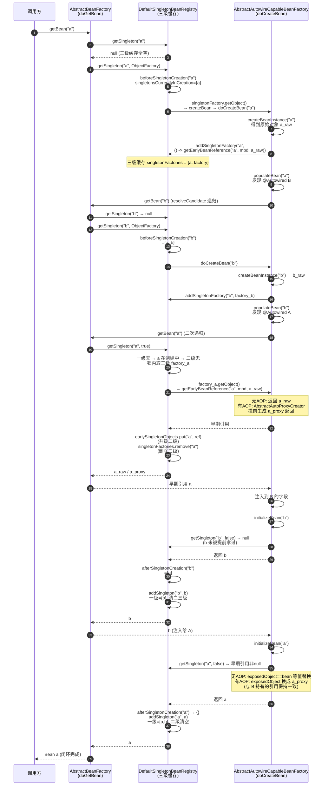
```mermaid
sequenceDiagram
    autonumber
    participant App as 调用方
    participant ABF as AbstractBeanFactory<br/>(doGetBean)
    participant DSBR as DefaultSingletonBeanRegistry<br/>(三级缓存)
    participant AACBF as AbstractAutowireCapableBeanFactory<br/>(doCreateBean)

    App->>ABF: getBean("a")
    ABF->>DSBR: getSingleton("a")
    DSBR-->>ABF: null (三级缓存全空)
    ABF->>DSBR: getSingleton("a", ObjectFactory)
    DSBR->>DSBR: beforeSingletonCreation("a")<br/>singletonsCurrentlyInCreation={a}
    DSBR->>AACBF: singletonFactory.getObject()<br/>→ createBean → doCreateBean("a")
    AACBF->>AACBF: createBeanInstance("a")<br/>得到原始对象 a_raw
    AACBF->>DSBR: addSingletonFactory("a",<br/>() -> getEarlyBeanReference("a", mbd, a_raw))
    Note over DSBR: 三级缓存 singletonFactories = {a: factory}

    AACBF->>AACBF: populateBean("a")<br/>发现 @Autowired B
    AACBF->>ABF: getBean("b") (resolveCandidate 递归)

    ABF->>DSBR: getSingleton("b") → null
    ABF->>DSBR: getSingleton("b", ObjectFactory)
    DSBR->>DSBR: beforeSingletonCreation("b")<br/>={a, b}
    DSBR->>AACBF: doCreateBean("b")
    AACBF->>AACBF: createBeanInstance("b") → b_raw
    AACBF->>DSBR: addSingletonFactory("b", factory_b)
    AACBF->>AACBF: populateBean("b")<br/>发现 @Autowired A
    AACBF->>ABF: getBean("a") (二次递归)

    ABF->>DSBR: getSingleton("a", true)
    DSBR->>DSBR: 一级无 → a 在创建中 → 二级无<br/>锁内取三级 factory_a
    DSBR->>AACBF: factory_a.getObject()<br/>→ getEarlyBeanReference("a", mbd, a_raw)
    Note over AACBF: 无AOP: 返回 a_raw<br/>有AOP: AbstractAutoProxyCreator<br/>提前生成 a_proxy 返回
    AACBF-->>DSBR: 早期引用
    DSBR->>DSBR: earlySingletonObjects.put("a", ref)<br/>(升级二级)<br/>singletonFactories.remove("a")<br/>(删除三级)
    DSBR-->>ABF: a_raw / a_proxy
    ABF-->>AACBF: 早期引用 a
    AACBF->>AACBF: 注入到 B 的字段

    AACBF->>AACBF: initializeBean("b")
    AACBF->>DSBR: getSingleton("b", false) → null<br/>(b 未被提前拿过)
    AACBF-->>DSBR: 返回 b
    DSBR->>DSBR: afterSingletonCreation("b")<br/>={a}
    DSBR->>DSBR: addSingleton("b", b)<br/>一级={b}, 清二三级
    DSBR-->>ABF: b
    ABF-->>AACBF: b (注入给 A)

    AACBF->>AACBF: initializeBean("a")
    AACBF->>DSBR: getSingleton("a", false) → 早期引用非null
    Note over AACBF: 无AOP: exposedObject==bean 等值替换<br/>有AOP: exposedObject 换成 a_proxy<br/>(与 B 持有的引用保持一致)
    AACBF-->>DSBR: 返回 a
    DSBR->>DSBR: afterSingletonCreation("a") → {}<br/>addSingleton("a", a)<br/>一级={a,b}, 二级清空
    DSBR-->>ABF: a
    ABF-->>App: Bean a (闭环完成)
```

### 5.2 状态演变总表（无 AOP 场景）

| 时刻 | 一级 singletonObjects | 二级 earlySingletonObjects | 三级 singletonFactories | singletonsCurrentlyInCreation |
|---|---|---|---|---|
| getBean(a) 开始 | {} | {} | {} | {} |
| a 实例化后 | {} | {} | {a:factory} | {a} |
| getBean(b) 开始 | {} | {} | {a:factory} | {a,b} |
| b 实例化后 | {} | {} | {a:factory, b:factory} | {a,b} |
| b 注入 a（工厂触发）后 | {} | {a:a_raw} | {b:factory} | {a,b} |
| b 完成 | {b:b} | {a:a_raw} | {} | {a} |
| a 完成 | {a:a, b:b} | {} | {} | {} |

---

## 6. 构造器注入循环依赖：为什么无解

把 A、B 改成构造器注入：

```java
@Component public class A { A(B b) {...} }
@Component public class B { B(A a) {...} }
```

跟踪执行序列：

1. `getBean(a)` → `getSingleton("a", ObjectFactory)` → `beforeSingletonCreation("a")`，集合 `{a}` → `doCreateBean(a)`；
2. `createBeanInstance(a)`（`AbstractAutowireCapableBeanFactory.java:582`）→ `ConstructorResolver.autowireConstructor` → 解析构造参数需要 B → `getBean(b)`；
3. `getSingleton("b", ObjectFactory)` → `beforeSingletonCreation("b")`，集合 `{a,b}` → `doCreateBean(b)` → `createBeanInstance(b)` → 构造参数需要 A → `getBean(a)`；
4. `doGetBean(a)` 第二次进来，先调 `getSingleton("a")`（`AbstractBeanFactory.java:257`）：一级无；`isSingletonCurrentlyInCreation("a")` 为 true，继续查二级——**空**；三级——**也是空**！

**根本原因**：`addSingletonFactory`（`:613`）发生在 `createBeanInstance` **之后**。构造器注入时，Bean 连实例化都无法完成，`bean`（原始对象）根本不存在，自然没有任何东西可以暴露。三级缓存解决循环依赖的前提是"**实例化与依赖注入两个阶段可以分离**"，构造器注入把依赖绑在了实例化阶段，前提不成立。

5. 于是继续走创建分支：`getSingleton("a", ObjectFactory)` → 一级无 → **`beforeSingletonCreation("a")`：Set 里已有 "a"，`add()` 返回 false → 抛出 `BeanCurrentlyInCreationException`**（`DefaultSingletonBeanRegistry.java:353-357`），消息为 `"Requested bean is currently in creation: Is there an unresolvable circular reference?"`。

> 注：`AbstractBeanFactory.java:274-276` 的 `isPrototypeCurrentlyInCreation` 检查是 prototype 的同类防线（见第 7 节）；单例构造器循环依赖的爆点在 `beforeSingletonCreation`。

### 6.1 解法一：@Lazy 注入点代理

`@Lazy` 加在注入点上（不是类上），让"获取依赖"这个动作延迟到第一次真正使用时：

```java
@Component public class A { A(@Lazy B b) {...} }   // 注入的是 B 的代理
```

源码链路在 `DefaultListableBeanFactory.resolveDependency`：

```java
// spring-beans/src/main/java/org/springframework/beans/factory/support/DefaultListableBeanFactory.java:1293-1315
public Object resolveDependency(DependencyDescriptor descriptor, @Nullable String requestingBeanName,
        @Nullable Set<String> autowiredBeanNames, @Nullable TypeConverter typeConverter) throws BeansException {

    descriptor.initParameterNameDiscovery(getParameterNameDiscoverer());
    if (Optional.class == descriptor.getDependencyType()) {
        return createOptionalDependency(descriptor, requestingBeanName);
    }
    else if (ObjectFactory.class == descriptor.getDependencyType() ||
            ObjectProvider.class == descriptor.getDependencyType()) {
        return new DependencyObjectProvider(descriptor, requestingBeanName);    // ← 解法二入口
    }
    else if (javaxInjectProviderClass == descriptor.getDependencyType()) {
        return new Jsr330Factory().createDependencyProvider(descriptor, requestingBeanName);  // ← 解法三入口
    }
    else {
        Object result = getAutowireCandidateResolver().getLazyResolutionProxyIfNecessary(
                descriptor, requestingBeanName);                                // ← @Lazy 入口
        if (result == null) {
            result = doResolveDependency(descriptor, requestingBeanName, autowiredBeanNames, typeConverter);
        }
        return result;
    }
}
```

`ContextAnnotationAutowireCandidateResolver`（`spring-context` 模块）判断注入点带 `@Lazy` 就返回一个代理，**当场短路依赖解析**：

```java
// spring-context/src/main/java/org/springframework/context/annotation/ContextAnnotationAutowireCandidateResolver.java:51-55
@Override
@Nullable
public Object getLazyResolutionProxyIfNecessary(DependencyDescriptor descriptor, @Nullable String beanName) {
    return (isLazy(descriptor) ? buildLazyResolutionProxy(descriptor, beanName) : null);
}
```

```java
// ContextAnnotationAutowireCandidateResolver.java:77-131（节选）
protected Object buildLazyResolutionProxy(final DependencyDescriptor descriptor, final @Nullable String beanName) {
    ...
    TargetSource ts = new TargetSource() {
        @Override
        public Object getTarget() {
            ...
            Object target = dlbf.doResolveDependency(descriptor, beanName, autowiredBeanNames, null);  // :95 真正解析
            ...
            return target;
        }
        ...
    };

    ProxyFactory pf = new ProxyFactory();
    pf.setTargetSource(ts);
    Class<?> dependencyType = descriptor.getDependencyType();
    if (dependencyType.isInterface()) {
        pf.addInterface(dependencyType);
    }
    return pf.getProxy(dlbf.getBeanClassLoader());   // :130 返回代理，注入流程到此结束
}
```

原理：A 构造时拿到的是一个只带 `TargetSource` 的 CGLIB/JDK 代理，`getTarget()` 被调用时（即 A 首次真正使用 b 的方法时）才去 `doResolveDependency` 获取真实 B——此时 A、B 均已创建完成，循环被时间维度上解开。

### 6.2 解法二/三：ObjectFactory / ObjectProvider / javax.inject.Provider

`resolveDependency` 中（`DefaultListableBeanFactory.java:1300-1305`），当注入点类型本身是 `ObjectFactory`/`ObjectProvider`/JSR-330 `Provider` 时，直接返回 `DependencyObjectProvider`（或 `Jsr330Factory().createDependencyProvider`）——一个**惰性包装器**，注入的是"取数句柄"而非 Bean 本身：

```java
@Component public class A {
    A(ObjectProvider<B> bProvider) { this.b = bProvider.getObject(); /* 需要时才 getBean */ }
}
```

与 `@Lazy` 本质相同：把"依赖解析"从 Bean 创建期推迟到使用期，创建期不再互相等待，循环自然消解。

---

## 7. prototype 作用域循环依赖：ThreadLocal 检测与直接报错

prototype Bean 没有任何缓存（每次 `getBean` 都新建），因此**不可能**通过缓存暴露半成品，Spring 的策略是检测到循环就立刻失败。

数据结构（**文件：`AbstractBeanFactory.java`**）：

```java
// AbstractBeanFactory.java:182-184
private final ThreadLocal<Object> prototypesCurrentlyInCreation =
        new NamedThreadLocal<>("Prototype beans currently in creation");
```

ThreadLocal 的值要么是单个 beanName（`String`）、要么是名称 `Set`，用 `Object` 类型承载以省对象（嵌套创建时的退化结构，见下方 `beforePrototypeCreation`）。

检测与标记：

```java
// AbstractBeanFactory.java:1175-1179
protected boolean isPrototypeCurrentlyInCreation(String beanName) {
    Object curVal = this.prototypesCurrentlyInCreation.get();
    return (curVal != null &&
            (curVal.equals(beanName) || (curVal instanceof Set && ((Set<?>) curVal).contains(beanName))));
}

// AbstractBeanFactory.java:1188-1203（单值→Set 的退化扩容）
protected void beforePrototypeCreation(String beanName) {
    Object curVal = this.prototypesCurrentlyInCreation.get();
    if (curVal == null) {
        this.prototypesCurrentlyInCreation.set(beanName);          // 只创建一个 prototype：直接存名字
    }
    else if (curVal instanceof String) {
        Set<String> beanNameSet = new HashSet<>(2);
        beanNameSet.add((String) curVal);
        beanNameSet.add(beanName);
        this.prototypesCurrentlyInCreation.set(beanNameSet);       // 第二个开始：升级为 Set
    }
    else {
        Set<String> beanNameSet = (Set<String>) curVal;
        beanNameSet.add(beanName);
    }
}
// afterPrototypeCreation (:1212-1224) 做对应的回退/删除
```

创建入口与报错点：

```java
// AbstractBeanFactory.java:271-276（doGetBean 内，未命中单例缓存后）
else {
    // Fail if we're already creating this bean instance:
    // We're assumably within a circular reference.
    if (isPrototypeCurrentlyInCreation(beanName)) {
        throw new BeanCurrentlyInCreationException(beanName);     // ← prototype 循环依赖爆点
    }
    ...

// AbstractBeanFactory.java:349-360
else if (mbd.isPrototype()) {
    // It's a prototype -> create a new instance.
    Object prototypeInstance = null;
    try {
        beforePrototypeCreation(beanName);                        // 标记
        prototypeInstance = createBean(beanName, mbd, args);
    }
    finally {
        afterPrototypeCreation(beanName);                         // 清除
    }
    beanInstance = getObjectForBeanInstance(prototypeInstance, name, beanName, mbd);
}
```

执行序列（prototype A ↔ B）：`getBean(a)` → `beforePrototypeCreation(a)`（ThreadLocal=`"a"`）→ `createBean(a)` → 属性注入 → `getBean(b)` → `beforePrototypeCreation(b)`（ThreadLocal=`{a,b}`）→ `createBean(b)` → 注入 a → `getBean(a)` → `getSingleton("a")` 不适用（prototype）→ **`isPrototypeCurrentlyInCreation("a")` 为 true → 抛 `BeanCurrentlyInCreationException`**。

两点补充：

- 为什么用 **ThreadLocal**：prototype 每次都是全新实例，"创建中"状态只对当前线程的当前调用栈有意义，不放到全局 Set 污染其他线程；嵌套创建通过 String→Set 的退化结构支持任意深度。
- 自定义 scope（如 session/request，`AbstractBeanFactory.java:362-386`）走 `scope.get(beanName, objectFactory)`，回调里同样套了 `beforePrototypeCreation/afterPrototypeCreation`，因此自定义作用域的循环依赖与 prototype 一样直接报错——除非该 Scope 实现自己提供了类似 singleton 的缓存机制（`AbstractRequestAttributesScope` 就是靠 HTTP session/request 属性做缓存，从而在 session 内支持类似 singleton 的循环解析）。

---

## 8. Spring Boot 2.6+ 默认禁止循环依赖

框架侧的开关在 `AbstractAutowireCapableBeanFactory`：

```java
// AbstractAutowireCapableBeanFactory.java:134-135
/** Whether to automatically try to resolve circular references between beans. */
private boolean allowCircularReferences = true;      // Spring Framework 默认仍为 true

// AbstractAutowireCapableBeanFactory.java:233-247（javadoc 节选 + setter）
/**
 * <p>Default is "true". Turn this off to throw an exception when encountering
 * a circular reference, disallowing them completely.
 * ...
 */
public void setAllowCircularReferences(boolean allowCircularReferences) {
    this.allowCircularReferences = allowCircularReferences;
}

// AbstractAutowireCapableBeanFactory.java:254-256（since 5.3.10 增加 getter）
public boolean isAllowCircularReferences() {
    return this.allowCircularReferences;
}
```

该开关的唯一生效点在 `doCreateBean` 的早期暴露判定：

```java
// AbstractAutowireCapableBeanFactory.java:606-607
boolean earlySingletonExposure = (mbd.isSingleton() && this.allowCircularReferences &&
        isSingletonCurrentlyInCreation(beanName));
```

`allowCircularReferences=false` 时 `earlySingletonExposure` 恒为 false：
- `addSingletonFactory` 不会执行 → 三级缓存永远为空；
- 依赖方再 `getBean` 时，`getSingleton(String, boolean)` 在二级、三级都拿不到东西，只能重入创建 → `beforeSingletonCreation` 抛 `BeanCurrentlyInCreationException`，**循环依赖从"默认静默解决"变成"默认快速失败"**。

Spring Boot 侧（本仓库只含 spring-framework，以下为 Boot 行为说明）：Boot 2.6 起 `spring.main.allow-circular-references` 默认 `false`，`SpringApplication` 在 refresh 前通过 `AbstractAutowireCapableBeanFactory.setAllowCircularReferences(false)` 关闭三级缓存救援，启动即抛出包含 "The dependencies of some of the beans in the application context form a cycle" 的 `BeanCurrentlyInCreationException` 报告。设计动机：循环依赖本身就是坏味道（Javadoc 原话："It is generally recommended to not rely on circular references between your beans. Refactor your application logic to have the two beans involved delegate to a third bean..."，`AbstractAutowireCapableBeanFactory.java:241-243`），且三级缓存救援会让 Bean 拿到未完全初始化的引用，产生难排查的时序问题。

另外还有一个相关开关 `allowRawInjectionDespiteWrapping`（`:272-274`，默认 false）：当循环依赖无解且 Bean 最终被 AOP 包装时，是否允许把"裸对象"注入给对方凑合用。默认关闭时直接抛 `doCreateBean` ⑧b 的异常（`:647-654`）。

---

## 9. 讨论：三级缓存能不能砍成二级？

### 9.1 纯 IoC（无 AOP）场景：二级就够

若容器里没有任何需要"改变早期引用形态"的后置处理器，`getEarlyBeanReference` 永远原样返回 `bean`。那么完全可以：

- 实例化后直接 `earlySingletonObjects.put(beanName, rawBean)`（二级）；
- `getSingleton(String, boolean)` 只查一、二级。

行为完全等价，还省一次 lambda 调用。**"实例化后直接放二级缓存"这个朴素方案之所以不够，问题全部出在 AOP 上。**

### 9.2 AOP 场景：朴素二级缓存的两个死穴

**死穴一：所有 Bean 被迫提前代理，破坏生命周期语义。**

代理的常规生成时机在 `initializeBean` 之后的 `AbstractAutoProxyCreator.postProcessAfterInitialization`（`AbstractAutoProxyCreator.java:289-297`）。如果采用"实例化后立刻生成代理放二级"的方案，那么**容器中每个单例**都会在属性填充之前就变成代理，`@PostConstruct`、`InitializingBean` 等回调统统在"已是代理对象"的语境下执行；更严重的是 Advisor 的匹配（`wrapIfNecessary` → `getAdvicesAndAdvisorsForBean`）可能依赖 Bean 的最终类型/注解状态，提前匹配可能得到与最终不一致的结果。而三级缓存方案下，`getEarlyBeanReference` **只有真正发生循环依赖、工厂被调用那一刻才执行**——没有循环依赖的 Bean（占绝大多数）完全按正常生命周期走。

**死穴二：早期代理与最终代理不一致。**

即使接受"提前代理"，朴素二级缓存还面临一致性难题：代理必须**全局唯一**。若实例化后生成代理 P1 放二级，初始化后 `postProcessAfterInitialization` 又生成 P2 返回，那么二级缓存持有 P1（被循环依赖方注入）、一级缓存最终持有 P2——同一个 Bean 名下出现两个代理，`this` 逃逸、事务/缓存注解行为分裂。Spring 的解法正是 `earlyProxyReferences`（`AbstractAutoProxyCreator.java:140`）：提前代理时记录原始 bean，初始化后 `remove(cacheKey) != bean` 判断命中就跳过再代理；配合 `doCreateBean` 的 ⑧a（`exposedObject = earlySingletonReference`，`AbstractAutowireCapableBeanFactory.java:635-636`），确保最终暴露的就是当初给出去的那个代理。而"只调用一次工厂、结果晋升二级、工厂随即删除"（`DefaultSingletonBeanRegistry.java:194-196`）又保证了多个循环依赖方拿到的也是同一个早期代理。

### 9.3 结论

- 三级缓存的本质：**用 `ObjectFactory` 把"早期引用的生成"从'实例化时刻'推迟到'第一次真正被需要的时刻'**，并把生成策略开放给 `SmartInstantiationAwareBeanPostProcessor`（AOP 是其最重要的使用者）。
- 若砍成二级并保持正确性，只能选择"实例化后立即调用 `getEarlyBeanReference` 并缓存结果"——这要求**全量 Bean 提前执行代理判断**，牺牲正常生命周期时序换取结构简单。Spring 权衡后选择了三级缓存：绝大多数无循环依赖的 Bean 零额外成本，极少数发生循环依赖的 Bean 才付出"提前代理"的代价。
- 也需要澄清一个常见误读：三级缓存**并不能**解决构造器注入循环依赖和 prototype 循环依赖（第 6、7 节）；它解决的只是"实例化与注入可分离"前提下的单例字段/setter 注入循环。

---

## 10. 三级缓存读写时序总图（mermaid flowchart）

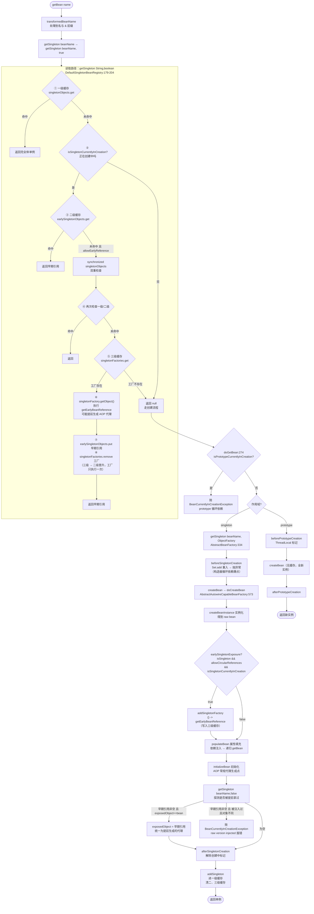
```mermaid
flowchart TD
    Start([getBean name]) --> Trans[transformedBeanName<br/>处理别名与 &amp; 前缀]
    Trans --> GS["getSingleton beanName → getSingleton beanName, true"]

    subgraph Read["读取路径：getSingleton String,boolean<br/>DefaultSingletonBeanRegistry:179-204"]
        L1{"① 一级缓存<br/>singletonObjects.get"}
        L1 -- "命中" --> Ret1[返回完全体单例]
        L1 -- "未命中" --> L2{"② isSingletonCurrentlyInCreation?<br/>正在创建中吗"}
        L2 -- "否" --> Null[返回 null<br/>走创建流程]
        L2 -- "是" --> L3{"③ 二级缓存<br/>earlySingletonObjects.get"}
        L3 -- "命中" --> Ret2[返回早期引用]
        L3 -- "未命中 且 allowEarlyReference" --> Lock["synchronized singletonObjects<br/>双重检查"]
        Lock --> L4{"④ 再次检查一级/二级"}
        L4 -- "命中" --> Ret3[返回]
        L4 -- "未命中" --> L5{"⑤ 三级缓存<br/>singletonFactories.get"}
        L5 -- "工厂存在" --> Call["⑥ singletonFactory.getObject()<br/>执行 getEarlyBeanReference<br/>可能提前生成 AOP 代理"]
        Call --> Promote["⑦ earlySingletonObjects.put 早期引用<br/>⑧ singletonFactories.remove 工厂<br/>（三级 → 二级晋升，工厂只执行一次）"]
        Promote --> Ret4[返回早期引用]
        L5 -- "工厂不存在" --> Null
    end

    GS --> Read
    Null --> Proto{"doGetBean:274<br/>isPrototypeCurrentlyInCreation?"}
    Proto -- "是" --> Boom1[抛 BeanCurrentlyInCreationException<br/>prototype 循环依赖]
    Proto -- "否" --> Scope{作用域?}

    Scope -- singleton --> Create["getSingleton beanName, ObjectFactory<br/>AbstractBeanFactory:334"]
    Create --> BSC["beforeSingletonCreation<br/>Set.add 重入 → 抛异常<br/>（构造器循环依赖爆点）"]
    BSC --> DCB["createBean → doCreateBean<br/>AbstractAutowireCapableBeanFactory:573"]
    DCB --> Inst["createBeanInstance 实例化<br/>得到 raw bean"]
    Inst --> ESE{"earlySingletonExposure?<br/>isSingleton && allowCircularReferences<br/>&& isSingletonCurrentlyInCreation"}
    ESE -- "true" --> ASF["addSingletonFactory<br/>() -> getEarlyBeanReference<br/>（写入三级缓存）"]
    ESE -- "false" --> Pop
    ASF --> Pop["populateBean 属性填充<br/>依赖注入 → 递归 getBean"]
    Pop --> Init["initializeBean 初始化<br/>AOP 常规代理生成点"]
    Init --> Check["getSingleton beanName,false<br/>探测是否被提前拿过"]
    Check -- "早期引用非空 且 exposedObject==bean" --> Swap["exposedObject = 早期引用<br/>统一为提前生成的代理"]
    Check -- "早期引用非空 且 被注入过且对象不同" --> Boom2["抛 BeanCurrentlyInCreationException<br/>raw version injected 报错"]
    Check -- "为空" --> ASC["afterSingletonCreation<br/>解除创建中标记"]
    Swap --> ASC
    ASC --> AddS["addSingleton<br/>进一级缓存<br/>清二、三级缓存"]
    AddS --> Done([返回单例])

    Scope -- prototype --> BPC["beforePrototypeCreation<br/>ThreadLocal 标记"]
    BPC --> CreateP["createBean（无缓存，全新实例）"]
    CreateP --> APC["afterPrototypeCreation"]
    APC --> DoneP([返回新实例])
```

---

## 11. 本章小结

| 要点 | 源码锚点 |
|---|---|
| 三级缓存字段定义 | `DefaultSingletonBeanRegistry.java:78,81,84`（另 `:87` registeredSingletons、`:90` singletonsCurrentlyInCreation、`:99` suppressedExceptions） |
| 读取 + 三级→二级晋升 | `DefaultSingletonBeanRegistry.getSingleton(String,boolean)` `:179-204` |
| 创建模板 + 防重入 + 最终进一级 | `DefaultSingletonBeanRegistry.getSingleton(String,ObjectFactory)` `:214-265`；`beforeSingletonCreation` `:353`；`addSingleton` `:137` |
| doGetBean 入口与缓存探测 | `AbstractBeanFactory.java:257`（getSingleton）、`:334-345`（创建 lambda）、`:274`（prototype 检查） |
| 早期暴露与工厂 lambda | `AbstractAutowireCapableBeanFactory.java:606-613` |
| getEarlyBeanReference 回调 | `AbstractAutowireCapableBeanFactory.java:981-989`；`SmartInstantiationAwareBeanPostProcessor.java:90` |
| AOP 提前代理与去重 | `AbstractAutoProxyCreator.java:140,241-245,289-297` |
| 早期引用回填/不一致报错 | `AbstractAutowireCapableBeanFactory.java:632-657` |
| 构造器循环无解 → @Lazy | `DefaultListableBeanFactory.java:1293-1315`；`ContextAnnotationAutowireCandidateResolver.java:51-131` |
| prototype 循环检测 | `AbstractBeanFactory.java:183,274-276,1175-1224` |
| Boot 2.6 开关 | `AbstractAutowireCapableBeanFactory.java:135,245-247,606` |

一句话总结：**三级缓存 = "完成品缓存 + 半成品缓存 + 半成品工厂缓存"**。`ObjectFactory` 工厂（第三级）的存在，让 Spring 能够把 AOP 代理的生成推迟到"循环依赖真正发生"的那一刻，既解开了单例字段注入的循环依赖，又最大限度保全了 Bean 的正常生命周期；代价是构造器注入与 prototype 的循环依赖从一开始就注定无解，Spring 对它们选择了立即失败而非静默救援。


# 第八章 Spring Web 实现原理


> 本章基于 Spring Framework **5.3.38** 真实源码（`spring-web`、`spring-webmvc` 模块）逐行走读。所有引用均为 `文件路径:行号` 形式，代码摘录未做任何改写。
>
> 说明：Spring 5.3.x 仍使用 `javax.servlet.*` 命名空间（Jakarta 迁移发生在 Spring 6 / 6.x 的 `jakarta.servlet.*`），因此本仓库中的 SPI 文件是 `META-INF/services/javax.servlet.ServletContainerInitializer`。其机制与 `jakarta.servlet.ServletContainerInitializer` 完全同构。

---

## 8.1 Web 环境整体架构与父子容器

### 8.1.1 Servlet 3.0+ 的 SPI：ServletContainerInitializer 与 SpringServletContainerInitializer

Servlet 3.0 规范（第 8.2.4 节）定义了一种服务端 SPI：容器启动时会通过 JDK 的 `ServiceLoader` 扫描 classpath 上所有 JAR 包中的 `META-INF/services/javax.servlet.ServletContainerInitializer` 文件，实例化其中声明的实现类，并调用其 `onStartup(Set<Class<?>>, ServletContext)` 方法；如果实现类上标注了 `@HandlesTypes`，容器还会预先扫描出所有匹配该类型的类，作为第一个参数传入。

Spring 在 `spring-web` 模块中提供的接入点是：

**SPI 声明文件** `spring-web/src/main/resources/META-INF/services/javax.servlet.ServletContainerInitializer`：

```
org.springframework.web.SpringServletContainerInitializer
```

**SPI 实现类** `spring-web/src/main/java/org/springframework/web/SpringServletContainerInitializer.java:113-114`：

```java
@HandlesTypes(WebApplicationInitializer.class)
public class SpringServletContainerInitializer implements ServletContainerInitializer {
```

注意这里存在**两层 SPI**：

1. **Servlet 容器层 SPI**：`javax.servlet.ServletContainerInitializer`，由 Tomcat/Jetty 等容器通过 JAR Services API 发现——`spring-web` 模块只要在 classpath 上，`SpringServletContainerInitializer` 就一定会被实例化和调用（`SpringServletContainerInitializer.java:42-50` 的 Javadoc 明确说明了这一点）。
2. **Spring 层 SPI**：`org.springframework.web.WebApplicationInitializer`，Spring 自己的用户扩展点。`@HandlesTypes(WebApplicationInitializer.class)` 让容器把 classpath 上所有实现了该接口的类收集起来传给 Spring。

核心委托逻辑 `SpringServletContainerInitializer.java:142-176`：

```java
@Override
public void onStartup(@Nullable Set<Class<?>> webAppInitializerClasses, ServletContext servletContext)
        throws ServletException {

    List<WebApplicationInitializer> initializers = Collections.emptyList();

    if (webAppInitializerClasses != null) {
        initializers = new ArrayList<>(webAppInitializerClasses.size());
        for (Class<?> waiClass : webAppInitializerClasses) {
            // Be defensive: Some servlet containers provide us with invalid classes,
            // no matter what @HandlesTypes says...
            if (!waiClass.isInterface() && !Modifier.isAbstract(waiClass.getModifiers()) &&
                    WebApplicationInitializer.class.isAssignableFrom(waiClass)) {
                try {
                    initializers.add((WebApplicationInitializer)
                            ReflectionUtils.accessibleConstructor(waiClass).newInstance());
                }
                catch (Throwable ex) {
                    throw new ServletException("Failed to instantiate WebApplicationInitializer class", ex);
                }
            }
        }
    }

    if (initializers.isEmpty()) {
        servletContext.log("No Spring WebApplicationInitializer types detected on classpath");
        return;
    }

    servletContext.log(initializers.size() + " Spring WebApplicationInitializers detected on classpath");
    AnnotationAwareOrderComparator.sort(initializers);
    for (WebApplicationInitializer initializer : initializers) {
        initializer.onStartup(servletContext);
    }
}
```

要点：

- 过滤掉接口与抽象类（防御某些容器传入非法类，`SpringServletContainerInitializer.java:151-153`）；
- 反射实例化每个 `WebApplicationInitializer`；
- `AnnotationAwareOrderComparator.sort` 排序（支持 `@Order`/`Ordered`）；
- 依次调用 `onStartup(ServletContext)`——**此时还没有任何 Spring 容器被创建**，一切都是在 Servlet 容器层面完成的注册动作。

### 8.1.2 从 AbstractContextLoaderInitializer 到 AbstractAnnotationConfigDispatcherServletInitializer

Spring 提供了一条抽象基类链，用于"零 web.xml"地注册根容器与 DispatcherServlet：

```
WebApplicationInitializer
        ↑
AbstractContextLoaderInitializer            （注册 ContextLoaderListener + 根容器）
        ↑
AbstractDispatcherServletInitializer        （注册 DispatcherServlet + 子容器 + Filter）
        ↑
AbstractAnnotationConfigDispatcherServletInitializer  （用注解配置类装配两个容器）
        ↑
用户自定义 MyWebAppInitializer extends AbstractAnnotationConfigDispatcherServletInitializer
```

**(1) AbstractContextLoaderInitializer**（`spring-web/src/main/java/org/springframework/web/context/AbstractContextLoaderInitializer.java:48-70`）：

```java
@Override
public void onStartup(ServletContext servletContext) throws ServletException {
    registerContextLoaderListener(servletContext);
}

protected void registerContextLoaderListener(ServletContext servletContext) {
    WebApplicationContext rootAppContext = createRootApplicationContext();
    if (rootAppContext != null) {
        ContextLoaderListener listener = new ContextLoaderListener(rootAppContext);
        listener.setContextInitializers(getRootApplicationContextInitializers());
        servletContext.addListener(listener);
    }
    ...
}
```

关键点：根容器在这里被**创建**（但**尚未 refresh**），随后包进 `ContextLoaderListener` 注册到 ServletContext。由于 Servlet 规范中 **listener 先于 servlet（load-on-startup）初始化**，根容器必然先于子容器启动——父子容器时序由 Servlet 容器的生命周期回调顺序天然保证。

**(2) AbstractDispatcherServletInitializer**（`spring-webmvc/src/main/java/org/springframework/web/servlet/support/AbstractDispatcherServletInitializer.java:61-107`）：

```java
@Override
public void onStartup(ServletContext servletContext) throws ServletException {
    super.onStartup(servletContext);              // 1. 先注册根容器（父类逻辑）
    registerDispatcherServlet(servletContext);    // 2. 再注册 DispatcherServlet
}

protected void registerDispatcherServlet(ServletContext servletContext) {
    String servletName = getServletName();
    ...
    WebApplicationContext servletAppContext = createServletApplicationContext();  // 创建子容器（未 refresh）
    FrameworkServlet dispatcherServlet = createDispatcherServlet(servletAppContext);
    dispatcherServlet.setContextInitializers(getServletApplicationContextInitializers());

    ServletRegistration.Dynamic registration = servletContext.addServlet(servletName, dispatcherServlet);
    ...
    registration.setLoadOnStartup(1);
    registration.addMapping(getServletMappings());
    registration.setAsyncSupported(isAsyncSupported());
    ...
}
```

`createDispatcherServlet` 默认 `new DispatcherServlet(servletAppContext)`（`AbstractDispatcherServletInitializer.java:134-136`），即**通过构造器注入子容器**——这对应 `FrameworkServlet(WebApplicationContext)` 构造器路径（见 8.1.4）。

**(3) AbstractAnnotationConfigDispatcherServletInitializer**（`spring-webmvc/.../support/AbstractAnnotationConfigDispatcherServletInitializer.java:53-80`）：

```java
@Override
@Nullable
protected WebApplicationContext createRootApplicationContext() {
    Class<?>[] configClasses = getRootConfigClasses();
    if (!ObjectUtils.isEmpty(configClasses)) {
        AnnotationConfigWebApplicationContext context = new AnnotationConfigWebApplicationContext();
        context.register(configClasses);
        return context;
    }
    else {
        return null;
    }
}

@Override
protected WebApplicationContext createServletApplicationContext() {
    AnnotationConfigWebApplicationContext context = new AnnotationConfigWebApplicationContext();
    Class<?>[] configClasses = getServletConfigClasses();
    if (!ObjectUtils.isEmpty(configClasses)) {
        context.register(configClasses);
    }
    return context;
}
```

用户只需实现 `getRootConfigClasses()` 与 `getServletConfigClasses()` 两个抽象方法（`AbstractAnnotationConfigDispatcherServletInitializer.java:88-98`）。若 `getRootConfigClasses()` 返回 `null`，则不注册 `ContextLoaderListener`，形成"单容器"结构（Spring Boot 的传统 war 部署即如此）。

### 8.1.3 传统 web.xml 方式：ContextLoaderListener 与根容器创建

传统方式在 `web.xml` 中配置：

```xml
<context-param>
    <param-name>contextClass</param-name>
    <param-value>org.springframework.web.context.support.AnnotationConfigWebApplicationContext</param-value>
</context-param>
<context-param>
    <param-name>contextConfigLocation</param-name>
    <param-value>classpath:applicationContext.xml</param-value>
</context-param>

<listener>
    <listener-class>org.springframework.web.context.ContextLoaderListener</listener-class>
</listener>

<servlet>
    <servlet-name>dispatcher</servlet-name>
    <servlet-class>org.springframework.web.servlet.DispatcherServlet</servlet-class>
    <init-param>
        <param-name>contextConfigLocation</param-name>
        <param-value>classpath:spring-mvc.xml</param-value>
    </init-param>
    <load-on-startup>1</load-on-startup>
</servlet>
```

`ContextLoaderListener.contextInitialized` 委托给 `ContextLoader.initWebApplicationContext(ServletContext)`（`spring-web/src/main/java/org/springframework/web/context/ContextLoader.java:247-303`）：

```java
public WebApplicationContext initWebApplicationContext(ServletContext servletContext) {
    if (servletContext.getAttribute(WebApplicationContext.ROOT_WEB_APPLICATION_CONTEXT_ATTRIBUTE) != null) {
        throw new IllegalStateException(
                "Cannot initialize context because there is already a root application context present - " +
                "check whether you have multiple ContextLoader* definitions in your web.xml!");
    }
    ...
    try {
        // Store context in local instance variable, to guarantee that
        // it is available on ServletContext shutdown.
        if (this.context == null) {
            this.context = createWebApplicationContext(servletContext);
        }
        if (this.context instanceof ConfigurableWebApplicationContext) {
            ConfigurableWebApplicationContext cwac = (ConfigurableWebApplicationContext) this.context;
            if (!cwac.isActive()) {
                // The context has not yet been refreshed -> provide services such as
                // setting the parent context, setting the application context id, etc
                if (cwac.getParent() == null) {
                    // The context instance was injected without an explicit parent ->
                    // determine parent for root web application context, if any.
                    ApplicationContext parent = loadParentContext(servletContext);
                    cwac.setParent(parent);
                }
                configureAndRefreshWebApplicationContext(cwac, servletContext);
            }
        }
        servletContext.setAttribute(WebApplicationContext.ROOT_WEB_APPLICATION_CONTEXT_ATTRIBUTE, this.context);
        ...
```

关键动作：

1. **防重**：`ROOT_WEB_APPLICATION_CONTEXT_ATTRIBUTE`（即 `WebApplicationContext.class.getName() + ".ROOT"`）已存在则抛异常（`ContextLoader.java:248-252`）；
2. **创建容器**：`createWebApplicationContext` → `determineContextClass`（`ContextLoader.java:317-324`）；
3. **配置并刷新**：`configureAndRefreshWebApplicationContext`（`ContextLoader.java:369-400`）；
4. **发布**：把根容器放进 ServletContext 属性，供后续 `FrameworkServlet` 通过 `WebApplicationContextUtils.getWebApplicationContext(servletContext)` 找到（`ContextLoader.java:281`）。

**容器实现类的确定——determineContextClass（`ContextLoader.java:334-367`）**：

```java
protected Class<?> determineContextClass(ServletContext servletContext) {
    String contextClassName = servletContext.getInitParameter(CONTEXT_CLASS_PARAM);   // "contextClass"
    if (contextClassName != null) {
        try {
            return ClassUtils.forName(contextClassName, ClassUtils.getDefaultClassLoader());
        }
        ...
    }
    else {
        if (defaultStrategies == null) {
            // Load default strategy implementations from properties file.
            // This is currently strictly internal and not meant to be customized
            // by application developers.
            try {
                ClassPathResource resource = new ClassPathResource(DEFAULT_STRATEGIES_PATH, ContextLoader.class);
                defaultStrategies = PropertiesLoaderUtils.loadProperties(resource);
            }
            ...
        }
        contextClassName = defaultStrategies.getProperty(WebApplicationContext.class.getName());
        ...
    }
}
```

优先级：`contextClass` context-param > **ContextLoader.properties SPI 文件**。该文件位于 `spring-web/src/main/resources/org/springframework/web/context/ContextLoader.properties`，全文只有一行有效内容：

```properties
# Default WebApplicationContext implementation class for ContextLoader.
# Used as fallback when no explicit context implementation has been specified as context-param.
# Not meant to be customized by application developers.

org.springframework.web.context.WebApplicationContext=org.springframework.web.context.support.XmlWebApplicationContext
```

即默认根容器是 **XmlWebApplicationContext**（注解式开发需显式把 `contextClass` 指定为 `AnnotationConfigWebApplicationContext`）。

**configureAndRefreshWebApplicationContext（`ContextLoader.java:369-400`）**：

```java
protected void configureAndRefreshWebApplicationContext(ConfigurableWebApplicationContext wac, ServletContext sc) {
    if (ObjectUtils.identityToString(wac).equals(wac.getId())) {
        ... // 生成默认 id：applicationContext.getContextPath 前缀
    }
    wac.setServletContext(sc);
    String configLocationParam = sc.getInitParameter(CONFIG_LOCATION_PARAM);      // "contextConfigLocation"
    if (configLocationParam != null) {
        wac.setConfigLocation(configLocationParam);
    }
    ... // initPropertySources：把 servletContext/initParams 作为 PropertySource 挂到 Environment
    customizeContext(sc, wac);   // 应用 ApplicationContextInitializer（contextInitializerClasses param）
    wac.refresh();               // ← 真正的容器启动（与第 3 章 refresh 流程一致）
}
```

`customizeContext`（`ContextLoader.java:419-440`）会解析 `contextInitializerClasses` / `globalInitializerClasses` init-param，实例化并按 `@Order` 排序后依次调用 `initializer.initialize(wac)`——这是根容器预留的扩展口（Spring Boot 就是通过 `ApplicationContextInitializer` 在 web 环境做容器定制）。

### 8.1.4 DispatcherServlet 与子容器

继承树：

```
javax.servlet.http.HttpServlet
        ↑
HttpServletBean          （把 ServletConfig init-param 当 Bean 属性注入；init() 模板方法）
        ↑
FrameworkServlet         （持有/创建子容器 WebApplicationContext；processRequest；doService 抽象）
        ↑
DispatcherServlet        （initStrategies 九大组件；doService→doDispatch 核心分发）
```

**HttpServletBean.init()——BeanWrapper 注入 init-param（`spring-webmvc/src/main/java/org/springframework/web/servlet/HttpServletBean.java:148-171`）**：

```java
@Override
public final void init() throws ServletException {

    // Set bean properties from init parameters.
    PropertyValues pvs = new ServletConfigPropertyValues(getServletConfig(), this.requiredProperties);
    if (!pvs.isEmpty()) {
        try {
            BeanWrapper bw = PropertyAccessorFactory.forBeanPropertyAccess(this);
            ResourceLoader resourceLoader = new ServletContextResourceLoader(getServletContext());
            bw.registerCustomEditor(Resource.class, new ResourceEditor(resourceLoader, getEnvironment()));
            initBeanWrapper(bw);
            bw.setPropertyValues(pvs, true);
        }
        catch (BeansException ex) {
            ...
        }
    }

    // Let subclasses do whatever initialization they like.
    initServletBean();
}
```

这就是 web.xml 中 `<init-param>contextConfigLocation</init-param>` 生效的原理：Servlet 本身被当作一个 JavaBean，`ServletConfigPropertyValues` 收集所有 init-param，`BeanWrapper` 通过 **setter 属性绑定**将 `contextConfigLocation` 注入到 `FrameworkServlet.setContextConfigLocation(String)`（`FrameworkServlet.java:369-371`）。`contextClass`、`contextId`、`namespace` 等 init-param 同理。之后回调 `initServletBean()` 模板方法。

**FrameworkServlet.initServletBean → initWebApplicationContext（`FrameworkServlet.java:521-549, 560-610`）**：

```java
@Override
protected final void initServletBean() throws ServletException {
    ...
    try {
        this.webApplicationContext = initWebApplicationContext();
        initFrameworkServlet();
    }
    ...
}

protected WebApplicationContext initWebApplicationContext() {
    WebApplicationContext rootContext =
            WebApplicationContextUtils.getWebApplicationContext(getServletContext());   // ① 找根容器
    WebApplicationContext wac = null;

    if (this.webApplicationContext != null) {
        // A context instance was injected at construction time -> use it
        wac = this.webApplicationContext;                                               // ② 构造器注入路径
        if (wac instanceof ConfigurableWebApplicationContext) {
            ConfigurableWebApplicationContext cwac = (ConfigurableWebApplicationContext) wac;
            if (!cwac.isActive()) {
                if (cwac.getParent() == null) {
                    // The context instance was injected without an explicit parent -> set
                    // the root application context (if any; may be null) as the parent
                    cwac.setParent(rootContext);                                       // ③ 设置 parent
                }
                configureAndRefreshWebApplicationContext(cwac);
            }
        }
    }
    if (wac == null) {
        // No context instance was injected at construction time -> see if one
        // has been registered in the servlet context.
        wac = findWebApplicationContext();                                             // ④ contextAttribute 路径
    }
    if (wac == null) {
        // No context instance is defined for this servlet -> create a local one
        wac = createWebApplicationContext(rootContext);                                // ⑤ web.xml 自建路径
    }

    if (!this.refreshEventReceived) {
        // Either the context is not a ConfigurableApplicationContext with refresh
        // support or the context injected at construction time had already been
        // refreshed -> trigger initial onRefresh manually here.
        synchronized (this.onRefreshMonitor) {
            onRefresh(wac);                                                            // ⑥ 触发 onRefresh
        }
    }

    if (this.publishContext) {
        // Publish the context as a servlet context attribute.
        String attrName = getServletContextAttributeName();                            // ⑦ 发布到 ServletContext
        getServletContext().setAttribute(attrName, wac);
    }

    return wac;
}
```

三条子容器来源路径：

| 路径 | 条件 | 场景 |
|------|------|------|
| ② 构造器注入 | `new DispatcherServlet(wac)` | Servlet 3.0+ 编程式注册（`AbstractDispatcherServletInitializer`） |
| ④ `contextAttribute` | init-param 指定 ServletContext 属性名 | 多 servlet 共享一个容器 |
| ⑤ 自建 | 以上皆无 | 传统 web.xml，无参构造 |

**自建路径 createWebApplicationContext（`FrameworkServlet.java:651-671`）**：

```java
protected WebApplicationContext createWebApplicationContext(@Nullable ApplicationContext parent) {
    Class<?> contextClass = getContextClass();
    ...
    ConfigurableWebApplicationContext wac =
            (ConfigurableWebApplicationContext) BeanUtils.instantiateClass(contextClass);

    wac.setEnvironment(getEnvironment());
    wac.setParent(parent);                       // ← 父容器在这里被"挂"上
    String configLocation = getContextConfigLocation();
    if (configLocation != null) {
        wac.setConfigLocation(configLocation);   // "contextConfigLocation" init-param
    }
    configureAndRefreshWebApplicationContext(wac);
    return wac;
}
```

默认 `contextClass` 是 `XmlWebApplicationContext`（`FrameworkServlet.java:156`，`DEFAULT_CONTEXT_CLASS`）；默认命名空间为 `servletName + "-servlet"`（`FrameworkServlet.java:150, 360-362`），因此 web.xml 不写 `contextConfigLocation` 时默认加载 `/WEB-INF/<servlet-name>-servlet.xml`。

**configureAndRefreshWebApplicationContext（`FrameworkServlet.java:673-703`）**：

```java
protected void configureAndRefreshWebApplicationContext(ConfigurableWebApplicationContext wac) {
    if (ObjectUtils.identityToString(wac).equals(wac.getId())) {
        ... // 默认 id：ContextPath/ServletName
    }
    wac.setServletContext(getServletContext());
    wac.setServletConfig(getServletConfig());
    wac.setNamespace(getNamespace());
    wac.addApplicationListener(new SourceFilteringListener(wac, new ContextRefreshListener()));
    ...
    ConfigurableEnvironment env = wac.getEnvironment();
    if (env instanceof ConfigurableWebEnvironment) {
        ((ConfigurableWebEnvironment) env).initPropertySources(getServletContext(), getServletConfig());
    }

    postProcessWebApplicationContext(wac);   // 子类钩子
    applyInitializers(wac);                  // contextInitializerClasses init-param
    wac.refresh();                           // ← 子容器启动；refresh 末尾发布 ContextRefreshedEvent
}
```

注意 `wac.addApplicationListener(new SourceFilteringListener(wac, new ContextRefreshListener()))`（第 690 行）：`FrameworkServlet` 自身监听子容器的 `ContextRefreshedEvent`，`onApplicationEvent`（`FrameworkServlet.java:839-844`）置 `refreshEventReceived = true` 并调用 `onRefresh(context)`。`DispatcherServlet` 覆写的 `onRefresh` 就是初始化九大组件的入口（`DispatcherServlet.java:489-492`）。若容器已提前 refresh（注入已激活容器），则 ⑥ 处手动补调 `onRefresh`——两条路径殊途同归，保证 `initStrategies` **恰好执行一次**。

### 8.1.5 父子容器的职责划分与查找顺序

经典约定：

- **根容器（Root WebApplicationContext）**：Service、Repository、DataSource、事务、安全等"中间层" Bean；
- **Servlet 子容器（Servlet WebApplicationContext）**：Controller、HandlerMapping、HandlerAdapter、ViewResolver、`spring MVC` 基础设施 Bean。

`AbstractContextLoaderInitializer` 的 Javadoc 对此有明确表述（`AbstractContextLoaderInitializer.java:75-79`）："it typically contains middle-tier services, data sources, etc."；`AbstractDispatcherServletInitializer.java:119-125` 则说子容器 "typically contains controllers, view resolvers, locale resolvers, and other web-related beans"。

**查找顺序的源码依据**——`AbstractBeanFactory.doGetBean`（`spring-beans/src/main/java/org/springframework/beans/factory/support/AbstractBeanFactory.java:249-298`）：

```java
// Check if bean definition exists in this factory.
BeanFactory parentBeanFactory = getParentBeanFactory();
if (parentBeanFactory != null && !containsBeanDefinition(beanName)) {
    // Not found -> check parent.
    String nameToLookup = originalBeanName(name);
    if (parentBeanFactory instanceof AbstractBeanFactory) {
        return ((AbstractBeanFactory) parentBeanFactory).doGetBean(
                nameToLookup, requiredType, args, typeCheckOnly);
    }
    ...
}
```

即：**先查本容器的 beanDefinition；查不到（且存在 parent）才委托 `parent.getBean`**。因此：

- 子容器里的 Controller `@Autowired` Service：本容器无定义 → 去 Root 容器解析 → 成功；
- 反之 Root 容器里的 Service `@Autowired` Controller：Root 无 parent，直接 `NoSuchBeanDefinitionException`——这就是"Controller 放 Root 容器也能跑、但事务/映射组件行为异常；Service 放子容器会因 Root 看不见而炸"的根源；
- `DispatcherServlet.initStrategies` 里各 `initXxx` 也普遍用 `BeanFactoryUtils.beansOfTypeIncludingAncestors(context, HandlerMapping.class, true, false)` **包含祖先容器**地查找（`DispatcherServlet.java:594-595` 等，第 4 个参数 `false` 表示**不**触发懒加载初始化）。

### 8.1.6 父子容器创建时序图与整体架构图

**父子容器创建时序图**：

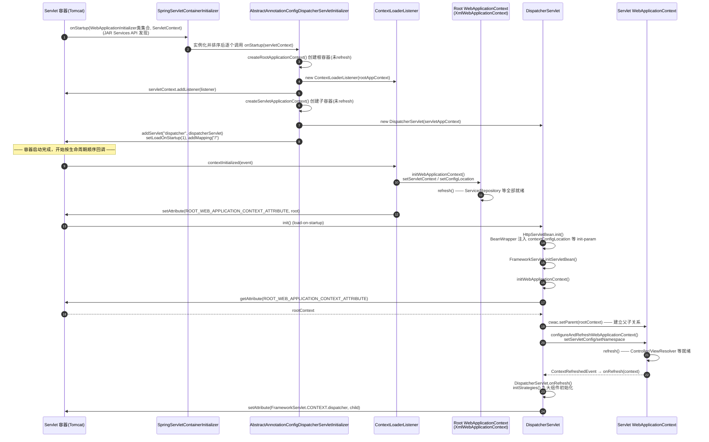
```mermaid
sequenceDiagram
    autonumber
    participant SC as Servlet 容器(Tomcat)
    participant SCI as SpringServletContainerInitializer
    participant WAI as AbstractAnnotationConfigDispatcherServletInitializer
    participant CLL as ContextLoaderListener
    participant Root as Root WebApplicationContext<br/>(XmlWebApplicationContext)
    participant DS as DispatcherServlet
    participant Child as Servlet WebApplicationContext

    SC->>SCI: onStartup(WebApplicationInitializer类集合, ServletContext)<br/>(JAR Services API 发现)
    SCI->>WAI: 实例化并排序后逐个调用 onStartup(servletContext)
    WAI->>WAI: createRootApplicationContext() 创建根容器(未refresh)
    WAI->>CLL: new ContextLoaderListener(rootAppContext)
    WAI->>SC: servletContext.addListener(listener)
    WAI->>WAI: createServletApplicationContext() 创建子容器(未refresh)
    WAI->>DS: new DispatcherServlet(servletAppContext)
    WAI->>SC: addServlet("dispatcher", dispatcherServlet)<br/>setLoadOnStartup(1), addMapping("/")

    Note over SC: —— 容器启动完成，开始按生命周期顺序回调 ——
    SC->>CLL: contextInitialized(event)
    CLL->>Root: initWebApplicationContext()<br/>setServletContext / setConfigLocation
    Root->>Root: refresh() —— Service/Repository 等全部就绪
    CLL->>SC: setAttribute(ROOT_WEB_APPLICATION_CONTEXT_ATTRIBUTE, root)

    SC->>DS: init() (load-on-startup)
    DS->>DS: HttpServletBean.init()<br/>BeanWrapper 注入 contextConfigLocation 等 init-param
    DS->>DS: FrameworkServlet.initServletBean()
    DS->>DS: initWebApplicationContext()
    DS->>SC: getAttribute(ROOT_WEB_APPLICATION_CONTEXT_ATTRIBUTE)
    SC-->>DS: rootContext
    DS->>Child: cwac.setParent(rootContext) —— 建立父子关系
    DS->>Child: configureAndRefreshWebApplicationContext()<br/>setServletConfig/setNamespace
    Child->>Child: refresh() —— Controller/ViewResolver 等就绪
    Child-->>DS: ContextRefreshedEvent → onRefresh(context)
    DS->>DS: DispatcherServlet.onRefresh()<br/>initStrategies() 九大组件初始化
    DS->>SC: setAttribute(FrameworkServlet.CONTEXT.dispatcher, child)
```

**整体架构图**：

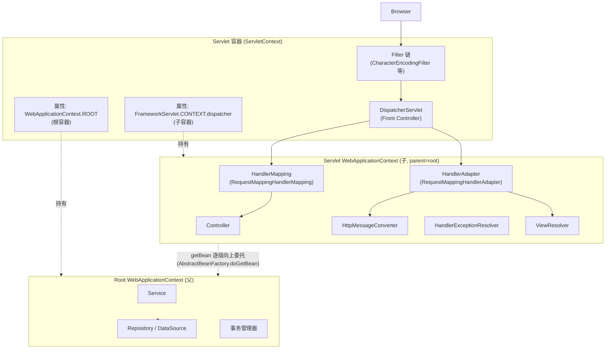
```mermaid
flowchart TB
    subgraph ServletContainer["Servlet 容器 (ServletContext)"]
        ATTR_ROOT["属性: WebApplicationContext.ROOT<br/>(根容器)"]
        ATTR_SERV["属性: FrameworkServlet.CONTEXT.dispatcher<br/>(子容器)"]
        F["Filter 链<br/>(CharacterEncodingFilter 等)"]
        DS["DispatcherServlet<br/>(Front Controller)"]
    end

    subgraph RootCtx["Root WebApplicationContext (父)"]
        SVC["Service"]
        REPO["Repository / DataSource"]
        TX["事务管理器"]
    end

    subgraph ChildCtx["Servlet WebApplicationContext (子, parent=root)"]
        CTRL["Controller"]
        HM["HandlerMapping<br/>(RequestMappingHandlerMapping)"]
        HA["HandlerAdapter<br/>(RequestMappingHandlerAdapter)"]
        VR["ViewResolver"]
        RES["HandlerExceptionResolver"]
        CONV["HttpMessageConverter"]
    end

    Browser["Browser"] --> F --> DS
    DS --> HM
    DS --> HA
    HM --> CTRL
    HA --> CONV
    HA --> VR
    ChildCtx -. "getBean 逐级向上委托<br/>(AbstractBeanFactory.doGetBean)" .-> RootCtx
    RootCtx --> REPO
    ATTR_ROOT -. 持有 .-> RootCtx
    ATTR_SERV -. 持有 .-> ChildCtx
```

---

## 8.2 DispatcherServlet 初始化流程

### 8.2.1 三段式初始化

```
HttpServletBean.init()                —— init-param 属性注入（见 8.1.4）
   └─ FrameworkServlet.initServletBean()
        └─ FrameworkServlet.initWebApplicationContext()   —— 创建/获取子容器并 refresh（见 8.1.4）
             └─ DispatcherServlet.onRefresh(context)     —— refresh 事件驱动
                  └─ DispatcherServlet.initStrategies(context)
```

### 8.2.2 initStrategies：九大组件（`DispatcherServlet.java:489-508`）

```java
/**
 * This implementation calls {@link #initStrategies}.
 */
@Override
protected void onRefresh(ApplicationContext context) {
    initStrategies(context);
}

/**
 * Initialize the strategy objects that this servlet uses.
 * <p>May be overridden in subclasses in order to initialize further strategy objects.
 */
protected void initStrategies(ApplicationContext context) {
    initMultipartResolver(context);
    initLocaleResolver(context);
    initThemeResolver(context);
    initHandlerMappings(context);
    initHandlerAdapters(context);
    initHandlerExceptionResolvers(context);
    initRequestToViewNameTranslator(context);
    initViewResolvers(context);
    initFlashMapManager(context);
}
```

九大组件（策略接口）一览：

| # | 组件（字段） | 策略接口 | 默认实现（DispatcherServlet.properties） |
|---|---|---|---|
| 1 | multipartResolver | `MultipartResolver` | **无默认**（不配置则无 multipart 支持） |
| 2 | localeResolver | `LocaleResolver` | `AcceptHeaderLocaleResolver` |
| 3 | themeResolver | `ThemeResolver` | `FixedThemeResolver` |
| 4 | handlerMappings | `HandlerMapping` | `BeanNameUrlHandlerMapping`、`RequestMappingHandlerMapping`、`RouterFunctionMapping` |
| 5 | handlerAdapters | `HandlerAdapter` | `HttpRequestHandlerAdapter`、`SimpleControllerHandlerAdapter`、`RequestMappingHandlerAdapter`、`HandlerFunctionAdapter` |
| 6 | handlerExceptionResolvers | `HandlerExceptionResolver` | `ExceptionHandlerExceptionResolver`、`ResponseStatusExceptionResolver`、`DefaultHandlerExceptionResolver` |
| 7 | viewNameTranslator | `RequestToViewNameTranslator` | `DefaultRequestToViewNameTranslator` |
| 8 | viewResolvers | `ViewResolver` | `InternalResourceViewResolver` |
| 9 | flashMapManager | `FlashMapManager` | `SessionFlashMapManager` |

默认策略 SPI 文件 `spring-webmvc/src/main/resources/org/springframework/web/servlet/DispatcherServlet.properties` **全文**（注释翻译：DispatcherServlet 策略接口的默认实现类；当 DispatcherServlet 容器中找不到匹配 Bean 时作为兜底；**不**供应用开发者定制）：

```properties
# Default implementation classes for DispatcherServlet's strategy interfaces.
# Used as fallback when no matching beans are found in the DispatcherServlet context.
# Not meant to be customized by application developers.

org.springframework.web.servlet.LocaleResolver=org.springframework.web.servlet.i18n.AcceptHeaderLocaleResolver

org.springframework.web.servlet.ThemeResolver=org.springframework.web.servlet.theme.FixedThemeResolver

org.springframework.web.servlet.HandlerMapping=org.springframework.web.servlet.handler.BeanNameUrlHandlerMapping,\
	org.springframework.web.servlet.mvc.method.annotation.RequestMappingHandlerMapping,\
	org.springframework.web.servlet.function.support.RouterFunctionMapping

org.springframework.web.servlet.HandlerAdapter=org.springframework.web.servlet.mvc.HttpRequestHandlerAdapter,\
	org.springframework.web.servlet.mvc.SimpleControllerHandlerAdapter,\
	org.springframework.web.servlet.mvc.method.annotation.RequestMappingHandlerAdapter,\
	org.springframework.web.servlet.function.support.HandlerFunctionAdapter


org.springframework.web.servlet.HandlerExceptionResolver=org.springframework.web.servlet.mvc.method.annotation.ExceptionHandlerExceptionResolver,\
	org.springframework.web.servlet.mvc.annotation.ResponseStatusExceptionResolver,\
	org.springframework.web.servlet.mvc.support.DefaultHandlerExceptionResolver

org.springframework.web.servlet.RequestToViewNameTranslator=org.springframework.web.servlet.view.DefaultRequestToViewNameTranslator

org.springframework.web.servlet.ViewResolver=org.springframework.web.servlet.view.InternalResourceViewResolver

org.springframework.web.servlet.FlashMapManager=org.springframework.web.servlet.support.SessionFlashMapManager
```

### 8.2.3 三种初始化模式与 detectAll* 逻辑

九个 `initXxx` 分为两类查找模式：

**模式 A：按固定 Bean 名查找（单实例组件）**——以 `initLocaleResolver` 为例（`DispatcherServlet.java:539-557`）：

```java
private void initLocaleResolver(ApplicationContext context) {
    try {
        this.localeResolver = context.getBean(LOCALE_RESOLVER_BEAN_NAME, LocaleResolver.class);   // "localeResolver"
        ...
    }
    catch (NoSuchBeanDefinitionException ex) {
        // We need to use the default.
        this.localeResolver = getDefaultStrategy(context, LocaleResolver.class);
        ...
    }
}
```

先 `context.getBean("localeResolver", LocaleResolver.class)`（Bean 名常量见 `DispatcherServlet.java:170-209`，如 `MULTIPART_RESOLVER_BEAN_NAME = "multipartResolver"`、`LOCALE_RESOLVER_BEAN_NAME = "localeResolver"`、`HANDLER_MAPPING_BEAN_NAME = "handlerMapping"`、`VIEW_RESOLVER_BEAN_NAME = "viewResolver"`）；抛 `NoSuchBeanDefinitionException` 时走 `getDefaultStrategy`。注意 `initMultipartResolver`（`DispatcherServlet.java:515-532`）捕获后置 **null**——没有默认 MultipartResolver，这是九大组件中唯一无兜底的。

**模式 B：按类型批量查找（集合组件）**——以 `initHandlerMappings` 为例（`DispatcherServlet.java:589-628`）：

```java
private void initHandlerMappings(ApplicationContext context) {
    this.handlerMappings = null;

    if (this.detectAllHandlerMappings) {
        // Find all HandlerMappings in the ApplicationContext, including ancestor contexts.
        Map<String, HandlerMapping> matchingBeans =
                BeanFactoryUtils.beansOfTypeIncludingAncestors(context, HandlerMapping.class, true, false);
        if (!matchingBeans.isEmpty()) {
            this.handlerMappings = new ArrayList<>(matchingBeans.values());
            // We keep HandlerMappings in sorted order.
            AnnotationAwareOrderComparator.sort(this.handlerMappings);
        }
    }
    else {
        try {
            HandlerMapping hm = context.getBean(HANDLER_MAPPING_BEAN_NAME, HandlerMapping.class);
            this.handlerMappings = Collections.singletonList(hm);
        }
        catch (NoSuchBeanDefinitionException ex) {
            // Ignore, we'll add a default HandlerMapping later.
        }
    }

    // Ensure we have at least one HandlerMapping, by registering
    // a default HandlerMapping if no other mappings are found.
    if (this.handlerMappings == null) {
        this.handlerMappings = getDefaultStrategies(context, HandlerMapping.class);
        ...
    }

    for (HandlerMapping mapping : this.handlerMappings) {
        if (mapping.usesPathPatterns()) {
            this.parseRequestPath = true;
            break;
        }
    }
}
```

执行逻辑：

1. `detectAllHandlerMappings`（默认 `true`，`DispatcherServlet.java:291`；可用 init-param `detectAllHandlerMappings` 关闭，setter 在 `DispatcherServlet.java:420-422`）：`beansOfTypeIncludingAncestors` 在**本容器 + 祖先容器**中按类型找**所有** `HandlerMapping` Bean，再按 `@Order` 排序——这就是注解配置（`@EnableWebMvc`）里注册的组件能覆盖默认策略的机制：**容器里有就绝不用 properties 里的默认值**；
2. 关闭 detectAll 时按 Bean 名 `handlerMapping` 精确取一个；
3. 两者都没找到 → `getDefaultStrategies` 从 properties 兜底；
4. 末尾探测是否有 `HandlerMapping` 启用了 `PathPatternParser`（5.3 新路径解析），置 `parseRequestPath` 标志，供 `doService` 里预解析 `RequestPath`（见 8.3.2）。

`initHandlerAdapters`（`DispatcherServlet.java:635-667`）、`initHandlerExceptionResolvers`（`DispatcherServlet.java:674-707`）、`initViewResolvers`（`DispatcherServlet.java:739-771`）与上述结构逐行同构，均遵循 "detectAll* → 按名 → 默认策略" 三级降级。

### 8.2.4 默认策略的加载：getDefaultStrategies（`DispatcherServlet.java:844-918`）

```java
protected <T> T getDefaultStrategy(ApplicationContext context, Class<T> strategyInterface) {
    List<T> strategies = getDefaultStrategies(context, strategyInterface);
    if (strategies.size() != 1) {
        throw new BeanInitializationException(
                "DispatcherServlet needs exactly 1 strategy for interface [" + strategyInterface.getName() + "]");
    }
    return strategies.get(0);
}

@SuppressWarnings("unchecked")
protected <T> List<T> getDefaultStrategies(ApplicationContext context, Class<T> strategyInterface) {
    if (defaultStrategies == null) {
        try {
            // Load default strategy implementations from properties file.
            // This is currently strictly internal and not meant to be customized
            // by application developers.
            ClassPathResource resource = new ClassPathResource(DEFAULT_STRATEGIES_PATH, DispatcherServlet.class);
            defaultStrategies = PropertiesLoaderUtils.loadProperties(resource);       // DispatcherServlet.properties
        }
        ...
    }

    String key = strategyInterface.getName();
    String value = defaultStrategies.getProperty(key);
    if (value != null) {
        String[] classNames = StringUtils.commaDelimitedListToStringArray(value);
        List<T> strategies = new ArrayList<>(classNames.length);
        for (String className : classNames) {
            try {
                Class<?> clazz = ClassUtils.forName(className, DispatcherServlet.class.getClassLoader());
                Object strategy = createDefaultStrategy(context, clazz);
                strategies.add((T) strategy);
            }
            ...
        }
        return strategies;
    }
    else {
        return Collections.emptyList();
    }
}

protected Object createDefaultStrategy(ApplicationContext context, Class<?> clazz) {
    return context.getAutowireCapableBeanFactory().createBean(clazz);
}
```

两个细节：

- properties 文件**包级私有**（与 `DispatcherServlet` 同包，`DEFAULT_STRATEGIES_PATH = "DispatcherServlet.properties"`，`DispatcherServlet.java:275`），Javadoc 反复强调"严格内部、不供定制"——想换组件就在子容器里注册同类型 Bean，而不是改这个文件；
- 默认策略实例通过 `context.getAutowireCapableBeanFactory().createBean(clazz)` 创建（`DispatcherServlet.java:916-918`），即**它们不是容器 Bean**，但走完整 Bean 生命周期（依赖注入、Aware 回调等）。

`ContextLoader.properties`（根容器默认类）与 `DispatcherServlet.properties`（九大组件默认类）是 Spring Web 中两处典型的 **properties 形式 SPI**，加上 `META-INF/services/javax.servlet.ServletContainerInitializer`（JDK ServiceLoader 形式 SPI），构成本章的三级"约定优于配置"底座。

---

## 8.3 请求处理流程

### 8.3.1 从 HttpServlet.service 到 FrameworkServlet.doService

**入口**：`FrameworkServlet.service`（`FrameworkServlet.java:874-885`）拦截 PATCH（HttpServlet 原生不支持 PATCH），其余走 `super.service()` 由 HttpServlet 按 HTTP 动词分发到 `doGet/doPost/doPut/doDelete`——这些方法全部是 `final` 并统一委托 `processRequest`（如 `doGet`，`FrameworkServlet.java:894-899`）：

```java
@Override
protected final void doGet(HttpServletRequest request, HttpServletResponse response)
        throws ServletException, IOException {

    processRequest(request, response);
}
```

**processRequest——上下文绑定与事件发布（`FrameworkServlet.java:988-1025`）**：

```java
protected final void processRequest(HttpServletRequest request, HttpServletResponse response)
        throws ServletException, IOException {

    long startTime = System.currentTimeMillis();
    Throwable failureCause = null;

    LocaleContext previousLocaleContext = LocaleContextHolder.getLocaleContext();
    LocaleContext localeContext = buildLocaleContext(request);

    RequestAttributes previousAttributes = RequestContextHolder.getRequestAttributes();
    ServletRequestAttributes requestAttributes = buildRequestAttributes(request, response, previousAttributes);

    WebAsyncManager asyncManager = WebAsyncUtils.getAsyncManager(request);
    asyncManager.registerCallableInterceptor(FrameworkServlet.class.getName(), new RequestBindingInterceptor());

    initContextHolders(request, localeContext, requestAttributes);

    try {
        doService(request, response);
    }
    catch (ServletException | IOException ex) {
        failureCause = ex;
        throw ex;
    }
    catch (Throwable ex) {
        failureCause = ex;
        throw new NestedServletException("Request processing failed", ex);
    }

    finally {
        resetContextHolders(request, previousLocaleContext, previousAttributes);
        if (requestAttributes != null) {
            requestAttributes.requestCompleted();
        }
        logResult(request, response, failureCause, asyncManager);
        publishRequestHandledEvent(request, response, startTime, failureCause);
    }
}
```

职责：把当前请求绑定到 `LocaleContextHolder` / `RequestContextHolder` 两个 ThreadLocal（`initContextHolders`，`FrameworkServlet.java:1062-1071`），使任意层代码（如 Service 里用 `RequestContextHolder.currentRequestAttributes()`）都能拿到当前请求；结束后恢复并发布 `ServletRequestHandledEvent`（`FrameworkServlet.java:1135-1148`）。

**DispatcherServlet.doService——挂框架属性（`DispatcherServlet.java:925-978`）**：

```java
@Override
protected void doService(HttpServletRequest request, HttpServletResponse response) throws Exception {
    logRequest(request);

    // Keep a snapshot of the request attributes in case of an include,
    // to be able to restore the original attributes after the include.
    Map<String, Object> attributesSnapshot = null;
    if (WebUtils.isIncludeRequest(request)) {
        ...
    }

    // Make framework objects available to handlers and view objects.
    request.setAttribute(WEB_APPLICATION_CONTEXT_ATTRIBUTE, getWebApplicationContext());
    request.setAttribute(LOCALE_RESOLVER_ATTRIBUTE, this.localeResolver);
    request.setAttribute(THEME_RESOLVER_ATTRIBUTE, this.themeResolver);
    request.setAttribute(THEME_SOURCE_ATTRIBUTE, getThemeSource());

    if (this.flashMapManager != null) {
        FlashMap inputFlashMap = this.flashMapManager.retrieveAndUpdate(request, response);
        if (inputFlashMap != null) {
            request.setAttribute(INPUT_FLASH_MAP_ATTRIBUTE, Collections.unmodifiableMap(inputFlashMap));
        }
        request.setAttribute(OUTPUT_FLASH_MAP_ATTRIBUTE, new FlashMap());
        request.setAttribute(FLASH_MAP_MANAGER_ATTRIBUTE, this.flashMapManager);
    }

    RequestPath previousRequestPath = null;
    if (this.parseRequestPath) {
        previousRequestPath = (RequestPath) request.getAttribute(ServletRequestPathUtils.PATH_ATTRIBUTE);
        ServletRequestPathUtils.parseAndCache(request);
    }

    try {
        doDispatch(request, response);
    }
    finally {
        ...
    }
}
```

挂到 request 上的框架属性（属性名常量在 `DispatcherServlet.java:221-227` 等处，形如 `DispatcherServlet.class.getName() + ".CONTEXT"`）：

- `WEB_APPLICATION_CONTEXT_ATTRIBUTE`：子容器；
- `LOCALE_RESOLVER_ATTRIBUTE` / `THEME_RESOLVER_ATTRIBUTE` / `THEME_SOURCE_ATTRIBUTE`；
- `INPUT_FLASH_MAP_ATTRIBUTE`（上一请求暂存的 Flash 属性，redirect 传参）/ `OUTPUT_FLASH_MAP_ATTRIBUTE` / `FLASH_MAP_MANAGER_ATTRIBUTE`；
- 启用 `PathPatternParser` 时预解析并缓存 `RequestPath`（`ServletRequestPathUtils.parseAndCache`）。

### 8.3.2 doDispatch 完整走读（`DispatcherServlet.java:1032-1112`）

```java
@SuppressWarnings("deprecation")
protected void doDispatch(HttpServletRequest request, HttpServletResponse response) throws Exception {
    HttpServletRequest processedRequest = request;
    HandlerExecutionChain mappedHandler = null;
    boolean multipartRequestParsed = false;

    WebAsyncManager asyncManager = WebAsyncUtils.getAsyncManager(request);

    try {
        ModelAndView mv = null;
        Exception dispatchException = null;

        try {
            processedRequest = checkMultipart(request);                    // ① multipart 包装
            multipartRequestParsed = (processedRequest != request);

            // Determine handler for the current request.
            mappedHandler = getHandler(processedRequest);                  // ② 找 HandlerExecutionChain
            if (mappedHandler == null) {
                noHandlerFound(processedRequest, response);
                return;
            }

            // Determine handler adapter for the current request.
            HandlerAdapter ha = getHandlerAdapter(mappedHandler.getHandler());  // ③ 找 HandlerAdapter

            // Process last-modified header, if supported by the handler.
            String method = request.getMethod();
            boolean isGet = HttpMethod.GET.matches(method);
            if (isGet || HttpMethod.HEAD.matches(method)) {                 // ④ Last-Modified 协商
                long lastModified = ha.getLastModified(request, mappedHandler.getHandler());
                if (new ServletWebRequest(request, response).checkNotModified(lastModified) && isGet) {
                    return;
                }
            }

            if (!mappedHandler.applyPreHandle(processedRequest, response)) {  // ⑤ 拦截器前置
                return;
            }

            // Actually invoke the handler.
            mv = ha.handle(processedRequest, response, mappedHandler.getHandler());  // ⑥ 执行处理器

            if (asyncManager.isConcurrentHandlingStarted()) {              // ⑦ 异步分支
                return;
            }

            applyDefaultViewName(processedRequest, mv);                    // ⑧ 缺省视图名
            mappedHandler.applyPostHandle(processedRequest, response, mv); // ⑨ 拦截器后置
        }
        catch (Exception ex) {
            dispatchException = ex;
        }
        catch (Throwable err) {
            // As of 4.3, we're processing Errors thrown from handler methods as well,
            // making them available for @ExceptionHandler methods and other scenarios.
            dispatchException = new NestedServletException("Handler dispatch failed", err);
        }
        processDispatchResult(processedRequest, response, mappedHandler, mv, dispatchException);  // ⑩ 渲染/异常
    }
    catch (Exception ex) {
        triggerAfterCompletion(processedRequest, response, mappedHandler, ex);   // ⑪ 异常补触发 afterCompletion
    }
    catch (Throwable err) {
        triggerAfterCompletion(processedRequest, response, mappedHandler,
                new NestedServletException("Handler processing failed", err));
    }
    finally {
        if (asyncManager.isConcurrentHandlingStarted()) {
            // Instead of postHandle and afterCompletion
            if (mappedHandler != null) {
                mappedHandler.applyAfterConcurrentHandlingStarted(processedRequest, response);
            }
        }
        else {
            // Clean up any resources used by a multipart request.
            if (multipartRequestParsed) {
                cleanupMultipart(processedRequest);
            }
        }
    }
}
```

各步骤对应源码：

**① checkMultipart**（`DispatcherServlet.java:1197-1225`）：有 `MultipartResolver` 且 `isMultipart(request)` 时调 `resolveMultipart(request)` 把原生 request 包装成 `MultipartHttpServletRequest`，后续参数解析即可拿到 `MultipartFile`。

**② getHandler**（`DispatcherServlet.java:1263-1273`）：

```java
@Nullable
protected HandlerExecutionChain getHandler(HttpServletRequest request) throws Exception {
    if (this.handlerMappings != null) {
        for (HandlerMapping mapping : this.handlerMappings) {
            HandlerExecutionChain handler = mapping.getHandler(request);
            if (handler != null) {
                return handler;
            }
        }
    }
    return null;
}
```

按序遍历所有 `HandlerMapping`，返回第一个命中。找不到时 `noHandlerFound`（`DispatcherServlet.java:1281-1292`）：`throwExceptionIfNoHandlerFound`（默认 false）决定抛 `NoHandlerFoundException` 还是 `response.sendError(404)`。

`HandlerMapping.getHandler` 的公共入口在 `AbstractHandlerMapping`（`spring-webmvc/.../handler/AbstractHandlerMapping.java:498-539`）：

```java
@Override
@Nullable
public final HandlerExecutionChain getHandler(HttpServletRequest request) throws Exception {
    Object handler = getHandlerInternal(request);          // 子类：AbstractHandlerMethodMapping 实现
    if (handler == null) {
        handler = getDefaultHandler();
    }
    if (handler == null) {
        return null;
    }
    // Bean name or resolved handler?
    if (handler instanceof String) {
        String handlerName = (String) handler;
        handler = obtainApplicationContext().getBean(handlerName);
    }
    ...
    HandlerExecutionChain executionChain = getHandlerExecutionChain(handler, request);
    ...
}
```

**拦截器链组装 getHandlerExecutionChain**（`AbstractHandlerMapping.java:605-621`）：

```java
protected HandlerExecutionChain getHandlerExecutionChain(Object handler, HttpServletRequest request) {
    HandlerExecutionChain chain = (handler instanceof HandlerExecutionChain ?
            (HandlerExecutionChain) handler : new HandlerExecutionChain(handler));

    for (HandlerInterceptor interceptor : this.adaptedInterceptors) {
        if (interceptor instanceof MappedInterceptor) {
            MappedInterceptor mappedInterceptor = (MappedInterceptor) interceptor;
            if (mappedInterceptor.matches(request)) {
                chain.addInterceptor(mappedInterceptor.getInterceptor());
            }
        }
        else {
            chain.addInterceptor(interceptor);
        }
    }
    return chain;
}
```

`MappedInterceptor`（`<mvc:interceptors>` 里带 path pattern 的）按 URL 过滤，命中的才进链。

**③ getHandlerAdapter**（`DispatcherServlet.java:1299-1309`）：

```java
protected HandlerAdapter getHandlerAdapter(Object handler) throws ServletException {
    if (this.handlerAdapters != null) {
        for (HandlerAdapter adapter : this.handlerAdapters) {
            if (adapter.supports(handler)) {
                return adapter;
            }
        }
    }
    throw new ServletException("No adapter for handler [" + handler +
            "]: The DispatcherServlet configuration needs to include a HandlerAdapter that supports this handler");
}
```

对 `HandlerMethod`，`RequestMappingHandlerAdapter.supportsInternal` 恒返回 true（`RequestMappingHandlerAdapter.java:781-784`）。

**⑤ 拦截器前置 applyPreHandle**（`spring-webmvc/.../HandlerExecutionChain.java:145-155`）：

```java
boolean applyPreHandle(HttpServletRequest request, HttpServletResponse response) throws Exception {
    for (int i = 0; i < this.interceptorList.size(); i++) {
        HandlerInterceptor interceptor = this.interceptorList.get(i);
        if (!interceptor.preHandle(request, response, this.handler)) {
            triggerAfterCompletion(request, response, null);
            return false;
        }
        this.interceptorIndex = i;
    }
    return true;
}
```

任一 `preHandle` 返回 false：立即对**已通过**的拦截器（`interceptorIndex` 记录）触发 `afterCompletion` 后中断整条链。

**⑥ ha.handle → HandlerMethod 调用**（`RequestMappingHandlerAdapter.handleInternal`，`RequestMappingHandlerAdapter.java:787-822`）→ `invokeHandlerMethod`（`RequestMappingHandlerAdapter.java:853-913`）：

```java
@Nullable
protected ModelAndView invokeHandlerMethod(HttpServletRequest request,
        HttpServletResponse response, HandlerMethod handlerMethod) throws Exception {
    ...
    try {
        WebDataBinderFactory binderFactory = getDataBinderFactory(handlerMethod);       // @InitBinder 方法收集
        ModelFactory modelFactory = getModelFactory(handlerMethod, binderFactory);      // @ModelAttribute 方法收集

        ServletInvocableHandlerMethod invocableMethod = createInvocableHandlerMethod(handlerMethod);
        if (this.argumentResolvers != null) {
            invocableMethod.setHandlerMethodArgumentResolvers(this.argumentResolvers);
        }
        if (this.returnValueHandlers != null) {
            invocableMethod.setHandlerMethodReturnValueHandlers(this.returnValueHandlers);
        }
        invocableMethod.setDataBinderFactory(binderFactory);
        invocableMethod.setParameterNameDiscoverer(this.parameterNameDiscoverer);

        ModelAndViewContainer mavContainer = new ModelAndViewContainer();
        mavContainer.addAllAttributes(RequestContextUtils.getInputFlashMap(request));   // Flash 属性进 Model
        modelFactory.initModel(webRequest, mavContainer, invocableMethod);              // 先执行 @ModelAttribute 方法
        mavContainer.setIgnoreDefaultModelOnRedirect(this.ignoreDefaultModelOnRedirect);

        if (asyncManager.hasConcurrentResult()) {                                       // 异步请求第二次分发：恢复结果
            Object result = asyncManager.getConcurrentResult();
            ...
            invocableMethod = invocableMethod.wrapConcurrentResult(result);
        }

        invocableMethod.invokeAndHandle(webRequest, mavContainer);                      // ← 真正反射调用控制器方法
        if (asyncManager.isConcurrentHandlingStarted()) {
            return null;
        }

        return getModelAndView(mavContainer, modelFactory, webRequest);                 // 组装 ModelAndView
    }
    finally {
        webRequest.requestCompleted();
    }
}
```

调用核心 `ServletInvocableHandlerMethod.invokeAndHandle`（`spring-webmvc/.../ServletInvocableHandlerMethod.java:114-144`）：

```java
public void invokeAndHandle(ServletWebRequest webRequest, ModelAndViewContainer mavContainer,
        Object... providedArgs) throws Exception {

    Object returnValue = invokeForRequest(webRequest, mavContainer, providedArgs);
    setResponseStatus(webRequest);
    ...
    mavContainer.setRequestHandled(false);
    Assert.state(this.returnValueHandlers != null, "No return value handlers");
    try {
        this.returnValueHandlers.handleReturnValue(
                returnValue, getReturnValueType(returnValue), mavContainer, webRequest);
    }
    ...
}
```

`InvocableHandlerMethod.invokeForRequest` → `getMethodArgumentValues` → `doInvoke`（`spring-web/.../support/InvocableHandlerMethod.java:143-151, 159-193, 199-228`）：

```java
@Nullable
public Object invokeForRequest(NativeWebRequest request, @Nullable ModelAndViewContainer mavContainer,
        Object... providedArgs) throws Exception {

    Object[] args = getMethodArgumentValues(request, mavContainer, providedArgs);
    if (logger.isTraceEnabled()) {
        logger.trace("Arguments: " + Arrays.toString(args));
    }
    return doInvoke(args);
}

protected Object[] getMethodArgumentValues(NativeWebRequest request, @Nullable ModelAndViewContainer mavContainer,
        Object... providedArgs) throws Exception {

    MethodParameter[] parameters = getMethodParameters();
    ...
    for (int i = 0; i < parameters.length; i++) {
        MethodParameter parameter = parameters[i];
        parameter.initParameterNameDiscovery(this.parameterNameDiscoverer);
        args[i] = findProvidedArgument(parameter, providedArgs);      // providedArgs（如异常对象）优先
        if (args[i] != null) {
            continue;
        }
        if (!this.resolvers.supportsParameter(parameter)) {
            throw new IllegalStateException(formatArgumentError(parameter, "No suitable resolver"));
        }
        try {
            args[i] = this.resolvers.resolveArgument(parameter, mavContainer, request, this.dataBinderFactory);
        }
        ...
    }
    return args;
}

@Nullable
protected Object doInvoke(Object... args) throws Exception {
    Method method = getBridgedMethod();
    try {
        ...
        return method.invoke(getBean(), args);                        // ← 原生反射调用控制器方法
    }
    catch (InvocationTargetException ex) {
        // Unwrap for HandlerExceptionResolvers ...
        Throwable targetException = ex.getTargetException();          // 解包，交给异常解析器
        ...
    }
}
```

**⑩ processDispatchResult**（`DispatcherServlet.java:1130-1170`）：

```java
private void processDispatchResult(HttpServletRequest request, HttpServletResponse response,
        @Nullable HandlerExecutionChain mappedHandler, @Nullable ModelAndView mv,
        @Nullable Exception exception) throws Exception {

    boolean errorView = false;

    if (exception != null) {
        if (exception instanceof ModelAndViewDefiningException) {
            ...
        }
        else {
            Object handler = (mappedHandler != null ? mappedHandler.getHandler() : null);
            mv = processHandlerException(request, response, handler, exception);   // 异常解析器
            errorView = (mv != null);
        }
    }

    // Did the handler return a view to render?
    if (mv != null && !mv.wasCleared()) {
        render(mv, request, response);                                             // 视图渲染
        ...
    }
    ...
    if (mappedHandler != null) {
        // Exception (if any) is already handled..
        mappedHandler.triggerAfterCompletion(request, response, null);             // afterCompletion（正常路径）
    }
}
```

**processHandlerException**（`DispatcherServlet.java:1322-1361`）按序问询 `HandlerExceptionResolver`（`ExceptionHandlerExceptionResolver` → `ResponseStatusExceptionResolver` → `DefaultHandlerExceptionResolver`），第一个返回非 null `ModelAndView` 者胜出；全部返回 null 则 `throw ex` 原样上抛给容器。

**⑪ triggerAfterCompletion**（`DispatcherServlet.java:1456-1463`）→ `HandlerExecutionChain.triggerAfterCompletion`（`HandlerExecutionChain.java:174-184`）：只对 `preHandle` 已成功的拦截器**逆序**回调 `afterCompletion`，且单个回调抛异常仅记日志不影响其余回调。

### 8.3.3 HandlerMapping 的注册与匹配（RequestMappingHandlerMapping）

**启动期注册**：`RequestMappingHandlerMapping` 实现 `InitializingBean`（`spring-webmvc/.../RequestMappingHandlerMapping.java:189-206`）：

```java
@Override
@SuppressWarnings("deprecation")
public void afterPropertiesSet() {
    this.config = new RequestMappingInfo.BuilderConfiguration();
    this.config.setTrailingSlashMatch(useTrailingSlashMatch());
    this.config.setContentNegotiationManager(getContentNegotiationManager());

    if (getPatternParser() != null) {                 // 5.3：优先 PathPatternParser
        this.config.setPatternParser(getPatternParser());
        ...
    }
    else {                                            // 兼容：AntPathMatcher + 后缀匹配
        this.config.setSuffixPatternMatch(useSuffixPatternMatch());
        this.config.setRegisteredSuffixPatternMatch(useRegisteredSuffixPatternMatch());
        this.config.setPathMatcher(getPathMatcher());
    }

    super.afterPropertiesSet();                       // → AbstractHandlerMethodMapping.afterPropertiesSet
}
```

`AbstractHandlerMethodMapping.afterPropertiesSet` → `initHandlerMethods`（`spring-webmvc/.../handler/AbstractHandlerMethodMapping.java:212-241`）：

```java
@Override
public void afterPropertiesSet() {
    initHandlerMethods();
}

protected void initHandlerMethods() {
    for (String beanName : getCandidateBeanNames()) {
        if (!beanName.startsWith(SCOPED_TARGET_NAME_PREFIX)) {
            processCandidateBean(beanName);
        }
    }
    handlerMethodsInitialized(getHandlerMethods());
}

protected String[] getCandidateBeanNames() {
    return (this.detectHandlerMethodsInAncestorContexts ?
            BeanFactoryUtils.beanNamesForTypeIncludingAncestors(obtainApplicationContext(), Object.class) :
            obtainApplicationContext().getBeanNamesForType(Object.class));   // 默认只扫本容器，不扫父容器！
}
```

`processCandidateBean`（`AbstractHandlerMethodMapping.java:254-268`）用 `context.getType(beanName)`（**不触发 Bean 创建**）判断 `isHandler(beanType)`：

```java
if (beanType != null && isHandler(beanType)) {
    detectHandlerMethods(beanName);
}
```

`RequestMappingHandlerMapping.isHandler`（`RequestMappingHandlerMapping.java:267-269`）——类上有 `@Controller` 或 `@RequestMapping` 才算 handler。

**detectHandlerMethods**（`AbstractHandlerMethodMapping.java:275-302`）：

```java
protected void detectHandlerMethods(Object handler) {
    Class<?> handlerType = (handler instanceof String ?
            obtainApplicationContext().getType((String) handler) : handler.getClass());

    if (handlerType != null) {
        Class<?> userType = ClassUtils.getUserClass(handlerType);
        Map<Method, T> methods = MethodIntrospector.selectMethods(userType,
                (MethodIntrospector.MetadataLookup<T>) method -> {
                    try {
                        return getMappingForMethod(method, userType);      // 构建 RequestMappingInfo
                    }
                    catch (Throwable ex) {
                        throw new IllegalStateException("Invalid mapping on handler class [" +
                                userType.getName() + "]: " + method, ex);
                    }
                });
        ...
        methods.forEach((method, mapping) -> {
            Method invocableMethod = AopUtils.selectInvocableMethod(method, userType);
            registerHandlerMethod(handler, invocableMethod, mapping);      // 注册
        });
    }
}
```

`registerHandlerMethod` → `MappingRegistry.register`（`AbstractHandlerMethodMapping.java:331-333, 632-662`）：

```java
protected void registerHandlerMethod(Object handler, Method method, T mapping) {
    this.mappingRegistry.register(mapping, handler, method);
}

public void register(T mapping, Object handler, Method method) {
    this.readWriteLock.writeLock().lock();
    try {
        HandlerMethod handlerMethod = createHandlerMethod(handler, method);
        validateMethodMapping(handlerMethod, mapping);                    // 重复映射 → Ambiguous mapping 异常

        Set<String> directPaths = AbstractHandlerMethodMapping.this.getDirectPaths(mapping);
        for (String path : directPaths) {
            this.pathLookup.add(path, mapping);                           // 精确路径索引（无通配符的 path）
        }

        String name = null;
        if (getNamingStrategy() != null) {
            name = getNamingStrategy().getName(handlerMethod, mapping);
            addMappingName(name, handlerMethod);
        }

        CorsConfiguration corsConfig = initCorsConfiguration(handler, method, mapping);
        if (corsConfig != null) {
            corsConfig.validateAllowCredentials();
            corsConfig.validateAllowPrivateNetwork();
            this.corsLookup.put(handlerMethod, corsConfig);
        }

        this.registry.put(mapping,
                new MappingRegistration<>(mapping, handlerMethod, directPaths, name, corsConfig != null));
    }
    finally {
        this.readWriteLock.writeLock().unlock();
    }
}
```

`MappingRegistry`（`AbstractHandlerMethodMapping.java:573-583`）维护四个结构：`registry`（mapping→注册项）、**`pathLookup`（精确 path → mapping 列表，实现 O(1) 直查，避免全表扫描）**、`nameLookup`（mapping 名 → HandlerMethod，供 MVC 标签库反向查找）、`corsLookup`。`validateMethodMapping`（第 664-673 行）保证同一 `RequestMappingInfo` 不可能映射到两个方法（启动即失败，抛 "Ambiguous mapping"）。

**运行期匹配**：`getHandlerInternal → lookupHandlerMethod`（`AbstractHandlerMethodMapping.java:379-444`）：

```java
@Override
@Nullable
protected HandlerMethod getHandlerInternal(HttpServletRequest request) throws Exception {
    String lookupPath = initLookupPath(request);
    this.mappingRegistry.acquireReadLock();
    try {
        HandlerMethod handlerMethod = lookupHandlerMethod(lookupPath, request);
        return (handlerMethod != null ? handlerMethod.createWithResolvedBean() : null);
    }
    finally {
        this.mappingRegistry.releaseReadLock();
    }
}

@Nullable
protected HandlerMethod lookupHandlerMethod(String lookupPath, HttpServletRequest request) throws Exception {
    List<Match> matches = new ArrayList<>();
    List<T> directPathMatches = this.mappingRegistry.getMappingsByDirectPath(lookupPath);   // ① 精确索引直查
    if (directPathMatches != null) {
        addMatchingMappings(directPathMatches, matches, request);
    }
    if (matches.isEmpty()) {
        addMatchingMappings(this.mappingRegistry.getRegistrations().keySet(), matches, request);  // ② 全表兜底（含 /a/{id} 等）
    }
    if (!matches.isEmpty()) {
        Match bestMatch = matches.get(0);
        if (matches.size() > 1) {
            Comparator<Match> comparator = new MatchComparator(getMappingComparator(request));
            matches.sort(comparator);                                                       // ③ 排序选最优
            bestMatch = matches.get(0);
            ...
            else {
                Match secondBestMatch = matches.get(1);
                if (comparator.compare(bestMatch, secondBestMatch) == 0) {                  // ④ 二义性检测
                    ...
                    throw new IllegalStateException(
                            "Ambiguous handler methods mapped for '" + uri + "': {" + m1 + ", " + m2 + "}");
                }
            }
        }
        request.setAttribute(BEST_MATCHING_HANDLER_ATTRIBUTE, bestMatch.getHandlerMethod());
        handleMatch(bestMatch.mapping, lookupPath, request);
        return bestMatch.getHandlerMethod();
    }
    else {
        return handleNoMatch(this.mappingRegistry.getRegistrations().keySet(), lookupPath, request);
    }
}
```

`getMatchingMapping` 由 `RequestMappingInfoHandlerMapping` 实现（`RequestMappingInfoHandlerMapping.java:107-110`）：`info.getMatchingCondition(request)` 让 `RequestMappingInfo` 的 7 个 RequestCondition（paths、methods、params、headers、consumes、produces、custom）逐一匹配，全部命中才返回精化后的条件。

**URI 模板变量提取**发生在 `RequestMappingInfoHandlerMapping.handleMatch`（`RequestMappingInfoHandlerMapping.java:139-199`）：

```java
@Override
protected void handleMatch(RequestMappingInfo info, String lookupPath, HttpServletRequest request) {
    super.handleMatch(info, lookupPath, request);

    RequestCondition<?> condition = info.getActivePatternsCondition();
    if (condition instanceof PathPatternsRequestCondition) {
        extractMatchDetails((PathPatternsRequestCondition) condition, lookupPath, request);   // PathPatternParser 路线
    }
    else {
        extractMatchDetails((PatternsRequestCondition) condition, lookupPath, request);       // AntPathMatcher 路线
    }

    ProducesRequestCondition producesCondition = info.getProducesCondition();
    if (!producesCondition.isEmpty()) {
        Set<MediaType> mediaTypes = producesCondition.getProducibleMediaTypes();
        if (!mediaTypes.isEmpty()) {
            request.setAttribute(PRODUCIBLE_MEDIA_TYPES_ATTRIBUTE, mediaTypes);   // @PathVariable 之外：produces 供内容协商
        }
    }
}
```

两条路线：

- **PathPatternParser**（5.3 默认，`RequestMappingInfoHandlerMapping.java:159-179`）：`bestPattern.matchAndExtract(path)` 得到 `PathMatchInfo`，`uriVariables` 与 matrix variables 一并取出，`request.setAttribute(URI_TEMPLATE_VARIABLES_ATTRIBUTE, uriVariables)`；
- **AntPathMatcher**（`RequestMappingInfoHandlerMapping.java:181-199`）：`getPathMatcher().extractUriTemplateVariables(bestPattern, lookupPath)` 按 `/users/{id}` vs `/users/42` 抽出 `{id: 42}`，再 `decodePathVariables` 解码。

`BEST_MATCHING_PATTERN_ATTRIBUTE`（如 `/users/{id}`）与 `URI_TEMPLATE_VARIABLES_ATTRIBUTE`（如 `{id: "42"}`）这两个 request attribute 就是 `@PathVariable` 的数据源（见 8.4.3）。

### 8.3.4 完整请求时序图

```mermaid
sequenceDiagram
    autonumber
    participant B as Browser
    participant F as Filter 链
    participant DS as DispatcherServlet
    participant HM as HandlerMapping<br/>(RequestMappingHandlerMapping)
    participant HA as HandlerAdapter<br/>(RequestMappingHandlerAdapter)
    participant C as Controller<br/>(HandlerMethod)
    participant MC as HttpMessageConverter<br/>(MappingJackson2...)
    participant VR as ViewResolver
    participant V as View

    B->>F: HTTP Request
    F->>F: doFilter (CharacterEncoding/Security...)
    F->>DS: servlet.service → processRequest
    DS->>DS: doService: 挂 WebApplicationContext/<br/>localeResolver/flashMap 属性
    DS->>DS: doDispatch
    DS->>DS: checkMultipart (MultipartResolver)
    DS->>HM: getHandler(request)
    HM->>HM: lookupHandlerMethod<br/>(pathLookup 直查→getMatchingCondition)
    HM->>HM: handleMatch: 提取 URI 模板变量/produces
    HM-->>DS: HandlerExecutionChain(handler + interceptors)
    DS->>DS: getHandlerAdapter → supports(handler)
    DS->>DS: applyPreHandle (拦截器 preHandle)
    DS->>HA: ha.handle(request, response, handlerMethod)
    HA->>HA: invokeHandlerMethod: 构建 binderFactory/modelFactory
    HA->>HA: ArgumentResolver 逐参数解析<br/>(RequestParam/PathVariable/RequestBody...)
    HA->>MC: @RequestBody → canRead → read
    MC-->>HA: 反序列化对象 (ObjectMapper.readValue)
    HA->>C: method.invoke(bean, args)
    C-->>HA: 返回值 (对象/ModelAndView/ResponseEntity)
    HA->>HA: ReturnValueHandler.handleReturnValue
    alt @ResponseBody / @RestController
        HA->>HA: 内容协商 (Accept × produces × canWrite)
        HA->>MC: write(body, mediaType, outputMessage)
        MC-->>B: JSON 写回响应流 (ObjectMapper.writeValue)
    else 视图 (ModelAndView)
        HA-->>DS: ModelAndView
        DS->>DS: applyPostHandle (拦截器 postHandle)
        DS->>VR: resolveViewName(viewName, locale)
        VR-->>DS: View (InternalResourceView)
        DS->>V: view.render(model, request, response)
        V-->>B: renderMergedOutputModel (forward 到 JSP)
    end
    DS->>DS: triggerAfterCompletion (拦截器逆序)
    DS-->>B: HTTP Response
```

### 8.3.5 doDispatch 流程图

```mermaid
flowchart TD
    A["doDispatch(request, response)"] --> B["checkMultipart: 包装 multipart 请求"]
    B --> C{"getHandler(processedRequest)<br/>命中 HandlerMapping?"}
    C -- "null" --> C1["noHandlerFound:<br/>404 或 NoHandlerFoundException"] --> Z
    C -- "HandlerExecutionChain" --> D{"getHandlerAdapter:<br/>有 adapter.supports?"}
    D -- "无" --> D1["ServletException: No adapter for handler"] --> Z
    D -- "HandlerAdapter" --> E{"GET/HEAD 且<br/>Last-Modified 未变?"}
    E -- "是" --> E1["304 直接返回"] --> Z
    E -- "否" --> F{"applyPreHandle<br/>全部拦截器 preHandle 通过?"}
    F -- "false" --> F1["triggerAfterCompletion<br/>已执行过的拦截器"] --> Z
    F -- "true" --> G["ha.handle: HandlerAdapter 执行<br/>→ 参数解析 → 反射调用 Controller<br/>→ 返回值处理"]
    G --> H{"异步已开始?<br/>isConcurrentHandlingStarted"}
    H -- "是" --> H1["return (退出当前线程,<br/>applyAfterConcurrentHandlingStarted)"] --> Z
    H -- "否" --> I["applyDefaultViewName<br/>(mv 无视图时由 RequestToViewNameTranslator 补)"]
    I --> J["applyPostHandle: 拦截器逆序 postHandle"]
    J --> K{"执行中抛异常?"}
    K -- "是" --> L["processHandlerException:<br/>遍历 HandlerExceptionResolver<br/>(ExceptionHandler/ResponseStatus/Default)"]
    L -- "解析出 ModelAndView" --> M
    L -- "无人处理 → throw ex" --> P["triggerAfterCompletion(ex)"] --> Z
    K -- "否" --> M["processDispatchResult"]
    M --> N{"mv != null 且未 cleared?"}
    N -- "是" --> O["render: ViewResolver.resolveViewName<br/>→ View.render(model, req, resp)"]
    N -- "否" --> N1["无渲染(@ResponseBody 已写完)"]
    O --> P2["triggerAfterCompletion(null)"]
    N1 --> P2
    P2 --> Q["finally: cleanupMultipart"]
    Q --> Z["请求结束"]
    Z[" "]

    style Z fill:#eee,stroke:#999
```

---

## 8.4 请求参数处理（HandlerMethodArgumentResolver）

### 8.4.1 ArgumentResolver 体系

```
HandlerMethodArgumentResolver                        (SPI: supportsParameter + resolveArgument)
        ↑ implements
HandlerMethodArgumentResolverComposite               (责任链：持有全部 resolver，选中第一个 supports 的)
        ↑ 由 RequestMappingHandlerAdapter.afterPropertiesSet 装配
RequestMappingHandlerAdapter
```

**Composite 源码**（`spring-web/src/main/java/org/springframework/web/method/support/HandlerMethodArgumentResolverComposite.java:102-141`）：

```java
@Override
public boolean supportsParameter(MethodParameter parameter) {
    return getArgumentResolver(parameter) != null;
}

@Override
@Nullable
public Object resolveArgument(MethodParameter parameter, @Nullable ModelAndViewContainer mavContainer,
        NativeWebRequest webRequest, @Nullable WebDataBinderFactory binderFactory) throws Exception {

    HandlerMethodArgumentResolver resolver = getArgumentResolver(parameter);
    if (resolver == null) {
        throw new IllegalArgumentException(
                "Unsupported parameter type [" + parameter.getParameterType().getName() +
                "]. supportsParameter should be called first.");
    }
    return resolver.resolveArgument(parameter, mavContainer, webRequest, binderFactory);
}

private HandlerMethodArgumentResolver getArgumentResolver(MethodParameter parameter) {
    HandlerMethodArgumentResolver result = this.argumentResolverCache.get(parameter);
    if (result == null) {
        for (HandlerMethodArgumentResolver argumentResolver : this.argumentResolvers) {
            if (logger.isTraceEnabled()) {
                logger.trace("Testing if argument resolver [" + argumentResolver + "] supports [" +
                        parameter.getGenericParameterType() + "]");
            }
            if (argumentResolver.supportsParameter(parameter)) {
                result = argumentResolver;
                this.argumentResolverCache.put(parameter, result);   // MethodParameter → resolver 缓存
                break;
            }
        }
    }
    return result;
}
```

解析结果按 `MethodParameter` 缓存，首次请求后不再遍历全链。

**默认 resolver 装配顺序**（`RequestMappingHandlerAdapter.getDefaultArgumentResolvers`，`RequestMappingHandlerAdapter.java:645-690`）——顺序即优先级，截取关键部分：

```java
private List<HandlerMethodArgumentResolver> getDefaultArgumentResolvers() {
    List<HandlerMethodArgumentResolver> resolvers = new ArrayList<>(30);

    // Annotation-based argument resolution
    resolvers.add(new RequestParamMethodArgumentResolver(getBeanFactory(), false));
    resolvers.add(new RequestParamMapMethodArgumentResolver());
    resolvers.add(new PathVariableMethodArgumentResolver());
    resolvers.add(new PathVariableMapMethodArgumentResolver());
    resolvers.add(new MatrixVariableMethodArgumentResolver());
    resolvers.add(new MatrixVariableMapMethodArgumentResolver());
    resolvers.add(new ServletModelAttributeMethodProcessor(false));
    resolvers.add(new RequestResponseBodyMethodProcessor(getMessageConverters(), this.requestResponseBodyAdvice));
    resolvers.add(new RequestPartMethodArgumentResolver(getMessageConverters(), this.requestResponseBodyAdvice));
    resolvers.add(new RequestHeaderMethodArgumentResolver(getBeanFactory()));
    resolvers.add(new RequestHeaderMapMethodArgumentResolver());
    resolvers.add(new ServletCookieValueMethodArgumentResolver(getBeanFactory()));
    resolvers.add(new ExpressionValueMethodArgumentResolver(getBeanFactory()));
    resolvers.add(new SessionAttributeMethodArgumentResolver());
    resolvers.add(new RequestAttributeMethodArgumentResolver());

    // Type-based argument resolution
    resolvers.add(new ServletRequestMethodArgumentResolver());
    resolvers.add(new ServletResponseMethodArgumentResolver());
    resolvers.add(new HttpEntityMethodProcessor(getMessageConverters(), this.requestResponseBodyAdvice));
    ...
    // Custom arguments
    if (getCustomArgumentResolvers() != null) {
        resolvers.addAll(getCustomArgumentResolvers());
    }

    // Catch-all
    resolvers.add(new PrincipalMethodArgumentResolver());
    resolvers.add(new RequestParamMethodArgumentResolver(getBeanFactory(), true));        // 兜底①：无注解简单类型
    resolvers.add(new ServletModelAttributeMethodProcessor(true));                        // 兜底②：无注解 POJO
    return resolvers;
}
```

**兜底规则**（类 Javadoc，`RequestMappingHandlerAdapter.java:773-780`）："未被任何 resolver 识别的参数：简单类型按请求参数处理，否则按 model attribute 处理"。即 `getUser(Long id)` 与 `getUser(@RequestParam Long id)` 等价、`getUser(User user)` 与 `getUser(@ModelAttribute User user)` 等价——由末尾两个 `useDefaultResolution=true` 的 resolver 实现（其 `supportsParameter` 中 `BeanUtils.isSimpleProperty(...)`，见 `RequestParamMethodArgumentResolver.java:145-147`）。

### 8.4.2 @RequestParam / @RequestHeader / @CookieValue：AbstractNamedValueMethodArgumentResolver

三个注解走同一条"命名值"模板管线（`spring-web/src/main/java/org/springframework/web/method/annotation/AbstractNamedValueMethodArgumentResolver.java:96-145`）：

```java
@Override
@Nullable
public final Object resolveArgument(MethodParameter parameter, @Nullable ModelAndViewContainer mavContainer,
        NativeWebRequest webRequest, @Nullable WebDataBinderFactory binderFactory) throws Exception {

    NamedValueInfo namedValueInfo = getNamedValueInfo(parameter);            // ① 注解元数据(name/required/defaultValue)缓存
    MethodParameter nestedParameter = parameter.nestedIfOptional();

    Object resolvedName = resolveEmbeddedValuesAndExpressions(namedValueInfo.name);  // ② 支持 ${} 占位符与 #{}
    ...
    Object arg = resolveName(resolvedName.toString(), nestedParameter, webRequest);  // ③ 子类各自取值
    if (arg == null) {
        if (namedValueInfo.defaultValue != null) {
            arg = resolveEmbeddedValuesAndExpressions(namedValueInfo.defaultValue);   // ④ defaultValue
        }
        else if (namedValueInfo.required && !nestedParameter.isOptional()) {
            handleMissingValue(namedValueInfo.name, nestedParameter, webRequest);    // ⑤ required 缺失 → 异常
        }
        arg = handleNullValue(namedValueInfo.name, arg, nestedParameter.getNestedParameterType());
    }
    else if ("".equals(arg) && namedValueInfo.defaultValue != null) {
        arg = resolveEmbeddedValuesAndExpressions(namedValueInfo.defaultValue);
    }

    if (binderFactory != null) {
        WebDataBinder binder = binderFactory.createBinder(webRequest, null, namedValueInfo.name);
        try {
            arg = binder.convertIfNecessary(arg, parameter.getParameterType(), parameter);   // ⑥ 类型转换
        }
        catch (ConversionNotSupportedException ex) {
            throw new MethodArgumentConversionNotSupportedException(...);
        }
        catch (TypeMismatchException ex) {
            throw new MethodArgumentTypeMismatchException(...);
        }
        ...
    }

    handleResolvedValue(arg, namedValueInfo.name, parameter, mavContainer, webRequest);      // ⑦ 后处理钩子
    return arg;
}
```

三个子类只是 `resolveName` / `handleMissingValue` 的实现不同：

- **`RequestParamMethodArgumentResolver.resolveName`**（`spring-web/.../method/annotation/RequestParamMethodArgumentResolver.java:162-179`）：先 `MultipartResolutionDelegate.resolveMultipartArgument`（支持 MultipartFile/Part），再取 multipart 文件，最后 `request.getParameterValues(name)`；缺失时抛 `MissingServletRequestParameterException`。`supportsParameter` 见 `RequestParamMethodArgumentResolver.java:126-152`（Map 需显式 name、MultipartFile、default 模式简单类型）。
- **`RequestHeaderMethodArgumentResolver`**：`request.getHeaderValues(name)`；缺失抛 `MissingRequestHeaderException`。
- **`ServletCookieValueMethodArgumentResolver`**（`spring-webmvc/.../ServletCookieValueMethodArgumentResolver.java:55` 起）：遍历 `request.getCookies()` 匹配 cookie 名；缺失抛 `MissingRequestCookieException`。

类型转换（⑥）由 `WebDataBinderFactory` 创建的 binder 完成，其底层 `ConversionService` 来自 `ConfigurableWebBindingInitializer`（由 `WebMvcConfigurationSupport` 装配，注入名为 `mvcConversionService` 的 `FormattingConversionService`，见 `spring-webmvc/.../config/annotation/WebMvcConfigurationSupport.java:674, 725`：`adapter.setWebBindingInitializer(getConfigurableWebBindingInitializer(conversionService, validator))`）。因此 `@RequestParam Integer age` 收到 `"28"` 能自动转；`"abc"` 则抛 `MethodArgumentTypeMismatchException`。

### 8.4.3 @PathVariable：URI 模板变量

数据源即 6.3.3 中 `handleMatch` 放进 request 的 `URI_TEMPLATE_VARIABLES_ATTRIBUTE`。`PathVariableMethodArgumentResolver`（`spring-webmvc/.../method/annotation/PathVariableMethodArgumentResolver.java:65-102`）：

```java
@Override
public boolean supportsParameter(MethodParameter parameter) {
    if (!parameter.hasParameterAnnotation(PathVariable.class)) {
        return false;
    }
    if (Map.class.isAssignableFrom(parameter.nestedIfOptional().getNestedParameterType())) {
        PathVariable pathVariable = parameter.getParameterAnnotation(PathVariable.class);
        return (pathVariable != null && StringUtils.hasText(pathVariable.value()));
    }
    return true;
}

@Override
@SuppressWarnings("unchecked")
@Nullable
protected Object resolveName(String name, MethodParameter parameter, NativeWebRequest request) throws Exception {
    Map<String, String> uriTemplateVars = (Map<String, String>) request.getAttribute(
            HandlerMapping.URI_TEMPLATE_VARIABLES_ATTRIBUTE, RequestAttributes.SCOPE_REQUEST);
    return (uriTemplateVars != null ? uriTemplateVars.get(name) : null);
}

@Override
protected void handleMissingValue(String name, MethodParameter parameter) throws ServletRequestBindingException {
    throw new MissingPathVariableException(name, parameter);
}
```

路径模式的两套引擎（5.3 并存，默认切换到解析型）：

| | AntPathMatcher（`spring-core`） | PathPatternParser（`spring-web`） |
|---|---|---|
| 匹配对象 | `String` vs `String`（每请求重新拼接比对） | 预解析的 `PathContainer` vs `PathPattern` |
| 变量提取 | `extractUriTemplateVariables(pattern, path)`（`RequestMappingInfoHandlerMapping.java:192`） | `matchAndExtract(path).getUriVariables()`（`RequestMappingInfoHandlerMapping.java:171-174`） |
| 性能 | O(n) 字符串匹配，可用作任意字符串通配 | 解析一次、多次匹配，只支持 path 内通配 |
| 启用方式 | `setPatternParser(null)`（传统模式，默认 `useSuffixPatternMatch` 已废弃） | `RequestMappingHandlerMapping` 默认（5.3 起在注解配置下默认开启） |

无论哪套引擎，提取出的变量统一放入 `URI_TEMPLATE_VARIABLES_ATTRIBUTE`，对上层解析器透明。

### 8.4.4 @RequestBody：RequestResponseBodyMethodProcessor 与 HttpMessageConverter

`RequestResponseBodyMethodProcessor.resolveArgument`（`spring-webmvc/.../RequestResponseBodyMethodProcessor.java:129-166`）：

```java
@Override
public Object resolveArgument(MethodParameter parameter, @Nullable ModelAndViewContainer mavContainer,
        NativeWebRequest webRequest, @Nullable WebDataBinderFactory binderFactory) throws Exception {

    parameter = parameter.nestedIfOptional();
    Object arg = readWithMessageConverters(webRequest, parameter, parameter.getNestedGenericParameterType());
    String name = Conventions.getVariableNameForParameter(parameter);

    if (binderFactory != null) {
        WebDataBinder binder = binderFactory.createBinder(webRequest, arg, name);
        if (arg != null) {
            validateIfApplicable(binder, parameter);                       // @Valid 校验
            if (binder.getBindingResult().hasErrors() && isBindExceptionRequired(binder, parameter)) {
                throw new MethodArgumentNotValidException(parameter, binder.getBindingResult());
            }
        }
        ...
    }

    return adaptArgumentIfNecessary(arg, parameter);
}

@Override
protected <T> Object readWithMessageConverters(NativeWebRequest webRequest, MethodParameter parameter,
        Type paramType) throws IOException, HttpMediaTypeNotSupportedException, HttpMessageNotReadableException {

    HttpServletRequest servletRequest = webRequest.getNativeRequest(HttpServletRequest.class);
    ...
    ServletServerHttpRequest inputMessage = new ServletServerHttpRequest(servletRequest);

    Object arg = readWithMessageConverters(inputMessage, parameter, paramType);
    if (arg == null && checkRequired(parameter)) {
        throw new HttpMessageNotReadableException("Required request body is missing: " +
                parameter.getExecutable().toGenericString(), inputMessage);
    }
    return arg;
}
```

真正的转换循环在 **`AbstractMessageConverterMethodArgumentResolver.readWithMessageConverters`**（`spring-webmvc/.../AbstractMessageConverterMethodArgumentResolver.java:146-222`）——注意这个类在 **spring-webmvc** 模块（不同于 spring-web 里的同名抽象基类层次）：

```java
@SuppressWarnings("unchecked")
@Nullable
protected <T> Object readWithMessageConverters(HttpInputMessage inputMessage, MethodParameter parameter,
        Type targetType) throws IOException, HttpMediaTypeNotSupportedException, HttpMessageNotReadableException {

    MediaType contentType;
    boolean noContentType = false;
    try {
        contentType = inputMessage.getHeaders().getContentType();          // ① 请求 Content-Type
    }
    ...
    if (contentType == null) {
        noContentType = true;
        contentType = MediaType.APPLICATION_OCTET_STREAM;                  // ② 缺省按 application/octet-stream
    }
    ...
    Object body = NO_VALUE;

    EmptyBodyCheckingHttpInputMessage message = null;
    try {
        message = new EmptyBodyCheckingHttpInputMessage(inputMessage);

        for (HttpMessageConverter<?> converter : this.messageConverters) { // ③ 遍历转换器
            Class<HttpMessageConverter<?>> converterType = (Class<HttpMessageConverter<?>>) converter.getClass();
            GenericHttpMessageConverter<?> genericConverter =
                    (converter instanceof GenericHttpMessageConverter ? (GenericHttpMessageConverter<?>) converter : null);
            if (genericConverter != null ? genericConverter.canRead(targetType, contextClass, contentType) :
                    (targetClass != null && converter.canRead(targetClass, contentType))) {   // ④ canRead：类型+媒体类型双匹配
                if (message.hasBody()) {
                    HttpInputMessage msgToUse =
                            getAdvice().beforeBodyRead(message, parameter, targetType, converterType);  // RequestBodyAdvice 前置
                    body = (genericConverter != null ? genericConverter.read(targetType, contextClass, msgToUse) :
                            ((HttpMessageConverter<T>) converter).read(targetClass, msgToUse));          // ⑤ read
                    body = getAdvice().afterBodyRead(body, msgToUse, parameter, targetType, converterType);
                }
                else {
                    body = getAdvice().handleEmptyBody(null, message, parameter, targetType, converterType);
                }
                break;
            }
        }
    }
    ...
    if (body == NO_VALUE) {                                                 // ⑥ 无转换器可读
        ...
        throw new HttpMediaTypeNotSupportedException(contentType,
                getSupportedMediaTypes(targetClass != null ? targetClass : Object.class));
    }
    ...
    return body;
}
```

**contentType 协商规则**：`canRead(type, contentType)` 要求转换器支持的媒体类型（如 `MappingJackson2HttpMessageConverter` 默认 `application/json` 与 `application/*+json`）与请求 `Content-Type` 兼容。`Content-Type: application/xml` 的请求体交给 `MappingJackson2XmlHttpMessageConverter`；`text/plain` 交给 `StringHttpMessageConverter`；遍历完无人 `canRead` 则抛 `HttpMediaTypeNotSupportedException`（HTTP 415）。这与响应侧的 `Accept` 协商是两条独立通道。

**GenericHttpMessageConverter 与泛型**：`List<User>` 这类参数无法用 `Class` 表达，`GenericHttpMessageConverter.read(Type, Class, HttpInputMessage)` 接收完整 `Type`，`AbstractJackson2HttpMessageConverter.read`（`spring-web/.../json/AbstractJackson2HttpMessageConverter.java:339-344`）通过 `getJavaType(type, contextClass)` 构造 Jackson `JavaType`，从而保留元素类型。

### 8.4.5 @ModelAttribute：绑定、转换与校验

`ModelAttributeMethodProcessor.resolveArgument`（`spring-web/.../method/annotation/ModelAttributeMethodProcessor.java:126-191`）——本节最核心的源码之一：

```java
@Override
@Nullable
public final Object resolveArgument(MethodParameter parameter, @Nullable ModelAndViewContainer mavContainer,
        NativeWebRequest webRequest, @Nullable WebDataBinderFactory binderFactory) throws Exception {

    Assert.state(mavContainer != null, "ModelAttributeMethodProcessor requires ModelAndViewContainer");
    Assert.state(binderFactory != null, "ModelAttributeMethodProcessor requires WebDataBinderFactory");

    String name = ModelFactory.getNameForParameter(parameter);
    ModelAttribute ann = parameter.getParameterAnnotation(ModelAttribute.class);
    if (ann != null) {
        mavContainer.setBinding(name, ann.binding());
    }

    Object attribute = null;
    BindingResult bindingResult = null;

    if (mavContainer.containsAttribute(name)) {
        attribute = mavContainer.getModel().get(name);                     // ① Model/Flash/@ModelAttribute 方法已提供
    }
    else {
        // Create attribute instance
        try {
            attribute = createAttribute(name, parameter, binderFactory, webRequest);   // ② 构造实例
        }
        catch (BindException ex) {
            ...
        }
    }

    if (bindingResult == null) {
        // Bean property binding and validation;
        // skipped in case of binding failure on construction.
        WebDataBinder binder = binderFactory.createBinder(webRequest, attribute, name);   // ③ 创建 binder（执行 @InitBinder）
        if (binder.getTarget() != null) {
            if (!mavContainer.isBindingDisabled(name)) {
                bindRequestParameters(binder, webRequest);                 // ④ 数据绑定
            }
            validateIfApplicable(binder, parameter);                       // ⑤ @Valid 校验
            if (binder.getBindingResult().hasErrors() && isBindExceptionRequired(binder, parameter)) {
                throw new BindException(binder.getBindingResult());        // ⑥ 校验失败且参数后无 Errors → 抛 BindException
            }
        }
        // Value type adaptation, also covering java.util.Optional
        if (!parameter.getParameterType().isInstance(attribute)) {
            attribute = binder.convertIfNecessary(binder.getTarget(), parameter.getParameterType(), parameter);
        }
        bindingResult = binder.getBindingResult();
    }

    // Add resolved attribute and BindingResult at the end of the model
    Map<String, Object> bindingResultModel = bindingResult.getModel();
    mavContainer.removeAttributes(bindingResultModel);
    mavContainer.addAllAttributes(bindingResultModel);                     // ⑦ BindingResult 以 "类名+Errors" 键入 Model

    return attribute;
}
```

逐点解释：

- **③ WebDataBinderFactory**：由 `RequestMappingHandlerAdapter.getDataBinderFactory`（`RequestMappingHandlerAdapter.java:960-982`）创建，收集了当前 Controller 与全局 `@ControllerAdvice` 中所有 `@InitBinder` 方法（`initBinderAdviceCache`），`createDataBinderFactory` 返回 `new ServletRequestDataBinderFactory(binderMethods, getWebBindingInitializer())`（`RequestMappingHandlerAdapter.java:1002-1006`）。`binderFactory.createBinder` 时会先应用 `ConfigurableWebBindingInitializer`（装配 `ConversionService` 与 `Validator`），再调用各 `@InitBinder` 方法——这是注册 `CustomDateEditor`、`@DateTimeFormat` 支持等的入口；
- **④ 数据绑定**见下；
- **⑤ 校验**：`validateIfApplicable`（`AbstractMessageConverterMethodArgumentResolver.java:245-254`）识别 `@Valid`、`@Validated` 及任何名字以 "Valid" 开头的注解，调 `binder.validate(validationHints)` → Spring Validator / JSR-303 `LocalValidatorFactoryBean` 校验，错误写入 `BindingResult`；
- **⑥ isBindExceptionRequired**（`AbstractMessageConverterMethodArgumentResolver.java:263-268`）：若方法签名中紧跟一个 `Errors/BindingResult` 参数（`getUser(@Valid User u, BindingResult br)`），则不抛异常，把错误留在 `BindingResult` 里交由方法自己处理；否则抛出（最终被 `ExceptionHandlerExceptionResolver` 或 `DefaultHandlerExceptionResolver` 转成 400）。

**ServletModelAttributeMethodProcessor 的 bind 核心**（`spring-webmvc/.../ServletModelAttributeMethodProcessor.java:153-159`）：

```java
/**
 * This implementation downcasts {@link WebDataBinder} to
 * {@link ServletRequestDataBinder} before binding.
 * @see ServletRequestDataBinderFactory
 */
@Override
protected void bindRequestParameters(WebDataBinder binder, NativeWebRequest request) {
    ServletRequest servletRequest = request.getNativeRequest(ServletRequest.class);
    Assert.state(servletRequest != null, "No ServletRequest");
    ServletRequestDataBinder servletBinder = (ServletRequestDataBinder) binder;
    servletBinder.bind(servletRequest);
}
```

注意工厂创建的实际类型是 **`ExtendedServletRequestDataBinder`**（`ServletRequestDataBinderFactory` 的产物），其唯一增强是**把 URI 模板变量合并进属性源**（`spring-webmvc/.../ExtendedServletRequestDataBinder.java:73-90`）：

```java
/**
 * Merge URI variables into the property values to use for data binding.
 */
@Override
protected void addBindValues(MutablePropertyValues mpvs, ServletRequest request) {
    String attr = HandlerMapping.URI_TEMPLATE_VARIABLES_ATTRIBUTE;
    @SuppressWarnings("unchecked")
    Map<String, String> uriVars = (Map<String, String>) request.getAttribute(attr);
    if (uriVars != null) {
        uriVars.forEach((name, value) -> {
            if (mpvs.contains(name)) {
                if (logger.isDebugEnabled()) {
                    logger.debug("URI variable '" + name + "' overridden by request bind value.");
                }
            }
            else {
                mpvs.addPropertyValue(name, value);
            }
        });
    }
}
```

其父类 `ServletRequestDataBinder.bind`（`spring-web/.../bind/ServletRequestDataBinder.java:116-130`）：

```java
public void bind(ServletRequest request) {
    MutablePropertyValues mpvs = new ServletRequestParameterPropertyValues(request);   // ① 收集所有请求参数
    MultipartRequest multipartRequest = WebUtils.getNativeRequest(request, MultipartRequest.class);
    if (multipartRequest != null) {
        bindMultipart(multipartRequest.getMultiFileMap(), mpvs);                       // ② multipart 文件 → 属性
    }
    ...
    addBindValues(mpvs, request);                                                      // ③ 扩展点（URI 变量在此并入）
    doBind(mpvs);                                                                      // ④ AbstractDataBinder.doBind
                                                                                       //    → applyPropertyValues
                                                                                       //    → BeanWrapper.setPropertyValues
                                                                                       //    （每属性走 ConversionService）
}
```

即：请求参数 + multipart 文件 + URI 模板变量 → `MutablePropertyValues` → `BeanWrapper` 按 JavaBean 属性逐一 `setPropertyValues`，类型转换失败/校验失败全部累计进 `BindingResult`。

**构造实例（② createAttribute）**：`ModelAttributeMethodProcessor.java:213-225`，`BeanUtils.getResolvableConstructor(clazz)` 后 `constructAttribute(...)`——5.1 起支持 Kotlin data class / `@ConstructorProperties` / `-parameters` 编译参数的主构造器直接绑定（`ModelAttributeMethodProcessor.java:242-260` 的 `constructAttribute(Constructor, ...)` 会为每个构造参数做一次 mini 绑定与校验）。

**ModelFactory 前置**：别忘了 6.3.2 中 `invokeHandlerMethod` 在调用控制器方法**之前**先执行 `modelFactory.initModel(webRequest, mavContainer, invocableMethod)`（`RequestMappingHandlerAdapter.java:887`）——先运行 `@ControllerAdvice` 全局 `@ModelAttribute` 方法、再运行本类 `@ModelAttribute` 方法（收集逻辑见 `getModelFactory`，`RequestMappingHandlerAdapter.java:925-948`，全局优先），其返回值放入 `mavContainer`。这解释了步骤 ① 中"Model 已含同名属性"的来源。

### 8.4.6 自定义参数解析器：WebMvcConfigurer.addArgumentResolvers

扩展点链路：

```java
// spring-webmvc/src/main/java/org/springframework/web/servlet/config/annotation/WebMvcConfigurer.java:150-160
default void addArgumentResolvers(List<HandlerMethodArgumentResolver> resolvers) {
}

default void addReturnValueHandlers(List<HandlerMethodReturnValueHandler> handlers) {
}
```

`@Configuration implements WebMvcConfigurer` 的配置类被 `DelegatingWebMvcConfiguration` 聚合（`spring-webmvc/.../config/annotation/DelegatingWebMvcConfiguration.java:107-113`）：

```java
@Override
protected void addArgumentResolvers(List<HandlerMethodArgumentResolver> argumentResolvers) {
    this.configurers.addArgumentResolvers(argumentResolvers);
}

@Override
protected void addReturnValueHandlers(List<HandlerMethodReturnValueHandler> returnValueHandlers) {
    this.configurers.addReturnValueHandlers(returnValueHandlers);
}
```

`WebMvcConfigurationSupport.requestMappingHandlerAdapter`（`WebMvcConfigurationSupport.java:668, 812` 附近）创建 `RequestMappingHandlerAdapter` 时调 `addArgumentResolvers(this.argumentResolvers)` 收集自定义项，最终进入 `RequestMappingHandlerAdapter.afterPropertiesSet`（`RequestMappingHandlerAdapter.java:568-584`）→ `getDefaultArgumentResolvers()` 中 **"Custom arguments" 段**（`RequestMappingHandlerAdapter.java:679-682`）：

```java
// Custom arguments
if (getCustomArgumentResolvers() != null) {
    resolvers.addAll(getCustomArgumentResolvers());
}
```

位置在内置 resolver 之后、兜底（catch-all）之前——自定义 resolver 可拦截任意"非注解"类型，但不能覆盖 `@RequestParam` 等注解场景（它们在链表更前面）。

---

## 8.5 响应数据处理

### 8.5.1 HandlerMethodReturnValueHandler 体系

与参数侧完全对称的体系：

```
HandlerMethodReturnValueHandler                       (SPI: supportsReturnType + handleReturnType)
        ↑
HandlerMethodReturnValueHandlerComposite              (selectHandler → delegate)
        ↑
ServletInvocableHandlerMethod.returnValueHandlers     (invokeAndHandle 中调用)
```

**Composite**（`spring-web/src/main/java/org/springframework/web/method/support/HandlerMethodReturnValueHandlerComposite.java:71-93`）：

```java
@Override
public void handleReturnValue(@Nullable Object returnValue, MethodParameter returnType,
        ModelAndViewContainer mavContainer, NativeWebRequest webRequest) throws Exception {

    HandlerMethodReturnValueHandler handler = selectHandler(returnValue, returnType);
    if (handler == null) {
        throw new IllegalArgumentException("Unknown return value type: " + returnType.getParameterType().getName());
    }
    handler.handleReturnValue(returnValue, returnType, mavContainer, webRequest);
}

@Nullable
private HandlerMethodReturnValueHandler selectHandler(@Nullable Object value, MethodParameter returnType) {
    boolean isAsyncValue = isAsyncReturnValue(value, returnType);
    for (HandlerMethodReturnValueHandler handler : this.returnValueHandlers) {
        if (isAsyncValue && !(handler instanceof AsyncHandlerMethodReturnValueHandler)) {
            continue;
        }
        if (handler.supportsReturnType(returnType)) {
            return handler;
        }
    }
    return null;
}
```

**默认装配顺序**（`RequestMappingHandlerAdapter.getDefaultReturnValueHandlers`，`RequestMappingHandlerAdapter.java:730-770`）：

| 分组 | Handler | 处理的返回值 |
|---|---|---|
| 单一用途 | `ModelAndViewMethodReturnValueHandler` | `ModelAndView` |
| | `ModelMethodProcessor` | `Model` |
| | `ViewMethodReturnValueHandler` | `View` |
| | `ResponseBodyEmitterReturnValueHandler` | `SseEmitter`/`ResponseBodyEmitter` |
| | `StreamingResponseBodyReturnValueHandler` | `StreamingResponseBody` |
| | `HttpEntityMethodProcessor` | `HttpEntity`/`ResponseEntity` |
| | `HttpHeadersReturnValueHandler` | `HttpHeaders` |
| | `CallableMethodReturnValueHandler` / `DeferredResultMethodReturnValueHandler` / `AsyncTaskMethodReturnValueHandler` | 异步类型 |
| 注解驱动 | `ServletModelAttributeMethodProcessor(false)` | `@ModelAttribute`（显式） |
| | `RequestResponseBodyMethodProcessor` | `@ResponseBody`/`@RestController` |
| 多用途 | `ViewNameMethodReturnValueHandler` | `String`（视图名） |
| | `MapMethodProcessor` | `Map` |
| 自定义 | `getCustomReturnValueHandlers()` | 用户扩展（`WebMvcConfigurer.addReturnValueHandlers`） |
| 兜底 | `ServletModelAttributeMethodProcessor(true)` | 其余一切 → model attribute |

**handleReturnType 示例**——`RequestResponseBodyMethodProcessor`（`RequestResponseBodyMethodProcessor.java:174-184`）：

```java
@Override
public void handleReturnValue(@Nullable Object returnValue, MethodParameter returnType,
        ModelAndViewContainer mavContainer, NativeWebRequest webRequest)
        throws IOException, HttpMediaTypeNotAcceptableException, HttpMessageNotWritableException {

    mavContainer.setRequestHandled(true);                       // 关键：标记请求已处理，不再走视图渲染
    ServletServerHttpRequest inputMessage = createInputMessage(webRequest);
    ServletServerHttpResponse outputMessage = createOutputMessage(webRequest);

    // Try even with null return value. ResponseBodyAdvice could get involved.
    writeWithMessageConverters(returnValue, returnType, inputMessage, outputMessage);
}
```

`mavContainer.setRequestHandled(true)` 使 `RequestMappingHandlerAdapter.getModelAndView`（`RequestMappingHandlerAdapter.java:1009-1029`）返回 null → `doDispatch` 的 `processDispatchResult` 判定 `mv == null`，跳过 `render`——**这正是 `@ResponseBody` 不走视图渲染、直接写响应流的原因**。

`supportsReturnType` 判定 `@ResponseBody` 的方式（`RequestResponseBodyMethodProcessor.java:116-120`）：

```java
@Override
public boolean supportsReturnType(MethodParameter returnType) {
    return (AnnotatedElementUtils.hasAnnotation(returnType.getContainingClass(), ResponseBody.class) ||
            returnType.hasMethodAnnotation(ResponseBody.class));
}
```

`@RestController` 是 `@Controller + @ResponseBody` 的组合注解，因此整个类的方法全部命中。

### 8.5.2 @ResponseBody 写出：writeWithMessageConverters 与内容协商

核心在 `AbstractMessageConverterMethodProcessor.writeWithMessageConverters`（`spring-webmvc/.../AbstractMessageConverterMethodProcessor.java:167-317`），关键段落：

```java
protected <T> void writeWithMessageConverters(@Nullable T value, MethodParameter returnType,
        ServletServerHttpRequest inputMessage, ServletServerHttpResponse outputMessage)
        throws IOException, HttpMediaTypeNotAcceptableException, HttpMessageNotWritableException {

    Object body;
    Class<?> valueType;
    Type targetType;
    ... // CharSequence 统一按 String 处理；Resource 支持 Range 分段下载

    MediaType selectedMediaType = null;
    MediaType contentType = outputMessage.getHeaders().getContentType();
    boolean isContentTypePreset = contentType != null && contentType.isConcrete();
    if (isContentTypePreset) {                       // ① 响应头已预设 Content-Type → 直接用（如 ResponseEntity 手动指定）
        ...
        selectedMediaType = contentType;
    }
    else {
        HttpServletRequest request = inputMessage.getServletRequest();
        List<MediaType> acceptableTypes;
        ...
        acceptableTypes = getAcceptableMediaTypes(request);                 // ② 客户端可接受类型（Accept 头）
        ...
        List<MediaType> producibleTypes = getProducibleMediaTypes(request, valueType, targetType);  // ③ 服务端可生产类型

        if (body != null && producibleTypes.isEmpty()) {
            throw new HttpMessageNotWritableException(
                    "No converter found for return value of type: " + valueType);
        }
        List<MediaType> mediaTypesToUse = new ArrayList<>();
        for (MediaType requestedType : acceptableTypes) {
            for (MediaType producibleType : producibleTypes) {
                if (requestedType.isCompatibleWith(producibleType)) {
                    mediaTypesToUse.add(getMostSpecificMediaType(requestedType, producibleType));  // ④ 交集
                }
            }
        }
        if (mediaTypesToUse.isEmpty()) {
            ...
            if (body != null) {
                throw new HttpMediaTypeNotAcceptableException(producibleTypes);    // 406
            }
            return;
        }

        MediaType.sortBySpecificityAndQuality(mediaTypesToUse);                     // ⑤ 按特异性 + q 值排序

        for (MediaType mediaType : mediaTypesToUse) {
            if (mediaType.isConcrete()) {
                selectedMediaType = mediaType;
                break;
            }
            else if (mediaType.isPresentIn(ALL_APPLICATION_MEDIA_TYPES)) {
                selectedMediaType = MediaType.APPLICATION_OCTET_STREAM;
                break;
            }
        }
        ...
    }

    if (selectedMediaType != null) {
        selectedMediaType = selectedMediaType.removeQualityValue();
        for (HttpMessageConverter<?> converter : this.messageConverters) {
            GenericHttpMessageConverter genericConverter = (converter instanceof GenericHttpMessageConverter ?
                    (GenericHttpMessageConverter<?>) converter : null);
            if (genericConverter != null ?
                    ((GenericHttpMessageConverter) converter).canWrite(targetType, valueType, selectedMediaType) :
                    converter.canWrite(valueType, selectedMediaType)) {             // ⑥ canWrite 双匹配
                body = getAdvice().beforeBodyWrite(body, returnType, selectedMediaType,
                        (Class<? extends HttpMessageConverter<?>>) converter.getClass(),
                        inputMessage, outputMessage);                              // ⑦ ResponseBodyAdvice 前置
                if (body != null) {
                    ...
                    if (genericConverter != null) {
                        genericConverter.write(body, targetType, selectedMediaType, outputMessage);   // ⑧ 写出
                    }
                    else {
                        ((HttpMessageConverter) converter).write(body, selectedMediaType, outputMessage);
                    }
                }
                ...
                return;
            }
        }
    }
    ...
}
```

**内容协商三要素**：

1. **Accept 头**（`getAcceptableMediaTypes`，`AbstractMessageConverterMethodProcessor.java:391-395`）：

   ```java
   private List<MediaType> getAcceptableMediaTypes(HttpServletRequest request)
           throws HttpMediaTypeNotAcceptableException {

       return this.contentNegotiationManager.resolveMediaTypes(new ServletWebRequest(request));
   }
   ```

   `ContentNegotiationManager`（`spring-web/.../accept/ContentNegotiationManager.java:126` 起）持有一组 `ContentNegotiationStrategy`，依次尝试、首个成功者胜出。默认策略只有一个：`HeaderContentNegotiationStrategy`（直接解析 `Accept` 头，`HeaderContentNegotiationStrategy.java:43`）。5.3 中路径后缀（`.json`）与查询参数（`?format=json`）策略已默认关闭且被标记废弃（`PathExtensionContentNegotiationStrategy` 等），需通过 `ContentNegotiationConfigurer` 显式开启；

2. **服务端可生产类型**（`getProducibleMediaTypes`，`AbstractMessageConverterMethodProcessor.java:369-389`）：优先取 `@RequestMapping(produces=...)` 在 handleMatch 阶段放进 request 的 `PRODUCIBLE_MEDIA_TYPES_ATTRIBUTE`（见 8.3.3），否则遍历转换器收集"能 canWrite 该类型"的媒体类型；

3. **交集与排序**（④⑤）：`isCompatibleWith` 求交集，`sortBySpecificityAndQuality` 按媒体类型特异性与 q 值排序取最优。交集为空且 body 非空 → `HttpMediaTypeNotAcceptableException`（HTTP 406）。

**MappingJackson2HttpMessageConverter 内部**（`spring-web/.../json/AbstractJackson2HttpMessageConverter.java`）：

- `canWrite`（第 260-280 行）：媒体类型兼容 + 字符集合法 + `objectMapper.canSerialize(clazz, causeRef)`；
- `writeInternal`（第 413-467 行）——Jackson 序列化的真正落点：

```java
@Override
protected void writeInternal(Object object, @Nullable Type type, HttpOutputMessage outputMessage)
        throws IOException, HttpMessageNotWritableException {

    MediaType contentType = outputMessage.getHeaders().getContentType();
    JsonEncoding encoding = getJsonEncoding(contentType);

    Class<?> clazz = (object instanceof MappingJacksonValue ?
            ((MappingJacksonValue) object).getValue().getClass() : object.getClass());
    ObjectMapper objectMapper = selectObjectMapper(clazz, contentType);
    ...

    OutputStream outputStream = StreamUtils.nonClosing(outputMessage.getBody());
    try (JsonGenerator generator = objectMapper.getFactory().createGenerator(outputStream, encoding)) {
        writePrefix(generator, object);

        Object value = object;
        Class<?> serializationView = null;
        FilterProvider filters = null;
        JavaType javaType = null;

        if (object instanceof MappingJacksonValue) {
            MappingJacksonValue container = (MappingJacksonValue) object;
            value = container.getValue();
            serializationView = container.getSerializationView();       // @JsonView 支持
            filters = container.getFilters();                           // @JsonFilter 支持
        }
        if (type != null && TypeUtils.isAssignable(type, value.getClass())) {
            javaType = getJavaType(type, null);                         // 泛型类型（List<User> 等）
        }

        ObjectWriter objectWriter = (serializationView != null ?
                objectMapper.writerWithView(serializationView) : objectMapper.writer());
        if (filters != null) {
            objectWriter = objectWriter.with(filters);
        }
        if (javaType != null && javaType.isContainerType()) {
            objectWriter = objectWriter.forType(javaType);
        }
        ...
        objectWriter.writeValue(generator, value);                      // ← Jackson 序列化直写响应流

        writeSuffix(generator, object);
        generator.flush();
    }
    ...
}
```

即：Spring 侧只做"选转换器 + 定媒体类型 + 透传 `ObjectMapper` 能力（View/Filter/泛型）"，序列化本身完全委托 Jackson `ObjectWriter.writeValue(generator, value)`，且直接写 `outputMessage.getBody()` 的 `OutputStream`（流式、不落中间字符串）。`@JsonView` 对应 `MappingJacksonValue` 包装返回值；`objectMapper` 的定制（日期格式、命名策略等）通过 `Jackson2ObjectMapperBuilder`/`MappingJackson2HttpMessageConverter` 注入。

### 8.5.3 视图渲染：ViewResolver、DispatcherServlet.render 与 View

**render**（`DispatcherServlet.java:1372-1414`）：

```java
protected void render(ModelAndView mv, HttpServletRequest request, HttpServletResponse response) throws Exception {
    // Determine locale for request and apply it to the response.
    Locale locale =
            (this.localeResolver != null ? this.localeResolver.resolveLocale(request) : request.getLocale());
    response.setLocale(locale);

    View view;
    String viewName = mv.getViewName();
    if (viewName != null) {
        // We need to resolve the view name.
        view = resolveViewName(viewName, mv.getModelInternal(), locale, request);    // ViewResolver 链
        if (view == null) {
            throw new ServletException("Could not resolve view with name '" + mv.getViewName() +
                    "' in servlet with name '" + getServletName() + "'");
        }
    }
    else {
        // No need to lookup: the ModelAndView object contains the actual View object.
        view = mv.getView();
        ...
    }

    // Delegate to the View object for rendering.
    ...
    try {
        if (mv.getStatus() != null) {
            request.setAttribute(View.RESPONSE_STATUS_ATTRIBUTE, mv.getStatus());
            response.setStatus(mv.getStatus().value());
        }
        view.render(mv.getModelInternal(), request, response);                      // 委托 View
    }
    ...
}
```

`resolveViewName`（`DispatcherServlet.java:1441-1454`）按序遍历 `viewResolvers`，第一个返回非 null View 者胜出。默认兜底是 `InternalResourceViewResolver`（`DispatcherServlet.properties`），它继承 `UrlBasedViewResolver`，`createView`（`UrlBasedViewResolver.java:464-484`）识别两类前缀：

- `"redirect:"`（`REDIRECT_URL_PREFIX`，`UrlBasedViewResolver.java:96`）→ `RedirectView`（302，可携带 Flash 属性）；
- `"forward:"`（`FORWARD_URL_PREFIX`，第 104 行）→ `InternalResourceView`（`RequestDispatcher.forward`）。

**View.render**（`spring-webmvc/.../view/AbstractView.java:305-317`）：

```java
@Override
public void render(@Nullable Map<String, ?> model, HttpServletRequest request,
        HttpServletResponse response) throws Exception {
    ...
    Map<String, Object> mergedModel = createMergedOutputModel(model, request, response);   // 动态 model + 静态属性 + pathVars
    prepareResponse(request, response);
    renderMergedOutputModel(mergedModel, getRequestToExpose(request), response);           // 子类实现具体渲染
}
```

`InternalResourceView.renderMergedOutputModel` 最终 `request.getRequestDispatcher(path).forward(request, response)`——JSP 渲染发生在 Servlet 容器层，而非 Spring。

**Model 与 ModelAndViewContainer**：控制器执行期间的所有模型数据都在 `ModelAndViewContainer`（`RequestMappingHandlerAdapter.invokeHandlerMethod` 第 885 行创建）中流转：`@ModelAttribute` 方法返回值、`Model`/`Map` 参数的写入、`BindingResult` 追加（键名 `org.springframework.validation.BindingResult.<attrName>`）、重定向时的 `RedirectAttributes` Flash 属性。`getModelAndView`（`RequestMappingHandlerAdapter.java:1009-1029`）在请求结束时把 container 转成 `ModelAndView`，并把 `RedirectAttributes` 的 flash 属性转移到 `OUTPUT_FLASH_MAP`：

```java
if (model instanceof RedirectAttributes) {
    Map<String, ?> flashAttributes = ((RedirectAttributes) model).getFlashAttributes();
    HttpServletRequest request = webRequest.getNativeRequest(HttpServletRequest.class);
    if (request != null) {
        RequestContextUtils.getOutputFlashMap(request).putAll(flashAttributes);
    }
}
```

**FlashMap 简述**：`doService` 入口处 `flashMapManager.retrieveAndUpdate(request, response)` 从 Session（默认 `SessionFlashMapManager`）取出上一请求留下的 `inputFlashMap` 放入 request attribute，并清掉过期条目（`DispatcherServlet.java:949-956`）；请求结束时 `OUTPUT_FLASH_MAP` 中的数据由 `FlashMapManager` 在响应提交前存入 Session，供**下一次**请求读取——由此实现 redirect 跨请求传参，本质是"Session + 一次性令牌 + 过期时间"。

### 8.5.4 @ControllerAdvice 全局异常处理：ExceptionHandlerExceptionResolver

`DispatcherServlet` 的异常解析链（6.3.2 ⑩）中第一个就是 `ExceptionHandlerExceptionResolver`。其初始化同样在 `afterPropertiesSet`（`spring-webmvc/.../ExceptionHandlerExceptionResolver.java:268` 起）：

```java
// initExceptionHandlerAdviceCache（第 280 行起，节选）
List<ControllerAdviceBean> adviceBeans = ControllerAdviceBean.findAnnotatedBeans(getApplicationContext());
...
for (ControllerAdviceBean adviceBean : adviceBeans) {
    ...
    Set<Method> binderMethods = MethodIntrospector.selectMethods(beanType, INIT_BINDER_METHODS);
    ...
}
```

即启动时扫描所有 `@ControllerAdvice`/`@RestControllerAdvice` Bean（`@RestControllerAdvice = @ControllerAdvice + @ResponseBody`，后者使异常处理方法的返回值走 `RequestResponseBodyMethodProcessor` 直接写 JSON），把每个 Bean 的 `@ExceptionHandler` 方法索引成 `ExceptionHandlerMethodResolver` 缓存于 `exceptionHandlerAdviceCache`（第 112 行）。

**异常发生时的方法查找**（`ExceptionHandlerExceptionResolver.java:470-507`）：

```java
@Nullable
protected ServletInvocableHandlerMethod getExceptionHandlerMethod(
        @Nullable HandlerMethod handlerMethod, Exception exception) {

    Class<?> handlerType = null;

    if (handlerMethod != null) {
        // Local exception handler methods on the controller class itself.
        // To be invoked through the proxy, even in case of an interface-based proxy.
        handlerType = handlerMethod.getBeanType();
        ExceptionHandlerMethodResolver resolver = this.exceptionHandlerCache.get(handlerType);
        if (resolver == null) {
            resolver = new ExceptionHandlerMethodResolver(handlerType);       // 本类 @ExceptionHandler 惰性建索引
            this.exceptionHandlerCache.put(handlerType, resolver);
        }
        Method method = resolver.resolveMethod(exception);
        if (method != null) {
            return new ServletInvocableHandlerMethod(handlerMethod.getBean(), method, this.applicationContext);
        }
        ...
    }

    for (Map.Entry<ControllerAdviceBean, ExceptionHandlerMethodResolver> entry : this.exceptionHandlerAdviceCache.entrySet()) {
        ControllerAdviceBean advice = entry.getKey();
        if (advice.isApplicableToBeanType(handlerType)) {                     // @ControllerAdvice 的 basePackages/
            ExceptionHandlerMethodResolver resolver = entry.getValue();        // assignableTypes/annotations 过滤
            Method method = resolver.resolveMethod(exception);
            if (method != null) {
                return new ServletInvocableHandlerMethod(advice.resolveBean(), method, this.applicationContext);
            }
        }
    }

    return null;
}
```

**查找顺序**：① 先查异常抛出所在 Controller 本类的 `@ExceptionHandler`（含父类/接口，`ExceptionHandlerMethodResolver.resolveMethod` 按"异常类型深度优先 + 最近匹配"选方法）；② 再按注册顺序遍历 `@ControllerAdvice`（每个 advice 先做适用性过滤）。第一个命中的胜出。

**执行**（`doResolveHandlerMethodException`，`ExceptionHandlerExceptionResolver.java:393-457`）：

```java
ServletInvocableHandlerMethod exceptionHandlerMethod = getExceptionHandlerMethod(handlerMethod, exception);
if (exceptionHandlerMethod == null) {
    return null;
}
...
// Expose causes as provided arguments as well
Throwable exToExpose = exception;
while (exToExpose != null) {
    exceptions.add(exToExpose);
    Throwable cause = exToExpose.getCause();
    exToExpose = (cause != exToExpose ? cause : null);
}
Object[] arguments = new Object[exceptions.size() + 1];
exceptions.toArray(arguments);  // efficient arraycopy call in ArrayList
arguments[arguments.length - 1] = handlerMethod;
exceptionHandlerMethod.invokeAndHandle(webRequest, mavContainer, arguments);
```

异常对象（连同 cause 链）作为 **providedArgs** 直接传给 `InvocableHandlerMethod.getMethodArgumentValues` 的 `findProvidedArgument`（`InvocableHandlerMethod.java:171`，见 8.3.2）——所以异常处理方法签名里可以写异常类型、`HandlerMethod`。返回值照常走 ReturnValueHandler（`@RestControllerAdvice` → JSON；普通 `@ControllerAdvice` → `ModelAndView`）。处理方法自身抛错则"继续默认处理原始异常"（返回 null 交给下一个 resolver）。

### 8.5.5 异步处理简述：Callable / DeferredResult 与 WebAsyncManager

`doDispatch` ⑥ 之后检测 `asyncManager.isConcurrentHandlingStarted()`（`DispatcherServlet.java:1074-1076`）：若控制器返回 `Callable`/`DeferredResult`/`WebAsyncTask`/`ListenableFuture`/`CompletableFuture`（分别由 `CallableMethodReturnValueHandler`、`DeferredResultMethodReturnValueHandler` 等处理，见 8.5.1 表格），则：

1. 当前请求线程**立即返回**到 Servlet 容器（响应保持打开），`finally` 块中只调 `mappedHandler.applyAfterConcurrentHandlingStarted`（`DispatcherServlet.java:1099-1104`），**不执行 postHandle/afterCompletion**；
2. 真正的执行由 `WebAsyncManager`（`spring-web/.../request/async/WebAsyncManager.java:63`，每个请求一个，经 `WebAsyncUtils.getAsyncManager(request)` 获取）调度到 `taskExecutor`：`startCallableProcessing`（第 280 行起）/ `startDeferredResultProcessing`；
3. 结果就绪（或超时/出错）时，容器发起 **ASYNC dispatch** 再次进入 `DispatcherServlet`——`invokeHandlerMethod` 里 `asyncManager.hasConcurrentResult()` 为 true（`RequestMappingHandlerAdapter.java:890-901`），通过 `invocableMethod.wrapConcurrentResult(result)` 把结果包装为"直接返回该值"的伪 HandlerMethod，完整复用返回值处理管线；拦截器回调、视图渲染、异常解析在这一次 dispatch 中补齐。

`FrameworkServlet.processRequest` 注册的 `RequestBindingInterceptor`（`FrameworkServlet.java:1000-1001`）保证两次 dispatch 间 ThreadLocal 上下文正确传递。启用异步要求 servlet 与 filter 均 `asyncSupported=true`（`AbstractDispatcherServletInitializer` 默认置 true，`AbstractDispatcherServletInitializer.java:217-219`）。

---

## 8.6 HandlerInterceptor 与 Filter 的区别与执行时机

| 维度 | Filter（`javax.servlet.Filter`） | HandlerInterceptor（`org.springframework.web.servlet.HandlerInterceptor`） |
|---|---|---|
| 规范归属 | Servlet 规范，容器级 | Spring MVC 私有 |
| 作用范围 | **所有请求**（含静态资源、非 Spring 处理的请求），可跨多个 Servlet | 仅进入 `DispatcherServlet` 且被某 `HandlerMapping` 命中的请求 |
| 挂载点 | 容器 filter chain（web.xml / `FilterRegistrationBean`） | `HandlerMapping`（`AbstractHandlerMapping.getHandlerExecutionChain` 装配，`AbstractHandlerMapping.java:605-621`），可用 `MappedInterceptor` 按 path 过滤 |
| 能否拿到处理器 | 否（只知道 request/response） | 是（`preHandle(request, response, handler)` 第三参即 `HandlerMethod`，可读注解、方法签名） |
| 回调点 | `doFilter` 一处（链式，前后代码分别等价于前置/后置） | `preHandle` / `postHandle` / `afterCompletion`（+ 异步 `afterConcurrentHandlingStarted`） |
| 异常可见性 | 能看到容器层异常（在 chain 更外层） | `afterCompletion` 拿到 `ex` 参数（处理器执行异常，且此时异常已被处理） |
| `postHandle` 局限 | — | `@ResponseBody` 请求在 `ha.handle` 内部已写完响应流，`postHandle` 时机上**来不及**修改响应体（只能改 header）；抛异常时 `postHandle` 不会执行 |

执行顺序源码依据：Filter 在 `DispatcherServlet` 之前由容器执行（`FilterChain` 最末端才是 `Servlet.service`）；拦截器三回调分别位于 `doDispatch` 的 ⑤（applyPreHandle，`DispatcherServlet.java:1067`）、⑨（applyPostHandle，第 1079 行）、`processDispatchResult` 末尾（triggerAfterCompletion，`DispatcherServlet.java:1166-1169`）。正常路径三个回调**全执行**；`preHandle` 返回 false 或处理器抛异常时 `postHandle` 被跳过，`afterCompletion` 只对已通过 preHandle 的拦截器逆序执行（`HandlerExecutionChain.java:174-184`）。

**Filter 与 Interceptor 执行时序图**：

```mermaid
sequenceDiagram
    autonumber
    participant B as Browser
    participant F1 as Filter1 (如 CharacterEncoding)
    participant F2 as Filter2 (如 Security)
    participant DS as DispatcherServlet
    participant I1 as Interceptor1
    participant I2 as Interceptor2
    participant H as Handler(Controller)

    B->>F1: request
    F1->>F1: doFilter 前置逻辑
    F1->>F2: chain.doFilter
    F2->>F2: doFilter 前置逻辑
    F2->>DS: chain.doFilter → servlet.service
    DS->>DS: service → processRequest → doService → doDispatch
    DS->>I1: preHandle(req, resp, handler)
    I1-->>DS: true
    DS->>I2: preHandle(req, resp, handler)
    I2-->>DS: true
    DS->>H: ha.handle → 参数解析 → method.invoke
    H-->>DS: 返回值处理(@ResponseBody 已写响应流 / 生成 ModelAndView)
    DS->>I2: postHandle (逆序)
    DS->>I1: postHandle
    DS->>DS: render (视图渲染, 如有)
    DS->>I2: afterCompletion (逆序, ex=null)
    DS->>I1: afterCompletion
    DS-->>F2: doDispatch 返回
    F2->>F2: doFilter 后置逻辑
    F2-->>F1: 返回
    F1->>F1: doFilter 后置逻辑
    F1-->>B: response

    Note over I1,H: 若 I2.preHandle 返回 false:<br/>立即对 I1.triggerAfterCompletion 后中断,<br/>Handler/postHandle 均不执行
    Note over I2,H: 若 Handler 抛异常:<br/>跳过 postHandle → 异常解析 →<br/>afterCompletion(ex) 逆序执行
```

选型经验：与业务/处理器元数据相关（登录态打点、权限按 `@RequiresPermission` 注解判断、统一耗时）用 Interceptor；必须在 Spring 之前处理（编码、全局 CORS prefilter、请求体包装/日志、安全过滤）用 Filter。

---

## 8.7 小结

本章沿"启动 → 初始化 → 请求进 → 参数解析 → 处理器执行 → 响应出"的主线拆解了 Spring Web 两大模块：

1. **两级 SPI 引导**：JDK `ServiceLoader`（`META-INF/services/javax.servlet.ServletContainerInitializer`）→ `SpringServletContainerInitializer`（`@HandlesTypes`）→ 用户 `WebApplicationInitializer`，实现零 web.xml 启动；传统 web.xml 则经 `ContextLoaderListener → ContextLoader.initWebApplicationContext` 创建根容器，容器实现类由 `contextClass` param 或 `ContextLoader.properties` 决定（默认 `XmlWebApplicationContext`）。
2. **父子容器**：`FrameworkServlet.initWebApplicationContext` 三分支获取子容器、`setParent(rootContext)` 建立层级；Bean 查找"本容器优先、miss 则委托 parent"（`AbstractBeanFactory.doGetBean:279-298`）；组件查找则用 `beansOfTypeIncludingAncestors` 向上兼收。
3. **DispatcherServlet 初始化**：`HttpServletBean.init`（BeanWrapper 注入 init-param）→ `initWebApplicationContext` → 子容器 `refresh()` 触发 `ContextRefreshedEvent` → `onRefresh → initStrategies` 九大组件；每个组件遵循"容器 Bean（含祖先）> 按 Bean 名 > DispatcherServlet.properties 默认策略"的降级查找。
4. **请求分发**：`doDispatch` 十一步（multipart → getHandler → getHandlerAdapter → Last-Modified → preHandle → handle → async 检查 → defaultViewName → postHandle → processDispatchResult → afterCompletion）；`RequestMappingHandlerMapping` 启动期把 `@RequestMapping` 方法注册进 `MappingRegistry`（含精确路径索引），运行期 `lookupHandlerMethod` 先直查后全表、`getMatchingCondition` 七条件匹配并提取 URI 模板变量。
5. **参数与返回值**：两侧均为"Composite 责任链 + supports/resolve(handle)"双方法 SPI；`@RequestParam` 族走 `AbstractNamedValueMethodArgumentResolver` 命名值模板，`@RequestBody` 走 `readWithMessageConverters` 的 canRead/read 循环，`@ModelAttribute` 走 `ExtendedServletRequestDataBinder.bind`（参数 + multipart + URI 变量 → BeanWrapper 绑定 + ConversionService 转换 + Validator 校验）；返回值由 `writeWithMessageConverters` 完成 "Accept × produces × canWrite" 三方内容协商后委托 Jackson `ObjectWriter.writeValue` 直写响应流，或经 `ViewResolver → View` 渲染视图。
6. **横切能力**：`HandlerInterceptor` 与 Filter 分处 `DispatcherServlet` 内外两侧，回调时机由 `HandlerExecutionChain` 的三个 apply 方法严格界定；`@ControllerAdvice` 全局异常由 `ExceptionHandlerExceptionResolver` 在"本类 → advice 链"两级查找后以 providedArgs 方式复用处理器调用管线。

下一章将在此基础上继续深入 `spring-web` 的 `RestTemplate`/`WebClient` 与错误处理体系。


# 第九章 Spring 异步任务：@Async 注解实现原理

> 源码基线：Spring Framework 5.3.38（本仓库）。所有引用格式为 `文件路径:行号`。
>
> 一句话总纲：**@Async 与第 5 章的 AOP、第 6 章的事务共享同一套"代理 + MethodInterceptor"引擎**--`@EnableAsync` 向容器注册了一个特殊的 `BeanPostProcessor`（`AsyncAnnotationBeanPostProcessor`），它给带 `@Async` 的 Bean 生成代理；代理拦截到方法调用后，把"执行原方法"这件事包装成 `Callable` 提交到 `TaskExecutor` 线程池，调用方立刻拿到返回（`void` 直接返回 `null`，`Future` 系返回未来句柄），真正的方法体在异步线程中运行。

## 9.1 整体架构：@Async 的三要素

```mermaid
flowchart TB
    subgraph 开启层
        E["@EnableAsync"]
        S["AsyncConfigurationSelector<br/>ImportSelector"]
        P["ProxyAsyncConfiguration<br/>@Configuration"]
    end

    subgraph 基础设施层
        B["AsyncAnnotationBeanPostProcessor<br/>BeanPostProcessor (bean名 internalAsyncAnnotationProcessor)"]
        A["AsyncAnnotationAdvisor<br/>Advisor = Pointcut + Advice"]
        PC["AnnotationMatchingPointcut<br/>匹配 @Async 注解 (类级/方法级)"]
        I["AnnotationAsyncExecutionInterceptor<br/>MethodInterceptor"]
    end

    subgraph 执行层
        X["AsyncExecutionAspectSupport<br/>determineAsyncExecutor / doSubmit"]
        T["TaskExecutor 线程池<br/>ThreadPoolTaskExecutor / TaskExecutorAdapter"]
        H["AsyncUncaughtExceptionHandler<br/>void 返回值异常兜底"]
    end

    E --> S --> P --> B
    B --> A
    A --> PC
    A --> I
    I --> X --> T
    X --> H
```

涉及的三个核心包：

| 包 | 角色 |
|---|---|
| `spring-context/.../scheduling/annotation/` | `@Async`、`@EnableAsync`、配置装配（Selector/Configuration）、`AsyncAnnotationAdvisor`、`AsyncAnnotationBeanPostProcessor` |
| `spring-aop/.../aop/interceptor/` | 拦截器本体：`AsyncExecutionInterceptor`、`AsyncExecutionAspectSupport`、`AsyncUncaughtExceptionHandler` |
| `spring-core/.../core/task/` | `TaskExecutor` 抽象、`SimpleAsyncTaskExecutor`、`TaskExecutorAdapter` |

## 9.2 开启链路：@EnableAsync 到 AsyncAnnotationBeanPostProcessor

### 9.2.1 @EnableAsync 的四个属性

`spring-context/src/main/java/org/springframework/scheduling/annotation/EnableAsync.java`：

```java
Class<? extends Annotation> annotation() default Annotation.class;      // :174 自定义异步注解类型（默认 @Async）
boolean proxyTargetClass() default false;                               // :188 是否强制 CGLIB
AdviceMode mode() default AdviceMode.PROXY;                             // :200 PROXY 或 ASPECTJ
int order() default Ordered.LOWEST_PRECEDENCE;                          // :209 后置处理器的 order
```

`@EnableAsync` 本身通过 `@Import(AsyncConfigurationSelector.class)` 引入配置选择器（与 `@EnableTransactionManagement` 完全同构，见 6.1 节）。

### 9.2.2 AsyncConfigurationSelector：代理模式 vs AspectJ 模式

`AsyncConfigurationSelector.java:45-56`：

```java
@Override
@Nullable
public String[] selectImports(AdviceMode adviceMode) {
    switch (adviceMode) {
        case PROXY:
            return new String[] {ProxyAsyncConfiguration.class.getName()};
        case ASPECTJ:
            return new String[] {ASYNC_EXECUTION_ASPECT_CONFIGURATION_CLASS_NAME};
        default:
            return null;
    }
}
```

默认 `PROXY` 模式导入 `ProxyAsyncConfiguration`；`ASPECTJ` 模式导入 `AspectJAsyncConfiguration`（用 ajc 织入，不需要代理，可解决自调用问题，但需 aspectj 依赖）。

### 9.2.3 AbstractAsyncConfiguration：收集用户定制

`AbstractAsyncConfiguration.java:59-86`--它实现了 `ImportAware`，容器会把 `@EnableAsync` 的注解元数据回传进来（`setImportMetadata`），再通过 `ObjectProvider` 收集容器中唯一的 `AsyncConfigurer`：

```java
@Autowired
void setConfigurers(ObjectProvider<AsyncConfigurer> configurers) {
    Supplier<AsyncConfigurer> configurer = SingletonSupplier.of(() -> {
        List<AsyncConfigurer> candidates = configurers.stream().collect(Collectors.toList());
        if (CollectionUtils.isEmpty(candidates)) {
            return null;
        }
        if (candidates.size() > 1) {
            throw new IllegalStateException("Only one AsyncConfigurer may exist");
        }
        return candidates.get(0);
    });
    this.executor = adapt(configurer, AsyncConfigurer::getAsyncExecutor);
    this.exceptionHandler = adapt(configurer, AsyncConfigurer::getAsyncUncaughtExceptionHandler);
}
```

注意两点：
1. **`AsyncConfigurer` 最多只能有一个**，多了直接抛 `IllegalStateException`；
2. executor 与 exceptionHandler 都被包装成**懒执行的 `Supplier`**（`adapt` 返回的 lambda），真正 `get()` 时才回调用户的 `AsyncConfigurer`--避免在配置期过早初始化用户的线程池 Bean。

### 9.2.4 ProxyAsyncConfiguration：注册后置处理器

`ProxyAsyncConfiguration.java:44-57`：

```java
@Bean(name = TaskManagementConfigUtils.ASYNC_ANNOTATION_PROCESSOR_BEAN_NAME)
@Role(BeanDefinition.ROLE_INFRASTRUCTURE)
public AsyncAnnotationBeanPostProcessor asyncAdvisor() {
    Assert.notNull(this.enableAsync, "@EnableAsync annotation metadata was not injected");
    AsyncAnnotationBeanPostProcessor bpp = new AsyncAnnotationBeanPostProcessor();
    bpp.configure(this.executor, this.exceptionHandler);
    Class<? extends Annotation> customAsyncAnnotation = this.enableAsync.getClass("annotation");
    if (customAsyncAnnotation != AnnotationUtils.getDefaultValue(EnableAsync.class, "annotation")) {
        bpp.setAsyncAnnotationType(customAsyncAnnotation);
    }
    bpp.setProxyTargetClass(this.enableAsync.getBoolean("proxyTargetClass"));
    bpp.setOrder(this.enableAsync.<Integer>getNumber("order"));
    return bpp;
}
```

注册的 Bean 名为 `org.springframework.context.annotation.internalAsyncAnnotationProcessor`（`TaskManagementConfigUtils.java:36-37`），并标记 `ROLE_INFRASTRUCTURE`。`@EnableAsync(annotation = MyAsync.class)` 指定自定义注解时，通过 `setAsyncAnnotationType` 替换默认的匹配目标。

## 9.3 代理生成：AsyncAnnotationBeanPostProcessor

### 9.3.1 继承树与 Advisor 的组装时机

```mermaid
classDiagram
    class BeanPostProcessor
    class AbstractAdvisingBeanPostProcessor {
        +Advisor advisor
        +boolean beforeExistingAdvisors
        +postProcessAfterInitialization()
        -isEligible(Class)
    }
    class AbstractBeanFactoryAwareAdvisingPostProcessor {
        #prepareProxyFactory()
    }
    class AsyncAnnotationBeanPostProcessor {
        -Supplier~Executor~ executor
        -Supplier~AsyncUncaughtExceptionHandler~ exceptionHandler
        +setBeanFactory()
    }
    class AsyncAnnotationAdvisor {
        -Advice advice
        -Pointcut pointcut
        +buildAdvice()
        +buildPointcut()
    }
    BeanPostProcessor <|-- AbstractAdvisingBeanPostProcessor
    AbstractAdvisingBeanPostProcessor <|-- AbstractBeanFactoryAwareAdvisingPostProcessor
    AbstractBeanFactoryAwareAdvisingPostProcessor <|-- AsyncAnnotationBeanPostProcessor
    AsyncAnnotationBeanPostProcessor ..> AsyncAnnotationAdvisor : setBeanFactory 时创建
```

`AsyncAnnotationBeanPostProcessor.java:145-155`--在 `setBeanFactory` 回调（Bean 生命周期中的 Aware 阶段，见第三章 A 节）里一次性组装好 Advisor：

```java
@Override
public void setBeanFactory(BeanFactory beanFactory) {
    super.setBeanFactory(beanFactory);

    AsyncAnnotationAdvisor advisor = new AsyncAnnotationAdvisor(this.executor, this.exceptionHandler);
    if (this.asyncAnnotationType != null) {
        advisor.setAsyncAnnotationType(this.asyncAnnotationType);
    }
    advisor.setBeanFactory(beanFactory);
    this.advisor = advisor;
}
```

构造方法里有一行关键代码（`AsyncAnnotationBeanPostProcessor.java:91-93`）：

```java
public AsyncAnnotationBeanPostProcessor() {
    setBeforeExistingAdvisors(true);
}
```

`beforeExistingAdvisors = true` 意味着**异步 Advisor 会被插到已有拦截器链的最前面**（`addAdvisor(0, ...)`），目的有二：
1. 尽早切换到异步线程，让后续拦截器链（事务等）在异步线程中执行；
2. 保证"提交任务"这个动作本身不占用调用方线程的任何业务拦截逻辑。

### 9.3.2 切点：AnnotationMatchingPointcut 的并集

`AsyncAnnotationAdvisor.java:94-108,162-176`：

```java
protected Pointcut buildPointcut(Set<Class<? extends Annotation>> asyncAnnotationTypes) {
    ComposablePointcut result = null;
    for (Class<? extends Annotation> asyncAnnotationType : asyncAnnotationTypes) {
        Pointcut cpc = new AnnotationMatchingPointcut(asyncAnnotationType, true);       // 类级匹配
        Pointcut mpc = new AnnotationMatchingPointcut(null, asyncAnnotationType, true); // 方法级匹配
        if (result == null) {
            result = new ComposablePointcut(cpc);
        }
        else {
            result.union(cpc);
        }
        result = result.union(mpc);
    }
    return (result != null ? result : Pointcut.TRUE);
}
```

三个细节：
1. **默认匹配两种注解**：`@Async` 和 EJB 3.1 的 `javax.ejb.Asynchronous`（构造方法 `:97-105` 里通过 `ClassUtils.forName` 尝试加载，不存在则忽略）；
2. 构造 `AnnotationMatchingPointcut` 时第三个参数传 `true`（checkInherited），**支持注解继承查找**（`@Async` 标在父类/接口上也生效）；
3. 切点是"类级 ∪ 方法级"的并集--类上标 `@Async` 等于该类全部方法异步。注意与事务切点（`TransactionAttributeSourcePointcut` + 方法级 `@Transactional` 属性解析）的差异：**这里没有 public 限制**，是否生效取决于代理本身能否拦截到该方法（JDK 代理只能拦截接口方法，CGLIB 不能拦截 `private` 方法）。

### 9.3.3 代理的生成：轻量级 Advising 路线

`AsyncAnnotationBeanPostProcessor` **不走** `AbstractAutoProxyCreator` 那套复杂的 `findEligibleAdvisors` 流程（见 5.3 节），而是走更轻的 `AbstractAdvisingBeanPostProcessor.postProcessAfterInitialization()`（`spring-aop/src/main/java/org/springframework/aop/framework/AbstractAdvisingBeanPostProcessor.java:66-102`）：

```java
@Override
public Object postProcessAfterInitialization(Object bean, String beanName) {
    if (this.advisor == null || bean instanceof AopInfrastructureBean) {
        return bean;   // AOP 基础设施 Bean 不代理
    }

    if (bean instanceof Advised) {
        // ① bean 已经是代理（如已被 @Transactional 的 APC 代理过）
        Advised advised = (Advised) bean;
        if (!advised.isFrozen() && isEligible(AopUtils.getTargetClass(bean))) {
            if (this.beforeExistingAdvisors) {
                advised.addAdvisor(0, this.advisor);   // ② 插到链头
            }
            else {
                advised.addAdvisor(this.advisor);
            }
            return bean;
        }
    }

    if (isEligible(bean, beanName)) {
        // ③ 不是代理：新建 ProxyFactory 生成代理
        ProxyFactory proxyFactory = prepareProxyFactory(bean, beanName);
        if (!proxyFactory.isProxyTargetClass()) {
            evaluateProxyInterfaces(bean.getClass(), proxyFactory);
        }
        proxyFactory.addAdvisor(this.advisor);
        ...
        return proxyFactory.getProxy(classLoader);
    }
    return bean;
}
```

`isEligible(Class)`（`:132`）就是拿 advisor 的 Pointcut 匹配目标类，匹配不上（类和所有方法都没有 `@Async`）就直接返回原 Bean，**零开销**。分支 ② 解释了一个重要现象：一个 Bean 同时被 `@Async` 和 `@Transactional` 标注时，只会存在**一个代理对象**，异步 Advisor 与事务 Advisor 共存于同一条拦截器链上（且异步在最前，见 9.7 节的顺序讨论）。

`AbstractBeanFactoryAwareAdvisingPostProcessor.prepareProxyFactory()`（`spring-aop/.../autoproxy/AbstractBeanFactoryAwareAdvisingPostProcessor.java`）还处理了 `proxyTargetClass` 与容器级 `PRESERVE_TARGET_CLASS_ATTRIBUTE` 的协调，与 `AbstractAutoProxyCreator` 的行为对齐。

## 9.4 拦截执行：AsyncExecutionInterceptor.invoke 全源码

### 9.4.1 执行器限定符：@Async("bizExecutor")

`AnnotationAsyncExecutionInterceptor.java:78-88`：

```java
@Override
@Nullable
protected String getExecutorQualifier(Method method) {
    Async async = AnnotatedElementUtils.findMergedAnnotation(method, Async.class);
    if (async == null) {
        async = AnnotatedElementUtils.findMergedAnnotation(method.getDeclaringClass(), Async.class);
    }
    return (async != null ? async.value() : null);
}
```

`@Async("bizExecutor")` 的 `value()` 就是执行器限定符，**方法级优先于类级**；为空串则显式表示"用默认执行器"。

### 9.4.2 invoke：把方法调用变成异步任务

`spring-aop/src/main/java/org/springframework/aop/interceptor/AsyncExecutionInterceptor.java:100-130`（核心中的核心）：

```java
@Override
@Nullable
public Object invoke(final MethodInvocation invocation) throws Throwable {
    Class<?> targetClass = (invocation.getThis() != null ? AopUtils.getTargetClass(invocation.getThis()) : null);
    Method specificMethod = ClassUtils.getMostSpecificMethod(invocation.getMethod(), targetClass);
    final Method userDeclaredMethod = BridgeMethodResolver.findBridgedMethod(specificMethod);

    AsyncTaskExecutor executor = determineAsyncExecutor(userDeclaredMethod);
    if (executor == null) {
        throw new IllegalStateException(
                "No executor specified and no default executor set on AsyncExecutionInterceptor either");
    }

    Callable<Object> task = () -> {
        try {
            Object result = invocation.proceed();     // ① 拦截器链的后续部分（含目标方法）在异步线程执行
            if (result instanceof Future) {
                return ((Future<?>) result).get();    // ② 解包：目标方法返回的临时 Future 取出真实值
            }
        }
        catch (ExecutionException ex) {
            handleError(ex.getCause(), userDeclaredMethod, invocation.getArguments());
        }
        catch (Throwable ex) {
            handleError(ex, userDeclaredMethod, invocation.getArguments());  // ③ void 场景兜底
        }
        return null;
    };

    return doSubmit(task, executor, invocation.getMethod().getReturnType());  // ④ 按返回类型提交
}
```

逐行解读：

- **`invocation.proceed()` 被包进了 `Callable`**：这是异步的全部秘密--不是"目标方法在新线程跑"，而是"**从本拦截器开始的整条后续拦截器链**都在新线程跑"。如果链上还有事务 Advisor，事务也是在异步线程里开启的（这正因 `beforeExistingAdvisors=true` 把 async 放在了链头）。
- **② 解包 `Future`**：目标方法声明返回 `Future` 时，方法体内通常 `return AsyncResult.forValue(v)` 这类"透传句柄"，拦截器在这里 `.get()` 拿到真实值，再由 ④ 重新包装成真正异步的 Future 返还调用方。
- **③ 异常路由**：任何 Throwable 都进 `handleError`（见 9.6 节）--返回类型是 `Future` 系则重抛（异常将出现在调用方 `future.get()` 处），否则交给 `AsyncUncaughtExceptionHandler`。
- **④ 提交**：见下一节。

### 9.4.3 doSubmit：按返回类型分四路

`AsyncExecutionAspectSupport.java:273-295`：

```java
@Nullable
protected Object doSubmit(Callable<Object> task, AsyncTaskExecutor executor, Class<?> returnType) {
    if (CompletableFuture.class.isAssignableFrom(returnType)) {
        return CompletableFuture.supplyAsync(() -> {
            try { return task.call(); }
            catch (Throwable ex) { throw new CompletionException(ex); }
        }, executor);
    }
    else if (ListenableFuture.class.isAssignableFrom(returnType)) {
        return ((AsyncListenableTaskExecutor) executor).submitListenable(task);
    }
    else if (Future.class.isAssignableFrom(returnType)) {
        return executor.submit(task);
    }
    else {
        executor.submit(task);   // void（或其他类型）：_fire and forget_
        return null;
    }
}
```

| 方法返回类型 | 提交方式 | 调用方拿到什么 |
|---|---|---|
| `CompletableFuture` | `CompletableFuture.supplyAsync(task, executor)` | 真正异步的 CompletableFuture（异常包成 `CompletionException`） |
| `ListenableFuture`（Spring 5 自带） | `submitListenable(task)` | `ListenableFutureTask`（可加回调） |
| 其他 `Future` | `executor.submit(task)` | 池化的 `FutureTask` |
| `void` / 其他 | `executor.submit(task)` 后返回 `null` | 无句柄，异常只能靠 handler |

注意 `CompletableFuture` 分支把选中的 `AsyncTaskExecutor` 作为 `supplyAsync` 的执行器传入，因此 `@Async` 与 `CompletableFuture` 组合时依然走 Spring 解析出的线程池，而非 JDK 公共池。

### 9.4.4 执行器解析：determineAsyncExecutor 与五级查找

`AsyncExecutionAspectSupport.java:162-182`：

```java
@Nullable
protected AsyncTaskExecutor determineAsyncExecutor(Method method) {
    AsyncTaskExecutor executor = this.executors.get(method);   // ① 按 Method 缓存（ConcurrentHashMap）
    if (executor == null) {
        Executor targetExecutor;
        String qualifier = getExecutorQualifier(method);
        if (StringUtils.hasLength(qualifier)) {
            targetExecutor = findQualifiedExecutor(this.beanFactory, qualifier);  // ② @Async("xxx") 限定符
        }
        else {
            targetExecutor = this.defaultExecutor.get();       // ③ 默认执行器（懒解析 Supplier）
        }
        if (targetExecutor == null) {
            return null;
        }
        executor = (targetExecutor instanceof AsyncListenableTaskExecutor ?
                (AsyncListenableTaskExecutor) targetExecutor : new TaskExecutorAdapter(targetExecutor));
        this.executors.put(method, executor);                  // ④ 适配后缓存
    }
    return executor;
}
```

限定符查找走 `BeanFactoryAnnotationUtils.qualifiedBeanOfType(beanFactory, Executor.class, qualifier)`（`:205-212`），按 `@Qualifier` 语义精确定位执行器 Bean。

`defaultExecutor` 这个 `SingletonSupplier` 的兜底函数是 `getDefaultExecutor(beanFactory)`，查找顺序（`AsyncExecutionAspectSupport.java:226-263`）：

```java
@Nullable
protected Executor getDefaultExecutor(@Nullable BeanFactory beanFactory) {
    if (beanFactory != null) {
        try {
            // Search for TaskExecutor bean... not plain Executor since that would
            // match with ScheduledExecutorService as well, which is unusable for
            // our purposes here. TaskExecutor is more clearly designed for it.
            return beanFactory.getBean(TaskExecutor.class);      // ⑤ 按类型找唯一的 TaskExecutor
        }
        catch (NoUniqueBeanDefinitionException ex) {
            try {
                return beanFactory.getBean(DEFAULT_TASK_EXECUTOR_BEAN_NAME, Executor.class); // ⑥ 找名为 taskExecutor 的
            }
            catch (NoSuchBeanDefinitionException ex2) { /* 仅提示 */ }
        }
        catch (NoSuchBeanDefinitionException ex) {
            try {
                return beanFactory.getBean(DEFAULT_TASK_EXECUTOR_BEAN_NAME, Executor.class); // ⑥' 同上
            }
            catch (NoSuchBeanDefinitionException ex2) { /* 仅提示 */ }
        }
    }
    return null;
}
```

汇总成完整的**执行器解析优先级**（高到低）：

1. `@Async("xxx")` 的限定符/Bean 名（`findQualifiedExecutor`）；
2. `AsyncConfigurer.getAsyncExecutor()` 返回的执行器（经 `ProxyAsyncConfiguration` 注入，见 9.2.3）；
3. 容器中**唯一的** `TaskExecutor` 类型 Bean（注意源码注释：故意不按 `Executor` 找，否则会误匹配 `ScheduledExecutorService`）；
4. 名为 **`taskExecutor`** 的 `Executor` Bean（`DEFAULT_TASK_EXECUTOR_BEAN_NAME`，`AsyncExecutionAspectSupport.java:70`）；
5. 都没有 -> `AsyncExecutionInterceptor.getDefaultExecutor` 兜底（`AsyncExecutionInterceptor.java:154-159`）：`return (defaultExecutor != null ? defaultExecutor : new SimpleAsyncTaskExecutor());`

第 5 级是最容易踩坑的地方：**`SimpleAsyncTaskExecutor` 不是线程池**（见 9.8.1），每次调用都 `new Thread`。纯 Spring 环境下没配任何执行器时，"异步功能正常但线程数失控"的根源就在这一行。（Spring Boot 环境下 `TaskExecutionAutoConfiguration` 会自动注册名为 `applicationTaskExecutor` 的 `ThreadPoolTaskExecutor`，命中第 3/4 级，不受此影响。）

## 9.5 异常处理：AsyncUncaughtExceptionHandler

`AsyncExecutionAspectSupport.java:309-323`：

```java
protected void handleError(Throwable ex, Method method, Object... params) throws Exception {
    if (Future.class.isAssignableFrom(method.getReturnType())) {
        ReflectionUtils.rethrowException(ex);          // Future 返回：重抛给调用方 get() 时看到
    }
    else {
        // Could not transmit the exception to the caller with default executor
        try {
            this.exceptionHandler.obtain().handleUncaughtException(ex, method, params);
        }
        catch (Throwable ex2) {
            logger.warn("Exception handler for async method '" + method.toGenericString() +
                    "' threw unexpected exception itself", ex2);
        }
    }
}
```

默认实现 `SimpleAsyncUncaughtExceptionHandler`（`spring-aop/.../interceptor/SimpleAsyncUncaughtExceptionHandler.java:37-43`）只做一件事--打 error 日志：

```java
public void handleUncaughtException(Throwable ex, Method method, Object... params) {
    if (logger.isErrorEnabled()) {
        logger.error("Unexpected exception occurred invoking async method: " + method, ex);
    }
}
```

**实践要点**：`void` 返回的 `@Async` 方法抛出的异常不会传播给调用方，也不会进任何全局异常处理器（`@ControllerAdvice` 管不到它，因为那是 MVC 层的）。要感知它，必须实现 `AsyncConfigurer.getAsyncUncaughtExceptionHandler()` 自定义兜底（告警、落库等）。

## 9.6 线程池体系：TaskExecutor 家族

```mermaid
classDiagram
    class Executor {
        <<java.util.concurrent>>
        +execute(Runnable)
    }
    class TaskExecutor {
        <<spring-core>>
        +execute(Runnable)
    }
    class AsyncTaskExecutor {
        +submit(Callable) Future
        +submitListenable(Callable) ListenableFuture
    }
    class AsyncListenableTaskExecutor
    class SimpleAsyncTaskExecutor {
        -int concurrencyLimit
        +submit(Callable)
    }
    class TaskExecutorAdapter {
        -Executor concurrentExecutor
        +submit(Callable)
    }
    class ThreadPoolTaskExecutor {
        -int corePoolSize
        -int maxPoolSize
        -int queueCapacity
        +initializeExecutor()
    }
    class ThreadPoolTaskScheduler
    Executor <|-- TaskExecutor
    TaskExecutor <|-- AsyncTaskExecutor
    AsyncTaskExecutor <|-- AsyncListenableTaskExecutor
    TaskExecutor <|.. SimpleAsyncTaskExecutor
    AsyncTaskExecutor <|.. SimpleAsyncTaskExecutor
    AsyncTaskExecutor <|.. TaskExecutorAdapter
    AsyncListenableTaskExecutor <|.. ThreadPoolTaskExecutor
    AsyncTaskExecutor <|.. ThreadPoolTaskScheduler
```

### 9.6.1 SimpleAsyncTaskExecutor：不池化，慎用

`spring-core/src/main/java/org/springframework/core/task/SimpleAsyncTaskExecutor.java`：每次 `submit` 都 `new FutureTask` + 新线程（`:214-216`），线程名带递增序号（`taskExecutor-1`、`taskExecutor-2`...）。唯一的限流手段是 `concurrencyLimit`（`:148-149`，内部用 `ConcurrencyThrottleAdapter`，默认 `-1` 不限制）。它出现在兜底链的最末端（9.4.4 第 5 级），生产环境必须避开。

### 9.6.2 TaskExecutorAdapter：把 ExecutorService 适配成 AsyncTaskExecutor

`determineAsyncExecutor` 中，凡不是 `AsyncListenableTaskExecutor` 的目标执行器都被包成 `TaskExecutorAdapter`（`spring-core/.../task/support/TaskExecutorAdapter.java:125-140`）：

```java
public <T> Future<T> submit(Callable<T> task) {
    try {
        if (this.taskDecorator == null && this.concurrentExecutor instanceof ExecutorService) {
            return ((ExecutorService) this.concurrentExecutor).submit(task);  // 原生 ExecutorService 直提
        }
        else {
            FutureTask<T> future = new FutureTask<>(task);
            doExecute(this.concurrentExecutor, this.taskDecorator, future);   // 否则包装成 FutureTask 再 execute
            return future;
        }
    }
    catch (RejectedExecutionException ex) {
        throw new TaskRejectedException(...);
    }
}
```

这就是为什么用户随手注册一个 JDK `ExecutorService` Bean 也能被 `@Async` 使用--适配器在中间做了桥接，且把线程池拒绝（`RejectedExecutionException`）翻译成 Spring 的 `TaskRejectedException`。

### 9.6.3 ThreadPoolTaskExecutor：生产标配

`spring-context/.../scheduling/concurrent/ThreadPoolTaskExecutor.java` 是 Bean 风格的 `ThreadPoolExecutor` 包装。作为 Bean 初始化时，`ExecutorConfigurationSupport.afterPropertiesSet()`（`ExecutorConfigurationSupport.java:175`）触发 `initializeExecutor()`（`ThreadPoolTaskExecutor.java:252-286`）创建原生线程池；队列策略（`:299-306`）：

```java
protected BlockingQueue<Runnable> createQueue(int queueCapacity) {
    if (queueCapacity > 0) {
        return new LinkedBlockingQueue<>(queueCapacity);
    }
    else {
        return new SynchronousQueue<>();
    }
}
```

**经典坑**：`queueCapacity` 默认 `Integer.MAX_VALUE`（`:95`）-> `LinkedBlockingQueue` 无界 -> `maxPoolSize` 永远不生效（线程数到 core 就开始排队），任务堆积直至 OOM。生产上必须显式设置 `queueCapacity` 或改用有界策略。

## 9.7 与事务/AOP 拦截器的顺序语义

`AsyncExecutionInterceptor.getOrder()` 返回 `Ordered.HIGHEST_PRECEDENCE`（`AsyncExecutionInterceptor.java:161-164`），加上 9.3.1 的 `beforeExistingAdvisors=true`，**异步拦截器永远在链头**。组合 `@Async + @Transactional` 的执行形态：

```mermaid
sequenceDiagram
    participant C as 调用方线程
    participant P as 代理(拦截器链)
    participant T as 异步线程池
    participant TX as 事务拦截器
    participant M as 目标方法

    C->>P: asyncService.doWork()
    P->>P: AsyncExecutionInterceptor.invoke (链头)
    P->>T: executor.submit(Callable)
    P-->>C: 立即返回 null/Future
    Note over T: 以下全部发生在异步线程
    T->>TX: invocation.proceed()
    TX->>TX: 开启事务(绑定异步线程的ThreadLocal)
    TX->>M: 目标方法执行
    M-->>TX: 返回/抛异常
    TX->>TX: 提交/回滚
```

两个由此而来的结论：
1. **事务本身不失效**：事务拦截器在异步线程中正常开启/提交（`TransactionSynchronizationManager` 的 ThreadLocal 绑定在异步线程上，见 6.3.5）。
2. **调用方的事务上下文不会传播**：若调用方线程已持有事务，异步线程看不到它--`@Async` 方法里的 `PROPAGATION_REQUIRED` 会开**新**事务而非加入调用方事务；同理 `ThreadLocal`（含 `SecurityContextHolder`、`RequestContextHolder`、MDC）默认全部丢失，需要 `TaskDecorator`（`TaskExecutorAdapter` 支持）手工传递。

## 9.8 一次 @Async 调用的完整时序

```mermaid
sequenceDiagram
    participant Caller as 调用方
    participant Proxy as CGLIB/JDK代理
    participant Interceptor as AnnotationAsyncExecutionInterceptor
    participant Pool as AsyncTaskExecutor
    participant Thread as 池中线程

    Caller->>Proxy: orderService.notifyAsync(order)
    Proxy->>Interceptor: invoke(invocation)
    Interceptor->>Interceptor: determineAsyncExecutor(method)
    Note over Interceptor: 缓存命中或按 9.4.4 五级规则解析
    Interceptor->>Interceptor: 组装 Callable(proceed + Future解包 + handleError)
    alt 返回 CompletableFuture/ListenableFuture/Future
        Interceptor->>Pool: submitListenable/submit/supplyAsync
        Pool-->>Interceptor: Future 句柄
        Interceptor-->>Caller: 返回 Future（立即）
    else void
        Interceptor->>Pool: submit(task)
        Interceptor-->>Caller: 返回 null（立即）
    end
    Pool->>Thread: 调度执行
    Thread->>Thread: invocation.proceed()（后续链 + 目标方法）
    alt 正常返回且目标返回 Future
        Thread->>Thread: future.get() 解包真实值
    else 抛出 Throwable
        Thread->>Thread: handleError：Future型重抛 / void型走 AsyncUncaughtExceptionHandler
    end
    Note over Caller: Future.get() 时才拿到结果/异常
```

## 9.9 @Async 失效与踩坑场景源码对照

| 场景 | 源码依据 | 现象/结论 |
|---|---|---|
| 自调用（同类内 `this.asyncMethod()`） | 与 5.5 节同因：`invokeJoinpoint()` 直调 target，不经过代理 | 同步执行。解决：注入自身代理 / `AopContext.currentProxy()` / 拆 Bean / ASPECTJ 模式 |
| `@EnableAsync` 未开启 | `AsyncAnnotationBeanPostProcessor` 根本不会被注册（9.2 整条链） | 同步执行，无任何报错 |
| `private` 方法 | CGLIB 无法覆写、JDK 代理只拦接口方法（5.3.6 节选择规则） | 切点其实能匹配（`AnnotationMatchingPointcut` 不查 public），但代理拦截不到，静默同步 |
| 与 `@Transactional` 同方法期望共享事务 | 9.7 节：异步线程独立开启事务 | "加入调用方事务"的预期落空 |
| 未配置任何执行器 | `AsyncExecutionInterceptor.java:158` 兜底 `SimpleAsyncTaskExecutor` | 每次调用新建线程，线程数失控 |
| 多个 `TaskExecutor` Bean 且无 `taskExecutor` 命名/`@Primary` | `AsyncExecutionAspectSupport.java:235-247` `NoUniqueBeanDefinitionException` 分支只打 info 日志 | 继续落到兜底 `SimpleAsyncTaskExecutor`（日志易被忽略） |
| `void` 方法抛异常想被调用方感知 | `handleError`（`:309-323`）：void 走 handler，默认仅打日志 | 必须自定义 `AsyncUncaughtExceptionHandler` 或改返回 `CompletableFuture` |
| `AsyncResult` 直接 `new` 返回 | `AsyncResult.java:147,159` 只是值的透传包装（`Future.get()` 立即返回包装值） | 真正的异步句柄由拦截器的 `doSubmit` 生成，`AsyncResult` 仅用于方法体内传递结果 |

## 9.10 本章小结

1. **@Async = AOP 的又一应用**：`@EnableAsync` 通过 `@Import(AsyncConfigurationSelector)` 注册 `ProxyAsyncConfiguration`，再以 `@Bean` 注册 `AsyncAnnotationBeanPostProcessor`--与事务（第 6 章）共享"Advisor 驱动的 BeanPostProcessor 代理"模式，但它走的是更轻量的 `AbstractAdvisingBeanPostProcessor` 路线，只挂一个固定 Advisor。
2. **异步的机制是"提交 proceed"**：`invoke()` 把 `invocation.proceed()`（整条后续拦截器链 + 目标方法）装进 `Callable` 交给线程池，调用方立即返回；返回值由 `doSubmit` 按四种返回类型分路包装。
3. **执行器五级解析**（限定符 -> AsyncConfigurer -> 唯一 TaskExecutor -> `taskExecutor` -> `SimpleAsyncTaskExecutor`）与**按 Method 的 ConcurrentHashMap 缓存**决定了生产行为，兜底的非池化执行器是最常见的隐患。
4. **异常有两条出口**：`Future` 系返回类型重抛给调用方；`void` 只进 `AsyncUncaughtExceptionHandler`（默认仅日志）。
5. **链头语义**（`beforeExistingAdvisors=true` + `HIGHEST_PRECEDENCE`）决定了事务等后续增强全部运行在异步线程，ThreadLocal 上下文不跨线程传播是原理性结果而非 Bug。

## 附：本章核心源码文件索引（相对仓库根）

| 职责 | 文件 |
|---|---|
| 开启与装配 | `spring-context/src/main/java/org/springframework/scheduling/annotation/EnableAsync.java`、`AsyncConfigurationSelector.java`、`AbstractAsyncConfiguration.java`、`ProxyAsyncConfiguration.java`、`AsyncConfigurer.java` |
| 代理与切面 | `spring-context/src/main/java/org/springframework/scheduling/annotation/AsyncAnnotationBeanPostProcessor.java`、`AsyncAnnotationAdvisor.java`、`spring-aop/src/main/java/org/springframework/aop/framework/AbstractAdvisingBeanPostProcessor.java`、`autoproxy/AbstractBeanFactoryAwareAdvisingPostProcessor.java` |
| 拦截执行 | `spring-context/src/main/java/org/springframework/scheduling/annotation/AnnotationAsyncExecutionInterceptor.java`、`spring-aop/src/main/java/org/springframework/aop/interceptor/AsyncExecutionInterceptor.java`、`AsyncExecutionAspectSupport.java`、`SimpleAsyncUncaughtExceptionHandler.java` |
| 线程池 | `spring-core/src/main/java/org/springframework/core/task/SimpleAsyncTaskExecutor.java`、`support/TaskExecutorAdapter.java`、`spring-context/src/main/java/org/springframework/scheduling/concurrent/ThreadPoolTaskExecutor.java` |
| 辅助 | `spring-context/src/main/java/org/springframework/scheduling/annotation/AsyncResult.java`、`scheduling/config/TaskManagementConfigUtils.java` |


# 第十章 Spring 定时任务：@Scheduled 注解实现原理

> 源码基线：Spring Framework 5.3.38（本仓库）。所有引用格式为 `文件路径:行号`。
>
> 一句话总纲：**@Scheduled 与 @Async 完全不同--它不走代理**。`@EnableScheduling` 注册的 `ScheduledAnnotationBeanPostProcessor` 在每个 Bean 初始化后用反射扫出带 `@Scheduled` 的方法，把"方法调用"包装成 `ScheduledMethodRunnable`（直接 `method.invoke`，不经代理链亦可穿透代理拿到目标方法），登记到 `ScheduledTaskRegistrar`；容器刷新完成（`ContextRefreshedEvent`）时统一解析出 `TaskScheduler` 并把任务逐个提交。cron 型任务靠 `ReschedulingRunnable` 的"执行完自续命"循环驱动，fixedRate/fixedDelay 型直接落在 `ScheduledExecutorService` 上，且都套了"吞掉异常只记日志"的错误处理包装，保证单次异常不会杀死后续调度。

## 10.1 整体架构

```mermaid
flowchart TB
    subgraph 开启层
        E["@EnableScheduling"]
        C["SchedulingConfiguration<br/>@Import 导入"]
    end

    subgraph 扫描登记层
        B["ScheduledAnnotationBeanPostProcessor<br/>(bean名 internalScheduledAnnotationProcessor)"]
        S["postProcessAfterInitialization<br/>扫描 @Scheduled 方法"]
        R["ScheduledMethodRunnable<br/>method.invoke 包装"]
        G["ScheduledTaskRegistrar<br/>任务登记簿"]
    end

    subgraph 调度执行层
        F["finishRegistration<br/>ContextRefreshedEvent 时"]
        T["TaskScheduler<br/>ThreadPoolTaskScheduler / ConcurrentTaskScheduler"]
        CR["CronTask -> ReschedulingRunnable<br/>自续命循环"]
        FR["FixedRateTask -> scheduleAtFixedRate"]
        FD["FixedDelayTask -> scheduleWithFixedDelay"]
        H["DelegatingErrorHandlingRunnable<br/>异常吞掉只记日志"]
    end

    E --> C --> B
    B --> S --> R --> G
    F --> G
    F --> T
    T --> CR & FR & FD
    CR & FR & FD --> H
```

与 `@Async`（第九章）的机制对比：

| 维度 | @Async | @Scheduled |
|---|---|---|
| 生效方式 | AOP 代理 + 拦截器链 | BeanPostProcessor 反射扫描，**不生成代理** |
| 触发方 | 调用方线程 | 调度线程池按 cron/间隔驱动 |
| 核心基础设施 | `AsyncAnnotationBeanPostProcessor` + `TaskExecutor` | `ScheduledAnnotationBeanPostProcessor` + `TaskScheduler` |
| 任务体 | `Callable`（内含 `proceed()`） | `ScheduledMethodRunnable`（直接 `invoke`） |
| 异常处理 | void 走 `AsyncUncaughtExceptionHandler` | 重复任务默认**记日志后吞掉**（继续调度） |

## 10.2 开启链路：@EnableScheduling

`EnableScheduling` 通过 `@Import(SchedulingConfiguration.class)` 导入配置类，`SchedulingConfiguration.java:38-47`：

```java
@Configuration(proxyBeanMethods = false)
@Role(BeanDefinition.ROLE_INFRASTRUCTURE)
public class SchedulingConfiguration {

    @Bean(name = TaskManagementConfigUtils.SCHEDULED_ANNOTATION_PROCESSOR_BEAN_NAME)
    @Role(BeanDefinition.ROLE_INFRASTRUCTURE)
    public ScheduledAnnotationBeanPostProcessor scheduledAnnotationProcessor() {
        return new ScheduledAnnotationBeanPostProcessor();
    }
}
```

Bean 名为 `org.springframework.context.annotation.internalScheduledAnnotationProcessor`（`TaskManagementConfigUtils.java:30-31`）。没有 Selector（不像 `@EnableAsync` 有 PROXY/ASPECTJ 两种模式），XML 方式等价入口是 `<task:annotation-driven>`（`AnnotationDrivenBeanDefinitionParser`）。它自身实现了 `SchedulingConfigurer` SPI 的发现（见 10.7）。

## 10.3 @Scheduled 注解属性全解

`spring-context/src/main/java/org/springframework/scheduling/annotation/Scheduled.java`：

```java
String CRON_DISABLED = ScheduledTaskRegistrar.CRON_DISABLED;      // :76 特殊值 "-"

String cron() default "";                                         // :99 cron 表达式（6 字段，含秒）
String zone() default "";                                         // :110 时区，如 "Asia/Shanghai"
long fixedDelay() default -1;                                     // :119 上次完成 -> 下次开始的间隔
String fixedDelayString() default "";                             // :133 支持 ${} 占位符与 PT10S Duration
long fixedRate() default -1;                                      // :141 固定节拍间隔
String fixedRateString() default "";                              // :154 同上
long initialDelay() default -1;                                   // :164 首次执行延迟
String initialDelayString() default "";                           // :178 同上
TimeUnit timeUnit() default TimeUnit.MILLISECONDS;                // :191 5.3 新增：时间单位
```

三个要点：
1. **cron 是 6 字段**（秒 分 时 日 月 周），与 Linux crontab 的 5 字段不同，且 5.3 起由全新实现的 `CronExpression` 解析（见 10.8.2）；
2. `cron = "-"`（`CRON_DISABLED`）表示**显式禁用**该任务--常配合 `${...}` 占位符做环境开关：`@Scheduled(cron = "${job.cron:-}")`；
3. `String` 变体（`fixedDelayString` 等）既支持 `${}` 占位符（由 `embeddedValueResolver` 解析），也支持 ISO-8601 Duration（`PT10S`、`PT1M30S`）。

## 10.4 ScheduledAnnotationBeanPostProcessor 的多重身份

`ScheduledAnnotationBeanPostProcessor.java:109-112` 的接口声明信息量极大：

```java
public class ScheduledAnnotationBeanPostProcessor
        implements ScheduledTaskHolder, MergedBeanDefinitionPostProcessor, DestructionAwareBeanPostProcessor,
        Ordered, EmbeddedValueResolverAware, BeanNameAware, BeanFactoryAware, ApplicationContextAware,
        SmartInitializingSingleton, ApplicationListener<ContextRefreshedEvent>, DisposableBean {
```

对照第三章的 Bean 生命周期与容器 refresh 流程，各接口在何时被回调：

| 接口 | 回调时机（refresh 步骤/生命周期阶段） | 用途 |
|---|---|---|
| `EmbeddedValueResolverAware` | Bean 自身初始化的 Aware 阶段 | 拿到 `${}` 占位符解析器（`:188-190`） |
| `BeanFactoryAware` / `ApplicationContextAware` | 同上 | 找 `SchedulingConfigurer`、解析调度器 Bean（`:203-218`） |
| `MergedBeanDefinitionPostProcessor` / `DestructionAwareBeanPostProcessor` | 每个 Bean 的 `doCreateBean` 前后 | 本体身份：扫描 `@Scheduled`；Bean 销毁前取消其任务 |
| `SmartInitializingSingleton` | `finishBeanFactoryInitialization` 的 `preInstantiateSingletons` 末尾 | 无 ApplicationContext 时的兜底注册时机（`:222-230`） |
| `ApplicationListener<ContextRefreshedEvent>` | `finishRefresh` 发布事件 | **有 ApplicationContext 时的正式注册时机**（`:233-240`） |
| `DisposableBean` | 容器 `doClose` | 全量取消任务、关闭本地调度器（`:595-606`） |

它自己就是一个容器级 Bean，所以"扫描者自身也走完整 Bean 生命周期"。

## 10.5 扫描：postProcessAfterInitialization

每个 Bean 初始化完成后（生命周期"初始化后"阶段，见第三章 A 节）触发，`ScheduledAnnotationBeanPostProcessor.java:354-387`：

```java
@Override
public Object postProcessAfterInitialization(Object bean, String beanName) {
    if (bean instanceof AopInfrastructureBean || bean instanceof TaskScheduler ||
            bean instanceof ScheduledExecutorService) {
        // Ignore AOP infrastructure such as scoped proxies.
        return bean;                                    // ① 调度器自身不再扫描
    }

    Class<?> targetClass = AopProxyUtils.ultimateTargetClass(bean);   // ② 穿透代理拿原始类
    if (!this.nonAnnotatedClasses.contains(targetClass) &&
            AnnotationUtils.isCandidateClass(targetClass, Arrays.asList(Scheduled.class, Schedules.class))) {
        Map<Method, Set<Scheduled>> annotatedMethods = MethodIntrospector.selectMethods(targetClass,
                (MethodIntrospector.MetadataLookup<Set<Scheduled>>) method -> {
                    Set<Scheduled> scheduledAnnotations = AnnotatedElementUtils.getMergedRepeatableAnnotations(
                            method, Scheduled.class, Schedules.class);      // ③ @Schedules 可重复注解
                    return (!scheduledAnnotations.isEmpty() ? scheduledAnnotations : null);
                });
        if (annotatedMethods.isEmpty()) {
            this.nonAnnotatedClasses.add(targetClass);  // ④ 无注解类缓存，后续跳过（性能）
        }
        else {
            annotatedMethods.forEach((method, scheduledAnnotations) ->
                    scheduledAnnotations.forEach(scheduled -> processScheduled(scheduled, method, bean)));
        }
    }
    return bean;   // ⑤ 注意：不返回代理，@Scheduled 不改变 Bean 本身
}
```

四个细节：
- **② `ultimateTargetClass`**：即使 Bean 已被事务/AOP 代理，也取最原始的目标类来扫描注解--代理类上的合成方法不会干扰；
- **③ `getMergedRepeatableAnnotations`**：一个方法可以同时标多个 `@Scheduled`（外面包 `@Schedules`），每个都生成独立任务；
- **④ `nonAnnotatedClasses`** 是 `ConcurrentHashMap` 支撑的去重缓存，避免每个 Bean 都做全方法反射扫描（`afterSingletonsInstantiated` 里会 clear 一次，`:222-224`）；
- **⑤ 与 `@Async` 的本质区别**：这里 `return bean`，不包装代理。任务执行时直接调方法。

任务体由 `createRunnable`（`:530-534`）生成：

```java
protected Runnable createRunnable(Object target, Method method) {
    Assert.isTrue(method.getParameterCount() == 0, "Only no-arg methods may be annotated with @Scheduled");
    Method invocableMethod = AopUtils.selectInvocableMethod(method, target.getClass());
    return new ScheduledMethodRunnable(target, invocableMethod);
}
```

两个强约束/特性：
1. **`@Scheduled` 方法必须无参**，否则启动直接抛异常；
2. `AopUtils.selectInvocableMethod` 保证拿到的是"可在该实例上反射调用的方法"--注意传入的 `target` 是** Bean 实例本身**：如果 Bean 是代理，实例是代理对象，`invoke` 走的是代理上的方法，**方法内触发的 `@Transactional` 等代理增强依然生效**。

## 10.6 processScheduled：属性到任务的翻译

`ScheduledAnnotationBeanPostProcessor.java:396-519`，把一个 `@Scheduled` 翻译成任务对象：

```java
protected void processScheduled(Scheduled scheduled, Method method, Object bean) {
    Runnable runnable = createRunnable(bean, method);
    ...
    // Determine initial delay
    long initialDelay = convertToMillis(scheduled.initialDelay(), scheduled.timeUnit());
    String initialDelayString = scheduled.initialDelayString();
    if (StringUtils.hasText(initialDelayString)) {
        Assert.isTrue(initialDelay < 0, "Specify 'initialDelay' or 'initialDelayString', not both");
        if (this.embeddedValueResolver != null) {
            initialDelayString = this.embeddedValueResolver.resolveStringValue(initialDelayString); // ${} 解析
        }
        ...
    }

    // Check cron expression
    String cron = scheduled.cron();
    if (StringUtils.hasText(cron)) {
        ...
        Assert.isTrue(initialDelay == -1, "'initialDelay' not supported for cron triggers");
        processedSchedule = true;
        if (!Scheduled.CRON_DISABLED.equals(cron)) {
            CronTrigger trigger;
            if (StringUtils.hasText(zone)) {
                trigger = new CronTrigger(cron, StringUtils.parseTimeZoneString(zone));
            }
            else {
                trigger = new CronTrigger(cron);
            }
            tasks.add(this.registrar.scheduleCronTask(new CronTask(runnable, trigger)));
        }
    }
    ...
    // fixedDelay / fixedDelayString / fixedRate / fixedRateString 同构，各自 Assert.isTrue(!processedSchedule, ...)
    Assert.isTrue(processedSchedule, errorMessage);   // "Exactly one of the 'cron', 'fixedDelay', or 'fixedRate'"

    synchronized (this.scheduledTasks) {
        Set<ScheduledTask> regTasks = this.scheduledTasks.computeIfAbsent(bean, key -> new LinkedHashSet<>(4));
        regTasks.addAll(tasks);                        // 按 bean 实例归档，销毁时按 bean 取消
    }
}
```

规则汇总：
- **`cron` / `fixedDelay` / `fixedRate` 三选一**，同时指定多个启动即抛 `IllegalStateException`；
- **cron 任务不允许 `initialDelay`**（`Trigger.nextExecutionTime` 自行决定首次时间）；
- 所有 `*String` 属性先过 `embeddedValueResolver`（`${}` 占位符），再解析数值；
- `convertToMillis(String, TimeUnit)`（`:540-545`）支持 `PT15S` 风格的 **ISO-8601 Duration**（`Duration.parse`），且此时忽略 `timeUnit`；
- 生成的任务按 `IdentityHashMap` 风格的 `Map<Object, Set<ScheduledTask>>`（`:144`）**以 Bean 实例为 key 归档**，供销毁回调精确取消。

## 10.7 调度器解析：finishRegistration 的五级查找

任务登记完毕后，真正的调度发生在**容器刷新完成后**。`finishRegistration()`（`:242-320`）的解析顺序：

```java
private void finishRegistration() {
    if (this.scheduler != null) {                          // ① 显式 setScheduler（XML 场景）
        this.registrar.setScheduler(this.scheduler);
    }

    if (this.beanFactory instanceof ListableBeanFactory) {
        Map<String, SchedulingConfigurer> beans =          // ② 所有 SchedulingConfigurer 回调
                ((ListableBeanFactory) this.beanFactory).getBeansOfType(SchedulingConfigurer.class);
        List<SchedulingConfigurer> configurers = new ArrayList<>(beans.values());
        AnnotationAwareOrderComparator.sort(configurers);
        for (SchedulingConfigurer configurer : configurers) {
            configurer.configureTasks(this.registrar);     //    可自定义 scheduler / 编程式加任务
        }
    }

    if (this.registrar.hasTasks() && this.registrar.getScheduler() == null) {
        // ③ 唯一的 TaskScheduler 类型 Bean
        this.registrar.setTaskScheduler(resolveSchedulerBean(this.beanFactory, TaskScheduler.class, false));
        // ④ ③ 失败(NoUnique/NoSuch) -> 名为 "taskScheduler" 的 TaskScheduler
        //    再失败 -> 唯一的 ScheduledExecutorService Bean -> 名为 "taskScheduler" 的 SES
        // ⑤ 全部失败 -> 只打 info 日志，交给 registrar 兜底
    }

    this.registrar.afterPropertiesSet();                   // -> scheduleTasks()
}
```

兜底逻辑在 `ScheduledTaskRegistrar.scheduleTasks()`（`ScheduledTaskRegistrar.java:357-361`）：

```java
protected void scheduleTasks() {
    if (this.taskScheduler == null) {
        this.localExecutor = Executors.newSingleThreadScheduledExecutor();   // ⑥ 本地单线程！
        this.taskScheduler = new ConcurrentTaskScheduler(this.localExecutor);
    }
    ...  // 逐类提交 triggerTasks/cronTasks/fixedRateTasks/fixedDelayTasks
}
```

**完整优先级**：显式 `setScheduler` -> `SchedulingConfigurer.configureTasks` 里的设置 -> 唯一 `TaskScheduler` Bean -> 名为 `taskScheduler` 的 Bean -> 唯一 `ScheduledExecutorService` Bean（自动包成 `ConcurrentTaskScheduler`，`:116`）-> 名为 `taskScheduler` 的 SES -> **`Executors.newSingleThreadScheduledExecutor()` 单线程兜底**。

第 ⑥ 级是定时任务最经典的坑：**没配调度器时所有任务共享一条线程**，一个长任务会把其他所有 `@Scheduled` 全部阻塞推迟。生产环境应注册 `ThreadPoolTaskScheduler`（`poolSize` 默认也是 **1**，`ThreadPoolTaskScheduler.java:66`，需显式调大）或实现 `SchedulingConfigurer`。

`resolveSchedulerBean`（`:322-341`）按类型时用 `resolveNamedBean`（支持 `@Primary`），按名时会 `registerDependentBean` 建立 Bean 依赖关系，保证调度器后于定时处理器销毁。

### 触发时机：为什么有两个入口

```java
// :222-230
@Override
public void afterSingletonsInstantiated() {
    this.nonAnnotatedClasses.clear();
    if (this.applicationContext == null) {      // 纯 BeanFactory 环境：提前注册
        finishRegistration();
    }
}

// :233-240
@Override
public void onApplicationEvent(ContextRefreshedEvent event) {
    if (event.getApplicationContext() == this.applicationContext) {   // 父子容器只响应自己的
        finishRegistration();
    }
}
```

ApplicationContext 环境下走 `ContextRefreshedEvent`（refresh 第 12 步 `finishRefresh` 发布，见第二章），**故意延后**：给其他 `ContextRefreshedEvent` 监听者（如 Spring Batch 的 Job 注册）先执行的机会；`event.getApplicationContext() == this.applicationContext` 的判断保证**父子容器各自的后置处理器只处理自己容器的事件**，不会重复注册（见第八章的父子容器）。

## 10.8 三类任务的调度执行

### 10.8.1 cron：ReschedulingRunnable 的"自续命"循环

cron/Trigger 任务经 `ScheduledTaskRegistrar.scheduleCronTask`（`:423-438`）落到 `this.taskScheduler.schedule(runnable, trigger)`，`ConcurrentTaskScheduler.java:192-200`：

```java
public ScheduledFuture<?> schedule(Runnable task, Trigger trigger) {
    ...
    ErrorHandler errorHandler = (this.errorHandler != null ? this.errorHandler :
            TaskUtils.getDefaultErrorHandler(true));          // 重复任务：记日志并吞掉
    return new ReschedulingRunnable(task, trigger, this.clock, this.scheduledExecutor, errorHandler).schedule();
}
```

`ReschedulingRunnable`（`spring-context/.../scheduling/concurrent/ReschedulingRunnable.java`）是 cron 调度的心脏--**它不是"周期任务"，而是每次执行完自己重新调度自己**：

```java
// :76-86  计算下次执行时间并提交
@Nullable
public ScheduledFuture<?> schedule() {
    synchronized (this.triggerContextMonitor) {
        this.scheduledExecutionTime = this.trigger.nextExecutionTime(this.triggerContext);
        if (this.scheduledExecutionTime == null) {
            return null;                                        // Trigger 返回 null：不再调度
        }
        long delay = this.scheduledExecutionTime.getTime() - this.triggerContext.getClock().millis();
        this.currentFuture = this.executor.schedule(this, delay, TimeUnit.MILLISECONDS);
        return this;
    }
}

// :94-106  执行体：跑任务 -> 记录上下文 -> 自续命
@Override
public void run() {
    Date actualExecutionTime = new Date(this.triggerContext.getClock().millis());
    super.run();                                                // DelegatingErrorHandlingRunnable.run（含异常处理）
    Date completionTime = new Date(this.triggerContext.getClock().millis());
    synchronized (this.triggerContextMonitor) {
        Assert.state(this.scheduledExecutionTime != null, "No scheduled execution");
        this.triggerContext.update(this.scheduledExecutionTime, actualExecutionTime, completionTime);
        if (!obtainCurrentFuture().isCancelled()) {
            schedule();                                         // ← 自续命：基于"上次完成时间"算下一次
        }
    }
}
```

**关键语义：`nextExecutionTime` 基于 `lastCompletionTime`（上次完成时间）计算**，`CronTrigger.java:99-121`：

```java
@Override
public Date nextExecutionTime(TriggerContext triggerContext) {
    Date timestamp = triggerContext.lastCompletionTime();
    if (timestamp != null) {
        Date scheduled = triggerContext.lastScheduledExecutionTime();
        if (scheduled != null && timestamp.before(scheduled)) {
            // Previous task apparently executed too early...
            timestamp = scheduled;
        }
    }
    else {
        timestamp = new Date(triggerContext.getClock().millis());
    }
    ...
    ZonedDateTime nextTimestamp = this.expression.next(zonedTimestamp);
    return (nextTimestamp != null ? Date.from(nextTimestamp.toInstant()) : null);
}
```

由此得出三个行为特征：
1. **cron 任务天然不重叠**：任务再慢，下一次也是"完成时刻之后的下一个 cron 点"，绝不会并发两份（与 `scheduleAtFixedRate` 相反）；
2. 任务慢导致错过多个 cron 点时**只补跑一次**（`next(完成时间)` 直接跳到未来最近的一个点）；
3. `this.currentFuture` 每轮替换，`cancel` 时取消的是最近一次排队（`ReschedulingRunnable.cancel`，`:109-113`）。

### 10.8.2 CronExpression：5.3 全新解析器

`CronTrigger` 内部委托 `CronExpression`（`spring-context/.../scheduling/support/CronExpression.java`）。5.3 起它是**独立实现**（替换了老的基于 `Quartz` 语义的 `CronSequenceGenerator`）：6 字段（秒 分 时 日 月 周，`:67-80` 注释），字段按"周 月 日 时 分 秒 + zeroNanos"**逆序排列**做逐字段回退搜索（构造函数 `:61-70`），支持 `L`、`W`、`#`、`QUARTZ_STYLE`/宏（`@daily`、`@hourly` 等，`:55-57`）。解析发生在 `CronTrigger` 构造时，**表达式非法会在启动阶段立即抛出**（fail-fast）。

### 10.8.3 fixedRate / fixedDelay：直接落在 ScheduledExecutorService

`ScheduledTaskRegistrar.java:464-487`（fixedRate）与 `:513-536`（fixedDelay）：

```java
// FixedRate
if (task.getInitialDelay() > 0) {
    Date startTime = new Date(this.taskScheduler.getClock().millis() + task.getInitialDelay());
    scheduledTask.future = this.taskScheduler.scheduleAtFixedRate(task.getRunnable(), startTime, task.getInterval());
}
else {
    scheduledTask.future = this.taskScheduler.scheduleAtFixedRate(task.getRunnable(), task.getInterval());
}
// FixedDelay 同构，换成 scheduleWithFixedDelay(...)
```

二者语义（继承自 `ScheduledThreadPoolExecutor`）：

| 类型 | API | 节拍基准 | 任务耗时 > 间隔时 |
|---|---|---|---|
| `fixedRate` | `scheduleAtFixedRate` | **上次开始**时间 + interval | 下次立即执行（排队追赶，**可能背靠背连跑**） |
| `fixedDelay` | `scheduleWithFixedDelay` | **上次结束**时间 + delay | 顺延，永不重叠 |
| `cron` | `schedule(Runnable, Trigger)` | 上次**完成**后的下一个 cron 点 | 错过的点跳过，只执行一次 |

注意：若任务体抛出未捕获异常，原生 `ScheduledExecutorService` 的周期任务会**静默停止后续执行**--Spring 用错误处理包装规避了这一点（下一节）。

## 10.9 错误处理：异常为什么杀不死定时任务

cron 任务在 `ReschedulingRunnable` 构造时就套上了 `DelegatingErrorHandlingRunnable`（`super(delegate, errorHandler)`）；fixedRate/fixedDelay 任务在 `ConcurrentTaskScheduler` 的 `scheduleAtFixedRate/WithFixedDelay` 实现里同样会被 `TaskUtils.decorateTaskWithErrorHandler` 包一层。`DelegatingErrorHandlingRunnable.java:50-60`：

```java
@Override
public void run() {
    try {
        this.delegate.run();
    }
    catch (UndeclaredThrowableException ex) {
        this.errorHandler.handleError(ex.getUndeclaredThrowable());
    }
    catch (Throwable ex) {
        this.errorHandler.handleError(ex);          // 吞掉，只交给 ErrorHandler
    }
}
```

默认 ErrorHandler 来自 `TaskUtils.getDefaultErrorHandler(boolean isRepeatingTask)`（`TaskUtils.java:79-81`）：

```java
public static ErrorHandler getDefaultErrorHandler(boolean isRepeatingTask) {
    return (isRepeatingTask ? LOG_AND_SUPPRESS_ERROR_HANDLER : LOG_AND_PROPAGATE_ERROR_HANDLER);
}
```

**重复任务（isRepeatingTask=true）默认 `LOG_AND_SUPPRESS`：打 error 日志后吞掉**，`run()` 正常返回，`ScheduledExecutorService` 认为这次执行成功，下个周期照常触发。这与 `@Async` 的 void 异常处理（`AsyncUncaughtExceptionHandler`）殊途同归：**异步/定时任务没有调用方接收异常，必须有兜底出口**。自定义出口：`ConcurrentTaskScheduler.setErrorHandler` / `ThreadPoolTaskScheduler.setErrorHandler` / `SchedulingConfigurer` 中换调度器。

## 10.10 生命周期与优雅停机

定时任务与容器生命周期的耦合（对照第二章 6 节的销毁流程、第三章 D 节 ShutdownHook）：

```mermaid
sequenceDiagram
    participant Refresh as refresh第12步 finishRefresh
    participant BPP as ScheduledAnnotationBeanPostProcessor
    participant Reg as ScheduledTaskRegistrar
    participant Pool as 调度线程池
    participant Thread as 调度线程

    Refresh->>BPP: publishEvent ContextRefreshedEvent
    BPP->>BPP: finishRegistration 五级解析调度器
    BPP->>Reg: afterPropertiesSet -> scheduleTasks
    Reg->>Pool: 逐个提交 cron/fixedRate/fixedDelay
    Pool->>Thread: 到点执行 ScheduledMethodRunnable.run
    Thread->>Thread: method.invoke 目标Bean方法
    Note over Thread: 异常被 DelegatingErrorHandlingRunnable 吞掉
    rect rgb(230,230,255)
        Note over BPP,Pool: 容器 doClose（ShutdownHook 或手动 close）
        BPP->>BPP: postProcessBeforeDestruction 逐Bean cancel
        BPP->>BPP: destroy 全量 cancel
        BPP->>Reg: registrar.destroy -> localExecutor.shutdownNow
    end
```

- **单 Bean 销毁**：`postProcessBeforeDestruction`（`:575-585`）把该 Bean 的全部 `ScheduledTask.cancel(false)`；`requiresDestruction`（`:588-592`）让容器只为持有任务的 Bean 走这条路径；
- **处理器自身销毁**（容器 close 时）：`destroy()`（`:595-606`）取消所有任务并调用 `registrar.destroy()`（`ScheduledTaskRegistrar.java:553-560`）--若用的是兜底的 `localExecutor` 还会 `shutdownNow()`；
- 用户注册的 `ThreadPoolTaskScheduler` 作为独立 Bean，由它自己的 `DisposableBean` 逻辑优雅关闭（`ExecutorConfigurationSupport`，与 9.9 节 `ThreadPoolTaskExecutor` 同一套）。

## 10.11 实践陷阱源码对照

| 场景 | 源码依据 | 现象/结论 |
|---|---|---|
| 未配置任何调度器 | `ScheduledTaskRegistrar.java:358-361` 兜底 `newSingleThreadScheduledExecutor` | **所有任务共用 1 条线程**，互相阻塞、cron 整体推迟 |
| 配了 `ThreadPoolTaskScheduler` 但没调 `poolSize` | `ThreadPoolTaskScheduler.java:66` 默认 `poolSize = 1` | 同上，仍单线程 |
| 长任务 + fixedRate | JDK `scheduleAtFixedRate` 语义（10.8.3） | 错过的触发背靠背连跑追赶，不会并发但会挤占 |
| 方法带参数 | `createRunnable` 的 `Assert`（`:531`） | 启动抛 `Only no-arg methods may be annotated with @Scheduled` |
| cron/固定间隔同时配置 | `processScheduled` 的 `Assert.isTrue(!processedSchedule...)`（`:456` 等） | 启动抛 `Exactly one of the 'cron', 'fixedDelay', or 'fixedRate'` |
| cron + initialDelay | `:433` `Assert.isTrue(initialDelay == -1, ...)` | 启动失败，首次时间由 cron 决定 |
| 任务抛异常怕停摆 | `TaskUtils.java:79-81` 默认 LOG_AND_SUPPRESS | 不会停，但只在 error 日志里可见，需接告警 |
| cron 表达式写错 | `CronTrigger` 构造即解析（10.8.2） | 启动 fail-fast 抛 `IllegalArgumentException` |
| `@Scheduled` 想开事务 | `ScheduledMethodRunnable` 持有的是 Bean 实例（10.5） | Bean 若是代理，`invoke` 走代理链，`@Transactional` 正常生效 |
| 多个 `TaskScheduler` Bean 且无 `taskScheduler` 命名/`@Primary` | `finishRegistration` 的 `NoUniqueBeanDefinitionException` 分支（`:263-280`） | 只打 info 日志后落到单线程兜底 |
| 父子容器（Web 应用） | `onApplicationEvent` 的容器相等判断（`:234`） | 各容器独立扫描/调度，Root 容器的任务可能因 WAR 重部署重复执行（注意 deregister） |
| 动态改 cron | 任务在 `finishRegistration` 时已提交 | 需实现 `SchedulingConfigurer` 编程式注册，或用 `ScheduledTaskHolder.getScheduledTasks()` cancel 后重注册 |

## 10.12 本章小结

1. **@Scheduled 不用代理**：`ScheduledAnnotationBeanPostProcessor` 在 `postProcessAfterInitialization` 反射扫描（穿透 AOP 代理取原始类、无注解类缓存加速），把方法包装成直接 `invoke` 的 `ScheduledMethodRunnable` 登记，Bean 本身原样返回。
2. **登记与调度两阶段**：任务随各 Bean 初始化陆续登记到 `ScheduledTaskRegistrar`；`ContextRefreshedEvent`（refresh 第 12 步）时 `finishRegistration` 统一解析调度器（五级查找，兜底单线程）并批量提交。
3. **三种驱动模型**：cron 走 `ReschedulingRunnable` 自续命循环（下次时间基于上次**完成**，天然不重叠、错过的点跳过）；fixedRate/fixedDelay 直接映射 `ScheduledExecutorService` 的两个原生 API。
4. **异常免疫**：所有任务被 `DelegatingErrorHandlingRunnable` 包裹，重复任务默认 `LOG_AND_SUPPRESS_ERROR_HANDLER`--单次异常只留 error 日志，绝不中断后续调度。
5. **优雅停机**：Bean 级 `postProcessBeforeDestruction` 精确取消、容器级 `destroy` 全量取消，与 ShutdownHook 的 `doClose` 流程（第二章）无缝衔接。

## 附：本章核心源码文件索引（相对仓库根）

| 职责 | 文件 |
|---|---|
| 开启与注解定义 | `spring-context/src/main/java/org/springframework/scheduling/annotation/EnableScheduling.java`、`SchedulingConfiguration.java`、`Scheduled.java`、`Schedules.java`、`SchedulingConfigurer.java` |
| 扫描与登记 | `spring-context/src/main/java/org/springframework/scheduling/annotation/ScheduledAnnotationBeanPostProcessor.java` |
| 任务登记簿 | `spring-context/src/main/java/org/springframework/scheduling/config/ScheduledTaskRegistrar.java`、`CronTask.java`、`FixedRateTask.java`、`FixedDelayTask.java`、`TriggerTask.java`、`ScheduledTask.java` |
| 调度执行 | `spring-context/src/main/java/org/springframework/scheduling/concurrent/ReschedulingRunnable.java`、`ConcurrentTaskScheduler.java`、`ThreadPoolTaskScheduler.java` |
| cron 解析 | `spring-context/src/main/java/org/springframework/scheduling/support/CronTrigger.java`、`CronExpression.java`、`CronField.java` |
| 错误处理与任务体 | `spring-context/src/main/java/org/springframework/scheduling/support/TaskUtils.java`、`DelegatingErrorHandlingRunnable.java`、`ScheduledMethodRunnable.java` |


# 第十一章 Spring Cache：缓存抽象的整体架构与实现原理

> 源码基线：Spring Framework 5.3.38（本仓库，模块 `spring-context` 的 `org.springframework.cache` 包）。所有引用格式为 `文件路径:行号`。
>
> 一句话总纲：**Spring Cache 是"注解驱动的声明式缓存"，本质仍是第 5 章 AOP 引擎上的又一个 Advisor**--`@EnableCaching` 注册 `InfrastructureAdvisorAutoProxyCreator` + 缓存 Advisor（Pointcut 按"方法上能否解析出缓存操作"匹配 + `CacheInterceptor` 拦截器）；拦截器在方法调用前后，按 `@Cacheable/@CachePut/@CacheEvict` 的元数据**查缓存 -> 缺失则调原方法 -> 写缓存 -> 驱逐缓存**。Spring 自己不提供分布式缓存，只定义 `Cache/CacheManager/CacheResolver` 抽象，内建了基于 `ConcurrentHashMap` 的本地实现，Redis/Ehcache/Caffeine 等由各自的 `spring-boot-starter-cache` 适配（Boot 侧装配，非本仓库）。

## 11.1 整体架构

### 11.1.1 分层架构图

```mermaid
flowchart TB
    subgraph 注解层
        A1["@Cacheable / @CachePut / @CacheEvict<br/>@Caching / @CacheConfig"]
        A2["@EnableCaching"]
    end

    subgraph 基础设施层
        B1["CachingConfigurationSelector<br/>AutoProxyRegistrar -> InfrastructureAdvisorAutoProxyCreator"]
        B2["ProxyCachingConfiguration<br/>@Bean 注册三件套"]
        B3["BeanFactoryCacheOperationSourceAdvisor<br/>(bean名 internalCacheAdvisor)"]
        B4["CacheOperationSourcePointcut"]
        B5["CacheInterceptor"]
    end

    subgraph 元数据层
        C1["AnnotationCacheOperationSource"]
        C2["SpringCacheAnnotationParser<br/>注解 -> CacheOperation"]
        C3["AbstractFallbackCacheOperationSource<br/>四级回退查找 + 缓存"]
    end

    subgraph 执行层
        D1["CacheAspectSupport.execute<br/>核心算法"]
        D2["CacheOperationExpressionEvaluator<br/>SpEL: condition/key/unless"]
        D3["KeyGenerator / SimpleKeyGenerator"]
        D4["CacheResolver -> CacheManager -> Cache"]
    end

    subgraph 存储层SPI
        E1["ConcurrentMapCacheManager<br/>+ ConcurrentMapCache (内建)"]
        E2["RedisCacheManager / CaffeineCacheManager<br/>(第三方适配)"]
        E3["NoOpCacheManager / CompositeCacheManager"]
    end

    A2 --> B1 --> B2 --> B3
    B3 --> B4
    B3 --> B5
    A1 -.解析.-> C1 --> C2 & C3
    B5 --> D1
    D1 --> D2 & D3 & D4
    D4 --> E1 & E2 & E3
```

### 11.1.2 核心 SPI：Cache 与 CacheManager

`spring-context/src/main/java/org/springframework/cache/Cache.java` 的接口契约：

```java
ValueWrapper get(Object key);                          // :67  命中返回包装器，未命中返回 null
<T> T get(Object key, Callable<T> valueLoader);        // :107 原子加载（sync=true 时走这里）
void put(Object key, @Nullable Object value);          // :121
default ValueWrapper putIfAbsent(Object key, ...);     // :151
void evict(Object key);                                // :168
default boolean evictIfPresent(Object key);            // :186 5.2+：立即生效驱逐
void clear();                                          // :199
default boolean invalidate();                          // :210 5.2+：立即生效清空
```

`CacheManager` 只有一对方法：`getCache(String name)` / `getCacheNames()`。**Spring 的缓存抽象极薄**--任何 KV 存储实现这两个接口即可接入注解缓存。注意两个 JDK default 方法（`evictIfPresent/invalidate`）专为分布式缓存（如 Redis）的"同步删除确认"设计，`@CacheEvict(beforeInvocation = true)` 场景下会改走它们（见 11.4.4 的 `doEvict(cache, key, immediate)`）。

## 11.2 开启链路：@EnableCaching 的装配

`@EnableCaching` -> `@Import(CachingConfigurationSelector.class)`。与事务（6.1 节）几乎同构，但多了一步显式的自动代理注册：

### 11.2.1 CachingConfigurationSelector：两个 Import

`CachingConfigurationSelector.java:78-88`：

```java
private String[] getProxyImports() {
    List<String> result = new ArrayList<>(3);
    result.add(AutoProxyRegistrar.class.getName());          // ① 注册自动代理创建器
    result.add(ProxyCachingConfiguration.class.getName());   // ② 注册缓存三件套
    if (jsr107Present && jcacheImplPresent) {                // ③ 类路径有 JSR-107 实现时
        result.add(PROXY_JCACHE_CONFIGURATION_CLASS);        //    追加 @CacheResult 等 JCache 注解支持
    }
    return StringUtils.toStringArray(result);
}
```

`AutoProxyRegistrar.java:71-75`：读取 `@EnableCaching` 的 `mode/proxyTargetClass` 属性，`PROXY` 模式下调用 `AopConfigUtils.registerAutoProxyCreatorIfNecessary(registry)` 注册 **`InfrastructureAdvisorAutoProxyCreator`**（优先级最低的自动代理创建器，与 `@EnableTransactionManagement` 是同一个；若同时开启 AOP 会被升级为 `AnnotationAwareAspectJAutoProxyCreator`，见 6.1 节）。

### 11.2.2 ProxyCachingConfiguration：缓存三件套

`ProxyCachingConfiguration.java:43-74` 注册三个基础设施 Bean：

| Bean | 类型 | 职责 |
|---|---|---|
| `internalCacheAdvisor`（`CacheManagementConfigUtils.java:30-31`） | `BeanFactoryCacheOperationSourceAdvisor` | Pointcut + Advice 的组合，交给 APC 做 eligible 匹配 |
| `cacheOperationSource` | `AnnotationCacheOperationSource` | 注解 -> `CacheOperation` 元数据的解析器 |
| `cacheInterceptor` | `CacheInterceptor` | 拦截器本体，`configure(errorHandler, keyGenerator, cacheResolver, cacheManager)` |

`AbstractCachingConfiguration.java:71-97` 与 `@Async`（9.2.3）一样通过 `ObjectProvider` 收集**唯一的** `CachingConfigurer`（多个直接抛异常），懒提取四个定制点：`cacheManager`、`cacheResolver`、`keyGenerator`、`errorHandler`。

### 11.2.3 切点与匹配

`BeanFactoryCacheOperationSourceAdvisor` 继承 `AbstractBeanFactoryPointcutAdvisor`（与事务的 `BeanFactoryTransactionAttributeSourceAdvisor` 同构），内部持有 `CacheOperationSourcePointcut`：

```java
// CacheOperationSourcePointcut.java
public boolean matches(Method method, Class<?> targetClass) {
    CacheOperationSource cas = getCacheOperationSource();
    return (cas != null && !CollectionUtils.isEmpty(cas.getCacheOperations(method, targetClass)));
}
```

**切点不是按注解匹配，而是按"能否解析出缓存操作"匹配**--所以 `@CacheConfig` 类级声明、接口上的注解（通过回退查找）都能让方法 eligible；反过来没有任何缓存操作的方法直接跳过。代理的创建、拦截器链的组装完全复用第 5 章的 `AbstractAutoProxyCreator.wrapIfNecessary` 流程。

## 11.3 元数据层：注解如何变成 CacheOperation

### 11.3.1 SpringCacheAnnotationParser

`SpringCacheAnnotationParser.java`：`parseCacheableAnnotation`/`parseCachePutAnnotation`/`parseCacheEvictAnnotation`/`parseCachingAnnotation`（`:117,182`）把五个注解翻译成三种 Operation 对象：

| 注解 | Operation | 关键属性 |
|---|---|---|
| `@Cacheable` | `CacheableOperation` | cacheNames、key、keyGenerator、cacheManager、cacheResolver、condition、unless、**sync** |
| `@CachePut` | `CachePutOperation` | 同上去掉 sync |
| `@CacheEvict` | `CacheEvictOperation` | 同上 + **beforeInvocation**、**allEntries**（cacheWide） |
| `@Caching` | 展开为多个上述 Operation | 组合注解 |
| `@CacheConfig` | 类级默认值（cacheNames/keyGenerator 等） | 方法属性缺省时回退到类级 |

### 11.3.2 四级回退查找（与事务属性完全同构）

`AbstractFallbackCacheOperationSource.java:131-169`：

```java
private Collection<CacheOperation> computeCacheOperations(Method method, @Nullable Class<?> targetClass) {
    // Don't allow non-public methods, as configured.
    if (allowPublicMethodsOnly() && !Modifier.isPublic(method.getModifiers())) {
        return null;                                              // ① 非 public 不支持
    }
    Method specificMethod = AopUtils.getMostSpecificMethod(method, targetClass);

    // First try is the method in the target class.
    Collection<CacheOperation> opDef = findCacheOperations(specificMethod);       // ② 目标类方法
    if (opDef != null) { return opDef; }

    // Second try is the caching operation on the target class.
    opDef = findCacheOperations(specificMethod.getDeclaringClass());              // ③ 目标类
    if (opDef != null && ClassUtils.isUserLevelMethod(method)) { return opDef; }

    if (specificMethod != method) {
        opDef = findCacheOperations(method);                                      // ④ 接口方法
        if (opDef != null) { return opDef; }
        opDef = findCacheOperations(method.getDeclaringClass());                  // ⑤ 接口
        if (opDef != null && ClassUtils.isUserLevelMethod(method)) { return opDef; }
    }
    return null;
}
```

结果缓存在父类 `AbstractFallbackCacheOperationSource` 的 `attributeCache`（`ConcurrentHashMap`）里，方法+目标类为 key（`MethodClassKey`，`:118-124`），**每次调用不再重复解析注解**。`AnnotationCacheOperationSource` 的 `allowPublicMethodsOnly()` 返回 `true`--这是 **`@Cacheable` 标在非 public 方法上不生效**（且不报错）的直接原因，与 `@Transactional` 同一道闸（6.2.5 节）。

## 11.4 执行层：CacheAspectSupport.execute 核心算法

### 11.4.1 拦截器入口

`CacheInterceptor.java:51-69`：

```java
@Override
@Nullable
public Object invoke(final MethodInvocation invocation) throws Throwable {
    Method method = invocation.getMethod();

    CacheOperationInvoker aopAllianceInvoker = () -> {
        try {
            return invocation.proceed();                        // 后续链 + 目标方法
        }
        catch (Throwable ex) {
            throw new CacheOperationInvoker.ThrowableWrapper(ex);  // 受检异常打包穿过 lambda
        }
    };
    ...
    try {
        return execute(aopAllianceInvoker, target, method, invocation.getArguments());
    }
    catch (CacheOperationInvoker.ThrowableWrapper th) {
        throw th.getOriginal();                                 // 还原受检异常抛给调用方
    }
}
```

外层入口 `execute(invoker, target, method, args)`（`CacheAspectSupport.java:337-352`）：查元数据，无缓存操作直接 `invoker.invoke()` 放行；有则构建 `CacheOperationContexts` 进入核心算法。**同一方法上的多个注解操作在此被按类型分桶**（`:609-617`：`contexts.add(op.getClass(), context)`），`sync` 标志的合法性校验也在此时（`determineSyncFlag`，`:628-663`：`sync=true` 不能与其他操作组合、只能一个缓存、不支持 `unless`）。

### 11.4.2 主流程：五步固定顺序

`CacheAspectSupport.java:374-436`（**这是 Spring Cache 最核心的一段**）：

```java
@Nullable
private Object execute(final CacheOperationInvoker invoker, Method method, CacheOperationContexts contexts) {
    // Special handling of synchronized invocation
    if (contexts.isSynchronized()) {                                   // ⓪ sync=true 特殊路径
        ...
        return wrapCacheValue(method, handleSynchronizedGet(invoker, key, cache));
    }

    // Process any early evictions
    processCacheEvicts(contexts.get(CacheEvictOperation.class), true,  // ① 前置驱逐
            CacheOperationExpressionEvaluator.NO_RESULT);             //    @CacheEvict(beforeInvocation=true)

    // Check if we have a cached value matching the conditions
    Cache.ValueWrapper cacheHit = findCachedItem(contexts.get(CacheableOperation.class));  // ② 查缓存

    // Collect puts from any @Cacheable miss, if no cached value is found
    List<CachePutRequest> cachePutRequests = new ArrayList<>(1);
    if (cacheHit == null) {
        collectPutRequests(contexts.get(CacheableOperation.class),     // ③ miss 时登记“回填请求”
                CacheOperationExpressionEvaluator.NO_RESULT, cachePutRequests);
    }

    Object cacheValue;
    Object returnValue;

    if (cacheHit != null && !hasCachePut(contexts)) {
        cacheValue = cacheHit.get();                                   // ④a 命中且无 @CachePut：直接用缓存值
        returnValue = wrapCacheValue(method, cacheValue);              //    不执行目标方法！
    }
    else {
        returnValue = invokeOperation(invoker);                        // ④b 未命中：执行目标方法
        cacheValue = unwrapReturnValue(returnValue);
    }

    // Collect any explicit @CachePuts
    collectPutRequests(contexts.get(CachePutOperation.class), cacheValue, cachePutRequests);  // ⑤ 显式 @CachePut

    // Process any collected put requests, either from @CachePut or a @Cacheable miss
    for (CachePutRequest cachePutRequest : cachePutRequests) {
        cachePutRequest.apply(cacheValue);                             // ⑥ 统一写缓存（含 unless 判断）
    }

    // Process any late evictions
    processCacheEvicts(contexts.get(CacheEvictOperation.class), false, cacheValue);  // ⑦ 后置驱逐（默认）
    return returnValue;
}
```

固定顺序：**前置驱逐 -> 查缓存 -> （miss 登记 put）-> 执行方法/取缓存 -> 写缓存 -> 后置驱逐**。由此可推导组合语义：
- `@Cacheable` 命中时目标方法**不执行**（连 `@CachePut` 都不收集--注意 `hasCachePut` 的条件 `:413`：命中但存在生效的 `@CachePut` 时仍会执行方法，用方法结果覆盖缓存）；
- `@CachePut` 永远执行方法并刷新缓存（`CachePutRequest.apply`，`:834-840`：`canPutToCache`（unless SpEL）通过后对每个 `Cache` 执行 `doPut`）；
- `@CacheEvict` 默认**方法成功返回后**才驱逐（失败不驱逐，保住旧值）；`beforeInvocation = true` 则提前驱逐，方法抛异常不影响已驱逐。

### 11.4.3 SpEL 三件套：condition / key / unless

`CacheOperationContext`（`:705-820`）持有每次调用的上下文，三个求值点都委托 `CacheOperationExpressionEvaluator`（SpEL，根对象 `CacheExpressionRootObject`：target/method/args/caches）：

```java
protected boolean isConditionPassing(@Nullable Object result) { ... evaluator.condition(...) }   // :759-771 调用前求值（无 #result）
@Nullable
protected Object generateKey(@Nullable Object result) {                                          // :791-798
    if (StringUtils.hasText(this.metadata.operation.getKey())) {
        EvaluationContext evaluationContext = createEvaluationContext(result);
        return evaluator.key(this.metadata.operation.getKey(), this.metadata.methodKey, evaluationContext);  // key SpEL，#result 可用（@CachePut）
    }
    return this.metadata.keyGenerator.generate(this.target, this.metadata.method, this.args);     // 无 key 表达式走 KeyGenerator
}
protected boolean canPutToCache(@Nullable Object value) { ... !evaluator.unless(...) }            // :773-786 写缓存前求值，#result 可用
```

三个表达式的求值时机差异（`NO_RESULT` vs 真实值）：

| 表达式 | 求值时机 | 能否引用 `#result` |
|---|---|---|
| `condition` | 查缓存之前 | 否（方法还没执行） |
| `key` | 查缓存之前（@Cacheable）/ 写缓存之前（@CachePut） | @Cacheable 否 / @CachePut 可 |
| `unless` | 写缓存之前（`CachePutRequest.apply` 内） | 可以（`#result` 即方法返回值） |

**默认 KeyGenerator**（`SimpleKeyGenerator.java:41-58`）：

```java
public static Object generateKey(Object... params) {
    if (params.length == 0) {
        return SimpleKey.EMPTY;              // 无参：全局共享的空 key（方法级缓存）
    }
    if (params.length == 1) {
        Object param = params[0];
        if (param != null && !param.getClass().isArray()) {
            return param;                    // 单参：直接用参数本身做 key
        }
    }
    return new SimpleKey(params);            // 多参：SimpleKey 包装（含全部参数的 equals/hashCode）
}
```

三个经典坑的源码出处：
1. **单参且参数是 Boolean/Integer/字符串**时直接拿参数当 key--**不同方法的 `@Cacheable` 若缓存名相同且参数恰好 equals，会互相读到对方的值**（key 不含方法签名）；自定义 key 或用方法级 `keyGenerator` 规避；
2. **参数必须是可 equals/hashCode 的**（Lombok `@Data`、record 或手写），否则每次都是"未命中"；
3. `generateKey` 返回 null 直接抛 `IllegalArgumentException`（`CacheAspectSupport.java:590-599`）。

### 11.4.4 缓存的定位：CacheResolver

`CacheOperationContext` 构造时（`:720-726`）通过 `cacheResolver.resolveCaches(context)` 拿到 `Collection<Cache>`；元数据（`CacheOperationMetadata`，`:262-283`）按 `CacheOperationCacheKey`（操作+方法+目标类，`:844-886`）缓存在 `metadataCache`，其中解析每个操作自己的 `keyGenerator`/`cacheResolver` Bean 名（**注解属性优先于全局配置**）。

默认 `SimpleCacheResolver`（继承 `AbstractCacheResolver.resolveCaches`）：

```java
// AbstractCacheResolver.java
public Collection<? extends Cache> resolveCaches(CacheOperationInvocationContext<?> context) {
    Collection<String> cacheNames = getCacheNames(context);        // SimpleCacheResolver: 操作上的 cacheNames
    ...
    for (String cacheName : cacheNames) {
        Cache cache = getCacheManager().getCache(cacheName);
        if (cache == null) {
            throw new IllegalArgumentException("Cannot find cache named '" +
                    cacheName + "' for " + context.getOperation()); // 缓存不存在直接抛异常（fail-fast）
        }
        result.add(cache);
    }
    return result;
}
```

解析链：`@Cacheable(cacheResolver=...)` 显式指定 -> `@Cacheable(cacheManager=...)` 包成 SimpleCacheResolver -> 全局 `CachingConfigurer.cacheResolver()` -> `CachingConfigurer.cacheManager()` 包成 SimpleCacheResolver。**一个操作可以声明多个 cacheNames**（多级缓存：读时按顺序找到即用，写/驱逐时对全部缓存执行）。

### 11.4.5 错误处理：CacheErrorHandler

`AbstractCacheInvoker.java` 的所有缓存读写都包了 try-catch：

```java
protected Cache.ValueWrapper doGet(Cache cache, Object key) {
    try {
        return cache.get(key);
    }
    catch (RuntimeException ex) {
        getErrorHandler().handleCacheGetError(ex, cache, key);
        return null;  // If the exception is handled, return a cache miss
    }
}
// doPut/doEvict(immediate)/doClear(immediate) 同构
```

**默认 `SimpleCacheErrorHandler` 直接重抛**；但通过 `CachingConfigurer.errorHandler()`（或 Boot 的 `LoggingCacheErrorHandler`）可把缓存故障降级--**get 失败视为 miss（照样执行方法）、put/evict 失败只记日志**，做到"缓存挂了不影响业务"。这是缓存作为"加速层"而非"数据层"的容错设计。

## 11.5 sync=true：防击穿的原子加载

`@Cacheable(sync = true)` 走独立路径（11.4.2 的 ⓪ 分支），`handleSynchronizedGet`（`:439-452`）：

```java
private Object handleSynchronizedGet(CacheOperationInvoker invoker, Object key, Cache cache) {
    InvocationAwareResult invocationResult = new InvocationAwareResult();
    Object result = cache.get(key, () -> {                   // Cache.get(key, Callable) 原子接口
        invocationResult.invoked = true;
        ...
        return unwrapReturnValue(invokeOperation(invoker));  // 加载器内执行目标方法
    });
    ...
    return result;
}
```

内建实现 `ConcurrentMapCache.java`：

```java
public <T> T get(Object key, Callable<T> valueLoader) {
    return (T) fromStoreValue(this.store.computeIfAbsent(key, k -> {   // computeIfAbsent 原子性
        try {
            return toStoreValue(valueLoader.call());
        }
        catch (Throwable ex) {
            throw new ValueRetrievalException(key, valueLoader, ex);   // 加载失败不留脏值
        }
    }));
}
```

语义：**同一 key 的并发加载只会有一个线程真正执行目标方法**（缓存原生的 `computeIfAbsent`/Redis 的 `SETNX` 类语义），其余线程等待结果--即"防缓存击穿/热点击穿"。代价见 11.4.2 前的校验：只能单缓存、不能组合其他操作、不支持 unless。

## 11.6 内建存储：ConcurrentMapCache 体系

`ConcurrentMapCacheManager` + `ConcurrentMapCache` 是纯 JVM 本地实现（默认 `dynamic` 模式：`getCache(name)` 按需创建）：

- 底层就是 `ConcurrentHashMap`（`ConcurrentMapCache.java:72` 初始容量 256）；
- **null 值处理**：`allowNullValues=true`（默认）时，null 被包成 `NullValue.INSTANCE` 单例存入（`toStoreValue/fromStoreValue`）--因为 `ConcurrentHashMap` 不允许 null value，且必须区分"缓存了 null"与"未命中"；
- **无 TTL、无容量上限、无持久化**--只适合单机/测试，生产用 Caffeine（本地 LRU/TTL）或 Redis（分布式）；
- `putIfAbsent`/`evictIfPresent` 等 default 方法在 `AbstractCacheInvoker` 中按 `immediate`（`beforeInvocation`）选择调用。

与事务上下文的联动可加 `TransactionAwareCacheDecorator`（`org.springframework.cache.transaction` 包）：把 `put/evict` 注册为 `TransactionSynchronization` 的 `afterCommit` 回调，**事务提交后才真正写缓存**（6.7 节的同步回调机制）。

## 11.7 完整执行时序

```mermaid
sequenceDiagram
    participant Caller as 调用方
    participant Proxy as 代理(InfrastructureAdvisorAutoProxyCreator生成)
    participant CI as CacheInterceptor
    participant COS as CacheOperationSource
    participant SP as SpEL求值器
    participant Cache as Cache(如ConcurrentMapCache/RedisCache)
    participant Target as 目标方法

    Caller->>Proxy: userService.getUser(1)
    Proxy->>CI: invoke(invocation)
    CI->>COS: getCacheOperations(method, targetClass)
    Note over COS: attributeCache 缓存命中则免解析<br/>四级回退: 方法->类->接口方法->接口
    CI->>CI: CacheOperationContexts 分桶 + sync校验
    CI->>CI: ① 前置驱逐 beforeInvocation=true
    CI->>SP: condition 求值
    alt condition 通过
        CI->>SP: key 求值 或 KeyGenerator
        CI->>Cache: get(key)
        alt 命中且无生效的CachePut
            Cache-->>CI: ValueWrapper
            CI-->>Caller: 返回缓存值（方法不执行）
        else 未命中
            CI->>Target: invokeOperation -> proceed()
            Target-->>CI: 返回值
            CI->>SP: unless 求值（#result 可用）
            CI->>Cache: put(key, value)
            CI-->>Caller: 返回方法返回值
        end
    else condition 不通过
        CI->>Target: 直接执行方法（缓存完全旁路）
    end
    CI->>Cache: ⑦ 后置驱逐 @CacheEvict 默认时机
    Note over CI: 任一缓存操作异常 -> CacheErrorHandler<br/>（默认重抛，可配置降级为miss）
```

## 11.8 实践陷阱源码对照

| 场景 | 源码依据 | 现象/结论 |
|---|---|---|
| 非 public 方法 | `AbstractFallbackCacheOperationSource.java:134-136` + `AnnotationCacheOperationSource.allowPublicMethodsOnly()=true` | 注解被静默忽略（与 @Transactional 同一道闸） |
| 自调用 | 与 5.5 节同因：不经代理 | 缓存不生效，方法直接执行 |
| 同 cacheNames + 单参 equals 的不同方法 | `SimpleKeyGenerator.java:49-53` 单参直接作 key | 跨方法串缓存；应自定义 key 含方法名或拆 cacheNames |
| key SpEL 用了参数名但类没编 debug info | `generateKey` 抛 `Null key returned`（`CacheAspectSupport.java:592-594`） | 编译加 `-parameters` 或改用 `#p0/#a0` |
| `@Cacheable` + `@CachePut` 同方法 | `:413 hasCachePut` 判断 | 命中也会执行方法（为了 put），失去 @Cacheable 短路意义，官方不推荐 |
| `sync=true` 配了 unless/多缓存/组合操作 | `determineSyncFlag` 三连 Assert（`:641-659`） | 启动后首次调用抛 `IllegalStateException` |
| `@CacheEvict` 方法抛异常想照常驱逐 | 默认 `beforeInvocation=false`，驱逐在 `:433`（成功之后） | 异常时不驱逐；需要时设 `beforeInvocation = true` |
| `allEntries = true` | `performCacheEvict` 的 `isCacheWide` 分支走 `doClear`（`:502-505`） | 忽略 key，清空整个缓存；多 cacheNames 全清 |
| Redis 挂了想让业务无感 | `AbstractCacheInvoker.doGet` 的 handler 返回 null 视为 miss（11.4.5） | 配 `LoggingCacheErrorHandler`/自定义 `CacheErrorHandler` |
| 缓存 null | `ConcurrentMapCache` 的 `NullValue.INSTANCE`（11.6） | 默认允许；Redis 适配器同理用占位值。`allowNullValues=false` 时存 null 抛异常 |
| 想事务提交后再写缓存 | `TransactionAwareCacheDecorator`（11.6） | 包一层 CacheManager 即可，基于 `TransactionSynchronization` |
| `CachingConfigurer` 实现了多个 | `AbstractCachingConfiguration.setConfigurers` 抛异常（`:79-84`） | 只允许一个 |

## 11.9 与事务/AOP/异步的横向对比

| 维度 | @Transactional（第 6 章） | @Cacheable（本章） | @Async（第 9 章） |
|---|---|---|---|
| 代理创建者 | `InfrastructureAdvisorAutoProxyCreator` | 同左（`AutoProxyRegistrar` 注册） | `AsyncAnnotationBeanPostProcessor`（轻量路线） |
| Advisor | `BeanFactoryTransactionAttributeSourceAdvisor` | `BeanFactoryCacheOperationSourceAdvisor` | `AsyncAnnotationAdvisor` |
| 元数据源 | `TransactionAttributeSource` 四级回退 | `CacheOperationSource` 四级回退（同构） | `AnnotationMatchingPointcut`（注解匹配） |
| 拦截器 | `TransactionInterceptor` | `CacheInterceptor` | `AsyncExecutionInterceptor` |
| SpEL | 无（只解析属性） | condition/key/unless 三处 | 无 |
| 方法是否可能不执行 | 会（REQUIRED 加入现有事务） | **命中缓存即短路** | 调用方视角立即返回（方法在异步线程执行） |
| 非 public | 不生效 | 不生效 | CGLIB 下非 private 可生效 |
| 异常兜底 | rollbackOn 规则 | `CacheErrorHandler` | `AsyncUncaughtExceptionHandler` |

## 11.10 本章小结

1. **同一引擎，又一实例**：Spring Cache = `InfrastructureAdvisorAutoProxyCreator` + `BeanFactoryCacheOperationSourceAdvisor`（按"能否解析出缓存操作"匹配）+ `CacheInterceptor`，其元数据解析（四级回退+缓存）与事务 `AbstractFallbackTransactionAttributeSource` 完全同构。
2. **核心算法是五步固定顺序**（前置驱逐 -> 查 -> 执行/命中 -> 写 -> 后置驱逐），组合注解的语义全部由该顺序推导；`sync=true` 是走 `Cache.get(key, Callable)` 原子加载的独立分支（防击穿）。
3. **SpEL 是一等公民**：condition（调用前）/key（查前或写前）/unless（写前，可用 `#result`）三个求值点时机不同，默认 `SimpleKeyGenerator` 的"单参直接作 key"是最常见的串缓存隐患。
4. **SPI 极薄**：`Cache/CacheManager/CacheResolver/KeyGenerator/CacheErrorHandler` 五个接口撑起整个抽象，内建仅 `ConcurrentMapCache`（本地、无 TTL），分布式存储靠第三方适配；`CacheErrorHandler` 让缓存故障可降级为"miss + 照常执行"。
5. **与事务正交组合**：`TransactionAwareCacheDecorator` 借助 `TransactionSynchronization` 实现"提交后写缓存"；拦截器顺序上缓存 Advisor 与事务 Advisor 共存于同一代理（5.3 节），order 由 `@EnableCaching(order=...)` 控制。

## 附：本章核心源码文件索引（相对仓库根）

| 职责 | 文件 |
|---|---|
| 注解与开启 | `spring-context/src/main/java/org/springframework/cache/annotation/EnableCaching.java`、`CachingConfigurationSelector.java`、`AbstractCachingConfiguration.java`、`ProxyCachingConfiguration.java`、`CachingConfigurer.java`、`Cacheable.java`、`CachePut.java`、`CacheEvict.java`、`Caching.java`、`CacheConfig.java` |
| 元数据解析 | `spring-context/src/main/java/org/springframework/cache/annotation/SpringCacheAnnotationParser.java`、`AnnotationCacheOperationSource.java`、`interceptor/AbstractFallbackCacheOperationSource.java`、`CacheOperationSource.java` |
| 拦截执行 | `spring-context/src/main/java/org/springframework/cache/interceptor/CacheInterceptor.java`、`CacheAspectSupport.java`、`BeanFactoryCacheOperationSourceAdvisor.java`、`CacheOperationSourcePointcut.java`、`AbstractCacheInvoker.java` |
| key 与 SpEL | `spring-context/src/main/java/org/springframework/cache/interceptor/SimpleKeyGenerator.java`、`SimpleKey.java`、`CacheOperationExpressionEvaluator.java`、`CacheExpressionRootObject.java` |
| 缓存定位与 SPI | `spring-context/src/main/java/org/springframework/cache/Cache.java`、`CacheManager.java`、`interceptor/CacheResolver.java`、`AbstractCacheResolver.java`、`SimpleCacheResolver.java`、`KeyGenerator.java`、`CacheErrorHandler.java` |
| 内建实现 | `spring-context/src/main/java/org/springframework/cache/concurrent/ConcurrentMapCache.java`、`ConcurrentMapCacheManager.java` |


# 第十二章 Spring 动态数据源：AbstractRoutingDataSource 与多数据源路由原理

> 源码基线：Spring Framework 5.3.38（本仓库，`spring-jdbc` 模块）。所有引用格式为 `文件路径:行号`。
>
> 一句话总纲：**Spring 动态数据源的官方实现只有一个类--`AbstractRoutingDataSource`**。它本身是一个"假的" `DataSource`：`getConnection()` 时先用 `determineCurrentLookupKey()`（留给用户实现的抽象方法，典型实现是读 ThreadLocal）算出一个 key，再从启动期解析好的 `Map<key, DataSource>` 里取出**真实**的 `DataSource` 去拿连接。整套机制之所以可行，靠的是两件事：JDBC 的 `DataSource` 只是个连接工厂接口（可以套壳转发），以及 Spring 事务把 `ConnectionHolder` 以 **DataSource 实例**为 key 绑定到 ThreadLocal（第 6 章 6.3.5 节）--这同时也解释了动态数据源最大的坑：**事务内切换数据源无效**。

## 12.1 需求与设计思路

单库场景：`DataSource` -> `DataSourceTransactionManager` -> `JdbcTemplate/MyBatis`，一一对应。

多库场景（读写分离、多租户、冷热库）要求：**业务代码不感知**，SQL 执行前的一瞬间才决定用哪个库。Spring 的解法是经典的"装饰 + 路由表"：

```mermaid
flowchart LR
    subgraph 业务层
        J["JdbcTemplate / MyBatis SqlSession"]
    end
    subgraph 路由层
        R["AbstractRoutingDataSource<br/>(自注入的 DataSource Bean)"]
        K["determineCurrentLookupKey<br/>← ThreadLocal 上下文"]
    end
    subgraph 真实数据源
        D1["DataSource master"]
        D2["DataSource slave1"]
        D3["DataSource slave2"]
    end
    J -->|"getConnection()"| R
    R --> K
    K -.->|"key=master"| D1
    K -.->|"key=slave"| D2
    K -.->|"key=slave"| D3
```

JDBC 层只认 `javax.sql.DataSource` 接口（`getConnection()`/`getConnection(user, pwd)` 两个方法），所以任何组件都可以被一个"会路由的壳"替换--这是第 5 章代理思想在资源层的翻版：**不增强行为，只转发调用**。

## 12.2 核心源码：AbstractRoutingDataSource

`spring-jdbc/src/main/java/org/springframework/jdbc/datasource/lookup/AbstractRoutingDataSource.java`（全类仅 248 行）。

### 12.2.1 字段与生命周期

```java
public abstract class AbstractRoutingDataSource extends AbstractDataSource implements InitializingBean {   // :43

    @Nullable
    private Map<Object, Object> targetDataSources;      // :46  用户配置：key -> DataSource 或数据源名字符串
    @Nullable
    private Object defaultTargetDataSource;             // :49  兜底数据源
    private boolean lenientFallback = true;             // :51  未命中时是否宽容回退
    private DataSourceLookup dataSourceLookup = new JndiDataSourceLookup();   // :53  字符串->DataSource 的解析器
    @Nullable
    private Map<Object, DataSource> resolvedDataSources;        // :56  解析后的路由表（内部使用）
    @Nullable
    private DataSource resolvedDefaultDataSource;      // :59
```

实现 `InitializingBean`（生命周期见第三章 A 节），路由表在 Bean 初始化完成后一次性解析（`:117-131`）：

```java
@Override
public void afterPropertiesSet() {
    if (this.targetDataSources == null) {
        throw new IllegalArgumentException("Property 'targetDataSources' is required");   // 启动期 fail-fast
    }
    this.resolvedDataSources = CollectionUtils.newHashMap(this.targetDataSources.size());
    this.targetDataSources.forEach((key, value) -> {
        Object lookupKey = resolveSpecifiedLookupKey(key);            // key 归一化（默认原样返回）
        DataSource dataSource = resolveSpecifiedDataSource(value);    // value -> 真实 DataSource
        this.resolvedDataSources.put(lookupKey, dataSource);
    });
    if (this.defaultTargetDataSource != null) {
        this.resolvedDefaultDataSource = resolveSpecifiedDataSource(this.defaultTargetDataSource);
    }
}
```

`resolveSpecifiedDataSource`（`:155-166`）：value 是 `DataSource` 直接用；是 `String` 则交给 `DataSourceLookup` 解析（默认 `JndiDataSourceLookup`，可换成 `BeanFactoryDataSourceLookup` 让 value 成为容器里的 Bean 名）。**运行期路由查的是 `resolvedDataSources`，`targetDataSources` 只是原始配置**。

### 12.2.2 路由决策：每次 getConnection 都重新选路

```java
@Override
public Connection getConnection() throws SQLException {                     // :192-195
    return determineTargetDataSource().getConnection();
}

@Override
public Connection getConnection(String username, String password) throws SQLException {   // :197-200
    return determineTargetDataSource().getConnection(username, password);
}

protected DataSource determineTargetDataSource() {                          // :225-236
    Assert.notNull(this.resolvedDataSources, "DataSource router not initialized");
    Object lookupKey = determineCurrentLookupKey();                         // ① 用户实现的抽象方法
    DataSource dataSource = this.resolvedDataSources.get(lookupKey);        // ② 查路由表
    if (dataSource == null && (this.lenientFallback || lookupKey == null)) {// ③ 宽容回退
        dataSource = this.resolvedDefaultDataSource;
    }
    if (dataSource == null) {
        throw new IllegalStateException("Cannot determine target DataSource for lookup key [" + lookupKey + "]");
    }
    return dataSource;
}

@Nullable
protected abstract Object determineCurrentLookupKey();                      // :245 唯一的扩展点
```

三个关键语义：

1. **路由发生在 `getConnection()` 调用的瞬间**，不是启动时固定、也不是每次 SQL--粒度是"每次获取物理连接"（这决定了它与事务的关系，见 12.4）；
2. **`lenientFallback = true`（默认）**：lookup key 在路由表中**不存在**（哪怕是拼错的 key）也静默回落到默认数据源--"切了库但没生效还查不出错"的最大元凶；设为 `false` 后仅 `key == null` 才回退，非法 key 直接抛 `IllegalStateException`（**多租户场景强烈建议 false**）；
3. `unwrap/isWrapperFor`（`:203-214`）也透传给路由选中的数据源，保证对连接池探测代码透明。

## 12.3 标准实现套路：ThreadLocal 上下文 + 注解切面

Spring 只提供了"路由骨架"，key 从哪来完全由用户决定。社区事实标准（baomidou `dynamic-datasource`、各家自研）都是同一套三件套：

**① 上下文持有者（ThreadLocal）**

```java
public class DynamicDataSourceContextHolder {
    private static final ThreadLocalDeque<String> LOOKUP_KEY_HOLDER = new NamedThreadLocalDeque<>("dynamic-ds");
    public static String peek()  { return LOOKUP_KEY_HOLDER.peek(); }
    public static void push(String ds) { LOOKUP_KEY_HOLDER.push(ds); }
    public static void poll()  { LOOKUP_KEY_HOLDER.poll(); }   // 用栈支持嵌套切换
}
```

**② 路由数据源（继承 AbstractRoutingDataSource）**

```java
public class DynamicDataSource extends AbstractRoutingDataSource {
    @Override
    protected Object determineCurrentLookupKey() {
        return DynamicDataSourceContextHolder.peek();   // null 时走 defaultTargetDataSource
    }
}
```

**③ 注解 + AOP 切换**（`@DS("slave")`，baomidou 的 `DynamicDataSourceAnnotationInterceptor` 即此实现，原理同第 5 章 AOP）：

```java
@Around("@annotation(ds)")
public Object around(ProceedingJoinPoint pjp, DS ds) throws Throwable {
    DynamicDataSourceContextHolder.push(ds.value());
    try {
        return pjp.proceed();
    } finally {
        DynamicDataSourceContextHolder.poll();     // 必须清理，否则线程池复用会串库
    }
}
```

**④ 装配**（把路由数据源作为唯一的 `DataSource` Bean 注入事务管理器和 MyBatis/JdbcTemplate）：

```java
@Bean
public DataSource dataSource() {
    Map<Object, Object> targets = new HashMap<>();
    targets.put("master", masterDataSource());
    targets.put("slave", slaveDataSource());
    DynamicDataSource ds = new DynamicDataSource();
    ds.setTargetDataSources(targets);
    ds.setDefaultTargetDataSource(masterDataSource());
    ds.setLenientFallback(false);        // 非法 key 快速失败
    return ds;                            // afterPropertiesSet 由容器回调
}
```

读写分离的一种免注解变体：不写 ThreadLocal，直接根据事务只读标志路由（`TransactionSynchronizationManager.isCurrentTransactionReadOnly()`），写事务走 master、只读事务走 slave。

## 12.4 与事务的深刻交互（最重要的原理）

这是动态数据源一切"灵异现象"的根源，需要结合第 6 章的 `DataSourceTransactionManager` 源码理解。

### 12.4.1 Spring 事务以 DataSource 实例为 key 绑定连接

`DataSourceTransactionManager.doBegin`（`spring-jdbc/.../DataSourceTransactionManager.java:269,304`）：

```java
Connection newCon = obtainDataSource().getConnection();                     // :269 整个事务只取这一次连接
...
TransactionSynchronizationManager.bindResource(obtainDataSource(), txObject.getConnectionHolder());  // :304
```

`TransactionSynchronizationManager` 的 `resources` 是 `ThreadLocal<Map<Object, Object>>`，**key 就是 DataSource 实例**（`:167` bindResource）。本例中该实例就是路由数据源对象本身。

而 `JdbcTemplate`/MyBatis 每条 SQL 执行前走 `DataSourceUtils.getConnection`（`spring-jdbc/.../DataSourceUtils.java:106-107`）：

```java
ConnectionHolder conHolder = (ConnectionHolder) TransactionSynchronizationManager.getResource(dataSource);
if (conHolder != null && (conHolder.hasConnection() || conHolder.isSynchronizedWithTransaction())) {
    return conHolder.getConnection();       // 事务内：复用 ThreadLocal 上绑定的那条连接
}
```

### 12.4.2 三个推论

```mermaid
sequenceDiagram
    participant T as @Transactional方法
    participant TM as DataSourceTransactionManager
    participant R as 路由DataSource
    participant TL as ThreadLocal<Map<DataSource, ConnectionHolder>>
    participant Biz as 业务SQL(JdbcTemplate/MyBatis)

    Note over T: 此时 ThreadLocal 尚无 key 或 key=master
    T->>TM: getTransaction -> doBegin
    TM->>R: getConnection()（本事务唯一一次）
    R->>R: determineCurrentLookupKey -> "master"
    TM->>TL: bindResource(路由DS实例, ConnectionHolder)
    Note over T: ——事务内切换 key——
    T->>T: ContextHolder.push("slave")
    T->>Biz: 执行 slave 查询
    Biz->>TL: getResource(路由DS实例)
    TL-->>Biz: 命中 master 的 ConnectionHolder
    Note over Biz: 仍然走 master 连接！<br/>路由根本没机会发生
```

1. **`@Transactional` 方法内切换数据源无效**：事务开始那一刻（`doBegin`）路由就已定型，之后方法内所有 SQL 复用 `ConnectionHolder` 里的同一条物理连接，`determineCurrentLookupKey` 再也没被调用过。表现就是"打了 `@DS("slave")` 却查了主库"。
2. **切换必须发生在事务开始之前**（AOP 切面的 order 要比事务拦截器**更靠外**，即 order 值更小；baomidou 默认如此）。同一类里自调用切面不生效（5.5 节同因）。
3. **跨数据源 ≠ 分布式事务**：一个 `DataSourceTransactionManager` 只管理构造时传入的那一个 DataSource。即使 key 切换成功、两个库各自开启了事务，它们**彼此独立提交/回滚**，没有原子性。真正的多库原子性需要 JTA/Atomikos/Seata，或业务上拆分方法 + `REQUIRES_NEW` 挂起外层事务（6.3.4 节的 suspend 机制）各自独立提交。

| 需求 | 正确做法 |
|---|---|
| 同一事务里跨库查询 | 不可能（推论 1）；拆方法，各自无事务或 `REQUIRES_NEW` |
| 方法 A（主库事务）调方法 B（从库读） | B 标 `@Transactional(propagation = REQUIRES_NEW)` + 切库注解，且切面在事务外层 |
| 多库写入的一致性 | 放弃 `AbstractRoutingDataSource` 方案，引入分布式事务/最终一致 |
| 启动时固定多套 JdbcTemplate/事务管理器 | 可不用路由：按 DataSource 分别配 `tm1/tm2`，`@Transactional("tm2")` 显式指定 |

## 12.5 官方内置路由实现：IsolationLevelDataSourceRouter

`spring-jdbc/.../lookup/IsolationLevelDataSourceRouter.java:107`--Spring 自带的唯一具体子类，**按事务隔离级别路由**：

```java
public class IsolationLevelDataSourceRouter extends AbstractRoutingDataSource {

    @Override
    protected Object resolveSpecifiedLookupKey(Object lookupKey) {
        // 支持 Integer 常量（Connection.TRANSACTION_READ_COMMITTED=2）
        // 或字符串常量名（"ISOLATION_READ_COMMITTED" / "ISOLATION_SERIALIZABLE"）
    }

    @Override
    @Nullable
    protected Object determineCurrentLookupKey() {
        // 返回当前事务定义的隔离级别：
        // DataSourceUtils.isConnectionWithTransactionDefinition(...) 读取
        // TransactionSynchronizationManager 上的隔离级别值
    }
}
```

配置形如：`targetDataSources = {"ISOLATION_SERIALIZABLE" -> serDs, "ISOLATION_REPEATABLE_READ" -> rrDs}`，默认库接普通查询--用"贵"的隔离级别时才路由到高配置库。它演示了 lookup key 不一定是 ThreadLocal 字符串，**任何调用期可得的状态（事务属性、租户 ID、用户角色、时间）都可以做 key**。

## 12.6 延迟取连接：LazyConnectionDataSourceProxy

一个常与路由数据源组合的类（`spring-jdbc/.../LazyConnectionDataSourceProxy.java:219-227`）：

```java
@Override
public Connection getConnection() throws SQLException {
    return (Connection) Proxy.newProxyInstance(
            ConnectionProxy.class.getClassLoader(),
            new Class<?>[] {ConnectionProxy.class},
            new LazyConnectionInvocationHandler());       // JDK 动态代理（第 5 章 5.3.6）
}
```

`LazyConnectionInvocationHandler.getTargetConnection`（`:395-405`）：**直到第一次 `createStatement/prepareStatement` 才真正从目标 DataSource 取物理连接**（此前只记录 autoCommit/isolation 等设置，取连接时补应用）。

与路由数据源组合的价值：把"路由决策点"从 `doBegin`（事务开始）推迟到"第一条 SQL 真正执行"。若事务方法前半段只做了计算、或切面在事务开启后才 push key，懒代理能挽回部分场景。但它**救不了 12.4 的推论 1**--`ConnectionHolder` 绑定的是代理连接，事务内后续 SQL 复用的还是第一次取的那条；只能保证"从未执行 SQL 的事务不白占一个物理连接"（对连接池是纯收益）。

## 12.7 实践陷阱源码对照

| 场景 | 源码依据 | 现象/结论 |
|---|---|---|
| 事务内切换 key | `DataSourceTransactionManager.java:269`（事务唯一一次 getConnection）+ `DataSourceUtils.java:106-107`（复用 ConnectionHolder） | 切换无效，仍用事务开始时的库 |
| 切库注解被事务拦截器"吃掉" | 12.4.2 推论 2：切面必须比事务更外层 | 调整 `@Order`：切库切面 order < 事务 order |
| key 拼错/未注册 | `AbstractRoutingDataSource.java:229` `lenientFallback` 默认 true | 静默回落默认库；`setLenientFallback(false)` 快速失败 |
| 忘记清理 ThreadLocal | 12.3 ③ 的 finally | 线程池复用导致后续请求串库；用栈结构支持嵌套并严格 pop |
| 以为路由是"每条 SQL"粒度 | `:192-195` 路由点在 getConnection | 非事务下每次 `JdbcTemplate` 调用取新连接时生效；事务内全程一次 |
| `targetDataSources` 运行期动态加库 | 路由表在 `afterPropertiesSet` 解析进 `resolvedDataSources`（`:117-131`） | 直接改原 Map 无效；需重写子类支持热更新或调用 `setTargetDataSources` + `afterPropertiesSet` 重解析 |
| 多数据源 + `@Transactional` 想原子提交 | 一个 TxManager 只管一个 DataSource（12.4.2 推论 3） | 非分布式事务；需 JTA/Seata 或业务补偿 |
| 自建连接池探测失败 | `:203-214` unwrap/isWrapperFor 已透传 | 一般非此问题；排查池配置 |
| 启动报 `Property 'targetDataSources' is required` | `:119-121` | Bean 装配漏配；fail-fast 是好事 |

## 12.8 与第三方方案的关系

| 方案 | 与 `AbstractRoutingDataSource` 的关系 |
|---|---|
| baomidou `dynamic-datasource-spring-boot-starter` | 完全基于它：`DynamicRoutingDataSource` 继承 `AbstractRoutingDataSource`，外加 `@DS` 注解 + AOP 切换（12.3 套路）、`DynamicDataSourceCreator` 建池、启动期/运行期数据源注册表 |
| ShardingSphere（sharding-jdbc） | 不同路线：实现 `DataSource` 接口按**SQL 解析结果**（表名/分片键）路由并改写 SQL，粒度到 Statement，且自带分布式事务协调 |
| MyBatis 多环境（多 `SqlSessionFactory`） | 不路由：每个库一套 `SqlSessionFactory`+`Mapper` 包路径隔离，静态绑定，无运行期切换能力 |
| Spring 官方多 `DataSourceTransactionManager` | 静态多套事务管理器，`@Transactional("tmX")` 显式指定（12.4.2 表格末行） |

## 12.9 本章小结

1. **动态数据源 = 会路由的 DataSource 壳**：`AbstractRoutingDataSource` 用 248 行代码实现"启动期解析路由表（`afterPropertiesSet`）+ 每次取连接时按 `determineCurrentLookupKey()` 选库"，唯一扩展点就是那个返回 key 的抽象方法。
2. **key 的典型来源是 ThreadLocal**，配套"AOP 注解切换 + 栈式上下文 + finally 清理"三件套；但 key 本质是任意调用期状态（隔离级别路由器即官方示例）。
3. **路由粒度是 getConnection，而事务的连接在 doBegin 一次性取得并按 DataSource 实例绑定 ThreadLocal**--因此"事务内切库无效""切库切面必须在事务外层""跨库无原子性"三个结论都是源码级必然，不是 Bug。
4. **`lenientFallback` 默认 true 是静默串库的温床**，多租户/强校验场景应关闭；运行期加库需重新触发路由表解析。
5. `LazyConnectionDataSourceProxy`（JDK 代理延迟取物理连接）可与路由组合节省连接占用，但不改变事务内连接复用的事实；真正需要跨库一致性时，路由方案就该让位于 JTA/Seata/业务补偿。

## 附：本章核心源码文件索引（相对仓库根）

| 职责 | 文件 |
|---|---|
| 路由核心 | `spring-jdbc/src/main/java/org/springframework/jdbc/datasource/lookup/AbstractRoutingDataSource.java` |
| 官方路由实现 | `spring-jdbc/src/main/java/org/springframework/jdbc/datasource/lookup/IsolationLevelDataSourceRouter.java` |
| 数据源解析 SPI | `spring-jdbc/src/main/java/org/springframework/jdbc/datasource/lookup/DataSourceLookup.java`、`JndiDataSourceLookup.java`、`BeanFactoryDataSourceLookup.java`、`MapDataSourceLookup.java` |
| 事务与连接绑定 | `spring-jdbc/src/main/java/org/springframework/jdbc/datasource/DataSourceTransactionManager.java`、`DataSourceUtils.java`、`spring-tx/src/main/java/org/springframework/transaction/support/TransactionSynchronizationManager.java` |
| 延迟连接 | `spring-jdbc/src/main/java/org/springframework/jdbc/datasource/LazyConnectionDataSourceProxy.java` |


# 第十三章 SpringMVC 异步请求：DeferredResult 实现原理

> 源码基线：Spring Framework 5.3.38（本仓库，`spring-web` 的 `org.springframework.web.context.request.async` 包 + `spring-webmvc`）。所有引用格式为 `文件路径:行号`。
>
> 一句话总纲：**DeferredResult 的本质是"把 Controller 的返回值变成一个可远程填充的槽位"**。第一次请求进来时，MVC 通过 Servlet 3.0 的 `request.startAsync()` 把请求转为异步模式后立刻归还容器线程，Controller 返回的 `DeferredResult` 上挂了一个回调；之后**任意线程**调用 `setResult(v)`，回调触发，把结果存进 `WebAsyncManager` 并调用 `AsyncContext.dispatch()` 让容器**把同一个请求重新分发一遍**；第二次分发时 MVC 不再执行 Controller，而是用一个"直接返回该结果"的傀儡 HandlerMethod 走完剩下的返回值处理（`@ResponseBody` -> `HttpMessageConverter` -> 写响应）。一句话：**一次请求、两次 dispatch、一个槽位**。

## 13.1 基础：Servlet 3.0 异步与要解决的问题

同步模型：容器线程从读到写全程占用，业务慢（RPC/长轮询）= 线程堆积。Servlet 3.0 提供：

| API | 作用 |
|---|---|
| `request.startAsync()` | 开启异步模式，**当前线程退出后响应保持打开**，返回 `AsyncContext` |
| `AsyncContext.dispatch()` | 把**同一个请求**以 `DispatcherType.ASYNC` 重新送回 Filter/Servlet 链再处理一遍 |
| `AsyncListener` | `onTimeout/onError/onComplete` 容器级事件回调 |
| `asyncContext.setTimeout(ms)` | 超时控制 |

Spring MVC 在其上封装了三个层次的类：

```mermaid
classDiagram
    class DeferredResult~T~ {
        +volatile Object result
        +DeferredResultHandler resultHandler
        +setResult(T) boolean
        +setErrorResult(Object) boolean
        +setResultHandler(DeferredResultHandler)
        +onTimeout(Runnable)
        +onError(Consumer)
        +onCompletion(Runnable)
        +isSetOrExpired() boolean
    }
    class AsyncWebRequest {
        <<interface>>
        +startAsync()
        +dispatch()
        +setTimeout(long)
        +addTimeoutHandler(Runnable)
        +addErrorHandler(Consumer)
        +addCompletionHandler(Runnable)
        +isAsyncStarted() boolean
    }
    class StandardServletAsyncWebRequest {
        -AsyncContext asyncContext
        +startAsync()
        +dispatch()
    }
    class WebAsyncManager {
        -AtomicReference~State~ state
        -Object concurrentResult
        -Object[] concurrentResultContext
        +startDeferredResultProcessing(DeferredResult, context)
        +setConcurrentResultAndDispatch(Object)
        +hasConcurrentResult() boolean
        +clearConcurrentResult()
        +isConcurrentHandlingStarted() boolean
    }
    DeferredResult ..> WebAsyncManager : setResultHandler 回调连接
    WebAsyncManager ..> AsyncWebRequest : 驱动
    AsyncWebRequest <|.. StandardServletAsyncWebRequest
```

`WebAsyncManager` 的获取入口是 `WebAsyncUtils.getAsyncManager(request)`--**它被存为 request attribute**（`WebAsyncUtils.WEB_ASYNC_MANAGER_ATTRIBUTE`），所以两次 dispatch 用的是同一个实例，异步结果得以跨两次分发传递（`WebAsyncManager.java:120-121` 还注册了完成后移除该属性的回调）。

## 13.2 DeferredResult 本体：一个并发安全的"一次性槽位"

`spring-web/src/main/java/org/springframework/web/context/request/async/DeferredResult.java`。

### 13.2.1 状态与回调

```java
public class DeferredResult<T> {

    private static final Object RESULT_NONE = new Object();   // :56 哨兵：尚未有结果

    private final Long timeoutValue;                          // :62 超时毫秒数（可选）
    private final Supplier<?> timeoutResult;                  // :64 超时时使用的兜底结果
    private Runnable timeoutCallback;                         // :66 三个容器事件回调
    private Consumer<Throwable> errorCallback;                // :68
    private Runnable completionCallback;                      // :70
    private DeferredResultHandler resultHandler;              // :72 MVC 挂进来的回调

    private volatile Object result = RESULT_NONE;             // :74 槽位本身（volatile）
    private volatile boolean expired;                         // :76 请求已超时/完成则置位
```

### 13.2.2 两个方向的竞态处理：setResult 与 setResultHandler

谁先到都有正确行为--这是本类并发设计的核心（`:200-228` 与 `:241-269`）：

```java
// MVC 侧注册回调（controller 返回后立刻调用）
public final void setResultHandler(DeferredResultHandler resultHandler) {
    if (this.expired) {                                    // 快速失败（锁外）
        return;
    }
    Object resultToHandle;
    synchronized (this) {
        if (this.expired) {                                // 双重检查
            return;
        }
        resultToHandle = this.result;
        if (resultToHandle == RESULT_NONE) {
            this.resultHandler = resultHandler;            // 情形 A：结果未到，存回调等结果
            return;
        }
    }
    // 情形 B：结果已先到（setResult 抢先），立即处理
    resultHandler.handleResult(resultToHandle);            // 注意：handleResult 在锁外调用，防容器锁死锁
}

// 业务线程侧填充结果
private boolean setResultInternal(Object result) {
    if (isSetOrExpired()) {                                // 已设过或已过期：拒绝（只允许一次）
        return false;
    }
    DeferredResultHandler resultHandlerToUse;
    synchronized (this) {
        if (isSetOrExpired()) {
            return false;
        }
        this.result = result;                              // 情形 C：回调未到，存结果等回调
        resultHandlerToUse = this.resultHandler;
        if (resultHandlerToUse == null) {
            return true;
        }
        this.resultHandler = null;                         // 用后清空，保证只处理一次
    }
    resultHandlerToUse.handleResult(result);               // 情形 D：回调已在，直接处理
    return true;
}
```

四个要点：
1. **`setResult` 幂等拒绝**：第二次 `setResult`（含 `setErrorResult`，`:281-283` 就是转调 `setResultInternal`）返回 `false`，结果被忽略；
2. **`expired` 标志**：超时/完成后经 `getInterceptor()` 的 `afterCompletion` 置位（`:286` 起的匿名拦截器），此后一切 set 都静默失败--"迟到的结果被丢弃"的机制根源；
3. `volatile result` + `synchronized` + 锁外回调的注释（`:219-221,264-266`）明确是为了**避免与 Servlet 容器内部锁形成死锁**；
4. `onTimeout/onError/onCompletion` 三个注册器（`:168-193`）由该拦截器在对应容器事件里回调。

## 13.3 启动：Controller 返回 DeferredResult 之后发生了什么

### 13.3.1 返回值处理器

`spring-webmvc/.../DeferredResultMethodReturnValueHandler.java:50-78`：

```java
@Override
public void handleReturnValue(@Nullable Object returnValue, MethodParameter returnType,
        ModelAndViewContainer mavContainer, NativeWebRequest webRequest) throws Exception {

    DeferredResult<?> result;

    if (returnValue instanceof DeferredResult) {
        result = (DeferredResult<?>) returnValue;
    }
    else if (returnValue instanceof ListenableFuture) {
        result = adaptListenableFuture(...);       // ListenableFuture/CompletionStage 会被适配成 DeferredResult
    }
    else if (returnValue instanceof CompletionStage) {
        result = adaptCompletionStage(...);        // CompletableFuture 也走这条路（addCallback -> setResult）
    }
    ...
    WebAsyncUtils.getAsyncManager(webRequest).startDeferredResultProcessing(result, mavContainer);
}
```

注意第二个参数 `mavContainer` 作为 processingContext 传入--**它会被保存起来，第二次 dispatch 时原样恢复**（13.4.2）。

### 13.3.2 WebAsyncManager.startDeferredResultProcessing

`WebAsyncManager.java:438-504`（删节）：

```java
public void startDeferredResultProcessing(
        final DeferredResult<?> deferredResult, Object... processingContext) throws Exception {

    if (!this.state.compareAndSet(State.NOT_STARTED, State.ASYNC_PROCESSING)) {   // :444 状态机防重入
        throw new IllegalStateException("Unexpected call to startDeferredResultProcessing: ...");
    }

    Long timeout = deferredResult.getTimeoutValue();          // :449 DeferredResult(timeoutValue) 生效
    if (timeout != null) {
        this.asyncWebRequest.setTimeout(timeout);
    }

    List<DeferredResultProcessingInterceptor> interceptors = new ArrayList<>();
    interceptors.add(deferredResult.getInterceptor());        // :455 DeferredResult 自带（onTimeout等）
    interceptors.addAll(this.deferredResultInterceptors.values());
    interceptors.add(timeoutDeferredResultInterceptor);       // :457 兜底：抛 AsyncRequestTimeoutException

    final DeferredResultInterceptorChain interceptorChain = new DeferredResultInterceptorChain(interceptors);

    this.asyncWebRequest.addTimeoutHandler(() -> {            // :461 超时链
        interceptorChain.triggerAfterTimeout(this.asyncWebRequest, deferredResult);
        ...
    });
    this.asyncWebRequest.addErrorHandler(ex -> {              // :473 网络错误链
        if (interceptorChain.triggerAfterError(...)) {
            deferredResult.setErrorResult(ex);
        }
    });
    this.asyncWebRequest.addCompletionHandler(() ->           // :488 完成链（无论成败）
            interceptorChain.triggerAfterCompletion(this.asyncWebRequest, deferredResult));

    interceptorChain.applyBeforeConcurrentHandling(this.asyncWebRequest, deferredResult);
    startAsyncProcessing(processingContext);                  // :492 核心：开启异步

    try {
        interceptorChain.applyPreProcess(this.asyncWebRequest, deferredResult);
        deferredResult.setResultHandler(result -> {           // :496 把 13.2 的回调接到 MVC 上
            result = interceptorChain.applyPostProcess(this.asyncWebRequest, deferredResult, result);
            setConcurrentResultAndDispatch(result);
        });
    }
    catch (Throwable ex) {
        setConcurrentResultAndDispatch(ex);
    }
}

private void startAsyncProcessing(Object[] processingContext) {   // :506-518
    synchronized (WebAsyncManager.this) {
        this.concurrentResult = RESULT_NONE;
        this.concurrentResultContext = processingContext;    // 保存 mavContainer，供二次分发恢复
    }
    this.asyncWebRequest.startAsync();                        // -> request.startAsync()
}
```

`StandardServletAsyncWebRequest.startAsync()`（`:140-161`）就是 Servlet 原生调用，且**前置校验 `isAsyncSupported`**（Servlet 和所有 Filter 都要声明支持异步，否则 `Assert` 失败，报错信息里直接提示加 `<async-supported>true</async-supported>`）；`addListener(this)` 把自己注册为 `AsyncListener`，容器的 onTimeout/onError/onComplete 会转成 13.3.2 注册的三条链。

`WebAsyncManager` 自身是一个小状态机（5.3.33 引入，`:539-550`）：

```mermaid
stateDiagram-v2
    [*] --> NOT_STARTED
    NOT_STARTED --> ASYNC_PROCESSING : startDeferredResultProcessing CAS
    ASYNC_PROCESSING --> RESULT_SET : setConcurrentResultAndDispatch CAS（第一个结果胜出）
    RESULT_SET --> NOT_STARTED : clearConcurrentResult（二次分发消费后复位）
```

### 13.3.3 第一次 dispatch 的退出

回到 `DispatcherServlet.doDispatch`（`spring-webmvc/.../DispatcherServlet.java`）：

```java
mv = ha.handle(processedRequest, response, mappedHandler.getHandler());   // 内部返回 DeferredResult 并 startAsync
if (asyncManager.isConcurrentHandlingStarted()) {                          // :1074
    return;                                                                // 直接退出：不渲染视图！
}
```

`finally` 块（`:1099-1102`）：异步已开始时**不再执行 postHandle/afterCompletion**，改调 `mappedHandler.applyAfterConcurrentHandlingStarted(...)`--即 `AsyncHandlerInterceptor.afterConcurrentHandlingStarted`，这是拦截器感知"请求即将异步"的唯一钩子。

## 13.4 完成：setResult 到响应写出

### 13.4.1 任意线程 setResult -> 重新分发

业务线程（MQ 消费者、RPC 回调、定时任务……）调用 `setResult(v)` -> 13.2 的情形 D -> `WebAsyncManager.setConcurrentResultAndDispatch`（`:394-422`）：

```java
private void setConcurrentResultAndDispatch(Object result) {
    synchronized (WebAsyncManager.this) {
        if (!this.state.compareAndSet(State.ASYNC_PROCESSING, State.RESULT_SET)) {   // :396 只有第一个结果生效
            ...; return;
        }
        this.concurrentResult = result;                 // :405 存结果（二次分发消费）
        if (this.asyncWebRequest.isAsyncComplete()) {   // :410 请求已结束（如客户端断开）：丢弃
            return;
        }
        this.asyncWebRequest.dispatch();                // :420 -> asyncContext.dispatch()
    }
}
```

`StandardServletAsyncWebRequest.dispatch()`（`:166-171`）就是 `AsyncContext.dispatch()`--**容器把同一个 request/response 以 `DispatcherType.ASYNC` 重新推入完整的 Filter -> Servlet 链**。

### 13.4.2 第二次 dispatch：不重跑 Controller，用"傀儡"HandlerMethod 恢复

再入后 `doDispatch` 正常执行到 `RequestMappingHandlerAdapter.invokeHandlerMethod`（`RequestMappingHandlerAdapter.java:890-899`）：

```java
if (asyncManager.hasConcurrentResult()) {
    Object result = asyncManager.getConcurrentResult();
    Object[] resultContext = asyncManager.getConcurrentResultContext();
    Assert.state(resultContext != null && resultContext.length > 0, "Missing result context");
    mavContainer = (ModelAndViewContainer) resultContext[0];   // ① 恢复第一次的 Model 容器
    asyncManager.clearConcurrentResult();                       // ② 消费即清（状态机回 NOT_STARTED）
    ...
    invocableMethod = invocableMethod.wrapConcurrentResult(result);   // ③ 换成傀儡
}

invocableMethod.invokeAndHandle(webRequest, mavContainer);      // ④ 走正常返回值处理
if (asyncManager.isConcurrentHandlingStarted()) {
    return null;
}
return getModelAndView(mavContainer, modelFactory, webRequest); // ⑤ 正常渲染/写响应
```

傀儡的实现（`ServletInvocableHandlerMethod.java:202-232`）非常巧妙--**把结果包装成一个 Callable 作为 handler**：

```java
private class ConcurrentResultHandlerMethod extends ServletInvocableHandlerMethod {

    public ConcurrentResultHandlerMethod(@Nullable Object result, ConcurrentResultMethodParameter returnType) {
        super((Callable<Object>) () -> {
            if (result instanceof Exception) {
                throw (Exception) result;             // 异常结果：重抛 -> 进 @ExceptionHandler 管线
            }
            else if (result instanceof Throwable) {
                throw new NestedServletException("Async processing failed", (Throwable) result);
            }
            return result;                            // 正常结果：直接返回原值
        }, CALLABLE_METHOD);
        ...
    }
    @Override
    public Class<?> getBeanType() {                   // 桥接原 Controller 的类级注解（@RestController 等）
        return ServletInvocableHandlerMethod.this.getBeanType();
    }
```

第二次 `invokeAndHandle` 时"执行 handler"就是调用这个 Callable 拿到 `result`，随后走的是**与同步请求完全相同**的返回值处理管线（第 8 章 8.5 节）：`@ResponseBody` -> 内容协商 -> `HttpMessageConverter` 写响应、异常则进 `ExceptionHandlerExceptionResolver`。也就是说 `DeferredResult<String>` 的泛型、Controller 上的 `@RestController`、`@ExceptionHandler`、全局 `@ControllerAdvice` 在异步路径全部照常工作。

### 13.4.3 完整时序图

```mermaid
sequenceDiagram
    participant C as 客户端
    participant T1 as 容器线程(第1次)
    participant DS as DispatcherServlet
    participant RH as DeferredResultMethodReturnValueHandler
    participant WAM as WebAsyncManager(request属性)
    participant SAW as StandardServletAsyncWebRequest
    participant B as 业务线程(MQ/RPC回调)
    participant T2 as 容器线程(ASYNC重分发)

    C->>T1: GET /query
    T1->>DS: doDispatch (第1次)
    DS->>RH: controller 返回 DeferredResult
    RH->>WAM: startDeferredResultProcessing(deferredResult, mavContainer)
    WAM->>SAW: startAsync -> request.startAsync()
    WAM->>WAM: concurrentResultContext=[mavContainer]
    WAM->>deferredResult: setResultHandler(回调)
    Note over WAM: state: NOT_STARTED -> ASYNC_PROCESSING
    RH-->>DS: 返回
    DS-->>T1: isConcurrentHandlingStarted=true 直接return（不渲染）
    Note over T1: 容器线程归还线程池<br/>响应保持打开

    B->>B: 业务完成
    B->>deferredResult: setResult(value)
    Note over deferredResult: synchronized + CAS 保证只处理第一次
    deferredResult->>WAM: 回调 -> setConcurrentResultAndDispatch(value)
    Note over WAM: state: ASYNC_PROCESSING -> RESULT_SET<br/>concurrentResult = value
    WAM->>SAW: dispatch -> AsyncContext.dispatch()

    T2->>DS: 同一请求再次 doDispatch (DispatcherType.ASYNC)
    DS->>DS: ha.handle -> invokeHandlerMethod
    DS->>WAM: hasConcurrentResult()=true
    WAM-->>DS: 恢复mavContainer + wrapConcurrentResult(value)
    DS->>DS: 傀儡Callable返回value<br/>-> HttpMessageConverter写响应
    T2-->>C: 200 OK + body
    Note over SAW: onComplete -> DeferredResult置expired<br/>清理request属性
```

## 13.5 超时与异常路径

### 13.5.1 超时

链路：容器 `onTimeout` -> `StandardServletAsyncWebRequest` 的 timeoutHandler -> `interceptorChain.triggerAfterTimeout` -> 依次回调：

1. `DeferredResult.getInterceptor()` 的 `handleTimeout`（`:289-299`）：先执行用户 `onTimeout(Runnable)`，若构造时给了 `timeoutResult` 则 `setResult(兜底值)` 并**终止后续处理**；
2. 否则落到兜底的 `TimeoutDeferredResultProcessingInterceptor`：`setResult(AsyncRequestTimeoutException 实例)`。

结果同样走 `setConcurrentResultAndDispatch` -> 二次分发 -> 傀儡 Callable **抛出** `AsyncRequestTimeoutException` -> 异常解析器管线（可被 `@ExceptionHandler(AsyncRequestTimeoutException.class)` 捕获返回 503/自定义）。超时后迟到的 `setResult` 因 `expired=true` 被丢弃（13.2.2 第 2 点）。

### 13.5.2 网络错误 / 客户端断开

`onError` -> `deferredResult.setErrorResult(ex)`（`WebAsyncManager.java:473-486`）：异常对象作为 result 存入，二次分发时傀儡抛出进入异常管线。若请求已完成（`isAsyncComplete`），`setConcurrentResultAndDispatch` 静默丢弃（`:410-415`）。

### 13.5.3 异常结果也能"正常返回"

`setErrorResult` 接受任意对象：传 `Throwable` 会被当作异常重抛；因此 `CompletableFuture.whenComplete((v, ex) -> deferred.setResult(...))` 风格代码要注意区分成功/失败值，或直接用适配器（13.3.1 的 `adaptCompletionStage` 已正确区分 onSuccess/onFailure）。

## 13.6 三种异步返回值的线程模型对比

| 返回值 | 执行体 | 线程 | 结果传递 |
|---|---|---|---|
| `Callable<V>` / `WebAsyncTask` | Controller 方法体本身 | `WebAsyncManager.taskExecutor`（默认 `SimpleAsyncTaskExecutor`，可由 `RequestMappingHandlerAdapter.setTaskExecutor`/MVC 配置指定；Boot 自动配 `applicationTaskExecutor`） | `startCallableProcessing`：`executor.submit(callable)`，完成后 `setConcurrentResultAndDispatch`（`WebAsyncManager.java:294` 起，与 DeferredResult 殊途同归） |
| `DeferredResult<V>` | 任意业务线程 | **完全不由 Spring 管理**（MQ/线程池/定时器回调里 setResult） | 本章主线 |
| `ListenableFuture`/`CompletableFuture` | future 自身的执行器 | 取决于 future | 返回值处理器适配成 DeferredResult（13.3.1） |
| `SseEmitter`/`ResponseBodyEmitter` | 任意线程 | 同 DeferredResult | `EmitterProcessor` 风格，支持多次写 + 流式（同为 `startAsync` + 主动写响应，不走二次 dispatch 交付单个结果） |

核心区别：**Callable 是"Spring 帮你异步跑方法"，DeferredResult 是"你自己决定何时、在哪个线程交付结果"**--后者适合事件驱动/长轮询/推送网关对接。

## 13.7 实践陷阱源码对照

| 场景 | 源码依据 | 现象/结论 |
|---|---|---|
| Servlet/Filter 未开 `async-supported` | `StandardServletAsyncWebRequest.java:140-144` 的 Assert | 启动后首次请求抛 `Async support must be enabled...` |
| `setResult` 调了两次/先超时后 set | `setResultInternal` 的 `isSetOrExpired` 双检（`:243-250`）+ `expired` 标志 | 第二次返回 false 被静默忽略，无日志（可自己判返回值） |
| 想在异步路径用 ThreadLocal（用户上下文等） | 两次 dispatch 是**不同容器线程**；业务线程更是第三方线程 | 第一次的 ThreadLocal 不会自动带过去；需在 `setResult` 前/拦截器里显式传递（或用装饰器线程池） |
| 以为 `postHandle`/`afterCompletion` 会执行 | `DispatcherServlet.java:1099-1102`：异步开始后改走 `applyAfterConcurrentHandlingStarted` | 第一次分发不会走 postHandle；二次分发会正常走完整链 |
| `DeferredResult` 里塞了 Exception 想当普通值返回 | 傀儡 Callable 对 `Exception/Throwable` 直接重抛（`ServletInvocableHandlerMethod.java:216-221`） | 会被当异常处理；要返回错误体请 `setErrorResult` 并配 `@ExceptionHandler` |
| 二次分发想改用别的 Controller 处理 | ASYNC dispatch 仍按原 URL 匹配原 handler（`doDispatch` 正常走 getHandler） | 框架用傀儡替换 invoke 环节，handler 匹配环节不变 |
| 超时想返回兜底数据而不是 503 | `DeferredResult(timeout, timeoutResult)` 构造器（`:103-106`）或 `onTimeout` 里 `setResult` | 拦截器 `handleTimeout` 检测到 timeoutResult 后跳过默认异常（`:297-299`） |
| 客户端断开后继续 setResult | `setConcurrentResultAndDispatch` 的 `isAsyncComplete` 检查（`:410-415`） | 结果被丢弃，不 dispatch；DeferredResult 最终 expired |
| 并发两个请求触发同一个 DeferredResult | 不可能由框架保证：一个 DeferredResult 实例只属于一个请求 | 但复用实例（静态/单例字段）会串结果并触发 state CAS 异常（`:444-447`） |
| 返回 `DeferredResult` 但方法内已写响应 | `StandardServletAsyncWebRequest` 输出流包装防误用（`:333,417`） | 再写会 `AsyncRequestNotUsableException` |

## 13.8 本章小结

1. **一请求两阶段**：第一次 dispatch 执行 Controller 到"返回 DeferredResult"为止，`request.startAsync()` 后容器线程立即归还；`setResult` 所在的任意线程触发 `AsyncContext.dispatch()`，同一请求以 ASYNC 类型重入。
2. **DeferredResult 是并发安全的一次性槽位**：`setResult`/`setResultHandler` 双向时序用 `synchronized` + 哨兵值 + 锁外回调处理；`expired` 标志让迟到的结果静默失效。
3. **WebAsyncManager 是跨两次分发的状态载体**（存于 request attribute）：`State` 状态机（CAS）保证"一个请求只有一个结果"，`concurrentResult/concurrentResultContext` 保存结果与第一次的 `ModelAndViewContainer`。
4. **二次分发不重跑 Controller**：`wrapConcurrentResult` 用"返回固定值/重抛异常的 Callable"偷梁换柱，复用同步路径的全部返回值处理与异常处理管线。
5. **超时/错误与结果同构**：都变成 `concurrentResult`（可能是异常对象），交给傀儡抛出后进入 `@ExceptionHandler`；`timeoutResult` 可把超时降级为正常返回值。
6. 拦截器模型分两截：第一次退出时只有 `AsyncHandlerInterceptor.afterConcurrentHandlingStarted`，第二次分发恢复完整的 pre/post/afterCompletion。

## 附：本章核心源码文件索引（相对仓库根）

| 职责 | 文件 |
|---|---|
| 槽位本体 | `spring-web/src/main/java/org/springframework/web/context/request/async/DeferredResult.java` |
| 异步管理器 | `spring-web/src/main/java/org/springframework/web/context/request/async/WebAsyncManager.java`、`WebAsyncUtils.java`、`DeferredResultInterceptorChain.java` |
| Servlet 桥接 | `spring-web/src/main/java/org/springframework/web/context/request/async/AsyncWebRequest.java`、`StandardServletAsyncWebRequest.java`、`TimeoutDeferredResultProcessingInterceptor.java`、`AsyncRequestTimeoutException.java` |
| 返回值处理 | `spring-webmvc/src/main/java/org/springframework/web/servlet/mvc/method/annotation/DeferredResultMethodReturnValueHandler.java`、`ServletInvocableHandlerMethod.java`、`RequestMappingHandlerAdapter.java:856-915` |
| 分发控制 | `spring-webmvc/src/main/java/org/springframework/web/servlet/DispatcherServlet.java:1063-1105`、`FrameworkServlet.java` |


# 第十四章 SpringMVC @RequestMapping 注解实现原理

> 源码基线：Spring Framework 5.3.38（`spring-webmvc` 的 `org.springframework.web.servlet` 相关包 + `spring-web` 的 `org.springframework.web.bind.annotation`）。所有引用格式为 `文件路径:行号`。
>
> 一句话总纲：**@RequestMapping 本身只是一份"声明式元数据"，真正干活的是 `RequestMappingHandlerMapping`**。容器启动时它把所有 Controller 的注解信息**解析、合并、编译成一张路由表**（`RequestMappingInfo -> HandlerMethod`）；请求到来时 `DispatcherServlet` 拿 URI **查表**：精确路径直达 -> 模式匹配全表扫描 -> 八个条件短路判定 -> 最优排序 -> 命中则提取路径变量、无命中则给出 405/415/406 精确原因。一句话：**定义期建表，运行期查表，注解只是表的数据来源**。

## 14.1 全景：注解的宿主体系

`@RequestMapping` 处理不属于第 4 章的"两条注解流水线"（定义期 BeanFactoryPostProcessor / 实例期 BeanPostProcessor），而是 HandlerMapping 体系在 `afterPropertiesSet` 里一次性完成的**建表**行为。类层次：

```mermaid
classDiagram
    class HandlerMapping {
        <<interface>>
        +getHandler(HttpServletRequest) HandlerExecutionChain
    }
    class AbstractHandlerMapping {
        <<abstract>>
        #interceptors
        #getCorsConfiguration()
    }
    class AbstractHandlerMethodMapping~T~ {
        <<abstract>>
        -MappingRegistry mappingRegistry
        +afterPropertiesSet() 启动扫描建表
        #initHandlerMethods()
        #detectHandlerMethods()
        #lookupHandlerMethod() 运行期查表
    }
    class RequestMappingInfoHandlerMapping {
        #getMatchingMapping()
        #handleMatch() 提取URI模板变量
        #handleNoMatch() 405/415/406
    }
    class RequestMappingHandlerMapping {
        #isHandler() @Controller判定
        #getMappingForMethod() 注解→RequestMappingInfo
    }
    HandlerMapping <|.. AbstractHandlerMapping
    AbstractHandlerMapping <|-- AbstractHandlerMethodMapping
    AbstractHandlerMethodMapping <|-- RequestMappingInfoHandlerMapping
    RequestMappingInfoHandlerMapping <|-- RequestMappingHandlerMapping
```

它由 MVC 注解配置注册为 bean：`WebMvcConfigurationSupport.java:304-306` 的 `@Bean public RequestMappingHandlerMapping requestMappingHandlerMapping(...)`；`DispatcherServlet.initHandlerMappings`（`DispatcherServlet.java:589`）启动时收集所有 `HandlerMapping`（`detectAllHandlerMappings` 默认 true，`:291`），请求期 `getHandler` 逐个尝试。

## 14.2 定义期：启动扫描与建表

### 14.2.1 入口：afterPropertiesSet -> initHandlerMethods

`RequestMappingHandlerMapping.afterPropertiesSet()`（`RequestMappingHandlerMapping.java:189-206`）先组装 `BuilderConfiguration`（决定用哪套路径匹配引擎，见 14.5），再调 `super.afterPropertiesSet()` -> `AbstractHandlerMethodMapping.initHandlerMethods()`（`AbstractHandlerMethodMapping.java:222-229`）：

```java
protected void initHandlerMethods() {
    for (String beanName : getCandidateBeanNames()) {          // 容器里【所有】 bean，不只 @Controller
        if (!beanName.startsWith(SCOPED_TARGET_NAME_PREFIX)) {
            processCandidateBean(beanName);
        }
    }
    handlerMethodsInitialized(getHandlerMethods());
}
```

注意 `getCandidateBeanNames()`（`:237-241`）拿的是**全部 bean 名单**，逐个用 `BeanFactory.getType()` 判断（`:257`，不实例化 bean），由 `isHandler` 过滤：

```java
// RequestMappingHandlerMapping.java:268-271
protected boolean isHandler(Class<?> beanType) {
    return (AnnotatedElementUtils.hasAnnotation(beanType, Controller.class) ||
            AnnotatedElementUtils.hasAnnotation(beanType, RequestMapping.class));
}
```

两个要点：① 类上有 `@Controller` **或** `@RequestMapping` 任一即被当作 handler（所以只有类级 `@RequestMapping` 没有 `@Controller` 的类也会被扫描，但它不是 bean 的话另说）；② `AnnotatedElementUtils.hasAnnotation` 支持**元注解**查找--自定义注解上标 `@Controller` 也能识别（与第 4 章 4.4 节的合并注解机制同源）。

### 14.2.2 方法级扫描：detectHandlerMethods

`AbstractHandlerMethodMapping.java:275-302`：

```java
protected void detectHandlerMethods(Object handler) {
    Class<?> handlerType = (handler instanceof String ?
            obtainApplicationContext().getType((String) handler) : handler.getClass());
    if (handlerType != null) {
        Class<?> userType = ClassUtils.getUserClass(handlerType);   // :280 CGLIB子类 -> 用户原始类
        Map<Method, T> methods = MethodIntrospector.selectMethods(userType,
                (MetadataLookup<T>) method -> getMappingForMethod(method, userType));  // :284 逐方法转映射
        methods.forEach((method, mapping) -> {
            Method invocableMethod = AopUtils.selectInvocableMethod(method, userType); // :298 兼容AOP代理
            registerHandlerMethod(handler, invocableMethod, mapping);                  // :299 入表
        });
    }
}
```

`ClassUtils.getUserClass`（`:280`）剥掉 CGLIB 代理类（`Foo$$EnhancerBySpringCGLIB` -> `Foo`），保证扫描的是用户类上的注解；`AopUtils.selectInvocableMethod`（`:298`）把方法换成代理上可调用的版本。**这就是 Controller 被 AOP 代理后 @RequestMapping 依然生效的根源**。

### 14.2.3 注解 -> RequestMappingInfo：getMappingForMethod

`RequestMappingHandlerMapping.java:283-296`，三级合并：

```java
protected RequestMappingInfo getMappingForMethod(Method method, Class<?> handlerType) {
    RequestMappingInfo info = createRequestMappingInfo(method);     // ① 方法上的注解
    if (info != null) {
        RequestMappingInfo typeInfo = createRequestMappingInfo(handlerType);  // ② 类上的注解
        if (typeInfo != null) {
            info = typeInfo.combine(info);                          // ③ 类级 combine 方法级
        }
        String prefix = getPathPrefix(handlerType);                 // ④ setPathPrefixes 统一前缀(5.1+)
        if (prefix != null) {
            info = RequestMappingInfo.paths(prefix).options(this.config).build().combine(info);
        }
    }
    return info;   // 方法上没有 @RequestMapping 就返回 null，不参与映射
}
```

`createRequestMappingInfo(AnnotatedElement)`（`:320-325`）用 `AnnotatedElementUtils.findMergedAnnotation(element, RequestMapping.class)` 读取注解--**合并注解**语义是 `@GetMapping` 这类组合注解能工作的关键：

```java
// spring-web/src/main/java/org/springframework/web/bind/annotation/GetMapping.java:45-57
@RequestMapping(method = RequestMethod.GET)     // 元注解：预设 method
public @interface GetMapping {
    @AliasFor(annotation = RequestMapping.class)
    String name() default "";
    @AliasFor(annotation = RequestMapping.class)
    String[] value() default {};                // 别名桥接：@GetMapping("/x") 的 value 即 @RequestMapping.value
    ...
}
```

`findMergedAnnotation` 沿注解层级向上找到 `@RequestMapping`，把 `@AliasFor` 桥接的属性**合成一份**（详见第 4 章 4.4 节），所以 `@GetMapping("/users")` 等价于 `@RequestMapping(value="/users", method=GET)`。`@PostMapping/@PutMapping/@DeleteMapping/@PatchMapping` 同构。

随后 `createRequestMappingInfo(RequestMapping, customCondition)`（`:365-381`）把注解的 6 个属性翻译成 Builder：

```java
RequestMappingInfo.Builder builder = RequestMappingInfo
        .paths(resolveEmbeddedValuesInPatterns(requestMapping.path()))  // :369 路径支持 ${} 占位符!
        .methods(requestMapping.method())
        .params(requestMapping.params())
        .headers(requestMapping.headers())
        .consumes(requestMapping.consumes())
        .produces(requestMapping.produces())
        .mappingName(requestMapping.name());
if (customCondition != null) {
    builder.customCondition(customCondition);   // 预留的自定义条件扩展点(14.3)
}
return builder.options(this.config).build();
```

`resolveEmbeddedValuesInPatterns`（`:386`）用容器的 `StringValueResolver` 解析路径里的 `${api.version}/users` 这类占位符--路径可与配置联动。

### 14.2.4 入表：MappingRegistry

`registerHandlerMethod`（`AbstractHandlerMethodMapping.java:331-333`）委托内部类 `MappingRegistry.register`（`:632-662`，写锁保护）：

```java
public void register(T mapping, Object handler, Method method) {
    this.readWriteLock.writeLock().lock();
    try {
        HandlerMethod handlerMethod = createHandlerMethod(handler, method);
        validateMethodMapping(handlerMethod, mapping);              // :636 重复映射启动即失败

        Set<String> directPaths = getDirectPaths(mapping);          // :638 无通配符的"精确路径"
        for (String path : directPaths) {
            this.pathLookup.add(path, mapping);                     // :640 精确路径直达表
        }
        String name = getNamingStrategy().getName(handlerMethod, mapping);  // MVC命名 e.g. "getUser"
        addMappingName(name, handlerMethod);                        // 名字 -> 方法表(供MvcUriComponentsBuilder)

        CorsConfiguration corsConfig = initCorsConfiguration(handler, method, mapping);  // @CrossOrigin
        if (corsConfig != null) { ... this.corsLookup.put(handlerMethod, corsConfig); }

        this.registry.put(mapping, new MappingRegistration<>(mapping, handlerMethod, directPaths, ...));
    } finally { this.readWriteLock.writeLock().unlock(); }
}
```

三张表 + 一条校验：

| 表 | key -> value | 用途 |
|---|---|---|
| `pathLookup` | 精确路径 -> Set\<mapping\> | 运行期 O(1) 直达（`getMappingsByDirectPath`，`:598`） |
| `registry` | RequestMappingInfo -> MappingRegistration | 全量映射表，兜底全扫描（`getRegistrations`，`:589`） |
| `nameLookup` / `corsLookup` | 名字/CORS 配置 -> HandlerMethod | URL 反向构建 / 跨域预检 |

`validateMethodMapping`（`:664-673`）：两个不同方法生成了**完全相同**的 `RequestMappingInfo`，容器启动直接抛 `Ambiguous mapping. Cannot map ...`--把路由冲突扼杀在部署期，而不是等到请求撞上 500。

### 14.2.5 启动期流程图

```mermaid
flowchart TD
    A["DispatcherServlet.initStrategies<br/>(第8章8.2)"] --> B["initHandlerMappings 收集 HandlerMapping"]
    B --> C["RequestMappingHandlerMapping.afterPropertiesSet :189<br/>组装 BuilderConfiguration(路径引擎)"]
    C --> D["initHandlerMethods :222<br/>遍历容器全部 bean"]
    D --> E{"isHandler :268<br/>类上有 @Controller 或 @RequestMapping?"}
    E -- 否 --> D
    E -- 是 --> F["detectHandlerMethods :275<br/>getUserClass 剥代理"]
    F --> G["getMappingForMethod :283<br/>findMergedAnnotation 读方法/类注解"]
    G --> H["typeInfo.combine(info) :288<br/>类级+方法级合并"]
    H --> I["MappingRegistry.register :632<br/>1.重复校验 2.pathLookup 3.registry"]
    I --> J{还有下一个 bean?}
    J -- 是 --> D
    J -- 否 --> K["handlerMethodsInitialized :228<br/>路由表就绪"]
```

## 14.3 RequestMappingInfo：八个条件的组合体

`RequestMappingInfo.java`（`spring-webmvc/.../mvc/method/`）是"一维注解属性"到"多维匹配条件"的编译产物：

| 条件字段 | 注解来源 | 匹配语义（短路返回 null 即整体不匹配） |
|---|---|---|
| `pathPatternsCondition` / `patternsCondition` | `path/value` | URL 模式（两套引擎二选一，`:165` 断言二者互斥） |
| `methodsCondition` | `method` | HTTP 方法（GET/POST...，为空=全匹配） |
| `paramsCondition` | `params` | 请求参数（`myParam`、`!myParam`、`myParam=myValue`） |
| `headersCondition` | `headers` | 请求头（`Content-Type` 之外任意头） |
| `consumesCondition` | `consumes` | 请求 `Content-Type`（415） |
| `producesCondition` | `produces` | 可产出的 `Accept` 媒体类型（406） |
| `customConditionHolder` | `builder.customCondition` | 自定义扩展（如版本号路由） |

### 14.3.1 combine：类级与方法级的合并规则

`RequestMappingInfo.combine`（`:329-354`）对每个条件分别合并。路径是最有意思的--`PatternsRequestCondition.combine`（`PatternsRequestCondition.java:239-259`）做**笛卡尔积拼接**：

```java
for (String pattern1 : this.patterns) {          // 类级
    for (String pattern2 : other.patterns) {     // 方法级
        result.add(this.pathMatcher.combine(pattern1, pattern2));   // "/api" + "/users" = "/api/users"
    }
}
```

（`PathPatternsRequestCondition` 版本同构，只是用 `PathPattern.combine`。）`methods` 取**并集语义**（类级限 POST、方法级限 GET 则交集为空不可达），`params/headers/consumes/produces` 都是"类级约束 + 方法级约束叠加"。空路径 `""` 有特判（`:240-246`）：方法级为空时直接用类级，反之亦然。

### 14.3.2 getMatchingCondition：请求对八个条件的"预编译"

运行期匹配的核心在 `RequestMappingInfo.getMatchingCondition(request)`（`:376-416`）：

```java
RequestMethodsRequestCondition methods = this.methodsCondition.getMatchingCondition(request);
if (methods == null) { return null; }            // 方法不符，直接淘汰
ParamsRequestCondition params = this.paramsCondition.getMatchingCondition(request);
if (params == null) { return null; }
HeadersRequestCondition headers = ...; if (headers == null) return null;
ConsumesRequestCondition consumes = ...; if (consumes == null) return null;
ProducesRequestCondition produces = ...; if (produces == null) return null;
PathPatternsRequestCondition pathPatterns = this.pathPatternsCondition.getMatchingCondition(request);
if (pathPatterns == null) { return null; }      // 路径放最后：最贵的检查
...
return new RequestMappingInfo(this.name, pathPatterns, patterns,
        methods, params, headers, consumes, produces, custom, this.options);   // 返回【命中子集】的新实例
```

设计要点：**返回的不是 this，而是只含命中项的新实例**（例如多路径映射只保留实际命中的那个 pattern），后续 `compareTo` 排序基于这个"瘦身版"，才能得出"更具体的优先"。

## 14.4 运行期：请求查表

### 14.4.1 lookupHandlerMethod：两级查找 + 最优排序

`AbstractHandlerMethodMapping.lookupHandlerMethod`（`:401-444`）：

```java
protected HandlerMethod lookupHandlerMethod(String lookupPath, HttpServletRequest request) throws Exception {
    List<Match> matches = new ArrayList<>();
    List<T> directPathMatches = this.mappingRegistry.getMappingsByDirectPath(lookupPath);   // :403 一级:精确直达
    if (directPathMatches != null) {
        addMatchingMappings(directPathMatches, matches, request);
    }
    if (matches.isEmpty()) {                                  // :407 二级:全表扫描(只对含通配符的)
        addMatchingMappings(this.mappingRegistry.getRegistrations().keySet(), matches, request);
    }
    if (!matches.isEmpty()) {
        Match bestMatch = matches.get(0);
        if (matches.size() > 1) {
            matches.sort(new MatchComparator(getMappingComparator(request)));   // :414 最优在前
            bestMatch = matches.get(0);
            ...
            Match secondBestMatch = matches.get(1);
            if (comparator.compare(bestMatch, secondBestMatch) == 0) {         // :428 并列第一=歧义
                throw new IllegalStateException("Ambiguous handler methods mapped for '" + uri + "'");
            }
        }
        request.setAttribute(BEST_MATCHING_HANDLER_ATTRIBUTE, bestMatch.getHandlerMethod());  // :437
        handleMatch(bestMatch.mapping, lookupPath, request);
        return bestMatch.getHandlerMethod();
    }
    else {
        return handleNoMatch(this.mappingRegistry.getRegistrations().keySet(), lookupPath, request);  // :442
    }
}
```

性能设计：`getDirectPaths`（`:537-547`）在建表时把**不含通配符**的路径额外放入 `pathLookup` 精确表；只有精确表未命中（URL 带变量/通配符）才退化为对全表跑 `getMatchingCondition`--绝大多数静态路由请求零模式匹配开销。这是 5.3 引入的优化（`@since 5.3`，`:536`）。

排序比较器 `RequestMappingInfo.compareTo`（`RequestMappingInfo.java:418` 起）依次比：URI 具体度（更少通配符/更长的字面量前缀更优，由 `AntPathMatcher.getPatternComparator` / `PathPattern.SPECIFICITY_COMPARATOR` 实现）-> method -> params -> headers -> produces -> consumes。`/users/detail` 优先于 `/users/{id}` 的"常识"就编码在这条比较链里。

### 14.4.2 命中之后：handleMatch 提取路径变量

`RequestMappingInfoHandlerMapping.handleMatch`（`RequestMappingInfoHandlerMapping.java:139-157`）：

```java
protected void handleMatch(RequestMappingInfo info, String lookupPath, HttpServletRequest request) {
    super.handleMatch(info, lookupPath, request);               // 存 PATH_WITHIN_HANDLER_MAPPING_ATTRIBUTE
    RequestCondition<?> condition = info.getActivePatternsCondition();
    if (condition instanceof PathPatternsRequestCondition) {
        extractMatchDetails((PathPatternsRequestCondition) condition, lookupPath, request);
    } else {
        extractMatchDetails((PatternsRequestCondition) condition, lookupPath, request);
    }
    // extractMatchDetails 把 /users/{id} 命中 /users/42 解析出
    // uriTemplateVariables = {id: 42} 存入 request attribute
    ProducesRequestCondition producesCondition = info.getProducesCondition();
    if (!producesCondition.isEmpty()) { ... PRODUCIBLE_MEDIA_TYPES_ATTRIBUTE ... }
}
```

存进 request attribute 的 `uriTemplateVariables` 就是第 8 章 `PathVariableMethodArgumentResolver` 取 `@PathVariable` 值的数据来源--**@RequestMapping 的匹配结果与 @PathVariable 参数解析在这里握手**。

### 14.4.3 未命中：为什么能返回精确的 405/415/406

`handleNoMatch`（`RequestMappingInfoHandlerMapping.java:241-296`）用 `PartialMatchHelper` 复盘所有映射：路径命中但其它条件不落的，按第一处 mismatch 分类抛异常：

| 分类 | 抛出 | 客户端看到 |
|---|---|---|
| `hasMethodsMismatch` | `HttpRequestMethodNotSupportedException` | 405 + `Allow` 头（`:254-260` 还会为 OPTIONS 请求自动生成 `HttpOptionsHandler`，返回允许的方法集） |
| `hasConsumesMismatch` | `HttpMediaTypeNotSupportedException` | 415 |
| `hasProducesMismatch` | `HttpMediaTypeNotAcceptableException` | 406 |
| `hasParamsMismatch` | `UnsatisfiedServletRequestParameterException` | 400 |

若连"路径部分匹配"都没有，返回 null -> `DispatcherServlet` 走 404。

### 14.4.4 请求期时序图

```mermaid
sequenceDiagram
    participant C as 客户端
    participant DS as DispatcherServlet
    participant AHM as AbstractHandlerMethodMapping
    participant MR as MappingRegistry
    participant RI as RequestMappingInfo
    participant HM as RequestMappingInfoHandlerMapping

    C->>DS: POST /api/users/42?detail=full
    DS->>AHM: getHandlerInternal
    AHM->>MR: getMappingsByDirectPath("/api/users/42")
    Note over MR: 含变量 {id} 不在精确表<br/>返回 null
    AHM->>MR: getRegistrations().keySet() 全表
    loop 每个候选 RequestMappingInfo
        AHM->>RI: getMatchingCondition(request)
        RI->>RI: methods→params→headers→consumes→produces→patterns 短路链
        RI-->>AHM: 命中(瘦身新实例) / null
    end
    AHM->>AHM: 多命中则 sort + 歧义检查 :412-435
    AHM->>HM: handleMatch :139
    HM->>HM: extractMatchDetails<br/>uriTemplateVariables={id:42}
    AHM-->>DS: HandlerMethod(最优)
    Note over DS: 后续进入 HandlerAdapter<br/>(第8章8.4 参数解析→执行→返回值)
```

## 14.5 路径匹配双引擎：AntPathMatcher 与 PathPatternParser

`RequestMappingInfo` 持有 `pathPatternsCondition` 与 `patternsCondition` 二者之一（`:165` 的 `Assert.isTrue` 保证互斥），由 `RequestMappingHandlerMapping.afterPropertiesSet`（`:194-203`）决定：

```java
if (getPatternParser() != null) {
    this.config.setPatternParser(getPatternParser());           // PathPattern 引擎(解析期编译,匹配期快)
    Assert.isTrue(!this.useSuffixPatternMatch ...);             // PathPattern 不支持后缀匹配
} else {
    this.config.setSuffixPatternMatch(useSuffixPatternMatch()); // AntPathMatcher 引擎(默认)
    this.config.setPathMatcher(getPathMatcher());
}
```

| | AntPathMatcher（5.3 MVC 默认） | PathPatternParser |
|---|---|---|
| 模式示例 | `/users/*/orders/**`、`/users/{id}`（后两者皆支持） | `/users/{id:\d+}` 支持正则约束、`**` 只允许在末尾 |
| 匹配时机 | 每次请求对字符串做 ant 规则匹配 | 启动期把模式**编译成解析树**（`PathPattern`），请求期树匹配，性能更好 |
| 后缀匹配 | `/users.*` 匹配 `/users.json`（安全风险，5.2.4 起 deprecated） | 明确不支持 |
| 启用方式 | 默认 | `WebMvcConfigurer.configurePathMatch` 里 `options.setPatternParser(...)`；Spring Boot 2.6 起改为默认 |

## 14.6 实践陷阱源码对照

| 场景 | 源码依据 | 现象/结论 |
|---|---|---|
| 两个方法映射完全相同 | `validateMethodMapping`（`AbstractHandlerMethodMapping.java:664-673`） | 启动即抛 `Ambiguous mapping`，应用起不来（好事） |
| 两个方法都能命中且并列最优 | `lookupHandlerMethod`（`:428-434`） | 请求期抛 `Ambiguous handler methods` 500；常见于 `/users/{id}` 与 `/users/detail` 未被具体度比较器区分（Ant 与 PathPattern 的排序规则略有差异） |
| 类上只有 `@RequestMapping` 不加 `@Controller` | `isHandler`（`:269-270`） | 仍会被扫描注册，但该类必须是能被容器发现的 bean（如 `@Component`）；方法可正常响应 |
| Controller 被 AOP 代理（事务/异步） | `getUserClass`（`:280`）+ `AopUtils.selectInvocableMethod`（`:298`） | 注解从原始类读取，映射正常；但 JDK 代理 + 无接口方法上的映射不可达（代理类无该方法） |
| 路径里写 `${api.prefix}/users` | `resolveEmbeddedValuesInPatterns`（`RequestMappingHandlerMapping.java:386`） | 启动期用 Environment 解析占位符，可按 profile 切路由前缀 |
| `@GetMapping` 漏写路径但类级有 | `PatternsRequestCondition.combine` 空路径特判（`:240-246`） | 方法级为空继承类级路径，多个空方法会触发 Ambiguous |
| POST 打到 `@GetMapping` 上 | `handleNoMatch`（`:254`） | 405 + `Allow: GET`；OPTIONS 请求自动得到允许方法列表，无需手写 |
| `consumes="application/json"` 收到 xml | `handleNoMatch`（`:262`） | 415 `HttpMediaTypeNotSupportedException` |
| `/users` 访问 `/users/` | `useTrailingSlashMatch` 默认 true（`RequestMappingHandlerMapping.java:132-139`） | 默认都命中；PathPatternParser 引擎下由 `setMatchOptionalTrailingSeparator` 控制（5.3 默认仍 true） |
| 多个 Controller 想统一加 `/api` 前缀 | `getPathPrefix`（`:299-310`）+ `setPathPrefixes`（`:152`） | `HandlerTypePredicate.forBasePackage(...)` 配合，一处配置全局前缀，不用逐个改注解 |
| 方法私有/接口 default 方法 | `MethodIntrospector.selectMethods` 只扫用户类已声明方法 | private 方法上标 @RequestMapping 不生效（不报错，静默忽略） |

## 14.7 本章小结

1. **@RequestMapping 是数据不是逻辑**：`RequestMappingHandlerMapping` 在 `afterPropertiesSet` 阶段扫全容器 -> `isHandler` 过滤 -> 逐方法 `findMergedAnnotation` 读取注解 -> 编译成 `RequestMappingInfo`（八个条件）-> 类级/方法级 `combine` 笛卡尔积合并 -> 写入 `MappingRegistry` 三张表。
2. **组合注解靠合并注解机制**：`@GetMapping` 是预设 `method=GET` 的 `@RequestMapping` 元注解 + `@AliasFor` 属性桥接，`AnnotatedElementUtils.findMergedAnnotation` 合成完整属性（与第 4 章 @Component 派生注解同一套机制）。
3. **运行期两级查找**：无通配符路径走 `pathLookup` O(1) 直达（5.3 优化），否则全表 `getMatchingCondition` 短路判定；多命中按"具体度"排序，并列即歧义异常。
4. **匹配结果驱动后续一切**：`handleMatch` 提取的 `uriTemplateVariables` 供 `@PathVariable` 解析、`PRODUCIBLE_MEDIA_TYPES_ATTRIBUTE` 供内容协商；`handleNoMatch` 的 PartialMatchHelper 把"差一点命中"翻译成 405/415/406/400 精确响应。
5. **启动期校验 + 请求期防歧义**双保险：`validateMethodMapping` 让重复映射根本部署不上去；运行期 comparator==0 才抛异常兜底。
6. 路径匹配在 5.3 处于 AntPathMatcher -> PathPatternParser 的过渡期，两者由 `BuilderConfiguration` 二选一，语义差异（尾斜杠、后缀匹配、正则约束）是升级时的高发坑位。

## 附：本章核心源码文件索引（相对仓库根）

| 职责 | 文件 |
|---|---|
| 注解定义 | `spring-web/src/main/java/org/springframework/web/bind/annotation/RequestMapping.java`、`GetMapping.java` 等 |
| 扫描建表 | `spring-webmvc/src/main/java/org/springframework/web/servlet/handler/AbstractHandlerMethodMapping.java`（initHandlerMethods :222 / detectHandlerMethods :275 / lookupHandlerMethod :401 / MappingRegistry :573） |
| 注解解析 | `spring-webmvc/src/main/java/org/springframework/web/servlet/mvc/method/annotation/RequestMappingHandlerMapping.java`（isHandler :268 / getMappingForMethod :283 / createRequestMappingInfo :320,:365 / afterPropertiesSet :189） |
| 匹配与异常 | `spring-webmvc/src/main/java/org/springframework/web/servlet/mvc/method/RequestMappingInfoHandlerMapping.java`（handleMatch :139 / handleNoMatch :241） |
| 映射信息 | `spring-webmvc/src/main/java/org/springframework/web/servlet/mvc/method/RequestMappingInfo.java`（combine :329 / getMatchingCondition :376 / compareTo :418）、同目录 `PatternsRequestCondition.java`、`spring-web/.../request/PathPatternsRequestCondition.java` |
| 注册与分发 | `spring-webmvc/src/main/java/org/springframework/web/servlet/config/annotation/WebMvcConfigurationSupport.java:304-306`、`spring-webmvc/src/main/java/org/springframework/web/servlet/DispatcherServlet.java:589`（initHandlerMappings） |


# 第十五章 SpringMVC 拦截器与 @CrossOrigin 跨域实现原理

> 源码基线：Spring Framework 5.3.38（`spring-webmvc` 的 `org.springframework.web.servlet` + `spring-web` 的 `org.springframework.web.cors`）。所有引用格式为 `文件路径:行号`。
>
> 一句话总纲：**拦截器与跨域在源码里是同一套机制的两种应用**。`HandlerMapping.getHandler()` 返回的从来不是孤零零的 handler，而是一条 `HandlerExecutionChain`（handler + 拦截器列表）；拦截器是你在配置期"装进链里"的，而 **CORS 是框架在运行期"自动织入链里"的**--预检请求直接把 handler 换成只做跨域头校验的 `PreFlightHandler`，真实请求则在链头插入一个 `CorsInterceptor`。两者最终都由 `DispatcherServlet.doDispatch` 按固定节拍驱动：`preHandle` 正序 -> handler -> `postHandle` 逆序 -> `triggerAfterCompletion` 从断点逆序。

## 15.1 全景：HandlerExecutionChain 是一切的载体

```mermaid
flowchart LR
    subgraph 配置期
        A["WebMvcConfigurer.addInterceptors<br/>:95"] --> B["InterceptorRegistry"]
        C["容器中 MappedInterceptor 类型 bean"] --> D["detectMappedInterceptors<br/>AbstractHandlerMapping:381"]
    end
    subgraph 组链期_每请求
        E["AbstractHandlerMapping.getHandler :498"]
        B --> E
        D --> E
        E --> F["getHandlerExecutionChain :605<br/>MappedInterceptor.matches 过滤路径"]
        F --> G{"CORS? :526<br/>hasCorsConfigurationSource<br/>或 isPreFlightRequest"}
        G -- "预检 OPTIONS" --> H["getCorsHandlerExecutionChain :665<br/>handler 换成 PreFlightHandler"]
        G -- "真实跨域请求" --> I["chain.addInterceptor(0,<br/>new CorsInterceptor(config)) :673"]
        G -- 否 --> J["原样返回"]
    end
    H & I & J --> K["HandlerExecutionChain<br/>= handler + 拦截器有序列表"]
    K --> L["DispatcherServlet.doDispatch<br/>applyPreHandle / handle /<br/>applyPostHandle / triggerAfterCompletion"]
```

`HandlerExecutionChain`（`spring-webmvc/.../servlet/HandlerExecutionChain.java`）只有两个字段：handler 本体和 `interceptorList`（`:133-136` 提供 5.3 新增的 `getInterceptorList()`）。它不执行任何业务，只提供四个**节拍方法**（15.2.4）。

## 15.2 拦截器（HandlerInterceptor）

### 15.2.1 接口与回调

`HandlerInterceptor`（`HandlerInterceptor.java:97,124,149`，JDK8 default 方法，可只覆盖需要的）：

| 回调 | 时机 | 返回/异常语义 |
|---|---|---|
| `preHandle` :97 | handler 执行**前**，正序 | 返回 false：链终止，`DispatcherServlet` 不再执行 handler；**响应必须自己写** |
| `postHandle` :124 | handler 执行后、视图渲染前，**逆序** | 抛异常不会阻止响应写出（此时 @ResponseBody 已写完，见 15.4 陷阱） |
| `afterCompletion` :149 | 请求完全结束（渲染完成或异常），从断点**逆序** | 只做清理；异常被 catch 只记日志（`HandlerExecutionChain.java:180-182`） |
| `afterConcurrentHandlingStarted`（`AsyncHandlerInterceptor.java:75`） | 异步开始、第一次 dispatch 退出时，逆序 | 替代本次的 postHandle/afterCompletion（第 13 章 13.3.3） |

### 15.2.2 注册与装配：三个来源汇入 adaptedInterceptors

`AbstractHandlerMapping` 启动期（`initApplicationContext`，`AbstractHandlerMapping.java:379-382`）：

```java
protected void initApplicationContext() throws BeansException {
    extendInterceptors(this.interceptors);                    // :380 钩子：子类补充
    detectMappedInterceptors(this.adaptedInterceptors);       // :381 来源③：扫容器里所有 MappedInterceptor 类型 bean
    initInterceptors();                                       // :382 来源①②：setInterceptors 配置的
}
```

- **来源①：编程式注册**（最常用）--`WebMvcConfigurer.addInterceptors(InterceptorRegistry)`（`WebMvcConfigurer.java:95`）-> `InterceptorRegistration.addPathPatterns/excludePathPatterns` -> 最终包装成 `MappedInterceptor`；
- **来源②：直接 setInterceptors**--`WebMvcConfigurationSupport.requestMappingHandlerMapping()` 里注入（第 14 章注册处）；
- **来源③：自动探测**--`detectMappedInterceptors` 把容器中任意 `MappedInterceptor` 类型的 bean 自动加进来（**这就是"把拦截器声明为 @Bean 就生效，无需 addInterceptors"的根源**，前提是 `MappedInterceptor` 类型而非裸 `HandlerInterceptor`）。
- `initInterceptors()`（`:417-424`）把 `WebRequestInterceptor` 等非标准类型适配成 `HandlerInterceptor` 后统一放入 `adaptedInterceptors`（`:98`）。

### 15.2.3 组链：MappedInterceptor 的路径过滤

每个请求 `AbstractHandlerMapping.getHandler()`（`:498-540`）先查到 handler（第 14 章查表），再 `getHandlerExecutionChain`（`:605-621`）：

```java
for (HandlerInterceptor interceptor : this.adaptedInterceptors) {
    if (interceptor instanceof MappedInterceptor) {
        MappedInterceptor mappedInterceptor = (MappedInterceptor) interceptor;
        if (mappedInterceptor.matches(request)) {              // :612 include/exclude 路径判定
            chain.addInterceptor(mappedInterceptor.getInterceptor());
        }
    }
    else {
        chain.addInterceptor(interceptor);                     // 裸 HandlerInterceptor 全路径生效
    }
}
```

`MappedInterceptor.matches(request)`（`MappedInterceptor.java:186-215`）：先对 `excludePatterns` 逐个匹配（命中即 false），再对 `includePatterns` 匹配（命中即 true；include 为空 = 全匹配）。模式引擎与第 14 章同源：请求已缓存的 `PathContainer` 走 `PathPattern`，否则退化为字符串 + `AntPathMatcher`（`:187-191`）。**即 addPathPatterns("/api/**") 与 @RequestMapping 的路径匹配是两套独立判断**。

### 15.2.4 执行：doDispatch 的固定节拍

`DispatcherServlet.doDispatch` 的调用点（`DispatcherServlet.java`）：

```java
mappedHandler = getHandler(processedRequest);                  // :1048 组链(15.1)
...
if (!mappedHandler.applyPreHandle(processedRequest, response)) {  // :1067
    return;                                                    // preHandle=false：链已自行 triggerAfterCompletion
}
mv = ha.handle(processedRequest, response, mappedHandler.getHandler());  // :1073 执行Controller
...
mappedHandler.applyPostHandle(processedRequest, response, mv); // :1079
// processDispatchResult 里渲染视图；finally 里：
if (asyncManager.isConcurrentHandlingStarted()) {
    mappedHandler.applyAfterConcurrentHandlingStarted(...);    // :1102 异步路径(第13章)
} else {
    mappedHandler.triggerAfterCompletion(request, response, null);  // 正常收尾(经 :1460)
}
// processHandlerException 处理异常后也会 triggerAfterCompletion   // :1168
```

`HandlerExecutionChain` 的三个节拍实现（`:145-184`）值得逐行看，**断点续传设计**是精髓：

```java
boolean applyPreHandle(...) {
    for (int i = 0; i < this.interceptorList.size(); i++) {     // 正序
        if (!interceptor.preHandle(request, response, this.handler)) {
            triggerAfterCompletion(request, response, null);    // :149 谁拦截的，从谁开始倒着补偿
            return false;
        }
        this.interceptorIndex = i;                              // :152 记录"已成功执行preHandle"的水位
    }
    return true;
}

void applyPostHandle(...) {
    for (int i = this.interceptorList.size() - 1; i >= 0; i--) { // 逆序（洋葱模型）
        interceptor.postHandle(request, response, this.handler, mv);
    }
}

void triggerAfterCompletion(..., @Nullable Exception ex) {
    for (int i = this.interceptorIndex; i >= 0; i--) {          // :175 从水位逆序，只补偿preHandle成功过的
        try { interceptor.afterCompletion(request, response, this.handler, ex); }
        catch (Throwable ex2) { logger.error("HandlerInterceptor.afterCompletion threw exception", ex2); }  // :181
    }
}
```

调用矩阵（正常/各异常路径下哪些回调会执行）：

| 场景 | preHandle(1..n) | handler | postHandle(n..1) | afterCompletion |
|---|---|---|---|---|
| 一切正常 | 全部 | 执行 | 全部逆序 | 全部逆序（水位=n-1） |
| 第 k 个 preHandle 返回 false | 1..k-1 成功、k 返回 false | 不执行 | 不执行 | k-1..1 逆序（水位=k-2） |
| handler 抛异常 | 全部 | 中断 | 不执行 | 全部逆序（携带 ex） |
| 视图渲染抛异常 | 全部 | 执行 | 全部 | 全部逆序（携带 ex） |
| 返回 DeferredResult/Callable | 1..n | 执行到 startAsync | 不执行（第一次） | 不执行；改调 afterConcurrentHandlingStarted（`:189-203`，逆序、逐个 catch） |
| 异步二次 dispatch | 重新走全流程 | 傀儡 handler（第 13 章 13.4.2） | 执行 | 执行 |

```mermaid
sequenceDiagram
    participant DS as DispatcherServlet
    participant C as HandlerExecutionChain
    participant I1 as 拦截器1(如日志)
    participant I2 as 拦截器2(CorsInterceptor/CORS)
    participant H as Handler(Controller)

    DS->>C: applyPreHandle
    C->>I1: preHandle
    I1-->>C: true (interceptorIndex=0)
    C->>I2: preHandle
    I2-->>C: true (interceptorIndex=1)
    DS->>H: ha.handle 执行Controller
    H-->>DS: ModelAndView/写响应
    DS->>C: applyPostHandle
    C->>I2: postHandle (逆序先2)
    C->>I1: postHandle
    DS->>DS: 渲染视图/@ResponseBody已写完
    DS->>C: triggerAfterCompletion
    C->>I2: afterCompletion (从水位逆序)
    C->>I1: afterCompletion
```

## 15.3 @CrossOrigin 跨域（CORS）

### 15.3.1 跨域基础与"什么是预检请求"

浏览器同源策略下，跨域请求分两种：**简单请求**直接发送（浏览器校验响应头）；**预检请求**先发 `OPTIONS` 探路。Spring 的判定只有一行（`CorsUtils.java:72-76`）：

```java
public static boolean isPreFlightRequest(HttpServletRequest request) {
    return (HttpMethod.OPTIONS.matches(request.getMethod()) &&
            request.getHeader(HttpHeaders.ORIGIN) != null &&
            request.getHeader(HttpHeaders.ACCESS_CONTROL_REQUEST_METHOD) != null);
}
```

即 `OPTIONS + Origin + Access-Control-Request-Method` 三者齐备。`@CrossOrigin` 注解（`spring-web/.../bind/annotation/CrossOrigin.java`）属性：`origins/originPatterns/allowedHeaders/exposedHeaders/methods/maxAge/allowCredentials`，**默认值几乎全空**（`:87,:104,:120,:134,:153`），空值会在 15.3.2 被兜底策略填充。

### 15.3.2 定义期：@CrossOrigin -> CorsConfiguration，随路由表入库

第 14 章的 `MappingRegistry.register`（`AbstractHandlerMethodMapping.java:649-654`）在注册每个 handler method 时顺带调 `initCorsConfiguration`，实现位于 `RequestMappingHandlerMapping.java:450-475`：

```java
protected CorsConfiguration initCorsConfiguration(Object handler, Method method, RequestMappingInfo mappingInfo) {
    HandlerMethod handlerMethod = createHandlerMethod(handler, method);
    Class<?> beanType = handlerMethod.getBeanType();
    CrossOrigin typeAnnotation = AnnotatedElementUtils.findMergedAnnotation(beanType, CrossOrigin.class);   // 类级
    CrossOrigin methodAnnotation = AnnotatedElementUtils.findMergedAnnotation(method, CrossOrigin.class);   // 方法级(可覆盖)
    if (typeAnnotation == null && methodAnnotation == null) {
        return null;                                              // 无 @CrossOrigin：不入 CORS 表
    }
    CorsConfiguration config = new CorsConfiguration();
    updateCorsConfig(config, typeAnnotation);                     // 先类级
    updateCorsConfig(config, methodAnnotation);                   // 再方法级叠加(后者覆盖)
    if (CollectionUtils.isEmpty(config.getAllowedMethods())) {
        for (RequestMethod allowedMethod : mappingInfo.getMethodsCondition().getMethods()) {
            config.addAllowedMethod(allowedMethod.name());        // 方法未声明则按 @RequestMapping 推断
        }
    }
    return config.applyPermitDefaultValues();                     // 关键：兜底默认值
}
```

`applyPermitDefaultValues`（`CorsConfiguration.java:499-515`）：origins/headers 缺省补 `"*"`、methods 缺省补 GET/HEAD/POST、maxAge 缺省 1800 秒。**所以一个空的 `@CrossOrigin` 等价于"允许所有源、GET/HEAD/POST、所有头、缓存 30 分钟"**。产出的 `CorsConfiguration` 存入 `MappingRegistry.corsLookup`（HandlerMethod -> config，第 14 章三表之一）。

**方法级 @CrossOrigin 覆盖类级**靠 `updateCorsConfig` 的两次叠加；**全局 CORS**（`WebMvcConfigurer.addCorsMappings` -> `CorsRegistry` -> `UrlBasedCorsConfigurationSource`）则经 `WebMvcConfigurationSupport` 多处 `setCorsConfigurations(...)`（`WebMvcConfigurationSupport.java:315,510,543,567,611`）挂到每个 `HandlerMapping` 上。

### 15.3.3 请求期：两种请求，两种织入方式

回到 `AbstractHandlerMapping.getHandler`（`:526-537`）：

```java
if (hasCorsConfigurationSource(handler) || CorsUtils.isPreFlightRequest(request)) {
    CorsConfiguration config = getCorsConfiguration(handler, request);   // HandlerMethod -> corsLookup 取局部配置
    if (getCorsConfigurationSource() != null) {
        CorsConfiguration globalConfig = getCorsConfigurationSource().getCorsConfiguration(request);  // 全局配置
        config = (globalConfig != null ? globalConfig.combine(config) : config);   // 全局 combine 局部
    }
    if (config != null) {
        config.validateAllowCredentials();       // :533 credentials=true 且 origins 含 "*" -> 立即 IllegalArgumentException
        config.validateAllowPrivateNetwork();
    }
    executionChain = getCorsHandlerExecutionChain(request, executionChain, config);   // :536 织入
}
```

`getCorsHandlerExecutionChain`（`:665-676`）的分叉是本章核心：

```java
if (CorsUtils.isPreFlightRequest(request)) {
    HandlerInterceptor[] interceptors = chain.getInterceptors();
    return new HandlerExecutionChain(new PreFlightHandler(config), interceptors);   // :670 换handler、留拦截器
} else {
    chain.addInterceptor(0, new CorsInterceptor(config));    // :673 插到链头，preHandle 里做校验+写头
    return chain;
}
```

- **预检请求**：handler 被替换为内部类 `PreFlightHandler`（`:679-698`），它的 `handleRequest` 只有一行：`corsProcessor.processRequest(this.config, request, response)`--**预检请求根本不会进入你的 Controller**；但拦截器链被保留，所以你的鉴权拦截器对预检照样生效（也是预检 401/403 常见的坑源）。
- **真实跨域请求**：链头插入 `CorsInterceptor`（`:701-725`），其 `preHandle` 里：

```java
public boolean preHandle(HttpServletRequest request, HttpServletResponse response, Object handler) {
    // Consistent with CorsFilter, ignore ASYNC dispatches
    WebAsyncManager asyncManager = WebAsyncUtils.getAsyncManager(request);
    if (asyncManager.hasConcurrentResult()) {
        return true;                              // ASYNC 二次分发(第13章)不再重复写CORS头
    }
    return corsProcessor.processRequest(this.config, request, response);
}
```

### 15.3.4 DefaultCorsProcessor：校验与写响应头

`DefaultCorsProcessor.processRequest`（`DefaultCorsProcessor.java:73-112`）四道闸门 + `handleInternal`（`:124-180`）：

```mermaid
flowchart TD
    A["processRequest :73"] --> B["补 Vary: Origin / ACRM / ACRH 三头"]
    B --> C{"isCorsRequest?<br/>Origin != null"}
    C -- 否 --> Z1["return true 放行"]
    C -- 是 --> D{"响应已有 Access-Control-Allow-Origin?"}
    D -- 是 --> Z2["跳过(已手动写过)"]
    D -- 否 --> E{"是预检?"}
    E -- "是 & config==null" --> R1["rejectRequest 403"]
    E -- "否 & config==null" --> Z3["放行(无配置不管控真实请求)"]
    E -- 有 config --> F["handleInternal :124"]
    F --> G{"checkOrigin<br/>CorsConfiguration:649"}
    G -- null --> R2["403"]
    G -- 命中 --> H{"checkHttpMethod"}
    H -- null --> R3["403"]
    H -- 命中 --> I{"checkHeaders(仅预检)"}
    I -- null --> R4["403"]
    I -- 命中 --> J["写 Access-Control-Allow-Origin<br/>预检再写 Allow-Methods/Headers/<br/>MaxAge/Allow-Credentials"]
    J --> K["response.flush return true"]
```

`checkOrigin`（`CorsConfiguration.java:649-683`）的三段匹配：`allowedOrigins` 精确（忽略大小写）-> `allowedOriginPatterns` 通配（`https://*.example.com`）-> `"*"` 特判（命中时**再次** `validateAllowCredentials()`，运行期兜底 5.3 新增的 `:525` 校验）。允许的源命中后返回的是**请求自身的 origin** 而不是 `"*"`，配合 `Access-Control-Allow-Credentials` 才不违反 CORS 规范。

### 15.3.5 预检 + 真实请求完整时序

```mermaid
sequenceDiagram
    participant BR as 浏览器
    participant DS as DispatcherServlet
    participant HM as AbstractHandlerMapping
    participant CH as HandlerExecutionChain
    participant PF as PreFlightHandler
    participant CP as DefaultCorsProcessor
    participant CT as Controller+业务拦截器

    rect rgb(230,240,255)
    note over BR,CP: 第一阶段：预检 OPTIONS /api/users
    BR->>DS: OPTIONS + Origin + ACRM:DELETE
    DS->>HM: getHandler
    HM->>HM: 按URL查出 @DeleteMapping 的 HandlerMethod
    HM->>HM: initCorsConfiguration 取 config :526-536
    HM->>CH: new Chain(PreFlightHandler, 保留业务拦截器)
    HM-->>DS: chain
    DS->>CH: applyPreHandle(业务拦截器照常跑)
    DS->>PF: handleRequest :689
    PF->>CP: processRequest(config,...)
    CP->>CP: checkOrigin/methods/headers
    CP-->>BR: 200 + Allow-Origin/Methods/Headers/MaxAge
    DS->>CH: triggerAfterCompletion
    end

    rect rgb(230,255,230)
    note over BR,CT: 第二阶段：真实 DELETE /api/users/42
    BR->>DS: DELETE + Origin
    DS->>HM: getHandler
    HM->>CH: chain.addInterceptor(0, CorsInterceptor)
    DS->>CH: applyPreHandle
    CH->>CP: CorsInterceptor.preHandle -> processRequest<br/>写 Allow-Origin(+Credentials)
    DS->>CT: 正常执行 @DeleteMapping
    CT-->>DS: 204
    DS->>CH: applyPostHandle / triggerAfterCompletion
    DS-->>BR: 204 + CORS 头
    end
```

## 15.4 实践陷阱源码对照

| 场景 | 源码依据 | 现象/结论 |
|---|---|---|
| 想用 postHandle 修改 @ResponseBody 的响应体 | `postHandle` 在 `ha.handle` **之后**调用（`DispatcherServlet.java:1073-1079`），而 JSON 已在 handle 内写完 | 改不了 body；只能用 `ResponseBodyAdvice`（第 8 章）或 `ContentCachingResponseWrapper` |
| preHandle 返回 false 却不写响应 | `applyPreHandle` 返回 false 后 doDispatch 直接 return（`:1067-1069`） | 客户端收到 200 空响应；必须自己 `response.setStatus/write` |
| 第 k 个拦截器 afterCompletion 抛异常 | `triggerAfterCompletion` 逐个 catch（`HandlerExecutionChain.java:177-182`） | 只打 error 日志，不影响其它拦截器的补偿，但异常被吞 |
| 拦截器 exclude 的路径和 @RequestMapping 不一致 | `MappedInterceptor.matches`（`:186-215`）与路由匹配是两套独立判定 | `excludePathPatterns("/api/**")` 不影响 `/api` 是否命中 Controller，只影响拦截器是否执行 |
| 裸 `HandlerInterceptor` 声明为 @Bean 却不生效 | 自动探测只认 `MappedInterceptor` 类型（`detectMappedInterceptors`，`AbstractHandlerMapping.java:381`） | 用 `new MappedInterceptor(null, null, myInterceptor)` 包装，或走 `addInterceptors` |
| 拦截器顺序不对 | `applyPreHandle` 正序 / `applyPostHandle` 逆序（`:146,:163`），顺序即 `addInterceptors` 注册序 | 洋葱模型：先注册的包在外面 |
| 预检请求 401/403，真实请求正常 | 预检保留业务拦截器（`:669-670`），handler 换成 PreFlightHandler | 鉴权拦截器需放行 OPTIONS 或对预检特判 |
| `allowCredentials=true` 且 `origins={"*"}` | `validateAllowCredentials`（`CorsConfiguration.java:525`，请求期 `:533`、运行期 `checkOrigin` 内再次） | 抛 `IllegalArgumentException`；应改用 `originPatterns("*")`（返回具体 origin 而非 *） |
| 空 `@CrossOrigin` 到底放了什么 | `applyPermitDefaultValues`（`:499-515`） | origins/headers=`*`、methods=GET/HEAD/POST（PUT/DELETE 不会自动放行！）、maxAge=1800 |
| 方法级 @CrossOrigin 会继承类级吗 | `updateCorsConfig` 两次叠加：**方法级存在的属性覆盖，不存在的不继承**（`RequestMappingHandlerMapping.java:461-463`） | 方法级只写 `origins` 时 headers/methods 仍走默认兜底，不是"合并类级" |
| 手动加了 CorsFilter 又配 @CrossOrigin | `processRequest` 检测响应已有 Allow-Origin 即跳过（`DefaultCorsProcessor.java:91-94`） | 双份配置不报错，先执行者生效（Filter 先于 DispatcherServlet） |
| 异步请求的 CORS 头 | `CorsInterceptor.preHandle` 忽略 ASYNC dispatch（`:715-719`） | 第一次 dispatch 已写头；二次分发不重复（配合第 13 章） |
| CORS 头有时有有时无（缓存命中不发了） | 预检响应带 `MaxAge`（默认 1800s） | 浏览器在 maxAge 内不发预检，抓包只见真实请求，属正常 |

## 15.5 本章小结

1. **一切皆链**：`HandlerMapping` 返回的 `HandlerExecutionChain` = handler + 拦截器列表；拦截器在配置期进入 `adaptedInterceptors`（三个来源：addInterceptors 编程式 / setInterceptors / 容器内 `MappedInterceptor` bean 自动探测），组链期经 `MappedInterceptor.matches` 的 include/exclude 过滤，请求期按 `doDispatch` 固定节拍执行。
2. **断点水位设计**：`applyPreHandle` 记录 `interceptorIndex`，谁拦截了请求、谁的 preHandle 还没跑，`triggerAfterCompletion` 就从哪里开始逆序补偿；afterCompletion 异常逐个吞掉保证链完整。
3. **拦截器是洋葱模型**：preHandle 正序、postHandle/afterCompletion 逆序；异步路径改走 `afterConcurrentHandlingStarted`，第二次 dispatch 重走全流程。
4. **CORS 是"自动织入的拦截器/替换的 handler"**：定义期 `@CrossOrigin`（类/方法合并注解）随路由表编译成 `CorsConfiguration` 存入 `corsLookup`；请求期在 `getHandler` 尾部与全局配置 `combine`，预检请求换 `PreFlightHandler`（不进 Controller、拦截器保留），真实请求链头插 `CorsInterceptor`。
5. **校验与写头集中在 `DefaultCorsProcessor`**：origin（精确/模式/\*）-> method -> header 三段校验，失败 403，通过则写 `Access-Control-Allow-*` 响应头；`applyPermitDefaultValues` 决定了空 `@CrossOrigin` 的真实语义。
6. 拦截器与 CORS 的交点：`CorsInterceptor` 本身就是 `HandlerInterceptor`，因此它遵守全部链规则（插在链头、preHandle 参与、异步忽略）--跨域和拦截器在源码层面是同一条执行链上的两种切面。

## 附：本章核心源码文件索引（相对仓库根）

| 职责 | 文件 |
|---|---|
| 拦截器接口 | `spring-webmvc/src/main/java/org/springframework/web/servlet/HandlerInterceptor.java`、`AsyncHandlerInterceptor.java` |
| 执行链 | `spring-webmvc/src/main/java/org/springframework/web/servlet/HandlerExecutionChain.java`（applyPreHandle :145 / applyPostHandle :160 / triggerAfterCompletion :174 / applyAfterConcurrentHandlingStarted :189） |
| 装配与织入 | `spring-webmvc/src/main/java/org/springframework/web/servlet/handler/AbstractHandlerMapping.java`（initApplicationContext :379 / getHandler :498 / getHandlerExecutionChain :605 / getCorsHandlerExecutionChain :665 / PreFlightHandler :679 / CorsInterceptor :701）、`MappedInterceptor.java`（matches :186） |
| CORS 定义期 | `spring-webmvc/src/main/java/org/springframework/web/servlet/mvc/method/annotation/RequestMappingHandlerMapping.java`（initCorsConfiguration :450）、`spring-web/.../bind/annotation/CrossOrigin.java` |
| CORS 校验 | `spring-web/src/main/java/org/springframework/web/cors/CorsConfiguration.java`（applyPermitDefaultValues :499 / validateAllowCredentials :525 / combine :573 / checkOrigin :649）、`DefaultCorsProcessor.java`（processRequest :73 / handleInternal :124）、`CorsUtils.java:72` |
| 注册入口 | `spring-webmvc/src/main/java/org/springframework/web/servlet/config/annotation/WebMvcConfigurer.java:95,120`、`WebMvcConfigurationSupport.java:315,510` |
| 节拍驱动 | `spring-webmvc/src/main/java/org/springframework/web/servlet/DispatcherServlet.java:1048,1067,1079,1102,1168,1460` |
