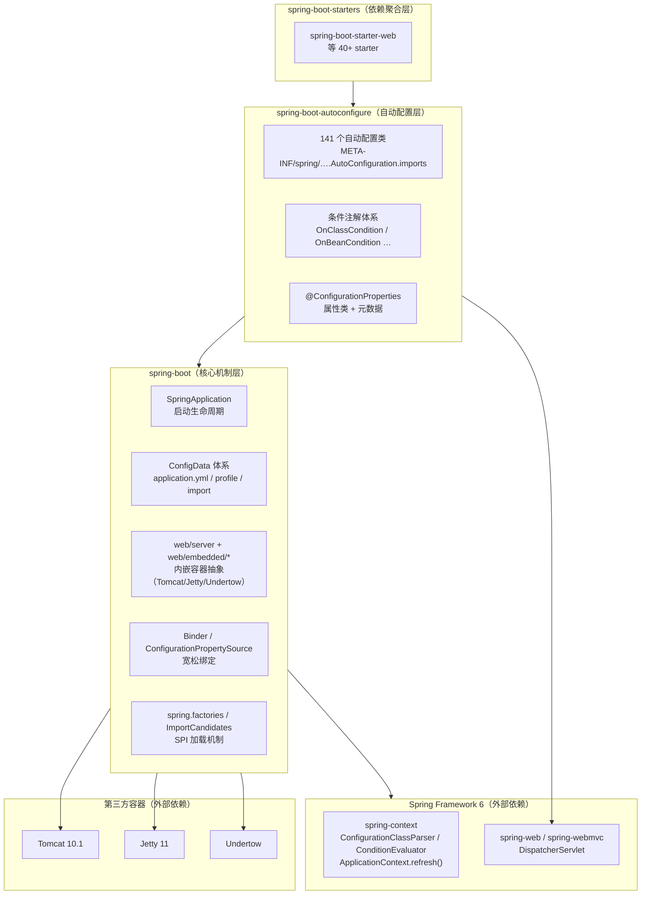
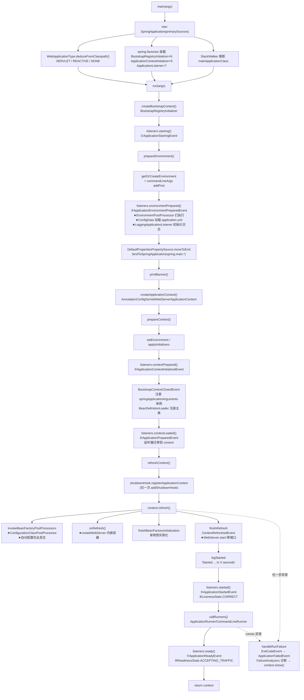
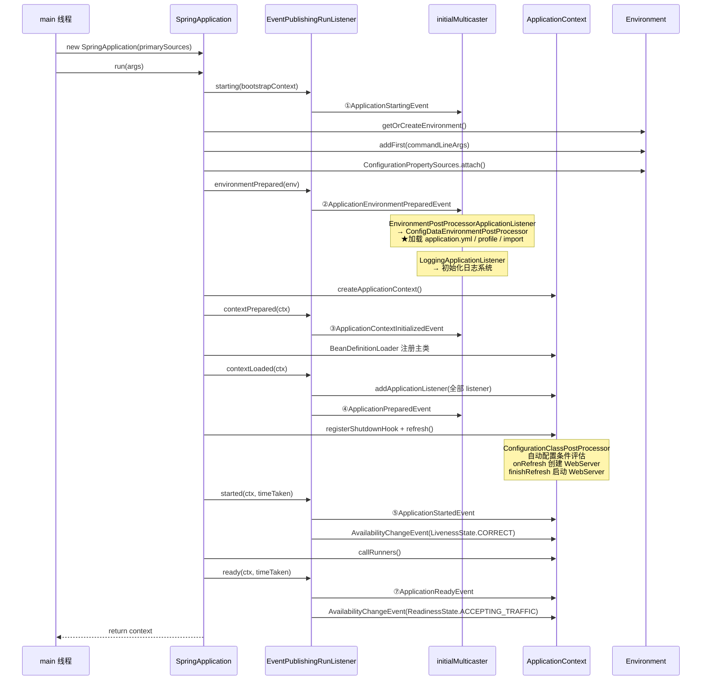
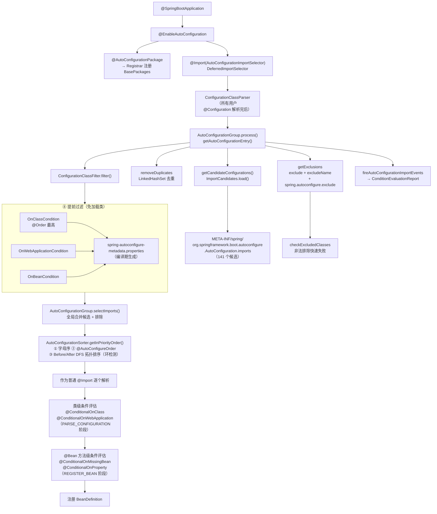
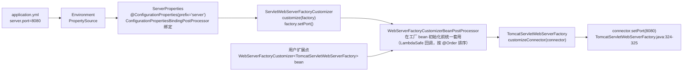
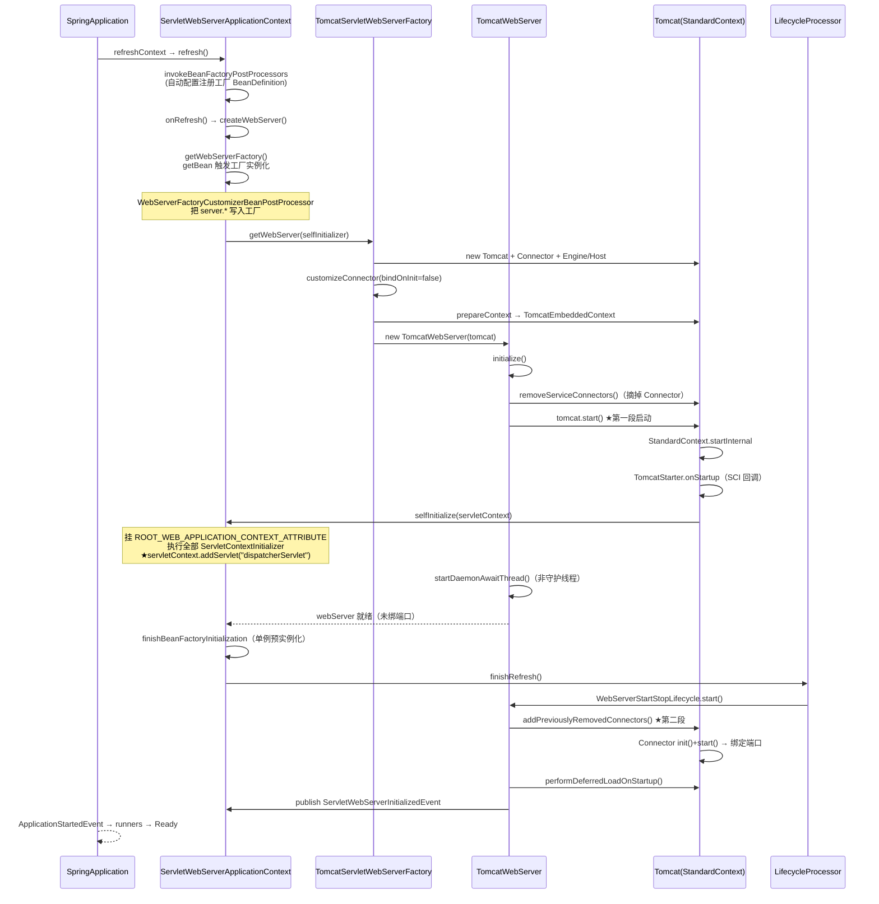
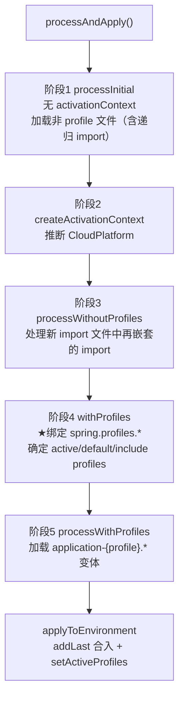
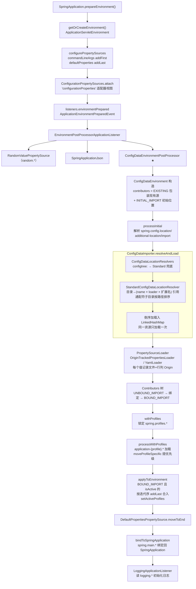
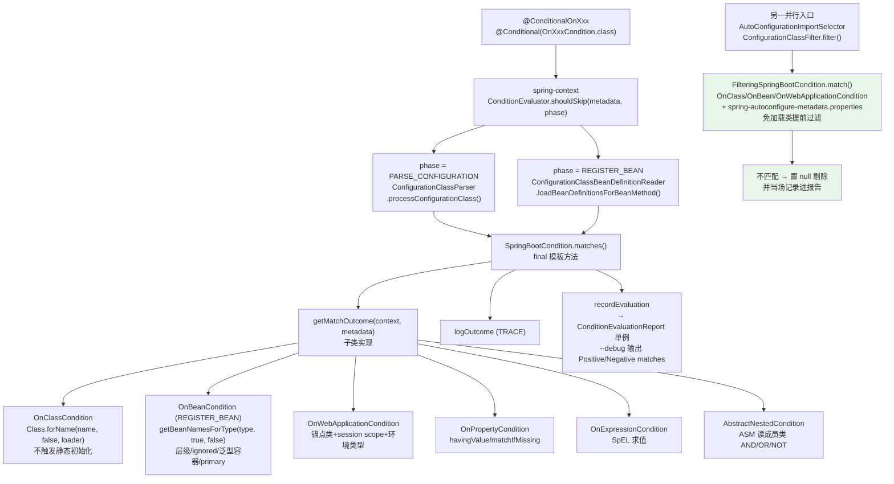
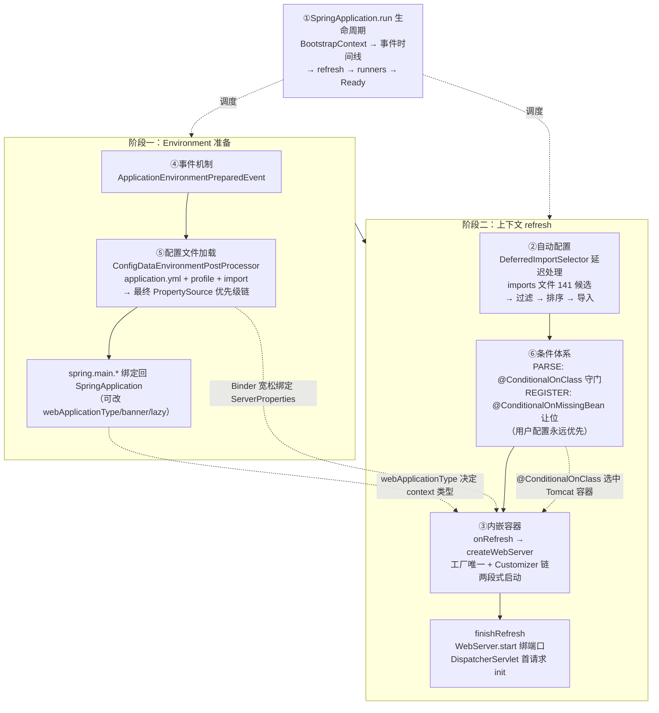

# Spring Boot 3.0.0 源码深度剖析

> 本文基于本地 Spring Boot 3.0.0 官方源码（`spring-boot-project/`）逐行研读整理，所有类名、方法名、行号均与源码一一对应。
> 涵盖五大核心原理：**启动流程**、**自动配置**、**内嵌 Servlet 容器**、**application 配置文件加载**、**@Conditional 条件体系**。
> 文中路径约定：
> - `BOOT` = `spring-boot-project/spring-boot/src/main/java/org/springframework/boot`
> - `AC` = `spring-boot-project/spring-boot-autoconfigure/src/main/java/org/springframework/boot/autoconfigure`

---

## 目录

1. [总体架构鸟瞰](#一总体架构鸟瞰)
2. [启动流程深度剖析](#二启动流程深度剖析)
3. [自动配置原理](#三自动配置原理)
4. [内嵌 Servlet 容器原理](#四内嵌-servlet-容器原理)
5. [application 配置文件加载原理](#五application-配置文件加载原理)
6. [@Conditional 条件注解实现原理](#六conditional-条件注解实现原理)
7. [五大原理的关联：一张全景图](#七五大原理的关联一张全景图)

---

## 一、总体架构鸟瞰

Spring Boot 3.0.0 的基线是 **Spring Framework 6.0.0 + Jakarta EE 9+（`jakarta.*` 命名空间）+ Java 17**，并原生支持 GraalVM Native Image（AOT）。源码模块划分：



三个关键分工（3.0 与 2.x 的本质差异之一）：

| 机制 | 文件 | 用途 |
|---|---|---|
| `META-INF/spring/*.imports` | 新增（2.7 引入，3.0 唯一来源） | 声明**自动配置类**候选列表 |
| `META-INF/spring.factories` | 保留 | 登记 listener / filter / initializer / EnvironmentPostProcessor 等**框架组件** |
| `META-INF/spring-autoconfigure-metadata.properties` | 编译期生成 | 自动配置类注解元数据缓存，用于**免加载类的提前过滤** |

---

## 二、启动流程深度剖析

### 2.1 入口与构造阶段（run 之前）

一切从 `SpringApplication.run(App.class, args)` 开始（`BOOT/SpringApplication.java:1290-1303`）：

```java
public static ConfigurableApplicationContext run(Class<?>[] primarySources, String[] args) {
    return new SpringApplication(primarySources).run(args);
}
```

构造函数（`SpringApplication.java:266-276`）做了 6 件事：

```java
public SpringApplication(ResourceLoader resourceLoader, Class<?>... primarySources) {
    this.resourceLoader = resourceLoader;
    this.primarySources = new LinkedHashSet<>(Arrays.asList(primarySources)); // 1. 保存主类
    this.webApplicationType = WebApplicationType.deduceFromClasspath();       // 2. 推断应用类型
    this.bootstrapRegistryInitializers = new ArrayList<>(
            getSpringFactoriesInstances(BootstrapRegistryInitializer.class)); // 3. 装载引导初始化器
    setInitializers((Collection) getSpringFactoriesInstances(ApplicationContextInitializer.class)); // 4. 5 个
    setListeners((Collection) getSpringFactoriesInstances(ApplicationListener.class));             // 5. 7 个
    this.mainApplicationClass = deduceMainApplicationClass();                 // 6. StackWalker 找 main 类
}
```

**WebApplicationType 推断**（`BOOT/WebApplicationType.java:60-71`）——纯 classpath 探测，顺序敏感：

```java
static WebApplicationType deduceFromClasspath() {
    if (ClassUtils.isPresent(WEBFLUX_INDICATOR_CLASS, null)          // DispatcherHandler
            && !ClassUtils.isPresent(WEBMVC_INDICATOR_CLASS, null)   // 且无 DispatcherServlet
            && !ClassUtils.isPresent(JERSEY_INDICATOR_CLASS, null)) {
        return WebApplicationType.REACTIVE;
    }
    for (String className : SERVLET_INDICATOR_CLASSES) {             // jakarta.servlet.Servlet
        if (!ClassUtils.isPresent(className, null)) {                // + ConfigurableWebApplicationContext
            return WebApplicationType.NONE;
        }
    }
    return WebApplicationType.SERVLET;                               // WebFlux+WebMvc 并存时 SERVLET 胜出
}
```

**deduceMainApplicationClass**（`SpringApplication.java:278-286`）：用 JDK 9+ 的 `StackWalker`（`RETAIN_CLASS_REFERENCE`）遍历调用栈找到第一个名为 `main` 的栈帧，取其声明类——该类只用于启动日志与 AOT 推断。

### 2.2 run() 方法 18 步逐行分解

`run(String... args)`（`SpringApplication.java:294-338`）骨架：

```java
public ConfigurableApplicationContext run(String... args) {
    long startTime = System.nanoTime();                                  // ① 单调时钟计时（3.0 已弃用 StopWatch）
    DefaultBootstrapContext bootstrapContext = createBootstrapContext(); // ② 引导上下文
    ConfigurableApplicationContext context = null;
    configureHeadlessProperty();                                         // ③ java.awt.headless=true
    SpringApplicationRunListeners listeners = getRunListeners(args);     // ④ EventPublishingRunListener
    listeners.starting(bootstrapContext, this.mainApplicationClass);    // ⑤ ApplicationStartingEvent
    try {
        ApplicationArguments applicationArguments = new DefaultApplicationArguments(args); // ⑥
        ConfigurableEnvironment environment = prepareEnvironment(listeners, bootstrapContext, applicationArguments); // ⑦ ★
        Banner printedBanner = printBanner(environment);                 // ⑧
        context = createApplicationContext();                            // ⑨
        context.setApplicationStartup(this.applicationStartup);          // ⑩ JFR 指标
        prepareContext(bootstrapContext, listeners, environment, context, applicationArguments, printedBanner); // ⑪
        refreshContext(context);                                         // ⑫ ★
        afterRefresh(context, applicationArguments);                     // ⑬ 空模板方法
        Duration timeTakenToStartup = Duration.ofNanos(System.nanoTime() - startTime);
        new StartupInfoLogger(this.mainApplicationClass).logStarted(getApplicationLog(), timeTakenToStartup); // ⑭
        listeners.started(context, timeTakenToStartup);                  // ⑮ ApplicationStartedEvent + Liveness CORRECT
        callRunners(context, applicationArguments);                      // ⑯ Runner 执行
    }
    catch (Throwable ex) {
        if (ex instanceof AbandonedRunException) { throw ex; }           // devtools restart 静默放弃
        handleRunFailure(context, ex, listeners);                        // ⑰ 失败处理
        throw new IllegalStateException(ex);
    }
    try {
        if (context.isRunning()) {
            Duration timeTakenToReady = Duration.ofNanos(System.nanoTime() - startTime);
            listeners.ready(context, timeTakenToReady);                  // ⑱ ApplicationReadyEvent + Readiness
        }
    }
    catch (Throwable ex) { /* ... */ }
    return context;
}
```

各步要点：

| 步骤 | 关键实现 | 说明 |
|---|---|---|
| ② | `createBootstrapContext()`（:340-344） | 执行所有 `BootstrapRegistryInitializer`——**早于任何事件**的最早插拔点；供 Environment 准备阶段使用（如 ConfigData 异步加载的 BootstrapExecutor） |
| ④ | `getRunListeners()`（:440-452） | 从 spring.factories 加载，实际只有 `EventPublishingRunListener`；Spring 6 的 `SpringFactoriesLoader.load(type, argumentResolver)` 用 ArgumentResolver 注入 `(SpringApplication, String[])` 构造参数；另通过 ThreadLocal `applicationHook`（3.0 新增 `SpringApplicationHook`）附加测试钩子 |
| ⑤ | `EventPublishingRunListener.starting`（:74-76） | 用内部 `SimpleApplicationEventMulticaster initialMulticaster` 广播——**refresh 之前的事件都走它**（context 的广播器还没初始化） |
| ⑦ | `prepareEnvironment()`（:346-363） | **配置文件加载的发生地**，详见第五节 |
| ⑧ | `printBanner()`（:544-555） | `spring.banner.location` > 自定义 Banner > 默认 `SpringBootBanner`；有个防御逻辑：资源 URL 含 `liquibase-core` 则忽略，防止误读 liquibase jar 里的 banner.txt |
| ⑨ | `createApplicationContext()`（:564-566） | 委托 `DefaultApplicationContextFactory`：SERVLET → `AnnotationConfigServletWebServerApplicationContext`；REACTIVE → `AnnotationConfigReactiveWebServerApplicationContext`；NONE → `AnnotationConfigApplicationContext`（AOT 模式分别换成无 reader/scanner 的变体） |
| ⑪ | `prepareContext()`（:377-413） | 12 个小步，见 2.3 |
| ⑫ | `refreshContext()`（:428-433） | **先注册 JVM shutdown hook 再 refresh**；`SpringApplicationShutdownHook` 是 JVM 级静态单例（:185），`AtomicBoolean` CAS 保证只 `addShutdownHook` 一次；hook 的 `run()` 依次 close 所有 context 并执行 `getShutdownHandlers()` 注册的动作 |
| ⑯ | `callRunners()`（:741-754） | ApplicationRunner + CommandLineRunner 统一收集、`AnnotationAwareOrderComparator` 全局排序、去重后**串行**执行；runner 抛异常会进入失败分支导致启动失败 |
| ⑰ | `handleRunFailure()`（:774-795） | ExitCode 体系（`ExitCodeExceptionMapper` bean + 异常链上的 `ExitCodeGenerator`）→ `ApplicationFailedEvent` → `FailureAnalyzers`（约 23 个 `FailureAnalyzer`，输出 "APPLICATION FAILED TO START" 诊断）→ `context.close()` + 从 shutdownHook 注销 |

### 2.3 prepareContext 的 12 个小步（:377-413）

1. `context.setEnvironment(environment)`——注入准备好的环境；
2. `postProcessApplicationContext`（:573-589）——注册 beanNameGenerator、resourceLoader、`ApplicationConversionService`；
3. **AOT 分支**：`AotDetector.useGeneratedArtifacts()` 为真时把 `AotApplicationContextInitializer` 插到最前（:415-426）；
4. `applyInitializers`（:597-605）——按序执行 5 个 `ApplicationContextInitializer`；
5. `listeners.contextPrepared` → `ApplicationContextInitializedEvent`；
6. `bootstrapContext.close(context)` → `BootstrapContextClosedEvent`——引导上下文向真容器的"交接"；
7. 启动日志：`StartupInfoLogger.logStarting`（"Starting XxxApplication v1.0 using Java 17 ..."）+ `logStartupProfileInfo`（活跃 profile 信息）；
8. 注册单例：`beanFactory.registerSingleton("springApplicationArguments", args)`、`springBootBanner`；
9. `setAllowCircularReferences` / `setAllowBeanDefinitionOverriding`（2.6 起两者默认 false 的两个开关落地处）；
10. `lazyInitialization=true`（`spring.main.lazy-initialization`）时注册 `LazyInitializationBeanFactoryPostProcessor`——把所有未显式设置 lazyInit 的 bean 定义改为懒加载（`SmartInitializingSingleton` 实现自动排除）；
11. 注册 `PropertySourceOrderingBeanFactoryPostProcessor`，refresh 时再次 `DefaultPropertiesPropertySource.moveToEnd`；
12. **加载 sources**（:406-412）：非 AOT 模式下由 `BeanDefinitionLoader`（:83-92）注册主类——它同时持有 `AnnotatedBeanDefinitionReader`（注解类）、`XmlBeanDefinitionReader`、`GroovyBeanDefinitionReader`、`ClassPathBeanDefinitionScanner` 四个加载器，`load(Object)`（:133-152）按 Class/Resource/Package/CharSequence 分发。**主类 `@SpringBootApplication` 在这里注册为 BeanDefinition**。最后 `listeners.contextLoaded`（:412）。

**contextLoaded 的分水岭意义**（`EventPublishingRunListener.contextLoaded`，:91-99）：

```java
public void contextLoaded(ConfigurableApplicationContext context) {
    for (ApplicationListener<?> listener : this.application.getListeners()) {
        if (listener instanceof ApplicationContextAware contextAware) {
            contextAware.setApplicationContext(context);
        }
        context.addApplicationListener(listener);   // ★ 监听器迁移到真正的 context
    }
    multicastInitialEvent(new ApplicationPreparedEvent(this.application, this.args, context));
}
```

此后（started/ready）事件都改由 `context.publishEvent` 广播，`initialMulticaster` 仅在 failed 分支兜底。

### 2.4 启动流程总图



### 2.5 启动事件时序图



### 2.6 阶段依赖关系总结

1. **webApplicationType 三处一致性**：决定 Environment 类型（⑦.1）、context 类型（⑨）、Environment 转换目标（⑦.7），全部由同一个 `ApplicationContextFactory` 体系决定；
2. **BootstrapContext 先于一切事件**；最终经 `BootstrapContextClosedEvent` 交接给 context；
3. **Environment 必须先于 Banner**（banner.txt 位置从 environment 读取）与 **Context**（setEnvironment）；
4. **applyInitializers 必须先于 sources 加载**；
5. **contextLoaded 是监听器迁移分水岭**；
6. **shutdown hook 注册先于 refresh**（refresh 中途被 kill 也能关掉半成品 context）；
7. **Started 先于 runners、Ready 晚于 runners**——两个事件的间隔即 runner 执行耗时；Liveness 在 started 置 CORRECT，Readiness 在 ready 才 ACCEPTING_TRAFFIC（K8s 探针语义）；
8. **runner 异常 → ApplicationFailedEvent**，容器被关闭。

---

## 三、自动配置原理

### 3.1 注解层：从 @SpringBootApplication 到 ImportSelector

`@SpringBootApplication`（`AC/SpringBootApplication.java:51-59`）是组合注解：

```java
@SpringBootConfiguration        // 本质 @Configuration，标识主配置类
@EnableAutoConfiguration        // ★ 开启自动配置
@ComponentScan(excludeFilters = {
        @Filter(type = FilterType.CUSTOM, classes = TypeExcludeFilter.class),
        @Filter(type = FilterType.CUSTOM, classes = AutoConfigurationExcludeFilter.class) })
public @interface SpringBootApplication { ... }
```

- `exclude()/excludeName()` 通过 `@AliasFor` 直接透传给 `@EnableAutoConfiguration`；
- `AutoConfigurationExcludeFilter` 防止自动配置类被组件扫描误扫（排除"既是 `@Configuration` 又在 imports 文件里"的类）。

`@EnableAutoConfiguration`（`AC/EnableAutoConfiguration.java:77-83`）只做两件事：

```java
@AutoConfigurationPackage                                    // ① 登记主类所在包
@Import(AutoConfigurationImportSelector.class)               // ② 导入核心 selector
public @interface EnableAutoConfiguration {
    String ENABLED_OVERRIDE_PROPERTY = "spring.boot.enableautoconfiguration";
    Class<?>[] exclude() default {};
    String[] excludeName() default {};
}
```

`@AutoConfiguration`（`AC/AutoConfiguration.java:54-60`，2.7 引入、3.0 全面启用）：

```java
@Configuration(proxyBeanMethods = false)   // 强制 lite 模式，禁止 CGLIB 代理（启动加速）
@AutoConfigureBefore
@AutoConfigureAfter
public @interface AutoConfiguration {
    @AliasFor(annotation = AutoConfigureBefore.class, attribute = "value")
    Class<?>[] before() default {};
    @AliasFor(annotation = AutoConfigureAfter.class, attribute = "value")
    Class<?>[] after() default {};
    // ... beforeName / afterName / value
}
```

### 3.2 核心流水线：AutoConfigurationImportSelector

`AC/AutoConfigurationImportSelector.java`——**实现 `DeferredImportSelector`**（被延迟处理，这是"用户配置永远优先于自动配置"的机制根源），且通过 `getImportGroup()`（:137-139）归属 `AutoConfigurationGroup`，走 Spring 的"分组延迟导入"路径。

`getAutoConfigurationEntry()`（:121-134）九步流水线：

```java
protected AutoConfigurationEntry getAutoConfigurationEntry(AnnotationMetadata annotationMetadata) {
    if (!isEnabled(annotationMetadata)) { return EMPTY_ENTRY; }                       // ① 开关
    AnnotationAttributes attributes = getAttributes(annotationMetadata);              // ② exclude 属性
    List<String> configurations = getCandidateConfigurations(metadata, attributes);   // ③ 读 imports 文件
    configurations = removeDuplicates(configurations);                                // ④ LinkedHashSet 去重保序
    Set<String> exclusions = getExclusions(metadata, attributes);                     // ⑤ 三类排除合并
    checkExcludedClasses(configurations, exclusions);                                  // ⑥ 快速失败校验
    configurations.removeAll(exclusions);                                              // ⑦ 应用排除
    configurations = getConfigurationClassFilter().filter(configurations);            // ⑧ ★提前过滤
    fireAutoConfigurationImportEvents(configurations, exclusions);                    // ⑨ 条件评估报告事件
    return new AutoConfigurationEntry(configurations, exclusions);
}
```

**③ getCandidateConfigurations（:179-187）——3.0 的决定性变化**：

```java
List<String> configurations = ImportCandidates.load(AutoConfiguration.class, getBeanClassLoader())
        .getCandidates();
```

不再读 `spring.factories`，而是用 `ImportCandidates`（`BOOT/context/annotation/ImportCandidates.java`）读新文件：

```java
private static final String LOCATION = "META-INF/spring/%s.imports";   // :45
// → META-INF/spring/org.springframework.boot.autoconfigure.AutoConfiguration.imports
```

- 一行一个全限定类名，支持 `#` 注释；`classLoader.getResources()` **聚合 classpath 上所有 jar 的同名文件**——第三方 starter 提供自动配置的标准方式；
- 本仓库该文件共 **141 个自动配置类**；
- **排除项三来源**（:223-229）：`exclude` + `excludeName` + `spring.autoconfigure.exclude`（后者用 Binder 宽松绑定）。`checkExcludedClasses`（:189-199）校验："类路径上存在、却不在候选列表"的排除项说明拼错了类名，直接抛 `IllegalStateException`。

**⑧ 提前过滤（ConfigurationClassFilter，:349-390）**：从 spring.factories 加载 3 个 `AutoConfigurationImportFilter`——`OnClassCondition`（@Order HIGHEST）、`OnWebApplicationCondition`（HIGHEST+20）、`OnBeanCondition`（LOWEST）。配合 `META-INF/spring-autoconfigure-metadata.properties`（编译期由 `spring-boot-autoconfigure-processor` 注解处理器生成），**全程不加载自动配置类本身**即可剔除类路径不满足的候选（详见第六节）。

### 3.3 两阶段处理：AutoConfigurationGroup

`AutoConfigurationGroup`（:392-475）实现 `DeferredImportSelector.Group`：

- **第一阶段 `process()`（:423-434）**：每个 `@EnableAutoConfiguration` 入口调用一次，执行 `getAutoConfigurationEntry`，结果累积；
- **第二阶段 `selectImports()`（:437-450）**：所有用户配置类解析完后调用**一次**——跨 selector 全局合并候选、全局应用排除，然后 `sortAutoConfigurations` 排序，返回 Entry 列表。

排序后的类被 Spring 框架当作普通 `@Import` 逐个解析——此时每个自动配置类上的 `@ConditionalOnClass`、`@ConditionalOnMissingBean` 等条件才逐个评估（走第六节的 ConditionEvaluator 链路）。

### 3.4 排序算法：AutoConfigurationSorter

`AC/AutoConfigurationSorter.java:55-70`，三步走：

```java
List<String> getInPriorityOrder(Collection<String> classNames) {
    List<String> orderedClassNames = new ArrayList<>(classNames);
    Collections.sort(orderedClassNames);                              // 第一步：字母序（保证确定性）
    orderedClassNames.sort((o1, o2) -> Integer.compare(               // 第二步：@AutoConfigureOrder
            classes.get(o1).getOrder(), classes.get(o2).getOrder()));
    orderedClassNames = sortByAnnotation(classes, orderedClassNames); // 第三步：Before/After 拓扑排序
    return orderedClassNames;
}
```

第三步（:72-98）把 `@AutoConfigureAfter`（正向边）与 `@AutoConfigureBefore`（反向边）统一成"必须在我之后"的约束图，做 **DFS 后序遍历**得到拓扑序；`checkForCycles`（:100-103）检测回边，发现循环立即抛 "AutoConfigure cycle detected"。`AutoConfigurationClass`（:154-243）优先读 spring-autoconfigure-metadata.properties，无元数据才退化为 ASM 字节码读取并缓存。

### 3.5 @AutoConfigurationPackage：基础包登记

`@AutoConfigurationPackage` 导入 `AutoConfigurationPackages.Registrar`（`AC/AutoConfigurationPackages.java:123-135`，`ImportBeanDefinitionRegistrar`）：

- `PackageImports`（:144-155）：取 `basePackages`/`basePackageClasses`，都为空时回退**标注类自身所在包**——"主类要放根包"约定的第一条机制（另一条是 `@ComponentScan` 默认扫主类包）；
- 注册为名为 `org.springframework.boot.autoconfigure.AutoConfigurationPackages` 的 `ROLE_INFRASTRUCTURE` BeanDefinition；
- 消费者：JPA `@EntityScan`、MyBatis/Spring Data 的 mapper/repository 扫描等，通过 `AutoConfigurationPackages.get(beanFactory)` 拿根包作为默认扫描起点。

### 3.6 典型自动配置类套路

`AC/jdbc/DataSourceAutoConfiguration.java:55-60` 展示"套路四件套"：

```java
@AutoConfiguration(before = SqlInitializationAutoConfiguration.class)   // 排序约束
@ConditionalOnClass({ DataSource.class, EmbeddedDatabaseType.class })   // 类路径守门（PARSE 阶段）
@ConditionalOnMissingBean(type = "io.r2dbc.spi.ConnectionFactory")      // 响应式场景让位
@EnableConfigurationProperties(DataSourceProperties.class)              // 绑定 spring.datasource.*
@Import(DataSourcePoolMetadataProvidersConfiguration.class)
public class DataSourceAutoConfiguration {

    @Configuration(proxyBeanMethods = false)
    @Conditional(EmbeddedDatabaseCondition.class)
    @ConditionalOnMissingBean({ DataSource.class, XADataSource.class }) // 用户优先（REGISTER 阶段）
    @Import(EmbeddedDataSourceConfiguration.class)
    protected static class EmbeddedDatabaseConfiguration { }
    // ... PooledDataSourceConfiguration：Hikari/Tomcat/Dbcp2/OracleUcp/Generic 按可用性择一
}
```

**分层条件设计是全部秘密**：类级 `@ConditionalOnClass`（PARSE_CONFIGURATION 阶段，防 `NoClassDefFoundError`）+ 方法/内部类级 `@ConditionalOnMissingBean`（REGISTER_BEAN 阶段，用户优先）。

### 3.7 @ConfigurationProperties 绑定简述

- `ConfigurationPropertiesAutoConfiguration`（imports 文件第 7 行）→ `@EnableConfigurationProperties` → `EnableConfigurationPropertiesRegistrar`（`BOOT/context/properties/EnableConfigurationPropertiesRegistrar.java:44-50`）：注册 `ConfigurationPropertiesBindingPostProcessor` + 把属性类注册为 BeanDefinition；
- 绑定发生在 bean 初始化时：`ConfigurationPropertiesBindingPostProcessor.postProcessBeforeInitialization`（:77-89）→ `ConfigurationPropertiesBinder` → `Binder` 从 Environment 做**宽松绑定**（kebab-case/camelCase/下划线/环境变量等价），支持构造器绑定与 JavaBean 绑定，随后跑 JSR-303 校验。

### 3.8 自动配置全链路图



### 3.9 与 Spring Boot 2.x 的差异

| 维度 | 2.x | 3.0.0 |
|---|---|---|
| 候选来源 | `META-INF/spring.factories` 的 `EnableAutoConfiguration` 键 | `META-INF/spring/org.springframework.boot.autoconfigure.AutoConfiguration.imports`（2.7 过渡期双读合并） |
| 注解 | `@Configuration(proxyBeanMethods=false)` + 可选 Before/After | `@AutoConfiguration`（强制 lite 模式，before/after 别名属性） |
| 空候选报错 | 指向 spring.factories | 明确指向 imports 文件（:182-185） |
| 其余骨架 | Group 两阶段、过滤、排序 | 完整保留并打磨（AOT、元数据缓存重构进 ConfigurationClassFilter） |

---

## 四、内嵌 Servlet 容器原理

### 4.1 自动装配：classpath 决定用哪个容器

入口 `AC/web/servlet/ServletWebServerFactoryAutoConfiguration.java:64-73`：

```java
@AutoConfiguration
@AutoConfigureOrder(Ordered.HIGHEST_PRECEDENCE)          // 排到所有自动配置最前
@ConditionalOnClass(ServletRequest.class)                 // Servlet API 在 classpath
@ConditionalOnWebApplication(type = Type.SERVLET)
@EnableConfigurationProperties(ServerProperties.class)    // 绑定 server.*
@Import({ ServletWebServerFactoryAutoConfiguration.BeanPostProcessorsRegistrar.class,
        ServletWebServerFactoryConfiguration.EmbeddedTomcat.class,     // @Import 顺序即优先级
        ServletWebServerFactoryConfiguration.EmbeddedJetty.class,
        ServletWebServerFactoryConfiguration.EmbeddedUndertow.class })
public class ServletWebServerFactoryAutoConfiguration { ... }
```

三个嵌入式配置类（`AC/web/servlet/ServletWebServerFactoryConfiguration.java`）条件互斥竞争：

| 配置类 | `@ConditionalOnClass`（特征类） | 兜底 |
|---|---|---|
| EmbeddedTomcat（:63-80） | `Servlet`、`org.apache.catalina.startup.Tomcat`、`org.apache.coyote.UpgradeProtocol`（防残缺依赖） | `@ConditionalOnMissingBean(ServletWebServerFactory.class)` |
| EmbeddedJetty（:85-98） | `Servlet`、`org.eclipse.jetty.server.Server`、`jetty.util.Loader`、`WebAppContext` | 同上 |
| EmbeddedUndertow（:103-124） | `Servlet`、`io.undertow.Undertow`、`org.xnio.SslClientAuthMode` | 同上 |

三者都以 `@ConditionalOnMissingBean(value = ServletWebServerFactory.class, search = SearchStrategy.CURRENT)` 兜底：**用户自定义了工厂，或三者中有一个已匹配，其余全部失效**——"classpath 决定默认、用户可覆盖、三者互斥"。

`BeanPostProcessorsRegistrar`（:124-157）用 `ImportBeanDefinitionRegistrar` **极早地**注册两个合成 bean：`WebServerFactoryCustomizerBeanPostProcessor` 和 `ErrorPageRegistrarBeanPostProcessor`（用 Registrar 而非 `@Bean` 是为了确保 BPP 在工厂 bean 创建之前就绪）。

### 4.2 server.port 如何到达 Tomcat：三层配置链



- `ServletWebServerFactoryCustomizer`（`AC/web/servlet/ServletWebServerFactoryCustomizer.java:72-86`）用 `PropertyMapper.get().alwaysApplyingWhenNonNull()` 保证"属性为 null 就跳过"；
- `TomcatServletWebServerFactoryCustomizer`（:49-59）应用 `server.tomcat.*` 专属配置（tldSkipPatterns、useRelativeRedirects 等）；
- **用户改端口/maxThreads 的官方姿势**：声明一个 `WebServerFactoryCustomizer<TomcatServletWebServerFactory>` bean。

### 4.3 refresh 中的容器创建：onRefresh → createWebServer

`BOOT/web/servlet/context/ServletWebServerApplicationContext.java`：

```java
@Override
public final void refresh() {                       // :144
    try { super.refresh(); }
    catch (RuntimeException ex) {
        WebServer webServer = this.webServer;
        if (webServer != null) { webServer.stop(); }   // :151 启动失败停掉已创建的容器
        throw ex;
    }
}

private void createWebServer() {                    // :176
    ...
    ServletWebServerFactory factory = getWebServerFactory();              // :181 ★按类型取工厂 bean
    this.webServer = factory.getWebServer(getSelfInitializer());         // :183 ★创建并初始化 Tomcat
    getBeanFactory().registerSingleton("webServerGracefulShutdown",
            new WebServerGracefulShutdownLifecycle(this.webServer));      // :185-186
    getBeanFactory().registerSingleton("webServerStartStop",
            new WebServerStartStopLifecycle(this, this.webServer));       // :187-188
}
```

`getWebServerFactory()`（:207-218）用 `getBeanNamesForType`（刻意不遍历父容器层级）找 `ServletWebServerFactory` bean，**必须恰好一个**（0 个抛 `MissingWebServerFactoryBeanException`，多个抛异常），然后 `getBean` 触发 `TomcatServletWebServerFactory` 实例化——此刻 `WebServerFactoryCustomizerBeanPostProcessor` 把 `server.*` 写入工厂。

`getSelfInitializer()`（:227）返回 `this::selfInitialize` **方法引用（延迟执行的 lambda）**；`selfInitialize`（:231-236）：

```java
private void selfInitialize(ServletContext servletContext) throws ServletException {
    prepareWebApplicationContext(servletContext);   // 等价 ContextLoaderListener：this 挂到 ROOT_WEB_APPLICATION_CONTEXT_ATTRIBUTE
    registerApplicationScope(servletContext);      // 注册 ServletContextScope("application")
    WebApplicationContextUtils.registerEnvironmentBeans(getBeanFactory(), servletContext);
    for (ServletContextInitializer beans : getServletContextInitializerBeans()) {
        beans.onStartup(servletContext);           // ★逐个执行所有注册器
    }
}
```

### 4.4 ServletContextInitializer：一切 Servlet/Filter/Listener 的收敛点

`ServletContextInitializer`（`BOOT/web/servlet/ServletContextInitializer.java:53`）是 Boot 对 Servlet 规范 `ServletContainerInitializer` 的替代——**生命周期由 Spring 管理，不被容器 SPI 扫描驱动**（避免 WAR 部署双重启动）。

`ServletContextInitializerBeans`（`BOOT/web/servlet/ServletContextInitializerBeans.java:80-90`）负责收集：

1. **直接的 `ServletContextInitializer` bean**（多为 RegistrationBean）：按目标类型归类（Servlet/Filter/EventListener），底层对象记入 `seen` 集合防双重注册；
2. **裸 Servlet/Filter/Listener bean** 适配成 RegistrationBean（`addAdaptableBeans`，:148-156）——这就是"直接 `@Bean` 一个 Filter 也能生效"的原理；
3. 同类型桶内 `AnnotationAwareOrderComparator` 排序。

**裸 Servlet 的默认 URL 规则**（`ServletRegistrationBeanAdapter.createRegistrationBean`，:270-279）：

```java
String url = (totalNumberOfSourceBeans != 1) ? "/" + name + "/" : "/";  // 单个 → "/"，多个 → "/{beanName}/"
if (name.equals(DISPATCHER_SERVLET_NAME)) { url = "/"; }                // dispatcherServlet 永远 "/"
```

`RegistrationBean.onStartup` 是 final 模板方法（:46-53）；`ServletRegistrationBean.addRegistration` = **`servletContext.addServlet(name, servlet)`**（:176-179）——底层走 Servlet 3.0 动态 API。

### 4.5 Tomcat 的组装：TomcatServletWebServerFactory.getWebServer()

`BOOT/web/embedded/tomcat/TomcatServletWebServerFactory.java:188-211`：

```java
public WebServer getWebServer(ServletContextInitializer... initializers) {
    if (this.disableMBeanRegistry) { Registry.disableRegistry(); }
    Tomcat tomcat = new Tomcat();                                  // :193 StandardServer/Service/Engine/Host
    tomcat.setBaseDir(createTempDir("tomcat"));                    // 临时工作目录
    Connector connector = new Connector(this.protocol);            // :199 默认 Http11NioProtocol
    connector.setThrowOnFailure(true);
    tomcat.getService().addConnector(connector);
    customizeConnector(connector);                                 // :202 ★端口/SSL/压缩/自定义器
    tomcat.getHost().setAutoDeploy(false);                         // 关热部署扫描
    configureEngine(tomcat.getEngine());
    prepareContext(tomcat.getHost(), initializers);                // :209 ★构建 Context
    return getTomcatWebServer(tomcat);                             // :210 → new TomcatWebServer(...)
}
```

`customizeConnector`（:323-349）关键行：

```java
connector.setPort(Math.max(getPort(), 0));                     // :324-325 server.port 落地
connector.setProperty("bindOnInit", "false");                  // :336-337 ★禁止构造时绑端口（两段式基石之一）
if (getSsl() != null && getSsl().isEnabled()) { customizeSsl(connector); }
for (TomcatConnectorCustomizer customizer : this.tomcatConnectorCustomizers) { customizer.customize(connector); }
```

`prepareContext`（:220-260）：创建 `TomcatEmbeddedContext`（自定义 Context）、`server.servlet.context-path` 落地、`WebappLoader` 委派优先（`setDelegate(true)`，与 WAR 部署相反）、注册 DefaultServlet/JspServlet、`mergeInitializers` 合并回调数组（`selfInitialize` 永远第一优先）。

`configureContext`（:372-402）最关键的一行：

```java
TomcatStarter starter = new TomcatStarter(initializers);         // :373 ★Spring→Servlet 的桥
context.addServletContainerInitializer(starter, NO_CLASSES);     // :378 注册进 Tomcat 的 SCI 机制
```

**TomcatStarter**（`BOOT/web/embedded/tomcat/TomcatStarter.java:36,51-68`）实现 `jakarta.servlet.ServletContainerInitializer`，把 Spring 的 `ServletContextInitializer[]` 接到 Tomcat 的 SCI 回调上；异常捕获存入 `startUpException` 而不在 Tomcat 线程抛出。

### 4.6 两段式启动（核心设计）

**第一段——onRefresh 阶段（`TomcatWebServer.initialize()`，:113-151）**：

```java
private void initialize() throws WebServerException {
    synchronized (this.monitor) {
        try {
            addInstanceIdToEngineName();
            Context context = findContext();
            context.addLifecycleListener((event) -> {
                if (/* Context START_EVENT */) {
                    removeServiceConnectors();     // :120-126 ★摘掉 Connector，tomcat.start() 不绑端口
                }
            });
            this.tomcat.start();                   // :129 ★Context 完整启动：SCI 回调、Servlet/Filter 注册全部发生
            rethrowDeferredStartupExceptions();    // :132 把 TomcatStarter 捕获的异常在主线程重抛
            ContextBindings.bindClassLoader(...);
            startDaemonAwaitThread();              // :143 ★非守护线程防 JVM 退出
        }
        catch (Exception ex) { stopSilently(); destroySilently(); throw new WebServerException(...); }
    }
}
```

- **removeServiceConnectors（:170-178）**：监听 Context `START_EVENT`，在组件级联 start 前把 Service 上的 Connector 摘下来存入 `serviceConnectors` 字段——`tomcat.start()` 时 Service 上无 Connector，端口不绑定，但 `StandardContext.startInternal`（SCI 回调、Filter/Servlet 注册）照常完成；
- **rethrowDeferredStartupExceptions（:180-196）**：任何 Servlet/Filter 初始化失败都在**主线程**以原始异常抛出（进而被 `ServletWebServerApplicationContext.refresh()` 的 catch 捕获并 stop 容器）——这是很多 "Unable to start embedded Tomcat" 堆栈能看到业务异常的原因；
- **startDaemonAwaitThread（:198-210）**：Tomcat 全部线程是 daemon，专门起一个**非守护**线程 `container-N` 阻塞在 `tomcat.getServer().await()` 撑住进程。

**第二段——finishRefresh 阶段**：`DefaultLifecycleProcessor` 按 phase 升序启动 `SmartLifecycle` → `WebServerStartStopLifecycle.start()`（:43-47）→ `TomcatWebServer.start()`（:213-242）：

```java
public void start() throws WebServerException {
    synchronized (this.monitor) {
        if (this.started) return;
        try {
            addPreviouslyRemovedConnectors();     // :219 ★Connector 加回 Service → init()+start() → 此刻才绑端口
            performDeferredLoadOnStartup();       // :221-223 ★补执行 loadOnStartup Servlet
            checkThatConnectorsHaveStarted();     // :224 Connector FAILED → ConnectorStartFailedException
            this.started = true;
            logger.info("Tomcat started on port(s): ...");
        }
        catch (Exception ex) {
            PortInUseException.throwIfPortBindingException(ex, ...);   // :234 端口占用友好异常
            throw new WebServerException("Unable to start embedded Tomcat server", ex);
        }
    }
}
```

`TomcatEmbeddedContext` 重写 `loadOnStartup` 直接返回 true（deferred），把 DispatcherServlet 实例化推迟到端口绑定成功之后（`performDeferredLoadOnStartup`，:307-321）——避免端口已被占用却白等 Servlet 初始化。启动成功后发布 `ServletWebServerInitializedEvent`（actuator 等监听它拿实际端口，支持 `server.port=0` 随机端口）。

**两段式的收益**：端口占用检查后置、启动异常在主线程原生抛出、容器启动时序与 Spring 生命周期（SmartLifecycle）对齐。

### 4.7 DispatcherServlet 的注册

`AC/web/servlet/DispatcherServletAutoConfiguration.java`：

- `DispatcherServletConfiguration`（:81-106）：`@Conditional(DefaultDispatcherServletCondition.class)`（已存在名为 `dispatcherServlet` 的 bean 时不重复注册），`@Bean` 创建无参 `DispatcherServlet`，搬运 `WebMvcProperties` 配置；
- `DispatcherServletRegistrationConfiguration`（:108-127）：创建 `DispatcherServletRegistrationBean`（:119-120），路径取 `spring.mvc.servlet.path`（默认 `/`），`setLoadOnStartup`（默认 -1，**首个请求才 init**；`FrameworkServlet` 从 `ServletContext` 的 `ROOT_WEB_APPLICATION_CONTEXT_ATTRIBUTE` 找到 root context——正是 `selfInitialize` 里 `prepareWebApplicationContext` 提前放进去的）。

**注册发生的具体时刻**：`dispatcherServletRegistration` 只是普通 bean；`selfInitialize` 执行时（仍在 `onRefresh` 栈、`tomcat.start()` 内部），`ServletContextInitializerBeans` 构造触发 `getBean("dispatcherServletRegistration")`——**DispatcherServlet 在此刻才真正实例化**——然后 `servletContext.addServlet("dispatcherServlet", dispatcherServlet)` + `addMapping("/")`。

### 4.8 内嵌容器启动时序图



### 4.9 优雅停机

- `server.shutdown=graceful` 时 `TomcatWebServer` 构造 `GracefulShutdown`（:109）；
- `WebServerGracefulShutdownLifecycle`（phase = `SmartLifecycle.DEFAULT_PHASE - 1024`，最先停止）→ `GracefulShutdown.doShutdown`（:57-110）：**pause 所有 Connector + closeServerSocketGraceful（停收新连接、已建立连接继续处理）→ 每 50ms 轮询各 Context 的 async 计数与 `StandardWrapper.getCountAllocated()`，全部空闲才回调 IDLE**；
- `ServletWebServerApplicationContext.doClose()`（:168-174）：关闭前先发布 `AvailabilityChangeEvent(ReadinessState.REFUSING_TRAFFIC)` 让 LB/健康检查摘流量，再 `super.doClose()`（3.0 已无 2.x 的 `stopAndReleaseWebServer()`，停止职责移交 `WebServerStartStopLifecycle.stop()`）。

---

## 五、application 配置文件加载原理

### 5.1 触发链：从 run() 到 ConfigDataEnvironmentPostProcessor

配置文件加载发生在 `prepareEnvironment()` 的 `listeners.environmentPrepared()`（`SpringApplication.java:352`）：

```
SpringApplication.prepareEnvironment()                       (:346)
  └─ listeners.environmentPrepared()                          → ApplicationEnvironmentPreparedEvent
      └─ EnvironmentPostProcessorApplicationListener.onApplicationEvent()   (BOOT/env/...:92-111)
          └─ 按 order 依次执行 spring.factories 中的 EnvironmentPostProcessor：
              ├─ CloudFoundryVcapEnvironmentPostProcessor
              ├─ ConfigDataEnvironmentPostProcessor  ★ ORDER = HIGHEST_PRECEDENCE + 10，核心
              ├─ RandomValuePropertySourceEnvironmentPostProcessor（HIGHEST+1，注册 random.*）
              ├─ SpringApplicationJsonEnvironmentPostProcessor（HIGHEST+5，解析 SPRING_APPLICATION_JSON）
              ├─ SystemEnvironmentPropertySourceEnvironmentPostProcessor（HIGHEST+4，环境变量下划线转驼峰）
              └─ DebugAgentEnvironmentPostProcessor
```

两个顺序设计：

- `EnvironmentPostProcessorApplicationListener.DEFAULT_ORDER = HIGHEST + 10`（:46），**先于** `LoggingApplicationListener`（HIGHEST+20）——日志系统初始化时必须能读到 `application.yml` 里的 `logging.*`；
- `RandomValuePropertySource`（HIGHEST+1）**早于** ConfigData——这样配置文件里才能写 `${random.int[1024,65535]}`（`random` 源插在 `systemEnvironment` 之后，`RandomValuePropertySource.java:144-163`）；
- ConfigData 加载时日志系统可能未就绪，日志经 `DeferredLogs` 缓存、到 `ApplicationPreparedEvent` 时统一回放（:113-123）。

### 5.2 ConfigDataEnvironment：五阶段流水线

`ConfigDataEnvironmentPostProcessor.postProcessEnvironment()`（:88-97）→ `new ConfigDataEnvironment(...).processAndApply()`。

**默认搜索路径**（`BOOT/context/config/ConfigDataEnvironment.java:88-94`）：

```java
static {
    locations.add(ConfigDataLocation.of("optional:classpath:/;optional:classpath:/config/"));
    locations.add(ConfigDataLocation.of("optional:file:./;optional:file:./config/;optional:file:./config/*/"));
}
```

`processAndApply()`（:225-237）五阶段：



**为什么 profiles 必须在加载中途决断**：`application-dev.yml` 只有知道 profile 集合后才能被发现，而 `spring.profiles.active` 又可能写在任何 `application.yml`（含 import 进来的）里——所以整体拆成 `BEFORE_PROFILE_ACTIVATION` / `AFTER_PROFILE_ACTIVATION` 两个 import 阶段。profile 一旦确定即**锁定**：profile 特定文件中出现 `spring.profiles.active/include/default` 直接抛 `InvalidConfigDataPropertyException`；旧属性 `spring.profiles` 被要求改成 `spring.config.activate.on-profile`。

**applyToEnvironment（:324-338）写回规则**：

```java
applyContributor(contributors, activationContext, propertySources);   // 只处理 BOUND_IMPORT 且 isActive 的
propertySources.addLast(propertySource);                              // :353 ★addLast——天然低于命令行/系统属性
DefaultPropertiesPropertySource.moveToEnd(propertySources);
this.environment.setActiveProfiles(...);  this.environment.setDefaultProfiles(...);
```

### 5.3 贡献者树：ConfigDataEnvironmentContributors

**不可变树结构**（每次变更生成新节点整体替换，`ConfigDataEnvironmentContributors.java:118-121`）：

| Kind | 含义 |
|---|---|
| `ROOT` | 根节点 |
| `INITIAL_IMPORT` | 初始导入位置（由三组属性生成） |
| `EXISTING` | 包装 Environment 已有源（命令行、systemProperties……只读，不会被重复合入） |
| `UNBOUND_IMPORT` | 刚加载、尚未绑定 ConfigDataProperties 的文件 |
| `BOUND_IMPORT` | 已绑定（知道 import 列表与 activate 条件），最终合入 Environment 的节点 |
| `EMPTY_LOCATION` | 合法但无内容的位置 |

`withProcessedImports`（:91-124）是**迭代收敛的递归加载**：

```java
while (true) {
    contributor = getNextToProcess(result, activationContext, importPhase); // 找下一个待处理节点
    if (contributor == null) return result;                                // 收敛退出
    if (contributor.getKind() == Kind.UNBOUND_IMPORT) { /* 先绑定 */ continue; }
    imports = contributor.getImports();                                    // 拿到该文件的 spring.config.import
    imported = importer.resolveAndLoad(activationContext, ..., imports);   // 解析+加载
    result = new ...(root.withReplacement(contributor,
            contributor.withChildren(importPhase, asContributors(imported)))); // 子节点挂上
}
```

这个 while 循环实现了**任意深度的 import 递归**（A import B、B import C……）。

**优先级的机关在"多处倒序"**：

1. 初始位置列表**倒序**加入 contributors（`ConfigDataEnvironment.java:209-214`）→ `spring.config.import` > `spring.config.additional-location` > `spring.config.location`（默认位置），且 file 段在前（外部文件 > jar 内）；
2. resolver 正序产生 references（profile 特定资源排在非 profile 之后）；
3. importer **倒序**加载入 LinkedHashMap（`ConfigDataImporter.java:116`）→ `config/` 目录 > 根目录、profile 文件 > 基础文件、多文档 YAML 后文档 > 前文档；
4. 同目录下扩展优先级 **`.properties` > `.xml` > `.yml` > `.yaml`**（2.4 起改为 properties 优先）；
5. `withChildren` 在 AFTER 阶段触发 `moveProfileSpecific`（:268-299）——把 profile 特定文件整体提到最高优先级。

### 5.4 位置解析：StandardConfigDataLocationResolver

- `ConfigDataLocation` 语法：`optional:` 前缀（不存在不报错）、`;` 分号多位置、`[.yml]` 扩展名提示、相对路径（**相对父文件所在目录**，`getResourceLocation`，:165-179）；
- **通配符 `file:./config/*/`**：`LocationResourceLoader.getResources`（:94-124）列出所有可见子目录，**按绝对路径排序**，子目录内按文件名排序——`config/dev/`、`config/prod/` 的优先级按路径字典序；
- `StandardConfigDataLocationResolver` 被 `ConfigDataLocationResolvers.reorder()`（:66-85）强制排最后——它的 `isResolvable()` 无条件返回 true，是兜底解析器；带前缀的（`configtree:`）必须先匹配；
- `spring.config.name` 可改文件名（默认 `application`，不允许含 `*`）；
- optional 语义（`StandardConfigDataReference.isSkippable`，:81-83）= `optional:` 前缀 **或** 目录引用 **或** profile 引用（profile 文件天然可缺）。

### 5.5 加载与 Origin 追踪

`StandardConfigDataLoader.load()`（`BOOT/context/config/StandardConfigDataLoader.java:43-57`）：

```java
ConfigDataResourceNotFoundException.throwIfDoesNotExist(resource, resource.getResource()); // ImportCheck
Resource originTrackedResource = OriginTrackedResource.of(resource.getResource(),
        Origin.from(reference.getConfigDataLocation()));            // 位置来源也做 Origin
List<PropertySource<?>> propertySources =
        reference.getPropertySourceLoader().load(name, originTrackedResource);  // 委托 PropertySourceLoader
return new ConfigData(propertySources, options);                     // PROFILE_SPECIFIC / NON_PROFILE_SPECIFIC
```

- **.properties**：`OriginTrackedPropertiesLoader`（自研 `CharacterReader` 逐字符解析），每个值用 `OriginTrackedValue.of(value, new TextResourceOrigin(resource, location))` 包装，**精确记录文件+行列号**；支持 `name[]=a,b,c` 索引列表展开、`#---` 多文档分隔；
- **.yml**：`OriginTrackedYamlLoader` 覆写 snakeyaml 的 `constructObject` 为每个标量包 Origin；**重复 key 直接报错**（`setAllowDuplicateKeys(false)`）；嵌套 map 拍平成 `a.b.c`；`---` 多文档；
- `OriginTrackedMapPropertySource` 实现 `OriginLookup<String>`——Actuator `/actuator/configprops`、`--debug` 输出 "origin: class path resource [application.properties]:5:3" 的数据来源；
- `configtree:/etc/config`（`ConfigTreeConfigDataLocationResolver`，K8s ConfigMap 挂载利器）：目录树映射为属性 key。

### 5.6 Profiles 决策（`BOOT/context/config/Profiles.java`）

- 构造器（:80-84）：绑定 `spring.profiles.group.*`（profile 组，栈展开）；active = binder 绑定值 + `SpringApplication.setAdditionalProfiles` + 全树收集的 `spring.profiles.include`；default 绑定 `spring.profiles.default`；
- `getProfiles()`（:95-121）裁决：若 profile 是"程序化设置"（Environment 上 `setActiveProfiles` 或来自系统属性/环境变量），则**环境优先**，配置文件值与之合并；否则以配置文件为准，都没有回落 `default`；
- **`spring.config.activate.on-profile`**（如 `"prod & cloud"`，支持表达式）控制"某个文件/文档是否生效"，与 profile 激活是两回事；判定在 `Contributor.isActive()`；另有 `on-cloud-platform`。

### 5.7 spring.config.import（3.0 核心特性）

- 早期（命令行/系统属性/环境变量）声明的 import 由 `getInitialImportContributors()`（:195-214）处理；**文件内部**的 import 经 `withBoundProperties` 绑定后由 while 循环递归处理——import 的文件还能再 import；
- 任何新增 `ConfigDataLocationResolver`/`ConfigDataLoader` SPI 实现即可支持自定义前缀——Spring Cloud 的 `configserver:`、Vault 的 `vault://` 即基于此；
- 失败语义：非 optional 的 import 找不到 → `ConfigDataLocationNotFoundException`（含 Origin）→ `ConfigDataNotFoundFailureAnalyzer` 生成诊断；可用 `spring.config.on-not-found=ignore` 全局降级。

### 5.8 配置加载全链路图



### 5.9 最终外部化配置优先级（高 → 低）

1. `configurationProperties` —— attach 的适配器（非真实数据源，动态代理其余源以支持松散绑定）
2. `commandLineArgs` —— 命令行参数 `--foo=bar`
3. `spring.application.json` —— `SPRING_APPLICATION_JSON` 环境变量/系统属性
4. `servletConfigInitParams`、`servletContextInitParams`（Servlet 环境）
5. `systemProperties` —— `-Dfoo=bar`
6. `systemEnvironment` —— OS 环境变量
7. `random` —— RandomValuePropertySource
8. **Config data**（按 ContributorIterator 序，先入者优先级更高），内部细分（高 → 低）：
   1. `spring.config.import` 导入的内容（递归子节点 > 被导入文件本身）
   2. `spring.config.additional-location` 指定的位置
   3. 默认搜索位置中的 **profile 特定文件**：`file:./config/*/`（子目录字典序）> `file:./config/` > `file:./` > `classpath:/config/` > `classpath:/` 下的 `application-{profile}.properties`（同目录 `.properties` > `.xml` > `.yml` > `.yaml`；多文档后文档 > 前文档）
   4. 默认搜索位置中的**基础文件**（目录顺序同上）
9. `defaultProperties` —— `SpringApplication.setDefaultProperties(...)`

---

## 六、@Conditional 条件注解实现原理

### 6.1 spring-context 契约与两个评估阶段

`@Conditional` 是元注解，标注在所有 Boot 条件注解上，例如 `ConditionalOnClass.java:62-66`：

```java
@Target({TYPE, METHOD}) @Retention(RUNTIME)
@Conditional(OnClassCondition.class)
public @interface ConditionalOnClass { ... }
```

契约链（spring-framework 侧，本仓库不含其源码）：

- `Condition.matches(ConditionContext, AnnotatedTypeMetadata)`；`ConditionContext` 暴露 `getRegistry()/getBeanFactory()/getEnvironment()/getResourceLoader()/getClassLoader()`；
- `ConfigurationCondition.getConfigurationPhase()` 声明评估阶段，`ConditionEvaluator.shouldSkip(metadata, phase)` 语义：阶段不一致则本次不评估；否则实例化 Condition 并调 `matches()`，false = 跳过该配置类/Bean 方法；
- 两个调用点：
  - **PARSE_CONFIGURATION**：`ConfigurationClassParser.processConfigurationClass()` 解析每个 `@Configuration` 类**之前**——跳过则整棵子树（含 @Bean 方法、嵌套配置）都不进模型；
  - **REGISTER_BEAN**：`ConfigurationClassBeanDefinitionReader` 把 `@Bean` 方法注册为 BeanDefinition **之前**。

**阶段分离是核心设计**：类路径/环境类条件（`OnClassCondition`、`OnWebApplicationCondition`）在 PARSE 阶段剪掉整棵子树；`OnBeanCondition` 显式声明 `REGISTER_BEAN`（`OnBeanCondition.java:80-82`）——bean 存在性只有等用户配置的 BeanDefinition 全部注册后判断才有意义，这正是 `@ConditionalOnMissingBean` "用户覆盖自动配置" 语义的基础（配合 DeferredImportSelector 的延迟处理 + AutoConfigurationSorter 的自动配置间排序）。

### 6.2 SpringBootCondition：模板方法骨架

`AC/condition/SpringBootCondition.java:44-62`——`final matches()` 模板方法：

```java
public final boolean matches(ConditionContext context, AnnotatedTypeMetadata metadata) {
    String classOrMethodName = getClassOrMethodName(metadata);
    try {
        ConditionOutcome outcome = getMatchOutcome(context, metadata);   // 唯一抽象方法
        logOutcome(classOrMethodName, outcome);        // TRACE 日志
        recordEvaluation(context, classOrMethodName, outcome);   // ★写入 ConditionEvaluationReport
        return outcome.isMatch();
    }
    catch (NoClassDefFoundError ex) { throw new IllegalStateException("Could not evaluate condition on " ...); }
    catch (RuntimeException ex) { throw new IllegalStateException("Error processing condition on " ...); }
}
```

**关键增强**：把 Spring 的 `matches(): boolean` 一元契约升级为 `getMatchOutcome(): ConditionOutcome`（布尔 + 可读消息 + 可记录）三元契约——评估结果必须可解释，供条件评估报告使用。`ConditionMessage` 是流式 Builder（`forCondition(...).didNotFind("required class").items(Style.QUOTE, missing)`）。

### 6.3 OnClassCondition：类存在性检测 + 预过滤

`AC/condition/OnClassCondition.java`，`@Order(HIGHEST_PRECEDENCE)`（:42）——同时是 `Condition` 和 `AutoConfigurationImportFilter`（经父类 `FilteringSpringBootCondition`，一鱼两吃）。

**正式评估 `getMatchOutcome`（:84-110）**：

1. `getCandidates(metadata, ConditionalOnClass.class)`（:112-121）：ASM 读注解的 `value`/`name` 属性——**`Class` 属性以字符串返回，无需加载被引用类**（`@ConditionalOnClass(SomeService.class)` 写在类上是安全的；写在 @Bean 方法上有风险，因为方法返回类型在评估前可能被 JVM 加载——注解 Javadoc 明确建议拆出嵌套 @Configuration 类）；
2. `filter(onClasses, ClassNameFilter.MISSING, classLoader)`（:89）：任一缺失即 noMatch；
3. `@ConditionalOnMissingClass` 反向处理（:98-108）。

**类探测的轻量化**（`FilteringSpringBootCondition.java:106-148`）：`resolve()` 直接 `Class.forName(className, false, classLoader)`——**false 表示不触发静态初始化**，且吞掉一切 Throwable（包括 LinkageError，"类存在但静态依赖断裂"也视为缺失）。

**预过滤 `getOutcomes`（:46-59）**——启动性能的招牌优化：

```java
// StandardOutcomesResolver.getOutcomes()（:187-200）
String candidates = autoConfigurationMetadata.get(autoConfigurationClass, "ConditionalOnClass");
if (candidates != null) { outcomes[i - start] = getOutcome(candidates); }
```

- **完全不读自动配置类字节码**，只查 `spring-autoconfigure-metadata.properties`（编译期由 `spring-boot-autoconfigure-processor` 注解处理器生成，键形如 `全限定名.ConditionalOnClass=...`）；
- 候选多且多核时**双线程对半拆分**（`resolveOutcomesThreaded`，:61-81；注释明确"单个额外线程性能最好"）；
- filter 阶段异常吞掉（:214-216 注释 "We'll get another chance later"）——预过滤不致命，未被剔除的类后续在正式 Condition 评估中兜底。

### 6.4 OnBeanCondition：bean 存在性 / 用户覆盖语义

`AC/condition/OnBeanCondition.java`，`implements ConfigurationCondition` → **`REGISTER_BEAN`**（:80-82），`@Order(LOWEST_PRECEDENCE)`。

一个条件类服务三个注解（`getMatchOutcome`，:114-164）：

- `@ConditionalOnBean`：`getMatchingBeans()` 后 `!isAllMatched()` 即 noMatch；
- `@ConditionalOnMissingBean`：`isAnyMatched()`（任一匹配 bean 存在）即 noMatch——**让位**；
- `@ConditionalOnSingleCandidate`：匹配多于 1 个时要求**恰好一个 primary**（`getPrimaryBeans`，:355-365；多个 primary → "multiple primary beans"，零个 → "did not find a primary bean"）。

**getMatchingBeans 核心查找（:166-217）**：

1. `ignored/ignoredType` 先行剔除；
2. **按 type**：`beanFactory.getBeanNamesForType(type, true, false)`（allowEagerInit=true 触发 FactoryBean/泛型解析）——条件匹配 **FactoryBean 产出的对象类型**而非 FactoryBean 本身；支持 `parameterizedContainer`（`@ConditionalOnMissingBean(value=X.class, parameterizedContainer=Repository.class)` 匹配 `Repository<X>`）；剔除 `scopedTarget.` 前缀的内部 bean；类型类不存在返回空集合（= 没有这种 bean）；
3. **按 annotation**：`getBeanNamesForAnnotation`；
4. **按 name**：`containsBean`（含层级）或 `containsLocalBean`。

**SearchStrategy**（:25-42）：`CURRENT`（只查当前容器）、`ALL`（默认，沿父容器递归）、`ANCESTORS`（只查父容器）。

**类型推导**（:510-552）：type/name/annotation 都为空时，对 `@Bean` 方法推导返回类型（:527 注释 "Safe to load at this point since we are in the REGISTER_BEAN phase"）。

**顺序敏感语义**（`ConditionalOnMissingBean` Javadoc）："The condition can only match the bean definitions that have been processed by the application context so far"——匹配的是**当前已注册的 BeanDefinition 集合**，因此自动配置必须（且经 DeferredImportSelector 保证）在用户配置之后处理。

### 6.5 其他条件实现速览

| 条件类 | Order | 判定逻辑 |
|---|---|---|
| `OnWebApplicationCondition` | HIGHEST+20 | SERVLET 锚点 `GenericWebApplicationContext` 存在 + beanFactory 有 `"session"` scope + `ConfigurableWebEnvironment` + `WebApplicationContext` 四级判定（:124-142）；REACTIVE 锚点 `HandlerResult`。注意：DispatcherServlet 检查发生在 `WebApplicationType.deduceFromClasspath()`，本类用更粗粒度锚点 |
| `OnPropertyCondition` | HIGHEST+40 | `prefix+name` → `containsProperty` 则比对 `havingValue`（忽略大小写；**未指定 havingValue 时默认"值 ≠ false 即匹配"**）；缺失时看 `matchIfMissing`（:115-136） |
| `OnResourceCondition` | — | `resolvePlaceholders` 后 `ResourceLoader.getResource().exists()` |
| `OnExpressionCondition` | LOWEST-20 | SpEL：`#{...}` 自动包装，`BeanExpressionResolver` 求值（评估昂贵故排最后） |
| `OnJavaCondition` / `OnCloudPlatformCondition` / `OnJndiCondition` | — | Java 版本区间 / `CloudPlatform.isActive(environment)` / JNDI location 探测 |
| `OnAvailableEndpointCondition`（actuator） | — | 启用判定三级优先：`management.endpoint.<id>.enabled` > `management.endpoints.enabled-by-default` > `@Endpoint(enableByDefault)`；暴露判定查 exposure filter；两个 `ConcurrentReferenceHashMap` 软引用缓存 |

### 6.6 组合条件：AbstractNestedCondition

`@Conditional` 数组语义是 AND；OR/NOT 需嵌套条件族（同包）：

- `AbstractNestedCondition`（:45-220）：用 ASM 读**自身类的内部成员类**上的 `@Conditional`，反射实例化各 Condition，聚合后交 `getFinalMatchOutcome`；外层 PARSE 阶段时成员条件不允许声明 REGISTER_BEAN（`validateMemberCondition`，:133-143）；
- `AllNestedConditions` = AND、`AnyNestedCondition` = OR、`NoneNestedConditions` = NOT；典型用法：`AnyNestedCondition` + `@ConditionalOnJndi`/`@ConditionalOnProperty` 两个静态内部类表达"JNDI 或属性"。

### 6.7 FilteringSpringBootCondition：Condition 与 ImportFilter 合体

`FilteringSpringBootCondition.java:39-61`——`OnClassCondition`/`OnBeanCondition`/`OnWebApplicationCondition` 三个子类**一鱼两吃**（经 spring.factories 注册为 `AutoConfigurationImportFilter`）：

```java
public boolean[] match(String[] autoConfigurationClasses, AutoConfigurationMetadata autoConfigurationMetadata) {
    ConditionEvaluationReport report = ConditionEvaluationReport.find(this.beanFactory);
    ConditionOutcome[] outcomes = getOutcomes(autoConfigurationClasses, autoConfigurationMetadata);
    for (int i = 0; i < outcomes.length; i++) {
        match[i] = (outcomes[i] == null || outcomes[i].isMatch());
        if (!match[i] && outcomes[i] != null) {
            report.recordConditionEvaluation(autoConfigurationClasses[i], this, outcomes[i]);  // skip 记录
        }
    }
    return match;
}
```

`outcomes[i] == null` = 该过滤器对此类"无意见"（metadata 无对应条目），视为通过；明确 noMatch 则**当场写入条件评估报告**（报告里被预过滤的 Negative matches 条目来源，此后不再走正式评估）。

### 6.8 条件评估报告（--debug）

`AC/condition/ConditionEvaluationReport.java`：

- **存储**：以单例 `"autoConfigurationReport"` 注册进 beanFactory（:51, :180-193），支持父子上下文报告链；
- **三个写入口**：① `SpringBootCondition.matches()`（正常评估，最完整）；② `FilteringSpringBootCondition.match()`（预过滤 skip）；③ `ConditionEvaluationReportAutoConfigurationImportListener`（候选/排除名单）；
- **输出**：`ConditionEvaluationReportLoggingListener`（spring.factories 注册的 ApplicationContextInitializer）监听 `ContextRefreshedEvent`/`ApplicationFailedEvent`，DEBUG 级别输出 `ConditionEvaluationReportMessage` 四段：**Positive matches / Negative matches / Exclusions / Unconditional classes**——`--debug` 启动参数即打开。

### 6.9 条件评估链路图



### 6.10 性能优化机制汇总

1. **编译期元数据预过滤**（免 ASM 读类，最多可省 141 次字节码解析）；
2. **并行探测**（OnClassCondition 双线程对半拆分）；
3. **轻量类加载**（`Class.forName(name, false, loader)` 不初始化）；
4. **阶段分离**（PARSE 剪掉整棵子树，REGISTER 才做容器状态判定）；
5. **ImportFilter 顺序**（最廉价的 OnClassCondition 最先，最贵的 OnBeanCondition 最后）；
6. **filter 阶段容错**（"We'll get another chance later"）；
7. **环境级软引用缓存**（OnAvailableEndpointCondition）；
8. **报告单例化**（避免每次评估重建）。

---

## 七、五大原理的关联：一张全景图

五大原理不是孤立的——它们在 `SpringApplication.run()` 的时间轴上精确交织：



几条贯穿性的设计哲学：

1. **约定优于配置，但随时让位**：自动配置用 `DeferredImportSelector` 保证用户配置先处理，用 `@ConditionalOnMissingBean` 在 REGISTER 阶段让位，用 `@AutoConfigureBefore/After` 拓扑排序保证自动配置间确定性；
2. **一切可解释**：`ConditionOutcome` + `ConditionMessage` + `ConditionEvaluationReport`（--debug 报告）、`OriginTrackedValue`（配置来源精确到行列）、`FailureAnalyzer`（启动失败诊断）——每个"魔法"决策都可追溯；
3. **SPI 驱动的可插拔**：spring.factories（框架组件）与 `*.imports`（自动配置候选）双层 SPI，第三方 starter 与 `spring.config.import` 的 `configserver:`/`configtree:` 扩展都建立其上；
4. **启动性能是设计出来的**：编译期元数据免类加载预过滤、lite 配置类免 CGLIB、两段式容器启动、DeferredLogs 延迟日志、阶段分离剪枝——3.0 在此之上叠加 GraalVM AOT 支持（`AotDetector`、`aot.factories`、AOT 专用 context 类型）。

---

*文档生成：基于 spring-boot-3.0.0 源码逐行研读整理；所有行号对应本仓库 `spring-boot-project/` 下的 3.0.0 版本源文件。*
