# Spring Cloud Sleuth 3.1.x 底层原理深度解析

> 基于 `spring-cloud-sleuth-3.1.11-SNAPSHOT` 源码分析
> 分析维度：埋点机制、Tracing 模型、Span 层级串联、Zipkin 整合、TraceId 生成、链路数据上报

---

## 目录

- [一、整体架构与模块设计](#一整体架构与模块设计)
- [二、Tracing 模型设计](#二tracing-模型设计)
- [三、Span 生命周期与层级串联构建](#三span-生命周期与层级串联构建)
- [四、TraceId 生成机制](#四traceid-生成机制)
- [五、上下文传播机制](#五上下文传播机制)
- [六、埋点（Instrumentation）机制](#六埋点instrumentation机制)
- [七、与 Zipkin 的整合](#七与-zipkin-的整合)
- [八、链路数据上报完整流程](#八链路数据上报完整流程)
- [九、自动配置体系](#九自动配置体系)
- [十、配置项汇总](#十配置项汇总)
- [十一、完整调用链时序分析](#十一完整调用链时序分析)
- [十二、关键设计模式与设计哲学](#十二关键设计模式与设计哲学)

---

## 一、整体架构与模块设计

### 1.1 项目模块全景

Spring Cloud Sleuth 3.1.x 是基于 **Brave**（Zipkin 官方 Java 客户端）封装的分布式追踪框架。它通过统一的 API 抽象（`spring-cloud-sleuth-api`）解耦了用户接口与底层实现，默认采用 Brave 作为底层引擎，并提供了对各类常见组件的自动埋点能力。

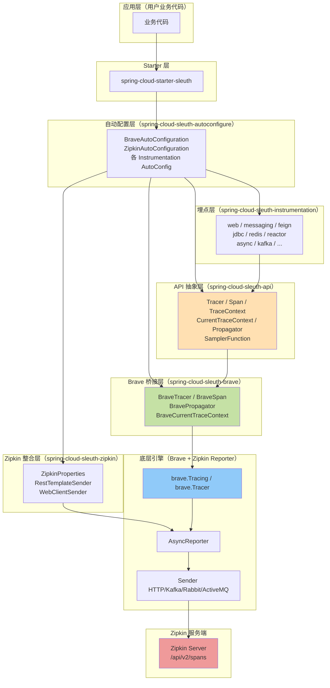
```mermaid
graph TB
    subgraph 应用层["应用层（用户业务代码）"]
        APP[业务代码]
    end

    subgraph Starter层["Starter 层"]
        STARTER[spring-cloud-starter-sleuth]
    end

    subgraph 自动配置层["自动配置层（spring-cloud-sleuth-autoconfigure）"]
        AUTO[BraveAutoConfiguration<br/>ZipkinAutoConfiguration<br/>各 Instrumentation AutoConfig]
    end

    subgraph API层["API 抽象层（spring-cloud-sleuth-api）"]
        API[Tracer / Span / TraceContext<br/>CurrentTraceContext / Propagator<br/>SamplerFunction]
    end

    subgraph Brave桥接层["Brave 桥接层（spring-cloud-sleuth-brave）"]
        BRAVE[BraveTracer / BraveSpan<br/>BravePropagator<br/>BraveCurrentTraceContext]
    end

    subgraph 埋点层["埋点层（spring-cloud-sleuth-instrumentation）"]
        INSTR[web / messaging / feign<br/>jdbc / redis / reactor<br/>async / kafka / ...]
    end

    subgraph Zipkin整合层["Zipkin 整合层（spring-cloud-sleuth-zipkin）"]
        ZIPKIN[ZipkinProperties<br/>RestTemplateSender<br/>WebClientSender]
    end

    subgraph 底层引擎["底层引擎（Brave + Zipkin Reporter）"]
        BRAVE_CORE[brave.Tracing / brave.Tracer]
        REPORTER[AsyncReporter]
        SENDER[Sender HTTP/Kafka/Rabbit/ActiveMQ]
    end

    subgraph Zipkin服务端["Zipkin 服务端"]
        ZIPKIN_SERVER[Zipkin Server<br/>/api/v2/spans]
    end

    APP --> STARTER
    STARTER --> AUTO
    AUTO --> API
    AUTO --> BRAVE
    AUTO --> INSTR
    AUTO --> ZIPKIN
    API --> BRAVE
    BRAVE --> BRAVE_CORE
    INSTR --> API
    ZIPKIN --> REPORTER
    BRAVE_CORE --> REPORTER
    REPORTER --> SENDER
    SENDER --> ZIPKIN_SERVER

    style API fill:#ffe0b2
    style BRAVE fill:#c5e1a5
    style BRAVE_CORE fill:#90caf9
    style ZIPKIN_SERVER fill:#ef9a9a
```

### 1.2 核心模块说明

| 模块 | 作用 |
|------|------|
| `spring-cloud-sleuth-api` | 提供 Sleuth 的统一追踪 API 接口（与实现解耦） |
| `spring-cloud-sleuth-brave` | Brave 实现，桥接 Sleuth API 与 Brave 原生 API |
| `spring-cloud-sleuth-autoconfigure` | 所有自动配置类，将组件装配到 Spring 容器 |
| `spring-cloud-sleuth-instrumentation` | 对 Web、Messaging、Feign、JDBC、Redis 等组件的埋点实现 |
| `spring-cloud-sleuth-zipkin` | 与 Zipkin 整合的 Sender 实现 |
| `spring-cloud-starter-sleuth` | Starter 入口，依赖聚合 |

### 1.3 关键架构特征

1. **API/实现分离**：Sleuth 定义统一接口（`Tracer`、`Span`、`TraceContext`），默认通过 Brave 桥接实现，未来可平滑切换到 OpenTelemetry。
2. **SPI 扩展点**：通过 `TracingCustomizer`、`CurrentTraceContextCustomizer`、`BaggagePropagationCustomizer`、`SpanHandler` 等 Bean 暴露扩展点。
3. **自动装配**：所有埋点组件通过 `@ConditionalOnClass` 在类路径存在时自动启用，业务零侵入。
4. **异步批量上报**：Span 通过 `AsyncReporter` 缓冲批量发送，降低网络开销。

---

## 二、Tracing 模型设计

### 2.1 核心接口总览

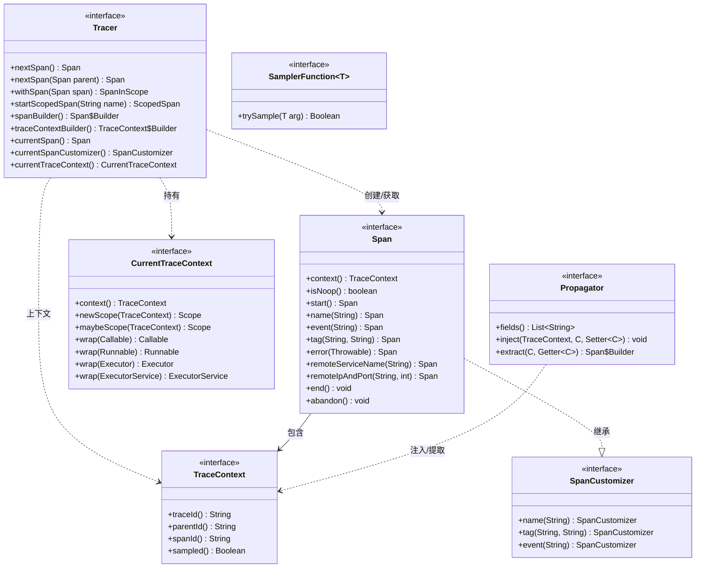
```mermaid
classDiagram
    class Tracer {
        <<interface>>
        +nextSpan() Span
        +nextSpan(Span parent) Span
        +withSpan(Span span) SpanInScope
        +startScopedSpan(String name) ScopedSpan
        +spanBuilder() Span$Builder
        +traceContextBuilder() TraceContext$Builder
        +currentSpan() Span
        +currentSpanCustomizer() SpanCustomizer
        +currentTraceContext() CurrentTraceContext
    }

    class Span {
        <<interface>>
        +context() TraceContext
        +isNoop() boolean
        +start() Span
        +name(String) Span
        +event(String) Span
        +tag(String, String) Span
        +error(Throwable) Span
        +remoteServiceName(String) Span
        +remoteIpAndPort(String, int) Span
        +end() void
        +abandon() void
    }

    class TraceContext {
        <<interface>>
        +traceId() String
        +parentId() String
        +spanId() String
        +sampled() Boolean
    }

    class CurrentTraceContext {
        <<interface>>
        +context() TraceContext
        +newScope(TraceContext) Scope
        +maybeScope(TraceContext) Scope
        +wrap(Callable) Callable
        +wrap(Runnable) Runnable
        +wrap(Executor) Executor
        +wrap(ExecutorService) ExecutorService
    }

    class SpanCustomizer {
        <<interface>>
        +name(String) SpanCustomizer
        +tag(String, String) SpanCustomizer
        +event(String) SpanCustomizer
    }

    class Propagator {
        <<interface>>
        +fields() List~String~
        +inject(TraceContext, C, Setter~C~) void
        +extract(C, Getter~C~) Span$Builder
    }

    class SamplerFunction~T~ {
        <<interface>>
        +trySample(T arg) Boolean
    }

    Tracer ..> Span : 创建/获取
    Tracer ..> TraceContext : 上下文
    Tracer ..> CurrentTraceContext : 持有
    Span --> TraceContext : 包含
    Span ..|> SpanCustomizer : 继承
    Propagator ..> TraceContext : 注入/提取
```

### 2.2 核心接口文件路径

| 接口 | 文件路径 |
|------|---------|
| `Tracer` | `spring-cloud-sleuth-api/src/main/java/org/springframework/cloud/sleuth/Tracer.java` |
| `Span` | `spring-cloud-sleuth-api/src/main/java/org/springframework/cloud/sleuth/Span.java` |
| `TraceContext` | `spring-cloud-sleuth-api/src/main/java/org/springframework/cloud/sleuth/TraceContext.java` |
| `CurrentTraceContext` | `spring-cloud-sleuth-api/src/main/java/org/springframework/cloud/sleuth/CurrentTraceContext.java` |
| `SpanCustomizer` | `spring-cloud-sleuth-api/src/main/java/org/springframework/cloud/sleuth/SpanCustomizer.java` |
| `ScopedSpan` | `spring-cloud-sleuth-api/src/main/java/org/springframework/cloud/sleuth/ScopedSpan.java` |
| `Propagator` | `spring-cloud-sleuth-api/src/main/java/org/springframework/cloud/sleuth/propagation/Propagator.java` |
| `SamplerFunction` | `spring-cloud-sleuth-api/src/main/java/org/springframework/cloud/sleuth/SamplerFunction.java` |

### 2.3 TraceContext 字段语义

`TraceContext` 是贯穿整个调用链的"上下文身份证"：

| 字段 | 类型 | 说明 |
|------|------|------|
| `traceId` | `String` | 全局唯一追踪 ID，整条链路所有 Span 共享，64 位（16 hex）或 128 位（32 hex） |
| `parentId` | `String` (nullable) | 父 Span 的 ID，用于构建层级关系；根 Span 的 parentId 为 null |
| `spanId` | `String` | 当前 Span 的唯一 ID，64 位（16 hex） |
| `sampled` | `Boolean` | 采样决策：`true`=上报、`false`=不上报、`null`=延迟决策 |

> Brave 底层的 `brave.propagation.TraceContext` 还包含 `traceIdHigh`（128 位时的高 64 位）、`shared`（是否共享 Span ID，对应 `supportsJoin`）等字段。

### 2.4 Span 的四种 Kind

```java
// 文件：spring-cloud-sleuth-api/src/main/java/org/springframework/cloud/sleuth/Span.java
enum Kind { SERVER, CLIENT, PRODUCER, CONSUMER }
```

| Kind | 场景 | 典型埋点位置 |
|------|------|-------------|
| `SERVER` | 服务端接收到请求 | `TracingFilter`（Servlet）/ `TraceWebFilter`（Reactive） |
| `CLIENT` | 客户端发起请求 | `TracingClientHttpRequestInterceptor` / `TracingFeignClient` |
| `PRODUCER` | 消息生产者发送消息 | `TracingChannelInterceptor.preSend` |
| `CONSUMER` | 消息消费者接收消息 | `TracingChannelInterceptor.postReceive` |

### 2.5 Brave 桥接实现

Sleuth 通过**适配器模式**将 Brave 的实现包装为 Sleuth 接口实现：

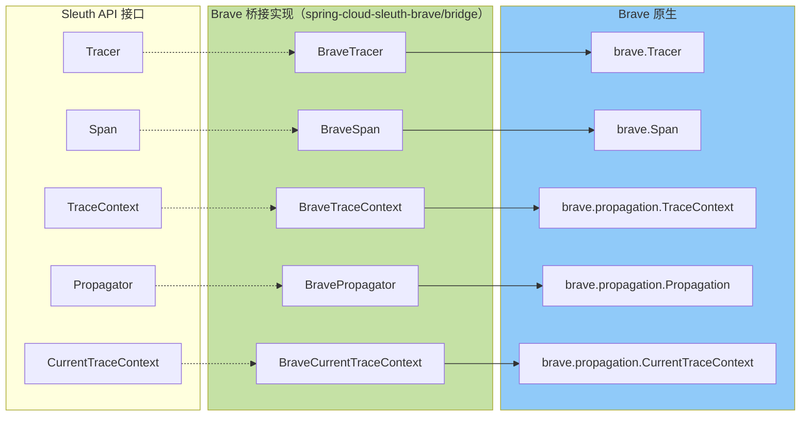
```mermaid
graph LR
    subgraph SleuthAPI["Sleuth API 接口"]
        TracerI[Tracer]
        SpanI[Span]
        TraceContextI[TraceContext]
        PropagatorI[Propagator]
        CTCI[CurrentTraceContext]
    end

    subgraph BraveBridge["Brave 桥接实现（spring-cloud-sleuth-brave/bridge）"]
        BraveTracer
        BraveSpan
        BraveTraceContext
        BravePropagator
        BraveCurrentTraceContext
    end

    subgraph BraveCore["Brave 原生"]
        BTracer[brave.Tracer]
        BSpan[brave.Span]
        BTraceContext[brave.propagation.TraceContext]
        BPropagation[brave.propagation.Propagation]
        BCurrentTraceContext[brave.propagation.CurrentTraceContext]
    end

    TracerI -.-> BraveTracer
    SpanI -.-> BraveSpan
    TraceContextI -.-> BraveTraceContext
    PropagatorI -.-> BravePropagator
    CTCI -.-> BraveCurrentTraceContext

    BraveTracer --> BTracer
    BraveSpan --> BSpan
    BraveTraceContext --> BTraceContext
    BravePropagator --> BPropagation
    BraveCurrentTraceContext --> BCurrentTraceContext

    style BraveBridge fill:#c5e1a5
    style BraveCore fill:#90caf9
```

**BraveTracer 关键代码**：

```java
// 文件：spring-cloud-sleuth-brave/src/main/java/org/springframework/cloud/sleuth/brave/bridge/BraveTracer.java
public class BraveTracer implements Tracer {
    private final brave.Tracer tracer;                    // Brave 原生 Tracer
    private final BraveBaggageManager braveBaggageManager;
    private final CurrentTraceContext currentTraceContext;

    @Override
    public Span nextSpan() {
        return new BraveSpan(this.tracer.nextSpan());      // 委托给 Brave
    }

    @Override
    public SpanInScope withSpan(Span span) {
        if (span == null) {
            currentTraceContext.maybeScope(null);
            return SpanInScope.NOOP;
        }
        // 将 Span 的 context 设置到当前线程
        return new BraveSpanInScope(currentTraceContext.maybeScope(span.context()));
    }
}
```

**BraveSpan 关键代码**：

```java
// 文件：spring-cloud-sleuth-brave/src/main/java/org/springframework/cloud/sleuth/brave/bridge/BraveSpan.java
public class BraveSpan implements Span {
    final brave.Span delegate;       // 持有 Brave 原生 Span

    @Override public Span start() { this.delegate.start(); return this; }
    @Override public Span event(String value) { this.delegate.annotate(value); return this; }
    @Override public Span tag(String key, String value) { this.delegate.tag(key, value); return this; }
    @Override public void end() { this.delegate.finish(); }       // 结束并触发上报
    @Override public void abandon() { this.delegate.abandon(); }  // 放弃，不上报
    @Override public TraceContext context() {
        return new BraveTraceContext(this.delegate.context());
    }
}
```

**BravePropagator 关键代码**：

```java
// 文件：spring-cloud-sleuth-brave/src/main/java/org/springframework/cloud/sleuth/brave/bridge/BravePropagator.java
public class BravePropagator implements Propagator {
    private final Tracing tracing;

    @Override
    public <C> void inject(TraceContext traceContext, C carrier, Setter<C> setter) {
        // 委托给 Brave 的 propagation 注入器
        this.tracing.propagation().injector(setter::set)
            .inject(BraveTraceContext.toBrave(traceContext), carrier);
    }

    @Override
    public <C> Span.Builder extract(C carrier, Getter<C> getter) {
        // 委托给 Brave 的 propagation 提取器
        TraceContextOrSamplingFlags extract =
            this.tracing.propagation().extractor(getter::get).extract(carrier);
        if (extract.samplingFlags() == SamplingFlags.EMPTY) {
            return new BraveSpanBuilder(this.tracing.tracer());
        }
        return BraveSpanBuilder.toBuilder(this.tracing.tracer(), extract);
    }
}
```

### 2.6 Span 状态机

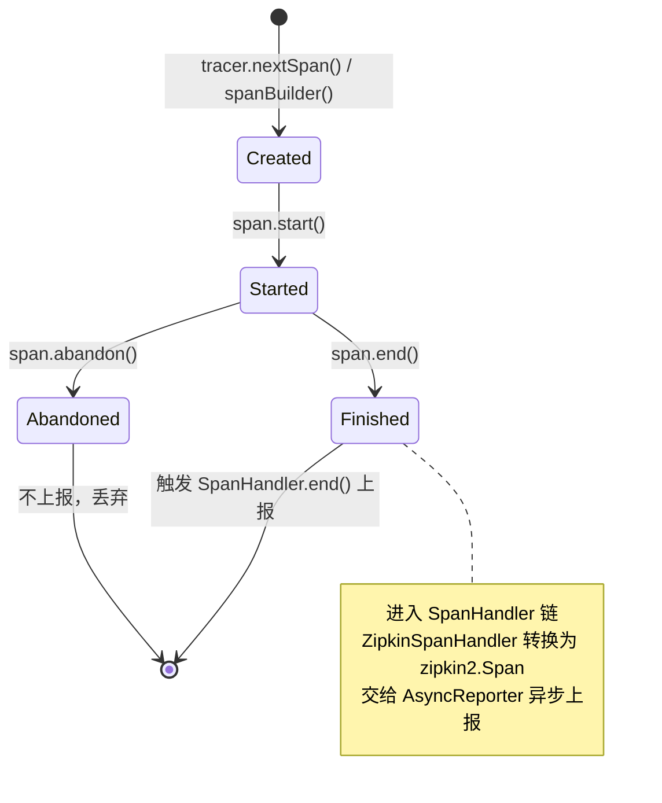
```mermaid
stateDiagram-v2
    [*] --> Created: tracer.nextSpan() / spanBuilder()
    Created --> Started: span.start()
    Started --> Finished: span.end()
    Started --> Abandoned: span.abandon()
    Finished --> [*]: 触发 SpanHandler.end() 上报
    Abandoned --> [*]: 不上报，丢弃
    note right of Finished
        进入 SpanHandler 链
        ZipkinSpanHandler 转换为 zipkin2.Span
        交给 AsyncReporter 异步上报
    end note
```

---

## 三、Span 生命周期与层级串联构建

### 3.1 Span 创建的三种方式

```java
// 方式 1：自动继承当前上下文（最常用）
Span span = tracer.nextSpan().name("my-operation").start();

// 方式 2：使用 ScopedSpan（自动管理 scope）
ScopedSpan span = tracer.startScopedSpan("my-operation");
try {
    // 业务代码
} finally {
    span.end();   // 自动清理 scope
}

// 方式 3：通过 Builder 精细控制
Span span = tracer.spanBuilder()
    .name("my-operation")
    .setParent(parentContext)    // 显式指定父上下文
    .kind(Span.Kind.CLIENT)
    .tag("key", "value")
    .start();
```

### 3.2 父子关系构建机制

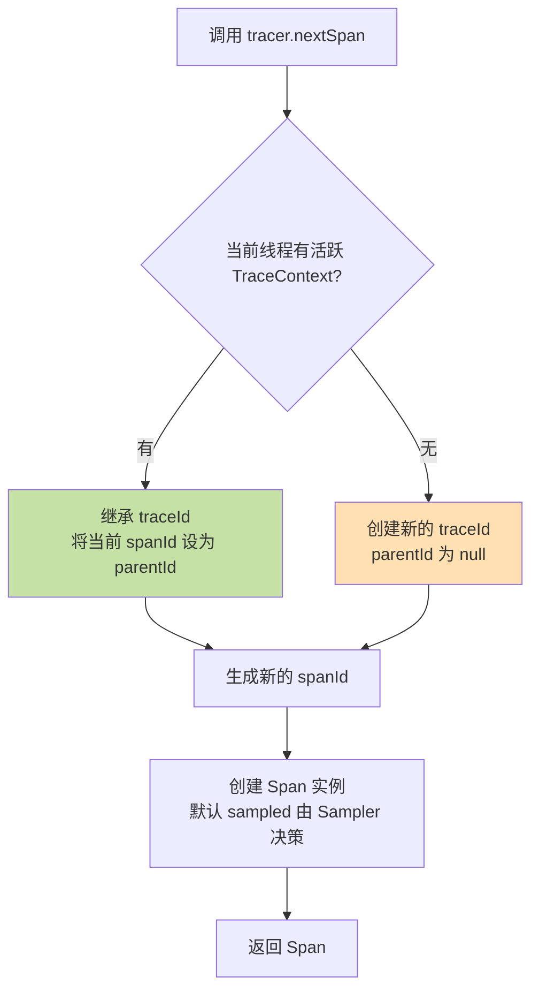
```mermaid
graph TD
    A[调用 tracer.nextSpan] --> B{当前线程有活跃 TraceContext?}
    B -->|有| C[继承 traceId<br/>将当前 spanId 设为 parentId]
    B -->|无| D[创建新的 traceId<br/>parentId 为 null]
    C --> E[生成新的 spanId]
    D --> E
    E --> F[创建 Span 实例<br/>默认 sampled 由 Sampler 决策]
    F --> G[返回 Span]

    style C fill:#c5e1a5
    style D fill:#ffe0b2
```

**关键点**：
- `traceId` 在整条调用链中**全程一致**，由根 Span 生成。
- `spanId` 每个 Span 唯一。
- `parentId` 指向调用链中上一个 Span 的 `spanId`，构成树形结构。
- Brave 通过 `Tracer.nextSpan()` 内部从 `CurrentTraceContext` 获取当前 TraceContext，自动设置 parent。

### 3.3 Scope 机制详解

`Scope` 是 Sleuth 管理 ThreadLocal 上下文的核心抽象。`CurrentTraceContext` 默认使用 `ThreadLocal` 存储当前 TraceContext。

```java
// 典型用法：try-with-resources 自动清理
try (Tracer.SpanInScope scope = tracer.withSpan(span.start())) {
    // 在此作用域内，tracer.currentSpan() 返回 span
    // 业务逻辑
} finally {
    span.end();
}
```

**Scope 的工作流程**：

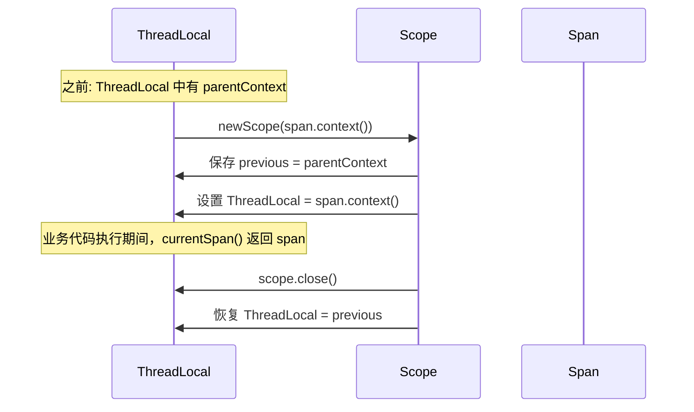
```mermaid
sequenceDiagram
    participant T as ThreadLocal
    participant S as Scope
    participant SP as Span

    Note over T: 之前: ThreadLocal 中有 parentContext
    T->>S: newScope(span.context())
    S->>T: 保存 previous = parentContext
    S->>T: 设置 ThreadLocal = span.context()
    Note over T: 业务代码执行期间，currentSpan() 返回 span
    S->>T: scope.close()
    S->>T: 恢复 ThreadLocal = previous
```

### 3.4 Span vs ScopedSpan

| 特性 | `Span` | `ScopedSpan` |
|------|--------|-------------|
| 创建方式 | `tracer.nextSpan().start()` | `tracer.startScopedSpan("name")` |
| Scope 管理 | 需手动 `withSpan()` | 自动管理 scope |
| 适用场景 | 跨线程、异步、需要完整 Span 引用 | 同步代码块的简单计时 |
| Tag/Event | 通过 `Span` 对象操作 | 通过 `ScopedSpan` 对象操作 |
| 结束 | `span.end()` | `scopedSpan.end()` |

### 3.5 Span 层级树形结构

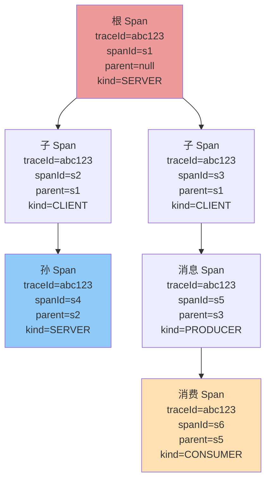
```mermaid
graph TD
    ROOT[根 Span<br/>traceId=abc123<br/>spanId=s1<br/>parent=null<br/>kind=SERVER]
    CHILD1[子 Span<br/>traceId=abc123<br/>spanId=s2<br/>parent=s1<br/>kind=CLIENT]
    CHILD2[子 Span<br/>traceId=abc123<br/>spanId=s3<br/>parent=s1<br/>kind=CLIENT]
    GRANDCHILD[孙 Span<br/>traceId=abc123<br/>spanId=s4<br/>parent=s2<br/>kind=SERVER]
    PRODUCER[消息 Span<br/>traceId=abc123<br/>spanId=s5<br/>parent=s3<br/>kind=PRODUCER]
    CONSUMER[消费 Span<br/>traceId=abc123<br/>spanId=s6<br/>parent=s5<br/>kind=CONSUMER]

    ROOT --> CHILD1
    ROOT --> CHILD2
    CHILD1 --> GRANDCHILD
    CHILD2 --> PRODUCER
    PRODUCER --> CONSUMER

    style ROOT fill:#ef9a9a
    style GRANDCHILD fill:#90caf9
    style CONSUMER fill:#ffe0b2
```

> **关键**：所有 Span 共享同一个 `traceId=abc123`，通过 `parentId` 串联成树。Zipkin UI 据此还原调用树。

### 3.6 Span 的关键操作

| 操作 | 说明 | 示例 |
|------|------|------|
| `name(String)` | 设置 Span 名称 | `span.name("http:get /users")` |
| `tag(k, v)` | 添加标签（KV） | `span.tag("http.status_code", "200")` |
| `event(String)` | 记录时间点事件 | `span.event("ws.receive")` |
| `error(Throwable)` | 记录异常 | `span.error(ex)` |
| `remoteServiceName(String)` | 远端服务名 | `span.remoteServiceName("user-service")` |
| `remoteIpAndPort(ip, port)` | 远端地址 | `span.remoteIpAndPort("10.0.0.1", 8080)` |

---

## 四、TraceId 生成机制

### 4.1 生成器与位数控制

Sleuth 3.1.x **不直接生成 TraceId**，而是完全委托给 Brave。Brave 内部使用 `Platform` 类获取一个安全的 `Random` 实例（通常是 `java.security.SecureRandom`）生成 ID。

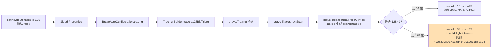
```mermaid
graph LR
    A[spring.sleuth.trace-id-128<br/>默认 false] --> B[SleuthProperties]
    B --> C[BraveAutoConfiguration.tracing]
    C --> D["Tracing.Builder.traceId128Bit(false)"]
    D --> E[brave.Tracing 构建]
    E --> F[brave.Tracer.nextSpan]
    F --> G[brave.propagation.TraceContext<br/>nextId 生成 spanId/traceId]
    G --> H{是否 128 位?}
    H -->|是 64 位| I["traceId: 16 hex 字符<br/>例如 463ac35c9f6413ad"]
    H -->|是 128 位| J["traceId: 32 hex 字符<br/>traceIdHigh + traceId<br/>例如 463ac35c9f6413ad48485a3953bb6124"]
    style J fill:#ffe0b2
```

### 4.2 关键源码链路

**1. 配置开关（SleuthProperties）**：

```java
// 文件：spring-cloud-sleuth-autoconfigure/src/main/java/org/springframework/cloud/sleuth/autoconfig/brave/SleuthProperties.java:30-39
@ConfigurationProperties("spring.sleuth")
public class SleuthProperties {
    private boolean enabled = true;
    /** When true, generate 128-bit trace IDs instead of 64-bit ones. */
    private boolean traceId128 = false;
    /** True means the tracing system supports sharing a span ID between a client and server. */
    private boolean supportsJoin = true;
}
```

**2. Tracing.Builder 构建（BraveAutoConfiguration）**：

```java
// 文件：spring-cloud-sleuth-autoconfigure/src/main/java/org/springframework/cloud/sleuth/autoconfig/brave/BraveAutoConfiguration.java:88-110
@Bean(name = TRACING_BEAN_NAME)
@ConditionalOnMissingBean
Tracing tracing(@LocalServiceName String serviceName, Propagation.Factory factory,
        CurrentTraceContext currentTraceContext, Sampler sampler, SleuthProperties sleuthProperties,
        @Nullable List<SpanHandler> spanHandlers, @Nullable List<TracingCustomizer> tracingCustomizers) {
    Tracing.Builder builder = Tracing.newBuilder().sampler(sampler)
            .localServiceName(!StringUtils.hasText(serviceName) ? DEFAULT_SERVICE_NAME : serviceName)
            .propagationFactory(factory).currentTraceContext(currentTraceContext)
            .traceId128Bit(sleuthProperties.isTraceId128())    // <-- 控制位数
            .supportsJoin(sleuthProperties.isSupportsJoin());
    if (spanHandlers != null) {
        for (SpanHandler spanHandlerFactory : spanHandlers) {
            builder.addSpanHandler(spanHandlerFactory);
        }
    }
    if (tracingCustomizers != null) {
        for (TracingCustomizer customizer : tracingCustomizers) {
            customizer.customize(builder);
        }
    }
    return builder.build();
}
```

### 4.3 TraceId 格式

**64 位 TraceId（默认）**：
- 格式：16 个十六进制字符
- 示例：`463ac35c9f6413ad`
- 字节长度：8 字节

**128 位 TraceId（`spring.sleuth.trace-id128=true`）**：
- 格式：32 个十六进制字符
- 示例：`463ac35c9f6413ad48485a3953bb6124`
- 字节长度：16 字节
- 由 `traceIdHigh`（高 8 字节）+ `traceId`（低 8 字节）组成
- 主要用于避免 traceId 冲突，不携带时间戳语义

### 4.4 TraceId 一致性保证

整条调用链中 TraceId 一致性通过以下机制保证：

1. **入站时提取**：HTTP 请求/消息到达时，`Propagator.extract` 从 header 中解析 traceId。
2. **出站时注入**：HTTP 请求/消息发送时，`Propagator.inject` 将 traceId 写入 header。
3. **新建时生成**：无 header 时（根请求），由 Brave 生成新的 traceId。
4. **跨线程携带**：通过 `TraceRunnable`、`TraceCallable` 包装捕获当前 TraceContext，在新线程中通过 `CurrentTraceContext.maybeScope` 恢复。
5. **Reactor 传播**：通过 `Hooks.onEachOperator` 全局钩子，将 TraceContext 注入 Reactor Context。

---

## 五、上下文传播机制

### 5.1 传播协议（B3 默认）

Sleuth 3.1.x 默认使用 **B3 单 Header 格式**（`SINGLE_NO_PARENT`）。

```java
// 文件：spring-cloud-sleuth-autoconfigure/src/main/java/org/springframework/cloud/sleuth/autoconfig/brave/BraveBaggageConfiguration.java:106-114
@Bean
@ConditionalOnMissingBean
PropagationFactorySupplier defaultPropagationFactorySupplier(SleuthPropagationProperties properties) {
    if (properties.getType().contains(PropagationType.CUSTOM)) {
        throw new IllegalStateException("...");
    }
    // 默认使用 B3 单 Header 格式（不含 ParentSpanId）
    return () -> B3Propagation.newFactoryBuilder()
            .injectFormat(B3Propagation.Format.SINGLE_NO_PARENT)
            .build();
}
```

**默认传播类型配置**：

```java
// 文件：spring-cloud-sleuth-autoconfigure/src/main/java/org/springframework/cloud/sleuth/autoconfig/brave/SleuthPropagationProperties.java:37
private List<PropagationType> type = Collections.singletonList(PropagationType.B3);
```

### 5.2 B3 协议两种格式

#### B3 多 Header 格式（兼容解析）

| Header | 说明 | 示例 |
|--------|------|------|
| `X-B3-TraceId` | Trace ID（16 或 32 hex） | `463ac35c9f6413ad` |
| `X-B3-SpanId` | 当前 Span ID（16 hex） | `a2fb4521d5cf9650` |
| `X-B3-ParentSpanId` | 父 Span ID（16 hex） | `0020000000000001` |
| `X-B3-Sampled` | 采样决策 | `0` / `1` / `d`（debug） |
| `X-B3-Flags` | 标志位 | `1` 表示 Debug 模式 |

#### B3 单 Header 格式（默认注入）

格式：`b3: {TraceId}-{SpanId}-{SamplingState}-{ParentSpanId}`

```
b3: 463ac35c9f6413ad-a2fb4521d5cf9650-1-0020000000000001
                  │              │              │
                  │              │              └── ParentSpanId（可选）
                  │              └── 采样状态: 0/1/d
                  └── SpanId
```

**示例**：
- 不采样：`b3: 463ac35c9f6413ad-a2fb4521d5cf9650-0`
- 采样：`b3: 463ac35c9f6413ad-a2fb4521d5cf9650-1`
- 调试：`b3: 463ac35c9f6413ad-a2fb4521d5cf9650-d`

### 5.3 其他传播协议

通过 `spring.sleuth.propagation.type` 配置（默认 `[B3]`），可选项：

| PropagationType | 说明 | Header |
|----------------|------|--------|
| `B3` | B3 协议（默认） | `b3` 单 header 或 `X-B3-*` 多 header |
| `W3C` | W3C TraceContext 标准 | `traceparent: 00-<traceId>-<spanId>-<flags>` |
| `AWS` | AWS X-Ray 格式 | `X-Amzn-Trace-Id` |
| `CUSTOM` | 用户自定义 | 需自定义 `PropagationFactorySupplier` |

### 5.4 Propagator 注入/提取流程

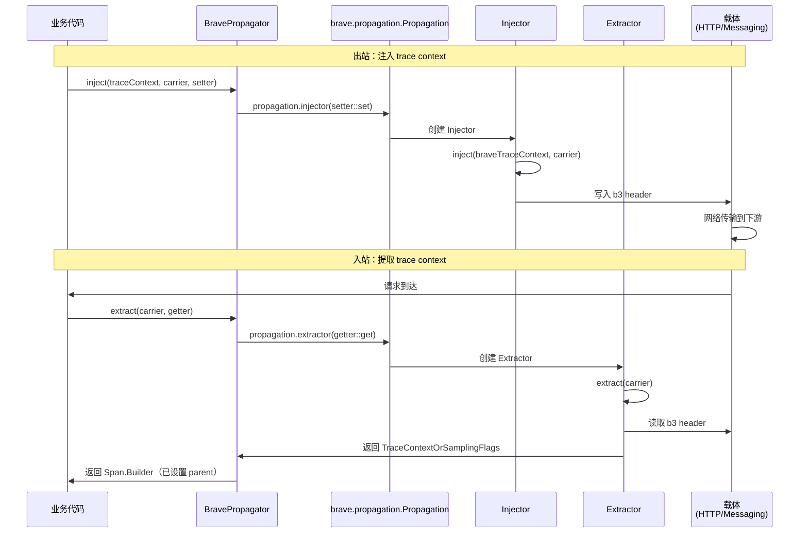
```mermaid
sequenceDiagram
    participant App as 业务代码
    participant Prop as BravePropagator
    participant BP as brave.propagation.Propagation
    participant Inj as Injector
    participant Ext as Extractor
    participant Carrier as 载体<br/>(HTTP/Messaging)

    Note over App,Carrier: 出站：注入 trace context
    App->>Prop: inject(traceContext, carrier, setter)
    Prop->>BP: propagation.injector(setter::set)
    BP->>Inj: 创建 Injector
    Inj->>Inj: inject(braveTraceContext, carrier)
    Inj->>Carrier: 写入 b3 header
    Carrier->>Carrier: 网络传输到下游

    Note over App,Carrier: 入站：提取 trace context
    Carrier->>App: 请求到达
    App->>Prop: extract(carrier, getter)
    Prop->>BP: propagation.extractor(getter::get)
    BP->>Ext: 创建 Extractor
    Ext->>Ext: extract(carrier)
    Ext->>Carrier: 读取 b3 header
    Ext->>Prop: 返回 TraceContextOrSamplingFlags
    Prop->>App: 返回 Span.Builder（已设置 parent）
```

### 5.5 跨线程传播

#### TraceRunnable / TraceCallable

```java
// 文件：spring-cloud-sleuth-instrumentation/src/main/java/org/springframework/cloud/sleuth/instrument/async/TraceRunnable.java
public class TraceRunnable implements Runnable {
    private final Tracer tracer;
    private final Runnable delegate;
    private final Span parent;     // 捕获当前 Span

    @Override
    public void run() {
        // 在新线程中基于 parent 创建子 Span
        Span childSpan = this.tracer.nextSpan(this.parent).start();
        try (Tracer.SpanInScope ws = this.tracer.withSpan(childSpan)) {
            this.delegate.run();
        } finally {
            childSpan.end();
        }
    }
}
```

#### 装饰器与线程池

| 组件 | 作用 |
|------|------|
| `ContextPropagatingTaskDecorator` | 装饰 `@Async` 任务的 Runnable/Callable |
| `TraceableExecutorService` | 装饰 `ExecutorService`，所有提交的任务自动包装 |
| `TraceableScheduledExecutorService` | 装饰 `ScheduledExecutorService` |
| `LazyExecutorService` | 懒加载装饰的线程池 |

#### @Async 拦截机制

```java
// 文件：spring-cloud-sleuth-instrumentation/src/main/java/org/springframework/cloud/sleuth/instrument/async/TraceAsyncAspect.java
@Aspect
public class TraceAsyncAspect {
    @Around("execution (@org.springframework.scheduling.annotation.Async  * *.*(..))")
    public Object traceBackgroundThread(final ProceedingJoinPoint pjp) throws Throwable {
        Span span = this.tracer.currentSpan();
        if (span == null) {
            span = this.tracer.nextSpan();    // 当前线程无 span 则新建
        }
        try (Tracer.SpanInScope ws = this.tracer.withSpan(span.start())) {
            return pjp.proceed();
        } finally {
            span.end();
        }
    }
}
```

### 5.6 MDC 日志集成

Sleuth 通过 `MDCScopeDecorator`（来自 Brave 的 `brave.context.slf4j`）将 traceId/spanId 注入 SLF4J MDC，使得 logback 可以直接使用 `%X{traceId}` 输出。

```java
// 文件：spring-cloud-sleuth-autoconfigure/src/main/java/org/springframework/cloud/sleuth/autoconfig/brave/BraveBaggageConfiguration.java:188-193
@Bean
@ConditionalOnMissingBean
@ConditionalOnClass(MDC.class)
CorrelationScopeDecorator.Builder correlationScopeDecoratorBuilder() {
    return MDCScopeDecorator.newBuilder();    // 将 traceId/spanId 注入 MDC
}
```

**logback.xml 配置示例**：

```xml
<pattern>%d{yyyy-MM-dd HH:mm:ss.SSS} [%thread] [%X{traceId}/%X{spanId}] %-5level [%logger{36}] - %msg%n</pattern>
```

**输出样例**：
```
2026-08-07 10:15:30.123 [http-nio-8080-exec-1] [463ac35c9f6413ad/a2fb4521d5cf9650] INFO  [SampleController] - Home page
```

### 5.7 采样机制

#### 采样器选择

```java
// 文件：spring-cloud-sleuth-autoconfigure/src/main/java/org/springframework/cloud/sleuth/autoconfig/brave/BraveSamplerConfiguration.java
@Configuration(proxyBeanMethods = false)
@EnableConfigurationProperties(SamplerProperties.class)
class BraveSamplerConfiguration {
    @Bean
    @ConditionalOnMissingBean
    Sampler sleuthTraceSampler() {
        return Sampler.NEVER_SAMPLE;    // 默认不采样（由其他配置覆盖）
    }

    static Sampler samplerFromProps(SamplerProperties config) {
        if (config.getProbability() != null) {
            return CountingSampler.create(config.getProbability());   // 概率采样
        }
        return brave.sampler.RateLimitingSampler.create(config.getRate());  // 速率采样
    }
}
```

#### 采样决策流程

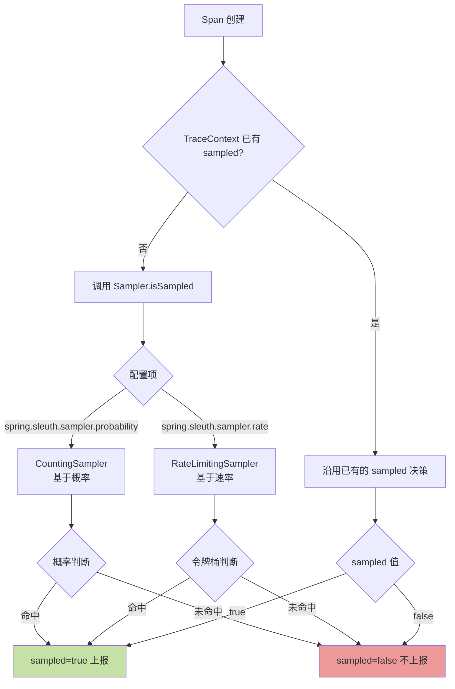
```mermaid
graph TD
    A[Span 创建] --> B{TraceContext 已有 sampled?}
    B -->|是| C[沿用已有的 sampled 决策]
    B -->|否| D[调用 Sampler.isSampled]
    D --> E{配置项}
    E -->|spring.sleuth.sampler.probability| F[CountingSampler<br/>基于概率]
    E -->|spring.sleuth.sampler.rate| G[RateLimitingSampler<br/>基于速率]
    F --> H{概率判断}
    G --> I{令牌桶判断}
    H -->|命中| J[sampled=true 上报]
    H -->|未命中| K[sampled=false 不上报]
    I -->|命中| J
    I -->|未命中| K
    C --> L{sampled 值}
    L -->|true| J
    L -->|false| K

    style J fill:#c5e1a5
    style K fill:#ef9a9a
```

> **注意**：采样决策在**根 Span 创建时**做一次，下游 Span 沿用同一决策（通过 `X-B3-Sampled` 头传递）。

---

## 六、埋点（Instrumentation）机制

### 6.1 埋点模块全景

`spring-cloud-sleuth-instrumentation` 模块包含 25+ 子模块，覆盖 Spring 生态绝大部分组件：

| 类别 | 子模块 | 埋点方式 |
|------|--------|---------|
| **Web 入站** | web/servlet、web | Servlet Filter / WebFilter |
| **Web 出站** | web/client | RestTemplate 拦截器、WebClient Filter |
| **Feign** | web/client/feign | AOP 切面 + Client 包装 |
| **消息** | messaging、kafka | ChannelInterceptor / Producer/Consumer 包装 |
| **异步** | async、task、scheduling | AOP + TaskDecorator |
| **响应式** | reactor、rxjava | Hooks / Operator 装饰 |
| **数据访问** | jdbc、redis、mongodb、cassandra、r2dbc | 事件监听 / 包装 |
| **调度** | quartz、batch | JobListener |
| **断路器** | circuitbreaker | 包装装饰 |
| **其他** | annotation、security、session、tx、gateway、grpc、rsocket | 各类拦截器 |

### 6.2 Web 入站埋点（核心）

#### 6.2.1 Servlet 环境 - TracingFilter

```java
// 文件：spring-cloud-sleuth-instrumentation/src/main/java/org/springframework/cloud/sleuth/instrument/web/servlet/TracingFilter.java
public final class TracingFilter implements Filter {
    final CurrentTraceContext currentTraceContext;
    final HttpServerHandler handler;        // Sleuth 抽象的 HTTP 服务端处理器

    @Override
    public void doFilter(ServletRequest request, ServletResponse response, FilterChain chain)
            throws IOException, ServletException {
        HttpServletRequest req = (HttpServletRequest) request;
        HttpServletResponse res = servlet.httpServletResponse(response);

        // 1. 防止同一请求重复创建 Span（forward 场景）
        TraceContext context = (TraceContext) request.getAttribute(TraceContext.class.getName());
        if (context != null) {
            try (CurrentTraceContext.Scope scope = currentTraceContext.maybeScope(context)) {
                chain.doFilter(request, response);
            }
            return;
        }

        // 2. 从 HTTP 请求提取 trace context 并创建 SERVER Span
        Span span = handler.handleReceive(new HttpServletRequestWrapper(req));

        // 3. 将 Span 存入 request 属性，供后续拦截器使用
        request.setAttribute(SpanCustomizer.class.getName(), span);
        request.setAttribute(TraceContext.class.getName(), span.context());
        SendHandled sendHandled = new SendHandled();
        request.setAttribute(SendHandled.class.getName(), sendHandled);

        // 4. 在 Span 作用域内执行后续 Filter 和 Servlet
        Throwable error = null;
        try (CurrentTraceContext.Scope scope = currentTraceContext.newScope(span.context())) {
            chain.doFilter(req, res);
        } catch (Throwable e) {
            error = e;
            throw e;
        } finally {
            // 5. 处理响应：同步直接结束 Span，异步延迟到 AsyncListener
            if (servlet.isAsync(req)) {
                servlet.handleAsync(handler, req, res, span);
            } else if (sendHandled.compareAndSet(false, true)) {
                HttpServerResponse responseWrapper = HttpServletResponseWrapper.create(req, res, error);
                handler.handleSend(responseWrapper, span);    // 结束 Span，触发上报
            }
        }
    }
}
```

#### 6.2.2 响应式环境 - TraceWebFilter

`TraceWebFilter` 用于 Spring WebFlux，通过 Reactor 的 `MonoWebFilterTrace` 和 `WebFilterTraceSubscriber` 实现。核心逻辑：
- 在 `subscribe` 时从 Exchange 提取/创建 SERVER Span
- 在 `onComplete` / `onError` 时结束 Span
- 通过 Reactor Context 传播 TraceContext

### 6.3 Web 出站埋点

#### 6.3.1 RestTemplate 拦截器

```java
// 文件：spring-cloud-sleuth-instrumentation/src/main/java/org/springframework/cloud/sleuth/instrument/web/client/TracingClientHttpRequestInterceptor.java（路径示意）
public class TracingClientHttpRequestInterceptor implements ClientHttpRequestInterceptor {
    private final HttpClientHandler handler;
    private final CurrentTraceContext currentTraceContext;

    @Override
    public ClientHttpResponse intercept(HttpRequest req, byte[] body, ClientHttpRequestExecution execution)
            throws IOException {
        HttpRequestWrapper request = new HttpRequestWrapper(req);
        // 1. 创建 CLIENT Span，并将 trace context 注入到 HTTP headers
        Span span = handler.handleSend(request);
        try (CurrentTraceContext.Scope ws = currentTraceContext.newScope(span.context())) {
            response = execution.execute(req, body);
            return response;
        } finally {
            // 2. 接收响应，结束 Span
            handler.handleReceive(new ClientHttpResponseWrapper(request, response, error), span);
        }
    }
}
```

#### 6.3.2 WebClient

通过 `TraceExchangeFilterFunction`（响应式版）实现，逻辑与 RestTemplate 类似，但适配 `ExchangeFunction` 接口。

#### 6.3.3 Feign

```java
// 文件：spring-cloud-sleuth-instrumentation/src/main/java/org/springframework/cloud/sleuth/instrument/web/client/feign/TracingFeignClient.java（路径示意）
public class TracingFeignClient implements Client {
    @Override
    public Response execute(Request request, Options options) throws IOException {
        // 1. 创建 CLIENT Span，注入 trace headers
        Span span = this.handler.handleSend(request);
        try (CurrentTraceContext.Scope ws = currentTraceContext.newScope(span.context())) {
            Response response = delegate.execute(request, options);
            // 2. 结束 Span
            handler.handleReceive(response, span);
            return response;
        }
    }
}
```

Feign 还通过 `SleuthFeignBuilder` 自定义 Feign Builder，自动注入 `TracingFeignClient` 和 trace `RequestInterceptor`。

### 6.4 消息埋点

#### 6.4.1 TracingChannelInterceptor

```java
// 文件：spring-cloud-sleuth-instrumentation/src/main/java/org/springframework/cloud/sleuth/instrument/messaging/TracingChannelInterceptor.java
public class TracingChannelInterceptor implements ChannelInterceptor {
    // 生产者：发送消息前创建 PRODUCER Span，注入 trace headers
    @Override
    public Message<?> preSend(Message<?> message, MessageChannel channel) {
        MessageHeaderAccessor headers = mutableHeaderAccessor(message);
        // 从消息头提取或新建 Span
        Span.Builder spanBuilder = this.propagator.extract(headers, this.extractor);
        spanBuilder.kind(Span.Kind.PRODUCER);
        Span span = spanBuilder.start();
        // 注入到消息头，供消费者提取
        this.propagator.inject(span.context(), headers, this.injector);
        return outputMessage(message, retrievedMessage, headers);
    }

    // 消费者：接收消息时创建 CONSUMER Span
    @Override
    public Message<?> postReceive(Message<?> message, MessageChannel channel) {
        MessageHeaderAccessor headers = mutableHeaderAccessor(message);
        Span result = this.propagator.extract(headers, this.extractor).start();
        Span span = consumerSpanReceive(message, channel, headers, result);
        this.propagator.inject(span.context(), headers, this.injector);
        return new GenericMessage<>(message.getPayload(), headers.getMessageHeaders());
    }
}
```

#### 6.4.2 Kafka 专用埋点

通过 `TracingKafkaProducer`、`TracingKafkaConsumer`、`TracingKafkaAspect` 包装原生 Kafka Client，注入/提取 `traceparent` 或 B3 headers 到 `Headers` 对象。

### 6.5 异步埋点

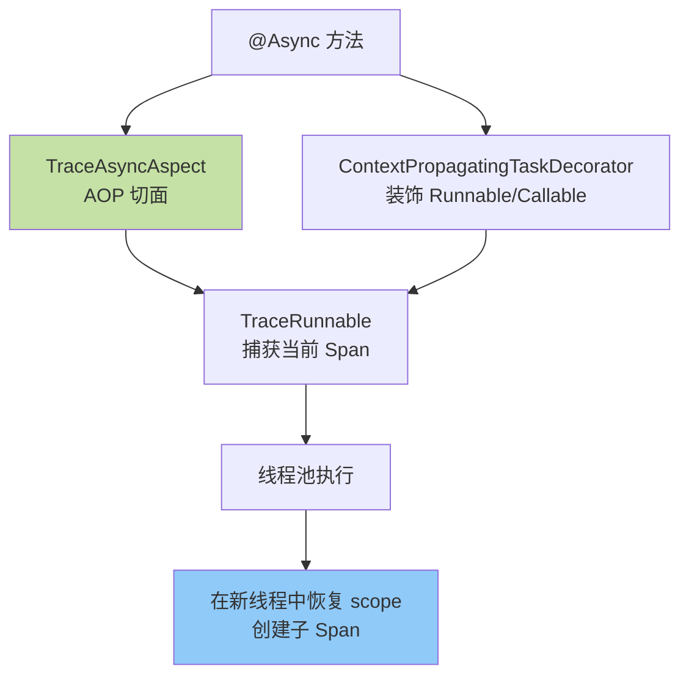
```mermaid
graph TD
    ASYNC["@Async 方法"]
    ASPECT[TraceAsyncAspect<br/>AOP 切面]
    DECORATOR[ContextPropagatingTaskDecorator<br/>装饰 Runnable/Callable]
    TRACERUN[TraceRunnable<br/>捕获当前 Span]
    POOL[线程池执行]
    NEWS[在新线程中恢复 scope<br/>创建子 Span]

    ASYNC --> ASPECT
    ASYNC --> DECORATOR
    ASPECT --> TRACERUN
    DECORATOR --> TRACERUN
    TRACERUN --> POOL
    POOL --> NEWS

    style ASPECT fill:#c5e1a5
    style NEWS fill:#90caf9
```

### 6.6 数据访问埋点

| 组件 | 实现方式 |
|------|---------|
| **JDBC** | 通过 `p6spy` 或 `datasource-proxy` 拦截 SQL 执行，`TraceJdbcEventListener` 创建 Span |
| **Redis** | 自定义 `LettuceClientResourcesBuilderCustomizer`，通过 Lettuce Tracing API |
| **MongoDB** | 通过 `MongoTracingCommandListener` 拦截命令 |
| **Cassandra** | 通过 `TracingCassandraSession` 包装 |
| **R2DBC** | 响应式数据库访问，通过 `ProxyConnectionFactory` 拦截 |

### 6.7 Reactor 埋点

```java
// 文件：spring-cloud-sleuth-instrumentation/src/main/java/org/springframework/cloud/sleuth/instrument/reactor/ReactorSleuth.java（路径示意）
// 通过 Hooks 注册全局操作符
Hooks.onEachOperator(ReactorSleuth.scopePassingSpanOperator(applicationContext));
Hooks.onLastOperator(ReactorSleuth.scopePassingSpanOperator(applicationContext));
```

`ScopePassingSpanSubscriber` 在每个 `onNext`、`onSubscribe`、`onError`、`onComplete` 回调中通过 `currentTraceContext.maybeScope(parent)` 恢复 TraceContext，确保跨 Scheduler 传播。

**Reactor instrumentation 类型**（`spring.sleuth.reactor.instrumentation-type`）：
- `DECORATE_ON_EACH`：每个 operator 都装饰
- `DECORATE_ON_LAST`：只在最后 operator 装饰
- `AUTO`：自动选择

### 6.8 埋点统一抽象

所有埋点都基于以下统一抽象：

| 抽象 | 作用 |
|------|------|
| `HttpServerHandler` | HTTP 服务端统一处理（创建/结束 SERVER Span） |
| `HttpClientHandler` | HTTP 客户端统一处理（创建/结束 CLIENT Span） |
| `Tracer` | 创建和管理 Span |
| `CurrentTraceContext` | 管理 ThreadLocal 上下文 |
| `Propagator` | 跨进程注入/提取 TraceContext |

---

## 七、与 Zipkin 的整合

### 7.1 Zipkin 整合架构

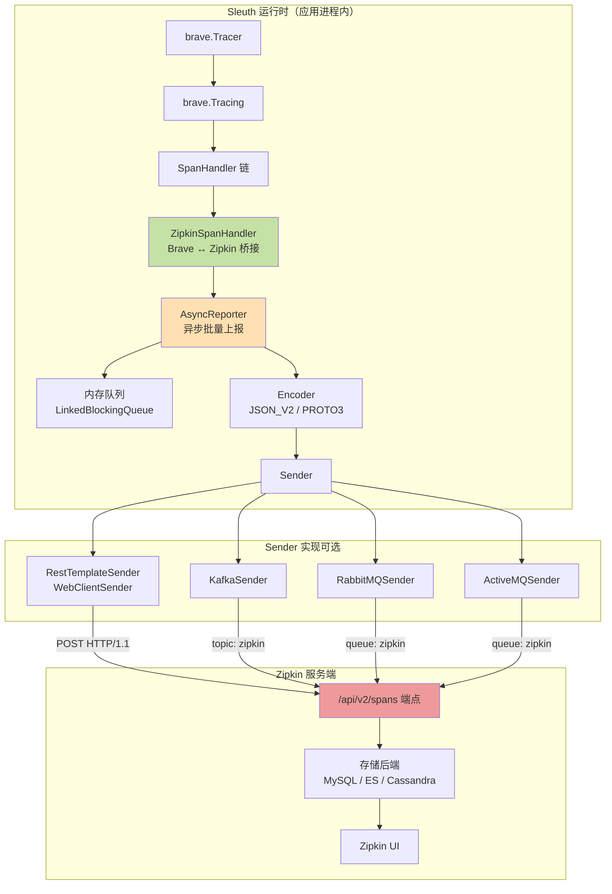
```mermaid
graph TB
    subgraph Sleuth运行时["Sleuth 运行时（应用进程内）"]
        BTRACER[brave.Tracer]
        BTRACING[brave.Tracing]
        SHLIST[SpanHandler 链]
        ZSH[ZipkinSpanHandler<br/>Brave ↔ Zipkin 桥接]
        ASYNC[AsyncReporter<br/>异步批量上报]
        BUFFER[内存队列<br/>LinkedBlockingQueue]
        ENC[Encoder<br/>JSON_V2 / PROTO3]
        SENDER[Sender]
    end

    subgraph Sender实现["Sender 实现可选"]
        HTTP[RestTemplateSender<br/>WebClientSender]
        KAFKA[KafkaSender]
        RABBIT[RabbitMQSender]
        AMQ[ActiveMQSender]
    end

    subgraph Zipkin服务端["Zipkin 服务端"]
        API["/api/v2/spans 端点"]
        STORAGE["存储后端<br/>MySQL / ES / Cassandra"]
        UI["Zipkin UI"]
    end

    BTRACER --> BTRACING
    BTRACING --> SHLIST
    SHLIST --> ZSH
    ZSH --> ASYNC
    ASYNC --> BUFFER
    ASYNC --> ENC
    ENC --> SENDER
    SENDER --> HTTP
    SENDER --> KAFKA
    SENDER --> RABBIT
    SENDER --> AMQ
    HTTP -->|POST HTTP/1.1| API
    KAFKA -->|topic: zipkin| API
    RABBIT -->|queue: zipkin| API
    AMQ -->|queue: zipkin| API
    API --> STORAGE
    STORAGE --> UI

    style ZSH fill:#c5e1a5
    style ASYNC fill:#ffe0b2
    style API fill:#ef9a9a
```

### 7.2 关键组件

#### 7.2.1 ZipkinSpanHandler（Brave 与 Zipkin 桥梁）

`ZipkinSpanHandler` 来自 `zipkin2.reporter.brave`（Zipkin Reporter 库），是 Brave 的 `SpanHandler` 实现，负责在 Span 结束时将 `brave.MutableSpan` 转换为 `zipkin2.Span`，并交给 `Reporter<zipkin2.Span>` 上报。

```java
// 文件：spring-cloud-sleuth-autoconfigure/src/main/java/org/springframework/cloud/sleuth/autoconfig/zipkin2/ZipkinBraveConfiguration.java:84-104
@Bean
SpanHandler zipkinSpanHandler(@Nullable List<Reporter<Span>> spanReporters, @Nullable Tag<Throwable> errorTag) {
    if (spanReporters == null) {
        return SpanHandler.NOOP;
    }
    LinkedHashSet<Reporter<Span>> reporters = new LinkedHashSet<>(spanReporters);
    reporters.remove(Reporter.NOOP);
    if (spanReporters.isEmpty()) {
        return SpanHandler.NOOP;
    }
    // 多个 reporter 时使用 CompositeSpanReporter 聚合
    Reporter<Span> spanReporter = reporters.size() == 1 ? reporters.iterator().next()
            : new CompositeSpanReporter(reporters.toArray(new Reporter[0]));

    ZipkinSpanHandler.Builder builder = ZipkinSpanHandler.newBuilder(spanReporter);
    if (errorTag != null) {
        builder.errorTag(errorTag);
    }
    return builder.build();
}

// 保证 Zipkin SpanHandler 在最后执行（在 redaction 等处理器之后）
@Bean
TracingCustomizer reorderZipkinHandlersLast() {
    return builder -> {
        List<SpanHandler> configuredSpanHandlers = new ArrayList<>(builder.spanHandlers());
        configuredSpanHandlers.sort(SPAN_HANDLER_COMPARATOR);   // ZipkinSpanHandler 排到最后
        builder.clearSpanHandlers();
        for (SpanHandler spanHandler : configuredSpanHandlers) {
            builder.addSpanHandler(spanHandler);
        }
    };
}
```

#### 7.2.2 AsyncReporter（异步批量上报）

```java
// 文件：spring-cloud-sleuth-autoconfigure/src/main/java/org/springframework/cloud/sleuth/autoconfig/zipkin2/ZipkinAutoConfiguration.java:126-157
@Bean(REPORTER_BEAN_NAME)
@ConditionalOnMissingBean(name = REPORTER_BEAN_NAME)
Reporter<Span> reporter(ReporterMetrics reporterMetrics, ZipkinProperties zipkin,
        @Qualifier(SENDER_BEAN_NAME) Sender sender) {
    // 启动时异步检查 Zipkin 可达性
    checkResult(zipkinExecutor, sender, zipkin.getCheckTimeout());

    // 构建 AsyncReporter
    AsyncReporter<Span> asyncReporter = AsyncReporter.builder(sender)
            .queuedMaxSpans(zipkin.getQueuedMaxSpans())      // 队列最大容量，默认 1000
            .messageTimeout(zipkin.getMessageTimeout(), TimeUnit.SECONDS)  // flush 超时，默认 1s
            .metrics(reporterMetrics)
            .build(zipkin.getEncoder());                       // 默认 JSON_V2

    // 注册 JVM 关闭钩子，确保退出前 flush 残留 Span
    Runtime.getRuntime().addShutdownHook(new Thread() {
        @Override
        public void run() {
            log.info("Flushing remaining spans on shutdown");
            asyncReporter.flush();
            try {
                Thread.sleep(TimeUnit.SECONDS.toMillis(zipkin.getMessageTimeout()) + 500);
                asyncReporter.close();
            } catch (ClosedSenderException ex) {
                log.debug("Sender already closed", ex);
            } catch (Exception e) {
                throw new IllegalStateException(e);
            }
        }
    });
    return asyncReporter;
}
```

**AsyncReporter 关键特性**：
- **批量上报**：内部维护 `LinkedBlockingQueue`，达到批量条件一次性发送
- **超时触发**：默认 1 秒未达批量也会 flush
- **内存限制**：`queuedMaxSpans` 防止 OOM
- **优雅关闭**：JVM Shutdown Hook 保证不丢数据
- **指标监控**：通过 `ReporterMetrics` 暴露队列/丢弃/字节等指标

#### 7.2.3 Sender 实现

| Sender 类型 | 实现类 | 适用场景 | 传输协议 |
|------------|--------|---------|---------|
| **HTTP（Servlet）** | `RestTemplateSender` | 传统 Spring MVC | HTTP POST `/api/v2/spans` |
| **HTTP（Reactive）** | `WebClientSender` | Spring WebFlux | HTTP POST `/api/v2/spans` |
| **Kafka** | `KafkaSender`（Zipkin Reporter 内置） | 高吞吐解耦 | 发送到 `zipkin` topic |
| **RabbitMQ** | `RabbitMQSender` | 企业消息队列 | 发送到 `zipkin` queue |
| **ActiveMQ** | `ActiveMQSender` | 传统 JMS | 发送到 `zipkin` queue |

### 7.3 Span 数据格式

#### 7.3.1 编码格式

| 编码 | 类 | 说明 |
|------|----|----|
| `JSON_V2` | `SpanBytesEncoder.JSON_V2` | Zipkin v2 JSON（默认） |
| `PROTO3` | `SpanBytesEncoder.PROTO3` | Protocol Buffers |
| `JSON_V1` | `SpanBytesEncoder.JSON_V1` | 兼容旧版 Zipkin |

#### 7.3.2 Zipkin v2 JSON 示例

```json
[
  {
    "traceId": "463ac35c9f6413ad48485a3953bb6124",
    "parentId": "48485a3953bb6124",
    "id": "a2fb4521d5cf9650",
    "kind": "SERVER",
    "name": "get /api/users/{id}",
    "timestamp": 1628200000000000,
    "duration": 123456,
    "localEndpoint": {
      "serviceName": "user-service",
      "ipv4": "192.168.1.100",
      "port": 8080
    },
    "remoteEndpoint": {
      "serviceName": "unknown",
      "ipv4": "192.168.1.1",
      "port": 56789
    },
    "tags": {
      "http.method": "GET",
      "http.path": "/api/users/123",
      "http.status_code": "200",
      "error": "NullPointerException"
    },
    "annotations": [
      { "timestamp": 1628200000000000, "value": "sr" },
      { "timestamp": 1628200000123456, "value": "ss" }
    ]
  }
]
```

#### 7.3.3 关键字段说明

| 字段 | 说明 |
|------|------|
| `traceId` | 整条链路唯一 ID（64 或 128 位） |
| `id` | 当前 Span ID |
| `parentId` | 父 Span ID（根 Span 无此字段） |
| `kind` | SERVER / CLIENT / PRODUCER / CONSUMER |
| `name` | Span 名称（如 `get /api/users/{id}`） |
| `timestamp` | 起始时间戳（微秒） |
| `duration` | 持续时长（微秒） |
| `localEndpoint` | 本端服务信息（服务名、IP、端口） |
| `remoteEndpoint` | 远端服务信息 |
| `tags` | 业务标签（KV） |
| `annotations` | 时间戳事件（如 `sr`=server receive、`ss`=server send） |

---

## 八、链路数据上报完整流程

### 8.1 端到端流程图

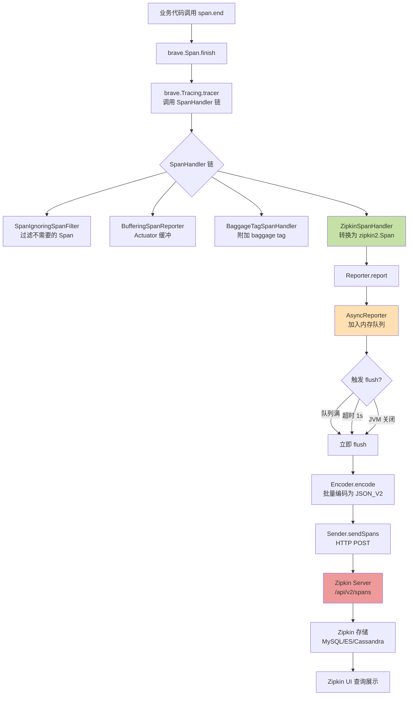
```mermaid
flowchart TD
    A[业务代码调用 span.end] --> B[brave.Span.finish]
    B --> C[brave.Tracing.tracer<br/>调用 SpanHandler 链]
    C --> D{SpanHandler 链}
    D --> E1[SpanIgnoringSpanFilter<br/>过滤不需要的 Span]
    D --> E2[BufferingSpanReporter<br/>Actuator 缓冲]
    D --> E3[BaggageTagSpanHandler<br/>附加 baggage tag]
    D --> E4[ZipkinSpanHandler<br/>转换为 zipkin2.Span]
    E4 --> F[Reporter.report]
    F --> G[AsyncReporter<br/>加入内存队列]
    G --> H{触发 flush?}
    H -->|队列满| I[立即 flush]
    H -->|超时 1s| I
    H -->|JVM 关闭| I
    I --> J[Encoder.encode<br/>批量编码为 JSON_V2]
    J --> K[Sender.sendSpans<br/>HTTP POST]
    K --> L[Zipkin Server<br/>/api/v2/spans]
    L --> M[Zipkin 存储<br/>MySQL/ES/Cassandra]
    M --> N[Zipkin UI 查询展示]

    style E4 fill:#c5e1a5
    style G fill:#ffe0b2
    style L fill:#ef9a9a
```

### 8.2 Span 转换与上报时序

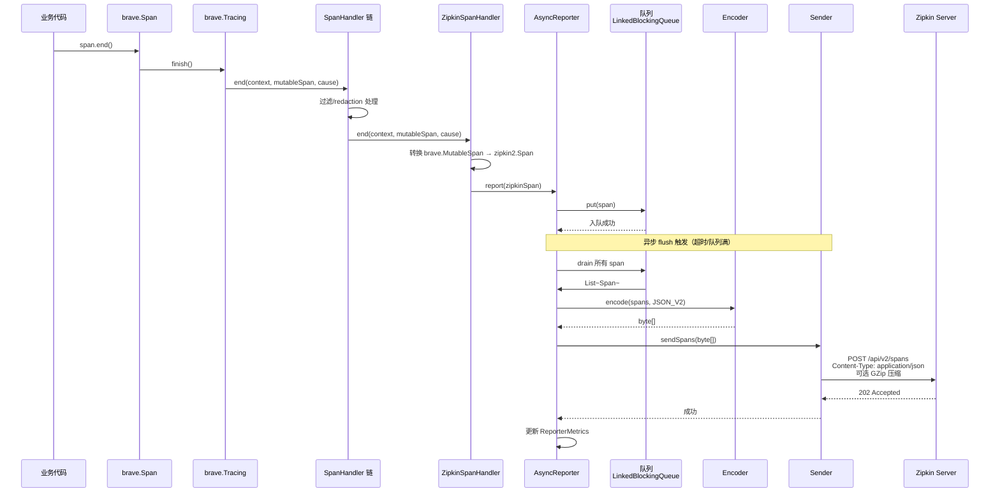
```mermaid
sequenceDiagram
    participant App as 业务代码
    participant BSpan as brave.Span
    participant BTracing as brave.Tracing
    participant SH as SpanHandler 链
    participant ZSH as ZipkinSpanHandler
    participant AR as AsyncReporter
    participant Q as 队列<br/>LinkedBlockingQueue
    participant ENC as Encoder
    participant SD as Sender
    participant ZK as Zipkin Server

    App->>BSpan: span.end()
    BSpan->>BTracing: finish()
    BTracing->>SH: end(context, mutableSpan, cause)
    SH->>SH: 过滤/redaction 处理
    SH->>ZSH: end(context, mutableSpan, cause)
    ZSH->>ZSH: 转换 brave.MutableSpan → zipkin2.Span
    ZSH->>AR: report(zipkinSpan)
    AR->>Q: put(span)
    Q-->>AR: 入队成功

    Note over AR,SD: 异步 flush 触发（超时/队列满）
    AR->>Q: drain 所有 span
    Q->>AR: List~Span~
    AR->>ENC: encode(spans, JSON_V2)
    ENC-->>AR: byte[]
    AR->>SD: sendSpans(byte[])
    SD->>ZK: POST /api/v2/spans<br/>Content-Type: application/json<br/>可选 GZip 压缩
    ZK-->>SD: 202 Accepted
    SD-->>AR: 成功
    AR->>AR: 更新 ReporterMetrics
```

### 8.3 关键环节详解

#### 8.3.1 SpanHandler 链调用

`brave.Tracing` 内部维护所有 `SpanHandler`，在 `tracer().finish(span)` 时按顺序调用：

```java
// 伪代码
for (SpanHandler handler : spanHandlers) {
    if (!handler.end(context, mutableSpan, cause)) {
        break;    // 返回 false 终止后续处理
    }
}
```

**默认 SpanHandler 链**（经 `reorderZipkinHandlersLast` 重排后）：
1. 用户自定义 `SpanHandler`（如 redaction、过滤）
2. `BaggageTagSpanHandler`（如果配置了 baggage tag-fields）
3. `BufferingSpanReporter`（如果启用 actuator traces 端点）
4. `ZipkinSpanHandler`（最后执行，转换并上报）

#### 8.3.2 AsyncReporter 内部机制

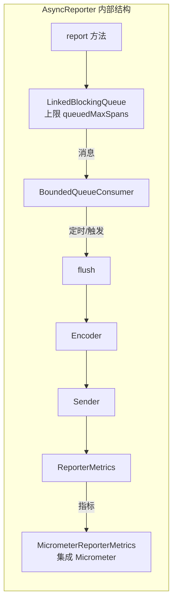
```mermaid
graph LR
    subgraph AsyncReporter内部["AsyncReporter 内部结构"]
        R[report 方法] --> Q[LinkedBlockingQueue<br/>上限 queuedMaxSpans]
        Q -->|消息| BoundedQueueConsumer
        BoundedQueueConsumer -->|定时/触发| FLUSH[flush]
        FLUSH --> ENC[Encoder]
        ENC --> SD[Sender]
        SD --> METRICS[ReporterMetrics]
        METRICS -->|指标| MM[MicrometerReporterMetrics<br/>集成 Micrometer]
    end
```

**触发 flush 的条件**：
1. **超时触发**：`messageTimeout`（默认 1 秒）后台线程定期检查
2. **队列满**：达到 `queuedMaxSpans`（默认 1000）
3. **显式调用**：`asyncReporter.flush()` 或 `close()`

#### 8.3.3 HTTP 发送细节

`RestTemplateSender` 通过 RestTemplate 发送：

```
POST http://localhost:9411/api/v2/spans
Content-Type: application/json
Content-Encoding: gzip   (如果 spring.zipkin.compression.enabled=true)
Body: [
  {"traceId":"...","id":"...","name":"...",...},
  {"traceId":"...","id":"...","name":"...",...}
]
```

- 默认端口：`9411`
- 默认路径：`/api/v2/spans`（由 `spring.zipkin.api-path` 覆盖）
- 默认开启 GZip 压缩：`spring.zipkin.compression.enabled=true`（推荐生产开启）

---

## 九、自动配置体系

### 9.1 核心自动配置类

#### 9.1.1 BraveAutoConfiguration

```java
// 文件：spring-cloud-sleuth-autoconfigure/src/main/java/org/springframework/cloud/sleuth/autoconfig/brave/BraveAutoConfiguration.java:62-71
@Configuration(proxyBeanMethods = false)
@ConditionalOnBraveEnabled
@ConditionalOnProperty(value = "spring.sleuth.enabled", matchIfMissing = true)
@ConditionalOnMissingBean(org.springframework.cloud.sleuth.Tracer.class)
@ConditionalOnClass({ Tracer.class, SleuthProperties.class })
@EnableConfigurationProperties({ SleuthProperties.class, SleuthSpanFilterProperties.class,
        SleuthBaggageProperties.class, SleuthTracerProperties.class })
@Import({ BraveBridgeConfiguration.class, BraveBaggageConfiguration.class, BraveSamplerConfiguration.class,
        BraveHttpConfiguration.class, TraceConfiguration.class, SleuthAnnotationConfiguration.class })
public class BraveAutoConfiguration { ... }
```

#### 9.1.2 ZipkinAutoConfiguration

```java
// 文件：spring-cloud-sleuth-autoconfigure/src/main/java/org/springframework/cloud/sleuth/autoconfig/zipkin2/ZipkinAutoConfiguration.java:78-87
@Configuration(proxyBeanMethods = false)
@EnableConfigurationProperties(ZipkinProperties.class)
@ConditionalOnClass({ Sender.class, EndpointLocator.class })
@ConditionalOnProperty(value = { "spring.sleuth.enabled", "spring.zipkin.enabled" }, matchIfMissing = true)
@AutoConfigureAfter(name = { "RefreshAutoConfiguration", "RabbitAutoConfiguration", "KafkaAutoConfiguration" })
@AutoConfigureBefore(BraveAutoConfiguration.class)
@Import({ ZipkinSenderConfigurationImportSelector.class, ZipkinBraveConfiguration.class })
public class ZipkinAutoConfiguration { ... }
```

### 9.2 Bean 实例化顺序

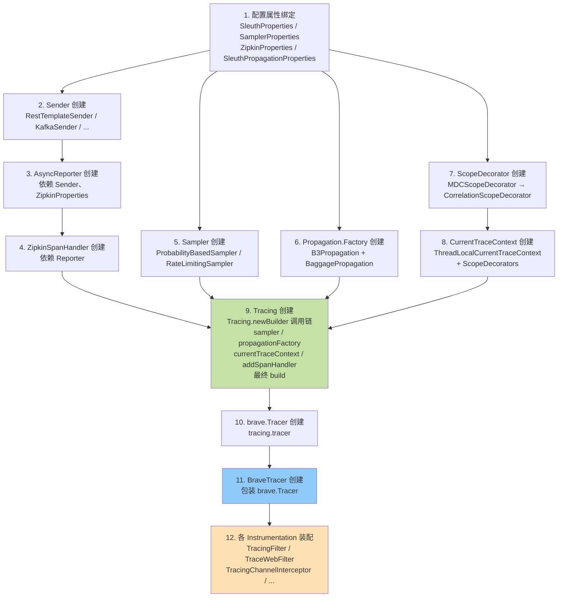
```mermaid
graph TD
    P1["1. 配置属性绑定<br/>SleuthProperties / SamplerProperties<br/>ZipkinProperties / SleuthPropagationProperties"]
    P2["2. Sender 创建<br/>RestTemplateSender / KafkaSender / ..."]
    P3[3. AsyncReporter 创建<br/>依赖 Sender、ZipkinProperties]
    P4[4. ZipkinSpanHandler 创建<br/>依赖 Reporter]
    P5["5. Sampler 创建<br/>ProbabilityBasedSampler / RateLimitingSampler"]
    P6["6. Propagation.Factory 创建<br/>B3Propagation + BaggagePropagation"]
    P7[7. ScopeDecorator 创建<br/>MDCScopeDecorator → CorrelationScopeDecorator]
    P8[8. CurrentTraceContext 创建<br/>ThreadLocalCurrentTraceContext<br/>+ ScopeDecorators]
    P9["9. Tracing 创建<br/>Tracing.newBuilder 调用链<br/>sampler / propagationFactory<br/>currentTraceContext / addSpanHandler<br/>最终 build"]
    P10[10. brave.Tracer 创建<br/>tracing.tracer]
    P11[11. BraveTracer 创建<br/>包装 brave.Tracer]
    P12[12. 各 Instrumentation 装配<br/>TracingFilter / TraceWebFilter<br/>TracingChannelInterceptor / ...]

    P1 --> P2
    P2 --> P3
    P3 --> P4
    P1 --> P5
    P1 --> P6
    P1 --> P7
    P7 --> P8
    P4 --> P9
    P5 --> P9
    P6 --> P9
    P8 --> P9
    P9 --> P10
    P10 --> P11
    P11 --> P12

    style P9 fill:#c5e1a5
    style P11 fill:#90caf9
    style P12 fill:#ffe0b2
```

### 9.3 Tracing.Builder 完整构建过程


```mermaid
graph LR
    A[Tracing.newBuilder] --> B[.sampler<br/>Sampler]
    B --> C[.localServiceName<br/>spring.application.name]
    C --> D[.propagationFactory<br/>BaggagePropagation+B3]
    D --> E[.currentTraceContext<br/>ThreadLocalCurrentTraceContext<br/>+ Slf4j/MDCScopeDecorator]
    E --> F[.traceId128Bit<br/>spring.sleuth.trace-id-128]
    F --> G[.supportsJoin<br/>spring.sleuth.supports-join]
    G --> H[.addSpanHandler<br/>ZipkinSpanHandler / 其他]
    H --> I[TracingCustomizer.customize<br/>reorderZipkinHandlersLast]
    I --> J[.build<br/>生成 brave.Tracing]
    J --> K[tracing.tracer<br/>生成 brave.Tracer]
    K --> L[BraveTracer 包装<br/>实现 Sleuth Tracer]

    style J fill:#c5e1a5
    style L fill:#90caf9
```

### 9.4 配置类一览

| 配置类 | 前缀 | 文件路径 |
|--------|------|---------|
| `SleuthProperties` | `spring.sleuth` | `.../autoconfig/brave/SleuthProperties.java` |
| `SamplerProperties` | `spring.sleuth.sampler` | `.../autoconfig/brave/SamplerProperties.java` |
| `SleuthPropagationProperties` | `spring.sleuth.propagation` | `.../autoconfig/brave/SleuthPropagationProperties.java` |
| `SleuthBaggageProperties` | `spring.sleuth.baggage` | `.../autoconfig/SleuthBaggageProperties.java` |
| `SleuthSpanFilterProperties` | `spring.sleuth.span-filter` | `.../autoconfig/SleuthSpanFilterProperties.java` |
| `SleuthTracerProperties` | `spring.sleuth.tracer` | `.../autoconfig/SleuthTracerProperties.java` |
| `ZipkinProperties` | `spring.zipkin` | `.../zipkin2/ZipkinProperties.java` |

### 9.5 Actuator 集成

| 类 | 作用 |
|----|------|
| `TracesScrapeEndpoint` | 暴露 `/actuator/traces` 端点，返回最近完成的 Span |
| `BufferingSpanReporter` | 内存缓冲最近 Span，供 actuator 查询 |
| `BraveFinishedSpanWriter` | 将 brave MutableSpan 转为 Sleuth FinishedSpan |
| `TraceSleuthActuatorAutoConfiguration` | Actuator 自动配置 |
| `LazyMicrometerReporterMetrics` | 懒加载 Micrometer 指标 |

---

## 十、配置项汇总

### 10.1 spring.sleuth.* 核心配置

| 配置项 | 类型 | 默认值 | 说明 |
|--------|------|--------|------|
| `spring.sleuth.enabled` | `boolean` | `true` | 是否全局启用 Sleuth |
| `spring.sleuth.trace-id-128` | `boolean` | `false` | 是否生成 128 位 TraceId |
| `spring.sleuth.supports-join` | `boolean` | `true` | 是否支持 Client/Server 共享 SpanId |
| `spring.sleuth.sampler.probability` | `Float` | `null` | 采样概率（0.0~1.0） |
| `spring.sleuth.sampler.rate` | `Integer` | `10` | 每秒最大采样数 |
| `spring.sleuth.sampler.refresh.enabled` | `boolean` | `true` | 是否支持动态刷新采样配置 |
| `spring.sleuth.propagation.type` | `List<PropagationType>` | `[B3]` | 传播协议类型 |
| `spring.sleuth.span-filter.enabled` | `boolean` | `true` | 是否启用 Span 名称过滤 |
| `spring.sleuth.span-filter.span-name-patterns-to-skip` | `List<String>` | `[]` | 需要忽略的 Span 名称模式 |
| `spring.sleuth.baggage.remote-fields` | `List<String>` | `[]` | 远端传播的 baggage 字段名 |
| `spring.sleuth.baggage.local-fields` | `List<String>` | `[]` | 本地 baggage 字段名 |
| `spring.sleuth.baggage.correlation-fields` | `List<String>` | `[]` | 注入 MDC 的 baggage 字段 |
| `spring.sleuth.baggage.tag-fields` | `List<String>` | `[]` | 作为 tag 的 baggage 字段 |
| `spring.sleuth.baggage.correlation-enabled` | `boolean` | `true` | 是否启用 baggage 与 MDC 关联 |
| `spring.sleuth.reactor.instrumentation-type` | `enum` | `DECORATE_ON_EACH` | Reactor 埋点模式 |

### 10.2 spring.zipkin.* 配置

| 配置项 | 类型 | 默认值 | 说明 |
|--------|------|--------|------|
| `spring.zipkin.base-url` | `String` | `http://localhost:9411/` | Zipkin 服务器地址 |
| `spring.zipkin.enabled` | `boolean` | `true` | 是否启用 Zipkin 上报 |
| `spring.zipkin.api-path` | `String` | `null` | 自定义 API 路径（默认 `/api/v2/spans`） |
| `spring.zipkin.check-timeout` | `int` | `1000` | 连接检查超时（毫秒） |
| `spring.zipkin.message-timeout` | `int` | `1` | flush 超时（秒） |
| `spring.zipkin.encoder` | `SpanBytesEncoder` | `JSON_V2` | 编码格式 |
| `spring.zipkin.queued-max-spans` | `int` | `1000` | 队列最大 Span 数 |
| `spring.zipkin.compression.enabled` | `boolean` | `false` | 是否启用 GZip 压缩 |
| `spring.zipkin.service.name` | `String` | `null` | 覆盖 `spring.application.name` |
| `spring.zipkin.discovery-client-enabled` | `Boolean` | `null` | 是否将 baseUrl 视为服务发现 ID |
| `spring.zipkin.locator.discovery.enabled` | `boolean` | `false` | 通过服务发现定位本地端点 |
| `spring.zipkin.sender.type` | `String` | `web` | Sender 类型：`web`/`kafka`/`rabbit`/`activemq` |
| `spring.zipkin.kafka.topic` | `String` | `zipkin` | Kafka Sender topic |
| `spring.zipkin.rabbitmq.queue` | `String` | `zipkin` | RabbitMQ Sender queue |
| `spring.zipkin.activemq.queue` | `String` | `zipkin` | ActiveMQ Sender queue |

---

## 十一、完整调用链时序分析

### 11.1 典型场景：HTTP → HTTP → Kafka 跨服务链路

**场景**：用户调用服务 A 的 HTTP 接口，A 通过 HTTP 调用 B，B 发送 Kafka 消息给 C，C 消费消息。

### 11.2 完整时序图

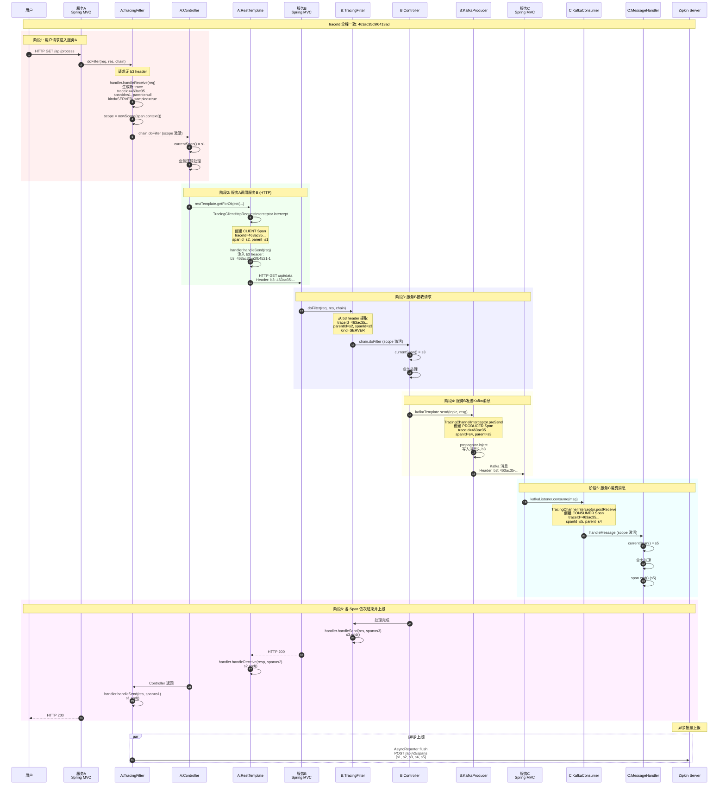
```mermaid
sequenceDiagram
    autonumber
    participant U as 用户
    participant A as 服务A<br/>Spring MVC
    participant AF as A:TracingFilter
    participant AC as A:Controller
    participant ART as A:RestTemplate
    participant B as 服务B<br/>Spring MVC
    participant BF as B:TracingFilter
    participant BC as B:Controller
    participant BK as B:KafkaProducer
    participant C as 服务C<br/>Spring MVC
    participant CK as C:KafkaConsumer
    participant CH as C:MessageHandler
    participant ZK as Zipkin Server

    Note over U,ZK: traceId 全程一致: 463ac35c9f6413ad

    rect rgb(255, 240, 240)
    Note over U,A: 阶段1: 用户请求进入服务A
    U->>A: HTTP GET /api/process
    A->>AF: doFilter(req, res, chain)
    Note over AF: 请求无 b3 header
    AF->>AF: handler.handleReceive(req)<br/>生成新 trace<br/>traceId=463ac35...<br/>spanId=s1, parent=null<br/>kind=SERVER, sampled=true
    AF->>AF: scope = newScope(span.context())
    AF->>AC: chain.doFilter (scope 激活)
    AC->>AC: currentSpan() = s1
    AC->>AC: 业务逻辑处理
    end

    rect rgb(240, 255, 240)
    Note over AC,B: 阶段2: 服务A调用服务B (HTTP)
    AC->>ART: restTemplate.getForObject(...)
    ART->>ART: TracingClientHttpRequestInterceptor.intercept
    Note over ART: 创建 CLIENT Span<br/>traceId=463ac35...<br/>spanId=s2, parent=s1
    ART->>ART: handler.handleSend(req)<br/>注入 b3 header:<br/>b3: 463ac35-a2fb4521-1
    ART->>B: HTTP GET /api/data<br/>Header: b3: 463ac35-...
    end

    rect rgb(240, 240, 255)
    Note over B,C: 阶段3: 服务B接收请求
    B->>BF: doFilter(req, res, chain)
    Note over BF: 从 b3 header 提取<br/>traceId=463ac35...<br/>parentId=s2, spanId=s3<br/>kind=SERVER
    BF->>BC: chain.doFilter (scope 激活)
    BC->>BC: currentSpan() = s3
    BC->>BC: 业务处理
    end

    rect rgb(255, 255, 240)
    Note over BC,C: 阶段4: 服务B发送Kafka消息
    BC->>BK: kafkaTemplate.send(topic, msg)
    Note over BK: TracingChannelInterceptor.preSend<br/>创建 PRODUCER Span<br/>traceId=463ac35...<br/>spanId=s4, parent=s3
    BK->>BK: propagator.inject<br/>写入消息头 b3
    BK->>C: Kafka 消息<br/>Header: b3: 463ac35-...
    end

    rect rgb(240, 255, 255)
    Note over C,ZK: 阶段5: 服务C消费消息
    C->>CK: kafkaListener.consume(msg)
    Note over CK: TracingChannelInterceptor.postReceive<br/>创建 CONSUMER Span<br/>traceId=463ac35...<br/>spanId=s5, parent=s4
    CK->>CH: handleMessage (scope 激活)
    CH->>CH: currentSpan() = s5
    CH->>CH: 业务处理
    CH->>CH: span.end() (s5)
    end

    rect rgb(255, 240, 255)
    Note over U,ZK: 阶段6: 各 Span 依次结束并上报
    BC->>BF: 处理完成
    BF->>BF: handler.handleSend(res, span=s3)<br/>s3.end()
    B-->>ART: HTTP 200
    ART->>ART: handler.handleReceive(resp, span=s2)<br/>s2.end()
    AC->>AF: Controller 返回
    AF->>AF: handler.handleSend(res, span=s1)<br/>s1.end()
    A-->>U: HTTP 200
    end

    Note over ZK: 异步批量上报
    par 异步上报
        AF->>ZK: AsyncReporter flush<br/>POST /api/v2/spans<br/>[s1, s2, s3, s4, s5]
    end
```

### 11.3 Span 树形结构

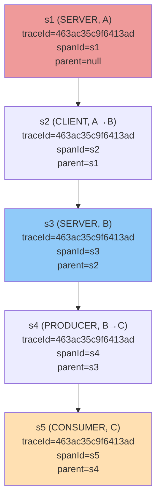
```mermaid
graph TD
    S1["s1 (SERVER, A)<br/>traceId=463ac35c9f6413ad<br/>spanId=s1<br/>parent=null"]
    S2["s2 (CLIENT, A→B)<br/>traceId=463ac35c9f6413ad<br/>spanId=s2<br/>parent=s1"]
    S3["s3 (SERVER, B)<br/>traceId=463ac35c9f6413ad<br/>spanId=s3<br/>parent=s2"]
    S4["s4 (PRODUCER, B→C)<br/>traceId=463ac35c9f6413ad<br/>spanId=s4<br/>parent=s3"]
    S5["s5 (CONSUMER, C)<br/>traceId=463ac35c9f6413ad<br/>spanId=s5<br/>parent=s4"]

    S1 --> S2
    S2 --> S3
    S3 --> S4
    S4 --> S5

    style S1 fill:#ef9a9a
    style S3 fill:#90caf9
    style S5 fill:#ffe0b2
```

### 11.4 不同载体的传播对照

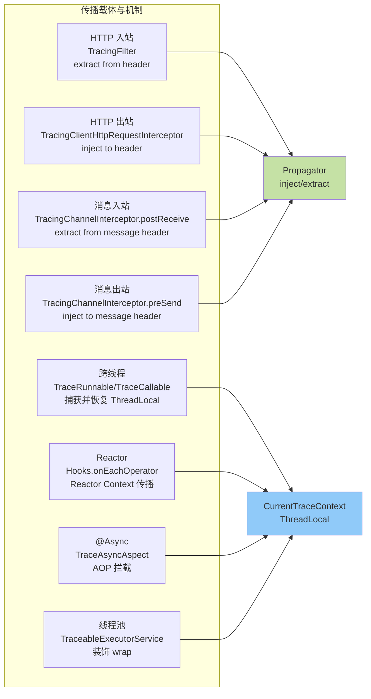
```mermaid
graph LR
    subgraph 传播载体与机制
        HTTP_IN[HTTP 入站<br/>TracingFilter<br/>extract from header]
        HTTP_OUT[HTTP 出站<br/>TracingClientHttpRequestInterceptor<br/>inject to header]
        MSG_IN[消息入站<br/>TracingChannelInterceptor.postReceive<br/>extract from message header]
        MSG_OUT[消息出站<br/>TracingChannelInterceptor.preSend<br/>inject to message header]
        THREAD[跨线程<br/>TraceRunnable/TraceCallable<br/>捕获并恢复 ThreadLocal]
        REACTOR[Reactor<br/>Hooks.onEachOperator<br/>Reactor Context 传播]
        ASYNC["@Async<br/>TraceAsyncAspect<br/>AOP 拦截"]
        EXEC[线程池<br/>TraceableExecutorService<br/>装饰 wrap]
    end

    PROP[Propagator<br/>inject/extract]

    HTTP_IN --> PROP
    HTTP_OUT --> PROP
    MSG_IN --> PROP
    MSG_OUT --> PROP
    THREAD --> CTC[CurrentTraceContext<br/>ThreadLocal]
    REACTOR --> CTC
    ASYNC --> CTC
    EXEC --> CTC

    style PROP fill:#c5e1a5
    style CTC fill:#90caf9
```

---

## 十二、关键设计模式与设计哲学

### 12.1 设计模式应用

| 设计模式 | 应用场景 | 类例 |
|---------|---------|------|
| **适配器模式** | Sleuth API 与 Brave 实现桥接 | `BraveTracer`、`BraveSpan`、`BravePropagator` |
| **桥接模式** | API 与实现解耦 | `Tracer` 接口 + `BraveTracer` 实现 |
| **Builder 模式** | 复杂对象构建 | `Span.Builder`、`TraceContext.Builder`、`Tracing.Builder` |
| **装饰器模式** | 包装现有组件 | `TraceRunnable`、`TracingFeignClient`、`TraceableExecutorService` |
| **责任链模式** | SpanHandler 链式处理 | `CompositeSpanHandler`、`SpanHandler` 链 |
| **拦截器模式** | 横切关注点 | `TracingChannelInterceptor`、`SpanCustomizingHandlerInterceptor` |
| **AOP 切面** | 注解驱动埋点 | `TraceAsyncAspect`、`TraceFeignAspect`、`@NewSpan` |
| **工厂模式** | 创建复杂对象 | `SleuthFeignBuilder`、`PropagationFactorySupplier` |
| **线程封闭** | 上下文隔离 | `ThreadLocalCurrentTraceContext` |
| **SPI 扩展** | 可插拔扩展点 | `TracingCustomizer`、`CurrentTraceContextCustomizer`、`BaggagePropagationCustomizer` |

### 12.2 SPI 扩展点

Sleuth 提供以下 SPI 扩展点，用户可通过注入 Bean 实现自定义：

| 扩展点 | 类型 | 用途 |
|--------|------|------|
| `TracingCustomizer` | `BiConsumer<Tracing.Builder>` | 自定义 Tracing.Builder（如添加 SpanHandler） |
| `CurrentTraceContextCustomizer` | `BiConsumer<CurrentTraceContext.Builder>` | 自定义 CurrentTraceContext（如添加 ScopeDecorator） |
| `BaggagePropagationCustomizer` | `BiConsumer<BaggagePropagation.FactoryBuilder>` | 自定义 baggage 传播 |
| `CorrelationScopeCustomizer` | `BiConsumer<CorrelationScopeDecorator.Builder>` | 自定义 MDC 关联 |
| `SpanHandler` | `brave.handler.SpanHandler` | 自定义 Span 完成处理 |
| `PropagationFactorySupplier` | `Supplier<Propagation.Factory>` | 自定义传播协议 |
| `SamplerFunction<T>` | `Function<T, Boolean>` | 自定义按请求采样 |

### 12.3 设计哲学

1. **API 与实现解耦**：Sleuth API（`spring-cloud-sleuth-api`）独立于 Brave，未来可平滑切换到 OpenTelemetry。
2. **零侵入埋点**：通过 Spring Boot AutoConfiguration 自动装配，业务代码无需修改。
3. **性能优先**：使用 NOOP Span、延迟采样、异步批量上报降低开销。
4. **可观测性自举**：自身通过 `ReporterMetrics`、`BufferingSpanReporter`、actuator 端点暴露运行状态。
5. **优雅降级**：Zipkin 不可达时不影响业务，仅丢弃 Span。
6. **生态兼容**：覆盖 Spring 生态 25+ 组件，对 Reactor、Kafka、gRPC、Redis 等深度集成。

### 12.4 性能优化点

| 优化点 | 机制 |
|--------|------|
| **NOOP Span** | `sampled=false` 时返回 noop span，不记录任何数据 |
| **延迟采样** | `sampled=null` 时延迟到 Span 创建时决策 |
| **异步上报** | `AsyncReporter` 后台线程批量发送，不阻塞业务 |
| **批量编码** | 多个 Span 一次性编码发送，降低网络开销 |
| **GZip 压缩** | 可选启用，降低带宽消耗 |
| **队列限制** | `queuedMaxSpans` 防止 OOM |
| **ThreadLocal 复用** | `CurrentTraceContext` 通过 ThreadLocal 复用上下文对象 |

---

## 附录：核心类文件路径速查

### A.1 API 层

| 类 | 路径 |
|----|------|
| `Tracer` | `spring-cloud-sleuth-api/src/main/java/org/springframework/cloud/sleuth/Tracer.java` |
| `Span` | `spring-cloud-sleuth-api/src/main/java/org/springframework/cloud/sleuth/Span.java` |
| `TraceContext` | `spring-cloud-sleuth-api/src/main/java/org/springframework/cloud/sleuth/TraceContext.java` |
| `CurrentTraceContext` | `spring-cloud-sleuth-api/src/main/java/org/springframework/cloud/sleuth/CurrentTraceContext.java` |
| `SpanCustomizer` | `spring-cloud-sleuth-api/src/main/java/org/springframework/cloud/sleuth/SpanCustomizer.java` |
| `ScopedSpan` | `spring-cloud-sleuth-api/src/main/java/org/springframework/cloud/sleuth/ScopedSpan.java` |
| `Propagator` | `spring-cloud-sleuth-api/src/main/java/org/springframework/cloud/sleuth/propagation/Propagator.java` |
| `SamplerFunction` | `spring-cloud-sleuth-api/src/main/java/org/springframework/cloud/sleuth/SamplerFunction.java` |

### A.2 Brave 桥接层

| 类 | 路径 |
|----|------|
| `BraveTracer` | `spring-cloud-sleuth-brave/src/main/java/org/springframework/cloud/sleuth/brave/bridge/BraveTracer.java` |
| `BraveSpan` | `spring-cloud-sleuth-brave/src/main/java/org/springframework/cloud/sleuth/brave/bridge/BraveSpan.java` |
| `BraveTraceContext` | `spring-cloud-sleuth-brave/src/main/java/org/springframework/cloud/sleuth/brave/bridge/BraveTraceContext.java` |
| `BravePropagator` | `spring-cloud-sleuth-brave/src/main/java/org/springframework/cloud/sleuth/brave/bridge/BravePropagator.java` |
| `BraveCurrentTraceContext` | `spring-cloud-sleuth-brave/src/main/java/org/springframework/cloud/sleuth/brave/bridge/BraveCurrentTraceContext.java` |
| `BraveContextWrappingFunction` | `spring-cloud-sleuth-brave/src/main/java/org/springframework/cloud/sleuth/brave/bridge/BraveContextWrappingFunction.java` |

### A.3 自动配置层

| 类 | 路径 |
|----|------|
| `BraveAutoConfiguration` | `spring-cloud-sleuth-autoconfigure/src/main/java/org/springframework/cloud/sleuth/autoconfig/brave/BraveAutoConfiguration.java` |
| `BraveBaggageConfiguration` | `spring-cloud-sleuth-autoconfigure/src/main/java/org/springframework/cloud/sleuth/autoconfig/brave/BraveBaggageConfiguration.java` |
| `BraveSamplerConfiguration` | `spring-cloud-sleuth-autoconfigure/src/main/java/org/springframework/cloud/sleuth/autoconfig/brave/BraveSamplerConfiguration.java` |
| `ZipkinAutoConfiguration` | `spring-cloud-sleuth-autoconfigure/src/main/java/org/springframework/cloud/sleuth/autoconfig/zipkin2/ZipkinAutoConfiguration.java` |
| `ZipkinBraveConfiguration` | `spring-cloud-sleuth-autoconfigure/src/main/java/org/springframework/cloud/sleuth/autoconfig/zipkin2/ZipkinBraveConfiguration.java` |
| `SleuthProperties` | `spring-cloud-sleuth-autoconfigure/src/main/java/org/springframework/cloud/sleuth/autoconfig/brave/SleuthProperties.java` |
| `SamplerProperties` | `spring-cloud-sleuth-autoconfigure/src/main/java/org/springframework/cloud/sleuth/autoconfig/brave/SamplerProperties.java` |
| `SleuthPropagationProperties` | `spring-cloud-sleuth-autoconfigure/src/main/java/org/springframework/cloud/sleuth/autoconfig/brave/SleuthPropagationProperties.java` |

### A.4 埋点层

| 类 | 路径 |
|----|------|
| `TracingFilter` | `spring-cloud-sleuth-instrumentation/src/main/java/org/springframework/cloud/sleuth/instrument/web/servlet/TracingFilter.java` |
| `TraceWebFilter` | `spring-cloud-sleuth-instrumentation/src/main/java/org/springframework/cloud/sleuth/instrument/web/TraceWebFilter.java` |
| `TracingChannelInterceptor` | `spring-cloud-sleuth-instrumentation/src/main/java/org/springframework/cloud/sleuth/instrument/messaging/TracingChannelInterceptor.java` |
| `TracingFeignClient` | `spring-cloud-sleuth-instrumentation/src/main/java/org/springframework/cloud/sleuth/instrument/web/client/feign/TracingFeignClient.java` |
| `TraceRunnable` | `spring-cloud-sleuth-instrumentation/src/main/java/org/springframework/cloud/sleuth/instrument/async/TraceRunnable.java` |
| `TraceAsyncAspect` | `spring-cloud-sleuth-instrumentation/src/main/java/org/springframework/cloud/sleuth/instrument/async/TraceAsyncAspect.java` |
| `ReactorSleuth` | `spring-cloud-sleuth-instrumentation/src/main/java/org/springframework/cloud/sleuth/instrument/reactor/ReactorSleuth.java` |
| `ScopePassingSpanSubscriber` | `spring-cloud-sleuth-instrumentation/src/main/java/org/springframework/cloud/sleuth/instrument/reactor/ScopePassingSpanSubscriber.java` |

### A.5 Zipkin 整合层

| 类 | 路径 |
|----|------|
| `ZipkinProperties` | `spring-cloud-sleuth-zipkin/src/main/java/org/springframework/cloud/sleuth/zipkin2/ZipkinProperties.java` |
| `HttpSender` | `spring-cloud-sleuth-zipkin/src/main/java/org/springframework/cloud/sleuth/zipkin2/HttpSender.java` |
| `RestTemplateSender` | `spring-cloud-sleuth-zipkin/src/main/java/org/springframework/cloud/sleuth/zipkin2/RestTemplateSender.java` |
| `WebClientSender` | `spring-cloud-sleuth-zipkin/src/main/java/org/springframework/cloud/sleuth/zipkin2/WebClientSender.java` |
| `DefaultEndpointLocator` | `spring-cloud-sleuth-zipkin/src/main/java/org/springframework/cloud/sleuth/zipkin2/DefaultEndpointLocator.java` |

---

## 总结

Spring Cloud Sleuth 3.1.x 通过**统一 API 抽象 + Brave 桥接实现 + 自动装配埋点 + 异步批量上报**四大支柱构建了一个完整的分布式追踪解决方案：

1. **Tracing 模型**：通过 `Tracer`、`Span`、`TraceContext`、`CurrentTraceContext` 等接口抽象追踪核心概念，与具体实现解耦。
2. **Span 层级串联**：基于 `parentId` 构建树形层级，`traceId` 全程一致，通过 `CurrentTraceContext`（ThreadLocal）+ `Scope` 机制管理线程内上下文。
3. **TraceId 生成**：完全委托给 Brave 的 `Platform` 安全随机数生成器，支持 64/128 位。
4. **上下文传播**：默认使用 B3 单 Header 格式，通过 `Propagator` 在 HTTP/Messaging/Thread/Reactor 间传播。
5. **埋点机制**：25+ 子模块覆盖 Spring 生态，通过 Filter/Interceptor/Aspect/Decorator 自动埋点，业务零侵入。
6. **Zipkin 整合**：`ZipkinSpanHandler` 桥接 Brave Span 与 Zipkin Span，`AsyncReporter` 异步批量上报，`Sender` 多种实现支持 HTTP/Kafka/RabbitMQ/ActiveMQ。
7. **链路数据上报**：`span.end()` → SpanHandler 链 → ZipkinSpanHandler 转换 → AsyncReporter 缓冲 → Sender 批量发送 → Zipkin Server。
8. **自动配置**：通过 `BraveAutoConfiguration` + `ZipkinAutoConfiguration` 自动装配，丰富的 `spring.sleuth.*` 和 `spring.zipkin.*` 配置项。

整个设计**优雅、高效、可扩展**，既保证了开发体验（零侵入、自动装配），又保证了性能（异步、批量、NOOP），同时通过 SPI 暴露充分的扩展点，是分布式追踪领域的优秀实现。
