# Tomcat 9.0.115 源码深度剖析

> 基于 Tomcat 9.0.115 源码（源码目录：`java/org/apache/`）的全面深度分析。本文从整体架构、启动流程、组件管理、请求处理、线程模型、异步 Servlet、WebSocket、类加载机制等多个维度，深入剖析 Tomcat 的底层原理与设计实现。

---

## 目录

- [一、整体架构与设计哲学](#一整体架构与设计哲学)
- [二、核心组件详细剖析](#二核心组件详细剖析)
- [三、Lifecycle 生命周期机制](#三lifecycle-生命周期机制)
- [四、启动流程深度剖析](#四启动流程深度剖析)
- [五、请求处理流程深度剖析](#五请求处理流程深度剖析)
- [六、Pipeline-Valve 管道机制](#六pipeline-valve-管道机制)
- [七、Mapper 路由机制](#七mapper-路由机制)
- [八、线程池设计与线程模型](#八线程池设计与线程模型)
- [九、异步 Servlet 原理](#九异步-servlet-原理)
- [十、WebSocket 支持](#十websocket-支持)
- [十一、类加载机制（打破双亲委派）](#十一类加载机制打破双亲委派)
- [十二、整体工作流程总结](#十二整体工作流程总结)

---

## 一、整体架构与设计哲学

Tomcat 的设计目标是构建一个高性能、可扩展、符合 Servlet 规范的 Web 容器。它采用**分层架构 + 责任链模式 + 事件驱动**的设计思想，将整个服务器拆分为多个独立但协作的组件。

### 1.1 三大核心子系统

Tomcat 的整体架构可以划分为三大子系统：

| 子系统 | 包路径 | 职责 |
|--------|--------|------|
| **Catalina** | `org.apache.catalina` | Servlet 容器，负责管理 Servlet 生命周期、处理业务请求 |
| **Coyote** | `org.apache.coyote` | 协议处理器，负责底层网络通信和协议解析（HTTP/AJP/HTTP2） |
| **Jasper** | `org.apache.jasper` | JSP 引擎，负责 JSP 编译为 Servlet（本文不展开） |

### 1.2 整体架构图

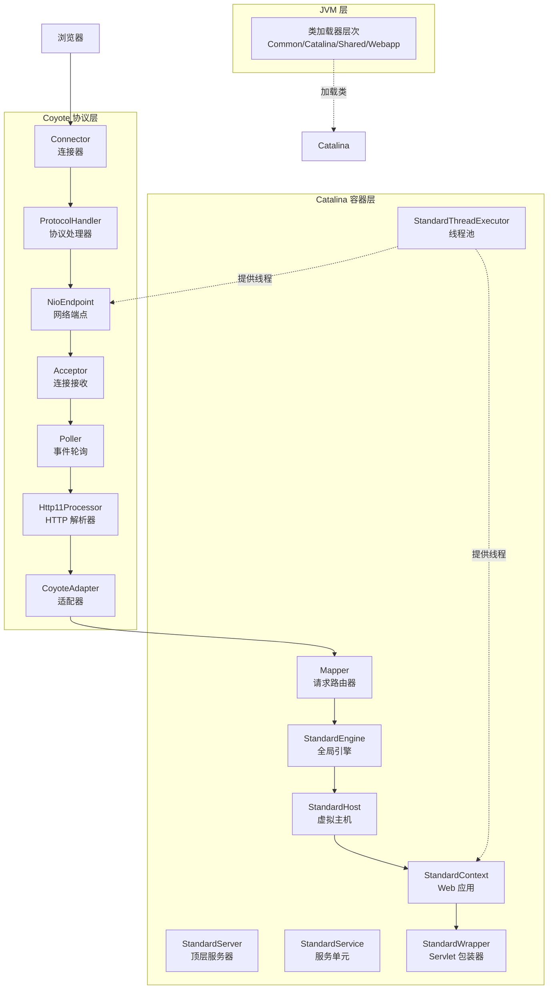
```mermaid
graph TB
    subgraph "Catalina 容器层"
        Server[StandardServer<br/>顶层服务器]
        Service[StandardService<br/>服务单元]
        Engine[StandardEngine<br/>全局引擎]
        Host[StandardHost<br/>虚拟主机]
        Context[StandardContext<br/>Web 应用]
        Wrapper[StandardWrapper<br/>Servlet 包装器]
        Mapper[Mapper<br/>请求路由器]
        Executor[StandardThreadExecutor<br/>线程池]
    end

    subgraph "Coyote 协议层"
        Connector[Connector<br/>连接器]
        PH[ProtocolHandler<br/>协议处理器]
        Endpoint[NioEndpoint<br/>网络端点]
        Acceptor[Acceptor<br/>连接接收]
        Poller[Poller<br/>事件轮询]
        Proc[Http11Processor<br/>HTTP 解析器]
        Adapter[CoyoteAdapter<br/>适配器]
    end

    subgraph "JVM 层"
        CL[类加载器层次<br/>Common/Catalina/Shared/Webapp]
    end

    Browser[浏览器] --> Connector
    Connector --> PH
    PH --> Endpoint
    Endpoint --> Acceptor
    Acceptor --> Poller
    Poller --> Proc
    Proc --> Adapter
    Adapter --> Mapper
    Mapper --> Engine
    Engine --> Host
    Host --> Context
    Context --> Wrapper
    Executor -.提供线程.-> Endpoint
    Executor -.提供线程.-> Context
    CL -.加载类.-> Catalina
```

### 1.3 核心设计模式

Tomcat 大量使用了经典设计模式：

| 设计模式 | 应用位置 | 说明 |
|---------|---------|------|
| **模板方法** | `LifecycleBase` | 定义生命周期骨架，子类实现 `initInternal`/`startInternal` |
| **责任链** | `Pipeline` + `Valve` | 请求按顺序经过多个 Valve 处理 |
| **观察者** | `LifecycleListener` | 监听组件生命周期事件 |
| **适配器** | `CoyoteAdapter` | Coyote 与 Catalina 之间的桥梁 |
| **状态机** | `AsyncStateMachine`/`LifecycleState` | 管理复杂状态转换 |
| **工厂** | `ApplicationFilterFactory`、`ClassLoaderFactory` | 创建复杂对象 |
| **策略** | `ProtocolHandler` 不同实现 | 支持多种协议 |
| **门面** | `ApplicationContextFacade`、`StandardWrapperFacade` | 隔离内部实现 |

### 1.4 设计哲学

1. **分层解耦**：Coyote 负责网络/协议，Catalina 负责业务处理，二者通过 Adapter 解耦
2. **组件化**：每个组件实现 `Lifecycle` 接口，独立管理生命周期
3. **事件驱动**：通过 `LifecycleListener`、`ContainerListener` 实现松耦合
4. **可插拔**：协议、线程池、Realm、Session 管理器均可替换
5. **配置化**：通过 `server.xml` + Digester 完成组件组装

---

## 二、核心组件详细剖析

### 2.1 组件层次结构

Tomcat 容器采用**树状层级结构**，从顶层 Server 到底层 Wrapper：

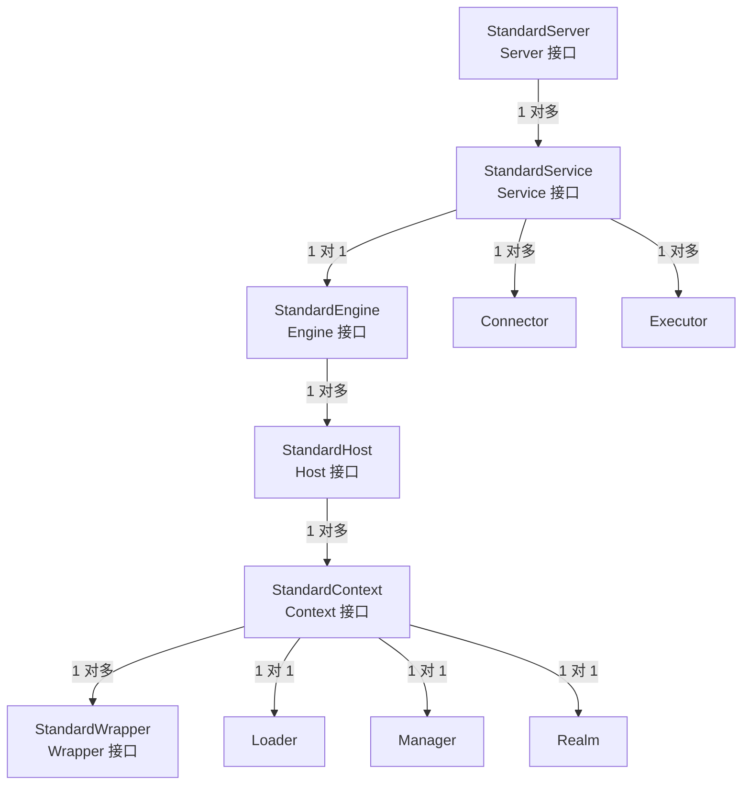
```mermaid
graph TD
    Server[StandardServer<br/>Server 接口]
    Service[StandardService<br/>Service 接口]
    Engine[StandardEngine<br/>Engine 接口]
    Host[StandardHost<br/>Host 接口]
    Context[StandardContext<br/>Context 接口]
    Wrapper[StandardWrapper<br/>Wrapper 接口]

    Server -->|1 对多| Service
    Service -->|1 对 1| Engine
    Service -->|1 对多| Connector
    Service -->|1 对多| Executor
    Engine -->|1 对多| Host
    Host -->|1 对多| Context
    Context -->|1 对多| Wrapper
    Context -->|1 对 1| Loader
    Context -->|1 对 1| Manager
    Context -->|1 对 1| Realm
```

### 2.2 各组件职责详解

#### 2.2.1 Server（StandardServer）

`org.apache.catalina.core.StandardServer`：服务器顶层组件，整个 JVM 通常只有一个。

- **核心字段**：`Service[] services`、`GlobalNamingResources globalNamingResources`、`Catalina catalina`
- **职责**：
  - 管理多个 Service
  - 管理全局 JNDI 命名资源
  - 监听 8005 端口接收 SHUTDOWN 命令（默认）
  - 维护 `utilityExecutor`（用于周期性任务的工具线程池）
- **关键方法**：
  - `initInternal()`：注册 StringCache、MBeanFactory，初始化全局命名资源，初始化所有 Service
  - `startInternal()`：启动全局命名资源、所有 Service，并启动周期事件调度（每 60s 触发 `PERIODIC_EVENT`）
  - `await()`：监听关闭端口，等待 SHUTDOWN 命令

#### 2.2.2 Service（StandardService）

`org.apache.catalina.core.StandardService`：将一个或多个 Connector 与一个 Engine 组合在一起。

- **核心字段**：`Engine engine`、`Connector[] connectors`、`Executor[] executors`、`MapperListener mapperListener`
- **职责**：
  - 持有 Engine 容器
  - 管理多个 Connector（HTTP、AJP 等）
  - 管理多个 Executor 线程池（可被 Connector 共享）
  - 持有 `MapperListener`，监听容器结构变化更新 Mapper

#### 2.2.3 Engine（StandardEngine）

`org.apache.catalina.core.StandardEngine`：整个 Catalina Servlet 引擎，代表完整的 Servlet 容器。

- **核心字段**：`Host[] children`、`String defaultHost`、`String jvmRoute`
- **职责**：
  - 管理多个虚拟主机 Host
  - 默认 Host 处理无法匹配的请求
  - `jvmRoute` 用于集群会话粘性

#### 2.2.4 Host（StandardHost）

`org.apache.catalina.core.StandardHost`：虚拟主机，对应一个域名（如 `localhost`）。

- **核心字段**：`Context[] children`、`String appBase`、`boolean autoDeploy`、`boolean unpackWARs`
- **职责**：
  - 管理多个 Web 应用 Context
  - 自动部署 `appBase` 目录下的 Web 应用
  - 自动解包 WAR 文件

#### 2.2.5 Context（StandardContext）

`org.apache.catalina.core.StandardContext`：一个 Web 应用，对应一个 `ServletContext`。

- **核心字段**：
  - `Wrapper[] children`：管理的 Servlet
  - `Loader loader`：类加载器
  - `Manager manager`：Session 管理器
  - `WebResourceRoot resources`：Web 资源
  - `JarScanner jarScanner`：Jar 扫描器
  - `boolean reloadable`：是否支持热部署
- **职责**：
  - 解析 `web.xml`、`web-fragment.xml`、注解配置
  - 管理 Filter、Listener、Servlet 注册
  - 管理 Web 应用的类加载
  - 处理热部署（`backgroundProcess`）

#### 2.2.6 Wrapper（StandardWrapper）

`org.apache.catalina.core.StandardWrapper`：Servlet 包装器，每个 Servlet 一个实例。

- **核心字段**：`Servlet instance`、`boolean singleThreadModel`、`int loadOnStartup`
- **职责**：
  - 加载并初始化 Servlet 实例
  - 管理 Servlet 的多线程并发（SingleThreadModel 已废弃但仍支持）
  - 调用 `Servlet.init()` 和 `Servlet.destroy()`

### 2.3 ContainerBase 通用容器基类

所有标准容器都继承自 `org.apache.catalina.core.ContainerBase`，提供通用功能：

```java
// 文件: java/org/apache/catalina/core/ContainerBase.java
public abstract class ContainerBase extends LifecycleMBeanBase implements Container {
    // 子容器存储
    protected final HashMap<String, Container> children = new HashMap<>();
    // 管道（每个容器都有一个）
    protected final Pipeline pipeline = new StandardPipeline(this);
    // 父容器
    protected Container parent = null;
    // 共享组件
    protected Loader loader = null;
    protected Realm realm = null;
    protected Cluster cluster = null;
    // 后台处理线程间隔
    protected int backgroundProcessorDelay = -1;

    private void addChildInternal(Container child) {
        childrenLock.writeLock().lock();
        try {
            children.put(child.getName(), child);
            child.setParent(this);
        } finally {
            childrenLock.writeLock().unlock();
        }
        fireContainerEvent(ADD_CHILD_EVENT, child);
    }
}
```

**关键设计点**：
- 使用读写锁 `childrenLock` 保护子容器操作
- 每个容器自带一个 `StandardPipeline`
- 支持 `backgroundProcess()` 周期性任务（由 `ContainerBackgroundProcessor` 线程调度）

---

## 三、Lifecycle 生命周期机制

Tomcat 所有核心组件都实现 `org.apache.catalina.Lifecycle` 接口，通过统一的生命周期管理机制实现组件的初始化、启动、停止、销毁。

### 3.1 Lifecycle 接口

```java
// 文件: java/org/apache/catalina/Lifecycle.java
public interface Lifecycle {
    // 12 种事件
    String BEFORE_INIT_EVENT = "before_init";
    String AFTER_INIT_EVENT = "after_init";
    String BEFORE_START_EVENT = "before_start";
    String START_EVENT = "start";
    String AFTER_START_EVENT = "after_start";
    String BEFORE_STOP_EVENT = "before_stop";
    String STOP_EVENT = "stop";
    String AFTER_STOP_EVENT = "after_stop";
    String BEFORE_DESTROY_EVENT = "before_destroy";
    String AFTER_DESTROY_EVENT = "after_destroy";
    String PERIODIC_EVENT = "periodic";
    String CONFIGURE_START_EVENT = "configure_start";
    String CONFIGURE_STOP_EVENT = "configure_stop";

    // 监听器管理
    void addLifecycleListener(LifecycleListener listener);
    void removeLifecycleListener(LifecycleListener listener);

    // 4 个核心生命周期方法
    void init() throws LifecycleException;
    void start() throws LifecycleException;
    void stop() throws LifecycleException;
    void destroy() throws LifecycleException;

    // 状态查询
    LifecycleState getState();
    String getStateName();
}
```

### 3.2 LifecycleState 状态机

`org.apache.catalina.LifecycleState` 定义了 12 种状态：

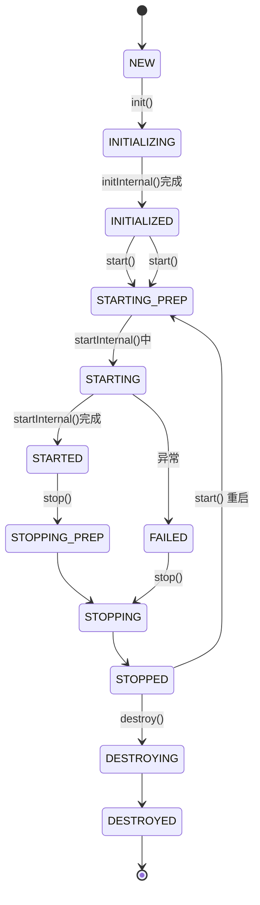
```mermaid
stateDiagram-v2
    [*] --> NEW
    NEW --> INITIALIZING: init()
    INITIALIZING --> INITIALIZED: initInternal()完成
    INITIALIZED --> STARTING_PREP: start()
    STARTING_PREP --> STARTING: startInternal()中
    STARTING --> STARTED: startInternal()完成
    STARTED --> STOPPING_PREP: stop()
    STOPPING_PREP --> STOPPING
    STOPPING --> STOPPED
    STOPPED --> DESTROYING: destroy()
    DESTROYING --> DESTROYED
    DESTROYED --> [*]
    INITIALIZED --> STARTING_PREP: start()
    STOPPED --> STARTING_PREP: start() 重启
    STARTING --> FAILED: 异常
    FAILED --> STOPPING: stop()
```

**状态属性**：
- `available=true`：表示组件已可用（STARTING, STARTED, STOPPING_PREP）
- 每个状态对应一个事件，状态切换时触发

### 3.3 LifecycleBase 模板方法

`org.apache.catalina.util.LifecycleBase` 使用模板方法模式实现通用流程：

```java
// 文件: java/org/apache/catalina/util/LifecycleBase.java
public abstract class LifecycleBase implements Lifecycle {
    private final List<LifecycleListener> lifecycleListeners = new CopyOnWriteArrayList<>();
    private volatile LifecycleState state = LifecycleState.NEW;

    @Override
    public final synchronized void init() throws LifecycleException {
        if (!state.equals(LifecycleState.NEW)) {
            invalidTransition(BEFORE_INIT_EVENT);
        }
        try {
            setStateInternal(LifecycleState.INITIALIZING, null, false);
            initInternal();   // 子类实现具体逻辑
            setStateInternal(LifecycleState.INITIALIZED, null, false);
        } catch (Throwable t) {
            handleSubClassException(t, "lifecycleBase.initFail", toString());
        }
    }

    @Override
    public final synchronized void start() throws LifecycleException {
        // 自动初始化
        if (state.equals(LifecycleState.NEW)) {
            init();
        } else if (state.equals(LifecycleState.FAILED)) {
            stop();
        } else if (!state.equals(LifecycleState.INITIALIZED) &&
                   !state.equals(LifecycleState.STOPPED)) {
            invalidTransition(BEFORE_START_EVENT);
        }
        try {
            setStateInternal(LifecycleState.STARTING_PREP, null, false);
            startInternal();   // 子类实现具体逻辑
            if (state.equals(LifecycleState.FAILED)) {
                stop();
            } else if (!state.equals(LifecycleState.STARTING)) {
                invalidTransition(AFTER_START_EVENT);
            } else {
                setStateInternal(LifecycleState.STARTED, null, false);
            }
        } catch (Throwable t) {
            handleSubClassException(t, "lifecycleBase.startFail", toString());
        }
    }

    // 子类必须实现的 4 个钩子
    protected abstract void initInternal() throws LifecycleException;
    protected abstract void startInternal() throws LifecycleException;
    protected abstract void stopInternal() throws LifecycleException;
    protected abstract void destroyInternal() throws LifecycleException;
}
```

### 3.4 事件触发机制

`fireLifecycleEvent` 通知所有监听器：

```java
protected void fireLifecycleEvent(String type, Object data) {
    LifecycleEvent event = new LifecycleEvent(this, type, data);
    for (LifecycleListener listener : lifecycleListeners) {
        listener.lifecycleEvent(event);
    }
}
```

**典型监听器**：
- `AprLifecycleListener`：初始化 APR/Native 库
- `JreMemoryLeakPreventionListener`：预防 JRE 内存泄漏
- `NamingContextListener`：初始化 JNDI 命名上下文
- `ThreadLocalLeakPreventionListener`：清理线程本地变量
- `ContextConfig`：解析 web.xml，配置 Context
- `HostConfig`：部署 appBase 下的 Web 应用
- `MapperListener`：维护 Mapper 路由表

---

## 四、启动流程深度剖析

### 4.1 启动流程时序图

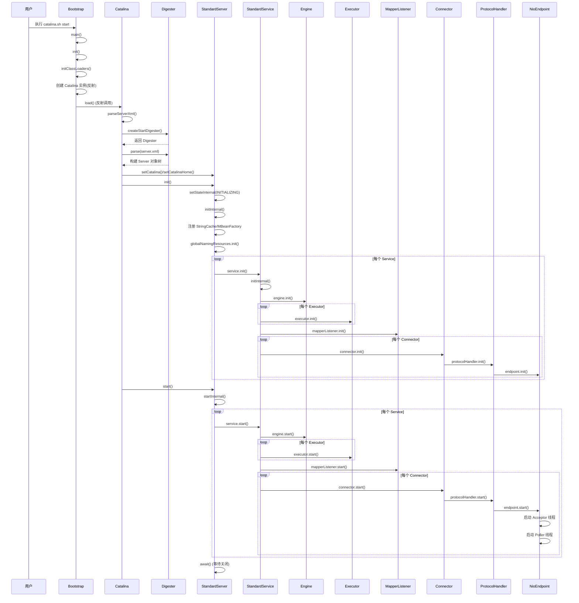
```mermaid
sequenceDiagram
    participant U as 用户
    participant B as Bootstrap
    participant C as Catalina
    participant D as Digester
    participant S as StandardServer
    participant Sv as StandardService
    participant E as Engine
    participant Ex as Executor
    participant ML as MapperListener
    participant Cn as Connector
    participant PH as ProtocolHandler
    participant EP as NioEndpoint

    U->>B: 执行 catalina.sh start
    B->>B: main()
    B->>B: init()
    B->>B: initClassLoaders()
    B->>B: 创建 Catalina 实例(反射)
    B->>C: load() (反射调用)
    C->>C: parseServerXml()
    C->>D: createStartDigester()
    D-->>C: 返回 Digester
    C->>D: parse(server.xml)
    D-->>C: 构建 Server 对象树
    C->>S: setCatalina()/setCatalinaHome()
    C->>S: init()
    S->>S: setStateInternal(INITIALIZING)
    S->>S: initInternal()
    S->>S: 注册 StringCache/MBeanFactory
    S->>S: globalNamingResources.init()
    loop 每个 Service
        S->>Sv: service.init()
        Sv->>Sv: initInternal()
        Sv->>E: engine.init()
        loop 每个 Executor
            Sv->>Ex: executor.init()
        end
        Sv->>ML: mapperListener.init()
        loop 每个 Connector
            Sv->>Cn: connector.init()
            Cn->>PH: protocolHandler.init()
            PH->>EP: endpoint.init()
        end
    end
    C->>S: start()
    S->>S: startInternal()
    loop 每个 Service
        S->>Sv: service.start()
        Sv->>E: engine.start()
        loop 每个 Executor
            Sv->>Ex: executor.start()
        end
        Sv->>ML: mapperListener.start()
        loop 每个 Connector
            Sv->>Cn: connector.start()
            Cn->>PH: protocolHandler.start()
            PH->>EP: endpoint.start()
            EP->>EP: 启动 Acceptor 线程
            EP->>EP: 启动 Poller 线程
        end
    end
    S->>S: await() (等待关闭)
```

### 4.2 Bootstrap 启动入口

`org.apache.catalina.startup.Bootstrap` 是 Tomcat 的真正入口，由 `catalina.sh` 脚本通过 `java -cp` 调用：

```java
// 文件: java/org/apache/catalina/startup/Bootstrap.java
public static void main(String[] args) {
    synchronized (daemonLock) {
        if (daemon == null) {
            Bootstrap bootstrap = new Bootstrap();
            bootstrap.init();   // 初始化类加载器，创建 Catalina
            daemon = bootstrap;
        } else {
            Thread.currentThread().setContextClassLoader(daemon.catalinaLoader);
        }
    }
    String command = "start";
    if (args.length > 0) {
        command = args[args.length - 1];
    }
    switch (command) {
        case "startd":
            daemon.load(args); daemon.start(); break;
        case "stopd":
            daemon.stop(); break;
        case "start":
            daemon.setAwait(true);
            daemon.load(args);
            daemon.start();
            break;
        case "stop":
            daemon.stopServer(args); break;
        case "configtest":
            daemon.load(args); break;
    }
}

public void init() throws Exception {
    initClassLoaders();   // 创建 commonLoader/catalinaLoader/sharedLoader
    Thread.currentThread().setContextClassLoader(catalinaLoader);
    SecurityClassLoad.securityClassLoad(catalinaLoader);
    // 反射创建 Catalina 实例
    Class<?> startupClass = catalinaLoader.loadClass("org.apache.catalina.startup.Catalina");
    Object startupInstance = startupClass.getConstructor().newInstance();
    // 设置 Catalina 的父类加载器为 sharedLoader
    Method m = startupInstance.getClass().getMethod("setParentClassLoader", ClassLoader.class);
    m.invoke(startupInstance, sharedLoader);
    catalinaDaemon = startupInstance;
}
```

**类加载器初始化**：

```java
private void initClassLoaders() {
    commonLoader = createClassLoader("common", null);
    if (commonLoader == null) {
        commonLoader = this.getClass().getClassLoader();
    }
    catalinaLoader = createClassLoader("server", commonLoader);
    sharedLoader  = createClassLoader("shared", commonLoader);
}
```

`createClassLoader` 读取 `catalina.properties` 中的 `common.loader`、`server.loader`、`shared.loader` 配置，使用 `ClassLoaderFactory.createClassLoader` 创建 URLClassLoader。

### 4.3 Catalina.load：解析 server.xml

```java
// 文件: java/org/apache/catalina/startup/Catalina.java
public void load() {
    if (loaded) return;
    loaded = true;
    initDirs();
    initNaming();      // 启用 JNDI
    parseServerXml(true);  // 解析 server.xml
    Server s = getServer();
    if (s == null) return;
    getServer().setCatalina(this);
    getServer().setCatalinaHome(Bootstrap.getCatalinaHomeFile());
    getServer().setCatalinaBase(Bootstrap.getCatalinaBaseFile());
    initStreams();
    getServer().init();    // 触发整个组件树初始化
}
```

### 4.4 Digester 解析 server.xml

`Catalina.createStartDigester()` 配置 Digester 规则，将 XML 解析为对象树：

```java
protected Digester createStartDigester() {
    Digester digester = new Digester();
    digester.setValidating(false);
    digester.setRulesValidation(true);

    // Server 元素 -> StandardServer
    digester.addObjectCreate("Server", "org.apache.catalina.core.StandardServer", "className");
    digester.addSetProperties("Server");
    digester.addSetNext("Server", "setServer", "org.apache.catalina.Server");

    // GlobalNamingResources
    digester.addObjectCreate("Server/GlobalNamingResources", "org.apache.catalina.deploy.NamingResourcesImpl");
    digester.addSetNext("Server/GlobalNamingResources", "setGlobalNamingResources", ...);

    // Listener
    digester.addRule("Server/Listener", new ListenerCreateRule());
    digester.addSetNext("Server/Listener", "addLifecycleListener", "org.apache.catalina.LifecycleListener");

    // Service
    digester.addObjectCreate("Server/Service", "org.apache.catalina.core.StandardService", "className");
    digester.addSetNext("Server/Service", "addService", "org.apache.catalina.Service");

    // Executor
    digester.addObjectCreate("Server/Service/Executor", "org.apache.catalina.core.StandardThreadExecutor", "className");
    digester.addSetNext("Server/Service/Executor", "addExecutor", "org.apache.catalina.Executor");

    // Connector
    digester.addRule("Server/Service/Connector", new ConnectorCreateRule());
    digester.addSetNext("Server/Service/Connector", "addConnector", "org.apache.catalina.connector.Connector");

    // 嵌套规则集
    digester.addRuleSet(new EngineRuleSet("Server/Service/"));
    digester.addRuleSet(new HostRuleSet("Server/Service/Engine/"));
    digester.addRuleSet(new ContextRuleSet("Server/Service/Engine/Host/"));
    return digester;
}
```

**Digester 的工作原理**：
1. SAX 解析 XML，遇到元素开始/结束触发回调
2. 通过 `ObjectCreateRule` 创建对象，`SetPropertiesRule` 设置属性，`SetNextRule` 调用父对象的方法
3. 最终构建出完整的 StandardServer 对象树

### 4.5 server.xml 配置示例（默认）

```xml
<Server port="8005" shutdown="SHUTDOWN">
  <Listener className="org.apache.catalina.startup.VersionLoggerListener" />
  <Listener className="org.apache.catalina.core.AprLifecycleListener" />
  <Listener className="org.apache.catalina.core.JreMemoryLeakPreventionListener" />
  <Listener className="org.apache.catalina.mbeans.GlobalResourcesLifecycleListener" />
  <Listener className="org.apache.catalina.core.ThreadLocalLeakPreventionListener" />

  <GlobalNamingResources>
    <Resource name="UserDatabase" auth="Container"
              type="org.apache.catalina.UserDatabase"
              factory="org.apache.catalina.users.MemoryUserDatabaseFactory"
              pathname="conf/tomcat-users.xml" />
  </GlobalNamingResources>

  <Service name="Catalina">
    <Executor name="tomcatThreadPool" namePrefix="catalina-exec-"
              maxThreads="150" minSpareThreads="4"/>

    <Connector port="8080" protocol="HTTP/1.1"
               connectionTimeout="20000" redirectPort="8443" />

    <Engine name="Catalina" defaultHost="localhost">
      <Realm className="org.apache.catalina.realm.LockOutRealm">
        <Realm className="org.apache.catalina.realm.UserDatabaseRealm" resourceName="UserDatabase"/>
      </Realm>
      <Host name="localhost" appBase="webapps" unpackWARs="true" autoDeploy="true">
        <Valve className="org.apache.catalina.valves.AccessLogValve" directory="logs"
               prefix="localhost_access_log" suffix=".txt"
               pattern="%h %l %u %t &quot;%r&quot; %s %b" />
      </Host>
    </Engine>
  </Service>
</Server>
```

### 4.6 StandardServer 初始化与启动

```java
// 文件: java/org/apache/catalina/core/StandardServer.java
@Override
protected void initInternal() throws LifecycleException {
    super.initInternal();
    onameStringCache = register(new StringCache(), "type=StringCache");
    MBeanFactory factory = new MBeanFactory();
    factory.setContainer(this);
    onameMBeanFactory = register(factory, "type=MBeanFactory");
    globalNamingResources.init();
    // 加载扩展验证器需要的 JAR
    // ...
    // 初始化所有 Service
    for (Service service : findServices()) {
        service.init();
    }
}

@Override
protected void startInternal() throws LifecycleException {
    fireLifecycleEvent(CONFIGURE_START_EVENT, null);
    setState(LifecycleState.STARTING);
    // 初始化工具线程池（用于周期任务）
    reconfigureUtilityExecutor(getUtilityThreadsInternal(utilityThreads));
    globalNamingResources.start();
    // 启动所有 Service
    for (Service service : findServices()) {
        service.start();
    }
    // 启动周期事件调度（每 60s 触发 PERIODIC_EVENT）
    if (periodicEventDelay > 0) {
        monitorFuture = getUtilityExecutor().scheduleWithFixedDelay(
            this::startPeriodicLifecycleEvent, 0, 60, TimeUnit.SECONDS);
    }
}
```

### 4.7 StandardService 初始化与启动顺序

```java
// 文件: java/org/apache/catalina/core/StandardService.java
@Override
protected void initInternal() throws LifecycleException {
    super.initInternal();
    if (engine != null) {
        engine.init();   // 1. 先初始化 Engine
    }
    for (Executor executor : findExecutors()) {
        executor.init();   // 2. 初始化所有 Executor
    }
    mapperListener.init(); // 3. 初始化 MapperListener
    for (Connector connector : findConnectors()) {
        connector.init();   // 4. 最后初始化所有 Connector
    }
}

@Override
protected void startInternal() throws LifecycleException {
    setState(LifecycleState.STARTING);
    if (engine != null) {
        engine.start();   // 1. 先启动 Engine
    }
    for (Executor executor : findExecutors()) {
        executor.start();   // 2. 启动 Executor
    }
    mapperListener.start(); // 3. 启动 MapperListener
    for (Connector connector : findConnectors()) {
        if (connector.getState() != LifecycleState.FAILED) {
            connector.start();   // 4. 最后启动 Connector（开始监听端口）
        }
    }
}
```

**顺序为何是 Engine -> Executor -> MapperListener -> Connector？**
- Engine 先启动：容器先准备好，才能接收请求
- Executor 先于 Connector：Connector 启动后立即接收请求，需要线程池已就绪
- Connector 最后启动：开启端口监听后即开始接收请求

---

## 五、请求处理流程深度剖析

### 5.1 完整请求处理时序

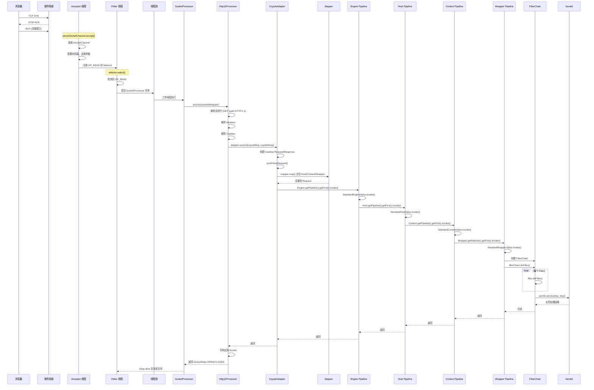
```mermaid
sequenceDiagram
    participant B as 浏览器
    participant OS as 操作系统
    participant A as Acceptor 线程
    participant P as Poller 线程
    participant TP as 线程池
    participant SP as SocketProcessor
    participant HP as Http11Processor
    participant CA as CoyoteAdapter
    participant M as Mapper
    participant E as Engine Pipeline
    participant H as Host Pipeline
    participant CT as Context Pipeline
    participant W as Wrapper Pipeline
    participant FC as FilterChain
    participant S as Servlet

    B->>OS: TCP SYN
    OS-->>B: SYN+ACK
    B->>OS: ACK (连接建立)
    Note over A: serverSocketChannel.accept()
    A->>A: 接收 SocketChannel
    A->>A: 配置非阻塞、设置参数
    A->>P: 注册 OP_READ 到 Selector
    Note over P: selector.select()
    P->>P: 检测到 OP_READ
    P->>TP: 提交 SocketProcessor 任务
    TP->>SP: 工作线程执行
    SP->>HP: process(socketWrapper)
    HP->>HP: 解析请求行 (GET /path HTTP/1.1)
    HP->>HP: 解析 Headers
    HP->>HP: 解析 Cookies
    HP->>CA: adapter.service(coyoteReq, coyoteResp)
    CA->>CA: 创建 Catalina Request/Response
    CA->>CA: postParseRequest()
    CA->>M: mapper.map() 定位 Host/Context/Wrapper
    M-->>CA: 设置到 Request
    CA->>E: Engine.getPipeline().getFirst().invoke()
    E->>E: StandardEngineValve.invoke()
    E->>H: Host.getPipeline().getFirst().invoke()
    H->>H: StandardHostValve.invoke()
    H->>CT: Context.getPipeline().getFirst().invoke()
    CT->>CT: StandardContextValve.invoke()
    CT->>W: Wrapper.getPipeline().getFirst().invoke()
    W->>W: StandardWrapperValve.invoke()
    W->>FC: 创建 FilterChain
    W->>FC: filterChain.doFilter()
    loop 每个 Filter
        FC->>FC: filter.doFilter()
    end
    FC->>S: servlet.service(req, resp)
    S-->>FC: 业务处理结果
    FC-->>W: 完成
    W-->>CT: 返回
    CT-->>H: 返回
    H-->>E: 返回
    E-->>CA: 返回
    CA-->>HP: 返回
    HP->>HP: 写响应到 Socket
    HP-->>SP: 返回 SocketState.OPEN/CLOSED
    SP-->>P: keep-alive 复用或关闭
```

### 5.2 三层线程模型

Tomcat 的请求处理采用经典的 **Reactor 多线程模型**：

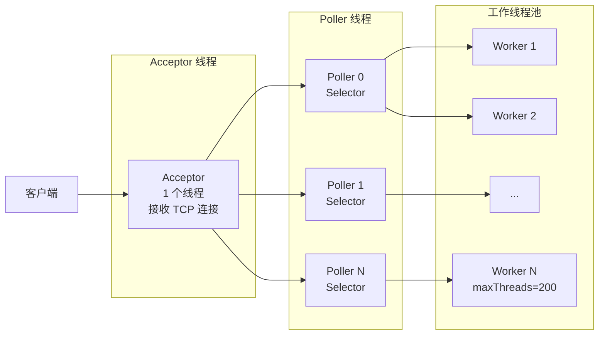
```mermaid
graph LR
    subgraph "Acceptor 线程"
        A1[Acceptor<br/>1 个线程<br/>接收 TCP 连接]
    end

    subgraph "Poller 线程"
        P1[Poller 0<br/>Selector]
        P2[Poller 1<br/>Selector]
        P3[Poller N<br/>Selector]
    end

    subgraph "工作线程池"
        T1[Worker 1]
        T2[Worker 2]
        T3[...]
        Tn[Worker N<br/>maxThreads=200]
    end

    Client[客户端] --> A1
    A1 --> P1
    A1 --> P2
    A1 --> P3
    P1 --> T1
    P1 --> T2
    P2 --> T3
    P3 --> Tn
```

### 5.3 NioEndpoint 三大组件

`org.apache.tomcat.util.net.NioEndpoint` 是 NIO 网络端点实现：

```java
// 文件: java/org/apache/tomcat/util/net/NioEndpoint.java
public class NioEndpoint extends AbstractEndpoint<NioChannel> {
    protected Acceptor<NioChannel> acceptor;
    private int pollerThreadCount = Math.min(2, Runtime.getRuntime().availableProcessors());
    private List<Poller> pollers;
    // ...
}
```

#### 5.3.1 Acceptor：接收连接

```java
// 文件: java/org/apache/tomcat/util/net/Acceptor.java
public class Acceptor<U> implements Runnable {
    @Override
    public void run() {
        int errorDelay = 0;
        while (!stopCalled) {
            while (endpoint.isPaused() && !stopCalled) {
                Thread.sleep(50);
            }
            if (!endpoint.processSocket(socketWrapper, SocketEvent.ERROR, false)) {
                // 处理失败
            }
            try {
                socket = endpoint.serverSocketAccept();
                // 配置 socket 参数
                endpoint.setSocketOptions(socket);
                // setSocketOptions 内部会注册到 Poller
            } catch (Exception e) { /* ... */ }
        }
    }
}
```

#### 5.3.2 Poller：NIO 事件轮询

```java
// 文件: java/org/apache/tomcat/util/net/NioEndpoint.java - 内部类 Poller
public class Poller implements Runnable {
    protected Selector selector;
    protected Queue<PollerEvent> events = new ConcurrentLinkedQueue<>();

    @Override
    public void run() {
        while (true) {
            processEvents();   // 处理事件队列（注册新连接）
            int keyCount = selector.select(selectorTimeout);
            Iterator<SelectionKey> iterator = selector.selectedKeys().iterator();
            while (iterator.hasNext()) {
                SelectionKey sk = iterator.next();
                iterator.remove();
                processKey(sk, (NioSocketWrapper) sk.attachment());
            }
            timeout(keyCount, hasEvents);
        }
    }

    protected void processKey(SelectionKey sk, NioSocketWrapper attachment) {
        if (sk.isReadable()) {
            if (!processSocket(attachment, SocketEvent.OPEN_READ, true)) {
                closeSocket();
            }
        }
        if (sk.isWritable()) {
            if (!processSocket(attachment, SocketEvent.OPEN_WRITE, true)) {
                closeSocket();
            }
        }
    }
}
```

#### 5.3.3 SocketProcessor：业务处理

```java
// 文件: java/org/apache/tomcat/util/net/SocketProcessorBase.java
public abstract class SocketProcessorBase<S> implements Runnable {
    @Override
    public final void run() {
        Lock lock = socketWrapper.getLock();
        lock.lock();
        try {
            if (!socketWrapper.isClosed()) {
                doRun();   // 由 NioEndpoint.SocketProcessor 实现
            }
        } finally {
            lock.unlock();
        }
    }
}
```

`NioEndpoint.SocketProcessor.doRun()` 调用 `Handler.process()`，进入 `AbstractProtocol.ConnectionHandler`：

```java
// 文件: java/org/apache/coyote/AbstractProtocol.java - 内部类 ConnectionHandler
public SocketState process(SocketWrapperBase<S> wrapper, SocketEvent status) {
    Processor processor = connections.get(wrapper);
    if (processor == null) {
        processor = createProcessor();   // 创建 Http11Processor
    }
    state = processor.process(wrapper, status);
    // 处理结果：OPEN/SENDFILE/ASYNC/CLOSED/UPGRADING
}
```

### 5.4 Http11Processor：HTTP 协议解析

`org.apache.coyote.http11.Http11Processor` 负责完整 HTTP 协议解析：

```java
// 文件: java/org/apache/coyote/http11/Http11Processor.java
@Override
public SocketState process(SocketWrapperBase<?> socketWrapper) throws IOException {
    // 初始化 InputBuffer/OutputBuffer
    // 循环处理请求（keep-alive）
    while (!getAdapter().hasRecycledRequests()) {
        // 解析请求行
        if (!parseRequestLine(keptAlive)) { /* ... */ }
        // 解析请求头
        if (!parseHeaders()) { /* ... */ }
        // 准备请求（解析 Host、Connection、cookie 等）
        prepareRequest();
        // 调用 Adapter
        getAdapter().process(request, response);
        // 检查 keep-alive
        if (!keepAlive) break;
    }
    // 刷新响应
    outputBuffer.end();
    return SocketState.OPEN;
}
```

**keep-alive 处理**：HTTP/1.1 默认开启 keep-alive，同一个 Socket 可处理多个请求。`Http11Processor` 在循环中复用，每次循环解析一个新请求。

### 5.5 CoyoteAdapter：适配 Catalina

```java
// 文件: java/org/apache/catalina/connector/CoyoteAdapter.java
@Override
public boolean process(Request req, Response res) throws Exception {
    // 1. 创建 Catalina Request/Response
    Request request = (Request) req.getNote(ADAPTER_NOTES);
    if (request == null) {
        request = connector.createRequest();
        request.setCoyoteRequest(req);
        req.setNote(ADAPTER_NOTES, request);
        // 同样创建 Response
    }
    // 2. 后置解析：解析参数、Cookie、Session
    boolean postParseSuccess = postParseRequest(req, request, res, response);
    if (postParseSuccess) {
        // 3. 调用 Engine Pipeline 处理请求
        connector.getService().getContainer().getPipeline().getFirst().invoke(request, response);
    }
    // 4. 处理 keep-alive、状态
}

protected boolean postParseRequest(Request req, Request request, Response res, Response response) {
    // 解析 messageId、URI、协议版本
    // 解析 Cookies
    // 调用 Mapper 定位 Host/Context/Wrapper
    connector.getService().getMapper().map(req.serverName(), request.getMappingData());
    // 设置 Session 路径
    // 解析 SSL 信息
    return true;
}
```

### 5.6 Mapper 路由

`CoyoteAdapter` 调用 `Mapper.map()` 根据 Host + URI 定位容器：

```java
// 文件: java/org/apache/catalina/mapper/Mapper.java
public void map(MessageBytes host, MessageBytes uri, int version, MappingData mappingData) {
    // 1. 根据 host 名查找 MappedHost
    MappedHost[] hosts = this.hosts;
    MappedHost mappedHost = exactFind(hosts, hostName);
    if (mappedHost == null) {
        mappedHost = hosts[0];   // 默认 Host
    }
    // 2. 在 Host 下根据 URI 查找 Context
    MappedContext[] contexts = mappedHost.contextList.contexts;
    Context mappedContext = ...;
    // 3. 在 Context 下根据 URI 查找 Wrapper
    MappedWrapper mappedWrapper = ...;
    // 4. 将结果写入 MappingData
    mappingData.host = mappedHost.object;
    mappingData.context = mappedContext.object;
    mappingData.wrapper = mappedWrapper.object;
}
```

---

## 六、Pipeline-Valve 管道机制

### 6.1 责任链模式


```mermaid
graph LR
    R[请求] --> V1[Valve 1]
    V1 --> V2[Valve 2]
    V2 --> V3[Valve 3]
    V3 --> BV[BasicValve]
    BV -.选择 Host.- H[Host Pipeline]
    H --> H1[Host Valve 1]
    H1 --> HBV[StandardHostValve]
    HBV -.选择 Context.- C[Context Pipeline]
    C --> CBV[StandardContextValve]
    CBV -.选择 Wrapper.- W[Wrapper Pipeline]
    W --> WBV[StandardWrapperValve]
    WBV --> F[FilterChain]
    F --> S[Servlet]
```

### 6.2 StandardPipeline 实现

```java
// 文件: java/org/apache/catalina/core/StandardPipeline.java
public class StandardPipeline implements Pipeline {
    protected Valve basic = null;   // 基础 Valve（容器必经）
    protected Valve first = null;   // 第一个自定义 Valve

    @Override
    public void addValve(Valve valve) {
        if (first == null) {
            first = valve;
            valve.setNext(basic);
        } else {
            Valve current = first;
            while (current.getNext() != basic) {
                current = current.getNext();
            }
            current.setNext(valve);
            valve.setNext(basic);
        }
    }

    @Override
    public Valve getFirst() {
        return first != null ? first : basic;
    }
}
```

### 6.3 各层 BasicValve 职责

| BasicValve | 文件 | 职责 |
|-----------|------|------|
| `StandardEngineValve` | `core/StandardEngineValve.java` | 选择 Host，调用 Host Pipeline |
| `StandardHostValve` | `core/StandardHostValve.java` | 选择 Context，调用 Context Pipeline；处理请求/响应映射 |
| `StandardContextValve` | `core/StandardContextValve.java` | 拦截 WEB-INF/META-INF 访问；选择 Wrapper，调用 Wrapper Pipeline |
| `StandardWrapperValve` | `core/StandardWrapperValve.java` | 分配 Servlet 实例；创建 FilterChain；调用 FilterChain.doFilter |

### 6.4 StandardWrapperValve 核心逻辑

```java
// 文件: java/org/apache/catalina/core/StandardWrapperValve.java
@Override
public void invoke(Request request, Response response) throws IOException, ServletException {
    StandardWrapper wrapper = (StandardWrapper) request.getWrapper();

    // 分配 Servlet 实例
    Servlet servlet = wrapper.allocate();
    // 创建 FilterChain
    ApplicationFilterChain filterChain = ApplicationFilterFactory.createFilterChain(request, wrapper, servlet);

    // 调用 FilterChain
    if (servlet instanceof SingleThreadModel) {
        // 同步处理
    } else {
        filterChain.doFilter(request.getRequest(), response.getResponse());
    }

    // 释放
    filterChain.release();
    wrapper.deallocate(servlet);
}
```

### 6.5 ApplicationFilterChain

```java
// 文件: java/org/apache/catalina/core/ApplicationFilterChain.java
public final class ApplicationFilterChain implements FilterChain {
    private ApplicationFilterConfig[] filters = new ApplicationFilterConfig[0];
    private int pos = 0;       // 当前 Filter 位置
    private int n = 0;         // Filter 总数
    private Servlet servlet;

    @Override
    public void doFilter(ServletRequest request, ServletResponse response) {
        if (pos < n) {
            ApplicationFilterConfig filterConfig = filters[pos++];
            Filter filter = filterConfig.getFilter();
            filter.doFilter(request, response, this);  // 递归调用下一个
        } else {
            servlet.service(request, response);   // 调用 Servlet
        }
    }

    void addFilter(ApplicationFilterConfig filterConfig) {
        // 避免重复
        for (int i = 0; i < n; i++) {
            if (filters[i] == filterConfig) return;
        }
        if (n == filters.length) {
            filters = Arrays.copyOf(filters, n + INCREMENT);
        }
        filters[n++] = filterConfig;
    }
}
```

---

## 七、Mapper 路由机制

### 7.1 Mapper 内部数据结构

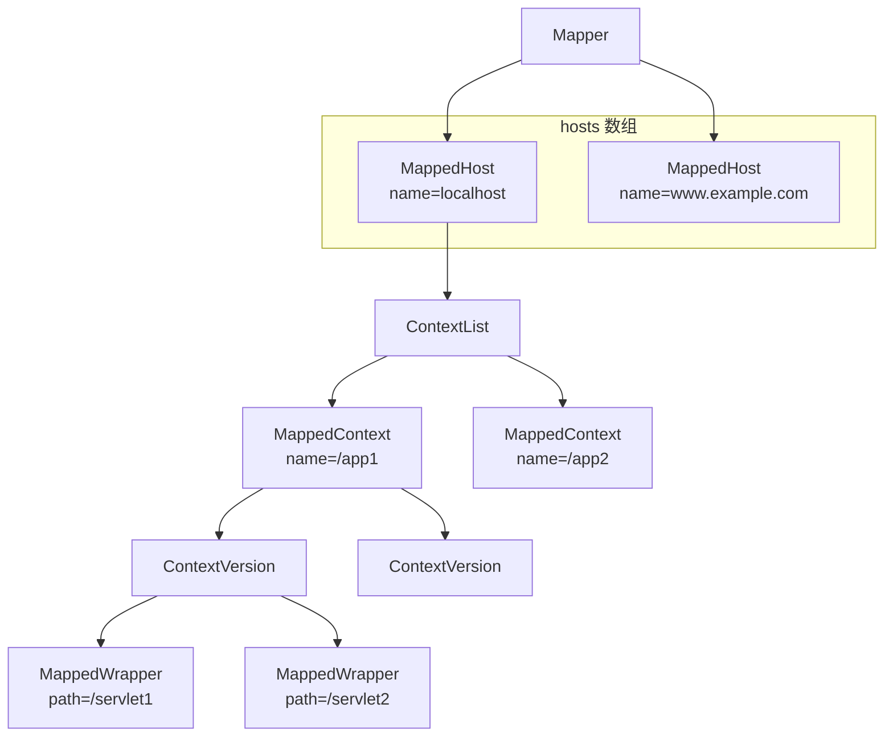
```mermaid
graph TB
    Mapper[Mapper]
    subgraph "hosts 数组"
        H1[MappedHost<br/>name=localhost]
        H2[MappedHost<br/>name=www.example.com]
    end

    Mapper --> H1
    Mapper --> H2

    H1 --> CL[ContextList]
    CL --> C1[MappedContext<br/>name=/app1]
    CL --> C2[MappedContext<br/>name=/app2]

    C1 --> W1[ContextVersion]
    C1 --> W2[ContextVersion]
    W1 --> MW1[MappedWrapper<br/>path=/servlet1]
    W1 --> MW2[MappedWrapper<br/>path=/servlet2]
```

### 7.2 三级映射

```java
// 文件: java/org/apache/catalina/mapper/Mapper.java
public void map(MessageBytes host, MessageBytes uri, int version, MappingData mappingData) {
    // 第一级：根据 Host 名定位 MappedHost
    MappedHost mappedHost = exactFind(hosts, hostName);
    if (mappedHost == null) mappedHost = hosts[0];

    // 第二级：根据 URI 前缀定位 MappedContext
    MappedContext mappedContext = ...;
    ContextVersion contextVersion = ...;

    // 第三级：根据剩余路径定位 MappedWrapper
    MappedWrapper mappedWrapper = ...;

    // 写回 MappingData
    mappingData.host = mappedHost.object;
    mappingData.context = contextVersion.object;
    mappingData.wrapper = mappedWrapper.object;
    mappingData.wrapperPath.setString(wrapperPath);
}
```

### 7.3 MapperListener 实时更新

`org.apache.catalina.mapper.MapperListener` 监听容器结构变化（容器注册时触发），实时更新 Mapper 内部映射：

- `addHost()` / `removeHost()`：更新 Host 映射
- `addContext()` / `removeContext()`：更新 Context 映射
- `addWrapper()` / `removeWrapper()`：更新 Wrapper 映射
- `registerHost()` / `registerContext()`：注册到 Mapper

监听器同时监听 `ContainerEvent`（容器子组件变化）和 `LifecycleEvent`（生命周期事件），保持 Mapper 与容器结构完全一致。

---

## 八、线程池设计与线程模型

### 8.1 Tomcat 自定义 ThreadPoolExecutor

`org.apache.tomcat.util.threads.ThreadPoolExecutor` 扩展 JDK 自带线程池，针对 Web 高并发场景做了优化：

#### 8.1.1 关键差异

| 维度 | JDK ThreadPoolExecutor | Tomcat ThreadPoolExecutor |
|------|----------------------|--------------------------|
| 任务入队策略 | corePool 满即入队 → 队列满创建线程到 max | 线程数达 max 才入队 → 队列满拒绝 |
| TaskQueue | 标准 LinkedBlockingQueue | 自定义 `TaskQueue` 重写 `offer` |
| 线程续约 | 无 | 支持 `threadRenewalDelay` |
| 监控指标 | 基础 | 丰富（submittedCount、poolSizeNoLock 等） |

#### 8.1.2 TaskQueue 关键代码

```java
// 文件: java/org/apache/tomcat/util/threads/TaskQueue.java
@Override
public boolean offer(Runnable o) {
    if (parent == null) {
        return super.offer(o);
    }
    // 1. 线程数已达最大值，直接入队
    if (parent.getPoolSizeNoLock() == parent.getMaximumPoolSize()) {
        return super.offer(o);
    }
    // 2. 已提交任务数 <= 当前线程数，说明有空闲线程，入队
    if (parent.getSubmittedCount() <= parent.getPoolSizeNoLock()) {
        return super.offer(o);
    }
    // 3. 线程数 < maxThreads，返回 false 触发创建新线程
    if (parent.getPoolSizeNoLock() < parent.getMaximumPoolSize()) {
        return false;
    }
    // 4. 都不满足，入队
    return super.offer(o);
}
```

**设计精髓**：JDK 线程池默认行为是「corePool → 队列 → maxPool」，这意味着队列满之前不会创建新线程。而 Tomcat 的 `TaskQueue` 在线程数 < maxThreads 时主动返回 `false`，让线程池立即创建新线程，**确保突发流量时能快速扩容到 maxThreads**，而不是让请求在队列里排队。

### 8.2 StandardThreadExecutor：容器级封装

```java
// 文件: java/org/apache/catalina/core/StandardThreadExecutor.java
public class StandardThreadExecutor extends LifecycleMBeanBase
        implements Executor, ExecutorService, ResizableExecutor {

    protected int minSpareThreads = 25;
    protected int maxThreads = 200;
    protected int maxIdleTime = 60000;
    protected int maxQueueSize = Integer.MAX_VALUE;

    protected ThreadPoolExecutor executor = null;
    private TaskQueue taskqueue = null;
    private TaskThreadFactory tf = null;

    @Override
    protected void startInternal() throws LifecycleException {
        taskqueue = new TaskQueue(maxQueueSize);
        TaskThreadFactory tf = new TaskThreadFactory(namePrefix, daemon, getThreadPriority());
        executor = new ThreadPoolExecutor(
            getMinSpareThreads(), getMaxThreads(), maxIdleTime,
            TimeUnit.MILLISECONDS, taskqueue, tf);
        executor.setThreadRenewalDelay(threadRenewalDelay);
        taskqueue.setParent(executor);   // 关键：让 TaskQueue 反向引用 ThreadPoolExecutor
        setState(LifecycleState.STARTING);
    }

    @Override
    public void execute(Runnable command) {
        executor.execute(command);
    }
}
```

### 8.3 线程池工作流程图

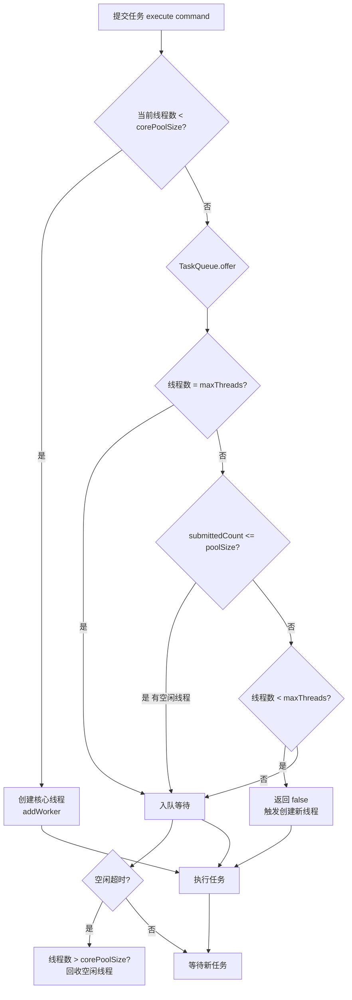
```mermaid
flowchart TD
    Start[提交任务 execute command] --> S1{当前线程数 < corePoolSize?}
    S1 -->|是| C1[创建核心线程<br/>addWorker]
    S1 -->|否| S2{TaskQueue.offer}
    S2 --> S3{线程数 = maxThreads?}
    S3 -->|是| Q1[入队等待]
    S3 -->|否| S4{submittedCount <= poolSize?}
    S4 -->|是 有空闲线程| Q1
    S4 -->|否| S5{线程数 < maxThreads?}
    S5 -->|是| C2[返回 false<br/>触发创建新线程]
    S5 -->|否| Q1
    Q1 --> R{空闲超时?}
    R -->|是| R1[线程数 > corePoolSize?<br/>回收空闲线程]
    R -->|否| W[等待新任务]
    C1 --> E[执行任务]
    C2 --> E
    Q1 --> E
    E --> W
```

### 8.4 NioEndpoint 线程协作

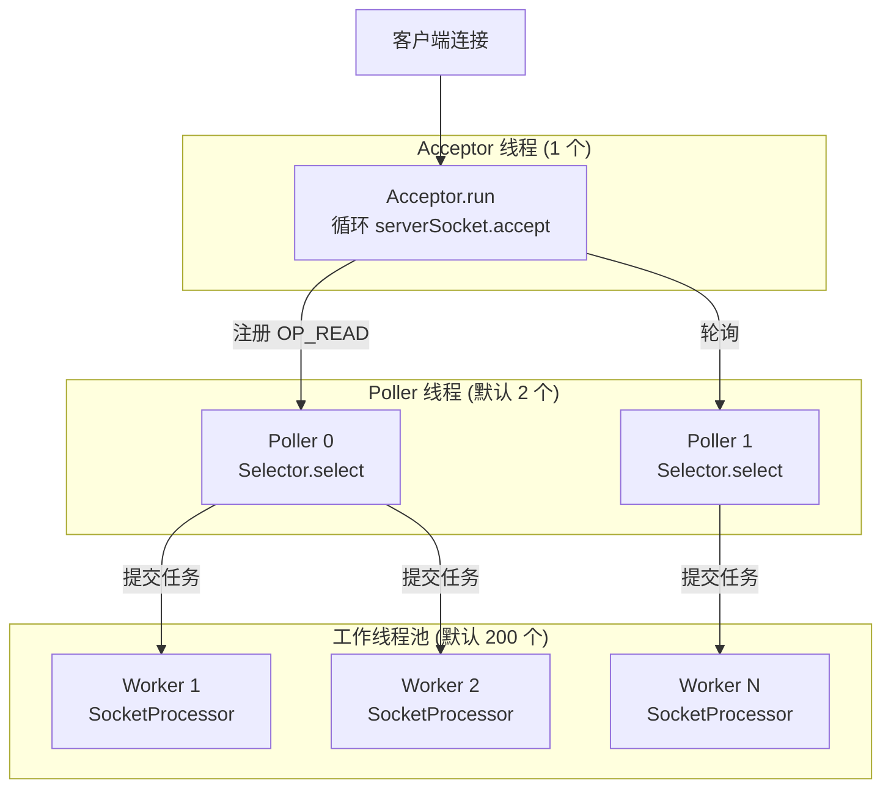
```mermaid
graph TB
    subgraph "Acceptor 线程 (1 个)"
        A[Acceptor.run<br/>循环 serverSocket.accept]
    end

    subgraph "Poller 线程 (默认 2 个)"
        P0[Poller 0<br/>Selector.select]
        P1[Poller 1<br/>Selector.select]
    end

    subgraph "工作线程池 (默认 200 个)"
        W1[Worker 1<br/>SocketProcessor]
        W2[Worker 2<br/>SocketProcessor]
        W3[Worker N<br/>SocketProcessor]
    end

    Client[客户端连接] --> A
    A -->|注册 OP_READ| P0
    A -->|轮询| P1
    P0 -->|提交任务| W1
    P0 -->|提交任务| W2
    P1 -->|提交任务| W3
```

### 8.5 虚拟线程支持（JDK 21+）

Tomcat 9 新增 `StandardVirtualThreadExecutor`：

```java
// 文件: java/org/apache/catalina/core/StandardVirtualThreadExecutor.java
public class StandardVirtualThreadExecutor extends LifecycleMBeanBase
        implements Executor, ExecutorService {

    @Override
    protected void startInternal() throws LifecycleException {
        if (!JreCompat.isJre21Available()) {
            throw new LifecycleException("Virtual threads not supported");
        }
        executor = new VirtualThreadExecutor(getNamePrefix());
        setState(LifecycleState.STARTING);
    }
}
```

**优势**：
- 每个请求一个虚拟线程，无需池化
- 支持百万级并发
- 阻塞 IO 不再占用 OS 线程
- 简化异步编程模型

---

## 九、异步 Servlet 原理

### 9.1 异步 Servlet 解决的问题

传统 Servlet 处理是同步的：容器线程从接收请求到响应返回一直被占用。对于长耗时业务（如等待 DB、远程调用），会大量占用容器线程池，导致吞吐量下降。

**异步 Servlet 解决方案**：
1. Servlet 调用 `startAsync()` 启动异步模式
2. 容器线程立即释放回线程池
3. 业务线程在后台执行耗时操作
4. 完成后调用 `AsyncContext.complete()` 或 `dispatch()` 重新激活容器

### 9.2 AsyncStateMachine 状态机

`org.apache.coyote.AsyncStateMachine` 管理异步请求的状态转换：

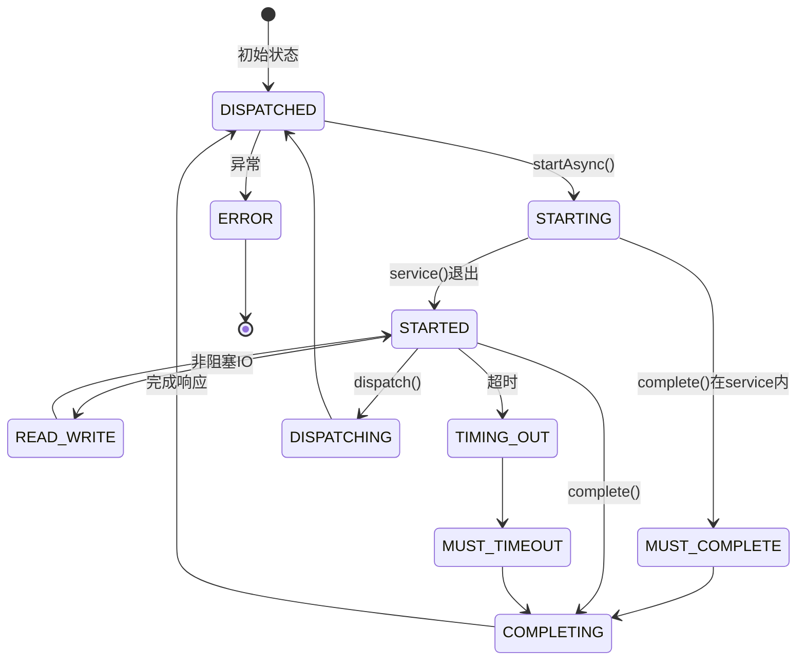
```mermaid
stateDiagram-v2
    [*] --> DISPATCHED: 初始状态
    DISPATCHED --> STARTING: startAsync()
    STARTING --> STARTED: service()退出
    STARTED --> READ_WRITE: 非阻塞IO
    READ_WRITE --> STARTED
    STARTING --> MUST_COMPLETE: complete()在service内
    MUST_COMPLETE --> COMPLETING
    STARTED --> COMPLETING: complete()
    STARTED --> TIMING_OUT: 超时
    TIMING_OUT --> MUST_TIMEOUT
    MUST_TIMEOUT --> COMPLETING
    STARTED --> DISPATCHING: dispatch()
    DISPATCHING --> DISPATCHED
    COMPLETING --> DISPATCHED: 完成响应
    DISPATCHED --> ERROR: 异常
    ERROR --> [*]
```

### 9.3 AsyncContextImpl 实现

```java
// 文件: java/org/apache/catalina/core/AsyncContextImpl.java
public class AsyncContextImpl implements AsyncContext, AsyncContextCallback {

    @Override
    public void start(Runnable run) {
        check();
        // 包装 Runnable，确保在正确的 ClassLoader 和 Context 下执行
        Runnable wrapper = new RunnableWrapper(run, context, this.request.getCoyoteRequest());
        this.request.getCoyoteRequest().action(ActionCode.ASYNC_RUN, wrapper);
    }

    @Override
    public void complete() {
        check();
        request.getCoyoteRequest().action(ActionCode.ASYNC_COMPLETE, null);
    }

    @Override
    public void dispatch(String path) {
        check();
        dispatch(getRequest().getServletContext(), path);
    }

    @Override
    public void dispatch() {
        check();
        // 派发到原始 Servlet
    }

    @Override
    public void setTimeout(long timeout) {
        check();
        request.getCoyoteRequest().action(ActionCode.ASYNC_SETTIMEOUT, Long.valueOf(timeout));
    }
}
```

### 9.4 与 Coyote 通信：ActionCode

`AsyncContextImpl` 不直接处理 IO，而是通过 `ActionCode` 通知 Coyote 层执行：

```java
// 文件: java/org/apache/coyote/ActionCode.java
public enum ActionCode {
    ASYNC_COMPLETE,        // 完成异步
    ASYNC_DISPATCH,        // 派发请求
    ASYNC_RUN,             // 异步执行 Runnable
    ASYNC_SETTIMEOUT,      // 设置超时
    ASYNC_ERROR,           // 异步错误
    ASYNC_IS_ASYNC,        // 是否异步
    ASYNC_IS_TIMEDOUT,     // 是否超时
    ASYNC_POST_PROCESS,    // 后处理
    // ... 共 50+ 个 ActionCode
}
```

`Request.action(ActionCode, param)` 内部调用 `AbstractProcessor.actionHook.action(...)`，最终由 `Http11Processor` 处理。

### 9.5 异步处理完整时序

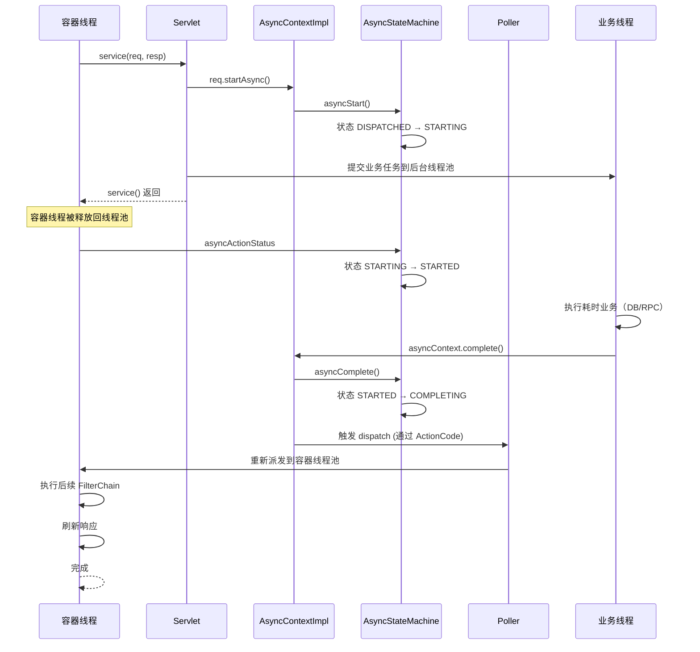
```mermaid
sequenceDiagram
    participant R as 容器线程
    participant S as Servlet
    participant AC as AsyncContextImpl
    participant SM as AsyncStateMachine
    participant P as Poller
    participant B as 业务线程

    R->>S: service(req, resp)
    S->>AC: req.startAsync()
    AC->>SM: asyncStart()
    SM->>SM: 状态 DISPATCHED → STARTING
    S->>B: 提交业务任务到后台线程池
    S-->>R: service() 返回
    Note over R: 容器线程被释放回线程池
    R->>SM: asyncActionStatus
    SM->>SM: 状态 STARTING → STARTED

    B->>B: 执行耗时业务（DB/RPC）
    B->>AC: asyncContext.complete()
    AC->>SM: asyncComplete()
    SM->>SM: 状态 STARTED → COMPLETING
    AC->>P: 触发 dispatch (通过 ActionCode)
    P->>R: 重新派发到容器线程池
    R->>R: 执行后续 FilterChain
    R->>R: 刷新响应
    R-->>R: 完成
```

### 9.6 AsyncListener

```java
// 文件: javax.servlet.AsyncListener.java
public interface AsyncListener extends EventListener {
    void onComplete(AsyncEvent event) throws IOException;
    void onTimeout(AsyncEvent event) throws IOException;
    void onError(AsyncEvent event) throws IOException;
    void onStartAsync(AsyncEvent event) throws IOException;
}
```

Tomcat 通过 `AsyncListenerWrapper` 包装监听器，在状态变化时触发对应回调。

### 9.7 非阻塞 IO（Servlet 3.1）

```java
// javax.servlet.ReadListener
public interface ReadListener extends java.util.EventListener {
    void onDataAvailable() throws IOException;
    void onAllDataRead() throws IOException;
    void onError(Throwable t);
}

// javax.servlet.WriteListener
public interface WriteListener extends java.util.EventListener {
    void onWritePossible() throws IOException;
    void onError(Throwable t);
}
```

**协作流程**：
1. Servlet 设置 `ReadListener`，切换非阻塞模式
2. 数据就绪时，Poller 触发 `SocketEvent.OPEN_READ`
3. 容器调用 `onDataAvailable()`，Servlet 读取数据
4. `isReady()` 返回 false 时不再读，等待下一次触发
5. 所有数据读取完，调用 `onAllDataRead()`

---

## 十、WebSocket 支持

### 10.1 WebSocket 协议升级流程

WebSocket 通过 HTTP/1.1 升级机制建立连接：

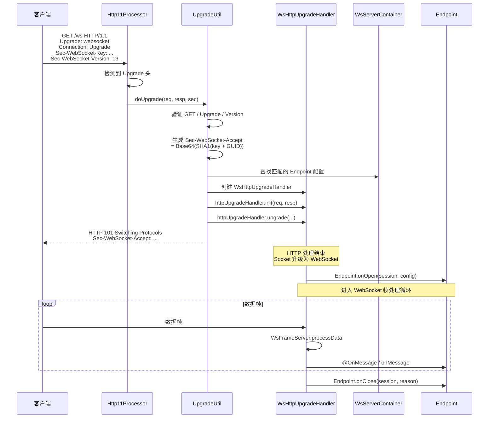
```mermaid
sequenceDiagram
    participant C as 客户端
    participant H as Http11Processor
    participant U as UpgradeUtil
    participant W as WsHttpUpgradeHandler
    participant WS as WsServerContainer
    participant E as Endpoint

    C->>H: GET /ws HTTP/1.1<br/>Upgrade: websocket<br/>Connection: Upgrade<br/>Sec-WebSocket-Key: ...<br/>Sec-WebSocket-Version: 13
    H->>H: 检测到 Upgrade 头
    H->>U: doUpgrade(req, resp, sec)
    U->>U: 验证 GET / Upgrade / Version
    U->>U: 生成 Sec-WebSocket-Accept<br/>= Base64(SHA1(key + GUID))
    U->>WS: 查找匹配的 Endpoint 配置
    U->>W: 创建 WsHttpUpgradeHandler
    U->>W: httpUpgradeHandler.init(req, resp)
    U->>W: httpUpgradeHandler.upgrade(...)
    U-->>C: HTTP 101 Switching Protocols<br/>Sec-WebSocket-Accept: ...
    Note over W: HTTP 处理结束<br/>Socket 升级为 WebSocket
    W->>E: Endpoint.onOpen(session, config)
    Note over W,E: 进入 WebSocket 帧处理循环
    loop 数据帧
        C->>W: 数据帧
        W->>W: WsFrameServer.processData
        W->>E: @OnMessage / onMessage
    end
    W->>E: Endpoint.onClose(session, reason)
```

### 10.2 WebSocket 帧格式

```
 0                   1                   2                   3
 0 1 2 3 4 5 6 7 8 9 0 1 2 3 4 5 6 7 8 9 0 1 2 3 4 5 6 7 8 9 0 1
+-+-+-+-+-------+-+-------------+-------------------------------+
|F|R|R|R| opcode|M| Payload len |    Extended payload length    |
|I|S|S|S|  (4)  |A|     (7)     |             (16/64)           |
|N|V|V|V|       |S|             |   (if payload len==126/127)   |
| |1|2|3|       |K|             |                               |
+-+-+-+-+-------+-+-------------+ - - - - - - - - - - - - - - - +
|     Extended payload length continued, if payload len == 127  |
+ - - - - - - - - - - - - - - - +-------------------------------+
|                               |Masking-key, if MASK set to 1  |
+-------------------------------+-------------------------------+
| Masking-key (continued)       |          Payload Data         |
+-------------------------------- - - - - - - - - - - - - - - - +
```

| 字段 | 位数 | 说明 |
|------|------|------|
| FIN | 1 | 是否为最后一个分片 |
| RSV1-3 | 3 | 保留，必须为 0 |
| opcode | 4 | 0=继续, 1=文本, 2=二进制, 8=关闭, 9=Ping, 10=Pong |
| MASK | 1 | 客户端到服务端必须为 1 |
| Payload len | 7 | 长度（126/127 时使用扩展长度） |
| Masking-key | 0/32 | 掩码密钥 |

### 10.3 帧解析实现

```java
// 文件: java/org/apache/tomcat/websocket/WsFrameBase.java
private boolean processInitialHeader() throws IOException {
    int b = inputBuffer.get();
    fin = (b & 0x80) != 0;
    rsv = (b & 0x70) >>> 4;
    opCode = (byte) (b & 0x0F);
    // 验证 RSV 必须为 0
    // 验证 opcode 合法
    // 处理控制帧必须不分片

    b = inputBuffer.get();
    masked = (b & 0x80) != 0;
    payloadLength = b & 0x7F;
    // 处理扩展长度
    if (payloadLength == 126) {
        // 读 2 字节作为长度
    } else if (payloadLength == 127) {
        // 读 8 字节作为长度
    }
    // 读取掩码密钥
    // ...
}
```

### 10.4 核心类与文件路径

| 类 | 文件路径 | 职责 |
|----|---------|------|
| `WsServerContainer` | `tomcat/websocket/server/WsServerContainer.java` | WebSocket 容器，管理 Endpoint 配置 |
| `WsSession` | `tomcat/websocket/WsSession.java` | WebSocket 会话实现 |
| `WsFrameBase` | `tomcat/websocket/WsFrameBase.java` | 帧解析基类 |
| `WsFrameServer` | `tomcat/websocket/server/WsFrameServer.java` | 服务端帧处理 |
| `WsRemoteEndpointImplBase` | `tomcat/websocket/WsRemoteEndpointImplBase.java` | 远程端点实现 |
| `WsHttpUpgradeHandler` | `tomcat/websocket/server/WsHttpUpgradeHandler.java` | HTTP 升级处理器 |
| `UpgradeUtil` | `tomcat/websocket/server/UpgradeUtil.java` | 升级工具类 |
| `WsSci` | `tomcat/websocket/server/WsSci.java` | ServletContainerInitializer，扫描注解端点 |
| `PojoMethodMapping` | `tomcat/websocket/pojo/PojoMethodMapping.java` | POJO 方法到 WebSocket 事件的映射 |

### 10.5 注解式 Endpoint 扫描

```java
// 文件: java/org/apache/tomcat/websocket/server/WsSci.java
@HandlesTypes({ServerEndpoint.class, Endpoint.class, ServerApplicationConfig.class})
public class WsSci implements ServletContainerInitializer {
    @Override
    public void onStartup(Set<Class<?>> clazzes, ServletContext ctx) throws ServletException {
        // 1. 创建 WsServerContainer
        WsServerContainer sc = new WsServerContainer(ctx);
        // 2. 扫描 @ServerEndpoint 注解类
        // 3. 扫描 ServerApplicationConfig 实现
        // 4. 注册所有 Endpoint
        ctx.setAttribute(ServerContainer.class.getName(), sc);
    }
}
```

### 10.6 WsSession 状态机

```java
// 文件: java/org/apache/tomcat/websocket/WsSession.java
private enum State {
    OPEN,           // 已打开
    OUTPUT_CLOSING, // 正在发送关闭帧
    OUTPUT_CLOSED,  // 输出已关闭
    CLOSING,        // 等待对方关闭帧
    CLOSED          // 完全关闭
}
```

### 10.7 与 NioEndpoint 协作

WebSocket 升级后，Socket 不再由 `Http11Processor` 处理，而是交给 `WsHttpUpgradeHandler`：

```java
// 文件: java/org/apache/tomcat/websocket/server/WsHttpUpgradeHandler.java
public class WsHttpUpgradeHandler implements InternalHttpUpgradeHandler {
    @Override
    public void init(WebConnection connection) {
        // 创建 WsSession
        // 注册 OP_READ 到 Poller
    }

    @Override
    public void upgradeDispatch(SocketEvent event) {
        if (event == SocketEvent.OPEN_READ) {
            // Poller 检测到数据可读
            WsFrameServer wsFrame = ...;
            wsFrame.notifyDataAvailable();
        } else if (event == SocketEvent.OPEN_WRITE) {
            // 数据可写
            wsRemoteEndpoint.notifyDataAvailable();
        }
    }
}
```

**复用 Poller 线程**：WebSocket 数据读写仍由 Poller 监听 OP_READ/OP_WRITE，就绪时通过 `upgradeDispatch` 通知 WsHttpUpgradeHandler 处理数据帧。

---

## 十一、类加载机制（打破双亲委派）

### 11.1 Tomcat 类加载器层次

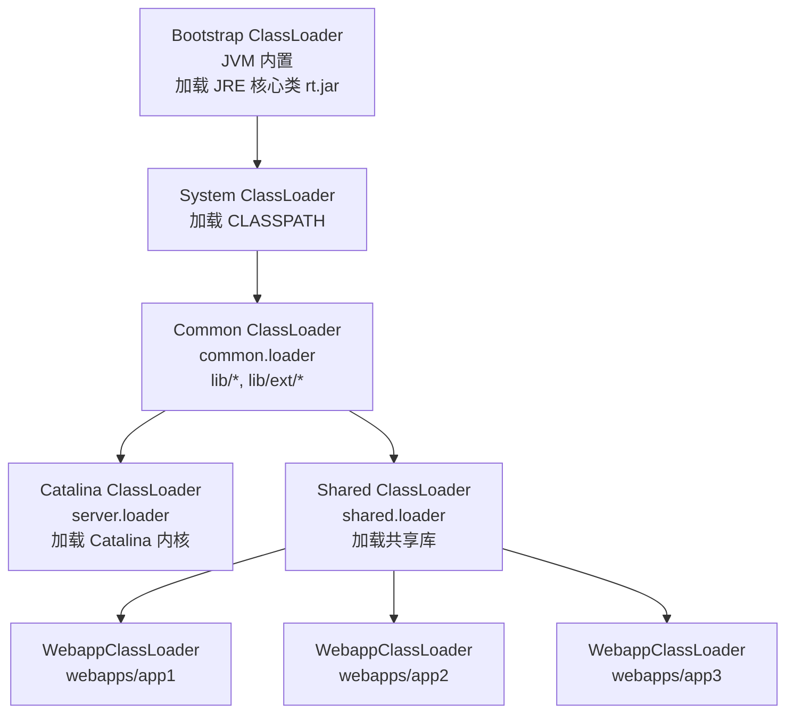
```mermaid
graph TB
    Boot[Bootstrap ClassLoader<br/>JVM 内置<br/>加载 JRE 核心类 rt.jar]
    Sys[System ClassLoader<br/>加载 CLASSPATH]

    Common[Common ClassLoader<br/>common.loader<br/>lib/*, lib/ext/*]
    Catalina[Catalina ClassLoader<br/>server.loader<br/>加载 Catalina 内核]
    Shared[Shared ClassLoader<br/>shared.loader<br/>加载共享库]

    Webapp1[WebappClassLoader<br/>webapps/app1]
    Webapp2[WebappClassLoader<br/>webapps/app2]
    Webapp3[WebappClassLoader<br/>webapps/app3]

    Boot --> Sys
    Sys --> Common
    Common --> Catalina
    Common --> Shared
    Shared --> Webapp1
    Shared --> Webapp2
    Shared --> Webapp3
```

### 11.2 类加载器初始化

#### 11.2.1 CatalinaProperties 读取配置

```java
// 文件: java/org/apache/catalina/startup/CatalinaProperties.java
// 从 conf/catalina.properties 读取：
// common.loader=${catalina.base}/lib,${catalina.base}/lib/*.jar,${catalina.home}/lib,${catalina.home}/lib/*.jar
// server.loader=
// shared.loader=
```

#### 11.2.2 Bootstrap 创建类加载器

```java
// 文件: java/org/apache/catalina/startup/Bootstrap.java
private void initClassLoaders() {
    commonLoader = createClassLoader("common", null);
    if (commonLoader == null) {
        commonLoader = this.getClass().getClassLoader();
    }
    catalinaLoader = createClassLoader("server", commonLoader);
    sharedLoader  = createClassLoader("shared", commonLoader);
}

private ClassLoader createClassLoader(String name, ClassLoader parent) throws Exception {
    String value = CatalinaProperties.getProperty(name + ".loader");
    if ((value == null) || (value.isEmpty())) {
        return parent;   // 默认配置为空，返回父加载器
    }
    // 解析路径列表
    List<Repository> repositories = new ArrayList<>();
    String[] paths = getPaths(value);
    for (String repository : paths) {
        if (repository.endsWith("*.jar")) {
            repositories.add(new Repository(
                repository.substring(0, repository.length() - "*.jar".length()),
                RepositoryType.GLOB));
        } else if (repository.endsWith(".jar")) {
            repositories.add(new Repository(repository, RepositoryType.JAR));
        } else {
            repositories.add(new Repository(repository, RepositoryType.DIR));
        }
    }
    return ClassLoaderFactory.createClassLoader(repositories, parent);
}
```

### 11.3 WebappClassLoader：打破双亲委派

`org.apache.catalina.loader.WebappClassLoaderBase` 是 Tomcat 最核心的类加载器：

#### 11.3.1 类继承结构

```
java.net.URLClassLoader
    └── WebappClassLoaderBase (implements Lifecycle, InstrumentableClassLoader)
            ├── WebappClassLoader
            └── ParallelWebappClassLoader (并行加载支持)
```

#### 11.3.2 关键字段

```java
// 文件: java/org/apache/catalina/loader/WebappClassLoaderBase.java
public abstract class WebappClassLoaderBase extends URLClassLoader {
    protected WebResourceRoot resources;     // Web 资源根
    protected final Map<String, ResourceEntry> resourceEntries = new ConcurrentHashMap<>();
    protected boolean delegate = false;     // 是否优先委托父类
    protected final ClassLoader parent;      // 父类加载器
    private ClassLoader javaseClassLoader;   // JRE 引导类加载器
    private final List<URL> localRepositories = new ArrayList<>();
}
```

#### 11.3.3 loadClass 方法（核心）

```java
// 文件: java/org/apache/catalina/loader/WebappClassLoaderBase.java
@Override
public Class<?> loadClass(String name, boolean resolve) throws ClassNotFoundException {
    synchronized (JreCompat.isGraalAvailable() ? this : getClassLoadingLock(name)) {
        checkStateForClassLoading(name);

        // (0) 本地缓存查找
        Class<?> clazz = findLoadedClass0(name);
        if (clazz != null) return clazz;

        // (0.1) JVM 内部缓存查找
        clazz = findLoadedClass(name);
        if (clazz != null) return clazz;

        // (0.2) 优先用 javaseClassLoader 加载 JRE 核心类
        // 防止应用覆盖 java.* 等核心类
        String resourceName = binaryNameToPath(name, false);
        ClassLoader javaseLoader = getJavaseClassLoader();
        boolean tryLoadingFromJavaseLoader;
        try {
            URL url = javaseLoader.getResource(resourceName);
            tryLoadingFromJavaseLoader = url != null;
        } catch (Throwable t) {
            tryLoadingFromJavaseLoader = true;
        }
        if (tryLoadingFromJavaseLoader) {
            clazz = javaseLoader.loadClass(name);
            if (clazz != null) return clazz;
        }

        // (0.5) 安全管理器检查
        if (securityManager != null) {
            int i = name.lastIndexOf('.');
            if (i >= 0) {
                securityManager.checkPackageAccess(name.substring(0, i));
            }
        }

        // (1) 根据 delegate 决定是否先委托父类
        boolean delegateLoad = delegate || filter(name, true);
        if (delegateLoad) {
            clazz = Class.forName(name, false, parent);
            if (clazz != null) return clazz;
        }

        // (2) 搜索本地仓库 (WEB-INF/classes, WEB-INF/lib)
        clazz = findClass(name);
        if (clazz != null) return clazz;

        // (3) delegate=false 时，最后委托父类加载器
        if (!delegateLoad) {
            clazz = Class.forName(name, false, parent);
            if (clazz != null) return clazz;
        }
    }
    throw new ClassNotFoundException(name);
}
```

#### 11.3.4 打破双亲委派的关键点

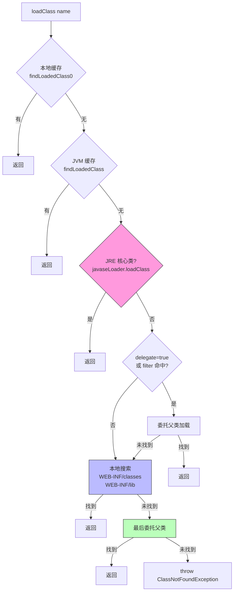
```mermaid
flowchart TD
    Start[loadClass name] --> L0{本地缓存<br/>findLoadedClass0}
    L0 -->|有| Return1[返回]
    L0 -->|无| L01{JVM 缓存<br/>findLoadedClass}
    L01 -->|有| Return2[返回]
    L01 -->|无| L02{JRE 核心类?<br/>javaseLoader.loadClass}
    L02 -->|是| Return3[返回]
    L02 -->|否| L1{delegate=true<br/>或 filter 命中?}
    L1 -->|是| P1[委托父类加载]
    L1 -->|否| L2[本地搜索<br/>WEB-INF/classes<br/>WEB-INF/lib]
    L2 -->|找到| Return4[返回]
    L2 -->|未找到| L3[最后委托父类]
    P1 -->|找到| Return5[返回]
    P1 -->|未找到| L2
    L3 -->|找到| Return6[返回]
    L3 -->|未找到| Throw[throw ClassNotFoundException]

    style L02 fill:#f9d,stroke:#333
    style L2 fill:#bbf,stroke:#333
    style L3 fill:#bfb,stroke:#333
```

**与标准双亲委派的差异**：

| 步骤 | 标准双亲委派 | Tomcat WebappClassLoader |
|------|-----------|-------------------------|
| 1 | 缓存检查 | 缓存检查 |
| 2 | 直接委托父类 | **优先加载 JRE 核心类** |
| 3 | - | 根据 `delegate` 决定是否委托父类 |
| 4 | 父类找不到才自己加载 | **先加载本地 WEB-INF/classes 和 WEB-INF/lib** |
| 5 | - | 本地找不到才委托父类 |

#### 11.3.5 filter 机制

`filter` 方法过滤特定包，确保它们始终由父类加载器加载：

```java
protected boolean filter(String name, boolean isClass) {
    if (name.startsWith("javax.servlet.") ||
        name.startsWith("jakarta.servlet.") ||
        name.startsWith("javax.websocket.") ||
        name.startsWith("jakarta.websocket.") ||
        // 其他容器 API 包
        name.startsWith("javax.el.") ||
        name.startsWith("javax.annotation.")) {
        return true;
    }
    return false;
}
```

**目的**：确保 Servlet API、JSP API、EL API 等容器规范 API 始终由父类加载器加载，避免应用自身的同名类覆盖造成冲突。

### 11.4 WebappLoader：容器组件

`org.apache.catalina.loader.WebappLoader` 是 Tomcat 容器对类加载器的封装：

```java
// 文件: java/org/apache/catalina/loader/WebappLoader.java
public class WebappLoader extends LifecycleMBeanBase implements Loader, PropertyChangeListener {
    private WebappClassLoaderBase classLoader;
    private Context context;
    private boolean delegate = false;
    private boolean reloadable = false;
    private String loaderClass = ParallelWebappClassLoader.class.getName();

    @Override
    protected void startInternal() throws LifecycleException {
        classLoader = createClassLoader();
        classLoader.setResources(context.getResources());
        classLoader.setDelegate(this.delegate);
        setPermissions();
        classLoader.start();
        setClassPath();
    }

    @Override
    public void backgroundProcess() {
        if (reloadable && modified()) {
            // 检测到类变化，触发重新加载
            context.reload();
        }
    }
}
```

### 11.5 WebResourceRoot 资源系统

`org.apache.catalina.WebResourceRoot` 是 Web 资源管理接口，`StandardRoot` 是标准实现：

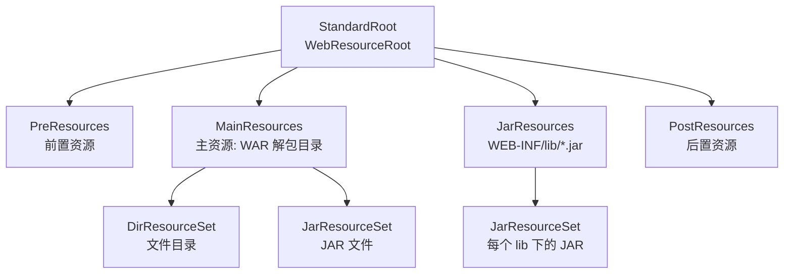
```mermaid
graph TB
    Root[StandardRoot<br/>WebResourceRoot]
    Root --> Pre[PreResources<br/>前置资源]
    Root --> Main[MainResources<br/>主资源: WAR 解包目录]
    Root --> Jar[JarResources<br/>WEB-INF/lib/*.jar]
    Root --> Post[PostResources<br/>后置资源]

    Main --> DRS1[DirResourceSet<br/>文件目录]
    Main --> JRS1[JarResourceSet<br/>JAR 文件]
    Jar --> JRS2[JarResourceSet<br/>每个 lib 下的 JAR]
```

**资源查找顺序**：Pre → Main → Jar → Post，先找到的优先返回。

### 11.6 为什么 Tomcat 要打破双亲委派？

1. **Web 应用隔离**：不同应用可能依赖不同版本的同一库（如 Spring 4 vs Spring 5），必须隔离
2. **应用优先级**：应用自身的类应该优先于容器共享类（符合 Servlet 规范）
3. **热部署**：每个 Web 应用独立的类加载器，重新部署时丢弃旧类加载器即可卸载类
4. **避免冲突**：JSP 类（编译后）每次重新编译都生成新类名，必须用独立类加载器加载

### 11.7 类卸载与内存泄漏

**类卸载条件**（由 GC 完成）：
1. 类加载器实例无引用
2. 该类加载器加载的所有 Class 对象无引用
3. 没有 Thread ContextClassLoader 指向它
4. 没有静态变量引用它的类

**内存泄漏预防**：

```java
// 文件: java/org/apache/catalina/core/JreMemoryLeakPreventionListener.java
// 预防 JRE 自身的内存泄漏
@Override
public void lifecycleEvent(LifecycleEvent event) {
    if (event.getType().equals(Lifecycle.START_EVENT)) {
        protectJdbcDrivers();      // 加载 JDBC 驱动，避免被 WebappClassLoader 加载
        protectThreadLocals();     // 加载 ThreadLocal 类
        // 其他预防措施：
        // - Tokenizer 缓存
        // - DTMManager 缓存
        // - BeanIntrospectionCache
    }
}

// 文件: java/org/apache/catalina/core/ThreadLocalLeakPreventionListener.java
// 清理线程池中线程的 ThreadLocal
@Override
public void lifecycleEvent(LifecycleEvent event) {
    if (event.getType().equals(Lifecycle.STOP_EVENT)) {
        stopIdleThreads((Context) event.getLifecycle());
    }
}
```

---

## 十二、整体工作流程总结

### 12.1 启动到运行全流程

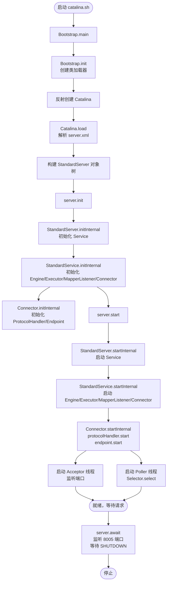
```mermaid
flowchart TD
    Start([启动 catalina.sh]) --> B1[Bootstrap.main]
    B1 --> B2[Bootstrap.init<br/>创建类加载器]
    B2 --> B3[反射创建 Catalina]
    B3 --> C1[Catalina.load<br/>解析 server.xml]
    C1 --> C2[构建 StandardServer 对象树]
    C2 --> S1[server.init]
    S1 --> S2[StandardServer.initInternal<br/>初始化 Service]
    S2 --> S3[StandardService.initInternal<br/>初始化 Engine/Executor/MapperListener/Connector]
    S3 --> Cn1[Connector.initInternal<br/>初始化 ProtocolHandler/Endpoint]
    S3 --> D1[server.start]
    D1 --> D2[StandardServer.startInternal<br/>启动 Service]
    D2 --> D3[StandardService.startInternal<br/>启动 Engine/Executor/MapperListener/Connector]
    D3 --> Cn2[Connector.startInternal<br/>protocolHandler.start<br/>endpoint.start]
    Cn2 --> Ac1[启动 Acceptor 线程<br/>监听端口]
    Cn2 --> Po1[启动 Poller 线程<br/>Selector.select]
    Ac1 --> Ready([就绪，等待请求])
    Po1 --> Ready
    Ready --> Await[server.await<br/>监听 8005 端口<br/>等待 SHUTDOWN]
    Await --> Stop([停止])
```

### 12.2 完整请求处理流程图


```mermaid
flowchart TD
    A[浏览器发起 HTTP 请求] --> B[TCP 三次握手]
    B --> C[Acceptor 接受连接]
    C --> D[配置 Socket 为非阻塞]
    D --> E[注册 OP_READ 到 Poller]
    E --> F[Poller.select 检测到读事件]
    F --> G[提交 SocketProcessor 到线程池]
    G --> H[Http11Processor.process]
    H --> I[解析请求行: GET /app/servlet HTTP/1.1]
    I --> J[解析 Headers: Host, Cookie, Content-Type...]
    J --> K[prepareRequest: 解析 keep-alive, 编码等]
    K --> L[CoyoteAdapter.service]
    L --> M[创建 Catalina Request/Response]
    M --> N[postParseRequest: 解析参数、Cookie]
    N --> O[Mapper.map: 定位 Host/Context/Wrapper]
    O --> P[Engine.Pipeline.getFirst.invoke]
    P --> Q[StandardEngineValve: 选择 Host]
    Q --> R[Host.Pipeline.getFirst.invoke]
    R --> S[StandardHostValve: 选择 Context]
    S --> T[Context.Pipeline.getFirst.invoke]
    T --> U[StandardContextValve: 拦截 WEB-INF, 选择 Wrapper]
    U --> V[Wrapper.Pipeline.getFirst.invoke]
    V --> W[StandardWrapperValve]
    W --> X[allocate Servlet 实例]
    X --> Y[创建 ApplicationFilterChain]
    Y --> Z[FilterChain.doFilter]
    Z --> Z1[Filter1.doFilter]
    Z1 --> Z2[Filter2.doFilter]
    Z2 --> Z3[Filter N.doFilter]
    Z3 --> AA[Servlet.service]
    AA --> BB{是否异步?}
    BB -->|是 异步| AC1[启动 AsyncContext<br/>释放容器线程]
    AC1 --> AC2[业务线程执行]
    AC2 --> AC3[asyncContext.complete]
    AC3 --> AC4[重新派发到容器线程]
    AC4 --> AD[刷新响应]
    BB -->|否| AD
    AD --> AE[FilterChain.release]
    AE --> AF[Wrapper.deallocate]
    AF --> AG[Http11Processor.end<br/>写响应到 Socket]
    AG --> AH{keep-alive?}
    AH -->|是| F
    AH -->|否| AI[关闭 Socket]
    AI --> End([请求结束])
```

### 12.3 核心设计要点总结

1. **分层架构**：Coyote（网络层）↔ Adapter（桥梁）↔ Catalina（容器层），各层独立演化
2. **统一生命周期**：所有组件实现 `Lifecycle`，通过 `LifecycleBase` 模板方法统一管理
3. **责任链管道**：每层容器都有 Pipeline-Valve，支持灵活扩展
4. **事件驱动**：`LifecycleListener` + `ContainerListener` 实现松耦合扩展点
5. **NIO Reactor**：Acceptor + Poller + 工作线程池的经典模式
6. **自定义线程池**：`TaskQueue` 重写 offer 实现「先扩容到 max 再入队」的高并发策略
7. **异步 Servlet**：通过 `AsyncStateMachine` 状态机 + `ActionCode` 解耦容器与业务
8. **WebSocket 升级**：复用 HTTP/1.1 升级机制 + Poller 线程
9. **打破双亲委派**：`WebappClassLoader` 先加载本地 JRE 核心类，再根据 delegate 策略决定委派时机，实现应用隔离和热部署

### 12.4 关键文件路径索引

| 模块 | 关键文件 |
|------|---------|
| 启动 | `catalina/startup/Bootstrap.java`、`catalina/startup/Catalina.java` |
| 生命周期 | `catalina/Lifecycle.java`、`catalina/util/LifecycleBase.java`、`catalina/LifecycleState.java` |
| 容器 | `catalina/core/StandardServer.java`、`StandardService.java`、`StandardEngine.java`、`StandardHost.java`、`StandardContext.java`、`StandardWrapper.java` |
| 管道 | `catalina/core/StandardPipeline.java`、`StandardEngineValve.java`、`StandardHostValve.java`、`StandardContextValve.java`、`StandardWrapperValve.java` |
| 连接器 | `catalina/connector/Connector.java`、`CoyoteAdapter.java` |
| 协议 | `coyote/AbstractProtocol.java`、`coyote/http11/Http11Processor.java`、`Http11NioProtocol.java` |
| 网络 | `tomcat/util/net/NioEndpoint.java`、`Acceptor.java`、`SocketProcessorBase.java` |
| 线程池 | `tomcat/util/threads/ThreadPoolExecutor.java`、`TaskQueue.java`、`catalina/core/StandardThreadExecutor.java` |
| 异步 | `catalina/core/AsyncContextImpl.java`、`coyote/AsyncStateMachine.java`、`coyote/ActionCode.java` |
| WebSocket | `tomcat/websocket/server/WsServerContainer.java`、`WsHttpUpgradeHandler.java`、`UpgradeUtil.java`、`WsSci.java`、`tomcat/websocket/WsFrameBase.java`、`WsSession.java` |
| 类加载 | `catalina/startup/ClassLoaderFactory.java`、`catalina/loader/WebappClassLoaderBase.java`、`ParallelWebappClassLoader.java`、`WebappLoader.java`、`catalina/webresources/StandardRoot.java` |

---

## 附录：常用配置与默认值

| 配置项 | 默认值 | 说明 |
|--------|--------|------|
| `maxThreads` | 200 | 单 Connector 最大工作线程 |
| `minSpareThreads` | 25 | 最小空闲线程 |
| `acceptCount` | 100 | 接收队列长度（OS backlog） |
| `connectionTimeout` | 20000ms | 连接超时 |
| `keepAliveTimeout` | connectionTimeout | keep-alive 超时 |
| `maxConnections` | 8192 (NIO) / 10000 (APR) | 最大连接数 |
| `pollerThreadCount` | min(2, CPU 核数) | Poller 线程数 |
| `processorCache` | -1 (200) | Http11Processor 缓存数 |

---

> **本文档基于 Tomcat 9.0.115 源码分析整理**，源码目录 `D:\workspace\java_projects\source_projects\tomcat-9.0.115\java\org\apache\`。所有引用的源码文件路径均相对于 `java/` 目录。
