# ZooKeeper 3.8.6 底层实现原理深度剖析

> 基于 ZooKeeper 3.8.6 源码（`zookeeper-server`、`zookeeper-jute`、`zookeeper-client` 模块）的深度源码级分析。涵盖整体架构、启动流程、网络通信、协议序列化、Session 机制、Watcher 机制、Leader 选举、ZAB 一致性协议、请求处理流程、WAL 预写日志、崩溃恢复及补充主题。

---

## 目录

- [一、概述与整体架构](#一概述与整体架构)
- [二、工作流程总览](#二工作流程总览)
- [三、服务端启动流程](#三服务端启动流程)
- [四、网络通信机制](#四网络通信机制)
- [五、通信协议与序列化](#五通信协议与序列化)
- [六、Session 机制实现原理](#六session-机制实现原理)
- [七、Watcher 机制实现原理](#七watcher-机制实现原理)
- [八、Leader 选举实现原理](#八leader-选举实现原理)
- [九、ZAB 一致性协议实现原理](#九zab-一致性协议实现原理)
- [十、读写请求处理流程](#十读写请求处理流程)
- [十一、WAL 预写日志与持久化](#十一wal-预写日志与持久化)
- [十二、崩溃恢复原理](#十二崩溃恢复原理)
- [十三、补充主题](#十三补充主题)
- [十四、总结](#十四总结)

---

## 一、概述与整体架构

### 1.1 ZooKeeper 是什么

ZooKeeper 是一个分布式的、开源的协调服务，为分布式应用提供一致性管理功能（命名服务、配置管理、集群管理、分布式锁、队列等）。其核心是一个**类似文件系统的层次化数据树（ZNode Tree）**，结合**顺序一致性（CP）**的分布式协调协议 ZAB（ZooKeeper Atomic Broadcast），在保障高可用性的同时提供线性一致性的写操作。

### 1.2 核心特性

| 特性 | 说明 |
|------|------|
| 顺序一致性 | 客户端发起的事务请求按发起顺序应用 |
| 原子性 | 事务要么全部成功，要么全部失败 |
| 单一视图 | 无论连接到哪个 Server，看到的数据视图一致 |
| 可靠性 | 事务一旦应用即持久化，不会被回滚 |
| 实时性 | 保证一定时间内的客户端能读到最新数据（最终一致性读） |

### 1.3 整体架构图

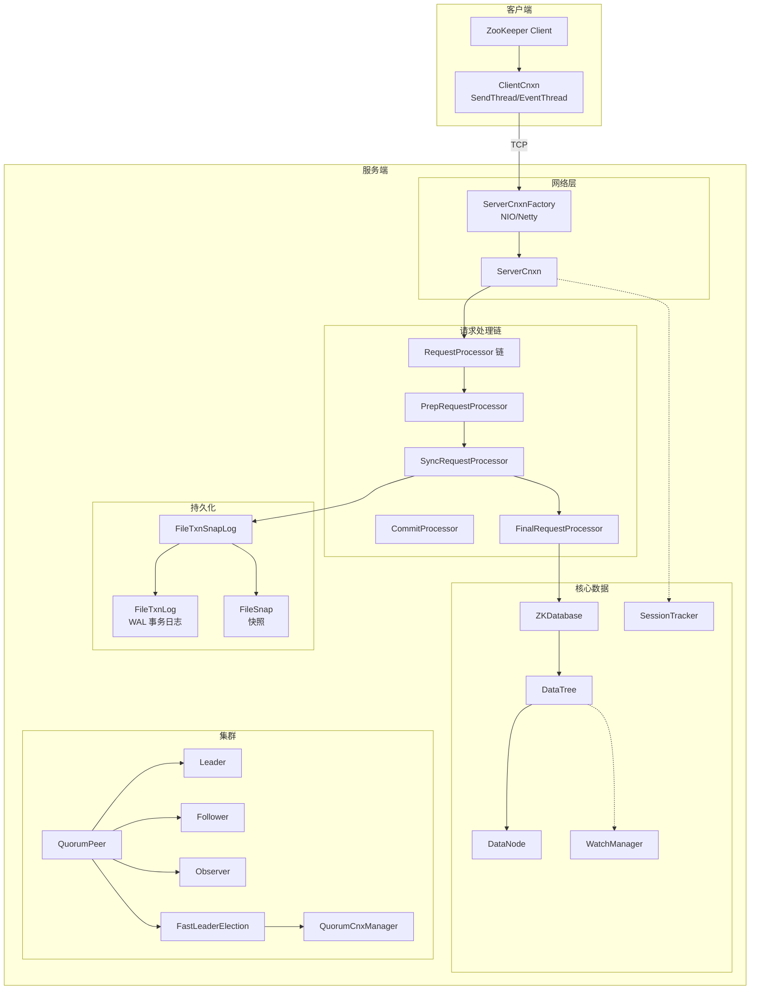
```mermaid
graph TB
    subgraph 客户端
        CL[ZooKeeper Client]
        CC[ClientCnxn<br/>SendThread/EventThread]
    end

    subgraph 服务端
        subgraph 网络层
            SCF[ServerCnxnFactory<br/>NIO/Netty]
            SC[ServerCnxn]
        end

        subgraph 请求处理链
            RP[RequestProcessor 链]
            PREP[PrepRequestProcessor]
            SYNC[SyncRequestProcessor]
            COMMIT[CommitProcessor]
            FINAL[FinalRequestProcessor]
        end

        subgraph 核心数据
            ZKD[ZKDatabase]
            DT[DataTree]
            DN[DataNode]
            ST[SessionTracker]
            WM[WatchManager]
        end

        subgraph 持久化
            FTSL[FileTxnSnapLog]
            FTL[FileTxnLog<br/>WAL 事务日志]
            FS[FileSnap<br/>快照]
        end

        subgraph 集群
            QP[QuorumPeer]
            LD[Leader]
            FL[Follower]
            OB[Observer]
            FLE[FastLeaderElection]
            QCM[QuorumCnxManager]
        end
    end

    CL --> CC
    CC -->|TCP| SCF
    SCF --> SC
    SC --> RP
    RP --> PREP --> SYNC --> FINAL
    FINAL --> ZKD
    ZKD --> DT
    DT --> DN
    DT -.-> WM
    SC -.-> ST
    SYNC --> FTSL
    FTSL --> FTL
    FTSL --> FS
    QP --> LD
    QP --> FL
    QP --> OB
    QP --> FLE
    FLE --> QCM
```

### 1.4 关键模块说明

**`zookeeper-server`**：服务端核心模块，包含：
- `org.apache.zookeeper.server`：单机服务端核心（ZooKeeperServer、ZKDatabase、DataTree、RequestProcessor 链、SessionTracker、WatchManager、持久化）
- `org.apache.zookeeper.server.quorum`：集群模式核心（QuorumPeer、Leader、Follower、Observer、FastLeaderElection、LearnerHandler）
- `org.apache.zookeeper.server.persistence`：持久化（FileTxnLog、FileSnap、FileTxnSnapLog）
- `org.apache.zookeeper.server.watch`：Watcher 管理
- `org.apache.zookeeper.client`：客户端相关

**`zookeeper-jute`**：ZooKeeper 自研的跨语言序列化框架（Record 接口、InputArchive/OutputArchive），通过 IDL 文件 `zookeeper.jute` 生成代码。

**`zookeeper-client`**：C 客户端实现。

**`zookeeper-recipes`**：基于 ZooKeeper 的高级抽象（如 Curator 风格的锁、队列等）。

### 1.5 角色划分

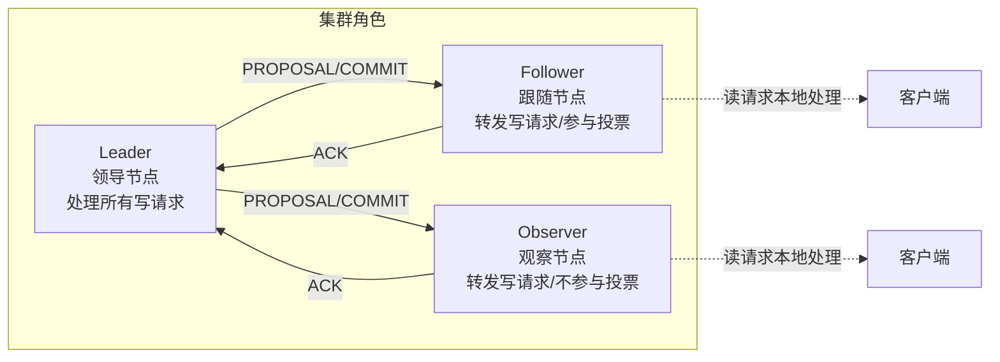
```mermaid
graph LR
    subgraph 集群角色
        L[Leader<br/>领导节点<br/>处理所有写请求]
        F[Follower<br/>跟随节点<br/>转发写请求/参与投票]
        O[Observer<br/>观察节点<br/>转发写请求/不参与投票]
    end

    L -->|PROPOSAL/COMMIT| F
    F -->|ACK| L
    L -->|PROPOSAL/COMMIT| O
    O -->|ACK| L
    F -.->|读请求本地处理| C1[客户端]
    O -.->|读请求本地处理| C2[客户端]
```

| 角色 | 参与选举 | 处理写请求 | 处理读请求 | 数据同步 |
|------|----------|-----------|-----------|---------|
| Leader | 是（被选举） | 直接处理 | 直接处理 | - |
| Follower | 是 | 转发 Leader | 本地处理 | 从 Leader 同步 |
| Observer | 否 | 转发 Leader | 本地处理 | 从 ObserverMaster 同步 |

---

## 二、工作流程总览

### 2.1 整体工作流程

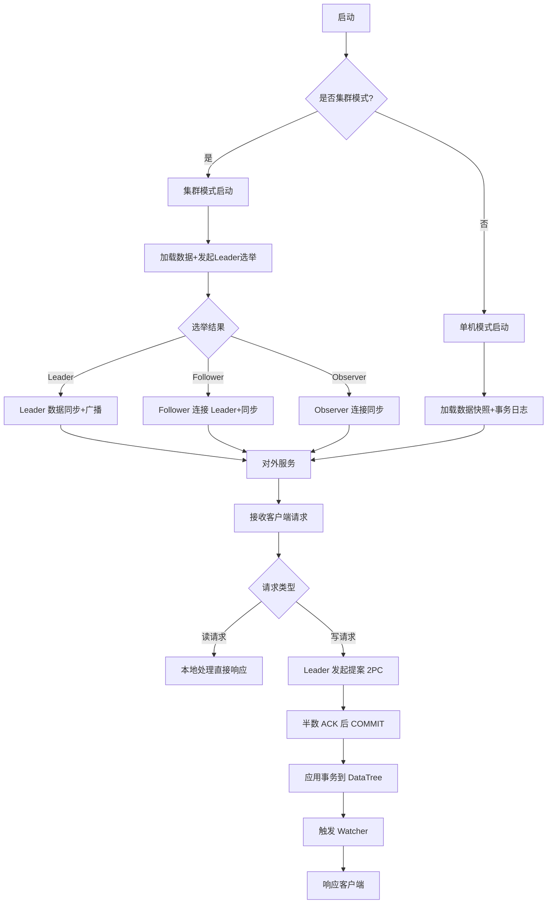
```mermaid
flowchart TD
    A[启动] --> B{是否集群模式?}
    B -->|否| C[单机模式启动]
    B -->|是| D[集群模式启动]
    C --> E[加载数据快照+事务日志]
    D --> F[加载数据+发起Leader选举]
    F --> G{选举结果}
    G -->|Leader| H[Leader 数据同步+广播]
    G -->|Follower| I[Follower 连接 Leader+同步]
    G -->|Observer| J[Observer 连接同步]
    H --> K[对外服务]
    I --> K
    J --> K
    E --> K
    K --> L[接收客户端请求]
    L --> M{请求类型}
    M -->|读请求| N[本地处理直接响应]
    M -->|写请求| O[Leader 发起提案 2PC]
    O --> P[半数 ACK 后 COMMIT]
    P --> Q[应用事务到 DataTree]
    Q --> R[触发 Watcher]
    R --> S[响应客户端]
```

### 2.2 关键路径

| 路径 | 关键流程 |
|------|---------|
| 启动 | 配置加载 → 数据恢复 → （选举） → 请求处理链构建 → 对外服务 |
| 写请求 | PrepRequestProcessor → SyncRequestProcessor（WAL）→ Leader propose → ACK → COMMIT → FinalRequestProcessor（应用 + 触发 Watcher） |
| 读请求 | PrepRequestProcessor（仅校验）→ FinalRequestProcessor（本地 DataTree 读取） |
| Watcher | 客户端读 API 注册 → 服务端 WatchManager 存储 → 事务应用后触发 → 客户端 EventThread 回调 |

---

## 三、服务端启动流程

### 3.1 单机模式启动流程（Standalone）

#### 3.1.1 入口类

`org.apache.zookeeper.server.ZooKeeperServerMain`

```java
public static void main(String[] args) {
    ZooKeeperServerMain main = new ZooKeeperServerMain();
    try {
        main.initializeAndRun(args);
    } catch (RuntimeException e) { ... }
}
```

调用链：`main()` → `initializeAndRun()` → `runFromConfig()`

#### 3.1.2 启动时序图

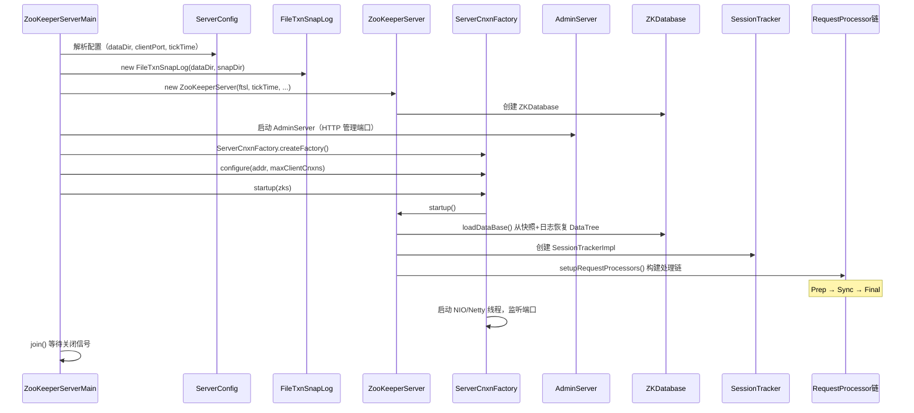
```mermaid
sequenceDiagram
    participant Main as ZooKeeperServerMain
    participant SCfg as ServerConfig
    participant FTSL as FileTxnSnapLog
    participant ZKS as ZooKeeperServer
    participant SCF as ServerCnxnFactory
    participant Admin as AdminServer
    participant ZKD as ZKDatabase
    participant ST as SessionTracker
    participant RP as RequestProcessor链

    Main->>SCfg: 解析配置（dataDir, clientPort, tickTime）
    Main->>FTSL: new FileTxnSnapLog(dataDir, snapDir)
    Main->>ZKS: new ZooKeeperServer(ftsl, tickTime, ...)
    ZKS->>ZKD: 创建 ZKDatabase
    Main->>Admin: 启动 AdminServer（HTTP 管理端口）
    Main->>SCF: ServerCnxnFactory.createFactory()
    Main->>SCF: configure(addr, maxClientCnxns)
    Main->>SCF: startup(zks)
    SCF->>ZKS: startup()
    ZKS->>ZKD: loadDataBase() 从快照+日志恢复 DataTree
    ZKS->>ST: 创建 SessionTrackerImpl
    ZKS->>RP: setupRequestProcessors() 构建处理链
    Note over RP: Prep → Sync → Final
    SCF->>SCF: 启动 NIO/Netty 线程，监听端口
    Main->>Main: join() 等待关闭信号
```

#### 3.1.3 关键初始化顺序

1. **解析配置**：`ServerConfig.parse(args)` 解析 `zoo.cfg` 或命令行参数
2. **创建 `FileTxnSnapLog`**：管理事务日志目录与快照目录
3. **实例化 `ZooKeeperServer`**：注入 `FileTxnSnapLog`、tickTime、`ZooKeeperServerConf`
4. **启动 `AdminServer`**：Jetty 嵌入式 HTTP 服务，端口默认 8080
5. **创建并配置 `ServerCnxnFactory`**：默认 `NIOServerCnxnFactory`，可通过 `zookeeper.serverCnxnFactory` 指定 Netty
6. **`startup()`**：
   - `loadDataBase()`：从最新快照恢复 `DataTree`，重放后续事务日志
   - 创建 `SessionTrackerImpl`
   - `setupRequestProcessors()`：构建 `Prep → Sync → Final` 链
   - 启动 `ServerCnxnFactory` 监听客户端端口
7. **`join()`**：阻塞主线程等待关闭

### 3.2 集群模式启动流程（Quorum）

#### 3.2.1 入口类

`org.apache.zookeeper.server.quorum.QuorumPeerMain`

```java
public static void main(String[] args) {
    QuorumPeerMain main = new QuorumPeerMain();
    try {
        main.initializeAndRun(args);
    } catch (Exception e) { ... }
}
```

#### 3.2.2 启动时序图

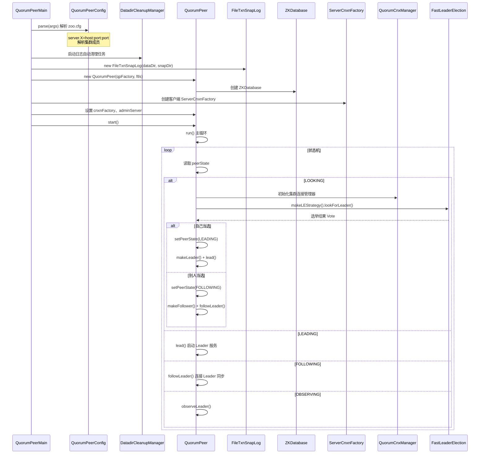
```mermaid
sequenceDiagram
    participant Main as QuorumPeerMain
    participant QCfg as QuorumPeerConfig
    participant DCM as DatadirCleanupManager
    participant QP as QuorumPeer
    participant FTSL as FileTxnSnapLog
    participant ZKD as ZKDatabase
    participant SCF as ServerCnxnFactory
    participant QCM as QuorumCnxManager
    participant FLE as FastLeaderElection

    Main->>QCfg: parse(args) 解析 zoo.cfg
    Note over QCfg: server.X=host:port:port<br/>解析集群成员
    Main->>DCM: 启动日志自动清理任务
    Main->>FTSL: new FileTxnSnapLog(dataDir, snapDir)
    Main->>QP: new QuorumPeer(qpFactory, ftls)
    QP->>ZKD: 创建 ZKDatabase
    Main->>SCF: 创建客户端 ServerCnxnFactory
    Main->>QP: 设置 cnxnFactory、adminServer
    Main->>QP: start()
    QP->>QP: run() 主循环
    loop 状态机
        QP->>QP: 读取 peerState
        alt LOOKING
            QP->>QCM: 初始化集群连接管理器
            QP->>FLE: makeLEStrategy().lookForLeader()
            FLE-->>QP: 选举结果 Vote
            alt 自己当选
                QP->>QP: setPeerState(LEADING)
                QP->>QP: makeLeader() + lead()
            else 别人当选
                QP->>QP: setPeerState(FOLLOWING)
                QP->>QP: makeFollower() + followLeader()
            end
        else LEADING
            QP->>QP: lead() 启动 Leader 服务
        else FOLLOWING
            QP->>QP: followLeader() 连接 Leader 同步
        else OBSERVING
            QP->>QP: observeLeader()
        end
    end
```

#### 3.2.3 QuorumPeer 状态机

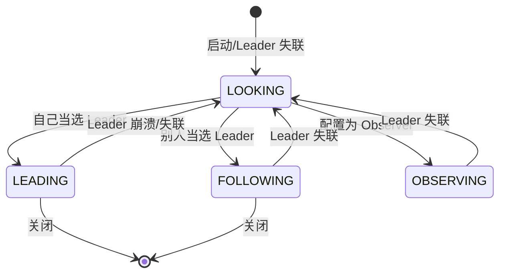
```mermaid
stateDiagram-v2
    [*] --> LOOKING: 启动/Leader 失联
    LOOKING --> LEADING: 自己当选 Leader
    LOOKING --> FOLLOWING: 别人当选 Leader
    LOOKING --> OBSERVING: 配置为 Observer
    LEADING --> LOOKING: Leader 崩溃/失联
    FOLLOWING --> LOOKING: Leader 失联
    OBSERVING --> LOOKING: Leader 失联
    LEADING --> [*]: 关闭
    FOLLOWING --> [*]: 关闭
```

`QuorumPeer.ServerState` 枚举定义四种状态：

```java
public enum ServerState {
    LOOKING,    // 寻找 Leader（选举中）
    FOLLOWING,  // 跟随 Leader
    LEADING,    // 自身为 Leader
    OBSERVING   // 观察者
}
```

#### 3.2.4 数据恢复流程

启动时无论单机还是集群，都需要从磁盘恢复数据：

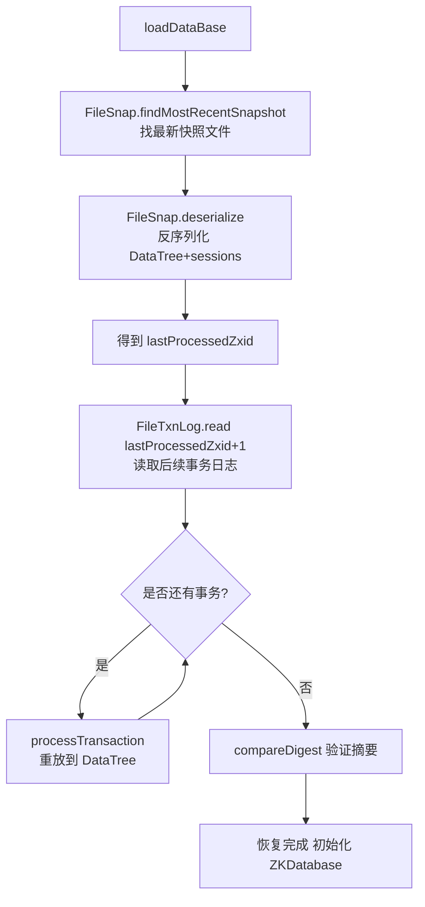
```mermaid
flowchart TD
    A[loadDataBase] --> B[FileSnap.findMostRecentSnapshot<br/>找最新快照文件]
    B --> C[FileSnap.deserialize<br/>反序列化 DataTree+sessions]
    C --> D[得到 lastProcessedZxid]
    D --> E[FileTxnLog.read lastProcessedZxid+1<br/>读取后续事务日志]
    E --> F{是否还有事务?}
    F -->|是| G[processTransaction<br/>重放到 DataTree]
    G --> F
    F -->|否| H[compareDigest 验证摘要]
    H --> I[恢复完成 初始化 ZKDatabase]
```

关键源码位于 `ZKDatabase.loadDataBase()` 与 `FileTxnSnapLog.restore()`：

```java
public long loadDataBase() throws IOException {
    long zxid = snapLog.restore(dataTree, sessionsWithTimeouts, commitProposalPlaybackListener);
    initialized = true;
    return zxid;
}

public long restore(DataTree dt, Map<Long,Integer> sessions, PlayBackListener listener) {
    long deserializeResult = snapLog.deserialize(dt, sessions);  // 1. 读快照
    // 2. 重放事务日志
    long highestZxid = fastForwardFromEdits(dt, sessions, listener);
    return highestZxid;
}
```

### 3.3 关键配置项

| 配置项 | 默认值 | 说明 |
|--------|--------|------|
| `tickTime` | 3000ms | ZK 基本时间单位 |
| `initLimit` | 10 | Follower 初始连接 Leader 的 tick 数 |
| `syncLimit` | 5 | Leader 与 Follower 心跳超时 tick 数 |
| `dataDir` | - | 快照与事务日志目录 |
| `dataLogDir` | =dataDir | 事务日志目录（建议独立磁盘） |
| `clientPort` | 2181 | 客户端连接端口 |
| `maxClientCnxns` | 60 | 单 IP 最大连接数 |
| `autopurge.snapRetainCount` | 3 | 自动清理保留快照数 |
| `autopurge.purgeInterval` | 0 | 自动清理间隔（小时，0 关闭） |
| `serverCnxnFactory` | NIOServerCnxnFactory | 连接工厂实现 |
| `leaderServes` | yes | Leader 是否接受客户端连接 |

---

## 四、网络通信机制

### 4.1 服务端网络通信

#### 4.1.1 ServerCnxnFactory 抽象基类

`org.apache.zookeeper.server.ServerCnxnFactory`

是服务端连接工厂的抽象基类，定义所有连接工厂的标准接口：

- **核心属性**：
  - `sessionMap`：`ConcurrentHashMap<Long, ServerCnxn>`，会话 ID 到连接的映射
  - `cnxns`：`ConcurrentSet<ServerCnxn>`，所有活跃连接集合
  - `maxCnxns`：全局最大连接数限制
  - `secure`：是否为 SSL 加密连接

- **静态工厂方法**：
  ```java
  static public ServerCnxnFactory createFactory() throws IOException {
      String serverCnxnFactoryName = System.getProperty(ZOOKEEPER_SERVER_CNXN_FACTORY);
      if (serverCnxnFactoryName == null) {
          serverCnxnFactoryName = NIOServerCnxnFactory.class.getName();
      }
      // 反射创建实例，默认 NIOServerCnxnFactory
  }
  ```

#### 4.1.2 NIOServerCnxnFactory（NIO 实现）

采用**主从 Reactor 多线程模型**：

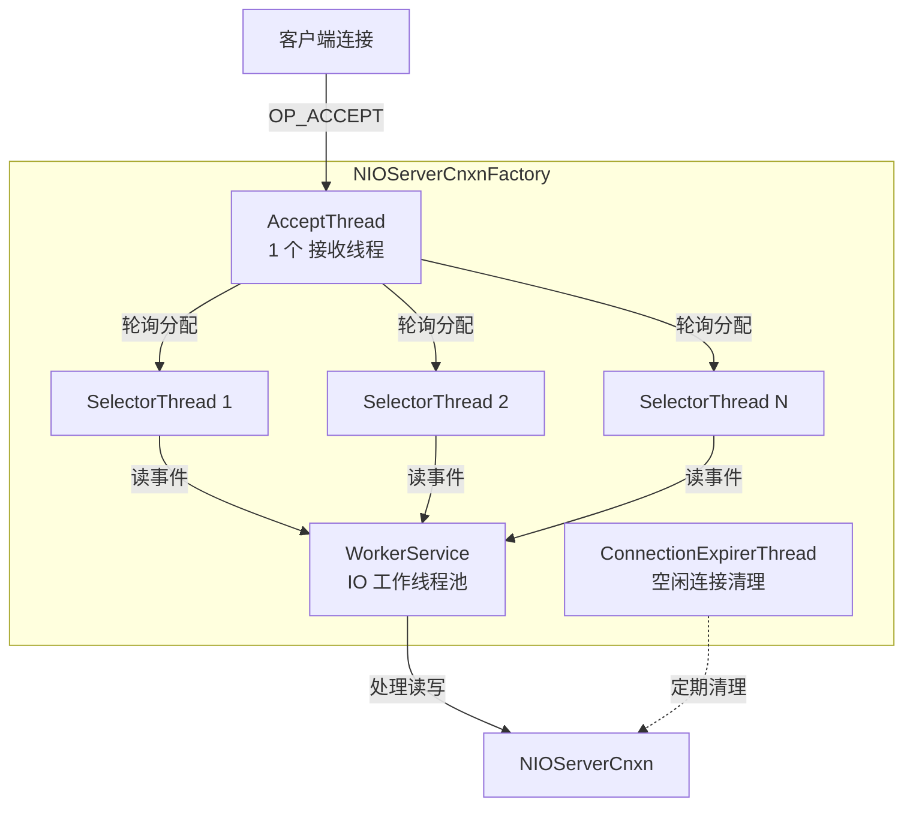
```mermaid
graph TB
    subgraph NIOServerCnxnFactory
        AT[AcceptThread<br/>1 个 接收线程]
        SS1[SelectorThread 1]
        SS2[SelectorThread 2]
        SSN[SelectorThread N]
        WP[WorkerService<br/>IO 工作线程池]
        CE[ConnectionExpirerThread<br/>空闲连接清理]
    end

    C[客户端连接] -->|OP_ACCEPT| AT
    AT -->|轮询分配| SS1
    AT -->|轮询分配| SS2
    AT -->|轮询分配| SSN
    SS1 -->|读事件| WP
    SS2 -->|读事件| WP
    SSN -->|读事件| WP
    WP -->|处理读写| SC[NIOServerCnxn]
    CE -.->|定期清理| SC
```

**线程模型**：
- **1 个 AcceptThread**：监听并接受新客户端连接，进行 IP 连接数限制检查，将连接按 round-robin 分配给 SelectorThread
- **N 个 SelectorThread**（默认 `cpu 核数 / 2`，最少 1）：每个线程维护一个 Selector，处理多个客户端连接的 IO 事件
- **M 个 IOWorkRequest 线程池**（`WorkerService`）：处理实际的 Socket 读写操作，避免阻塞 Selector 线程
- **1 个 ConnectionExpirerThread**：定期关闭空闲且未建立 Session 的连接

**关键流程**：
1. AcceptThread 接受新连接 → 创建 `NIOServerCnxn` → 分配给 SelectorThread
2. SelectorThread 处理 OP_READ：读取字节 → 反序列化请求 → 提交到 WorkerService 处理
3. WorkerService 调用 `ZooKeeperServer.processPacket()` 或 `processConnectRequest()` 处理请求
4. 处理完成后通过 SelectorThread 注册 OP_WRITE 写回响应

#### 4.1.3 NettyServerCnxnFactory（Netty 实现）

基于 Netty 框架的高性能实现：

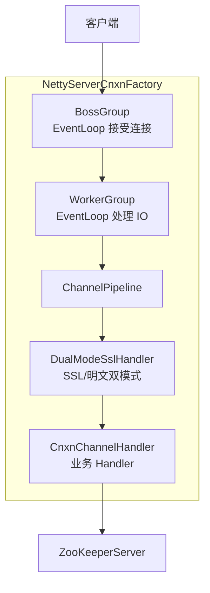
```mermaid
graph TB
    subgraph NettyServerCnxnFactory
        BG[BossGroup<br/>EventLoop 接受连接]
        WG[WorkerGroup<br/>EventLoop 处理 IO]
        PL[ChannelPipeline]
        SSL[DualModeSslHandler<br/>SSL/明文双模式]
        ZKH[CnxnChannelHandler<br/>业务 Handler]
    end

    C[客户端] --> BG
    BG --> WG
    WG --> PL
    PL --> SSL
    SSL --> ZKH
    ZKH --> ZKS[ZooKeeperServer]
```

**特性**：
- 端口统一（SSL 与明文连接共享同一端口）
- TLS 握手限流
- X.509 证书认证
- 高级流量控制（水位线 watermark）

#### 4.1.4 ServerCnxn 抽象类与具体实现

- `ServerCnxn` 抽象类：定义 `sendResponse()`、`sendCloseSession()`、`sendBuffer()`、`disableRecv()/enableRecv()`（流量控制）、`process()`（处理 Watch 事件）等抽象方法
- `NIOServerCnxn`：基于 `SocketChannel`，维护输入输出缓冲区，处理半包读写，支持 4 字命令
- `NettyServerCnxn`：基于 Netty Channel，使用 `ByteBuf` 高效内存管理

#### 4.1.5 连接限流：BlueThrottle

`org.apache.zookeeper.server.BlueThrottle` 实现了**令牌桶 + BLUE 队列管理**算法：

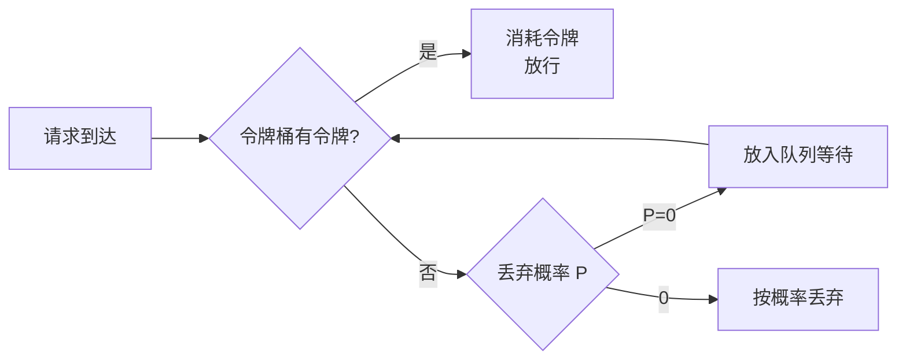
```mermaid
flowchart LR
    R[请求到达] --> T{令牌桶有令牌?}
    T -->|是| C[消耗令牌<br/>放行]
    T -->|否| P{丢弃概率 P}
    P -->|P=0| Q[放入队列等待]
    P -->|0<P<1| RD[按概率丢弃]
    Q --> T
```

- **令牌桶**：`maxTokens` 初始令牌数，每 `fillTime` 毫秒补充 `fillCount` 个
- **BLUE 概率丢弃**：令牌桶空时增加丢弃概率，使用率低于阈值时降低丢弃概率，动态适应负载
- **会话加权限流**：全局会话权重 3、本地会话权重 1、会话更新权重 2

### 4.2 客户端网络通信

#### 4.2.1 ClientCnxn 核心类

`org.apache.zookeeper.ClientCnxn` 是客户端连接的核心实现：

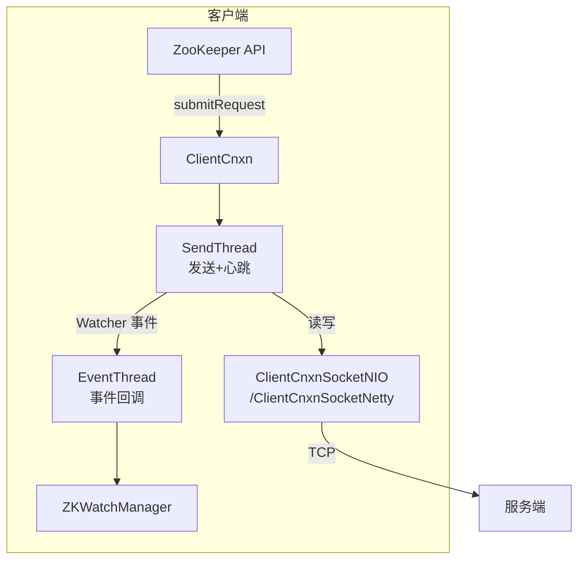
```mermaid
graph TB
    subgraph 客户端
        ZK[ZooKeeper API]
        WM[ZKWatchManager]
        CC[ClientCnxn]
        ST[SendThread<br/>发送+心跳]
        ET[EventThread<br/>事件回调]
        CCS[ClientCnxnSocketNIO<br/>/ClientCnxnSocketNetty]
    end

    ZK -->|submitRequest| CC
    CC --> ST
    ST -->|读写| CCS
    CCS -->|TCP| S[服务端]
    ST -->|Watcher 事件| ET
    ET --> WM
```

- **`SendThread`**：发送线程，负责将请求队列中的数据包发送到服务端，处理连接建立、心跳维持、重连
- **`EventThread`**：事件线程，从 `waitingEvents` 队列取出 Watch 事件和异步回调，分发到对应的 Watcher
- **`ClientCnxnSocket`**：底层 Socket 通信抽象，有 `ClientCnxnSocketNIO` 和 `ClientCnxnSocketNetty` 两种实现

#### 4.2.2 连接建立与心跳流程

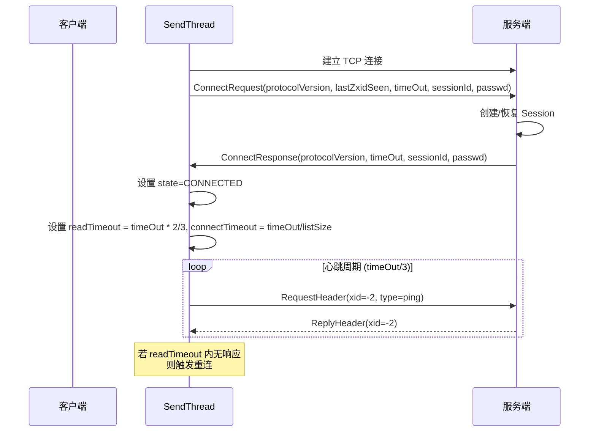
```mermaid
sequenceDiagram
    participant C as 客户端
    participant ST as SendThread
    participant S as 服务端

    ST->>S: 建立 TCP 连接
    ST->>S: ConnectRequest(protocolVersion, lastZxidSeen, timeOut, sessionId, passwd)
    S->>S: 创建/恢复 Session
    S->>ST: ConnectResponse(protocolVersion, timeOut, sessionId, passwd)
    ST->>ST: 设置 state=CONNECTED
    ST->>ST: 设置 readTimeout = timeOut * 2/3, connectTimeout = timeOut/listSize
    loop 心跳周期 (timeOut/3)
        ST->>S: RequestHeader(xid=-2, type=ping)
        S-->>ST: ReplyHeader(xid=-2)
    end
    Note over ST: 若 readTimeout 内无响应<br/>则触发重连
```

**特殊 xid 值**：
| xid 值 | 含义 |
|--------|------|
| -1 | Watch 通知（服务端主动推送，非请求-响应） |
| -2 | Ping 心跳请求 |
| -4 | Auth 认证请求 |
| -11 | CloseSession 关闭连接请求 |

---

## 五、通信协议与序列化

### 5.1 ZooKeeper 自定义协议格式

ZooKeeper 使用**自定义的二进制协议**，数据包格式如下：

```
[length(4 字节)][xid(4 字节)][type(4 字节)][payload(length 字节)]
```

| 字段 | 长度 | 说明 |
|------|------|------|
| length | 4 字节 | payload 长度（不包含 length 本身和 xid、type） |
| xid | 4 字节 | 交易 ID，用于匹配请求与响应 |
| type | 4 字节 | 请求/响应类型（OpCode） |
| payload | 可变 | 序列化后的协议数据 |

> **注意**：ConnectRequest/ConnectResponse 是例外，没有 xid 和 type 字段，作为连接建立的首包直接发送。

### 5.2 请求头与响应头

```java
// 请求头
public class RequestHeader implements Record {
    int xid;    // 交易 ID
    int type;   // 请求类型 OpCode
}

// 响应头
public class ReplyHeader implements Record {
    int xid;        // 对应请求的交易 ID
    long zxid;      // 服务端处理该请求时最新的 zxid
    int err;        // 错误码（0 表示成功）
}
```

### 5.3 连接建立消息

```java
// 客户端连接请求
public class ConnectRequest implements Record {
    int protocolVersion;    // 协议版本
    long lastZxidSeen;      // 客户端最后看到的 zxid
    int timeOut;            // 期望的会话超时时间
    long sessionId;         // 会话 ID（首次为 0）
    byte[] passwd;           // 会话密码（首次为空）
}

// 服务端连接响应
public class ConnectResponse implements Record {
    int protocolVersion;    // 协议版本
    int timeOut;            // 服务端确认的超时时间
    long sessionId;         // 服务端分配的会话 ID
    byte[] passwd;           // 会话密码
}
```

### 5.4 操作类型 OpCode

所有操作类型定义在 `ZooDefs.OpCode`：

| OpCode | 值 | 说明 |
|--------|----|------|
| create | 1 | 创建节点 |
| delete | 2 | 删除节点 |
| exists | 3 | 检查节点是否存在 |
| getData | 4 | 获取节点数据 |
| setData | 5 | 设置节点数据 |
| getACL | 6 | 获取 ACL |
| setACL | 7 | 设置 ACL |
| getChildren | 8 | 获取子节点列表 |
| sync | 9 | 同步等待 |
| ping | 11 | 心跳 |
| getChildren2 | 12 | 获取子节点+状态 |
| check | 13 | 版本检查（乐观锁） |
| multi | 16 | 多操作事务 |
| reconfig | 16 | 动态重配置 |
| createSession | -10 | 创建会话 |
| closeSession | -11 | 关闭会话 |
| error | -1 | 错误 |
| auth | 100 | 认证请求 |
| setWatches | 101 | 批量设置 Watcher |
| sasl | 102 | SASL 认证 |
| checkWatches | 17 | 检查 Watcher |
| removeWatches | 18 | 移除 Watcher |
| createContainer | 19 | 创建容器节点 |
| deleteContainer | 20 | 删除容器节点 |
| createTTL | 21 | 创建 TTL 节点 |
| addWatch | 106 | 添加持久/递归 Watcher |
| getAllChildrenNumber | 105 | 获取所有子孙数量 |

### 5.5 序列化框架：Jute

ZooKeeper 自研跨语言序列化框架 `zookeeper-jute`。

#### 5.5.1 核心接口

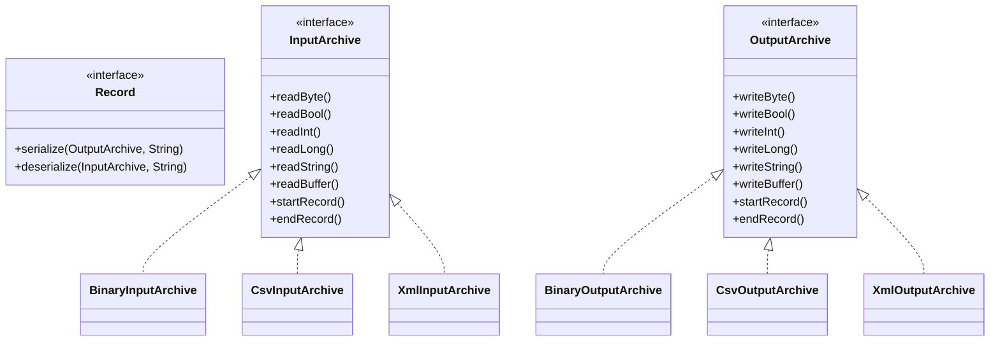
```mermaid
classDiagram
    class Record {
        <<interface>>
        +serialize(OutputArchive, String)
        +deserialize(InputArchive, String)
    }
    class InputArchive {
        <<interface>>
        +readByte()
        +readBool()
        +readInt()
        +readLong()
        +readString()
        +readBuffer()
        +startRecord()
        +endRecord()
    }
    class OutputArchive {
        <<interface>>
        +writeByte()
        +writeBool()
        +writeInt()
        +writeLong()
        +writeString()
        +writeBuffer()
        +startRecord()
        +endRecord()
    }
    class BinaryInputArchive
    class BinaryOutputArchive
    class CsvInputArchive
    class CsvOutputArchive
    class XmlInputArchive
    class XmlOutputArchive

    InputArchive <|.. BinaryInputArchive
    InputArchive <|.. CsvInputArchive
    InputArchive <|.. XmlInputArchive
    OutputArchive <|.. BinaryOutputArchive
    OutputArchive <|.. CsvOutputArchive
    OutputArchive <|.. XmlOutputArchive
```

- **`Record` 接口**：所有可序列化类必须实现，定义 `serialize()` 和 `deserialize()` 方法
- **`InputArchive`/`OutputArchive`**：序列化抽象接口，有 Binary、Csv、Xml 三种实现，ZooKeeper 主要使用 `BinaryInputArchive`/`BinaryOutputArchive`

#### 5.5.2 序列化流程

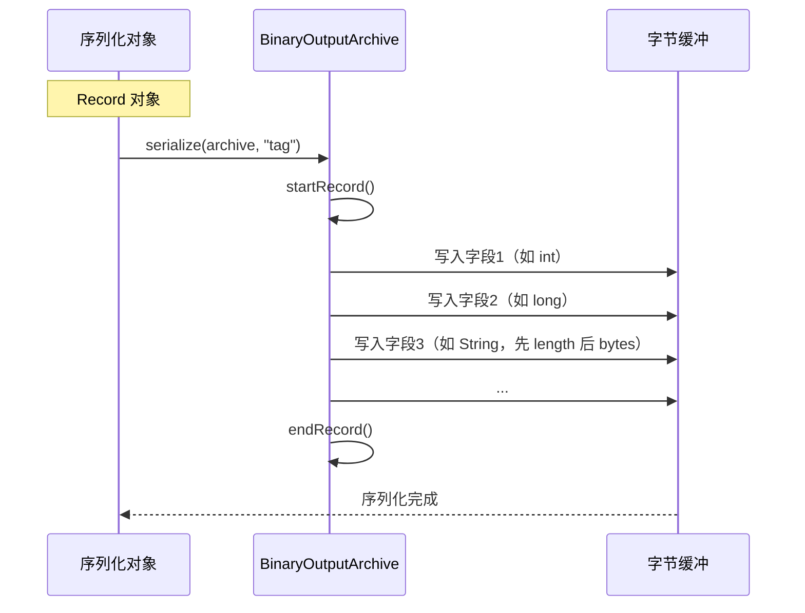
```mermaid
sequenceDiagram
    participant S as 序列化对象
    participant OA as BinaryOutputArchive
    participant B as 字节缓冲

    Note over S: Record 对象
    S->>OA: serialize(archive, "tag")
    OA->>OA: startRecord()
    OA->>B: 写入字段1（如 int）
    OA->>B: 写入字段2（如 long）
    OA->>B: 写入字段3（如 String，先 length 后 bytes）
    OA->>B: ...
    OA->>OA: endRecord()
    B-->>S: 序列化完成
```

#### 5.5.3 IDL 代码生成机制

Jute 使用 IDL 文件 `zookeeper-jute/src/main/resources/zookeeper.jute` 定义数据结构，通过 JavaCC 编写的编译器 `rcc.jj` 解析并生成代码：

```
module org.apache.zookeeper.proto {
    class RequestHeader {
        int xid;
        int type;
    }
    class ConnectRequest {
        int protocolVersion;
        long lastZxidSeen;
        int timeOut;
        long sessionId;
        buffer passwd;
    }
    // ... 其他协议类
}
```

构建流程在 Maven 的 `generate-sources` 阶段执行代码生成，生成 Java、C、C# 等多种语言的序列化类，自动实现 `Record` 接口和序列化方法。

---

## 六、Session 机制实现原理

### 6.1 SessionTracker 接口

`org.apache.zookeeper.server.SessionTracker` 是会话管理核心接口：

- 内部接口 `Session`：封装会话基本信息（ID、超时、关闭状态）
- 内部接口 `SessionExpirer`：会话过期处理器
- 核心方法：`createSession()` / `trackSession()` / `commitSession()` / `touchSession()` / `removeSession()` / `setSessionClosing()` / `checkSession()`

### 6.2 SessionTrackerImpl 核心实现

`org.apache.zookeeper.server.SessionTrackerImpl` 是标准实现：

#### 6.2.1 核心数据结构

```java
// 会话 ID 到会话对象的映射
protected final ConcurrentHashMap<Long, SessionImpl> sessionsById = new ConcurrentHashMap<>();
// 过期队列，使用时间桶管理会话过期
private final ExpiryQueue<SessionImpl> sessionExpiryQueue;
// 会话 ID 到超时时间的映射
protected final ConcurrentMap<Long, Integer> sessionsWithTimeout;
// 会话 ID 生成器原子类
private final AtomicLong nextSessionId = new AtomicLong();
```

#### 6.2.2 会话 ID 生成算法

```java
public static long initializeNextSessionId(long id) {
    long nextSid;
    // 中间 48 位: 当前时间戳
    nextSid = (Time.currentElapsedTime() << 24) >>> 8;
    // 高 8 位: 服务器 ID
    nextSid = nextSid | (id << 56);
    // 避免与容器临时节点所有者 ID 冲突
    if (nextSid == EphemeralType.CONTAINER_EPHEMERAL_OWNER) {
        ++nextSid;
    }
    return nextSid;
}
```

**64 位会话 ID 结构**：

```
[ 8 位 serverId ][ 48 位时间戳 ][ 8 位保留 ]
```

这种设计保证了**分布式环境下会话 ID 的唯一性**，每个服务器使用自己的 serverId 生成会话 ID 不会冲突。

#### 6.2.3 会话桶（Buckets）与 ExpiryQueue

`ExpiryQueue` 是会话过期管理的核心组件：

```java
// 元素 -> 过期时间戳
private final ConcurrentHashMap<E, Long> elemMap;
// 过期时间戳 -> 元素集合（时间桶）
private final ConcurrentHashMap<Long, Set<E>> expiryMap;
// 下一个过期时间戳
private final AtomicLong nextExpirationTime;
// 过期检查间隔
private final int expirationInterval;
```

**核心思想**：将会话按过期时间分桶到不同的时间戳槽位中，过期检查时只需扫描最早的一个桶，避免遍历所有会话。

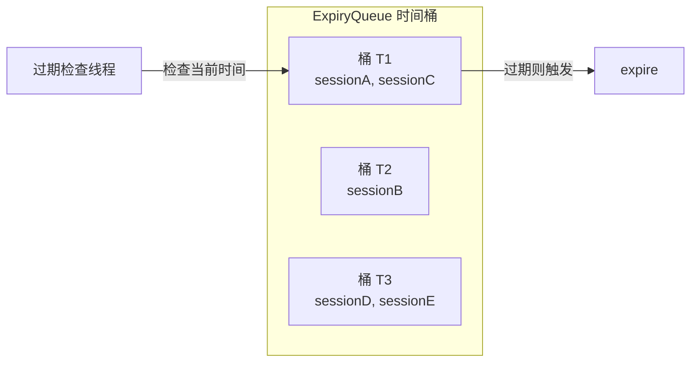
```mermaid
graph LR
    subgraph ExpiryQueue 时间桶
        B1[桶 T1<br/>sessionA, sessionC]
        B2[桶 T2<br/>sessionB]
        B3[桶 T3<br/>sessionD, sessionE]
    end
    T[过期检查线程] -->|检查当前时间| B1
    B1 -->|过期则触发| EX[expire]
```

`update()` 方法逻辑：
1. 计算新过期时间 `newExpiryTime = roundToNextInterval(now + timeout)`，对齐到 `expirationInterval` 整数倍
2. 若与旧时间相同则无需更新
3. 添加到新时间桶，从旧时间桶移除

#### 6.2.4 会话过期检查线程

```java
@Override
public void run() {
    while (running) {
        long waitTime = sessionExpiryQueue.getWaitTime();
        if (waitTime > 0) {
            Thread.sleep(waitTime);
            continue;
        }
        // 处理所有过期的会话
        for (SessionImpl s : sessionExpiryQueue.poll()) {
            setSessionClosing(s.sessionId);
            expirer.expire(s);  // 触发过期回调
        }
    }
}
```

### 6.3 会话激活与续约

```java
public synchronized boolean touchSession(long sessionId, int sessionTimeout) {
    SessionImpl s = sessionsById.get(sessionId);
    if (s == null) return false;
    if (s.isClosing()) return false;
    updateSessionExpiry(s, timeout);  // 更新过期时间桶
    return true;
}
```

`ZooKeeperServer` 中的会话操作：

```java
// 激活会话
public boolean touch(long sessionId, int sessionTimeout) {
    return sessionTracker.touchSession(sessionId, sessionTimeout);
}
// 续约会话
public int renewSession(long sessionId, int sessionTimeout) {
    if (!sessionTracker.touchSession(sessionId, sessionTimeout)) return -1;
    return sessionTracker.getSessionTimeout(sessionId);
}
// 关闭会话
public void closeSession(long sessionId) {
    sessionTracker.setSessionClosing(sessionId);
    sessionTracker.removeSession(sessionId);
}
```

### 6.4 集群模式差异

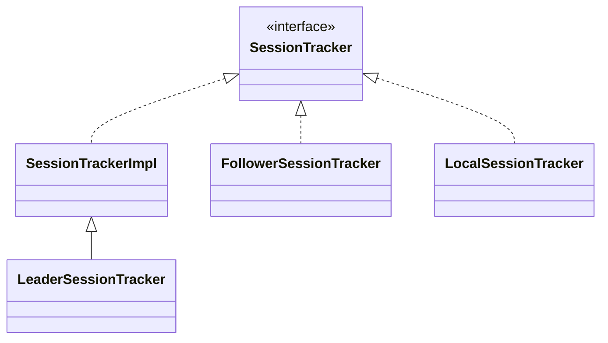
```mermaid
classDiagram
    class SessionTracker {
        <<interface>>
    }
    class SessionTrackerImpl
    class LeaderSessionTracker
    class FollowerSessionTracker
    class LocalSessionTracker

    SessionTracker <|.. SessionTrackerImpl
    SessionTrackerImpl <|-- LeaderSessionTracker
    SessionTracker <|.. FollowerSessionTracker
    SessionTracker <|.. LocalSessionTracker
```

- **Standalone 模式**：使用标准 `SessionTrackerImpl`
- **Leader 模式**：使用 `LeaderSessionTracker`（扩展 `SessionTrackerImpl`），管理全局会话，支持本地会话升级
- **Follower 模式**：使用 `FollowerSessionTracker`，仅作为代理转发会话操作到 Leader
- **LocalSessionTracker**：本地会话跟踪器，用于只读/转发场景下的本地会话管理

### 6.5 客户端 Session 状态机

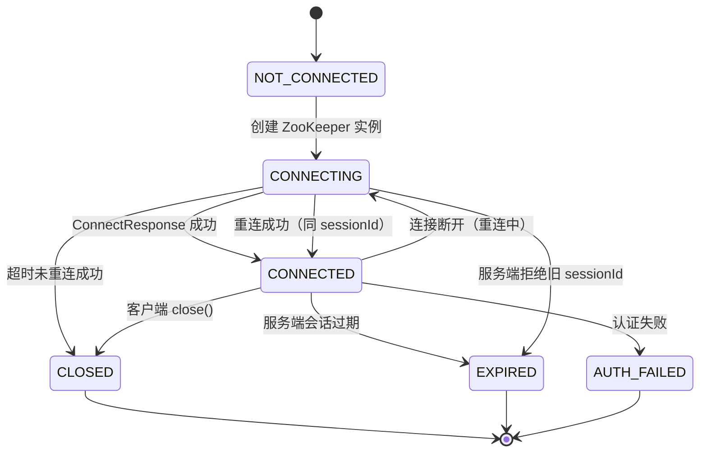
```mermaid
stateDiagram-v2
    [*] --> NOT_CONNECTED
    NOT_CONNECTED --> CONNECTING: 创建 ZooKeeper 实例
    CONNECTING --> CONNECTED: ConnectResponse 成功
    CONNECTED --> CONNECTING: 连接断开（重连中）
    CONNECTING --> CONNECTED: 重连成功（同 sessionId）
    CONNECTING --> CLOSED: 超时未重连成功
    CONNECTED --> CLOSED: 客户端 close()
    CONNECTED --> AUTH_FAILED: 认证失败
    CONNECTED --> EXPIRED: 服务端会话过期
    CONNECTING --> EXPIRED: 服务端拒绝旧 sessionId
    CLOSED --> [*]
    EXPIRED --> [*]
    AUTH_FAILED --> [*]
```

客户端在 `ClientCnxn.SendThread` 中维持心跳：
- **readTimeout = timeOut × 2/3**：超过此时间未收到任何响应则触发重连
- **connectTimeout = timeOut / listSize**：连接建立超时时间
- **心跳周期 = timeOut / 3**：定期发送 ping（xid=-2）续约会话

### 6.6 会话生命周期时序图

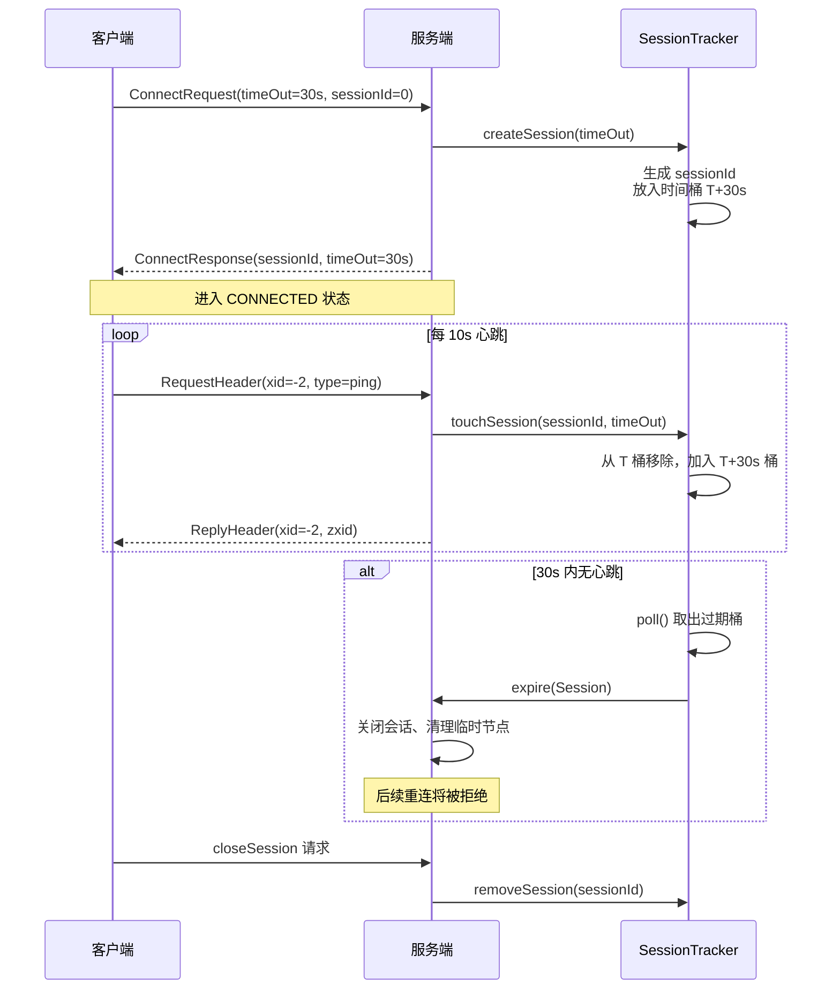
```mermaid
sequenceDiagram
    participant C as 客户端
    participant S as 服务端
    participant ST as SessionTracker

    C->>S: ConnectRequest(timeOut=30s, sessionId=0)
    S->>ST: createSession(timeOut)
    ST->>ST: 生成 sessionId<br/>放入时间桶 T+30s
    S-->>C: ConnectResponse(sessionId, timeOut=30s)
    Note over C,S: 进入 CONNECTED 状态
    loop 每 10s 心跳
        C->>S: RequestHeader(xid=-2, type=ping)
        S->>ST: touchSession(sessionId, timeOut)
        ST->>ST: 从 T 桶移除，加入 T+30s 桶
        S-->>C: ReplyHeader(xid=-2, zxid)
    end
    alt 30s 内无心跳
        ST->>ST: poll() 取出过期桶
        ST->>S: expire(Session)
        S->>S: 关闭会话、清理临时节点
        Note over S: 后续重连将被拒绝
    end
    C->>S: closeSession 请求
    S->>ST: removeSession(sessionId)
```

---

## 七、Watcher 机制实现原理

### 7.1 Watcher 核心接口

`org.apache.zookeeper.Watcher` 接口：

```java
public interface Watcher {
    // 事件类型
    public enum EventType {
        None (-1),
        NodeCreated (1),
        NodeDeleted (2),
        NodeDataChanged (3),
        NodeChildrenChanged (4),
        DataWatchRemoved (5),
        ChildWatchRemoved (6),
        PersistentWatchRemoved (7);
    }
    // 连接状态
    public enum KeeperState {
        Unknown (-1),
        Disconnected (0),
        SyncConnected (3),
        Expired (-112),
        Closed;
    }
    // 处理事件
    void process(WatchedEvent event);
}
```

`WatchedEvent` 包含三个字段：`KeeperState keeperState`、`EventType eventType`、`String path`。

### 7.2 服务端 WatchManager 体系

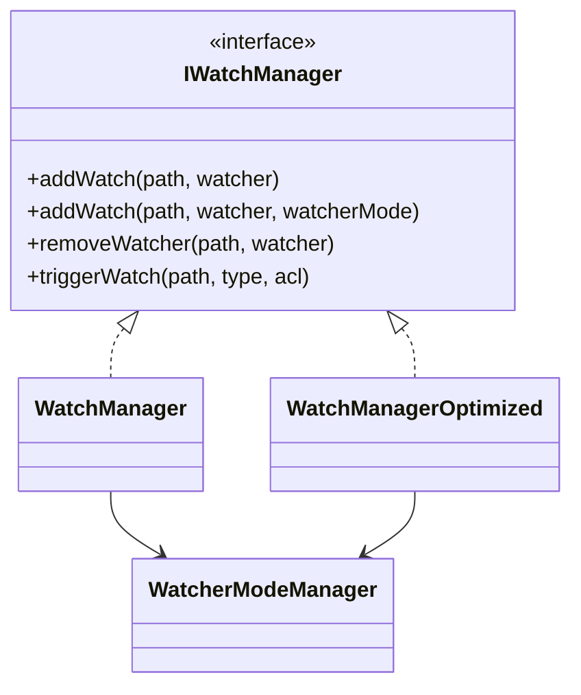
```mermaid
classDiagram
    class IWatchManager {
        <<interface>>
        +addWatch(path, watcher)
        +addWatch(path, watcher, watcherMode)
        +removeWatcher(path, watcher)
        +triggerWatch(path, type, acl)
    }
    class WatchManager
    class WatchManagerOptimized
    class WatcherModeManager

    IWatchManager <|.. WatchManager
    IWatchManager <|.. WatchManagerOptimized
    WatchManager --> WatcherModeManager
    WatchManagerOptimized --> WatcherModeManager
```

#### 7.2.1 WatchManager 标准实现

`org.apache.zookeeper.server.watch.WatchManager` 使用**双层 Map**数据结构：

```java
// 路径 -> 监听器集合
private final Map<String, Set<Watcher>> watchTable = new HashMap<>();
// 监听器 -> 路径集合
private final Map<Watcher, Set<String>> watch2Paths = new HashMap<>();
```

**添加 Watcher**：
```java
public synchronized boolean addWatch(String path, Watcher watcher, WatcherMode watcherMode) {
    Set<Watcher> list = watchTable.get(path);
    if (list == null) {
        list = new HashSet<>(4);
        watchTable.put(path, list);
    }
    list.add(watcher);

    Set<String> paths = watch2Paths.get(watcher);
    if (paths == null) {
        paths = new HashSet<>();
        watch2Paths.put(watcher, paths);
    }
    watcherModeManager.setWatcherMode(watcher, path, watcherMode);
    return paths.add(path);
}
```

**双层 Map 设计意图**：
- `watchTable`：根据路径快速查找监听器（触发时使用）
- `watch2Paths`：根据监听器快速查找路径（连接关闭清理时使用）

#### 7.2.2 WatchManagerOptimized 优化实现

使用 `BitSet` 和读写锁优化性能，减少内存占用：

```java
// 路径 -> BitHashSet
private final ConcurrentHashMap<String, BitHashSet> pathWatches = new ConcurrentHashMap<>();
// 监听器 -> BitID
private final BitMap<Watcher> watcherBitIdMap = new BitMap<>();
// 读写锁减少锁竞争
private final ReentrantReadWriteLock addRemovePathRWLock = new ReentrantReadWriteLock();
```

通过 `BitMap` 给每个 Watcher 分配一个 bit 位，触发时只传 bit 集合而非 Watcher 引用，减少序列化开销。

### 7.3 客户端 ZKWatchManager

`org.apache.zookeeper.ZKWatchManager` 实现客户端 Watcher 管理：

```java
class ZKWatchManager implements ClientWatchManager {
    private final Map<String, Set<Watcher>> dataWatches = new HashMap<>();
    private final Map<String, Set<Watcher>> existWatches = new HashMap<>();
    private final Map<String, Set<Watcher>> childWatches = new HashMap<>();
    private final Map<String, Set<Watcher>> persistentWatches = new HashMap<>();
    private final Map<String, Set<Watcher>> persistentRecursiveWatches = new HashMap<>();
}
```

**关键点**：`exists` 操作的 Watcher 单独存储，因为节点不存在时也可注册（节点创建时触发）。

### 7.4 Watcher 触发流程

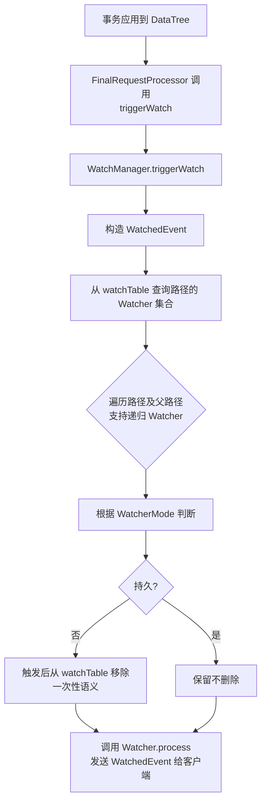
```mermaid
flowchart TD
    A[事务应用到 DataTree] --> B[FinalRequestProcessor 调用<br/>triggerWatch]
    B --> C[WatchManager.triggerWatch]
    C --> D[构造 WatchedEvent]
    D --> E[从 watchTable 查询路径的 Watcher 集合]
    E --> F{遍历路径及父路径<br/>支持递归 Watcher}
    F --> G[根据 WatcherMode 判断]
    G --> H{持久?}
    H -->|否| I[触发后从 watchTable 移除<br/>一次性语义]
    H -->|是| J[保留不删除]
    I --> K[调用 Watcher.process<br/>发送 WatchedEvent 给客户端]
    J --> K
```

`triggerWatch` 核心代码：

```java
public WatcherOrBitSet triggerWatch(String path, EventType type, List<ACL> acl, WatcherOrBitSet suppress) {
    WatchedEvent e = new WatchedEvent(type, KeeperState.SyncConnected, path);
    Set<Watcher> watchers = new HashSet<>();
    PathParentIterator pathParentIterator = getPathParentIterator(path);

    synchronized (this) {
        for (String localPath : pathParentIterator.asIterable()) {
            Set<Watcher> thisWatchers = watchTable.get(localPath);
            if (thisWatchers == null || thisWatchers.isEmpty()) continue;

            Iterator<Watcher> iterator = thisWatchers.iterator();
            while (iterator.hasNext()) {
                Watcher watcher = iterator.next();
                WatcherMode watcherMode = watcherModeManager.getWatcherMode(watcher, localPath);
                if (watcherMode.isRecursive()) {
                    if (type != EventType.NodeChildrenChanged) {
                        watchers.add(watcher);
                    }
                } else if (!pathParentIterator.atParentPath()) {
                    watchers.add(watcher);
                    // 非持久监听器触发后移除
                    if (!watcherMode.isPersistent()) {
                        iterator.remove();
                        Set<String> paths = watch2Paths.get(watcher);
                        if (paths != null) paths.remove(localPath);
                    }
                }
            }
            if (thisWatchers.isEmpty()) watchTable.remove(localPath);
        }
    }

    // 触发所有监听器
    for (Watcher w : watchers) {
        if (suppress != null && suppress.contains(w)) continue;
        if (w instanceof ServerWatcher) {
            ((ServerWatcher) w).process(e, acl);
        } else {
            w.process(e);
        }
    }
    return new WatcherOrBitSet(watchers);
}
```

### 7.5 客户端事件处理：EventThread

```java
class EventThread extends Thread {
    private final Queue<WatcherEvent> waitingEvents = new LinkedBlockingQueue<>();

    @Override
    public void run() {
        while (true) {
            processEvent(waitingEvents.take());
        }
    }

    private void processEvent(WatcherEvent event) {
        // 从监听器管理器获取需要触发的监听器
        Set<Watcher> watchers = watchManager.materialize(event.state, event.type, event.path);
        // 触发所有监听器
        for (Watcher w : watchers) {
            w.process(new WatchedEvent(event.type, event.state, event.path));
        }
    }
}
```

### 7.6 Watcher 三种模式

| 模式 | 说明 |
|------|------|
| **DEFAULT** | 一次性触发后自动删除（标准 Watcher） |
| **PERSISTENT** | 永久有效，不会自动删除，可被多次触发 |
| **PERSISTENT_RECURSIVE** | 递归永久监听器，监控当前路径及所有子路径的变更 |

通过 `ZooDefs.AddWatchModes`：`persistent(1)` 与 `persistentRecursive(2)`。

### 7.7 完整交互时序图

```mermaid
sequenceDiagram
    participant C as 客户端
    participant CC as ClientCnxn
    participant S as 服务端
    participant WM as WatchManager
    participant DT as DataTree
    participant ET as EventThread

    C->>CC: getData(path, watcher)
    CC->>S: GetDataRequest(path, watch=true)
    S->>DT: 读取数据
    S->>WM: addWatch(path, ServerWatcher)
    S-->>CC: GetDataResponse(data, stat)
    CC-->>C: data

    Note over C,S: 后续某客户端修改了 path
    C2->>S: setData(path, newData)
    S->>DT: 应用事务
    S->>WM: triggerWatch(path, NodeDataChanged)
    WM->>WM: 从 watchTable 取出 watcher 集合<br/>移除非持久的
    WM->>S: WatchedEvent 通知
    S->>CC: 发送 Watch 通知（xid=-1）
    CC->>ET: 入队 waitingEvents
    ET->>ET: materialize 取出 client-side watcher
    ET->>C: watcher.process(WatchedEvent)
    Note over C: 客户端若需继续监听<br/>需重新注册
```

### 7.8 Watcher 设计要点

1. **一次性触发**：标准 Watcher 触发后即移除，需客户端重新注册才能继续监听
2. **服务端存储**：Watcher 实际存储在服务端（`ServerWatcher` 包装了 `ServerCnxn`），客户端只保存引用
3. **轻量级**：通知内容只有 `path + eventType`，不包含变更后的数据，客户端需主动拉取
4. **顺序性**：客户端收到的 Watch 事件顺序与服务端事务应用顺序一致
5. **持久 Watcher（3.6+）**：通过 `addWatch` API 注册持久/递归监听器，解决频繁注册的开销

---

## 八、Leader 选举实现原理

### 8.1 选举触发与入口

#### 8.1.1 QuorumPeer.run() 状态机

选举由 `QuorumPeer.run()` 主循环触发，当 `peerState == LOOKING` 时进入选举：

```java
public void run() {
    while (running) {
        switch (getPeerState()) {
            case LOOKING:
                // 启动选举
                setCurrentVote(makeLEStrategy().lookForLeader());
                break;
            case OBSERVING:
                observeLeader();
                break;
            case FOLLOWING:
                followLeader();
                break;
            case LEADING:
                lead();
                break;
        }
    }
}
```

#### 8.1.2 Election 接口与 FastLeaderElection

```java
public interface Election {
    Vote lookForLeader() throws InterruptedException;
    void shutdown();
}
```

`FastLeaderElection` 是默认选举算法实现（早期还有 `LeaderElection` 与 `AuthFastLeaderElection`，已被废弃）。

### 8.2 消息格式

#### 8.2.1 Notification（通知消息）

```java
public static class Notification {
    public static final int CURRENTVERSION = 0x2;
    int version;
    long leader;              // 提议的 Leader ID
    long zxid;                // 提议 Leader 的最新 zxid
    long electionEpoch;       // 选举纪元
    QuorumPeer.ServerState state;  // 发送者状态
    long sid;                 // 发送者 ID
    QuorumVerifier qv;        // 集群配置
    long peerEpoch;           // 发送者纪元
}
```

#### 8.2.2 ToSend（待发送消息）

```java
public static class ToSend {
    enum mType { crequest, challenge, notification, ack }
    long leader;
    long zxid;
    long electionEpoch;
    QuorumPeer.ServerState state;
    long sid;
    byte[] configData;
    long peerEpoch;
}
```

### 8.3 选举架构与组件

```mermaid
graph TB
    subgraph FastLeaderElection
        FLE[lookForLeader<br/>选举主循环]
        SQ[sendqueue<br/>待发送队列]
        RQ[recvqueue<br/>已接收队列]
        MSG[Messenger]
        WS[WorkerSender<br/>从 sendqueue 取出并发送]
        WR[WorkerReceiver<br/>接收并解析为 Notification]
    end

    subgraph QuorumCnxManager
        QL[Listener<br/>监听选举端口]
        RS[RecvQueue 各节点]
        SS[SendQueue 各节点]
        QCM[管理所有 TCP 连接]
    end

    FLE --> SQ
    FLE --> RQ
    SQ --> WS
    RQ --> WR
    WS --> QCM
    WR --> QCM
    QL --> QCM
    QCM -->|TCP| Other[其他节点]
```

- **`QuorumCnxManager`**：集群连接管理器，负责建立并维护所有服务器间的 TCP 连接（每对节点仅一条连接，按 serverId 大小决定连接方向）
  - `Listener`：监听选举端口
  - `RecvQueue` / `SendQueue`：每节点一对收发队列
- **`Messenger`**：FastLeaderElection 内部类，包含 `WorkerReceiver` 与 `WorkerSender`
- **`WorkerReceiver`**：从 QuorumCnxManager 接收网络消息，解析为 `Notification`，放入 `recvqueue`
- **`WorkerSender`**：从 `sendqueue` 取出 `ToSend`，序列化后通过 QuorumCnxManager 发送

### 8.4 lookForLeader() 核心流程

```mermaid
flowchart TD
    A[lookForLeader 开始] --> B[注册 JMX bean]
    B --> C[递增 logicalclock 选举纪元]
    C --> D[更新本地提议<br/>投自己 leader=自己<br/>zxid=lastLoggedZxid<br/>peerEpoch=lastEpoch]
    D --> E[sendNotifications<br/>广播初始选票]
    E --> F{recvqueue.poll<br/>等待选票}
    F -->|超时| G[增大 notTimeout<br/>最多到 initLimit*initLimit]
    G --> F
    F -->|收到 Notification| H{发送者状态}
    H -->|LOOKING| I[处理 LOOKING 选票]
    H -->|FOLLOWING/LEADING| J[处理已选出 Leader 的通知]
    I --> K[过滤无效 sid]
    K --> L[put 收到的选票到 recvset]
    L --> M[totalOrderPredicate<br/>比较优劣]
    M -->|更优| N[更新本地提议<br/>重新广播]
    M -->|不更优| O[保持本地提议]
    N --> P[getVoteTracker<br/>检查多数派]
    O --> P
    P -->|未达多数| F
    P -->|达多数派| Q[等待 finalizeWait<br/>收集后续更优选票]
    Q --> R{状态变更}
    R -->|leader == 自己| S[setPeerState LEADING]
    R -->|leader != 自己| T[setPeerState FOLLOWING]
    S --> U[返回 Vote]
    T --> U
```

#### 8.4.1 选票比较算法：totalOrderPredicate

```java
protected boolean totalOrderPredicate(long newId, long newZxid, long newEpoch,
                                        long curId, long curZxid, long curEpoch) {
    return ((newEpoch > curEpoch) ||
            ((newEpoch == curEpoch) &&
             ((newZxid > curZxid) ||
              ((newZxid == curZxid) && (newId > curId)))));
}
```

**比较顺序**（从高到低）：

1. **peerEpoch（纪元）**：越大越优（代表经历了更多 Leader 切换）
2. **zxid（事务 ID）**：越大越优（代表数据越新）
3. **myid（服务器 ID）**：越大越优（确保最终收敛，避免活锁）

#### 8.4.2 多数派判定：QuorumVerifier

```java
// QuorumMaj 经典多数派
public boolean containsQuorum(Set<Long> ackSet) {
    return (ackSet.size() > half);  // half = votingMembers.size() / 2
}
```

`QuorumVerifier` 体系：
- `QuorumMaj`：简单多数派（最常用）
- `QuorumHierarchical`：分层验证器，支持多数据中心权重配置
- `QuorumOracleMaj`：带 Oracle 的多数派验证器，支持脑裂防护

### 8.5 选举完整时序图

```mermaid
sequenceDiagram
    participant L as 节点L (myid=1)
    participant F1 as 节点F1 (myid=2)
    participant F2 as 节点F2 (myid=3)

    Note over L,F2: 三节点集群，假设同时启动

    L->>L: logicalclock=1, 投自己 (leader=1, zxid=zxid1)
    F1->>F1: logicalclock=1, 投自己 (leader=2, zxid=zxid2)
    F2->>F2: logicalclock=1, 投自己 (leader=3, zxid=zxid3)

    L->>F1: 广播 Notification(leader=1)
    L->>F2: 广播 Notification(leader=1)
    F1->>L: 广播 Notification(leader=2)
    F1->>F2: 广播 Notification(leader=2)
    F2->>L: 广播 Notification(leader=3)
    F2->>F1: 广播 Notification(leader=3)

    Note over L: 收到 (2, zxid2)，比较 zxid2 > zxid1<br/>更新提议为 (leader=2)
    L->>L: 更新 leader=2
    L->>F1: 重新广播 (leader=2)
    L->>F2: 重新广播 (leader=2)
    Note over F1: 收到 (2, zxid2) == 自己<br/>recvset.put(1, vote(2))
    Note over F2: 收到 (2, zxid2) 比较 (3, zxid3)<br/>若 zxid2 > zxid3 则更新

    Note over L,F2: ... 收敛过程 ...

    Note over L: recvset 收到 {1,2,3} 全投 leader=2<br/>超过半数 (2 > 3/2=1)
    L->>L: 等待 finalizeWait
    Note over L: 没有收到更优选票<br/>setPeerState(FOLLOWING)
    Note over F1: 自身就是 leader<br/>setPeerState(LEADING)
    Note over F2: 同样判定 leader=2<br/>setPeerState(FOLLOWING)
```

### 8.6 选举完成后的连接建立

#### 8.6.1 Follower.followLeader()

```mermaid
sequenceDiagram
    participant F as Follower
    participant L as Leader
    participant LH as LearnerHandler

    F->>F: findLeader() 查找 Leader 地址
    F->>L: 建立 TCP 连接
    F->>L: FOLLOWERINFO(lastZxid, configData)
    L->>L: 为该 Follower 创建 LearnerHandler
    L->>F: LEADERINFO(peerEpoch)
    F->>L: ACKEPOCH
    L->>L: syncFollower(peerLastZxid)<br/>决定 DIFF/SNAP/TRUNC
    alt DIFF
        L->>F: PROPOSAL 事务 (差异部分)
        L->>F: NEWLEADER
    else TRUNC
        L->>F: TRUNC + 差异事务 + NEWLEADER
    else SNAP
        L->>F: SNAP 全量快照 + NEWLEADER
    end
    F->>F: 应用同步数据
    F->>L: ACK NEWLEADER
    L->>L: 收集半数 ACK NEWLEADER
    L->>F: UPTODATE (可以处理客户端请求)
    Note over F: 进入正常 FOLLOWING 状态<br/>开始处理 PROPOSAL/COMMIT
```

#### 8.6.2 Leader.lead()

```java
public void lead() throws IOException, InterruptedException {
    cnxAcceptor = new LearnerCnxAcceptor();  // 启动连接接收器
    cnxAcceptor.start();
    heartbeat();                              // 启动心跳线程
    requestProcessor.processRequest(null);   // 启动请求处理循环
}
```

### 8.7 数据同步的三种模式

`LearnerHandler.syncFollower(peerLastZxid)` 决策：

```mermaid
flowchart TD
    A[peerLastZxid 报告] --> B{peerLastZxid == lastProcessedZxid?}
    B -->|是| C[空 DIFF<br/>无需同步]
    B -->|否| D{peerLastZxid > maxCommittedLog?}
    D -->|是| E[TRUNC 截断<br/>回退到 maxCommittedLog]
    D -->|否| F{minCommittedLog <= peerLastZxid <= maxCommittedLog?}
    F -->|是| G[TRUNC 已提交之外的事务<br/>+ DIFF 差异同步]
    F -->|否| H{peerLastZxid < minCommittedLog}
    H -->|是| I[从磁盘事务日志加载<br/>若仍不够则 SNAP]
    H -->|否| I
    I --> J{事务日志覆盖?}
    J -->|是| G
    J -->|否| K[SNAP 全量快照]
```

| 模式 | 触发条件 | 处理方式 |
|------|---------|---------|
| **DIFF** | Follower 落后少量事务 | 发送差异部分的事务 |
| **TRUNC** | Follower 有 Leader 不存在的事务（旧 Leader 已 commit 未广播） | 截断本地日志 |
| **SNAP** | Follower 落后过多，事务日志已覆盖 | 发送完整数据快照 |

### 8.8 选举关键源码索引

| 类 / 方法 | 文件路径 |
|-----------|---------|
| `QuorumPeer.run()` | `zookeeper-server/src/main/java/org/apache/zookeeper/server/quorum/QuorumPeer.java:1412` |
| `FastLeaderElection.lookForLeader()` | `.../quorum/FastLeaderElection.java:913` |
| `FastLeaderElection.totalOrderPredicate()` | `.../quorum/FastLeaderElection.java:723` |
| `FastLeaderElection.Notification` | `.../quorum/FastLeaderElection.java:112` |
| `QuorumCnxManager` | `.../quorum/QuorumCnxManager.java` |
| `LearnerHandler.syncFollower()` | `.../quorum/LearnerHandler.java:779` |
| `Leader.lead()` | `.../quorum/Leader.java` |
| `Follower.followLeader()` | `.../quorum/Follower.java` |

---

## 九、ZAB 一致性协议实现原理

### 9.1 ZAB 协议概述

ZAB（ZooKeeper Atomic Broadcast）是 ZooKeeper 自研的原子广播协议，专为**主备模式**的分布式协调服务设计，保证事务广播的原子性和顺序性。

#### 9.1.1 ZAB 与 Paxos 的对比

| 维度 | ZAB | Paxos |
|------|-----|-------|
| 角色定位 | 明确固定 Leader 角色 | 无固定 Leader，动态选举 Proposer |
| 阶段划分 | 发现同步 + 广播两个独立阶段 | Prepare + Accept 两个核心阶段 |
| 顺序保证 | 严格按 ZXID 顺序执行事务 | 需额外机制保证请求顺序 |
| 实现目标 | 专为日志广播和状态机复制优化 | 通用一致性算法 |
| 可用性 | Leader 正常则集群可用 | 需多数节点达成一致 |
| Leader 切换 | 必须重新选举并同步数据 | Proposer 可动态变更 |

#### 9.1.2 ZAB 四个阶段

`QuorumPeer.ZabState` 枚举：

```java
public enum ZabState {
    ELECTION,        // 选举阶段
    DISCOVERY,       // 发现阶段：收集 Follower 状态
    SYNCHRONIZATION, // 同步阶段：数据同步
    BROADCAST        // 广播阶段：正常服务
}
```

```mermaid
stateDiagram-v2
    [*] --> ELECTION
    ELECTION --> DISCOVERY: 选举出 Leader
    DISCOVERY --> SYNCHRONIZATION: 收集 Follower zxid
    SYNCHRONIZATION --> BROADCAST: 数据同步完成
    BROADCAST --> ELECTION: Leader 崩溃
    BROADCAST --> [*]: 关闭
```

### 9.2 阶段一：发现与同步

```mermaid
sequenceDiagram
    participant L as Leader
    participant LH as LearnerHandler
    participant F as Follower

    Note over L: Leader 选举完成，进入 DISCOVERY

    loop 每个 Follower
        F->>L: FOLLOWERINFO(lastZxid, configData)
        L->>L: new LearnerHandler(followerSocket)
        L->>F: LEADERINFO(peerEpoch)
        F->>L: ACKEPOCH
    end

    Note over L: 收集完所有 Follower 状态<br/>决定最大 epoch<br/>进入 SYNCHRONIZATION

    loop 每个 Follower
        L->>L: syncFollower(peerLastZxid)
        alt DIFF
            L->>F: PROPOSAL 差异事务
        else TRUNC
            L->>F: TRUNC + PROPOSAL
        else SNAP
            L->>F: SNAP 完整快照
        end
        L->>F: NEWLEADER
        F->>L: ACK NEWLEADER
    end

    Note over L: 收集半数 ACK NEWLEADER<br/>进入 BROADCAST
    L->>F: UPTODATE
```

### 9.3 阶段二：广播（两阶段提交 2PC）

#### 9.3.1 Leader.propose() 方法

```java
public Proposal propose(Request request) throws XidRolloverException {
    // 1. 检查 ZXID 溢出（低 32 位计数器溢出）
    if ((request.zxid & 0xffffffffL) == 0xffffffffL) {
        shutdown("zxid lower 32 bits have rolled over, forcing re-election");
        throw new XidRolloverException(msg);
    }

    // 2. 序列化请求
    byte[] data = SerializeUtils.serializeRequest(request);
    QuorumPacket pp = new QuorumPacket(Leader.PROPOSAL, request.zxid, data, null);

    Proposal p = new Proposal();
    p.packet = pp;
    p.request = request;

    synchronized (this) {
        p.addQuorumVerifier(self.getQuorumVerifier());
        lastProposed = p.packet.getZxid();
        // 加入未提交提案 Map
        outstandingProposals.put(lastProposed, p);
        // 3. 广播给所有 Follower
        sendPacket(pp);
    }
    return p;
}
```

#### 9.3.2 Leader.processAck() 与 tryToCommit()

```java
public synchronized void processAck(long sid, long zxid, SocketAddress followerAddr) {
    if (lastCommitted >= zxid) return;  // 已提交的不再处理

    Proposal p = outstandingProposals.get(zxid);
    if (p == null) return;

    p.addAck(sid);  // 添加 ACK
    tryToCommit(p, zxid, followerAddr);  // 尝试提交
}

public synchronized boolean tryToCommit(Proposal p, long zxid, SocketAddress followerAddr) {
    // 1. 检查是否达到多数派
    if (!p.hasAllQuorums()) return false;

    // 2. 检查前序提案是否已提交（保证顺序）
    Proposal proposal = outstandingProposals.first();
    if (proposal == null) return false;
    if (proposal.request != null && proposal.zxid != zxid) return false;

    // 3. 从 outstandingProposals 移除
    outstandingProposals.remove(zxid);

    // 4. 加入 toBeApplied 队列
    if (request != null) toBeApplied.add(p);

    // 5. 广播 COMMIT
    QuorumPacket qp = new QuorumPacket(Leader.COMMIT, zxid, null, null);
    sendPacket(qp);

    // 6. Leader 本地提交
    commit(zxid);
    informWatchers = true;
    lastCommitted = zxid;

    return true;
}
```

#### 9.3.3 半数 ACK 判定

```java
// QuorumMaj 经典多数派
public boolean containsQuorum(Set<Long> ackSet) {
    return (ackSet.size() > half);
}
```

#### 9.3.4 完整广播时序图

```mermaid
sequenceDiagram
    participant C as 客户端
    participant L as Leader
    participant F1 as Follower1
    participant F2 as Follower2

    C->>L: setData(path, data)
    L->>L: PrepRequestProcessor 校验+生成事务
    L->>L: SyncRequestProcessor 写 WAL 日志
    L->>L: propose(request) 分配 zxid
    L->>F1: PROPOSAL(zxid, txn)
    L->>F2: PROPOSAL(zxid, txn)
    par 并行处理
        F1->>F1: SyncRequestProcessor 写本地 WAL
        F1->>L: ACK(zxid)
    and
        F2->>F2: SyncRequestProcessor 写本地 WAL
        F2->>L: ACK(zxid)
    end
    Note over L: 收到 F1 的 ACK<br/>hasAllQuorums = false<br/>（需半数）
    Note over L: 收到 F2 的 ACK<br/>hasAllQuorums = true
    L->>L: tryToCommit
    L->>L: 从 outstandingProposals 移除<br/>加入 toBeApplied
    L->>F1: COMMIT(zxid)
    L->>F2: COMMIT(zxid)
    par 并行处理
        F1->>F1: CommitProcessor 唤醒<br/>FinalRequestProcessor 应用到 DataTree
    and
        F2->>F2: CommitProcessor 唤醒<br/>FinalRequestProcessor 应用到 DataTree
    end
    L->>L: FinalRequestProcessor 应用到 DataTree<br/>触发 Watcher
    L-->>C: ReplyHeader(zxid, err=0)
```

### 9.4 消息类型

`Leader` 类定义的 QuorumPacket 类型：

| 消息类型 | 编号 | 用途 |
|---------|------|------|
| `PROPOSAL` | 2 | Leader 发起的事务提案 |
| `ACK` | 3 | Follower 确认提案已落地 |
| `COMMIT` | 4 | Leader 通知提交事务 |
| `UPTODATE` | 4 | 同步完成，可处理客户端请求 |
| `DIFF` | 13 | 增量同步事务日志 |
| `TRUNC` | 14 | 截断本地事务日志 |
| `SNAP` | 15 | 全量数据快照同步 |
| `PING` | 5 | Leader 心跳 |
| `REVALIDATE` | 6 | 重新校验 Session |
| `FOLLOWERINFO` | 11 | Follower 上报状态 |
| `OBSERVERINFO` | 11 | Observer 上报状态 |
| `LEADERINFO` | 12 | Leader 上报 epoch |
| `ACKEPOCH` | 16 | Follower ACK epoch |
| `NEWLEADER` | 10 | 新 Leader 通知 |
| `INFORM` | 17 | Observer 同步提交（不带事务数据） |

### 9.5 ZXID 机制

#### 9.5.1 ZXID 结构

64 位整数，分两部分：

```
[ 高 32 位: epoch ][ 低 32 位: counter ]
```

```java
public static long getEpochFromZxid(long zxid) { return zxid >> 32L; }
public static long getCounterFromZxid(long zxid) { return zxid & 0xffffffffL; }
public static long makeZxid(long epoch, long counter) {
    return (epoch << 32L) | (counter & 0xffffffffL);
}
```

**设计意义**：
- **epoch**：Leader 任期编号，每次 Leader 切换时 +1，保证新 Leader 的事务不会与旧 Leader 冲突
- **counter**：同一 Leader 任期内的事务序列号，单调递增

#### 9.5.2 ZXID 生成与分配

```java
// ZooKeeperServer 中
long getNextZxid() {
    return hzxid.incrementAndGet();
}
```

#### 9.5.3 epoch 切换

新 Leader 当选时：
1. 新 Leader 的 epoch = 旧 Leader epoch + 1
2. 初始 ZXID 为 `makeZxid(newEpoch, 0)`
3. 通过 `NEWLEADER` 包广播新纪元信息

```mermaid
flowchart LR
    A[旧 Leader<br/>epoch=5, counter=1000] -->|崩溃| B[重新选举]
    B --> C[新 Leader<br/>epoch=6, counter=0]
    C --> D[首笔事务<br/>zxid=6*2^32+1]
```

### 9.6 集群模式核心组件

```mermaid
classDiagram
    class QuorumPeer {
        -ServerState peerState
        -QuorumVerifier quorumVerifier
        -FileTxnSnapLog txnLogFactory
        +run()
        +makeLeader()
        +makeFollower()
        +makeObserver()
    }
    class LearnerMaster {
        <<interface>>
    }
    class Leader
    class LeaderZooKeeperServer
    class Learner
    class Follower
    class Observer
    class LearnerHandler
    class FollowerZooKeeperServer
    class ObserverZooKeeperServer

    LearnerMaster <|.. Leader
    Learner <|-- Follower
    Learner <|-- Observer
    QuorumPeer --> Leader : makeLeader
    QuorumPeer --> Follower : makeFollower
    QuorumPeer --> Observer : makeObserver
    Leader --> LearnerHandler : 每个 Learner 一个
    LeaderZooKeeperServer --|> ZooKeeperServer
    FollowerZooKeeperServer --|> ZooKeeperServer
    ObserverZooKeeperServer --|> ZooKeeperServer
```

- **`Leader`**：实现 Leader 核心逻辑，管理提案、ACK 收集、提交决策，维护 `outstandingProposals` 和 `toBeApplied` 队列
- **`LeaderZooKeeperServer`**：Leader 服务器实现，配置专属请求处理器链
- **`Follower`**：Follower 节点核心逻辑，与 Leader 通信、转发请求
- **`FollowerZooKeeperServer`**：Follower 服务器实现
- **`Observer`** / **`ObserverZooKeeperServer`**：Observer 节点逻辑，不参与投票
- **`Learner`**：抽象基类，封装 Follower 和 Observer 的共同逻辑
- **`LearnerHandler`**：Leader 为每个 Learner 创建独立连接处理器，负责通信和数据同步
- **`LearnerMaster`**：LearnerHandler 的上层抽象接口

### 9.7 Leader 关键数据结构

```java
// Leader 类
Map<Long, Proposal> outstandingProposals;  // 未提交提案，key=zxid
ConcurrentLinkedQueue<Proposal> toBeApplied; // 已提交待应用提案
List<LearnerHandler> forwardingFollowers;   // 参与 ACK 的 Follower 列表
List<LearnerHandler> observingLearners;     // Observer 列表
long lastProposed;    // 最后提案的 zxid
long lastCommitted;   // 最后提交的 zxid
```

---

## 十、读写请求处理流程

### 10.1 RequestProcessor 接口与责任链模式

```java
public interface RequestProcessor {
    void processRequest(Request request) throws RequestProcessorException;
    void shutdown();
}
```

采用**责任链设计模式**，每个处理器实现接口并持有下一个处理器的引用。请求按顺序在链中传递，每个处理器完成特定处理后转发。

### 10.2 单机模式请求处理链

`ZooKeeperServer.setupRequestProcessors()`：

```java
protected void setupRequestProcessors() {
    RequestProcessor finalProcessor = new FinalRequestProcessor(this);
    RequestProcessor syncProcessor = new SyncRequestProcessor(this, finalProcessor);
    ((SyncRequestProcessor) syncProcessor).start();
    firstProcessor = new PrepRequestProcessor(this, syncProcessor);
    ((PrepRequestProcessor) firstProcessor).start();
}
```

```mermaid
graph LR
    A[请求] --> P[PrepRequestProcessor<br/>校验+ACL+生成事务]
    P --> S[SyncRequestProcessor<br/>写WAL+刷盘+触发snapshot]
    S --> F[FinalRequestProcessor<br/>应用DataTree+触发Watcher+响应]
```

### 10.3 Leader 模式请求处理链

`LeaderZooKeeperServer.setupRequestProcessors()`：

```java
protected void setupRequestProcessors() {
    RequestProcessor finalProcessor = new FinalRequestProcessor(this);
    RequestProcessor toBeAppliedProcessor = new Leader.ToBeAppliedRequestProcessor(finalProcessor, getLeader());
    commitProcessor = new CommitProcessor(toBeAppliedProcessor, Long.toString(getServerId()), false, getZooKeeperServerListener());
    commitProcessor.start();
    ProposalRequestProcessor proposalProcessor = new ProposalRequestProcessor(this, commitProcessor);
    proposalProcessor.initialize();
    prepRequestProcessor = new PrepRequestProcessor(this, proposalProcessor);
    prepRequestProcessor.start();
    firstProcessor = new LeaderRequestProcessor(this, prepRequestProcessor);
}
```

```mermaid
graph LR
    A[请求] --> LRP[LeaderRequestProcessor<br/>会话升级等前置处理]
    LRP --> P[PrepRequestProcessor<br/>校验+ACL+生成事务]
    P --> PR[ProposalRequestProcessor<br/>发起提案+调Sync]
    PR --> L[Leader.propose<br/>广播 PROPOSAL]
    PR --> S[SyncRequestProcessor<br/>Leader 写 WAL]
    PR --> C[CommitProcessor<br/>等待半数ACK]
    C --> T[ToBeAppliedRequestProcessor<br/>移除已应用提案]
    T --> F[FinalRequestProcessor<br/>应用+触发Watcher+响应]
```

**`ProposalRequestProcessor` 关键代码**：

```java
public void processRequest(Request request) throws RequestProcessorException {
    if (request.getHdr() != null) {
        // 1. Leader 发起提案（广播 PROPOSAL 给 Follower）
        zks.getLeader().propose(request);
        // 2. Leader 写本地 WAL
        syncProcessor.processRequest(request);
    }
    // 3. 转发给 CommitProcessor 等待 ACK
    nextProcessor.processRequest(request);
}
```

### 10.4 Follower 模式请求处理链

`FollowerZooKeeperServer.setupRequestProcessors()`：

```java
protected void setupRequestProcessors() {
    RequestProcessor finalProcessor = new FinalRequestProcessor(this);
    commitProcessor = new CommitProcessor(finalProcessor, Long.toString(getServerId()), true, getZooKeeperServerListener());
    commitProcessor.start();
    firstProcessor = new FollowerRequestProcessor(this, commitProcessor);
    ((FollowerRequestProcessor) firstProcessor).start();
    syncProcessor = new SyncRequestProcessor(this, new SendAckRequestProcessor(getFollower()));
    syncProcessor.start();
}
```

```mermaid
graph LR
    A[请求] --> F[FollowerRequestProcessor<br/>读本地处理<br/>写转发Leader]
    F -->|读请求| F1[FinalRequestProcessor<br/>本地读取]
    F -->|写请求| FL[转发给Leader<br/>queuePacket]
    FL -.->|等待 Leader COMMIT<br/>通过 INFORM/COMMIT| C[CommitProcessor]
    C --> F2[FinalRequestProcessor<br/>应用+响应]
    FL2[Leader PROPOSAL] --> S[SyncRequestProcessor<br/>Follower 写WAL]
    S --> SA[SendAckRequestProcessor<br/>回 ACK 给 Leader]
```

**`FollowerRequestProcessor` 转发逻辑**：

```java
switch (request.type) {
    case OpCode.create:
    case OpCode.delete:
    case OpCode.setData:
    case OpCode.setACL:
    case OpCode.createSession:
    case OpCode.closeSession:
    case OpCode.multi:
    case OpCode.reconfig:
        zks.getFollower().request(request);  // 转发到 Leader
        break;
    // 读请求本地处理
}
```

### 10.5 Observer 模式请求处理链

`ObserverZooKeeperServer.setupRequestProcessors()`：

```mermaid
graph LR
    A[请求] --> O[ObserverRequestProcessor<br/>转发写请求给Leader]
    O --> C[CommitProcessor]
    C --> F[FinalRequestProcessor]
    O2[Leader INFORM] --> S[SyncRequestProcessor<br/>Observer 写WAL]
    S --> F
```

Observer 与 Follower 类似，但**不发送 ACK**，仅接收 Leader 的 INFORM 消息应用事务。

### 10.6 各 Processor 详细职责

#### 10.6.1 PrepRequestProcessor

- 参数合法性校验（路径长度、字符集）
- ACL 权限检查（`fixupACL` 处理 AUTH_IDS）
- 为写请求生成 `TxnHeader` 和 `Record`（事务对象）
- 会话有效性检查
- 处理 CreateMode、EphemeralType
- 递归创建父节点

#### 10.6.2 SyncRequestProcessor

- 预写日志（WAL）到磁盘
- 批量刷盘操作提高 IO 效率
- 达到阈值时触发数据快照
- 使用 `LinkedBlockingQueue` 缓冲请求

```java
public void run() {
    while (true) {
        Request si = queuedRequests.poll();
        if (si == null) {
            flush();
            si = queuedRequests.take();
        }
        // 追加事务到 WAL
        if (zks.getZKDatabase().append(si)) {
            // 累计事务数
            if (zks.getZKDatabase().getTxnCount() >= snapCount / 2 + randRoll) {
                // 触发快照
                zks.takeSnapshot();
            }
        }
        queuedFlushRequests.add(si);
    }
}
```

#### 10.6.3 CommitProcessor

```mermaid
flowchart TD
    A[请求入队] --> B{是读请求?}
    B -->|是| C[直接处理 不等待]
    B -->|否| D[加入 pendingRequests 队列]
    D --> E{收到对应 zxid 的 COMMIT?}
    E -->|否| F[阻塞等待]
    E -->|是| G[按 zxid 顺序取出]
    G --> H[转发给下游处理]
    H --> D
```

- 等待事务提交消息（Leader 的 COMMIT 或半数 ACK）
- 保证事务按 zxid 顺序处理
- 支持多线程并发处理
- 区分读写请求处理优化

#### 10.6.4 FinalRequestProcessor

```java
case OpCode.exists: {
    ExistsRequest existsRequest = new ExistsRequest();
    ByteBufferInputStream.byteBuffer2Record(request.request, existsRequest);
    path = existsRequest.getPath();
    Stat stat = zks.getZKDatabase().statNode(path, existsRequest.getWatch() ? cnxn : null);
    rsp = new ExistsResponse(stat);
    break;
}
case OpCode.setData:
    // 应用事务到 DataTree
    rc = zks.processTxn(request);
    // 触发 Watcher
    if (rc.hdr.getType() == OpCode.setData) {
        zks.getZKDatabase().getDataTree().triggerWatch(path, EventType.NodeDataChanged);
    }
    rsp = new SetDataResponse(rc.stat);
    break;
```

#### 10.6.5 ProposalRequestProcessor

- 调用 `Leader.propose()` 发起集群提案
- 将请求转发给 `SyncRequestProcessor` 进行日志刷盘
- 处理 Learner 同步请求

#### 10.6.6 ToBeAppliedRequestProcessor

- 维护已提交但未应用的提案列表 `toBeApplied`
- 事务应用后从列表中移除
- 确保事务严格按顺序应用

### 10.7 读写请求对比

| 维度 | 读请求 | 写请求 |
|------|--------|--------|
| OpCode | exists/getData/getChildren/getACL | create/delete/setData/setACL/multi |
| 是否生成事务 | 否 | 是（TxnHeader + Record） |
| Leader 协商 | 否 | 是（2PC） |
| 顺序保证 | 弱（最终一致性） | 强（线性一致性） |
| 数据来源 | 本地 DataTree | Leader 提案 + 全集群应用 |

### 10.8 RequestThrottler 请求限流

`org.apache.zookeeper.server.RequestThrottler`：

- 限制并发请求数量，弥补连接层限流的不足
- 配置项：
  - `maxRequests`：最大并发请求数，默认 0（不限制）
  - `stallTime`：阻塞等待时间，默认 100ms
  - `dropStaleRequests`：是否丢弃过期请求，默认 true

### 10.9 完整请求处理时序图（集群写请求）

```mermaid
sequenceDiagram
    participant C as 客户端
    participant FL as Follower
    participant LD as Leader
    participant F1 as Follower1
    participant F2 as Follower2

    C->>FL: setData(path, data)

    Note over FL: FollowerRequestProcessor
    FL->>FL: PrepRequestProcessor 校验+生成事务
    FL->>LD: queuePacket(写请求转发)

    Note over LD: LeaderRequestProcessor
    LD->>LD: PrepRequestProcessor 校验+生成事务
    LD->>LD: ProposalRequestProcessor
    LD->>LD: 分配 zxid = hzxid++
    LD->>LD: SyncRequestProcessor 写 WAL
    LD->>F1: PROPOSAL(zxid, txn)
    LD->>F2: PROPOSAL(zxid, txn)
    LD->>FL: PROPOSAL(zxid, txn)
    par 并行 ACK
        F1->>F1: SyncRequestProcessor 写 WAL
        F1->>LD: ACK(zxid)
    and
        F2->>F2: SyncRequestProcessor 写 WAL
        F2->>LD: ACK(zxid)
    and
        FL->>FL: SyncRequestProcessor 写 WAL
        FL->>LD: ACK(zxid)
    end

    Note over LD: processAck 收到 ACK<br/>hasAllQuorums = true
    LD->>LD: tryToCommit
    LD->>LD: 从 outstandingProposals 移除<br/>加入 toBeApplied
    LD->>F1: COMMIT(zxid)
    LD->>F2: COMMIT(zxid)
    LD->>FL: COMMIT(zxid)

    par 并行应用
        F1->>F1: CommitProcessor 唤醒<br/>FinalRequestProcessor 应用
    and
        F2->>F2: CommitProcessor 唤醒<br/>FinalRequestProcessor 应用
    and
        FL->>FL: CommitProcessor 唤醒<br/>FinalRequestProcessor 应用+触发Watcher
    end
    LD->>LD: FinalRequestProcessor 应用+触发Watcher

    FL-->>C: ReplyHeader(zxid, err=0)
```

---

## 十一、WAL 预写日志与持久化

### 11.1 ZKDatabase：内存数据库

`org.apache.zookeeper.server.ZKDatabase` 封装了 DataTree 和会话信息：

```java
protected DataTree dataTree;                                     // 内存数据树
protected ConcurrentHashMap<Long, Integer> sessionsWithTimeouts; // 会话超时信息
protected FileTxnSnapLog snapLog;                                // 事务日志和快照管理类
protected long minCommittedLog, maxCommittedLog;                 // 提交日志范围
private Queue<Proposal> committedLog = new ArrayDeque<>();       // 最近提交的提案
private AtomicInteger txnCount = new AtomicInteger(0);            // 自上次快照以来的事务数
```

### 11.2 DataTree：内存数据树

```java
private final ConcurrentHashMap<String, DataNode> nodes = new ConcurrentHashMap<>();  // 节点存储
private final NodeHashMap nodeHashMap = new NodeHashMap(this);   // 路径哈希表
private WatchManager watchManager = new WatchManager();           // 监听器管理
public long lastProcessedZxid = -1;                               // 最后处理的 zxid
private final Map<Long, HashSet<String>> ephemerals = new ConcurrentHashMap<>(); // 临时节点
```

核心方法：
- `processTxn(TxnHeader, Record)`：根据事务类型分发到 createNode/setData/deleteNode 等
- `createNode()` / `setData()` / `deleteNode()`：节点操作
- `compareDigest()`：数据摘要验证

### 11.3 DataNode 节点结构

```java
byte[] data;                  // 节点数据
Long acl;                     // 节点 ACL 的 ID 映射
public StatPersisted stat;    // 节点状态信息
private Set<String> children; // 子节点列表
private volatile long digest; // 数据摘要
volatile boolean digestCached;
```

### 11.4 WAL 事务日志格式

#### 11.4.1 文件格式

```
LogFile:
    FileHeader TxnList ZeroPad

FileHeader: {
    magic 4 字节 (ZKLG)
    version 4 字节
    dbid 8 字节
}

TxnList:
    Txn || Txn TxnList

Txn:
    checksum(8 字节 Adler32) Txnlen(4 字节) TxnHeader Record 0x42

TxnHeader: {
    sessionid 8 字节
    cxid 4 字节
    zxid 8 字节
    time 8 字节
    type 4 字节
}

Record: 序列化的事务数据（如 CreateTxn）

ZeroPad: 零填充到文件末尾（预分配空间）
```

#### 11.4.2 文件命名

事务日志文件命名 `log.<zxid>`，zxid 是该文件中第一个事务的 ID。例如 `log.0000000000000000001`。

### 11.5 FileTxnLog 核心方法

#### 11.5.1 append()

```java
public synchronized boolean append(TxnHeader hdr, Record txn, TxnDigest digest) throws IOException {
    if (hdr == null) return false;
    if (hdr.getZxid() <= lastZxidSeen) {
        LOG.warn("Current zxid {} is <= {}", hdr.getZxid(), lastZxidSeen);
    } else {
        lastZxidSeen = hdr.getZxid();
    }

    // 若日志流为空，创建新的日志文件
    if (logStream == null) {
        logFileWrite = new File(logDir, Util.makeLogName(hdr.getZxid()));
        fos = new FileOutputStream(logFileWrite);
        logStream = new BufferedOutputStream(fos);
        oa = BinaryOutputArchive.getArchive(logStream);
        FileHeader fhdr = new FileHeader(TXNLOG_MAGIC, VERSION, dbId);
        fhdr.serialize(oa, "fileheader");
        logStream.flush();
        filePadding.setCurrentSize(fos.getChannel().position());
        streamsToFlush.add(fos);
    }

    // 预分配文件空间（默认 64MB）
    filePadding.padFile(fos.getChannel());

    // 序列化事务条目
    byte[] buf = Util.marshallTxnEntry(hdr, txn, digest);

    // 计算校验和
    Checksum crc = makeChecksumAlgorithm();
    crc.update(buf, 0, buf.length);
    oa.writeLong(crc.getValue(), "txnEntryCRC");
    Util.writeTxnBytes(oa, buf);
    return true;
}
```

#### 11.5.2 commit()（强制刷盘）

```java
public synchronized void commit() throws IOException {
    if (logStream != null) {
        logStream.flush();
    }
    for (FileOutputStream log : streamsToFlush) {
        log.flush();
        if (forceSync) {
            long startSyncNS = System.nanoTime();
            FileChannel channel = log.getChannel();
            channel.force(false);  // 强制刷到磁盘
            syncElapsedMS = TimeUnit.NANOSECONDS.toMillis(System.nanoTime() - startSyncNS);
            if (syncElapsedMS > fsyncWarningThresholdMS) {
                LOG.warn("fsync-ing the write ahead log took {}ms", syncElapsedMS);
            }
        }
    }
    // 清理已刷新的流
    while (streamsToFlush.size() > 1) {
        streamsToFlush.poll().close();
    }
    // 大小限制滚动日志
    if (txnLogSizeLimit > 0) {
        long logSize = getCurrentLogSize();
        if (logSize > txnLogSizeLimit) {
            rollLog();
        }
    }
}
```

#### 11.5.3 TxnIterator

```java
public boolean next() throws IOException {
    long crcValue = ia.readLong("crcvalue");
    byte[] bytes = Util.readTxnBytes(ia);
    // 验证校验和
    Checksum crc = makeChecksumAlgorithm();
    crc.update(bytes, 0, bytes.length);
    if (crcValue != crc.getValue()) {
        throw new IOException(CRC_ERROR);
    }
    // 反序列化事务
    TxnLogEntry logEntry = SerializeUtils.deserializeTxn(bytes);
    hdr = logEntry.getHeader();
    record = logEntry.getTxn();
    digest = logEntry.getDigest();
    return true;
}
```

### 11.6 快照（Snapshot）

#### 11.6.1 快照文件格式

```
SnapshotFile:
    FileHeader SnapshotData ZeroPad

FileHeader: {
    magic 4 字节 (ZKSN)
    version 4 字节
    dbid 8 字节
}

SnapshotData:
    SessionCount(4 字节) SessionList DataTree

SessionList:
    (sessionid 8 字节 timeout 4 字节) × SessionCount

DataTree: znodes 的序列化形式
```

#### 11.6.2 serialize()

```java
public synchronized void serialize(DataTree dt, Map<Long, Integer> sessions, File snapShot, boolean fsync) throws IOException {
    try (CheckedOutputStream snapOS = SnapStream.getOutputStream(snapShot, fsync)) {
        OutputArchive oa = BinaryOutputArchive.getArchive(snapOS);
        FileHeader header = new FileHeader(SNAP_MAGIC, VERSION, dbId);
        header.serialize(oa, "fileheader");
        SerializeUtils.serializeSnapshot(dt, oa, sessions);
        SnapStream.sealStream(snapOS, oa);
        // 数据摘要
        if (dt.serializeZxidDigest(oa)) {
            SnapStream.sealStream(snapOS, oa);
        }
        lastSnapshotInfo = new SnapshotInfo(...);
    }
}
```

#### 11.6.3 触发条件

`SyncRequestProcessor.shouldSnapshot()`：

```java
private boolean shouldSnapshot() {
    int logCount = zks.getZKDatabase().getTxnCount();
    long logSize = zks.getZKDatabase().getTxnSize();
    return (logCount > (snapCount / 2 + randRoll))
        || (snapSizeInBytes > 0 && logSize > (snapSizeInBytes / 2 + randSize));
}
```

- `snapCount`：默认 100000，事务数阈值
- `snapSizeInBytes`：默认 0，事务日志总大小阈值
- `randRoll` / `randSize`：随机值，**避免所有服务器同时创建快照**

#### 11.6.4 文件命名

快照文件命名 `snapshot.<zxid>`，zxid 是该快照对应的最后一个事务 ID。

### 11.7 FileTxnSnapLog 统一管理

```java
public long restore(DataTree dt, Map<Long, Integer> sessions, PlayBackListener listener) throws IOException {
    long deserializeResult = snapLog.deserialize(dt, sessions);  // 1. 读快照
    // 2. 重放事务日志
    long highestZxid = fastForwardFromEdits(dt, sessions, listener);
    return highestZxid;
}
```

### 11.8 完整数据恢复流程

```mermaid
flowchart TD
    A[服务器启动] --> B[loadDataBase]
    B --> C[FileSnap.findMostRecentSnapshot<br/>找最新快照]
    C --> D{找到快照?}
    D -->|否| E{有事务日志?}
    E -->|否| F[空数据库启动]
    E -->|是| G{trustEmptySnapshot?}
    G -->|否| H[抛异常]
    G -->|是| I[fastForwardFromEdits<br/>从头重放]
    D -->|是| J[FileSnap.deserialize<br/>反序列化 DataTree+sessions]
    J --> K[得到 lastProcessedZxid]
    K --> L[FileTxnLog.read lastProcessedZxid+1]
    L --> M{还有事务?}
    M -->|是| N[processTransaction<br/>应用到 DataTree]
    N --> O[compareDigest 验证摘要]
    O --> M
    M -->|否| P[恢复完成]
    I --> P
    F --> P
    H --> Q[启动失败]
```

### 11.9 日志清理

#### 11.9.1 PurgeTxnLog 手动清理

`PurgeTxnLog.purge(File dataDir, File snapDir, int num)`：
- 保留 `num` 个最新快照（最少 3 个）
- 删除早于最旧保留快照的所有日志和快照

#### 11.9.2 DatadirCleanupManager 自动清理

```java
public void start() {
    if (purgeInterval <= 0) return;
    timer = new Timer("PurgeTask", true);
    TimerTask task = new PurgeTask(dataLogDir, snapDir, snapRetainCount);
    timer.scheduleAtFixedRate(task, 0, TimeUnit.HOURS.toMillis(purgeInterval));
}
```

配置项：
- `autopurge.snapRetainCount`：保留快照数，默认 3
- `autopurge.purgeInterval`：清理间隔小时，默认 0（关闭）

### 11.10 持久化整体流程图

```mermaid
graph TB
    A[写请求] --> B[PrepRequestProcessor<br/>生成 TxnHeader+Record]
    B --> C[SyncRequestProcessor]
    C --> D[FileTxnLog.append<br/>追加到 WAL]
    D --> E{事务数达阈值?}
    E -->|是| F[FileSnap.serialize<br/>序列化快照]
    E -->|否| G[FileTxnLog.commit<br/>刷盘]
    F --> H[新 log.<zxid> 文件]
    G --> I[DataTree.processTxn<br/>应用到内存]
    I --> J[FinalRequestProcessor<br/>响应客户端]
```

---

## 十二、崩溃恢复原理

### 12.1 Leader 崩溃后的恢复

```mermaid
sequenceDiagram
    participant L as Leader (崩溃)
    participant F1 as Follower1
    participant F2 as Follower2

    Note over L,F2: Leader 正常运行

    L--xF1: 心跳超时
    L--xF2: 心跳超时

    Note over F1: syncLimit tick 内未收到 Leader 消息
    F1->>F1: setPeerState(LOOKING)
    F1->>F1: shutdown 当前连接
    F1->>F1: FastLeaderElection.lookForLeader()

    Note over F2: 同样检测到失联
    F2->>F2: setPeerState(LOOKING)
    F2->>F2: FastLeaderElection.lookForLeader()

    F1->>F2: 广播初始选票
    F2->>F1: 广播初始选票

    Note over F1,F2: 选举过程...

    F1->>F1: 收集半数选票
    F1->>F1: setPeerState(LEADING)
    F2->>F2: setPeerState(FOLLOWING)

    Note over F1: 进入 lead()
    F1->>F2: NEWLEADER + 数据同步
    F2->>F1: ACK NEWLEADER
    F1->>F2: UPTODATE

    Note over F1,F2: 恢复正常服务
```

### 12.2 关键崩溃恢复场景

#### 12.2.1 Leader 已 COMMIT 未广播的提案丢失

```mermaid
flowchart TD
    A[Leader 收到写请求] --> B[分配 zxid=100]
    B --> C[广播 PROPOSAL]
    C --> D[Leader 本地 SYNC 落盘]
    D --> E[收到半数 ACK]
    E --> F[广播 COMMIT]
    F --> G[Leader 应用事务]
    F --> H[Follower 应用事务]
    G --> I{Leader 崩溃<br/>Follower 未应用?}
    H --> I
    I -->|Follower 已落盘未应用| J[新 Leader 选举]
    J --> K[新 Leader 包含该 zxid]
    K --> L[同步阶段广播该提案]
    L --> M[Follower 重新应用]
```

**关键保证**：事务一旦落盘到多数 Follower，即使原 Leader 崩溃，新 Leader 也会包含该事务并广播给所有节点应用。

#### 12.2.2 Leader 已 PROPOSE 未 COMMIT 的事务

```mermaid
flowchart TD
    A[Leader 分配 zxid=100] --> B[广播 PROPOSAL]
    B --> C[部分 Follower ACK]
    C --> D[未达半数<br/>Leader 崩溃]
    D --> E[重新选举]
    E --> F{新 Leader 是否有 zxid=100?}
    F -->|有| G[继续广播该提案<br/>收集 ACK 后 COMMIT]
    F -->|无| H[新 Leader 不广播该提案<br/>旧 Follower 通过 TRUNC 截断]
```

**关键点**：只有达到半数 ACK 的事务才会被新 Leader 提交，未达半数的会被 TRUNC 截断。

#### 12.2.3 TRUNC 截断流程

```mermaid
sequenceDiagram
    participant L as 旧 Leader (崩溃)
    participant NL as 新 Leader
    participant F as Follower (有未提交事务)

    L->>L: 分配 zxid=100<br/>写本地 WAL
    L->>F: PROPOSAL(100)
    F->>F: 写本地 WAL
    Note over L: 未达半数 ACK，Leader 崩溃
    Note over F: 本地有 zxid=100 但未 COMMIT

    NL->>NL: 选举完成，maxCommittedLog=99
    NL->>F: NEWLEADER
    F->>NL: FOLLOWERINFO(peerLastZxid=100)
    NL->>NL: syncFollower(100)
    Note over NL: peerLastZxid(100) > maxCommittedLog(99)
    NL->>F: TRUNC(99)
    F->>F: 截断本地 WAL 中 zxid > 99 的事务
    F->>NL: ACK
```

### 12.3 数据同步决策表

| peerLastZxid 与 Leader 关系 | 同步方式 | 说明 |
|---------------------------|---------|------|
| == lastProcessedZxid | 空 DIFF | 已完全同步 |
| > maxCommittedLog | TRUNC | 截断到 maxCommittedLog |
| minCommittedLog <= peerLastZxid <= maxCommittedLog | DIFF | 差异同步 |
| < minCommittedLog 且事务日志覆盖 | DIFF | 从磁盘加载差异 |
| < minCommittedLog 且事务日志不覆盖 | SNAP | 全量快照 |

### 12.4 NEWLEADER 与 ACK 阶段

```mermaid
sequenceDiagram
    participant L as Leader
    participant F1 as Follower1
    participant F2 as Follower2

    Note over L: 同步阶段开始

    loop 每个 Follower
        L->>F1: DIFF/TRUNC/SNAP
        F1->>F1: 应用同步数据
        L->>F1: NEWLEADER
        F1->>L: ACK NEWLEADER
    end

    L->>L: 收集 ACK NEWLEADER
    Note over L: 达到半数后<br/>可以开始广播

    L->>F1: UPTODATE
    L->>F2: UPTODATE
    Note over F1,F2: 正式进入 FOLLOWING<br/>处理客户端请求
```

### 12.5 Follower 崩溃恢复

```mermaid
flowchart TD
    A[Follower 崩溃] --> B[Follower 重启]
    B --> C[加载本地快照+事务日志<br/>恢复 DataTree]
    C --> D[setPeerState LOOKING]
    D --> E[参与 Leader 选举]
    E --> F[连接新 Leader]
    F --> G[FOLLOWERINFO peerLastZxid]
    G --> H[Leader 决策同步方式]
    H --> I{同步方式}
    I -->|DIFF| J[应用差异事务]
    I -->|TRUNC| K[截断未提交事务]
    I -->|SNAP| L[加载完整快照]
    J --> M[ACK NEWLEADER]
    K --> M
    L --> M
    M --> N[正常 FOLLOWING]
```

### 12.6 崩溃恢复的一致性保证

ZAB 协议通过以下机制保证崩溃恢复的一致性：

1. **epoch 单调递增**：新 Leader 的 epoch 一定大于旧 Leader，避免旧事务复活
2. **多数派持久化**：只有半数以上节点落盘的事务才会被提交
3. **顺序提交**：事务按 zxid 严格顺序提交，前一个未提交则后一个不能提交
4. **TRUNC 机制**：未提交的事务在新 Leader 选举后被截断
5. **NEWLEADER ACK**：所有 Follower 必须确认完成同步才能进入广播阶段
6. **zxid 全局唯一**：通过 epoch + counter 保证 zxid 全局唯一，避免冲突

---

## 十三、补充主题

### 13.1 ACL 权限控制

#### 13.1.1 核心概念

- **ACL**：访问控制列表，包含权限和身份标识
- **Id**：身份标识，由 scheme 和 id 组成
- **Permission**：权限位（CRWDA）

```mermaid
classDiagram
    class ACL {
        +int perms
        +Id id
    }
    class Id {
        +String scheme
        +String id
    }
    class ZooDefs_Perms {
        <<interface>>
        int READ = 1
        int WRITE = 2
        int CREATE = 4
        int DELETE = 8
        int ADMIN = 16
        int ALL = 31
    }
    ACL --> Id
    ACL --> ZooDefs_Perms
```

| 权限 | 值 | 说明 |
|------|----|------|
| READ | 1 | 读取数据 |
| WRITE | 2 | 写入数据 |
| CREATE | 4 | 创建子节点 |
| DELETE | 8 | 删除子节点 |
| ADMIN | 16 | 管理权限（设置 ACL） |
| ALL | 31 | 所有权限 |

#### 13.1.2 内置 ACL 策略

`ZooDefs.Ids`：

| 策略 | 说明 |
|------|------|
| `OPEN_ACL_UNSAFE` | 任何人拥有所有权限（PERMS_ALL） |
| `CREATOR_ALL_ACL` | 创建者拥有所有权限 |
| `READ_ACL_UNSAFE` | 任何人可读 |
| `WORLD_ANYONE` | scheme=world, id=anyone |

#### 13.1.3 认证提供者

```mermaid
classDiagram
    class AuthenticationProvider {
        <<interface>>
        +String getScheme()
        +KeeperException handleAuthentication(ServerCnxn, byte[])
        +boolean matches(String id, String aclExpr)
        +boolean isAuthenticated()
        +boolean isValid(String id)
    }
    class ProviderRegistry {
        +registerProvider(String scheme, AuthenticationProvider)
        +getProvider(String scheme)
    }
    class DigestAuthenticationProvider
    class IPAuthenticationProvider
    class SASLAuthenticationProvider
    class X509AuthenticationProvider

    AuthenticationProvider <|.. DigestAuthenticationProvider
    AuthenticationProvider <|.. IPAuthenticationProvider
    AuthenticationProvider <|.. SASLAuthenticationProvider
    AuthenticationProvider <|.. X509AuthenticationProvider
    ProviderRegistry o-- AuthenticationProvider
```

- **DigestAuthenticationProvider**：用户名:密码 摘要认证（`digest:user:base64(sha1(user:password))`）
- **IPAuthenticationProvider**：IP 地址认证（`ip:192.168.1.1` 或 CIDR `ip:192.168.0.0/16`）
- **SASLAuthenticationProvider**：SASL/Kerberos 认证
- **X509AuthenticationProvider**：X.509 证书认证

#### 13.1.4 ACL 检查流程

```mermaid
sequenceDiagram
    participant C as 客户端
    participant SC as ServerCnxn
    participant ZKS as ZooKeeperServer
    participant PR as PrepRequestProcessor
    participant PV as AuthenticationProvider

    C->>SC: addAuth(scheme, auth) 认证
    SC->>ZKS: addAuthInfo(scheme, auth)
    ZKS->>ZKS: ProviderRegistry.getProvider(scheme)
    ZKS->>PV: handleAuthentication(cnxn, auth)
    PV-->>SC: 添加 authInfo 到 cnxn

    Note over C: 后续操作时
    C->>PR: setData(path, data)
    PR->>PR: fixupACL 处理 AUTH_IDS<br/>替换为实际客户端身份
    PR->>ZKS: checkACL(path, WRITE, authInfo, acl)
    ZKS->>ZKS: ReferenceCountedACLCache.getACL(aclId)
    loop 遍历 ACL 列表
        ZKS->>PV: matches(cnxnId, acl.id)
        PV-->>ZKS: true/false
    end
    ZKS-->>PR: 通过/拒绝
```

**fixupACL**：处理 ACL 中的 `AUTH_IDS`（`auth` scheme），替换为实际客户端身份。位于 `PrepRequestProcessor.java:1019`。

#### 13.1.5 ReferenceCountedACLCache

引用计数的 ACL 缓存：相同 ACL 只存储一份，通过引用计数管理生命周期，节省内存。

### 13.2 数据类型与节点特性

#### 13.2.1 CreateMode 枚举

```java
public enum CreateMode {
    PERSISTENT (0, false, false),                  // 持久节点
    PERSISTENT_SEQUENTIAL (2, false, true),         // 持久顺序节点
    EPHEMERAL (1, true, false),                     // 临时节点
    EPHEMERAL_SEQUENTIAL (3, true, true),           // 临时顺序节点
    CONTAINER (4, false, false),                    // 容器节点
    PERSISTENT_WITH_TTL (5, false, false),          // TTL 持久节点
    PERSISTENT_SEQUENTIAL_WITH_TTL (6, false, true) // TTL 顺序节点
}
```

| 模式 | 临时 | 顺序 | TTL | 说明 |
|------|------|------|-----|------|
| PERSISTENT | 否 | 否 | 否 | 永久存在，需主动删除 |
| PERSISTENT_SEQUENTIAL | 否 | 是 | 否 | 名称自动追加递增序号 |
| EPHEMERAL | 是 | 否 | 否 | 会话断开自动删除 |
| EPHEMERAL_SEQUENTIAL | 是 | 是 | 否 | 临时+顺序（分布式锁场景） |
| CONTAINER | 否 | 否 | 否 | 子节点为空时自动删除（Leader 选举场景） |
| PERSISTENT_WITH_TTL | 否 | 否 | 是 | 无修改超时自动删除 |
| PERSISTENT_SEQUENTIAL_WITH_TTL | 否 | 是 | 是 | 顺序 + TTL |

#### 13.2.2 EphemeralType

```java
public enum EphemeralType {
    NORMAL,      // 普通节点（含临时节点）
    CONTAINER,   // 容器节点
    TTL          // TTL 节点
}
```

- `EphemeralTypeEmulate353`：兼容 3.5.3 之前版本的 TTL 实现

#### 13.2.3 ContainerManager 容器节点管理

`org.apache.zookeeper.server.ContainerManager`：

```java
private void checkContainers() {
    for (String container : zks.getZKDatabase().getDataTree().getContainers()) {
        // 检查容器是否满足删除条件
        DataNode node = zks.getZKDatabase().getDataTree().getNode(container);
        if (node == null) continue;

        Set<String> children = node.getChildren();
        if (children == null || children.isEmpty()) {
            // 容器无子节点，提交删除请求
            zks.submitRequest(new CloseSessionRequest(...));
        }
    }
}
```

定时任务（默认 60s 检查间隔），定期检查空容器节点并提交删除请求，支持配置最大删除速率。

#### 13.2.4 节点版本号

| 版本字段 | 说明 |
|---------|------|
| `version` | 数据版本号，每次 setData 自增 |
| `cversion` | 子节点版本号，子节点增删时自增 |
| `aversion` | ACL 版本号，ACL 变更时自增 |
| `czxid` | 创建该节点的事务 ID |
| `mzxid` | 最后修改该节点数据的事务 ID |
| `pzxid` | 最后修改子节点的事务 ID |
| `ctime` | 创建时间 |
| `mtime` | 最后修改时间 |
| `ephemeralOwner` | 临时节点的会话 ID（0 表示持久节点） |
| `dataLength` | 数据长度 |
| `numChildren` | 子节点数量 |

**乐观锁**：客户端可在 setData/delete 时指定 version 实现乐观并发控制（CAS 语义）。

### 13.3 事务处理

#### 13.3.1 事务核心类

```mermaid
classDiagram
    class TxnHeader {
        +long clientId
        +int cxid
        +long zxid
        +long time
        +int type
    }
    class TxnDigest {
        +long treeDigest
        +long zxid
    }
    class Record {
        <<interface>>
    }
    class CreateTxn
    class DeleteTxn
    class SetDataTxn
    class SetACLTxn
    class CreateSessionTxn
    class CloseSessionTxn
    class MultiOperationTxn
    class ErrorTxn

    Record <|.. CreateTxn
    Record <|.. DeleteTxn
    Record <|.. SetDataTxn
    Record <|.. SetACLTxn
    Record <|.. CreateSessionTxn
    Record <|.. CloseSessionTxn
    Record <|.. MultiOperationTxn
    Record <|.. ErrorTxn
```

#### 13.3.2 事务类型

| 事务类 | OpCode | 说明 |
|--------|--------|------|
| `CreateTxn` | create(1) | 创建节点（path, data, acl, ephemeral, parentCVersion） |
| `DeleteTxn` | delete(2) | 删除节点（path） |
| `SetDataTxn` | setData(5) | 设置节点数据（path, data, version） |
| `SetACLTxn` | setACL(7) | 设置 ACL（path, acl, version） |
| `CreateSessionTxn` | createSession(-10) | 创建会话（timeOut） |
| `CloseSessionTxn` | closeSession(-11) | 关闭会话 |
| `MultiOperationTxn` | multi(16) | 多操作事务 |
| `ErrorTxn` | error(-1) | 错误事务 |

#### 13.3.3 事务摘要（TxnDigest）

```mermaid
flowchart LR
    A[事务应用前] --> B[计算 DataTree digest]
    B --> C[应用事务]
    C --> D[计算新 DataTree digest]
    D --> E[与摘要比对]
    E -->|一致| F[验证通过]
    E -->|不一致| G[数据损坏告警]
```

`DigestCalculator` 使用 CRC32 计算每个节点的摘要，组合形成树摘要，用于：
- 启动恢复后验证数据完整性
- 数据同步时验证一致性
- 集群节点间数据校验

#### 13.3.4 事务处理流程

```mermaid
sequenceDiagram
    participant C as 客户端
    participant ZKS as ZooKeeperServer
    participant PREP as PrepRequestProcessor
    participant SYNC as SyncRequestProcessor
    participant DT as DataTree
    participant FS as FileTxnSnapLog

    C->>ZKS: submitRequest(create path)
    ZKS->>PREP: processRequest
    PREP->>PREP: 校验+ACL检查
    PREP->>PREP: 生成 TxnHeader + CreateTxn
    PREP->>SYNC: processRequest
    SYNC->>FS: FileTxnLog.append
    FS->>FS: 写入 log.<zxid>
    SYNC->>SYNC: 触发刷盘
    SYNC->>DT: DataTree.processTxn
    DT->>DT: createNode 应用到内存
    SYNC->>ZKS: FinalRequestProcessor
    ZKS-->>C: CreateResponse
```

### 13.4 客户端 API 与连接管理

#### 13.4.1 ZooKeeper 主类

`org.apache.zookeeper.ZooKeeper` 是客户端核心类，提供：
- 同步 API：`create`、`getData`、`setData`、`getChildren`、`exists` 等
- 异步 API：以 `AsyncCallback` 参数区分，立即返回

#### 13.4.2 异步回调

```mermaid
classDiagram
    class AsyncCallback {
        <<interface>>
    }
    class StatCallback {
        +processResult(int rc, String path, Object ctx, Stat stat)
    }
    class DataCallback {
        +processResult(int rc, String path, Object ctx, byte data, Stat stat)
    }
    class ChildrenCallback {
        +processResult(int rc, String path, Object ctx, List children)
    }
    class StringCallback {
        +processResult(int rc, String path, Object ctx, String name)
    }
    class VoidCallback {
        +processResult(int rc, String path, Object ctx)
    }
    class ACLCallback {
        +processResult(int rc, String path, Object ctx, List acl, Stat stat)
    }

    AsyncCallback <|.. StatCallback
    AsyncCallback <|.. DataCallback
    AsyncCallback <|.. ChildrenCallback
    AsyncCallback <|.. StringCallback
    AsyncCallback <|.. VoidCallback
    AsyncCallback <|.. ACLCallback
```

#### 13.4.3 ZooKeeper.States

```java
public enum States {
    CONNECTING,         // 正在连接
    ASSOCIATING,        // 正在关联服务器
    CONNECTED,          // 已连接
    CONNECTEDREADONLY,  // 已连接到只读服务器
    CLOSED,             // 已关闭
    AUTH_FAILED,        // 认证失败
    NOT_CONNECTED      // 未连接
}
```

#### 13.4.4 ClientCnxn.submitRequest

```java
public ReplyHeader submitRequest(RequestHeader h, Record request, Record response,
                                  ZooKeeper.WatchRegistration watchRegistration) throws InterruptedException {
    ReplyHeader r = new ReplyHeader();
    Packet packet = queuePacket(h, r, request, response, null, null, watchRegistration);
    synchronized (packet) {
        while (!packet.finished) {
            packet.wait();
        }
    }
    return r;
}
```

请求以 `Packet` 形式封装，加入 `outgoingQueue`，由 `SendThread` 发送。

### 13.5 监控指标（Metrics）

#### 13.5.1 ServerMetrics

`org.apache.zookeeper.server.ServerMetrics` 定义所有服务器端监控指标：

```mermaid
graph TB
    subgraph MetricsProvider
        D[DefaultMetricsProvider<br/>内存存储]
        P[PrometheusProvider<br/>Prometheus 集成]
    end

    subgraph 指标类型
        CT[Counter 计数器]
        MT[Meter 计量器]
        H[Histogram 直方图]
        T[Timer 计时器]
    end

    subgraph 关键指标
        L1[fsynctime<br/>刷盘耗时]
        L2[snapshottime<br/>快照耗时]
        L3[election_time<br/>选举耗时]
        L4[commit_count<br/>提交次数]
        L5[diff_count<br/>差异同步次数]
        L6[snap_count<br/>快照同步次数]
        L7[readlatency<br/>读延迟]
        L8[updatelatency<br/>更新延迟]
        L9[propagation_latency<br/>传播延迟]
    end

    ServerMetrics --> D
    ServerMetrics --> P
    ServerMetrics --> CT
    ServerMetrics --> MT
    ServerMetrics --> H
    ServerMetrics --> T
    CT --> L4
    CT --> L5
    CT --> L6
    T --> L1
    T --> L2
    T --> L3
    H --> L7
    H --> L8
    H --> L9
```

#### 13.5.2 集成方式

- **JMX**：通过 `MBean` 注册，JConsole/VisualVM 监控
- **Prometheus**：`zookeeper-metrics-providers` 模块的 `PrometheusProvider`，通过 HTTP 端点暴露
- **AdminServer**：嵌入式 HTTP 服务，端口 8080，提供 JSON 格式指标

### 13.6 动态重配置（Reconfig）

#### 13.6.1 应用场景

- 集群在线扩容（新增节点）
- 集群在线缩容（移除节点）
- 节点角色变更（Participant <-> Observer）
- 跨数据中心迁移

#### 13.6.2 实现

`ReconfigCommand` 是 CLI 命令行工具：

```java
// 增量重配置
reconfig -add server.5=host5:2888:3888:participant;0.0.0.0:2181
reconfig -remove server.3

// 全量重配置
reconfig -file newconfig.cfg

// 动态配置存储在 /zookeeper/config 节点
```

`QuorumPeer.reconfigure()` 处理集群重配置：
1. 客户端发送重配置请求
2. Leader 验证配置合法性
3. 生成新的配置版本并作为事务广播
4. 集群节点应用新配置（无需重启）

#### 13.6.3 配置版本管理

```mermaid
flowchart TD
    A[旧配置 version=1] --> B[Leader 收到 reconfig 请求]
    B --> C[生成新配置 version=2]
    C --> D[作为 SetDataTxn 写入<br/>/zookeeper/config]
    D --> E[广播 PROPOSAL+COMMIT]
    E --> F[所有节点应用新配置]
    F --> G[QuorumPeer.reconfigure<br/>更新 votingMembers]
    G --> H[进入新配置下的广播阶段]
```

### 13.7 Observer 机制

#### 13.7.1 设计目的

- **缓解 Leader 压力**：Observer 不参与投票，处理读请求
- **跨数据中心部署**：Observer 可部署在远端数据中心，不增加投票延迟
- **横向扩展读吞吐**：增加 Observer 不影响写性能

#### 13.7.2 ObserverMaster

```mermaid
graph TB
    subgraph 数据中心A
        L[Leader]
        F1[Follower1]
        F2[Follower2]
    end

    subgraph 数据中心B
        OM[ObserverMaster<br/>Follower 角色]
        O1[Observer1]
        O2[Observer2]
    end

    L -->|PROPOSAL/COMMIT| F1
    L -->|PROPOSAL/COMMIT| F2
    L -->|PROPOSAL/INFORM| OM
    OM -->|转发 INFORM| O1
    OM -->|转发 INFORM| O2
```

`ObserverMaster` 是 Follower 上的组件，负责管理与 Observer 的连接和同步：
1. Observer 连接到 Follower（而非直接连接 Leader）
2. Follower 通过 ObserverMaster 同步 Observer
3. Observer 接收 Leader 的广播更新（通过 ObserverMaster 转发）

**好处**：
- 减少 Leader 的连接负担
- 跨数据中心部署时，只需一个 Follower 跨数据中心通信

### 13.8 LearnerHandler 队列机制

```mermaid
graph LR
    A[Leader 消息] --> B[LeaderHandler.queuePacket]
    B --> C[packetQueue 发送队列]
    C --> D[发送线程]
    D --> E[TCP 发送给 Learner]
    F[Learner ACK] --> G[QuorumCnxManager 接收]
    G --> H[Leader.processAck]
```

每个 LearnerHandler 维护独立的发送队列（`packetQueue`），确保消息按顺序发送。`LearnerHandlerBeta` 是优化版，支持更高并发。

### 13.9 集群成员变更与滚动升级

#### 13.9.1 集群成员变更

通过 Reconfig 命令实现：
- 增量变更：`reconfig -add / -remove`
- 全量变更：`reconfig -file newconfig.cfg`

**关键点**：
- 配置变更作为事务持久化到 `/zookeeper/config`
- 变更过程中需保证多数派可用
- 推荐先加入新节点（参与同步），再移除旧节点

#### 13.9.2 滚动升级

逐个重启集群节点，确保服务不中断：

```mermaid
flowchart TD
    A[升级准备] --> B[备份所有节点数据]
    B --> C[Follower1 重启升级]
    C --> D[等待 Follower1 重新同步]
    D --> E[Follower2 重启升级]
    E --> F[等待 Follower2 重新同步]
    F --> G[Leader 重启升级<br/>触发重新选举]
    G --> H[新 Leader 选举]
    H --> I[集群恢复服务]
```

**注意事项**：
1. 确保配置版本一致
2. 重启顺序：从 Follower 到 Leader
3. 验证每个节点重启后的状态
4. 保留可回滚的版本（兼容性考虑）

### 13.10 客户端连接管理

#### 13.10.1 连接字符串

```
host1:port1,host2:port2,host3:port3[/chroot]
```

- 客户端随机连接一个地址，失败后尝试下一个
- 支持 chroot 命名空间隔离（路径前缀）

#### 13.10.2 重连机制

```mermaid
stateDiagram-v2
    [*] --> CONNECTING
    CONNECTING --> CONNECTED: 连接成功
    CONNECTED --> CONNECTING: 连接断开
    CONNECTING --> CONNECTED: 重连成功（同 sessionId）
    CONNECTING --> EXPIRED: 超时未重连
    CONNECTED --> CLOSED: 客户端关闭
```

`ClientCnxn.SendThread` 中：
- 连接断开后随机选择下一个服务端地址重连
- 重连时携带原 sessionId + passwd，尝试恢复会话
- 若服务端会话已过期，返回 EXPIRED 状态

### 13.11 集群脑裂防护

#### 13.11.1 多数派防止脑裂

```mermaid
graph TB
    subgraph 五节点集群分区
        subgraph 分区A 3 节点
            A1[节点1]
            A2[节点2]
            A3[节点3]
        end
        subgraph 分区B 2 节点
            B1[节点4]
            B2[节点5]
        end
    end

    A1 -->|选出 Leader<br/>3 > 2/2| A2
    A1 --> A3
    B1 -.->|无法选出 Leader<br/>2 不超过半数| B2
```

**核心机制**：
- 任何写操作必须获得**过半数**节点 ACK
- 分区中节点数不超过半数的分区无法选举 Leader，也无法提交事务
- 避免双 Leader 同时处理写请求

#### 13.11.2 QuorumOracleMaj 脑裂防护

带 Oracle 的多数派验证器，支持外部仲裁机制：
- 当集群无法形成多数派时，可通过外部 Oracle 决定哪个分区可用
- 配置文件指定 Oracle 脚本路径，由脚本决定是否允许当前分区继续服务

### 13.12 内存优化与性能优化

#### 13.12.1 节点压缩

- **DataTree 路径哈希**：`NodeHashMap` 使用哈希加速路径查找
- **ACL 引用计数**：`ReferenceCountedACLCache` 共享相同 ACL
- **Watcher BitSet 优化**：`WatchManagerOptimized` 使用 BitSet 减少内存占用

#### 13.12.2 响应缓存

`ResponseCache`：缓存常用读请求的响应，减少 DataTree 计算开销。

#### 13.12.3 提交日志优化

- `committedLog`：内存中保留最近 500 条已提交提案（`commitLogCount`），加速 Follower 同步
- 批量刷盘：`SyncRequestProcessor` 累积请求批量刷盘
- 预分配 WAL 文件：避免频繁扩展文件大小

### 13.13 4 字命令（The Four Letter Words）

ZooKeeper 提供一组 4 字命令用于运维监控（通过 `nc` 或 telnet 发送）：

| 命令 | 说明 |
|------|------|
| `stat` | 服务器状态与连接统计 |
| `ruok` | 探活，返回 imok |
| `conf` | 配置信息 |
| `cons` | 连接详情 |
| `crst` | 重置连接统计 |
| `dump` | 会话与临时节点 |
| `envi` | 环境变量 |
| `get_stored_server_id` | 获取 serverId |
| `isro` | 是否只读 |
| `srst` | 重置服务器统计 |
| `srvr` | 服务器详情 |
| `wchs` | Watcher 摘要 |
| `wchc` | Watcher 详情（按连接） |
| `wchp` | Watcher 详情（按路径） |
| `mntr` | 监控指标（适合 Prometheus） |

> 注：3.5+ 需在 `zoo.cfg` 中通过 `4lw.commands.whitelist=*` 显式启用。

### 13.14 SASL/Kerberos 认证

`ZooKeeperSaslServer` 与客户端的 `SaslClientCallbackHandler` 配合：

```mermaid
sequenceDiagram
    participant C as 客户端
    participant S as 服务端
    participant KDC as KDC

    Note over C,S: SASL/GSSAPI 协商
    C->>S: ClientCnxnSocket 发送 SaslRequest
    S->>C: SaslServer challenge
    C->>KDC: 获取 TGT
    KDC-->>C: TGT
    C->>KDC: 获取 zk 服务票据
    KDC-->>C: 服务票据
    C->>S: 发送服务票据
    S->>S: 验证票据
    S-->>C: 认证成功
```

### 13.15 集群通信：QuorumCnxManager

```mermaid
graph TB
    subgraph QuorumCnxManager
        L[Listener<br/>监听选举端口]
        SR[SendWorker 各节点<br/>发送线程]
        RW[RecvWorker 各节点<br/>接收线程]
        RS[RecvQueue<br/>已接收消息]
        SS[SendQueue 各节点<br/>待发送消息]
    end

    subgraph 连接建立规则
        R1[节点 A myid=1]
        R2[节点 B myid=2]
        R3[节点 C myid=3]
    end

    R1 -.->|myid 小的主动连接<br/>myid 大的监听| R2
    R2 -.->|myid 小的主动连接| R3
    R1 -.->|myid 小的主动连接| R3
```

**连接规则**：每对节点之间仅维护一条 TCP 连接，由 myid 小的节点主动发起连接，myid 大的节点监听，避免双向连接冲突。

### 13.16 ZooKeeper 关键扩展点

| 扩展点 | 接口/类 | 用途 |
|--------|---------|------|
| 数据库 | `ZKDatabase`、`DataTree` | 自定义数据存储 |
| 持久化 | `TxnLog`、`SnapShot` | 自定义日志/快照实现 |
| 会话管理 | `SessionTracker` | 自定义会话策略 |
| Watcher | `IWatchManager` | 自定义 Watcher 管理 |
| 网络层 | `ServerCnxnFactory` | 自定义网络实现 |
| 认证 | `AuthenticationProvider` | 自定义认证方案 |
| 选举 | `Election` | 自定义选举算法 |
| 集群验证 | `QuorumVerifier` | 自定义多数派规则 |
| 监控 | `MetricsProvider` | 自定义指标收集 |

---

## 十四、总结

### 14.1 核心设计要点

```mermaid
mindmap
  root((ZooKeeper 核心设计))
    数据模型
      层次化 ZNode 树
      临时/持久/容器/TTL 节点
      乐观锁版本号
    一致性
      ZAB 原子广播协议
      ZXID 全局顺序
      多数派持久化
      线性一致性写
    高可用
      Leader 选举
      崩溃恢复
      动态重配置
      Observer 横向扩展
    性能
      内存数据树
      WAL 顺序写
      批量刷盘
      快照压缩
      响应缓存
    协调服务
      Watcher 通知
      Session 管理
      ACL 权限
      顺序节点
```

### 14.2 关键源码模块索引

| 模块 | 关键类 | 路径 |
|------|--------|------|
| 单机服务端 | `ZooKeeperServerMain`、`ZooKeeperServer` | `org.apache.zookeeper.server` |
| 集群服务端 | `QuorumPeerMain`、`QuorumPeer` | `org.apache.zookeeper.server.quorum` |
| Leader | `Leader`、`LeaderZooKeeperServer` | `org.apache.zookeeper.server.quorum` |
| Follower | `Follower`、`FollowerZooKeeperServer` | `org.apache.zookeeper.server.quorum` |
| Observer | `Observer`、`ObserverZooKeeperServer` | `org.apache.zookeeper.server.quorum` |
| 选举 | `FastLeaderElection`、`QuorumCnxManager` | `org.apache.zookeeper.server.quorum` |
| 请求处理 | `RequestProcessor`、`PrepRequestProcessor`、`SyncRequestProcessor`、`CommitProcessor`、`FinalRequestProcessor` | `org.apache.zookeeper.server` |
| 持久化 | `FileTxnLog`、`FileSnap`、`FileTxnSnapLog` | `org.apache.zookeeper.server.persistence` |
| 数据结构 | `ZKDatabase`、`DataTree`、`DataNode` | `org.apache.zookeeper.server` |
| 会话 | `SessionTracker`、`SessionTrackerImpl` | `org.apache.zookeeper.server` |
| Watcher | `IWatchManager`、`WatchManager`、`WatchManagerOptimized` | `org.apache.zookeeper.server.watch` |
| 网络通信 | `ServerCnxnFactory`、`NIOServerCnxnFactory`、`NettyServerCnxnFactory` | `org.apache.zookeeper.server` |
| 客户端 | `ZooKeeper`、`ClientCnxn`、`ZKWatchManager` | `org.apache.zookeeper` |
| 序列化 | `Record`、`InputArchive`、`OutputArchive` | `org.apache.jute` |
| ACL | `AuthenticationProvider`、`ProviderRegistry`、`ReferenceCountedACLCache` | `org.apache.zookeeper.server.auth` |
| 监控 | `ServerMetrics`、`MetricsProvider` | `org.apache.zookeeper.metrics` |

### 14.3 学习路径建议

```mermaid
flowchart TD
    A[入门] --> B[理解数据模型<br/>ZNode/Stat/CreateMode]
    B --> C[客户端 API<br/>ZooKeeper/Watcher]
    C --> D[服务端启动流程<br/>单机+集群]
    D --> E[网络通信<br/>NIO/Netty/Jute]
    E --> F[Session 机制<br/>时间桶/心跳]
    F --> G[Watcher 机制<br/>双 Map/触发流程]
    G --> H[Leader 选举<br/>FastLeaderElection]
    H --> I[ZAB 协议<br/>2PC/同步/广播]
    I --> J[请求处理链<br/>RequestProcessor]
    J --> K[持久化<br/>WAL/Snapshot]
    K --> L[崩溃恢复<br/>TRUNC/DIFF/SNAP]
    L --> M[扩展主题<br/>ACL/Observer/Reconfig]
```

### 14.4 经典面试问题与源码定位

| 问题 | 关键源码 |
|------|---------|
| Leader 选举算法？ | `FastLeaderElection.lookForLeader` |
| 选票比较规则？ | `FastLeaderElection.totalOrderPredicate` |
| 半数 ACK 判定？ | `QuorumMaj.containsQuorum` |
| ZAB 同步方式？ | `LearnerHandler.syncFollower` |
| 数据恢复流程？ | `FileTxnSnapLog.restore`、`ZKDatabase.loadDataBase` |
| WAL 写入？ | `FileTxnLog.append` |
| 快照触发？ | `SyncRequestProcessor.shouldSnapshot` |
| ZXID 结构？ | `ZxidUtils.makeZxid` |
| Session 过期检查？ | `SessionTrackerImpl.run`、`ExpiryQueue.poll` |
| Watcher 一次性触发？ | `WatchManager.triggerWatch` |
| Follower 转发写请求？ | `FollowerRequestProcessor.processRequest` |
| Leader 发起提案？ | `Leader.propose` |
| Leader 提交决策？ | `Leader.tryToCommit` |

### 14.5 综合架构图

```mermaid
graph TB
    subgraph 客户端
        ZK[ZooKeeper API]
        WM[ZKWatchManager]
        CC[ClientCnxn<br/>SendThread+EventThread]
    end

    subgraph 服务端集群
        subgraph Leader 节点
            LSCF[ServerCnxnFactory<br/>客户端连接]
            LQP[QuorumPeer<br/>状态机]
            LLD[Leader<br/>提案+ACK+COMMIT]
            LZKS[LeaderZooKeeperServer<br/>请求处理链]
            LRP[LeaderRequestProcessor<br/>Prep<br/>Proposal<br/>Commit<br/>ToBeApplied<br/>Final]
            LZKD[ZKDatabase<br/>DataTree+WAL+Snapshot]
        end

        subgraph Follower 节点
            FSCF[ServerCnxnFactory]
            FQP[QuorumPeer]
            FFL[Follower<br/>连接 Leader]
            FZKS[FollowerZooKeeperServer]
            FRP[FollowerRequestProcessor<br/>Prep<br/>Commit<br/>Final]
            FZKD[ZKDatabase]
            FSync[SyncRequestProcessor<br/>+SendAck]
        end

        subgraph Observer 节点
            OSCF[ServerCnxnFactory]
            OQP[QuorumPeer]
            OOB[Observer<br/>不投票]
            OZKS[ObserverZooKeeperServer]
            ORP[ObserverRequestProcessor<br/>Commit<br/>Final]
            OZKD[ZKDatabase]
        end
    end

    ZK --> CC
    CC -->|TCP| LSCF
    CC -->|TCP| FSCF
    CC -->|TCP| OSCF
    LSCF --> LZKS
    FSCF --> FZKS
    OSCF --> OZKS
    LZKS --> LRP
    FZKS --> FRP
    OZKS --> ORP
    LRP --> LZKD
    FRP --> FZKD
    ORP --> OZKD

    LQP --> LLD
    LLD -->|PROPOSAL/COMMIT| FFL
    LLD -->|INFORM/COMMIT| OOB
    FFL -->|ACK| LLD
    OOB -->|不ACK| LLD

    LRP -.->|提案时写 WAL| LZKD
    FRP -.->|接收 PROPOSAL 写 WAL| FZKD
    ORP -.->|接收 INFORM 写 WAL| OZKD
```

---

**文档说明**：本文基于 ZooKeeper 3.8.6 源码深入分析，涵盖整体架构、启动流程、网络通信、协议序列化、Session 机制、Watcher 机制、Leader 选举、ZAB 一致性协议、读写请求处理、WAL 预写日志、崩溃恢复及补充主题（ACL、节点类型、事务、客户端、监控、动态重配置、Observer、脑裂防护等）。所有图示采用 Mermaid 语法呈现，可直接在支持 Mermaid 的 Markdown 渲染器中查看。

**版本信息**：ZooKeeper 3.8.6（LTS 版本）
**分析方式**：源码级深度剖析，包含具体类名、方法名、文件路径、关键代码片段


